## Introduction

In this post, we will look into the Fed Funds cycles and evaluate asset class performance during loosening and tightening of monetary policy.

## Python Functions

Here are the functions needed for this project:

* calc_fed_cycle_asset_performance: Calculates the performance of various asset classes during the Fed Funds cycles.</br>
* [df_info](/2025/02/02/reusable-extensible-python-functions-financial-data-analysis/#df_info): A simple function to display the information about a DataFrame and the first five rows and last five rows.</br>
* [df_info_markdown](/2025/02/02/reusable-extensible-python-functions-financial-data-analysis/#df_info_markdown): Similar to the `df_info` function above, except that it coverts the output to markdown.</br>
* [export_track_md_deps](/2025/02/02/reusable-extensible-python-functions-financial-data-analysis/#export_track_md_deps): Exports various text outputs to markdown files, which are included in the `index.md` file created when building the site with Hugo.</br>
* [load_data](/2025/02/02/reusable-extensible-python-functions-financial-data-analysis/#load_data): Load data from a CSV, Excel, or Pickle file into a pandas DataFrame.</br>
* [pandas_set_decimal_places](/2025/02/02/reusable-extensible-python-functions-financial-data-analysis/#pandas_set_decimal_places): Set the number of decimal places displayed for floating-point numbers in pandas.</br>
* plot_bar_returns_ffr_change: Plot the bar chart of the cumulative or annualized returns for the asset class along with the change in the Fed Funds Rate.</br>
* [plot_timeseries](/2025/02/02/reusable-extensible-python-functions-financial-data-analysis/#plot_timeseries): Plot the timeseries data from a DataFrame for a specified date range and columns.</br>
* plot_scatter_regression_ffr_vs_returns: Plot the scatter plot and regression of the annualized return for the asset class along with the annualized change in the Fed Funds Rate.</br>
* [yf_pull_data](/2025/02/02/reusable-extensible-python-functions-financial-data-analysis/#yf_pull_data): Download daily price data from Yahoo Finance and export it.

## Data Overview

### Acquire & Plot Fed Funds Data

First, let's get the data for the Fed Funds rate (FFR):

```python
# Set decimal places
pandas_set_decimal_places(4)

# Pull Effective Fed Funds Rate from FRED
fedfunds = web.DataReader("FEDFUNDS", "fred", start="1900-01-01", end=datetime.today())
fedfunds["FEDFUNDS"] = fedfunds["FEDFUNDS"] / 100  # Convert to decimal

# Resample to monthly frequency and compute change in rate
fedfunds_monthly = fedfunds.resample("M").last()
fedfunds_monthly = fedfunds_monthly[(fedfunds_monthly.index >= pd.to_datetime(start_date)) & (fedfunds_monthly.index <= pd.to_datetime(end_date))]
fedfunds_monthly["FedFunds_Change"] = fedfunds_monthly["FEDFUNDS"].diff()
```

This gives us:

```text
The columns, shape, and data types are:

<class 'pandas.core.frame.DataFrame'>
DatetimeIndex: 252 entries, 2004-11-30 to 2025-10-31
Freq: ME
Data columns (total 2 columns):
 #   Column           Non-Null Count  Dtype  
---  ------           --------------  -----  
 0   FEDFUNDS         252 non-null    float64
 1   FedFunds_Change  251 non-null    float64
dtypes: float64(2)
memory usage: 5.9 KB

```

The first 5 rows are:

| DATE                |   FEDFUNDS |   FedFunds_Change |
|:--------------------|-----------:|------------------:|
| 2004-11-30 00:00:00 |     0.0193 |          nan      |
| 2004-12-31 00:00:00 |     0.0216 |            0.0023 |
| 2005-01-31 00:00:00 |     0.0228 |            0.0012 |
| 2005-02-28 00:00:00 |     0.0250 |            0.0022 |
| 2005-03-31 00:00:00 |     0.0263 |            0.0013 |

The last 5 rows are:

| DATE                |   FEDFUNDS |   FedFunds_Change |
|:--------------------|-----------:|------------------:|
| 2025-06-30 00:00:00 |     0.0433 |            0.0000 |
| 2025-07-31 00:00:00 |     0.0433 |            0.0000 |
| 2025-08-31 00:00:00 |     0.0433 |            0.0000 |
| 2025-09-30 00:00:00 |     0.0422 |           -0.0011 |
| 2025-10-31 00:00:00 |     0.0409 |           -0.0013 |

We can then generate several useful visual aids (plots). First, the FFR from the beginning of our data set (11/2004):

```python
plot_price(
    price_df=fedfunds_monthly,
    plot_start_date=start_date,
    plot_end_date=end_date,
    plot_columns=["FEDFUNDS"],
    title="Fed Funds Rate",
    x_label="Date",
    x_format="Year",
    y_label="Rate (%)",
    y_format="Percentage",
    y_format_decimal_places=1,
    y_tick_spacing=0.005,
    grid=True,
    legend=False,
    export_plot=True,
    plot_file_name="01_Fed_Funds_Rate",
)
```


And then the change in FFR from month-to-month:

```python
plot_price(
    price_df=fedfunds_monthly,
    plot_start_date=start_date,
    plot_end_date=end_date,
    plot_columns=["FedFunds_Change"],
    title="Fed Funds Change In Rate",
    x_label="Date",
    x_format="Year",
    y_label="Rate (%)",
    y_format="Percentage",
    y_format_decimal_places=2,
    y_tick_spacing=0.0025,
    grid=True,
    legend=False,
    export_plot=True,
    plot_file_name="01_Fed_Funds_Change_In_Rate",
)
```


This plot, in particular, makes it easy to show the monthly increase and decrease in the FFR, as well as the magnitude of the change (i.e. slow, drawn-out increases or decreases or abrupt large increases or decreases).

### Define Fed Policy Cycles

Next, we will define the Fed policy tightening and loosening cycles. This is done via visual inspection of the FFR plot and establishing some timeframes for when the cycles started and ended. Here's the list of cycles:

```python
# Define manually specified Fed policy cycles
fed_cycles = [
    ("2004-11-01", "2006-07-01"),
    ("2006-07-01", "2007-07-01"),
    ("2007-07-01", "2008-12-01"),
    ("2008-12-01", "2015-11-01"),
    ("2015-11-01", "2019-01-01"),
    ("2019-01-01", "2019-07-01"),
    ("2019-07-01", "2020-04-01"),
    ("2020-04-01", "2022-02-01"),
    ("2022-02-01", "2023-08-01"),
    ("2023-08-01", "2024-08-01"),
    ("2024-08-01", datetime.today().strftime('%Y-%m-%d')),
]

# Optional: assign a name to each cycle
cycle_labels = [f"Cycle {i+1}" for i in range(len(fed_cycles))]
```

And here's the list of total change in the FFR corresponding to each cycle:

```python
# Set decimal places
pandas_set_decimal_places(4)

#  Calc changes by fed cycle defined above
fed_changes = []

for (start, end) in fed_cycles:
    start = pd.to_datetime(start)
    end = pd.to_datetime(end)

    try:
        rate_start = fedfunds.loc[start, "FEDFUNDS"]
    except KeyError:
        rate_start = fedfunds.loc[:start].iloc[-1]["FEDFUNDS"]

    try:
        rate_end = fedfunds.loc[end, "FEDFUNDS"]
    except KeyError:
        rate_end = fedfunds.loc[:end].iloc[-1]["FEDFUNDS"]

    change = rate_end - rate_start
    fed_changes.append(change)

fed_changes_df = pd.DataFrame({
    "Cycle": cycle_labels,
    "FedFunds_Change": fed_changes
})
```

|    | Cycle    |   FedFunds_Change |
|---:|:---------|------------------:|
|  0 | Cycle 1  |            0.0331 |
|  1 | Cycle 2  |            0.0002 |
|  2 | Cycle 3  |           -0.0510 |
|  3 | Cycle 4  |           -0.0004 |
|  4 | Cycle 5  |            0.0228 |
|  5 | Cycle 6  |            0.0000 |
|  6 | Cycle 7  |           -0.0235 |
|  7 | Cycle 8  |            0.0003 |
|  8 | Cycle 9  |            0.0525 |
|  9 | Cycle 10 |            0.0000 |
| 10 | Cycle 11 |           -0.0124 |

## Return Performance By Fed Policy Cycle

Moving on, we will now look at the performance of three (3) asset classes during each Fed cycle. We'll use SPY as a proxy for stocks, TLT as a proxy for bonds, and GLD as a proxy for gold. These datasets are slightly limiting due to the availability of all 3 starting in late 2004, but will work for our simple exercise.

### Stocks (SPY)

First, we pull data with the following:

```python
# Set decimal places
pandas_set_decimal_places(2)

yf_pull_data(
    base_directory=DATA_DIR,
    ticker="SPY",
    source="Yahoo_Finance", 
    asset_class="Exchange_Traded_Funds", 
    excel_export=True,
    pickle_export=True,
    output_confirmation=True,
)
```

And then load data with the following:

```python
spy = load_data(
    base_directory=DATA_DIR,
    ticker="SPY",
    source="Yahoo_Finance", 
    asset_class="Exchange_Traded_Funds",
    timeframe="Daily",
    file_format="pickle",
)

# Filter SPY to date range
spy = spy[(spy.index >= pd.to_datetime(start_date)) & (spy.index <= pd.to_datetime(end_date))]

# Resample to monthly frequency
spy_monthly = spy.resample("M").last()
spy_monthly["Monthly_Return"] = spy_monthly["Close"].pct_change()
```

Gives us the following:

```text
The columns, shape, and data types are:

<class 'pandas.core.frame.DataFrame'>
DatetimeIndex: 252 entries, 2004-11-30 to 2025-10-31
Freq: ME
Data columns (total 6 columns):
 #   Column          Non-Null Count  Dtype  
---  ------          --------------  -----  
 0   Close           252 non-null    float64
 1   High            252 non-null    float64
 2   Low             252 non-null    float64
 3   Open            252 non-null    float64
 4   Volume          252 non-null    int64  
 5   Monthly_Return  251 non-null    float64
dtypes: float64(5), int64(1)
memory usage: 13.8 KB

```

The first 5 rows are:

| Date                |   Close |   High |   Low |   Open |      Volume |   Monthly_Return |
|:--------------------|--------:|-------:|------:|-------:|------------:|-----------------:|
| 2004-11-30 00:00:00 |   79.83 |  80.07 | 79.66 |  79.90 | 53685200.00 |           nan    |
| 2004-12-31 00:00:00 |   82.23 |  82.77 | 82.19 |  82.53 | 28648800.00 |             0.03 |
| 2005-01-31 00:00:00 |   80.39 |  80.45 | 80.09 |  80.25 | 52532700.00 |            -0.02 |
| 2005-02-28 00:00:00 |   82.07 |  82.53 | 81.67 |  82.43 | 69381300.00 |             0.02 |
| 2005-03-31 00:00:00 |   80.57 |  80.91 | 80.51 |  80.73 | 64575400.00 |            -0.02 |

The last 5 rows are:

| Date                |   Close |   High |    Low |   Open |       Volume |   Monthly_Return |
|:--------------------|--------:|-------:|-------:|-------:|-------------:|-----------------:|
| 2025-06-30 00:00:00 |  616.14 | 617.51 | 613.34 | 615.67 |  92502500.00 |             0.05 |
| 2025-07-31 00:00:00 |  630.33 | 638.08 | 629.03 | 637.69 | 103385200.00 |             0.02 |
| 2025-08-31 00:00:00 |  643.27 | 646.05 | 641.36 | 645.68 |  74522200.00 |             0.02 |
| 2025-09-30 00:00:00 |  666.18 | 666.65 | 661.61 | 662.93 |  86288000.00 |             0.04 |
| 2025-10-31 00:00:00 |  682.06 | 685.08 | 679.24 | 685.04 |  87164100.00 |             0.02 |

Next, we can plot the price history before calculating the cycle performance:

```python
plot_price(
    price_df=spy,
    plot_start_date=start_date,
    plot_end_date=end_date,
    plot_columns=["Close"],
    title="SPY Close Price",
    x_label="Date",
    x_format="Year",
    y_label="Price ($)",
    y_format="Decimal",
    y_tick_spacing=50,
    grid=True,
    legend=False,
    export_plot=True,
    plot_file_name="02_SPY_Price",
    y_format_decimal_places=0,
)
```

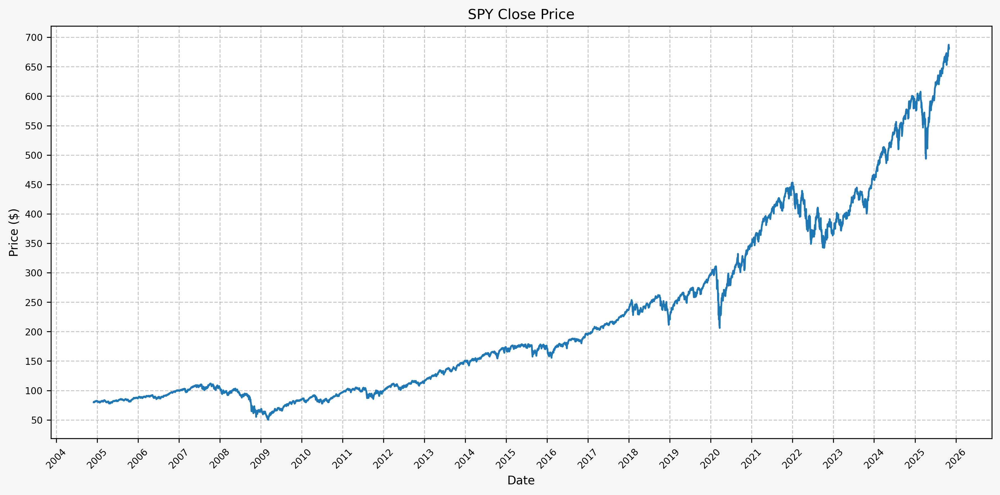

Next, we will calculate the performance for SPY based on the pre-defined Fed cycles:

```python
spy_cycle_df = calc_fed_cycle_asset_performance(
    fed_cycles=fed_cycles,
    cycle_labels=cycle_labels,
    fed_changes=fed_changes,
    monthly_df=spy_monthly,
)
```

Which gives us:

|    | Cycle    | Start      | End        |   Months |   CumulativeReturn |   CumulativeReturnPct |   AverageMonthlyReturn |   AverageMonthlyReturnPct |   AnnualizedReturn |   AnnualizedReturnPct |   Volatility |   FedFundsChange |   FedFundsChange_bps |   FFR_AnnualizedChange |   FFR_AnnualizedChange_bps | Label                              |
|---:|:---------|:-----------|:-----------|---------:|-------------------:|----------------------:|-----------------------:|--------------------------:|-------------------:|----------------------:|-------------:|-----------------:|---------------------:|-----------------------:|---------------------------:|:-----------------------------------|
|  0 | Cycle 1  | 2004-11-01 | 2006-07-01 |       20 |               0.11 |                 11.32 |                   0.01 |                      0.59 |               0.07 |                  6.64 |         0.08 |             0.03 |               331.00 |                   0.02 |                     198.60 | Cycle 1, 2004-11-01 to 2006-07-01  |
|  1 | Cycle 2  | 2006-07-01 | 2007-07-01 |       12 |               0.20 |                 20.36 |                   0.02 |                      1.57 |               0.20 |                 20.36 |         0.07 |             0.00 |                 2.00 |                   0.00 |                       2.00 | Cycle 2, 2006-07-01 to 2007-07-01  |
|  2 | Cycle 3  | 2007-07-01 | 2008-12-01 |       17 |              -0.39 |                -38.55 |                  -0.03 |                     -2.67 |              -0.29 |                -29.09 |         0.19 |            -0.05 |              -510.00 |                  -0.04 |                    -360.00 | Cycle 3, 2007-07-01 to 2008-12-01  |
|  3 | Cycle 4  | 2008-12-01 | 2015-11-01 |       83 |               1.67 |                167.34 |                   0.01 |                      1.28 |               0.15 |                 15.28 |         0.15 |            -0.00 |                -4.00 |                  -0.00 |                      -0.58 | Cycle 4, 2008-12-01 to 2015-11-01  |
|  4 | Cycle 5  | 2015-11-01 | 2019-01-01 |       38 |               0.28 |                 28.30 |                   0.01 |                      0.70 |               0.08 |                  8.19 |         0.11 |             0.02 |               228.00 |                   0.01 |                      72.00 | Cycle 5, 2015-11-01 to 2019-01-01  |
|  5 | Cycle 6  | 2019-01-01 | 2019-07-01 |        6 |               0.18 |                 18.33 |                   0.03 |                      2.95 |               0.40 |                 40.01 |         0.18 |             0.00 |                 0.00 |                   0.00 |                       0.00 | Cycle 6, 2019-01-01 to 2019-07-01  |
|  6 | Cycle 7  | 2019-07-01 | 2020-04-01 |        9 |              -0.11 |                -10.67 |                  -0.01 |                     -1.10 |              -0.14 |                -13.96 |         0.19 |            -0.02 |              -235.00 |                  -0.03 |                    -313.33 | Cycle 7, 2019-07-01 to 2020-04-01  |
|  7 | Cycle 8  | 2020-04-01 | 2022-02-01 |       22 |               0.79 |                 79.13 |                   0.03 |                      2.78 |               0.37 |                 37.43 |         0.16 |             0.00 |                 3.00 |                   0.00 |                       1.64 | Cycle 8, 2020-04-01 to 2022-02-01  |
|  8 | Cycle 9  | 2022-02-01 | 2023-08-01 |       18 |               0.04 |                  4.18 |                   0.00 |                      0.40 |               0.03 |                  2.77 |         0.21 |             0.05 |               525.00 |                   0.03 |                     350.00 | Cycle 9, 2022-02-01 to 2023-08-01  |
|  9 | Cycle 10 | 2023-08-01 | 2024-08-01 |       12 |               0.22 |                 22.00 |                   0.02 |                      1.75 |               0.22 |                 22.00 |         0.15 |             0.00 |                 0.00 |                   0.00 |                       0.00 | Cycle 10, 2023-08-01 to 2024-08-01 |
| 10 | Cycle 11 | 2024-08-01 | 2025-11-29 |       15 |               0.26 |                 25.72 |                   0.02 |                      1.59 |               0.20 |                 20.09 |         0.11 |            -0.01 |              -124.00 |                  -0.01 |                     -99.20 | Cycle 11, 2024-08-01 to 2025-11-29 |

This gives us the following data points:
* Cycle start date
* Cycle end date
* Number of months in the cycle
* Cumulative return during the cycle (decimal and percent)
* Average monthly return during the cycle (decimal and percent)
* Annualized return during the cycle (decimal and percent)
* Return volatility during the cycle
* Cumulative change in FFR during the cycle (decimal and basis points)
* Annualized change in FFR during the cycle (decimal and basis points)

From the above DataFrame, we can then plot the cumulative and annualized returns for each cycle in a bar chart. First, the cumulative returns:

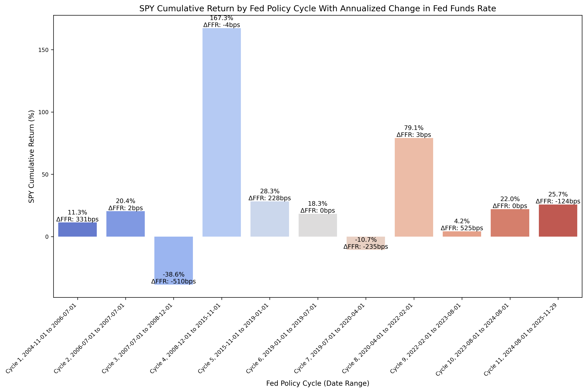

And then the annualized returns:

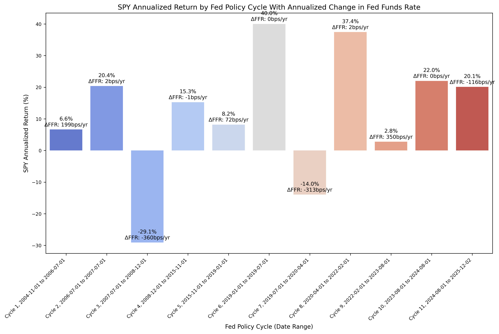

The cumulative returns plot is not particularly insightful, but there are some interesting observations to be gained from the annualized returns plot. During the past two (2) rate cutting cycles (cycles 3 and 7), the stocks have exhibited negative returns during the rate cutting cycle. However, after the rate cutting cycle was complete, the following returns were quite strong and higher than the historical mean return for the S&P 500. The economic intuition for this behavior is valid; as the economy weakens, the stock market falls, the returns become negative, and the Fed responds with cutting rates.

Finally, we can run an OLS regression to check fit:

```python
df = spy_cycle_df

####################################
### Don't modify below this line ###
####################################

# Run OLS regression with statsmodels
X = df["FFR_AnnualizedChange_bps"]
y = df["AnnualizedReturnPct"]
X = sm.add_constant(X)
model = sm.OLS(y, X).fit()
print(model.summary())
print(f"Intercept: {model.params[0]}, Slope: {model.params[1]}")  # Intercept and slope

# Calc X and Y values for regression line
X_vals = np.linspace(X.min(), X.max(), 100)
Y_vals = model.params[0] + model.params[1] * X_vals
```

Which gives us the results of the OLS regression:

```
                             OLS Regression Results                            
===============================================================================
Dep. Variable:     AnnualizedReturnPct   R-squared:                       0.184
Model:                             OLS   Adj. R-squared:                  0.093
Method:                  Least Squares   F-statistic:                     2.031
Date:                 Sat, 29 Nov 2025   Prob (F-statistic):              0.188
Time:                         17:34:15   Log-Likelihood:                -47.144
No. Observations:                   11   AIC:                             98.29
Df Residuals:                        9   BIC:                             99.08
Df Model:                            1                                         
Covariance Type:             nonrobust                                         
============================================================================================
                               coef    std err          t      P>|t|      [0.025      0.975]
--------------------------------------------------------------------------------------------
const                       12.3840      5.875      2.108      0.064      -0.907      25.675
FFR_AnnualizedChange_bps     0.0437      0.031      1.425      0.188      -0.026       0.113
==============================================================================
Omnibus:                        1.011   Durbin-Watson:                   3.089
Prob(Omnibus):                  0.603   Jarque-Bera (JB):                0.652
Skew:                           0.032   Prob(JB):                        0.722
Kurtosis:                       1.809   Cond. No.                         192.
==============================================================================

Notes:
[1] Standard Errors assume that the covariance matrix of the errors is correctly specified.
```

And then plot the regression line along with the values:

```python
plot_scatter_regression_ffr_vs_returns(
    cycle_df=spy_cycle_df,
    asset_label="SPY",
    index_num="02",
    x_vals=X_vals,
    y_vals=Y_vals,
    intercept=model.params[0],
    slope=model.params[1],
)
```

Which gives us:

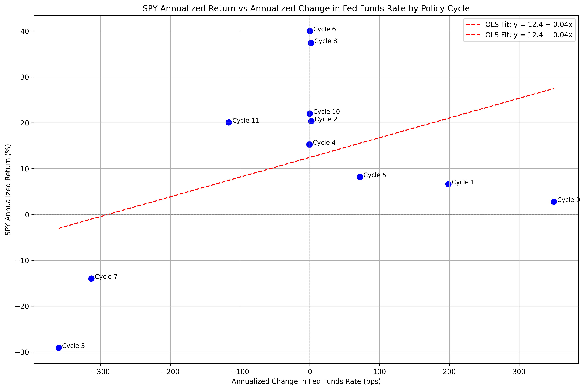

### Bonds (TLT)

Next, we'll run a similar process for long term bonds using TLT as the proxy.

First, we pull data with the following:

```python
# Set decimal places
pandas_set_decimal_places(2)

yf_pull_data(
    base_directory=DATA_DIR,
    ticker="TLT",
    source="Yahoo_Finance", 
    asset_class="Exchange_Traded_Funds", 
    excel_export=True,
    pickle_export=True,
    output_confirmation=True,
)
```

And then load data with the following:

```python
tlt = load_data(
    base_directory=DATA_DIR,
    ticker="TLT",
    source="Yahoo_Finance", 
    asset_class="Exchange_Traded_Funds",
    timeframe="Daily",
    file_format="pickle",
)

# Filter TLT to date range
tlt = tlt[(tlt.index >= pd.to_datetime(start_date)) & (tlt.index <= pd.to_datetime(end_date))]

# Resample to monthly frequency
tlt_monthly = tlt.resample("M").last()
tlt_monthly["Monthly_Return"] = tlt_monthly["Close"].pct_change()
```

Gives us the following:

```text
The columns, shape, and data types are:

<class 'pandas.core.frame.DataFrame'>
DatetimeIndex: 252 entries, 2004-11-30 to 2025-10-31
Freq: ME
Data columns (total 6 columns):
 #   Column          Non-Null Count  Dtype  
---  ------          --------------  -----  
 0   Close           252 non-null    float64
 1   High            252 non-null    float64
 2   Low             252 non-null    float64
 3   Open            252 non-null    float64
 4   Volume          252 non-null    int64  
 5   Monthly_Return  251 non-null    float64
dtypes: float64(5), int64(1)
memory usage: 13.8 KB

```

The first 5 rows are:

| Date                |   Close |   High |   Low |   Open |     Volume |   Monthly_Return |
|:--------------------|--------:|-------:|------:|-------:|-----------:|-----------------:|
| 2004-11-30 00:00:00 |   44.13 |  44.24 | 43.97 |  44.13 | 1754500.00 |           nan    |
| 2004-12-31 00:00:00 |   45.30 |  45.35 | 45.17 |  45.21 | 1056400.00 |             0.03 |
| 2005-01-31 00:00:00 |   46.92 |  46.94 | 46.70 |  46.72 | 1313900.00 |             0.04 |
| 2005-02-28 00:00:00 |   46.22 |  46.78 | 46.16 |  46.78 | 2797300.00 |            -0.01 |
| 2005-03-31 00:00:00 |   46.01 |  46.05 | 45.77 |  45.95 | 2410900.00 |            -0.00 |

The last 5 rows are:

| Date                |   Close |   High |   Low |   Open |      Volume |   Monthly_Return |
|:--------------------|--------:|-------:|------:|-------:|------------:|-----------------:|
| 2025-06-30 00:00:00 |   86.64 |  86.83 | 86.01 |  86.26 | 53695200.00 |             0.03 |
| 2025-07-31 00:00:00 |   85.65 |  86.14 | 85.57 |  85.86 | 49814100.00 |            -0.01 |
| 2025-08-31 00:00:00 |   85.66 |  85.92 | 85.51 |  85.82 | 41686400.00 |             0.00 |
| 2025-09-30 00:00:00 |   88.74 |  89.40 | 88.58 |  89.03 | 38584000.00 |             0.04 |
| 2025-10-31 00:00:00 |   89.96 |  90.33 | 89.88 |  90.23 | 38247300.00 |             0.01 |

Next, we can plot the price history before calculating the cycle performance:

```python
plot_price(
    price_df=tlt,
    plot_start_date=start_date,
    plot_end_date=end_date,
    plot_columns=["Close"],
    title="TLT Close Price",
    x_label="Date",
    x_format="Year",
    y_label="Price ($)",
    y_format="Decimal",
    y_format_decimal_places=0,
    y_tick_spacing=10,
    grid=True,
    legend=False,
    export_plot=True,
    plot_file_name="03_TLT_Price",
)
```

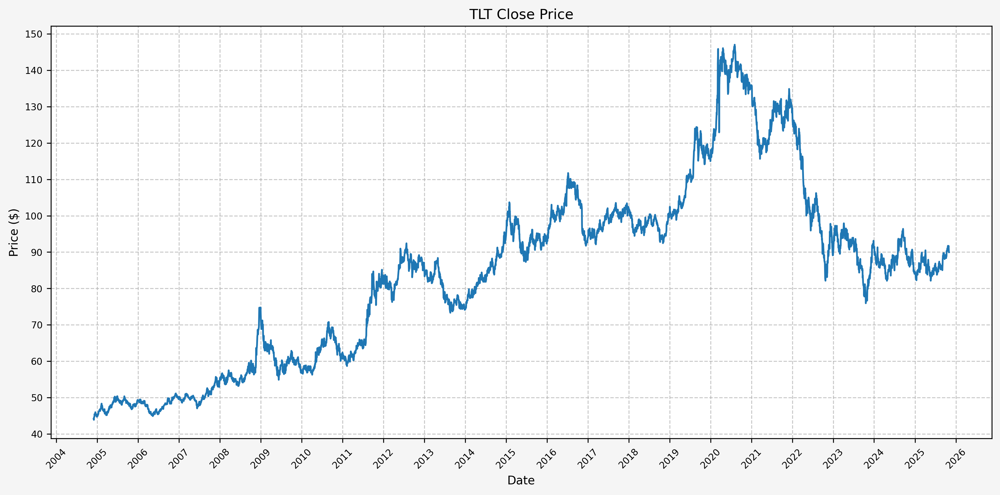

Next, we will calculate the performance for SPY based on the pre-defined Fed cycles:

```python
tlt_cycle_df = calc_fed_cycle_asset_performance(
    fed_cycles=fed_cycles,
    cycle_labels=cycle_labels,
    fed_changes=fed_changes,
    monthly_df=tlt_monthly,
)
```

Which gives us:

|    | Cycle    | Start      | End        |   Months |   CumulativeReturn |   CumulativeReturnPct |   AverageMonthlyReturn |   AverageMonthlyReturnPct |   AnnualizedReturn |   AnnualizedReturnPct |   Volatility |   FedFundsChange |   FedFundsChange_bps |   FFR_AnnualizedChange |   FFR_AnnualizedChange_bps | Label                              |
|---:|:---------|:-----------|:-----------|---------:|-------------------:|----------------------:|-----------------------:|--------------------------:|-------------------:|----------------------:|-------------:|-----------------:|---------------------:|-----------------------:|---------------------------:|:-----------------------------------|
|  0 | Cycle 1  | 2004-11-01 | 2006-07-01 |       20 |               0.04 |                  4.23 |                   0.00 |                      0.25 |               0.03 |                  2.51 |         0.09 |             0.03 |               331.00 |                   0.02 |                     198.60 | Cycle 1, 2004-11-01 to 2006-07-01  |
|  1 | Cycle 2  | 2006-07-01 | 2007-07-01 |       12 |               0.06 |                  5.76 |                   0.00 |                      0.49 |               0.06 |                  5.76 |         0.07 |             0.00 |                 2.00 |                   0.00 |                       2.00 | Cycle 2, 2006-07-01 to 2007-07-01  |
|  2 | Cycle 3  | 2007-07-01 | 2008-12-01 |       17 |               0.32 |                 32.42 |                   0.02 |                      1.73 |               0.22 |                 21.92 |         0.14 |            -0.05 |              -510.00 |                  -0.04 |                    -360.00 | Cycle 3, 2007-07-01 to 2008-12-01  |
|  3 | Cycle 4  | 2008-12-01 | 2015-11-01 |       83 |               0.46 |                 45.67 |                   0.01 |                      0.55 |               0.06 |                  5.59 |         0.15 |            -0.00 |                -4.00 |                  -0.00 |                      -0.58 | Cycle 4, 2008-12-01 to 2015-11-01  |
|  4 | Cycle 5  | 2015-11-01 | 2019-01-01 |       38 |               0.07 |                  7.42 |                   0.00 |                      0.23 |               0.02 |                  2.29 |         0.10 |             0.02 |               228.00 |                   0.01 |                      72.00 | Cycle 5, 2015-11-01 to 2019-01-01  |
|  5 | Cycle 6  | 2019-01-01 | 2019-07-01 |        6 |               0.10 |                 10.48 |                   0.02 |                      1.73 |               0.22 |                 22.05 |         0.13 |             0.00 |                 0.00 |                   0.00 |                       0.00 | Cycle 6, 2019-01-01 to 2019-07-01  |
|  6 | Cycle 7  | 2019-07-01 | 2020-04-01 |        9 |               0.26 |                 26.18 |                   0.03 |                      2.73 |               0.36 |                 36.34 |         0.18 |            -0.02 |              -235.00 |                  -0.03 |                    -313.33 | Cycle 7, 2019-07-01 to 2020-04-01  |
|  7 | Cycle 8  | 2020-04-01 | 2022-02-01 |       22 |              -0.11 |                -11.33 |                  -0.00 |                     -0.50 |              -0.06 |                 -6.35 |         0.11 |             0.00 |                 3.00 |                   0.00 |                       1.64 | Cycle 8, 2020-04-01 to 2022-02-01  |
|  8 | Cycle 9  | 2022-02-01 | 2023-08-01 |       18 |              -0.27 |                -26.96 |                  -0.02 |                     -1.62 |              -0.19 |                -18.90 |         0.17 |             0.05 |               525.00 |                   0.03 |                     350.00 | Cycle 9, 2022-02-01 to 2023-08-01  |
|  9 | Cycle 10 | 2023-08-01 | 2024-08-01 |       12 |              -0.02 |                 -1.52 |                   0.00 |                      0.02 |              -0.02 |                 -1.52 |         0.20 |             0.00 |                 0.00 |                   0.00 |                       0.00 | Cycle 10, 2023-08-01 to 2024-08-01 |
| 10 | Cycle 11 | 2024-08-01 | 2025-11-29 |       15 |               0.00 |                  0.42 |                   0.00 |                      0.08 |               0.00 |                  0.33 |         0.11 |            -0.01 |              -124.00 |                  -0.01 |                     -99.20 | Cycle 11, 2024-08-01 to 2025-11-29 |

This gives us the following data points:
* Cycle start date
* Cycle end date
* Number of months in the cycle
* Cumulative return during the cycle (decimal and percent)
* Average monthly return during the cycle (decimal and percent)
* Annualized return during the cycle (decimal and percent)
* Return volatility during the cycle
* Cumulative change in FFR during the cycle (decimal and basis points)
* Annualized change in FFR during the cycle (decimal and basis points)

From the above DataFrame, we can then plot the cumulative and annualized returns for each cycle in a bar chart. First, the cumulative returns:


And then the annualized returns:

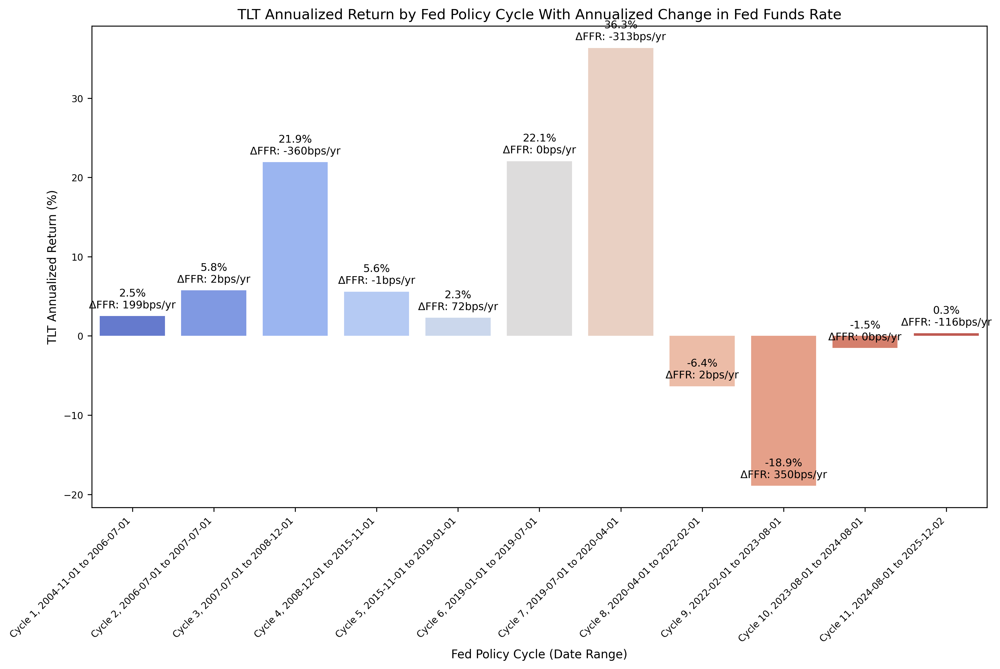

Let's focus our analysis on the plot comparing the annualized returns for TLT to the change in FFR. We can see that during cycles 3 and 7, the returns were very strong along with a rapid pace in cutting rates. During cycle 9, we see the opposite behavior, where as rates were increased the bond returns were very poor. The question for cycle 11, where bond returns have been essentially flat - is the pace of rate cuts not significant enough to benefit the bond market? Are there other factors at play that are influencing the long term bond returns? Keep in mind that we are also working with 20 year treasuries as well, but we could consider running analysis on investment grade or high yield corporate bonds.

Finally, we can run an OLS regression with the following code:

```python
df = tlt_cycle_df

####################################
### Don't modify below this line ###
####################################

# Run OLS regression with statsmodels
X = df["FFR_AnnualizedChange_bps"]
y = df["AnnualizedReturnPct"]
X = sm.add_constant(X)
model = sm.OLS(y, X).fit()
print(model.summary())
print(f"Intercept: {model.params[0]}, Slope: {model.params[1]}")  # Intercept and slope

# Calc X and Y values for regression line
X_vals = np.linspace(X.min(), X.max(), 100)
Y_vals = model.params[0] + model.params[1] * X_vals
```

Which gives us the results of the OLS regression:

```
                             OLS Regression Results                            
===============================================================================
Dep. Variable:     AnnualizedReturnPct   R-squared:                       0.634
Model:                             OLS   Adj. R-squared:                  0.593
Method:                  Least Squares   F-statistic:                     15.56
Date:                 Sat, 29 Nov 2025   Prob (F-statistic):            0.00338
Time:                         17:34:22   Log-Likelihood:                -39.515
No. Observations:                   11   AIC:                             83.03
Df Residuals:                        9   BIC:                             83.83
Df Model:                            1                                         
Covariance Type:             nonrobust                                         
============================================================================================
                               coef    std err          t      P>|t|      [0.025      0.975]
--------------------------------------------------------------------------------------------
const                        5.5490      2.937      1.890      0.091      -1.094      12.192
FFR_AnnualizedChange_bps    -0.0604      0.015     -3.944      0.003      -0.095      -0.026
==============================================================================
Omnibus:                        0.797   Durbin-Watson:                   1.248
Prob(Omnibus):                  0.671   Jarque-Bera (JB):                0.712
Skew:                           0.441   Prob(JB):                        0.701
Kurtosis:                       2.121   Cond. No.                         192.
==============================================================================

Notes:
[1] Standard Errors assume that the covariance matrix of the errors is correctly specified.
```

And then plot the regression line along with the values:

```python
plot_scatter_regression_ffr_vs_returns(
    cycle_df=tlt_cycle_df,
    asset_label="TLT",
    index_num="03",
    x_vals=X_vals,
    y_vals=Y_vals,
    intercept=model.params[0],
    slope=model.params[1],
)
```

Which gives us:

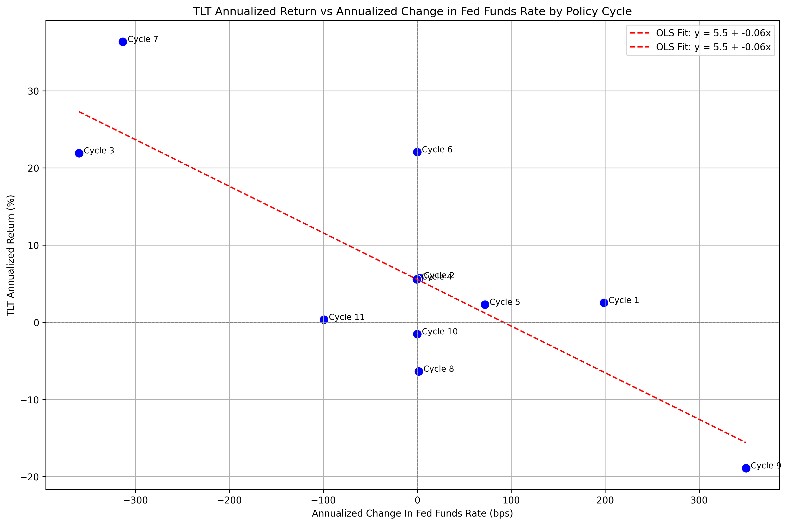

The above plot is intriguing because of how well the OLS regression appears to fit the data. It certainly appears that during rate-cutting cycles, bonds are an asset that performs well.

### Gold (GLD)

Lastly, we'll look at the returns on gold, using the GLD ETF as a proxy.

First, we pull data with the following:

```python
# Set decimal places
pandas_set_decimal_places(2)

yf_pull_data(
    base_directory=DATA_DIR,
    ticker="GLD",
    source="Yahoo_Finance", 
    asset_class="Exchange_Traded_Funds", 
    excel_export=True,
    pickle_export=True,
    output_confirmation=True,
)
```

And then load data with the following:

```python
gld = load_data(
    base_directory=DATA_DIR,
    ticker="GLD",
    source="Yahoo_Finance", 
    asset_class="Exchange_Traded_Funds",
    timeframe="Daily",
    file_format="pickle",
)

# Filter GLD to date range
gld = gld[(gld.index >= pd.to_datetime(start_date)) & (gld.index <= pd.to_datetime(end_date))]

# Resample to monthly frequency
gld_monthly = gld.resample("M").last()
gld_monthly["Monthly_Return"] = gld_monthly["Close"].pct_change()
```

Gives us the following:

```text
The columns, shape, and data types are:

<class 'pandas.core.frame.DataFrame'>
DatetimeIndex: 252 entries, 2004-11-30 to 2025-10-31
Freq: ME
Data columns (total 6 columns):
 #   Column          Non-Null Count  Dtype  
---  ------          --------------  -----  
 0   Close           252 non-null    float64
 1   High            252 non-null    float64
 2   Low             252 non-null    float64
 3   Open            252 non-null    float64
 4   Volume          252 non-null    int64  
 5   Monthly_Return  251 non-null    float64
dtypes: float64(5), int64(1)
memory usage: 13.8 KB

```

The first 5 rows are:

| Date                |   Close |   High |   Low |   Open |     Volume |   Monthly_Return |
|:--------------------|--------:|-------:|------:|-------:|-----------:|-----------------:|
| 2004-11-30 00:00:00 |   45.12 |  45.41 | 44.82 |  45.37 | 3857200.00 |           nan    |
| 2004-12-31 00:00:00 |   43.80 |  43.94 | 43.73 |  43.85 |  531600.00 |            -0.03 |
| 2005-01-31 00:00:00 |   42.22 |  42.30 | 41.96 |  42.21 | 1692400.00 |            -0.04 |
| 2005-02-28 00:00:00 |   43.53 |  43.74 | 43.52 |  43.68 |  755300.00 |             0.03 |
| 2005-03-31 00:00:00 |   42.82 |  42.87 | 42.70 |  42.87 | 1363200.00 |            -0.02 |

The last 5 rows are:

| Date                |   Close |   High |    Low |   Open |      Volume |   Monthly_Return |
|:--------------------|--------:|-------:|-------:|-------:|------------:|-----------------:|
| 2025-06-30 00:00:00 |  304.83 | 304.92 | 301.95 | 302.39 |  8192100.00 |             0.00 |
| 2025-07-31 00:00:00 |  302.96 | 304.61 | 302.86 | 304.59 |  8981000.00 |            -0.01 |
| 2025-08-31 00:00:00 |  318.07 | 318.09 | 314.64 | 314.72 | 15642600.00 |             0.05 |
| 2025-09-30 00:00:00 |  355.47 | 355.57 | 350.87 | 351.13 | 13312400.00 |             0.12 |
| 2025-10-31 00:00:00 |  368.12 | 370.66 | 365.50 | 370.47 | 11077900.00 |             0.04 |

Next, we can plot the price history before calculating the cycle performance:

```python
plot_price(
    price_df=gld,
    plot_start_date=start_date,
    plot_end_date=end_date,
    plot_columns=["Close"],
    title="GLD Close Price",
    x_label="Date",
    x_format="Year",
    y_label="Price ($)",
    y_format="Decimal",
    y_format_decimal_places=0,
    y_tick_spacing=25,
    grid=True,
    legend=False,
    export_plot=True,
    plot_file_name="04_GLD_Price",
)
```


Next, we will calculate the performance for SPY based on the pre-defined Fed cycles:

```python
gld_cycle_df = calc_fed_cycle_asset_performance(
    fed_cycles=fed_cycles,
    cycle_labels=cycle_labels,
    fed_changes=fed_changes,
    monthly_df=gld_monthly,
)
```

Which gives us:

|    | Cycle    | Start      | End        |   Months |   CumulativeReturn |   CumulativeReturnPct |   AverageMonthlyReturn |   AverageMonthlyReturnPct |   AnnualizedReturn |   AnnualizedReturnPct |   Volatility |   FedFundsChange |   FedFundsChange_bps |   FFR_AnnualizedChange |   FFR_AnnualizedChange_bps | Label                              |
|---:|:---------|:-----------|:-----------|---------:|-------------------:|----------------------:|-----------------------:|--------------------------:|-------------------:|----------------------:|-------------:|-----------------:|---------------------:|-----------------------:|---------------------------:|:-----------------------------------|
|  0 | Cycle 1  | 2004-11-01 | 2006-07-01 |       20 |               0.36 |                 35.70 |                   0.02 |                      1.73 |               0.20 |                 20.10 |         0.17 |             0.03 |               331.00 |                   0.02 |                     198.60 | Cycle 1, 2004-11-01 to 2006-07-01  |
|  1 | Cycle 2  | 2006-07-01 | 2007-07-01 |       12 |               0.05 |                  4.96 |                   0.00 |                      0.45 |               0.05 |                  4.96 |         0.11 |             0.00 |                 2.00 |                   0.00 |                       2.00 | Cycle 2, 2006-07-01 to 2007-07-01  |
|  2 | Cycle 3  | 2007-07-01 | 2008-12-01 |       17 |               0.25 |                 24.96 |                   0.02 |                      1.59 |               0.17 |                 17.03 |         0.26 |            -0.05 |              -510.00 |                  -0.04 |                    -360.00 | Cycle 3, 2007-07-01 to 2008-12-01  |
|  3 | Cycle 4  | 2008-12-01 | 2015-11-01 |       83 |               0.36 |                 36.10 |                   0.01 |                      0.51 |               0.05 |                  4.56 |         0.18 |            -0.00 |                -4.00 |                  -0.00 |                      -0.58 | Cycle 4, 2008-12-01 to 2015-11-01  |
|  4 | Cycle 5  | 2015-11-01 | 2019-01-01 |       38 |               0.11 |                 10.93 |                   0.00 |                      0.35 |               0.03 |                  3.33 |         0.14 |             0.02 |               228.00 |                   0.01 |                      72.00 | Cycle 5, 2015-11-01 to 2019-01-01  |
|  5 | Cycle 6  | 2019-01-01 | 2019-07-01 |        6 |               0.10 |                  9.86 |                   0.02 |                      1.63 |               0.21 |                 20.68 |         0.12 |             0.00 |                 0.00 |                   0.00 |                       0.00 | Cycle 6, 2019-01-01 to 2019-07-01  |
|  6 | Cycle 7  | 2019-07-01 | 2020-04-01 |        9 |               0.11 |                 11.15 |                   0.01 |                      1.24 |               0.15 |                 15.13 |         0.13 |            -0.02 |              -235.00 |                  -0.03 |                    -313.33 | Cycle 7, 2019-07-01 to 2020-04-01  |
|  7 | Cycle 8  | 2020-04-01 | 2022-02-01 |       22 |               0.14 |                 13.54 |                   0.01 |                      0.69 |               0.07 |                  7.17 |         0.16 |             0.00 |                 3.00 |                   0.00 |                       1.64 | Cycle 8, 2020-04-01 to 2022-02-01  |
|  8 | Cycle 9  | 2022-02-01 | 2023-08-01 |       18 |               0.08 |                  8.48 |                   0.01 |                      0.53 |               0.06 |                  5.58 |         0.14 |             0.05 |               525.00 |                   0.03 |                     350.00 | Cycle 9, 2022-02-01 to 2023-08-01  |
|  9 | Cycle 10 | 2023-08-01 | 2024-08-01 |       12 |               0.24 |                 24.24 |                   0.02 |                      1.89 |               0.24 |                 24.24 |         0.13 |             0.00 |                 0.00 |                   0.00 |                       0.00 | Cycle 10, 2023-08-01 to 2024-08-01 |
| 10 | Cycle 11 | 2024-08-01 | 2025-11-29 |       15 |               0.62 |                 62.49 |                   0.03 |                      3.36 |               0.47 |                 47.46 |         0.14 |            -0.01 |              -124.00 |                  -0.01 |                     -99.20 | Cycle 11, 2024-08-01 to 2025-11-29 |

This gives us the following data points:
* Cycle start date
* Cycle end date
* Number of months in the cycle
* Cumulative return during the cycle (decimal and percent)
* Average monthly return during the cycle (decimal and percent)
* Annualized return during the cycle (decimal and percent)
* Return volatility during the cycle
* Cumulative change in FFR during the cycle (decimal and basis points)
* Annualized change in FFR during the cycle (decimal and basis points)

From the above DataFrame, we can then plot the cumulative and annualized returns for each cycle in a bar chart. First, the cumulative returns:

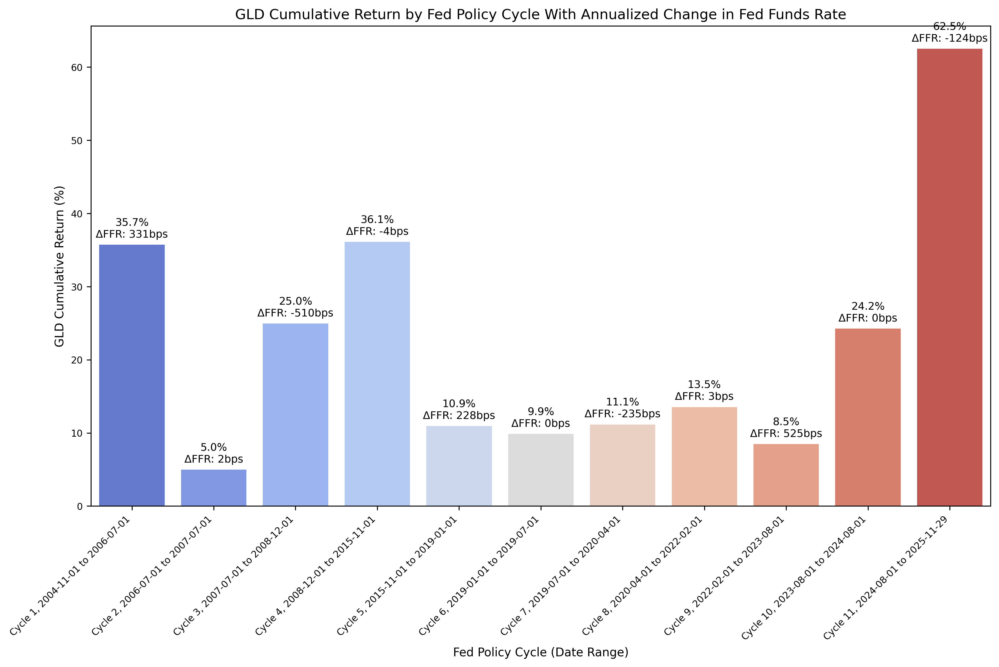

And then the annualized returns:

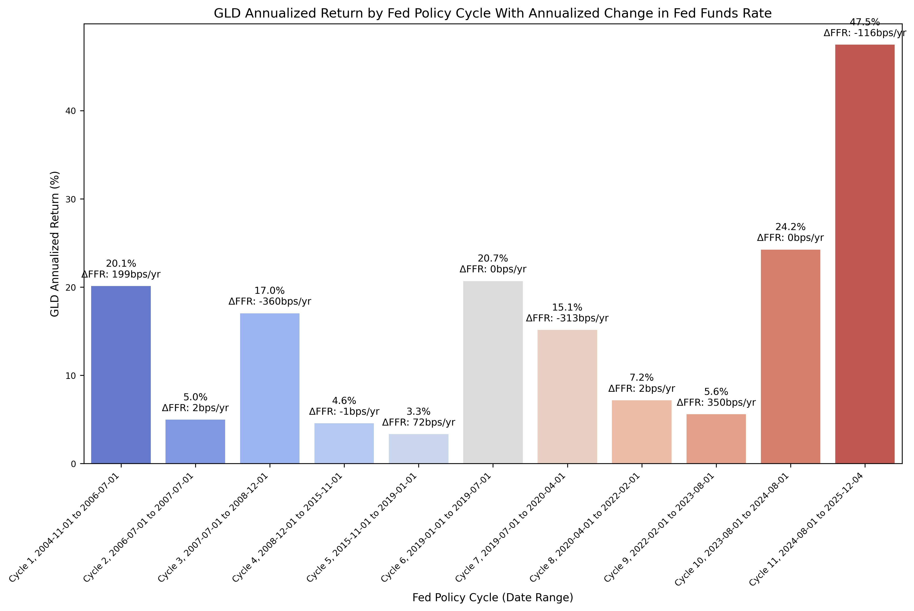

We see strong returns for gold across several different Fed cycles, so it is difficult to draw any kind of initial conclusion based on the bar charts.

Finally, we can run an OLS regression with the following code:

```python
df = gld_cycle_df

####################################
### Don't modify below this line ###
####################################

# Run OLS regression with statsmodels
X = df["FFR_AnnualizedChange_bps"]
y = df["AnnualizedReturnPct"]
X = sm.add_constant(X)
model = sm.OLS(y, X).fit()
print(model.summary())
print(f"Intercept: {model.params[0]}, Slope: {model.params[1]}")  # Intercept and slope

# Calc X and Y values for regression line
X_vals = np.linspace(X.min(), X.max(), 100)
Y_vals = model.params[0] + model.params[1] * X_vals
```

Which gives us the results of the OLS regression:

```
                             OLS Regression Results                            
===============================================================================
Dep. Variable:     AnnualizedReturnPct   R-squared:                       0.073
Model:                             OLS   Adj. R-squared:                 -0.030
Method:                  Least Squares   F-statistic:                    0.7118
Date:                 Sat, 29 Nov 2025   Prob (F-statistic):              0.421
Time:                         17:34:28   Log-Likelihood:                -42.895
No. Observations:                   11   AIC:                             89.79
Df Residuals:                        9   BIC:                             90.59
Df Model:                            1                                         
Covariance Type:             nonrobust                                         
============================================================================================
                               coef    std err          t      P>|t|      [0.025      0.975]
--------------------------------------------------------------------------------------------
const                       15.2394      3.993      3.817      0.004       6.207      24.272
FFR_AnnualizedChange_bps    -0.0176      0.021     -0.844      0.421      -0.065       0.030
==============================================================================
Omnibus:                        8.464   Durbin-Watson:                   0.918
Prob(Omnibus):                  0.015   Jarque-Bera (JB):                3.915
Skew:                           1.356   Prob(JB):                        0.141
Kurtosis:                       4.091   Cond. No.                         192.
==============================================================================

Notes:
[1] Standard Errors assume that the covariance matrix of the errors is correctly specified.
```

And then plot the regression line along with the values:

```python
plot_scatter_regression_ffr_vs_returns(
    cycle_df=gld_cycle_df,
    asset_label="GLD",
    index_num="04",
    x_vals=X_vals,
    y_vals=Y_vals,
    intercept=model.params[0],
    slope=model.params[1],
)
```

Which gives us:

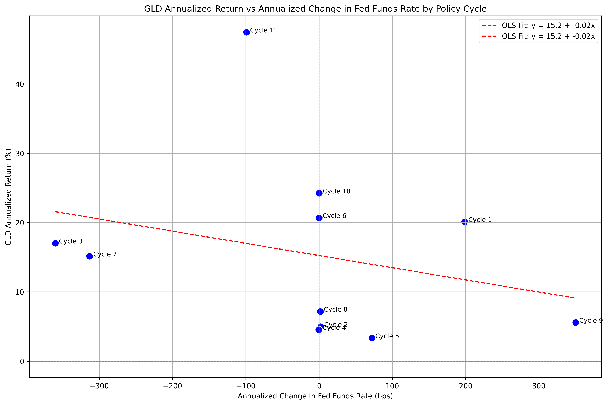

It's difficult to draw any strong conclusions with the above plot. Gold has traditionally been considered a hedge for inflation, and while one of the Fed's mandates is to manage inflation, there may not be a conclusion to draw in relationship to the historical returns that gold has exhibited.

## Hybrid Portfolio

With the above analysis (somewhat) complete, let's look at the optimal allocation for a portfolio based on the data and the hypythetical historical results.

Recall the plots for annualized returns vs annualized change in FFR for stocks, bonds, and gold:


### Asset Allocation

We have to be careful with our criteria for when to hold stocks, bonds, or gold, as hindsight bias is certainly possible. So, without overanalyzing the results, let's assume that we hold stocks as the default position, and then hold bonds when the Fed starts cutting rates, and then resume holding stocks when the Fed stops cutting rates. If there is not any change in FFR, then we still hold stocks. That gives us:

* Cycle 1: Stocks
* Cycle 2: Stocks
* Cycle 3: Bonds
* Cycle 4: Stocks
* Cycle 5: Stocks
* Cycle 6: Stocks
* Cycle 7: Bonds
* Cycle 8: Stocks
* Cycle 9: Stocks
* Cycle 10: Stocks
* Cycle 11: Bonds

We can then combine the return series based on the above with the following code:

```python
# Calculate cumulative returns and drawdown for SPY
spy_monthly['Cumulative_Return'] = (1 + spy_monthly['Monthly_Return']).cumprod() - 1
spy_monthly['Cumulative_Return_Plus_One'] = 1 + spy_monthly['Cumulative_Return']
spy_monthly['Rolling_Max'] = spy_monthly['Cumulative_Return_Plus_One'].cummax()
spy_monthly['Drawdown'] = spy_monthly['Cumulative_Return_Plus_One'] / spy_monthly['Rolling_Max'] - 1
spy_monthly.drop(columns=['Cumulative_Return_Plus_One', 'Rolling_Max'], inplace=True)

# Calculate cumulative returns and drawdown for TLT
tlt_monthly['Cumulative_Return'] = (1 + tlt_monthly['Monthly_Return']).cumprod() - 1
tlt_monthly['Cumulative_Return_Plus_One'] = 1 + tlt_monthly['Cumulative_Return']
tlt_monthly['Rolling_Max'] = tlt_monthly['Cumulative_Return_Plus_One'].cummax()
tlt_monthly['Drawdown'] = tlt_monthly['Cumulative_Return_Plus_One'] / tlt_monthly['Rolling_Max'] - 1
tlt_monthly.drop(columns=['Cumulative_Return_Plus_One', 'Rolling_Max'], inplace=True)

# Isolate the returns for SPY and TLT
spy_ret = spy_monthly['Monthly_Return']
tlt_ret = tlt_monthly['Monthly_Return']

# Create a blended portfolio based on Fed policy cycles
portfolio = (
    spy_ret[spy_ret.index <= "2007-07-01"]
    .combine_first(tlt_ret[(tlt_ret.index >= "2007-07-01") & (tlt_ret.index <= "2008-12-01")])
    .combine_first(spy_ret[(spy_ret.index > "2008-12-01") & (spy_ret.index <= "2019-07-01")])
    .combine_first(tlt_ret[(tlt_ret.index >= "2019-07-01") & (tlt_ret.index <= "2020-04-01")])
    .combine_first(spy_ret[(spy_ret.index > "2020-04-01") & (spy_ret.index <= "2024-08-01")])
    .combine_first(tlt_ret[tlt_ret.index > "2024-08-01"])
)

# Convert to DataFrame
portfolio_monthly = portfolio.to_frame(name="Portfolio_Monthly_Return")

# Calculate cumulative returns and drawdown for the portfolio
portfolio_monthly['Portfolio_Cumulative_Return'] = (1 + portfolio_monthly['Portfolio_Monthly_Return']).cumprod() - 1
portfolio_monthly['Portfolio_Cumulative_Return_Plus_One'] = 1 + portfolio_monthly['Portfolio_Cumulative_Return']
portfolio_monthly['Portfolio_Rolling_Max'] = portfolio_monthly['Portfolio_Cumulative_Return_Plus_One'].cummax()
portfolio_monthly['Portfolio_Drawdown'] = portfolio_monthly['Portfolio_Cumulative_Return_Plus_One'] / portfolio_monthly['Portfolio_Rolling_Max'] - 1
portfolio_monthly.drop(columns=['Portfolio_Cumulative_Return_Plus_One', 'Portfolio_Rolling_Max'], inplace=True)

# Merge "spy_monthly" and "tlt_monthly" into "portfolio_monthly" to compare cumulative returns
portfolio_monthly = portfolio_monthly.join(
    spy_monthly['Monthly_Return'].rename('SPY_Monthly_Return'),
    how='left'
).join(
    spy_monthly['Cumulative_Return'].rename('SPY_Cumulative_Return'),
    how='left'
).join(
    spy_monthly['Drawdown'].rename('SPY_Drawdown'),
    how='left'
).join(
    tlt_monthly['Monthly_Return'].rename('TLT_Monthly_Return'),
    how='left'
).join(
    tlt_monthly['Cumulative_Return'].rename('TLT_Cumulative_Return'),
    how='left'
).join(
    tlt_monthly['Drawdown'].rename('TLT_Drawdown'),
    how='left'
)
```

Which gives us:

| Date                |   Portfolio_Monthly_Return |   Portfolio_Cumulative_Return |   Portfolio_Drawdown |   SPY_Monthly_Return |   SPY_Cumulative_Return |   SPY_Drawdown |   TLT_Monthly_Return |   TLT_Cumulative_Return |   TLT_Drawdown |
|:--------------------|---------------------------:|------------------------------:|---------------------:|---------------------:|------------------------:|---------------:|---------------------:|------------------------:|---------------:|
| 2004-11-30 00:00:00 |                    nan     |                       nan     |              nan     |              nan     |                 nan     |        nan     |              nan     |                 nan     |        nan     |
| 2004-12-31 00:00:00 |                      0.030 |                         0.030 |                0.000 |                0.030 |                   0.030 |          0.000 |                0.027 |                   0.027 |          0.000 |
| 2005-01-31 00:00:00 |                     -0.022 |                         0.007 |               -0.022 |               -0.022 |                   0.007 |         -0.022 |                0.036 |                   0.063 |          0.000 |
| 2005-02-28 00:00:00 |                      0.021 |                         0.028 |               -0.002 |                0.021 |                   0.028 |         -0.002 |               -0.015 |                   0.048 |         -0.015 |
| 2005-03-31 00:00:00 |                     -0.018 |                         0.009 |               -0.020 |               -0.018 |                   0.009 |         -0.020 |               -0.005 |                   0.043 |         -0.019 |
| 2005-04-30 00:00:00 |                     -0.019 |                        -0.010 |               -0.039 |               -0.019 |                  -0.010 |         -0.039 |                0.039 |                   0.083 |          0.000 |
| 2005-05-31 00:00:00 |                      0.032 |                         0.022 |               -0.008 |                0.032 |                   0.022 |         -0.008 |                0.031 |                   0.117 |          0.000 |
| 2005-06-30 00:00:00 |                      0.002 |                         0.024 |               -0.006 |                0.002 |                   0.024 |         -0.006 |                0.022 |                   0.141 |          0.000 |
| 2005-07-31 00:00:00 |                      0.038 |                         0.063 |                0.000 |                0.038 |                   0.063 |          0.000 |               -0.034 |                   0.103 |         -0.034 |
| 2005-08-31 00:00:00 |                     -0.009 |                         0.053 |               -0.009 |               -0.009 |                   0.053 |         -0.009 |                0.035 |                   0.141 |         -0.000 |
| 2005-09-30 00:00:00 |                      0.008 |                         0.061 |               -0.001 |                0.008 |                   0.061 |         -0.001 |               -0.036 |                   0.100 |         -0.036 |
| 2005-10-31 00:00:00 |                     -0.024 |                         0.036 |               -0.025 |               -0.024 |                   0.036 |         -0.025 |               -0.022 |                   0.075 |         -0.058 |
| 2005-11-30 00:00:00 |                      0.044 |                         0.082 |                0.000 |                0.044 |                   0.082 |          0.000 |                0.007 |                   0.083 |         -0.051 |
| 2005-12-31 00:00:00 |                     -0.002 |                         0.080 |               -0.002 |               -0.002 |                   0.080 |         -0.002 |                0.030 |                   0.115 |         -0.023 |
| 2006-01-31 00:00:00 |                      0.024 |                         0.106 |                0.000 |                0.024 |                   0.106 |          0.000 |               -0.013 |                   0.100 |         -0.036 |
| 2006-02-28 00:00:00 |                      0.006 |                         0.112 |                0.000 |                0.006 |                   0.112 |          0.000 |                0.011 |                   0.112 |         -0.026 |
| 2006-03-31 00:00:00 |                      0.017 |                         0.130 |                0.000 |                0.017 |                   0.130 |          0.000 |               -0.046 |                   0.061 |         -0.070 |
| 2006-04-30 00:00:00 |                      0.013 |                         0.145 |                0.000 |                0.013 |                   0.145 |          0.000 |               -0.028 |                   0.032 |         -0.096 |
| 2006-05-31 00:00:00 |                     -0.030 |                         0.110 |               -0.030 |               -0.030 |                   0.110 |         -0.030 |               -0.002 |                   0.030 |         -0.097 |
| 2006-06-30 00:00:00 |                      0.003 |                         0.113 |               -0.028 |                0.003 |                   0.113 |         -0.028 |                0.012 |                   0.042 |         -0.087 |
| 2006-07-31 00:00:00 |                      0.004 |                         0.118 |               -0.023 |                0.004 |                   0.118 |         -0.023 |                0.022 |                   0.065 |         -0.067 |
| 2006-08-31 00:00:00 |                      0.022 |                         0.143 |               -0.002 |                0.022 |                   0.143 |         -0.002 |                0.031 |                   0.097 |         -0.038 |
| 2006-09-30 00:00:00 |                      0.027 |                         0.173 |                0.000 |                0.027 |                   0.173 |          0.000 |                0.019 |                   0.118 |         -0.020 |
| 2006-10-31 00:00:00 |                      0.032 |                         0.210 |                0.000 |                0.032 |                   0.210 |          0.000 |                0.008 |                   0.128 |         -0.012 |
| 2006-11-30 00:00:00 |                      0.020 |                         0.234 |                0.000 |                0.020 |                   0.234 |          0.000 |                0.023 |                   0.154 |          0.000 |
| 2006-12-31 00:00:00 |                      0.013 |                         0.251 |                0.000 |                0.013 |                   0.251 |          0.000 |               -0.027 |                   0.123 |         -0.027 |
| 2007-01-31 00:00:00 |                      0.015 |                         0.270 |                0.000 |                0.015 |                   0.270 |          0.000 |               -0.010 |                   0.112 |         -0.037 |
| 2007-02-28 00:00:00 |                     -0.020 |                         0.245 |               -0.020 |               -0.020 |                   0.245 |         -0.020 |                0.034 |                   0.149 |         -0.004 |
| 2007-03-31 00:00:00 |                      0.012 |                         0.259 |               -0.008 |                0.012 |                   0.259 |         -0.008 |               -0.017 |                   0.130 |         -0.021 |
| 2007-04-30 00:00:00 |                      0.044 |                         0.315 |                0.000 |                0.044 |                   0.315 |          0.000 |                0.009 |                   0.140 |         -0.012 |
| 2007-05-31 00:00:00 |                      0.034 |                         0.360 |                0.000 |                0.034 |                   0.360 |          0.000 |               -0.023 |                   0.114 |         -0.035 |
| 2007-06-30 00:00:00 |                     -0.015 |                         0.340 |               -0.015 |               -0.015 |                   0.340 |         -0.015 |               -0.010 |                   0.102 |         -0.045 |
| 2007-07-31 00:00:00 |                      0.033 |                         0.384 |                0.000 |               -0.031 |                   0.298 |         -0.045 |                0.033 |                   0.139 |         -0.013 |
| 2007-08-31 00:00:00 |                      0.018 |                         0.409 |                0.000 |                0.013 |                   0.315 |         -0.033 |                0.018 |                   0.159 |          0.000 |
| 2007-09-30 00:00:00 |                      0.002 |                         0.412 |                0.000 |                0.039 |                   0.365 |          0.000 |                0.002 |                   0.162 |          0.000 |
| 2007-10-31 00:00:00 |                      0.018 |                         0.438 |                0.000 |                0.014 |                   0.384 |          0.000 |                0.018 |                   0.183 |          0.000 |
| 2007-11-30 00:00:00 |                      0.054 |                         0.515 |                0.000 |               -0.039 |                   0.330 |         -0.039 |                0.054 |                   0.246 |          0.000 |
| 2007-12-31 00:00:00 |                     -0.006 |                         0.505 |               -0.006 |               -0.011 |                   0.315 |         -0.050 |               -0.006 |                   0.238 |         -0.006 |
| 2008-01-31 00:00:00 |                      0.021 |                         0.537 |                0.000 |               -0.060 |                   0.236 |         -0.107 |                0.021 |                   0.264 |          0.000 |
| 2008-02-29 00:00:00 |                     -0.005 |                         0.530 |               -0.005 |               -0.026 |                   0.204 |         -0.130 |               -0.005 |                   0.259 |         -0.005 |
| 2008-03-31 00:00:00 |                      0.021 |                         0.563 |                0.000 |               -0.009 |                   0.193 |         -0.138 |                0.021 |                   0.286 |          0.000 |
| 2008-04-30 00:00:00 |                     -0.025 |                         0.524 |               -0.025 |                0.048 |                   0.250 |         -0.097 |               -0.025 |                   0.254 |         -0.025 |
| 2008-05-31 00:00:00 |                     -0.027 |                         0.483 |               -0.051 |                0.015 |                   0.269 |         -0.083 |               -0.027 |                   0.220 |         -0.051 |
| 2008-06-30 00:00:00 |                      0.027 |                         0.522 |               -0.026 |               -0.084 |                   0.163 |         -0.160 |                0.027 |                   0.252 |         -0.026 |
| 2008-07-31 00:00:00 |                     -0.004 |                         0.517 |               -0.029 |               -0.009 |                   0.152 |         -0.167 |               -0.004 |                   0.248 |         -0.029 |
| 2008-08-31 00:00:00 |                      0.027 |                         0.558 |               -0.003 |                0.015 |                   0.170 |         -0.154 |                0.027 |                   0.282 |         -0.003 |
| 2008-09-30 00:00:00 |                      0.015 |                         0.581 |                0.000 |               -0.094 |                   0.060 |         -0.234 |                0.015 |                   0.301 |          0.000 |
| 2008-10-31 00:00:00 |                     -0.019 |                         0.552 |               -0.019 |               -0.165 |                  -0.115 |         -0.361 |               -0.019 |                   0.277 |         -0.019 |
| 2008-11-30 00:00:00 |                      0.143 |                         0.774 |                0.000 |               -0.070 |                  -0.177 |         -0.405 |                0.143 |                   0.460 |          0.000 |
| 2008-12-31 00:00:00 |                      0.010 |                         0.792 |                0.000 |                0.010 |                  -0.169 |         -0.399 |                0.137 |                   0.659 |          0.000 |
| 2009-01-31 00:00:00 |                     -0.082 |                         0.644 |               -0.082 |               -0.082 |                  -0.237 |         -0.449 |               -0.131 |                   0.442 |         -0.131 |
| 2009-02-28 00:00:00 |                     -0.107 |                         0.468 |               -0.181 |               -0.107 |                  -0.319 |         -0.508 |               -0.015 |                   0.420 |         -0.144 |
| 2009-03-31 00:00:00 |                      0.083 |                         0.590 |               -0.112 |                0.083 |                  -0.262 |         -0.467 |                0.040 |                   0.477 |         -0.109 |
| 2009-04-30 00:00:00 |                      0.099 |                         0.748 |               -0.024 |                0.099 |                  -0.189 |         -0.414 |               -0.070 |                   0.375 |         -0.171 |
| 2009-05-31 00:00:00 |                      0.058 |                         0.850 |                0.000 |                0.058 |                  -0.141 |         -0.380 |               -0.037 |                   0.324 |         -0.202 |
| 2009-06-30 00:00:00 |                     -0.001 |                         0.849 |               -0.001 |               -0.001 |                  -0.142 |         -0.380 |                0.008 |                   0.334 |         -0.196 |
| 2009-07-31 00:00:00 |                      0.075 |                         0.987 |                0.000 |                0.075 |                  -0.078 |         -0.334 |                0.006 |                   0.342 |         -0.191 |
| 2009-08-31 00:00:00 |                      0.037 |                         1.060 |                0.000 |                0.037 |                  -0.044 |         -0.309 |                0.022 |                   0.372 |         -0.173 |
| 2009-09-30 00:00:00 |                      0.035 |                         1.133 |                0.000 |                0.035 |                  -0.010 |         -0.285 |                0.025 |                   0.405 |         -0.153 |
| 2009-10-31 00:00:00 |                     -0.019 |                         1.092 |               -0.019 |               -0.019 |                  -0.029 |         -0.298 |               -0.026 |                   0.368 |         -0.175 |
| 2009-11-30 00:00:00 |                      0.062 |                         1.221 |                0.000 |                0.062 |                   0.031 |         -0.255 |                0.012 |                   0.385 |         -0.165 |
| 2009-12-31 00:00:00 |                      0.019 |                         1.264 |                0.000 |                0.019 |                   0.050 |         -0.241 |               -0.063 |                   0.297 |         -0.218 |
| 2010-01-31 00:00:00 |                     -0.036 |                         1.181 |               -0.036 |               -0.036 |                   0.012 |         -0.269 |                0.027 |                   0.332 |         -0.197 |
| 2010-02-28 00:00:00 |                      0.031 |                         1.249 |               -0.006 |                0.031 |                   0.044 |         -0.246 |               -0.003 |                   0.328 |         -0.200 |
| 2010-03-31 00:00:00 |                      0.061 |                         1.386 |                0.000 |                0.061 |                   0.107 |         -0.200 |               -0.021 |                   0.300 |         -0.216 |
| 2010-04-30 00:00:00 |                      0.015 |                         1.423 |                0.000 |                0.015 |                   0.125 |         -0.187 |                0.033 |                   0.343 |         -0.190 |
| 2010-05-31 00:00:00 |                     -0.079 |                         1.231 |               -0.079 |               -0.079 |                   0.035 |         -0.252 |                0.051 |                   0.412 |         -0.149 |
| 2010-06-30 00:00:00 |                     -0.052 |                         1.115 |               -0.127 |               -0.052 |                  -0.018 |         -0.291 |                0.058 |                   0.494 |         -0.099 |
| 2010-07-31 00:00:00 |                      0.068 |                         1.260 |               -0.067 |                0.068 |                   0.049 |         -0.242 |               -0.009 |                   0.480 |         -0.108 |
| 2010-08-31 00:00:00 |                     -0.045 |                         1.158 |               -0.109 |               -0.045 |                   0.001 |         -0.276 |                0.084 |                   0.604 |         -0.033 |
| 2010-09-30 00:00:00 |                      0.090 |                         1.351 |               -0.030 |                0.090 |                   0.091 |         -0.212 |               -0.025 |                   0.564 |         -0.058 |
| 2010-10-31 00:00:00 |                      0.038 |                         1.441 |                0.000 |                0.038 |                   0.133 |         -0.181 |               -0.045 |                   0.494 |         -0.100 |
| 2010-11-30 00:00:00 |                      0.000 |                         1.441 |                0.000 |                0.000 |                   0.133 |         -0.181 |               -0.017 |                   0.468 |         -0.115 |
| 2010-12-31 00:00:00 |                      0.067 |                         1.604 |                0.000 |                0.067 |                   0.209 |         -0.127 |               -0.037 |                   0.414 |         -0.148 |
| 2011-01-31 00:00:00 |                      0.023 |                         1.665 |                0.000 |                0.023 |                   0.237 |         -0.106 |               -0.031 |                   0.371 |         -0.174 |
| 2011-02-28 00:00:00 |                      0.035 |                         1.758 |                0.000 |                0.035 |                   0.280 |         -0.075 |                0.017 |                   0.393 |         -0.160 |
| 2011-03-31 00:00:00 |                      0.000 |                         1.758 |                0.000 |                0.000 |                   0.280 |         -0.075 |                0.000 |                   0.394 |         -0.160 |
| 2011-04-30 00:00:00 |                      0.029 |                         1.838 |                0.000 |                0.029 |                   0.317 |         -0.048 |                0.023 |                   0.426 |         -0.140 |
| 2011-05-31 00:00:00 |                     -0.011 |                         1.806 |               -0.011 |               -0.011 |                   0.302 |         -0.059 |                0.034 |                   0.475 |         -0.111 |
| 2011-06-30 00:00:00 |                     -0.017 |                         1.759 |               -0.028 |               -0.017 |                   0.280 |         -0.075 |               -0.023 |                   0.441 |         -0.132 |
| 2011-07-31 00:00:00 |                     -0.020 |                         1.704 |               -0.047 |               -0.020 |                   0.255 |         -0.093 |                0.044 |                   0.504 |         -0.093 |
| 2011-08-31 00:00:00 |                     -0.055 |                         1.555 |               -0.100 |               -0.055 |                   0.186 |         -0.143 |                0.097 |                   0.650 |         -0.006 |
| 2011-09-30 00:00:00 |                     -0.069 |                         1.378 |               -0.162 |               -0.069 |                   0.103 |         -0.203 |                0.132 |                   0.868 |          0.000 |
| 2011-10-31 00:00:00 |                      0.109 |                         1.637 |               -0.071 |                0.109 |                   0.224 |         -0.116 |               -0.038 |                   0.796 |         -0.038 |
| 2011-11-30 00:00:00 |                     -0.004 |                         1.626 |               -0.075 |               -0.004 |                   0.219 |         -0.119 |                0.020 |                   0.832 |         -0.019 |
| 2011-12-31 00:00:00 |                      0.010 |                         1.654 |               -0.065 |                0.010 |                   0.231 |         -0.110 |                0.034 |                   0.895 |          0.000 |
| 2012-01-31 00:00:00 |                      0.046 |                         1.777 |               -0.022 |                0.046 |                   0.289 |         -0.069 |               -0.003 |                   0.889 |         -0.003 |
| 2012-02-29 00:00:00 |                      0.043 |                         1.897 |                0.000 |                0.043 |                   0.345 |         -0.028 |               -0.026 |                   0.840 |         -0.029 |
| 2012-03-31 00:00:00 |                      0.032 |                         1.991 |                0.000 |                0.032 |                   0.388 |          0.000 |               -0.042 |                   0.762 |         -0.070 |
| 2012-04-30 00:00:00 |                     -0.007 |                         1.971 |               -0.007 |               -0.007 |                   0.379 |         -0.007 |                0.048 |                   0.847 |         -0.025 |
| 2012-05-31 00:00:00 |                     -0.060 |                         1.792 |               -0.066 |               -0.060 |                   0.296 |         -0.066 |                0.090 |                   1.014 |          0.000 |
| 2012-06-30 00:00:00 |                      0.041 |                         1.906 |               -0.028 |                0.041 |                   0.348 |         -0.028 |               -0.017 |                   0.980 |         -0.017 |
| 2012-07-31 00:00:00 |                      0.012 |                         1.940 |               -0.017 |                0.012 |                   0.364 |         -0.017 |                0.038 |                   1.055 |          0.000 |
| 2012-08-31 00:00:00 |                      0.025 |                         2.014 |                0.000 |                0.025 |                   0.398 |          0.000 |               -0.013 |                   1.028 |         -0.013 |
| 2012-09-30 00:00:00 |                      0.025 |                         2.090 |                0.000 |                0.025 |                   0.434 |          0.000 |               -0.025 |                   0.977 |         -0.038 |
| 2012-10-31 00:00:00 |                     -0.018 |                         2.034 |               -0.018 |               -0.018 |                   0.408 |         -0.018 |               -0.005 |                   0.967 |         -0.043 |
| 2012-11-30 00:00:00 |                      0.006 |                         2.051 |               -0.013 |                0.006 |                   0.416 |         -0.013 |                0.012 |                   0.990 |         -0.032 |
| 2012-12-31 00:00:00 |                      0.009 |                         2.078 |               -0.004 |                0.009 |                   0.428 |         -0.004 |               -0.025 |                   0.941 |         -0.056 |
| 2013-01-31 00:00:00 |                      0.051 |                         2.236 |                0.000 |                0.051 |                   0.502 |          0.000 |               -0.032 |                   0.879 |         -0.086 |
| 2013-02-28 00:00:00 |                      0.013 |                         2.277 |                0.000 |                0.013 |                   0.521 |          0.000 |                0.012 |                   0.902 |         -0.075 |
| 2013-03-31 00:00:00 |                      0.038 |                         2.402 |                0.000 |                0.038 |                   0.578 |          0.000 |               -0.004 |                   0.894 |         -0.078 |
| 2013-04-30 00:00:00 |                      0.019 |                         2.467 |                0.000 |                0.019 |                   0.609 |          0.000 |                0.047 |                   0.983 |         -0.035 |
| 2013-05-31 00:00:00 |                      0.024 |                         2.549 |                0.000 |                0.024 |                   0.647 |          0.000 |               -0.068 |                   0.849 |         -0.101 |
| 2013-06-30 00:00:00 |                     -0.013 |                         2.501 |               -0.013 |               -0.013 |                   0.625 |         -0.013 |               -0.033 |                   0.788 |         -0.130 |
| 2013-07-31 00:00:00 |                      0.052 |                         2.682 |                0.000 |                0.052 |                   0.709 |          0.000 |               -0.023 |                   0.748 |         -0.150 |
| 2013-08-31 00:00:00 |                     -0.030 |                         2.572 |               -0.030 |               -0.030 |                   0.657 |         -0.030 |               -0.013 |                   0.724 |         -0.161 |
| 2013-09-30 00:00:00 |                      0.032 |                         2.685 |                0.000 |                0.032 |                   0.710 |          0.000 |                0.007 |                   0.736 |         -0.156 |
| 2013-10-31 00:00:00 |                      0.046 |                         2.856 |                0.000 |                0.046 |                   0.789 |          0.000 |                0.014 |                   0.760 |         -0.143 |
| 2013-11-30 00:00:00 |                      0.030 |                         2.970 |                0.000 |                0.030 |                   0.842 |          0.000 |               -0.027 |                   0.713 |         -0.167 |
| 2013-12-31 00:00:00 |                      0.026 |                         3.073 |                0.000 |                0.026 |                   0.890 |          0.000 |               -0.019 |                   0.681 |         -0.182 |
| 2014-01-31 00:00:00 |                     -0.035 |                         2.929 |               -0.035 |               -0.035 |                   0.823 |         -0.035 |                0.063 |                   0.787 |         -0.131 |
| 2014-02-28 00:00:00 |                      0.046 |                         3.108 |                0.000 |                0.046 |                   0.906 |          0.000 |                0.005 |                   0.796 |         -0.126 |
| 2014-03-31 00:00:00 |                      0.008 |                         3.142 |                0.000 |                0.008 |                   0.922 |          0.000 |                0.007 |                   0.809 |         -0.120 |
| 2014-04-30 00:00:00 |                      0.007 |                         3.171 |                0.000 |                0.007 |                   0.935 |          0.000 |                0.021 |                   0.847 |         -0.101 |
| 2014-05-31 00:00:00 |                      0.023 |                         3.268 |                0.000 |                0.023 |                   0.980 |          0.000 |                0.029 |                   0.902 |         -0.075 |
| 2014-06-30 00:00:00 |                      0.021 |                         3.356 |                0.000 |                0.021 |                   1.021 |          0.000 |               -0.003 |                   0.897 |         -0.077 |
| 2014-07-31 00:00:00 |                     -0.013 |                         3.297 |               -0.013 |               -0.013 |                   0.994 |         -0.013 |                0.007 |                   0.910 |         -0.071 |
| 2014-08-31 00:00:00 |                      0.039 |                         3.467 |                0.000 |                0.039 |                   1.073 |          0.000 |                0.047 |                   1.000 |         -0.027 |
| 2014-09-30 00:00:00 |                     -0.014 |                         3.405 |               -0.014 |               -0.014 |                   1.044 |         -0.014 |               -0.021 |                   0.958 |         -0.048 |
| 2014-10-31 00:00:00 |                      0.024 |                         3.509 |                0.000 |                0.024 |                   1.092 |          0.000 |                0.028 |                   1.013 |         -0.021 |
| 2014-11-30 00:00:00 |                      0.027 |                         3.633 |                0.000 |                0.027 |                   1.150 |          0.000 |                0.030 |                   1.072 |          0.000 |
| 2014-12-31 00:00:00 |                     -0.003 |                         3.621 |               -0.003 |               -0.003 |                   1.144 |         -0.003 |                0.033 |                   1.140 |          0.000 |
| 2015-01-31 00:00:00 |                     -0.030 |                         3.484 |               -0.032 |               -0.030 |                   1.081 |         -0.032 |                0.098 |                   1.350 |          0.000 |
| 2015-02-28 00:00:00 |                      0.056 |                         3.736 |                0.000 |                0.056 |                   1.198 |          0.000 |               -0.061 |                   1.206 |         -0.061 |
| 2015-03-31 00:00:00 |                     -0.016 |                         3.662 |               -0.016 |               -0.016 |                   1.163 |         -0.016 |                0.011 |                   1.230 |         -0.051 |
| 2015-04-30 00:00:00 |                      0.010 |                         3.708 |               -0.006 |                0.010 |                   1.185 |         -0.006 |               -0.034 |                   1.153 |         -0.084 |
| 2015-05-31 00:00:00 |                      0.013 |                         3.768 |                0.000 |                0.013 |                   1.213 |          0.000 |               -0.024 |                   1.102 |         -0.105 |
| 2015-06-30 00:00:00 |                     -0.020 |                         3.671 |               -0.020 |               -0.020 |                   1.168 |         -0.020 |               -0.041 |                   1.017 |         -0.142 |
| 2015-07-31 00:00:00 |                      0.023 |                         3.777 |                0.000 |                0.023 |                   1.217 |          0.000 |                0.045 |                   1.108 |         -0.103 |
| 2015-08-31 00:00:00 |                     -0.061 |                         3.486 |               -0.061 |               -0.061 |                   1.082 |         -0.061 |               -0.007 |                   1.094 |         -0.109 |
| 2015-09-30 00:00:00 |                     -0.026 |                         3.371 |               -0.085 |               -0.026 |                   1.028 |         -0.085 |                0.020 |                   1.135 |         -0.091 |
| 2015-10-31 00:00:00 |                      0.085 |                         3.743 |               -0.007 |                0.085 |                   1.201 |         -0.007 |               -0.004 |                   1.126 |         -0.095 |
| 2015-11-30 00:00:00 |                      0.004 |                         3.760 |               -0.003 |                0.004 |                   1.209 |         -0.003 |               -0.009 |                   1.108 |         -0.103 |
| 2015-12-31 00:00:00 |                     -0.017 |                         3.678 |               -0.021 |               -0.017 |                   1.171 |         -0.021 |               -0.003 |                   1.101 |         -0.106 |
| 2016-01-31 00:00:00 |                     -0.050 |                         3.445 |               -0.069 |               -0.050 |                   1.063 |         -0.069 |                0.056 |                   1.219 |         -0.056 |
| 2016-02-29 00:00:00 |                     -0.001 |                         3.442 |               -0.070 |               -0.001 |                   1.061 |         -0.070 |                0.031 |                   1.287 |         -0.027 |
| 2016-03-31 00:00:00 |                      0.067 |                         3.740 |               -0.008 |                0.067 |                   1.200 |         -0.008 |               -0.001 |                   1.285 |         -0.028 |
| 2016-04-30 00:00:00 |                      0.004 |                         3.759 |               -0.004 |                0.004 |                   1.208 |         -0.004 |               -0.007 |                   1.268 |         -0.035 |
| 2016-05-31 00:00:00 |                      0.017 |                         3.840 |                0.000 |                0.017 |                   1.246 |          0.000 |                0.008 |                   1.286 |         -0.027 |
| 2016-06-30 00:00:00 |                      0.003 |                         3.857 |                0.000 |                0.003 |                   1.254 |          0.000 |                0.069 |                   1.445 |          0.000 |
| 2016-07-31 00:00:00 |                      0.036 |                         4.034 |                0.000 |                0.036 |                   1.336 |          0.000 |                0.021 |                   1.496 |          0.000 |
| 2016-08-31 00:00:00 |                      0.001 |                         4.040 |                0.000 |                0.001 |                   1.339 |          0.000 |               -0.010 |                   1.471 |         -0.010 |
| 2016-09-30 00:00:00 |                      0.000 |                         4.040 |                0.000 |                0.000 |                   1.339 |          0.000 |               -0.015 |                   1.434 |         -0.025 |
| 2016-10-31 00:00:00 |                     -0.017 |                         3.953 |               -0.017 |               -0.017 |                   1.298 |         -0.017 |               -0.044 |                   1.327 |         -0.068 |
| 2016-11-30 00:00:00 |                      0.037 |                         4.135 |                0.000 |                0.037 |                   1.383 |          0.000 |               -0.082 |                   1.136 |         -0.144 |
| 2016-12-31 00:00:00 |                      0.020 |                         4.239 |                0.000 |                0.020 |                   1.431 |          0.000 |               -0.005 |                   1.126 |         -0.148 |
| 2017-01-31 00:00:00 |                      0.018 |                         4.333 |                0.000 |                0.018 |                   1.475 |          0.000 |                0.008 |                   1.143 |         -0.141 |
| 2017-02-28 00:00:00 |                      0.039 |                         4.543 |                0.000 |                0.039 |                   1.572 |          0.000 |                0.016 |                   1.177 |         -0.128 |
| 2017-03-31 00:00:00 |                      0.001 |                         4.550 |                0.000 |                0.001 |                   1.575 |          0.000 |               -0.007 |                   1.163 |         -0.133 |
| 2017-04-30 00:00:00 |                      0.010 |                         4.605 |                0.000 |                0.010 |                   1.601 |          0.000 |                0.016 |                   1.197 |         -0.120 |
| 2017-05-31 00:00:00 |                      0.014 |                         4.684 |                0.000 |                0.014 |                   1.638 |          0.000 |                0.019 |                   1.239 |         -0.103 |
| 2017-06-30 00:00:00 |                      0.006 |                         4.720 |                0.000 |                0.006 |                   1.654 |          0.000 |                0.008 |                   1.256 |         -0.096 |
| 2017-07-31 00:00:00 |                      0.021 |                         4.838 |                0.000 |                0.021 |                   1.709 |          0.000 |               -0.007 |                   1.242 |         -0.102 |
| 2017-08-31 00:00:00 |                      0.003 |                         4.855 |                0.000 |                0.003 |                   1.717 |          0.000 |                0.034 |                   1.318 |         -0.071 |
| 2017-09-30 00:00:00 |                      0.020 |                         4.973 |                0.000 |                0.020 |                   1.772 |          0.000 |               -0.023 |                   1.264 |         -0.093 |
| 2017-10-31 00:00:00 |                      0.024 |                         5.113 |                0.000 |                0.024 |                   1.837 |          0.000 |               -0.000 |                   1.263 |         -0.093 |
| 2017-11-30 00:00:00 |                      0.031 |                         5.300 |                0.000 |                0.031 |                   1.924 |          0.000 |                0.007 |                   1.280 |         -0.087 |
| 2017-12-31 00:00:00 |                      0.012 |                         5.377 |                0.000 |                0.012 |                   1.959 |          0.000 |                0.018 |                   1.321 |         -0.070 |
| 2018-01-31 00:00:00 |                      0.056 |                         5.736 |                0.000 |                0.056 |                   2.126 |          0.000 |               -0.033 |                   1.246 |         -0.100 |
| 2018-02-28 00:00:00 |                     -0.036 |                         5.491 |               -0.036 |               -0.036 |                   2.012 |         -0.036 |               -0.030 |                   1.177 |         -0.128 |
| 2018-03-31 00:00:00 |                     -0.027 |                         5.313 |               -0.063 |               -0.027 |                   1.930 |         -0.063 |                0.029 |                   1.240 |         -0.103 |
| 2018-04-30 00:00:00 |                      0.005 |                         5.346 |               -0.058 |                0.005 |                   1.945 |         -0.058 |               -0.021 |                   1.193 |         -0.122 |
| 2018-05-31 00:00:00 |                      0.024 |                         5.500 |               -0.035 |                0.024 |                   2.016 |         -0.035 |                0.020 |                   1.237 |         -0.104 |
| 2018-06-30 00:00:00 |                      0.006 |                         5.537 |               -0.029 |                0.006 |                   2.034 |         -0.029 |                0.006 |                   1.251 |         -0.098 |
| 2018-07-31 00:00:00 |                      0.037 |                         5.780 |                0.000 |                0.037 |                   2.146 |          0.000 |               -0.014 |                   1.219 |         -0.111 |
| 2018-08-31 00:00:00 |                      0.032 |                         5.996 |                0.000 |                0.032 |                   2.246 |          0.000 |                0.013 |                   1.248 |         -0.099 |
| 2018-09-30 00:00:00 |                      0.006 |                         6.038 |                0.000 |                0.006 |                   2.266 |          0.000 |               -0.029 |                   1.184 |         -0.125 |
| 2018-10-31 00:00:00 |                     -0.069 |                         5.551 |               -0.069 |               -0.069 |                   2.040 |         -0.069 |               -0.029 |                   1.120 |         -0.151 |
| 2018-11-30 00:00:00 |                      0.019 |                         5.673 |               -0.052 |                0.019 |                   2.096 |         -0.052 |                0.018 |                   1.158 |         -0.136 |
| 2018-12-31 00:00:00 |                     -0.088 |                         5.085 |               -0.135 |               -0.088 |                   1.824 |         -0.135 |                0.059 |                   1.284 |         -0.085 |
| 2019-01-31 00:00:00 |                      0.080 |                         5.572 |               -0.066 |                0.080 |                   2.050 |         -0.066 |                0.004 |                   1.293 |         -0.082 |
| 2019-02-28 00:00:00 |                      0.032 |                         5.786 |               -0.036 |                0.032 |                   2.149 |         -0.036 |               -0.014 |                   1.261 |         -0.094 |
| 2019-03-31 00:00:00 |                      0.018 |                         5.908 |               -0.018 |                0.018 |                   2.206 |         -0.018 |                0.056 |                   1.387 |         -0.044 |
| 2019-04-30 00:00:00 |                      0.041 |                         6.191 |                0.000 |                0.041 |                   2.337 |          0.000 |               -0.020 |                   1.339 |         -0.063 |
| 2019-05-31 00:00:00 |                     -0.064 |                         5.732 |               -0.064 |               -0.064 |                   2.124 |         -0.064 |                0.068 |                   1.499 |          0.000 |
| 2019-06-30 00:00:00 |                      0.070 |                         6.200 |                0.000 |                0.070 |                   2.341 |          0.000 |                0.010 |                   1.523 |          0.000 |
| 2019-07-31 00:00:00 |                      0.003 |                         6.219 |                0.000 |                0.015 |                   2.392 |          0.000 |                0.003 |                   1.530 |          0.000 |
| 2019-08-31 00:00:00 |                      0.110 |                         7.017 |                0.000 |               -0.017 |                   2.335 |         -0.017 |                0.110 |                   1.809 |          0.000 |
| 2019-09-30 00:00:00 |                     -0.027 |                         6.802 |               -0.027 |                0.019 |                   2.400 |          0.000 |               -0.027 |                   1.734 |         -0.027 |
| 2019-10-31 00:00:00 |                     -0.011 |                         6.715 |               -0.038 |                0.022 |                   2.475 |          0.000 |               -0.011 |                   1.703 |         -0.038 |
| 2019-11-30 00:00:00 |                     -0.004 |                         6.683 |               -0.042 |                0.036 |                   2.601 |          0.000 |               -0.004 |                   1.692 |         -0.042 |
| 2019-12-31 00:00:00 |                     -0.032 |                         6.438 |               -0.072 |                0.029 |                   2.706 |          0.000 |               -0.032 |                   1.606 |         -0.072 |
| 2020-01-31 00:00:00 |                      0.077 |                         7.010 |               -0.001 |               -0.000 |                   2.704 |         -0.000 |                0.077 |                   1.807 |         -0.001 |
| 2020-02-29 00:00:00 |                      0.066 |                         7.541 |                0.000 |               -0.079 |                   2.411 |         -0.080 |                0.066 |                   1.993 |          0.000 |
| 2020-03-31 00:00:00 |                      0.064 |                         8.085 |                0.000 |               -0.125 |                   1.985 |         -0.194 |                0.064 |                   2.184 |          0.000 |
| 2020-04-30 00:00:00 |                      0.127 |                         9.239 |                0.000 |                0.127 |                   2.364 |         -0.092 |                0.012 |                   2.223 |          0.000 |
| 2020-05-31 00:00:00 |                      0.048 |                         9.727 |                0.000 |                0.048 |                   2.524 |         -0.049 |               -0.018 |                   2.166 |         -0.018 |
| 2020-06-30 00:00:00 |                      0.018 |                         9.917 |                0.000 |                0.018 |                   2.587 |         -0.032 |                0.003 |                   2.176 |         -0.014 |
| 2020-07-31 00:00:00 |                      0.059 |                        10.560 |                0.000 |                0.059 |                   2.798 |          0.000 |                0.044 |                   2.317 |          0.000 |
| 2020-08-31 00:00:00 |                      0.070 |                        11.367 |                0.000 |                0.070 |                   3.063 |          0.000 |               -0.050 |                   2.150 |         -0.050 |
| 2020-09-30 00:00:00 |                     -0.037 |                        10.904 |               -0.037 |               -0.037 |                   2.911 |         -0.037 |                0.008 |                   2.174 |         -0.043 |
| 2020-10-31 00:00:00 |                     -0.025 |                        10.607 |               -0.061 |               -0.025 |                   2.813 |         -0.061 |               -0.034 |                   2.067 |         -0.076 |
| 2020-11-30 00:00:00 |                      0.109 |                        11.869 |                0.000 |                0.109 |                   3.228 |          0.000 |                0.017 |                   2.118 |         -0.060 |
| 2020-12-31 00:00:00 |                      0.037 |                        12.346 |                0.000 |                0.037 |                   3.385 |          0.000 |               -0.012 |                   2.080 |         -0.072 |
| 2021-01-31 00:00:00 |                     -0.010 |                        12.210 |               -0.010 |               -0.010 |                   3.340 |         -0.010 |               -0.036 |                   1.968 |         -0.105 |
| 2021-02-28 00:00:00 |                      0.028 |                        12.578 |                0.000 |                0.028 |                   3.461 |          0.000 |               -0.057 |                   1.798 |         -0.157 |
| 2021-03-31 00:00:00 |                      0.045 |                        13.194 |                0.000 |                0.045 |                   3.663 |          0.000 |               -0.052 |                   1.651 |         -0.201 |
| 2021-04-30 00:00:00 |                      0.053 |                        13.945 |                0.000 |                0.053 |                   3.910 |          0.000 |                0.025 |                   1.717 |         -0.181 |
| 2021-05-31 00:00:00 |                      0.007 |                        14.043 |                0.000 |                0.007 |                   3.942 |          0.000 |                0.000 |                   1.717 |         -0.181 |
| 2021-06-30 00:00:00 |                      0.022 |                        14.380 |                0.000 |                0.022 |                   4.053 |          0.000 |                0.044 |                   1.837 |         -0.145 |
| 2021-07-31 00:00:00 |                      0.024 |                        14.756 |                0.000 |                0.024 |                   4.176 |          0.000 |                0.037 |                   1.942 |         -0.113 |
| 2021-08-31 00:00:00 |                      0.030 |                        15.225 |                0.000 |                0.030 |                   4.331 |          0.000 |               -0.003 |                   1.932 |         -0.116 |
| 2021-09-30 00:00:00 |                     -0.047 |                        14.469 |               -0.047 |               -0.047 |                   4.082 |         -0.047 |               -0.029 |                   1.847 |         -0.142 |
| 2021-10-31 00:00:00 |                      0.070 |                        15.554 |                0.000 |                0.070 |                   4.439 |          0.000 |                0.025 |                   1.917 |         -0.121 |
| 2021-11-30 00:00:00 |                     -0.008 |                        15.421 |               -0.008 |               -0.008 |                   4.395 |         -0.008 |                0.028 |                   1.998 |         -0.096 |
| 2021-12-31 00:00:00 |                      0.046 |                        16.180 |                0.000 |                0.046 |                   4.644 |          0.000 |               -0.020 |                   1.938 |         -0.114 |
| 2022-01-31 00:00:00 |                     -0.053 |                        15.274 |               -0.053 |               -0.053 |                   4.347 |         -0.053 |               -0.039 |                   1.823 |         -0.149 |
| 2022-02-28 00:00:00 |                     -0.030 |                        14.794 |               -0.081 |               -0.030 |                   4.189 |         -0.081 |               -0.016 |                   1.777 |         -0.163 |
| 2022-03-31 00:00:00 |                      0.038 |                        15.388 |               -0.046 |                0.038 |                   4.384 |         -0.046 |               -0.054 |                   1.626 |         -0.208 |
| 2022-04-30 00:00:00 |                     -0.088 |                        13.949 |               -0.130 |               -0.088 |                   3.911 |         -0.130 |               -0.094 |                   1.378 |         -0.283 |
| 2022-05-31 00:00:00 |                      0.002 |                        13.983 |               -0.128 |                0.002 |                   3.923 |         -0.128 |               -0.023 |                   1.325 |         -0.299 |
| 2022-06-30 00:00:00 |                     -0.082 |                        12.748 |               -0.200 |               -0.082 |                   3.517 |         -0.200 |               -0.013 |                   1.295 |         -0.308 |
| 2022-07-31 00:00:00 |                      0.092 |                        14.014 |               -0.126 |                0.092 |                   3.933 |         -0.126 |                0.024 |                   1.351 |         -0.291 |
| 2022-08-31 00:00:00 |                     -0.041 |                        13.401 |               -0.162 |               -0.041 |                   3.731 |         -0.162 |               -0.046 |                   1.244 |         -0.324 |
| 2022-09-30 00:00:00 |                     -0.092 |                        12.070 |               -0.239 |               -0.092 |                   3.294 |         -0.239 |               -0.082 |                   1.059 |         -0.379 |
| 2022-10-31 00:00:00 |                      0.081 |                        13.132 |               -0.177 |                0.081 |                   3.643 |         -0.177 |               -0.060 |                   0.936 |         -0.416 |
| 2022-11-30 00:00:00 |                      0.056 |                        13.917 |               -0.132 |                0.056 |                   3.901 |         -0.132 |                0.072 |                   1.075 |         -0.375 |
| 2022-12-31 00:00:00 |                     -0.058 |                        13.058 |               -0.182 |               -0.058 |                   3.619 |         -0.182 |               -0.026 |                   1.020 |         -0.391 |
| 2023-01-31 00:00:00 |                      0.063 |                        13.942 |               -0.130 |                0.063 |                   3.909 |         -0.130 |                0.076 |                   1.175 |         -0.344 |
| 2023-02-28 00:00:00 |                     -0.025 |                        13.566 |               -0.152 |               -0.025 |                   3.786 |         -0.152 |               -0.049 |                   1.069 |         -0.376 |
| 2023-03-31 00:00:00 |                      0.037 |                        14.106 |               -0.121 |                0.037 |                   3.963 |         -0.121 |                0.048 |                   1.169 |         -0.346 |
| 2023-04-30 00:00:00 |                      0.016 |                        14.348 |               -0.107 |                0.016 |                   4.042 |         -0.107 |                0.003 |                   1.177 |         -0.344 |
| 2023-05-31 00:00:00 |                      0.005 |                        14.418 |               -0.103 |                0.005 |                   4.066 |         -0.103 |               -0.030 |                   1.111 |         -0.364 |
| 2023-06-30 00:00:00 |                      0.065 |                        15.418 |               -0.044 |                0.065 |                   4.394 |         -0.044 |                0.002 |                   1.116 |         -0.362 |
| 2023-07-31 00:00:00 |                      0.033 |                        15.955 |               -0.013 |                0.033 |                   4.570 |         -0.013 |               -0.025 |                   1.062 |         -0.378 |
| 2023-08-31 00:00:00 |                     -0.016 |                        15.679 |               -0.029 |               -0.016 |                   4.480 |         -0.029 |               -0.031 |                   0.997 |         -0.398 |
| 2023-09-30 00:00:00 |                     -0.047 |                        14.888 |               -0.075 |               -0.047 |                   4.220 |         -0.075 |               -0.080 |                   0.838 |         -0.446 |
| 2023-10-31 00:00:00 |                     -0.022 |                        14.543 |               -0.095 |               -0.022 |                   4.107 |         -0.095 |               -0.055 |                   0.738 |         -0.476 |
| 2023-11-30 00:00:00 |                      0.091 |                        15.963 |               -0.013 |                0.091 |                   4.573 |         -0.013 |                0.099 |                   0.910 |         -0.424 |
| 2023-12-31 00:00:00 |                      0.046 |                        16.738 |                0.000 |                0.046 |                   4.828 |          0.000 |                0.087 |                   1.076 |         -0.374 |
| 2024-01-31 00:00:00 |                      0.016 |                        17.020 |                0.000 |                0.016 |                   4.920 |          0.000 |               -0.022 |                   1.030 |         -0.388 |
| 2024-02-29 00:00:00 |                      0.052 |                        17.960 |                0.000 |                0.052 |                   5.229 |          0.000 |               -0.023 |                   0.984 |         -0.402 |
| 2024-03-31 00:00:00 |                      0.033 |                        18.581 |                0.000 |                0.033 |                   5.433 |          0.000 |                0.008 |                   0.999 |         -0.397 |
| 2024-04-30 00:00:00 |                     -0.040 |                        17.791 |               -0.040 |               -0.040 |                   5.174 |         -0.040 |               -0.065 |                   0.870 |         -0.436 |
| 2024-05-31 00:00:00 |                      0.051 |                        18.741 |                0.000 |                0.051 |                   5.486 |          0.000 |                0.029 |                   0.924 |         -0.420 |
| 2024-06-30 00:00:00 |                      0.035 |                        19.438 |                0.000 |                0.035 |                   5.715 |          0.000 |                0.018 |                   0.959 |         -0.409 |
| 2024-07-31 00:00:00 |                      0.012 |                        19.685 |                0.000 |                0.012 |                   5.796 |          0.000 |                0.036 |                   1.030 |         -0.388 |
| 2024-08-31 00:00:00 |                      0.021 |                        20.122 |                0.000 |                0.023 |                   5.955 |          0.000 |                0.021 |                   1.073 |         -0.375 |
| 2024-09-30 00:00:00 |                      0.020 |                        20.544 |                0.000 |                0.021 |                   6.101 |          0.000 |                0.020 |                   1.115 |         -0.363 |
| 2024-10-31 00:00:00 |                     -0.055 |                        19.369 |               -0.055 |               -0.009 |                   6.038 |         -0.009 |               -0.055 |                   0.999 |         -0.397 |
| 2024-11-30 00:00:00 |                      0.020 |                        19.774 |               -0.036 |                0.060 |                   6.457 |          0.000 |                0.020 |                   1.039 |         -0.385 |
| 2024-12-31 00:00:00 |                     -0.064 |                        18.448 |               -0.097 |               -0.024 |                   6.278 |         -0.024 |               -0.064 |                   0.909 |         -0.425 |
| 2025-01-31 00:00:00 |                      0.005 |                        18.544 |               -0.093 |                0.027 |                   6.473 |          0.000 |                0.005 |                   0.918 |         -0.422 |
| 2025-02-28 00:00:00 |                      0.057 |                        19.658 |               -0.041 |               -0.013 |                   6.378 |         -0.013 |                0.057 |                   1.028 |         -0.389 |
| 2025-03-31 00:00:00 |                     -0.012 |                        19.409 |               -0.053 |               -0.056 |                   5.967 |         -0.068 |               -0.012 |                   1.003 |         -0.396 |
| 2025-04-30 00:00:00 |                     -0.014 |                        19.131 |               -0.066 |               -0.009 |                   5.907 |         -0.076 |               -0.014 |                   0.976 |         -0.404 |
| 2025-05-31 00:00:00 |                     -0.032 |                        18.485 |               -0.096 |                0.063 |                   6.341 |         -0.018 |               -0.032 |                   0.913 |         -0.423 |
| 2025-06-30 00:00:00 |                      0.027 |                        19.004 |               -0.072 |                0.051 |                   6.718 |          0.000 |                0.027 |                   0.963 |         -0.408 |
| 2025-07-31 00:00:00 |                     -0.011 |                        18.776 |               -0.082 |                0.023 |                   6.896 |          0.000 |               -0.011 |                   0.941 |         -0.415 |
| 2025-08-31 00:00:00 |                      0.000 |                        18.778 |               -0.082 |                0.021 |                   7.058 |          0.000 |                0.000 |                   0.941 |         -0.415 |
| 2025-09-30 00:00:00 |                      0.036 |                        19.489 |               -0.049 |                0.036 |                   7.345 |          0.000 |                0.036 |                   1.011 |         -0.394 |
| 2025-10-31 00:00:00 |                      0.014 |                        19.772 |               -0.036 |                0.024 |                   7.544 |          0.000 |                0.014 |                   1.039 |         -0.385 |

### Performance Statistics

We can then plot the monthly returns:


And cumulative returns:


And drawdowns:

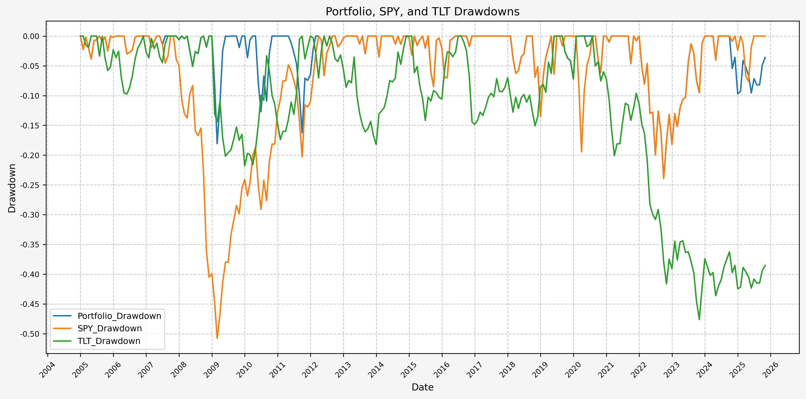

Finally, we can run the stats on the hybrid portfolio, SPY, and TLT with the following code:

```python
port_sum_stats = summary_stats(
    fund_list=["Portfolio", "SPY", "TLT"],
    df=portfolio_monthly[["Portfolio_Monthly_Return"]],
    period="Monthly",
    use_calendar_days=False,
    excel_export=False,
    pickle_export=False,
    output_confirmation=False,
)

spy_sum_stats = summary_stats(
    fund_list=["Portfolio", "SPY", "TLT"],
    df=portfolio_monthly[["SPY_Monthly_Return"]],
    period="Monthly",
    use_calendar_days=False,
    excel_export=False,
    pickle_export=False,
    output_confirmation=False,
)

tlt_sum_stats = summary_stats(
    fund_list=["Portfolio", "SPY", "TLT"],
    df=portfolio_monthly[["TLT_Monthly_Return"]],
    period="Monthly",
    use_calendar_days=False,
    excel_export=False,
    pickle_export=False,
    output_confirmation=False,
)

sum_stats = port_sum_stats.combine_first(spy_sum_stats).combine_first(tlt_sum_stats)
```

Which gives us:

|                          |   Annualized Mean |   Annualized Volatility |   Annualized Sharpe Ratio |   CAGR |   Monthly Max Return | Monthly Max Return (Date)   |   Monthly Min Return | Monthly Min Return (Date)   |   Max Drawdown | Peak                | Trough              | Recovery Date       |   Days to Recover |   MAR Ratio |
|:-------------------------|------------------:|------------------------:|--------------------------:|-------:|---------------------:|:----------------------------|---------------------:|:----------------------------|---------------:|:--------------------|:--------------------|:--------------------|------------------:|------------:|
| Portfolio_Monthly_Return |             0.156 |                   0.140 |                     1.111 |  0.155 |                0.143 | 2008-11-30 00:00:00         |               -0.107 | 2009-02-28 00:00:00         |         -0.239 | 2021-12-31 00:00:00 | 2022-09-30 00:00:00 | 2023-12-31 00:00:00 |           457.000 |       0.650 |
| SPY_Monthly_Return       |             0.114 |                   0.148 |                     0.769 |  0.108 |                0.127 | 2020-04-30 00:00:00         |               -0.165 | 2008-10-31 00:00:00         |         -0.508 | 2007-10-31 00:00:00 | 2009-02-28 00:00:00 | 2012-03-31 00:00:00 |          1127.000 |       0.212 |
| TLT_Monthly_Return       |             0.043 |                   0.137 |                     0.316 |  0.035 |                0.143 | 2008-11-30 00:00:00         |               -0.131 | 2009-01-31 00:00:00         |         -0.476 | 2020-07-31 00:00:00 | 2023-10-31 00:00:00 | NaT                 |           nan     |       0.072 |

Based on the above, our hybrid portfolio outperforms both stocks and bonds, and by a wide margin.

## Future Investigation

A couple of ideas sound intriguing for future investigation:
* Do investment grade or high yield bonds show a different behavior than the long term US treasury bonds?
* Does a commodity index (such as GSCI) exhibit differing behavior than gold?
* How does leverage affect the returns that are observed for the hybrid portfolio, stocks, and bonds?
* Do other Fed tightening/loosening cycles exhibit the same behavior for returns?

## References

1. https://fred.stlouisfed.org/series/FEDFUNDS

## Code

The jupyter notebook with the functions and all other code is available [here](asset-class-performance-fed-policy-cycles.ipynb).</br>
The html export of the jupyter notebook is available [here](asset-class-performance-fed-policy-cycles.html).</br>
The pdf export of the jupyter notebook is available [here](asset-class-performance-fed-policy-cycles.pdf).
