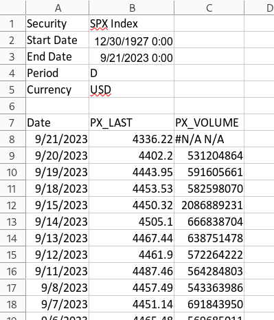
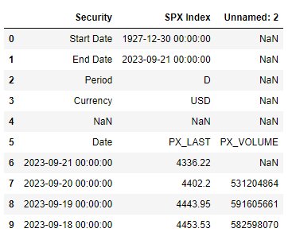
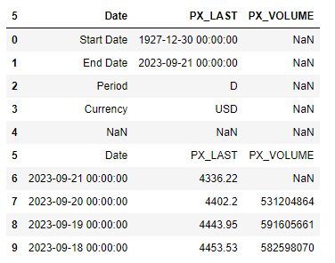
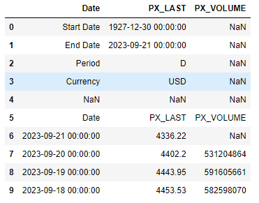
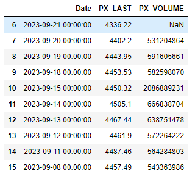
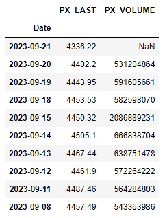
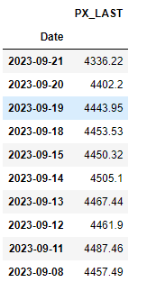
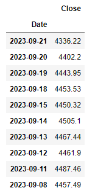
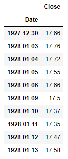

In this tutorial, we will write a python function that imports an excel export from Bloomberg, removes ancillary rows and columns, and leaves the data in a format where it can then be used in time series analysis.

## Example of a Bloomberg excel export

We will use the SPX index data in this example. Exporting the data from Bloomberg using the excel Bloomberg add-on yields data in the following format:



## Data modifications

The above format isn't horrible, but we want to perform the following modifications:

1. Remove the first six rows of the data
2. Convert the 7th row to become column headings
3. Rename column 2 to "Close" to represent the closing price
4. Remove column 3, as we are not concerned about volume
5. Make the name of the excel worksheet "data"

## Assumptions

The remainder of this tutorial assumes that your excel file is named "SPX_Index.xlsx", and the worksheet is named "Worksheet".

## Python function to modify the data

The following function will perform the modifications mentioned above:

```html
# This function takes an excel export from Bloomberg and 
# removes all excess data leaving date and close columns

# Imports
import pandas as pd

# Function definition
def bb_data_updater(fund):

    # File name variable
    file = fund + "_Index.xlsx"
    
    # Import data from file as a pandas dataframe and drop rows and columns
    df = pd.read_excel(file, sheet_name = 'Worksheet', engine='openpyxl')
    
    # Set the column headings from row 5 (which is physically row 6)
    df.columns = df.iloc[5]
    
    # Set the column heading for the index to be "None"
    df.rename_axis(None, axis=1, inplace = True)
    
    # Drop the first 6 rows, 0 - 5
    df.drop(df.index[0:6], inplace=True)
    
    # Set the date column as the index
    df.set_index('Date', inplace = True)
    
    # Drop the volume column
    try:
        df.drop(columns = {'PX_VOLUME'}, inplace = True)
    except KeyError:
        pass
        
    # Rename column
    df.rename(columns = {'PX_LAST':'Close'}, inplace = True)
    
    # Sort by date
    df.sort_values(by=['Date'], inplace = True)
    
    # Export data to excel
    file = fund + ".xlsx"
    df.to_excel(file, sheet_name='data')
    
    # Output confirmation
    print(f"The last date of data for {fund} is: ")
    print(df[-1:])
    print(f"Bloomberg data conversion complete for {fund} data")
    return print(f"--------------------")
```

Let's break this down line by line.

## Imports

First, we need to import pandas:

```html
import pandas as pd
```

## Import excel data file

Then import the excel file as a pandas dataframe:

```html
# File name variable
file = fund + "_Index.xlsx"

# Import data from file as a pandas dataframe and drop rows and columns
df = pd.read_excel(file, sheet_name = 'Worksheet', engine='openpyxl')
```

Running:

    df.head(10)

Gives us:



## Set column headings

Next, set the column heading:

```html
# Set the column headings from row 5 (which is physically row 6)
df.columns = df.iloc[5]
```

Now, running:

    df.head(10)

Gives us:



## Remove index heading

Next, remove the column heading from the index column:

```html
# Set the column heading for the index to be "None"
df.rename_axis(None, axis=1, inplace = True)
```

Now, running:

    df.head(10)

Gives us:



## Drop rows

Next, we want to remove the first 6 rows that have unneeded data:

```html
# Drop the first 6 rows, 0 - 5
df.drop(df.index[0:6], inplace=True)
```

Now, running:

    df.head(10)

Gives us:



## Set index

Next, we want to set the date column as the index:

```html
# Set the date column as the index
df.set_index('Date', inplace = True)
```

Now, running:

    df.head(10)

Gives us:



## Drop the "PX_VOLUME" column

Next, we want to drop the volume column:

```html
# Drop the volume column
try:
    df.drop(columns = {'PX_VOLUME'}, inplace = True)
except KeyError:
    pass
```

For some data records, the volume column does not exist. Therefore, we `try`, and if it fails with a `KeyError`, then we assume the "PX_VOLUME" column does not exist, and just `pass` to move on.

Now, running:

    df.head(10)

Gives us:



## Rename the "PX_LAST" column

Next, we want to rename the "PX_LAST" column as "Close":

```html
# Rename column
df.rename(columns = {'PX_LAST':'Close'}, inplace = True)
    pass
```

Now, running:

    df.head(10)

Gives us:



## Sort data

Next, we want to sort the data starting with the oldest date:

```html
# Sort by date
df.sort_values(by=['Date'], inplace = True)
    pass
```

Now, running:

    df.head(10)

Gives us:



## Export data

Next, we want to export the data to an excel file, for easy viewing and reference later:

```html
# Export data to excel
file = fund + ".xlsx"
df.to_excel(file, sheet_name='data')
    pass
```

## Output confirmation

Finally, we want to print a confirmation that the process succeeded along withe last date we have for data:

```html
# Output confirmation
print(f"The last date of data for {fund} is: ")
print(df[-1:])
print(f"Bloomberg data conversion complete for {fund} data")
print(f"--------------------")
```

