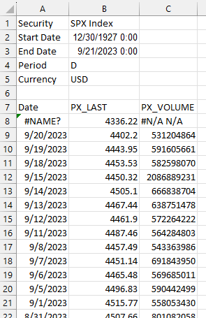

In this tutorial, we will write a python function that imports an excel export from Bloomberg, removes ancillary rows and columns, and leaves the data in a format where it can then be used in time series analysis.

## Example of a Bloomberg excel export

We will use the SPX index data in this example. Exporting the data from Bloomberg using the excel Bloomberg add-on yields data in the following format:



## Data modifications

The above format isn't horrible, but we want to perform the following modifications:

1. Remove the first six rows of the data
2. Convert the 7th row to become column headings
3. Rename column 2 to "Close" to represent the closing price
4. Remove column 3, as we are not concerned about volume
5. Make the name of the excel worksheet "data"

## Assumptions

The remainder of this tutorial assumes that your excel file is named "SPX_Index.xlsx", and the worksheet is named "Worksheet".

## Python function to modify the data

The following function will perform the modifications mentioned above:

```html
import pandas as pd

# This function takes an excel export from Bloomberg and 
# removes all excess data leaving date and close columns

def bb_data_updater(fund):
    # File name
    file = fund + "_Index.xlsx"
    
    # Import data from file as dataframe and drop rows and columns
    data = pd.read_excel(file, sheet_name = 'Worksheet', engine='openpyxl')
    data.columns = data.iloc[5]
    data.rename_axis(None, axis=1, inplace = True)
    data.drop(data.index[0:6], inplace=True)
    data.set_index('Date', inplace = True)
    
    try:
        data.drop(columns = {'PX_VOLUME'}, inplace = True)
    except KeyError:
        pass
        
    data.rename(columns = {'PX_LAST':'Close'}, inplace = True)
    data.sort_values(by=['Date'], inplace = True)
    
    # Export data to excel
    file = fund + ".xlsx"
    data.to_excel(file, sheet_name='data')
    
    # Output confirmation
    print(f"The last date of data for {fund} is: ")
    print(data[-1:])
    print(f"Bloomberg data conversion complete for {fund} data")
    return print(f"--------------------")
```

Let's break this down line by line.

## Imports

First, we need to import pandas:

    import pandas as pd

To be continued.