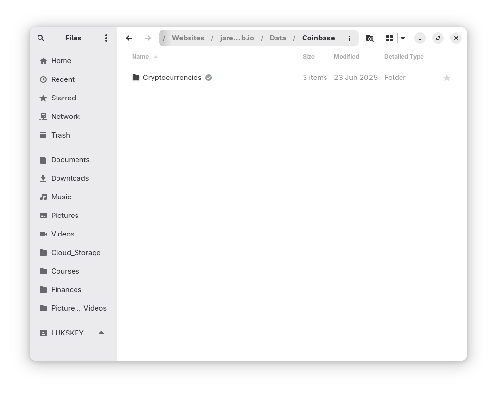
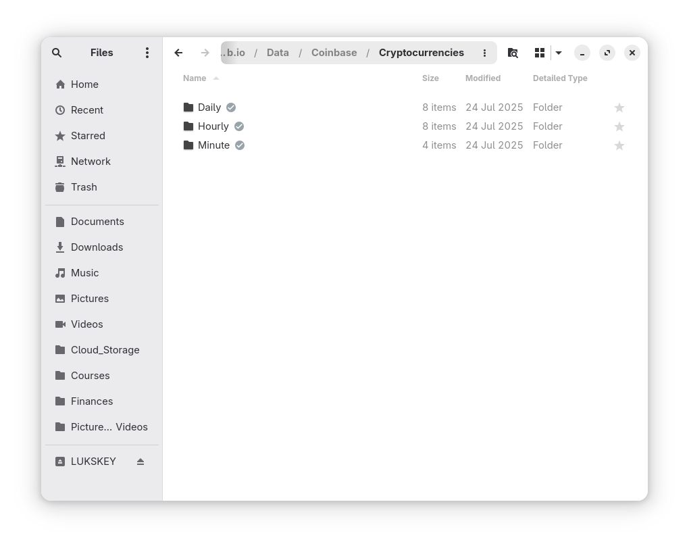
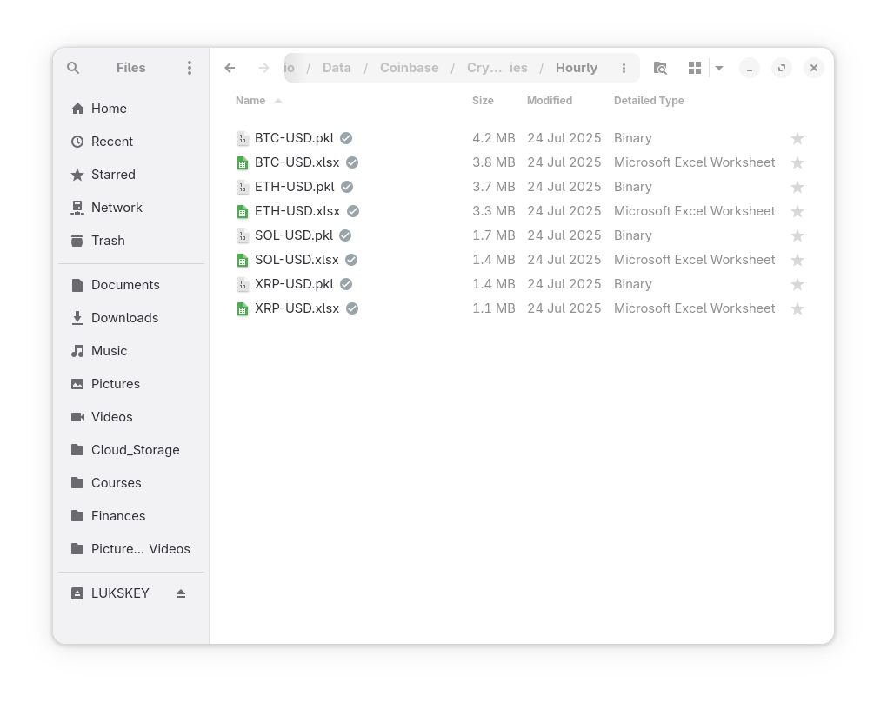
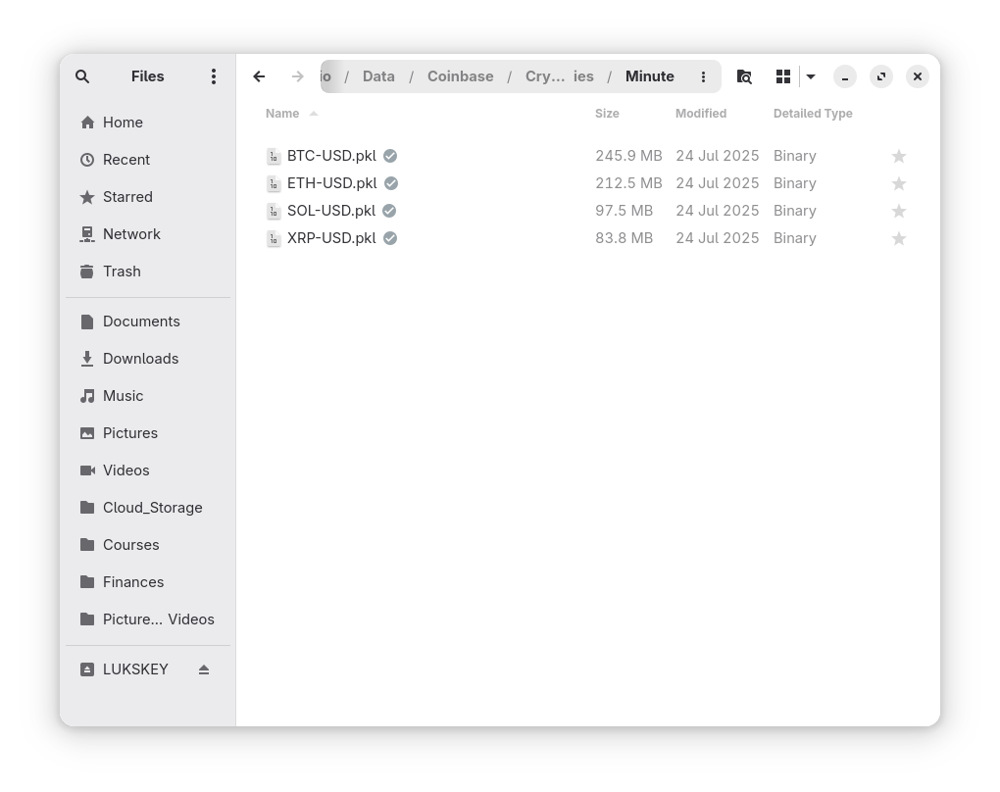

## Introduction

This is a quick post to illustrate how I collect and store crypto asset data from Coinbase. Essentially, the scripts below pull minute, hour, and daily data for the specified assets and if there is an existing data record, then the existing record is updated to include the most recent data. If there is not an existing data record, then the complete historical record from coinbase is pulled and stored.

## Python Functions

Here are the functions needed for this project:

* [coinbase_fetch_available_products](/2025/02/02/reusable-extensible-python-functions-financial-data-analysis/#coinbase_fetch_available_products): Fetch available products from Coinbase Exchange API.</br>
* [coinbase_fetch_full_history](/2025/02/02/reusable-extensible-python-functions-financial-data-analysis/#coinbase_fetch_full_history): Fetch full historical data for a given product from Coinbase Exchange API.</br>
* [coinbase_fetch_historical_candles](/2025/02/02/reusable-extensible-python-functions-financial-data-analysis/#coinbase_fetch_historical_candles): Fetch historical candle data for a given product from Coinbase Exchange API.</br>
* [coinbase_pull_data](/2025/02/02/reusable-extensible-python-functions-financial-data-analysis/#coinbase_pull_data): Update existing record or pull full historical data for a given product from Coinbase Exchange API.</br>

## Function Usage

### Coinbase Fetch Available Products

This script pulls the list of available assets based on the inputs for base and quote currency. Here's an example:

```python
df = coinbase_fetch_available_products(
    base_currency=None,
    quote_currency="USD",
    status="online",
)
```

In this example, the `quote_currency` is provided as "USD". This script checks all available assets that are priced against USD and returns a dataframe listing all available assets:

|     | id            | base_currency   | quote_currency   |   quote_increment |   base_increment | display_name   |   min_market_funds | margin_enabled   | post_only   | limit_only   | cancel_only   | status   | status_message   | trading_disabled   | fx_stablecoin   |   max_slippage_percentage | auction_mode   | high_bid_limit_percentage   |
|----:|:--------------|:----------------|:-----------------|------------------:|-----------------:|:---------------|-------------------:|:-----------------|:------------|:-------------|:--------------|:---------|:-----------------|:-------------------|:----------------|--------------------------:|:---------------|:----------------------------|
| 316 | 00-USD        | 00              | USD              |           0.00010 |          0.01000 | 00-USD         |                  1 | False            | False       | False        | False         | online   |                  | False              | False           |                   0.03000 | False          |                             |
| 366 | 1INCH-USD     | 1INCH           | USD              |           0.00100 |          0.01000 | 1INCH-USD      |                  1 | False            | False       | False        | False         | online   |                  | False              | False           |                   0.03000 | False          |                             |
| 430 | A8-USD        | A8              | USD              |           0.00010 |          0.01000 | A8/USD         |                  1 | False            | False       | False        | False         | online   |                  | False              | False           |                   0.03000 | False          |                             |
| 476 | AAVE-USD      | AAVE            | USD              |           0.01000 |          0.00100 | AAVE-USD       |                  1 | False            | False       | False        | False         | online   |                  | False              | False           |                   0.03000 | False          |                             |
| 511 | ABT-USD       | ABT             | USD              |           0.00010 |          0.10000 | ABT-USD        |                  1 | False            | False       | False        | False         | online   |                  | False              | False           |                   0.03000 | False          |                             |
| 436 | ACH-USD       | ACH             | USD              |           0.00000 |          0.10000 | ACH-USD        |                  1 | False            | False       | False        | False         | online   |                  | False              | False           |                   0.03000 | False          |                             |
| 172 | ACS-USD       | ACS             | USD              |           0.00000 |          1.00000 | ACS-USD        |                  1 | False            | False       | False        | False         | online   |                  | False              | False           |                   0.03000 | False          |                             |
| 600 | ACX-USD       | ACX             | USD              |           0.00010 |          0.10000 | ACX/USD        |                  1 | False            | False       | False        | False         | online   |                  | False              | False           |                   0.03000 | False          |                             |
| 682 | ADA-USD       | ADA             | USD              |           0.00010 |          0.00000 | ADA-USD        |                  1 | False            | False       | False        | False         | online   |                  | False              | False           |                   0.03000 | False          |                             |
| 171 | AERGO-USD     | AERGO           | USD              |           0.00010 |          0.10000 | AERGO-USD      |                  1 | False            | False       | False        | False         | online   |                  | False              | False           |                   0.03000 | False          |                             |
| 694 | AERO-USD      | AERO            | USD              |           0.00001 |          0.10000 | AERO-USD       |                  1 | False            | False       | False        | False         | online   |                  | False              | False           |                   0.03000 | False          |                             |
| 691 | AGLD-USD      | AGLD            | USD              |           0.00010 |          0.01000 | AGLD-USD       |                  1 | False            | False       | False        | False         | online   |                  | False              | False           |                   0.03000 | False          |                             |
| 415 | AIOZ-USD      | AIOZ            | USD              |           0.00010 |          0.10000 | AIOZ-USD       |                  1 | False            | False       | False        | False         | online   |                  | False              | False           |                   0.03000 | False          |                             |
| 594 | AKT-USD       | AKT             | USD              |           0.00100 |          0.01000 | AKT/USD        |                  1 | False            | False       | False        | False         | online   |                  | False              | False           |                   0.03000 | False          |                             |
|  92 | ALCX-USD      | ALCX            | USD              |           0.01000 |          0.00010 | ALCX-USD       |                  1 | False            | False       | False        | False         | online   |                  | False              | False           |                   0.03000 | False          |                             |
|  46 | ALEO-USD      | ALEO            | USD              |           0.00100 |          0.01000 | ALEO/USD       |                  1 | False            | False       | False        | False         | online   |                  | False              | False           |                   0.03000 | False          |                             |
| 263 | ALEPH-USD     | ALEPH           | USD              |           0.00010 |          0.10000 | ALEPH-USD      |                  1 | False            | False       | False        | False         | online   |                  | False              | False           |                   0.03000 | False          |                             |
| 148 | ALGO-USD      | ALGO            | USD              |           0.00010 |          0.10000 | ALGO-USD       |                  1 | False            | False       | False        | False         | online   |                  | False              | False           |                   0.03000 | False          |                             |
|  27 | ALICE-USD     | ALICE           | USD              |           0.00100 |          0.00100 | ALICE-USD      |                  1 | False            | False       | False        | False         | online   |                  | False              | False           |                   0.03000 | False          |                             |
| 213 | ALT-USD       | ALT             | USD              |           0.00001 |          1.00000 | ALT/USD        |                  1 | False            | False       | False        | False         | online   |                  | False              | False           |                   0.03000 | False          |                             |
| 501 | AMP-USD       | AMP             | USD              |           0.00001 |          1.00000 | AMP-USD        |                  1 | False            | False       | False        | False         | online   |                  | False              | False           |                   0.03000 | False          |                             |
| 287 | ANKR-USD      | ANKR            | USD              |           0.00001 |          1.00000 | ANKR-USD       |                  1 | False            | False       | False        | False         | online   |                  | False              | False           |                   0.03000 | False          |                             |
|   0 | APE-USD       | APE             | USD              |           0.00100 |          0.01000 | APE-USD        |                  1 | False            | False       | False        | False         | online   |                  | False              | False           |                   0.03000 | False          |                             |
| 418 | API3-USD      | API3            | USD              |           0.00100 |          0.01000 | API3-USD       |                  5 | False            | False       | False        | False         | online   |                  | False              | False           |                   0.03000 | False          |                             |
| 257 | APT-USD       | APT             | USD              |           0.01000 |          0.00100 | APT-USD        |                  1 | False            | False       | False        | False         | online   |                  | False              | False           |                   0.03000 | False          |                             |
| 346 | ARB-USD       | ARB             | USD              |           0.00010 |          0.01000 | ARB-USD        |                  1 | False            | False       | False        | False         | online   |                  | False              | False           |                   0.03000 | False          |                             |
| 622 | ARKM-USD      | ARKM            | USD              |           0.00100 |          0.01000 | ARKM/USD       |                  1 | False            | False       | False        | False         | online   |                  | False              | False           |                   0.03000 | False          |                             |
| 163 | ARPA-USD      | ARPA            | USD              |           0.00010 |          0.10000 | ARPA-USD       |                  1 | False            | False       | False        | False         | online   |                  | False              | False           |                   0.03000 | False          |                             |
| 423 | ASM-USD       | ASM             | USD              |           0.00001 |          1.00000 | ASM-USD        |                  1 | False            | False       | False        | False         | online   |                  | False              | False           |                   0.03000 | False          |                             |
| 180 | AST-USD       | AST             | USD              |           0.00010 |          0.10000 | AST-USD        |                  1 | False            | False       | False        | False         | online   |                  | False              | False           |                   0.03000 | False          |                             |
| 703 | ATH-USD       | ATH             | USD              |           0.00001 |          1.00000 | ATH/USD        |                  1 | False            | False       | False        | False         | online   |                  | False              | False           |                   0.03000 | False          |                             |
| 342 | ATOM-USD      | ATOM            | USD              |           0.00100 |          0.01000 | ATOM-USD       |                  1 | False            | False       | False        | False         | online   |                  | False              | False           |                   0.03000 | False          |                             |
| 479 | AUCTION-USD   | AUCTION         | USD              |           0.01000 |          0.00100 | AUCTION-USD    |                  1 | False            | False       | False        | False         | online   |                  | False              | False           |                   0.03000 | False          |                             |
| 625 | AUDIO-USD     | AUDIO           | USD              |           0.00010 |          0.10000 | AUDIO-USD      |                  1 | False            | False       | False        | False         | online   |                  | False              | False           |                   0.03000 | False          |                             |
| 480 | AURORA-USD    | AURORA          | USD              |           0.00010 |          0.01000 | AURORA-USD     |                  1 | False            | False       | False        | False         | online   |                  | False              | False           |                   0.03000 | False          |                             |
| 297 | AVAX-USD      | AVAX            | USD              |           0.01000 |          0.00000 | AVAX-USD       |                  1 | False            | False       | False        | False         | online   |                  | False              | False           |                   0.03000 | False          |                             |
| 202 | AVT-USD       | AVT             | USD              |           0.01000 |          0.01000 | AVT-USD        |                  1 | False            | False       | False        | False         | online   |                  | False              | False           |                   0.05000 | False          |                             |
|  96 | AXL-USD       | AXL             | USD              |           0.00010 |          0.10000 | AXL-USD        |                  1 | False            | False       | False        | False         | online   |                  | False              | False           |                   0.03000 | False          |                             |
| 255 | AXS-USD       | AXS             | USD              |           0.00100 |          0.00100 | AXS-USD        |                  1 | False            | False       | False        | False         | online   |                  | False              | False           |                   0.03000 | False          |                             |
| 458 | B3-USD        | B3              | USD              |           0.00000 |          1.00000 | B3/USD         |                  1 | False            | False       | False        | False         | online   |                  | False              | False           |                   0.03000 | False          |                             |
| 392 | BADGER-USD    | BADGER          | USD              |           0.01000 |          0.00100 | BADGER-USD     |                  1 | False            | False       | False        | False         | online   |                  | False              | False           |                   0.03000 | False          |                             |
| 500 | BAL-USD       | BAL             | USD              |           0.00010 |          0.00100 | BAL-USD        |                  1 | False            | False       | False        | False         | online   |                  | False              | False           |                   0.03000 | False          |                             |
| 390 | BAND-USD      | BAND            | USD              |           0.00100 |          0.01000 | BAND-USD       |                  1 | False            | False       | False        | False         | online   |                  | False              | False           |                   0.03000 | False          |                             |
| 243 | BAT-USD       | BAT             | USD              |           0.00001 |          0.01000 | BAT-USD        |                  1 | False            | False       | False        | False         | online   |                  | False              | False           |                   0.03000 | False          |                             |
| 609 | BCH-USD       | BCH             | USD              |           0.01000 |          0.00000 | BCH-USD        |                  1 | False            | False       | False        | False         | online   |                  | False              | False           |                   0.03000 | False          |                             |
| 123 | BERA-USD      | BERA            | USD              |           0.00100 |          0.01000 | BERA/USD       |                  1 | False            | False       | False        | False         | online   |                  | False              | False           |                   0.03000 | False          |                             |
| 668 | BICO-USD      | BICO            | USD              |           0.00010 |          0.01000 | BICO-USD       |                  1 | False            | False       | False        | False         | online   |                  | False              | False           |                   0.03000 | False          |                             |
| 429 | BIGTIME-USD   | BIGTIME         | USD              |           0.00001 |          1.00000 | BIGTIME-USD    |                  1 | False            | False       | False        | False         | online   |                  | False              | False           |                   0.03000 | False          |                             |
| 660 | BLAST-USD     | BLAST           | USD              |           0.00001 |          1.00000 | BLAST/USD      |                  1 | False            | False       | False        | False         | online   |                  | False              | False           |                   0.03000 | False          |                             |
| 525 | BLUR-USD      | BLUR            | USD              |           0.00010 |          0.10000 | BLUR-USD       |                  1 | False            | False       | False        | False         | online   |                  | False              | False           |                   0.03000 | False          |                             |
| 544 | BLZ-USD       | BLZ             | USD              |           0.00010 |          0.10000 | BLZ-USD        |                  1 | False            | False       | False        | False         | online   |                  | False              | False           |                   0.03000 | False          |                             |
| 335 | BNT-USD       | BNT             | USD              |           0.00010 |          0.00000 | BNT-USD        |                  1 | False            | False       | False        | False         | online   |                  | False              | False           |                   0.03000 | False          |                             |
| 706 | BOBA-USD      | BOBA            | USD              |           0.00010 |          0.10000 | BOBA-USD       |                  1 | False            | False       | False        | False         | online   |                  | False              | False           |                   0.03000 | False          |                             |
| 635 | BONK-USD      | BONK            | USD              |           0.00000 |          1.00000 | BONK-USD       |                  1 | False            | False       | False        | False         | online   |                  | False              | False           |                   0.03000 | False          |                             |
| 438 | BTC-USD       | BTC             | USD              |           0.01000 |          0.00000 | BTC-USD        |                  1 | False            | False       | False        | False         | online   |                  | False              | False           |                   0.02000 | False          |                             |
| 164 | BTRST-USD     | BTRST           | USD              |           0.00100 |          0.01000 | BTRST-USD      |                  1 | False            | False       | False        | False         | online   |                  | False              | False           |                   0.03000 | False          |                             |
|   2 | C98-USD       | C98             | USD              |           0.00010 |          0.01000 | C98-USD        |                  1 | False            | False       | False        | False         | online   |                  | False              | False           |                   0.03000 | False          |                             |
| 276 | CAKE-USD      | CAKE            | USD              |           0.00100 |          0.01000 | CAKE/USD       |                  1 | False            | False       | False        | False         | online   |                  | False              | False           |                   0.03000 | False          |                             |
|  28 | CBETH-USD     | CBETH           | USD              |           0.01000 |          0.00001 | cbETH-USD      |                  1 | False            | False       | False        | False         | online   |                  | False              | False           |                   0.03000 | False          |                             |
| 354 | CELR-USD      | CELR            | USD              |           0.00001 |          1.00000 | CELR-USD       |                  1 | False            | False       | False        | False         | online   |                  | False              | False           |                   0.03000 | False          |                             |
| 394 | CGLD-USD      | CGLD            | USD              |           0.00100 |          0.01000 | CGLD-USD       |                  1 | False            | False       | False        | False         | online   |                  | False              | False           |                   0.03000 | False          |                             |
| 105 | CHZ-USD       | CHZ             | USD              |           0.00010 |          0.10000 | CHZ-USD        |                  1 | False            | False       | False        | False         | online   |                  | False              | False           |                   0.03000 | False          |                             |
|   9 | CLANKER-USD   | CLANKER         | USD              |           0.01000 |          0.00010 | CLANKER/USD    |                  1 | False            | False       | False        | False         | online   |                  | False              | False           |                   0.03000 | False          |                             |
| 598 | CLV-USD       | CLV             | USD              |           0.00010 |          0.01000 | CLV-USD        |                  1 | False            | False       | False        | False         | online   |                  | False              | False           |                   0.03000 | False          |                             |
| 184 | COMP-USD      | COMP            | USD              |           0.01000 |          0.00100 | COMP-USD       |                  1 | False            | False       | False        | False         | online   |                  | False              | False           |                   0.03000 | False          |                             |
| 212 | COOKIE-USD    | COOKIE          | USD              |           0.00001 |          0.10000 | COOKIE/USD     |                  1 | False            | False       | False        | False         | online   |                  | False              | False           |                   0.03000 | False          |                             |
| 289 | CORECHAIN-USD | CORECHAIN       | USD              |           0.00100 |          0.01000 | CORECHAIN/USD  |                  1 | False            | False       | False        | False         | online   |                  | False              | False           |                   0.03000 | False          |                             |
| 280 | COTI-USD      | COTI            | USD              |           0.00010 |          0.10000 | COTI-USD       |                  1 | False            | False       | False        | False         | online   |                  | False              | False           |                   0.03000 | False          |                             |
| 677 | COW-USD       | COW             | USD              |           0.00010 |          0.10000 | COW/USD        |                  1 | False            | False       | False        | False         | online   |                  | False              | False           |                   0.03000 | False          |                             |
| 194 | CRO-USD       | CRO             | USD              |           0.00010 |          0.10000 | CRO-USD        |                  1 | False            | False       | False        | False         | online   |                  | False              | False           |                   0.03000 | False          |                             |
| 482 | CRV-USD       | CRV             | USD              |           0.00010 |          0.01000 | CRV-USD        |                  1 | False            | False       | False        | False         | online   |                  | False              | False           |                   0.03000 | False          |                             |
| 492 | CTSI-USD      | CTSI            | USD              |           0.00010 |          0.10000 | CTSI-USD       |                  1 | False            | False       | False        | False         | online   |                  | False              | False           |                   0.03000 | False          |                             |
| 216 | CTX-USD       | CTX             | USD              |           0.00010 |          0.00100 | CTX-USD        |                  5 | False            | False       | False        | False         | online   |                  | False              | False           |                   0.05000 | False          |                             |
| 217 | CVC-USD       | CVC             | USD              |           0.00010 |          0.10000 | CVC-USD        |                  1 | False            | False       | False        | False         | online   |                  | False              | False           |                   0.03000 | False          |                             |
| 421 | CVX-USD       | CVX             | USD              |           0.00100 |          0.00100 | CVX-USD        |                  1 | False            | False       | False        | False         | online   |                  | False              | False           |                   0.03000 | False          |                             |
| 587 | DAI-USD       | DAI             | USD              |           0.00010 |          0.00001 | DAI-USD        |                  1 | False            | False       | False        | False         | online   |                  | False              | True            |                   0.01000 | False          | 0.03000000                  |
| 426 | DASH-USD      | DASH            | USD              |           0.01000 |          0.00100 | DASH-USD       |                  1 | False            | False       | False        | False         | online   |                  | False              | False           |                   0.03000 | False          |                             |
| 324 | DEGEN-USD     | DEGEN           | USD              |           0.00000 |          1.00000 | DEGEN/USD      |                  1 | False            | False       | False        | False         | online   |                  | False              | False           |                   0.03000 | False          |                             |
| 513 | DEXT-USD      | DEXT            | USD              |           0.00010 |          0.10000 | DEXT-USD       |                  1 | False            | False       | False        | False         | online   |                  | False              | False           |                   0.05000 | False          |                             |
| 603 | DIA-USD       | DIA             | USD              |           0.00001 |          0.01000 | DIA-USD        |                  1 | False            | False       | False        | False         | online   |                  | False              | False           |                   0.03000 | False          |                             |
| 267 | DIMO-USD      | DIMO            | USD              |           0.00001 |          0.10000 | DIMO-USD       |                  1 | False            | False       | False        | False         | online   |                  | False              | False           |                   0.03000 | False          |                             |
|  31 | DNT-USD       | DNT             | USD              |           0.00010 |          0.10000 | DNT-USD        |                  1 | False            | False       | False        | False         | online   |                  | False              | False           |                   0.05000 | False          |                             |
| 277 | DOGE-USD      | DOGE            | USD              |           0.00001 |          0.10000 | DOGE-USD       |                  1 | False            | False       | False        | False         | online   |                  | False              | False           |                   0.03000 | False          |                             |
| 269 | DOGINME-USD   | DOGINME         | USD              |           0.00000 |          1.00000 | DOGINME/USD    |                  1 | False            | False       | False        | False         | online   |                  | False              | False           |                   0.03000 | False          |                             |
| 643 | DOT-USD       | DOT             | USD              |           0.00100 |          0.00000 | DOT-USD        |                  1 | False            | False       | False        | False         | online   |                  | False              | False           |                   0.03000 | False          |                             |
| 637 | DRIFT-USD     | DRIFT           | USD              |           0.00100 |          0.01000 | DRIFT/USD      |                  1 | False            | False       | False        | False         | online   |                  | False              | False           |                   0.03000 | False          |                             |
|  66 | EDGE-USD      | EDGE            | USD              |           0.00001 |          0.10000 | EDGE/USD       |                  1 | False            | False       | False        | False         | online   |                  | False              | False           |                   0.03000 | False          |                             |
| 457 | EGLD-USD      | EGLD            | USD              |           0.01000 |          0.00100 | EGLD-USD       |                  1 | False            | False       | False        | False         | online   |                  | False              | False           |                   0.03000 | False          |                             |
| 381 | EIGEN-USD     | EIGEN           | USD              |           0.00100 |          0.01000 | EIGEN/USD      |                  1 | False            | False       | False        | False         | online   |                  | False              | False           |                   0.03000 | False          |                             |
| 576 | ELA-USD       | ELA             | USD              |           0.00100 |          0.01000 | ELA-USD        |                  1 | False            | False       | False        | False         | online   |                  | False              | False           |                   0.03000 | False          |                             |
| 362 | ENA-USD       | ENA             | USD              |           0.00010 |          0.10000 | ENA/USD        |                  1 | False            | False       | False        | False         | online   |                  | False              | False           |                   0.03000 | False          |                             |
| 481 | ENS-USD       | ENS             | USD              |           0.01000 |          0.00100 | ENS-USD        |                  1 | False            | False       | False        | False         | online   |                  | False              | False           |                   0.03000 | False          |                             |
| 427 | EOS-USD       | EOS             | USD              |           0.00010 |          0.10000 | EOS-USD        |                  1 | False            | False       | False        | False         | online   |                  | False              | False           |                   0.03000 | False          |                             |
| 122 | ERA-USD       | ERA             | USD              |           0.00010 |          0.01000 | ERA/USD        |                  1 | False            | False       | False        | False         | online   |                  | False              | False           |                   0.03000 | False          |                             |
| 701 | ERN-USD       | ERN             | USD              |           0.00010 |          0.00100 | ERN-USD        |                  1 | False            | False       | False        | False         | online   |                  | False              | False           |                   0.03000 | False          |                             |
| 323 | ETC-USD       | ETC             | USD              |           0.01000 |          0.00000 | ETC-USD        |                  1 | False            | False       | False        | False         | online   |                  | False              | False           |                   0.03000 | False          |                             |
| 383 | ETH-USD       | ETH             | USD              |           0.01000 |          0.00000 | ETH-USD        |                  1 | False            | False       | False        | False         | online   |                  | False              | False           |                   0.02000 | False          |                             |
| 116 | ETHFI-USD     | ETHFI           | USD              |           0.00100 |          0.01000 | ETHFI/USD      |                  1 | False            | False       | False        | False         | online   |                  | False              | False           |                   0.03000 | False          |                             |
| 125 | FAI-USD       | FAI             | USD              |           0.00001 |          1.00000 | FAI/USD        |                  1 | False            | False       | False        | False         | online   |                  | False              | False           |                   0.03000 | False          |                             |
| 395 | FARM-USD      | FARM            | USD              |           0.01000 |          0.00100 | FARM-USD       |                  1 | False            | False       | False        | False         | online   |                  | False              | False           |                   0.03000 | False          |                             |
| 102 | FARTCOIN-USD  | FARTCOIN        | USD              |           0.00010 |          0.01000 | FARTCOIN/USD   |                  1 | False            | False       | False        | False         | online   |                  | False              | False           |                   0.03000 | False          |                             |
|  81 | FET-USD       | FET             | USD              |           0.00010 |          0.10000 | FET-USD        |                  1 | False            | False       | False        | False         | online   |                  | False              | False           |                   0.03000 | False          |                             |
| 241 | FIDA-USD      | FIDA            | USD              |           0.00010 |          0.01000 | FIDA-USD       |                  1 | False            | False       | False        | False         | online   |                  | False              | False           |                   0.03000 | False          |                             |
| 448 | FIL-USD       | FIL             | USD              |           0.00100 |          0.00100 | FIL-USD        |                  1 | False            | False       | False        | False         | online   |                  | False              | False           |                   0.03000 | False          |                             |
| 393 | FIS-USD       | FIS             | USD              |           0.00010 |          0.10000 | FIS-USD        |                  1 | False            | False       | False        | False         | online   |                  | False              | False           |                   0.03000 | False          |                             |
| 220 | FLOKI-USD     | FLOKI           | USD              |           0.00000 |          1.00000 | FLOKI/USD      |                  1 | False            | False       | False        | False         | online   |                  | False              | False           |                   0.03000 | False          |                             |
| 702 | FLOW-USD      | FLOW            | USD              |           0.00100 |          0.00100 | FLOW-USD       |                  1 | False            | False       | False        | False         | online   |                  | False              | False           |                   0.03000 | False          |                             |
| 396 | FLR-USD       | FLR             | USD              |           0.00001 |          1.00000 | FLR-USD        |                  1 | False            | False       | False        | False         | online   |                  | False              | False           |                   0.03000 | False          |                             |
| 410 | FORT-USD      | FORT            | USD              |           0.00010 |          0.01000 | FORT-USD       |                  1 | False            | False       | False        | False         | online   |                  | False              | False           |                   0.03000 | False          |                             |
| 198 | FORTH-USD     | FORTH           | USD              |           0.00010 |          0.00100 | FORTH-USD      |                  1 | False            | False       | False        | False         | online   |                  | False              | False           |                   0.03000 | False          |                             |
| 299 | FOX-USD       | FOX             | USD              |           0.00010 |          0.10000 | FOX-USD        |                  1 | False            | False       | False        | False         | online   |                  | False              | False           |                   0.03000 | False          |                             |
| 338 | FX-USD        | FX              | USD              |           0.00010 |          0.10000 | FX-USD         |                  1 | False            | False       | False        | False         | online   |                  | False              | False           |                   0.03000 | False          |                             |
| 403 | G-USD         | G               | USD              |           0.00001 |          1.00000 | G/USD          |                  1 | False            | False       | False        | False         | online   |                  | False              | False           |                   0.03000 | False          |                             |
| 146 | GFI-USD       | GFI             | USD              |           0.00010 |          0.01000 | GFI-USD        |                  1 | False            | False       | False        | False         | online   |                  | False              | False           |                   0.03000 | False          |                             |
|  40 | GHST-USD      | GHST            | USD              |           0.00100 |          0.01000 | GHST-USD       |                  1 | False            | False       | False        | False         | online   |                  | False              | False           |                   0.03000 | False          |                             |
| 607 | GIGA-USD      | GIGA            | USD              |           0.00001 |          0.10000 | GIGA/USD       |                  1 | False            | False       | False        | False         | online   |                  | False              | False           |                   0.03000 | False          |                             |
|  87 | GLM-USD       | GLM             | USD              |           0.00010 |          0.10000 | GLM-USD        |                  1 | False            | False       | False        | False         | online   |                  | False              | False           |                   0.03000 | False          |                             |
| 575 | GMT-USD       | GMT             | USD              |           0.00010 |          0.01000 | GMT-USD        |                  1 | False            | False       | False        | False         | online   |                  | False              | False           |                   0.03000 | False          |                             |
| 554 | GNO-USD       | GNO             | USD              |           0.01000 |          0.00010 | GNO-USD        |                  1 | False            | False       | True         | False         | online   |                  | False              | False           |                   0.03000 | False          |                             |
| 610 | GODS-USD      | GODS            | USD              |           0.00001 |          0.01000 | GODS-USD       |                  1 | False            | False       | False        | False         | online   |                  | False              | False           |                   0.03000 | False          |                             |
| 578 | GRT-USD       | GRT             | USD              |           0.00010 |          0.01000 | GRT-USD        |                  1 | False            | False       | False        | False         | online   |                  | False              | False           |                   0.03000 | False          |                             |
| 387 | GST-USD       | GST             | USD              |           0.00000 |          0.01000 | GST-USD        |                  1 | False            | False       | False        | False         | online   |                  | False              | False           |                   0.03000 | False          |                             |
|  13 | GTC-USD       | GTC             | USD              |           0.01000 |          0.01000 | GTC-USD        |                  1 | False            | False       | False        | False         | online   |                  | False              | False           |                   0.05000 | False          |                             |
|  60 | HBAR-USD      | HBAR            | USD              |           0.00001 |          0.10000 | HBAR-USD       |                  1 | False            | False       | False        | False         | online   |                  | False              | False           |                   0.03000 | False          |                             |
| 670 | HFT-USD       | HFT             | USD              |           0.00010 |          0.01000 | HFT-USD        |                  1 | False            | False       | False        | False         | online   |                  | False              | False           |                   0.03000 | False          |                             |
|  16 | HIGH-USD      | HIGH            | USD              |           0.00100 |          0.01000 | HIGH-USD       |                  1 | False            | False       | False        | False         | online   |                  | False              | False           |                   0.03000 | False          |                             |
| 628 | HNT-USD       | HNT             | USD              |           0.00100 |          0.01000 | HNT-USD        |                  1 | False            | False       | False        | False         | online   |                  | False              | False           |                   0.03000 | False          |                             |
| 564 | HOME-USD      | HOME            | USD              |           0.00001 |          1.00000 | HOME/USD       |                  1 | False            | False       | False        | False         | online   |                  | False              | False           |                   0.03000 | False          |                             |
| 337 | HONEY-USD     | HONEY           | USD              |           0.00010 |          0.10000 | HONEY-USD      |                  1 | False            | False       | False        | False         | online   |                  | False              | False           |                   0.03000 | False          |                             |
| 391 | HOPR-USD      | HOPR            | USD              |           0.00010 |          0.10000 | HOPR-USD       |                  1 | False            | False       | False        | False         | online   |                  | False              | False           |                   0.03000 | False          |                             |
|  10 | ICP-USD       | ICP             | USD              |           0.00100 |          0.00010 | ICP-USD        |                  1 | False            | False       | False        | False         | online   |                  | False              | False           |                   0.03000 | False          |                             |
| 414 | IDEX-USD      | IDEX            | USD              |           0.00010 |          0.10000 | IDEX-USD       |                  1 | False            | False       | False        | False         | online   |                  | False              | False           |                   0.03000 | False          |                             |
| 406 | ILV-USD       | ILV             | USD              |           0.01000 |          0.00010 | ILV-USD        |                  1 | False            | False       | False        | False         | online   |                  | False              | False           |                   0.03000 | False          |                             |
| 187 | IMX-USD       | IMX             | USD              |           0.00010 |          0.01000 | IMX-USD        |                  1 | False            | False       | False        | False         | online   |                  | False              | False           |                   0.03000 | False          |                             |
| 574 | INDEX-USD     | INDEX           | USD              |           0.01000 |          0.00100 | INDEX-USD      |                  1 | False            | False       | False        | False         | online   |                  | False              | False           |                   0.03000 | False          |                             |
| 168 | INJ-USD       | INJ             | USD              |           0.00100 |          0.01000 | INJ-USD        |                  1 | False            | False       | False        | False         | online   |                  | False              | False           |                   0.03000 | False          |                             |
| 318 | INV-USD       | INV             | USD              |           0.01000 |          0.00010 | INV-USD        |                  1 | False            | False       | True         | False         | online   |                  | False              | False           |                   0.05000 | False          |                             |
| 490 | IO-USD        | IO              | USD              |           0.00100 |          0.01000 | IO/USD         |                  1 | False            | False       | False        | False         | online   |                  | False              | False           |                   0.03000 | False          |                             |
| 402 | IOTX-USD      | IOTX            | USD              |           0.00001 |          1.00000 | IOTX-USD       |                  1 | False            | False       | False        | False         | online   |                  | False              | False           |                   0.03000 | False          |                             |
|  69 | IP-USD        | IP              | USD              |           0.00100 |          0.01000 | IP/USD         |                  1 | False            | False       | False        | False         | online   |                  | False              | False           |                   0.03000 | False          |                             |
| 401 | JASMY-USD     | JASMY           | USD              |           0.00001 |          1.00000 | JASMY-USD      |                  1 | False            | False       | False        | False         | online   |                  | False              | False           |                   0.03000 | False          |                             |
| 326 | JITOSOL-USD   | JITOSOL         | USD              |           0.01000 |          0.00010 | JITOSOL/USD    |                  1 | False            | False       | True         | False         | online   |                  | False              | False           |                   0.03000 | False          |                             |
| 195 | JTO-USD       | JTO             | USD              |           0.00010 |          0.10000 | JTO-USD        |                  1 | False            | False       | False        | False         | online   |                  | False              | False           |                   0.03000 | False          |                             |
|  51 | KAITO-USD     | KAITO           | USD              |           0.00010 |          0.01000 | KAITO/USD      |                  1 | False            | False       | False        | False         | online   |                  | False              | False           |                   0.03000 | False          |                             |
| 641 | KARRAT-USD    | KARRAT          | USD              |           0.00010 |          0.01000 | KARRAT/USD     |                  1 | False            | False       | False        | False         | online   |                  | False              | False           |                   0.03000 | False          |                             |
| 475 | KAVA-USD      | KAVA            | USD              |           0.00010 |          0.01000 | KAVA-USD       |                  1 | False            | False       | False        | False         | online   |                  | False              | False           |                   0.03000 | False          |                             |
| 188 | KERNEL-USD    | KERNEL          | USD              |           0.00010 |          0.01000 | KERNEL/USD     |                  1 | False            | False       | False        | False         | online   |                  | False              | False           |                   0.03000 | False          |                             |
| 676 | KEYCAT-USD    | KEYCAT          | USD              |           0.00000 |          1.00000 | KEYCAT/USD     |                  1 | False            | False       | False        | False         | online   |                  | False              | False           |                   0.03000 | False          |                             |
| 612 | KNC-USD       | KNC             | USD              |           0.00010 |          0.10000 | KNC-USD        |                  1 | False            | False       | False        | False         | online   |                  | False              | False           |                   0.03000 | False          |                             |
| 532 | KRL-USD       | KRL             | USD              |           0.00010 |          0.10000 | KRL-USD        |                  1 | False            | False       | False        | False         | online   |                  | False              | False           |                   0.05000 | False          |                             |
|  79 | KSM-USD       | KSM             | USD              |           0.01000 |          0.00010 | KSM-USD        |                  1 | False            | False       | False        | False         | online   |                  | False              | False           |                   0.03000 | False          |                             |
|  68 | L3-USD        | L3              | USD              |           0.00001 |          0.10000 | L3/USD         |                  1 | False            | False       | False        | False         | online   |                  | False              | False           |                   0.03000 | False          |                             |
| 166 | LA-USD        | LA              | USD              |           0.00010 |          0.10000 | LA/USD         |                  1 | False            | False       | False        | False         | online   |                  | False              | False           |                   0.03000 | False          |                             |
| 618 | LCX-USD       | LCX             | USD              |           0.00010 |          0.10000 | LCX-USD        |                  1 | False            | False       | False        | False         | online   |                  | False              | False           |                   0.03000 | False          |                             |
| 373 | LDO-USD       | LDO             | USD              |           0.00100 |          0.01000 | LDO-USD        |                  1 | False            | False       | False        | False         | online   |                  | False              | False           |                   0.03000 | False          |                             |
| 662 | LINK-USD      | LINK            | USD              |           0.00100 |          0.01000 | LINK-USD       |                  1 | False            | False       | False        | False         | online   |                  | False              | False           |                   0.03000 | False          |                             |
|  33 | LOKA-USD      | LOKA            | USD              |           0.00010 |          0.01000 | LOKA-USD       |                  1 | False            | False       | False        | False         | online   |                  | False              | False           |                   0.03000 | False          |                             |
|  56 | LPT-USD       | LPT             | USD              |           0.01000 |          0.00100 | LPT-USD        |                  1 | False            | False       | False        | False         | online   |                  | False              | False           |                   0.03000 | False          |                             |
| 570 | LQTY-USD      | LQTY            | USD              |           0.00010 |          0.01000 | LQTY-USD       |                  1 | False            | False       | False        | False         | online   |                  | False              | False           |                   0.03000 | False          |                             |
| 355 | LRC-USD       | LRC             | USD              |           0.00010 |          0.00000 | LRC-USD        |                  1 | False            | False       | False        | False         | online   |                  | False              | False           |                   0.03000 | False          |                             |
| 365 | LRDS-USD      | LRDS            | USD              |           0.00010 |          0.01000 | LRDS/USD       |                  1 | False            | False       | False        | False         | online   |                  | False              | False           |                   0.03000 | False          |                             |
|  80 | LSETH-USD     | LSETH           | USD              |           0.01000 |          0.00001 | LSETH-USD      |                  1 | False            | False       | False        | False         | online   |                  | False              | False           |                   0.03000 | False          |                             |
| 493 | LTC-USD       | LTC             | USD              |           0.01000 |          0.00000 | LTC-USD        |                  1 | False            | False       | False        | False         | online   |                  | False              | False           |                   0.03000 | False          |                             |
| 425 | MAGIC-USD     | MAGIC           | USD              |           0.00010 |          0.01000 | MAGIC-USD      |                  1 | False            | False       | False        | False         | online   |                  | False              | False           |                   0.03000 | False          |                             |
| 357 | MANA-USD      | MANA            | USD              |           0.00010 |          0.01000 | MANA-USD       |                  1 | False            | False       | False        | False         | online   |                  | False              | False           |                   0.03000 | False          |                             |
| 320 | MANTLE-USD    | MANTLE          | USD              |           0.00010 |          0.01000 | MANTLE/USD     |                  1 | False            | False       | False        | False         | online   |                  | False              | False           |                   0.03000 | False          |                             |
| 531 | MASK-USD      | MASK            | USD              |           0.01000 |          0.01000 | MASK-USD       |                  1 | False            | False       | False        | False         | online   |                  | False              | False           |                   0.05000 | False          |                             |
|  91 | MATH-USD      | MATH            | USD              |           0.00010 |          0.10000 | MATH-USD       |                  1 | False            | False       | False        | False         | online   |                  | False              | False           |                   0.03000 | False          |                             |
| 565 | MATIC-USD     | MATIC           | USD              |           0.00010 |          0.10000 | MATIC-USD      |                  1 | False            | False       | False        | False         | online   |                  | False              | False           |                   0.03000 | False          |                             |
| 483 | MDT-USD       | MDT             | USD              |           0.00001 |          1.00000 | MDT-USD        |                  1 | False            | False       | False        | False         | online   |                  | False              | False           |                   0.03000 | False          |                             |
| 227 | ME-USD        | ME              | USD              |           0.00100 |          0.01000 | ME/USD         |                  1 | False            | False       | False        | False         | online   |                  | False              | False           |                   0.03000 | False          |                             |
| 616 | METIS-USD     | METIS           | USD              |           0.01000 |          0.00100 | METIS-USD      |                  1 | False            | False       | False        | False         | online   |                  | False              | False           |                   0.03000 | False          |                             |
|  63 | MINA-USD      | MINA            | USD              |           0.00100 |          0.00100 | MINA-USD       |                  1 | False            | False       | False        | False         | online   |                  | False              | False           |                   0.03000 | False          |                             |
|  94 | MKR-USD       | MKR             | USD              |           0.01000 |          0.00000 | MKR-USD        |                  1 | False            | False       | False        | False         | online   |                  | False              | False           |                   0.03000 | False          |                             |
|  74 | MLN-USD       | MLN             | USD              |           0.01000 |          0.00100 | MLN-USD        |                  1 | False            | False       | False        | False         | online   |                  | False              | False           |                   0.03000 | False          |                             |
| 367 | MNDE-USD      | MNDE            | USD              |           0.00001 |          0.10000 | MNDE-USD       |                  1 | False            | False       | False        | False         | online   |                  | False              | False           |                   0.03000 | False          |                             |
| 361 | MOG-USD       | MOG             | USD              |           0.00000 |          1.00000 | MOG/USD        |                  1 | False            | False       | False        | False         | online   |                  | False              | False           |                   0.03000 | False          |                             |
| 569 | MOODENG-USD   | MOODENG         | USD              |           0.00010 |          0.01000 | MOODENG/USD    |                  1 | False            | False       | False        | False         | online   |                  | False              | False           |                   0.03000 | False          |                             |
| 466 | MORPHO-USD    | MORPHO          | USD              |           0.00010 |          0.01000 | MORPHO/USD     |                  1 | False            | False       | False        | False         | online   |                  | False              | False           |                   0.03000 | False          |                             |
| 309 | MPLX-USD      | MPLX            | USD              |           0.00010 |          0.10000 | MPLX/USD       |                  1 | False            | False       | False        | False         | online   |                  | False              | False           |                   0.03000 | False          |                             |
| 294 | MSOL-USD      | MSOL            | USD              |           0.01000 |          0.00100 | MSOL-USD       |                  1 | False            | False       | False        | False         | online   |                  | False              | False           |                   0.03000 | False          |                             |
| 666 | MUSE-USD      | MUSE            | USD              |           0.00100 |          0.00100 | MUSE-USD       |                  1 | False            | False       | False        | False         | online   |                  | False              | False           |                   0.05000 | False          |                             |
|  71 | NCT-USD       | NCT             | USD              |           0.00001 |          1.00000 | NCT-USD        |                  1 | False            | False       | False        | False         | online   |                  | False              | False           |                   0.03000 | False          |                             |
| 298 | NEAR-USD      | NEAR            | USD              |           0.00100 |          0.00100 | NEAR-USD       |                  1 | False            | False       | False        | False         | online   |                  | False              | False           |                   0.03000 | False          |                             |
|  35 | NEON-USD      | NEON            | USD              |           0.00001 |          0.01000 | NEON/USD       |                  1 | False            | False       | False        | False         | online   |                  | False              | False           |                   0.03000 | False          |                             |
|  34 | NEWT-USD      | NEWT            | USD              |           0.00010 |          0.01000 | NEWT/USD       |                  1 | False            | False       | False        | False         | online   |                  | False              | False           |                   0.03000 | False          |                             |
| 541 | NKN-USD       | NKN             | USD              |           0.00010 |          0.10000 | NKN-USD        |                  1 | False            | False       | False        | False         | online   |                  | False              | False           |                   0.03000 | False          |                             |
|  17 | NMR-USD       | NMR             | USD              |           0.01000 |          0.00100 | NMR-USD        |                  1 | False            | False       | False        | False         | online   |                  | False              | False           |                   0.03000 | False          |                             |
|   4 | OCEAN-USD     | OCEAN           | USD              |           0.00010 |          0.10000 | OCEAN-USD      |                  1 | False            | False       | False        | False         | online   |                  | False              | False           |                   0.03000 | False          |                             |
| 454 | OGN-USD       | OGN             | USD              |           0.00001 |          0.01000 | OGN-USD        |                  1 | False            | False       | False        | False         | online   |                  | False              | False           |                   0.03000 | False          |                             |
| 545 | OMNI-USD      | OMNI            | USD              |           0.00100 |          0.01000 | OMNI/USD       |                  1 | False            | False       | False        | False         | online   |                  | False              | False           |                   0.03000 | False          |                             |
| 440 | ONDO-USD      | ONDO            | USD              |           0.00001 |          0.01000 | ONDO-USD       |                  1 | False            | False       | False        | False         | online   |                  | False              | False           |                   0.03000 | False          |                             |
|  49 | OP-USD        | OP              | USD              |           0.00100 |          0.01000 | OP-USD         |                  1 | False            | False       | False        | False         | online   |                  | False              | False           |                   0.03000 | False          |                             |
| 229 | ORCA-USD      | ORCA            | USD              |           0.00010 |          0.01000 | ORCA-USD       |                  1 | False            | False       | False        | False         | online   |                  | False              | False           |                   0.03000 | False          |                             |
| 371 | OSMO-USD      | OSMO            | USD              |           0.00010 |          0.01000 | OSMO-USD       |                  1 | False            | False       | False        | False         | online   |                  | False              | False           |                   0.03000 | False          |                             |
| 234 | OXT-USD       | OXT             | USD              |           0.00010 |          1.00000 | OXT-USD        |                  1 | False            | False       | False        | False         | online   |                  | False              | False           |                   0.03000 | False          |                             |
| 242 | PAX-USD       | PAX             | USD              |           0.00010 |          0.01000 | PAX-USD        |                  1 | False            | False       | True         | False         | online   |                  | False              | True            |                   0.01000 | False          | 0.03000000                  |
| 572 | PAXG-USD      | PAXG            | USD              |           0.01000 |          0.00001 | PAXG-USD       |                  1 | False            | False       | True         | False         | online   |                  | False              | False           |                   0.03000 | False          |                             |
| 580 | PENDLE-USD    | PENDLE          | USD              |           0.00100 |          0.01000 | PENDLE/USD     |                  1 | False            | False       | False        | False         | online   |                  | False              | False           |                   0.03000 | False          |                             |
| 265 | PENGU-USD     | PENGU           | USD              |           0.00001 |          1.00000 | PENGU/USD      |                  1 | False            | False       | False        | False         | online   |                  | False              | False           |                   0.03000 | False          |                             |
| 411 | PEPE-USD      | PEPE            | USD              |           0.00000 |          1.00000 | PEPE/USD       |                  1 | False            | False       | False        | False         | online   |                  | False              | False           |                   0.03000 | False          |                             |
| 534 | PERP-USD      | PERP            | USD              |           0.00010 |          0.00100 | PERP-USD       |                  1 | False            | False       | False        | False         | online   |                  | False              | False           |                   0.03000 | False          |                             |
| 128 | PIRATE-USD    | PIRATE          | USD              |           0.00010 |          0.10000 | PIRATE/USD     |                  1 | False            | False       | False        | False         | online   |                  | False              | False           |                   0.03000 | False          |                             |
| 647 | PLU-USD       | PLU             | USD              |           0.01000 |          0.01000 | PLU-USD        |                  1 | False            | False       | False        | False         | online   |                  | False              | False           |                   0.03000 | False          |                             |
| 690 | PNG-USD       | PNG             | USD              |           0.00001 |          1.00000 | PNG-USD        |                  1 | False            | False       | False        | False         | online   |                  | False              | False           |                   0.05000 | False          |                             |
| 589 | PNUT-USD      | PNUT            | USD              |           0.00010 |          0.01000 | PNUT/USD       |                  1 | False            | False       | False        | False         | online   |                  | False              | False           |                   0.03000 | False          |                             |
| 223 | POL-USD       | POL             | USD              |           0.00010 |          0.01000 | POL/USD        |                  1 | False            | False       | False        | False         | online   |                  | False              | False           |                   0.03000 | False          |                             |
| 512 | POLS-USD      | POLS            | USD              |           0.00010 |          0.01000 | POLS-USD       |                  1 | False            | False       | False        | False         | online   |                  | False              | False           |                   0.03000 | False          |                             |
| 230 | POND-USD      | POND            | USD              |           0.00001 |          1.00000 | POND-USD       |                  1 | False            | False       | False        | False         | online   |                  | False              | False           |                   0.03000 | False          |                             |
| 672 | POPCAT-USD    | POPCAT          | USD              |           0.00010 |          0.01000 | POPCAT/USD     |                  1 | False            | False       | False        | False         | online   |                  | False              | False           |                   0.03000 | False          |                             |
| 372 | POWR-USD      | POWR            | USD              |           0.00010 |          0.10000 | POWR-USD       |                  1 | False            | False       | False        | False         | online   |                  | False              | False           |                   0.03000 | False          |                             |
| 530 | PRCL-USD      | PRCL            | USD              |           0.00010 |          0.10000 | PRCL/USD       |                  1 | False            | False       | False        | False         | online   |                  | False              | False           |                   0.03000 | False          |                             |
| 464 | PRIME-USD     | PRIME           | USD              |           0.00100 |          0.01000 | PRIME-USD      |                  1 | False            | False       | False        | False         | online   |                  | False              | False           |                   0.03000 | False          |                             |
| 417 | PRO-USD       | PRO             | USD              |           0.00010 |          0.01000 | PRO-USD        |                  1 | False            | False       | False        | False         | online   |                  | False              | False           |                   0.05000 | False          |                             |
| 467 | PROMPT-USD    | PROMPT          | USD              |           0.00001 |          0.10000 | PROMPT/USD     |                  1 | False            | False       | False        | False         | online   |                  | False              | False           |                   0.03000 | False          |                             |
| 487 | PUMP-USD      | PUMP            | USD              |           0.00000 |          1.00000 | PUMP/USD       |                  1 | False            | False       | False        | False         | online   |                  | False              | False           |                   0.03000 | False          |                             |
| 304 | PUNDIX-USD    | PUNDIX          | USD              |           0.00010 |          0.01000 | PUNDIX-USD     |                  1 | False            | False       | False        | False         | online   |                  | False              | False           |                   0.03000 | False          |                             |
| 283 | PYR-USD       | PYR             | USD              |           0.00100 |          0.01000 | PYR-USD        |                  1 | False            | False       | False        | False         | online   |                  | False              | False           |                   0.03000 | False          |                             |
| 621 | PYTH-USD      | PYTH            | USD              |           0.00010 |          0.10000 | PYTH/USD       |                  1 | False            | False       | False        | False         | online   |                  | False              | False           |                   0.03000 | False          |                             |
| 376 | QI-USD        | QI              | USD              |           0.00000 |          1.00000 | QI-USD         |                  1 | False            | False       | False        | False         | online   |                  | False              | False           |                   0.03000 | False          |                             |
| 296 | QNT-USD       | QNT             | USD              |           0.01000 |          0.00100 | QNT-USD        |                  1 | False            | False       | False        | False         | online   |                  | False              | False           |                   0.03000 | False          |                             |
| 524 | RAD-USD       | RAD             | USD              |           0.01000 |          0.01000 | RAD-USD        |                  1 | False            | False       | False        | False         | online   |                  | False              | False           |                   0.03000 | False          |                             |
| 253 | RARE-USD      | RARE            | USD              |           0.00010 |          0.10000 | RARE-USD       |                  1 | False            | False       | False        | False         | online   |                  | False              | False           |                   0.03000 | False          |                             |
| 382 | RARI-USD      | RARI            | USD              |           0.00010 |          0.00100 | RARI-USD       |                  1 | False            | False       | False        | False         | online   |                  | False              | False           |                   0.03000 | False          |                             |
| 468 | RED-USD       | RED             | USD              |           0.00010 |          0.01000 | RED/USD        |                  1 | False            | False       | False        | False         | online   |                  | False              | False           |                   0.03000 | False          |                             |
| 145 | RENDER-USD    | RENDER          | USD              |           0.00100 |          0.01000 | RENDER/USD     |                  1 | False            | False       | False        | False         | online   |                  | False              | False           |                   0.03000 | False          |                             |
| 449 | REQ-USD       | REQ             | USD              |           0.00010 |          1.00000 | REQ-USD        |                  1 | False            | False       | False        | False         | online   |                  | False              | False           |                   0.03000 | False          |                             |
|  36 | REZ-USD       | REZ             | USD              |           0.00001 |          1.00000 | REZ/USD        |                  1 | False            | False       | False        | False         | online   |                  | False              | False           |                   0.03000 | False          |                             |
| 537 | RLC-USD       | RLC             | USD              |           0.00010 |          0.01000 | RLC-USD        |                  1 | False            | False       | False        | False         | online   |                  | False              | False           |                   0.03000 | False          |                             |
| 119 | RONIN-USD     | RONIN           | USD              |           0.00100 |          0.01000 | RONIN/USD      |                  1 | False            | False       | False        | False         | online   |                  | False              | False           |                   0.03000 | False          |                             |
| 209 | ROSE-USD      | ROSE            | USD              |           0.00001 |          0.10000 | ROSE-USD       |                  1 | False            | False       | False        | False         | online   |                  | False              | False           |                   0.03000 | False          |                             |
| 270 | RPL-USD       | RPL             | USD              |           0.01000 |          0.00100 | RPL-USD        |                  1 | False            | False       | False        | False         | online   |                  | False              | False           |                   0.05000 | False          |                             |
| 302 | RSR-USD       | RSR             | USD              |           0.00000 |          1.00000 | RSR/USD        |                  1 | False            | False       | False        | False         | online   |                  | False              | False           |                   0.03000 | False          |                             |
| 174 | S-USD         | S               | USD              |           0.00001 |          0.10000 | S/USD          |                  1 | False            | False       | False        | False         | online   |                  | False              | False           |                   0.03000 | False          |                             |
| 384 | SAFE-USD      | SAFE            | USD              |           0.00010 |          0.01000 | SAFE/USD       |                  1 | False            | False       | False        | False         | online   |                  | False              | False           |                   0.03000 | False          |                             |
| 549 | SAND-USD      | SAND            | USD              |           0.00010 |          0.01000 | SAND-USD       |                  1 | False            | False       | False        | False         | online   |                  | False              | False           |                   0.03000 | False          |                             |
| 664 | SD-USD        | SD              | USD              |           0.00010 |          0.01000 | SD/USD         |                  1 | False            | False       | False        | False         | online   |                  | False              | False           |                   0.03000 | False          |                             |
| 484 | SEAM-USD      | SEAM            | USD              |           0.00010 |          0.10000 | SEAM-USD       |                  1 | False            | False       | False        | False         | online   |                  | False              | False           |                   0.03000 | False          |                             |
| 510 | SEI-USD       | SEI             | USD              |           0.00010 |          0.10000 | SEI-USD        |                  1 | False            | False       | False        | False         | online   |                  | False              | False           |                   0.03000 | False          |                             |
| 225 | SHDW-USD      | SHDW            | USD              |           0.00100 |          0.01000 | SHDW/USD       |                  1 | False            | False       | False        | False         | online   |                  | False              | False           |                   0.03000 | False          |                             |
| 681 | SHIB-USD      | SHIB            | USD              |           0.00000 |          1.00000 | SHIB-USD       |                  1 | False            | False       | False        | False         | online   |                  | False              | False           |                   0.03000 | False          |                             |
|  29 | SHPING-USD    | SHPING          | USD              |           0.00000 |          1.00000 | SHPING-USD     |                  1 | False            | False       | False        | False         | online   |                  | False              | False           |                   0.03000 | False          |                             |
|  23 | SKL-USD       | SKL             | USD              |           0.00010 |          0.10000 | SKL-USD        |                  1 | False            | False       | False        | False         | online   |                  | False              | False           |                   0.03000 | False          |                             |
| 627 | SKY-USD       | SKY             | USD              |           0.00001 |          0.10000 | SKY/USD        |                  1 | False            | False       | False        | False         | online   |                  | False              | False           |                   0.03000 | False          |                             |
| 378 | SNX-USD       | SNX             | USD              |           0.00100 |          0.00100 | SNX-USD        |                  1 | False            | False       | False        | False         | online   |                  | False              | False           |                   0.03000 | False          |                             |
| 196 | SOL-USD       | SOL             | USD              |           0.01000 |          0.00000 | SOL-USD        |                  1 | False            | False       | False        | False         | online   |                  | False              | False           |                   0.03000 | False          |                             |
| 472 | SPA-USD       | SPA             | USD              |           0.00000 |          1.00000 | SPA-USD        |                  1 | False            | False       | False        | False         | online   |                  | False              | False           |                   0.03000 | False          |                             |
| 582 | SPELL-USD     | SPELL           | USD              |           0.00000 |          1.00000 | SPELL-USD      |                  1 | False            | False       | False        | False         | online   |                  | False              | False           |                   0.03000 | False          |                             |
| 693 | SPK-USD       | SPK             | USD              |           0.00001 |          0.10000 | SPK/USD        |                  1 | False            | False       | False        | False         | online   |                  | False              | False           |                   0.03000 | False          |                             |
| 348 | SQD-USD       | SQD             | USD              |           0.00010 |          0.10000 | SQD/USD        |                  1 | False            | False       | False        | False         | online   |                  | False              | False           |                   0.03000 | False          |                             |
| 317 | STG-USD       | STG             | USD              |           0.00010 |          0.10000 | STG-USD        |                  1 | False            | False       | False        | False         | online   |                  | False              | False           |                   0.03000 | False          |                             |
| 649 | STORJ-USD     | STORJ           | USD              |           0.00010 |          0.01000 | STORJ-USD      |                  1 | False            | False       | False        | False         | online   |                  | False              | False           |                   0.03000 | False          |                             |
|  21 | STRK-USD      | STRK            | USD              |           0.00100 |          0.01000 | STRK/USD       |                  1 | False            | False       | False        | False         | online   |                  | False              | False           |                   0.03000 | False          |                             |
|   7 | STX-USD       | STX             | USD              |           0.00010 |          0.01000 | STX-USD        |                  1 | False            | False       | False        | False         | online   |                  | False              | False           |                   0.03000 | False          |                             |
| 431 | SUI-USD       | SUI             | USD              |           0.00010 |          0.10000 | SUI-USD        |                  1 | False            | False       | False        | False         | online   |                  | False              | False           |                   0.03000 | False          |                             |
| 424 | SUKU-USD      | SUKU            | USD              |           0.00010 |          0.10000 | SUKU-USD       |                  1 | False            | False       | False        | False         | online   |                  | False              | False           |                   0.03000 | False          |                             |
|  53 | SUPER-USD     | SUPER           | USD              |           0.00001 |          0.01000 | SUPER-USD      |                  1 | False            | False       | False        | False         | online   |                  | False              | False           |                   0.03000 | False          |                             |
|  32 | SUSHI-USD     | SUSHI           | USD              |           0.00010 |          0.01000 | SUSHI-USD      |                  1 | False            | False       | False        | False         | online   |                  | False              | False           |                   0.03000 | False          |                             |
| 330 | SWELL-USD     | SWELL           | USD              |           0.00001 |          1.00000 | SWELL/USD      |                  1 | False            | False       | False        | False         | online   |                  | False              | False           |                   0.03000 | False          |                             |
| 597 | SWFTC-USD     | SWFTC           | USD              |           0.00000 |          1.00000 | SWFTC-USD      |                  1 | False            | False       | False        | False         | online   |                  | False              | False           |                   0.03000 | False          |                             |
|  97 | SXT-USD       | SXT             | USD              |           0.00010 |          0.10000 | SXT/USD        |                  1 | False            | False       | False        | False         | online   |                  | False              | False           |                   0.03000 | False          |                             |
| 239 | SYRUP-USD     | SYRUP           | USD              |           0.00010 |          0.10000 | SYRUP/USD      |                  1 | False            | False       | False        | False         | online   |                  | False              | False           |                   0.03000 | False          |                             |
| 247 | T-USD         | T               | USD              |           0.00001 |          1.00000 | T-USD          |                  1 | False            | False       | False        | False         | online   |                  | False              | False           |                   0.03000 | False          |                             |
| 546 | TAO-USD       | TAO             | USD              |           0.01000 |          0.00010 | TAO/USD        |                  1 | False            | False       | True         | False         | online   |                  | False              | False           |                   0.03000 | False          |                             |
| 695 | TIA-USD       | TIA             | USD              |           0.00100 |          0.01000 | TIA-USD        |                  1 | False            | False       | False        | False         | online   |                  | False              | False           |                   0.03000 | False          |                             |
| 699 | TIME-USD      | TIME            | USD              |           0.01000 |          0.00100 | TIME-USD       |                  1 | False            | False       | True         | False         | online   |                  | False              | False           |                   0.05000 | False          |                             |
| 552 | TNSR-USD      | TNSR            | USD              |           0.00100 |          0.01000 | TNSR/USD       |                  1 | False            | False       | False        | False         | online   |                  | False              | False           |                   0.03000 | False          |                             |
| 334 | TOSHI-USD     | TOSHI           | USD              |           0.00000 |          1.00000 | TOSHI/USD      |                  1 | False            | False       | False        | False         | online   |                  | False              | False           |                   0.03000 | False          |                             |
| 152 | TRAC-USD      | TRAC            | USD              |           0.00010 |          0.10000 | TRAC-USD       |                  1 | False            | False       | False        | False         | online   |                  | False              | False           |                   0.03000 | False          |                             |
| 331 | TRB-USD       | TRB             | USD              |           0.01000 |          0.00100 | TRB-USD        |                  1 | False            | False       | False        | False         | online   |                  | False              | False           |                   0.03000 | False          |                             |
| 170 | TRU-USD       | TRU             | USD              |           0.00010 |          0.10000 | TRU-USD        |                  1 | False            | False       | False        | False         | online   |                  | False              | False           |                   0.03000 | False          |                             |
| 325 | TRUMP-USD     | TRUMP           | USD              |           0.01000 |          0.00100 | TRUMP/USD      |                  1 | False            | False       | False        | False         | online   |                  | False              | False           |                   0.03000 | False          |                             |
|  26 | TURBO-USD     | TURBO           | USD              |           0.00000 |          1.00000 | TURBO/USD      |                  1 | False            | False       | False        | False         | online   |                  | False              | False           |                   0.03000 | False          |                             |
| 585 | UMA-USD       | UMA             | USD              |           0.00100 |          0.00100 | UMA-USD        |                  1 | False            | False       | False        | False         | online   |                  | False              | False           |                   0.03000 | False          |                             |
| 177 | UNI-USD       | UNI             | USD              |           0.00100 |          0.00000 | UNI-USD        |                  1 | False            | False       | False        | False         | online   |                  | False              | False           |                   0.03000 | False          |                             |
| 705 | USDS-USD      | USDS            | USD              |           0.00010 |          0.01000 | USDS/USD       |                  1 | False            | False       | True         | False         | online   |                  | False              | True            |                   0.01000 | False          | 0.03000000                  |
| 271 | USDT-USD      | USDT            | USD              |           0.00001 |          0.01000 | USDT-USD       |                  1 | False            | False       | False        | False         | online   |                  | False              | False           |                   0.01000 | False          | 0.03000000                  |
| 577 | VARA-USD      | VARA            | USD              |           0.00001 |          1.00000 | VARA-USD       |                  1 | False            | False       | False        | False         | online   |                  | False              | False           |                   0.03000 | False          |                             |
| 303 | VELO-USD      | VELO            | USD              |           0.00001 |          0.10000 | VELO-USD       |                  1 | False            | False       | False        | False         | online   |                  | False              | False           |                   0.03000 | False          |                             |
| 139 | VET-USD       | VET             | USD              |           0.00001 |          1.00000 | VET-USD        |                  1 | False            | False       | False        | False         | online   |                  | False              | False           |                   0.03000 | False          |                             |
| 606 | VOXEL-USD     | VOXEL           | USD              |           0.00010 |          0.01000 | VOXEL-USD      |                  1 | False            | False       | False        | False         | online   |                  | False              | False           |                   0.03000 | False          |                             |
| 517 | VTHO-USD      | VTHO            | USD              |           0.00000 |          1.00000 | VTHO-USD       |                  1 | False            | False       | False        | False         | online   |                  | False              | False           |                   0.03000 | False          |                             |
| 252 | VVV-USD       | VVV             | USD              |           0.01000 |          0.00100 | VVV-USD        |                  1 | False            | False       | False        | False         | online   |                  | False              | False           |                   0.03000 | False          |                             |
| 536 | W-USD         | W               | USD              |           0.00001 |          0.01000 | W/USD          |                  1 | False            | False       | False        | False         | online   |                  | False              | False           |                   0.03000 | False          |                             |
| 327 | WAXL-USD      | WAXL            | USD              |           0.00010 |          0.01000 | WAXL-USD       |                  1 | False            | False       | False        | False         | online   |                  | False              | False           |                   0.03000 | False          |                             |
| 543 | WCFG-USD      | WCFG            | USD              |           0.00100 |          0.01000 | WCFG-USD       |                  1 | False            | False       | False        | False         | online   |                  | False              | False           |                   0.03000 | False          |                             |
| 157 | WELL-USD      | WELL            | USD              |           0.00000 |          1.00000 | WELL/USD       |                  1 | False            | False       | False        | False         | online   |                  | False              | False           |                   0.03000 | False          |                             |
| 359 | WIF-USD       | WIF             | USD              |           0.00100 |          0.01000 | WIF/USD        |                  1 | False            | False       | False        | False         | online   |                  | False              | False           |                   0.03000 | False          |                             |
|  30 | WLD-USD       | WLD             | USD              |           0.00100 |          0.01000 | WLD/USD        |                  1 | False            | False       | False        | False         | online   |                  | False              | False           |                   0.03000 | False          |                             |
| 121 | XCN-USD       | XCN             | USD              |           0.00001 |          0.10000 | XCN-USD        |                  1 | False            | False       | False        | False         | online   |                  | False              | False           |                   0.03000 | False          |                             |
| 176 | XLM-USD       | XLM             | USD              |           0.00000 |          0.00000 | XLM-USD        |                  1 | False            | False       | False        | False         | online   |                  | False              | False           |                   0.03000 | False          |                             |
| 352 | XRP-USD       | XRP             | USD              |           0.00010 |          0.00000 | XRP-USD        |                  1 | False            | False       | False        | False         | online   |                  | False              | False           |                   0.05000 | False          |                             |
| 416 | XTZ-USD       | XTZ             | USD              |           0.00100 |          0.01000 | XTZ-USD        |                  1 | False            | False       | False        | False         | online   |                  | False              | False           |                   0.03000 | False          |                             |
| 696 | XYO-USD       | XYO             | USD              |           0.00001 |          0.10000 | XYO-USD        |                  1 | False            | False       | False        | False         | online   |                  | False              | False           |                   0.03000 | False          |                             |
| 261 | YFI-USD       | YFI             | USD              |           0.01000 |          0.00000 | YFI-USD        |                  1 | False            | False       | False        | False         | online   |                  | False              | False           |                   0.03000 | False          |                             |
| 698 | ZEC-USD       | ZEC             | USD              |           0.01000 |          0.00001 | ZEC-USD        |                  1 | False            | False       | True         | False         | online   |                  | False              | False           |                   0.03000 | False          |                             |
| 364 | ZEN-USD       | ZEN             | USD              |           0.00100 |          0.00100 | ZEN-USD        |                  1 | False            | False       | False        | False         | online   |                  | False              | False           |                   0.03000 | False          |                             |
|  73 | ZETA-USD      | ZETA            | USD              |           0.00010 |          0.10000 | ZETA-USD       |                  1 | False            | False       | False        | False         | online   |                  | False              | False           |                   0.03000 | False          |                             |
|  61 | ZETACHAIN-USD | ZETACHAIN       | USD              |           0.00010 |          0.01000 | ZETACHAIN/USD  |                  1 | False            | False       | False        | False         | online   |                  | False              | False           |                   0.03000 | False          |                             |
| 379 | ZK-USD        | ZK              | USD              |           0.00001 |          0.10000 | ZK/USD         |                  1 | False            | False       | False        | False         | online   |                  | False              | False           |                   0.03000 | False          |                             |
| 118 | ZORA-USD      | ZORA            | USD              |           0.00001 |          1.00000 | ZORA/USD       |                  1 | False            | False       | False        | False         | online   |                  | False              | False           |                   0.03000 | False          |                             |
|   5 | ZRO-USD       | ZRO             | USD              |           0.00100 |          0.01000 | ZRO/USD        |                  1 | False            | False       | False        | False         | online   |                  | False              | False           |                   0.03000 | False          |                             |
|  77 | ZRX-USD       | ZRX             | USD              |           0.00000 |          0.00001 | ZRX-USD        |                  1 | False            | False       | False        | False         | online   |                  | False              | False           |                   0.03000 | False          |                             |

### Coinbase Fetch Historical Candles

This script pulls the historical candles:

```python
df = coinbase_fetch_historical_candles(
    product_id="BTC-USD",
    start=datetime(2025, 1, 1),
    end=datetime(2025, 1, 1),
    granularity=86_400,
)
```

Specifically, the date/time, open, high, low, close, and volume levels:

|    | time                |         low |        high |        open |       close |     volume |
|---:|:--------------------|------------:|------------:|------------:|------------:|-----------:|
|  0 | 2025-01-01 00:00:00 | 92743.63000 | 94960.91000 | 93347.59000 | 94383.59000 | 6871.73848 |

### Coinbase Fetch Full History

This script pulls the full history for a specified asset:

```python
df = coinbase_fetch_full_history(
    product_id="BTC-USD",
    start=datetime(2025, 1, 1),
    end=datetime(2025, 1, 31),
    granularity=86_400,
)
```

The example above pulls the daily data for 1 month, but can handle data ranges of years because it uses the `coinbase_fetch_historical_candles` to pull 300 candles at a time to ensure that the API is not overloaded and drops data. Here's the results for the above:

|    | time                |          low |         high |         open |        close |      volume |
|---:|:--------------------|-------------:|-------------:|-------------:|-------------:|------------:|
|  0 | 2025-01-01 00:00:00 |  92743.63000 |  94960.91000 |  93347.59000 |  94383.59000 |  6871.73848 |
|  1 | 2025-01-02 00:00:00 |  94177.00000 |  97776.99000 |  94383.59000 |  96903.19000 | 10912.47384 |
|  2 | 2025-01-03 00:00:00 |  96016.63000 |  98969.92000 |  96905.48000 |  98136.51000 |  9021.88538 |
|  3 | 2025-01-04 00:00:00 |  97516.65000 |  98761.02000 |  98139.85000 |  98209.85000 |  2742.08961 |
|  4 | 2025-01-05 00:00:00 |  97250.00000 |  98814.00000 |  98209.85000 |  98345.33000 |  2377.92176 |
|  5 | 2025-01-06 00:00:00 |  97900.00000 | 102500.00000 |  98347.65000 | 102279.41000 | 15173.55607 |
|  6 | 2025-01-07 00:00:00 |  96105.11000 | 102735.99000 | 102279.41000 |  96941.98000 | 16587.28692 |
|  7 | 2025-01-08 00:00:00 |  92500.00000 |  97254.35000 |  96941.98000 |  95036.63000 | 14182.29739 |
|  8 | 2025-01-09 00:00:00 |  91187.00000 |  95363.26000 |  95033.18000 |  92547.44000 |  9712.37853 |
|  9 | 2025-01-10 00:00:00 |  92209.25000 |  95862.92000 |  92547.44000 |  94701.18000 | 12634.03408 |
| 10 | 2025-01-11 00:00:00 |  93804.05000 |  94983.65000 |  94701.48000 |  94565.02000 |  2638.69957 |
| 11 | 2025-01-12 00:00:00 |  93670.30000 |  95383.84000 |  94569.91000 |  94509.62000 |  2025.81613 |
| 12 | 2025-01-13 00:00:00 |  89028.64000 |  95900.00000 |  94507.24000 |  94506.45000 | 13094.86359 |
| 13 | 2025-01-14 00:00:00 |  94311.36000 |  97353.29000 |  94507.35000 |  96534.96000 | 11210.74227 |
| 14 | 2025-01-15 00:00:00 |  96400.00000 | 100716.45000 |  96534.97000 | 100510.23000 | 13610.74729 |
| 15 | 2025-01-16 00:00:00 |  97277.58000 | 100880.00000 | 100504.27000 |  99981.78000 | 12312.37367 |
| 16 | 2025-01-17 00:00:00 |  99937.81000 | 105970.00000 |  99981.46000 | 104107.00000 | 20518.30949 |
| 17 | 2025-01-18 00:00:00 | 102233.45000 | 104933.15000 | 104107.00000 | 104435.00000 |  7835.29992 |
| 18 | 2025-01-19 00:00:00 |  99518.00000 | 106314.44000 | 104435.01000 | 101211.13000 | 13312.63686 |
| 19 | 2025-01-20 00:00:00 |  99416.27000 | 109358.01000 | 101217.78000 | 102145.43000 | 32342.18311 |
| 20 | 2025-01-21 00:00:00 | 100051.00000 | 107291.10000 | 102145.42000 | 106159.26000 | 19411.23489 |
| 21 | 2025-01-22 00:00:00 | 103100.00000 | 106431.34000 | 106159.27000 | 103667.11000 | 10730.01896 |
| 22 | 2025-01-23 00:00:00 | 101200.01000 | 106870.87000 | 103659.60000 | 103926.36000 | 25064.86500 |
| 23 | 2025-01-24 00:00:00 | 102751.92000 | 107200.00000 | 103926.36000 | 104850.27000 | 12921.99361 |
| 24 | 2025-01-25 00:00:00 | 104104.00000 | 105294.00000 | 104866.13000 | 104733.56000 |  3404.85308 |
| 25 | 2025-01-26 00:00:00 | 102452.24000 | 105478.80000 | 104729.92000 | 102563.00000 |  4575.36612 |
| 26 | 2025-01-27 00:00:00 |  97715.03000 | 103228.46000 | 102565.28000 | 102062.42000 | 23647.14112 |
| 27 | 2025-01-28 00:00:00 | 100213.80000 | 103770.85000 | 102063.92000 | 101290.00000 |  9488.53429 |
| 28 | 2025-01-29 00:00:00 | 101275.60000 | 104829.64000 | 101290.01000 | 103747.25000 | 11403.20279 |
| 29 | 2025-01-30 00:00:00 | 103289.74000 | 106484.77000 | 103747.25000 | 104742.64000 | 13061.34881 |
| 30 | 2025-01-31 00:00:00 | 101506.00000 | 106090.00000 | 104742.63000 | 102411.26000 | 13313.68104 |

### Coinbase Pull Data

This script combines the above functions to perform the following:

1. Attempt to read an existing pickle data file
2. If a data file exists, then pull updated data
3. Otherwise, pull all historical data available for that asset on Coinbase
4. Store pickle and/or excel files of the data in the specified directories

Through the `base_directory`, `source`, and `asset_class` variables the script knows where in the local filesystem to look for an existing pickle file and the store the resulting updated pickle and/or excel files:

```python
df = coinbase_pull_data(
    base_directory=DATA_DIR,
    source="Coinbase",
    asset_class="Cryptocurrencies",
    excel_export=False,
    pickle_export=True,
    output_confirmation=True,
    base_currency="BTC",
    quote_currency="USD",
    granularity=60, # 60=minute, 3600=hourly, 86400=daily
    status='online', # default status is 'online'
    start_date=datetime(current_year, current_month - 1, 1), # default start date
    end_date=datetime.now() - timedelta(days=1), # updates data through 1 day ago due to lag in data availability
)
```

By passing `None` as the `base_currency` and/or the `quote_currency`, the script will use the `coinbase_fetch_available_products` function to pull the list of all the available products, and then pulls data for all assets in that list. This functionality is incredibly useful, and makes acquiring data very straightforward, especially for a set of products for a specific `base_currency` or `quote_currency`.

The example above pulls the data for BTC-USD, and stores it in the following system directory:

**BASE_DIR/DATA_DIR/Coinbase/Cryptocurrencies/Minute**

And here are a few screenshots of the filesystem:







## References

1. https://www.coinbase.com/

## Code

The jupyter notebook with the functions and all other code is available [here](data-pipelining-with-coinbase.ipynb).</br>
The html export of the jupyter notebook is available [here](data-pipelining-with-coinbase.html).</br>
The pdf export of the jupyter notebook is available [here](data-pipelining-with-coinbase.pdf).