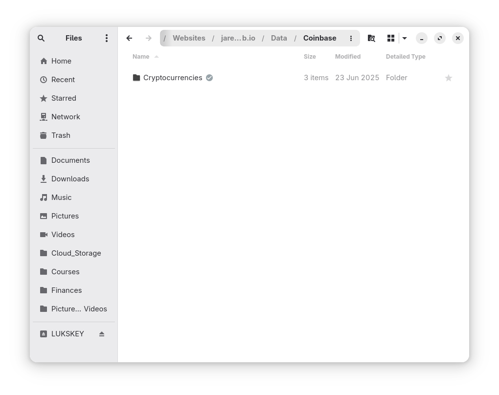
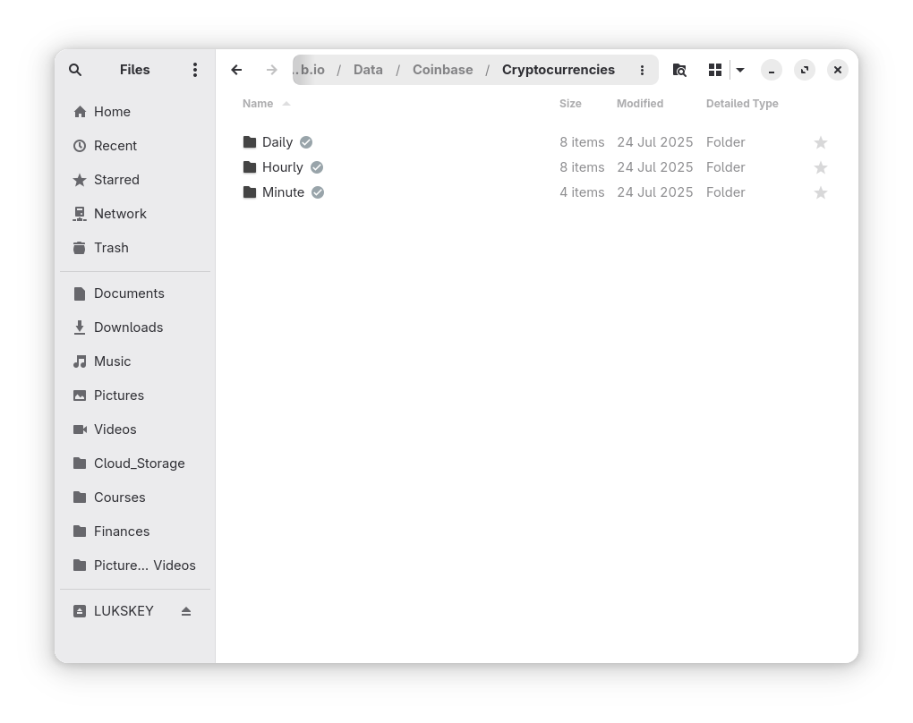
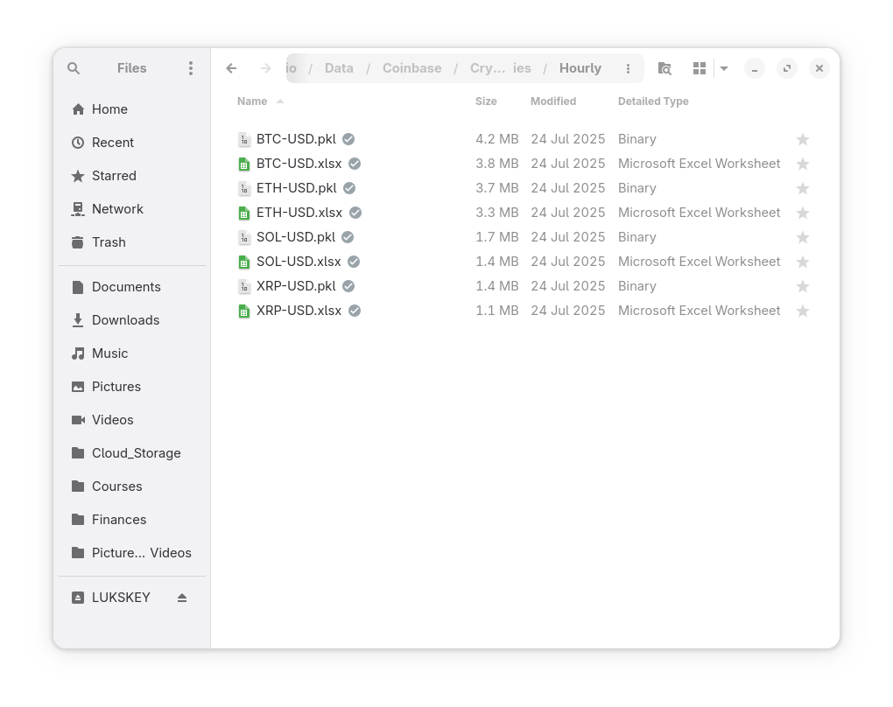

## Introduction

This is a quick post to illustrate how I collect and store crypto asset data from Coinbase. Essentially, the scripts below pull minute, hour, and daily data for the specified assets and if there is an existing data record, then the existing record is updated to include the most recent data. If there is not an existing data record, then the complete historical record from coinbase is pulled and stored.

## Python Functions

Here are the functions needed for this project:

* [coinbase_fetch_available_products](/2025/02/02/reusable-extensible-python-functions-financial-data-analysis/#coinbase_fetch_available_products): Fetch available products from Coinbase Exchange API.</br>
* [coinbase_fetch_full_history](/2025/02/02/reusable-extensible-python-functions-financial-data-analysis/#coinbase_fetch_full_history): Fetch full historical data for a given product from Coinbase Exchange API.</br>
* [coinbase_fetch_historical_candles](/2025/02/02/reusable-extensible-python-functions-financial-data-analysis/#coinbase_fetch_historical_candles): Fetch historical candle data for a given product from Coinbase Exchange API.</br>
* [coinbase_pull_data](/2025/02/02/reusable-extensible-python-functions-financial-data-analysis/#coinbase_pull_data): Update existing record or pull full historical data for a given product from Coinbase Exchange API.</br>

## Function Usage

### Coinbase Fetch Available Products

This script pulls the list of available assets based on the inputs for base and quote currency. Here's an example:

```python
df = coinbase_fetch_available_products(
    base_currency=None,
    quote_currency="USD",
    status="online",
)
```

In this example, the `quote_currency` is provided as "USD". This script checks all available assets that are priced against USD and returns a dataframe listing all available assets:

<!-- INSERT_coinbase_fetch_available_products_HERE -->

### Coinbase Fetch Historical Candles

This script pulls the historical candles:

```python
df = coinbase_fetch_historical_candles(
    product_id="BTC-USD",
    start=datetime(2025, 1, 1),
    end=datetime(2025, 1, 1),
    granularity=86_400,
)
```

Specifically, the date/time, open, high, low, close, and volume levels:

<!-- INSERT_coinbase_fetch_historical_candles_HERE -->

### Coinbase Fetch Full History

This script pulls the full history for a specified asset:

```python
df = coinbase_fetch_full_history(
    product_id="BTC-USD",
    start=datetime(2025, 1, 1),
    end=datetime(2025, 1, 31),
    granularity=86_400,
)
```

The example above pulls the daily data for 1 month, but can handle data ranges of years because it uses the `coinbase_fetch_historical_candles` to pull 300 candles at a time to ensure that the API is not overloaded and drops data. Here's the results for the above:

<!-- INSERT_coinbase_fetch_full_history_HERE -->

### Coinbase Pull Data

This script combines the above functions to perform the following:

1. Attempt to read an existing pickle data file
2. If a data file exists, then pull updated data
3. Otherwise, pull all historical data available for that asset on Coinbase
4. Store pickle and/or excel files of the data in the specified directories

Through the `base_directory`, `source`, and `asset_class` variables the script knows where in the local filesystem to look for an existing pickle file and the store the resulting updated pickle and/or excel files:

```python
df = coinbase_pull_data(
    base_directory=DATA_DIR,
    source="Coinbase",
    asset_class="Cryptocurrencies",
    excel_export=False,
    pickle_export=True,
    output_confirmation=True,
    base_currency="BTC",
    quote_currency="USD",
    granularity=60, # 60=minute, 3600=hourly, 86400=daily
    status='online', # default status is 'online'
    start_date=datetime(current_year, current_month - 1, 1), # default start date
    end_date=datetime.now() - timedelta(days=1), # updates data through 1 day ago due to lag in data availability
)
```

By passing `None` as the `base_currency` and/or the `quote_currency`, the script will use the `coinbase_fetch_available_products` function to pull the list of all the available products, and then pulls data for all assets in that list. This functionality is incredibly useful, and makes acquiring data very straightforward, especially for a set of products for a specific `base_currency` or `quote_currency`.

The example above pulls the data for BTC-USD, and stores it in the following system directory:

**BASE_DIR/DATA_DIR/Coinbase/Cryptocurrencies/Minute**

And here are a few screenshots of the filesystem:







## References

1. https://www.coinbase.com/

## Code

The jupyter notebook with the functions and all other code is available [here](data-pipelining-with-coinbase.ipynb).</br>
The html export of the jupyter notebook is available [here](data-pipelining-with-coinbase.html).</br>
The pdf export of the jupyter notebook is available [here](data-pipelining-with-coinbase.pdf).