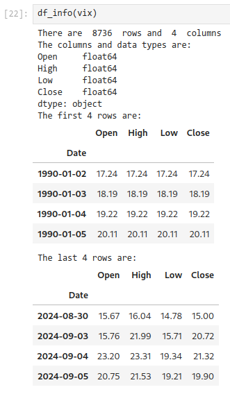
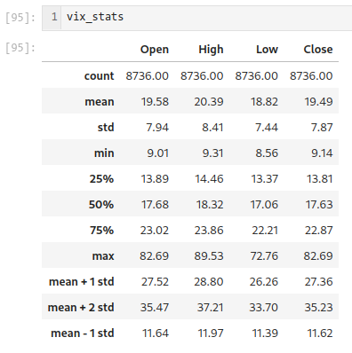
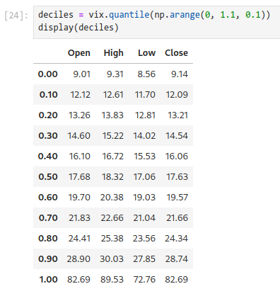
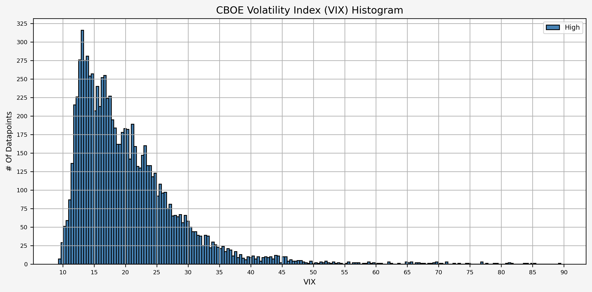
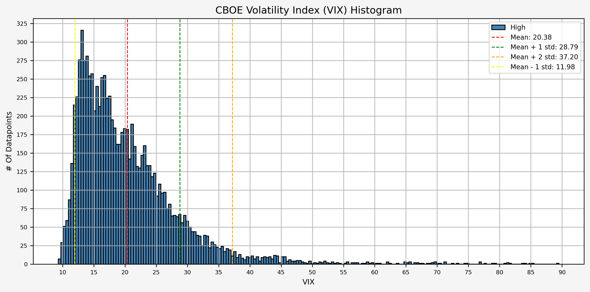
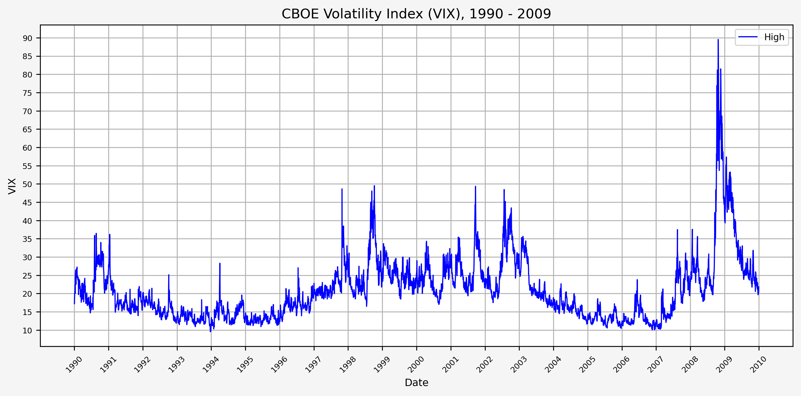
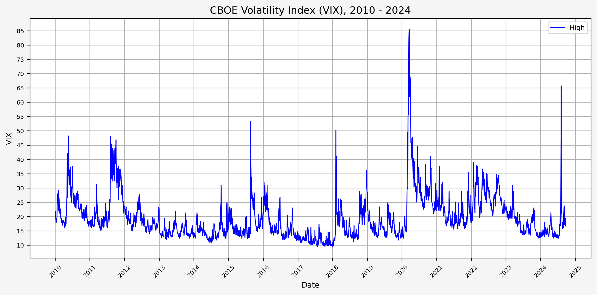

## Introduction

Harry Browne was an influencial politician, financial advisor, and author who lived from 1933 to 2006 and published 12 books. Wikipedia has [an in-depth biography](https://en.wikipedia.org/wiki/Harry_Browne) on him.

Within the world of finance and investing, one of his best known works is *Fail-Safe Investing: Lifelong Financial Security in 30 Minutes*. In it, he introduces the idea of the "Permanent Portfolio", an investment strategy that uses only four assets and is very simple to implement.

In this post, we will investigate Browne's suggested portfolio, including performance across various market cycles and economic regimes.

## Browne's Portfolio Requirements

In *Fail-Safe Investing*, under rule #11, Browne lays out the requirements for a "bulletproof portfolio" that will "assure that your wealth will survive any event - including events that would be devastating to any one investment. In other words, this portfolio should protect you *no matter what the future brings.*"

His requirements consist of the followng:

1. Safety: Protection again any economic future, including "inflation, recession, or even depression"
2. Stability: Performance should be consistent so that you will not need to make any changes and will not experience significant drawdowns
3. Simplicity: Easy to implement and take very little time to maintain

He then describes the four "broad movements" of the economy:

1. Prosperity: The economy is growing, business is doing well, interest rates are usually low
2. Inflation: The cost of goods and services is rising
3. Tight money or recession: The money supply is shrinking, economic activity is slowing
4. Deflation: Prices are declining and the value of money is increasing

## The Permanent Portfolio

Browne then matches an asset class to each of the economic conditions above:

1. Prosperity -> Stocks (due to prosperity) and long term bonds (when interest rates fall)
2. Inflation -> Gold
3. Deflation -> Long term bonds (when interest rates fall)
4. Tight money -> Cash

He completes the Permanent Portfolio by stipulating the following:

* Start with a base allocation of 25% to each of the asset classes
* Rebalance back to the base alllocation annually, or when "any of the four investments has become worth less than 15%, or more than 35%, of the portfolio's overall value"

## Data

For this exercise, we will use the following asset classes:

1. Stocks: S&P 500 (SPXT_S&P 500 Total Return Index)
2. Bonds: 10 Year US Treasuries (SPBDU10T_S&P US Treasury Bond 7-10 Year Total Return Index)
3. Gold: Gold Spot Price (XAU_Gold USD Spot)
4. Cash: USD

With the exception of cash, all data is sourced from Bloomberg.

We could use ETFs, but the available price history for the ETFs is much shorter than the indices above. If we wanted to use ETFs, the following would work:

1. Stocks: IVV - iShares Core S&P 500 ETF
2. Bonds: IEF - iShares 7-10 Year Treasury Bond ETF
3. Gold: GLD - SPDR Gold Shares ETF
4. Cash: USD

## Python Functions

First, a couple of useful python functions to help with the analysis:

### Clean Bloomberg Data Export

This is discussed [here](https://www.jaredszajkowski.com/2023/11/cleaning-a-bloomberg-data-excel-export/).

```html
# This function takes an excel export from Bloomberg and 
# removes all excess data leaving date and close columns

# Imports
import pandas as pd

# Function definition
def bb_data_updater(fund):

    # File name variable
    file = fund + "_Index.xlsx"
    
    # Import data from file as a pandas dataframe
    df = pd.read_excel(file, sheet_name = 'Worksheet', engine='openpyxl')
    
    # Set the column headings from row 5 (which is physically row 6)
    df.columns = df.iloc[5]
    
    # Set the column heading for the index to be "None"
    df.rename_axis(None, axis=1, inplace = True)
    
    # Drop the first 6 rows, 0 - 5
    df.drop(df.index[0:6], inplace=True)
    
    # Set the date column as the index
    df.set_index('Date', inplace = True)
    
    # Drop the volume column
    try:
        df.drop(columns = {'PX_VOLUME'}, inplace = True)
    except KeyError:
        pass
        
    # Rename column
    df.rename(columns = {'PX_LAST':'Close'}, inplace = True)
    
    # Sort by date
    df.sort_values(by=['Date'], inplace = True)
    
    # Export data to excel
    file = fund + ".xlsx"
    df.to_excel(file, sheet_name='data')
    
    # Output confirmation
    print(f"The last date of data for {fund} is: ")
    print(df[-1:])
    print(f"Bloomberg data conversion complete for {fund} data")
    return print(f"--------------------")
```

### Set Number Of Decimal Places

``` html
# Set number of decimal places in pandas

def dp(decimal_places):
    pd.set_option('display.float_format', lambda x: f'%.{decimal_places}f' % x)
```

### Return Information About A Dataframe

```html
# The `df_info` function returns some useful information about
# a dataframe, such as the columns, data types, and size.

def df_info(df):
    print('There are ', df.shape[0], ' rows and ', df.shape[1], ' columns')
    print('The columns and data types are:')
    print(df.dtypes)
    print('The first 4 rows are:')
    display(df.head(4))
    print('The last 4 rows are:')
    display(df.tail(4))
```

### Import Data From CSV / XLSX

``` html
def load_data(file):
    # Import CSV
    try:
        df = pd.read_csv(file)
    except:
        pass

    # Import excel
    try:
        df = pd.read_excel(file, sheet_name='data', engine='openpyxl')
    except:
        pass
        
    return df
```

## Portfolio Strategy

```html

```

## Data Overview

### Acquire Data

First, let's get the data:

``` html
yf_data_updater('^VIX')
```

### Load Data

Set our decimal places to something reasonable (like 2):

```html
dp(2)
```

Now that we have the data, let's load it up and take a look.

```html
# VIX
vix = load_data('^VIX.xlsx')

# Set 'Date' column as datetime
vix['Date'] = pd.to_datetime(vix['Date'])

# Drop 'Volume' and 'Adj Close'
vix.drop(columns = {'Adj Close', 'Volume'}, inplace = True)

# Set Date as index
vix.set_index('Date', inplace = True)
```

### Check For Missing Values & Forward Fill

```html
# Check to see if there are any NaN values
vix[vix['High'].isna()]

# Forward fill to clean up missing data
vix['High'].ffill(inplace = True)
```

### DataFrame Info

Now, running:

``` html
df_info(vix)
```

Gives us the following:



### Interesting Statistics

Some interesting statistics jump out at use when we look at the mean, standard deviation, min, and max values:

```html
vix_stats = vix.describe()
vix_stats.loc['mean + 1 std'] = {'Open': vix_stats.loc['mean']['Open'] + vix_stats.loc['std']['Open'],
                                 'High': vix_stats.loc['mean']['High'] + vix_stats.loc['std']['High'],
                                 'Low': vix_stats.loc['mean']['Low'] + vix_stats.loc['std']['Low'],
                                 'Close': vix_stats.loc['mean']['Close'] + vix_stats.loc['std']['Close']}
vix_stats.loc['mean + 2 std'] = {'Open': vix_stats.loc['mean']['Open'] + 2 * vix_stats.loc['std']['Open'],
                                 'High': vix_stats.loc['mean']['High'] + 2 * vix_stats.loc['std']['High'],
                                 'Low': vix_stats.loc['mean']['Low'] + 2 * vix_stats.loc['std']['Low'],
                                 'Close': vix_stats.loc['mean']['Close'] + 2 * vix_stats.loc['std']['Close']}
vix_stats.loc['mean - 1 std'] = {'Open': vix_stats.loc['mean']['Open'] - vix_stats.loc['std']['Open'],
                                 'High': vix_stats.loc['mean']['High'] - vix_stats.loc['std']['High'],
                                 'Low': vix_stats.loc['mean']['Low'] - vix_stats.loc['std']['Low'],
                                 'Close': vix_stats.loc['mean']['Close'] - vix_stats.loc['std']['Close']}
```



And the levels for each decile:

```html
deciles = vix.quantile(np.arange(0, 1.1, 0.1))
display(deciles)
```



A quick histogram gives us the distribution for the entire dataset:



Now, let's add the levels for the mean, mean + 1 standard deviation, mean - 1 standard deviation, and mean + 2 standard deviations:



### Historical VIX Plot

Here's two plots for the dataset. The first covers 1990 - 2009, and the second 2010 - 2024. This is the daily high level.





From this plot, we can see the following:

* The VIX has really only jumped above 50 several times (GFC, COVID, recently in August of 2024)
* The highest levels (> 80) occured only during the GFC & COVID
* Interestingly, the VIX did not ever get above 50 during the .com bubble

## Investigating A Signal

Next, we will consider the idea of a spike level in the VIX and how we might use a spike level to generate a signal. These elevated levels usually occur during market sell-off events or longer term drawdowns in the S&P 500. Sometimes the VIX reverts to recent levels after a spike, but other times levels remain elevated for weeks or even months.

### Spike Level

We will start the 10 day simple moving average (SMA) of the daily high level to get an idea of what is happening recently with the VIX. We'll then pick an arbitrary spike level (25% above the 10 day SMA), and our signal is generated if the VIX hits a level that is above the spike threshold.

The idea is that the 10 day SMA will smooth out the recent short term volatility in the VIX, and any gradual increases in the VIX are not interpreted as spike events.

We also will generate the 20 and 50 day SMAs for reference, and again to see what is happening with the level of the VIX over slightly longer timeframes.

Here's the code for the above:

```html
spike_level = 1.25
vix['SMA_10'] = vix['High'].rolling(10).mean()
vix['SMA_10_Shift'] = vix['SMA_10'].shift(1)
vix['Spike_Level'] = vix['SMA_10_Shift'] * spike_level
vix['Spike'] = vix['High'] >= vix['Spike_Level']
vix['SMA_20'] = vix['High'].rolling(20).mean()
vix['SMA_50'] = vix['High'].rolling(50).mean()
```

Now, let's look at the first 

## References

https://www.cboe.com/tradable_products/vix/</br>
https://github.com/ranaroussi/yfinance

## Code

The jupyter notebook with the functions and all other code is available [here](YF_Data_Updater.ipynb).