## Post Updates

Update 12/5/2024: Updated code for summary stats function, various code comments, and corrected grammatical errors.</br>
Update 2/19/2025: Various code updates, commented and documented functions.

## Introduction

Harry Browne was an influencial politician, financial advisor, and author who lived from 1933 to 2006 and published 12 books. Wikipedia has [an in-depth biography](https://en.wikipedia.org/wiki/Harry_Browne) on him.

Within the world of finance and investing, one of his best known works is *Fail-Safe Investing: Lifelong Financial Security in 30 Minutes*. In it, he introduces the idea of the "Permanent Portfolio", an investment strategy that uses only four assets and is very simple to implement.

In this post, we will investigate Browne's suggested portfolio, including performance across various market cycles and economic regimes.

## Browne's Portfolio Requirements

In *Fail-Safe Investing*, under rule #11, Browne lays out the requirements for a "bulletproof portfolio" that will "assure that your wealth will survive any event - including events that would be devastating to any one investment. In other words, this portfolio should protect you *no matter what the future brings.*"

His requirements for the portfolio consist of the followng:

1. Safety: Protection again any economic future, including "inflation, recession, or even depression"
2. Stability: Performance should be consistent so that you will not need to make any changes and will not experience significant drawdowns
3. Simplicity: Easy to implement and take very little time to maintain

He then describes the four "broad movements" of the economy:

1. Prosperity: The economy is growing, business is doing well, interest rates are usually low
2. Inflation: The cost of goods and services is rising
3. Tight money or recession: The money supply is shrinking, economic activity is slowing
4. Deflation: Prices are declining and the value of money is increasing

## The Permanent Portfolio

Browne then matches an asset class to each of the economic conditions above:

1. Prosperity -> Stocks (due to prosperity) and long term bonds (when interest rates fall)
2. Inflation -> Gold
3. Deflation -> Long term bonds (when interest rates fall)
4. Tight money -> Cash

He completes the Permanent Portfolio by stipulating the following:

* Start with a base allocation of 25% to each of the asset classes (stocks, bonds, gold, cash)
* Rebalance back to the base allocation annually, or when "any of the four investments has become worth less than 15%, or more than 35%, of the portfolio's overall value"</br>**Note:** Browne does not specify when the portfolio should be rebalanced; therefore, we will make an assumption of a January 1st rebalance.

## Data

For this exercise, we will use the following asset classes:

1. Stocks: S&P 500 (SPXT_S&P 500 Total Return Index)
2. Bonds: 10 Year US Treasuries (SPBDU10T_S&P US Treasury Bond 7-10 Year Total Return Index)
3. Gold: Gold Spot Price (XAU_Gold USD Spot)
4. Cash: USD

With the exception of cash, all data is sourced from Bloomberg.

We could use ETFs, but the available price history for the ETFs is much shorter than the indices above. If we wanted to use ETFs, the following would work:

1. Stocks: IVV - iShares Core S&P 500 ETF
2. Bonds: IEF - iShares 7-10 Year Treasury Bond ETF
3. Gold: GLD - SPDR Gold Shares ETF
4. Cash: USD

## Python Functions

First, a couple of useful python functions to help with the analysis.

### Clean Bloomberg Data Export

This is discussed [here](https://www.jaredszajkowski.com/2023/11/15/cleaning-a-bloomberg-data-excel-export/).

```python
# This function takes an excel export from Bloomberg and 
# removes all excess data leaving date and close columns

# Imports
import pandas as pd

# Function definition
def bb_data_updater(fund):

    # File name variable
    file = fund + ".xlsx"
    
    # Import data from file as a pandas dataframe
    df = pd.read_excel(file, sheet_name = 'Worksheet', engine='openpyxl')
    
    # Set the column headings from row 5 (which is physically row 6)
    df.columns = df.iloc[5]
    
    # Set the column heading for the index to be "None"
    df.rename_axis(None, axis=1, inplace = True)
    
    # Drop the first 6 rows, 0 - 5
    df.drop(df.index[0:6], inplace=True)
    
    # Set the date column as the index
    df.set_index('Date', inplace = True)
    
    # Drop the volume column
    try:
        df.drop(columns = {'PX_VOLUME'}, inplace = True)
    except KeyError:
        pass
        
    # Rename column
    df.rename(columns = {'PX_LAST':'Close'}, inplace = True)
    
    # Sort by date
    df.sort_values(by=['Date'], inplace = True)
    
    # Export data to excel
    file = fund + "_Clean.xlsx"
    df.to_excel(file, sheet_name='data')
    
    # Output confirmation
    print(f"The last date of data for {fund} is: ")
    print(df[-1:])
    print(f"Bloomberg data conversion complete for {fund} data")
    return print(f"--------------------")
```

### Set Number Of Decimal Places

``` python
# Set number of decimal places in pandas

def dp(decimal_places):
    pd.set_option('display.float_format', lambda x: f'%.{decimal_places}f' % x)
```

### Return Information About A Dataframe

```python
# The `df_info` function returns some useful information about
# a dataframe, such as the columns, data types, and size.

def df_info(df):
    print('The columns, shape, and data types are:')
    print(df.info())
    print('The first 5 rows are:')
    display(df.head())
    print('The last 5 rows are:')
    display(df.tail())
```

### Import Data From CSV / XLSX

```python
def load_data(file):
    # Import CSV
    try:
        df = pd.read_csv(file)
    except:
        pass

    # Import excel
    try:
        df = pd.read_excel(file, sheet_name='data', engine='openpyxl')
    except:
        pass
        
    return df
```

### Portfolio Strategy

This is the function that executes the strategy. The function takes in the following variables and produces a dataframe with the results:

* fund_list: This is a list of the funds (in this case asset classes) to be used
* starting_cash: Starting capital amount for the strategy
* cash_contrib: Daily cash contribution
* close_prices_df; Dataframe with close prices for each asset class
* rebal_month: Month that the annual rebalancing should take place
* rebal_day: Day of the month that the annual rebalancing should take place

```python
def strategy(
    fund_list, 
    starting_cash, 
    cash_contrib, 
    close_prices_df, 
    rebal_month, 
    rebal_day, 
    rebal_per_high, 
    rebal_per_low
):

    """
    Execute the rebalance strategy based on specified criteria.

    Args:
        fund_list (str): List of funds for data to be combined from. Funds are strings in the form "BTC-USD".
        starting_cash (int): Starting investment balance.
        cash_contrib (int): Cash contribution to be made daily.
        close_prices_df (pd.DataFrame): DataFrame containing date and close prices for all funds to be included.
        rebal_month (int): Month for annual rebalance.
        rebal_day (int): Day for annual rebalance.
        rebal_per_high (float): High percentage for rebalance.
        rebal_per_low (float): Low percentage for rebalance.

    Returns:
        pd.DataFrame: DataFrame containing strategy data for all funds to be included. Also dumps the df to excel for reference later.
    """
    
    num_funds = len(fund_list)

    df = close_prices_df.copy()
    df.reset_index(inplace = True)

    # Date to be used for annual rebalance
    target_month = rebal_month
    target_day = rebal_day

    # Create a dataframe with dates from the specific month
    rebal_date = df[df['Date'].dt.month == target_month]

    # Specify the date or the next closest
    rebal_date = rebal_date[rebal_date['Date'].dt.day >= target_day]

    # Group by year and take the first entry for each year
    rebal_dates_by_year = rebal_date.groupby(rebal_date['Date'].dt.year).first().reset_index(drop=True)

    '''
    Column order for the dataframe:
    df[fund + "_BA_Shares"]
    df[fund + "_BA_$_Invested"]
    df[fund + "_BA_Port_%"]
    df['Total_BA_$_Invested']
    df['Contribution']
    df['Rebalance']
    df[fund + "_AA_Shares"]
    df[fund + "_AA_$_Invested"]
    df[fund + "_AA_Port_%"]
    df['Total_AA_$_Invested']
    '''

    # Calculate the columns and initial values for before action (BA) shares, $ invested, and port %
    for fund in fund_list:
        df[fund + "_BA_Shares"] = starting_cash / num_funds / df[fund + "_Close"]
        df[fund + "_BA_$_Invested"] = df[fund + "_BA_Shares"] * df[fund + "_Close"]
        df[fund + "_BA_Port_%"] = 0.25

    # Set column values initially
    df['Total_BA_$_Invested'] = starting_cash
    df['Contribution'] = 0
    # df['Contribution'] = cash_contrib
    df['Rebalance'] = "No"

    # Set columns and values initially for after action (AA) shares, $ invested, and port %
    for fund in fund_list:
        df[fund + "_AA_Shares"] = starting_cash / num_funds / df[fund + "_Close"]
        df[fund + "_AA_$_Invested"] = df[fund + "_AA_Shares"] * df[fund + "_Close"]
        df[fund + "_AA_Port_%"] = 0.25
        
    # Set column value for after action (AA) total $ invested
    df['Total_AA_$_Invested'] = starting_cash

    # Iterate through the dataframe and execute the strategy
    for index, row in df.iterrows():

        # Ensure there's a previous row to reference by checking the index value
        if index > 0:

            # Initialize variable
            Total_BA_Invested = 0

            # Calculate before action (BA) shares and $ invested values
            for fund in fund_list:
                df.at[index, fund + "_BA_Shares"] = df.at[index - 1, fund + "_AA_Shares"]
                df.at[index, fund + "_BA_$_Invested"] = df.at[index, fund + "_BA_Shares"] * row[fund + "_Close"]

                # Sum the asset values to find the total
                Total_BA_Invested = Total_BA_Invested + df.at[index, fund + "_BA_$_Invested"]

            # Calculate before action (BA) port % values
            for fund in fund_list:
                df.at[index, fund + "_BA_Port_%"] = df.at[index, fund + "_BA_$_Invested"] / Total_BA_Invested

            # Set column for before action (BA) total $ invested
            df.at[index, 'Total_BA_$_Invested'] = Total_BA_Invested

            # Initialize variables
            rebalance = "No"
            date = row['Date']

            # Check for a specific date annually
            # Simple if statement to check if date_to_check is in jan_28_or_after_each_year
            if date in rebal_dates_by_year['Date'].values:
                rebalance = "Yes"
            else:
                pass

            # Check to see if any asset has portfolio percentage of greater than 35% or less than 15% and if so set variable
            for fund in fund_list:
                if df.at[index, fund + "_BA_Port_%"] > rebal_per_high or df.at[index, fund + "_BA_Port_%"] < rebal_per_low:
                    rebalance = "Yes"
                else:
                    pass

            # If rebalance is required, rebalance back to 25% for each asset, else just divide contribution evenly across assets
            if rebalance == "Yes":
                df.at[index, 'Rebalance'] = rebalance
                for fund in fund_list:
                        df.at[index, fund + "_AA_$_Invested"] = (Total_BA_Invested + df.at[index, 'Contribution']) * 0.25
            else:
                df.at[index, 'Rebalance'] = rebalance
                for fund in fund_list:
                        df.at[index, fund + "_AA_$_Invested"] = df.at[index, fund + "_BA_$_Invested"] + df.at[index, 'Contribution'] * 0.25

            # Initialize variable
            Total_AA_Invested = 0

            # Set column values for after action (AA) shares and port %
            for fund in fund_list:
                df.at[index, fund + "_AA_Shares"] = df.at[index, fund + "_AA_$_Invested"] / row[fund + "_Close"]

                # Sum the asset values to find the total
                Total_AA_Invested = Total_AA_Invested + df.at[index, fund + "_AA_$_Invested"]

            # Calculate after action (AA) port % values
            for fund in fund_list:
                df.at[index, fund + "_AA_Port_%"] = df.at[index, fund + "_AA_$_Invested"] / Total_AA_Invested

            # Set column for after action (AA) total $ invested
            df.at[index, 'Total_AA_$_Invested'] = Total_AA_Invested

        # If this is the first row
        else:
            pass

    df['Return'] = df['Total_AA_$_Invested'].pct_change()
    df['Cumulative_Return'] = (1 + df['Return']).cumprod()

    plan_name = '_'.join(fund_list)
    file = plan_name + "_Strategy.xlsx"
    location = file
    df.to_excel(location, sheet_name="data")
    print(f"Strategy complete for {plan_name}.")
    return df
```

### Summary Stats

```python
# Stats for entire data set
def summary_stats(
    fund_list, 
    df, 
    period,
    excel_export
):
    
    """
    Calculate summary statistics for the given fund list and return data.

    Args:
        fund_list (str): List of funds for data to be combined from. Funds are strings in the form "BTC-USD".
        df (df): Dataframe with return data.
        period (str): Period for which to calculate statistics. Options are "Monthly", "Weekly", "Daily", "Hourly".
        excel_export (bool): If True, export to excel file.

    Returns:
        pd.DataFrame: DataFrame containing various portfolio statistics.
    """

    if period == "Monthly":
        timeframe = 12 # months
    elif period == "Weekly":
        timeframe = 52 # weeks
    elif period == "Daily":
        timeframe = 365 # days
    elif period == "Hourly":
        timeframe = 8760 # hours
    else:
        return print("Error, check inputs")

    df_stats = pd.DataFrame(df.mean(axis=0) * timeframe) # annualized
    # df_stats = pd.DataFrame((1 + df.mean(axis=0)) ** timeframe - 1) # annualized, this is this true annualized return but we will simply use the mean
    df_stats.columns = ['Annualized Mean']
    df_stats['Annualized Volatility'] = df.std() * np.sqrt(timeframe) # annualized
    df_stats['Annualized Sharpe Ratio'] = df_stats['Annualized Mean'] / df_stats['Annualized Volatility']

    df_cagr = (1 + df['Return']).cumprod()
    cagr = (df_cagr.iloc[-1] / 1) ** (1/(len(df_cagr) / timeframe)) - 1
    df_stats['CAGR'] = cagr

    df_stats[period + ' Max Return'] = df.max()
    df_stats[period + ' Max Return (Date)'] = df.idxmax().values[0]
    df_stats[period + ' Min Return'] = df.min()
    df_stats[period + ' Min Return (Date)'] = df.idxmin().values[0]
    
    wealth_index = 1000*(1+df).cumprod()
    previous_peaks = wealth_index.cummax()
    drawdowns = (wealth_index - previous_peaks)/previous_peaks

    df_stats['Max Drawdown'] = drawdowns.min()
    df_stats['Peak'] = [previous_peaks[col][:drawdowns[col].idxmin()].idxmax() for col in previous_peaks.columns]
    df_stats['Bottom'] = drawdowns.idxmin()

    recovery_date = []
    for col in wealth_index.columns:
        prev_max = previous_peaks[col][:drawdowns[col].idxmin()].max()
        recovery_wealth = pd.DataFrame([wealth_index[col][drawdowns[col].idxmin():]]).T
        recovery_date.append(recovery_wealth[recovery_wealth[col] >= prev_max].index.min())
    df_stats['Recovery Date'] = recovery_date

    plan_name = '_'.join(fund_list)

    # Export to excel
    if excel_export == True:
        
        file = plan_name + "_Summary_Stats.xlsx"
        location = file
        # location = f"{base_directory}/{strategy_name}/{file_name}.xlsx"
        df_stats.to_excel(location, sheet_name="data")
    else:
        pass

    print(f"Summary stats complete for {plan_name}.")
    return df_stats
```

### Plot Cumulative Return

```python
def plot_cumulative_return(strat_df):
    # Generate plot
    plt.figure(figsize=(10, 5), facecolor = '#F5F5F5')

    # Plotting data
    plt.plot(strat_df.index, strat_df['Cumulative_Return'], label = 'Strategy Cumulative Return', linestyle='-', color='green', linewidth=1)
    
    # Set X axis
    # x_tick_spacing = 5  # Specify the interval for x-axis ticks
    # plt.gca().xaxis.set_major_locator(MultipleLocator(x_tick_spacing))
    plt.gca().xaxis.set_major_locator(mdates.YearLocator())
    plt.gca().xaxis.set_major_formatter(mdates.DateFormatter('%Y'))
    plt.xlabel('Year', fontsize = 9)
    plt.xticks(rotation = 45, fontsize = 7)
    # plt.xlim(, )

    # Set Y axis
    y_tick_spacing = 0.5  # Specify the interval for y-axis ticks
    plt.gca().yaxis.set_major_locator(MultipleLocator(y_tick_spacing))
    plt.ylabel('Cumulative Return', fontsize = 9)
    plt.yticks(fontsize = 7)
    plt.ylim(0, 7.5)

    # Set title, etc.
    plt.title('Cumulative Return', fontsize = 12)
    
    # Set the grid & legend
    plt.tight_layout()
    plt.grid(True)
    plt.legend(fontsize=8)

    # Save the figure
    plt.savefig('03_Cumulative_Return.png', dpi=300, bbox_inches='tight')

    # Display the plot
    return plt.show()
```

### Plot Portfolio Values

```python
def plot_values(strat_df):   
    # Generate plot   
    plt.figure(figsize=(10, 5), facecolor = '#F5F5F5')
    
    # Plotting data
    plt.plot(strat_df.index, strat_df['Total_AA_$_Invested'], label='Total Portfolio Value', linestyle='-', color='black', linewidth=1)
    plt.plot(strat_df.index, strat_df['Stocks_AA_$_Invested'], label='Stocks Position Value', linestyle='-', color='orange', linewidth=1)
    plt.plot(strat_df.index, strat_df['Bonds_AA_$_Invested'], label='Bond Position Value', linestyle='-', color='yellow', linewidth=1)
    plt.plot(strat_df.index, strat_df['Gold_AA_$_Invested'], label='Gold Position Value', linestyle='-', color='blue', linewidth=1)
    plt.plot(strat_df.index, strat_df['Cash_AA_$_Invested'], label='Cash Position Value', linestyle='-', color='brown', linewidth=1)

    # Set X axis
    # x_tick_spacing = 5  # Specify the interval for x-axis ticks
    # plt.gca().xaxis.set_major_locator(MultipleLocator(x_tick_spacing))
    plt.gca().xaxis.set_major_locator(mdates.YearLocator())
    plt.gca().xaxis.set_major_formatter(mdates.DateFormatter('%Y'))
    plt.xlabel('Year', fontsize = 9)
    plt.xticks(rotation = 45, fontsize = 7)
    # plt.xlim(, )


    # Set Y axis
    y_tick_spacing = 5000  # Specify the interval for y-axis ticks
    plt.gca().yaxis.set_major_locator(MultipleLocator(y_tick_spacing))
    plt.gca().yaxis.set_major_formatter(mtick.FuncFormatter(lambda x, pos: '{:,.0f}'.format(x))) # Adding commas to y-axis labels
    plt.ylabel('Total Value ($)', fontsize = 9)
    plt.yticks(fontsize = 7)
    plt.ylim(0, 75000)

    # Set title, etc.
    plt.title('Total Values For Stocks, Bonds, Gold, and Cash Positions and Portfolio', fontsize = 12)
    
    # Set the grid & legend
    plt.tight_layout()
    plt.grid(True)
    plt.legend(fontsize=8)

    # Save the figure
    plt.savefig('04_Portfolio_Values.png', dpi=300, bbox_inches='tight')

    # Display the plot
    return plt.show()
```

### Plot Portfolio Drawdown

```python
def plot_drawdown(strat_df):
    rolling_max = strat_df['Total_AA_$_Invested'].cummax()
    drawdown = (strat_df['Total_AA_$_Invested'] - rolling_max) / rolling_max * 100

    # Generate plot   
    plt.figure(figsize=(10, 5), facecolor = '#F5F5F5')

    # Plotting data
    plt.plot(strat_df.index, drawdown, label='Drawdown', linestyle='-', color='red', linewidth=1)
    
    # Set X axis
    # x_tick_spacing = 5  # Specify the interval for x-axis ticks
    # plt.gca().xaxis.set_major_locator(MultipleLocator(x_tick_spacing))
    plt.gca().xaxis.set_major_locator(mdates.YearLocator())
    plt.gca().xaxis.set_major_formatter(mdates.DateFormatter('%Y'))
    plt.xlabel('Year', fontsize = 9)
    plt.xticks(rotation = 45, fontsize = 7)
    # plt.xlim(, )

    # Set Y axis
    y_tick_spacing = 1  # Specify the interval for y-axis ticks
    plt.gca().yaxis.set_major_locator(MultipleLocator(y_tick_spacing))
    # plt.gca().yaxis.set_major_formatter(mtick.FuncFormatter(lambda x, pos: '{:,.0f}'.format(x))) # Adding commas to y-axis labels
    plt.gca().yaxis.set_major_formatter(mtick.FuncFormatter(lambda x, pos: '{:.0f}'.format(x))) # Adding 0 decimal places to y-axis labels
    plt.ylabel('Drawdown (%)', fontsize = 9)
    plt.yticks(fontsize = 7)
    plt.ylim(-20, 0)

    # Set title, etc.
    plt.title('Portfolio Drawdown', fontsize = 12)
    
    # Set the grid & legend
    plt.tight_layout()
    plt.grid(True)
    plt.legend(fontsize=8)

    # Save the figure
    plt.savefig('05_Portfolio_Drawdown.png', dpi=300, bbox_inches='tight')

    # Display the plot
    return plt.show()
```

### Plot Portfolio Asset Weights

```python
def plot_asset_weights(strat_df):
    # Generate plot   
    plt.figure(figsize=(10, 5), facecolor = '#F5F5F5')
    
    # Plotting data
    plt.plot(strat_df.index, strat_df['Stocks_AA_Port_%'] * 100, label='Stocks Portfolio Weight', linestyle='-', color='orange', linewidth=1)
    plt.plot(strat_df.index, strat_df['Bonds_AA_Port_%'] * 100, label='Bonds Portfolio Weight', linestyle='-', color='yellow', linewidth=1)
    plt.plot(strat_df.index, strat_df['Gold_AA_Port_%'] * 100, label='Gold Portfolio Weight', linestyle='-', color='blue', linewidth=1)
    plt.plot(strat_df.index, strat_df['Cash_AA_Port_%'] * 100, label='Cash Portfolio Weight', linestyle='-', color='brown', linewidth=1)

    # Set X axis
    # x_tick_spacing = 5  # Specify the interval for x-axis ticks
    # plt.gca().xaxis.set_major_locator(MultipleLocator(x_tick_spacing))
    plt.gca().xaxis.set_major_locator(mdates.YearLocator())
    plt.gca().xaxis.set_major_formatter(mdates.DateFormatter('%Y'))
    plt.xlabel('Year', fontsize = 9)
    plt.xticks(rotation = 45, fontsize = 7)
    # plt.xlim(, )

    # Set Y axis
    y_tick_spacing = 2  # Specify the interval for y-axis ticks
    plt.gca().yaxis.set_major_locator(MultipleLocator(y_tick_spacing))
    # plt.gca().yaxis.set_major_formatter(mtick.FuncFormatter(lambda x, pos: '{:,.0f}'.format(x))) # Adding commas to y-axis labels
    plt.ylabel('Asset Weight (%)', fontsize = 9)
    plt.yticks(fontsize = 7)
    plt.ylim(14, 36)

    # Set title, etc.
    plt.title('Portfolio Asset Weights For Stocks, Bonds, Gold, and Cash Positions', fontsize = 12)
    
    # Set the grid & legend
    plt.tight_layout()
    plt.grid(True)
    plt.legend(fontsize=8)

    # Save the figure
    plt.savefig('07_Portfolio_Weights.png', dpi=300, bbox_inches='tight')

    # Display the plot
    return plt.show()
```

## Data Overview

### Import Data

As previously mentioned, the data for this exercise comes primarily from Bloomberg. We'll start with loading the data first for bonds:

``` python
# Bonds dataframe
bb_data_updater('SPBDU10T_S&P US Treasury Bond 7-10 Year Total Return Index')
bonds_data = load_data('SPBDU10T_S&P US Treasury Bond 7-10 Year Total Return Index_Clean.xlsx')
bonds_data['Date'] = pd.to_datetime(bonds_data['Date'])
bonds_data.set_index('Date', inplace = True)
bonds_data = bonds_data[(bonds_data.index >= '1990-01-01') & (bonds_data.index <= '2023-12-31')]
bonds_data.rename(columns={'Close':'Bonds_Close'}, inplace=True)
bonds_data['Bonds_Daily_Return'] = bonds_data['Bonds_Close'].pct_change()
bonds_data['Bonds_Total_Return'] = (1 + bonds_data['Bonds_Daily_Return']).cumprod()
bonds_data
```

The following is the output:

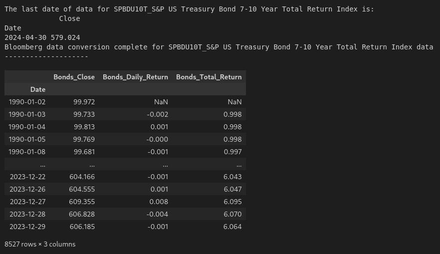

Then for stocks:

```python
# Stocks dataframe
bb_data_updater('SPXT_S&P 500 Total Return Index')
stocks_data = load_data('SPXT_S&P 500 Total Return Index_Clean.xlsx')
stocks_data['Date'] = pd.to_datetime(stocks_data['Date'])
stocks_data.set_index('Date', inplace = True)
stocks_data = stocks_data[(stocks_data.index >= '1990-01-01') & (stocks_data.index <= '2023-12-31')]
stocks_data.rename(columns={'Close':'Stocks_Close'}, inplace=True)
stocks_data['Stocks_Daily_Return'] = stocks_data['Stocks_Close'].pct_change()
stocks_data['Stocks_Total_Return'] = (1 + stocks_data['Stocks_Daily_Return']).cumprod()
stocks_data
```

The following is the output:

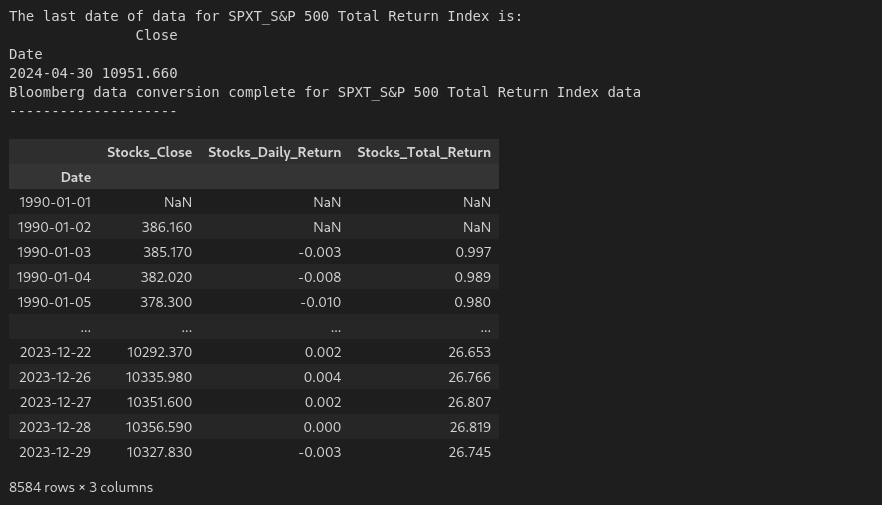

And finally, gold:

```python
# Gold dataframe
bb_data_updater('XAU_Gold USD Spot')
gold_data = load_data('XAU_Gold USD Spot_Clean.xlsx')
gold_data['Date'] = pd.to_datetime(gold_data['Date'])
gold_data.set_index('Date', inplace = True)
gold_data = gold_data[(gold_data.index >= '1990-01-01') & (gold_data.index <= '2023-12-31')]
gold_data.rename(columns={'Close':'Gold_Close'}, inplace=True)
gold_data['Gold_Daily_Return'] = gold_data['Gold_Close'].pct_change()
gold_data['Gold_Total_Return'] = (1 + gold_data['Gold_Daily_Return']).cumprod()
gold_data
```

The following is the output:

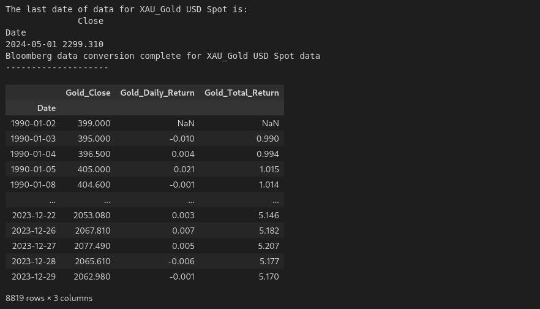

### Combine Data

We'll now combine the dataframes for the timeseries data from each of the asset classes, as follows:

```python
# Merge the stock data and bond data into a single DataFrame using their indices (dates)
perm_port = pd.merge(stocks_data['Stocks_Close'], bonds_data['Bonds_Close'], left_index=True, right_index=True)

# Add gold data to the portfolio DataFrame by merging it with the existing data on indices (dates)
perm_port = pd.merge(perm_port, gold_data['Gold_Close'], left_index=True, right_index=True)

# Add a column for cash with a constant value of 1 (assumes the value of cash remains constant at $1 over time)
perm_port['Cash_Close'] = 1

# Remove any rows with missing values (NaN) to ensure clean data for further analysis
perm_port.dropna(inplace=True)

# Display the finalized portfolio DataFrame
perm_port
```

### DataFrame Info

Now, running:

``` python
df_info(perm_port)
```

Gives us the following:

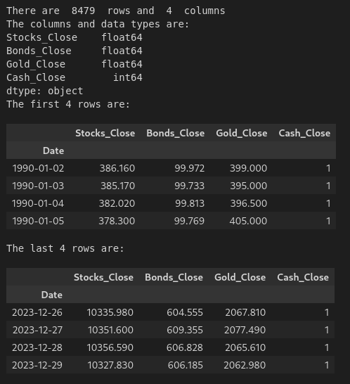

We can see that we have close data for all 4 asset classes from the beginning of 1990 to the end of 2023.

## Execute Strategy

Using an annual rebalance date of January 1, we'll now execute the strategy with the following code:

```python
# List of funds to be used
fund_list = ['Stocks', 'Bonds', 'Gold', 'Cash']

# Starting cash contribution
starting_cash = 10000

# Monthly cash contribution
cash_contrib = 0

strat = strategy(
    fund_list=fund_list, 
    starting_cash=starting_cash, 
    cash_contrib=cash_contrib, 
    close_prices_df=perm_port, 
    rebal_month=1, 
    rebal_day=1, 
    rebal_per_high=0.35, 
    rebal_per_low=0.15)

strat = strat.set_index('Date')

sum_stats = summary_stats(
    fund_list=fund_list,
    df=strat[['Return']],
    period="Daily",
    excel_export=False)

strat_pre_1999 = strat[strat.index < '2000-01-01']
sum_stats_pre_1999 = summary_stats(
    fund_list=fund_list, 
    df=strat_pre_1999[['Return']], 
    period="Daily",
    excel_export=False)

strat_post_1999 = strat[strat.index >= '2000-01-01']
sum_stats_post_1999 = summary_stats(
    fund_list=fund_list, 
    df=strat_post_1999[['Return']], 
    period="Daily",
    excel_export=False)

strat_post_2009 = strat[strat.index >= '2010-01-01']
sum_stats_post_2009 = summary_stats(
    fund_list=fund_list, 
    df=strat_post_2009[['Return']], 
    period="Daily",
    excel_export=False)
```

## Strategy Statistics

```python
all_sum_stats = pd.concat([sum_stats])
all_sum_stats = all_sum_stats.rename(index={'Return': '1990 - 2023'})
all_sum_stats = pd.concat([all_sum_stats, sum_stats_pre_1999])
all_sum_stats = all_sum_stats.rename(index={'Return': 'Pre 1999'})
all_sum_stats = pd.concat([all_sum_stats, sum_stats_post_1999])
all_sum_stats = all_sum_stats.rename(index={'Return': 'Post 1999'})
all_sum_stats = pd.concat([all_sum_stats, sum_stats_post_2009])
all_sum_stats = all_sum_stats.rename(index={'Return': 'Post 2009'})
all_sum_stats
```

Since the strategy, summary statistics, and annual returns are all exported as excel files, they can be found at the following locations:

[Stocks_Bonds_Gold_Cash_Strategy.xlsx](Stocks_Bonds_Gold_Cash_Strategy.xlsx)</br>
[Stocks_Bonds_Gold_Cash_Summary_Stats.xlsx](Stocks_Bonds_Gold_Cash_Summary_Stats.xlsx)</br>
[Stocks_Bonds_Gold_Cash_Annual_Returns.xlsx](Stocks_Bonds_Gold_Cash_Annual_Returns.xlsx)</br>

Here's the summary stats for the example above including the various timeframes:

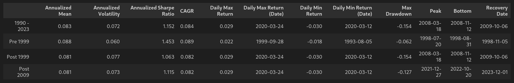

Here we have a mean annualized return of 8.3%, volatility of 7.2%, a CAGR of 8.4% and a Sharpe ratio of 1.15. And this with a max drawdown of just over 15%. Not bad, Mr. Browne!

Since the book was published in 1999, let's look specifically at the summary stats for below and after 1999.

The mean annualized return is approximately 0.7% lower for the pre 1999 vs post 1999 data, as is the CAGR. The volatility is higher for the post 1999 data which leads to a difference in the Sharpe ratio.

Here's the annual returns:

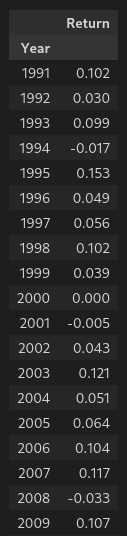
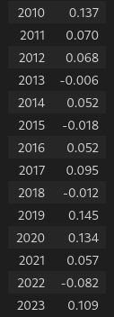

## Generate Plots

```python
plot_cumulative_return(strat)
plot_values(strat)
plot_drawdown(strat)
plot_asset_weights(strat)

# Create dataframe for the annual returns
strat_annual_returns = strat['Cumulative_Return'].resample('Y').last().pct_change().dropna()
strat_annual_returns_df = strat_annual_returns.to_frame()
strat_annual_returns_df['Year'] = strat_annual_returns_df.index.year  # Add a 'Year' column with just the year
strat_annual_returns_df.reset_index(drop=True, inplace=True)  # Reset the index to remove the datetime index

# Now the DataFrame will have 'Year' and 'Cumulative_Return' columns
strat_annual_returns_df = strat_annual_returns_df[['Year', 'Cumulative_Return']]  # Keep only 'Year' and 'Cumulative_Return' columns
strat_annual_returns_df.rename(columns = {'Cumulative_Return':'Return'}, inplace=True)
strat_annual_returns_df.set_index('Year', inplace=True)
display(strat_annual_returns_df)

plan_name = '_'.join(fund_list)
file = plan_name + "_Annual_Returns.xlsx"
location = file
strat_annual_returns_df.to_excel(location, sheet_name='data')

plot_annual_returns(strat_annual_returns_df)
```

Here are several relevant plots:

1. Cumulative Return

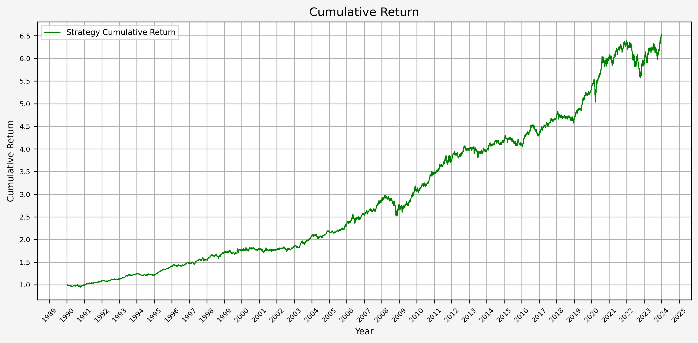

2. Portfolio Values (Total, Stocks, Bonds, Gold, and Cash)

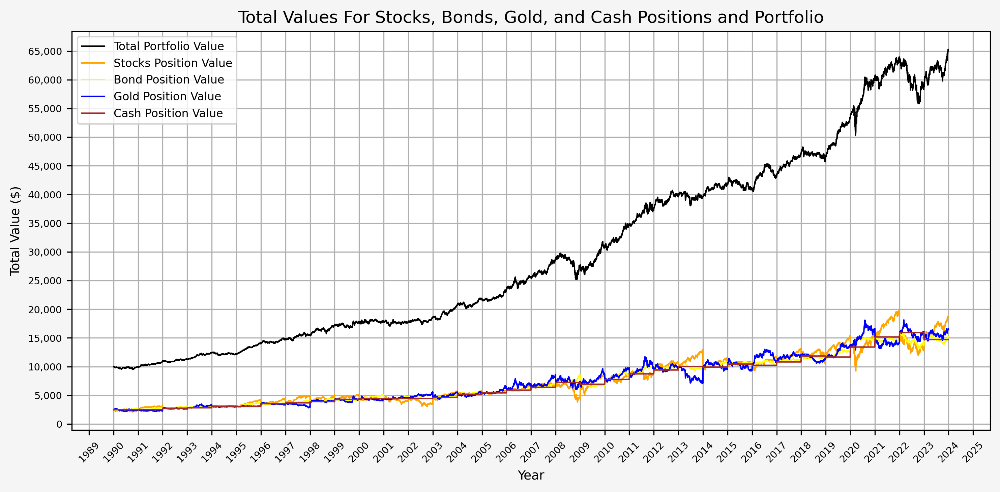

Here we can see the annual rebalancing taking effect with the values of the different asset classes. This can also be seen more clearly below.

3. Portfolio Drawdown


From this plot, we can see that the maximum drawdown came during the GFC; the drawdown during COVID was (interestingly) less than 10%.

4. Portfolio Asset Weights

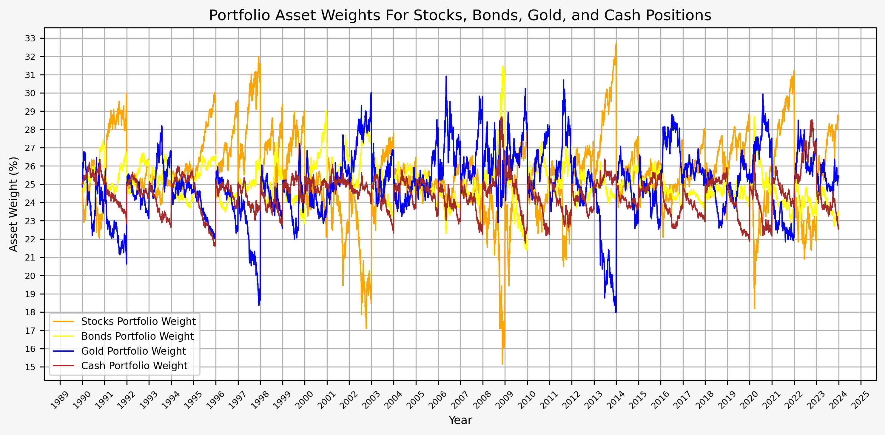

The annual rebalancing appears to work effectively by selling assets that have increased in value and buying assets that have decreased in value over the previous year. Also note that there is only one instance when the weight of an asset fell to 15%. This occured for stocks during the GFC.

5. Portfolio Annual Returns

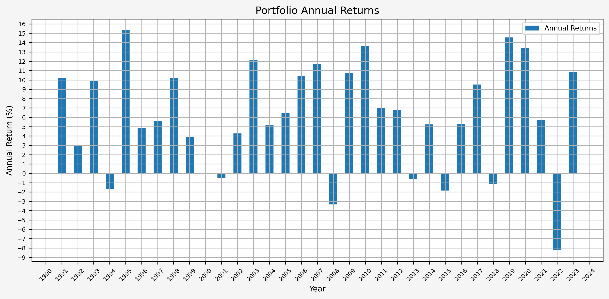

It's interesting to see that there really aren't any significant up or down years. Instead, it's a steady climb without much volatility.

## Summary

Overall, this is an interesting case study and Browne's idea behind the Permanent Portfolio is certainly compelling. There might be more investigation to be done with respect to the following:

* Investigate the extent to which the rebalancing date effects the portfolio performance
* Vary the weights of the asset classes to see if there is a meanful change in the results
* Experiment with leverage (i.e., simulating 1.2x leverage with a portfolio with weights of 30, 30, 30, 10 for stocks, bonds, gold, cash respectively.)

## References

Fail-Safe Investing: Lifelong Financial Security in 30 Minutes, by Harry Browne

## Code

The jupyter notebook with the functions and all other code is available [here](harry-browne-permanent-portfolio.ipynb).
