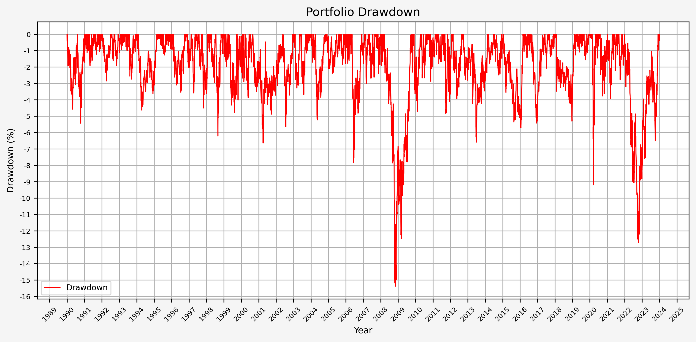

## Post Updates

Update 12/5/2024: Updated code for summary stats function, various code comments, and corrected grammatical errors.</br>
Update 2/19/2025: Various code updates, commented and documented functions.</br>
Update 5/2/2025: Updated functions and code.

## Introduction

Harry Browne was an influencial politician, financial advisor, and author who lived from 1933 to 2006 and published 12 books. Wikipedia has [an in-depth biography](https://en.wikipedia.org/wiki/Harry_Browne) on him.

Within the world of finance and investing, one of his best known works is *Fail-Safe Investing: Lifelong Financial Security in 30 Minutes*. In it, he introduces the idea of the "Permanent Portfolio", an investment strategy that uses only four assets and is very simple to implement.

In this post, we will investigate Browne's suggested portfolio, including performance across various market cycles and economic regimes.

## Browne's Portfolio Requirements

In *Fail-Safe Investing*, under rule #11, Browne lays out the requirements for a "bulletproof portfolio" that will "assure that your wealth will survive any event - including events that would be devastating to any one investment. In other words, this portfolio should protect you *no matter what the future brings.*"

His requirements for the portfolio consist of the followng:

1. Safety: Protection again any economic future, including "inflation, recession, or even depression"
2. Stability: Performance should be consistent so that you will not need to make any changes and will not experience significant drawdowns
3. Simplicity: Easy to implement and take very little time to maintain

He then describes the four "broad movements" of the economy:

1. Prosperity: The economy is growing, business is doing well, interest rates are usually low
2. Inflation: The cost of goods and services is rising
3. Tight money or recession: The money supply is shrinking, economic activity is slowing
4. Deflation: Prices are declining and the value of money is increasing

## The Permanent Portfolio

Browne then matches an asset class to each of the economic conditions above:

1. Prosperity -> Stocks (due to prosperity) and long term bonds (when interest rates fall)
2. Inflation -> Gold
3. Deflation -> Long term bonds (when interest rates fall)
4. Tight money -> Cash

He completes the Permanent Portfolio by stipulating the following:

* Start with a base allocation of 25% to each of the asset classes (stocks, bonds, gold, cash)
* Rebalance back to the base allocation annually, or when "any of the four investments has become worth less than 15%, or more than 35%, of the portfolio's overall value"</br>**Note:** Browne does not specify when the portfolio should be rebalanced; therefore, we will make an assumption of a January 1st rebalance.

## Data

For this exercise, we will use the following asset classes:

1. Stocks: S&P 500 (SPXT_S&P 500 Total Return Index)
2. Bonds: 10 Year US Treasuries (SPBDU10T_S&P US Treasury Bond 7-10 Year Total Return Index)
3. Gold: Gold Spot Price (XAU_Gold USD Spot)
4. Cash: USD

With the exception of cash, all data is sourced from Bloomberg.

We could use ETFs, but the available price history for the ETFs is much shorter than the indices above. If we wanted to use ETFs, the following would work:

1. Stocks: IVV - iShares Core S&P 500 ETF
2. Bonds: IEF - iShares 7-10 Year Treasury Bond ETF
3. Gold: IAU - iShares Gold Trust
4. Cash: USD

## Python Functions

### Typical Functions

First, the typical set of functions I use:

```python
from pathlib import Path

def export_track_md_deps(
    dep_file: Path, 
    md_filename: str, 
    content: str,
) -> None:
    
    """
    Export Markdown content to a file and track it as a dependency.

    This function writes the provided content to the specified Markdown file and 
    appends the filename to the given dependency file (typically `index_dep.txt`).
    This is useful in workflows where Markdown fragments are later assembled 
    into a larger document (e.g., a Hugo `index.md`).

    Parameters:
    -----------
    dep_file : Path
        Path to the dependency file that tracks Markdown fragment filenames.
    md_filename : str
        The name of the Markdown file to export.
    content : str
        The Markdown-formatted content to write to the file.

    Returns:
    --------
    None

    Example:
    --------
    >>> export_track_md_deps(Path("index_dep.txt"), "01_intro.md", "# Introduction\n...")
    ✅ Exported and tracked: 01_intro.md
    """
    
    Path(md_filename).write_text(content)
    with dep_file.open("a") as f:
        f.write(md_filename + "\n")
    print(f"✅ Exported and tracked: {md_filename}")
```

</br>

```python
import pandas as pd
from IPython.display import display

def df_info(
    df: pd.DataFrame,
) -> None:
    
    """
    Display summary information about a pandas DataFrame.

    This function prints:
    - The DataFrame's column names, shape, and data types via `df.info()`
    - The first 5 rows using `df.head()`
    - The last 5 rows using `df.tail()`

    It uses `display()` for better output formatting in environments like Jupyter notebooks.

    Parameters:
    -----------
    df : pd.DataFrame
        The DataFrame to inspect.

    Returns:
    --------
    None

    Example:
    --------
    >>> df_info(my_dataframe)
    """
    
    print("The columns, shape, and data types are:")
    print(df.info())
    print("The first 5 rows are:")
    display(df.head())
    print("The last 5 rows are:")
    display(df.tail())
```

</br>

```python
import io
import pandas as pd

def df_info_markdown(
    df: pd.DataFrame
) -> str:
    
    """
    Generate a Markdown-formatted summary of a pandas DataFrame.

    This function captures and formats the output of `df.info()`, `df.head()`, 
    and `df.tail()` in Markdown for easy inclusion in reports, documentation, 
    or web-based rendering (e.g., Hugo or Jupyter export workflows).

    Parameters:
    -----------
    df : pd.DataFrame
        The DataFrame to summarize.

    Returns:
    --------
    str
        A string containing the DataFrame's info, head, and tail 
        formatted in Markdown.

    Example:
    --------
    >>> print(df_info_markdown(df))
    ```text
    The columns, shape, and data types are:
    <output from df.info()>
    ```
    The first 5 rows are:
    |   | col1 | col2 |
    |---|------|------|
    | 0 | ...  | ...  |

    The last 5 rows are:
    ...
    """
    
    buffer = io.StringIO()

    # Capture df.info() output
    df.info(buf=buffer)
    info_str = buffer.getvalue()

    # Convert head and tail to Markdown
    head_str = df.head().to_markdown(floatfmt=".2f")
    tail_str = df.tail().to_markdown(floatfmt=".2f")

    markdown = [
        "```text",
        "The columns, shape, and data types are:\n",
        info_str,
        "```",
        "\nThe first 5 rows are:\n",
        head_str,
        "\nThe last 5 rows are:\n",
        tail_str
    ]

    return "\n".join(markdown)
```

</br>

```python
import pandas as pd

def pandas_set_decimal_places(
    decimal_places: int,
) -> None:
    
    """
    Set the number of decimal places displayed for floating-point numbers in pandas.

    Parameters:
    ----------
    decimal_places : int
        The number of decimal places to display for float values in pandas DataFrames and Series.

    Returns:
    --------
    None

    Example:
    --------
    >>> dp(3)
    >>> pd.DataFrame([1.23456789])
           0
    0   1.235
    """
    
    pd.set_option('display.float_format', lambda x: f'%.{decimal_places}f' % x)
```

</br>

```python
import pandas as pd
from pathlib import Path

def load_data(
    base_directory: str,
    ticker: str,
    source: str,
    asset_class: str,
    timeframe: str,
) -> pd.DataFrame:
    
    """
    Load data from a CSV, Excel, or Pickle file into a pandas DataFrame.

    This function attempts to read a file first as a CSV, then as an Excel file 
    (specifically looking for a sheet named 'data' and using the 'calamine' engine).
    If both attempts fail, a ValueError is raised.

    Parameters:
    -----------
    base_directory : str
        Root path to read data file.
    ticker : str
        Ticker symbol to read.
    source : str
        Name of the data source (e.g., 'Yahoo').
    asset_class : str
        Asset class name (e.g., 'Equities').
    timeframe : str
        Timeframe for the data (e.g., 'Daily', 'Month_End').
    
    Returns:
    --------
    pd.DataFrame
        The loaded data.

    Raises:
    -------
    ValueError
        If the file could not be loaded as either CSV or Excel.

    Example:
    --------
    >>> df = load_data(DATA_DIR, "^VIX", "Yahoo_Finance", "Indices")
    """

    # Build file paths using pathlib
    if source == None and asset_class == None and timeframe == None:
        csv_path = Path(base_directory) / f"{ticker}.csv"
        xlsx_path = Path(base_directory) / f"{ticker}.xlsx"
        pickle_path = Path(base_directory) / f"{ticker}.pkl"
    else:
        csv_path = Path(base_directory) / source / asset_class / timeframe / f"{ticker}.csv"
        xlsx_path = Path(base_directory) / source / asset_class / timeframe / f"{ticker}.xlsx"
        pickle_path = Path(base_directory) / source / asset_class / timeframe / f"{ticker}.pkl"

    # Try CSV
    try:
        df = pd.read_csv(csv_path)
        return df
    except Exception:
        pass

    # Try ZIP
    try:
        df = pd.read_csv(csv_path)
        return df
    except Exception:
        pass

    # Try Excel
    try:
        df = pd.read_excel(xlsx_path)
        return df
    except Exception:
        pass

    # Try Pickle
    try:
        df = pd.read_pickle(pickle_path)
        return df
    except Exception:
        pass

    raise ValueError(f"❌ Unable to load file: {ticker}. Ensure it's a valid CSV, Excel, or Pickle file with a 'data' sheet (if required).")
```

### Project Specific Functions

#### Data Cleaning Function For Bloomberg Data

```python
import os
import pandas as pd

from IPython.display import display

def bb_clean_data(
    base_directory: str,
    fund_ticker_name: str,
    source: str,
    asset_class: str,
    excel_export: bool,
    pickle_export: bool,
    output_confirmation: bool,
) -> pd.DataFrame:

    """
    This function takes an excel export from Bloomberg and removes all excess data leaving date and close columns

    Parameters:
    -----------
    base_directory : str
        Root path to store downloaded data.
    fund : str
        The fund to clean the data from.
    source : str
        Name of the data source (e.g., 'Bloomberg').
    asset_class : str
        Asset class name (e.g., 'Equities').
    excel_export : bool
        If True, export data to Excel format.
    pickle_export : bool
        If True, export data to Pickle format.
    output_confirmation : bool
        If True, print confirmation message.
        
    Returns:
    --------
    df : pd.DataFrame
        DataFrame containing cleaned data prices.
    """

    # Set location from where to read existing excel file
    location = f"{base_directory}/{source}/{asset_class}/Daily/{fund_ticker_name}.xlsx"

    # Read data from excel
    try:
        df = pd.read_excel(location, sheet_name ="Worksheet", engine="calamine")
    except FileNotFoundError:
        print(f"File not found...please download the data for {fund_ticker_name}")
    
    # Set the column headings from row 5 (which is physically row 6)
    df.columns = df.iloc[5]
    
    # Set the column heading for the index to be "None"
    df.rename_axis(None, axis=1, inplace = True)
    
    # Drop the first 6 rows, 0 - 5
    df.drop(df.index[0:6], inplace=True)
    
    # Set the date column as the index
    df.set_index('Date', inplace = True)
    
    # Drop the volume column
    try:
        df.drop(columns = {'PX_VOLUME'}, inplace = True)
    except KeyError:
        pass
        
    # Rename column
    df.rename(columns = {'PX_LAST':'Close'}, inplace = True)
    
    # Sort by date
    df.sort_values(by=['Date'], inplace = True)

    # Create directory
    directory = f"{base_directory}/{source}/{asset_class}/Daily"
    os.makedirs(directory, exist_ok=True)

    # Export to excel
    if excel_export == True:
        df.to_excel(f"{directory}/{fund_ticker_name}_Clean.xlsx", sheet_name="data")
    else:
        pass

    # Export to pickle
    if pickle_export == True:
        df.to_pickle(f"{directory}/{fund_ticker_name}_Clean.pkl")
    else:
        pass

    # Output confirmation
    if output_confirmation == True:
        print(f"The first and last date of data for {fund_ticker_name} is: ")
        display(df[:1])
        display(df[-1:])
        print(f"Bloomberg data cleaning complete for {fund_ticker_name}")
        print(f"--------------------")
    else:
        pass
    
    return df
```

#### Portfolio Trading Strategy

This is the function that executes the trading strategy for the permanent portfolio based on the above parameters.

```python
import pandas as pd

def strategy_harry_brown_perm_port(
    fund_list: str, 
    starting_cash: int, 
    cash_contrib: int, 
    close_prices_df: pd.DataFrame, 
    rebal_month: int, 
    rebal_day: int, 
    rebal_per_high: float, 
    rebal_per_low: float,
    excel_export: bool,
    pickle_export: bool,
    output_confirmation: bool,
) -> pd.DataFrame:
    
    """
    Execute the rebalance strategy based on specified criteria.

    Parameters:
    -----------
    fund_list (str):
        List of funds for data to be combined from. Funds are strings in the form "BTC-USD".
    starting_cash (int):
        Starting investment balance.
    cash_contrib (int):
        Cash contribution to be made daily.
    close_prices_df (pd.DataFrame):
        DataFrame containing date and close prices for all funds to be included.
    rebal_month (int):
        Month for annual rebalance.
    rebal_day (int):
        Day for annual rebalance.
    rebal_per_high (float):
        High percentage for rebalance.
    rebal_per_low (float):
        Low percentage for rebalance.
    excel_export : bool
        If True, export data to Excel format.
    pickle_export : bool
        If True, export data to Pickle format.
    output_confirmation : bool
        If True, print confirmation message.

    Returns:
    --------
    df (pd.DataFrame):
        DataFrame containing strategy data for all funds to be included. Also dumps the df to excel for reference later.
    """

    num_funds = len(fund_list)

    df = close_prices_df.copy()
    df.reset_index(inplace = True)

    # Date to be used for annual rebalance
    target_month = rebal_month
    target_day = rebal_day

    # Create a dataframe with dates from the specific month
    rebal_date = df[df['Date'].dt.month == target_month]

    # Specify the date or the next closest
    rebal_date = rebal_date[rebal_date['Date'].dt.day >= target_day]

    # Group by year and take the first entry for each year
    rebal_dates_by_year = rebal_date.groupby(rebal_date['Date'].dt.year).first().reset_index(drop=True)

    '''
    Column order for the dataframe:
    df[fund + "_BA_Shares"]
    df[fund + "_BA_$_Invested"]
    df[fund + "_BA_Port_%"]
    df['Total_BA_$_Invested']
    df['Contribution']
    df['Rebalance']
    df[fund + "_AA_Shares"]
    df[fund + "_AA_$_Invested"]
    df[fund + "_AA_Port_%"]
    df['Total_AA_$_Invested']
    '''

    # Calculate the columns and initial values for before action (BA) shares, $ invested, and port %
    for fund in fund_list:
        df[fund + "_BA_Shares"] = starting_cash / num_funds / df[fund + "_Close"]
        df[fund + "_BA_$_Invested"] = df[fund + "_BA_Shares"] * df[fund + "_Close"]
        df[fund + "_BA_Port_%"] = 0.25

    # Set column values initially
    df['Total_BA_$_Invested'] = starting_cash
    df['Contribution'] = cash_contrib
    df['Rebalance'] = "No"

    # Set columns and values initially for after action (AA) shares, $ invested, and port %
    for fund in fund_list:
        df[fund + "_AA_Shares"] = starting_cash / num_funds / df[fund + "_Close"]
        df[fund + "_AA_$_Invested"] = df[fund + "_AA_Shares"] * df[fund + "_Close"]
        df[fund + "_AA_Port_%"] = 0.25
        
    # Set column value for after action (AA) total $ invested
    df['Total_AA_$_Invested'] = starting_cash

    # Iterate through the dataframe and execute the strategy
    for index, row in df.iterrows():

        # Ensure there's a previous row to reference by checking the index value
        if index > 0:

            # Initialize variable
            Total_BA_Invested = 0

            # Calculate before action (BA) shares and $ invested values
            for fund in fund_list:
                df.at[index, fund + "_BA_Shares"] = df.at[index - 1, fund + "_AA_Shares"]
                df.at[index, fund + "_BA_$_Invested"] = df.at[index, fund + "_BA_Shares"] * row[fund + "_Close"]

                # Sum the asset values to find the total
                Total_BA_Invested = Total_BA_Invested + df.at[index, fund + "_BA_$_Invested"]

            # Calculate before action (BA) port % values
            for fund in fund_list:
                df.at[index, fund + "_BA_Port_%"] = df.at[index, fund + "_BA_$_Invested"] / Total_BA_Invested

            # Set column for before action (BA) total $ invested
            df.at[index, 'Total_BA_$_Invested'] = Total_BA_Invested

            # Initialize variables
            rebalance = "No"
            date = row['Date']

            # Check for a specific date annually
            # Simple if statement to check if date_to_check is in jan_28_or_after_each_year
            if date in rebal_dates_by_year['Date'].values:
                rebalance = "Yes"
            else:
                pass

            # Check to see if any asset has portfolio percentage of greater than 35% or less than 15% and if so set variable
            for fund in fund_list:
                if df.at[index, fund + "_BA_Port_%"] > rebal_per_high or df.at[index, fund + "_BA_Port_%"] < rebal_per_low:
                    rebalance = "Yes"
                else:
                    pass

            # If rebalance is required, rebalance back to 25% for each asset, else just divide contribution evenly across assets
            if rebalance == "Yes":
                df.at[index, 'Rebalance'] = rebalance
                for fund in fund_list:
                        df.at[index, fund + "_AA_$_Invested"] = (Total_BA_Invested + df.at[index, 'Contribution']) * 0.25
            else:
                df.at[index, 'Rebalance'] = rebalance
                for fund in fund_list:
                        df.at[index, fund + "_AA_$_Invested"] = df.at[index, fund + "_BA_$_Invested"] + df.at[index, 'Contribution'] * 0.25

            # Initialize variable
            Total_AA_Invested = 0

            # Set column values for after action (AA) shares and port %
            for fund in fund_list:
                df.at[index, fund + "_AA_Shares"] = df.at[index, fund + "_AA_$_Invested"] / row[fund + "_Close"]

                # Sum the asset values to find the total
                Total_AA_Invested = Total_AA_Invested + df.at[index, fund + "_AA_$_Invested"]

            # Calculate after action (AA) port % values
            for fund in fund_list:
                df.at[index, fund + "_AA_Port_%"] = df.at[index, fund + "_AA_$_Invested"] / Total_AA_Invested

            # Set column for after action (AA) total $ invested
            df.at[index, 'Total_AA_$_Invested'] = Total_AA_Invested

        # If this is the first row
        else:
            pass

    df['Return'] = df['Total_AA_$_Invested'].pct_change()
    df['Cumulative_Return'] = (1 + df['Return']).cumprod()

    plan_name = '_'.join(fund_list)

    # Export to excel
    if excel_export == True:
        df.to_excel(f"{plan_name}_Strategy.xlsx", sheet_name="data")
    else:
        pass

    # Export to pickle
    if pickle_export == True:
        df.to_pickle(f"{plan_name}_Strategy.pkl")
    else:
        pass

    # Output confirmation
    if output_confirmation == True:
        print(f"Strategy complete for {plan_name}")
    else:
        pass

    return df
```

#### Summary Stats

```python
import pandas as pd
import numpy as np

def summary_stats(
    fund_list: str, 
    df: pd.DataFrame, 
    period: str,
    excel_export: bool,
    pickle_export: bool,
    output_confirmation: bool,
) -> pd.DataFrame:
    
    """
    Calculate summary statistics for the given fund list and return data.

    Parameters:
    -----------
    fund_list (str):
        List of funds for data to be combined from. Funds are strings in the form "BTC-USD".
    df (pd.DataFrame):
        Dataframe with return data.
    period (str):
        Period for which to calculate statistics. Options are "Monthly", "Weekly", "Daily", "Hourly".
    excel_export : bool
        If True, export data to Excel format.
    pickle_export : bool
        If True, export data to Pickle format.
    output_confirmation : bool
        If True, print confirmation message.

    Returns:
    --------
    df_stats (pd.DataFrame):
        pd.DataFrame: DataFrame containing various portfolio statistics.
    """

    if period == "Monthly":
        timeframe = 12 # months
    elif period == "Weekly":
        timeframe = 52 # weeks
    elif period == "Daily":
        timeframe = 252 # days
        # timeframe = 365 # days
    elif period == "Hourly":
        timeframe = 252 * 6.5 # hours
    #     timeframe = 8760 # hours
    # else:
        return print("Error, check inputs")

    df_stats = pd.DataFrame(df.mean(axis=0) * timeframe) # annualized
    # df_stats = pd.DataFrame((1 + df.mean(axis=0)) ** timeframe - 1) # annualized, this is this true annualized return but we will simply use the mean
    df_stats.columns = ['Annualized Mean']
    df_stats['Annualized Volatility'] = df.std() * np.sqrt(timeframe) # annualized
    df_stats['Annualized Sharpe Ratio'] = df_stats['Annualized Mean'] / df_stats['Annualized Volatility']

    df_cagr = (1 + df['Return']).cumprod()
    cagr = (df_cagr.iloc[-1] / 1) ** (1/(len(df_cagr) / timeframe)) - 1
    df_stats['CAGR'] = cagr

    df_stats[period + ' Max Return'] = df.max()
    df_stats[period + ' Max Return (Date)'] = df.idxmax().values[0]
    df_stats[period + ' Min Return'] = df.min()
    df_stats[period + ' Min Return (Date)'] = df.idxmin().values[0]
    
    wealth_index = 1000 * (1 + df).cumprod()
    previous_peaks = wealth_index.cummax()
    drawdowns = (wealth_index - previous_peaks)/previous_peaks

    df_stats['Max Drawdown'] = drawdowns.min()
    df_stats['Peak'] = [previous_peaks[col][:drawdowns[col].idxmin()].idxmax() for col in previous_peaks.columns]
    df_stats['Bottom'] = drawdowns.idxmin()

    recovery_date = []
    for col in wealth_index.columns:
        prev_max = previous_peaks[col][:drawdowns[col].idxmin()].max()
        recovery_wealth = pd.DataFrame([wealth_index[col][drawdowns[col].idxmin():]]).T
        recovery_date.append(recovery_wealth[recovery_wealth[col] >= prev_max].index.min())
    df_stats['Recovery Date'] = recovery_date

    plan_name = '_'.join(fund_list)

    # Export to excel
    if excel_export == True:
        df_stats.to_excel(f"{plan_name}_Summary_Stats.xlsx", sheet_name="data")
    else:
        pass

    # Export to pickle
    if pickle_export == True:
        df_stats.to_pickle(f"{plan_name}_Summary_Stats.pkl")
    else:
        pass

    # Output confirmation
    if output_confirmation == True:
        print(f"Summary stats complete for {plan_name}")
    else:
        pass
    
    return df_stats
```

## Data Overview

### Set Decimal Places

```python
pandas_set_decimal_places(3)
```

### Load Data

As previously mentioned, the data for this exercise comes primarily from Bloomberg. We'll start with loading the data first for bonds:

``` python
# Bonds dataframe
bb_clean_data(
    base_directory=DATA_DIR,
    fund_ticker_name="SPBDU10T_S&P US Treasury Bond 7-10 Year Total Return Index",
    source="Bloomberg",
    asset_class="Indices",
    excel_export=True,
    pickle_export=True,
    output_confirmation=True,
)

bonds_data = load_data(
    base_directory=DATA_DIR,
    ticker="SPBDU10T_S&P US Treasury Bond 7-10 Year Total Return Index_Clean",
    source="Bloomberg",
    asset_class="Indices",
    timeframe="Daily",
)

bonds_data['Date'] = pd.to_datetime(bonds_data['Date'])
bonds_data.set_index('Date', inplace = True)
bonds_data = bonds_data[(bonds_data.index >= '1990-01-01') & (bonds_data.index <= '2023-12-31')]
bonds_data.rename(columns={'Close':'Bonds_Close'}, inplace=True)
bonds_data['Bonds_Daily_Return'] = bonds_data['Bonds_Close'].pct_change()
bonds_data['Bonds_Total_Return'] = (1 + bonds_data['Bonds_Daily_Return']).cumprod()
display(bonds_data.head())
```

The following is the output:

| Date                |   Bonds_Close |   Bonds_Daily_Return |   Bonds_Total_Return |
|:--------------------|--------------:|---------------------:|---------------------:|
| 1990-01-02 00:00:00 |        99.972 |              nan     |              nan     |
| 1990-01-03 00:00:00 |        99.733 |               -0.002 |                0.998 |
| 1990-01-04 00:00:00 |        99.813 |                0.001 |                0.998 |
| 1990-01-05 00:00:00 |        99.769 |               -0.000 |                0.998 |
| 1990-01-08 00:00:00 |        99.681 |               -0.001 |                0.997 |

Then for stocks:

```python
# Stocks dataframe
bb_clean_data(
    base_directory=DATA_DIR,
    fund_ticker_name="SPXT_S&P 500 Total Return Index",
    source="Bloomberg",
    asset_class="Indices",
    excel_export=True,
    pickle_export=True,
    output_confirmation=True,
)

stocks_data = load_data(
    base_directory=DATA_DIR,
    ticker="SPXT_S&P 500 Total Return Index_Clean",
    source="Bloomberg",
    asset_class="Indices",
    timeframe="Daily",
)

stocks_data['Date'] = pd.to_datetime(stocks_data['Date'])
stocks_data.set_index('Date', inplace = True)
stocks_data = stocks_data[(stocks_data.index >= '1990-01-01') & (stocks_data.index <= '2023-12-31')]
stocks_data.rename(columns={'Close':'Stocks_Close'}, inplace=True)
stocks_data['Stocks_Daily_Return'] = stocks_data['Stocks_Close'].pct_change()
stocks_data['Stocks_Total_Return'] = (1 + stocks_data['Stocks_Daily_Return']).cumprod()
display(stocks_data.head())
```

The following is the output:

| Date                |   Stocks_Close |   Stocks_Daily_Return |   Stocks_Total_Return |
|:--------------------|---------------:|----------------------:|----------------------:|
| 1990-01-01 00:00:00 |        nan     |               nan     |               nan     |
| 1990-01-02 00:00:00 |        386.160 |               nan     |               nan     |
| 1990-01-03 00:00:00 |        385.170 |                -0.003 |                 0.997 |
| 1990-01-04 00:00:00 |        382.020 |                -0.008 |                 0.989 |
| 1990-01-05 00:00:00 |        378.300 |                -0.010 |                 0.980 |

And finally, gold:

```python
# Gold dataframe
bb_clean_data(
    base_directory=DATA_DIR,
    fund_ticker_name="XAU_Gold USD Spot",
    source="Bloomberg",
    asset_class="Commodities",
    excel_export=True,
    pickle_export=True,
    output_confirmation=True,
)

gold_data = load_data(
    base_directory=DATA_DIR,
    ticker="XAU_Gold USD Spot_Clean",
    source="Bloomberg",
    asset_class="Commodities",
    timeframe="Daily",
)

gold_data['Date'] = pd.to_datetime(gold_data['Date'])
gold_data.set_index('Date', inplace = True)
gold_data = gold_data[(gold_data.index >= '1990-01-01') & (gold_data.index <= '2023-12-31')]
gold_data.rename(columns={'Close':'Gold_Close'}, inplace=True)
gold_data['Gold_Daily_Return'] = gold_data['Gold_Close'].pct_change()
gold_data['Gold_Total_Return'] = (1 + gold_data['Gold_Daily_Return']).cumprod()
display(gold_data.head())
```

The following is the output:

| Date                |   Gold_Close |   Gold_Daily_Return |   Gold_Total_Return |
|:--------------------|-------------:|--------------------:|--------------------:|
| 1990-01-02 00:00:00 |      399.000 |             nan     |             nan     |
| 1990-01-03 00:00:00 |      395.000 |              -0.010 |               0.990 |
| 1990-01-04 00:00:00 |      396.500 |               0.004 |               0.994 |
| 1990-01-05 00:00:00 |      405.000 |               0.021 |               1.015 |
| 1990-01-08 00:00:00 |      404.600 |              -0.001 |               1.014 |

### Combine Data

We'll now combine the dataframes for the timeseries data from each of the asset classes, as follows:

```python
# Merge the stock data and bond data into a single DataFrame using their indices (dates)
perm_port = pd.merge(stocks_data['Stocks_Close'], bonds_data['Bonds_Close'], left_index=True, right_index=True)

# Add gold data to the portfolio DataFrame by merging it with the existing data on indices (dates)
perm_port = pd.merge(perm_port, gold_data['Gold_Close'], left_index=True, right_index=True)

# Add a column for cash with a constant value of 1 (assumes the value of cash remains constant at $1 over time)
perm_port['Cash_Close'] = 1

# Remove any rows with missing values (NaN) to ensure clean data for further analysis
perm_port.dropna(inplace=True)

# Display the finalized portfolio DataFrame
display(perm_port)
```

### Check For Missing Values

We can check for any missing (NaN) values in each column:

```python
# Check for any missing values in each column
perm_port.isnull().any()
```

### DataFrame Info

Now, running:

``` python
df_info(perm_port)
```

Gives us the following:

```text
The columns, shape, and data types are:

<class 'pandas.core.frame.DataFrame'>
DatetimeIndex: 8479 entries, 1990-01-02 to 2023-12-29
Data columns (total 4 columns):
 #   Column        Non-Null Count  Dtype  
---  ------        --------------  -----  
 0   Stocks_Close  8479 non-null   float64
 1   Bonds_Close   8479 non-null   float64
 2   Gold_Close    8479 non-null   float64
 3   Cash_Close    8479 non-null   int64  
dtypes: float64(3), int64(1)
memory usage: 331.2 KB

```

The first 5 rows are:

| Date                |   Stocks_Close |   Bonds_Close |   Gold_Close |   Cash_Close |
|:--------------------|---------------:|--------------:|-------------:|-------------:|
| 1990-01-02 00:00:00 |         386.16 |         99.97 |       399.00 |         1.00 |
| 1990-01-03 00:00:00 |         385.17 |         99.73 |       395.00 |         1.00 |
| 1990-01-04 00:00:00 |         382.02 |         99.81 |       396.50 |         1.00 |
| 1990-01-05 00:00:00 |         378.30 |         99.77 |       405.00 |         1.00 |
| 1990-01-08 00:00:00 |         380.04 |         99.68 |       404.60 |         1.00 |

The last 5 rows are:

| Date                |   Stocks_Close |   Bonds_Close |   Gold_Close |   Cash_Close |
|:--------------------|---------------:|--------------:|-------------:|-------------:|
| 2023-12-22 00:00:00 |       10292.37 |        604.17 |      2053.08 |         1.00 |
| 2023-12-26 00:00:00 |       10335.98 |        604.55 |      2067.81 |         1.00 |
| 2023-12-27 00:00:00 |       10351.60 |        609.36 |      2077.49 |         1.00 |
| 2023-12-28 00:00:00 |       10356.59 |        606.83 |      2065.61 |         1.00 |
| 2023-12-29 00:00:00 |       10327.83 |        606.18 |      2062.98 |         1.00 |

We can see that we have close data for all 4 asset classes from the beginning of 1990 to the end of 2023.

## Execute Strategy

Using an annual rebalance date of January 1, we'll now execute the strategy with the following code:

```python
# List of funds to be used
fund_list = ['Stocks', 'Bonds', 'Gold', 'Cash']

# Starting cash contribution
starting_cash = 10000

# Monthly cash contribution
cash_contrib = 0

strat = strategy_harry_brown_perm_port(
    fund_list=fund_list, 
    starting_cash=starting_cash, 
    cash_contrib=cash_contrib, 
    close_prices_df=perm_port, 
    rebal_month=1, 
    rebal_day=1, 
    rebal_per_high=0.35, 
    rebal_per_low=0.15,
    excel_export=True,
    pickle_export=True,
    output_confirmation=True,
)

strat = strat.set_index('Date')
```

Running:

```python
df_info(strat)
```

Gives us:

```text
The columns, shape, and data types are:

<class 'pandas.core.frame.DataFrame'>
DatetimeIndex: 8479 entries, 1990-01-02 to 2023-12-29
Data columns (total 34 columns):
 #   Column                Non-Null Count  Dtype  
---  ------                --------------  -----  
 0   Stocks_Close          8479 non-null   float64
 1   Bonds_Close           8479 non-null   float64
 2   Gold_Close            8479 non-null   float64
 3   Cash_Close            8479 non-null   int64  
 4   Stocks_BA_Shares      8479 non-null   float64
 5   Stocks_BA_$_Invested  8479 non-null   float64
 6   Stocks_BA_Port_%      8479 non-null   float64
 7   Bonds_BA_Shares       8479 non-null   float64
 8   Bonds_BA_$_Invested   8479 non-null   float64
 9   Bonds_BA_Port_%       8479 non-null   float64
 10  Gold_BA_Shares        8479 non-null   float64
 11  Gold_BA_$_Invested    8479 non-null   float64
 12  Gold_BA_Port_%        8479 non-null   float64
 13  Cash_BA_Shares        8479 non-null   float64
 14  Cash_BA_$_Invested    8479 non-null   float64
 15  Cash_BA_Port_%        8479 non-null   float64
 16  Total_BA_$_Invested   8479 non-null   float64
 17  Contribution          8479 non-null   int64  
 18  Rebalance             8479 non-null   object 
 19  Stocks_AA_Shares      8479 non-null   float64
 20  Stocks_AA_$_Invested  8479 non-null   float64
 21  Stocks_AA_Port_%      8479 non-null   float64
 22  Bonds_AA_Shares       8479 non-null   float64
 23  Bonds_AA_$_Invested   8479 non-null   float64
 24  Bonds_AA_Port_%       8479 non-null   float64
 25  Gold_AA_Shares        8479 non-null   float64
 26  Gold_AA_$_Invested    8479 non-null   float64
 27  Gold_AA_Port_%        8479 non-null   float64
 28  Cash_AA_Shares        8479 non-null   float64
 29  Cash_AA_$_Invested    8479 non-null   float64
 30  Cash_AA_Port_%        8479 non-null   float64
 31  Total_AA_$_Invested   8479 non-null   float64
 32  Return                8478 non-null   float64
 33  Cumulative_Return     8478 non-null   float64
dtypes: float64(31), int64(2), object(1)
memory usage: 2.3+ MB

```

The first 5 rows are:

| Date                |   Stocks_Close |   Bonds_Close |   Gold_Close |   Cash_Close |   Stocks_BA_Shares |   Stocks_BA_$_Invested |   Stocks_BA_Port_% |   Bonds_BA_Shares |   Bonds_BA_$_Invested |   Bonds_BA_Port_% |   Gold_BA_Shares |   Gold_BA_$_Invested |   Gold_BA_Port_% |   Cash_BA_Shares |   Cash_BA_$_Invested |   Cash_BA_Port_% |   Total_BA_$_Invested |   Contribution | Rebalance   |   Stocks_AA_Shares |   Stocks_AA_$_Invested |   Stocks_AA_Port_% |   Bonds_AA_Shares |   Bonds_AA_$_Invested |   Bonds_AA_Port_% |   Gold_AA_Shares |   Gold_AA_$_Invested |   Gold_AA_Port_% |   Cash_AA_Shares |   Cash_AA_$_Invested |   Cash_AA_Port_% |   Total_AA_$_Invested |   Return |   Cumulative_Return |
|:--------------------|---------------:|--------------:|-------------:|-------------:|-------------------:|-----------------------:|-------------------:|------------------:|----------------------:|------------------:|-----------------:|---------------------:|-----------------:|-----------------:|---------------------:|-----------------:|----------------------:|---------------:|:------------|-------------------:|-----------------------:|-------------------:|------------------:|----------------------:|------------------:|-----------------:|---------------------:|-----------------:|-----------------:|---------------------:|-----------------:|----------------------:|---------:|--------------------:|
| 1990-01-02 00:00:00 |         386.16 |         99.97 |       399.00 |            1 |               6.47 |                2500.00 |               0.25 |             25.01 |               2500.00 |              0.25 |             6.27 |              2500.00 |             0.25 |          2500.00 |              2500.00 |             0.25 |              10000.00 |              0 | No          |               6.47 |                2500.00 |               0.25 |             25.01 |               2500.00 |              0.25 |             6.27 |              2500.00 |             0.25 |          2500.00 |              2500.00 |             0.25 |              10000.00 |   nan    |              nan    |
| 1990-01-03 00:00:00 |         385.17 |         99.73 |       395.00 |            1 |               6.47 |                2493.59 |               0.25 |             25.01 |               2494.02 |              0.25 |             6.27 |              2474.94 |             0.25 |          2500.00 |              2500.00 |             0.25 |               9962.55 |              0 | No          |               6.47 |                2493.59 |               0.25 |             25.01 |               2494.02 |              0.25 |             6.27 |              2474.94 |             0.25 |          2500.00 |              2500.00 |             0.25 |               9962.55 |    -0.00 |                1.00 |
| 1990-01-04 00:00:00 |         382.02 |         99.81 |       396.50 |            1 |               6.47 |                2473.20 |               0.25 |             25.01 |               2496.02 |              0.25 |             6.27 |              2484.34 |             0.25 |          2500.00 |              2500.00 |             0.25 |               9953.56 |              0 | No          |               6.47 |                2473.20 |               0.25 |             25.01 |               2496.02 |              0.25 |             6.27 |              2484.34 |             0.25 |          2500.00 |              2500.00 |             0.25 |               9953.56 |    -0.00 |                1.00 |
| 1990-01-05 00:00:00 |         378.30 |         99.77 |       405.00 |            1 |               6.47 |                2449.11 |               0.25 |             25.01 |               2494.92 |              0.25 |             6.27 |              2537.59 |             0.25 |          2500.00 |              2500.00 |             0.25 |               9981.63 |              0 | No          |               6.47 |                2449.11 |               0.25 |             25.01 |               2494.92 |              0.25 |             6.27 |              2537.59 |             0.25 |          2500.00 |              2500.00 |             0.25 |               9981.63 |     0.00 |                1.00 |
| 1990-01-08 00:00:00 |         380.04 |         99.68 |       404.60 |            1 |               6.47 |                2460.38 |               0.25 |             25.01 |               2492.72 |              0.25 |             6.27 |              2535.09 |             0.25 |          2500.00 |              2500.00 |             0.25 |               9988.19 |              0 | No          |               6.47 |                2460.38 |               0.25 |             25.01 |               2492.72 |              0.25 |             6.27 |              2535.09 |             0.25 |          2500.00 |              2500.00 |             0.25 |               9988.19 |     0.00 |                1.00 |

The last 5 rows are:

| Date                |   Stocks_Close |   Bonds_Close |   Gold_Close |   Cash_Close |   Stocks_BA_Shares |   Stocks_BA_$_Invested |   Stocks_BA_Port_% |   Bonds_BA_Shares |   Bonds_BA_$_Invested |   Bonds_BA_Port_% |   Gold_BA_Shares |   Gold_BA_$_Invested |   Gold_BA_Port_% |   Cash_BA_Shares |   Cash_BA_$_Invested |   Cash_BA_Port_% |   Total_BA_$_Invested |   Contribution | Rebalance   |   Stocks_AA_Shares |   Stocks_AA_$_Invested |   Stocks_AA_Port_% |   Bonds_AA_Shares |   Bonds_AA_$_Invested |   Bonds_AA_Port_% |   Gold_AA_Shares |   Gold_AA_$_Invested |   Gold_AA_Port_% |   Cash_AA_Shares |   Cash_AA_$_Invested |   Cash_AA_Port_% |   Total_AA_$_Invested |   Return |   Cumulative_Return |
|:--------------------|---------------:|--------------:|-------------:|-------------:|-------------------:|-----------------------:|-------------------:|------------------:|----------------------:|------------------:|-----------------:|---------------------:|-----------------:|-----------------:|---------------------:|-----------------:|----------------------:|---------------:|:------------|-------------------:|-----------------------:|-------------------:|------------------:|----------------------:|------------------:|-----------------:|---------------------:|-----------------:|-----------------:|---------------------:|-----------------:|----------------------:|---------:|--------------------:|
| 2023-12-22 00:00:00 |       10292.37 |        604.17 |      2053.08 |            1 |               1.81 |               18595.87 |               0.29 |             25.03 |              15124.46 |              0.23 |             8.00 |             16426.12 |             0.25 |         14717.17 |             14717.17 |             0.23 |              64863.62 |              0 | No          |               1.81 |               18595.87 |               0.29 |             25.03 |              15124.46 |              0.23 |             8.00 |             16426.12 |             0.25 |         14717.17 |             14717.17 |             0.23 |              64863.62 |     0.00 |                6.49 |
| 2023-12-26 00:00:00 |       10335.98 |        604.55 |      2067.81 |            1 |               1.81 |               18674.66 |               0.29 |             25.03 |              15134.20 |              0.23 |             8.00 |             16543.97 |             0.25 |         14717.17 |             14717.17 |             0.23 |              65070.01 |              0 | No          |               1.81 |               18674.66 |               0.29 |             25.03 |              15134.20 |              0.23 |             8.00 |             16543.97 |             0.25 |         14717.17 |             14717.17 |             0.23 |              65070.01 |     0.00 |                6.51 |
| 2023-12-27 00:00:00 |       10351.60 |        609.36 |      2077.49 |            1 |               1.81 |               18702.89 |               0.29 |             25.03 |              15254.36 |              0.23 |             8.00 |             16621.42 |             0.25 |         14717.17 |             14717.17 |             0.23 |              65295.84 |              0 | No          |               1.81 |               18702.89 |               0.29 |             25.03 |              15254.36 |              0.23 |             8.00 |             16621.42 |             0.25 |         14717.17 |             14717.17 |             0.23 |              65295.84 |     0.00 |                6.53 |
| 2023-12-28 00:00:00 |       10356.59 |        606.83 |      2065.61 |            1 |               1.81 |               18711.90 |               0.29 |             25.03 |              15191.10 |              0.23 |             8.00 |             16526.37 |             0.25 |         14717.17 |             14717.17 |             0.23 |              65146.54 |              0 | No          |               1.81 |               18711.90 |               0.29 |             25.03 |              15191.10 |              0.23 |             8.00 |             16526.37 |             0.25 |         14717.17 |             14717.17 |             0.23 |              65146.54 |    -0.00 |                6.51 |
| 2023-12-29 00:00:00 |       10327.83 |        606.18 |      2062.98 |            1 |               1.81 |               18659.94 |               0.29 |             25.03 |              15175.01 |              0.23 |             8.00 |             16505.33 |             0.25 |         14717.17 |             14717.17 |             0.23 |              65057.44 |              0 | No          |               1.81 |               18659.94 |               0.29 |             25.03 |              15175.01 |              0.23 |             8.00 |             16505.33 |             0.25 |         14717.17 |             14717.17 |             0.23 |              65057.44 |    -0.00 |                6.51 |

## Strategy Statistics

Let's look at the summary statistics for the entire timeframe, as well as several different ranges:

```python
sum_stats = summary_stats(
    fund_list=fund_list,
    df=strat[['Return']],
    period="Daily",
    excel_export=True,
    pickle_export=True,
    output_confirmation=True,
)

strat_pre_1999 = strat[strat.index < '2000-01-01']
sum_stats_pre_1999 = summary_stats(
    fund_list=fund_list, 
    df=strat_pre_1999[['Return']], 
    period="Daily",
    excel_export=False,
    pickle_export=False,
    output_confirmation=True,
)

strat_post_1999 = strat[strat.index >= '2000-01-01']
sum_stats_post_1999 = summary_stats(
    fund_list=fund_list, 
    df=strat_post_1999[['Return']], 
    period="Daily",
    excel_export=False,
    pickle_export=False,
    output_confirmation=True,
)

strat_post_2009 = strat[strat.index >= '2010-01-01']
sum_stats_post_2009 = summary_stats(
    fund_list=fund_list, 
    df=strat_post_2009[['Return']], 
    period="Daily",
    excel_export=False,
    pickle_export=False,
    output_confirmation=True,
)
```

And the concat them to make comparing them easier:

```python
all_sum_stats = pd.concat([sum_stats])
all_sum_stats = all_sum_stats.rename(index={'Return': '1990 - 2023'})
all_sum_stats = pd.concat([all_sum_stats, sum_stats_pre_1999])
all_sum_stats = all_sum_stats.rename(index={'Return': 'Pre 1999'})
all_sum_stats = pd.concat([all_sum_stats, sum_stats_post_1999])
all_sum_stats = all_sum_stats.rename(index={'Return': 'Post 1999'})
all_sum_stats = pd.concat([all_sum_stats, sum_stats_post_2009])
all_sum_stats = all_sum_stats.rename(index={'Return': 'Post 2009'})
display(all_sum_stats)
```

Which gives us:

|             |   Annualized Mean |   Annualized Volatility |   Annualized Sharpe Ratio |   CAGR |   Daily Max Return | Daily Max Return (Date)   |   Daily Min Return | Daily Min Return (Date)   |   Max Drawdown | Peak                | Bottom              | Recovery Date       |
|:------------|------------------:|------------------------:|--------------------------:|-------:|-------------------:|:--------------------------|-------------------:|:--------------------------|---------------:|:--------------------|:--------------------|:--------------------|
| 1990 - 2023 |             0.057 |                   0.060 |                     0.957 |  0.057 |              0.029 | 2020-03-24 00:00:00       |             -0.030 | 2020-03-12 00:00:00       |         -0.154 | 2008-03-18 00:00:00 | 2008-11-12 00:00:00 | 2009-10-06 00:00:00 |
| Pre 1999    |             0.060 |                   0.050 |                     1.207 |  0.061 |              0.022 | 1999-09-28 00:00:00       |             -0.018 | 1993-08-05 00:00:00       |         -0.062 | 1998-07-20 00:00:00 | 1998-08-31 00:00:00 | 1998-11-05 00:00:00 |
| Post 1999   |             0.056 |                   0.064 |                     0.883 |  0.056 |              0.029 | 2020-03-24 00:00:00       |             -0.030 | 2020-03-12 00:00:00       |         -0.154 | 2008-03-18 00:00:00 | 2008-11-12 00:00:00 | 2009-10-06 00:00:00 |
| Post 2009   |             0.056 |                   0.060 |                     0.927 |  0.056 |              0.029 | 2020-03-24 00:00:00       |             -0.030 | 2020-03-12 00:00:00       |         -0.127 | 2021-12-27 00:00:00 | 2022-10-20 00:00:00 | 2023-12-01 00:00:00 |

<!-- Here we have a mean annualized return of 8.3%, volatility of 7.2%, a CAGR of 8.4% and a Sharpe ratio of 1.15. And this with a max drawdown of just over 15%. Not bad, Mr. Browne!

Since the book was published in 1999, let's look specifically at the summary stats for below and after 1999.

The mean annualized return is approximately 0.7% lower for the pre 1999 vs post 1999 data, as is the CAGR. The volatility is higher for the post 1999 data which leads to a difference in the Sharpe ratio. -->

## Annual Returns

Here's the annual returns:

|   Year |   Return |
|-------:|---------:|
|   1991 |    0.102 |
|   1992 |    0.030 |
|   1993 |    0.099 |
|   1994 |   -0.017 |
|   1995 |    0.153 |
|   1996 |    0.049 |
|   1997 |    0.056 |
|   1998 |    0.102 |
|   1999 |    0.039 |
|   2000 |    0.000 |
|   2001 |   -0.005 |
|   2002 |    0.043 |
|   2003 |    0.121 |
|   2004 |    0.051 |
|   2005 |    0.064 |
|   2006 |    0.104 |
|   2007 |    0.117 |
|   2008 |   -0.033 |
|   2009 |    0.107 |
|   2010 |    0.137 |
|   2011 |    0.070 |
|   2012 |    0.068 |
|   2013 |   -0.006 |
|   2014 |    0.052 |
|   2015 |   -0.018 |
|   2016 |    0.052 |
|   2017 |    0.095 |
|   2018 |   -0.012 |
|   2019 |    0.145 |
|   2020 |    0.134 |
|   2021 |    0.057 |
|   2022 |   -0.082 |
|   2023 |    0.109 |

Since the strategy, summary statistics, and annual returns are all exported as excel files, they can be found at the following locations:

[Stocks_Bonds_Gold_Cash_Strategy.xlsx](Stocks_Bonds_Gold_Cash_Strategy.xlsx)</br>
[Stocks_Bonds_Gold_Cash_Summary_Stats.xlsx](Stocks_Bonds_Gold_Cash_Summary_Stats.xlsx)</br>
[Stocks_Bonds_Gold_Cash_Annual_Returns.xlsx](Stocks_Bonds_Gold_Cash_Annual_Returns.xlsx)</br>

Next we will look at some plots to help visualize the data.

## Generate Plots

Here are the various functions needed for the plots:

### Plot Cumulative Return

```python
def plot_cumulative_return(strat_df):
    # Generate plot
    plt.figure(figsize=(10, 5), facecolor = '#F5F5F5')

    # Plotting data
    plt.plot(strat_df.index, strat_df['Cumulative_Return'], label = 'Strategy Cumulative Return', linestyle='-', color='green', linewidth=1)
    
    # Set X axis
    # x_tick_spacing = 5  # Specify the interval for x-axis ticks
    # plt.gca().xaxis.set_major_locator(MultipleLocator(x_tick_spacing))
    plt.gca().xaxis.set_major_locator(mdates.YearLocator())
    plt.gca().xaxis.set_major_formatter(mdates.DateFormatter('%Y'))
    plt.xlabel('Year', fontsize = 9)
    plt.xticks(rotation = 45, fontsize = 7)
    # plt.xlim(, )

    # Set Y axis
    y_tick_spacing = 0.5  # Specify the interval for y-axis ticks
    plt.gca().yaxis.set_major_locator(MultipleLocator(y_tick_spacing))
    plt.ylabel('Cumulative Return', fontsize = 9)
    plt.yticks(fontsize = 7)
    plt.ylim(0, 7.5)

    # Set title, etc.
    plt.title('Cumulative Return', fontsize = 12)
    
    # Set the grid & legend
    plt.tight_layout()
    plt.grid(True)
    plt.legend(fontsize=8)

    # Save the figure
    plt.savefig('03_Cumulative_Return.png', dpi=300, bbox_inches='tight')

    # Display the plot
    return plt.show()
```

### Plot Portfolio Values

```python
def plot_values(strat_df):   
    # Generate plot   
    plt.figure(figsize=(10, 5), facecolor = '#F5F5F5')
    
    # Plotting data
    plt.plot(strat_df.index, strat_df['Total_AA_$_Invested'], label='Total Portfolio Value', linestyle='-', color='black', linewidth=1)
    plt.plot(strat_df.index, strat_df['Stocks_AA_$_Invested'], label='Stocks Position Value', linestyle='-', color='orange', linewidth=1)
    plt.plot(strat_df.index, strat_df['Bonds_AA_$_Invested'], label='Bond Position Value', linestyle='-', color='yellow', linewidth=1)
    plt.plot(strat_df.index, strat_df['Gold_AA_$_Invested'], label='Gold Position Value', linestyle='-', color='blue', linewidth=1)
    plt.plot(strat_df.index, strat_df['Cash_AA_$_Invested'], label='Cash Position Value', linestyle='-', color='brown', linewidth=1)

    # Set X axis
    # x_tick_spacing = 5  # Specify the interval for x-axis ticks
    # plt.gca().xaxis.set_major_locator(MultipleLocator(x_tick_spacing))
    plt.gca().xaxis.set_major_locator(mdates.YearLocator())
    plt.gca().xaxis.set_major_formatter(mdates.DateFormatter('%Y'))
    plt.xlabel('Year', fontsize = 9)
    plt.xticks(rotation = 45, fontsize = 7)
    # plt.xlim(, )


    # Set Y axis
    y_tick_spacing = 5000  # Specify the interval for y-axis ticks
    plt.gca().yaxis.set_major_locator(MultipleLocator(y_tick_spacing))
    plt.gca().yaxis.set_major_formatter(mtick.FuncFormatter(lambda x, pos: '{:,.0f}'.format(x))) # Adding commas to y-axis labels
    plt.ylabel('Total Value ($)', fontsize = 9)
    plt.yticks(fontsize = 7)
    plt.ylim(0, 75000)

    # Set title, etc.
    plt.title('Total Values For Stocks, Bonds, Gold, and Cash Positions and Portfolio', fontsize = 12)
    
    # Set the grid & legend
    plt.tight_layout()
    plt.grid(True)
    plt.legend(fontsize=8)

    # Save the figure
    plt.savefig('04_Portfolio_Values.png', dpi=300, bbox_inches='tight')

    # Display the plot
    return plt.show()
```

### Plot Portfolio Drawdown

```python
def plot_drawdown(strat_df):
    rolling_max = strat_df['Total_AA_$_Invested'].cummax()
    drawdown = (strat_df['Total_AA_$_Invested'] - rolling_max) / rolling_max * 100

    # Generate plot   
    plt.figure(figsize=(10, 5), facecolor = '#F5F5F5')

    # Plotting data
    plt.plot(strat_df.index, drawdown, label='Drawdown', linestyle='-', color='red', linewidth=1)
    
    # Set X axis
    # x_tick_spacing = 5  # Specify the interval for x-axis ticks
    # plt.gca().xaxis.set_major_locator(MultipleLocator(x_tick_spacing))
    plt.gca().xaxis.set_major_locator(mdates.YearLocator())
    plt.gca().xaxis.set_major_formatter(mdates.DateFormatter('%Y'))
    plt.xlabel('Year', fontsize = 9)
    plt.xticks(rotation = 45, fontsize = 7)
    # plt.xlim(, )

    # Set Y axis
    y_tick_spacing = 1  # Specify the interval for y-axis ticks
    plt.gca().yaxis.set_major_locator(MultipleLocator(y_tick_spacing))
    # plt.gca().yaxis.set_major_formatter(mtick.FuncFormatter(lambda x, pos: '{:,.0f}'.format(x))) # Adding commas to y-axis labels
    plt.gca().yaxis.set_major_formatter(mtick.FuncFormatter(lambda x, pos: '{:.0f}'.format(x))) # Adding 0 decimal places to y-axis labels
    plt.ylabel('Drawdown (%)', fontsize = 9)
    plt.yticks(fontsize = 7)
    plt.ylim(-20, 0)

    # Set title, etc.
    plt.title('Portfolio Drawdown', fontsize = 12)
    
    # Set the grid & legend
    plt.tight_layout()
    plt.grid(True)
    plt.legend(fontsize=8)

    # Save the figure
    plt.savefig('05_Portfolio_Drawdown.png', dpi=300, bbox_inches='tight')

    # Display the plot
    return plt.show()
```

### Plot Portfolio Asset Weights

```python
def plot_asset_weights(strat_df):
    # Generate plot   
    plt.figure(figsize=(10, 5), facecolor = '#F5F5F5')
    
    # Plotting data
    plt.plot(strat_df.index, strat_df['Stocks_AA_Port_%'] * 100, label='Stocks Portfolio Weight', linestyle='-', color='orange', linewidth=1)
    plt.plot(strat_df.index, strat_df['Bonds_AA_Port_%'] * 100, label='Bonds Portfolio Weight', linestyle='-', color='yellow', linewidth=1)
    plt.plot(strat_df.index, strat_df['Gold_AA_Port_%'] * 100, label='Gold Portfolio Weight', linestyle='-', color='blue', linewidth=1)
    plt.plot(strat_df.index, strat_df['Cash_AA_Port_%'] * 100, label='Cash Portfolio Weight', linestyle='-', color='brown', linewidth=1)

    # Set X axis
    # x_tick_spacing = 5  # Specify the interval for x-axis ticks
    # plt.gca().xaxis.set_major_locator(MultipleLocator(x_tick_spacing))
    plt.gca().xaxis.set_major_locator(mdates.YearLocator())
    plt.gca().xaxis.set_major_formatter(mdates.DateFormatter('%Y'))
    plt.xlabel('Year', fontsize = 9)
    plt.xticks(rotation = 45, fontsize = 7)
    # plt.xlim(, )

    # Set Y axis
    y_tick_spacing = 2  # Specify the interval for y-axis ticks
    plt.gca().yaxis.set_major_locator(MultipleLocator(y_tick_spacing))
    # plt.gca().yaxis.set_major_formatter(mtick.FuncFormatter(lambda x, pos: '{:,.0f}'.format(x))) # Adding commas to y-axis labels
    plt.ylabel('Asset Weight (%)', fontsize = 9)
    plt.yticks(fontsize = 7)
    plt.ylim(14, 36)

    # Set title, etc.
    plt.title('Portfolio Asset Weights For Stocks, Bonds, Gold, and Cash Positions', fontsize = 12)
    
    # Set the grid & legend
    plt.tight_layout()
    plt.grid(True)
    plt.legend(fontsize=8)

    # Save the figure
    plt.savefig('07_Portfolio_Weights.png', dpi=300, bbox_inches='tight')

    # Display the plot
    return plt.show()
```

```python
plot_cumulative_return(strat)
plot_values(strat)
plot_drawdown(strat)
plot_asset_weights(strat)

# Create dataframe for the annual returns
strat_annual_returns = strat['Cumulative_Return'].resample('Y').last().pct_change().dropna()
strat_annual_returns_df = strat_annual_returns.to_frame()
strat_annual_returns_df['Year'] = strat_annual_returns_df.index.year  # Add a 'Year' column with just the year
strat_annual_returns_df.reset_index(drop=True, inplace=True)  # Reset the index to remove the datetime index

# Now the DataFrame will have 'Year' and 'Cumulative_Return' columns
strat_annual_returns_df = strat_annual_returns_df[['Year', 'Cumulative_Return']]  # Keep only 'Year' and 'Cumulative_Return' columns
strat_annual_returns_df.rename(columns = {'Cumulative_Return':'Return'}, inplace=True)
strat_annual_returns_df.set_index('Year', inplace=True)
display(strat_annual_returns_df)

plan_name = '_'.join(fund_list)
file = plan_name + "_Annual_Returns.xlsx"
location = file
strat_annual_returns_df.to_excel(location, sheet_name='data')

plot_annual_returns(strat_annual_returns_df)
```

Here are several relevant plots:

1. Cumulative Return


2. Portfolio Values (Total, Stocks, Bonds, Gold, and Cash)


Here we can see the annual rebalancing taking effect with the values of the different asset classes. This can also be seen more clearly below.

3. Portfolio Drawdown



From this plot, we can see that the maximum drawdown came during the GFC; the drawdown during COVID was (interestingly) less than 10%.

4. Portfolio Asset Weights


The annual rebalancing appears to work effectively by selling assets that have increased in value and buying assets that have decreased in value over the previous year. Also note that there is only one instance when the weight of an asset fell to 15%. This occured for stocks during the GFC.

5. Portfolio Annual Returns


It's interesting to see that there really aren't any significant up or down years. Instead, it's a steady climb without much volatility.

## Summary

Overall, this is an interesting case study and Browne's idea behind the Permanent Portfolio is certainly compelling. There might be more investigation to be done with respect to the following:

* Investigate the extent to which the rebalancing date effects the portfolio performance
* Vary the weights of the asset classes to see if there is a meanful change in the results
* Experiment with leverage (i.e., simulating 1.2x leverage with a portfolio with weights of 30, 30, 30, 10 for stocks, bonds, gold, cash respectively.)
* Use ETFs instead of Bloomberg index data, and verify the results are similar. ETF data is much more available than the Bloomberg index.

## References

Fail-Safe Investing: Lifelong Financial Security in 30 Minutes, by Harry Browne

## Code

The jupyter notebook with the functions and all other code is available [here](harry-browne-permanent-portfolio.ipynb).</br>
The html export of the jupyter notebook is available [here](harry-browne-permanent-portfolio.html).</br>
The pdf export of the jupyter notebook is available [here](harry-browne-permanent-portfolio.pdf).
