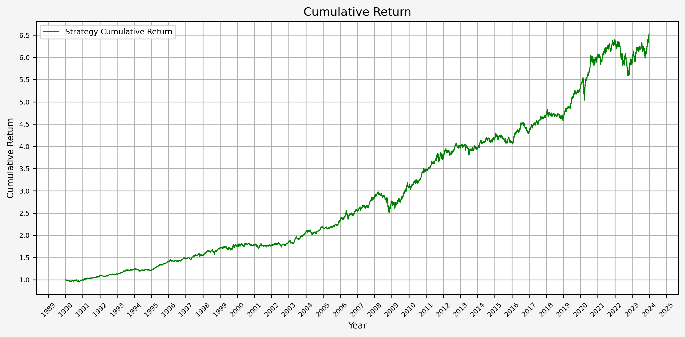
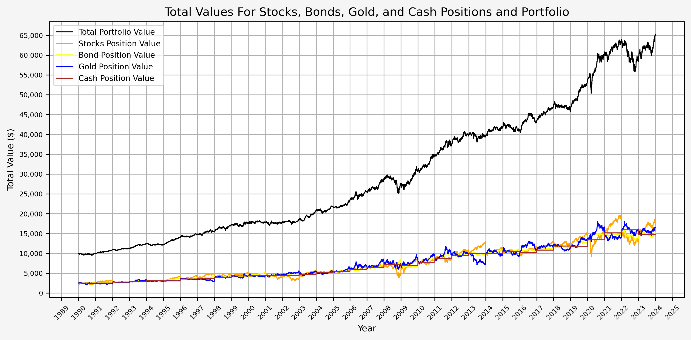
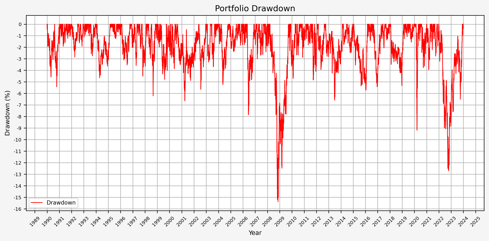
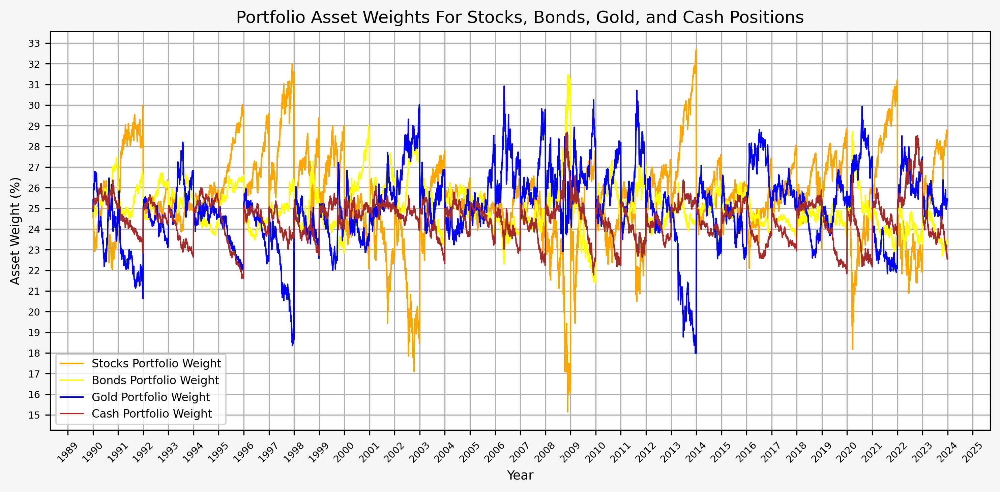

<!-- ## Post Updates

Update 12/5/2024: Updated code for summary stats function, various code comments, and corrected grammatical errors.</br>
Update 2/19/2025: Various code updates, commented and documented functions.</br>
Update 5/2/2025: Updated functions and code. -->

## Introduction

Harry Browne was an influencial politician, financial advisor, and author who lived from 1933 to 2006 and published 12 books. Wikipedia has [an in-depth biography](https://en.wikipedia.org/wiki/Harry_Browne) on him.

Within the world of finance and investing, one of his best known works is *Fail-Safe Investing: Lifelong Financial Security in 30 Minutes*. In it, he introduces the idea of the "Permanent Portfolio", an investment strategy that uses only four assets and is very simple to implement.

In this post, we will investigate Browne's suggested portfolio, including performance across various market cycles and economic regimes.

## Browne's Portfolio Requirements

In *Fail-Safe Investing*, under rule #11, Browne lays out the requirements for a "bulletproof portfolio" that will "assure that your wealth will survive any event - including events that would be devastating to any one investment. In other words, this portfolio should protect you *no matter what the future brings.*"

His requirements for the portfolio consist of the followng:

1. Safety: Protection again any economic future, including "inflation, recession, or even depression"
2. Stability: Performance should be consistent so that you will not need to make any changes and will not experience significant drawdowns
3. Simplicity: Easy to implement and take very little time to maintain

He then describes the four "broad movements" of the economy:

1. Prosperity: The economy is growing, business is doing well, interest rates are usually low
2. Inflation: The cost of goods and services is rising
3. Tight money or recession: The money supply is shrinking, economic activity is slowing
4. Deflation: Prices are declining and the value of money is increasing

## The Permanent Portfolio

Browne then matches an asset class to each of the economic conditions above:

1. Prosperity -> Stocks (due to prosperity) and long term bonds (when interest rates fall)
2. Inflation -> Gold
3. Deflation -> Long term bonds (when interest rates fall)
4. Tight money -> Cash

He completes the Permanent Portfolio by stipulating the following:

* Start with a base allocation of 25% to each of the asset classes (stocks, bonds, gold, cash)
* Rebalance back to the base allocation annually, or when "any of the four investments has become worth less than 15%, or more than 35%, of the portfolio's overall value"</br>**Note:** Browne does not specify when the portfolio should be rebalanced; therefore, we will make an assumption of a January 1st rebalance.

## Data

For this exercise, we will use the following asset classes:

1. Stocks: S&P 500 (SPXT_S&P 500 Total Return Index)
2. Bonds: 10 Year US Treasuries (SPBDU10T_S&P US Treasury Bond 7-10 Year Total Return Index)
3. Gold: Gold Spot Price (XAU_Gold USD Spot)
4. Cash: USD

With the exception of cash, all data is sourced from Bloomberg.

We could use ETFs, but the available price history for the ETFs is much shorter than the indices above. If we wanted to use ETFs, the following would work:

1. Stocks: IVV - iShares Core S&P 500 ETF
2. Bonds: IEF - iShares 7-10 Year Treasury Bond ETF
3. Gold: IAU - iShares Gold Trust
4. Cash: USD

## Python Functions

Here are the functions needed for this project:

* [bb_clean_data](/2025/02/02/reusable-extensible-python-functions-financial-data-analysis/#bb_clean_data): Takes an Excel export from Bloomberg, removes the miscellaneous headings/rows, and returns a DataFrame.</br>
* [df_info](/2025/02/02/reusable-extensible-python-functions-financial-data-analysis/#df_info): A simple function to display the information about a DataFrame and the first five rows and last five rows.</br>
* [df_info_markdown](/2025/02/02/reusable-extensible-python-functions-financial-data-analysis/#df_info_markdown): Similar to the `df_info` function above, except that it coverts the output to markdown.</br>
* [export_track_md_deps](/2025/02/02/reusable-extensible-python-functions-financial-data-analysis/#export_track_md_deps): Exports various text outputs to markdown files, which are included in the `index.md` file created when building the site with Hugo.</br>
* [load_data](/2025/02/02/reusable-extensible-python-functions-financial-data-analysis/#load_data): Load data from a CSV, Excel, or Pickle file into a pandas DataFrame.</br>
* [pandas_set_decimal_places](/2025/02/02/reusable-extensible-python-functions-financial-data-analysis/#pandas_set_decimal_places): Set the number of decimal places displayed for floating-point numbers in pandas.</br>
* [strategy_harry_brown_perm_port](/2025/02/02/reusable-extensible-python-functions-financial-data-analysis/#strategy_harry_brown_perm_port): Execute the strategy for the Harry Brown permanent portfolio.</br>
* [summary_stats](/2025/02/02/reusable-extensible-python-functions-financial-data-analysis/#summary_stats): Generate summary statistics for a series of returns.</br>

## Data Overview

### Load Data

As previously mentioned, the data for this exercise comes primarily from Bloomberg. We'll start with loading the data first for bonds:

``` python
# Set decimal places
pandas_set_decimal_places(3)

# Bonds dataframe
bb_clean_data(
    base_directory=DATA_DIR,
    fund_ticker_name="SPBDU10T_S&P US Treasury Bond 7-10 Year Total Return Index",
    source="Bloomberg",
    asset_class="Indices",
    excel_export=True,
    pickle_export=True,
    output_confirmation=True,
)

bonds_data = load_data(
    base_directory=DATA_DIR,
    ticker="SPBDU10T_S&P US Treasury Bond 7-10 Year Total Return Index_Clean",
    source="Bloomberg",
    asset_class="Indices",
    timeframe="Daily",
)

bonds_data['Date'] = pd.to_datetime(bonds_data['Date'])
bonds_data.set_index('Date', inplace = True)
bonds_data = bonds_data[(bonds_data.index >= '1990-01-01') & (bonds_data.index <= '2023-12-31')]
bonds_data.rename(columns={'Close':'Bonds_Close'}, inplace=True)
bonds_data['Bonds_Daily_Return'] = bonds_data['Bonds_Close'].pct_change()
bonds_data['Bonds_Total_Return'] = (1 + bonds_data['Bonds_Daily_Return']).cumprod()
display(bonds_data.head())
```

The following is the output:

<!-- INSERT_01_Bonds_Data_Head_HERE -->

Then for stocks:

```python
# Stocks dataframe
bb_clean_data(
    base_directory=DATA_DIR,
    fund_ticker_name="SPXT_S&P 500 Total Return Index",
    source="Bloomberg",
    asset_class="Indices",
    excel_export=True,
    pickle_export=True,
    output_confirmation=True,
)

stocks_data = load_data(
    base_directory=DATA_DIR,
    ticker="SPXT_S&P 500 Total Return Index_Clean",
    source="Bloomberg",
    asset_class="Indices",
    timeframe="Daily",
)

stocks_data['Date'] = pd.to_datetime(stocks_data['Date'])
stocks_data.set_index('Date', inplace = True)
stocks_data = stocks_data[(stocks_data.index >= '1990-01-01') & (stocks_data.index <= '2023-12-31')]
stocks_data.rename(columns={'Close':'Stocks_Close'}, inplace=True)
stocks_data['Stocks_Daily_Return'] = stocks_data['Stocks_Close'].pct_change()
stocks_data['Stocks_Total_Return'] = (1 + stocks_data['Stocks_Daily_Return']).cumprod()
display(stocks_data.head())
```

The following is the output:

<!-- INSERT_01_Stocks_Data_Head_HERE -->

And finally, gold:

```python
# Gold dataframe
bb_clean_data(
    base_directory=DATA_DIR,
    fund_ticker_name="XAU_Gold USD Spot",
    source="Bloomberg",
    asset_class="Commodities",
    excel_export=True,
    pickle_export=True,
    output_confirmation=True,
)

gold_data = load_data(
    base_directory=DATA_DIR,
    ticker="XAU_Gold USD Spot_Clean",
    source="Bloomberg",
    asset_class="Commodities",
    timeframe="Daily",
)

gold_data['Date'] = pd.to_datetime(gold_data['Date'])
gold_data.set_index('Date', inplace = True)
gold_data = gold_data[(gold_data.index >= '1990-01-01') & (gold_data.index <= '2023-12-31')]
gold_data.rename(columns={'Close':'Gold_Close'}, inplace=True)
gold_data['Gold_Daily_Return'] = gold_data['Gold_Close'].pct_change()
gold_data['Gold_Total_Return'] = (1 + gold_data['Gold_Daily_Return']).cumprod()
display(gold_data.head())
```

The following is the output:

<!-- INSERT_01_Gold_Data_Head_HERE -->

### Combine Data

We'll now combine the dataframes for the timeseries data from each of the asset classes, as follows:

```python
# Merge the stock data and bond data into a single DataFrame using their indices (dates)
perm_port = pd.merge(stocks_data['Stocks_Close'], bonds_data['Bonds_Close'], left_index=True, right_index=True)

# Add gold data to the portfolio DataFrame by merging it with the existing data on indices (dates)
perm_port = pd.merge(perm_port, gold_data['Gold_Close'], left_index=True, right_index=True)

# Add a column for cash with a constant value of 1 (assumes the value of cash remains constant at $1 over time)
perm_port['Cash_Close'] = 1

# Remove any rows with missing values (NaN) to ensure clean data for further analysis
perm_port.dropna(inplace=True)

# Display the finalized portfolio DataFrame
display(perm_port)
```

### Check For Missing Values

We can check for any missing (NaN) values in each column:

```python
# Check for any missing values in each column
perm_port.isnull().any()
```

### DataFrame Info

Now, running:

``` python
df_info(perm_port)
```

Gives us the following:

<!-- INSERT_02_Perm_Port_DF_Info_HERE -->

We can see that we have daily close price data for all 4 asset classes from the beginning of 1990 to the end of 2023.

## Execute Strategy

Using an annual rebalance date of January 1, we'll now execute the strategy with the following code:

```python
# List of funds to be used
fund_list = ['Stocks', 'Bonds', 'Gold', 'Cash']

# Starting cash contribution
starting_cash = 10000

# Monthly cash contribution
cash_contrib = 0

strat = strategy_harry_brown_perm_port(
    fund_list=fund_list, 
    starting_cash=starting_cash, 
    cash_contrib=cash_contrib, 
    close_prices_df=perm_port, 
    rebal_month=1, 
    rebal_day=1, 
    rebal_per_high=0.35, 
    rebal_per_low=0.15,
    excel_export=True,
    pickle_export=True,
    output_confirmation=True,
)

strat = strat.set_index('Date')
```

This returns a dataframe with the entire strategy.

Running:

```python
df_info(strat)
```

Gives us:

<!-- INSERT_03_Strategy_HERE -->

From the above, we can see that there are all columns for before/after re-balancing, including the shares, asset values, percentages, etc. for the four different asset classes.

## Strategy Statistics

Let's look at the summary statistics for the entire timeframe, as well as several different ranges:

```python
sum_stats = summary_stats(
    fund_list=fund_list,
    df=strat[['Return']],
    period="Daily",
    excel_export=True,
    pickle_export=True,
    output_confirmation=True,
)

strat_pre_1999 = strat[strat.index < '2000-01-01']
sum_stats_pre_1999 = summary_stats(
    fund_list=fund_list, 
    df=strat_pre_1999[['Return']], 
    period="Daily",
    excel_export=False,
    pickle_export=False,
    output_confirmation=True,
)

strat_post_1999 = strat[strat.index >= '2000-01-01']
sum_stats_post_1999 = summary_stats(
    fund_list=fund_list, 
    df=strat_post_1999[['Return']], 
    period="Daily",
    excel_export=False,
    pickle_export=False,
    output_confirmation=True,
)

strat_post_2009 = strat[strat.index >= '2010-01-01']
sum_stats_post_2009 = summary_stats(
    fund_list=fund_list, 
    df=strat_post_2009[['Return']], 
    period="Daily",
    excel_export=False,
    pickle_export=False,
    output_confirmation=True,
)
```

And the concat them to make comparing them easier:

```python
all_sum_stats = pd.concat([sum_stats])
all_sum_stats = all_sum_stats.rename(index={'Return': '1990 - 2023'})
all_sum_stats = pd.concat([all_sum_stats, sum_stats_pre_1999])
all_sum_stats = all_sum_stats.rename(index={'Return': 'Pre 1999'})
all_sum_stats = pd.concat([all_sum_stats, sum_stats_post_1999])
all_sum_stats = all_sum_stats.rename(index={'Return': 'Post 1999'})
all_sum_stats = pd.concat([all_sum_stats, sum_stats_post_2009])
all_sum_stats = all_sum_stats.rename(index={'Return': 'Post 2009'})
display(all_sum_stats)
```

Which gives us:

<!-- INSERT_04_Summary_Stats_HERE -->

<!-- Here we have a mean annualized return of 8.3%, volatility of 7.2%, a CAGR of 8.4% and a Sharpe ratio of 1.15. And this with a max drawdown of just over 15%. Not bad, Mr. Browne!

Since the book was published in 1999, let's look specifically at the summary stats for below and after 1999.

The mean annualized return is approximately 0.7% lower for the pre 1999 vs post 1999 data, as is the CAGR. The volatility is higher for the post 1999 data which leads to a difference in the Sharpe ratio. -->

## Annual Returns

Here's the annual returns:

<!-- INSERT_05_Annual_Returns_HERE -->

Since the strategy, summary statistics, and annual returns are all exported as excel files, they can be found at the following locations:

* [Stocks_Bonds_Gold_Cash_Strategy.xlsx](Stocks_Bonds_Gold_Cash_Strategy.xlsx)</br>
* [Stocks_Bonds_Gold_Cash_Summary_Stats.xlsx](Stocks_Bonds_Gold_Cash_Summary_Stats.xlsx)</br>
* [Stocks_Bonds_Gold_Cash_Annual_Returns.xlsx](Stocks_Bonds_Gold_Cash_Annual_Returns.xlsx)</br>

Next we will look at some plots to help visualize the data.

## Generate Plots

Here are the various functions needed for the plots:

### Plot Cumulative Return

Plot cumulative return:

```python
def plot_cumulative_return(strat_df):
    # Generate plot
    plt.figure(figsize=(10, 5), facecolor = '#F5F5F5')

    # Plotting data
    plt.plot(strat_df.index, strat_df['Cumulative_Return'], label = 'Strategy Cumulative Return', linestyle='-', color='green', linewidth=1)
    
    # Set X axis
    # x_tick_spacing = 5  # Specify the interval for x-axis ticks
    # plt.gca().xaxis.set_major_locator(MultipleLocator(x_tick_spacing))
    plt.gca().xaxis.set_major_locator(mdates.YearLocator())
    plt.gca().xaxis.set_major_formatter(mdates.DateFormatter('%Y'))
    plt.xlabel('Year', fontsize = 9)
    plt.xticks(rotation = 45, fontsize = 7)
    # plt.xlim(, )

    # Set Y axis
    y_tick_spacing = 0.5  # Specify the interval for y-axis ticks
    plt.gca().yaxis.set_major_locator(MultipleLocator(y_tick_spacing))
    plt.ylabel('Cumulative Return', fontsize = 9)
    plt.yticks(fontsize = 7)
    plt.ylim(0, 7.5)

    # Set title, etc.
    plt.title('Cumulative Return', fontsize = 12)
    
    # Set the grid & legend
    plt.tight_layout()
    plt.grid(True)
    plt.legend(fontsize=8)

    # Save the figure
    plt.savefig('03_Cumulative_Return.png', dpi=300, bbox_inches='tight')

    # Display the plot
    return plt.show()
```

### Plot Portfolio Values

Plot portfolio values:

```python
def plot_values(strat_df):   
    # Generate plot   
    plt.figure(figsize=(10, 5), facecolor = '#F5F5F5')
    
    # Plotting data
    plt.plot(strat_df.index, strat_df['Total_AA_$_Invested'], label='Total Portfolio Value', linestyle='-', color='black', linewidth=1)
    plt.plot(strat_df.index, strat_df['Stocks_AA_$_Invested'], label='Stocks Position Value', linestyle='-', color='orange', linewidth=1)
    plt.plot(strat_df.index, strat_df['Bonds_AA_$_Invested'], label='Bond Position Value', linestyle='-', color='yellow', linewidth=1)
    plt.plot(strat_df.index, strat_df['Gold_AA_$_Invested'], label='Gold Position Value', linestyle='-', color='blue', linewidth=1)
    plt.plot(strat_df.index, strat_df['Cash_AA_$_Invested'], label='Cash Position Value', linestyle='-', color='brown', linewidth=1)

    # Set X axis
    # x_tick_spacing = 5  # Specify the interval for x-axis ticks
    # plt.gca().xaxis.set_major_locator(MultipleLocator(x_tick_spacing))
    plt.gca().xaxis.set_major_locator(mdates.YearLocator())
    plt.gca().xaxis.set_major_formatter(mdates.DateFormatter('%Y'))
    plt.xlabel('Year', fontsize = 9)
    plt.xticks(rotation = 45, fontsize = 7)
    # plt.xlim(, )


    # Set Y axis
    y_tick_spacing = 5000  # Specify the interval for y-axis ticks
    plt.gca().yaxis.set_major_locator(MultipleLocator(y_tick_spacing))
    plt.gca().yaxis.set_major_formatter(mtick.FuncFormatter(lambda x, pos: '{:,.0f}'.format(x))) # Adding commas to y-axis labels
    plt.ylabel('Total Value ($)', fontsize = 9)
    plt.yticks(fontsize = 7)
    plt.ylim(0, 75000)

    # Set title, etc.
    plt.title('Total Values For Stocks, Bonds, Gold, and Cash Positions and Portfolio', fontsize = 12)
    
    # Set the grid & legend
    plt.tight_layout()
    plt.grid(True)
    plt.legend(fontsize=8)

    # Save the figure
    plt.savefig('04_Portfolio_Values.png', dpi=300, bbox_inches='tight')

    # Display the plot
    return plt.show()
```

### Plot Portfolio Drawdown

Plot portfolio drawdown:

```python
def plot_drawdown(strat_df):
    rolling_max = strat_df['Total_AA_$_Invested'].cummax()
    drawdown = (strat_df['Total_AA_$_Invested'] - rolling_max) / rolling_max * 100

    # Generate plot   
    plt.figure(figsize=(10, 5), facecolor = '#F5F5F5')

    # Plotting data
    plt.plot(strat_df.index, drawdown, label='Drawdown', linestyle='-', color='red', linewidth=1)
    
    # Set X axis
    # x_tick_spacing = 5  # Specify the interval for x-axis ticks
    # plt.gca().xaxis.set_major_locator(MultipleLocator(x_tick_spacing))
    plt.gca().xaxis.set_major_locator(mdates.YearLocator())
    plt.gca().xaxis.set_major_formatter(mdates.DateFormatter('%Y'))
    plt.xlabel('Year', fontsize = 9)
    plt.xticks(rotation = 45, fontsize = 7)
    # plt.xlim(, )

    # Set Y axis
    y_tick_spacing = 1  # Specify the interval for y-axis ticks
    plt.gca().yaxis.set_major_locator(MultipleLocator(y_tick_spacing))
    # plt.gca().yaxis.set_major_formatter(mtick.FuncFormatter(lambda x, pos: '{:,.0f}'.format(x))) # Adding commas to y-axis labels
    plt.gca().yaxis.set_major_formatter(mtick.FuncFormatter(lambda x, pos: '{:.0f}'.format(x))) # Adding 0 decimal places to y-axis labels
    plt.ylabel('Drawdown (%)', fontsize = 9)
    plt.yticks(fontsize = 7)
    plt.ylim(-20, 0)

    # Set title, etc.
    plt.title('Portfolio Drawdown', fontsize = 12)
    
    # Set the grid & legend
    plt.tight_layout()
    plt.grid(True)
    plt.legend(fontsize=8)

    # Save the figure
    plt.savefig('05_Portfolio_Drawdown.png', dpi=300, bbox_inches='tight')

    # Display the plot
    return plt.show()
```

### Plot Portfolio Asset Weights

Plot portfolio asset weights:

```python
def plot_asset_weights(strat_df):
    # Generate plot   
    plt.figure(figsize=(10, 5), facecolor = '#F5F5F5')
    
    # Plotting data
    plt.plot(strat_df.index, strat_df['Stocks_AA_Port_%'] * 100, label='Stocks Portfolio Weight', linestyle='-', color='orange', linewidth=1)
    plt.plot(strat_df.index, strat_df['Bonds_AA_Port_%'] * 100, label='Bonds Portfolio Weight', linestyle='-', color='yellow', linewidth=1)
    plt.plot(strat_df.index, strat_df['Gold_AA_Port_%'] * 100, label='Gold Portfolio Weight', linestyle='-', color='blue', linewidth=1)
    plt.plot(strat_df.index, strat_df['Cash_AA_Port_%'] * 100, label='Cash Portfolio Weight', linestyle='-', color='brown', linewidth=1)

    # Set X axis
    # x_tick_spacing = 5  # Specify the interval for x-axis ticks
    # plt.gca().xaxis.set_major_locator(MultipleLocator(x_tick_spacing))
    plt.gca().xaxis.set_major_locator(mdates.YearLocator())
    plt.gca().xaxis.set_major_formatter(mdates.DateFormatter('%Y'))
    plt.xlabel('Year', fontsize = 9)
    plt.xticks(rotation = 45, fontsize = 7)
    # plt.xlim(, )

    # Set Y axis
    y_tick_spacing = 2  # Specify the interval for y-axis ticks
    plt.gca().yaxis.set_major_locator(MultipleLocator(y_tick_spacing))
    # plt.gca().yaxis.set_major_formatter(mtick.FuncFormatter(lambda x, pos: '{:,.0f}'.format(x))) # Adding commas to y-axis labels
    plt.ylabel('Asset Weight (%)', fontsize = 9)
    plt.yticks(fontsize = 7)
    plt.ylim(14, 36)

    # Set title, etc.
    plt.title('Portfolio Asset Weights For Stocks, Bonds, Gold, and Cash Positions', fontsize = 12)
    
    # Set the grid & legend
    plt.tight_layout()
    plt.grid(True)
    plt.legend(fontsize=8)

    # Save the figure
    plt.savefig('07_Portfolio_Weights.png', dpi=300, bbox_inches='tight')

    # Display the plot
    return plt.show()
```

Execute plots:

```python
plot_cumulative_return(strat)
plot_values(strat)
plot_drawdown(strat)
plot_asset_weights(strat)

# Create dataframe for the annual returns
strat_annual_returns = strat['Cumulative_Return'].resample('Y').last().pct_change().dropna()
strat_annual_returns_df = strat_annual_returns.to_frame()
strat_annual_returns_df['Year'] = strat_annual_returns_df.index.year  # Add a 'Year' column with just the year
strat_annual_returns_df.reset_index(drop=True, inplace=True)  # Reset the index to remove the datetime index

# Now the DataFrame will have 'Year' and 'Cumulative_Return' columns
strat_annual_returns_df = strat_annual_returns_df[['Year', 'Cumulative_Return']]  # Keep only 'Year' and 'Cumulative_Return' columns
strat_annual_returns_df.rename(columns = {'Cumulative_Return':'Return'}, inplace=True)
strat_annual_returns_df.set_index('Year', inplace=True)
display(strat_annual_returns_df)

plan_name = '_'.join(fund_list)
file = plan_name + "_Annual_Returns.xlsx"
location = file
strat_annual_returns_df.to_excel(location, sheet_name='data')

plot_annual_returns(strat_annual_returns_df)
```

Here are several relevant plots:

1. Cumulative Return



2. Portfolio Values (Total, Stocks, Bonds, Gold, and Cash)



Here we can see the annual rebalancing taking effect with the values of the different asset classes. This can also be seen more clearly below.

3. Portfolio Drawdown



From this plot, we can see that the maximum drawdown came during the GFC; the drawdown during COVID was (interestingly) less than 10%.

4. Portfolio Asset Weights



The annual rebalancing appears to work effectively by selling assets that have increased in value and buying assets that have decreased in value over the previous year. Also note that there is only one instance when the weight of an asset fell to 15%. This occured for stocks during the GFC.

5. Portfolio Annual Returns


It's interesting to see that there really aren't any significant up or down years. Instead, it's a steady climb without much volatility.

## Summary

Overall, this is an interesting case study and Browne's idea behind the Permanent Portfolio is certainly compelling. There might be more investigation to be done with respect to the following:

* Investigate the extent to which the rebalancing date effects the portfolio performance
* Vary the weights of the asset classes to see if there is a meanful change in the results
* Experiment with leverage (i.e., simulating 1.2x leverage with a portfolio with weights of 30, 30, 30, 10 for stocks, bonds, gold, cash respectively.)
* Use ETFs instead of Bloomberg index data, and verify the results are similar. ETF data is much more available than the Bloomberg index.

## References

1. Fail-Safe Investing: Lifelong Financial Security in 30 Minutes, by Harry Browne

## Code

The jupyter notebook with the functions and all other code is available [here](harry-browne-permanent-portfolio.ipynb).</br>
The html export of the jupyter notebook is available [here](harry-browne-permanent-portfolio.html).</br>
The pdf export of the jupyter notebook is available [here](harry-browne-permanent-portfolio.pdf).
