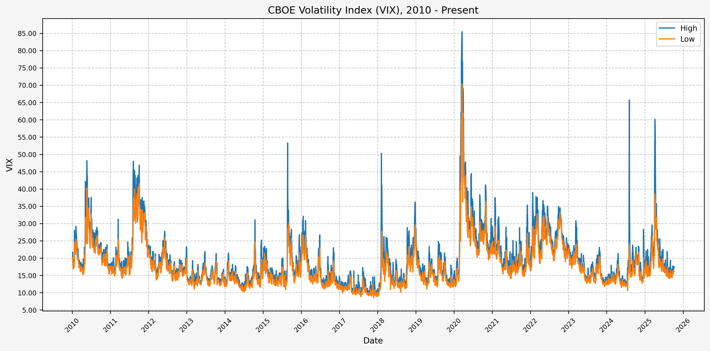
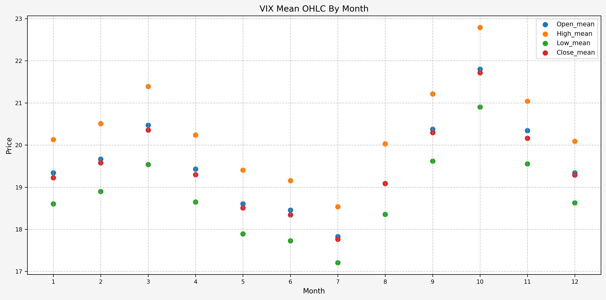
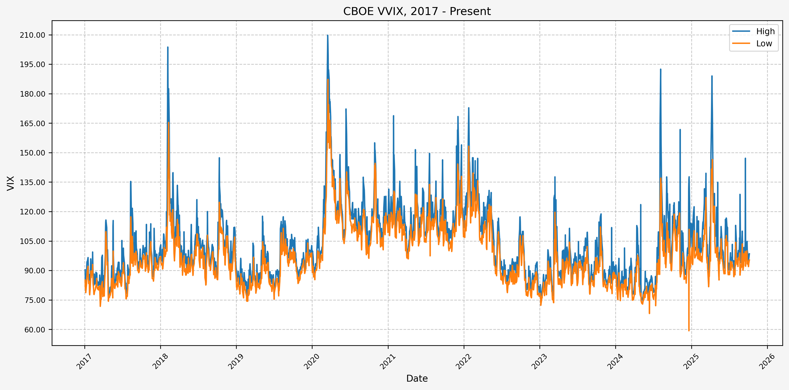
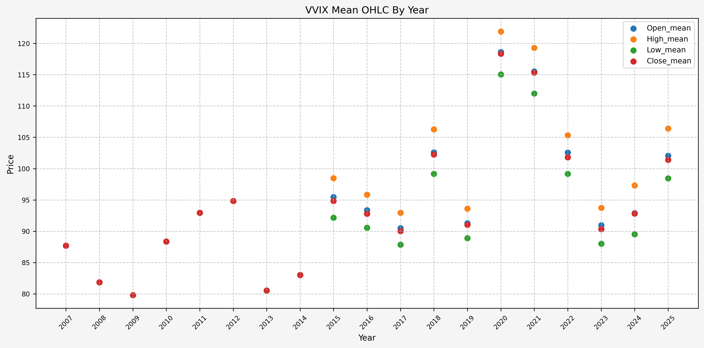
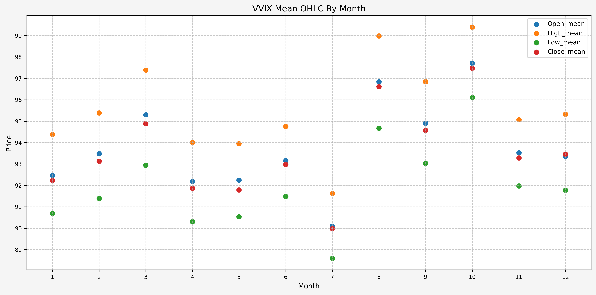

## Introduction

From the [CBOE VIX website](https://www.cboe.com/tradable_products/vix/):

"Cboe Global Markets revolutionized investing with the creation of the Cboe Volatility Index® (VIX® Index), the first benchmark index to measure the market’s expectation of future volatility. The VIX Index is based on options of the S&P 500® Index, considered the leading indicator of the broad U.S. stock market. The VIX Index is recognized as the world’s premier gauge of U.S. equity market volatility."

In this tutorial, we will investigate finding a signal to use as a basis to trade the VIX.

## VIX Data

I don't have access to data for the VIX through [Nasdaq Data Link](https://www.nasdaq.com/nasdaq-data-link) or any other data source, but for our purposes Yahoo Finance is sufficient. Using the [yfinance](https://pypi.org/project/yfinance/) python module, we can pull what we need and quicky dump it to excel to retain it for future use.

## Python Functions

Here are the functions needed for this project:

* [calc_vix_trade_pnl](/2025/02/02/reusable-extensible-python-functions-financial-data-analysis/#calc_vix_trade_pnl): Calculates the profit/loss from VIX options trades.</br>
* [df_info](/2025/02/02/reusable-extensible-python-functions-financial-data-analysis/#df_info): A simple function to display the information about a DataFrame and the first five rows and last five rows.</br>
* [df_info_markdown](/2025/02/02/reusable-extensible-python-functions-financial-data-analysis/#df_info_markdown): Similar to the `df_info` function above, except that it coverts the output to markdown.</br>
* [export_track_md_deps](/2025/02/02/reusable-extensible-python-functions-financial-data-analysis/#export_track_md_deps): Exports various text outputs to markdown files, which are included in the `index.md` file created when building the site with Hugo.</br>
* [load_data](/2025/02/02/reusable-extensible-python-functions-financial-data-analysis/#load_data): Load data from a CSV, Excel, or Pickle file into a pandas DataFrame.</br>
* [pandas_set_decimal_places](/2025/02/02/reusable-extensible-python-functions-financial-data-analysis/#pandas_set_decimal_places): Set the number of decimal places displayed for floating-point numbers in pandas.</br>
* [plot_price](/2025/02/02/reusable-extensible-python-functions-financial-data-analysis/#plot_price): Plot the price data from a DataFrame for a specified date range and columns.</br>
* [plot_stats](/2025/02/02/reusable-extensible-python-functions-financial-data-analysis/#plot_stats): Generate a scatter plot for the mean OHLC prices.</br>
* [plot_vix_with_trades](/2025/02/02/reusable-extensible-python-functions-financial-data-analysis/#plot_vix_with_trades): Plot the VIX daily high and low prices, along with the VIX spikes, and trades.</br>
* [yf_pull_data](/2025/02/02/reusable-extensible-python-functions-financial-data-analysis/#yf_pull_data): Download daily price data from Yahoo Finance and export it.

## Data Overview (VIX)

### Acquire CBOE Volatility Index (VIX) Data

First, let's get the data:

```python
yf_pull_data(
    base_directory=DATA_DIR,
    ticker="^VIX",
    source="Yahoo_Finance", 
    asset_class="Indices", 
    excel_export=True,
    pickle_export=True,
    output_confirmation=True,
)
```

### Load Data - VIX

Now that we have the data, let's load it up and take a look:

```python
# Set decimal places
pandas_set_decimal_places(2)

# VIX
vix = load_data(
    base_directory=DATA_DIR,
    ticker="^VIX",
    source="Yahoo_Finance", 
    asset_class="Indices",
    timeframe="Daily",
)

# Set 'Date' column as datetime
vix['Date'] = pd.to_datetime(vix['Date'])

# Drop 'Volume'
vix.drop(columns = {'Volume'}, inplace = True)

# Set Date as index
vix.set_index('Date', inplace = True)

# Check to see if there are any NaN values
vix[vix['High'].isna()]

# Forward fill to clean up missing data
vix['High'] = vix['High'].ffill()
```

### DataFrame Info - VIX

Now, running:

```python
df_info(vix)
```

Gives us the following:

```text
The columns, shape, and data types are:

<class 'pandas.core.frame.DataFrame'>
DatetimeIndex: 9037 entries, 1990-01-02 to 2025-11-17
Data columns (total 4 columns):
 #   Column  Non-Null Count  Dtype  
---  ------  --------------  -----  
 0   Close   9037 non-null   float64
 1   High    9037 non-null   float64
 2   Low     9037 non-null   float64
 3   Open    9037 non-null   float64
dtypes: float64(4)
memory usage: 353.0 KB

```

The first 5 rows are:

| Date                |   Close |   High |   Low |   Open |
|:--------------------|--------:|-------:|------:|-------:|
| 1990-01-02 00:00:00 |   17.24 |  17.24 | 17.24 |  17.24 |
| 1990-01-03 00:00:00 |   18.19 |  18.19 | 18.19 |  18.19 |
| 1990-01-04 00:00:00 |   19.22 |  19.22 | 19.22 |  19.22 |
| 1990-01-05 00:00:00 |   20.11 |  20.11 | 20.11 |  20.11 |
| 1990-01-08 00:00:00 |   20.26 |  20.26 | 20.26 |  20.26 |

The last 5 rows are:

| Date                |   Close |   High |   Low |   Open |
|:--------------------|--------:|-------:|------:|-------:|
| 2025-11-11 00:00:00 |   17.28 |  18.01 | 17.25 |  17.90 |
| 2025-11-12 00:00:00 |   17.51 |  18.06 | 17.10 |  17.21 |
| 2025-11-13 00:00:00 |   20.00 |  21.31 | 17.51 |  17.61 |
| 2025-11-14 00:00:00 |   19.83 |  23.03 | 19.56 |  21.33 |
| 2025-11-17 00:00:00 |   22.38 |  23.44 | 19.54 |  19.58 |

### Statistics - VIX

Some interesting statistics jump out at us when we look at the mean, standard deviation, minimum, and maximum values for the full dataset. The following code:

```python
vix_stats = vix.describe()
num_std = [-1, 0, 1, 2, 3, 4, 5]
for num in num_std:
    vix_stats.loc[f"mean + {num} std"] = {
        'Open': vix_stats.loc['mean']['Open'] + num * vix_stats.loc['std']['Open'],
        'High': vix_stats.loc['mean']['High'] + num * vix_stats.loc['std']['High'],
        'Low': vix_stats.loc['mean']['Low'] + num * vix_stats.loc['std']['Low'],
        'Close': vix_stats.loc['mean']['Close'] + num * vix_stats.loc['std']['Close'],
    }
display(vix_stats)
```

Gives us:

|               |   Close |    High |     Low |    Open |
|:--------------|--------:|--------:|--------:|--------:|
| count         | 9037.00 | 9037.00 | 9037.00 | 9037.00 |
| mean          |   19.46 |   20.38 |   18.79 |   19.56 |
| std           |    7.79 |    8.35 |    7.35 |    7.87 |
| min           |    9.14 |    9.31 |    8.56 |    9.01 |
| 25%           |   13.92 |   14.58 |   13.44 |   13.96 |
| 50%           |   17.61 |   18.33 |   17.02 |   17.66 |
| 75%           |   22.76 |   23.76 |   22.09 |   22.92 |
| max           |   82.69 |   89.53 |   72.76 |   82.69 |
| mean + -1 std |   11.67 |   12.02 |   11.44 |   11.69 |
| mean + 0 std  |   19.46 |   20.38 |   18.79 |   19.56 |
| mean + 1 std  |   27.26 |   28.73 |   26.14 |   27.43 |
| mean + 2 std  |   35.05 |   37.08 |   33.49 |   35.29 |
| mean + 3 std  |   42.85 |   45.43 |   40.84 |   43.16 |
| mean + 4 std  |   50.64 |   53.78 |   48.19 |   51.03 |
| mean + 5 std  |   58.44 |   62.13 |   55.54 |   58.90 |

We can also run the statistics individually for each year:

```python
# Group by year and calculate mean and std for OHLC
vix_stats_by_year = vix.groupby(vix.index.year)[["Open", "High", "Low", "Close"]].agg(["mean", "std"])

# Flatten the column MultiIndex
vix_stats_by_year.columns = ['_'.join(col).strip() for col in vix_stats_by_year.columns.values]
vix_stats_by_year.index.name = "Year"

display(vix_stats_by_year)
```

Gives us:

|   Year |   Open_mean |   Open_std |   Open_min |   Open_max |   High_mean |   High_std |   High_min |   High_max |   Low_mean |   Low_std |   Low_min |   Low_max |   Close_mean |   Close_std |   Close_min |   Close_max |
|-------:|------------:|-----------:|-----------:|-----------:|------------:|-----------:|-----------:|-----------:|-----------:|----------:|----------:|----------:|-------------:|------------:|------------:|------------:|
|   1990 |       23.06 |       4.74 |      14.72 |      36.47 |       23.06 |       4.74 |      14.72 |      36.47 |      23.06 |      4.74 |     14.72 |     36.47 |        23.06 |        4.74 |       14.72 |       36.47 |
|   1991 |       18.38 |       3.68 |      13.95 |      36.20 |       18.38 |       3.68 |      13.95 |      36.20 |      18.38 |      3.68 |     13.95 |     36.20 |        18.38 |        3.68 |       13.95 |       36.20 |
|   1992 |       15.23 |       2.26 |      10.29 |      20.67 |       16.03 |       2.19 |      11.90 |      25.13 |      14.85 |      2.14 |     10.29 |     19.67 |        15.45 |        2.12 |       11.51 |       21.02 |
|   1993 |       12.70 |       1.37 |       9.18 |      16.20 |       13.34 |       1.40 |       9.55 |      18.31 |      12.25 |      1.28 |      8.89 |     15.77 |        12.69 |        1.33 |        9.31 |       17.30 |
|   1994 |       13.79 |       2.06 |       9.86 |      23.61 |       14.58 |       2.28 |      10.31 |      28.30 |      13.38 |      1.99 |      9.59 |     23.61 |        13.93 |        2.07 |        9.94 |       23.87 |
|   1995 |       12.27 |       1.03 |      10.29 |      15.79 |       12.93 |       1.07 |      10.95 |      16.99 |      11.96 |      0.98 |     10.06 |     14.97 |        12.39 |        0.97 |       10.36 |       15.74 |
|   1996 |       16.31 |       1.92 |      11.24 |      23.90 |       16.99 |       2.12 |      12.29 |      27.05 |      15.94 |      1.82 |     11.11 |     21.43 |        16.44 |        1.94 |       12.00 |       21.99 |
|   1997 |       22.43 |       4.33 |      16.67 |      45.69 |       23.11 |       4.56 |      18.02 |      48.64 |      21.85 |      3.98 |     16.36 |     36.43 |        22.38 |        4.14 |       17.09 |       38.20 |
|   1998 |       25.68 |       6.96 |      16.42 |      47.95 |       26.61 |       7.36 |      16.50 |      49.53 |      24.89 |      6.58 |     16.10 |     45.58 |        25.60 |        6.86 |       16.23 |       45.74 |
|   1999 |       24.39 |       2.90 |      18.05 |      32.62 |       25.20 |       3.01 |      18.48 |      33.66 |      23.75 |      2.76 |     17.07 |     31.13 |        24.37 |        2.88 |       17.42 |       32.98 |
|   2000 |       23.41 |       3.43 |      16.81 |      33.70 |       24.10 |       3.66 |      17.06 |      34.31 |      22.75 |      3.19 |     16.28 |     30.56 |        23.32 |        3.41 |       16.53 |       33.49 |
|   2001 |       26.04 |       4.98 |      19.21 |      48.93 |       26.64 |       5.19 |      19.37 |      49.35 |      25.22 |      4.61 |     18.74 |     42.66 |        25.75 |        4.78 |       18.76 |       43.74 |
|   2002 |       27.53 |       7.03 |      17.23 |      48.17 |       28.28 |       7.25 |      17.51 |      48.46 |      26.60 |      6.64 |     17.02 |     42.05 |        27.29 |        6.91 |       17.40 |       45.08 |
|   2003 |       22.21 |       5.31 |      15.59 |      35.21 |       22.61 |       5.35 |      16.19 |      35.66 |      21.64 |      5.18 |     14.66 |     33.99 |        21.98 |        5.24 |       15.58 |       34.69 |
|   2004 |       15.59 |       1.93 |      11.41 |      21.06 |       16.05 |       2.02 |      11.64 |      22.67 |      15.05 |      1.79 |     11.14 |     20.61 |        15.48 |        1.92 |       11.23 |       21.58 |
|   2005 |       12.84 |       1.44 |      10.23 |      18.33 |       13.28 |       1.59 |      10.48 |      18.59 |      12.39 |      1.32 |      9.88 |     16.41 |        12.81 |        1.47 |       10.23 |       17.74 |
|   2006 |       12.90 |       2.18 |       9.68 |      23.45 |       13.33 |       2.46 |      10.06 |      23.81 |      12.38 |      1.96 |      9.39 |     21.45 |        12.81 |        2.25 |        9.90 |       23.81 |
|   2007 |       17.59 |       5.36 |       9.99 |      32.68 |       18.44 |       5.76 |      10.26 |      37.50 |      16.75 |      4.95 |      9.70 |     30.44 |        17.54 |        5.36 |        9.89 |       31.09 |
|   2008 |       32.83 |      16.41 |      16.30 |      80.74 |       34.57 |      17.83 |      17.84 |      89.53 |      30.96 |     14.96 |     15.82 |     72.76 |        32.69 |       16.38 |       16.30 |       80.86 |
|   2009 |       31.75 |       9.20 |      19.54 |      52.65 |       32.78 |       9.61 |      19.67 |      57.36 |      30.50 |      8.63 |     19.25 |     49.27 |        31.48 |        9.08 |       19.47 |       56.65 |
|   2010 |       22.73 |       5.29 |      15.44 |      47.66 |       23.69 |       5.82 |      16.00 |      48.20 |      21.69 |      4.61 |     15.23 |     40.30 |        22.55 |        5.27 |       15.45 |       45.79 |
|   2011 |       24.27 |       8.17 |      14.31 |      46.18 |       25.40 |       8.78 |      14.99 |      48.00 |      23.15 |      7.59 |     14.27 |     41.51 |        24.20 |        8.14 |       14.62 |       48.00 |
|   2012 |       17.93 |       2.60 |      13.68 |      26.35 |       18.59 |       2.72 |      14.08 |      27.73 |      17.21 |      2.37 |     13.30 |     25.72 |        17.80 |        2.54 |       13.45 |       26.66 |
|   2013 |       14.29 |       1.67 |      11.52 |      20.87 |       14.82 |       1.88 |      11.75 |      21.91 |      13.80 |      1.51 |     11.05 |     19.04 |        14.23 |        1.74 |       11.30 |       20.49 |
|   2014 |       14.23 |       2.65 |      10.40 |      29.26 |       14.95 |       3.02 |      10.76 |      31.06 |      13.61 |      2.21 |     10.28 |     24.64 |        14.17 |        2.62 |       10.32 |       25.27 |
|   2015 |       16.71 |       3.99 |      11.77 |      31.91 |       17.79 |       5.03 |      12.22 |      53.29 |      15.85 |      3.65 |     10.88 |     29.91 |        16.67 |        4.34 |       11.95 |       40.74 |
|   2016 |       16.01 |       4.05 |      11.32 |      29.01 |       16.85 |       4.40 |      11.49 |      32.09 |      15.16 |      3.66 |     10.93 |     26.67 |        15.83 |        3.97 |       11.27 |       28.14 |
|   2017 |       11.14 |       1.34 |       9.23 |      16.19 |       11.72 |       1.54 |       9.52 |      17.28 |      10.64 |      1.16 |      8.56 |     14.97 |        11.09 |        1.36 |        9.14 |       16.04 |
|   2018 |       16.63 |       5.01 |       9.01 |      37.32 |       18.03 |       6.12 |       9.31 |      50.30 |      15.53 |      4.25 |      8.92 |     29.66 |        16.64 |        5.09 |        9.15 |       37.32 |
|   2019 |       15.57 |       2.74 |      11.55 |      27.54 |       16.41 |       3.06 |      11.79 |      28.53 |      14.76 |      2.38 |     11.03 |     24.05 |        15.39 |        2.61 |       11.54 |       25.45 |
|   2020 |       29.52 |      12.45 |      12.20 |      82.69 |       31.46 |      13.89 |      12.42 |      85.47 |      27.50 |     10.85 |     11.75 |     70.37 |        29.25 |       12.34 |       12.10 |       82.69 |
|   2021 |       19.83 |       3.47 |      15.02 |      35.16 |       21.12 |       4.22 |      15.54 |      37.51 |      18.65 |      2.93 |     14.10 |     29.24 |        19.66 |        3.62 |       15.01 |       37.21 |
|   2022 |       25.98 |       4.30 |      16.57 |      37.50 |       27.25 |       4.59 |      17.81 |      38.94 |      24.69 |      3.91 |     16.34 |     33.11 |        25.62 |        4.22 |       16.60 |       36.45 |
|   2023 |       17.12 |       3.17 |      11.96 |      27.77 |       17.83 |       3.58 |      12.46 |      30.81 |      16.36 |      2.89 |     11.81 |     24.00 |        16.87 |        3.14 |       12.07 |       26.52 |
|   2024 |       15.69 |       3.14 |      11.53 |      33.71 |       16.65 |       4.73 |      12.23 |      65.73 |      14.92 |      2.58 |     10.62 |     24.02 |        15.61 |        3.36 |       11.86 |       38.57 |
|   2025 |       19.43 |       5.78 |      14.31 |      60.13 |       20.72 |       7.00 |      14.69 |      60.13 |      18.30 |      4.35 |     14.12 |     38.58 |        19.22 |        5.49 |       14.22 |       52.33 |

It is interesting to see how much the mean OHLC values vary by year.

And finally, we can run the statistics individually for each month:

```python
# Group by month and calculate mean and std for OHLC
vix_stats_by_month = vix.groupby(vix.index.month)[["Open", "High", "Low", "Close"]].agg(["mean", "std"])

# Flatten the column MultiIndex
vix_stats_by_month.columns = ['_'.join(col).strip() for col in vix_stats_by_month.columns.values]
vix_stats_by_month.index.name = "Month"

display(vix_stats_by_month)
```

Gives us:

|   Month |   Open_mean |   Open_std |   Open_min |   Open_max |   High_mean |   High_std |   High_min |   High_max |   Low_mean |   Low_std |   Low_min |   Low_max |   Close_mean |   Close_std |   Close_min |   Close_max |
|--------:|------------:|-----------:|-----------:|-----------:|------------:|-----------:|-----------:|-----------:|-----------:|----------:|----------:|----------:|-------------:|------------:|------------:|------------:|
|       1 |       19.34 |       7.21 |       9.01 |      51.52 |       20.13 |       7.58 |       9.31 |      57.36 |      18.60 |      6.87 |      8.92 |     49.27 |        19.22 |        7.17 |        9.15 |       56.65 |
|       2 |       19.67 |       7.22 |      10.19 |      52.50 |       20.51 |       7.65 |      10.26 |      53.16 |      18.90 |      6.81 |      9.70 |     48.97 |        19.58 |        7.13 |       10.02 |       52.62 |
|       3 |       20.47 |       9.63 |      10.59 |      82.69 |       21.39 |      10.49 |      11.24 |      85.47 |      19.54 |      8.65 |     10.53 |     70.37 |        20.35 |        9.56 |       10.74 |       82.69 |
|       4 |       19.43 |       7.48 |      10.39 |      60.13 |       20.24 |       7.93 |      10.89 |      60.59 |      18.65 |      6.88 |     10.22 |     52.76 |        19.29 |        7.28 |       10.36 |       57.06 |
|       5 |       18.60 |       6.04 |       9.75 |      47.66 |       19.40 |       6.43 |      10.14 |      48.20 |      17.89 |      5.63 |      9.56 |     40.30 |        18.51 |        5.96 |        9.77 |       45.79 |
|       6 |       18.46 |       5.75 |       9.79 |      44.09 |       19.15 |       6.02 |      10.28 |      44.44 |      17.73 |      5.40 |      9.37 |     34.97 |        18.34 |        5.68 |        9.75 |       40.79 |
|       7 |       17.83 |       5.67 |       9.18 |      48.17 |       18.53 |       5.90 |       9.52 |      48.46 |      17.21 |      5.41 |      8.84 |     42.05 |        17.76 |        5.60 |        9.36 |       44.92 |
|       8 |       19.09 |       6.67 |      10.04 |      45.34 |       20.03 |       7.38 |      10.32 |      65.73 |      18.35 |      6.32 |      9.52 |     41.77 |        19.09 |        6.80 |        9.93 |       48.00 |
|       9 |       20.37 |       8.23 |       9.59 |      48.93 |       21.21 |       8.55 |       9.83 |      49.35 |      19.62 |      7.82 |      9.36 |     43.74 |        20.29 |        8.12 |        9.51 |       46.72 |
|      10 |       21.72 |      10.16 |       9.23 |      79.13 |       22.73 |      10.97 |       9.62 |      89.53 |      20.82 |      9.40 |      9.11 |     67.80 |        21.64 |       10.12 |        9.19 |       80.06 |
|      11 |       20.32 |       9.58 |       9.31 |      80.74 |       21.03 |       9.96 |       9.74 |      81.48 |      19.53 |      8.95 |      8.56 |     72.76 |        20.14 |        9.45 |        9.14 |       80.86 |
|      12 |       19.34 |       8.26 |       9.36 |      66.68 |       20.09 |       8.53 |       9.55 |      68.60 |      18.63 |      7.88 |      8.89 |     62.31 |        19.29 |        8.16 |        9.31 |       68.51 |

### Deciles - VIX

Here are the levels for each decile, for the full dataset:

```python
vix_deciles = vix.quantile(np.arange(0, 1.1, 0.1))
display(vix_deciles)
```

Gives us:

|      |   Close |   High |   Low |   Open |
|-----:|--------:|-------:|------:|-------:|
| 0.00 |    9.14 |   9.31 |  8.56 |   9.01 |
| 0.10 |   12.14 |  12.65 | 11.73 |  12.15 |
| 0.20 |   13.30 |  13.89 | 12.89 |  13.34 |
| 0.30 |   14.66 |  15.35 | 14.15 |  14.73 |
| 0.40 |   16.11 |  16.77 | 15.58 |  16.15 |
| 0.50 |   17.61 |  18.33 | 17.02 |  17.66 |
| 0.60 |   19.49 |  20.34 | 18.93 |  19.61 |
| 0.70 |   21.56 |  22.57 | 20.91 |  21.68 |
| 0.80 |   24.25 |  25.23 | 23.40 |  24.33 |
| 0.90 |   28.63 |  29.91 | 27.67 |  28.80 |
| 1.00 |   82.69 |  89.53 | 72.76 |  82.69 |

We can also run the deciles individually for each year (note: the markdown export is messy):

```python
# Group by year for deciles
vix_deciles_by_year = vix.groupby(vix.index.year)[["Open", "High", "Low", "Close"]].quantile(np.arange(0, 1.1, 0.1))

display(vix_deciles_by_year)
```

|                             |   Open |   High |   Low |   Close |
|:----------------------------|-------:|-------:|------:|--------:|
| (1990, 0.0)                 |  14.72 |  14.72 | 14.72 |   14.72 |
| (1990, 0.1)                 |  17.18 |  17.18 | 17.18 |   17.18 |
| (1990, 0.2)                 |  18.47 |  18.47 | 18.47 |   18.47 |
| (1990, 0.30000000000000004) |  20.08 |  20.08 | 20.08 |   20.08 |
| (1990, 0.4)                 |  21.15 |  21.15 | 21.15 |   21.15 |
| (1990, 0.5)                 |  22.57 |  22.57 | 22.57 |   22.57 |
| (1990, 0.6000000000000001)  |  23.76 |  23.76 | 23.76 |   23.76 |
| (1990, 0.7000000000000001)  |  25.37 |  25.37 | 25.37 |   25.37 |
| (1990, 0.8)                 |  28.05 |  28.05 | 28.05 |   28.05 |
| (1990, 0.9)                 |  29.88 |  29.88 | 29.88 |   29.88 |
| (1990, 1.0)                 |  36.47 |  36.47 | 36.47 |   36.47 |
| (1991, 0.0)                 |  13.95 |  13.95 | 13.95 |   13.95 |
| (1991, 0.1)                 |  15.45 |  15.45 | 15.45 |   15.45 |
| (1991, 0.2)                 |  15.78 |  15.78 | 15.78 |   15.78 |
| (1991, 0.30000000000000004) |  16.26 |  16.26 | 16.26 |   16.26 |
| (1991, 0.4)                 |  16.78 |  16.78 | 16.78 |   16.78 |
| (1991, 0.5)                 |  17.44 |  17.44 | 17.44 |   17.44 |
| (1991, 0.6000000000000001)  |  17.81 |  17.81 | 17.81 |   17.81 |
| (1991, 0.7000000000000001)  |  18.84 |  18.84 | 18.84 |   18.84 |
| (1991, 0.8)                 |  20.39 |  20.39 | 20.39 |   20.39 |
| (1991, 0.9)                 |  22.25 |  22.25 | 22.25 |   22.25 |
| (1991, 1.0)                 |  36.20 |  36.20 | 36.20 |   36.20 |
| (1992, 0.0)                 |  10.29 |  11.90 | 10.29 |   11.51 |
| (1992, 0.1)                 |  12.30 |  13.30 | 12.14 |   12.62 |
| (1992, 0.2)                 |  12.99 |  13.93 | 12.77 |   13.48 |
| (1992, 0.30000000000000004) |  13.87 |  14.70 | 13.50 |   13.94 |
| (1992, 0.4)                 |  14.37 |  15.28 | 14.10 |   14.63 |
| (1992, 0.5)                 |  15.36 |  15.96 | 14.87 |   15.36 |
| (1992, 0.6000000000000001)  |  15.88 |  16.69 | 15.58 |   16.24 |
| (1992, 0.7000000000000001)  |  16.43 |  17.17 | 16.10 |   16.66 |
| (1992, 0.8)                 |  17.09 |  17.75 | 16.61 |   17.20 |
| (1992, 0.9)                 |  18.23 |  18.89 | 17.55 |   18.40 |
| (1992, 1.0)                 |  20.67 |  25.13 | 19.67 |   21.02 |
| (1993, 0.0)                 |   9.18 |   9.55 |  8.89 |    9.31 |
| (1993, 0.1)                 |  11.10 |  11.72 | 10.71 |   11.21 |
| (1993, 0.2)                 |  11.61 |  12.16 | 11.22 |   11.54 |
| (1993, 0.30000000000000004) |  11.89 |  12.41 | 11.52 |   11.88 |
| (1993, 0.4)                 |  12.23 |  12.82 | 11.79 |   12.16 |
| (1993, 0.5)                 |  12.58 |  13.18 | 12.15 |   12.43 |
| (1993, 0.6000000000000001)  |  13.04 |  13.71 | 12.50 |   12.90 |
| (1993, 0.7000000000000001)  |  13.36 |  14.11 | 12.92 |   13.36 |
| (1993, 0.8)                 |  13.77 |  14.63 | 13.35 |   13.85 |
| (1993, 0.9)                 |  14.62 |  15.07 | 14.00 |   14.51 |
| (1993, 1.0)                 |  16.20 |  18.31 | 15.77 |   17.30 |
| (1994, 0.0)                 |   9.86 |  10.31 |  9.59 |    9.94 |
| (1994, 0.1)                 |  11.43 |  11.89 | 11.14 |   11.39 |
| (1994, 0.2)                 |  11.81 |  12.44 | 11.50 |   11.89 |
| (1994, 0.30000000000000004) |  12.48 |  13.02 | 11.86 |   12.49 |
| (1994, 0.4)                 |  12.95 |  13.73 | 12.62 |   13.10 |
| (1994, 0.5)                 |  13.54 |  14.51 | 13.14 |   13.86 |
| (1994, 0.6000000000000001)  |  14.25 |  15.17 | 13.84 |   14.49 |
| (1994, 0.7000000000000001)  |  15.00 |  15.63 | 14.40 |   14.92 |
| (1994, 0.8)                 |  15.63 |  16.62 | 15.30 |   15.98 |
| (1994, 0.9)                 |  16.43 |  17.27 | 16.02 |   16.60 |
| (1994, 1.0)                 |  23.61 |  28.30 | 23.61 |   23.87 |
| (1995, 0.0)                 |  10.29 |  10.95 | 10.06 |   10.36 |
| (1995, 0.1)                 |  11.12 |  11.71 | 10.89 |   11.25 |
| (1995, 0.2)                 |  11.37 |  11.96 | 11.10 |   11.51 |
| (1995, 0.30000000000000004) |  11.64 |  12.25 | 11.31 |   11.74 |
| (1995, 0.4)                 |  11.89 |  12.54 | 11.61 |   12.04 |
| (1995, 0.5)                 |  12.13 |  12.80 | 11.81 |   12.30 |
| (1995, 0.6000000000000001)  |  12.34 |  13.04 | 12.11 |   12.52 |
| (1995, 0.7000000000000001)  |  12.72 |  13.35 | 12.40 |   12.81 |
| (1995, 0.8)                 |  13.11 |  13.80 | 12.79 |   13.15 |
| (1995, 0.9)                 |  13.62 |  14.37 | 13.27 |   13.65 |
| (1995, 1.0)                 |  15.79 |  16.99 | 14.97 |   15.74 |
| (1996, 0.0)                 |  11.24 |  12.29 | 11.11 |   12.00 |
| (1996, 0.1)                 |  13.97 |  14.67 | 13.64 |   14.13 |
| (1996, 0.2)                 |  14.80 |  15.46 | 14.60 |   14.97 |
| (1996, 0.30000000000000004) |  15.43 |  16.01 | 14.99 |   15.46 |
| (1996, 0.4)                 |  15.89 |  16.37 | 15.51 |   15.94 |
| (1996, 0.5)                 |  16.29 |  16.80 | 15.93 |   16.24 |
| (1996, 0.6000000000000001)  |  16.66 |  17.16 | 16.25 |   16.78 |
| (1996, 0.7000000000000001)  |  16.99 |  17.67 | 16.73 |   17.10 |
| (1996, 0.8)                 |  17.77 |  18.64 | 17.31 |   17.93 |
| (1996, 0.9)                 |  18.69 |  19.72 | 18.28 |   19.03 |
| (1996, 1.0)                 |  23.90 |  27.05 | 21.43 |   21.99 |
| (1997, 0.0)                 |  16.67 |  18.02 | 16.36 |   17.09 |
| (1997, 0.1)                 |  19.01 |  19.47 | 18.63 |   19.02 |
| (1997, 0.2)                 |  19.51 |  20.04 | 19.14 |   19.47 |
| (1997, 0.30000000000000004) |  19.87 |  20.51 | 19.48 |   19.90 |
| (1997, 0.4)                 |  20.37 |  20.96 | 19.88 |   20.39 |
| (1997, 0.5)                 |  21.01 |  21.54 | 20.49 |   20.95 |
| (1997, 0.6000000000000001)  |  21.54 |  22.24 | 21.03 |   21.53 |
| (1997, 0.7000000000000001)  |  22.85 |  23.40 | 22.05 |   22.75 |
| (1997, 0.8)                 |  24.66 |  25.17 | 24.04 |   24.49 |
| (1997, 0.9)                 |  28.71 |  28.92 | 27.29 |   28.43 |
| (1997, 1.0)                 |  45.69 |  48.64 | 36.43 |   38.20 |
| (1998, 0.0)                 |  16.42 |  16.50 | 16.10 |   16.23 |
| (1998, 0.1)                 |  19.07 |  19.56 | 18.76 |   18.99 |
| (1998, 0.2)                 |  20.09 |  20.66 | 19.63 |   20.18 |
| (1998, 0.30000000000000004) |  21.01 |  21.60 | 20.39 |   21.00 |
| (1998, 0.4)                 |  21.99 |  22.89 | 21.55 |   22.06 |
| (1998, 0.5)                 |  23.30 |  24.01 | 22.62 |   23.14 |
| (1998, 0.6000000000000001)  |  24.91 |  25.99 | 24.06 |   24.94 |
| (1998, 0.7000000000000001)  |  27.48 |  28.72 | 26.80 |   27.89 |
| (1998, 0.8)                 |  31.12 |  32.52 | 29.54 |   31.12 |
| (1998, 0.9)                 |  37.78 |  39.42 | 36.05 |   36.62 |
| (1998, 1.0)                 |  47.95 |  49.53 | 45.58 |   45.74 |
| (1999, 0.0)                 |  18.05 |  18.48 | 17.07 |   17.42 |
| (1999, 0.1)                 |  20.98 |  21.64 | 20.56 |   21.09 |
| (1999, 0.2)                 |  22.07 |  22.84 | 21.55 |   21.91 |
| (1999, 0.30000000000000004) |  22.60 |  23.35 | 22.12 |   22.71 |
| (1999, 0.4)                 |  23.39 |  24.04 | 22.78 |   23.30 |
| (1999, 0.5)                 |  24.12 |  24.82 | 23.43 |   24.10 |
| (1999, 0.6000000000000001)  |  24.79 |  25.55 | 24.21 |   24.79 |
| (1999, 0.7000000000000001)  |  25.57 |  26.49 | 24.86 |   25.58 |
| (1999, 0.8)                 |  26.66 |  27.77 | 25.94 |   26.62 |
| (1999, 0.9)                 |  28.57 |  29.61 | 27.63 |   28.35 |
| (1999, 1.0)                 |  32.62 |  33.66 | 31.13 |   32.98 |
| (2000, 0.0)                 |  16.81 |  17.06 | 16.28 |   16.53 |
| (2000, 0.1)                 |  19.03 |  19.29 | 18.77 |   18.95 |
| (2000, 0.2)                 |  20.20 |  20.52 | 19.71 |   20.03 |
| (2000, 0.30000000000000004) |  21.29 |  21.75 | 20.71 |   21.24 |
| (2000, 0.4)                 |  22.20 |  22.98 | 21.62 |   22.23 |
| (2000, 0.5)                 |  23.39 |  24.14 | 22.73 |   23.24 |
| (2000, 0.6000000000000001)  |  24.34 |  25.02 | 23.59 |   24.30 |
| (2000, 0.7000000000000001)  |  25.33 |  26.14 | 24.61 |   25.08 |
| (2000, 0.8)                 |  26.54 |  27.41 | 25.85 |   26.53 |
| (2000, 0.9)                 |  27.97 |  28.83 | 27.05 |   27.69 |
| (2000, 1.0)                 |  33.70 |  34.31 | 30.56 |   33.49 |
| (2001, 0.0)                 |  19.21 |  19.37 | 18.74 |   18.76 |
| (2001, 0.1)                 |  21.04 |  21.55 | 20.52 |   20.74 |
| (2001, 0.2)                 |  21.92 |  22.36 | 21.43 |   21.81 |
| (2001, 0.30000000000000004) |  22.64 |  23.13 | 22.18 |   22.57 |
| (2001, 0.4)                 |  23.49 |  24.13 | 23.00 |   23.53 |
| (2001, 0.5)                 |  24.57 |  25.22 | 24.04 |   24.26 |
| (2001, 0.6000000000000001)  |  25.62 |  26.18 | 25.02 |   25.62 |
| (2001, 0.7000000000000001)  |  27.95 |  28.72 | 27.07 |   27.43 |
| (2001, 0.8)                 |  30.23 |  31.05 | 29.04 |   29.82 |
| (2001, 0.9)                 |  32.94 |  34.11 | 32.05 |   32.27 |
| (2001, 1.0)                 |  48.93 |  49.35 | 42.66 |   43.74 |
| (2002, 0.0)                 |  17.23 |  17.51 | 17.02 |   17.40 |
| (2002, 0.1)                 |  19.31 |  19.81 | 19.00 |   19.30 |
| (2002, 0.2)                 |  20.73 |  21.07 | 20.10 |   20.39 |
| (2002, 0.30000000000000004) |  22.05 |  22.62 | 21.35 |   21.92 |
| (2002, 0.4)                 |  23.93 |  24.61 | 22.96 |   23.75 |
| (2002, 0.5)                 |  26.35 |  27.37 | 25.74 |   26.39 |
| (2002, 0.6000000000000001)  |  28.57 |  29.59 | 27.84 |   28.53 |
| (2002, 0.7000000000000001)  |  31.17 |  31.71 | 29.96 |   30.81 |
| (2002, 0.8)                 |  34.80 |  35.60 | 33.62 |   34.10 |
| (2002, 0.9)                 |  37.52 |  38.77 | 36.18 |   37.33 |
| (2002, 1.0)                 |  48.17 |  48.46 | 42.05 |   45.08 |
| (2003, 0.0)                 |  15.59 |  16.19 | 14.66 |   15.58 |
| (2003, 0.1)                 |  17.05 |  17.42 | 16.51 |   16.82 |
| (2003, 0.2)                 |  18.00 |  18.34 | 17.59 |   17.76 |
| (2003, 0.30000000000000004) |  18.91 |  19.35 | 18.38 |   18.67 |
| (2003, 0.4)                 |  19.52 |  19.87 | 19.10 |   19.40 |
| (2003, 0.5)                 |  20.06 |  20.46 | 19.61 |   19.85 |
| (2003, 0.6000000000000001)  |  20.97 |  21.28 | 20.44 |   20.80 |
| (2003, 0.7000000000000001)  |  22.43 |  22.85 | 21.79 |   22.25 |
| (2003, 0.8)                 |  28.30 |  28.68 | 27.52 |   27.92 |
| (2003, 0.9)                 |  31.45 |  31.97 | 30.83 |   31.25 |
| (2003, 1.0)                 |  35.21 |  35.66 | 33.99 |   34.69 |
| (2004, 0.0)                 |  11.41 |  11.64 | 11.14 |   11.23 |
| (2004, 0.1)                 |  13.07 |  13.39 | 12.77 |   13.09 |
| (2004, 0.2)                 |  13.98 |  14.41 | 13.62 |   13.92 |
| (2004, 0.30000000000000004) |  14.73 |  15.11 | 14.17 |   14.55 |
| (2004, 0.4)                 |  15.22 |  15.57 | 14.58 |   14.97 |
| (2004, 0.5)                 |  15.45 |  15.97 | 14.98 |   15.32 |
| (2004, 0.6000000000000001)  |  15.88 |  16.48 | 15.32 |   15.76 |
| (2004, 0.7000000000000001)  |  16.37 |  16.81 | 15.79 |   16.27 |
| (2004, 0.8)                 |  16.86 |  17.53 | 16.22 |   16.77 |
| (2004, 0.9)                 |  18.45 |  18.86 | 17.61 |   18.13 |
| (2004, 1.0)                 |  21.06 |  22.67 | 20.61 |   21.58 |
| (2005, 0.0)                 |  10.23 |  10.48 |  9.88 |   10.23 |
| (2005, 0.1)                 |  11.09 |  11.38 | 10.81 |   11.10 |
| (2005, 0.2)                 |  11.58 |  11.92 | 11.22 |   11.52 |
| (2005, 0.30000000000000004) |  11.97 |  12.30 | 11.52 |   11.91 |
| (2005, 0.4)                 |  12.23 |  12.61 | 11.91 |   12.25 |
| (2005, 0.5)                 |  12.68 |  12.99 | 12.23 |   12.52 |
| (2005, 0.6000000000000001)  |  13.12 |  13.47 | 12.57 |   13.09 |
| (2005, 0.7000000000000001)  |  13.57 |  13.92 | 13.04 |   13.42 |
| (2005, 0.8)                 |  14.03 |  14.44 | 13.46 |   14.04 |
| (2005, 0.9)                 |  14.85 |  15.66 | 14.27 |   14.84 |
| (2005, 1.0)                 |  18.33 |  18.59 | 16.41 |   17.74 |
| (2006, 0.0)                 |   9.68 |  10.06 |  9.39 |    9.90 |
| (2006, 0.1)                 |  11.01 |  11.26 | 10.59 |   10.79 |
| (2006, 0.2)                 |  11.30 |  11.57 | 10.92 |   11.19 |
| (2006, 0.30000000000000004) |  11.51 |  11.89 | 11.19 |   11.52 |
| (2006, 0.4)                 |  11.92 |  12.17 | 11.51 |   11.75 |
| (2006, 0.5)                 |  12.22 |  12.47 | 11.78 |   12.00 |
| (2006, 0.6000000000000001)  |  12.52 |  12.91 | 12.11 |   12.39 |
| (2006, 0.7000000000000001)  |  13.09 |  13.61 | 12.71 |   13.04 |
| (2006, 0.8)                 |  14.44 |  14.93 | 13.86 |   14.33 |
| (2006, 0.9)                 |  16.16 |  17.08 | 15.27 |   16.21 |
| (2006, 1.0)                 |  23.45 |  23.81 | 21.45 |   23.81 |
| (2007, 0.0)                 |   9.99 |  10.26 |  9.70 |    9.89 |
| (2007, 0.1)                 |  11.09 |  11.48 | 10.52 |   11.10 |
| (2007, 0.2)                 |  12.77 |  13.27 | 12.48 |   12.83 |
| (2007, 0.30000000000000004) |  13.48 |  13.97 | 12.92 |   13.42 |
| (2007, 0.4)                 |  14.91 |  15.51 | 14.24 |   14.72 |
| (2007, 0.5)                 |  16.39 |  17.28 | 15.31 |   16.43 |
| (2007, 0.6000000000000001)  |  18.65 |  19.42 | 17.49 |   18.53 |
| (2007, 0.7000000000000001)  |  20.47 |  22.09 | 19.68 |   20.74 |
| (2007, 0.8)                 |  23.35 |  24.17 | 22.00 |   22.96 |
| (2007, 0.9)                 |  25.79 |  26.72 | 23.83 |   25.25 |
| (2007, 1.0)                 |  32.68 |  37.50 | 30.44 |   31.09 |
| (2008, 0.0)                 |  16.30 |  17.84 | 15.82 |   16.30 |
| (2008, 0.1)                 |  19.81 |  20.55 | 19.05 |   19.66 |
| (2008, 0.2)                 |  21.18 |  21.85 | 20.36 |   21.04 |
| (2008, 0.30000000000000004) |  22.65 |  23.47 | 21.80 |   22.64 |
| (2008, 0.4)                 |  23.76 |  24.42 | 22.70 |   23.52 |
| (2008, 0.5)                 |  25.38 |  25.96 | 23.90 |   25.10 |
| (2008, 0.6000000000000001)  |  26.62 |  28.37 | 25.46 |   26.73 |
| (2008, 0.7000000000000001)  |  32.30 |  33.91 | 28.97 |   31.38 |
| (2008, 0.8)                 |  49.00 |  53.08 | 44.87 |   49.00 |
| (2008, 0.9)                 |  62.52 |  65.78 | 58.33 |   60.86 |
| (2008, 1.0)                 |  80.74 |  89.53 | 72.76 |   80.86 |
| (2009, 0.0)                 |  19.54 |  19.67 | 19.25 |   19.47 |
| (2009, 0.1)                 |  21.99 |  22.76 | 21.50 |   22.11 |
| (2009, 0.2)                 |  23.88 |  24.35 | 22.99 |   23.57 |
| (2009, 0.30000000000000004) |  24.91 |  25.72 | 24.26 |   24.78 |
| (2009, 0.4)                 |  25.92 |  26.64 | 24.95 |   25.64 |
| (2009, 0.5)                 |  28.95 |  29.56 | 27.27 |   28.57 |
| (2009, 0.6000000000000001)  |  31.12 |  32.64 | 30.04 |   31.11 |
| (2009, 0.7000000000000001)  |  37.20 |  38.03 | 36.07 |   36.73 |
| (2009, 0.8)                 |  42.21 |  43.67 | 40.75 |   42.25 |
| (2009, 0.9)                 |  45.71 |  47.33 | 43.82 |   45.43 |
| (2009, 1.0)                 |  52.65 |  57.36 | 49.27 |   56.65 |
| (2010, 0.0)                 |  15.44 |  16.00 | 15.23 |   15.45 |
| (2010, 0.1)                 |  17.22 |  17.85 | 16.79 |   17.29 |
| (2010, 0.2)                 |  18.04 |  18.55 | 17.56 |   17.91 |
| (2010, 0.30000000000000004) |  19.26 |  19.70 | 18.44 |   18.86 |
| (2010, 0.4)                 |  20.47 |  21.42 | 19.60 |   20.21 |
| (2010, 0.5)                 |  21.94 |  22.60 | 21.24 |   21.72 |
| (2010, 0.6000000000000001)  |  22.88 |  23.75 | 22.17 |   22.69 |
| (2010, 0.7000000000000001)  |  24.45 |  25.61 | 23.31 |   24.40 |
| (2010, 0.8)                 |  26.32 |  27.24 | 24.98 |   25.99 |
| (2010, 0.9)                 |  29.52 |  31.14 | 28.06 |   29.63 |
| (2010, 1.0)                 |  47.66 |  48.20 | 40.30 |   45.79 |
| (2011, 0.0)                 |  14.31 |  14.99 | 14.27 |   14.62 |
| (2011, 0.1)                 |  16.29 |  16.74 | 15.84 |   16.06 |
| (2011, 0.2)                 |  17.00 |  17.73 | 16.34 |   17.07 |
| (2011, 0.30000000000000004) |  17.91 |  18.57 | 17.14 |   17.75 |
| (2011, 0.4)                 |  18.95 |  19.70 | 17.94 |   18.94 |
| (2011, 0.5)                 |  20.66 |  21.62 | 19.80 |   20.72 |
| (2011, 0.6000000000000001)  |  24.06 |  25.15 | 22.96 |   24.31 |
| (2011, 0.7000000000000001)  |  29.62 |  31.57 | 28.72 |   29.93 |
| (2011, 0.8)                 |  32.96 |  34.19 | 31.47 |   32.64 |
| (2011, 0.9)                 |  36.53 |  38.50 | 34.27 |   36.20 |
| (2011, 1.0)                 |  46.18 |  48.00 | 41.51 |   48.00 |
| (2012, 0.0)                 |  13.68 |  14.08 | 13.30 |   13.45 |
| (2012, 0.1)                 |  14.96 |  15.50 | 14.49 |   15.04 |
| (2012, 0.2)                 |  15.60 |  16.19 | 15.13 |   15.56 |
| (2012, 0.30000000000000004) |  16.12 |  16.68 | 15.70 |   16.26 |
| (2012, 0.4)                 |  16.96 |  17.44 | 16.30 |   16.72 |
| (2012, 0.5)                 |  17.65 |  18.12 | 16.96 |   17.52 |
| (2012, 0.6000000000000001)  |  18.18 |  18.81 | 17.60 |   18.07 |
| (2012, 0.7000000000000001)  |  18.89 |  19.62 | 17.98 |   18.63 |
| (2012, 0.8)                 |  19.91 |  20.70 | 18.96 |   19.55 |
| (2012, 0.9)                 |  21.67 |  22.69 | 20.76 |   21.49 |
| (2012, 1.0)                 |  26.35 |  27.73 | 25.72 |   26.66 |
| (2013, 0.0)                 |  11.52 |  11.75 | 11.05 |   11.30 |
| (2013, 0.1)                 |  12.66 |  12.99 | 12.32 |   12.53 |
| (2013, 0.2)                 |  12.93 |  13.33 | 12.62 |   12.82 |
| (2013, 0.30000000000000004) |  13.24 |  13.63 | 12.85 |   13.15 |
| (2013, 0.4)                 |  13.47 |  13.89 | 13.10 |   13.48 |
| (2013, 0.5)                 |  13.72 |  14.22 | 13.38 |   13.74 |
| (2013, 0.6000000000000001)  |  14.12 |  14.62 | 13.74 |   14.07 |
| (2013, 0.7000000000000001)  |  14.73 |  15.23 | 14.14 |   14.64 |
| (2013, 0.8)                 |  15.89 |  16.44 | 14.98 |   15.61 |
| (2013, 0.9)                 |  16.79 |  17.48 | 16.15 |   16.64 |
| (2013, 1.0)                 |  20.87 |  21.91 | 19.04 |   20.49 |
| (2014, 0.0)                 |  10.40 |  10.76 | 10.28 |   10.32 |
| (2014, 0.1)                 |  11.69 |  12.06 | 11.41 |   11.65 |
| (2014, 0.2)                 |  12.24 |  12.62 | 11.88 |   12.13 |
| (2014, 0.30000000000000004) |  12.66 |  13.23 | 12.24 |   12.64 |
| (2014, 0.4)                 |  13.16 |  13.78 | 12.83 |   13.13 |
| (2014, 0.5)                 |  13.80 |  14.29 | 13.28 |   13.67 |
| (2014, 0.6000000000000001)  |  14.22 |  14.83 | 13.79 |   14.14 |
| (2014, 0.7000000000000001)  |  14.75 |  15.58 | 14.14 |   14.71 |
| (2014, 0.8)                 |  15.68 |  16.69 | 15.08 |   15.64 |
| (2014, 0.9)                 |  16.94 |  18.06 | 16.00 |   17.23 |
| (2014, 1.0)                 |  29.26 |  31.06 | 24.64 |   25.27 |
| (2015, 0.0)                 |  11.77 |  12.22 | 10.88 |   11.95 |
| (2015, 0.1)                 |  12.98 |  13.40 | 12.49 |   12.75 |
| (2015, 0.2)                 |  13.50 |  14.08 | 12.89 |   13.39 |
| (2015, 0.30000000000000004) |  14.13 |  14.75 | 13.41 |   13.97 |
| (2015, 0.4)                 |  14.93 |  15.63 | 14.15 |   14.67 |
| (2015, 0.5)                 |  15.55 |  16.29 | 14.86 |   15.32 |
| (2015, 0.6000000000000001)  |  16.42 |  17.19 | 15.56 |   16.09 |
| (2015, 0.7000000000000001)  |  17.56 |  18.67 | 16.60 |   17.32 |
| (2015, 0.8)                 |  19.18 |  20.41 | 18.11 |   19.39 |
| (2015, 0.9)                 |  22.78 |  24.26 | 21.08 |   22.44 |
| (2015, 1.0)                 |  31.91 |  53.29 | 29.91 |   40.74 |
| (2016, 0.0)                 |  11.32 |  11.49 | 10.93 |   11.27 |
| (2016, 0.1)                 |  12.23 |  12.78 | 11.79 |   12.15 |
| (2016, 0.2)                 |  12.86 |  13.50 | 12.30 |   12.83 |
| (2016, 0.30000000000000004) |  13.39 |  14.06 | 12.87 |   13.34 |
| (2016, 0.4)                 |  13.86 |  14.59 | 13.29 |   13.72 |
| (2016, 0.5)                 |  14.57 |  15.39 | 13.75 |   14.31 |
| (2016, 0.6000000000000001)  |  15.51 |  16.30 | 14.69 |   15.23 |
| (2016, 0.7000000000000001)  |  16.49 |  17.48 | 15.66 |   16.32 |
| (2016, 0.8)                 |  19.52 |  20.31 | 18.23 |   18.75 |
| (2016, 0.9)                 |  22.27 |  23.79 | 21.22 |   22.29 |
| (2016, 1.0)                 |  29.01 |  32.09 | 26.67 |   28.14 |
| (2017, 0.0)                 |   9.23 |   9.52 |  8.56 |    9.14 |
| (2017, 0.1)                 |   9.75 |  10.14 |  9.43 |    9.73 |
| (2017, 0.2)                 |   9.98 |  10.41 |  9.68 |    9.97 |
| (2017, 0.30000000000000004) |  10.22 |  10.74 |  9.87 |   10.20 |
| (2017, 0.4)                 |  10.54 |  11.04 | 10.12 |   10.49 |
| (2017, 0.5)                 |  10.89 |  11.40 | 10.34 |   10.85 |
| (2017, 0.6000000000000001)  |  11.36 |  11.84 | 10.80 |   11.23 |
| (2017, 0.7000000000000001)  |  11.61 |  12.18 | 11.12 |   11.49 |
| (2017, 0.8)                 |  11.96 |  12.61 | 11.45 |   11.81 |
| (2017, 0.9)                 |  12.60 |  14.05 | 11.79 |   12.54 |
| (2017, 1.0)                 |  16.19 |  17.28 | 14.97 |   16.04 |
| (2018, 0.0)                 |   9.01 |   9.31 |  8.92 |    9.15 |
| (2018, 0.1)                 |  11.91 |  12.41 | 11.31 |   11.80 |
| (2018, 0.2)                 |  12.46 |  13.07 | 11.93 |   12.37 |
| (2018, 0.30000000000000004) |  13.03 |  13.74 | 12.42 |   12.89 |
| (2018, 0.4)                 |  13.93 |  14.63 | 13.09 |   13.63 |
| (2018, 0.5)                 |  15.37 |  16.72 | 14.57 |   15.49 |
| (2018, 0.6000000000000001)  |  16.63 |  18.19 | 15.79 |   16.85 |
| (2018, 0.7000000000000001)  |  18.52 |  20.60 | 17.68 |   18.90 |
| (2018, 0.8)                 |  20.76 |  22.31 | 19.57 |   20.60 |
| (2018, 0.9)                 |  23.03 |  25.88 | 20.94 |   23.34 |
| (2018, 1.0)                 |  37.32 |  50.30 | 29.66 |   37.32 |
| (2019, 0.0)                 |  11.55 |  11.79 | 11.03 |   11.54 |
| (2019, 0.1)                 |  12.65 |  13.10 | 12.24 |   12.61 |
| (2019, 0.2)                 |  13.11 |  13.69 | 12.56 |   13.02 |
| (2019, 0.30000000000000004) |  13.73 |  14.30 | 13.14 |   13.56 |
| (2019, 0.4)                 |  14.22 |  14.98 | 13.60 |   14.23 |
| (2019, 0.5)                 |  14.92 |  15.86 | 14.39 |   14.87 |
| (2019, 0.6000000000000001)  |  15.66 |  16.50 | 15.02 |   15.67 |
| (2019, 0.7000000000000001)  |  16.32 |  17.63 | 15.56 |   16.23 |
| (2019, 0.8)                 |  17.86 |  19.13 | 16.94 |   17.56 |
| (2019, 0.9)                 |  19.45 |  21.07 | 18.28 |   19.13 |
| (2019, 1.0)                 |  27.54 |  28.53 | 24.05 |   25.45 |
| (2020, 0.0)                 |  12.20 |  12.42 | 11.75 |   12.10 |
| (2020, 0.1)                 |  15.72 |  16.44 | 14.95 |   15.47 |
| (2020, 0.2)                 |  22.11 |  22.90 | 21.16 |   21.97 |
| (2020, 0.30000000000000004) |  23.44 |  24.50 | 22.25 |   23.21 |
| (2020, 0.4)                 |  25.30 |  26.57 | 24.14 |   25.14 |
| (2020, 0.5)                 |  27.10 |  28.44 | 25.53 |   26.70 |
| (2020, 0.6000000000000001)  |  28.61 |  30.17 | 27.14 |   28.02 |
| (2020, 0.7000000000000001)  |  30.97 |  33.10 | 28.37 |   31.29 |
| (2020, 0.8)                 |  34.96 |  37.95 | 31.91 |   34.60 |
| (2020, 0.9)                 |  44.15 |  45.73 | 41.10 |   41.97 |
| (2020, 1.0)                 |  82.69 |  85.47 | 70.37 |   82.69 |
| (2021, 0.0)                 |  15.02 |  15.54 | 14.10 |   15.01 |
| (2021, 0.1)                 |  16.27 |  16.98 | 15.68 |   16.18 |
| (2021, 0.2)                 |  16.96 |  17.65 | 16.14 |   16.67 |
| (2021, 0.30000000000000004) |  17.43 |  18.18 | 16.71 |   17.28 |
| (2021, 0.4)                 |  18.00 |  19.05 | 17.21 |   17.91 |
| (2021, 0.5)                 |  18.74 |  19.92 | 17.74 |   18.69 |
| (2021, 0.6000000000000001)  |  19.85 |  21.34 | 18.73 |   19.58 |
| (2021, 0.7000000000000001)  |  21.54 |  22.66 | 19.86 |   21.01 |
| (2021, 0.8)                 |  22.56 |  23.89 | 21.36 |   21.97 |
| (2021, 0.9)                 |  24.22 |  26.56 | 22.55 |   24.07 |
| (2021, 1.0)                 |  35.16 |  37.51 | 29.24 |   37.21 |
| (2022, 0.0)                 |  16.57 |  17.81 | 16.34 |   16.60 |
| (2022, 0.1)                 |  20.61 |  21.32 | 19.78 |   20.31 |
| (2022, 0.2)                 |  22.06 |  22.86 | 21.21 |   21.67 |
| (2022, 0.30000000000000004) |  23.17 |  24.03 | 22.06 |   22.79 |
| (2022, 0.4)                 |  24.27 |  25.33 | 23.02 |   23.93 |
| (2022, 0.5)                 |  25.54 |  26.62 | 24.38 |   25.47 |
| (2022, 0.6000000000000001)  |  26.88 |  28.07 | 25.61 |   26.30 |
| (2022, 0.7000000000000001)  |  28.42 |  29.82 | 26.93 |   28.11 |
| (2022, 0.8)                 |  30.27 |  32.01 | 28.56 |   29.92 |
| (2022, 0.9)                 |  31.90 |  33.87 | 30.06 |   31.62 |
| (2022, 1.0)                 |  37.50 |  38.94 | 33.11 |   36.45 |
| (2023, 0.0)                 |  11.96 |  12.46 | 11.81 |   12.07 |
| (2023, 0.1)                 |  13.28 |  13.75 | 12.87 |   13.08 |
| (2023, 0.2)                 |  14.01 |  14.30 | 13.50 |   13.73 |
| (2023, 0.30000000000000004) |  14.49 |  14.94 | 13.94 |   14.30 |
| (2023, 0.4)                 |  15.77 |  16.60 | 14.93 |   15.66 |
| (2023, 0.5)                 |  16.96 |  17.79 | 16.35 |   16.94 |
| (2023, 0.6000000000000001)  |  17.87 |  18.79 | 17.07 |   17.70 |
| (2023, 0.7000000000000001)  |  19.06 |  19.81 | 18.18 |   18.71 |
| (2023, 0.8)                 |  19.74 |  20.60 | 18.89 |   19.59 |
| (2023, 0.9)                 |  21.56 |  21.98 | 20.23 |   20.96 |
| (2023, 1.0)                 |  27.77 |  30.81 | 24.00 |   26.52 |
| (2024, 0.0)                 |  11.53 |  12.23 | 10.62 |   11.86 |
| (2024, 0.1)                 |  12.79 |  13.13 | 12.36 |   12.63 |
| (2024, 0.2)                 |  13.20 |  13.56 | 12.84 |   13.06 |
| (2024, 0.30000000000000004) |  13.68 |  14.10 | 13.26 |   13.45 |
| (2024, 0.4)                 |  14.17 |  14.62 | 13.61 |   14.03 |
| (2024, 0.5)                 |  14.90 |  15.41 | 14.13 |   14.63 |
| (2024, 0.6000000000000001)  |  15.47 |  16.47 | 14.86 |   15.38 |
| (2024, 0.7000000000000001)  |  16.33 |  17.47 | 15.56 |   16.31 |
| (2024, 0.8)                 |  17.61 |  19.30 | 16.68 |   18.02 |
| (2024, 0.9)                 |  20.44 |  21.14 | 18.91 |   19.89 |
| (2024, 1.0)                 |  33.71 |  65.73 | 24.02 |   38.57 |
| (2025, 0.0)                 |  14.31 |  14.69 | 14.12 |   14.22 |
| (2025, 0.1)                 |  15.27 |  15.95 | 14.79 |   15.15 |
| (2025, 0.2)                 |  15.95 |  16.56 | 15.34 |   15.81 |
| (2025, 0.30000000000000004) |  16.42 |  17.18 | 15.94 |   16.38 |
| (2025, 0.4)                 |  16.94 |  17.58 | 16.27 |   16.74 |
| (2025, 0.5)                 |  17.67 |  18.76 | 16.96 |   17.41 |
| (2025, 0.6000000000000001)  |  18.40 |  19.50 | 17.58 |   18.22 |
| (2025, 0.7000000000000001)  |  19.59 |  21.09 | 18.58 |   19.35 |
| (2025, 0.8)                 |  21.23 |  22.94 | 19.68 |   21.61 |
| (2025, 0.9)                 |  24.77 |  26.59 | 23.77 |   24.71 |
| (2025, 1.0)                 |  60.13 |  60.13 | 38.58 |   52.33 |

And then comparing last year to the current year:

```python
current_year = datetime.now().year
last_year = current_year - 1

print(f"Last year: {last_year}")
vix_deciles_last_year = vix_deciles_by_year.loc[last_year]
display(vix_deciles_last_year)

print(f"Current year: {current_year}")
vix_deciles_current_year = vix_deciles_by_year.loc[current_year]
display(vix_deciles_current_year)
```

Year: 2024

|      |   Open |   High |   Low |   Close |
|-----:|-------:|-------:|------:|--------:|
| 0.00 |  11.53 |  12.23 | 10.62 |   11.86 |
| 0.10 |  12.79 |  13.13 | 12.36 |   12.63 |
| 0.20 |  13.20 |  13.56 | 12.84 |   13.06 |
| 0.30 |  13.68 |  14.10 | 13.26 |   13.45 |
| 0.40 |  14.17 |  14.62 | 13.61 |   14.03 |
| 0.50 |  14.90 |  15.41 | 14.13 |   14.63 |
| 0.60 |  15.47 |  16.47 | 14.86 |   15.38 |
| 0.70 |  16.33 |  17.47 | 15.56 |   16.31 |
| 0.80 |  17.61 |  19.30 | 16.68 |   18.02 |
| 0.90 |  20.44 |  21.14 | 18.91 |   19.89 |
| 1.00 |  33.71 |  65.73 | 24.02 |   38.57 |

Year: 2025

|      |   Open |   High |   Low |   Close |
|-----:|-------:|-------:|------:|--------:|
| 0.00 |  14.31 |  14.69 | 14.12 |   14.22 |
| 0.10 |  15.27 |  15.95 | 14.79 |   15.15 |
| 0.20 |  15.95 |  16.56 | 15.34 |   15.81 |
| 0.30 |  16.42 |  17.18 | 15.94 |   16.38 |
| 0.40 |  16.94 |  17.58 | 16.27 |   16.74 |
| 0.50 |  17.67 |  18.76 | 16.96 |   17.41 |
| 0.60 |  18.40 |  19.50 | 17.58 |   18.22 |
| 0.70 |  19.59 |  21.09 | 18.58 |   19.35 |
| 0.80 |  21.23 |  22.94 | 19.68 |   21.61 |
| 0.90 |  24.77 |  26.59 | 23.77 |   24.71 |
| 1.00 |  60.13 |  60.13 | 38.58 |   52.33 |

## Plots - VIX

### Histogram Distribution - VIX

A quick histogram gives us the distribution for the entire dataset, along with the levels for the mean minus 1 standard deviation, mean, mean plus 1 standard deviation, mean plus 2 standard deviations, mean plus 3 standard deviations, and mean plus 4 standard deviations:


### Historical Data - VIX

Here's two plots for the dataset. The first covers 1990 - 2009, and the second 2010 - Present. This is the daily high level:




From these plots, we can see the following:

* The VIX has really only jumped above 50 several times (GFC, COVID, recently in August of 2024)
* The highest levels (> 80) occured only during the GFC & COVID
* Interestingly, the VIX did not ever get above 50 during the .com bubble

### Stats By Year - VIX

Here's the plot for the mean OHLC values for the VIX by year:


### Stats By Month - VIX

Here's the plot for the mean OHLC values for the VIX by month:



## Data Overview (VVIX)

Before moving on to generating a signal, let's run the above data overview code again, but this time for the CBOE VVIX. From the [CBOE VVIX website](https://www.cboe.com/us/indices/dashboard/vvix/):

"Volatility is often called a new asset class, and every asset class deserves its own volatility index.  The Cboe VVIX IndexSM represents the expected volatility of the VIX®.  VVIX derives the expected 30-day volatility of VIX by applying the VIX algorithm to VIX options."

Looking at the statistics of the VVIX should give us an idea of the volatility of the VIX.

### Acquire CBOE VVIX Data

First, let's get the data:

```python
yf_pull_data(
    base_directory=DATA_DIR,
    ticker="^VVIX",
    source="Yahoo_Finance", 
    asset_class="Indices", 
    excel_export=True,
    pickle_export=True,
    output_confirmation=True,
)
```

### Load Data - VVIX

Now that we have the data, let's load it up and take a look:

```python
# Set decimal places
pandas_set_decimal_places(2)

# VVIX
vvix = load_data(
    base_directory=DATA_DIR,
    ticker="^VVIX",
    source="Yahoo_Finance", 
    asset_class="Indices",
    timeframe="Daily",
)

# Set 'Date' column as datetime
vvix['Date'] = pd.to_datetime(vvix['Date'])

# Drop 'Volume'
vvix.drop(columns = {'Volume'}, inplace = True)

# Set Date as index
vvix.set_index('Date', inplace = True)

# Check to see if there are any NaN values
vvix[vvix['High'].isna()]

# Forward fill to clean up missing data
vvix['High'] = vvix['High'].ffill()
```

### DataFrame Info - VVIX

Now, running:

```python
df_info(vvix)
```

Gives us the following:

```text
The columns, shape, and data types are:

<class 'pandas.core.frame.DataFrame'>
DatetimeIndex: 9037 entries, 1990-01-02 to 2025-11-17
Data columns (total 4 columns):
 #   Column  Non-Null Count  Dtype  
---  ------  --------------  -----  
 0   Close   9037 non-null   float64
 1   High    9037 non-null   float64
 2   Low     9037 non-null   float64
 3   Open    9037 non-null   float64
dtypes: float64(4)
memory usage: 353.0 KB

```

The first 5 rows are:

| Date                |   Close |   High |   Low |   Open |
|:--------------------|--------:|-------:|------:|-------:|
| 1990-01-02 00:00:00 |   17.24 |  17.24 | 17.24 |  17.24 |
| 1990-01-03 00:00:00 |   18.19 |  18.19 | 18.19 |  18.19 |
| 1990-01-04 00:00:00 |   19.22 |  19.22 | 19.22 |  19.22 |
| 1990-01-05 00:00:00 |   20.11 |  20.11 | 20.11 |  20.11 |
| 1990-01-08 00:00:00 |   20.26 |  20.26 | 20.26 |  20.26 |

The last 5 rows are:

| Date                |   Close |   High |   Low |   Open |
|:--------------------|--------:|-------:|------:|-------:|
| 2025-11-11 00:00:00 |   17.28 |  18.01 | 17.25 |  17.90 |
| 2025-11-12 00:00:00 |   17.51 |  18.06 | 17.10 |  17.21 |
| 2025-11-13 00:00:00 |   20.00 |  21.31 | 17.51 |  17.61 |
| 2025-11-14 00:00:00 |   19.83 |  23.03 | 19.56 |  21.33 |
| 2025-11-17 00:00:00 |   22.38 |  23.44 | 19.54 |  19.58 |

### Statistics - VVIX

Here are the statistics for the VVIX, generated in the same manner as above for the VIX:

```python
vvix_stats = vvix.describe()
num_std = [-1, 0, 1, 2, 3, 4, 5]
for num in num_std:
    vvix_stats.loc[f"mean + {num} std"] = {
        'Open': vvix_stats.loc['mean']['Open'] + num * vvix_stats.loc['std']['Open'],
        'High': vvix_stats.loc['mean']['High'] + num * vvix_stats.loc['std']['High'],
        'Low': vvix_stats.loc['mean']['Low'] + num * vvix_stats.loc['std']['Low'],
        'Close': vvix_stats.loc['mean']['Close'] + num * vvix_stats.loc['std']['Close'],
    }
display(vvix_stats)
```

Gives us:

|               |   Close |    High |     Low |    Open |
|:--------------|--------:|--------:|--------:|--------:|
| count         | 4741.00 | 4741.00 | 4741.00 | 4741.00 |
| mean          |   93.63 |   95.71 |   92.05 |   93.87 |
| std           |   16.30 |   17.93 |   14.96 |   16.36 |
| min           |   59.74 |   59.74 |   59.31 |   59.31 |
| 25%           |   82.52 |   83.72 |   81.64 |   82.74 |
| 50%           |   90.84 |   92.58 |   89.64 |   91.20 |
| 75%           |  102.21 |  105.07 |   99.88 |  102.58 |
| max           |  207.59 |  212.22 |  187.27 |  212.22 |
| mean + -1 std |   77.32 |   77.78 |   77.09 |   77.52 |
| mean + 0 std  |   93.63 |   95.71 |   92.05 |   93.87 |
| mean + 1 std  |  109.93 |  113.64 |  107.00 |  110.23 |
| mean + 2 std  |  126.23 |  131.57 |  121.96 |  126.59 |
| mean + 3 std  |  142.54 |  149.50 |  136.92 |  142.94 |
| mean + 4 std  |  158.84 |  167.43 |  151.88 |  159.30 |
| mean + 5 std  |  175.15 |  185.35 |  166.83 |  175.66 |

We can also run the statistics individually for each year:

```python
# Group by year and calculate mean and std for OHLC
vvix_stats_by_year = vvix.groupby(vvix.index.year)[["Open", "High", "Low", "Close"]].agg(["mean", "std"])

# Flatten the column MultiIndex
vvix_stats_by_year.columns = ['_'.join(col).strip() for col in vvix_stats_by_year.columns.values]
vvix_stats_by_year.index.name = "Year"

display(vvix_stats_by_year)
```

Gives us:

|   Year |   Open_mean |   Open_std |   Open_min |   Open_max |   High_mean |   High_std |   High_min |   High_max |   Low_mean |   Low_std |   Low_min |   Low_max |   Close_mean |   Close_std |   Close_min |   Close_max |
|-------:|------------:|-----------:|-----------:|-----------:|------------:|-----------:|-----------:|-----------:|-----------:|----------:|----------:|----------:|-------------:|------------:|------------:|------------:|
|   2007 |       87.68 |      13.31 |      63.52 |     142.99 |       87.68 |      13.31 |      63.52 |     142.99 |      87.68 |     13.31 |     63.52 |    142.99 |        87.68 |       13.31 |       63.52 |      142.99 |
|   2008 |       81.85 |      15.60 |      59.74 |     134.87 |       81.85 |      15.60 |      59.74 |     134.87 |      81.85 |     15.60 |     59.74 |    134.87 |        81.85 |       15.60 |       59.74 |      134.87 |
|   2009 |       79.78 |       8.63 |      64.95 |     104.02 |       79.78 |       8.63 |      64.95 |     104.02 |      79.78 |      8.63 |     64.95 |    104.02 |        79.78 |        8.63 |       64.95 |      104.02 |
|   2010 |       88.36 |      13.07 |      64.87 |     145.12 |       88.36 |      13.07 |      64.87 |     145.12 |      88.36 |     13.07 |     64.87 |    145.12 |        88.36 |       13.07 |       64.87 |      145.12 |
|   2011 |       92.94 |      10.21 |      75.94 |     134.63 |       92.94 |      10.21 |      75.94 |     134.63 |      92.94 |     10.21 |     75.94 |    134.63 |        92.94 |       10.21 |       75.94 |      134.63 |
|   2012 |       94.84 |       8.38 |      78.42 |     117.44 |       94.84 |       8.38 |      78.42 |     117.44 |      94.84 |      8.38 |     78.42 |    117.44 |        94.84 |        8.38 |       78.42 |      117.44 |
|   2013 |       80.52 |       8.97 |      62.71 |     111.43 |       80.52 |       8.97 |      62.71 |     111.43 |      80.52 |      8.97 |     62.71 |    111.43 |        80.52 |        8.97 |       62.71 |      111.43 |
|   2014 |       83.01 |      14.33 |      61.76 |     138.60 |       83.01 |      14.33 |      61.76 |     138.60 |      83.01 |     14.33 |     61.76 |    138.60 |        83.01 |       14.33 |       61.76 |      138.60 |
|   2015 |       95.44 |      15.59 |      73.07 |     212.22 |       98.47 |      16.39 |      76.41 |     212.22 |      92.15 |     13.35 |     72.20 |    148.68 |        94.82 |       14.75 |       73.18 |      168.75 |
|   2016 |       93.36 |      10.02 |      77.96 |     131.95 |       95.82 |      10.86 |      78.86 |     132.42 |      90.54 |      8.99 |     76.17 |    115.15 |        92.80 |       10.07 |       76.17 |      125.13 |
|   2017 |       90.50 |       8.65 |      75.09 |     134.98 |       92.94 |       9.64 |      77.34 |     135.32 |      87.85 |      7.78 |     71.75 |    117.29 |        90.01 |        8.80 |       75.64 |      135.32 |
|   2018 |      102.60 |      13.22 |      83.70 |     176.72 |      106.27 |      16.26 |      85.00 |     203.73 |      99.17 |     11.31 |     82.60 |    165.35 |       102.26 |       14.04 |       83.21 |      180.61 |
|   2019 |       91.28 |       8.43 |      75.58 |     112.75 |       93.61 |       8.98 |      75.95 |     117.63 |      88.90 |      7.86 |     74.36 |    111.48 |        91.03 |        8.36 |       74.98 |      114.40 |
|   2020 |      118.64 |      19.32 |      88.39 |     203.03 |      121.91 |      20.88 |      88.54 |     209.76 |     115.05 |     17.37 |     85.31 |    187.27 |       118.36 |       19.39 |       86.87 |      207.59 |
|   2021 |      115.51 |       9.37 |      96.09 |     151.35 |      119.29 |      11.70 |      98.36 |     168.78 |     111.99 |      8.14 |     95.92 |    144.19 |       115.32 |       10.20 |       97.09 |      157.69 |
|   2022 |      102.58 |      18.01 |      76.48 |     161.09 |      105.32 |      19.16 |      77.93 |     172.82 |      99.17 |     16.81 |     76.13 |    153.26 |       101.81 |       17.81 |       77.05 |      154.38 |
|   2023 |       90.95 |       8.64 |      74.43 |     127.73 |       93.72 |       9.98 |      75.31 |     137.65 |      88.01 |      7.37 |     72.27 |    119.64 |        90.34 |        8.38 |       73.88 |      124.75 |
|   2024 |       92.88 |      15.06 |      59.31 |     169.68 |       97.32 |      18.33 |      74.79 |     192.49 |      89.51 |     13.16 |     59.31 |    137.05 |        92.81 |       15.60 |       73.26 |      173.32 |
|   2025 |      102.53 |      12.92 |      83.19 |     186.33 |      106.86 |      15.51 |      85.82 |     189.03 |      98.92 |     10.03 |     81.73 |    146.51 |       101.96 |       12.31 |       81.89 |      170.92 |

And finally, we can run the statistics individually for each month:

```python
# Group by month and calculate mean and std for OHLC
vvix_stats_by_month = vvix.groupby(vvix.index.month)[["Open", "High", "Low", "Close"]].agg(["mean", "std"])

# Flatten the column MultiIndex
vvix_stats_by_month.columns = ['_'.join(col).strip() for col in vvix_stats_by_month.columns.values]
vvix_stats_by_month.index.name = "Year"

display(vvix_stats_by_month)
```

Gives us:

|   Year |   Open_mean |   Open_std |   Open_min |   Open_max |   High_mean |   High_std |   High_min |   High_max |   Low_mean |   Low_std |   Low_min |   Low_max |   Close_mean |   Close_std |   Close_min |   Close_max |
|-------:|------------:|-----------:|-----------:|-----------:|------------:|-----------:|-----------:|-----------:|-----------:|----------:|----------:|----------:|-------------:|------------:|------------:|------------:|
|      1 |       92.46 |      15.63 |      64.87 |     161.09 |       94.37 |      17.63 |      64.87 |     172.82 |      90.69 |     14.23 |     64.87 |    153.26 |        92.23 |       15.78 |       64.87 |      157.69 |
|      2 |       93.49 |      18.24 |      65.47 |     176.72 |       95.39 |      20.70 |      65.47 |     203.73 |      91.39 |     16.43 |     65.47 |    165.35 |        93.13 |       18.58 |       65.47 |      180.61 |
|      3 |       95.30 |      21.66 |      66.97 |     203.03 |       97.38 |      23.56 |      66.97 |     209.76 |      92.94 |     19.51 |     66.97 |    187.27 |        94.89 |       21.59 |       66.97 |      207.59 |
|      4 |       92.18 |      19.03 |      59.74 |     186.33 |       94.01 |      20.57 |      59.74 |     189.03 |      90.30 |     17.21 |     59.74 |    152.01 |        91.88 |       18.60 |       59.74 |      170.92 |
|      5 |       92.25 |      16.93 |      61.76 |     145.18 |       93.95 |      17.99 |      61.76 |     151.50 |      90.54 |     16.14 |     61.76 |    145.12 |        91.79 |       16.79 |       61.76 |      146.28 |
|      6 |       93.16 |      14.86 |      63.52 |     155.48 |       94.76 |      16.11 |      63.52 |     172.21 |      91.49 |     13.79 |     63.52 |    140.15 |        92.98 |       14.83 |       63.52 |      151.60 |
|      7 |       90.10 |      12.82 |      67.21 |     138.42 |       91.63 |      13.88 |      67.21 |     149.60 |      88.60 |     11.94 |     67.21 |    133.82 |        89.98 |       12.78 |       67.21 |      139.54 |
|      8 |       96.84 |      16.53 |      68.05 |     212.22 |       98.99 |      18.33 |      68.05 |     212.22 |      94.67 |     14.50 |     68.05 |    148.68 |        96.61 |       16.24 |       68.05 |      173.32 |
|      9 |       94.91 |      13.70 |      67.94 |     135.17 |       96.84 |      15.36 |      67.94 |     147.14 |      93.04 |     12.20 |     67.94 |    128.46 |        94.58 |       13.44 |       67.94 |      138.93 |
|     10 |       98.05 |      13.86 |      64.97 |     149.60 |       99.88 |      15.05 |      64.97 |     154.99 |      96.36 |     13.11 |     64.97 |    144.55 |        97.87 |       14.02 |       64.97 |      152.01 |
|     11 |       93.89 |      14.14 |      63.77 |     142.68 |       95.48 |      15.36 |      63.77 |     161.76 |      92.28 |     13.32 |     63.77 |    140.44 |        93.62 |       14.20 |       63.77 |      149.74 |
|     12 |       93.35 |      15.03 |      59.31 |     151.35 |       95.33 |      16.63 |      62.71 |     168.37 |      91.78 |     13.70 |     59.31 |    144.19 |        93.46 |       15.07 |       62.71 |      156.10 |

### Deciles - VVIX

Here are the levels for each decile, for the full dataset:

```python
vvix_deciles = vvix.quantile(np.arange(0, 1.1, 0.1))
display(vvix_deciles)
```

Gives us:

|      |   Close |   High |    Low |   Open |
|-----:|--------:|-------:|-------:|-------:|
| 0.00 |   59.74 |  59.74 |  59.31 |  59.31 |
| 0.10 |   76.01 |  76.25 |  75.56 |  76.02 |
| 0.20 |   80.76 |  81.58 |  79.99 |  80.91 |
| 0.30 |   84.10 |  85.45 |  83.20 |  84.43 |
| 0.40 |   87.46 |  88.88 |  86.29 |  87.74 |
| 0.50 |   90.84 |  92.58 |  89.64 |  91.20 |
| 0.60 |   94.44 |  96.60 |  93.26 |  94.74 |
| 0.70 |   99.17 | 101.68 |  97.47 |  99.47 |
| 0.80 |  105.89 | 109.38 | 103.73 | 106.45 |
| 0.90 |  115.10 | 118.67 | 112.33 | 115.27 |
| 1.00 |  207.59 | 212.22 | 187.27 | 212.22 |

## Plots - VVIX

### Histogram Distribution - VVIX

A quick histogram gives us the distribution for the entire dataset, along with the levels for the mean minus 1 standard deviation, mean, mean plus 1 standard deviation, mean plus 2 standard deviations, mean plus 3 standard deviations, and mean plus 4 standard deviations:


### Historical Data - VVIX

Here's two plots for the dataset. The first covers 2007 - 2016, and the second 2017 - Present. This is the daily high level:




### Stats By Year - VVIX

Here's the plot for the mean OHLC values for the VVIX by year:



### Stats By Month - VVIX

Here's the plot for the mean OHLC values for the VVIX by month:



## References

1. https://www.cboe.com/tradable_products/vix/
2. https://github.com/ranaroussi/yfinance

## Code

The jupyter notebook with the functions and all other code is available [here](investigating-a-vix-trading-signal-part-1-vix-and-vvix.ipynb).</br>
The html export of the jupyter notebook is available [here](investigating-a-vix-trading-signal-part-1-vix-and-vvix.html).</br>
The pdf export of the jupyter notebook is available [here](investigating-a-vix-trading-signal-part-1-vix-and-vvix.pdf).