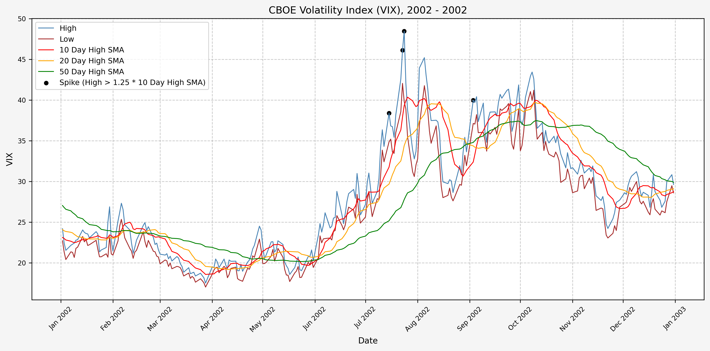
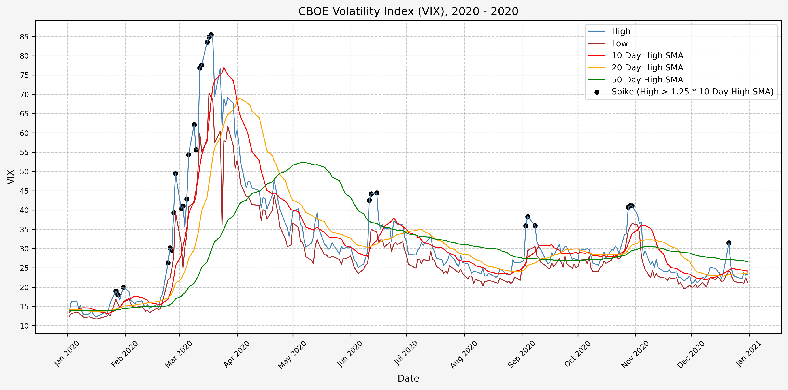
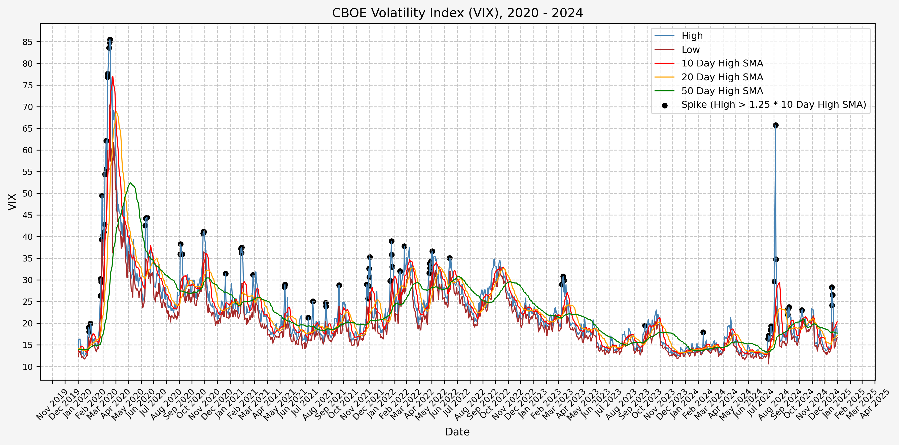

## Investigating A Signal

Continuing from where we left off in [part 1](/2025/03/01/investigating-a-vix-trading-signal-part-1-vix-and-vvix/), we will now consider the idea of a spike level in the VIX and how we might use a spike level to generate a signal. These elevated levels usually occur during market sell-off events or longer term drawdowns in the S&P 500. Sometimes the VIX reverts to recent levels after a spike, but other times levels remain elevated for weeks or even months.

### Determining A Spike Level

We will start the 10 day simple moving average (SMA) of the daily high level to get an idea of what is happening recently with the VIX. We'll then pick an arbitrary spike level (25% above the 10 day SMA), and our signal is generated if the VIX hits a level that is above the spike threshold.

The idea is that the 10 day SMA will smooth out the recent short term volatility in the VIX, and therefore any gradual increases in the VIX are not interpreted as spike events.

We also will generate the 20 and 50 day SMAs for reference, and again to see what is happening with the level of the VIX over slightly longer timeframes.

Here's the code for the above:

```python
# Define the spike multiplier for detecting significant spikes
spike_level = 1.25

# =========================
# Simple Moving Averages (SMA)
# =========================

# Calculate 10-period SMA of 'High'
vix['High_SMA_10'] = vix['High'].rolling(window=10).mean()

# Shift the 10-period SMA by 1 to compare with current 'High'
vix['High_SMA_10_Shift'] = vix['High_SMA_10'].shift(1)

# Calculate the spike level based on shifted SMA and spike multiplier
vix['Spike_Level_SMA'] = vix['High_SMA_10_Shift'] * spike_level

# Calculate 20-period SMA of 'High'
vix['High_SMA_20'] = vix['High'].rolling(window=20).mean()

# Determine if 'High' exceeds the spike level (indicates a spike)
vix['Spike_SMA'] = vix['High'] >= vix['Spike_Level_SMA']

# Calculate 50-period SMA of 'High' for trend analysis
vix['High_SMA_50'] = vix['High'].rolling(window=50).mean()

# =========================
# Exponential Moving Averages (EMA)
# =========================

# Calculate 10-period EMA of 'High'
vix['High_EMA_10'] = vix['High'].ewm(span=10, adjust=False).mean()

# Shift the 10-period EMA by 1 to compare with current 'High'
vix['High_EMA_10_Shift'] = vix['High_EMA_10'].shift(1)

# Calculate the spike level based on shifted EMA and spike multiplier
vix['Spike_Level_EMA'] = vix['High_EMA_10_Shift'] * spike_level

# Calculate 20-period EMA of 'High'
vix['High_EMA_20'] = vix['High'].ewm(span=20, adjust=False).mean()

# Determine if 'High' exceeds the spike level (indicates a spike)
vix['Spike_EMA'] = vix['High'] >= vix['Spike_Level_EMA']

# Calculate 50-period EMA of 'High' for trend analysis
vix['High_EMA_50'] = vix['High'].ewm(span=50, adjust=False).mean()
```

For this exercise, we will use simple moving averages.

### Spike Counts (Signals) By Year

To investigate the number of spike events (or signals) that we receive on a yearly basis, we can run the following:

```python
# Ensure the index is a DatetimeIndex
vix.index = pd.to_datetime(vix.index)

# Create a new column for the year extracted from the date index
vix['Year'] = vix.index.year

# Group by year and the "Spike_SMA" and "Spike_EMA" columns, then count occurrences
spike_count_SMA = vix.groupby(['Year', 'Spike_SMA']).size().unstack(fill_value=0)

display(spike_count_SMA)
```

Which gives us the following:

|   Year |   False |   True |
|-------:|--------:|-------:|
|   1990 |     248 |      5 |
|   1991 |     249 |      4 |
|   1992 |     250 |      4 |
|   1993 |     251 |      2 |
|   1994 |     243 |      9 |
|   1995 |     252 |      0 |
|   1996 |     248 |      6 |
|   1997 |     247 |      6 |
|   1998 |     243 |      9 |
|   1999 |     250 |      2 |
|   2000 |     248 |      4 |
|   2001 |     240 |      8 |
|   2002 |     248 |      4 |
|   2003 |     251 |      1 |
|   2004 |     250 |      2 |
|   2005 |     250 |      2 |
|   2006 |     242 |      9 |
|   2007 |     239 |     12 |
|   2008 |     238 |     15 |
|   2009 |     249 |      3 |
|   2010 |     239 |     13 |
|   2011 |     240 |     12 |
|   2012 |     248 |      2 |
|   2013 |     249 |      3 |
|   2014 |     235 |     17 |
|   2015 |     240 |     12 |
|   2016 |     234 |     18 |
|   2017 |     244 |      7 |
|   2018 |     228 |     23 |
|   2019 |     241 |     11 |
|   2020 |     224 |     29 |
|   2021 |     235 |     17 |
|   2022 |     239 |     12 |
|   2023 |     246 |      4 |
|   2024 |     237 |     15 |
|   2025 |     108 |     12 |

And the plot to aid with visualization. Based on the plot, it seems as though volatility has increased since the early 2000's:


### Spike Counts (Signals) Plots By Year

The most recent yearly plots are shown below for when signals are generated. The images for the previous years are linked below.

<!-- #### 1990


#### 1991


#### 1992


#### 1993


#### 1994


#### 1995


#### 1996


#### 1997


#### 1998


#### 1999


#### 2000


#### 2001


#### 2002



#### 2003


#### 2004


#### 2005


#### 2006


#### 2007


#### 2008


#### 2009


#### 2010


#### 2011


#### 2012


#### 2013


#### 2014


#### 2015


#### 2016


#### 2017


#### 2018


#### 2019

 -->

[Spike/Signals, 1990](09_VIX_SMA_Spike_1990_1990.png)</br>
[Spike/Signals, 1991](09_VIX_SMA_Spike_1991_1991.png)</br>
[Spike/Signals, 1992](09_VIX_SMA_Spike_1992_1992.png)</br>
[Spike/Signals, 1993](09_VIX_SMA_Spike_1993_1993.png)</br>
[Spike/Signals, 1994](09_VIX_SMA_Spike_1994_1994.png)</br>
[Spike/Signals, 1995](09_VIX_SMA_Spike_1995_1995.png)</br>
[Spike/Signals, 1996](09_VIX_SMA_Spike_1996_1996.png)</br>
[Spike/Signals, 1997](09_VIX_SMA_Spike_1997_1997.png)</br>
[Spike/Signals, 1998](09_VIX_SMA_Spike_1998_1998.png)</br>
[Spike/Signals, 1999](09_VIX_SMA_Spike_1999_1999.png)</br>
[Spike/Signals, 2000](09_VIX_SMA_Spike_2000_2000.png)</br>
[Spike/Signals, 2001](09_VIX_SMA_Spike_2001_2001.png)</br>
[Spike/Signals, 2002](09_VIX_SMA_Spike_2002_2002.png)</br>
[Spike/Signals, 2003](09_VIX_SMA_Spike_2003_2003.png)</br>
[Spike/Signals, 2004](09_VIX_SMA_Spike_2004_2004.png)</br>
[Spike/Signals, 2005](09_VIX_SMA_Spike_2005_2005.png)</br>
[Spike/Signals, 2006](09_VIX_SMA_Spike_2006_2006.png)</br>
[Spike/Signals, 2007](09_VIX_SMA_Spike_2007_2007.png)</br>
[Spike/Signals, 2008](09_VIX_SMA_Spike_2008_2008.png)</br>
[Spike/Signals, 2009](09_VIX_SMA_Spike_2009_2009.png)</br>
[Spike/Signals, 2010](09_VIX_SMA_Spike_2010_2010.png)</br>
[Spike/Signals, 2011](09_VIX_SMA_Spike_2011_2011.png)</br>
[Spike/Signals, 2012](09_VIX_SMA_Spike_2012_2012.png)</br>
[Spike/Signals, 2013](09_VIX_SMA_Spike_2013_2013.png)</br>
[Spike/Signals, 2014](09_VIX_SMA_Spike_2014_2014.png)</br>
[Spike/Signals, 2015](09_VIX_SMA_Spike_2015_2015.png)</br>
[Spike/Signals, 2016](09_VIX_SMA_Spike_2016_2016.png)</br>
[Spike/Signals, 2017](09_VIX_SMA_Spike_2017_2017.png)</br>
[Spike/Signals, 2018](09_VIX_SMA_Spike_2018_2018.png)</br>
[Spike/Signals, 2019](09_VIX_SMA_Spike_2019_2019.png)

#### 2020



#### 2021


#### 2022


#### 2023


#### 2024


#### 2025


For comparison with the VVIX plot for 2025:


### Spike Counts (Signals) Plots By Decade

And here are the plots for the signals generated over the past 3 decades:

#### 1990 - 1994


#### 1995 - 1999


#### 2000 - 2004


#### 2005 - 2009


#### 2010 - 2014


#### 2015 - 2019


#### 2020 - 2024



#### 2025 - Present


For comparison with the VVIX plot for 2025:


## References

1. https://www.cboe.com/tradable_products/vix/
2. https://github.com/ranaroussi/yfinance

## Code

Note: The files below are identical to those linked in [part 1](/2025/03/01/investigating-a-vix-trading-signal-part-1-vix-and-vvix/#code).

The jupyter notebook with the functions and all other code is available [here](investigating-a-vix-trading-signal-part-2-finding-a-signal.ipynb).</br>
The html export of the jupyter notebook is available [here](investigating-a-vix-trading-signal-part-2-finding-a-signal.html).</br>
The pdf export of the jupyter notebook is available [here](investigating-a-vix-trading-signal-part-2-finding-a-signal.pdf).