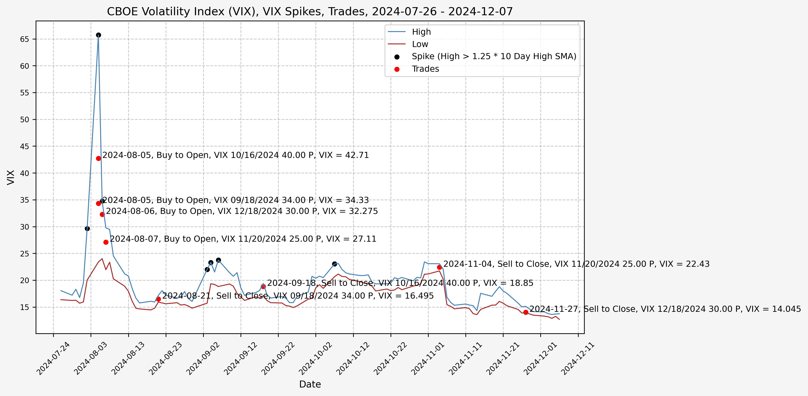
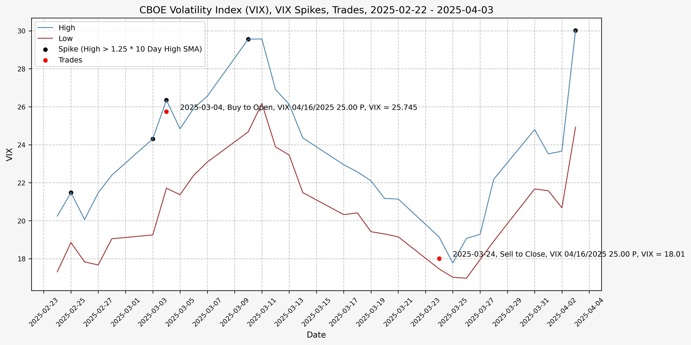

## Trading History

I have began trading based on the ideas from [part 2](/2025/03/02/investigating-a-vix-trading-signal-part-2-finding-a-signal/), opening positions during the VIX spikes and closing them as volatility comes back down. The executed trades, closed positions, and open positions listed below are all automated updates from the transaction history exports from Schwab. The exported CSV files are available in the GitHub repository.

### Trades Executed

Here are the trades executed to date, with any comments related to execution, market sentiment, reason for opening/closing position, VIX level, etc.

*10_Trades_Executed.md not found*

#### Volatility In August 2024

Plot with VIX level, trade side, VIX option, and VIX level at trade date/time:

Closed positions:

*11_Closed_Positions_2024-09-18_2024-12-18_2024-08-05_2024-11-27.md not found*

Open positions:

*11_Open_Positions_2024-09-18_2024-12-18_2024-08-05_2024-11-27.md not found*

Percent profit/loss: *11_Percent_PnL_2024-09-18_2024-12-18_2024-08-05_2024-11-27.md not found*

Net profit/loss: *11_PnL_2024-09-18_2024-12-18_2024-08-05_2024-11-27.md not found*

#### Volatility In March 2025

Plot with VIX level, trade side, VIX option, and VIX level at trade date/time:

Closed positions:

*12_Closed_Positions_2025-04-16_2025-04-16_2025-03-04_2025-03-24.md not found*

Open positions:

*12_Open_Positions_2025-04-16_2025-04-16_2025-03-04_2025-03-24.md not found*

Percent profit/loss: *12_Percent_PnL_2025-04-16_2025-04-16_2025-03-04_2025-03-24.md not found*

Net profit/loss: *12_PnL_2025-04-16_2025-04-16_2025-03-04_2025-03-24.md not found*

#### Volatility In April 2025

Plot with VIX level, trade side, VIX option, and VIX level at trade date/time:

Closed positions:

*13_Closed_Positions_2025-05-21_2025-08-20_2025-03-10_2025-05-13.md not found*

Open positions:

*13_Open_Positions_2025-05-21_2025-08-20_2025-03-10_2025-05-13.md not found*

Percent profit/loss: *13_Percent_PnL_2025-05-21_2025-08-20_2025-03-10_2025-05-13.md not found*

Net profit/loss: *13_PnL_2025-05-21_2025-08-20_2025-03-10_2025-05-13.md not found*

#### Complete Trade History

Percent profit/loss: *14_Percent_PnL_None_None_None_None.md not found*

Net profit/loss: *14_PnL_None_None_None_None.md not found*

## References

1. https://www.cboe.com/tradable_products/vix/
2. https://github.com/ranaroussi/yfinance

## Code

The jupyter notebook with the functions and all other code is available [here](investigating-a-vix-trading-signal-part-3-trading.ipynb). 
The html export of the jupyter notebook is available [here](investigating-a-vix-trading-signal-part-3-trading.html). 
The pdf export of the jupyter notebook is available [here](investigating-a-vix-trading-signal-part-3-trading.pdf).