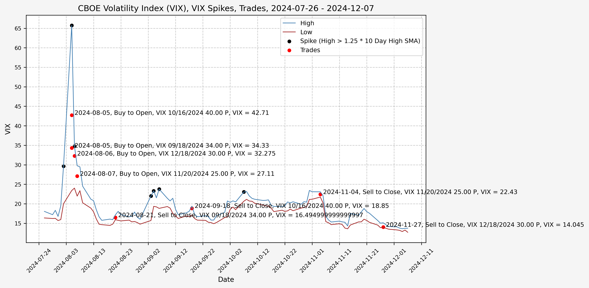
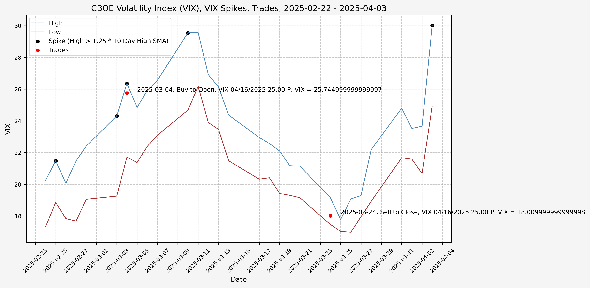
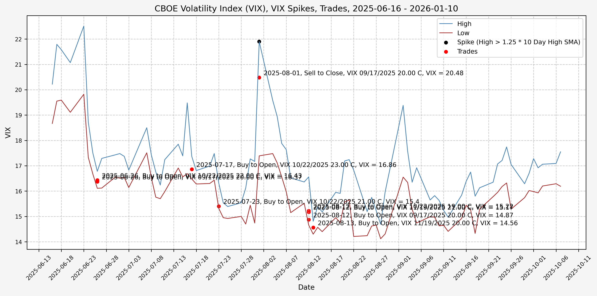

## Trading History

I have began trading based on the ideas from [part 2](/2025/03/02/investigating-a-vix-trading-signal-part-2-finding-a-signal/), opening positions during the VIX spikes and closing them as volatility comes back down. The executed trades, closed positions, and open positions listed below are all automated updates from the transaction history exports from Schwab. The exported CSV files are available in the GitHub repository.

### Trades Executed

Here are the trades executed to date, with any comments related to execution, market sentiment, reason for opening/closing position, VIX level, etc.

| Trade_Date          | Action        | Symbol                 |   Quantity |   Price |   Fees & Comm |   Amount |   Approx_VIX_Level | Comments                                                                                      |
|:--------------------|:--------------|:-----------------------|-----------:|--------:|--------------:|---------:|-------------------:|:----------------------------------------------------------------------------------------------|
| 2024-08-05 00:00:00 | Buy to Open   | VIX 09/18/2024 34.00 P |          1 |   10.95 |          1.08 |  1096.08 |              34.33 | nan                                                                                           |
| 2024-08-21 00:00:00 | Sell to Close | VIX 09/18/2024 34.00 P |          1 |   17.95 |          1.08 |  1793.92 |              16.50 | nan                                                                                           |
| 2024-08-05 00:00:00 | Buy to Open   | VIX 10/16/2024 40.00 P |          1 |   16.35 |          1.08 |  1636.08 |              42.71 | nan                                                                                           |
| 2024-09-18 00:00:00 | Sell to Close | VIX 10/16/2024 40.00 P |          1 |   21.54 |          1.08 |  2152.92 |              18.85 | nan                                                                                           |
| 2024-08-07 00:00:00 | Buy to Open   | VIX 11/20/2024 25.00 P |          2 |    5.90 |          2.16 |  1182.16 |              27.11 | nan                                                                                           |
| 2024-11-04 00:00:00 | Sell to Close | VIX 11/20/2024 25.00 P |          2 |    6.10 |          2.16 |  1217.84 |              22.43 | nan                                                                                           |
| 2024-08-06 00:00:00 | Buy to Open   | VIX 12/18/2024 30.00 P |          1 |   10.25 |          1.08 |  1026.08 |              32.27 | nan                                                                                           |
| 2024-11-27 00:00:00 | Sell to Close | VIX 12/18/2024 30.00 P |          1 |   14.95 |          1.08 |  1493.92 |              14.04 | nan                                                                                           |
| 2025-03-04 00:00:00 | Buy to Open   | VIX 04/16/2025 25.00 P |          5 |    5.65 |          5.40 |  2830.40 |              25.75 | nan                                                                                           |
| 2025-03-24 00:00:00 | Sell to Close | VIX 04/16/2025 25.00 P |          5 |    7.00 |          5.40 |  3494.60 |              18.01 | nan                                                                                           |
| 2025-03-10 00:00:00 | Buy to Open   | VIX 05/21/2025 26.00 P |          5 |    7.10 |          5.40 |  3555.40 |              27.54 | Missed opportunity to close position for 20% profit before vol spike in early April 2025      |
| 2025-04-04 00:00:00 | Buy to Open   | VIX 05/21/2025 26.00 P |         10 |    4.10 |         10.81 |  4110.81 |              38.88 | Averaged down on existing position                                                            |
| 2025-04-24 00:00:00 | Sell to Close | VIX 05/21/2025 26.00 P |          7 |    3.50 |          7.57 |  2442.43 |              27.37 | Sold half of position due to vol spike concerns and theta                                     |
| 2025-05-02 00:00:00 | Sell to Close | VIX 05/21/2025 26.00 P |          4 |    4.35 |          4.32 |  1735.68 |              22.73 | Sold half of remaining position due to vol spike concerns and theta                           |
| 2025-05-07 00:00:00 | Sell to Close | VIX 05/21/2025 26.00 P |          4 |    3.55 |          4.32 |  1415.68 |              24.49 | Closed position ahead of Fed’s (Powell’s) comments                                            |
| 2025-04-04 00:00:00 | Buy to Open   | VIX 05/21/2025 37.00 P |          3 |   13.20 |          3.24 |  3963.24 |              36.46 | nan                                                                                           |
| 2025-05-07 00:00:00 | Sell to Close | VIX 05/21/2025 37.00 P |          3 |   13.75 |          3.24 |  4121.76 |              24.51 | Closed position ahead of Fed’s (Powell’s) comments                                            |
| 2025-04-08 00:00:00 | Buy to Open   | VIX 05/21/2025 50.00 P |          2 |   21.15 |          2.16 |  4232.16 |             nan    | nan                                                                                           |
| 2025-04-24 00:00:00 | Sell to Close | VIX 05/21/2025 50.00 P |          1 |   25.30 |          1.08 |  2528.92 |             nan    | nan                                                                                           |
| 2025-04-25 00:00:00 | Sell to Close | VIX 05/21/2025 50.00 P |          1 |   25.65 |          1.08 |  2563.92 |             nan    | nan                                                                                           |
| 2025-04-03 00:00:00 | Buy to Open   | VIX 06/18/2025 27.00 P |          8 |    7.05 |          8.65 |  5648.65 |              27.62 | nan                                                                                           |
| 2025-04-08 00:00:00 | Buy to Open   | VIX 06/18/2025 27.00 P |          4 |    4.55 |          4.32 |  1824.32 |              55.44 | Averaged down on existing position                                                            |
| 2025-05-12 00:00:00 | Sell to Close | VIX 06/18/2025 27.00 P |          6 |    7.55 |          6.49 |  4523.51 |              19.05 | Market up on positive news of lowering tariffs with China; VIX down 15%, VVIX down 10%        |
| 2025-05-12 00:00:00 | Sell to Close | VIX 06/18/2025 27.00 P |          6 |    7.40 |          6.49 |  4433.51 |              19.47 | Market up on positive news of lowering tariffs with China; VIX down 15%, VVIX down 10%        |
| 2025-04-04 00:00:00 | Buy to Open   | VIX 06/18/2025 36.00 P |          3 |   13.40 |          3.24 |  4023.24 |              36.61 | nan                                                                                           |
| 2025-05-12 00:00:00 | Sell to Close | VIX 06/18/2025 36.00 P |          3 |   16.00 |          3.24 |  4796.76 |              19.14 | Market up on positive news of lowering tariffs with China; VIX down 15%, VVIX down 10%        |
| 2025-04-07 00:00:00 | Buy to Open   | VIX 06/18/2025 45.00 P |          2 |   18.85 |          2.16 |  3772.16 |              53.65 | nan                                                                                           |
| 2025-05-12 00:00:00 | Sell to Close | VIX 06/18/2025 45.00 P |          2 |   25.00 |          2.16 |  4997.84 |              19.24 | Market up on positive news of lowering tariffs with China; VIX down 15%, VVIX down 10%        |
| 2025-04-03 00:00:00 | Buy to Open   | VIX 07/16/2025 29.00 P |          5 |    8.55 |          5.40 |  4280.40 |              29.03 | nan                                                                                           |
| 2025-05-13 00:00:00 | Sell to Close | VIX 07/16/2025 29.00 P |          3 |   10.40 |          3.24 |  3116.76 |              17.72 | nan                                                                                           |
| 2025-05-13 00:00:00 | Sell to Close | VIX 07/16/2025 29.00 P |          2 |   10.30 |          2.16 |  2057.84 |              17.68 | nan                                                                                           |
| 2025-04-04 00:00:00 | Buy to Open   | VIX 07/16/2025 36.00 P |          3 |   13.80 |          3.24 |  4143.24 |              36.95 | nan                                                                                           |
| 2025-05-13 00:00:00 | Sell to Close | VIX 07/16/2025 36.00 P |          1 |   17.00 |          1.08 |  1698.92 |              17.79 | nan                                                                                           |
| 2025-05-13 00:00:00 | Sell to Close | VIX 07/16/2025 36.00 P |          2 |   16.90 |          2.16 |  3377.84 |              17.72 | nan                                                                                           |
| 2025-04-07 00:00:00 | Buy to Open   | VIX 07/16/2025 45.00 P |          2 |   21.55 |          2.16 |  4312.16 |              46.17 | nan                                                                                           |
| 2025-05-13 00:00:00 | Sell to Close | VIX 07/16/2025 45.00 P |          2 |   25.65 |          2.16 |  5127.84 |              17.96 | nan                                                                                           |
| 2025-04-07 00:00:00 | Buy to Open   | VIX 08/20/2025 45.00 P |          2 |   21.75 |          2.16 |  4352.16 |              49.07 | nan                                                                                           |
| 2025-05-13 00:00:00 | Sell to Close | VIX 08/20/2025 45.00 P |          2 |   25.40 |          2.16 |  5077.84 |              18.06 | nan                                                                                           |
| 2025-06-26 00:00:00 | Buy to Open   | VIX 09/17/2025 20.00 C |         10 |    3.00 |         10.81 |  3010.81 |              16.37 | Opened long dated call position; VIX level at 4th historical decile                           |
| 2025-06-26 00:00:00 | Buy to Open   | VIX 10/22/2025 22.00 C |         10 |    2.94 |         10.81 |  2950.81 |              16.43 | Opened long dated call position; VIX level at 4th historical decile                           |
| 2025-07-17 00:00:00 | Buy to Open   | VIX 10/22/2025 23.00 C |         10 |    2.75 |         10.81 |  2760.81 |              16.86 | Continued low volatility, opened long dated call position; VIX level at 4th historical decile |

#### Volatility In August 2024

Plot with VIX high/low, trade side, VIX option, and VIX level at trade date/time:

Closed positions:

| Symbol                 |   Amount_Buy |   Quantity_Buy |   Amount_Sell |   Quantity_Sell |   Realized_PnL |   Percent_PnL |
|:-----------------------|-------------:|---------------:|--------------:|----------------:|---------------:|--------------:|
| VIX 09/18/2024 34.00 P |      1096.08 |              1 |       1793.92 |               1 |         697.84 |          0.64 |
| VIX 10/16/2024 40.00 P |      1636.08 |              1 |       2152.92 |               1 |         516.84 |          0.32 |
| VIX 11/20/2024 25.00 P |      1182.16 |              2 |       1217.84 |               2 |          35.68 |          0.03 |
| VIX 12/18/2024 30.00 P |      1026.08 |              1 |       1493.92 |               1 |         467.84 |          0.46 |

Open positions:

| Symbol   | Amount_Buy   | Quantity_Buy   |
|----------|--------------|----------------|

Total Opened Position Market Value: $4,940.40 
Total Closed Position Market Value: $6,658.60 
Net Profit/Loss: $1,718.20 
Percent Profit/Loss: 34.78%

#### Volatility In March 2025

Plot with VIX high/low, trade side, VIX option, and VIX level at trade date/time:

Closed positions:

| Symbol                 |   Amount_Buy |   Quantity_Buy |   Amount_Sell |   Quantity_Sell |   Realized_PnL |   Percent_PnL |
|:-----------------------|-------------:|---------------:|--------------:|----------------:|---------------:|--------------:|
| VIX 04/16/2025 25.00 P |      2830.40 |              5 |       3494.60 |               5 |         664.20 |          0.23 |

Open positions:

| Symbol   | Amount_Buy   | Quantity_Buy   |
|----------|--------------|----------------|

Total Opened Position Market Value: $2,830.40 
Total Closed Position Market Value: $3,494.60 
Net Profit/Loss: $664.20 
Percent Profit/Loss: 23.47%

#### Volatility In April 2025

Plot with VIX high/low, trade side, VIX option, and VIX level at trade date/time:

Closed positions:

| Symbol                 |   Amount_Buy |   Quantity_Buy |   Amount_Sell |   Quantity_Sell |   Realized_PnL |   Percent_PnL |
|:-----------------------|-------------:|---------------:|--------------:|----------------:|---------------:|--------------:|
| VIX 05/21/2025 26.00 P |      7666.21 |             15 |       5593.79 |              15 |       -2072.42 |         -0.27 |
| VIX 05/21/2025 37.00 P |      3963.24 |              3 |       4121.76 |               3 |         158.52 |          0.04 |
| VIX 05/21/2025 50.00 P |      4232.16 |              2 |       5092.84 |               2 |         860.68 |          0.20 |
| VIX 06/18/2025 27.00 P |      7472.97 |             12 |       8957.02 |              12 |        1484.05 |          0.20 |
| VIX 06/18/2025 36.00 P |      4023.24 |              3 |       4796.76 |               3 |         773.52 |          0.19 |
| VIX 06/18/2025 45.00 P |      3772.16 |              2 |       4997.84 |               2 |        1225.68 |          0.32 |
| VIX 07/16/2025 29.00 P |      4280.40 |              5 |       5174.60 |               5 |         894.20 |          0.21 |
| VIX 07/16/2025 36.00 P |      4143.24 |              3 |       5076.76 |               3 |         933.52 |          0.23 |
| VIX 07/16/2025 45.00 P |      4312.16 |              2 |       5127.84 |               2 |         815.68 |          0.19 |
| VIX 08/20/2025 45.00 P |      4352.16 |              2 |       5077.84 |               2 |         725.68 |          0.17 |

Open positions:

| Symbol   | Amount_Buy   | Quantity_Buy   |
|----------|--------------|----------------|

Total Opened Position Market Value: $48,217.94 
Total Closed Position Market Value: $54,017.05 
Net Profit/Loss: $5,799.11 
Percent Profit/Loss: 12.03%

#### Low Volatility In June 2025

Plot with VIX high/low, trade side, VIX option, and VIX level at trade date/time:

Closed positions:

| Symbol   | Amount_Buy   | Quantity_Buy   | Amount_Sell   | Quantity_Sell   | Realized_PnL   | Percent_PnL   |
|----------|--------------|----------------|---------------|-----------------|----------------|---------------|

Open positions:

| Symbol                 |   Amount_Buy |   Quantity_Buy |
|:-----------------------|-------------:|---------------:|
| VIX 09/17/2025 20.00 C |      3010.81 |             10 |
| VIX 10/22/2025 22.00 C |      2950.81 |             10 |
| VIX 10/22/2025 23.00 C |      2760.81 |             10 |

Total Opened Position Market Value: $0.00 
Total Closed Position Market Value: $0.00 
Net Profit/Loss: $0.00 
Percent Profit/Loss: nan%

#### Complete Trade History

Total Opened Position Market Value: $55,988.74 
Total Closed Position Market Value: $64,170.25 
Net Profit/Loss: $8,181.51 
Percent Profit/Loss: 14.61%

## References

1. https://www.cboe.com/tradable_products/vix/
2. https://github.com/ranaroussi/yfinance

## Code

Note: The files below are identical to those linked in [part 1](/2025/03/01/investigating-a-vix-trading-signal-part-1-vix-and-vvix/#code) and [part 2](/2025/03/02/investigating-a-vix-trading-signal-part-2-finding-a-signal/#code).

The jupyter notebook with the functions and all other code is available [here](investigating-a-vix-trading-signal-part-3-trading.ipynb). 
The html export of the jupyter notebook is available [here](investigating-a-vix-trading-signal-part-3-trading.html). 
The pdf export of the jupyter notebook is available [here](investigating-a-vix-trading-signal-part-3-trading.pdf).