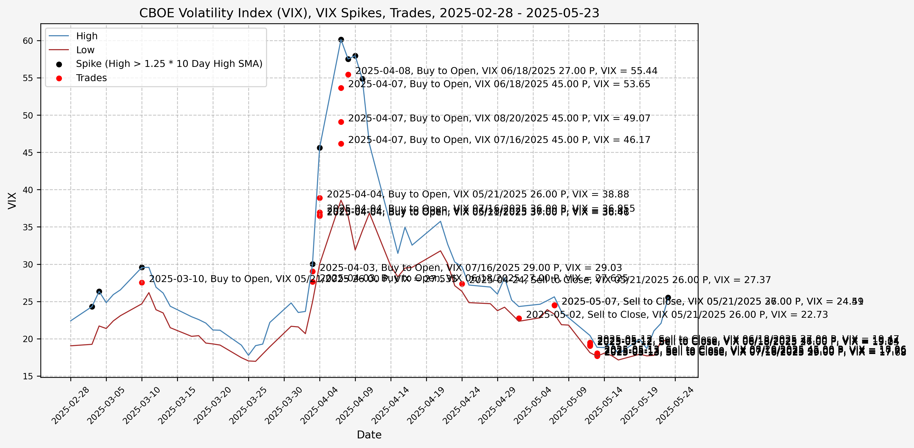

## Trading History

I have began trading based on the ideas from [part 2](/2025/03/02/investigating-a-vix-trading-signal-part-2-finding-a-signal/), opening positions during the VIX spikes and closing them as volatility comes back down. The executed trades, closed positions, and open positions listed below are all automated updates from the transaction history exports from Schwab. The exported CSV files are available in the GitHub repository.

### Trades Executed

Here are the trades executed to date, with any comments related to execution, market sentiment, reason for opening/closing position, VIX level, etc.

<!-- INSERT_10_Trades_Executed_HERE -->

#### Volatility In August 2024

Plot with VIX high/low, trade side, VIX option, and VIX level at trade date/time:

Closed positions:

<!-- INSERT_11_Closed_Positions_HERE -->

Open positions:

<!-- INSERT_11_Open_Positions_HERE -->

Total Opened Position Market Value: <!-- INSERT_11_Total_Opened_Position_Market_Value_HERE --> 
Total Closed Position Market Value: <!-- INSERT_11_Total_Closed_Position_Market_Value_HERE --> 
Net Profit/Loss: <!-- INSERT_11_PnL_HERE --> 
Percent Profit/Loss: <!-- INSERT_11_Percent_PnL_HERE -->

#### Volatility In March 2025

Plot with VIX high/low, trade side, VIX option, and VIX level at trade date/time:

Closed positions:

<!-- INSERT_12_Closed_Positions_HERE -->

Open positions:

<!-- INSERT_12_Open_Positions_HERE -->

Total Opened Position Market Value: <!-- INSERT_12_Total_Opened_Position_Market_Value_HERE --> 
Total Closed Position Market Value: <!-- INSERT_12_Total_Closed_Position_Market_Value_HERE --> 
Net Profit/Loss: <!-- INSERT_12_PnL_HERE --> 
Percent Profit/Loss: <!-- INSERT_12_Percent_PnL_HERE -->

#### Volatility In April 2025

Plot with VIX high/low, trade side, VIX option, and VIX level at trade date/time:

Closed positions:

<!-- INSERT_13_Closed_Positions_HERE -->

Open positions:

<!-- INSERT_13_Open_Positions_HERE -->

Total Opened Position Market Value: <!-- INSERT_13_Total_Opened_Position_Market_Value_HERE --> 
Total Closed Position Market Value: <!-- INSERT_13_Total_Closed_Position_Market_Value_HERE --> 
Net Profit/Loss: <!-- INSERT_13_PnL_HERE --> 
Percent Profit/Loss: <!-- INSERT_13_Percent_PnL_HERE -->

#### Low Volatility In June 2025

Plot with VIX high/low, trade side, VIX option, and VIX level at trade date/time:

Closed positions:

<!-- INSERT_14_Closed_Positions_HERE -->

Open positions:

<!-- INSERT_14_Open_Positions_HERE -->

Total Opened Position Market Value: <!-- INSERT_14_Total_Opened_Position_Market_Value_HERE --> 
Total Closed Position Market Value: <!-- INSERT_14_Total_Closed_Position_Market_Value_HERE --> 
Net Profit/Loss: <!-- INSERT_14_PnL_HERE --> 
Percent Profit/Loss: <!-- INSERT_14_Percent_PnL_HERE -->

#### Complete Trade History

Total Opened Position Market Value: <!-- INSERT_99_Total_Opened_Position_Market_Value_HERE --> 
Total Closed Position Market Value: <!-- INSERT_99_Total_Closed_Position_Market_Value_HERE --> 
Net Profit/Loss: <!-- INSERT_99_PnL_HERE --> 
Percent Profit/Loss: <!-- INSERT_99_Percent_PnL_HERE -->

## References

1. https://www.cboe.com/tradable_products/vix/
2. https://github.com/ranaroussi/yfinance

## Code

Note: The files below are identical to those linked in [part 1](/2025/03/01/investigating-a-vix-trading-signal-part-1-vix-and-vvix/#code) and [part 2](/2025/03/02/investigating-a-vix-trading-signal-part-2-finding-a-signal/#code).

The jupyter notebook with the functions and all other code is available [here](investigating-a-vix-trading-signal-part-3-trading.ipynb). 
The html export of the jupyter notebook is available [here](investigating-a-vix-trading-signal-part-3-trading.html). 
The pdf export of the jupyter notebook is available [here](investigating-a-vix-trading-signal-part-3-trading.pdf).