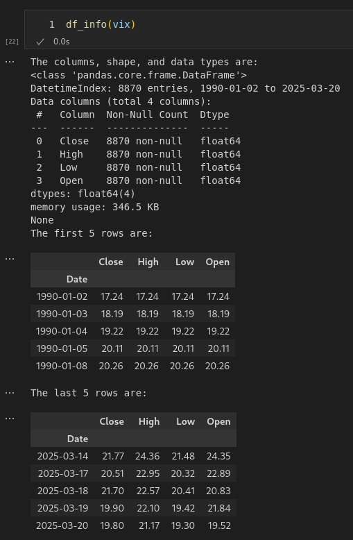
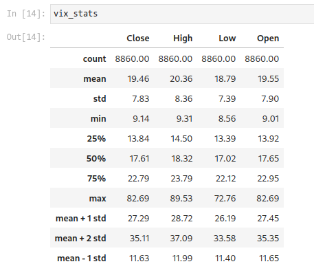
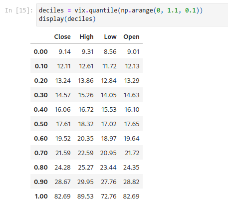
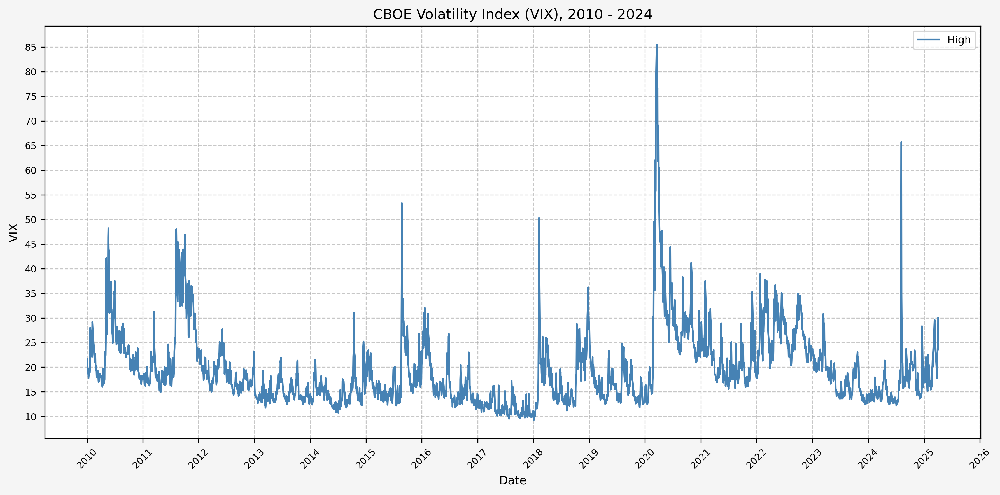

## Introduction

From the [CBOE VIX website](https://www.cboe.com/tradable_products/vix/):

"Cboe Global Markets revolutionized investing with the creation of the Cboe Volatility Index® (VIX® Index), the first benchmark index to measure the market’s expectation of future volatility. The VIX Index is based on options of the S&P 500® Index, considered the leading indicator of the broad U.S. stock market. The VIX Index is recognized as the world’s premier gauge of U.S. equity market volatility."

In this tutorial, we will investigate finding a signal to use as a basis to trade the VIX.

## VIX Data

I don't have access to data for the VIX through [Nasdaq Data Link](https://www.nasdaq.com/nasdaq-data-link), but for our purposes Yahoo Finance is sufficient.

Using the yfinance python module, we can pull what we need and quicky dump it to excel to retain it for future use.

## Python Functions

First, a couple of useful functions:

### Pull Data From Yahoo Finance

Here's the code for the function to pull the data and dump to Excel:

```html
# This function pulls data from Yahoo finance
def yf_data_updater(fund):
    
    # Download data from YF
    df_comp = yf.download(fund)

    # Drop the column level with the ticker symbol
    df_comp.columns = df_comp.columns.droplevel(1)

    # Reset index
    df_comp = df_comp.reset_index()

    # Remove the "Price" header from the index
    df_comp.columns.name = None

    # Reset date column
    df_comp['Date'] = df_comp['Date'].dt.tz_localize(None)

    # Set 'Date' column as index
    df_comp = df_comp.set_index('Date', drop=True)

    # Drop data from last day because it's not accrate until end of day
    df_comp = df_comp.drop(df_comp.index[-1])
    
    # Export data to excel
    file = fund + ".xlsx"
    df_comp.to_excel(file, sheet_name='data')

    print(f"The first and last date of data for {fund} is: ")
    print(df_comp[:1])
    print(df_comp[-1:])
    print(f"Data updater complete for {fund} data")
    
    return print(f"--------------------")
```

### Set Number Of Decimal Places

``` html
# Set number of decimal places in pandas
def dp(decimal_places):
    pd.set_option('display.float_format', lambda x: f'%.{decimal_places}f' % x)
```

### Import Data From CSV / XLSX

``` html
def load_data(file):
    # Import CSV
    try:
        df = pd.read_csv(file)
    except:
        pass

    # Import excel
    try:
        df = pd.read_excel(file, sheet_name='data', engine='openpyxl')
    except:
        pass
        
    return df
```

### Return Information About A Dataframe

```html
# The `df_info` function returns some useful information about a dataframe, such as the columns, data types, and size.
def df_info(df):
    print('There are ', df.shape[0], ' rows and ', df.shape[1], ' columns')
    print('The columns and data types are:')
    print(df.dtypes)
    print('The first 4 rows are:')
    display(df.head(4))
    print('The last 4 rows are:')
    display(df.tail(4))
```

## Data Overview

### Acquire Data

First, let's get the data:

``` html
yf_data_updater('^VIX')
```

### Load Data

Then set our decimal places to something reasonable (like 2):

```html
dp(2)
```

Now that we have the data, let's load it up and take a look.

```html
# VIX
vix = load_data('^VIX.xlsx')

# Set 'Date' column as datetime
vix['Date'] = pd.to_datetime(vix['Date'])

# Drop 'Volume'
vix.drop(columns = {'Volume'}, inplace = True)

# Set Date as index
vix.set_index('Date', inplace = True)
```

### Check For Missing Values & Forward Fill Any Missing Values

```html
# Check to see if there are any NaN values
vix[vix['High'].isna()]

# Forward fill to clean up missing data
vix['High'] = vix['High'].ffill()
```

### DataFrame Info

Now, running:

``` html
df_info(vix)
```

Gives us the following:



### Interesting Statistics

Some interesting statistics jump out at use when we look at the mean, standard deviation, min, and max values:

```html
vix_stats = vix.describe()
vix_stats.loc['mean + 1 std'] = {'Open': vix_stats.loc['mean']['Open'] + vix_stats.loc['std']['Open'],
                                 'High': vix_stats.loc['mean']['High'] + vix_stats.loc['std']['High'],
                                 'Low': vix_stats.loc['mean']['Low'] + vix_stats.loc['std']['Low'],
                                 'Close': vix_stats.loc['mean']['Close'] + vix_stats.loc['std']['Close']}
vix_stats.loc['mean + 2 std'] = {'Open': vix_stats.loc['mean']['Open'] + 2 * vix_stats.loc['std']['Open'],
                                 'High': vix_stats.loc['mean']['High'] + 2 * vix_stats.loc['std']['High'],
                                 'Low': vix_stats.loc['mean']['Low'] + 2 * vix_stats.loc['std']['Low'],
                                 'Close': vix_stats.loc['mean']['Close'] + 2 * vix_stats.loc['std']['Close']}
vix_stats.loc['mean - 1 std'] = {'Open': vix_stats.loc['mean']['Open'] - vix_stats.loc['std']['Open'],
                                 'High': vix_stats.loc['mean']['High'] - vix_stats.loc['std']['High'],
                                 'Low': vix_stats.loc['mean']['Low'] - vix_stats.loc['std']['Low'],
                                 'Close': vix_stats.loc['mean']['Close'] - vix_stats.loc['std']['Close']}
```



And the levels for each decile:

```html
deciles = vix.quantile(np.arange(0, 1.1, 0.1))
display(deciles)
```



A quick histogram gives us the distribution for the entire dataset:


Now, let's add the levels for the mean, mean + 1 standard deviation, mean - 1 standard deviation, and mean + 2 standard deviations:


### Historical VIX Plot

Here's two plots for the dataset. The first covers 1990 - 2009, and the second 2010 - 2024. This is the daily high level.




From this plot, we can see the following:

* The VIX has really only jumped above 50 several times (GFC, COVID, recently in August of 2024)
* The highest levels (> 80) occured only during the GFC & COVID
* Interestingly, the VIX did not ever get above 50 during the .com bubble

## Investigating A Signal

Next, we will consider the idea of a spike level in the VIX and how we might use a spike level to generate a signal. These elevated levels usually occur during market sell-off events or longer term drawdowns in the S&P 500. Sometimes the VIX reverts to recent levels after a spike, but other times levels remain elevated for weeks or even months.

### Spike Level

We will start the 10 day simple moving average (SMA) of the daily high level to get an idea of what is happening recently with the VIX. We'll then pick an arbitrary spike level (25% above the 10 day SMA), and our signal is generated if the VIX hits a level that is above the spike threshold.

The idea is that the 10 day SMA will smooth out the recent short term volatility in the VIX, and any gradual increases in the VIX are not interpreted as spike events.

We also will generate the 20 and 50 day SMAs for reference, and again to see what is happening with the level of the VIX over slightly longer timeframes.

Here's the code for the above:

```html
spike_level = 1.25
vix['SMA_10'] = vix['High'].rolling(10).mean()
vix['SMA_10_Shift'] = vix['SMA_10'].shift(1)
vix['Spike_Level'] = vix['SMA_10_Shift'] * spike_level
vix['Spike'] = vix['High'] >= vix['Spike_Level']
vix['SMA_20'] = vix['High'].rolling(20).mean()
vix['SMA_50'] = vix['High'].rolling(50).mean()
```

Now, let's look at the first 

## References

https://www.cboe.com/tradable_products/vix/</br>
https://github.com/ranaroussi/yfinance

## Code

The jupyter notebook with the functions and all other code is available [here](YF_Data_Updater.ipynb).
