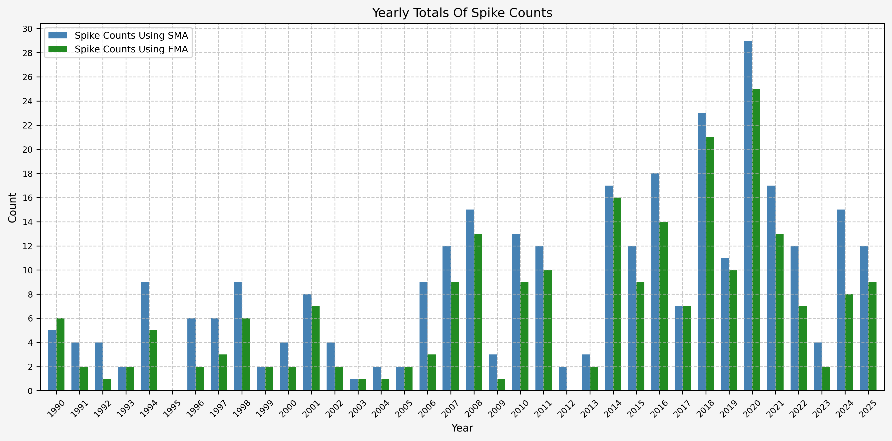
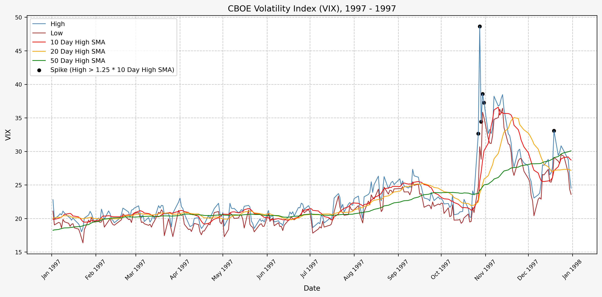
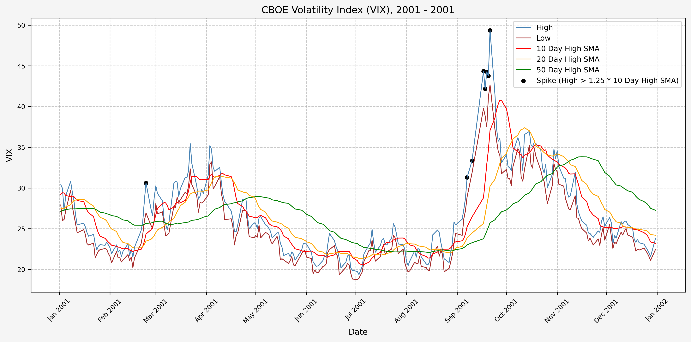
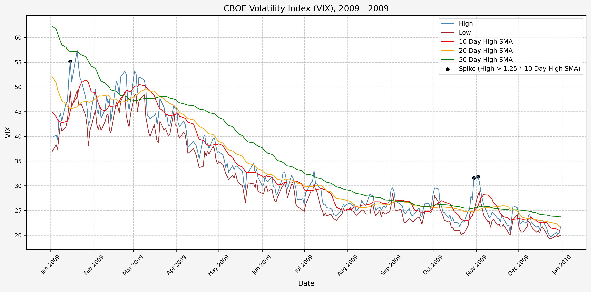
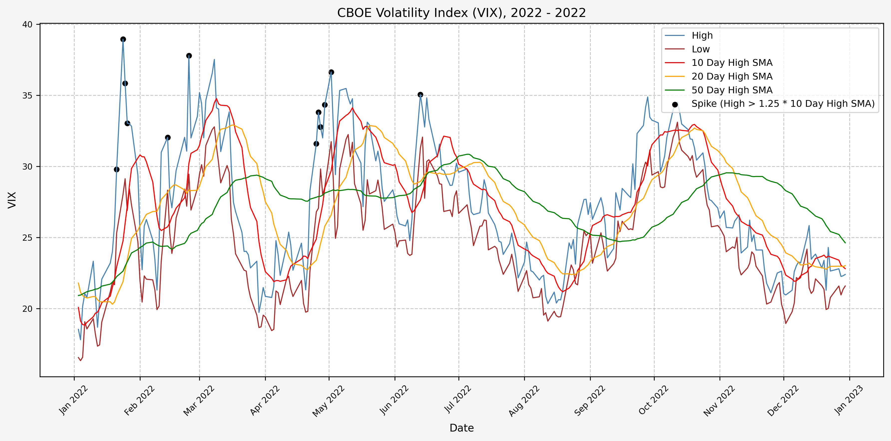
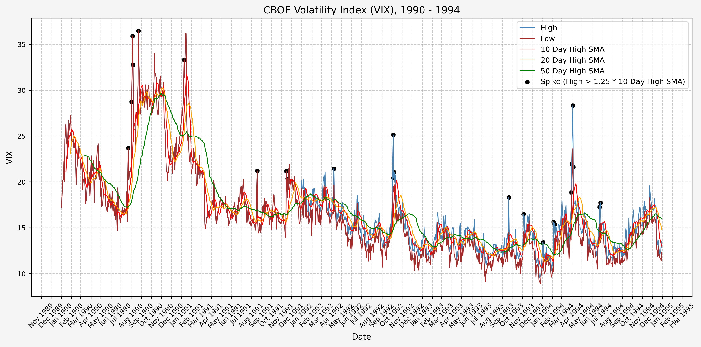
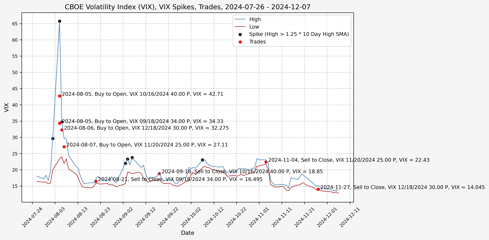
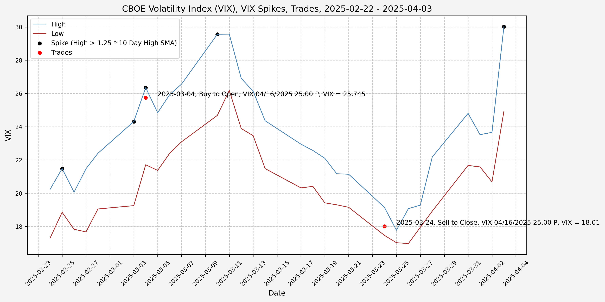

<!-- ## Post Updates

Update 4/8/2025: Added plot for signals for each year. VIX data through 4/7/25.</br>
Update 4/9/2025: VIX data through 4/8/25.</br>
Update 4/12/2025: VIX data through 4/10/25.</br>
Update 4/22/2025: VIX data through 4/18/25.</br>
Update 4/23/2025: VIX data through 4/22/25.</br>
Update 4/25/2025: VIX data through 4/23/25. Added section for trade history, including open and closed positions.</br>
Update 4/28/2025: VIX data through 4/25/25.</br>
Update 5/6/2025: Data through 5/5/25. Added section for the VVIX.</br>
Update 5/7/2025: Data through 5/6/25.</br>
Update 5/21/2025: Data through 5/20/25.</br>
Update 5/28/2025: Data through 5/27/25. Modified references to functions. -->

## Introduction

From the [CBOE VIX website](https://www.cboe.com/tradable_products/vix/):

"Cboe Global Markets revolutionized investing with the creation of the Cboe Volatility Index® (VIX® Index), the first benchmark index to measure the market’s expectation of future volatility. The VIX Index is based on options of the S&P 500® Index, considered the leading indicator of the broad U.S. stock market. The VIX Index is recognized as the world’s premier gauge of U.S. equity market volatility."

In this tutorial, we will investigate finding a signal to use as a basis to trade the VIX.

## VIX Data

I don't have access to data for the VIX through [Nasdaq Data Link](https://www.nasdaq.com/nasdaq-data-link) or any other data source, but for our purposes Yahoo Finance is sufficient. Using the [yfinance](https://pypi.org/project/yfinance/) python module, we can pull what we need and quicky dump it to excel to retain it for future use.

## Python Functions

Here are the functions needed for this project:

* [calc_vix_trade_pnl](/2025/02/02/reusable-extensible-python-functions-financial-data-analysis/#calc_vix_trade_pnl): Calculates the profit/loss from VIX options trades.</br>
* [df_info](/2025/02/02/reusable-extensible-python-functions-financial-data-analysis/#df_info): A simple function to display the information about a DataFrame and the first five rows and last five rows.</br>
* [df_info_markdown](/2025/02/02/reusable-extensible-python-functions-financial-data-analysis/#df_info_markdown): Similar to the `df_info` function above, except that it coverts the output to markdown.</br>
* [export_track_md_deps](/2025/02/02/reusable-extensible-python-functions-financial-data-analysis/#export_track_md_deps): Exports various text outputs to markdown files, which are included in the `index.md` file created when building the site with Hugo.</br>
* [load_data](/2025/02/02/reusable-extensible-python-functions-financial-data-analysis/#load_data): Load data from a CSV, Excel, or Pickle file into a pandas DataFrame.</br>
* [pandas_set_decimal_places](/2025/02/02/reusable-extensible-python-functions-financial-data-analysis/#pandas_set_decimal_places): Set the number of decimal places displayed for floating-point numbers in pandas.</br>
* [plot_price](/2025/02/02/reusable-extensible-python-functions-financial-data-analysis/#plot_price): Plot the price data from a DataFrame for a specified date range and columns.</br>
* [plot_stats](/2025/02/02/reusable-extensible-python-functions-financial-data-analysis/#plot_stats): Generate a scatter plot for the mean OHLC prices.</br>
* [plot_vix_with_trades](/2025/02/02/reusable-extensible-python-functions-financial-data-analysis/#plot_vix_with_trades): Plot the VIX daily high and low prices, along with the VIX spikes, and trades.</br>
* [yf_pull_data](/2025/02/02/reusable-extensible-python-functions-financial-data-analysis/#yf_pull_data): Download daily price data from Yahoo Finance and export it.

## Data Overview (VIX)

### Acquire CBOE Volatility Index (VIX) Data

First, let's get the data:

```python
yf_pull_data(
    base_directory=DATA_DIR,
    ticker="^VIX",
    source="Yahoo_Finance", 
    asset_class="Indices", 
    excel_export=True,
    pickle_export=True,
    output_confirmation=True,
)
```

### Load Data - VIX

Now that we have the data, let's load it up and take a look:

```python
# Set decimal places
pandas_set_decimal_places(2)

# VIX
vix = load_data(
    base_directory=DATA_DIR,
    ticker="^VIX",
    source="Yahoo_Finance", 
    asset_class="Indices",
    timeframe="Daily",
)

# Set 'Date' column as datetime
vix['Date'] = pd.to_datetime(vix['Date'])

# Drop 'Volume'
vix.drop(columns = {'Volume'}, inplace = True)

# Set Date as index
vix.set_index('Date', inplace = True)

# Check to see if there are any NaN values
vix[vix['High'].isna()]

# Forward fill to clean up missing data
vix['High'] = vix['High'].ffill()
```

### DataFrame Info - VIX

Now, running:

```python
df_info(vix)
```

Gives us the following:

```text
The columns, shape, and data types are:

<class 'pandas.core.frame.DataFrame'>
DatetimeIndex: 8922 entries, 1990-01-02 to 2025-06-04
Data columns (total 4 columns):
 #   Column  Non-Null Count  Dtype  
---  ------  --------------  -----  
 0   Close   8922 non-null   float64
 1   High    8922 non-null   float64
 2   Low     8922 non-null   float64
 3   Open    8922 non-null   float64
dtypes: float64(4)
memory usage: 348.5 KB

```

The first 5 rows are:

| Date                |   Close |   High |   Low |   Open |
|:--------------------|--------:|-------:|------:|-------:|
| 1990-01-02 00:00:00 |   17.24 |  17.24 | 17.24 |  17.24 |
| 1990-01-03 00:00:00 |   18.19 |  18.19 | 18.19 |  18.19 |
| 1990-01-04 00:00:00 |   19.22 |  19.22 | 19.22 |  19.22 |
| 1990-01-05 00:00:00 |   20.11 |  20.11 | 20.11 |  20.11 |
| 1990-01-08 00:00:00 |   20.26 |  20.26 | 20.26 |  20.26 |

The last 5 rows are:

| Date                |   Close |   High |   Low |   Open |
|:--------------------|--------:|-------:|------:|-------:|
| 2025-05-29 00:00:00 |   19.18 |  20.20 | 18.11 |  18.25 |
| 2025-05-30 00:00:00 |   18.57 |  20.55 | 18.57 |  19.61 |
| 2025-06-02 00:00:00 |   18.36 |  20.45 | 18.36 |  19.81 |
| 2025-06-03 00:00:00 |   17.69 |  19.21 | 17.64 |  18.83 |
| 2025-06-04 00:00:00 |   17.61 |  18.07 | 17.41 |  17.68 |

### Statistics - VIX

Some interesting statistics jump out at us when we look at the mean, standard deviation, minimum, and maximum values for the full dataset. The following code:

```python
vix_stats = vix.describe()
num_std = [-1, 0, 1, 2, 3, 4, 5]
for num in num_std:
    vix_stats.loc[f"mean + {num} std"] = {
        'Open': vix_stats.loc['mean']['Open'] + num * vix_stats.loc['std']['Open'],
        'High': vix_stats.loc['mean']['High'] + num * vix_stats.loc['std']['High'],
        'Low': vix_stats.loc['mean']['Low'] + num * vix_stats.loc['std']['Low'],
        'Close': vix_stats.loc['mean']['Close'] + num * vix_stats.loc['std']['Close'],
    }
display(vix_stats)
```

Gives us:

|               |   Close |    High |     Low |    Open |
|:--------------|--------:|--------:|--------:|--------:|
| count         | 8922.00 | 8922.00 | 8922.00 | 8922.00 |
| mean          |   19.50 |   20.41 |   18.82 |   19.59 |
| std           |    7.84 |    8.40 |    7.39 |    7.91 |
| min           |    9.14 |    9.31 |    8.56 |    9.01 |
| 25%           |   13.87 |   14.53 |   13.41 |   13.93 |
| 50%           |   17.66 |   18.39 |   17.08 |   17.70 |
| 75%           |   22.84 |   23.84 |   22.15 |   22.99 |
| max           |   82.69 |   89.53 |   72.76 |   82.69 |
| mean + -1 std |   11.66 |   12.01 |   11.43 |   11.68 |
| mean + 0 std  |   19.50 |   20.41 |   18.82 |   19.59 |
| mean + 1 std  |   27.33 |   28.80 |   26.21 |   27.50 |
| mean + 2 std  |   35.17 |   37.20 |   33.60 |   35.41 |
| mean + 3 std  |   43.00 |   45.59 |   40.99 |   43.32 |
| mean + 4 std  |   50.84 |   53.99 |   48.39 |   51.24 |
| mean + 5 std  |   58.68 |   62.39 |   55.78 |   59.15 |

We can also run the statistics individually for each year:

```python
# Group by year and calculate mean and std for OHLC
vix_stats_by_year = vix.groupby(vix.index.year)[["Open", "High", "Low", "Close"]].agg(["mean", "std"])

# Flatten the column MultiIndex
vix_stats_by_year.columns = ['_'.join(col).strip() for col in vix_stats_by_year.columns.values]
vix_stats_by_year.index.name = "Year"

display(vix_stats_by_year)
```

Gives us:

|   Year |   Open_mean |   Open_std |   Open_min |   Open_max |   High_mean |   High_std |   High_min |   High_max |   Low_mean |   Low_std |   Low_min |   Low_max |   Close_mean |   Close_std |   Close_min |   Close_max |
|-------:|------------:|-----------:|-----------:|-----------:|------------:|-----------:|-----------:|-----------:|-----------:|----------:|----------:|----------:|-------------:|------------:|------------:|------------:|
|   1990 |       23.06 |       4.74 |      14.72 |      36.47 |       23.06 |       4.74 |      14.72 |      36.47 |      23.06 |      4.74 |     14.72 |     36.47 |        23.06 |        4.74 |       14.72 |       36.47 |
|   1991 |       18.38 |       3.68 |      13.95 |      36.20 |       18.38 |       3.68 |      13.95 |      36.20 |      18.38 |      3.68 |     13.95 |     36.20 |        18.38 |        3.68 |       13.95 |       36.20 |
|   1992 |       15.23 |       2.26 |      10.29 |      20.67 |       16.03 |       2.19 |      11.90 |      25.13 |      14.85 |      2.14 |     10.29 |     19.67 |        15.45 |        2.12 |       11.51 |       21.02 |
|   1993 |       12.70 |       1.37 |       9.18 |      16.20 |       13.34 |       1.40 |       9.55 |      18.31 |      12.25 |      1.28 |      8.89 |     15.77 |        12.69 |        1.33 |        9.31 |       17.30 |
|   1994 |       13.79 |       2.06 |       9.86 |      23.61 |       14.58 |       2.28 |      10.31 |      28.30 |      13.38 |      1.99 |      9.59 |     23.61 |        13.93 |        2.07 |        9.94 |       23.87 |
|   1995 |       12.27 |       1.03 |      10.29 |      15.79 |       12.93 |       1.07 |      10.95 |      16.99 |      11.96 |      0.98 |     10.06 |     14.97 |        12.39 |        0.97 |       10.36 |       15.74 |
|   1996 |       16.31 |       1.92 |      11.24 |      23.90 |       16.99 |       2.12 |      12.29 |      27.05 |      15.94 |      1.82 |     11.11 |     21.43 |        16.44 |        1.94 |       12.00 |       21.99 |
|   1997 |       22.43 |       4.33 |      16.67 |      45.69 |       23.11 |       4.56 |      18.02 |      48.64 |      21.85 |      3.98 |     16.36 |     36.43 |        22.38 |        4.14 |       17.09 |       38.20 |
|   1998 |       25.68 |       6.96 |      16.42 |      47.95 |       26.61 |       7.36 |      16.50 |      49.53 |      24.89 |      6.58 |     16.10 |     45.58 |        25.60 |        6.86 |       16.23 |       45.74 |
|   1999 |       24.39 |       2.90 |      18.05 |      32.62 |       25.20 |       3.01 |      18.48 |      33.66 |      23.75 |      2.76 |     17.07 |     31.13 |        24.37 |        2.88 |       17.42 |       32.98 |
|   2000 |       23.41 |       3.43 |      16.81 |      33.70 |       24.10 |       3.66 |      17.06 |      34.31 |      22.75 |      3.19 |     16.28 |     30.56 |        23.32 |        3.41 |       16.53 |       33.49 |
|   2001 |       26.04 |       4.98 |      19.21 |      48.93 |       26.64 |       5.19 |      19.37 |      49.35 |      25.22 |      4.61 |     18.74 |     42.66 |        25.75 |        4.78 |       18.76 |       43.74 |
|   2002 |       27.53 |       7.03 |      17.23 |      48.17 |       28.28 |       7.25 |      17.51 |      48.46 |      26.60 |      6.64 |     17.02 |     42.05 |        27.29 |        6.91 |       17.40 |       45.08 |
|   2003 |       22.21 |       5.31 |      15.59 |      35.21 |       22.61 |       5.35 |      16.19 |      35.66 |      21.64 |      5.18 |     14.66 |     33.99 |        21.98 |        5.24 |       15.58 |       34.69 |
|   2004 |       15.59 |       1.93 |      11.41 |      21.06 |       16.05 |       2.02 |      11.64 |      22.67 |      15.05 |      1.79 |     11.14 |     20.61 |        15.48 |        1.92 |       11.23 |       21.58 |
|   2005 |       12.84 |       1.44 |      10.23 |      18.33 |       13.28 |       1.59 |      10.48 |      18.59 |      12.39 |      1.32 |      9.88 |     16.41 |        12.81 |        1.47 |       10.23 |       17.74 |
|   2006 |       12.90 |       2.18 |       9.68 |      23.45 |       13.33 |       2.46 |      10.06 |      23.81 |      12.38 |      1.96 |      9.39 |     21.45 |        12.81 |        2.25 |        9.90 |       23.81 |
|   2007 |       17.59 |       5.36 |       9.99 |      32.68 |       18.44 |       5.76 |      10.26 |      37.50 |      16.75 |      4.95 |      9.70 |     30.44 |        17.54 |        5.36 |        9.89 |       31.09 |
|   2008 |       32.83 |      16.41 |      16.30 |      80.74 |       34.57 |      17.83 |      17.84 |      89.53 |      30.96 |     14.96 |     15.82 |     72.76 |        32.69 |       16.38 |       16.30 |       80.86 |
|   2009 |       31.75 |       9.20 |      19.54 |      52.65 |       32.78 |       9.61 |      19.67 |      57.36 |      30.50 |      8.63 |     19.25 |     49.27 |        31.48 |        9.08 |       19.47 |       56.65 |
|   2010 |       22.73 |       5.29 |      15.44 |      47.66 |       23.69 |       5.82 |      16.00 |      48.20 |      21.69 |      4.61 |     15.23 |     40.30 |        22.55 |        5.27 |       15.45 |       45.79 |
|   2011 |       24.27 |       8.17 |      14.31 |      46.18 |       25.40 |       8.78 |      14.99 |      48.00 |      23.15 |      7.59 |     14.27 |     41.51 |        24.20 |        8.14 |       14.62 |       48.00 |
|   2012 |       17.93 |       2.60 |      13.68 |      26.35 |       18.59 |       2.72 |      14.08 |      27.73 |      17.21 |      2.37 |     13.30 |     25.72 |        17.80 |        2.54 |       13.45 |       26.66 |
|   2013 |       14.29 |       1.67 |      11.52 |      20.87 |       14.82 |       1.88 |      11.75 |      21.91 |      13.80 |      1.51 |     11.05 |     19.04 |        14.23 |        1.74 |       11.30 |       20.49 |
|   2014 |       14.23 |       2.65 |      10.40 |      29.26 |       14.95 |       3.02 |      10.76 |      31.06 |      13.61 |      2.21 |     10.28 |     24.64 |        14.17 |        2.62 |       10.32 |       25.27 |
|   2015 |       16.71 |       3.99 |      11.77 |      31.91 |       17.79 |       5.03 |      12.22 |      53.29 |      15.85 |      3.65 |     10.88 |     29.91 |        16.67 |        4.34 |       11.95 |       40.74 |
|   2016 |       16.01 |       4.05 |      11.32 |      29.01 |       16.85 |       4.40 |      11.49 |      32.09 |      15.16 |      3.66 |     10.93 |     26.67 |        15.83 |        3.97 |       11.27 |       28.14 |
|   2017 |       11.14 |       1.34 |       9.23 |      16.19 |       11.72 |       1.54 |       9.52 |      17.28 |      10.64 |      1.16 |      8.56 |     14.97 |        11.09 |        1.36 |        9.14 |       16.04 |
|   2018 |       16.63 |       5.01 |       9.01 |      37.32 |       18.03 |       6.12 |       9.31 |      50.30 |      15.53 |      4.25 |      8.92 |     29.66 |        16.64 |        5.09 |        9.15 |       37.32 |
|   2019 |       15.57 |       2.74 |      11.55 |      27.54 |       16.41 |       3.06 |      11.79 |      28.53 |      14.76 |      2.38 |     11.03 |     24.05 |        15.39 |        2.61 |       11.54 |       25.45 |
|   2020 |       29.54 |      12.45 |      12.20 |      82.69 |       31.46 |      13.89 |      12.42 |      85.47 |      27.51 |     10.85 |     11.75 |     70.37 |        29.25 |       12.34 |       12.10 |       82.69 |
|   2021 |       19.83 |       3.47 |      15.02 |      35.16 |       21.12 |       4.22 |      15.54 |      37.51 |      18.65 |      2.93 |     14.10 |     29.24 |        19.66 |        3.62 |       15.01 |       37.21 |
|   2022 |       25.98 |       4.30 |      16.57 |      37.50 |       27.25 |       4.59 |      17.81 |      38.94 |      24.69 |      3.91 |     16.34 |     33.11 |        25.62 |        4.22 |       16.60 |       36.45 |
|   2023 |       17.12 |       3.17 |      11.96 |      27.77 |       17.83 |       3.58 |      12.46 |      30.81 |      16.36 |      2.89 |     11.81 |     24.00 |        16.87 |        3.14 |       12.07 |       26.52 |
|   2024 |       15.69 |       3.14 |      11.53 |      33.71 |       16.65 |       4.73 |      12.23 |      65.73 |      14.92 |      2.58 |     10.62 |     24.02 |        15.61 |        3.36 |       11.86 |       38.57 |
|   2025 |       21.95 |       7.32 |      14.89 |      60.13 |       23.68 |       8.93 |      15.16 |      60.13 |      20.40 |      5.38 |     14.58 |     38.58 |        21.64 |        6.93 |       14.77 |       52.33 |

It is interesting to see how much the mean OHLC values vary by year.

And finally, we can run the statistics individually for each month:

```python
# Group by month and calculate mean and std for OHLC
vix_stats_by_month = vix.groupby(vix.index.month)[["Open", "High", "Low", "Close"]].agg(["mean", "std"])

# Flatten the column MultiIndex
vix_stats_by_month.columns = ['_'.join(col).strip() for col in vix_stats_by_month.columns.values]
vix_stats_by_month.index.name = "Month"

display(vix_stats_by_month)
```

Gives us:

|   Month |   Open_mean |   Open_std |   Open_min |   Open_max |   High_mean |   High_std |   High_min |   High_max |   Low_mean |   Low_std |   Low_min |   Low_max |   Close_mean |   Close_std |   Close_min |   Close_max |
|--------:|------------:|-----------:|-----------:|-----------:|------------:|-----------:|-----------:|-----------:|-----------:|----------:|----------:|----------:|-------------:|------------:|------------:|------------:|
|       1 |       19.34 |       7.21 |       9.01 |      51.52 |       20.13 |       7.58 |       9.31 |      57.36 |      18.60 |      6.87 |      8.92 |     49.27 |        19.22 |        7.17 |        9.15 |       56.65 |
|       2 |       19.67 |       7.22 |      10.19 |      52.50 |       20.51 |       7.65 |      10.26 |      53.16 |      18.90 |      6.81 |      9.70 |     48.97 |        19.58 |        7.13 |       10.02 |       52.62 |
|       3 |       20.47 |       9.63 |      10.59 |      82.69 |       21.39 |      10.49 |      11.24 |      85.47 |      19.54 |      8.65 |     10.53 |     70.37 |        20.35 |        9.56 |       10.74 |       82.69 |
|       4 |       19.43 |       7.48 |      10.39 |      60.13 |       20.24 |       7.93 |      10.89 |      60.59 |      18.65 |      6.88 |     10.22 |     52.76 |        19.29 |        7.28 |       10.36 |       57.06 |
|       5 |       18.60 |       6.04 |       9.75 |      47.66 |       19.40 |       6.43 |      10.14 |      48.20 |      17.89 |      5.63 |      9.56 |     40.30 |        18.51 |        5.96 |        9.77 |       45.79 |
|       6 |       18.45 |       5.81 |       9.79 |      44.09 |       19.15 |       6.08 |      10.28 |      44.44 |      17.73 |      5.45 |      9.37 |     34.97 |        18.34 |        5.73 |        9.75 |       40.79 |
|       7 |       17.87 |       5.75 |       9.18 |      48.17 |       18.58 |       5.98 |       9.52 |      48.46 |      17.24 |      5.48 |      8.84 |     42.05 |        17.80 |        5.67 |        9.36 |       44.92 |
|       8 |       19.17 |       6.74 |      10.04 |      45.34 |       20.12 |       7.45 |      10.32 |      65.73 |      18.44 |      6.38 |      9.52 |     41.77 |        19.18 |        6.87 |        9.93 |       48.00 |
|       9 |       20.51 |       8.32 |       9.59 |      48.93 |       21.35 |       8.64 |       9.83 |      49.35 |      19.74 |      7.90 |      9.36 |     43.74 |        20.43 |        8.20 |        9.51 |       46.72 |
|      10 |       21.83 |      10.28 |       9.23 |      79.13 |       22.83 |      11.10 |       9.62 |      89.53 |      20.93 |      9.51 |      9.11 |     67.80 |        21.75 |       10.24 |        9.19 |       80.06 |
|      11 |       20.34 |       9.65 |       9.31 |      80.74 |       21.04 |      10.03 |       9.74 |      81.48 |      19.55 |      9.02 |      8.56 |     72.76 |        20.16 |        9.52 |        9.14 |       80.86 |
|      12 |       19.34 |       8.26 |       9.36 |      66.68 |       20.09 |       8.53 |       9.55 |      68.60 |      18.63 |      7.88 |      8.89 |     62.31 |        19.29 |        8.16 |        9.31 |       68.51 |

### Deciles - VIX

Here are the levels for each decile, for the full dataset:

```python
vix_deciles = vix.quantile(np.arange(0, 1.1, 0.1))
display(vix_deciles)
```

Gives us:

|      |   Close |   High |   Low |   Open |
|-----:|--------:|-------:|------:|-------:|
| 0.00 |    9.14 |   9.31 |  8.56 |   9.01 |
| 0.10 |   12.12 |  12.63 | 11.72 |  12.13 |
| 0.20 |   13.25 |  13.87 | 12.85 |  13.31 |
| 0.30 |   14.61 |  15.29 | 14.08 |  14.68 |
| 0.40 |   16.10 |  16.76 | 15.56 |  16.13 |
| 0.50 |   17.66 |  18.39 | 17.08 |  17.70 |
| 0.60 |   19.55 |  20.40 | 19.02 |  19.69 |
| 0.70 |   21.64 |  22.66 | 21.00 |  21.79 |
| 0.80 |   24.32 |  25.36 | 23.51 |  24.38 |
| 0.90 |   28.70 |  30.00 | 27.78 |  28.86 |
| 1.00 |   82.69 |  89.53 | 72.76 |  82.69 |

## Plots - VIX

### Histogram Distribution - VIX

A quick histogram gives us the distribution for the entire dataset, along with the levels for the mean minus 1 standard deviation, mean, mean plus 1 standard deviation, mean plus 2 standard deviations, mean plus 3 standard deviations, and mean plus 4 standard deviations:


### Historical Data - VIX

Here's two plots for the dataset. The first covers 1990 - 2009, and the second 2010 - Present. This is the daily high level:


From these plots, we can see the following:

* The VIX has really only jumped above 50 several times (GFC, COVID, recently in August of 2024)
* The highest levels (> 80) occured only during the GFC & COVID
* Interestingly, the VIX did not ever get above 50 during the .com bubble

### Stats By Year - VIX

Here's the plot for the mean OHLC values for the VIX by year:


### Stats By Month - VIX

Here's the plot for the mean OHLC values for the VIX by month:


## Data Overview (VVIX)

Before moving on to generating a signal, let's run the above data overview code again, but this time for the CBOE VVIX. From the [CBOE VVIX website](https://www.cboe.com/us/indices/dashboard/vvix/):

"Volatility is often called a new asset class, and every asset class deserves its own volatility index.  The Cboe VVIX IndexSM represents the expected volatility of the VIX®.  VVIX derives the expected 30-day volatility of VIX by applying the VIX algorithm to VIX options."

Looking at the statistics of the VVIX should give us an idea of the volatility of the VIX.

### Acquire CBOE VVIX Data

First, let's get the data:

```python
yf_pull_data(
    base_directory=DATA_DIR,
    ticker="^VVIX",
    source="Yahoo_Finance", 
    asset_class="Indices", 
    excel_export=True,
    pickle_export=True,
    output_confirmation=True,
)
```

### Load Data - VVIX

Now that we have the data, let's load it up and take a look:

```python
# Set decimal places
pandas_set_decimal_places(2)

# VVIX
vvix = load_data(
    base_directory=DATA_DIR,
    ticker="^VVIX",
    source="Yahoo_Finance", 
    asset_class="Indices",
    timeframe="Daily",
)

# Set 'Date' column as datetime
vvix['Date'] = pd.to_datetime(vvix['Date'])

# Drop 'Volume'
vvix.drop(columns = {'Volume'}, inplace = True)

# Set Date as index
vvix.set_index('Date', inplace = True)

# Check to see if there are any NaN values
vvix[vvix['High'].isna()]

# Forward fill to clean up missing data
vvix['High'] = vvix['High'].ffill()
```

### DataFrame Info - VVIX

Now, running:

```python
df_info(vvix)
```

Gives us the following:

```text
The columns, shape, and data types are:

<class 'pandas.core.frame.DataFrame'>
DatetimeIndex: 8922 entries, 1990-01-02 to 2025-06-04
Data columns (total 4 columns):
 #   Column  Non-Null Count  Dtype  
---  ------  --------------  -----  
 0   Close   8922 non-null   float64
 1   High    8922 non-null   float64
 2   Low     8922 non-null   float64
 3   Open    8922 non-null   float64
dtypes: float64(4)
memory usage: 348.5 KB

```

The first 5 rows are:

| Date                |   Close |   High |   Low |   Open |
|:--------------------|--------:|-------:|------:|-------:|
| 1990-01-02 00:00:00 |   17.24 |  17.24 | 17.24 |  17.24 |
| 1990-01-03 00:00:00 |   18.19 |  18.19 | 18.19 |  18.19 |
| 1990-01-04 00:00:00 |   19.22 |  19.22 | 19.22 |  19.22 |
| 1990-01-05 00:00:00 |   20.11 |  20.11 | 20.11 |  20.11 |
| 1990-01-08 00:00:00 |   20.26 |  20.26 | 20.26 |  20.26 |

The last 5 rows are:

| Date                |   Close |   High |   Low |   Open |
|:--------------------|--------:|-------:|------:|-------:|
| 2025-05-29 00:00:00 |   19.18 |  20.20 | 18.11 |  18.25 |
| 2025-05-30 00:00:00 |   18.57 |  20.55 | 18.57 |  19.61 |
| 2025-06-02 00:00:00 |   18.36 |  20.45 | 18.36 |  19.81 |
| 2025-06-03 00:00:00 |   17.69 |  19.21 | 17.64 |  18.83 |
| 2025-06-04 00:00:00 |   17.61 |  18.07 | 17.41 |  17.68 |

### Statistics - VVIX

Here are the statistics for the VVIX, generated in the same manner as above for the VIX:

```python
vvix_stats = vvix.describe()
num_std = [-1, 0, 1, 2, 3, 4, 5]
for num in num_std:
    vvix_stats.loc[f"mean + {num} std"] = {
        'Open': vvix_stats.loc['mean']['Open'] + num * vvix_stats.loc['std']['Open'],
        'High': vvix_stats.loc['mean']['High'] + num * vvix_stats.loc['std']['High'],
        'Low': vvix_stats.loc['mean']['Low'] + num * vvix_stats.loc['std']['Low'],
        'Close': vvix_stats.loc['mean']['Close'] + num * vvix_stats.loc['std']['Close'],
    }
display(vvix_stats)
```

Gives us:

|               |   Close |    High |     Low |    Open |
|:--------------|--------:|--------:|--------:|--------:|
| count         | 4626.00 | 4626.00 | 4626.00 | 4626.00 |
| mean          |   93.50 |   95.55 |   91.95 |   93.75 |
| std           |   16.44 |   18.05 |   15.10 |   16.50 |
| min           |   59.74 |   59.74 |   59.31 |   59.31 |
| 25%           |   82.34 |   83.46 |   81.48 |   82.55 |
| 50%           |   90.54 |   92.26 |   89.38 |   90.85 |
| 75%           |  102.21 |  105.01 |   99.94 |  102.57 |
| max           |  207.59 |  212.22 |  187.27 |  212.22 |
| mean + -1 std |   77.06 |   77.50 |   76.85 |   77.26 |
| mean + 0 std  |   93.50 |   95.55 |   91.95 |   93.75 |
| mean + 1 std  |  109.95 |  113.60 |  107.04 |  110.25 |
| mean + 2 std  |  126.39 |  131.65 |  122.14 |  126.75 |
| mean + 3 std  |  142.83 |  149.70 |  137.24 |  143.25 |
| mean + 4 std  |  159.28 |  167.75 |  152.34 |  159.74 |
| mean + 5 std  |  175.72 |  185.80 |  167.44 |  176.24 |

We can also run the statistics individually for each year:

```python
# Group by year and calculate mean and std for OHLC
vvix_stats_by_year = vvix.groupby(vvix.index.year)[["Open", "High", "Low", "Close"]].agg(["mean", "std"])

# Flatten the column MultiIndex
vvix_stats_by_year.columns = ['_'.join(col).strip() for col in vvix_stats_by_year.columns.values]
vvix_stats_by_year.index.name = "Year"

display(vvix_stats_by_year)
```

Gives us:

|   Year |   Open_mean |   Open_std |   Open_min |   Open_max |   High_mean |   High_std |   High_min |   High_max |   Low_mean |   Low_std |   Low_min |   Low_max |   Close_mean |   Close_std |   Close_min |   Close_max |
|-------:|------------:|-----------:|-----------:|-----------:|------------:|-----------:|-----------:|-----------:|-----------:|----------:|----------:|----------:|-------------:|------------:|------------:|------------:|
|   2007 |       87.68 |      13.31 |      63.52 |     142.99 |       87.68 |      13.31 |      63.52 |     142.99 |      87.68 |     13.31 |     63.52 |    142.99 |        87.68 |       13.31 |       63.52 |      142.99 |
|   2008 |       81.85 |      15.60 |      59.74 |     134.87 |       81.85 |      15.60 |      59.74 |     134.87 |      81.85 |     15.60 |     59.74 |    134.87 |        81.85 |       15.60 |       59.74 |      134.87 |
|   2009 |       79.78 |       8.63 |      64.95 |     104.02 |       79.78 |       8.63 |      64.95 |     104.02 |      79.78 |      8.63 |     64.95 |    104.02 |        79.78 |        8.63 |       64.95 |      104.02 |
|   2010 |       88.36 |      13.07 |      64.87 |     145.12 |       88.36 |      13.07 |      64.87 |     145.12 |      88.36 |     13.07 |     64.87 |    145.12 |        88.36 |       13.07 |       64.87 |      145.12 |
|   2011 |       92.94 |      10.21 |      75.94 |     134.63 |       92.94 |      10.21 |      75.94 |     134.63 |      92.94 |     10.21 |     75.94 |    134.63 |        92.94 |       10.21 |       75.94 |      134.63 |
|   2012 |       94.84 |       8.38 |      78.42 |     117.44 |       94.84 |       8.38 |      78.42 |     117.44 |      94.84 |      8.38 |     78.42 |    117.44 |        94.84 |        8.38 |       78.42 |      117.44 |
|   2013 |       80.52 |       8.97 |      62.71 |     111.43 |       80.52 |       8.97 |      62.71 |     111.43 |      80.52 |      8.97 |     62.71 |    111.43 |        80.52 |        8.97 |       62.71 |      111.43 |
|   2014 |       83.01 |      14.33 |      61.76 |     138.60 |       83.01 |      14.33 |      61.76 |     138.60 |      83.01 |     14.33 |     61.76 |    138.60 |        83.01 |       14.33 |       61.76 |      138.60 |
|   2015 |       95.44 |      15.59 |      73.07 |     212.22 |       98.47 |      16.39 |      76.41 |     212.22 |      92.15 |     13.35 |     72.20 |    148.68 |        94.82 |       14.75 |       73.18 |      168.75 |
|   2016 |       93.36 |      10.02 |      77.96 |     131.95 |       95.82 |      10.86 |      78.86 |     132.42 |      90.54 |      8.99 |     76.17 |    115.15 |        92.80 |       10.07 |       76.17 |      125.13 |
|   2017 |       90.50 |       8.65 |      75.09 |     134.98 |       92.94 |       9.64 |      77.34 |     135.32 |      87.85 |      7.78 |     71.75 |    117.29 |        90.01 |        8.80 |       75.64 |      135.32 |
|   2018 |      102.60 |      13.22 |      83.70 |     176.72 |      106.27 |      16.26 |      85.00 |     203.73 |      99.17 |     11.31 |     82.60 |    165.35 |       102.26 |       14.04 |       83.21 |      180.61 |
|   2019 |       91.28 |       8.43 |      75.58 |     112.75 |       93.61 |       8.98 |      75.95 |     117.63 |      88.90 |      7.86 |     74.36 |    111.48 |        91.03 |        8.36 |       74.98 |      114.40 |
|   2020 |      118.64 |      19.32 |      88.39 |     203.03 |      121.91 |      20.88 |      88.54 |     209.76 |     115.05 |     17.37 |     85.31 |    187.27 |       118.36 |       19.39 |       86.87 |      207.59 |
|   2021 |      115.51 |       9.37 |      96.09 |     151.35 |      119.29 |      11.70 |      98.36 |     168.78 |     111.99 |      8.14 |     95.92 |    144.19 |       115.32 |       10.20 |       97.09 |      157.69 |
|   2022 |      102.58 |      18.01 |      76.48 |     161.09 |      105.32 |      19.16 |      77.93 |     172.82 |      99.17 |     16.81 |     76.13 |    153.26 |       101.81 |       17.81 |       77.05 |      154.38 |
|   2023 |       90.95 |       8.64 |      74.43 |     127.73 |       93.72 |       9.98 |      75.31 |     137.65 |      88.01 |      7.37 |     72.27 |    119.64 |        90.34 |        8.38 |       73.88 |      124.75 |
|   2024 |       92.88 |      15.06 |      59.31 |     169.68 |       97.32 |      18.33 |      74.79 |     192.49 |      89.51 |     13.16 |     59.31 |    137.05 |        92.81 |       15.60 |       73.26 |      173.32 |
|   2025 |      106.74 |      15.90 |      83.19 |     186.33 |      111.84 |      18.66 |      85.82 |     189.03 |     102.02 |     12.34 |     81.73 |    146.51 |       105.68 |       15.15 |       81.89 |      170.92 |

And finally, we can run the statistics individually for each month:

```python
# Group by month and calculate mean and std for OHLC
vvix_stats_by_month = vvix.groupby(vvix.index.month)[["Open", "High", "Low", "Close"]].agg(["mean", "std"])

# Flatten the column MultiIndex
vvix_stats_by_month.columns = ['_'.join(col).strip() for col in vvix_stats_by_month.columns.values]
vvix_stats_by_month.index.name = "Year"

display(vvix_stats_by_month)
```

Gives us:

|   Year |   Open_mean |   Open_std |   Open_min |   Open_max |   High_mean |   High_std |   High_min |   High_max |   Low_mean |   Low_std |   Low_min |   Low_max |   Close_mean |   Close_std |   Close_min |   Close_max |
|-------:|------------:|-----------:|-----------:|-----------:|------------:|-----------:|-----------:|-----------:|-----------:|----------:|----------:|----------:|-------------:|------------:|------------:|------------:|
|      1 |       92.46 |      15.63 |      64.87 |     161.09 |       94.37 |      17.63 |      64.87 |     172.82 |      90.69 |     14.23 |     64.87 |    153.26 |        92.23 |       15.78 |       64.87 |      157.69 |
|      2 |       93.49 |      18.24 |      65.47 |     176.72 |       95.39 |      20.70 |      65.47 |     203.73 |      91.39 |     16.43 |     65.47 |    165.35 |        93.13 |       18.58 |       65.47 |      180.61 |
|      3 |       95.30 |      21.66 |      66.97 |     203.03 |       97.38 |      23.56 |      66.97 |     209.76 |      92.94 |     19.51 |     66.97 |    187.27 |        94.89 |       21.59 |       66.97 |      207.59 |
|      4 |       92.18 |      19.03 |      59.74 |     186.33 |       94.01 |      20.57 |      59.74 |     189.03 |      90.30 |     17.21 |     59.74 |    152.01 |        91.88 |       18.60 |       59.74 |      170.92 |
|      5 |       92.25 |      16.93 |      61.76 |     145.18 |       93.95 |      17.99 |      61.76 |     151.50 |      90.54 |     16.14 |     61.76 |    145.12 |        91.79 |       16.79 |       61.76 |      146.28 |
|      6 |       92.93 |      15.02 |      63.52 |     155.48 |       94.45 |      16.27 |      63.52 |     172.21 |      91.32 |     13.97 |     63.52 |    140.15 |        92.74 |       14.99 |       63.52 |      151.60 |
|      7 |       89.97 |      13.16 |      67.21 |     138.42 |       91.46 |      14.23 |      67.21 |     149.60 |      88.48 |     12.26 |     67.21 |    133.82 |        89.84 |       13.12 |       67.21 |      139.54 |
|      8 |       96.83 |      16.94 |      68.05 |     212.22 |       98.89 |      18.72 |      68.05 |     212.22 |      94.68 |     14.86 |     68.05 |    148.68 |        96.61 |       16.63 |       68.05 |      173.32 |
|      9 |       94.71 |      14.03 |      67.94 |     135.17 |       96.50 |      15.52 |      67.94 |     146.31 |      92.86 |     12.50 |     67.94 |    128.46 |        94.40 |       13.78 |       67.94 |      138.93 |
|     10 |       97.74 |      14.01 |      64.97 |     149.60 |       99.43 |      15.11 |      64.97 |     154.99 |      96.14 |     13.35 |     64.97 |    144.55 |        97.52 |       14.15 |       64.97 |      152.01 |
|     11 |       93.53 |      14.17 |      63.77 |     142.68 |       95.07 |      15.36 |      63.77 |     161.76 |      91.98 |     13.39 |     63.77 |    140.44 |        93.28 |       14.24 |       63.77 |      149.74 |
|     12 |       93.35 |      15.03 |      59.31 |     151.35 |       95.33 |      16.63 |      62.71 |     168.37 |      91.78 |     13.70 |     59.31 |    144.19 |        93.46 |       15.07 |       62.71 |      156.10 |

### Deciles - VVIX

Here are the levels for each decile, for the full dataset:

```python
vvix_deciles = vvix.quantile(np.arange(0, 1.1, 0.1))
display(vvix_deciles)
```

Gives us:

|      |   Close |   High |    Low |   Open |
|-----:|--------:|-------:|-------:|-------:|
| 0.00 |   59.74 |  59.74 |  59.31 |  59.31 |
| 0.10 |   75.83 |  76.01 |  75.44 |  75.80 |
| 0.20 |   80.58 |  81.42 |  79.81 |  80.74 |
| 0.30 |   83.90 |  85.22 |  83.01 |  84.17 |
| 0.40 |   87.08 |  88.55 |  85.97 |  87.45 |
| 0.50 |   90.54 |  92.26 |  89.38 |  90.85 |
| 0.60 |   94.23 |  96.16 |  93.04 |  94.51 |
| 0.70 |   99.12 | 101.53 |  97.44 |  99.42 |
| 0.80 |  106.06 | 109.40 | 103.91 | 106.49 |
| 0.90 |  115.28 | 118.81 | 112.48 | 115.54 |
| 1.00 |  207.59 | 212.22 | 187.27 | 212.22 |

## Plots - VVIX

### Histogram Distribution - VVIX

A quick histogram gives us the distribution for the entire dataset, along with the levels for the mean minus 1 standard deviation, mean, mean plus 1 standard deviation, mean plus 2 standard deviations, mean plus 3 standard deviations, and mean plus 4 standard deviations:


### Historical Data - VVIX

Here's two plots for the dataset. The first covers 2007 - 2016, and the second 2017 - Present. This is the daily high level:


### Stats By Year - VVIX

Here's the plot for the mean OHLC values for the VVIX by year:


### Stats By Month - VVIX

Here's the plot for the mean OHLC values for the VVIX by month:


## Investigating A Signal

Next, we will consider the idea of a spike level in the VIX and how we might use a spike level to generate a signal. These elevated levels usually occur during market sell-off events or longer term drawdowns in the S&P 500. Sometimes the VIX reverts to recent levels after a spike, but other times levels remain elevated for weeks or even months.

### Determining A Spike Level

We will start the 10 day simple moving average (SMA) of the daily high level to get an idea of what is happening recently with the VIX. We'll then pick an arbitrary spike level (25% above the 10 day SMA), and our signal is generated if the VIX hits a level that is above the spike threshold.

The idea is that the 10 day SMA will smooth out the recent short term volatility in the VIX, and therefore any gradual increases in the VIX are not interpreted as spike events.

We also will generate the 20 and 50 day SMAs for reference, and again to see what is happening with the level of the VIX over slightly longer timeframes.

Here's the code for the above:

```python
# Define the spike multiplier for detecting significant spikes
spike_level = 1.25

# =========================
# Simple Moving Averages (SMA)
# =========================

# Calculate 10-period SMA of 'High'
vix['High_SMA_10'] = vix['High'].rolling(window=10).mean()

# Shift the 10-period SMA by 1 to compare with current 'High'
vix['High_SMA_10_Shift'] = vix['High_SMA_10'].shift(1)

# Calculate the spike level based on shifted SMA and spike multiplier
vix['Spike_Level_SMA'] = vix['High_SMA_10_Shift'] * spike_level

# Calculate 20-period SMA of 'High'
vix['High_SMA_20'] = vix['High'].rolling(window=20).mean()

# Determine if 'High' exceeds the spike level (indicates a spike)
vix['Spike_SMA'] = vix['High'] >= vix['Spike_Level_SMA']

# Calculate 50-period SMA of 'High' for trend analysis
vix['High_SMA_50'] = vix['High'].rolling(window=50).mean()

# =========================
# Exponential Moving Averages (EMA)
# =========================

# Calculate 10-period EMA of 'High'
vix['High_EMA_10'] = vix['High'].ewm(span=10, adjust=False).mean()

# Shift the 10-period EMA by 1 to compare with current 'High'
vix['High_EMA_10_Shift'] = vix['High_EMA_10'].shift(1)

# Calculate the spike level based on shifted EMA and spike multiplier
vix['Spike_Level_EMA'] = vix['High_EMA_10_Shift'] * spike_level

# Calculate 20-period EMA of 'High'
vix['High_EMA_20'] = vix['High'].ewm(span=20, adjust=False).mean()

# Determine if 'High' exceeds the spike level (indicates a spike)
vix['Spike_EMA'] = vix['High'] >= vix['Spike_Level_EMA']

# Calculate 50-period EMA of 'High' for trend analysis
vix['High_EMA_50'] = vix['High'].ewm(span=50, adjust=False).mean()
```

For this exercise, we will use simple moving averages.

### Spike Counts (Signals) By Year

To investigate the number of spike events (or signals) that we receive on a yearly basis, we can run the following:

```python
# Ensure the index is a DatetimeIndex
vix.index = pd.to_datetime(vix.index)

# Create a new column for the year extracted from the date index
vix['Year'] = vix.index.year

# Group by year and the "Spike_SMA" and "Spike_EMA" columns, then count occurrences
spike_count_SMA = vix.groupby(['Year', 'Spike_SMA']).size().unstack(fill_value=0)

display(spike_count_SMA)
```

Which gives us the following:

|   Year |   False |   True |
|-------:|--------:|-------:|
|   1990 |     248 |      5 |
|   1991 |     249 |      4 |
|   1992 |     250 |      4 |
|   1993 |     251 |      2 |
|   1994 |     243 |      9 |
|   1995 |     252 |      0 |
|   1996 |     248 |      6 |
|   1997 |     247 |      6 |
|   1998 |     243 |      9 |
|   1999 |     250 |      2 |
|   2000 |     248 |      4 |
|   2001 |     240 |      8 |
|   2002 |     248 |      4 |
|   2003 |     251 |      1 |
|   2004 |     250 |      2 |
|   2005 |     250 |      2 |
|   2006 |     242 |      9 |
|   2007 |     239 |     12 |
|   2008 |     238 |     15 |
|   2009 |     249 |      3 |
|   2010 |     239 |     13 |
|   2011 |     240 |     12 |
|   2012 |     248 |      2 |
|   2013 |     249 |      3 |
|   2014 |     235 |     17 |
|   2015 |     240 |     12 |
|   2016 |     234 |     18 |
|   2017 |     244 |      7 |
|   2018 |     228 |     23 |
|   2019 |     241 |     11 |
|   2020 |     224 |     29 |
|   2021 |     235 |     17 |
|   2022 |     239 |     12 |
|   2023 |     246 |      4 |
|   2024 |     237 |     15 |
|   2025 |      93 |     12 |

And the plot to aid with visualization. Based on the plot, it seems as though volatility has increased since the early 2000's:



### Spike Counts (Signals) Plots By Year

The most recent yearly plots are shown below for when signals are generated. The images for the previous years are linked below.

<!-- #### 1990


#### 1991


#### 1992


#### 1993


#### 1994


#### 1995


#### 1996


#### 1997



#### 1998


#### 1999


#### 2000


#### 2001



#### 2002


#### 2003


#### 2004


#### 2005


#### 2006


#### 2007


#### 2008


#### 2009



#### 2010


#### 2011


#### 2012


#### 2013


#### 2014


#### 2015


#### 2016


#### 2017


#### 2018


#### 2019

 -->

[Spike/Signals, 1990](09_VIX_SMA_Spike_1990_1990.png)</br>
[Spike/Signals, 1991](09_VIX_SMA_Spike_1991_1991.png)</br>
[Spike/Signals, 1992](09_VIX_SMA_Spike_1992_1992.png)</br>
[Spike/Signals, 1993](09_VIX_SMA_Spike_1993_1993.png)</br>
[Spike/Signals, 1994](09_VIX_SMA_Spike_1994_1994.png)</br>
[Spike/Signals, 1995](09_VIX_SMA_Spike_1995_1995.png)</br>
[Spike/Signals, 1996](09_VIX_SMA_Spike_1996_1996.png)</br>
[Spike/Signals, 1997](09_VIX_SMA_Spike_1997_1997.png)</br>
[Spike/Signals, 1998](09_VIX_SMA_Spike_1998_1998.png)</br>
[Spike/Signals, 1999](09_VIX_SMA_Spike_1999_1999.png)</br>
[Spike/Signals, 2000](09_VIX_SMA_Spike_2000_2000.png)</br>
[Spike/Signals, 2001](09_VIX_SMA_Spike_2001_2001.png)</br>
[Spike/Signals, 2002](09_VIX_SMA_Spike_2002_2002.png)</br>
[Spike/Signals, 2003](09_VIX_SMA_Spike_2003_2003.png)</br>
[Spike/Signals, 2004](09_VIX_SMA_Spike_2004_2004.png)</br>
[Spike/Signals, 2005](09_VIX_SMA_Spike_2005_2005.png)</br>
[Spike/Signals, 2006](09_VIX_SMA_Spike_2006_2006.png)</br>
[Spike/Signals, 2007](09_VIX_SMA_Spike_2007_2007.png)</br>
[Spike/Signals, 2008](09_VIX_SMA_Spike_2008_2008.png)</br>
[Spike/Signals, 2009](09_VIX_SMA_Spike_2009_2009.png)</br>
[Spike/Signals, 2010](09_VIX_SMA_Spike_2010_2010.png)</br>
[Spike/Signals, 2011](09_VIX_SMA_Spike_2011_2011.png)</br>
[Spike/Signals, 2012](09_VIX_SMA_Spike_2012_2012.png)</br>
[Spike/Signals, 2013](09_VIX_SMA_Spike_2013_2013.png)</br>
[Spike/Signals, 2014](09_VIX_SMA_Spike_2014_2014.png)</br>
[Spike/Signals, 2015](09_VIX_SMA_Spike_2015_2015.png)</br>
[Spike/Signals, 2016](09_VIX_SMA_Spike_2016_2016.png)</br>
[Spike/Signals, 2017](09_VIX_SMA_Spike_2017_2017.png)</br>
[Spike/Signals, 2018](09_VIX_SMA_Spike_2018_2018.png)</br>
[Spike/Signals, 2019](09_VIX_SMA_Spike_2019_2019.png)

#### 2020


#### 2021


#### 2022



#### 2023


#### 2024


#### 2025


For comparison with the VVIX plot for 2025:


### Spike Counts (Signals) Plots By Decade

And here are the plots for the signals generated over the past 3 decades:

#### 1990 - 1994



#### 1995 - 1999


#### 2000 - 2004


#### 2005 - 2009


#### 2010 - 2014


#### 2015 - 2019


#### 2020 - 2024


#### 2025 - Present


For comparison with the VVIX plot for 2025:


## Trading History

I've begun trading based on the above ideas, opening positions during the VIX spikes and closing them as volatility comes back down. The executed trades, closed positions, and open positions listed below are all automated updates from the transaction history exports from Schwab. The exported CSV files are available in the GitHub repository.

### Trades Executed

Here are the trades executed to date, with any comments related to execution, market sentiment, reason for opening/closing position, VIX level, etc.

| Trade_Date          | Action        | Symbol                 |   Quantity |   Price |   Fees & Comm |   Amount |   Approx_VIX_Level | Comments                                                                                 |
|:--------------------|:--------------|:-----------------------|-----------:|--------:|--------------:|---------:|-------------------:|:-----------------------------------------------------------------------------------------|
| 2024-08-05 00:00:00 | Buy to Open   | VIX 09/18/2024 34.00 P |          1 |   10.95 |          1.08 |  1096.08 |              34.33 | nan                                                                                      |
| 2024-08-21 00:00:00 | Sell to Close | VIX 09/18/2024 34.00 P |          1 |   17.95 |          1.08 |  1793.92 |              16.50 | nan                                                                                      |
| 2024-08-05 00:00:00 | Buy to Open   | VIX 10/16/2024 40.00 P |          1 |   16.35 |          1.08 |  1636.08 |              42.71 | nan                                                                                      |
| 2024-09-18 00:00:00 | Sell to Close | VIX 10/16/2024 40.00 P |          1 |   21.54 |          1.08 |  2152.92 |              18.85 | nan                                                                                      |
| 2024-08-07 00:00:00 | Buy to Open   | VIX 11/20/2024 25.00 P |          2 |    5.90 |          2.16 |  1182.16 |              27.11 | nan                                                                                      |
| 2024-11-04 00:00:00 | Sell to Close | VIX 11/20/2024 25.00 P |          2 |    6.10 |          2.16 |  1217.84 |              22.43 | nan                                                                                      |
| 2024-08-06 00:00:00 | Buy to Open   | VIX 12/18/2024 30.00 P |          1 |   10.25 |          1.08 |  1026.08 |              32.27 | nan                                                                                      |
| 2024-11-27 00:00:00 | Sell to Close | VIX 12/18/2024 30.00 P |          1 |   14.95 |          1.08 |  1493.92 |              14.04 | nan                                                                                      |
| 2025-03-04 00:00:00 | Buy to Open   | VIX 04/16/2025 25.00 P |          5 |    5.65 |          5.40 |  2830.40 |              25.75 | nan                                                                                      |
| 2025-03-24 00:00:00 | Sell to Close | VIX 04/16/2025 25.00 P |          5 |    7.00 |          5.40 |  3494.60 |              18.01 | nan                                                                                      |
| 2025-03-10 00:00:00 | Buy to Open   | VIX 05/21/2025 26.00 P |          5 |    7.10 |          5.40 |  3555.40 |              27.54 | Missed opportunity to close position for 20% profit before vol spike in early April 2025 |
| 2025-04-04 00:00:00 | Buy to Open   | VIX 05/21/2025 26.00 P |         10 |    4.10 |         10.81 |  4110.81 |              38.88 | Averaged down on existing position                                                       |
| 2025-04-24 00:00:00 | Sell to Close | VIX 05/21/2025 26.00 P |          7 |    3.50 |          7.57 |  2442.43 |              27.37 | Sold half of position due to vol spike concerns and theta                                |
| 2025-05-02 00:00:00 | Sell to Close | VIX 05/21/2025 26.00 P |          4 |    4.35 |          4.32 |  1735.68 |              22.73 | Sold half of remaining position due to vol spike concerns and theta                      |
| 2025-05-07 00:00:00 | Sell to Close | VIX 05/21/2025 26.00 P |          4 |    3.55 |          4.32 |  1415.68 |              24.49 | Closed position ahead of Fed’s (Powell’s) comments                                       |
| 2025-04-04 00:00:00 | Buy to Open   | VIX 05/21/2025 37.00 P |          3 |   13.20 |          3.24 |  3963.24 |              36.46 | nan                                                                                      |
| 2025-05-07 00:00:00 | Sell to Close | VIX 05/21/2025 37.00 P |          3 |   13.75 |          3.24 |  4121.76 |              24.51 | Closed position ahead of Fed’s (Powell’s) comments                                       |
| 2025-04-08 00:00:00 | Buy to Open   | VIX 05/21/2025 50.00 P |          2 |   21.15 |          2.16 |  4232.16 |             nan    | nan                                                                                      |
| 2025-04-24 00:00:00 | Sell to Close | VIX 05/21/2025 50.00 P |          1 |   25.30 |          1.08 |  2528.92 |             nan    | nan                                                                                      |
| 2025-04-25 00:00:00 | Sell to Close | VIX 05/21/2025 50.00 P |          1 |   25.65 |          1.08 |  2563.92 |             nan    | nan                                                                                      |
| 2025-04-03 00:00:00 | Buy to Open   | VIX 06/18/2025 27.00 P |          8 |    7.05 |          8.65 |  5648.65 |              27.62 | nan                                                                                      |
| 2025-04-08 00:00:00 | Buy to Open   | VIX 06/18/2025 27.00 P |          4 |    4.55 |          4.32 |  1824.32 |              55.44 | Averaged down on existing position                                                       |
| 2025-05-12 00:00:00 | Sell to Close | VIX 06/18/2025 27.00 P |          6 |    7.55 |          6.49 |  4523.51 |              19.05 | Market up on positive news of lowering tariffs with China; VIX down 15%, VVIX down 10%   |
| 2025-05-12 00:00:00 | Sell to Close | VIX 06/18/2025 27.00 P |          6 |    7.40 |          6.49 |  4433.51 |              19.47 | Market up on positive news of lowering tariffs with China; VIX down 15%, VVIX down 10%   |
| 2025-04-04 00:00:00 | Buy to Open   | VIX 06/18/2025 36.00 P |          3 |   13.40 |          3.24 |  4023.24 |              36.61 | nan                                                                                      |
| 2025-05-12 00:00:00 | Sell to Close | VIX 06/18/2025 36.00 P |          3 |   16.00 |          3.24 |  4796.76 |              19.14 | Market up on positive news of lowering tariffs with China; VIX down 15%, VVIX down 10%   |
| 2025-04-07 00:00:00 | Buy to Open   | VIX 06/18/2025 45.00 P |          2 |   18.85 |          2.16 |  3772.16 |              53.65 | nan                                                                                      |
| 2025-05-12 00:00:00 | Sell to Close | VIX 06/18/2025 45.00 P |          2 |   25.00 |          2.16 |  4997.84 |              19.24 | Market up on positive news of lowering tariffs with China; VIX down 15%, VVIX down 10%   |
| 2025-04-03 00:00:00 | Buy to Open   | VIX 07/16/2025 29.00 P |          5 |    8.55 |          5.40 |  4280.40 |              29.03 | nan                                                                                      |
| 2025-05-13 00:00:00 | Sell to Close | VIX 07/16/2025 29.00 P |          3 |   10.40 |          3.24 |  3116.76 |              17.72 | nan                                                                                      |
| 2025-05-13 00:00:00 | Sell to Close | VIX 07/16/2025 29.00 P |          2 |   10.30 |          2.16 |  2057.84 |              17.68 | nan                                                                                      |
| 2025-04-04 00:00:00 | Buy to Open   | VIX 07/16/2025 36.00 P |          3 |   13.80 |          3.24 |  4143.24 |              36.95 | nan                                                                                      |
| 2025-05-13 00:00:00 | Sell to Close | VIX 07/16/2025 36.00 P |          1 |   17.00 |          1.08 |  1698.92 |              17.79 | nan                                                                                      |
| 2025-05-13 00:00:00 | Sell to Close | VIX 07/16/2025 36.00 P |          2 |   16.90 |          2.16 |  3377.84 |              17.72 | nan                                                                                      |
| 2025-04-07 00:00:00 | Buy to Open   | VIX 07/16/2025 45.00 P |          2 |   21.55 |          2.16 |  4312.16 |              46.17 | nan                                                                                      |
| 2025-05-13 00:00:00 | Sell to Close | VIX 07/16/2025 45.00 P |          2 |   25.65 |          2.16 |  5127.84 |              17.96 | nan                                                                                      |
| 2025-04-07 00:00:00 | Buy to Open   | VIX 08/20/2025 45.00 P |          2 |   21.75 |          2.16 |  4352.16 |              49.07 | nan                                                                                      |
| 2025-05-13 00:00:00 | Sell to Close | VIX 08/20/2025 45.00 P |          2 |   25.40 |          2.16 |  5077.84 |              18.06 | nan                                                                                      |

#### Volatility In August 2024

Plot with VIX level, trade side, VIX option, and VIX level at trade date/time:



Closed positions:

| Symbol                 |   Amount_Buy |   Quantity_Buy |   Amount_Sell |   Quantity_Sell |   Realized_PnL |   Percent_PnL |
|:-----------------------|-------------:|---------------:|--------------:|----------------:|---------------:|--------------:|
| VIX 09/18/2024 34.00 P |      1096.08 |              1 |       1793.92 |               1 |         697.84 |          0.64 |
| VIX 10/16/2024 40.00 P |      1636.08 |              1 |       2152.92 |               1 |         516.84 |          0.32 |
| VIX 11/20/2024 25.00 P |      1182.16 |              2 |       1217.84 |               2 |          35.68 |          0.03 |
| VIX 12/18/2024 30.00 P |      1026.08 |              1 |       1493.92 |               1 |         467.84 |          0.46 |

Open positions:

| Symbol   | Amount_Buy   | Quantity_Buy   |
|----------|--------------|----------------|

Percent profit/loss: 34.78%

Net profit/loss: $1,718.20

#### Volatility In March 2025

Plot with VIX level, trade side, VIX option, and VIX level at trade date/time:



Closed positions:

| Symbol                 |   Amount_Buy |   Quantity_Buy |   Amount_Sell |   Quantity_Sell |   Realized_PnL |   Percent_PnL |
|:-----------------------|-------------:|---------------:|--------------:|----------------:|---------------:|--------------:|
| VIX 04/16/2025 25.00 P |      2830.40 |              5 |       3494.60 |               5 |         664.20 |          0.23 |

Open positions:

| Symbol   | Amount_Buy   | Quantity_Buy   |
|----------|--------------|----------------|

Percent profit/loss: 23.47%

Net profit/loss: $664.20

#### Volatility In April 2025

Plot with VIX level, trade side, VIX option, and VIX level at trade date/time:


Closed positions:

| Symbol                 |   Amount_Buy |   Quantity_Buy |   Amount_Sell |   Quantity_Sell |   Realized_PnL |   Percent_PnL |
|:-----------------------|-------------:|---------------:|--------------:|----------------:|---------------:|--------------:|
| VIX 05/21/2025 26.00 P |      7666.21 |             15 |       5593.79 |              15 |       -2072.42 |         -0.27 |
| VIX 05/21/2025 37.00 P |      3963.24 |              3 |       4121.76 |               3 |         158.52 |          0.04 |
| VIX 05/21/2025 50.00 P |      4232.16 |              2 |       5092.84 |               2 |         860.68 |          0.20 |
| VIX 06/18/2025 27.00 P |      7472.97 |             12 |       8957.02 |              12 |        1484.05 |          0.20 |
| VIX 06/18/2025 36.00 P |      4023.24 |              3 |       4796.76 |               3 |         773.52 |          0.19 |
| VIX 06/18/2025 45.00 P |      3772.16 |              2 |       4997.84 |               2 |        1225.68 |          0.32 |
| VIX 07/16/2025 29.00 P |      4280.40 |              5 |       5174.60 |               5 |         894.20 |          0.21 |
| VIX 07/16/2025 36.00 P |      4143.24 |              3 |       5076.76 |               3 |         933.52 |          0.23 |
| VIX 07/16/2025 45.00 P |      4312.16 |              2 |       5127.84 |               2 |         815.68 |          0.19 |
| VIX 08/20/2025 45.00 P |      4352.16 |              2 |       5077.84 |               2 |         725.68 |          0.17 |

Open positions:

| Symbol   | Amount_Buy   | Quantity_Buy   |
|----------|--------------|----------------|

Percent profit/loss: 12.03%

Net profit/loss: $5,799.11

#### Complete Trade History

Percent profit/loss: 14.61%

Net profit/loss: $8,181.51

## References

1. https://www.cboe.com/tradable_products/vix/
2. https://github.com/ranaroussi/yfinance

## Code

The jupyter notebook with the functions and all other code is available [here](investigating-a-vix-trading-signal.ipynb).</br>
The html export of the jupyter notebook is available [here](investigating-a-vix-trading-signal.html).</br>
The pdf export of the jupyter notebook is available [here](investigating-a-vix-trading-signal.pdf).