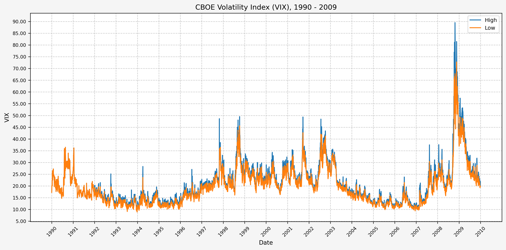
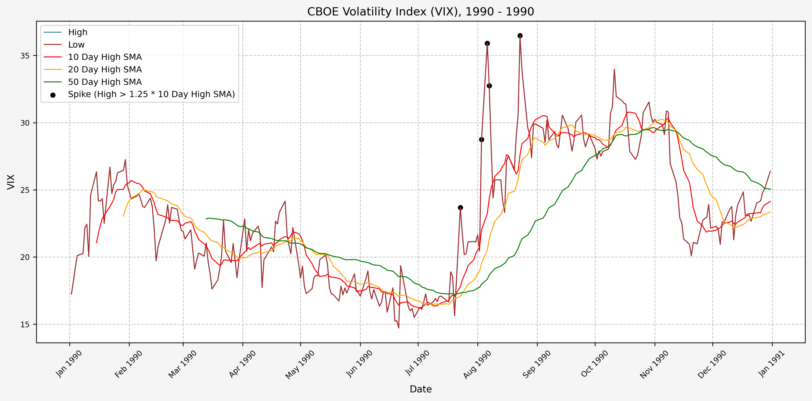

## Post Updates

Update 4/8/2025: Added plot for signals for each year. VIX data through 4/7/25.</br>
Update 4/9/2025: VIX data through 4/8/25.</br>
Update 4/12/2025: VIX data through 4/10/25.</br>
Update 4/22/2025: VIX data through 4/18/25.</br>
Update 4/23/2025: VIX data through 4/22/25.</br>
Update 4/25/2025: VIX data through 4/23/25. Added section for trade history, including open and closed positions.</br>
Update 4/28/2025: VIX data through 4/25/25.</br>
Update 5/6/2025: Data through 5/5/25. Added section for the VVIX.</br>
Update 5/7/2025: Data through 5/6/25.</br>

## Introduction

From the [CBOE VIX website](https://www.cboe.com/tradable_products/vix/):

"Cboe Global Markets revolutionized investing with the creation of the Cboe Volatility Index® (VIX® Index), the first benchmark index to measure the market’s expectation of future volatility. The VIX Index is based on options of the S&P 500® Index, considered the leading indicator of the broad U.S. stock market. The VIX Index is recognized as the world’s premier gauge of U.S. equity market volatility."

In this tutorial, we will investigate finding a signal to use as a basis to trade the VIX.

## VIX Data

I don't have access to data for the VIX through [Nasdaq Data Link](https://www.nasdaq.com/nasdaq-data-link), but for our purposes Yahoo Finance is sufficient.

Using the yfinance python module, we can pull what we need and quicky dump it to excel to retain it for future use.

## Python Functions

### Typical Functions

First, the typical set of functions I use:

<!-- INSERT_00_export_track_md_deps_HERE -->

</br>

<!-- INSERT_00_df_info_HERE -->

</br>

<!-- INSERT_00_df_info_markdown_HERE -->

</br>

<!-- INSERT_00_pandas_set_decimal_places_HERE -->

</br>

<!-- INSERT_00_load_data_HERE -->

### Project Specific Functions

Here's the code for the function to pull the VIX data and export to Excel:

<!-- INSERT_00_yf_pull_data_HERE -->

## Data Overview (VIX)

### Acquire CBOE Volatility Index (VIX) Data

First, let's get the data:

```python
yf_pull_data(
    base_directory=DATA_DIR,
    ticker="^VIX",
    source="Yahoo_Finance", 
    asset_class="Indices", 
    excel_export=True,
    pickle_export=True,
    output_confirmation=True,
)
```

### Load Data - VIX

Now that we have the data, let's load it up and take a look:

```python
# Set decimal places
pandas_set_decimal_places(2)

# VIX
vix = load_data(
    base_directory=DATA_DIR,
    ticker="^VIX",
    source="Yahoo_Finance", 
    asset_class="Indices",
    timeframe="Daily",
)

# Set 'Date' column as datetime
vix['Date'] = pd.to_datetime(vix['Date'])

# Drop 'Volume'
vix.drop(columns = {'Volume'}, inplace = True)

# Set Date as index
vix.set_index('Date', inplace = True)

# Check to see if there are any NaN values
vix[vix['High'].isna()]

# Forward fill to clean up missing data
vix['High'] = vix['High'].ffill()
```

### DataFrame Info - VIX

Now, running:

```python
df_info(vix)
```

Gives us the following:

<!-- INSERT_01_VIX_DF_Info_HERE -->

### Statistics - VIX

Some interesting statistics jump out at us when we look at the mean, standard deviation, minimum, and maximum values for the full dataset. The following code:

```python
vix_stats = vix.describe()
num_std = [-1, 0, 1, 2, 3, 4, 5]
for num in num_std:
    vix_stats.loc[f"mean + {num} std"] = {
        'Open': vix_stats.loc['mean']['Open'] + num * vix_stats.loc['std']['Open'],
        'High': vix_stats.loc['mean']['High'] + num * vix_stats.loc['std']['High'],
        'Low': vix_stats.loc['mean']['Low'] + num * vix_stats.loc['std']['Low'],
        'Close': vix_stats.loc['mean']['Close'] + num * vix_stats.loc['std']['Close'],
    }
display(vix_stats)
```

Gives us:

<!-- INSERT_01_VIX_Stats_HERE -->

We can also run the statistics individually for each year:

```python
# Group by year and calculate mean and std for OHLC
vix_stats_by_year = vix.groupby(vix.index.year)[["Open", "High", "Low", "Close"]].agg(["mean", "std"])

# Flatten the column MultiIndex
vix_stats_by_year.columns = ['_'.join(col).strip() for col in vix_stats_by_year.columns.values]
vix_stats_by_year.index.name = "Year"

display(vix_stats_by_year)
```

Gives us:

<!-- INSERT_01_VIX_Stats_By_Year_HERE -->

It is interesting to see how much the mean OHLC values vary by year.

And finally, we can run the statistics individually for each month:

```python
# Group by month and calculate mean and std for OHLC
vix_stats_by_month = vix.groupby(vix.index.month)[["Open", "High", "Low", "Close"]].agg(["mean", "std"])

# Flatten the column MultiIndex
vix_stats_by_month.columns = ['_'.join(col).strip() for col in vix_stats_by_month.columns.values]
vix_stats_by_month.index.name = "Month"

display(vix_stats_by_month)
```

Gives us:

<!-- INSERT_01_VIX_Stats_By_Month_HERE -->

### Deciles - VIX

Here are the levels for each decile, for the full dataset:

```python
vix_deciles = vix.quantile(np.arange(0, 1.1, 0.1))
display(vix_deciles)
```

Gives us:

<!-- INSERT_01_VIX_Deciles_HERE -->

## Plots - VIX

### Histogram Distribution - VIX

A quick histogram gives us the distribution for the entire dataset:


Now, let's add the levels for the mean minus 1 standard deviation, mean, mean plus 1 standard deviation, mean plus 2 standard deviations, mean plus 3 standard deviations, and mean plus 4 standard deviations:


### Historical Data - VIX

Here's two plots for the dataset. The first covers 1990 - 2009, and the second 2010 - Present. This is the daily high level:




From these plots, we can see the following:

* The VIX has really only jumped above 50 several times (GFC, COVID, recently in August of 2024)
* The highest levels (> 80) occured only during the GFC & COVID
* Interestingly, the VIX did not ever get above 50 during the .com bubble

## Data Overview (VVIX)

Before moving on to generating a signal, let's run the above data overview code again, but this time for the CBOE VVIX. From the [CBOE VVIX website](https://www.cboe.com/us/indices/dashboard/vvix/):

"Volatility is often called a new asset class, and every asset class deserves its own volatility index.  The Cboe VVIX IndexSM represents the expected volatility of the VIX®.  VVIX derives the expected 30-day volatility of VIX by applying the VIX algorithm to VIX options."

Looking at the statistics of the VVIX should give us an idea of the volatility of the VIX.

### Acquire CBOE VVIX Data

First, let's get the data:

```python
yf_pull_data(
    base_directory=DATA_DIR,
    ticker="^VVIX",
    source="Yahoo_Finance", 
    asset_class="Indices", 
    excel_export=True,
    pickle_export=True,
    output_confirmation=True,
)
```

### Load Data - VVIX

Now that we have the data, let's load it up and take a look:

```python
# Set decimal places
pandas_set_decimal_places(2)

# VVIX
vvix = load_data(
    base_directory=DATA_DIR,
    ticker="^VVIX",
    source="Yahoo_Finance", 
    asset_class="Indices",
    timeframe="Daily",
)

# Set 'Date' column as datetime
vvix['Date'] = pd.to_datetime(vvix['Date'])

# Drop 'Volume'
vvix.drop(columns = {'Volume'}, inplace = True)

# Set Date as index
vvix.set_index('Date', inplace = True)

# Check to see if there are any NaN values
vvix[vvix['High'].isna()]

# Forward fill to clean up missing data
vvix['High'] = vvix['High'].ffill()
```

### DataFrame Info - VVIX

Now, running:

```python
df_info(vvix)
```

Gives us the following:

<!-- INSERT_02_VVIX_DF_Info_HERE -->

### Statistics - VVIX

Here are the statistics for the VVIX, generated in the same manner as above for the VIX:

```python
vvix_stats = vvix.describe()
num_std = [-1, 0, 1, 2, 3, 4, 5]
for num in num_std:
    vvix_stats.loc[f"mean + {num} std"] = {
        'Open': vvix_stats.loc['mean']['Open'] + num * vvix_stats.loc['std']['Open'],
        'High': vvix_stats.loc['mean']['High'] + num * vvix_stats.loc['std']['High'],
        'Low': vvix_stats.loc['mean']['Low'] + num * vvix_stats.loc['std']['Low'],
        'Close': vvix_stats.loc['mean']['Close'] + num * vvix_stats.loc['std']['Close'],
    }
display(vvix_stats)
```

Gives us:

<!-- INSERT_02_VVIX_Stats_HERE -->

We can also run the statistics individually for each year:

```python
# Group by year and calculate mean and std for OHLC
vvix_stats_by_year = vvix.groupby(vvix.index.year)[["Open", "High", "Low", "Close"]].agg(["mean", "std"])

# Flatten the column MultiIndex
vvix_stats_by_year.columns = ['_'.join(col).strip() for col in vvix_stats_by_year.columns.values]
vvix_stats_by_year.index.name = "Year"

display(vvix_stats_by_year)
```

Gives us:

<!-- INSERT_02_VVIX_Stats_By_Year_HERE -->

And finally, we can run the statistics individually for each month:

```python
# Group by month and calculate mean and std for OHLC
vvix_stats_by_month = vvix.groupby(vvix.index.month)[["Open", "High", "Low", "Close"]].agg(["mean", "std"])

# Flatten the column MultiIndex
vvix_stats_by_month.columns = ['_'.join(col).strip() for col in vvix_stats_by_month.columns.values]
vvix_stats_by_month.index.name = "Year"

display(vvix_stats_by_month)
```

Gives us:

<!-- INSERT_02_VVIX_Stats_By_Month_HERE -->

### Deciles - VVIX

Here are the levels for each decile, for the full dataset:

```python
vvix_deciles = vvix.quantile(np.arange(0, 1.1, 0.1))
display(vvix_deciles)
```

Gives us:

<!-- INSERT_02_VVIX_Deciles_HERE -->

## Plots - VVIX

### Histogram Distribution - VVIX

A quick histogram gives us the distribution for the entire dataset:


Now, let's add the levels for the mean minus 1 standard deviation, mean, mean plus 1 standard deviation, mean plus 2 standard deviations, mean plus 3 standard deviations, and mean plus 4 standard deviations:


### Historical Data - VVIX

Here's two plots for the dataset. The first covers 2007 - 2016, and the second 2017 - Present. This is the daily high level:


## Investigating A Signal

Next, we will consider the idea of a spike level in the VIX and how we might use a spike level to generate a signal. These elevated levels usually occur during market sell-off events or longer term drawdowns in the S&P 500. Sometimes the VIX reverts to recent levels after a spike, but other times levels remain elevated for weeks or even months.

### Determining A Spike Level

We will start the 10 day simple moving average (SMA) of the daily high level to get an idea of what is happening recently with the VIX. We'll then pick an arbitrary spike level (25% above the 10 day SMA), and our signal is generated if the VIX hits a level that is above the spike threshold.

The idea is that the 10 day SMA will smooth out the recent short term volatility in the VIX, and therefore any gradual increases in the VIX are not interpreted as spike events.

We also will generate the 20 and 50 day SMAs for reference, and again to see what is happening with the level of the VIX over slightly longer timeframes.

Here's the code for the above:

```python
# Define the spike multiplier for detecting significant spikes
spike_level = 1.25

# =========================
# Simple Moving Averages (SMA)
# =========================

# Calculate 10-period SMA of 'High'
vix['High_SMA_10'] = vix['High'].rolling(window=10).mean()

# Shift the 10-period SMA by 1 to compare with current 'High'
vix['High_SMA_10_Shift'] = vix['High_SMA_10'].shift(1)

# Calculate the spike level based on shifted SMA and spike multiplier
vix['Spike_Level_SMA'] = vix['High_SMA_10_Shift'] * spike_level

# Calculate 20-period SMA of 'High'
vix['High_SMA_20'] = vix['High'].rolling(window=20).mean()

# Determine if 'High' exceeds the spike level (indicates a spike)
vix['Spike_SMA'] = vix['High'] >= vix['Spike_Level_SMA']

# Calculate 50-period SMA of 'High' for trend analysis
vix['High_SMA_50'] = vix['High'].rolling(window=50).mean()

# =========================
# Exponential Moving Averages (EMA)
# =========================

# Calculate 10-period EMA of 'High'
vix['High_EMA_10'] = vix['High'].ewm(span=10, adjust=False).mean()

# Shift the 10-period EMA by 1 to compare with current 'High'
vix['High_EMA_10_Shift'] = vix['High_EMA_10'].shift(1)

# Calculate the spike level based on shifted EMA and spike multiplier
vix['Spike_Level_EMA'] = vix['High_EMA_10_Shift'] * spike_level

# Calculate 20-period EMA of 'High'
vix['High_EMA_20'] = vix['High'].ewm(span=20, adjust=False).mean()

# Determine if 'High' exceeds the spike level (indicates a spike)
vix['Spike_EMA'] = vix['High'] >= vix['Spike_Level_EMA']

# Calculate 50-period EMA of 'High' for trend analysis
vix['High_EMA_50'] = vix['High'].ewm(span=50, adjust=False).mean()
```

For this exercise, we will use simple moving averages.

### Spike Counts (Signals) By Year

To investigate the number of spike events (or signals) that we receive on a yearly basis, we can run the following:

```python
# Ensure the index is a DatetimeIndex
vix.index = pd.to_datetime(vix.index)

# Create a new column for the year extracted from the date index
vix['Year'] = vix.index.year

# Group by year and the "Spike_SMA" and "Spike_EMA" columns, then count occurrences
spike_count_SMA = vix.groupby(['Year', 'Spike_SMA']).size().unstack(fill_value=0)

display(spike_count_SMA)
```

Which gives us the following:

<!-- INSERT_08_Spike_Counts_HERE -->

And the plot to aid with visualization. Based on the plot, it seems as though volatility has increased since the early 2000's:


### Spike Counts (Signals) Plots By Year

Here are the yearly plots for when signals are generated:

#### 1990



#### 1991


#### 1992


#### 1993


#### 1994


#### 1995


#### 1996


#### 1997


#### 1998


#### 1999


#### 2000


#### 2001


#### 2002


#### 2003


#### 2004


#### 2005


#### 2006


#### 2007


#### 2008


#### 2009


#### 2010


#### 2011


#### 2012


#### 2013


#### 2014


#### 2015


#### 2016


#### 2017


#### 2018


#### 2019


#### 2020


#### 2021


#### 2022


#### 2023


#### 2024


#### 2025


For comparison with the VVIX plot for 2025:


### Spike Counts (Signals) Plots By Decade

And here are the plots for the signals generated over the past 3 decades:

#### 1990 - 1994


#### 1995 - 1999


#### 2000 - 2004


#### 2005 - 2009


#### 2010 - 2014


#### 2015 - 2019


#### 2020 - 2024


#### 2025 - Present


For comparison with the VVIX plot for 2025:


## Trading History

I've begun trading based on the above ideas, opening positions during the VIX spikes and closing them as volatility comes back down. The executed trades, closed positions, and open positions listed below are all automated updates from the transaction history exports from Schwab. The exported CSV files are available in the GitHub repository.

### Trades Executed

Here are the trades executed to date:

<!-- INSERT_10_Trades_Executed_HERE -->

### Closed Positions

Here are the closed positions:

<!-- INSERT_11_Closed_Positions_HERE -->

Net profit and loss percentage: <!-- INSERT_11_Net_Profit_Percent_HERE --></br>
Net profit and loss: <!-- INSERT_11_Net_PnL_HERE -->

### Open Positions

Here are the positions that are currently open:

<!-- INSERT_12_Open_Positions_HERE -->

## References

https://www.cboe.com/tradable_products/vix/</br>
https://github.com/ranaroussi/yfinance

## Code

The jupyter notebook with the functions and all other code is available [here](investigating-a-vix-trading-signal.ipynb).</br>
The html export of the jupyter notebook is available [here](investigating-a-vix-trading-signal.html).</br>
The pdf export of the jupyter notebook is available [here](investigating-a-vix-trading-signal.pdf).