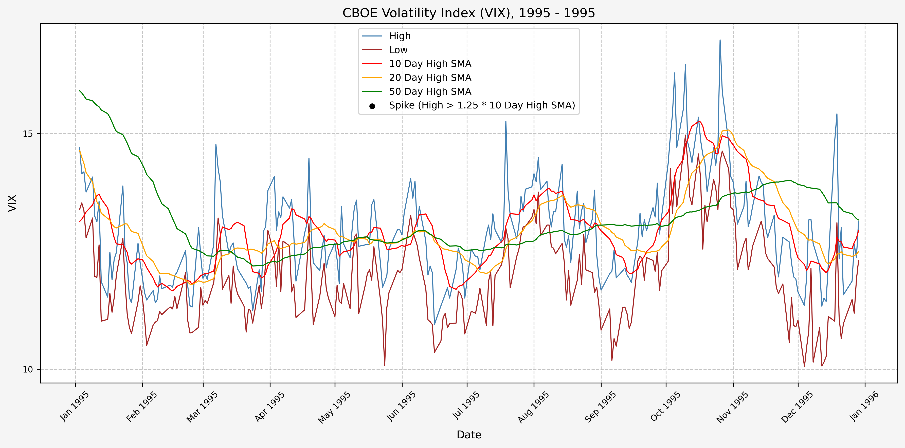
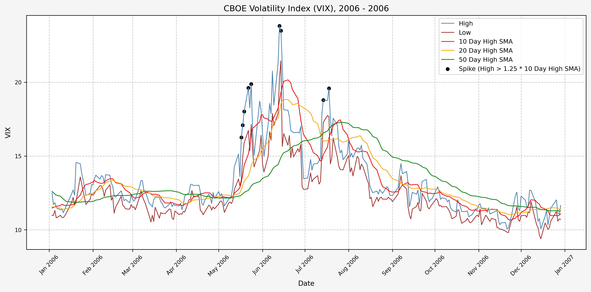
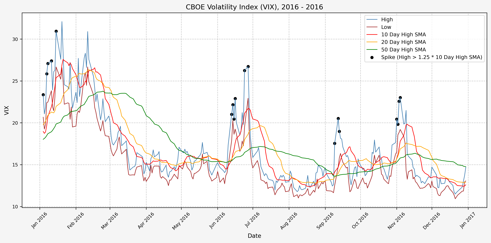

## Post Updates

Update 4/8/2025: Added plot for signals for each year. VIX data through 4/7/25.</br>
Update 4/9/2025: VIX data through 4/8/25.</br>
Update 4/12/2025: VIX data through 4/10/25.</br>
Update 4/22/2025: VIX data through 4/18/25.</br>
Update 4/23/2025: VIX data through 4/22/25.</br>
Update 4/25/2025: VIX data through 4/23/25. Added section for trade history, including open and closed positions.</br>
Update 4/28/2025: VIX data through 4/25/25.

## Introduction

From the [CBOE VIX website](https://www.cboe.com/tradable_products/vix/):

"Cboe Global Markets revolutionized investing with the creation of the Cboe Volatility Index® (VIX® Index), the first benchmark index to measure the market’s expectation of future volatility. The VIX Index is based on options of the S&P 500® Index, considered the leading indicator of the broad U.S. stock market. The VIX Index is recognized as the world’s premier gauge of U.S. equity market volatility."

In this tutorial, we will investigate finding a signal to use as a basis to trade the VIX.

## VIX Data

I don't have access to data for the VIX through [Nasdaq Data Link](https://www.nasdaq.com/nasdaq-data-link), but for our purposes Yahoo Finance is sufficient.

Using the yfinance python module, we can pull what we need and quicky dump it to excel to retain it for future use.

## Python Functions

### Typical Functions

First, the typical set of functions I use:

```python
from pathlib import Path

def export_track_md_deps(
    dep_file: Path, 
    md_filename: str, 
    content: str,
) -> None:
    
    """
    Export Markdown content to a file and track it as a dependency.

    This function writes the provided content to the specified Markdown file and 
    appends the filename to the given dependency file (typically `index_dep.txt`).
    This is useful in workflows where Markdown fragments are later assembled 
    into a larger document (e.g., a Hugo `index.md`).

    Parameters:
    -----------
    dep_file : Path
        Path to the dependency file that tracks Markdown fragment filenames.
    md_filename : str
        The name of the Markdown file to export.
    content : str
        The Markdown-formatted content to write to the file.

    Returns:
    --------
    None

    Example:
    --------
    >>> export_track_md_deps(Path("index_dep.txt"), "01_intro.md", "# Introduction\n...")
    ✅ Exported and tracked: 01_intro.md
    """
    
    Path(md_filename).write_text(content)
    with dep_file.open("a") as f:
        f.write(md_filename + "\n")
    print(f"✅ Exported and tracked: {md_filename}")
```

</br>

```python
from IPython.display import display

def df_info(df) -> None:
    
    """
    Display summary information about a pandas DataFrame.

    This function prints:
    - The DataFrame's column names, shape, and data types via `df.info()`
    - The first 5 rows using `df.head()`
    - The last 5 rows using `df.tail()`

    It uses `display()` for better output formatting in environments like Jupyter notebooks.

    Parameters:
    -----------
    df : pd.DataFrame
        The DataFrame to inspect.

    Returns:
    --------
    None

    Example:
    --------
    >>> df_info(my_dataframe)
    """
    
    print("The columns, shape, and data types are:")
    print(df.info())
    print("The first 5 rows are:")
    display(df.head())
    print("The last 5 rows are:")
    display(df.tail())
```

</br>

```python
import io
import pandas as pd

def df_info_markdown(df: pd.DataFrame) -> str:
    
    """
    Generate a Markdown-formatted summary of a pandas DataFrame.

    This function captures and formats the output of `df.info()`, `df.head()`, 
    and `df.tail()` in Markdown for easy inclusion in reports, documentation, 
    or web-based rendering (e.g., Hugo or Jupyter export workflows).

    Parameters:
    -----------
    df : pd.DataFrame
        The DataFrame to summarize.

    Returns:
    --------
    str
        A string containing the DataFrame's info, head, and tail 
        formatted in Markdown.

    Example:
    --------
    >>> print(df_info_markdown(df))
    ```text
    The columns, shape, and data types are:
    <output from df.info()>
    ```
    The first 5 rows are:
    |   | col1 | col2 |
    |---|------|------|
    | 0 | ...  | ...  |

    The last 5 rows are:
    ...
    """
    
    buffer = io.StringIO()

    # Capture df.info() output
    df.info(buf=buffer)
    info_str = buffer.getvalue()

    # Convert head and tail to Markdown
    head_str = df.head().to_markdown()
    tail_str = df.tail().to_markdown()

    markdown = [
        "```text",
        "The columns, shape, and data types are:\n",
        info_str,
        "```",
        "\nThe first 5 rows are:\n",
        head_str,
        "\nThe last 5 rows are:\n",
        tail_str
    ]

    return "\n".join(markdown)
```

</br>

```python
import pandas as pd

def pandas_set_decimal_places(decimal_places: int) -> None:
    
    """
    Set the number of decimal places displayed for floating-point numbers in pandas.

    Parameters:
    ----------
    decimal_places : int
        The number of decimal places to display for float values in pandas DataFrames and Series.

    Example:
    --------
    >>> dp(3)
    >>> pd.DataFrame([1.23456789])
           0
    0   1.235
    """
    
    pd.set_option('display.float_format', lambda x: f'%.{decimal_places}f' % x)
```

</br>

```python
import pandas as pd
from pathlib import Path

def load_data(
    base_directory: str,
    ticker: str,
    source: str,
    asset_class: str,
    timeframe: str,
) -> pd.DataFrame:
    
    """
    Load data from a CSV or Excel file into a pandas DataFrame.

    This function attempts to read a file first as a CSV, then as an Excel file 
    (specifically looking for a sheet named 'data' and using the 'calamine' engine).
    If both attempts fail, a ValueError is raised.

    Parameters:
    -----------
    base_directory : str
        Root path to read data file.
    ticker : str
        Ticker symbol to read.
    source : str
        Name of the data source (e.g., 'Yahoo').
    asset_class : str
        Asset class name (e.g., 'Equities').
    timeframe : str
        Timeframe for the data (e.g., 'Daily', 'Month_End').
    
    Returns:
    --------
    pd.DataFrame
        The loaded data.

    Raises:
    -------
    ValueError
        If the file could not be loaded as either CSV or Excel.

    Example:
    --------
    >>> df = load_data(DATA_DIR, "^VIX", "Yahoo_Finance", "Indices")
    """

    # Build file paths using pathlib
    csv_path = Path(base_directory) / source / asset_class / timeframe / f"{ticker}.csv"
    xlsx_path = Path(base_directory) / source / asset_class / timeframe / f"{ticker}.xlsx"

    # Try CSV
    try:
        df = pd.read_csv(csv_path)
        return df
    except Exception:
        pass

    # Try Excel
    try:
        df = pd.read_excel(xlsx_path)
        return df
    except Exception:
        pass

    raise ValueError(f"❌ Unable to load file: {ticker}. Ensure it's a valid CSV or Excel file with a 'data' sheet.")
```

### Project Specific Functions

Here's the code for the function to pull the VIX data and export to Excel:

```python
import yfinance as yf
import os
from IPython.display import display

def yf_pull_data(
    base_directory: str,
    ticker: str,
    source: str,
    asset_class: str,
    excel_export: bool,
    pickle_export: bool,
) -> None:
    
    """
    Download daily price data from Yahoo Finance and export it.

    Parameters:
    -----------
    base_directory : str
        Root path to store downloaded data.
    ticker : str
        Ticker symbol to download.
    source : str
        Name of the data source (e.g., 'Yahoo').
    asset_class : str
        Asset class name (e.g., 'Equities').
    excel_export : bool
        If True, export data to Excel format.
    pickle_export : bool
        If True, export data to Pickle format.

    Returns:
    --------
    None
    """
    
    # Download data from YF
    df = yf.download(ticker)

    # Drop the column level with the ticker symbol
    df.columns = df.columns.droplevel(1)

    # Reset index
    df = df.reset_index()

    # Remove the "Price" header from the index
    df.columns.name = None

    # Reset date column
    df['Date'] = df['Date'].dt.tz_localize(None)

    # Set 'Date' column as index
    df = df.set_index('Date', drop=True)

    # Drop data from last day because it's not accrate until end of day
    df = df.drop(df.index[-1])
    
    # Create directory
    directory = f"{base_directory}/{source}/{asset_class}/Daily"
    os.makedirs(directory, exist_ok=True)

    # Export to excel
    if excel_export == True:
        df.to_excel(f"{directory}/{ticker}.xlsx", sheet_name="data")
    else:
        pass

    # Export to pickle
    if pickle_export == True:
        df.to_pickle(f"{directory}/{ticker}.pkl")
    else:
        pass

    # Print confirmation and display the first and last date 
    # of data
    print(f"The first and last date of data for {ticker} is: ")
    display(df[:1])
    display(df[-1:])
    print(f"Yahoo Finance data complete for {ticker}")
    return print(f"--------------------")
```

## Data Overview

### Acquire CBOE Volatility Index (VIX) Data

First, let's get the data:

```python
yf_data_updater('^VIX')
```

### Set Decimal Places

Let's set the number of decimal places to something sane (like 2):

```python
pandas_set_decimal_places(2)
```

### Load Data

Now that we have the data, let's load it up and take a look:

```python
# VIX
vix = load_data('^VIX.xlsx')

# Set 'Date' column as datetime
vix['Date'] = pd.to_datetime(vix['Date'])

# Drop 'Volume'
vix.drop(columns = {'Volume'}, inplace = True)

# Set Date as index
vix.set_index('Date', inplace = True)
```

### Check For Missing Values & Forward Fill Any Missing Values

```python
# Check to see if there are any NaN values
vix[vix['High'].isna()]

# Forward fill to clean up missing data
vix['High'] = vix['High'].ffill()
```

### VIX DataFrame Info

Now, running:

```python
df_info(vix)
```

Gives us the following:

<!-- INSERT_01_DF_Info_HERE -->

### Statistics

Some interesting statistics jump out at us when we look at the mean, standard deviation, minimum, and maximum values. The following code:

```python
vix_stats = vix.describe()
num_std = [-1, 0, 1, 2, 3, 4, 5]
for num in num_std:
    vix_stats.loc[f"mean + {num} std"] = {
        'Open': vix_stats.loc['mean']['Open'] + num * vix_stats.loc['std']['Open'],
        'High': vix_stats.loc['mean']['High'] + num * vix_stats.loc['std']['High'],
        'Low': vix_stats.loc['mean']['Low'] + num * vix_stats.loc['std']['Low'],
        'Close': vix_stats.loc['mean']['Close'] + num * vix_stats.loc['std']['Close'],
    }
```

Gives us:

<!-- INSERT_02_VIX_Stats_HERE -->

### Deciles

And the levels for each decile:

```python
vix_deciles = vix.quantile(np.arange(0, 1.1, 0.1))
display(vix_deciles)
```

Gives us:

<!-- INSERT_03_VIX_Deciles_HERE -->

### Histogram Distribution

A quick histogram gives us the distribution for the entire dataset:


Now, let's add the levels for the mean, mean plus 1 standard deviation, mean minus 1 standard deviation, and mean plus 2 standard deviations:


## Plots

### Historical VIX Data

Here's two plots for the dataset. The first covers 1990 - 2009, and the second 2010 - 2024. This is the daily high level:

#### 1990 - 2009


#### 2010 - Present


From these plots, we can see the following:

* The VIX has really only jumped above 50 several times (GFC, COVID, recently in August of 2024)
* The highest levels (> 80) occured only during the GFC & COVID
* Interestingly, the VIX did not ever get above 50 during the .com bubble

## Investigating A Signal

Next, we will consider the idea of a spike level in the VIX and how we might use a spike level to generate a signal. These elevated levels usually occur during market sell-off events or longer term drawdowns in the S&P 500. Sometimes the VIX reverts to recent levels after a spike, but other times levels remain elevated for weeks or even months.

### Determining A Spike Level

We will start the 10 day simple moving average (SMA) of the daily high level to get an idea of what is happening recently with the VIX. We'll then pick an arbitrary spike level (25% above the 10 day SMA), and our signal is generated if the VIX hits a level that is above the spike threshold.

The idea is that the 10 day SMA will smooth out the recent short term volatility in the VIX, and therefore any gradual increases in the VIX are not interpreted as spike events.

We also will generate the 20 and 50 day SMAs for reference, and again to see what is happening with the level of the VIX over slightly longer timeframes.

Here's the code for the above:

```python
# Define the spike multiplier for detecting significant spikes
spike_level = 1.25

# =========================
# Simple Moving Averages (SMA)
# =========================

# Calculate 10-period SMA of 'High'
vix['High_SMA_10'] = vix['High'].rolling(window=10).mean()

# Shift the 10-period SMA by 1 to compare with current 'High'
vix['High_SMA_10_Shift'] = vix['High_SMA_10'].shift(1)

# Calculate the spike level based on shifted SMA and spike multiplier
vix['Spike_Level_SMA'] = vix['High_SMA_10_Shift'] * spike_level

# Calculate 20-period SMA of 'High'
vix['High_SMA_20'] = vix['High'].rolling(window=20).mean()

# Determine if 'High' exceeds the spike level (indicates a spike)
vix['Spike_SMA'] = vix['High'] >= vix['Spike_Level_SMA']

# Calculate 50-period SMA of 'High' for trend analysis
vix['High_SMA_50'] = vix['High'].rolling(window=50).mean()

# =========================
# Exponential Moving Averages (EMA)
# =========================

# Calculate 10-period EMA of 'High'
vix['High_EMA_10'] = vix['High'].ewm(span=10, adjust=False).mean()

# Shift the 10-period EMA by 1 to compare with current 'High'
vix['High_EMA_10_Shift'] = vix['High_EMA_10'].shift(1)

# Calculate the spike level based on shifted EMA and spike multiplier
vix['Spike_Level_EMA'] = vix['High_EMA_10_Shift'] * spike_level

# Calculate 20-period EMA of 'High'
vix['High_EMA_20'] = vix['High'].ewm(span=20, adjust=False).mean()

# Determine if 'High' exceeds the spike level (indicates a spike)
vix['Spike_EMA'] = vix['High'] >= vix['Spike_Level_EMA']

# Calculate 50-period EMA of 'High' for trend analysis
vix['High_EMA_50'] = vix['High'].ewm(span=50, adjust=False).mean()
```

For this exercise, we will use simple moving averages.

### Spike Counts (Signals) By Year

To investigate the number of spike events (or signals) that we receive on a yearly basis, we can run the following:

```python
# Ensure the index is a DatetimeIndex
vix.index = pd.to_datetime(vix.index)

# Create a new column for the year extracted from the date index
vix['Year'] = vix.index.year

# Group by year and the "Spike_SMA" and "Spike_EMA" columns, then count occurrences
spike_count_SMA = vix.groupby(['Year', 'Spike_SMA']).size().unstack(fill_value=0)

spike_count_SMA
```

Which gives us the following:

<!-- INSERT_08_Spike_Counts_HERE -->

And the plot to aid with visualization. Based on the plot, it seems as though volatility has increased since the early 2000's:


### Spike Counts (Signals) Plots By Year

Here are the yearly plots for when signals are generated:

#### 1990


#### 1991


#### 1992


#### 1993


#### 1994


#### 1995



#### 1996


#### 1997


#### 1998


#### 1999


#### 2000


#### 2001


#### 2002


#### 2003


#### 2004


#### 2005


#### 2006



#### 2007


#### 2008


#### 2009


#### 2010


#### 2011


#### 2012


#### 2013


#### 2014


#### 2015


#### 2016



#### 2017


#### 2018


#### 2019


#### 2020


#### 2021


#### 2022


#### 2023


#### 2024


#### 2025


### Spike Counts (Signals) Plots By Decade

And here are the plots for the signals generated over the past 3 decades:

#### 1990 - 1994


#### 1995 - 1999


#### 2000 - 2004


#### 2005 - 2009


#### 2010 - 2014


#### 2015 - 2019


#### 2020 - 2024


#### 2025 - Present


## Trading History

I've begun trading based on the above ideas, opening positions during the VIX spikes and closing them as volatility comes back down. The executed trades, closed positions, and open positions listed below are all automated updates from the transaction history exports from Schwab. The exported CSV files are available in the GitHub repository.

### Trades Executed

Here are the trades executed to date:

<!-- INSERT_10_Trades_Executed_HERE -->

### Closed Positions

Here are the closed positions:

<!-- INSERT_11_Closed_Positions_HERE -->

Net profit and loss percentage: <!-- INSERT_11_Net_Profit_Percent_HERE --></br>
Net profit and loss: <!-- INSERT_11_Net_PnL_HERE -->

### Open Positions

Here are the positions that are currently open:

<!-- INSERT_12_Open_Positions_HERE -->

## References

https://www.cboe.com/tradable_products/vix/</br>
https://github.com/ranaroussi/yfinance

## Code

The jupyter notebook with the functions and all other code is available [here](investigating-a-vix-trading-signal.ipynb).</br>
The html export of the jupyter notebook is available [here](investigating-a-vix-trading-signal.html).</br>
The pdf export of the jupyter notebook is available [here](investigating-a-vix-trading-signal.pdf).
