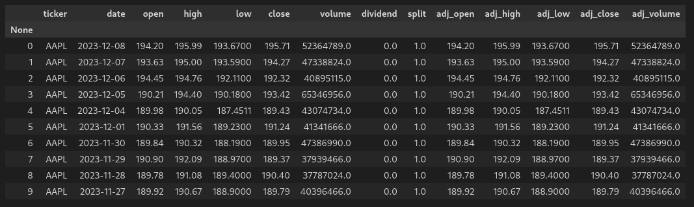
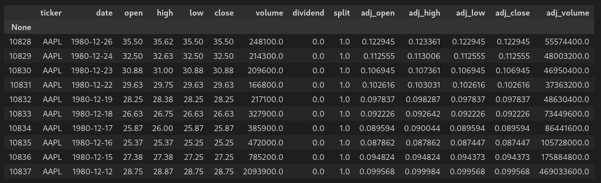
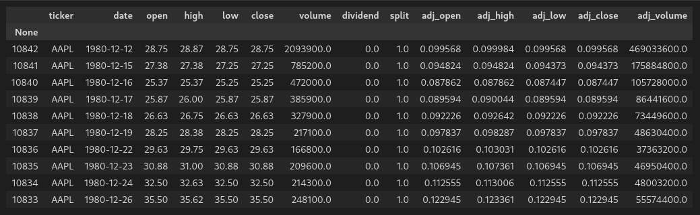
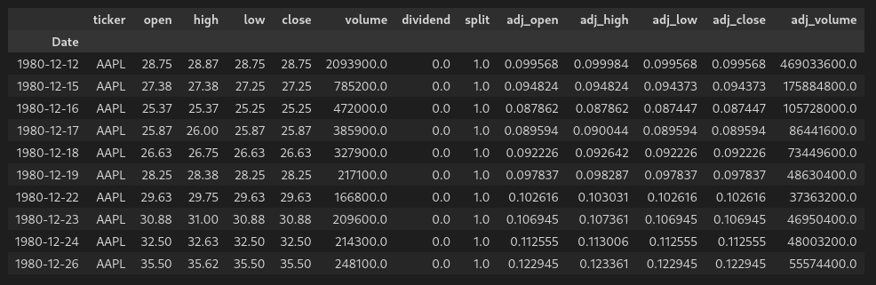
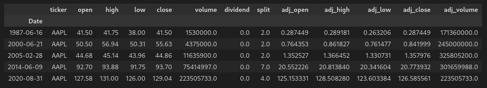
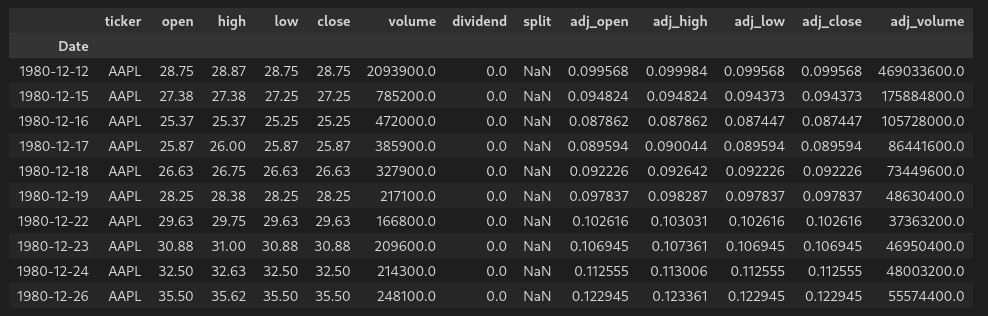
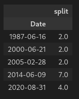
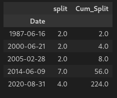
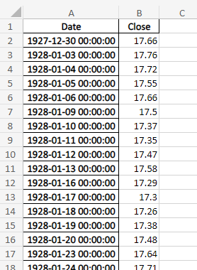

## Introduction

In this tutorial, we will write a python function that pulls data from Nasdaq Data Link through the tables API, adds relevant columns that are not present in the raw data, updates columns to allow for ease of use, and leaves the data in a format where it can then be used in time series analysis.

[Nasdaq Data Link](https://www.nasdaq.com/nasdaq-data-link) is a provider of numerous different types of financial data from many different asset classes. It provides API's that allow access from Python, R, Excel, and other methods. It is available to [institutional investors](https://data.nasdaq.com/institutional-investors) as well as [individual retail investors](https://data.nasdaq.com/individual-users).

## Nasdaq Data Link Initial Data Retrieval

We will use the data for AAPL for this example. This will give us a data set that requires some thought as to how the splits need to be handled as well as the dividends.

We'll start with pulling the initial data set, with the first 10 rows shown as follows from the pandas dataframe:



And the last 10 rows:



From left to right, we have the following columns:

1. Row number: 0 indexed, gives us the total number of rows/dates of data
2. Ticker: The ticker symbol for our data
3. Date: In the format YYYY-MM-DD
4. Open: Daily open
5. High: Daily high
6. Low: Daily low
7. Close: Daily close
8. Volume: Volume of shares traded
9. Dividend: Dividend paid on that date
10. Split: Split executed on that date
11. Adjusted Open: Daily open price adusted for all splits and dividends
12. Adjusted High: Daily high price adusted for all splits and dividends
13. Adjusted Low: Daily low price adusted for all splits and dividends
14. Adjusted Close: Daily close price adusted for all splits and dividends
15. Adjusted Volume: Daily volume price adusted for all splits

## Data questions

The above information is a good starting point, but what if we are looking for the following answers?

1. The data shows a split value for every day, but we know the stock didn't split every day. What does this represent?
2. What is the total cumulative split ratio?
3. What is the split ratio at different points in time?
4. What is the adjusted share price without including the dividends? This would be needed for any time series analysis.
5. What is the dividend dollar value based on an adjusted share price?
6. What would the share price be if the stock hadn't split?

We'll add columns and modify as necessary to answer the above questions and more.

## Assumptions

The remainder of this tutorial assumes the following:

* You have the [Nasdaq Data Link](https://github.com/Nasdaq/data-link-python) library installed
* You have the [pandas](https://pandas.pydata.org/) library installed
* You have the [OpenPyXL](https://openpyxl.readthedocs.io/en/stable/) library installed

## Python function to modify the data

The following function will perform the desired modifications:

```html
# This function pulls the data for the specific fund from from Nasdaq Data
# Link and adds many missing columns

# Imports
import nasdaqdatalink
import pandas as pd
import numpy as np

# Add API key for reference to allow access to unrestricted data
nasdaqdatalink.ApiConfig.api_key = 'your_key'

# Function definition
def ndl_data_updater(fund):

    # Command to pull data
    # If start date and end date are not specified the entire data set is included
    df = nasdaqdatalink.get_table('QUOTEMEDIA/PRICES', ticker = fund, paginate=True)
    
    # Sort columns by date ascending
    df.sort_values('date', ascending = True, inplace = True)
    
    # Rename date column
    df.rename(columns = {'date':'Date'}, inplace = True)
    
    # Set index to date column
    df.set_index('Date', inplace = True)
    
    # Replace all split values of 1.0 with NaN
    df['split'] = df['split'].replace(1.0, np.nan)
    
    # Create a new data frame with split values only
    df_splits = df.drop(columns = {'ticker', 'open', 'high', 'low', 'close', 'volume', 
                                   'dividend', 'adj_open', 'adj_high', 'adj_low', 'adj_close', 'adj_volume'}).dropna()
    
    # Create a new column for cumulative split
    df_splits['Cum_Split'] = df_splits['split'].cumprod()
    
    # Drop original split column before combining dataframes
    df_splits.drop(columns = {'split'}, inplace = True)
    
    # Merge df and df_split dataframes
    df_comp = pd.merge(df, df_splits, on='Date', how='outer')
    
    # Forward fill for all split and cumulative split values
    df_comp['split'].fillna(method = 'ffill', inplace = True)
    df_comp['Cum_Split'].fillna(method = 'ffill', inplace = True)
    
    # Replace all split and cumulative split values of NaN with 1.0 to have complete split values
    df_comp['split'] = df_comp['split'].replace(np.nan, 1.0)
    df_comp['Cum_Split'] = df_comp['Cum_Split'].replace(np.nan, 1.0)

    # Calculate the non adjusted prices based on the splits only
    df_comp['non_adj_open_split_only'] = df_comp['open'] * df_comp['Cum_Split'] 
    df_comp['non_adj_high_split_only'] = df_comp['high'] * df_comp['Cum_Split']    
    df_comp['non_adj_low_split_only'] = df_comp['low'] * df_comp['Cum_Split']    
    df_comp['non_adj_close_split_only'] = df_comp['close'] * df_comp['Cum_Split']
    df_comp['non_adj_dividend_split_only'] = df_comp['dividend'] * df_comp['Cum_Split']

    # Calculate the adjusted prices based on the splits
    df_comp['Open'] = df_comp['non_adj_open_split_only'] / df_comp['Cum_Split'][-1]
    df_comp['High'] = df_comp['non_adj_high_split_only'] / df_comp['Cum_Split'][-1]
    df_comp['Low'] = df_comp['non_adj_low_split_only'] / df_comp['Cum_Split'][-1]
    df_comp['Close'] = df_comp['non_adj_close_split_only'] / df_comp['Cum_Split'][-1]
    df_comp['Dividend'] = df_comp['non_adj_dividend_split_only'] / df_comp['Cum_Split'][-1]
    df_comp['Dividend_Pct_Orig'] = df_comp['dividend'] / df_comp['close']
    df_comp['Dividend_Pct_Adj'] = df_comp['Dividend'] / df_comp['Close']

    # Export data to excel
    file = fund + "_NDL.xlsx"
    df_comp.to_excel(file, sheet_name='data')
    
    # Output confirmation
    print(f"The last date of data for {fund} is: ")
    print(df_comp[-1:])
    print(f"NDL data updater complete for {fund} data")
    return print(f"--------------------")
```

Let's break this down line by line.

## Imports

First, we need to import the required libraries:

```html
# Imports
import nasdaqdatalink
import pandas as pd
import numpy as np
```

## NDL API Key

To gain access to anything beyond the free tier, you will need to provide your access key:

```html
# Add API key for reference to allow access to unrestricted data
nasdaqdatalink.ApiConfig.api_key = 'your_key'
```

## Download data as a dataframe

Moving on to the function definition, we have the command to pull data from NDL. There are two separate APIs - the [time series](https://docs.data.nasdaq.com/docs/time-series) and the [tables](https://docs.data.nasdaq.com/docs/tables-1). The syntax is different, and some data sets are only available as one or the other. We will use the tables API for this tutorial.

```html
# Command to pull data
# If start date and end date are not specified the entire data set is included
df = nasdaqdatalink.get_table('QUOTEMEDIA/PRICES', ticker = fund, paginate=True)
```

In the example above, the `fund` is an input parameter to the function.

The `'QUOTEMEDIA/PRICES'` is the data source that we are accessing.

There are many other arguments that we could pass in the above, including specifying columns, period start date, period end date, and others. Nasdaq as a few examples to get you started:

https://docs.data.nasdaq.com/docs/python-tables

Running:

    df.head(10)

Gives us:


## Sort columns by date

Next, we will sort the columns by date ascending. By default, the dataframe is created with the data sorted by descending date, and we want to change that:

```html
# Sort columns by date ascending
df.sort_values('date', ascending = True, inplace = True)
```

The `inplace = True` argument specifies that the sort function should take effect on the existing dataframe.

Now, running:

    df.head(10)

Gives us:



## Setting the date as the index

Next, we will rename the `date` column from 'date' to 'Date', and set the index to be the `Date` column:

```html
# Rename date column
df.rename(columns = {'date':'Date'}, inplace = True)
    
# Set index to date column
df.set_index('Date', inplace = True)
```

Now, running:

    df.head(10)

Gives us:



## Calculating splits

The next sections deal with the split column. So far we have only seen a split value of 1.0 in the data, but we've only looked at the first 10 and last 10 rows. Are there any other values? Let's check by running:

```html
df_not_1_split = df[df['split'] != 1.0]
```

And checking the first 10 rows:

    df_not_1_split.head(10)

Gives us:



So we now know that the stock did in fact split several times. Next, we will replace all of the `1.0` split values - because they are really meaningless - and then create a new dataframe to deal with the splits.

```html
# Replace all split values of 1.0 with NaN
df['split'] = df['split'].replace(1.0, np.nan)
```

This gives us:



We will now create a dataframe with only the split values:

```html
# Create a new data frame with split values only
df_splits = df.drop(columns = {'ticker', 'open', 'high', 'low', 'close', 'volume', 
                               'dividend', 'adj_open', 'adj_high', 'adj_low', 
                               'adj_close', 'adj_volume'}).dropna()
```

Which gives us:



Creating a column for the cumulative split will provide an accurate perspective on the stock price. We can do that with the following:

```html
# Create a new column for cumulative split
df_splits['Cum_Split'] = df_splits['split'].cumprod()
```

Which gives us:




    
    
    
    # Drop original split column before combining dataframes
    df_splits.drop(columns = {'split'}, inplace = True)
    
    # Merge df and df_split dataframes
    df_comp = pd.merge(df, df_splits, on='Date', how='outer')
    
    # Forward fill for all split and cumulative split values
    df_comp['split'].fillna(method = 'ffill', inplace = True)
    df_comp['Cum_Split'].fillna(method = 'ffill', inplace = True)
    
    # Replace all split and cumulative split values of NaN with 1.0 to have complete split values
    df_comp['split'] = df_comp['split'].replace(np.nan, 1.0)
    df_comp['Cum_Split'] = df_comp['Cum_Split'].replace(np.nan, 1.0)

    # Calculate the non adjusted prices based on the splits only
    df_comp['non_adj_open_split_only'] = df_comp['open'] * df_comp['Cum_Split'] 
    df_comp['non_adj_high_split_only'] = df_comp['high'] * df_comp['Cum_Split']    
    df_comp['non_adj_low_split_only'] = df_comp['low'] * df_comp['Cum_Split']    
    df_comp['non_adj_close_split_only'] = df_comp['close'] * df_comp['Cum_Split']
    df_comp['non_adj_dividend_split_only'] = df_comp['dividend'] * df_comp['Cum_Split']

    # Calculate the adjusted prices based on the splits
    df_comp['Open'] = df_comp['non_adj_open_split_only'] / df_comp['Cum_Split'][-1]
    df_comp['High'] = df_comp['non_adj_high_split_only'] / df_comp['Cum_Split'][-1]
    df_comp['Low'] = df_comp['non_adj_low_split_only'] / df_comp['Cum_Split'][-1]
    df_comp['Close'] = df_comp['non_adj_close_split_only'] / df_comp['Cum_Split'][-1]
    df_comp['Dividend'] = df_comp['non_adj_dividend_split_only'] / df_comp['Cum_Split'][-1]
    df_comp['Dividend_Pct_Orig'] = df_comp['dividend'] / df_comp['close']
    df_comp['Dividend_Pct_Adj'] = df_comp['Dividend'] / df_comp['Close']

    # Export data to excel
    file = fund + "_NDL.xlsx"
    df_comp.to_excel(file, sheet_name='data')
    
    # Output confirmation
    print(f"The last date of data for {fund} is: ")
    print(df_comp[-1:])
    print(f"NDL data updater complete for {fund} data")
    return print(f"--------------------")
```


## Export data

Next, we want to export the data to an excel file, for easy viewing and reference later:

```html
# Export data to excel
file = fund + ".xlsx"
df.to_excel(file, sheet_name='data')
```

And verify the output is as expected:



## Output confirmation

Finally, we want to print a confirmation that the process succeeded along withe last date we have for data:

```html
# Output confirmation
print(f"The last date of data for {fund} is: ")
print(df[-1:])
print(f"Bloomberg data conversion complete for {fund} data")
print(f"--------------------")
```


## References

https://docs.data.nasdaq.com/docs
https://docs.data.nasdaq.com/docs/tables-1
https://docs.data.nasdaq.com/docs/time-series
https://docs.data.nasdaq.com/docs/python