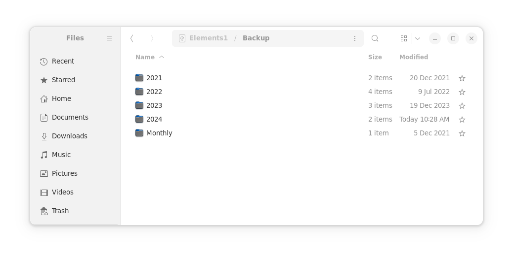
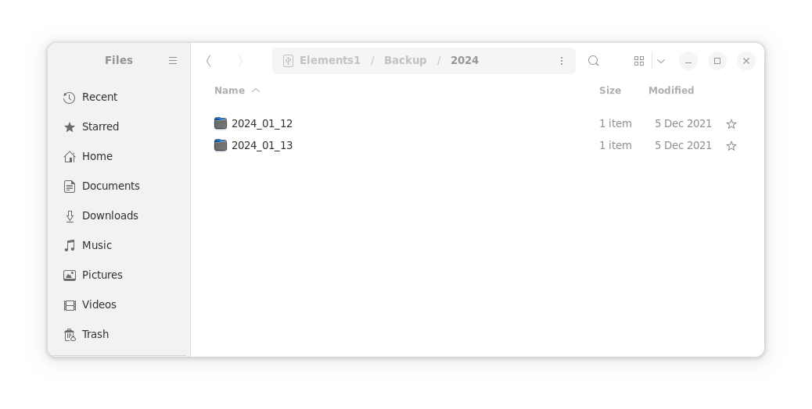

## Post Updates

Update 4/12/2025: [Revised script](https://www.jaredszajkowski.com/2024/01/12/simple-incremental-bash-backup-script/#updated-incremental-backup-script) to accomodate a list of excluded directories.

## Introduction

While there are [numerous backup solutions available for Linux](https://wiki.archlinux.org/title/Synchronization_and_backup_programs), many require extensive configuration and maintenance, and restoring from the backup is not always simple. Incremental backups are ideal because they maintain snapshots of the files and allow for access to previous versions of files.

Linux Journal recently [published an article on various backup solutions](https://www.linuxjournal.com/content/exploring-rsync-tar-and-other-backup-solutions), and I thought I'd provide my incremental backup script that uses `rsync` and `cp`.

## Incremental backup script

This script provides an incremental backup solution and only requires `rsync` and `cp` to be installed on the system.

```bash
#!/bin/bash

# Define the directories to backup and their destination directories
source_dir1="/source1"
backup_dir1="/backup1/"

source_dir2="/source2"
backup_dir2="/backup2/"

# Define excluded directories
excluded_dir1="leave/out/"
excluded_dir2="dont/want/"
excluded_dir3="exclude/this/"

# Function to run a backup
run_backup() {
  source_dir=$1
  backup_dir=$2

  # Check if the source directory exists
  if [ ! -d "$source_dir" ]; then
    echo "Error: Source directory not found"
    exit 1
  fi

  # Input year and date
  echo "What is today's year:"
  read backup_year
  echo "What is today's date:"
  read backup_date

  # Check if the backup directory exists and run backup
  if [ -d "$backup_dir" ]; then
    echo "Backup directory found, backing up $source_dir"
    rsync -av --delete --exclude "$excluded_dir1" --exclude "$excluded_dir2" --exclude "$excluded_dir3" $source_dir $backup_dir/Monthly/
    cp -al $backup_dir/Monthly/ $backup_dir/$backup_year/$backup_date/
  else
    echo "Error: Backup directory not found"
    exit 1
  fi
}

# Run backups
run_backup $source_dir1 $backup_dir1
run_backup $source_dir2 $backup_dir2

# Output confirmation
echo "Backup complete"
```

## Updated Incremental Backup Script

Here's the updated script, which now accomodates a list of excluded directories, along with a few other checks for the year and backup date.

```bash
#!/bin/bash

# Define the directories to backup and their destination directories
source_dir1="/source1"
backup_dir1="/backup1/"

source_dir2="/source2"
backup_dir2="/backup2/"

# Define excluded directories
excluded_dirs=(
  "/leave/out/"
  "/dont/want/"
)

# Function to run a backup
run_backup() {
  local source_dir="$1"
  local backup_dir="$2"

  # Check if the source directory exists
  if [ ! -d "$source_dir" ]; then
    echo "Error: Source directory '$source_dir' not found."
    exit 2
  fi

  # Input year and date
  echo "What is today's year (YYYY):"
  read -r backup_year
  if [[ ! "$backup_year" =~ ^[0-9]{4}$ ]]; then
    echo "Error: Invalid year entered."
    exit 3
  fi
  
  echo "What is today's date (YYYY-MM-DD):"
  read backup_date
  if [[ ! "$backup_date" =~ ^[0-9]{4}-[0-9]{2}-[0-9]{2}$ ]]; then
    echo "Error: Invalid date format. Use YYYY-MM-DD."
    exit 4
  fi

  # Check if the backup directory exists and run backup
  if [ -d "$backup_dir" ]; then
    echo "Backup directory '$backup_dir' found, backing up '$source_dir'..."
    
    # Build rsync exclude arguments
    exclude_args=()
    for dir in "${excluded_dirs[@]}"; do
      exclude_args+=(--exclude "$dir")
    done
    
    rsync -av --delete "${exclude_args[@]}" "$source_dir" "$backup_dir/Monthly/"

    cp -al "$backup_dir/Monthly/" "$backup_dir/$backup_year/$backup_date/"

  else
    echo "Error: Backup directory '$backup_dir' not found."
    exit 5
  fi
}

# Run backups
run_backup "$source_dir1" "$backup_dir1"
run_backup "$source_dir2" "$backup_dir2"

# Output confirmation
echo "All backups completed successfully."
```

Let's break this down line by line.

## Source and backup directories

First, we need to define the source and backup directories, and any directories from the source that are to be excluded from the backup:

```bash
# Define the directories to backup and their destination directories
source_dir1="/source1"
backup_dir1="/backup1/"

source_dir2="/source2"
backup_dir2="/backup2/"

# Define excluded directories
excluded_dirs=(
  "/leave/out/"
  "/dont/want/"
)
```

You can add as many directories as you want here. The script compiles them before executing the rsync command.

## Backup function

Then we have the backup function. This performs the following:

1. Takes an input of the source and backup directories (defined above)
2. Checks to see if the source directory exists
3. Prompts for a year
4. Prompts for a date
5. Checks to make sure the backup destination directory exists
6. Executes the backup

```bash
# Function to run a backup
run_backup() {
  local source_dir="$1"
  local backup_dir="$2"

  # Check if the source directory exists
  if [ ! -d "$source_dir" ]; then
    echo "Error: Source directory '$source_dir' not found."
    exit 2
  fi

  # Input year and date
  echo "What is today's year (YYYY):"
  read -r backup_year
  if [[ ! "$backup_year" =~ ^[0-9]{4}$ ]]; then
    echo "Error: Invalid year entered."
    exit 3
  fi
  
  echo "What is today's date (YYYY-MM-DD):"
  read backup_date
  if [[ ! "$backup_date" =~ ^[0-9]{4}-[0-9]{2}-[0-9]{2}$ ]]; then
    echo "Error: Invalid date format. Use YYYY-MM-DD."
    exit 4
  fi

  # Check if the backup directory exists and run backup
  if [ -d "$backup_dir" ]; then
    echo "Backup directory '$backup_dir' found, backing up '$source_dir'..."
    
    # Build rsync exclude arguments
    exclude_args=()
    for dir in "${excluded_dirs[@]}"; do
      exclude_args+=(--exclude "$dir")
    done
    
    rsync -av --delete "${exclude_args[@]}" "$source_dir" "$backup_dir/Monthly/"

    cp -al "$backup_dir/Monthly/" "$backup_dir/$backup_year/$backup_date/"

  else
    echo "Error: Backup directory '$backup_dir' not found."
    exit 5
  fi
}
```

`rsync` is used to compare the files in the source to the `Monthly` backup directory and then update or delete files accordingly.

Once the files are copied over via `rsync`, then the `cp` command is used to link the files in the `Monthly` directory to the `year/date/` diorectory. As the files change in the `Monthly` directory, then the link also changes. This method saves disk space because files are not copied over and over again. Any files that do not change are simply linked within the filesystem. The links take up a trivial amount of disk space, and the filesystem handles all of the heavy lifting associated with tracking which files are linked and where on the filesystem. There is no database, log, etc. required to track the individual files and/or their versions.

## Running backups

Finally, run the backups and confirm complete:

```bash
# Run backups
run_backup "$source_dir1" "$backup_dir1"
run_backup "$source_dir2" "$backup_dir2"

# Output confirmation
echo "All backups completed successfully."
```

## Results

This script provides an incremental backup record organized by year and date:





Accessing older backups is straightforward - simply navigate to the desired directory within the filesystem.

## Deleting old backups

Deleting or removing old and out-of-date backups is as simple as deleting the directories. The filesystem links and files that are not linked elsewhere are removed from the filesystem, freeing up the disk space.

## References

https://rsync.samba.org/</br>
https://github.com/WayneD/rsync</br>
https://www.gnu.org/software/coreutils/</br>
https://www.man7.org/linux/man-pages/man1/cp.1.html