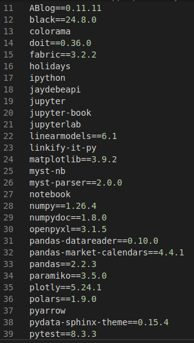

## Post Updates

Update 1/12/2025: Updated section for use of requirements.txt file for dependency management. 
Update 1/30/2025: Added section for version specific python virtual environments.

## Python Module Management

As an Arch Linux user, the push is to utilize pacman and related tools to manage dependencies and package updates (including Python modules). In fact, [the wiki itself](https://wiki.archlinux.org/title/Python) explicitly states this (see 2.1), and the default Arch installation of Python disables python-pip.

Unfortunately, there are limited resources put into maintaining packages for modules and only the most common and popular modules are maintained, and they are updated promptly as is consistent within the Arch ecosystem.

## Creating A Virtual Environment

After recently delving into crypto and the web3 Python module, the Coinbase API, and others, I've found the need to install Python modules from [Pypi](https://pypi.org/), the Python package index. This is the most exhaustive location to find modules, including the latest updates and version history.

Using python-pip necessitated the use of virtual environments, which made me reconsider the idea of not maintaining Python modules (or maintaining very few) through pacman at all.

I chose to place the virtual environments at `~/python-virtual-envs/` and within that directory have one called `general` and other called `wrds`. The `wrds` environment is specific to the [Wharton Research Data Services](https://wrds-www.wharton.upenn.edu/) which requires (for some reason) an older package of nympy.

The "general" environment covers everything else. I created it with the usual command:

    $ python -m venv ~/python-virtual-envs/general

Once created, it can be activated (either in a terminal or an IDE such as VS Code) by executing the following in the terminal:

    $ source ~/python-virtual-envs/general/bin/activate

## Creating Version Specific Python Virtual Environments

If a specific version of python is required (vs the version installed on the base Arch system), it can be installed as follows:

    $ sudo yay python312

And then follow the requisite prompts to install. Note that I am using [yay](https://github.com/Jguer/yay), with the binary build [yay-bin](https://aur.archlinux.org/yay-bin.git).

Once that completes, the virtual environment can be installed as follows:

    $ python3.12 -m venv ~/python-virtual-envs/general_312

The virtual environment can then be activated in a similar manner as any other:

    $ source ~/python-virtual-envs/general_312/bin/activate

## Using python-pip

After the virtual environment is created and activated, modules can be installed by using python-pip, such as:

    $ pip install <module-name>

If you want to view all installed modules, run:

    $ pip list

Or the outdated modules:

    $ pip list --outdated

And updated at a later point in time with:

    $ pip install --upgrade <module-name>

If you are interested in the specifics of a module (name, version, location, etc.):

    $ pip show <module-name>

## Using A requirements.txt File

If you have a requirements.txt file present in a git repository/directory, such as:

You can install the required dependencies with the following command:

    $ pip install -r requirements.txt

pip will then install all the required package and module versions based on the requirements file.

## Maintaining Across Multiple Systems

To avoid having to redundantly install modules on different systems, after I make a change to the virtual environment I can zip the entire `~/python-virtual-envs/` directory (or any of the individual directories of the virtual environments) and upload the zip file to Dropbox. This takes only a few minutes, and if I am working on a different system can simply extract the archive and have a completely up-to-date and current virtual environment to work in.

## References

1. https://docs.python.org/3/library/venv.html
2. https://pypi.org/
3. https://note.nkmk.me/en/python-pip-usage/
4. https://wiki.archlinux.org/title/Python
5. https://github.com/Jguer/yay