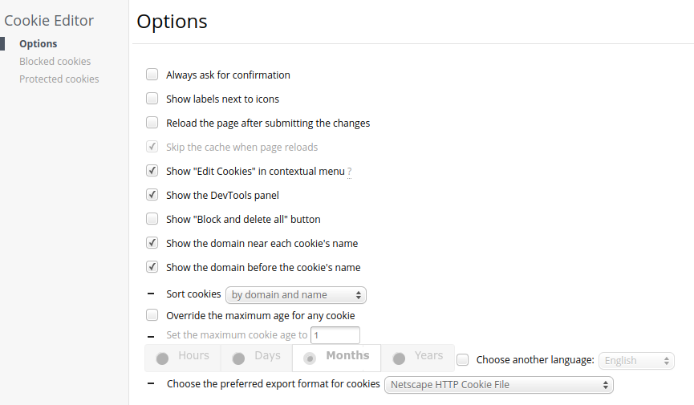
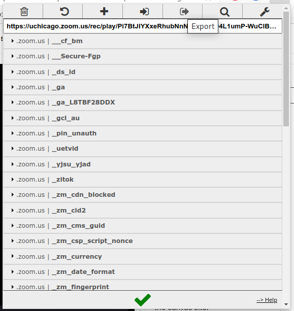

## Introduction

As a follow up to [this post about using yt-dlp with Zoom](https://www.jaredszajkowski.com/p/using-yt-dlp-with-zoom/), I found the need to also download videos hosted by Panopto for offline viewing.

Similar to the Zoom tutorial, this also requires you to have a "cookies" text file, which needs to contain the cookies export in the Netscape HTTP format of the Panopto hosting site after logging in.

Here's the steps to setting this up:

## Install cookie editor

Install the [cookie editor](https://microsoftedge.microsoft.com/addons/detail/cookie-editor/ajfboaconbpkglpfanbmlfgojgndmhmc) extension. I personnally use it with Microsoft Edge, but there are similar extensions for Chrome, Firefox, etc.

## Modify export format

Change the preferred cookie export format to `Netscape HTTP Cookie File` in the extension options. It is necessary to export in this format, otherwise yt-dlp will not be able to read the cookies.txt file correctly.



## Log in to Panopto

Log in to Panopto in your browser. Be sure to remain logged in while exporting the cookies under step 4.

## Export cookies

The export button is at the top fo the window. It copies the cookies to your clipboard, which then need to be pasted into a text file (I have my saved as cookies.txt), which yt-dlp will then read when it executes.



## Create bash script

Save the following code to a text file (my bash script file name is `yt-dlp-panopto.sh`):

```html
#!/bin/bash
echo What is the link?

read link

yt-dlp --cookies /path/to/cookies/file/cookies.txt -o "%(title)s-%(id)s.%(ext)s" --write-subs $link
```

## Change permissions

Modify the permissions of the bash script to allow execution:

    $ chmod +x yt-dlp-panopto.sh

## Execute the script

Execute the bash script with ./yt-dlp-panopto.sh, copy and paste the link to the video that you would like to save, and it should download the video and the subtitles. If there are not any subtitles present in the stream, then it will notify you and only download the video stream.

## References

References for yt-dlp (and used for above):

https://ostechnix.com/yt-dlp-tutorial/