

## Introduction

In this post, we'll take a look at historical return correlations between asset classes, including rolling returns, and how those correlations have changed over time.

 ## Python Imports


```python
# Standard Library
import datetime
import io
import os
import random
import sys
import warnings

from datetime import datetime, timedelta
from pathlib import Path

# Data Handling
import numpy as np
import pandas as pd

# Data Visualization
import matplotlib.dates as mdates
import matplotlib.pyplot as plt
import matplotlib.ticker as mtick
import seaborn as sns
from matplotlib.ticker import FormatStrFormatter, FuncFormatter, MultipleLocator

# Data Sources
import yfinance as yf
import pandas_datareader.data as web

# Statistical Analysis
import statsmodels.api as sm

# Machine Learning
from sklearn.decomposition import PCA
from sklearn.preprocessing import StandardScaler

# Suppress warnings
warnings.filterwarnings("ignore")
```


```python
# Add the source subdirectory to the system path to allow import config from settings.py
current_directory = Path(os.getcwd())
BASE_DIR = current_directory.parent.parent.parent
src_directory = BASE_DIR / "src"
sys.path.append(str(src_directory)) if str(src_directory) not in sys.path else None

# Import settings.py
from settings import config

# Add other configured directories
CONTENT_DIR = config("CONTENT_DIR")
POSTS_DIR = config("POSTS_DIR")
PAGES_DIR = config("PAGES_DIR")
PUBLIC_DIR = config("PUBLIC_DIR")
SOURCE_DIR = config("SOURCE_DIR")
DATA_DIR = config("DATA_DIR")
DATA_MANUAL_DIR = config("DATA_MANUAL_DIR")
```

## Python Functions

Here are the functions needed for this project:

* [load_data](/posts/reusable-extensible-python-functions-financial-data-analysis/#load_data): Load data from a CSV, Excel, or Pickle file into a pandas DataFrame.
* [pandas_set_decimal_places](/posts/reusable-extensible-python-functions-financial-data-analysis/#pandas_set_decimal_places): Set the number of decimal places displayed for floating-point numbers in pandas.
* [plot_histogram](/posts/reusable-extensible-python-functions-financial-data-analysis/#plot_histogram): Plot the histogram of a data set from a DataFrame.
* [plot_scatter](/posts/reusable-extensible-python-functions-financial-data-analysis/#plot_scatter): Plot the data from a DataFrame for a specified date range and columns.
* [plot_time_series](/posts/reusable-extensible-python-functions-financial-data-analysis/#plot_time_series): Plot the timeseries data from a DataFrame for a specified date range and columns.
* [run_linear_regression](/posts/reusable-extensible-python-functions-financial-data-analysis/#run_linear_regression): Run a linear regression using statsmodels OLS and return the results.
* [summary_stats](/posts/reusable-extensible-python-functions-financial-data-analysis/#summary_stats): Generate summary statistics for a series of returns.
* [yf_pull_data](/posts/reusable-extensible-python-functions-financial-data-analysis/#yf_pull_data): Download daily price data from Yahoo Finance and export it.


```python
from load_data import load_data
from pandas_set_decimal_places import pandas_set_decimal_places
from plot_heatmap import plot_heatmap
from plot_histogram import plot_histogram
from plot_scatter import plot_scatter
from plot_time_series import plot_time_series
from run_regression import run_regression
from summary_stats import summary_stats
from yf_pull_data import yf_pull_data
```

## Data Overview

For this exercise, we will (mostly) use ETFs as a proxy for asset classes and will use the following:

* Large Cap US Stocks / S&P 500 -- IVV (iShares S&P 500 ETF)
* Mid Cap US Stocks / S&P MidCap 400 -- IJH (iShares S&P MidCap 400 ETF)
* Small Cap US Stocks / S&P SmallCap 600 -- IJR (iShares S&P SmallCap 600 ETF)
* US Tech Stocks / Nasdaq 100 -- QQQ (Invesco QQQ Trust, Series 1)
* US Value Stocks -- IWD (iShares Russell 1000 Value ETF)
* US Growth Stocks -- IWF (iShares Russell 1000 Growth ETF)
* International Developed Market Stocks -- EFA (iShares MSCI EAFE ETF)
* Emerging Market Stocks -- EEM (iShares MSCI Emerging Markets ETF)
* European Stocks -- IEV (iShares S&P Europe 350 ETF)
* Short-Term US Treasuries -- SHY (iShares 1-3 Year Treasury Bond ETF)
* Medium-Term US Treasuries -- IEF (iShares 7-10 Year Treasury Bond ETF)
* Long-Term US Treasuries -- TLT (iShares 20+ Year Treasury Bond ETF)
* Aggregate Bonds -- AGG (iShares Core U.S. Aggregate Bond ETF)
* Gold -- GLD (SPDR Gold Shares)
* Commodities -- GSG (iShares S&P GSCI Commodity-Indexed Trust)
* Real Estate -- IYR (iShares U.S. Real Estate ETF)
* Bitcoin -- BTC-USD (Bitcoin USD)
* Ethereum -- ETH-USD (Ethereum USD)

For all of these, we will use the adjusted closing price, which accounts for dividends and stock splits.

## Acquire & Plot Data

We'll now pull the data for all the ETFs and cryptocurrencies listed above.


```python
pandas_set_decimal_places(2)

# Create list of tickers to pull data for
us_equity_tickers = ["IVV", "IJH", "IJR", "QQQ", "IWB", "IWD", "IWF", "IWM"]
intl_equity_tickers = ["EFA", "EEM", "IEV"]
equity_tickers = us_equity_tickers + intl_equity_tickers
bond_tickers = ["SHY", "IEF", "TLT", "AGG"]
commodity_tickers = ["GLD", "GSG"]
real_estate_tickers = ["IYR"]
cryptoasset_tickers = ["BTC-USD", "ETH-USD"]
etf_tickers = us_equity_tickers + intl_equity_tickers + bond_tickers + commodity_tickers + real_estate_tickers
tickers_dict = {
    "IVV" : "Large Cap US Stocks / S&P 500 -- IVV (iShares S&P 500 ETF)",
    "IJH" : "Mid Cap US Stocks / S&P MidCap 400 -- IJH (iShares S&P MidCap 400 ETF)",
    "IJR" : "Small Cap US Stocks / S&P SmallCap 600 -- IJR (iShares S&P SmallCap 600 ETF)",
    "QQQ" : "US Tech Stocks / Nasdaq 100 -- QQQ (Invesco QQQ Trust, Series 1)",
    "IWB" : "Large & Mid Cap US Stocks -- IWB (iShares Russell 1000 ETF)",
    "IWM" : "Small Cap US Stocks -- IWM (iShares Russell 2000 ETF)",
    "IWD" : "Large & Mid Cap US Value Stocks -- IWD (iShares Russell 1000 Value ETF)",
    "IWF" : "Large & Mid Cap US Growth Stocks -- IWF (iShares Russell 1000 Growth ETF)",
    "EFA" : "International Developed Market Stocks -- EFA (iShares MSCI EAFE ETF)",
    "EEM" : "Emerging Market Stocks -- EEM (iShares MSCI Emerging Markets ETF)",
    "IEV" : "European Stocks -- IEV (iShares S&P Europe 350 ETF)",
    "SHY" : "Short-Term US Treasuries -- SHY (iShares 1-3 Year Treasury Bond ETF)",
    "IEF" : "Medium-Term US Treasuries -- IEF (iShares 7-10 Year Treasury Bond ETF)",
    "TLT" : "Long-Term US Treasuries -- TLT (iShares 20+ Year Treasury Bond ETF)",
    "AGG" : "Aggregate Bonds -- AGG (iShares Core U.S. Aggregate Bond ETF)",
    "GLD" : "Gold -- GLD (SPDR Gold Shares)",
    "GSG" : "Commodities -- GSG (iShares S&P GSCI Commodity-Indexed Trust)",
    "IYR" : "Real Estate -- IYR (iShares U.S. Real Estate ETF)",
    "BTC-USD" : "Bitcoin -- BTC-USD (Bitcoin USD)",
    "ETH-USD" : "Ethereum -- ETH-USD (Ethereum USD)",
}
```


```python
for ticker in etf_tickers:
     yf_pull_data(
        base_directory=DATA_DIR,
        ticker=ticker,
        adjusted=False,
        source="Yahoo_Finance",
        asset_class="Exchange_Traded_Funds",
        excel_export=True,
        pickle_export=True,
        output_confirmation=False,
    )

for ticker in cryptoasset_tickers:
     yf_pull_data(
        base_directory=DATA_DIR,
        ticker=ticker,
        adjusted=False,
        source="Yahoo_Finance",
        asset_class="Cryptocurrencies",
        excel_export=True,
        pickle_export=True,
        output_confirmation=False,
     )
```

We'll then peform the following:
* Load data
* Rename columns to include the ticker (e.g. "QQQ_Close", "QQQ_Adj_Close", etc.)
* Drop all columns except for "Adj Close"
* Calculate the daily returns
* Combine the data into a single DataFrame


```python
fund_data = pd.DataFrame()

for ticker in etf_tickers:
    data = load_data(
        base_directory=DATA_DIR,
        ticker=ticker,
        source="Yahoo_Finance",
        asset_class="Exchange_Traded_Funds",
        timeframe="Daily",
        file_format="pickle",
    )

    # Rename columns to "QQQ_Close", etc.
    data = data.rename(columns={
        "Adj Close": f"{ticker}_Adj_Close",
        "Close": f"{ticker}_Close",
        "High": f"{ticker}_High",
        "Low": f"{ticker}_Low",
        "Open": f"{ticker}_Open",
        "Volume": f"{ticker}_Volume"
    })

    # Drop all columns except for the adjusted close price and date index
    data = data[[f"{ticker}_Adj_Close"]]

    # Calculate daily returns and add as new column
    data[f"{ticker}_Daily_Return"] = data[f"{ticker}_Adj_Close"].pct_change()

    # Concatenate the data for this ticker with the main fund_data DataFrame
    fund_data = pd.concat([fund_data, data], axis=1)

for ticker in cryptoasset_tickers:
    data = load_data(
        base_directory=DATA_DIR,
        ticker=ticker,
        source="Yahoo_Finance",
        asset_class="Cryptocurrencies",
        timeframe="Daily",
        file_format="pickle",
    )

    # Rename columns to "BTC-USD_Close", etc.
    data = data.rename(columns={
        "Adj Close": f"{ticker}_Adj_Close",
        "Close": f"{ticker}_Close",
        "High": f"{ticker}_High",
        "Low": f"{ticker}_Low",
        "Open": f"{ticker}_Open",
        "Volume": f"{ticker}_Volume"
    })

    # Drop all columns except for the adjusted close price and date index
    data = data[[f"{ticker}_Adj_Close"]]

    # Calculate daily returns and add as new column
    data[f"{ticker}_Daily_Return"] = data[f"{ticker}_Adj_Close"].pct_change()

    # Concatenate the data for this ticker with the main fund_data DataFrame
    fund_data = pd.concat([fund_data, data], axis=1)

display(fund_data)
```


<div>
<style scoped>
    .dataframe tbody tr th:only-of-type {
        vertical-align: middle;
    }

    .dataframe tbody tr th {
        vertical-align: top;
    }

    .dataframe thead th {
        text-align: right;
    }
</style>
<table border="1" class="dataframe">
  <thead>
    <tr style="text-align: right;">
      <th></th>
      <th>IVV_Adj_Close</th>
      <th>IVV_Daily_Return</th>
      <th>IJH_Adj_Close</th>
      <th>IJH_Daily_Return</th>
      <th>IJR_Adj_Close</th>
      <th>IJR_Daily_Return</th>
      <th>QQQ_Adj_Close</th>
      <th>QQQ_Daily_Return</th>
      <th>IWB_Adj_Close</th>
      <th>IWB_Daily_Return</th>
      <th>...</th>
      <th>GLD_Adj_Close</th>
      <th>GLD_Daily_Return</th>
      <th>GSG_Adj_Close</th>
      <th>GSG_Daily_Return</th>
      <th>IYR_Adj_Close</th>
      <th>IYR_Daily_Return</th>
      <th>BTC-USD_Adj_Close</th>
      <th>BTC-USD_Daily_Return</th>
      <th>ETH-USD_Adj_Close</th>
      <th>ETH-USD_Daily_Return</th>
    </tr>
    <tr>
      <th>Date</th>
      <th></th>
      <th></th>
      <th></th>
      <th></th>
      <th></th>
      <th></th>
      <th></th>
      <th></th>
      <th></th>
      <th></th>
      <th></th>
      <th></th>
      <th></th>
      <th></th>
      <th></th>
      <th></th>
      <th></th>
      <th></th>
      <th></th>
      <th></th>
      <th></th>
    </tr>
  </thead>
  <tbody>
    <tr>
      <th>1999-03-10</th>
      <td>NaN</td>
      <td>NaN</td>
      <td>NaN</td>
      <td>NaN</td>
      <td>NaN</td>
      <td>NaN</td>
      <td>43.07</td>
      <td>NaN</td>
      <td>NaN</td>
      <td>NaN</td>
      <td>...</td>
      <td>NaN</td>
      <td>NaN</td>
      <td>NaN</td>
      <td>NaN</td>
      <td>NaN</td>
      <td>NaN</td>
      <td>NaN</td>
      <td>NaN</td>
      <td>NaN</td>
      <td>NaN</td>
    </tr>
    <tr>
      <th>1999-03-11</th>
      <td>NaN</td>
      <td>NaN</td>
      <td>NaN</td>
      <td>NaN</td>
      <td>NaN</td>
      <td>NaN</td>
      <td>43.29</td>
      <td>0.00</td>
      <td>NaN</td>
      <td>NaN</td>
      <td>...</td>
      <td>NaN</td>
      <td>NaN</td>
      <td>NaN</td>
      <td>NaN</td>
      <td>NaN</td>
      <td>NaN</td>
      <td>NaN</td>
      <td>NaN</td>
      <td>NaN</td>
      <td>NaN</td>
    </tr>
    <tr>
      <th>1999-03-12</th>
      <td>NaN</td>
      <td>NaN</td>
      <td>NaN</td>
      <td>NaN</td>
      <td>NaN</td>
      <td>NaN</td>
      <td>42.23</td>
      <td>-0.02</td>
      <td>NaN</td>
      <td>NaN</td>
      <td>...</td>
      <td>NaN</td>
      <td>NaN</td>
      <td>NaN</td>
      <td>NaN</td>
      <td>NaN</td>
      <td>NaN</td>
      <td>NaN</td>
      <td>NaN</td>
      <td>NaN</td>
      <td>NaN</td>
    </tr>
    <tr>
      <th>1999-03-15</th>
      <td>NaN</td>
      <td>NaN</td>
      <td>NaN</td>
      <td>NaN</td>
      <td>NaN</td>
      <td>NaN</td>
      <td>43.44</td>
      <td>0.03</td>
      <td>NaN</td>
      <td>NaN</td>
      <td>...</td>
      <td>NaN</td>
      <td>NaN</td>
      <td>NaN</td>
      <td>NaN</td>
      <td>NaN</td>
      <td>NaN</td>
      <td>NaN</td>
      <td>NaN</td>
      <td>NaN</td>
      <td>NaN</td>
    </tr>
    <tr>
      <th>1999-03-16</th>
      <td>NaN</td>
      <td>NaN</td>
      <td>NaN</td>
      <td>NaN</td>
      <td>NaN</td>
      <td>NaN</td>
      <td>43.81</td>
      <td>0.01</td>
      <td>NaN</td>
      <td>NaN</td>
      <td>...</td>
      <td>NaN</td>
      <td>NaN</td>
      <td>NaN</td>
      <td>NaN</td>
      <td>NaN</td>
      <td>NaN</td>
      <td>NaN</td>
      <td>NaN</td>
      <td>NaN</td>
      <td>NaN</td>
    </tr>
    <tr>
      <th>...</th>
      <td>...</td>
      <td>...</td>
      <td>...</td>
      <td>...</td>
      <td>...</td>
      <td>...</td>
      <td>...</td>
      <td>...</td>
      <td>...</td>
      <td>...</td>
      <td>...</td>
      <td>...</td>
      <td>...</td>
      <td>...</td>
      <td>...</td>
      <td>...</td>
      <td>...</td>
      <td>...</td>
      <td>...</td>
      <td>...</td>
      <td>...</td>
    </tr>
    <tr>
      <th>2026-04-27</th>
      <td>718.50</td>
      <td>0.00</td>
      <td>72.84</td>
      <td>0.00</td>
      <td>136.56</td>
      <td>0.00</td>
      <td>664.23</td>
      <td>0.00</td>
      <td>391.14</td>
      <td>0.00</td>
      <td>...</td>
      <td>429.89</td>
      <td>-0.01</td>
      <td>32.88</td>
      <td>0.01</td>
      <td>100.83</td>
      <td>-0.01</td>
      <td>77366.62</td>
      <td>-0.02</td>
      <td>2303.06</td>
      <td>-0.03</td>
    </tr>
    <tr>
      <th>2026-04-28</th>
      <td>714.96</td>
      <td>-0.00</td>
      <td>72.11</td>
      <td>-0.01</td>
      <td>135.79</td>
      <td>-0.01</td>
      <td>657.55</td>
      <td>-0.01</td>
      <td>389.07</td>
      <td>-0.01</td>
      <td>...</td>
      <td>421.91</td>
      <td>-0.02</td>
      <td>33.34</td>
      <td>0.01</td>
      <td>101.74</td>
      <td>0.01</td>
      <td>76350.67</td>
      <td>-0.01</td>
      <td>2289.42</td>
      <td>-0.01</td>
    </tr>
    <tr>
      <th>2026-04-29</th>
      <td>714.89</td>
      <td>-0.00</td>
      <td>71.57</td>
      <td>-0.01</td>
      <td>134.73</td>
      <td>-0.01</td>
      <td>661.57</td>
      <td>0.01</td>
      <td>388.87</td>
      <td>-0.00</td>
      <td>...</td>
      <td>417.41</td>
      <td>-0.01</td>
      <td>34.56</td>
      <td>0.04</td>
      <td>100.90</td>
      <td>-0.01</td>
      <td>75776.13</td>
      <td>-0.01</td>
      <td>2253.42</td>
      <td>-0.02</td>
    </tr>
    <tr>
      <th>2026-04-30</th>
      <td>722.07</td>
      <td>0.01</td>
      <td>72.77</td>
      <td>0.02</td>
      <td>137.10</td>
      <td>0.02</td>
      <td>667.74</td>
      <td>0.01</td>
      <td>392.83</td>
      <td>0.01</td>
      <td>...</td>
      <td>423.66</td>
      <td>0.01</td>
      <td>34.39</td>
      <td>-0.00</td>
      <td>102.63</td>
      <td>0.02</td>
      <td>76304.32</td>
      <td>0.01</td>
      <td>2256.25</td>
      <td>0.00</td>
    </tr>
    <tr>
      <th>2026-05-01</th>
      <td>NaN</td>
      <td>NaN</td>
      <td>NaN</td>
      <td>NaN</td>
      <td>NaN</td>
      <td>NaN</td>
      <td>NaN</td>
      <td>NaN</td>
      <td>NaN</td>
      <td>NaN</td>
      <td>...</td>
      <td>NaN</td>
      <td>NaN</td>
      <td>NaN</td>
      <td>NaN</td>
      <td>NaN</td>
      <td>NaN</td>
      <td>78179.00</td>
      <td>0.02</td>
      <td>2295.09</td>
      <td>0.02</td>
    </tr>
  </tbody>
</table>
<p>8151 rows × 40 columns</p>
</div>


We'll then plot the time series of the adjusted close prices for each of the assets.


```python
# Combine the etf_tickers and cryptoasset_tickers lists into a single list of all tickers
all_tickers = etf_tickers + cryptoasset_tickers

for ticker in tickers_dict.keys():
     plot_time_series(
        df=fund_data,
        plot_start_date=None,
        plot_end_date=None,
        plot_columns=[f"{ticker}_Adj_Close"],
        title=f"{tickers_dict[ticker]} Adjusted Close Price",
        x_label="Date",
        x_format="Year",
        x_tick_spacing=1,
        x_tick_rotation=30,
        y_label="Price ($)",
        y_format="Decimal",
        y_format_decimal_places="Auto",
        y_tick_spacing="Auto",
        y_tick_rotation=0,
        grid=True,
        legend=False,
        export_plot=False,
        plot_file_name=None,
    )
```


    

    


    

    


    

    


    

    


    

    


    

    


    

    


    

    


    

    


    

    


    

    


    

    


    

    


    

    


    

    


    

    


    

    


    

    


    

    


    

    


We can see from the plots that are some gaps in the data, so we'll be sure to drop any rows with missing data before we calculate the correlations.

## Calculate Correlations

Next, we'll calculate the correlation matrix of the daily returns for all of the assets and plot it as a heatmap. We'll do this first without the BTC and ETH data (due to the limited history), and then with the BTC and ETH data.


```python
# Drop the adjusted close price columns, leaving only the daily return columns
daily_return_columns = [f"{ticker}_Daily_Return" for ticker in tickers_dict.keys()]
fund_data_daily_returns_all = fund_data[daily_return_columns]

# Drop the BTC and ETH daily return columns due to the limited history
fund_data_daily_returns_no_crypto = fund_data_daily_returns_all.drop(columns=["BTC-USD_Daily_Return", "ETH-USD_Daily_Return"])

# Print the shape of the fund_data_daily_returns_no_crypto DataFrame to confirm that the rows with missing data have been dropped
print(f"Shape of fund_data_daily_returns_no_crypto: {fund_data_daily_returns_no_crypto.shape}")
print(f"Rows to drop due to missing data: {fund_data_daily_returns_no_crypto.dropna().shape}")

# Drop the NaN values
fund_data_daily_returns_no_crypto = fund_data_daily_returns_no_crypto.dropna()

# Calculate the correlation matrix of the daily returns
correlation_matrix_no_crypto = fund_data_daily_returns_no_crypto.corr()

display(correlation_matrix_no_crypto)
```

    Shape of fund_data_daily_returns_no_crypto: (8151, 18)
    Rows to drop due to missing data: (4974, 18)


<div>
<style scoped>
    .dataframe tbody tr th:only-of-type {
        vertical-align: middle;
    }

    .dataframe tbody tr th {
        vertical-align: top;
    }

    .dataframe thead th {
        text-align: right;
    }
</style>
<table border="1" class="dataframe">
  <thead>
    <tr style="text-align: right;">
      <th></th>
      <th>IVV_Daily_Return</th>
      <th>IJH_Daily_Return</th>
      <th>IJR_Daily_Return</th>
      <th>QQQ_Daily_Return</th>
      <th>IWB_Daily_Return</th>
      <th>IWM_Daily_Return</th>
      <th>IWD_Daily_Return</th>
      <th>IWF_Daily_Return</th>
      <th>EFA_Daily_Return</th>
      <th>EEM_Daily_Return</th>
      <th>IEV_Daily_Return</th>
      <th>SHY_Daily_Return</th>
      <th>IEF_Daily_Return</th>
      <th>TLT_Daily_Return</th>
      <th>AGG_Daily_Return</th>
      <th>GLD_Daily_Return</th>
      <th>GSG_Daily_Return</th>
      <th>IYR_Daily_Return</th>
    </tr>
  </thead>
  <tbody>
    <tr>
      <th>IVV_Daily_Return</th>
      <td>1.00</td>
      <td>0.93</td>
      <td>0.88</td>
      <td>0.93</td>
      <td>1.00</td>
      <td>0.90</td>
      <td>0.96</td>
      <td>0.96</td>
      <td>0.88</td>
      <td>0.82</td>
      <td>0.86</td>
      <td>-0.23</td>
      <td>-0.30</td>
      <td>-0.32</td>
      <td>-0.02</td>
      <td>0.06</td>
      <td>0.38</td>
      <td>0.77</td>
    </tr>
    <tr>
      <th>IJH_Daily_Return</th>
      <td>0.93</td>
      <td>1.00</td>
      <td>0.96</td>
      <td>0.84</td>
      <td>0.94</td>
      <td>0.96</td>
      <td>0.94</td>
      <td>0.88</td>
      <td>0.85</td>
      <td>0.79</td>
      <td>0.83</td>
      <td>-0.21</td>
      <td>-0.29</td>
      <td>-0.30</td>
      <td>-0.01</td>
      <td>0.07</td>
      <td>0.39</td>
      <td>0.79</td>
    </tr>
    <tr>
      <th>IJR_Daily_Return</th>
      <td>0.88</td>
      <td>0.96</td>
      <td>1.00</td>
      <td>0.79</td>
      <td>0.89</td>
      <td>0.98</td>
      <td>0.90</td>
      <td>0.82</td>
      <td>0.80</td>
      <td>0.74</td>
      <td>0.78</td>
      <td>-0.20</td>
      <td>-0.28</td>
      <td>-0.30</td>
      <td>-0.04</td>
      <td>0.04</td>
      <td>0.36</td>
      <td>0.76</td>
    </tr>
    <tr>
      <th>QQQ_Daily_Return</th>
      <td>0.93</td>
      <td>0.84</td>
      <td>0.79</td>
      <td>1.00</td>
      <td>0.93</td>
      <td>0.82</td>
      <td>0.82</td>
      <td>0.97</td>
      <td>0.79</td>
      <td>0.76</td>
      <td>0.76</td>
      <td>-0.20</td>
      <td>-0.25</td>
      <td>-0.26</td>
      <td>-0.00</td>
      <td>0.05</td>
      <td>0.30</td>
      <td>0.65</td>
    </tr>
    <tr>
      <th>IWB_Daily_Return</th>
      <td>1.00</td>
      <td>0.94</td>
      <td>0.89</td>
      <td>0.93</td>
      <td>1.00</td>
      <td>0.91</td>
      <td>0.96</td>
      <td>0.97</td>
      <td>0.88</td>
      <td>0.82</td>
      <td>0.86</td>
      <td>-0.23</td>
      <td>-0.30</td>
      <td>-0.31</td>
      <td>-0.01</td>
      <td>0.06</td>
      <td>0.38</td>
      <td>0.77</td>
    </tr>
    <tr>
      <th>IWM_Daily_Return</th>
      <td>0.90</td>
      <td>0.96</td>
      <td>0.98</td>
      <td>0.82</td>
      <td>0.91</td>
      <td>1.00</td>
      <td>0.90</td>
      <td>0.85</td>
      <td>0.81</td>
      <td>0.76</td>
      <td>0.80</td>
      <td>-0.20</td>
      <td>-0.28</td>
      <td>-0.29</td>
      <td>-0.03</td>
      <td>0.06</td>
      <td>0.36</td>
      <td>0.77</td>
    </tr>
    <tr>
      <th>IWD_Daily_Return</th>
      <td>0.96</td>
      <td>0.94</td>
      <td>0.90</td>
      <td>0.82</td>
      <td>0.96</td>
      <td>0.90</td>
      <td>1.00</td>
      <td>0.87</td>
      <td>0.88</td>
      <td>0.81</td>
      <td>0.87</td>
      <td>-0.25</td>
      <td>-0.32</td>
      <td>-0.33</td>
      <td>-0.02</td>
      <td>0.05</td>
      <td>0.40</td>
      <td>0.80</td>
    </tr>
    <tr>
      <th>IWF_Daily_Return</th>
      <td>0.96</td>
      <td>0.88</td>
      <td>0.82</td>
      <td>0.97</td>
      <td>0.97</td>
      <td>0.85</td>
      <td>0.87</td>
      <td>1.00</td>
      <td>0.83</td>
      <td>0.78</td>
      <td>0.80</td>
      <td>-0.20</td>
      <td>-0.26</td>
      <td>-0.27</td>
      <td>0.02</td>
      <td>0.06</td>
      <td>0.34</td>
      <td>0.68</td>
    </tr>
    <tr>
      <th>EFA_Daily_Return</th>
      <td>0.88</td>
      <td>0.85</td>
      <td>0.80</td>
      <td>0.79</td>
      <td>0.88</td>
      <td>0.81</td>
      <td>0.88</td>
      <td>0.83</td>
      <td>1.00</td>
      <td>0.88</td>
      <td>0.98</td>
      <td>-0.19</td>
      <td>-0.27</td>
      <td>-0.29</td>
      <td>0.03</td>
      <td>0.16</td>
      <td>0.42</td>
      <td>0.70</td>
    </tr>
    <tr>
      <th>EEM_Daily_Return</th>
      <td>0.82</td>
      <td>0.79</td>
      <td>0.74</td>
      <td>0.76</td>
      <td>0.82</td>
      <td>0.76</td>
      <td>0.81</td>
      <td>0.78</td>
      <td>0.88</td>
      <td>1.00</td>
      <td>0.85</td>
      <td>-0.22</td>
      <td>-0.27</td>
      <td>-0.27</td>
      <td>-0.01</td>
      <td>0.18</td>
      <td>0.41</td>
      <td>0.67</td>
    </tr>
    <tr>
      <th>IEV_Daily_Return</th>
      <td>0.86</td>
      <td>0.83</td>
      <td>0.78</td>
      <td>0.76</td>
      <td>0.86</td>
      <td>0.80</td>
      <td>0.87</td>
      <td>0.80</td>
      <td>0.98</td>
      <td>0.85</td>
      <td>1.00</td>
      <td>-0.19</td>
      <td>-0.27</td>
      <td>-0.30</td>
      <td>0.02</td>
      <td>0.16</td>
      <td>0.41</td>
      <td>0.69</td>
    </tr>
    <tr>
      <th>SHY_Daily_Return</th>
      <td>-0.23</td>
      <td>-0.21</td>
      <td>-0.20</td>
      <td>-0.20</td>
      <td>-0.23</td>
      <td>-0.20</td>
      <td>-0.25</td>
      <td>-0.20</td>
      <td>-0.19</td>
      <td>-0.22</td>
      <td>-0.19</td>
      <td>1.00</td>
      <td>0.76</td>
      <td>0.57</td>
      <td>0.60</td>
      <td>0.22</td>
      <td>-0.13</td>
      <td>-0.13</td>
    </tr>
    <tr>
      <th>IEF_Daily_Return</th>
      <td>-0.30</td>
      <td>-0.29</td>
      <td>-0.28</td>
      <td>-0.25</td>
      <td>-0.30</td>
      <td>-0.28</td>
      <td>-0.32</td>
      <td>-0.26</td>
      <td>-0.27</td>
      <td>-0.27</td>
      <td>-0.27</td>
      <td>0.76</td>
      <td>1.00</td>
      <td>0.91</td>
      <td>0.77</td>
      <td>0.21</td>
      <td>-0.21</td>
      <td>-0.15</td>
    </tr>
    <tr>
      <th>TLT_Daily_Return</th>
      <td>-0.32</td>
      <td>-0.30</td>
      <td>-0.30</td>
      <td>-0.26</td>
      <td>-0.31</td>
      <td>-0.29</td>
      <td>-0.33</td>
      <td>-0.27</td>
      <td>-0.29</td>
      <td>-0.27</td>
      <td>-0.30</td>
      <td>0.57</td>
      <td>0.91</td>
      <td>1.00</td>
      <td>0.71</td>
      <td>0.16</td>
      <td>-0.24</td>
      <td>-0.15</td>
    </tr>
    <tr>
      <th>AGG_Daily_Return</th>
      <td>-0.02</td>
      <td>-0.01</td>
      <td>-0.04</td>
      <td>-0.00</td>
      <td>-0.01</td>
      <td>-0.03</td>
      <td>-0.02</td>
      <td>0.02</td>
      <td>0.03</td>
      <td>-0.01</td>
      <td>0.02</td>
      <td>0.60</td>
      <td>0.77</td>
      <td>0.71</td>
      <td>1.00</td>
      <td>0.21</td>
      <td>-0.06</td>
      <td>0.03</td>
    </tr>
    <tr>
      <th>GLD_Daily_Return</th>
      <td>0.06</td>
      <td>0.07</td>
      <td>0.04</td>
      <td>0.05</td>
      <td>0.06</td>
      <td>0.06</td>
      <td>0.05</td>
      <td>0.06</td>
      <td>0.16</td>
      <td>0.18</td>
      <td>0.16</td>
      <td>0.22</td>
      <td>0.21</td>
      <td>0.16</td>
      <td>0.21</td>
      <td>1.00</td>
      <td>0.26</td>
      <td>0.07</td>
    </tr>
    <tr>
      <th>GSG_Daily_Return</th>
      <td>0.38</td>
      <td>0.39</td>
      <td>0.36</td>
      <td>0.30</td>
      <td>0.38</td>
      <td>0.36</td>
      <td>0.40</td>
      <td>0.34</td>
      <td>0.42</td>
      <td>0.41</td>
      <td>0.41</td>
      <td>-0.13</td>
      <td>-0.21</td>
      <td>-0.24</td>
      <td>-0.06</td>
      <td>0.26</td>
      <td>1.00</td>
      <td>0.26</td>
    </tr>
    <tr>
      <th>IYR_Daily_Return</th>
      <td>0.77</td>
      <td>0.79</td>
      <td>0.76</td>
      <td>0.65</td>
      <td>0.77</td>
      <td>0.77</td>
      <td>0.80</td>
      <td>0.68</td>
      <td>0.70</td>
      <td>0.67</td>
      <td>0.69</td>
      <td>-0.13</td>
      <td>-0.15</td>
      <td>-0.15</td>
      <td>0.03</td>
      <td>0.07</td>
      <td>0.26</td>
      <td>1.00</td>
    </tr>
  </tbody>
</table>
</div>


And then the heatmap:


```python
plot_heatmap(
    df=correlation_matrix_no_crypto,
    title="Correlation Matrix of Daily Returns (Excluding BTC and ETH)",
)
```


    
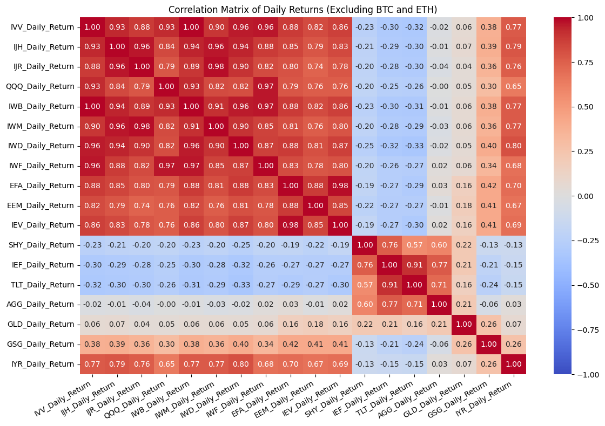
    


We'll now include the BTC and ETH data and recalculate the correlation matrix and heatmap. Keep in mind that the BTC and ETH data only goes back to 2015 and 2018 respectively, so the correlation matrix will be calculated using a shorter time period than the other assets.


```python
# Print the shape of the fund_data_daily_returns DataFrame to confirm that the rows with missing data have been dropped
print(f"Shape of fund_data_daily_returns: {fund_data_daily_returns_all.shape}")
print(f"Rows to drop due to missing data: {fund_data_daily_returns_all.dropna().shape}")

# Drop the NaN values
fund_data_daily_returns = fund_data_daily_returns_all.dropna()

# Calculate the correlation matrix of the daily returns
correlation_matrix = fund_data_daily_returns.corr()

display(correlation_matrix)
```

    Shape of fund_data_daily_returns: (8151, 20)
    Rows to drop due to missing data: (2127, 20)


<div>
<style scoped>
    .dataframe tbody tr th:only-of-type {
        vertical-align: middle;
    }

    .dataframe tbody tr th {
        vertical-align: top;
    }

    .dataframe thead th {
        text-align: right;
    }
</style>
<table border="1" class="dataframe">
  <thead>
    <tr style="text-align: right;">
      <th></th>
      <th>IVV_Daily_Return</th>
      <th>IJH_Daily_Return</th>
      <th>IJR_Daily_Return</th>
      <th>QQQ_Daily_Return</th>
      <th>IWB_Daily_Return</th>
      <th>IWM_Daily_Return</th>
      <th>IWD_Daily_Return</th>
      <th>IWF_Daily_Return</th>
      <th>EFA_Daily_Return</th>
      <th>EEM_Daily_Return</th>
      <th>IEV_Daily_Return</th>
      <th>SHY_Daily_Return</th>
      <th>IEF_Daily_Return</th>
      <th>TLT_Daily_Return</th>
      <th>AGG_Daily_Return</th>
      <th>GLD_Daily_Return</th>
      <th>GSG_Daily_Return</th>
      <th>IYR_Daily_Return</th>
      <th>BTC-USD_Daily_Return</th>
      <th>ETH-USD_Daily_Return</th>
    </tr>
  </thead>
  <tbody>
    <tr>
      <th>IVV_Daily_Return</th>
      <td>1.00</td>
      <td>0.90</td>
      <td>0.84</td>
      <td>0.94</td>
      <td>1.00</td>
      <td>0.87</td>
      <td>0.93</td>
      <td>0.96</td>
      <td>0.85</td>
      <td>0.76</td>
      <td>0.82</td>
      <td>-0.06</td>
      <td>-0.12</td>
      <td>-0.15</td>
      <td>0.14</td>
      <td>0.10</td>
      <td>0.31</td>
      <td>0.74</td>
      <td>0.30</td>
      <td>0.33</td>
    </tr>
    <tr>
      <th>IJH_Daily_Return</th>
      <td>0.90</td>
      <td>1.00</td>
      <td>0.96</td>
      <td>0.78</td>
      <td>0.91</td>
      <td>0.97</td>
      <td>0.94</td>
      <td>0.81</td>
      <td>0.84</td>
      <td>0.72</td>
      <td>0.81</td>
      <td>-0.05</td>
      <td>-0.12</td>
      <td>-0.14</td>
      <td>0.15</td>
      <td>0.10</td>
      <td>0.32</td>
      <td>0.78</td>
      <td>0.29</td>
      <td>0.31</td>
    </tr>
    <tr>
      <th>IJR_Daily_Return</th>
      <td>0.84</td>
      <td>0.96</td>
      <td>1.00</td>
      <td>0.71</td>
      <td>0.85</td>
      <td>0.98</td>
      <td>0.90</td>
      <td>0.74</td>
      <td>0.79</td>
      <td>0.67</td>
      <td>0.76</td>
      <td>-0.04</td>
      <td>-0.10</td>
      <td>-0.13</td>
      <td>0.15</td>
      <td>0.08</td>
      <td>0.31</td>
      <td>0.74</td>
      <td>0.28</td>
      <td>0.30</td>
    </tr>
    <tr>
      <th>QQQ_Daily_Return</th>
      <td>0.94</td>
      <td>0.78</td>
      <td>0.71</td>
      <td>1.00</td>
      <td>0.94</td>
      <td>0.77</td>
      <td>0.76</td>
      <td>0.99</td>
      <td>0.76</td>
      <td>0.73</td>
      <td>0.72</td>
      <td>-0.03</td>
      <td>-0.08</td>
      <td>-0.10</td>
      <td>0.14</td>
      <td>0.11</td>
      <td>0.24</td>
      <td>0.59</td>
      <td>0.31</td>
      <td>0.34</td>
    </tr>
    <tr>
      <th>IWB_Daily_Return</th>
      <td>1.00</td>
      <td>0.91</td>
      <td>0.85</td>
      <td>0.94</td>
      <td>1.00</td>
      <td>0.88</td>
      <td>0.93</td>
      <td>0.96</td>
      <td>0.85</td>
      <td>0.76</td>
      <td>0.83</td>
      <td>-0.05</td>
      <td>-0.12</td>
      <td>-0.14</td>
      <td>0.14</td>
      <td>0.10</td>
      <td>0.31</td>
      <td>0.75</td>
      <td>0.30</td>
      <td>0.33</td>
    </tr>
    <tr>
      <th>IWM_Daily_Return</th>
      <td>0.87</td>
      <td>0.97</td>
      <td>0.98</td>
      <td>0.77</td>
      <td>0.88</td>
      <td>1.00</td>
      <td>0.89</td>
      <td>0.80</td>
      <td>0.80</td>
      <td>0.71</td>
      <td>0.78</td>
      <td>-0.03</td>
      <td>-0.09</td>
      <td>-0.12</td>
      <td>0.16</td>
      <td>0.11</td>
      <td>0.31</td>
      <td>0.73</td>
      <td>0.31</td>
      <td>0.33</td>
    </tr>
    <tr>
      <th>IWD_Daily_Return</th>
      <td>0.93</td>
      <td>0.94</td>
      <td>0.90</td>
      <td>0.76</td>
      <td>0.93</td>
      <td>0.89</td>
      <td>1.00</td>
      <td>0.80</td>
      <td>0.85</td>
      <td>0.71</td>
      <td>0.83</td>
      <td>-0.06</td>
      <td>-0.14</td>
      <td>-0.18</td>
      <td>0.12</td>
      <td>0.10</td>
      <td>0.35</td>
      <td>0.81</td>
      <td>0.26</td>
      <td>0.28</td>
    </tr>
    <tr>
      <th>IWF_Daily_Return</th>
      <td>0.96</td>
      <td>0.81</td>
      <td>0.74</td>
      <td>0.99</td>
      <td>0.96</td>
      <td>0.80</td>
      <td>0.80</td>
      <td>1.00</td>
      <td>0.78</td>
      <td>0.73</td>
      <td>0.75</td>
      <td>-0.03</td>
      <td>-0.08</td>
      <td>-0.10</td>
      <td>0.15</td>
      <td>0.10</td>
      <td>0.25</td>
      <td>0.64</td>
      <td>0.31</td>
      <td>0.34</td>
    </tr>
    <tr>
      <th>EFA_Daily_Return</th>
      <td>0.85</td>
      <td>0.84</td>
      <td>0.79</td>
      <td>0.76</td>
      <td>0.85</td>
      <td>0.80</td>
      <td>0.85</td>
      <td>0.78</td>
      <td>1.00</td>
      <td>0.83</td>
      <td>0.98</td>
      <td>0.01</td>
      <td>-0.05</td>
      <td>-0.10</td>
      <td>0.20</td>
      <td>0.23</td>
      <td>0.30</td>
      <td>0.69</td>
      <td>0.29</td>
      <td>0.32</td>
    </tr>
    <tr>
      <th>EEM_Daily_Return</th>
      <td>0.76</td>
      <td>0.72</td>
      <td>0.67</td>
      <td>0.73</td>
      <td>0.76</td>
      <td>0.71</td>
      <td>0.71</td>
      <td>0.73</td>
      <td>0.83</td>
      <td>1.00</td>
      <td>0.80</td>
      <td>-0.01</td>
      <td>-0.07</td>
      <td>-0.10</td>
      <td>0.15</td>
      <td>0.25</td>
      <td>0.30</td>
      <td>0.56</td>
      <td>0.27</td>
      <td>0.31</td>
    </tr>
    <tr>
      <th>IEV_Daily_Return</th>
      <td>0.82</td>
      <td>0.81</td>
      <td>0.76</td>
      <td>0.72</td>
      <td>0.83</td>
      <td>0.78</td>
      <td>0.83</td>
      <td>0.75</td>
      <td>0.98</td>
      <td>0.80</td>
      <td>1.00</td>
      <td>0.01</td>
      <td>-0.06</td>
      <td>-0.10</td>
      <td>0.20</td>
      <td>0.22</td>
      <td>0.29</td>
      <td>0.68</td>
      <td>0.29</td>
      <td>0.31</td>
    </tr>
    <tr>
      <th>SHY_Daily_Return</th>
      <td>-0.06</td>
      <td>-0.05</td>
      <td>-0.04</td>
      <td>-0.03</td>
      <td>-0.05</td>
      <td>-0.03</td>
      <td>-0.06</td>
      <td>-0.03</td>
      <td>0.01</td>
      <td>-0.01</td>
      <td>0.01</td>
      <td>1.00</td>
      <td>0.81</td>
      <td>0.60</td>
      <td>0.73</td>
      <td>0.31</td>
      <td>-0.12</td>
      <td>0.13</td>
      <td>0.03</td>
      <td>0.02</td>
    </tr>
    <tr>
      <th>IEF_Daily_Return</th>
      <td>-0.12</td>
      <td>-0.12</td>
      <td>-0.10</td>
      <td>-0.08</td>
      <td>-0.12</td>
      <td>-0.09</td>
      <td>-0.14</td>
      <td>-0.08</td>
      <td>-0.05</td>
      <td>-0.07</td>
      <td>-0.06</td>
      <td>0.81</td>
      <td>1.00</td>
      <td>0.91</td>
      <td>0.89</td>
      <td>0.30</td>
      <td>-0.15</td>
      <td>0.09</td>
      <td>-0.01</td>
      <td>-0.01</td>
    </tr>
    <tr>
      <th>TLT_Daily_Return</th>
      <td>-0.15</td>
      <td>-0.14</td>
      <td>-0.13</td>
      <td>-0.10</td>
      <td>-0.14</td>
      <td>-0.12</td>
      <td>-0.18</td>
      <td>-0.10</td>
      <td>-0.10</td>
      <td>-0.10</td>
      <td>-0.10</td>
      <td>0.60</td>
      <td>0.91</td>
      <td>1.00</td>
      <td>0.84</td>
      <td>0.23</td>
      <td>-0.17</td>
      <td>0.04</td>
      <td>-0.01</td>
      <td>-0.01</td>
    </tr>
    <tr>
      <th>AGG_Daily_Return</th>
      <td>0.14</td>
      <td>0.15</td>
      <td>0.15</td>
      <td>0.14</td>
      <td>0.14</td>
      <td>0.16</td>
      <td>0.12</td>
      <td>0.15</td>
      <td>0.20</td>
      <td>0.15</td>
      <td>0.20</td>
      <td>0.73</td>
      <td>0.89</td>
      <td>0.84</td>
      <td>1.00</td>
      <td>0.30</td>
      <td>-0.02</td>
      <td>0.29</td>
      <td>0.12</td>
      <td>0.11</td>
    </tr>
    <tr>
      <th>GLD_Daily_Return</th>
      <td>0.10</td>
      <td>0.10</td>
      <td>0.08</td>
      <td>0.11</td>
      <td>0.10</td>
      <td>0.11</td>
      <td>0.10</td>
      <td>0.10</td>
      <td>0.23</td>
      <td>0.25</td>
      <td>0.22</td>
      <td>0.31</td>
      <td>0.30</td>
      <td>0.23</td>
      <td>0.30</td>
      <td>1.00</td>
      <td>0.20</td>
      <td>0.14</td>
      <td>0.11</td>
      <td>0.11</td>
    </tr>
    <tr>
      <th>GSG_Daily_Return</th>
      <td>0.31</td>
      <td>0.32</td>
      <td>0.31</td>
      <td>0.24</td>
      <td>0.31</td>
      <td>0.31</td>
      <td>0.35</td>
      <td>0.25</td>
      <td>0.30</td>
      <td>0.30</td>
      <td>0.29</td>
      <td>-0.12</td>
      <td>-0.15</td>
      <td>-0.17</td>
      <td>-0.02</td>
      <td>0.20</td>
      <td>1.00</td>
      <td>0.22</td>
      <td>0.09</td>
      <td>0.11</td>
    </tr>
    <tr>
      <th>IYR_Daily_Return</th>
      <td>0.74</td>
      <td>0.78</td>
      <td>0.74</td>
      <td>0.59</td>
      <td>0.75</td>
      <td>0.73</td>
      <td>0.81</td>
      <td>0.64</td>
      <td>0.69</td>
      <td>0.56</td>
      <td>0.68</td>
      <td>0.13</td>
      <td>0.09</td>
      <td>0.04</td>
      <td>0.29</td>
      <td>0.14</td>
      <td>0.22</td>
      <td>1.00</td>
      <td>0.20</td>
      <td>0.21</td>
    </tr>
    <tr>
      <th>BTC-USD_Daily_Return</th>
      <td>0.30</td>
      <td>0.29</td>
      <td>0.28</td>
      <td>0.31</td>
      <td>0.30</td>
      <td>0.31</td>
      <td>0.26</td>
      <td>0.31</td>
      <td>0.29</td>
      <td>0.27</td>
      <td>0.29</td>
      <td>0.03</td>
      <td>-0.01</td>
      <td>-0.01</td>
      <td>0.12</td>
      <td>0.11</td>
      <td>0.09</td>
      <td>0.20</td>
      <td>1.00</td>
      <td>0.80</td>
    </tr>
    <tr>
      <th>ETH-USD_Daily_Return</th>
      <td>0.33</td>
      <td>0.31</td>
      <td>0.30</td>
      <td>0.34</td>
      <td>0.33</td>
      <td>0.33</td>
      <td>0.28</td>
      <td>0.34</td>
      <td>0.32</td>
      <td>0.31</td>
      <td>0.31</td>
      <td>0.02</td>
      <td>-0.01</td>
      <td>-0.01</td>
      <td>0.11</td>
      <td>0.11</td>
      <td>0.11</td>
      <td>0.21</td>
      <td>0.80</td>
      <td>1.00</td>
    </tr>
  </tbody>
</table>
</div>


And then the heatmap:


```python
plot_heatmap(
    df=correlation_matrix,
    title="Correlation Matrix of Daily Returns (Including BTC and ETH)",
)
```


    
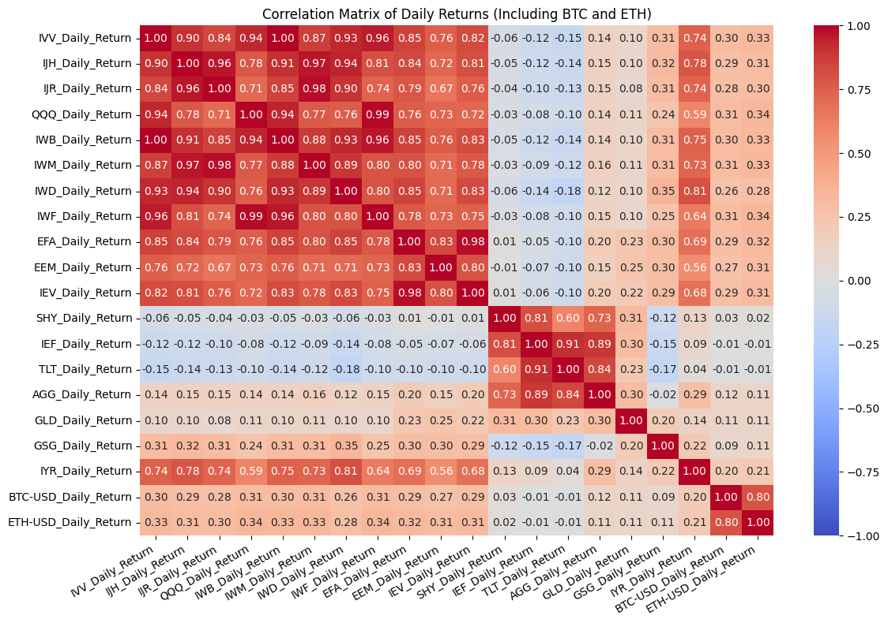
    


These are interesting results, but expected. The stock funds tend to have low correlations withe bond funds, the commodities don't really correlate with anything, etc. But we know that the correlations between these asset classes have changed over time, so let's take a look at how the correlations have evolved over time by calculating rolling correlations.

 ## Calculate Rolling Correlations

 Next, we will calculate the rolling correlations for several different periods:
 * 1 month
 * 3 month
 * 6 month
 * 1 year
 * 5 years
 * 10 years


```python
# Define rolling windows in trading days
rolling_windows = {
    '1mo': 21,     # 1 month (~21 trading days)
    '3mo': 63,     # 3 months (~63 trading days)
    '6mo': 126,    # 6 months (~126 trading days)
    '1y': 252,    # 1 year (~252 trading days)
    '5y': 1260,   # 5 years (~1260 trading days)
    '10y': 2520,  # 10 years (~2520 trading days)
}
```

Before we run all of these, let's take a quick look at each of the rolling windows to see if they are valid.


```python
temp_df = fund_data_daily_returns_all[["IVV_Daily_Return", "IJH_Daily_Return"]].dropna()

for window_name, window_size in rolling_windows.items():
    rolling_corr = temp_df["IVV_Daily_Return"].rolling(window=window_size).corr(temp_df["IJH_Daily_Return"])

    print(tickers_dict["IVV"])
    print(tickers_dict["IJH"])

    plot_time_series(
        df=rolling_corr.to_frame(name="IVV_IJH_Rolling_Correlation"),
        plot_start_date=None,
        plot_end_date=None,
        plot_columns=["IVV_IJH_Rolling_Correlation"],
        title=f"IVV vs IJH Rolling Correlation ({window_name} window)",
        x_label="Date",
        x_format="Year",
        x_tick_spacing=1,
        x_tick_rotation=30,
        y_label="Correlation",
        y_format="Decimal",
        y_format_decimal_places="Auto",
        y_tick_spacing="Auto",
        y_tick_rotation=0,
        grid=True,
        legend=False,
        export_plot=False,
        plot_file_name=None,
    )
```

    Large Cap US Stocks / S&P 500 -- IVV (iShares S&P 500 ETF)
    Mid Cap US Stocks / S&P MidCap 400 -- IJH (iShares S&P MidCap 400 ETF)


    
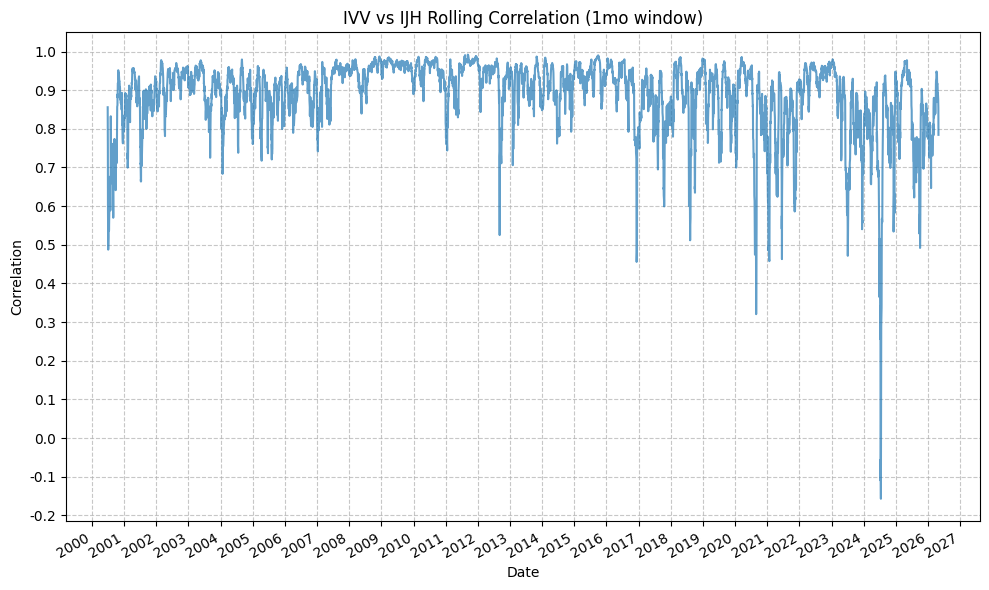
    


    Large Cap US Stocks / S&P 500 -- IVV (iShares S&P 500 ETF)
    Mid Cap US Stocks / S&P MidCap 400 -- IJH (iShares S&P MidCap 400 ETF)


    
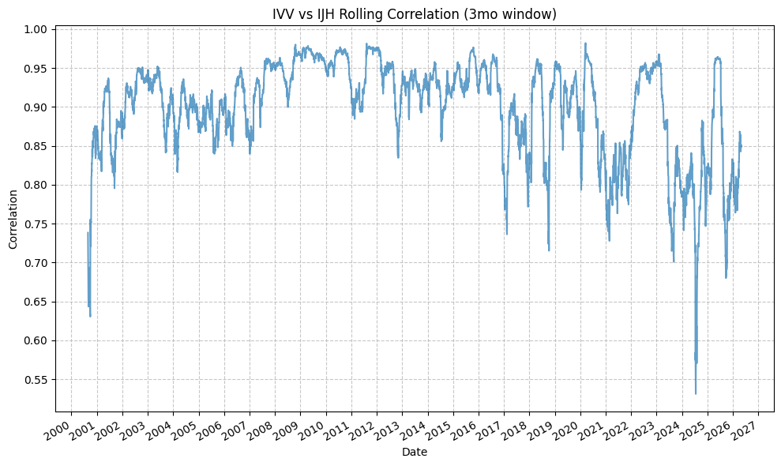
    


    Large Cap US Stocks / S&P 500 -- IVV (iShares S&P 500 ETF)
    Mid Cap US Stocks / S&P MidCap 400 -- IJH (iShares S&P MidCap 400 ETF)


    
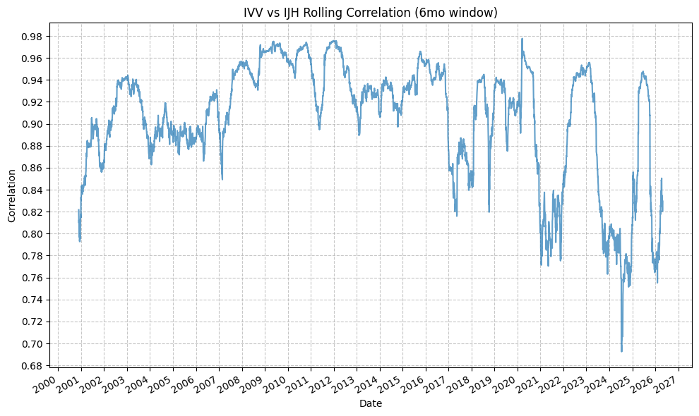
    


    Large Cap US Stocks / S&P 500 -- IVV (iShares S&P 500 ETF)
    Mid Cap US Stocks / S&P MidCap 400 -- IJH (iShares S&P MidCap 400 ETF)


    
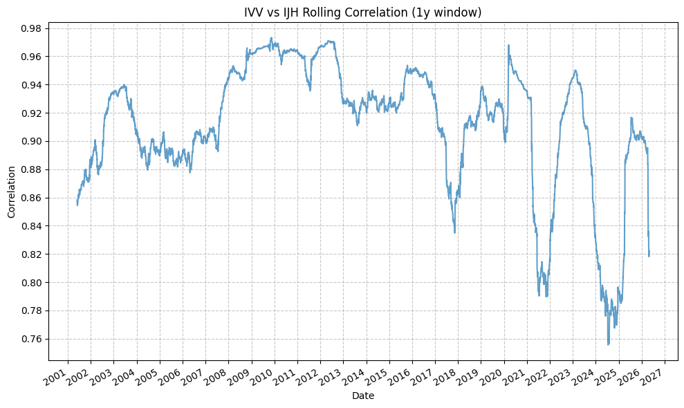
    


    Large Cap US Stocks / S&P 500 -- IVV (iShares S&P 500 ETF)
    Mid Cap US Stocks / S&P MidCap 400 -- IJH (iShares S&P MidCap 400 ETF)


    
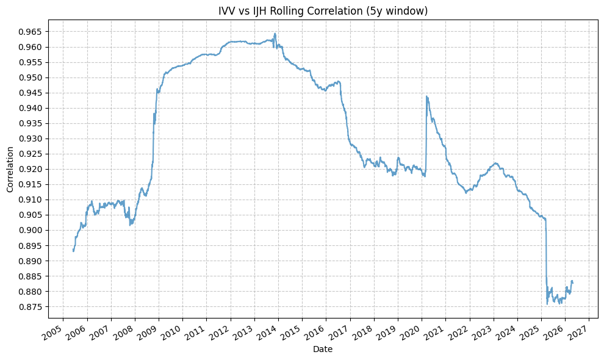
    


    Large Cap US Stocks / S&P 500 -- IVV (iShares S&P 500 ETF)
    Mid Cap US Stocks / S&P MidCap 400 -- IJH (iShares S&P MidCap 400 ETF)


    
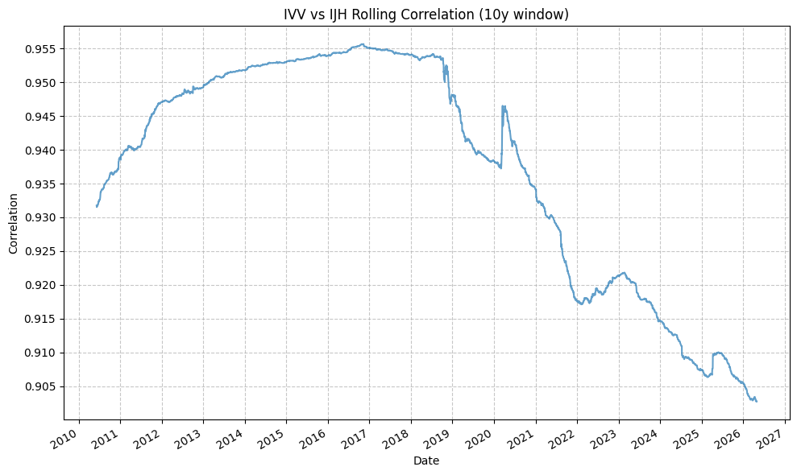
    


Some inital thoughts here:
* The 1 month and 3 month rolling windows are very noisy... it's going to be difficult to capture any kinds of meaningful trends with these short rolling windows - and these short-term movements are not the point of our investigation here.
* The 6 months and 1 year rolling windows look like they might be a bit better, but still pretty noisy. We'll keep both of those.
* The 5 year also looks potentially useful, but the 10 year is too long - it doesn't capture any of the medium-term movements that we are interested in. We'll keep the 5 year and drop the 10 year.

So that leaves us with:
* 6 months
* 1 year
* 5 years

We are essentially looking to capture market movements over the months-to-years time frame (from a macro perspective), so the 6 month, 1 year, and 5 year rolling windows are the most appropriate for this analysis.


```python
# Define rolling windows in trading days
rolling_windows = {
    '1mo': 21,     # 1 month (~21 trading days)
    '3mo': 63,     # 3 months (~63 trading days)
    '6mo': 126,    # 6 months (~126 trading days)
    '1y': 252,    # 1 year (~252 trading days)
    '5y': 1260,   # 5 years (~1260 trading days)
}
```


```python
from itertools import combinations

# Create temp list for tickers
temp_tickers = list(tickers_dict.keys())
pairs = list(combinations(temp_tickers, 2))

# Create empty dictionary to store rolling correlation results
rolling_correlation_results_no_crypto_dict = {}
rolling_correlation_results_no_crypto_df = pd.DataFrame()

for ticker1, ticker2 in pairs:
    try:
        temp_df = fund_data_daily_returns_no_crypto[[f"{ticker1}_Daily_Return", f"{ticker2}_Daily_Return"]].dropna()
    except Exception as e:
        print(f"Error creating temp_df for {ticker1} and {ticker2}: {e}")
        continue
        
    for window_name, window_size in rolling_windows.items():
        try:
            rolling_corr = temp_df[f"{ticker1}_Daily_Return"].rolling(window=window_size).corr(temp_df[f"{ticker2}_Daily_Return"])

            print(tickers_dict[f"{ticker1}"])
            print(tickers_dict[f"{ticker2}"])

            rolling_correlation_results_no_crypto_dict[f"{ticker1}_{ticker2}_{window_name}"] = rolling_corr
            rolling_correlation_results_no_crypto_df = pd.concat([rolling_correlation_results_no_crypto_df, rolling_corr.to_frame(name=f"{ticker1}_{ticker2}_{window_name}")], axis=1)

        except Exception as e:
            print(f"Error calculating rolling correlation for {ticker1} and {ticker2} with window {window_name}: {e}")
```

    Large Cap US Stocks / S&P 500 -- IVV (iShares S&P 500 ETF)
    Mid Cap US Stocks / S&P MidCap 400 -- IJH (iShares S&P MidCap 400 ETF)
    Large Cap US Stocks / S&P 500 -- IVV (iShares S&P 500 ETF)
    Mid Cap US Stocks / S&P MidCap 400 -- IJH (iShares S&P MidCap 400 ETF)
    Large Cap US Stocks / S&P 500 -- IVV (iShares S&P 500 ETF)
    Mid Cap US Stocks / S&P MidCap 400 -- IJH (iShares S&P MidCap 400 ETF)
    Large Cap US Stocks / S&P 500 -- IVV (iShares S&P 500 ETF)
    Mid Cap US Stocks / S&P MidCap 400 -- IJH (iShares S&P MidCap 400 ETF)
    Large Cap US Stocks / S&P 500 -- IVV (iShares S&P 500 ETF)
    Mid Cap US Stocks / S&P MidCap 400 -- IJH (iShares S&P MidCap 400 ETF)
    Large Cap US Stocks / S&P 500 -- IVV (iShares S&P 500 ETF)
    Small Cap US Stocks / S&P SmallCap 600 -- IJR (iShares S&P SmallCap 600 ETF)
    Large Cap US Stocks / S&P 500 -- IVV (iShares S&P 500 ETF)
    Small Cap US Stocks / S&P SmallCap 600 -- IJR (iShares S&P SmallCap 600 ETF)
    Large Cap US Stocks / S&P 500 -- IVV (iShares S&P 500 ETF)
    Small Cap US Stocks / S&P SmallCap 600 -- IJR (iShares S&P SmallCap 600 ETF)
    Large Cap US Stocks / S&P 500 -- IVV (iShares S&P 500 ETF)
    Small Cap US Stocks / S&P SmallCap 600 -- IJR (iShares S&P SmallCap 600 ETF)
    Large Cap US Stocks / S&P 500 -- IVV (iShares S&P 500 ETF)
    Small Cap US Stocks / S&P SmallCap 600 -- IJR (iShares S&P SmallCap 600 ETF)
    Large Cap US Stocks / S&P 500 -- IVV (iShares S&P 500 ETF)
    US Tech Stocks / Nasdaq 100 -- QQQ (Invesco QQQ Trust, Series 1)
    Large Cap US Stocks / S&P 500 -- IVV (iShares S&P 500 ETF)
    US Tech Stocks / Nasdaq 100 -- QQQ (Invesco QQQ Trust, Series 1)
    Large Cap US Stocks / S&P 500 -- IVV (iShares S&P 500 ETF)
    US Tech Stocks / Nasdaq 100 -- QQQ (Invesco QQQ Trust, Series 1)
    Large Cap US Stocks / S&P 500 -- IVV (iShares S&P 500 ETF)
    US Tech Stocks / Nasdaq 100 -- QQQ (Invesco QQQ Trust, Series 1)
    Large Cap US Stocks / S&P 500 -- IVV (iShares S&P 500 ETF)
    US Tech Stocks / Nasdaq 100 -- QQQ (Invesco QQQ Trust, Series 1)
    Large Cap US Stocks / S&P 500 -- IVV (iShares S&P 500 ETF)
    Large & Mid Cap US Stocks -- IWB (iShares Russell 1000 ETF)
    Large Cap US Stocks / S&P 500 -- IVV (iShares S&P 500 ETF)
    Large & Mid Cap US Stocks -- IWB (iShares Russell 1000 ETF)
    Large Cap US Stocks / S&P 500 -- IVV (iShares S&P 500 ETF)
    Large & Mid Cap US Stocks -- IWB (iShares Russell 1000 ETF)
    Large Cap US Stocks / S&P 500 -- IVV (iShares S&P 500 ETF)
    Large & Mid Cap US Stocks -- IWB (iShares Russell 1000 ETF)
    Large Cap US Stocks / S&P 500 -- IVV (iShares S&P 500 ETF)
    Large & Mid Cap US Stocks -- IWB (iShares Russell 1000 ETF)
    Large Cap US Stocks / S&P 500 -- IVV (iShares S&P 500 ETF)
    Small Cap US Stocks -- IWM (iShares Russell 2000 ETF)
    Large Cap US Stocks / S&P 500 -- IVV (iShares S&P 500 ETF)
    Small Cap US Stocks -- IWM (iShares Russell 2000 ETF)
    Large Cap US Stocks / S&P 500 -- IVV (iShares S&P 500 ETF)
    Small Cap US Stocks -- IWM (iShares Russell 2000 ETF)
    Large Cap US Stocks / S&P 500 -- IVV (iShares S&P 500 ETF)
    Small Cap US Stocks -- IWM (iShares Russell 2000 ETF)
    Large Cap US Stocks / S&P 500 -- IVV (iShares S&P 500 ETF)
    Small Cap US Stocks -- IWM (iShares Russell 2000 ETF)
    Large Cap US Stocks / S&P 500 -- IVV (iShares S&P 500 ETF)
    Large & Mid Cap US Value Stocks -- IWD (iShares Russell 1000 Value ETF)
    Large Cap US Stocks / S&P 500 -- IVV (iShares S&P 500 ETF)
    Large & Mid Cap US Value Stocks -- IWD (iShares Russell 1000 Value ETF)
    Large Cap US Stocks / S&P 500 -- IVV (iShares S&P 500 ETF)
    Large & Mid Cap US Value Stocks -- IWD (iShares Russell 1000 Value ETF)
    Large Cap US Stocks / S&P 500 -- IVV (iShares S&P 500 ETF)
    Large & Mid Cap US Value Stocks -- IWD (iShares Russell 1000 Value ETF)
    Large Cap US Stocks / S&P 500 -- IVV (iShares S&P 500 ETF)
    Large & Mid Cap US Value Stocks -- IWD (iShares Russell 1000 Value ETF)
    Large Cap US Stocks / S&P 500 -- IVV (iShares S&P 500 ETF)
    Large & Mid Cap US Growth Stocks -- IWF (iShares Russell 1000 Growth ETF)
    Large Cap US Stocks / S&P 500 -- IVV (iShares S&P 500 ETF)
    Large & Mid Cap US Growth Stocks -- IWF (iShares Russell 1000 Growth ETF)
    Large Cap US Stocks / S&P 500 -- IVV (iShares S&P 500 ETF)
    Large & Mid Cap US Growth Stocks -- IWF (iShares Russell 1000 Growth ETF)
    Large Cap US Stocks / S&P 500 -- IVV (iShares S&P 500 ETF)
    Large & Mid Cap US Growth Stocks -- IWF (iShares Russell 1000 Growth ETF)
    Large Cap US Stocks / S&P 500 -- IVV (iShares S&P 500 ETF)
    Large & Mid Cap US Growth Stocks -- IWF (iShares Russell 1000 Growth ETF)
    Large Cap US Stocks / S&P 500 -- IVV (iShares S&P 500 ETF)
    International Developed Market Stocks -- EFA (iShares MSCI EAFE ETF)
    Large Cap US Stocks / S&P 500 -- IVV (iShares S&P 500 ETF)
    International Developed Market Stocks -- EFA (iShares MSCI EAFE ETF)
    Large Cap US Stocks / S&P 500 -- IVV (iShares S&P 500 ETF)
    International Developed Market Stocks -- EFA (iShares MSCI EAFE ETF)
    Large Cap US Stocks / S&P 500 -- IVV (iShares S&P 500 ETF)
    International Developed Market Stocks -- EFA (iShares MSCI EAFE ETF)
    Large Cap US Stocks / S&P 500 -- IVV (iShares S&P 500 ETF)
    International Developed Market Stocks -- EFA (iShares MSCI EAFE ETF)
    Large Cap US Stocks / S&P 500 -- IVV (iShares S&P 500 ETF)
    Emerging Market Stocks -- EEM (iShares MSCI Emerging Markets ETF)
    Large Cap US Stocks / S&P 500 -- IVV (iShares S&P 500 ETF)
    Emerging Market Stocks -- EEM (iShares MSCI Emerging Markets ETF)
    Large Cap US Stocks / S&P 500 -- IVV (iShares S&P 500 ETF)
    Emerging Market Stocks -- EEM (iShares MSCI Emerging Markets ETF)
    Large Cap US Stocks / S&P 500 -- IVV (iShares S&P 500 ETF)
    Emerging Market Stocks -- EEM (iShares MSCI Emerging Markets ETF)
    Large Cap US Stocks / S&P 500 -- IVV (iShares S&P 500 ETF)
    Emerging Market Stocks -- EEM (iShares MSCI Emerging Markets ETF)
    Large Cap US Stocks / S&P 500 -- IVV (iShares S&P 500 ETF)
    European Stocks -- IEV (iShares S&P Europe 350 ETF)
    Large Cap US Stocks / S&P 500 -- IVV (iShares S&P 500 ETF)
    European Stocks -- IEV (iShares S&P Europe 350 ETF)
    Large Cap US Stocks / S&P 500 -- IVV (iShares S&P 500 ETF)
    European Stocks -- IEV (iShares S&P Europe 350 ETF)
    Large Cap US Stocks / S&P 500 -- IVV (iShares S&P 500 ETF)
    European Stocks -- IEV (iShares S&P Europe 350 ETF)
    Large Cap US Stocks / S&P 500 -- IVV (iShares S&P 500 ETF)
    European Stocks -- IEV (iShares S&P Europe 350 ETF)
    Large Cap US Stocks / S&P 500 -- IVV (iShares S&P 500 ETF)
    Short-Term US Treasuries -- SHY (iShares 1-3 Year Treasury Bond ETF)
    Large Cap US Stocks / S&P 500 -- IVV (iShares S&P 500 ETF)
    Short-Term US Treasuries -- SHY (iShares 1-3 Year Treasury Bond ETF)
    Large Cap US Stocks / S&P 500 -- IVV (iShares S&P 500 ETF)
    Short-Term US Treasuries -- SHY (iShares 1-3 Year Treasury Bond ETF)
    Large Cap US Stocks / S&P 500 -- IVV (iShares S&P 500 ETF)
    Short-Term US Treasuries -- SHY (iShares 1-3 Year Treasury Bond ETF)
    Large Cap US Stocks / S&P 500 -- IVV (iShares S&P 500 ETF)
    Short-Term US Treasuries -- SHY (iShares 1-3 Year Treasury Bond ETF)
    Large Cap US Stocks / S&P 500 -- IVV (iShares S&P 500 ETF)
    Medium-Term US Treasuries -- IEF (iShares 7-10 Year Treasury Bond ETF)
    Large Cap US Stocks / S&P 500 -- IVV (iShares S&P 500 ETF)
    Medium-Term US Treasuries -- IEF (iShares 7-10 Year Treasury Bond ETF)
    Large Cap US Stocks / S&P 500 -- IVV (iShares S&P 500 ETF)
    Medium-Term US Treasuries -- IEF (iShares 7-10 Year Treasury Bond ETF)
    Large Cap US Stocks / S&P 500 -- IVV (iShares S&P 500 ETF)
    Medium-Term US Treasuries -- IEF (iShares 7-10 Year Treasury Bond ETF)
    Large Cap US Stocks / S&P 500 -- IVV (iShares S&P 500 ETF)
    Medium-Term US Treasuries -- IEF (iShares 7-10 Year Treasury Bond ETF)
    Large Cap US Stocks / S&P 500 -- IVV (iShares S&P 500 ETF)
    Long-Term US Treasuries -- TLT (iShares 20+ Year Treasury Bond ETF)
    Large Cap US Stocks / S&P 500 -- IVV (iShares S&P 500 ETF)
    Long-Term US Treasuries -- TLT (iShares 20+ Year Treasury Bond ETF)
    Large Cap US Stocks / S&P 500 -- IVV (iShares S&P 500 ETF)
    Long-Term US Treasuries -- TLT (iShares 20+ Year Treasury Bond ETF)
    Large Cap US Stocks / S&P 500 -- IVV (iShares S&P 500 ETF)
    Long-Term US Treasuries -- TLT (iShares 20+ Year Treasury Bond ETF)
    Large Cap US Stocks / S&P 500 -- IVV (iShares S&P 500 ETF)
    Long-Term US Treasuries -- TLT (iShares 20+ Year Treasury Bond ETF)
    Large Cap US Stocks / S&P 500 -- IVV (iShares S&P 500 ETF)
    Aggregate Bonds -- AGG (iShares Core U.S. Aggregate Bond ETF)
    Large Cap US Stocks / S&P 500 -- IVV (iShares S&P 500 ETF)
    Aggregate Bonds -- AGG (iShares Core U.S. Aggregate Bond ETF)
    Large Cap US Stocks / S&P 500 -- IVV (iShares S&P 500 ETF)
    Aggregate Bonds -- AGG (iShares Core U.S. Aggregate Bond ETF)
    Large Cap US Stocks / S&P 500 -- IVV (iShares S&P 500 ETF)
    Aggregate Bonds -- AGG (iShares Core U.S. Aggregate Bond ETF)
    Large Cap US Stocks / S&P 500 -- IVV (iShares S&P 500 ETF)
    Aggregate Bonds -- AGG (iShares Core U.S. Aggregate Bond ETF)
    Large Cap US Stocks / S&P 500 -- IVV (iShares S&P 500 ETF)
    Gold -- GLD (SPDR Gold Shares)
    Large Cap US Stocks / S&P 500 -- IVV (iShares S&P 500 ETF)
    Gold -- GLD (SPDR Gold Shares)
    Large Cap US Stocks / S&P 500 -- IVV (iShares S&P 500 ETF)
    Gold -- GLD (SPDR Gold Shares)
    Large Cap US Stocks / S&P 500 -- IVV (iShares S&P 500 ETF)
    Gold -- GLD (SPDR Gold Shares)
    Large Cap US Stocks / S&P 500 -- IVV (iShares S&P 500 ETF)
    Gold -- GLD (SPDR Gold Shares)
    Large Cap US Stocks / S&P 500 -- IVV (iShares S&P 500 ETF)
    Commodities -- GSG (iShares S&P GSCI Commodity-Indexed Trust)
    Large Cap US Stocks / S&P 500 -- IVV (iShares S&P 500 ETF)
    Commodities -- GSG (iShares S&P GSCI Commodity-Indexed Trust)
    Large Cap US Stocks / S&P 500 -- IVV (iShares S&P 500 ETF)
    Commodities -- GSG (iShares S&P GSCI Commodity-Indexed Trust)
    Large Cap US Stocks / S&P 500 -- IVV (iShares S&P 500 ETF)
    Commodities -- GSG (iShares S&P GSCI Commodity-Indexed Trust)
    Large Cap US Stocks / S&P 500 -- IVV (iShares S&P 500 ETF)
    Commodities -- GSG (iShares S&P GSCI Commodity-Indexed Trust)
    Large Cap US Stocks / S&P 500 -- IVV (iShares S&P 500 ETF)
    Real Estate -- IYR (iShares U.S. Real Estate ETF)
    Large Cap US Stocks / S&P 500 -- IVV (iShares S&P 500 ETF)
    Real Estate -- IYR (iShares U.S. Real Estate ETF)
    Large Cap US Stocks / S&P 500 -- IVV (iShares S&P 500 ETF)
    Real Estate -- IYR (iShares U.S. Real Estate ETF)
    Large Cap US Stocks / S&P 500 -- IVV (iShares S&P 500 ETF)
    Real Estate -- IYR (iShares U.S. Real Estate ETF)
    Large Cap US Stocks / S&P 500 -- IVV (iShares S&P 500 ETF)
    Real Estate -- IYR (iShares U.S. Real Estate ETF)
    Error creating temp_df for IVV and BTC-USD: "['BTC-USD_Daily_Return'] not in index"
    Error creating temp_df for IVV and ETH-USD: "['ETH-USD_Daily_Return'] not in index"
    Mid Cap US Stocks / S&P MidCap 400 -- IJH (iShares S&P MidCap 400 ETF)
    Small Cap US Stocks / S&P SmallCap 600 -- IJR (iShares S&P SmallCap 600 ETF)
    Mid Cap US Stocks / S&P MidCap 400 -- IJH (iShares S&P MidCap 400 ETF)
    Small Cap US Stocks / S&P SmallCap 600 -- IJR (iShares S&P SmallCap 600 ETF)
    Mid Cap US Stocks / S&P MidCap 400 -- IJH (iShares S&P MidCap 400 ETF)
    Small Cap US Stocks / S&P SmallCap 600 -- IJR (iShares S&P SmallCap 600 ETF)
    Mid Cap US Stocks / S&P MidCap 400 -- IJH (iShares S&P MidCap 400 ETF)
    Small Cap US Stocks / S&P SmallCap 600 -- IJR (iShares S&P SmallCap 600 ETF)
    Mid Cap US Stocks / S&P MidCap 400 -- IJH (iShares S&P MidCap 400 ETF)
    Small Cap US Stocks / S&P SmallCap 600 -- IJR (iShares S&P SmallCap 600 ETF)
    Mid Cap US Stocks / S&P MidCap 400 -- IJH (iShares S&P MidCap 400 ETF)
    US Tech Stocks / Nasdaq 100 -- QQQ (Invesco QQQ Trust, Series 1)
    Mid Cap US Stocks / S&P MidCap 400 -- IJH (iShares S&P MidCap 400 ETF)
    US Tech Stocks / Nasdaq 100 -- QQQ (Invesco QQQ Trust, Series 1)
    Mid Cap US Stocks / S&P MidCap 400 -- IJH (iShares S&P MidCap 400 ETF)
    US Tech Stocks / Nasdaq 100 -- QQQ (Invesco QQQ Trust, Series 1)
    Mid Cap US Stocks / S&P MidCap 400 -- IJH (iShares S&P MidCap 400 ETF)
    US Tech Stocks / Nasdaq 100 -- QQQ (Invesco QQQ Trust, Series 1)
    Mid Cap US Stocks / S&P MidCap 400 -- IJH (iShares S&P MidCap 400 ETF)
    US Tech Stocks / Nasdaq 100 -- QQQ (Invesco QQQ Trust, Series 1)
    Mid Cap US Stocks / S&P MidCap 400 -- IJH (iShares S&P MidCap 400 ETF)
    Large & Mid Cap US Stocks -- IWB (iShares Russell 1000 ETF)
    Mid Cap US Stocks / S&P MidCap 400 -- IJH (iShares S&P MidCap 400 ETF)
    Large & Mid Cap US Stocks -- IWB (iShares Russell 1000 ETF)
    Mid Cap US Stocks / S&P MidCap 400 -- IJH (iShares S&P MidCap 400 ETF)
    Large & Mid Cap US Stocks -- IWB (iShares Russell 1000 ETF)
    Mid Cap US Stocks / S&P MidCap 400 -- IJH (iShares S&P MidCap 400 ETF)
    Large & Mid Cap US Stocks -- IWB (iShares Russell 1000 ETF)
    Mid Cap US Stocks / S&P MidCap 400 -- IJH (iShares S&P MidCap 400 ETF)
    Large & Mid Cap US Stocks -- IWB (iShares Russell 1000 ETF)
    Mid Cap US Stocks / S&P MidCap 400 -- IJH (iShares S&P MidCap 400 ETF)
    Small Cap US Stocks -- IWM (iShares Russell 2000 ETF)
    Mid Cap US Stocks / S&P MidCap 400 -- IJH (iShares S&P MidCap 400 ETF)
    Small Cap US Stocks -- IWM (iShares Russell 2000 ETF)


    Mid Cap US Stocks / S&P MidCap 400 -- IJH (iShares S&P MidCap 400 ETF)
    Small Cap US Stocks -- IWM (iShares Russell 2000 ETF)
    Mid Cap US Stocks / S&P MidCap 400 -- IJH (iShares S&P MidCap 400 ETF)
    Small Cap US Stocks -- IWM (iShares Russell 2000 ETF)
    Mid Cap US Stocks / S&P MidCap 400 -- IJH (iShares S&P MidCap 400 ETF)
    Small Cap US Stocks -- IWM (iShares Russell 2000 ETF)
    Mid Cap US Stocks / S&P MidCap 400 -- IJH (iShares S&P MidCap 400 ETF)
    Large & Mid Cap US Value Stocks -- IWD (iShares Russell 1000 Value ETF)
    Mid Cap US Stocks / S&P MidCap 400 -- IJH (iShares S&P MidCap 400 ETF)
    Large & Mid Cap US Value Stocks -- IWD (iShares Russell 1000 Value ETF)
    Mid Cap US Stocks / S&P MidCap 400 -- IJH (iShares S&P MidCap 400 ETF)
    Large & Mid Cap US Value Stocks -- IWD (iShares Russell 1000 Value ETF)
    Mid Cap US Stocks / S&P MidCap 400 -- IJH (iShares S&P MidCap 400 ETF)
    Large & Mid Cap US Value Stocks -- IWD (iShares Russell 1000 Value ETF)
    Mid Cap US Stocks / S&P MidCap 400 -- IJH (iShares S&P MidCap 400 ETF)
    Large & Mid Cap US Value Stocks -- IWD (iShares Russell 1000 Value ETF)
    Mid Cap US Stocks / S&P MidCap 400 -- IJH (iShares S&P MidCap 400 ETF)
    Large & Mid Cap US Growth Stocks -- IWF (iShares Russell 1000 Growth ETF)
    Mid Cap US Stocks / S&P MidCap 400 -- IJH (iShares S&P MidCap 400 ETF)
    Large & Mid Cap US Growth Stocks -- IWF (iShares Russell 1000 Growth ETF)
    Mid Cap US Stocks / S&P MidCap 400 -- IJH (iShares S&P MidCap 400 ETF)
    Large & Mid Cap US Growth Stocks -- IWF (iShares Russell 1000 Growth ETF)
    Mid Cap US Stocks / S&P MidCap 400 -- IJH (iShares S&P MidCap 400 ETF)
    Large & Mid Cap US Growth Stocks -- IWF (iShares Russell 1000 Growth ETF)
    Mid Cap US Stocks / S&P MidCap 400 -- IJH (iShares S&P MidCap 400 ETF)
    Large & Mid Cap US Growth Stocks -- IWF (iShares Russell 1000 Growth ETF)
    Mid Cap US Stocks / S&P MidCap 400 -- IJH (iShares S&P MidCap 400 ETF)
    International Developed Market Stocks -- EFA (iShares MSCI EAFE ETF)
    Mid Cap US Stocks / S&P MidCap 400 -- IJH (iShares S&P MidCap 400 ETF)
    International Developed Market Stocks -- EFA (iShares MSCI EAFE ETF)
    Mid Cap US Stocks / S&P MidCap 400 -- IJH (iShares S&P MidCap 400 ETF)
    International Developed Market Stocks -- EFA (iShares MSCI EAFE ETF)
    Mid Cap US Stocks / S&P MidCap 400 -- IJH (iShares S&P MidCap 400 ETF)
    International Developed Market Stocks -- EFA (iShares MSCI EAFE ETF)
    Mid Cap US Stocks / S&P MidCap 400 -- IJH (iShares S&P MidCap 400 ETF)
    International Developed Market Stocks -- EFA (iShares MSCI EAFE ETF)
    Mid Cap US Stocks / S&P MidCap 400 -- IJH (iShares S&P MidCap 400 ETF)
    Emerging Market Stocks -- EEM (iShares MSCI Emerging Markets ETF)
    Mid Cap US Stocks / S&P MidCap 400 -- IJH (iShares S&P MidCap 400 ETF)
    Emerging Market Stocks -- EEM (iShares MSCI Emerging Markets ETF)
    Mid Cap US Stocks / S&P MidCap 400 -- IJH (iShares S&P MidCap 400 ETF)
    Emerging Market Stocks -- EEM (iShares MSCI Emerging Markets ETF)
    Mid Cap US Stocks / S&P MidCap 400 -- IJH (iShares S&P MidCap 400 ETF)
    Emerging Market Stocks -- EEM (iShares MSCI Emerging Markets ETF)
    Mid Cap US Stocks / S&P MidCap 400 -- IJH (iShares S&P MidCap 400 ETF)
    Emerging Market Stocks -- EEM (iShares MSCI Emerging Markets ETF)
    Mid Cap US Stocks / S&P MidCap 400 -- IJH (iShares S&P MidCap 400 ETF)
    European Stocks -- IEV (iShares S&P Europe 350 ETF)
    Mid Cap US Stocks / S&P MidCap 400 -- IJH (iShares S&P MidCap 400 ETF)
    European Stocks -- IEV (iShares S&P Europe 350 ETF)
    Mid Cap US Stocks / S&P MidCap 400 -- IJH (iShares S&P MidCap 400 ETF)
    European Stocks -- IEV (iShares S&P Europe 350 ETF)
    Mid Cap US Stocks / S&P MidCap 400 -- IJH (iShares S&P MidCap 400 ETF)
    European Stocks -- IEV (iShares S&P Europe 350 ETF)
    Mid Cap US Stocks / S&P MidCap 400 -- IJH (iShares S&P MidCap 400 ETF)
    European Stocks -- IEV (iShares S&P Europe 350 ETF)
    Mid Cap US Stocks / S&P MidCap 400 -- IJH (iShares S&P MidCap 400 ETF)
    Short-Term US Treasuries -- SHY (iShares 1-3 Year Treasury Bond ETF)
    Mid Cap US Stocks / S&P MidCap 400 -- IJH (iShares S&P MidCap 400 ETF)
    Short-Term US Treasuries -- SHY (iShares 1-3 Year Treasury Bond ETF)
    Mid Cap US Stocks / S&P MidCap 400 -- IJH (iShares S&P MidCap 400 ETF)
    Short-Term US Treasuries -- SHY (iShares 1-3 Year Treasury Bond ETF)
    Mid Cap US Stocks / S&P MidCap 400 -- IJH (iShares S&P MidCap 400 ETF)
    Short-Term US Treasuries -- SHY (iShares 1-3 Year Treasury Bond ETF)
    Mid Cap US Stocks / S&P MidCap 400 -- IJH (iShares S&P MidCap 400 ETF)
    Short-Term US Treasuries -- SHY (iShares 1-3 Year Treasury Bond ETF)
    Mid Cap US Stocks / S&P MidCap 400 -- IJH (iShares S&P MidCap 400 ETF)
    Medium-Term US Treasuries -- IEF (iShares 7-10 Year Treasury Bond ETF)
    Mid Cap US Stocks / S&P MidCap 400 -- IJH (iShares S&P MidCap 400 ETF)
    Medium-Term US Treasuries -- IEF (iShares 7-10 Year Treasury Bond ETF)
    Mid Cap US Stocks / S&P MidCap 400 -- IJH (iShares S&P MidCap 400 ETF)
    Medium-Term US Treasuries -- IEF (iShares 7-10 Year Treasury Bond ETF)
    Mid Cap US Stocks / S&P MidCap 400 -- IJH (iShares S&P MidCap 400 ETF)
    Medium-Term US Treasuries -- IEF (iShares 7-10 Year Treasury Bond ETF)
    Mid Cap US Stocks / S&P MidCap 400 -- IJH (iShares S&P MidCap 400 ETF)
    Medium-Term US Treasuries -- IEF (iShares 7-10 Year Treasury Bond ETF)
    Mid Cap US Stocks / S&P MidCap 400 -- IJH (iShares S&P MidCap 400 ETF)
    Long-Term US Treasuries -- TLT (iShares 20+ Year Treasury Bond ETF)
    Mid Cap US Stocks / S&P MidCap 400 -- IJH (iShares S&P MidCap 400 ETF)
    Long-Term US Treasuries -- TLT (iShares 20+ Year Treasury Bond ETF)
    Mid Cap US Stocks / S&P MidCap 400 -- IJH (iShares S&P MidCap 400 ETF)
    Long-Term US Treasuries -- TLT (iShares 20+ Year Treasury Bond ETF)
    Mid Cap US Stocks / S&P MidCap 400 -- IJH (iShares S&P MidCap 400 ETF)
    Long-Term US Treasuries -- TLT (iShares 20+ Year Treasury Bond ETF)
    Mid Cap US Stocks / S&P MidCap 400 -- IJH (iShares S&P MidCap 400 ETF)
    Long-Term US Treasuries -- TLT (iShares 20+ Year Treasury Bond ETF)
    Mid Cap US Stocks / S&P MidCap 400 -- IJH (iShares S&P MidCap 400 ETF)
    Aggregate Bonds -- AGG (iShares Core U.S. Aggregate Bond ETF)
    Mid Cap US Stocks / S&P MidCap 400 -- IJH (iShares S&P MidCap 400 ETF)
    Aggregate Bonds -- AGG (iShares Core U.S. Aggregate Bond ETF)


    Mid Cap US Stocks / S&P MidCap 400 -- IJH (iShares S&P MidCap 400 ETF)
    Aggregate Bonds -- AGG (iShares Core U.S. Aggregate Bond ETF)
    Mid Cap US Stocks / S&P MidCap 400 -- IJH (iShares S&P MidCap 400 ETF)
    Aggregate Bonds -- AGG (iShares Core U.S. Aggregate Bond ETF)
    Mid Cap US Stocks / S&P MidCap 400 -- IJH (iShares S&P MidCap 400 ETF)
    Aggregate Bonds -- AGG (iShares Core U.S. Aggregate Bond ETF)
    Mid Cap US Stocks / S&P MidCap 400 -- IJH (iShares S&P MidCap 400 ETF)
    Gold -- GLD (SPDR Gold Shares)
    Mid Cap US Stocks / S&P MidCap 400 -- IJH (iShares S&P MidCap 400 ETF)
    Gold -- GLD (SPDR Gold Shares)
    Mid Cap US Stocks / S&P MidCap 400 -- IJH (iShares S&P MidCap 400 ETF)
    Gold -- GLD (SPDR Gold Shares)
    Mid Cap US Stocks / S&P MidCap 400 -- IJH (iShares S&P MidCap 400 ETF)
    Gold -- GLD (SPDR Gold Shares)
    Mid Cap US Stocks / S&P MidCap 400 -- IJH (iShares S&P MidCap 400 ETF)
    Gold -- GLD (SPDR Gold Shares)
    Mid Cap US Stocks / S&P MidCap 400 -- IJH (iShares S&P MidCap 400 ETF)
    Commodities -- GSG (iShares S&P GSCI Commodity-Indexed Trust)
    Mid Cap US Stocks / S&P MidCap 400 -- IJH (iShares S&P MidCap 400 ETF)
    Commodities -- GSG (iShares S&P GSCI Commodity-Indexed Trust)
    Mid Cap US Stocks / S&P MidCap 400 -- IJH (iShares S&P MidCap 400 ETF)
    Commodities -- GSG (iShares S&P GSCI Commodity-Indexed Trust)
    Mid Cap US Stocks / S&P MidCap 400 -- IJH (iShares S&P MidCap 400 ETF)
    Commodities -- GSG (iShares S&P GSCI Commodity-Indexed Trust)
    Mid Cap US Stocks / S&P MidCap 400 -- IJH (iShares S&P MidCap 400 ETF)
    Commodities -- GSG (iShares S&P GSCI Commodity-Indexed Trust)
    Mid Cap US Stocks / S&P MidCap 400 -- IJH (iShares S&P MidCap 400 ETF)
    Real Estate -- IYR (iShares U.S. Real Estate ETF)
    Mid Cap US Stocks / S&P MidCap 400 -- IJH (iShares S&P MidCap 400 ETF)
    Real Estate -- IYR (iShares U.S. Real Estate ETF)
    Mid Cap US Stocks / S&P MidCap 400 -- IJH (iShares S&P MidCap 400 ETF)
    Real Estate -- IYR (iShares U.S. Real Estate ETF)
    Mid Cap US Stocks / S&P MidCap 400 -- IJH (iShares S&P MidCap 400 ETF)
    Real Estate -- IYR (iShares U.S. Real Estate ETF)
    Mid Cap US Stocks / S&P MidCap 400 -- IJH (iShares S&P MidCap 400 ETF)
    Real Estate -- IYR (iShares U.S. Real Estate ETF)
    Error creating temp_df for IJH and BTC-USD: "['BTC-USD_Daily_Return'] not in index"
    Error creating temp_df for IJH and ETH-USD: "['ETH-USD_Daily_Return'] not in index"
    Small Cap US Stocks / S&P SmallCap 600 -- IJR (iShares S&P SmallCap 600 ETF)
    US Tech Stocks / Nasdaq 100 -- QQQ (Invesco QQQ Trust, Series 1)
    Small Cap US Stocks / S&P SmallCap 600 -- IJR (iShares S&P SmallCap 600 ETF)
    US Tech Stocks / Nasdaq 100 -- QQQ (Invesco QQQ Trust, Series 1)
    Small Cap US Stocks / S&P SmallCap 600 -- IJR (iShares S&P SmallCap 600 ETF)
    US Tech Stocks / Nasdaq 100 -- QQQ (Invesco QQQ Trust, Series 1)
    Small Cap US Stocks / S&P SmallCap 600 -- IJR (iShares S&P SmallCap 600 ETF)
    US Tech Stocks / Nasdaq 100 -- QQQ (Invesco QQQ Trust, Series 1)
    Small Cap US Stocks / S&P SmallCap 600 -- IJR (iShares S&P SmallCap 600 ETF)
    US Tech Stocks / Nasdaq 100 -- QQQ (Invesco QQQ Trust, Series 1)
    Small Cap US Stocks / S&P SmallCap 600 -- IJR (iShares S&P SmallCap 600 ETF)
    Large & Mid Cap US Stocks -- IWB (iShares Russell 1000 ETF)
    Small Cap US Stocks / S&P SmallCap 600 -- IJR (iShares S&P SmallCap 600 ETF)
    Large & Mid Cap US Stocks -- IWB (iShares Russell 1000 ETF)
    Small Cap US Stocks / S&P SmallCap 600 -- IJR (iShares S&P SmallCap 600 ETF)
    Large & Mid Cap US Stocks -- IWB (iShares Russell 1000 ETF)
    Small Cap US Stocks / S&P SmallCap 600 -- IJR (iShares S&P SmallCap 600 ETF)
    Large & Mid Cap US Stocks -- IWB (iShares Russell 1000 ETF)
    Small Cap US Stocks / S&P SmallCap 600 -- IJR (iShares S&P SmallCap 600 ETF)
    Large & Mid Cap US Stocks -- IWB (iShares Russell 1000 ETF)
    Small Cap US Stocks / S&P SmallCap 600 -- IJR (iShares S&P SmallCap 600 ETF)
    Small Cap US Stocks -- IWM (iShares Russell 2000 ETF)
    Small Cap US Stocks / S&P SmallCap 600 -- IJR (iShares S&P SmallCap 600 ETF)
    Small Cap US Stocks -- IWM (iShares Russell 2000 ETF)
    Small Cap US Stocks / S&P SmallCap 600 -- IJR (iShares S&P SmallCap 600 ETF)
    Small Cap US Stocks -- IWM (iShares Russell 2000 ETF)
    Small Cap US Stocks / S&P SmallCap 600 -- IJR (iShares S&P SmallCap 600 ETF)
    Small Cap US Stocks -- IWM (iShares Russell 2000 ETF)
    Small Cap US Stocks / S&P SmallCap 600 -- IJR (iShares S&P SmallCap 600 ETF)
    Small Cap US Stocks -- IWM (iShares Russell 2000 ETF)
    Small Cap US Stocks / S&P SmallCap 600 -- IJR (iShares S&P SmallCap 600 ETF)
    Large & Mid Cap US Value Stocks -- IWD (iShares Russell 1000 Value ETF)
    Small Cap US Stocks / S&P SmallCap 600 -- IJR (iShares S&P SmallCap 600 ETF)
    Large & Mid Cap US Value Stocks -- IWD (iShares Russell 1000 Value ETF)
    Small Cap US Stocks / S&P SmallCap 600 -- IJR (iShares S&P SmallCap 600 ETF)
    Large & Mid Cap US Value Stocks -- IWD (iShares Russell 1000 Value ETF)
    Small Cap US Stocks / S&P SmallCap 600 -- IJR (iShares S&P SmallCap 600 ETF)
    Large & Mid Cap US Value Stocks -- IWD (iShares Russell 1000 Value ETF)
    Small Cap US Stocks / S&P SmallCap 600 -- IJR (iShares S&P SmallCap 600 ETF)
    Large & Mid Cap US Value Stocks -- IWD (iShares Russell 1000 Value ETF)
    Small Cap US Stocks / S&P SmallCap 600 -- IJR (iShares S&P SmallCap 600 ETF)
    Large & Mid Cap US Growth Stocks -- IWF (iShares Russell 1000 Growth ETF)
    Small Cap US Stocks / S&P SmallCap 600 -- IJR (iShares S&P SmallCap 600 ETF)
    Large & Mid Cap US Growth Stocks -- IWF (iShares Russell 1000 Growth ETF)


    Small Cap US Stocks / S&P SmallCap 600 -- IJR (iShares S&P SmallCap 600 ETF)
    Large & Mid Cap US Growth Stocks -- IWF (iShares Russell 1000 Growth ETF)
    Small Cap US Stocks / S&P SmallCap 600 -- IJR (iShares S&P SmallCap 600 ETF)
    Large & Mid Cap US Growth Stocks -- IWF (iShares Russell 1000 Growth ETF)
    Small Cap US Stocks / S&P SmallCap 600 -- IJR (iShares S&P SmallCap 600 ETF)
    Large & Mid Cap US Growth Stocks -- IWF (iShares Russell 1000 Growth ETF)
    Small Cap US Stocks / S&P SmallCap 600 -- IJR (iShares S&P SmallCap 600 ETF)
    International Developed Market Stocks -- EFA (iShares MSCI EAFE ETF)
    Small Cap US Stocks / S&P SmallCap 600 -- IJR (iShares S&P SmallCap 600 ETF)
    International Developed Market Stocks -- EFA (iShares MSCI EAFE ETF)
    Small Cap US Stocks / S&P SmallCap 600 -- IJR (iShares S&P SmallCap 600 ETF)
    International Developed Market Stocks -- EFA (iShares MSCI EAFE ETF)
    Small Cap US Stocks / S&P SmallCap 600 -- IJR (iShares S&P SmallCap 600 ETF)
    International Developed Market Stocks -- EFA (iShares MSCI EAFE ETF)
    Small Cap US Stocks / S&P SmallCap 600 -- IJR (iShares S&P SmallCap 600 ETF)
    International Developed Market Stocks -- EFA (iShares MSCI EAFE ETF)
    Small Cap US Stocks / S&P SmallCap 600 -- IJR (iShares S&P SmallCap 600 ETF)
    Emerging Market Stocks -- EEM (iShares MSCI Emerging Markets ETF)
    Small Cap US Stocks / S&P SmallCap 600 -- IJR (iShares S&P SmallCap 600 ETF)
    Emerging Market Stocks -- EEM (iShares MSCI Emerging Markets ETF)
    Small Cap US Stocks / S&P SmallCap 600 -- IJR (iShares S&P SmallCap 600 ETF)
    Emerging Market Stocks -- EEM (iShares MSCI Emerging Markets ETF)
    Small Cap US Stocks / S&P SmallCap 600 -- IJR (iShares S&P SmallCap 600 ETF)
    Emerging Market Stocks -- EEM (iShares MSCI Emerging Markets ETF)
    Small Cap US Stocks / S&P SmallCap 600 -- IJR (iShares S&P SmallCap 600 ETF)
    Emerging Market Stocks -- EEM (iShares MSCI Emerging Markets ETF)
    Small Cap US Stocks / S&P SmallCap 600 -- IJR (iShares S&P SmallCap 600 ETF)
    European Stocks -- IEV (iShares S&P Europe 350 ETF)
    Small Cap US Stocks / S&P SmallCap 600 -- IJR (iShares S&P SmallCap 600 ETF)
    European Stocks -- IEV (iShares S&P Europe 350 ETF)
    Small Cap US Stocks / S&P SmallCap 600 -- IJR (iShares S&P SmallCap 600 ETF)
    European Stocks -- IEV (iShares S&P Europe 350 ETF)
    Small Cap US Stocks / S&P SmallCap 600 -- IJR (iShares S&P SmallCap 600 ETF)
    European Stocks -- IEV (iShares S&P Europe 350 ETF)
    Small Cap US Stocks / S&P SmallCap 600 -- IJR (iShares S&P SmallCap 600 ETF)
    European Stocks -- IEV (iShares S&P Europe 350 ETF)
    Small Cap US Stocks / S&P SmallCap 600 -- IJR (iShares S&P SmallCap 600 ETF)
    Short-Term US Treasuries -- SHY (iShares 1-3 Year Treasury Bond ETF)
    Small Cap US Stocks / S&P SmallCap 600 -- IJR (iShares S&P SmallCap 600 ETF)
    Short-Term US Treasuries -- SHY (iShares 1-3 Year Treasury Bond ETF)
    Small Cap US Stocks / S&P SmallCap 600 -- IJR (iShares S&P SmallCap 600 ETF)
    Short-Term US Treasuries -- SHY (iShares 1-3 Year Treasury Bond ETF)
    Small Cap US Stocks / S&P SmallCap 600 -- IJR (iShares S&P SmallCap 600 ETF)
    Short-Term US Treasuries -- SHY (iShares 1-3 Year Treasury Bond ETF)
    Small Cap US Stocks / S&P SmallCap 600 -- IJR (iShares S&P SmallCap 600 ETF)
    Short-Term US Treasuries -- SHY (iShares 1-3 Year Treasury Bond ETF)
    Small Cap US Stocks / S&P SmallCap 600 -- IJR (iShares S&P SmallCap 600 ETF)
    Medium-Term US Treasuries -- IEF (iShares 7-10 Year Treasury Bond ETF)
    Small Cap US Stocks / S&P SmallCap 600 -- IJR (iShares S&P SmallCap 600 ETF)
    Medium-Term US Treasuries -- IEF (iShares 7-10 Year Treasury Bond ETF)
    Small Cap US Stocks / S&P SmallCap 600 -- IJR (iShares S&P SmallCap 600 ETF)
    Medium-Term US Treasuries -- IEF (iShares 7-10 Year Treasury Bond ETF)
    Small Cap US Stocks / S&P SmallCap 600 -- IJR (iShares S&P SmallCap 600 ETF)
    Medium-Term US Treasuries -- IEF (iShares 7-10 Year Treasury Bond ETF)
    Small Cap US Stocks / S&P SmallCap 600 -- IJR (iShares S&P SmallCap 600 ETF)
    Medium-Term US Treasuries -- IEF (iShares 7-10 Year Treasury Bond ETF)
    Small Cap US Stocks / S&P SmallCap 600 -- IJR (iShares S&P SmallCap 600 ETF)
    Long-Term US Treasuries -- TLT (iShares 20+ Year Treasury Bond ETF)
    Small Cap US Stocks / S&P SmallCap 600 -- IJR (iShares S&P SmallCap 600 ETF)
    Long-Term US Treasuries -- TLT (iShares 20+ Year Treasury Bond ETF)
    Small Cap US Stocks / S&P SmallCap 600 -- IJR (iShares S&P SmallCap 600 ETF)
    Long-Term US Treasuries -- TLT (iShares 20+ Year Treasury Bond ETF)
    Small Cap US Stocks / S&P SmallCap 600 -- IJR (iShares S&P SmallCap 600 ETF)
    Long-Term US Treasuries -- TLT (iShares 20+ Year Treasury Bond ETF)
    Small Cap US Stocks / S&P SmallCap 600 -- IJR (iShares S&P SmallCap 600 ETF)
    Long-Term US Treasuries -- TLT (iShares 20+ Year Treasury Bond ETF)
    Small Cap US Stocks / S&P SmallCap 600 -- IJR (iShares S&P SmallCap 600 ETF)
    Aggregate Bonds -- AGG (iShares Core U.S. Aggregate Bond ETF)
    Small Cap US Stocks / S&P SmallCap 600 -- IJR (iShares S&P SmallCap 600 ETF)
    Aggregate Bonds -- AGG (iShares Core U.S. Aggregate Bond ETF)
    Small Cap US Stocks / S&P SmallCap 600 -- IJR (iShares S&P SmallCap 600 ETF)
    Aggregate Bonds -- AGG (iShares Core U.S. Aggregate Bond ETF)


    Small Cap US Stocks / S&P SmallCap 600 -- IJR (iShares S&P SmallCap 600 ETF)
    Aggregate Bonds -- AGG (iShares Core U.S. Aggregate Bond ETF)
    Small Cap US Stocks / S&P SmallCap 600 -- IJR (iShares S&P SmallCap 600 ETF)
    Aggregate Bonds -- AGG (iShares Core U.S. Aggregate Bond ETF)
    Small Cap US Stocks / S&P SmallCap 600 -- IJR (iShares S&P SmallCap 600 ETF)
    Gold -- GLD (SPDR Gold Shares)
    Small Cap US Stocks / S&P SmallCap 600 -- IJR (iShares S&P SmallCap 600 ETF)
    Gold -- GLD (SPDR Gold Shares)
    Small Cap US Stocks / S&P SmallCap 600 -- IJR (iShares S&P SmallCap 600 ETF)
    Gold -- GLD (SPDR Gold Shares)
    Small Cap US Stocks / S&P SmallCap 600 -- IJR (iShares S&P SmallCap 600 ETF)
    Gold -- GLD (SPDR Gold Shares)
    Small Cap US Stocks / S&P SmallCap 600 -- IJR (iShares S&P SmallCap 600 ETF)
    Gold -- GLD (SPDR Gold Shares)
    Small Cap US Stocks / S&P SmallCap 600 -- IJR (iShares S&P SmallCap 600 ETF)
    Commodities -- GSG (iShares S&P GSCI Commodity-Indexed Trust)
    Small Cap US Stocks / S&P SmallCap 600 -- IJR (iShares S&P SmallCap 600 ETF)
    Commodities -- GSG (iShares S&P GSCI Commodity-Indexed Trust)
    Small Cap US Stocks / S&P SmallCap 600 -- IJR (iShares S&P SmallCap 600 ETF)
    Commodities -- GSG (iShares S&P GSCI Commodity-Indexed Trust)
    Small Cap US Stocks / S&P SmallCap 600 -- IJR (iShares S&P SmallCap 600 ETF)
    Commodities -- GSG (iShares S&P GSCI Commodity-Indexed Trust)
    Small Cap US Stocks / S&P SmallCap 600 -- IJR (iShares S&P SmallCap 600 ETF)
    Commodities -- GSG (iShares S&P GSCI Commodity-Indexed Trust)
    Small Cap US Stocks / S&P SmallCap 600 -- IJR (iShares S&P SmallCap 600 ETF)
    Real Estate -- IYR (iShares U.S. Real Estate ETF)
    Small Cap US Stocks / S&P SmallCap 600 -- IJR (iShares S&P SmallCap 600 ETF)
    Real Estate -- IYR (iShares U.S. Real Estate ETF)
    Small Cap US Stocks / S&P SmallCap 600 -- IJR (iShares S&P SmallCap 600 ETF)
    Real Estate -- IYR (iShares U.S. Real Estate ETF)
    Small Cap US Stocks / S&P SmallCap 600 -- IJR (iShares S&P SmallCap 600 ETF)
    Real Estate -- IYR (iShares U.S. Real Estate ETF)
    Small Cap US Stocks / S&P SmallCap 600 -- IJR (iShares S&P SmallCap 600 ETF)
    Real Estate -- IYR (iShares U.S. Real Estate ETF)
    Error creating temp_df for IJR and BTC-USD: "['BTC-USD_Daily_Return'] not in index"
    Error creating temp_df for IJR and ETH-USD: "['ETH-USD_Daily_Return'] not in index"
    US Tech Stocks / Nasdaq 100 -- QQQ (Invesco QQQ Trust, Series 1)
    Large & Mid Cap US Stocks -- IWB (iShares Russell 1000 ETF)
    US Tech Stocks / Nasdaq 100 -- QQQ (Invesco QQQ Trust, Series 1)
    Large & Mid Cap US Stocks -- IWB (iShares Russell 1000 ETF)
    US Tech Stocks / Nasdaq 100 -- QQQ (Invesco QQQ Trust, Series 1)
    Large & Mid Cap US Stocks -- IWB (iShares Russell 1000 ETF)
    US Tech Stocks / Nasdaq 100 -- QQQ (Invesco QQQ Trust, Series 1)
    Large & Mid Cap US Stocks -- IWB (iShares Russell 1000 ETF)
    US Tech Stocks / Nasdaq 100 -- QQQ (Invesco QQQ Trust, Series 1)
    Large & Mid Cap US Stocks -- IWB (iShares Russell 1000 ETF)
    US Tech Stocks / Nasdaq 100 -- QQQ (Invesco QQQ Trust, Series 1)
    Small Cap US Stocks -- IWM (iShares Russell 2000 ETF)
    US Tech Stocks / Nasdaq 100 -- QQQ (Invesco QQQ Trust, Series 1)
    Small Cap US Stocks -- IWM (iShares Russell 2000 ETF)
    US Tech Stocks / Nasdaq 100 -- QQQ (Invesco QQQ Trust, Series 1)
    Small Cap US Stocks -- IWM (iShares Russell 2000 ETF)
    US Tech Stocks / Nasdaq 100 -- QQQ (Invesco QQQ Trust, Series 1)
    Small Cap US Stocks -- IWM (iShares Russell 2000 ETF)
    US Tech Stocks / Nasdaq 100 -- QQQ (Invesco QQQ Trust, Series 1)
    Small Cap US Stocks -- IWM (iShares Russell 2000 ETF)
    US Tech Stocks / Nasdaq 100 -- QQQ (Invesco QQQ Trust, Series 1)
    Large & Mid Cap US Value Stocks -- IWD (iShares Russell 1000 Value ETF)
    US Tech Stocks / Nasdaq 100 -- QQQ (Invesco QQQ Trust, Series 1)
    Large & Mid Cap US Value Stocks -- IWD (iShares Russell 1000 Value ETF)
    US Tech Stocks / Nasdaq 100 -- QQQ (Invesco QQQ Trust, Series 1)
    Large & Mid Cap US Value Stocks -- IWD (iShares Russell 1000 Value ETF)
    US Tech Stocks / Nasdaq 100 -- QQQ (Invesco QQQ Trust, Series 1)
    Large & Mid Cap US Value Stocks -- IWD (iShares Russell 1000 Value ETF)
    US Tech Stocks / Nasdaq 100 -- QQQ (Invesco QQQ Trust, Series 1)
    Large & Mid Cap US Value Stocks -- IWD (iShares Russell 1000 Value ETF)
    US Tech Stocks / Nasdaq 100 -- QQQ (Invesco QQQ Trust, Series 1)
    Large & Mid Cap US Growth Stocks -- IWF (iShares Russell 1000 Growth ETF)


    US Tech Stocks / Nasdaq 100 -- QQQ (Invesco QQQ Trust, Series 1)
    Large & Mid Cap US Growth Stocks -- IWF (iShares Russell 1000 Growth ETF)
    US Tech Stocks / Nasdaq 100 -- QQQ (Invesco QQQ Trust, Series 1)
    Large & Mid Cap US Growth Stocks -- IWF (iShares Russell 1000 Growth ETF)
    US Tech Stocks / Nasdaq 100 -- QQQ (Invesco QQQ Trust, Series 1)
    Large & Mid Cap US Growth Stocks -- IWF (iShares Russell 1000 Growth ETF)
    US Tech Stocks / Nasdaq 100 -- QQQ (Invesco QQQ Trust, Series 1)
    Large & Mid Cap US Growth Stocks -- IWF (iShares Russell 1000 Growth ETF)
    US Tech Stocks / Nasdaq 100 -- QQQ (Invesco QQQ Trust, Series 1)
    International Developed Market Stocks -- EFA (iShares MSCI EAFE ETF)
    US Tech Stocks / Nasdaq 100 -- QQQ (Invesco QQQ Trust, Series 1)
    International Developed Market Stocks -- EFA (iShares MSCI EAFE ETF)
    US Tech Stocks / Nasdaq 100 -- QQQ (Invesco QQQ Trust, Series 1)
    International Developed Market Stocks -- EFA (iShares MSCI EAFE ETF)
    US Tech Stocks / Nasdaq 100 -- QQQ (Invesco QQQ Trust, Series 1)
    International Developed Market Stocks -- EFA (iShares MSCI EAFE ETF)
    US Tech Stocks / Nasdaq 100 -- QQQ (Invesco QQQ Trust, Series 1)
    International Developed Market Stocks -- EFA (iShares MSCI EAFE ETF)
    US Tech Stocks / Nasdaq 100 -- QQQ (Invesco QQQ Trust, Series 1)
    Emerging Market Stocks -- EEM (iShares MSCI Emerging Markets ETF)
    US Tech Stocks / Nasdaq 100 -- QQQ (Invesco QQQ Trust, Series 1)
    Emerging Market Stocks -- EEM (iShares MSCI Emerging Markets ETF)
    US Tech Stocks / Nasdaq 100 -- QQQ (Invesco QQQ Trust, Series 1)
    Emerging Market Stocks -- EEM (iShares MSCI Emerging Markets ETF)
    US Tech Stocks / Nasdaq 100 -- QQQ (Invesco QQQ Trust, Series 1)
    Emerging Market Stocks -- EEM (iShares MSCI Emerging Markets ETF)
    US Tech Stocks / Nasdaq 100 -- QQQ (Invesco QQQ Trust, Series 1)
    Emerging Market Stocks -- EEM (iShares MSCI Emerging Markets ETF)
    US Tech Stocks / Nasdaq 100 -- QQQ (Invesco QQQ Trust, Series 1)
    European Stocks -- IEV (iShares S&P Europe 350 ETF)
    US Tech Stocks / Nasdaq 100 -- QQQ (Invesco QQQ Trust, Series 1)
    European Stocks -- IEV (iShares S&P Europe 350 ETF)
    US Tech Stocks / Nasdaq 100 -- QQQ (Invesco QQQ Trust, Series 1)
    European Stocks -- IEV (iShares S&P Europe 350 ETF)
    US Tech Stocks / Nasdaq 100 -- QQQ (Invesco QQQ Trust, Series 1)
    European Stocks -- IEV (iShares S&P Europe 350 ETF)
    US Tech Stocks / Nasdaq 100 -- QQQ (Invesco QQQ Trust, Series 1)
    European Stocks -- IEV (iShares S&P Europe 350 ETF)
    US Tech Stocks / Nasdaq 100 -- QQQ (Invesco QQQ Trust, Series 1)
    Short-Term US Treasuries -- SHY (iShares 1-3 Year Treasury Bond ETF)
    US Tech Stocks / Nasdaq 100 -- QQQ (Invesco QQQ Trust, Series 1)
    Short-Term US Treasuries -- SHY (iShares 1-3 Year Treasury Bond ETF)
    US Tech Stocks / Nasdaq 100 -- QQQ (Invesco QQQ Trust, Series 1)
    Short-Term US Treasuries -- SHY (iShares 1-3 Year Treasury Bond ETF)
    US Tech Stocks / Nasdaq 100 -- QQQ (Invesco QQQ Trust, Series 1)
    Short-Term US Treasuries -- SHY (iShares 1-3 Year Treasury Bond ETF)
    US Tech Stocks / Nasdaq 100 -- QQQ (Invesco QQQ Trust, Series 1)
    Short-Term US Treasuries -- SHY (iShares 1-3 Year Treasury Bond ETF)
    US Tech Stocks / Nasdaq 100 -- QQQ (Invesco QQQ Trust, Series 1)
    Medium-Term US Treasuries -- IEF (iShares 7-10 Year Treasury Bond ETF)
    US Tech Stocks / Nasdaq 100 -- QQQ (Invesco QQQ Trust, Series 1)
    Medium-Term US Treasuries -- IEF (iShares 7-10 Year Treasury Bond ETF)
    US Tech Stocks / Nasdaq 100 -- QQQ (Invesco QQQ Trust, Series 1)
    Medium-Term US Treasuries -- IEF (iShares 7-10 Year Treasury Bond ETF)
    US Tech Stocks / Nasdaq 100 -- QQQ (Invesco QQQ Trust, Series 1)
    Medium-Term US Treasuries -- IEF (iShares 7-10 Year Treasury Bond ETF)
    US Tech Stocks / Nasdaq 100 -- QQQ (Invesco QQQ Trust, Series 1)
    Medium-Term US Treasuries -- IEF (iShares 7-10 Year Treasury Bond ETF)
    US Tech Stocks / Nasdaq 100 -- QQQ (Invesco QQQ Trust, Series 1)
    Long-Term US Treasuries -- TLT (iShares 20+ Year Treasury Bond ETF)
    US Tech Stocks / Nasdaq 100 -- QQQ (Invesco QQQ Trust, Series 1)
    Long-Term US Treasuries -- TLT (iShares 20+ Year Treasury Bond ETF)
    US Tech Stocks / Nasdaq 100 -- QQQ (Invesco QQQ Trust, Series 1)
    Long-Term US Treasuries -- TLT (iShares 20+ Year Treasury Bond ETF)


    US Tech Stocks / Nasdaq 100 -- QQQ (Invesco QQQ Trust, Series 1)
    Long-Term US Treasuries -- TLT (iShares 20+ Year Treasury Bond ETF)
    US Tech Stocks / Nasdaq 100 -- QQQ (Invesco QQQ Trust, Series 1)
    Long-Term US Treasuries -- TLT (iShares 20+ Year Treasury Bond ETF)
    US Tech Stocks / Nasdaq 100 -- QQQ (Invesco QQQ Trust, Series 1)
    Aggregate Bonds -- AGG (iShares Core U.S. Aggregate Bond ETF)
    US Tech Stocks / Nasdaq 100 -- QQQ (Invesco QQQ Trust, Series 1)
    Aggregate Bonds -- AGG (iShares Core U.S. Aggregate Bond ETF)
    US Tech Stocks / Nasdaq 100 -- QQQ (Invesco QQQ Trust, Series 1)
    Aggregate Bonds -- AGG (iShares Core U.S. Aggregate Bond ETF)
    US Tech Stocks / Nasdaq 100 -- QQQ (Invesco QQQ Trust, Series 1)
    Aggregate Bonds -- AGG (iShares Core U.S. Aggregate Bond ETF)
    US Tech Stocks / Nasdaq 100 -- QQQ (Invesco QQQ Trust, Series 1)
    Aggregate Bonds -- AGG (iShares Core U.S. Aggregate Bond ETF)
    US Tech Stocks / Nasdaq 100 -- QQQ (Invesco QQQ Trust, Series 1)
    Gold -- GLD (SPDR Gold Shares)
    US Tech Stocks / Nasdaq 100 -- QQQ (Invesco QQQ Trust, Series 1)
    Gold -- GLD (SPDR Gold Shares)
    US Tech Stocks / Nasdaq 100 -- QQQ (Invesco QQQ Trust, Series 1)
    Gold -- GLD (SPDR Gold Shares)
    US Tech Stocks / Nasdaq 100 -- QQQ (Invesco QQQ Trust, Series 1)
    Gold -- GLD (SPDR Gold Shares)
    US Tech Stocks / Nasdaq 100 -- QQQ (Invesco QQQ Trust, Series 1)
    Gold -- GLD (SPDR Gold Shares)
    US Tech Stocks / Nasdaq 100 -- QQQ (Invesco QQQ Trust, Series 1)
    Commodities -- GSG (iShares S&P GSCI Commodity-Indexed Trust)
    US Tech Stocks / Nasdaq 100 -- QQQ (Invesco QQQ Trust, Series 1)
    Commodities -- GSG (iShares S&P GSCI Commodity-Indexed Trust)
    US Tech Stocks / Nasdaq 100 -- QQQ (Invesco QQQ Trust, Series 1)
    Commodities -- GSG (iShares S&P GSCI Commodity-Indexed Trust)
    US Tech Stocks / Nasdaq 100 -- QQQ (Invesco QQQ Trust, Series 1)
    Commodities -- GSG (iShares S&P GSCI Commodity-Indexed Trust)
    US Tech Stocks / Nasdaq 100 -- QQQ (Invesco QQQ Trust, Series 1)
    Commodities -- GSG (iShares S&P GSCI Commodity-Indexed Trust)
    US Tech Stocks / Nasdaq 100 -- QQQ (Invesco QQQ Trust, Series 1)
    Real Estate -- IYR (iShares U.S. Real Estate ETF)
    US Tech Stocks / Nasdaq 100 -- QQQ (Invesco QQQ Trust, Series 1)
    Real Estate -- IYR (iShares U.S. Real Estate ETF)
    US Tech Stocks / Nasdaq 100 -- QQQ (Invesco QQQ Trust, Series 1)
    Real Estate -- IYR (iShares U.S. Real Estate ETF)
    US Tech Stocks / Nasdaq 100 -- QQQ (Invesco QQQ Trust, Series 1)
    Real Estate -- IYR (iShares U.S. Real Estate ETF)
    US Tech Stocks / Nasdaq 100 -- QQQ (Invesco QQQ Trust, Series 1)
    Real Estate -- IYR (iShares U.S. Real Estate ETF)
    Error creating temp_df for QQQ and BTC-USD: "['BTC-USD_Daily_Return'] not in index"
    Error creating temp_df for QQQ and ETH-USD: "['ETH-USD_Daily_Return'] not in index"
    Large & Mid Cap US Stocks -- IWB (iShares Russell 1000 ETF)
    Small Cap US Stocks -- IWM (iShares Russell 2000 ETF)
    Large & Mid Cap US Stocks -- IWB (iShares Russell 1000 ETF)
    Small Cap US Stocks -- IWM (iShares Russell 2000 ETF)
    Large & Mid Cap US Stocks -- IWB (iShares Russell 1000 ETF)
    Small Cap US Stocks -- IWM (iShares Russell 2000 ETF)
    Large & Mid Cap US Stocks -- IWB (iShares Russell 1000 ETF)
    Small Cap US Stocks -- IWM (iShares Russell 2000 ETF)
    Large & Mid Cap US Stocks -- IWB (iShares Russell 1000 ETF)
    Small Cap US Stocks -- IWM (iShares Russell 2000 ETF)
    Large & Mid Cap US Stocks -- IWB (iShares Russell 1000 ETF)
    Large & Mid Cap US Value Stocks -- IWD (iShares Russell 1000 Value ETF)
    Large & Mid Cap US Stocks -- IWB (iShares Russell 1000 ETF)
    Large & Mid Cap US Value Stocks -- IWD (iShares Russell 1000 Value ETF)
    Large & Mid Cap US Stocks -- IWB (iShares Russell 1000 ETF)
    Large & Mid Cap US Value Stocks -- IWD (iShares Russell 1000 Value ETF)


    Large & Mid Cap US Stocks -- IWB (iShares Russell 1000 ETF)
    Large & Mid Cap US Value Stocks -- IWD (iShares Russell 1000 Value ETF)
    Large & Mid Cap US Stocks -- IWB (iShares Russell 1000 ETF)
    Large & Mid Cap US Value Stocks -- IWD (iShares Russell 1000 Value ETF)
    Large & Mid Cap US Stocks -- IWB (iShares Russell 1000 ETF)
    Large & Mid Cap US Growth Stocks -- IWF (iShares Russell 1000 Growth ETF)
    Large & Mid Cap US Stocks -- IWB (iShares Russell 1000 ETF)
    Large & Mid Cap US Growth Stocks -- IWF (iShares Russell 1000 Growth ETF)
    Large & Mid Cap US Stocks -- IWB (iShares Russell 1000 ETF)
    Large & Mid Cap US Growth Stocks -- IWF (iShares Russell 1000 Growth ETF)
    Large & Mid Cap US Stocks -- IWB (iShares Russell 1000 ETF)
    Large & Mid Cap US Growth Stocks -- IWF (iShares Russell 1000 Growth ETF)
    Large & Mid Cap US Stocks -- IWB (iShares Russell 1000 ETF)
    Large & Mid Cap US Growth Stocks -- IWF (iShares Russell 1000 Growth ETF)
    Large & Mid Cap US Stocks -- IWB (iShares Russell 1000 ETF)
    International Developed Market Stocks -- EFA (iShares MSCI EAFE ETF)
    Large & Mid Cap US Stocks -- IWB (iShares Russell 1000 ETF)
    International Developed Market Stocks -- EFA (iShares MSCI EAFE ETF)
    Large & Mid Cap US Stocks -- IWB (iShares Russell 1000 ETF)
    International Developed Market Stocks -- EFA (iShares MSCI EAFE ETF)
    Large & Mid Cap US Stocks -- IWB (iShares Russell 1000 ETF)
    International Developed Market Stocks -- EFA (iShares MSCI EAFE ETF)
    Large & Mid Cap US Stocks -- IWB (iShares Russell 1000 ETF)
    International Developed Market Stocks -- EFA (iShares MSCI EAFE ETF)
    Large & Mid Cap US Stocks -- IWB (iShares Russell 1000 ETF)
    Emerging Market Stocks -- EEM (iShares MSCI Emerging Markets ETF)
    Large & Mid Cap US Stocks -- IWB (iShares Russell 1000 ETF)
    Emerging Market Stocks -- EEM (iShares MSCI Emerging Markets ETF)
    Large & Mid Cap US Stocks -- IWB (iShares Russell 1000 ETF)
    Emerging Market Stocks -- EEM (iShares MSCI Emerging Markets ETF)
    Large & Mid Cap US Stocks -- IWB (iShares Russell 1000 ETF)
    Emerging Market Stocks -- EEM (iShares MSCI Emerging Markets ETF)
    Large & Mid Cap US Stocks -- IWB (iShares Russell 1000 ETF)
    Emerging Market Stocks -- EEM (iShares MSCI Emerging Markets ETF)
    Large & Mid Cap US Stocks -- IWB (iShares Russell 1000 ETF)
    European Stocks -- IEV (iShares S&P Europe 350 ETF)
    Large & Mid Cap US Stocks -- IWB (iShares Russell 1000 ETF)
    European Stocks -- IEV (iShares S&P Europe 350 ETF)
    Large & Mid Cap US Stocks -- IWB (iShares Russell 1000 ETF)
    European Stocks -- IEV (iShares S&P Europe 350 ETF)
    Large & Mid Cap US Stocks -- IWB (iShares Russell 1000 ETF)
    European Stocks -- IEV (iShares S&P Europe 350 ETF)
    Large & Mid Cap US Stocks -- IWB (iShares Russell 1000 ETF)
    European Stocks -- IEV (iShares S&P Europe 350 ETF)
    Large & Mid Cap US Stocks -- IWB (iShares Russell 1000 ETF)
    Short-Term US Treasuries -- SHY (iShares 1-3 Year Treasury Bond ETF)
    Large & Mid Cap US Stocks -- IWB (iShares Russell 1000 ETF)
    Short-Term US Treasuries -- SHY (iShares 1-3 Year Treasury Bond ETF)
    Large & Mid Cap US Stocks -- IWB (iShares Russell 1000 ETF)
    Short-Term US Treasuries -- SHY (iShares 1-3 Year Treasury Bond ETF)
    Large & Mid Cap US Stocks -- IWB (iShares Russell 1000 ETF)
    Short-Term US Treasuries -- SHY (iShares 1-3 Year Treasury Bond ETF)
    Large & Mid Cap US Stocks -- IWB (iShares Russell 1000 ETF)
    Short-Term US Treasuries -- SHY (iShares 1-3 Year Treasury Bond ETF)
    Large & Mid Cap US Stocks -- IWB (iShares Russell 1000 ETF)
    Medium-Term US Treasuries -- IEF (iShares 7-10 Year Treasury Bond ETF)


    Large & Mid Cap US Stocks -- IWB (iShares Russell 1000 ETF)
    Medium-Term US Treasuries -- IEF (iShares 7-10 Year Treasury Bond ETF)
    Large & Mid Cap US Stocks -- IWB (iShares Russell 1000 ETF)
    Medium-Term US Treasuries -- IEF (iShares 7-10 Year Treasury Bond ETF)
    Large & Mid Cap US Stocks -- IWB (iShares Russell 1000 ETF)
    Medium-Term US Treasuries -- IEF (iShares 7-10 Year Treasury Bond ETF)
    Large & Mid Cap US Stocks -- IWB (iShares Russell 1000 ETF)
    Medium-Term US Treasuries -- IEF (iShares 7-10 Year Treasury Bond ETF)
    Large & Mid Cap US Stocks -- IWB (iShares Russell 1000 ETF)
    Long-Term US Treasuries -- TLT (iShares 20+ Year Treasury Bond ETF)
    Large & Mid Cap US Stocks -- IWB (iShares Russell 1000 ETF)
    Long-Term US Treasuries -- TLT (iShares 20+ Year Treasury Bond ETF)
    Large & Mid Cap US Stocks -- IWB (iShares Russell 1000 ETF)
    Long-Term US Treasuries -- TLT (iShares 20+ Year Treasury Bond ETF)
    Large & Mid Cap US Stocks -- IWB (iShares Russell 1000 ETF)
    Long-Term US Treasuries -- TLT (iShares 20+ Year Treasury Bond ETF)
    Large & Mid Cap US Stocks -- IWB (iShares Russell 1000 ETF)
    Long-Term US Treasuries -- TLT (iShares 20+ Year Treasury Bond ETF)
    Large & Mid Cap US Stocks -- IWB (iShares Russell 1000 ETF)
    Aggregate Bonds -- AGG (iShares Core U.S. Aggregate Bond ETF)
    Large & Mid Cap US Stocks -- IWB (iShares Russell 1000 ETF)
    Aggregate Bonds -- AGG (iShares Core U.S. Aggregate Bond ETF)
    Large & Mid Cap US Stocks -- IWB (iShares Russell 1000 ETF)
    Aggregate Bonds -- AGG (iShares Core U.S. Aggregate Bond ETF)
    Large & Mid Cap US Stocks -- IWB (iShares Russell 1000 ETF)
    Aggregate Bonds -- AGG (iShares Core U.S. Aggregate Bond ETF)
    Large & Mid Cap US Stocks -- IWB (iShares Russell 1000 ETF)
    Aggregate Bonds -- AGG (iShares Core U.S. Aggregate Bond ETF)
    Large & Mid Cap US Stocks -- IWB (iShares Russell 1000 ETF)
    Gold -- GLD (SPDR Gold Shares)
    Large & Mid Cap US Stocks -- IWB (iShares Russell 1000 ETF)
    Gold -- GLD (SPDR Gold Shares)
    Large & Mid Cap US Stocks -- IWB (iShares Russell 1000 ETF)
    Gold -- GLD (SPDR Gold Shares)
    Large & Mid Cap US Stocks -- IWB (iShares Russell 1000 ETF)
    Gold -- GLD (SPDR Gold Shares)
    Large & Mid Cap US Stocks -- IWB (iShares Russell 1000 ETF)
    Gold -- GLD (SPDR Gold Shares)
    Large & Mid Cap US Stocks -- IWB (iShares Russell 1000 ETF)
    Commodities -- GSG (iShares S&P GSCI Commodity-Indexed Trust)
    Large & Mid Cap US Stocks -- IWB (iShares Russell 1000 ETF)
    Commodities -- GSG (iShares S&P GSCI Commodity-Indexed Trust)
    Large & Mid Cap US Stocks -- IWB (iShares Russell 1000 ETF)
    Commodities -- GSG (iShares S&P GSCI Commodity-Indexed Trust)
    Large & Mid Cap US Stocks -- IWB (iShares Russell 1000 ETF)
    Commodities -- GSG (iShares S&P GSCI Commodity-Indexed Trust)
    Large & Mid Cap US Stocks -- IWB (iShares Russell 1000 ETF)
    Commodities -- GSG (iShares S&P GSCI Commodity-Indexed Trust)
    Large & Mid Cap US Stocks -- IWB (iShares Russell 1000 ETF)
    Real Estate -- IYR (iShares U.S. Real Estate ETF)
    Large & Mid Cap US Stocks -- IWB (iShares Russell 1000 ETF)
    Real Estate -- IYR (iShares U.S. Real Estate ETF)
    Large & Mid Cap US Stocks -- IWB (iShares Russell 1000 ETF)
    Real Estate -- IYR (iShares U.S. Real Estate ETF)


    Large & Mid Cap US Stocks -- IWB (iShares Russell 1000 ETF)
    Real Estate -- IYR (iShares U.S. Real Estate ETF)
    Large & Mid Cap US Stocks -- IWB (iShares Russell 1000 ETF)
    Real Estate -- IYR (iShares U.S. Real Estate ETF)
    Error creating temp_df for IWB and BTC-USD: "['BTC-USD_Daily_Return'] not in index"
    Error creating temp_df for IWB and ETH-USD: "['ETH-USD_Daily_Return'] not in index"
    Small Cap US Stocks -- IWM (iShares Russell 2000 ETF)
    Large & Mid Cap US Value Stocks -- IWD (iShares Russell 1000 Value ETF)
    Small Cap US Stocks -- IWM (iShares Russell 2000 ETF)
    Large & Mid Cap US Value Stocks -- IWD (iShares Russell 1000 Value ETF)
    Small Cap US Stocks -- IWM (iShares Russell 2000 ETF)
    Large & Mid Cap US Value Stocks -- IWD (iShares Russell 1000 Value ETF)
    Small Cap US Stocks -- IWM (iShares Russell 2000 ETF)
    Large & Mid Cap US Value Stocks -- IWD (iShares Russell 1000 Value ETF)
    Small Cap US Stocks -- IWM (iShares Russell 2000 ETF)
    Large & Mid Cap US Value Stocks -- IWD (iShares Russell 1000 Value ETF)
    Small Cap US Stocks -- IWM (iShares Russell 2000 ETF)
    Large & Mid Cap US Growth Stocks -- IWF (iShares Russell 1000 Growth ETF)
    Small Cap US Stocks -- IWM (iShares Russell 2000 ETF)
    Large & Mid Cap US Growth Stocks -- IWF (iShares Russell 1000 Growth ETF)
    Small Cap US Stocks -- IWM (iShares Russell 2000 ETF)
    Large & Mid Cap US Growth Stocks -- IWF (iShares Russell 1000 Growth ETF)
    Small Cap US Stocks -- IWM (iShares Russell 2000 ETF)
    Large & Mid Cap US Growth Stocks -- IWF (iShares Russell 1000 Growth ETF)
    Small Cap US Stocks -- IWM (iShares Russell 2000 ETF)
    Large & Mid Cap US Growth Stocks -- IWF (iShares Russell 1000 Growth ETF)
    Small Cap US Stocks -- IWM (iShares Russell 2000 ETF)
    International Developed Market Stocks -- EFA (iShares MSCI EAFE ETF)
    Small Cap US Stocks -- IWM (iShares Russell 2000 ETF)
    International Developed Market Stocks -- EFA (iShares MSCI EAFE ETF)
    Small Cap US Stocks -- IWM (iShares Russell 2000 ETF)
    International Developed Market Stocks -- EFA (iShares MSCI EAFE ETF)
    Small Cap US Stocks -- IWM (iShares Russell 2000 ETF)
    International Developed Market Stocks -- EFA (iShares MSCI EAFE ETF)
    Small Cap US Stocks -- IWM (iShares Russell 2000 ETF)
    International Developed Market Stocks -- EFA (iShares MSCI EAFE ETF)
    Small Cap US Stocks -- IWM (iShares Russell 2000 ETF)
    Emerging Market Stocks -- EEM (iShares MSCI Emerging Markets ETF)
    Small Cap US Stocks -- IWM (iShares Russell 2000 ETF)
    Emerging Market Stocks -- EEM (iShares MSCI Emerging Markets ETF)
    Small Cap US Stocks -- IWM (iShares Russell 2000 ETF)
    Emerging Market Stocks -- EEM (iShares MSCI Emerging Markets ETF)
    Small Cap US Stocks -- IWM (iShares Russell 2000 ETF)
    Emerging Market Stocks -- EEM (iShares MSCI Emerging Markets ETF)
    Small Cap US Stocks -- IWM (iShares Russell 2000 ETF)
    Emerging Market Stocks -- EEM (iShares MSCI Emerging Markets ETF)
    Small Cap US Stocks -- IWM (iShares Russell 2000 ETF)
    European Stocks -- IEV (iShares S&P Europe 350 ETF)
    Small Cap US Stocks -- IWM (iShares Russell 2000 ETF)
    European Stocks -- IEV (iShares S&P Europe 350 ETF)
    Small Cap US Stocks -- IWM (iShares Russell 2000 ETF)
    European Stocks -- IEV (iShares S&P Europe 350 ETF)
    Small Cap US Stocks -- IWM (iShares Russell 2000 ETF)
    European Stocks -- IEV (iShares S&P Europe 350 ETF)


    Small Cap US Stocks -- IWM (iShares Russell 2000 ETF)
    European Stocks -- IEV (iShares S&P Europe 350 ETF)
    Small Cap US Stocks -- IWM (iShares Russell 2000 ETF)
    Short-Term US Treasuries -- SHY (iShares 1-3 Year Treasury Bond ETF)
    Small Cap US Stocks -- IWM (iShares Russell 2000 ETF)
    Short-Term US Treasuries -- SHY (iShares 1-3 Year Treasury Bond ETF)
    Small Cap US Stocks -- IWM (iShares Russell 2000 ETF)
    Short-Term US Treasuries -- SHY (iShares 1-3 Year Treasury Bond ETF)
    Small Cap US Stocks -- IWM (iShares Russell 2000 ETF)
    Short-Term US Treasuries -- SHY (iShares 1-3 Year Treasury Bond ETF)
    Small Cap US Stocks -- IWM (iShares Russell 2000 ETF)
    Short-Term US Treasuries -- SHY (iShares 1-3 Year Treasury Bond ETF)
    Small Cap US Stocks -- IWM (iShares Russell 2000 ETF)
    Medium-Term US Treasuries -- IEF (iShares 7-10 Year Treasury Bond ETF)
    Small Cap US Stocks -- IWM (iShares Russell 2000 ETF)
    Medium-Term US Treasuries -- IEF (iShares 7-10 Year Treasury Bond ETF)
    Small Cap US Stocks -- IWM (iShares Russell 2000 ETF)
    Medium-Term US Treasuries -- IEF (iShares 7-10 Year Treasury Bond ETF)
    Small Cap US Stocks -- IWM (iShares Russell 2000 ETF)
    Medium-Term US Treasuries -- IEF (iShares 7-10 Year Treasury Bond ETF)
    Small Cap US Stocks -- IWM (iShares Russell 2000 ETF)
    Medium-Term US Treasuries -- IEF (iShares 7-10 Year Treasury Bond ETF)
    Small Cap US Stocks -- IWM (iShares Russell 2000 ETF)
    Long-Term US Treasuries -- TLT (iShares 20+ Year Treasury Bond ETF)
    Small Cap US Stocks -- IWM (iShares Russell 2000 ETF)
    Long-Term US Treasuries -- TLT (iShares 20+ Year Treasury Bond ETF)
    Small Cap US Stocks -- IWM (iShares Russell 2000 ETF)
    Long-Term US Treasuries -- TLT (iShares 20+ Year Treasury Bond ETF)
    Small Cap US Stocks -- IWM (iShares Russell 2000 ETF)
    Long-Term US Treasuries -- TLT (iShares 20+ Year Treasury Bond ETF)
    Small Cap US Stocks -- IWM (iShares Russell 2000 ETF)
    Long-Term US Treasuries -- TLT (iShares 20+ Year Treasury Bond ETF)
    Small Cap US Stocks -- IWM (iShares Russell 2000 ETF)
    Aggregate Bonds -- AGG (iShares Core U.S. Aggregate Bond ETF)
    Small Cap US Stocks -- IWM (iShares Russell 2000 ETF)
    Aggregate Bonds -- AGG (iShares Core U.S. Aggregate Bond ETF)
    Small Cap US Stocks -- IWM (iShares Russell 2000 ETF)
    Aggregate Bonds -- AGG (iShares Core U.S. Aggregate Bond ETF)
    Small Cap US Stocks -- IWM (iShares Russell 2000 ETF)
    Aggregate Bonds -- AGG (iShares Core U.S. Aggregate Bond ETF)
    Small Cap US Stocks -- IWM (iShares Russell 2000 ETF)
    Aggregate Bonds -- AGG (iShares Core U.S. Aggregate Bond ETF)
    Small Cap US Stocks -- IWM (iShares Russell 2000 ETF)
    Gold -- GLD (SPDR Gold Shares)
    Small Cap US Stocks -- IWM (iShares Russell 2000 ETF)
    Gold -- GLD (SPDR Gold Shares)
    Small Cap US Stocks -- IWM (iShares Russell 2000 ETF)
    Gold -- GLD (SPDR Gold Shares)
    Small Cap US Stocks -- IWM (iShares Russell 2000 ETF)
    Gold -- GLD (SPDR Gold Shares)


    Small Cap US Stocks -- IWM (iShares Russell 2000 ETF)
    Gold -- GLD (SPDR Gold Shares)
    Small Cap US Stocks -- IWM (iShares Russell 2000 ETF)
    Commodities -- GSG (iShares S&P GSCI Commodity-Indexed Trust)
    Small Cap US Stocks -- IWM (iShares Russell 2000 ETF)
    Commodities -- GSG (iShares S&P GSCI Commodity-Indexed Trust)
    Small Cap US Stocks -- IWM (iShares Russell 2000 ETF)
    Commodities -- GSG (iShares S&P GSCI Commodity-Indexed Trust)
    Small Cap US Stocks -- IWM (iShares Russell 2000 ETF)
    Commodities -- GSG (iShares S&P GSCI Commodity-Indexed Trust)
    Small Cap US Stocks -- IWM (iShares Russell 2000 ETF)
    Commodities -- GSG (iShares S&P GSCI Commodity-Indexed Trust)
    Small Cap US Stocks -- IWM (iShares Russell 2000 ETF)
    Real Estate -- IYR (iShares U.S. Real Estate ETF)
    Small Cap US Stocks -- IWM (iShares Russell 2000 ETF)
    Real Estate -- IYR (iShares U.S. Real Estate ETF)
    Small Cap US Stocks -- IWM (iShares Russell 2000 ETF)
    Real Estate -- IYR (iShares U.S. Real Estate ETF)
    Small Cap US Stocks -- IWM (iShares Russell 2000 ETF)
    Real Estate -- IYR (iShares U.S. Real Estate ETF)
    Small Cap US Stocks -- IWM (iShares Russell 2000 ETF)
    Real Estate -- IYR (iShares U.S. Real Estate ETF)
    Error creating temp_df for IWM and BTC-USD: "['BTC-USD_Daily_Return'] not in index"
    Error creating temp_df for IWM and ETH-USD: "['ETH-USD_Daily_Return'] not in index"
    Large & Mid Cap US Value Stocks -- IWD (iShares Russell 1000 Value ETF)
    Large & Mid Cap US Growth Stocks -- IWF (iShares Russell 1000 Growth ETF)
    Large & Mid Cap US Value Stocks -- IWD (iShares Russell 1000 Value ETF)
    Large & Mid Cap US Growth Stocks -- IWF (iShares Russell 1000 Growth ETF)
    Large & Mid Cap US Value Stocks -- IWD (iShares Russell 1000 Value ETF)
    Large & Mid Cap US Growth Stocks -- IWF (iShares Russell 1000 Growth ETF)
    Large & Mid Cap US Value Stocks -- IWD (iShares Russell 1000 Value ETF)
    Large & Mid Cap US Growth Stocks -- IWF (iShares Russell 1000 Growth ETF)
    Large & Mid Cap US Value Stocks -- IWD (iShares Russell 1000 Value ETF)
    Large & Mid Cap US Growth Stocks -- IWF (iShares Russell 1000 Growth ETF)
    Large & Mid Cap US Value Stocks -- IWD (iShares Russell 1000 Value ETF)
    International Developed Market Stocks -- EFA (iShares MSCI EAFE ETF)
    Large & Mid Cap US Value Stocks -- IWD (iShares Russell 1000 Value ETF)
    International Developed Market Stocks -- EFA (iShares MSCI EAFE ETF)
    Large & Mid Cap US Value Stocks -- IWD (iShares Russell 1000 Value ETF)
    International Developed Market Stocks -- EFA (iShares MSCI EAFE ETF)
    Large & Mid Cap US Value Stocks -- IWD (iShares Russell 1000 Value ETF)
    International Developed Market Stocks -- EFA (iShares MSCI EAFE ETF)
    Large & Mid Cap US Value Stocks -- IWD (iShares Russell 1000 Value ETF)
    International Developed Market Stocks -- EFA (iShares MSCI EAFE ETF)
    Large & Mid Cap US Value Stocks -- IWD (iShares Russell 1000 Value ETF)
    Emerging Market Stocks -- EEM (iShares MSCI Emerging Markets ETF)
    Large & Mid Cap US Value Stocks -- IWD (iShares Russell 1000 Value ETF)
    Emerging Market Stocks -- EEM (iShares MSCI Emerging Markets ETF)
    Large & Mid Cap US Value Stocks -- IWD (iShares Russell 1000 Value ETF)
    Emerging Market Stocks -- EEM (iShares MSCI Emerging Markets ETF)


    Large & Mid Cap US Value Stocks -- IWD (iShares Russell 1000 Value ETF)
    Emerging Market Stocks -- EEM (iShares MSCI Emerging Markets ETF)
    Large & Mid Cap US Value Stocks -- IWD (iShares Russell 1000 Value ETF)
    Emerging Market Stocks -- EEM (iShares MSCI Emerging Markets ETF)
    Large & Mid Cap US Value Stocks -- IWD (iShares Russell 1000 Value ETF)
    European Stocks -- IEV (iShares S&P Europe 350 ETF)
    Large & Mid Cap US Value Stocks -- IWD (iShares Russell 1000 Value ETF)
    European Stocks -- IEV (iShares S&P Europe 350 ETF)
    Large & Mid Cap US Value Stocks -- IWD (iShares Russell 1000 Value ETF)
    European Stocks -- IEV (iShares S&P Europe 350 ETF)
    Large & Mid Cap US Value Stocks -- IWD (iShares Russell 1000 Value ETF)
    European Stocks -- IEV (iShares S&P Europe 350 ETF)
    Large & Mid Cap US Value Stocks -- IWD (iShares Russell 1000 Value ETF)
    European Stocks -- IEV (iShares S&P Europe 350 ETF)
    Large & Mid Cap US Value Stocks -- IWD (iShares Russell 1000 Value ETF)
    Short-Term US Treasuries -- SHY (iShares 1-3 Year Treasury Bond ETF)
    Large & Mid Cap US Value Stocks -- IWD (iShares Russell 1000 Value ETF)
    Short-Term US Treasuries -- SHY (iShares 1-3 Year Treasury Bond ETF)
    Large & Mid Cap US Value Stocks -- IWD (iShares Russell 1000 Value ETF)
    Short-Term US Treasuries -- SHY (iShares 1-3 Year Treasury Bond ETF)
    Large & Mid Cap US Value Stocks -- IWD (iShares Russell 1000 Value ETF)
    Short-Term US Treasuries -- SHY (iShares 1-3 Year Treasury Bond ETF)
    Large & Mid Cap US Value Stocks -- IWD (iShares Russell 1000 Value ETF)
    Short-Term US Treasuries -- SHY (iShares 1-3 Year Treasury Bond ETF)
    Large & Mid Cap US Value Stocks -- IWD (iShares Russell 1000 Value ETF)
    Medium-Term US Treasuries -- IEF (iShares 7-10 Year Treasury Bond ETF)
    Large & Mid Cap US Value Stocks -- IWD (iShares Russell 1000 Value ETF)
    Medium-Term US Treasuries -- IEF (iShares 7-10 Year Treasury Bond ETF)
    Large & Mid Cap US Value Stocks -- IWD (iShares Russell 1000 Value ETF)
    Medium-Term US Treasuries -- IEF (iShares 7-10 Year Treasury Bond ETF)
    Large & Mid Cap US Value Stocks -- IWD (iShares Russell 1000 Value ETF)
    Medium-Term US Treasuries -- IEF (iShares 7-10 Year Treasury Bond ETF)
    Large & Mid Cap US Value Stocks -- IWD (iShares Russell 1000 Value ETF)
    Medium-Term US Treasuries -- IEF (iShares 7-10 Year Treasury Bond ETF)
    Large & Mid Cap US Value Stocks -- IWD (iShares Russell 1000 Value ETF)
    Long-Term US Treasuries -- TLT (iShares 20+ Year Treasury Bond ETF)
    Large & Mid Cap US Value Stocks -- IWD (iShares Russell 1000 Value ETF)
    Long-Term US Treasuries -- TLT (iShares 20+ Year Treasury Bond ETF)
    Large & Mid Cap US Value Stocks -- IWD (iShares Russell 1000 Value ETF)
    Long-Term US Treasuries -- TLT (iShares 20+ Year Treasury Bond ETF)
    Large & Mid Cap US Value Stocks -- IWD (iShares Russell 1000 Value ETF)
    Long-Term US Treasuries -- TLT (iShares 20+ Year Treasury Bond ETF)
    Large & Mid Cap US Value Stocks -- IWD (iShares Russell 1000 Value ETF)
    Long-Term US Treasuries -- TLT (iShares 20+ Year Treasury Bond ETF)
    Large & Mid Cap US Value Stocks -- IWD (iShares Russell 1000 Value ETF)
    Aggregate Bonds -- AGG (iShares Core U.S. Aggregate Bond ETF)


    Large & Mid Cap US Value Stocks -- IWD (iShares Russell 1000 Value ETF)
    Aggregate Bonds -- AGG (iShares Core U.S. Aggregate Bond ETF)
    Large & Mid Cap US Value Stocks -- IWD (iShares Russell 1000 Value ETF)
    Aggregate Bonds -- AGG (iShares Core U.S. Aggregate Bond ETF)
    Large & Mid Cap US Value Stocks -- IWD (iShares Russell 1000 Value ETF)
    Aggregate Bonds -- AGG (iShares Core U.S. Aggregate Bond ETF)
    Large & Mid Cap US Value Stocks -- IWD (iShares Russell 1000 Value ETF)
    Aggregate Bonds -- AGG (iShares Core U.S. Aggregate Bond ETF)
    Large & Mid Cap US Value Stocks -- IWD (iShares Russell 1000 Value ETF)
    Gold -- GLD (SPDR Gold Shares)
    Large & Mid Cap US Value Stocks -- IWD (iShares Russell 1000 Value ETF)
    Gold -- GLD (SPDR Gold Shares)
    Large & Mid Cap US Value Stocks -- IWD (iShares Russell 1000 Value ETF)
    Gold -- GLD (SPDR Gold Shares)
    Large & Mid Cap US Value Stocks -- IWD (iShares Russell 1000 Value ETF)
    Gold -- GLD (SPDR Gold Shares)
    Large & Mid Cap US Value Stocks -- IWD (iShares Russell 1000 Value ETF)
    Gold -- GLD (SPDR Gold Shares)
    Large & Mid Cap US Value Stocks -- IWD (iShares Russell 1000 Value ETF)
    Commodities -- GSG (iShares S&P GSCI Commodity-Indexed Trust)
    Large & Mid Cap US Value Stocks -- IWD (iShares Russell 1000 Value ETF)
    Commodities -- GSG (iShares S&P GSCI Commodity-Indexed Trust)
    Large & Mid Cap US Value Stocks -- IWD (iShares Russell 1000 Value ETF)
    Commodities -- GSG (iShares S&P GSCI Commodity-Indexed Trust)
    Large & Mid Cap US Value Stocks -- IWD (iShares Russell 1000 Value ETF)
    Commodities -- GSG (iShares S&P GSCI Commodity-Indexed Trust)
    Large & Mid Cap US Value Stocks -- IWD (iShares Russell 1000 Value ETF)
    Commodities -- GSG (iShares S&P GSCI Commodity-Indexed Trust)
    Large & Mid Cap US Value Stocks -- IWD (iShares Russell 1000 Value ETF)
    Real Estate -- IYR (iShares U.S. Real Estate ETF)
    Large & Mid Cap US Value Stocks -- IWD (iShares Russell 1000 Value ETF)
    Real Estate -- IYR (iShares U.S. Real Estate ETF)
    Large & Mid Cap US Value Stocks -- IWD (iShares Russell 1000 Value ETF)
    Real Estate -- IYR (iShares U.S. Real Estate ETF)
    Large & Mid Cap US Value Stocks -- IWD (iShares Russell 1000 Value ETF)
    Real Estate -- IYR (iShares U.S. Real Estate ETF)
    Large & Mid Cap US Value Stocks -- IWD (iShares Russell 1000 Value ETF)
    Real Estate -- IYR (iShares U.S. Real Estate ETF)
    Error creating temp_df for IWD and BTC-USD: "['BTC-USD_Daily_Return'] not in index"
    Error creating temp_df for IWD and ETH-USD: "['ETH-USD_Daily_Return'] not in index"
    Large & Mid Cap US Growth Stocks -- IWF (iShares Russell 1000 Growth ETF)
    International Developed Market Stocks -- EFA (iShares MSCI EAFE ETF)
    Large & Mid Cap US Growth Stocks -- IWF (iShares Russell 1000 Growth ETF)
    International Developed Market Stocks -- EFA (iShares MSCI EAFE ETF)
    Large & Mid Cap US Growth Stocks -- IWF (iShares Russell 1000 Growth ETF)
    International Developed Market Stocks -- EFA (iShares MSCI EAFE ETF)
    Large & Mid Cap US Growth Stocks -- IWF (iShares Russell 1000 Growth ETF)
    International Developed Market Stocks -- EFA (iShares MSCI EAFE ETF)


    Large & Mid Cap US Growth Stocks -- IWF (iShares Russell 1000 Growth ETF)
    International Developed Market Stocks -- EFA (iShares MSCI EAFE ETF)
    Large & Mid Cap US Growth Stocks -- IWF (iShares Russell 1000 Growth ETF)
    Emerging Market Stocks -- EEM (iShares MSCI Emerging Markets ETF)
    Large & Mid Cap US Growth Stocks -- IWF (iShares Russell 1000 Growth ETF)
    Emerging Market Stocks -- EEM (iShares MSCI Emerging Markets ETF)
    Large & Mid Cap US Growth Stocks -- IWF (iShares Russell 1000 Growth ETF)
    Emerging Market Stocks -- EEM (iShares MSCI Emerging Markets ETF)
    Large & Mid Cap US Growth Stocks -- IWF (iShares Russell 1000 Growth ETF)
    Emerging Market Stocks -- EEM (iShares MSCI Emerging Markets ETF)
    Large & Mid Cap US Growth Stocks -- IWF (iShares Russell 1000 Growth ETF)
    Emerging Market Stocks -- EEM (iShares MSCI Emerging Markets ETF)
    Large & Mid Cap US Growth Stocks -- IWF (iShares Russell 1000 Growth ETF)
    European Stocks -- IEV (iShares S&P Europe 350 ETF)
    Large & Mid Cap US Growth Stocks -- IWF (iShares Russell 1000 Growth ETF)
    European Stocks -- IEV (iShares S&P Europe 350 ETF)
    Large & Mid Cap US Growth Stocks -- IWF (iShares Russell 1000 Growth ETF)
    European Stocks -- IEV (iShares S&P Europe 350 ETF)
    Large & Mid Cap US Growth Stocks -- IWF (iShares Russell 1000 Growth ETF)
    European Stocks -- IEV (iShares S&P Europe 350 ETF)
    Large & Mid Cap US Growth Stocks -- IWF (iShares Russell 1000 Growth ETF)
    European Stocks -- IEV (iShares S&P Europe 350 ETF)
    Large & Mid Cap US Growth Stocks -- IWF (iShares Russell 1000 Growth ETF)
    Short-Term US Treasuries -- SHY (iShares 1-3 Year Treasury Bond ETF)
    Large & Mid Cap US Growth Stocks -- IWF (iShares Russell 1000 Growth ETF)
    Short-Term US Treasuries -- SHY (iShares 1-3 Year Treasury Bond ETF)
    Large & Mid Cap US Growth Stocks -- IWF (iShares Russell 1000 Growth ETF)
    Short-Term US Treasuries -- SHY (iShares 1-3 Year Treasury Bond ETF)
    Large & Mid Cap US Growth Stocks -- IWF (iShares Russell 1000 Growth ETF)
    Short-Term US Treasuries -- SHY (iShares 1-3 Year Treasury Bond ETF)
    Large & Mid Cap US Growth Stocks -- IWF (iShares Russell 1000 Growth ETF)
    Short-Term US Treasuries -- SHY (iShares 1-3 Year Treasury Bond ETF)
    Large & Mid Cap US Growth Stocks -- IWF (iShares Russell 1000 Growth ETF)
    Medium-Term US Treasuries -- IEF (iShares 7-10 Year Treasury Bond ETF)
    Large & Mid Cap US Growth Stocks -- IWF (iShares Russell 1000 Growth ETF)
    Medium-Term US Treasuries -- IEF (iShares 7-10 Year Treasury Bond ETF)
    Large & Mid Cap US Growth Stocks -- IWF (iShares Russell 1000 Growth ETF)
    Medium-Term US Treasuries -- IEF (iShares 7-10 Year Treasury Bond ETF)
    Large & Mid Cap US Growth Stocks -- IWF (iShares Russell 1000 Growth ETF)
    Medium-Term US Treasuries -- IEF (iShares 7-10 Year Treasury Bond ETF)
    Large & Mid Cap US Growth Stocks -- IWF (iShares Russell 1000 Growth ETF)
    Medium-Term US Treasuries -- IEF (iShares 7-10 Year Treasury Bond ETF)
    Large & Mid Cap US Growth Stocks -- IWF (iShares Russell 1000 Growth ETF)
    Long-Term US Treasuries -- TLT (iShares 20+ Year Treasury Bond ETF)


    Large & Mid Cap US Growth Stocks -- IWF (iShares Russell 1000 Growth ETF)
    Long-Term US Treasuries -- TLT (iShares 20+ Year Treasury Bond ETF)
    Large & Mid Cap US Growth Stocks -- IWF (iShares Russell 1000 Growth ETF)
    Long-Term US Treasuries -- TLT (iShares 20+ Year Treasury Bond ETF)
    Large & Mid Cap US Growth Stocks -- IWF (iShares Russell 1000 Growth ETF)
    Long-Term US Treasuries -- TLT (iShares 20+ Year Treasury Bond ETF)
    Large & Mid Cap US Growth Stocks -- IWF (iShares Russell 1000 Growth ETF)
    Long-Term US Treasuries -- TLT (iShares 20+ Year Treasury Bond ETF)
    Large & Mid Cap US Growth Stocks -- IWF (iShares Russell 1000 Growth ETF)
    Aggregate Bonds -- AGG (iShares Core U.S. Aggregate Bond ETF)
    Large & Mid Cap US Growth Stocks -- IWF (iShares Russell 1000 Growth ETF)
    Aggregate Bonds -- AGG (iShares Core U.S. Aggregate Bond ETF)
    Large & Mid Cap US Growth Stocks -- IWF (iShares Russell 1000 Growth ETF)
    Aggregate Bonds -- AGG (iShares Core U.S. Aggregate Bond ETF)
    Large & Mid Cap US Growth Stocks -- IWF (iShares Russell 1000 Growth ETF)
    Aggregate Bonds -- AGG (iShares Core U.S. Aggregate Bond ETF)
    Large & Mid Cap US Growth Stocks -- IWF (iShares Russell 1000 Growth ETF)
    Aggregate Bonds -- AGG (iShares Core U.S. Aggregate Bond ETF)
    Large & Mid Cap US Growth Stocks -- IWF (iShares Russell 1000 Growth ETF)
    Gold -- GLD (SPDR Gold Shares)
    Large & Mid Cap US Growth Stocks -- IWF (iShares Russell 1000 Growth ETF)
    Gold -- GLD (SPDR Gold Shares)
    Large & Mid Cap US Growth Stocks -- IWF (iShares Russell 1000 Growth ETF)
    Gold -- GLD (SPDR Gold Shares)
    Large & Mid Cap US Growth Stocks -- IWF (iShares Russell 1000 Growth ETF)
    Gold -- GLD (SPDR Gold Shares)
    Large & Mid Cap US Growth Stocks -- IWF (iShares Russell 1000 Growth ETF)
    Gold -- GLD (SPDR Gold Shares)
    Large & Mid Cap US Growth Stocks -- IWF (iShares Russell 1000 Growth ETF)
    Commodities -- GSG (iShares S&P GSCI Commodity-Indexed Trust)
    Large & Mid Cap US Growth Stocks -- IWF (iShares Russell 1000 Growth ETF)
    Commodities -- GSG (iShares S&P GSCI Commodity-Indexed Trust)
    Large & Mid Cap US Growth Stocks -- IWF (iShares Russell 1000 Growth ETF)
    Commodities -- GSG (iShares S&P GSCI Commodity-Indexed Trust)
    Large & Mid Cap US Growth Stocks -- IWF (iShares Russell 1000 Growth ETF)
    Commodities -- GSG (iShares S&P GSCI Commodity-Indexed Trust)
    Large & Mid Cap US Growth Stocks -- IWF (iShares Russell 1000 Growth ETF)
    Commodities -- GSG (iShares S&P GSCI Commodity-Indexed Trust)
    Large & Mid Cap US Growth Stocks -- IWF (iShares Russell 1000 Growth ETF)
    Real Estate -- IYR (iShares U.S. Real Estate ETF)
    Large & Mid Cap US Growth Stocks -- IWF (iShares Russell 1000 Growth ETF)
    Real Estate -- IYR (iShares U.S. Real Estate ETF)
    Large & Mid Cap US Growth Stocks -- IWF (iShares Russell 1000 Growth ETF)
    Real Estate -- IYR (iShares U.S. Real Estate ETF)


    Large & Mid Cap US Growth Stocks -- IWF (iShares Russell 1000 Growth ETF)
    Real Estate -- IYR (iShares U.S. Real Estate ETF)
    Large & Mid Cap US Growth Stocks -- IWF (iShares Russell 1000 Growth ETF)
    Real Estate -- IYR (iShares U.S. Real Estate ETF)
    Error creating temp_df for IWF and BTC-USD: "['BTC-USD_Daily_Return'] not in index"
    Error creating temp_df for IWF and ETH-USD: "['ETH-USD_Daily_Return'] not in index"
    International Developed Market Stocks -- EFA (iShares MSCI EAFE ETF)
    Emerging Market Stocks -- EEM (iShares MSCI Emerging Markets ETF)
    International Developed Market Stocks -- EFA (iShares MSCI EAFE ETF)
    Emerging Market Stocks -- EEM (iShares MSCI Emerging Markets ETF)
    International Developed Market Stocks -- EFA (iShares MSCI EAFE ETF)
    Emerging Market Stocks -- EEM (iShares MSCI Emerging Markets ETF)
    International Developed Market Stocks -- EFA (iShares MSCI EAFE ETF)
    Emerging Market Stocks -- EEM (iShares MSCI Emerging Markets ETF)
    International Developed Market Stocks -- EFA (iShares MSCI EAFE ETF)
    Emerging Market Stocks -- EEM (iShares MSCI Emerging Markets ETF)
    International Developed Market Stocks -- EFA (iShares MSCI EAFE ETF)
    European Stocks -- IEV (iShares S&P Europe 350 ETF)
    International Developed Market Stocks -- EFA (iShares MSCI EAFE ETF)
    European Stocks -- IEV (iShares S&P Europe 350 ETF)
    International Developed Market Stocks -- EFA (iShares MSCI EAFE ETF)
    European Stocks -- IEV (iShares S&P Europe 350 ETF)
    International Developed Market Stocks -- EFA (iShares MSCI EAFE ETF)
    European Stocks -- IEV (iShares S&P Europe 350 ETF)
    International Developed Market Stocks -- EFA (iShares MSCI EAFE ETF)
    European Stocks -- IEV (iShares S&P Europe 350 ETF)
    International Developed Market Stocks -- EFA (iShares MSCI EAFE ETF)
    Short-Term US Treasuries -- SHY (iShares 1-3 Year Treasury Bond ETF)
    International Developed Market Stocks -- EFA (iShares MSCI EAFE ETF)
    Short-Term US Treasuries -- SHY (iShares 1-3 Year Treasury Bond ETF)
    International Developed Market Stocks -- EFA (iShares MSCI EAFE ETF)
    Short-Term US Treasuries -- SHY (iShares 1-3 Year Treasury Bond ETF)
    International Developed Market Stocks -- EFA (iShares MSCI EAFE ETF)
    Short-Term US Treasuries -- SHY (iShares 1-3 Year Treasury Bond ETF)
    International Developed Market Stocks -- EFA (iShares MSCI EAFE ETF)
    Short-Term US Treasuries -- SHY (iShares 1-3 Year Treasury Bond ETF)
    International Developed Market Stocks -- EFA (iShares MSCI EAFE ETF)
    Medium-Term US Treasuries -- IEF (iShares 7-10 Year Treasury Bond ETF)
    International Developed Market Stocks -- EFA (iShares MSCI EAFE ETF)
    Medium-Term US Treasuries -- IEF (iShares 7-10 Year Treasury Bond ETF)
    International Developed Market Stocks -- EFA (iShares MSCI EAFE ETF)
    Medium-Term US Treasuries -- IEF (iShares 7-10 Year Treasury Bond ETF)
    International Developed Market Stocks -- EFA (iShares MSCI EAFE ETF)
    Medium-Term US Treasuries -- IEF (iShares 7-10 Year Treasury Bond ETF)


    International Developed Market Stocks -- EFA (iShares MSCI EAFE ETF)
    Medium-Term US Treasuries -- IEF (iShares 7-10 Year Treasury Bond ETF)
    International Developed Market Stocks -- EFA (iShares MSCI EAFE ETF)
    Long-Term US Treasuries -- TLT (iShares 20+ Year Treasury Bond ETF)
    International Developed Market Stocks -- EFA (iShares MSCI EAFE ETF)
    Long-Term US Treasuries -- TLT (iShares 20+ Year Treasury Bond ETF)
    International Developed Market Stocks -- EFA (iShares MSCI EAFE ETF)
    Long-Term US Treasuries -- TLT (iShares 20+ Year Treasury Bond ETF)
    International Developed Market Stocks -- EFA (iShares MSCI EAFE ETF)
    Long-Term US Treasuries -- TLT (iShares 20+ Year Treasury Bond ETF)
    International Developed Market Stocks -- EFA (iShares MSCI EAFE ETF)
    Long-Term US Treasuries -- TLT (iShares 20+ Year Treasury Bond ETF)
    International Developed Market Stocks -- EFA (iShares MSCI EAFE ETF)
    Aggregate Bonds -- AGG (iShares Core U.S. Aggregate Bond ETF)
    International Developed Market Stocks -- EFA (iShares MSCI EAFE ETF)
    Aggregate Bonds -- AGG (iShares Core U.S. Aggregate Bond ETF)
    International Developed Market Stocks -- EFA (iShares MSCI EAFE ETF)
    Aggregate Bonds -- AGG (iShares Core U.S. Aggregate Bond ETF)
    International Developed Market Stocks -- EFA (iShares MSCI EAFE ETF)
    Aggregate Bonds -- AGG (iShares Core U.S. Aggregate Bond ETF)
    International Developed Market Stocks -- EFA (iShares MSCI EAFE ETF)
    Aggregate Bonds -- AGG (iShares Core U.S. Aggregate Bond ETF)
    International Developed Market Stocks -- EFA (iShares MSCI EAFE ETF)
    Gold -- GLD (SPDR Gold Shares)
    International Developed Market Stocks -- EFA (iShares MSCI EAFE ETF)
    Gold -- GLD (SPDR Gold Shares)
    International Developed Market Stocks -- EFA (iShares MSCI EAFE ETF)
    Gold -- GLD (SPDR Gold Shares)
    International Developed Market Stocks -- EFA (iShares MSCI EAFE ETF)
    Gold -- GLD (SPDR Gold Shares)
    International Developed Market Stocks -- EFA (iShares MSCI EAFE ETF)
    Gold -- GLD (SPDR Gold Shares)
    International Developed Market Stocks -- EFA (iShares MSCI EAFE ETF)
    Commodities -- GSG (iShares S&P GSCI Commodity-Indexed Trust)
    International Developed Market Stocks -- EFA (iShares MSCI EAFE ETF)
    Commodities -- GSG (iShares S&P GSCI Commodity-Indexed Trust)
    International Developed Market Stocks -- EFA (iShares MSCI EAFE ETF)
    Commodities -- GSG (iShares S&P GSCI Commodity-Indexed Trust)
    International Developed Market Stocks -- EFA (iShares MSCI EAFE ETF)
    Commodities -- GSG (iShares S&P GSCI Commodity-Indexed Trust)


    International Developed Market Stocks -- EFA (iShares MSCI EAFE ETF)
    Commodities -- GSG (iShares S&P GSCI Commodity-Indexed Trust)
    International Developed Market Stocks -- EFA (iShares MSCI EAFE ETF)
    Real Estate -- IYR (iShares U.S. Real Estate ETF)
    International Developed Market Stocks -- EFA (iShares MSCI EAFE ETF)
    Real Estate -- IYR (iShares U.S. Real Estate ETF)
    International Developed Market Stocks -- EFA (iShares MSCI EAFE ETF)
    Real Estate -- IYR (iShares U.S. Real Estate ETF)
    International Developed Market Stocks -- EFA (iShares MSCI EAFE ETF)
    Real Estate -- IYR (iShares U.S. Real Estate ETF)
    International Developed Market Stocks -- EFA (iShares MSCI EAFE ETF)
    Real Estate -- IYR (iShares U.S. Real Estate ETF)
    Error creating temp_df for EFA and BTC-USD: "['BTC-USD_Daily_Return'] not in index"
    Error creating temp_df for EFA and ETH-USD: "['ETH-USD_Daily_Return'] not in index"
    Emerging Market Stocks -- EEM (iShares MSCI Emerging Markets ETF)
    European Stocks -- IEV (iShares S&P Europe 350 ETF)
    Emerging Market Stocks -- EEM (iShares MSCI Emerging Markets ETF)
    European Stocks -- IEV (iShares S&P Europe 350 ETF)
    Emerging Market Stocks -- EEM (iShares MSCI Emerging Markets ETF)
    European Stocks -- IEV (iShares S&P Europe 350 ETF)
    Emerging Market Stocks -- EEM (iShares MSCI Emerging Markets ETF)
    European Stocks -- IEV (iShares S&P Europe 350 ETF)
    Emerging Market Stocks -- EEM (iShares MSCI Emerging Markets ETF)
    European Stocks -- IEV (iShares S&P Europe 350 ETF)
    Emerging Market Stocks -- EEM (iShares MSCI Emerging Markets ETF)
    Short-Term US Treasuries -- SHY (iShares 1-3 Year Treasury Bond ETF)
    Emerging Market Stocks -- EEM (iShares MSCI Emerging Markets ETF)
    Short-Term US Treasuries -- SHY (iShares 1-3 Year Treasury Bond ETF)
    Emerging Market Stocks -- EEM (iShares MSCI Emerging Markets ETF)
    Short-Term US Treasuries -- SHY (iShares 1-3 Year Treasury Bond ETF)
    Emerging Market Stocks -- EEM (iShares MSCI Emerging Markets ETF)
    Short-Term US Treasuries -- SHY (iShares 1-3 Year Treasury Bond ETF)
    Emerging Market Stocks -- EEM (iShares MSCI Emerging Markets ETF)
    Short-Term US Treasuries -- SHY (iShares 1-3 Year Treasury Bond ETF)
    Emerging Market Stocks -- EEM (iShares MSCI Emerging Markets ETF)
    Medium-Term US Treasuries -- IEF (iShares 7-10 Year Treasury Bond ETF)
    Emerging Market Stocks -- EEM (iShares MSCI Emerging Markets ETF)
    Medium-Term US Treasuries -- IEF (iShares 7-10 Year Treasury Bond ETF)
    Emerging Market Stocks -- EEM (iShares MSCI Emerging Markets ETF)
    Medium-Term US Treasuries -- IEF (iShares 7-10 Year Treasury Bond ETF)
    Emerging Market Stocks -- EEM (iShares MSCI Emerging Markets ETF)
    Medium-Term US Treasuries -- IEF (iShares 7-10 Year Treasury Bond ETF)


    Emerging Market Stocks -- EEM (iShares MSCI Emerging Markets ETF)
    Medium-Term US Treasuries -- IEF (iShares 7-10 Year Treasury Bond ETF)
    Emerging Market Stocks -- EEM (iShares MSCI Emerging Markets ETF)
    Long-Term US Treasuries -- TLT (iShares 20+ Year Treasury Bond ETF)
    Emerging Market Stocks -- EEM (iShares MSCI Emerging Markets ETF)
    Long-Term US Treasuries -- TLT (iShares 20+ Year Treasury Bond ETF)
    Emerging Market Stocks -- EEM (iShares MSCI Emerging Markets ETF)
    Long-Term US Treasuries -- TLT (iShares 20+ Year Treasury Bond ETF)
    Emerging Market Stocks -- EEM (iShares MSCI Emerging Markets ETF)
    Long-Term US Treasuries -- TLT (iShares 20+ Year Treasury Bond ETF)
    Emerging Market Stocks -- EEM (iShares MSCI Emerging Markets ETF)
    Long-Term US Treasuries -- TLT (iShares 20+ Year Treasury Bond ETF)
    Emerging Market Stocks -- EEM (iShares MSCI Emerging Markets ETF)
    Aggregate Bonds -- AGG (iShares Core U.S. Aggregate Bond ETF)
    Emerging Market Stocks -- EEM (iShares MSCI Emerging Markets ETF)
    Aggregate Bonds -- AGG (iShares Core U.S. Aggregate Bond ETF)
    Emerging Market Stocks -- EEM (iShares MSCI Emerging Markets ETF)
    Aggregate Bonds -- AGG (iShares Core U.S. Aggregate Bond ETF)
    Emerging Market Stocks -- EEM (iShares MSCI Emerging Markets ETF)
    Aggregate Bonds -- AGG (iShares Core U.S. Aggregate Bond ETF)
    Emerging Market Stocks -- EEM (iShares MSCI Emerging Markets ETF)
    Aggregate Bonds -- AGG (iShares Core U.S. Aggregate Bond ETF)
    Emerging Market Stocks -- EEM (iShares MSCI Emerging Markets ETF)
    Gold -- GLD (SPDR Gold Shares)
    Emerging Market Stocks -- EEM (iShares MSCI Emerging Markets ETF)
    Gold -- GLD (SPDR Gold Shares)
    Emerging Market Stocks -- EEM (iShares MSCI Emerging Markets ETF)
    Gold -- GLD (SPDR Gold Shares)
    Emerging Market Stocks -- EEM (iShares MSCI Emerging Markets ETF)
    Gold -- GLD (SPDR Gold Shares)
    Emerging Market Stocks -- EEM (iShares MSCI Emerging Markets ETF)
    Gold -- GLD (SPDR Gold Shares)
    Emerging Market Stocks -- EEM (iShares MSCI Emerging Markets ETF)
    Commodities -- GSG (iShares S&P GSCI Commodity-Indexed Trust)
    Emerging Market Stocks -- EEM (iShares MSCI Emerging Markets ETF)
    Commodities -- GSG (iShares S&P GSCI Commodity-Indexed Trust)
    Emerging Market Stocks -- EEM (iShares MSCI Emerging Markets ETF)
    Commodities -- GSG (iShares S&P GSCI Commodity-Indexed Trust)
    Emerging Market Stocks -- EEM (iShares MSCI Emerging Markets ETF)
    Commodities -- GSG (iShares S&P GSCI Commodity-Indexed Trust)


    Emerging Market Stocks -- EEM (iShares MSCI Emerging Markets ETF)
    Commodities -- GSG (iShares S&P GSCI Commodity-Indexed Trust)
    Emerging Market Stocks -- EEM (iShares MSCI Emerging Markets ETF)
    Real Estate -- IYR (iShares U.S. Real Estate ETF)
    Emerging Market Stocks -- EEM (iShares MSCI Emerging Markets ETF)
    Real Estate -- IYR (iShares U.S. Real Estate ETF)
    Emerging Market Stocks -- EEM (iShares MSCI Emerging Markets ETF)
    Real Estate -- IYR (iShares U.S. Real Estate ETF)
    Emerging Market Stocks -- EEM (iShares MSCI Emerging Markets ETF)
    Real Estate -- IYR (iShares U.S. Real Estate ETF)
    Emerging Market Stocks -- EEM (iShares MSCI Emerging Markets ETF)
    Real Estate -- IYR (iShares U.S. Real Estate ETF)
    Error creating temp_df for EEM and BTC-USD: "['BTC-USD_Daily_Return'] not in index"
    Error creating temp_df for EEM and ETH-USD: "['ETH-USD_Daily_Return'] not in index"
    European Stocks -- IEV (iShares S&P Europe 350 ETF)
    Short-Term US Treasuries -- SHY (iShares 1-3 Year Treasury Bond ETF)
    European Stocks -- IEV (iShares S&P Europe 350 ETF)
    Short-Term US Treasuries -- SHY (iShares 1-3 Year Treasury Bond ETF)
    European Stocks -- IEV (iShares S&P Europe 350 ETF)
    Short-Term US Treasuries -- SHY (iShares 1-3 Year Treasury Bond ETF)
    European Stocks -- IEV (iShares S&P Europe 350 ETF)
    Short-Term US Treasuries -- SHY (iShares 1-3 Year Treasury Bond ETF)
    European Stocks -- IEV (iShares S&P Europe 350 ETF)
    Short-Term US Treasuries -- SHY (iShares 1-3 Year Treasury Bond ETF)
    European Stocks -- IEV (iShares S&P Europe 350 ETF)
    Medium-Term US Treasuries -- IEF (iShares 7-10 Year Treasury Bond ETF)
    European Stocks -- IEV (iShares S&P Europe 350 ETF)
    Medium-Term US Treasuries -- IEF (iShares 7-10 Year Treasury Bond ETF)
    European Stocks -- IEV (iShares S&P Europe 350 ETF)
    Medium-Term US Treasuries -- IEF (iShares 7-10 Year Treasury Bond ETF)
    European Stocks -- IEV (iShares S&P Europe 350 ETF)
    Medium-Term US Treasuries -- IEF (iShares 7-10 Year Treasury Bond ETF)
    European Stocks -- IEV (iShares S&P Europe 350 ETF)
    Medium-Term US Treasuries -- IEF (iShares 7-10 Year Treasury Bond ETF)
    European Stocks -- IEV (iShares S&P Europe 350 ETF)
    Long-Term US Treasuries -- TLT (iShares 20+ Year Treasury Bond ETF)
    European Stocks -- IEV (iShares S&P Europe 350 ETF)
    Long-Term US Treasuries -- TLT (iShares 20+ Year Treasury Bond ETF)
    European Stocks -- IEV (iShares S&P Europe 350 ETF)
    Long-Term US Treasuries -- TLT (iShares 20+ Year Treasury Bond ETF)


    European Stocks -- IEV (iShares S&P Europe 350 ETF)
    Long-Term US Treasuries -- TLT (iShares 20+ Year Treasury Bond ETF)
    European Stocks -- IEV (iShares S&P Europe 350 ETF)
    Long-Term US Treasuries -- TLT (iShares 20+ Year Treasury Bond ETF)
    European Stocks -- IEV (iShares S&P Europe 350 ETF)
    Aggregate Bonds -- AGG (iShares Core U.S. Aggregate Bond ETF)
    European Stocks -- IEV (iShares S&P Europe 350 ETF)
    Aggregate Bonds -- AGG (iShares Core U.S. Aggregate Bond ETF)
    European Stocks -- IEV (iShares S&P Europe 350 ETF)
    Aggregate Bonds -- AGG (iShares Core U.S. Aggregate Bond ETF)
    European Stocks -- IEV (iShares S&P Europe 350 ETF)
    Aggregate Bonds -- AGG (iShares Core U.S. Aggregate Bond ETF)
    European Stocks -- IEV (iShares S&P Europe 350 ETF)
    Aggregate Bonds -- AGG (iShares Core U.S. Aggregate Bond ETF)
    European Stocks -- IEV (iShares S&P Europe 350 ETF)
    Gold -- GLD (SPDR Gold Shares)
    European Stocks -- IEV (iShares S&P Europe 350 ETF)
    Gold -- GLD (SPDR Gold Shares)
    European Stocks -- IEV (iShares S&P Europe 350 ETF)
    Gold -- GLD (SPDR Gold Shares)
    European Stocks -- IEV (iShares S&P Europe 350 ETF)
    Gold -- GLD (SPDR Gold Shares)
    European Stocks -- IEV (iShares S&P Europe 350 ETF)
    Gold -- GLD (SPDR Gold Shares)
    European Stocks -- IEV (iShares S&P Europe 350 ETF)
    Commodities -- GSG (iShares S&P GSCI Commodity-Indexed Trust)
    European Stocks -- IEV (iShares S&P Europe 350 ETF)
    Commodities -- GSG (iShares S&P GSCI Commodity-Indexed Trust)
    European Stocks -- IEV (iShares S&P Europe 350 ETF)
    Commodities -- GSG (iShares S&P GSCI Commodity-Indexed Trust)
    European Stocks -- IEV (iShares S&P Europe 350 ETF)
    Commodities -- GSG (iShares S&P GSCI Commodity-Indexed Trust)
    European Stocks -- IEV (iShares S&P Europe 350 ETF)
    Commodities -- GSG (iShares S&P GSCI Commodity-Indexed Trust)
    European Stocks -- IEV (iShares S&P Europe 350 ETF)
    Real Estate -- IYR (iShares U.S. Real Estate ETF)
    European Stocks -- IEV (iShares S&P Europe 350 ETF)
    Real Estate -- IYR (iShares U.S. Real Estate ETF)


    European Stocks -- IEV (iShares S&P Europe 350 ETF)
    Real Estate -- IYR (iShares U.S. Real Estate ETF)
    European Stocks -- IEV (iShares S&P Europe 350 ETF)
    Real Estate -- IYR (iShares U.S. Real Estate ETF)
    European Stocks -- IEV (iShares S&P Europe 350 ETF)
    Real Estate -- IYR (iShares U.S. Real Estate ETF)
    Error creating temp_df for IEV and BTC-USD: "['BTC-USD_Daily_Return'] not in index"
    Error creating temp_df for IEV and ETH-USD: "['ETH-USD_Daily_Return'] not in index"
    Short-Term US Treasuries -- SHY (iShares 1-3 Year Treasury Bond ETF)
    Medium-Term US Treasuries -- IEF (iShares 7-10 Year Treasury Bond ETF)
    Short-Term US Treasuries -- SHY (iShares 1-3 Year Treasury Bond ETF)
    Medium-Term US Treasuries -- IEF (iShares 7-10 Year Treasury Bond ETF)
    Short-Term US Treasuries -- SHY (iShares 1-3 Year Treasury Bond ETF)
    Medium-Term US Treasuries -- IEF (iShares 7-10 Year Treasury Bond ETF)
    Short-Term US Treasuries -- SHY (iShares 1-3 Year Treasury Bond ETF)
    Medium-Term US Treasuries -- IEF (iShares 7-10 Year Treasury Bond ETF)
    Short-Term US Treasuries -- SHY (iShares 1-3 Year Treasury Bond ETF)
    Medium-Term US Treasuries -- IEF (iShares 7-10 Year Treasury Bond ETF)
    Short-Term US Treasuries -- SHY (iShares 1-3 Year Treasury Bond ETF)
    Long-Term US Treasuries -- TLT (iShares 20+ Year Treasury Bond ETF)
    Short-Term US Treasuries -- SHY (iShares 1-3 Year Treasury Bond ETF)
    Long-Term US Treasuries -- TLT (iShares 20+ Year Treasury Bond ETF)
    Short-Term US Treasuries -- SHY (iShares 1-3 Year Treasury Bond ETF)
    Long-Term US Treasuries -- TLT (iShares 20+ Year Treasury Bond ETF)
    Short-Term US Treasuries -- SHY (iShares 1-3 Year Treasury Bond ETF)
    Long-Term US Treasuries -- TLT (iShares 20+ Year Treasury Bond ETF)
    Short-Term US Treasuries -- SHY (iShares 1-3 Year Treasury Bond ETF)
    Long-Term US Treasuries -- TLT (iShares 20+ Year Treasury Bond ETF)
    Short-Term US Treasuries -- SHY (iShares 1-3 Year Treasury Bond ETF)
    Aggregate Bonds -- AGG (iShares Core U.S. Aggregate Bond ETF)
    Short-Term US Treasuries -- SHY (iShares 1-3 Year Treasury Bond ETF)
    Aggregate Bonds -- AGG (iShares Core U.S. Aggregate Bond ETF)
    Short-Term US Treasuries -- SHY (iShares 1-3 Year Treasury Bond ETF)
    Aggregate Bonds -- AGG (iShares Core U.S. Aggregate Bond ETF)
    Short-Term US Treasuries -- SHY (iShares 1-3 Year Treasury Bond ETF)
    Aggregate Bonds -- AGG (iShares Core U.S. Aggregate Bond ETF)
    Short-Term US Treasuries -- SHY (iShares 1-3 Year Treasury Bond ETF)
    Aggregate Bonds -- AGG (iShares Core U.S. Aggregate Bond ETF)


    Short-Term US Treasuries -- SHY (iShares 1-3 Year Treasury Bond ETF)
    Gold -- GLD (SPDR Gold Shares)
    Short-Term US Treasuries -- SHY (iShares 1-3 Year Treasury Bond ETF)
    Gold -- GLD (SPDR Gold Shares)
    Short-Term US Treasuries -- SHY (iShares 1-3 Year Treasury Bond ETF)
    Gold -- GLD (SPDR Gold Shares)
    Short-Term US Treasuries -- SHY (iShares 1-3 Year Treasury Bond ETF)
    Gold -- GLD (SPDR Gold Shares)
    Short-Term US Treasuries -- SHY (iShares 1-3 Year Treasury Bond ETF)
    Gold -- GLD (SPDR Gold Shares)
    Short-Term US Treasuries -- SHY (iShares 1-3 Year Treasury Bond ETF)
    Commodities -- GSG (iShares S&P GSCI Commodity-Indexed Trust)
    Short-Term US Treasuries -- SHY (iShares 1-3 Year Treasury Bond ETF)
    Commodities -- GSG (iShares S&P GSCI Commodity-Indexed Trust)
    Short-Term US Treasuries -- SHY (iShares 1-3 Year Treasury Bond ETF)
    Commodities -- GSG (iShares S&P GSCI Commodity-Indexed Trust)
    Short-Term US Treasuries -- SHY (iShares 1-3 Year Treasury Bond ETF)
    Commodities -- GSG (iShares S&P GSCI Commodity-Indexed Trust)
    Short-Term US Treasuries -- SHY (iShares 1-3 Year Treasury Bond ETF)
    Commodities -- GSG (iShares S&P GSCI Commodity-Indexed Trust)
    Short-Term US Treasuries -- SHY (iShares 1-3 Year Treasury Bond ETF)
    Real Estate -- IYR (iShares U.S. Real Estate ETF)
    Short-Term US Treasuries -- SHY (iShares 1-3 Year Treasury Bond ETF)
    Real Estate -- IYR (iShares U.S. Real Estate ETF)
    Short-Term US Treasuries -- SHY (iShares 1-3 Year Treasury Bond ETF)
    Real Estate -- IYR (iShares U.S. Real Estate ETF)
    Short-Term US Treasuries -- SHY (iShares 1-3 Year Treasury Bond ETF)
    Real Estate -- IYR (iShares U.S. Real Estate ETF)
    Short-Term US Treasuries -- SHY (iShares 1-3 Year Treasury Bond ETF)
    Real Estate -- IYR (iShares U.S. Real Estate ETF)
    Error creating temp_df for SHY and BTC-USD: "['BTC-USD_Daily_Return'] not in index"
    Error creating temp_df for SHY and ETH-USD: "['ETH-USD_Daily_Return'] not in index"
    Medium-Term US Treasuries -- IEF (iShares 7-10 Year Treasury Bond ETF)
    Long-Term US Treasuries -- TLT (iShares 20+ Year Treasury Bond ETF)
    Medium-Term US Treasuries -- IEF (iShares 7-10 Year Treasury Bond ETF)
    Long-Term US Treasuries -- TLT (iShares 20+ Year Treasury Bond ETF)
    Medium-Term US Treasuries -- IEF (iShares 7-10 Year Treasury Bond ETF)
    Long-Term US Treasuries -- TLT (iShares 20+ Year Treasury Bond ETF)


    Medium-Term US Treasuries -- IEF (iShares 7-10 Year Treasury Bond ETF)
    Long-Term US Treasuries -- TLT (iShares 20+ Year Treasury Bond ETF)
    Medium-Term US Treasuries -- IEF (iShares 7-10 Year Treasury Bond ETF)
    Long-Term US Treasuries -- TLT (iShares 20+ Year Treasury Bond ETF)
    Medium-Term US Treasuries -- IEF (iShares 7-10 Year Treasury Bond ETF)
    Aggregate Bonds -- AGG (iShares Core U.S. Aggregate Bond ETF)
    Medium-Term US Treasuries -- IEF (iShares 7-10 Year Treasury Bond ETF)
    Aggregate Bonds -- AGG (iShares Core U.S. Aggregate Bond ETF)
    Medium-Term US Treasuries -- IEF (iShares 7-10 Year Treasury Bond ETF)
    Aggregate Bonds -- AGG (iShares Core U.S. Aggregate Bond ETF)
    Medium-Term US Treasuries -- IEF (iShares 7-10 Year Treasury Bond ETF)
    Aggregate Bonds -- AGG (iShares Core U.S. Aggregate Bond ETF)
    Medium-Term US Treasuries -- IEF (iShares 7-10 Year Treasury Bond ETF)
    Aggregate Bonds -- AGG (iShares Core U.S. Aggregate Bond ETF)
    Medium-Term US Treasuries -- IEF (iShares 7-10 Year Treasury Bond ETF)
    Gold -- GLD (SPDR Gold Shares)
    Medium-Term US Treasuries -- IEF (iShares 7-10 Year Treasury Bond ETF)
    Gold -- GLD (SPDR Gold Shares)
    Medium-Term US Treasuries -- IEF (iShares 7-10 Year Treasury Bond ETF)
    Gold -- GLD (SPDR Gold Shares)
    Medium-Term US Treasuries -- IEF (iShares 7-10 Year Treasury Bond ETF)
    Gold -- GLD (SPDR Gold Shares)
    Medium-Term US Treasuries -- IEF (iShares 7-10 Year Treasury Bond ETF)
    Gold -- GLD (SPDR Gold Shares)
    Medium-Term US Treasuries -- IEF (iShares 7-10 Year Treasury Bond ETF)
    Commodities -- GSG (iShares S&P GSCI Commodity-Indexed Trust)
    Medium-Term US Treasuries -- IEF (iShares 7-10 Year Treasury Bond ETF)
    Commodities -- GSG (iShares S&P GSCI Commodity-Indexed Trust)
    Medium-Term US Treasuries -- IEF (iShares 7-10 Year Treasury Bond ETF)
    Commodities -- GSG (iShares S&P GSCI Commodity-Indexed Trust)
    Medium-Term US Treasuries -- IEF (iShares 7-10 Year Treasury Bond ETF)
    Commodities -- GSG (iShares S&P GSCI Commodity-Indexed Trust)
    Medium-Term US Treasuries -- IEF (iShares 7-10 Year Treasury Bond ETF)
    Commodities -- GSG (iShares S&P GSCI Commodity-Indexed Trust)
    Medium-Term US Treasuries -- IEF (iShares 7-10 Year Treasury Bond ETF)
    Real Estate -- IYR (iShares U.S. Real Estate ETF)


    Medium-Term US Treasuries -- IEF (iShares 7-10 Year Treasury Bond ETF)
    Real Estate -- IYR (iShares U.S. Real Estate ETF)
    Medium-Term US Treasuries -- IEF (iShares 7-10 Year Treasury Bond ETF)
    Real Estate -- IYR (iShares U.S. Real Estate ETF)
    Medium-Term US Treasuries -- IEF (iShares 7-10 Year Treasury Bond ETF)
    Real Estate -- IYR (iShares U.S. Real Estate ETF)
    Medium-Term US Treasuries -- IEF (iShares 7-10 Year Treasury Bond ETF)
    Real Estate -- IYR (iShares U.S. Real Estate ETF)
    Error creating temp_df for IEF and BTC-USD: "['BTC-USD_Daily_Return'] not in index"
    Error creating temp_df for IEF and ETH-USD: "['ETH-USD_Daily_Return'] not in index"
    Long-Term US Treasuries -- TLT (iShares 20+ Year Treasury Bond ETF)
    Aggregate Bonds -- AGG (iShares Core U.S. Aggregate Bond ETF)
    Long-Term US Treasuries -- TLT (iShares 20+ Year Treasury Bond ETF)
    Aggregate Bonds -- AGG (iShares Core U.S. Aggregate Bond ETF)
    Long-Term US Treasuries -- TLT (iShares 20+ Year Treasury Bond ETF)
    Aggregate Bonds -- AGG (iShares Core U.S. Aggregate Bond ETF)
    Long-Term US Treasuries -- TLT (iShares 20+ Year Treasury Bond ETF)
    Aggregate Bonds -- AGG (iShares Core U.S. Aggregate Bond ETF)
    Long-Term US Treasuries -- TLT (iShares 20+ Year Treasury Bond ETF)
    Aggregate Bonds -- AGG (iShares Core U.S. Aggregate Bond ETF)
    Long-Term US Treasuries -- TLT (iShares 20+ Year Treasury Bond ETF)
    Gold -- GLD (SPDR Gold Shares)
    Long-Term US Treasuries -- TLT (iShares 20+ Year Treasury Bond ETF)
    Gold -- GLD (SPDR Gold Shares)
    Long-Term US Treasuries -- TLT (iShares 20+ Year Treasury Bond ETF)
    Gold -- GLD (SPDR Gold Shares)
    Long-Term US Treasuries -- TLT (iShares 20+ Year Treasury Bond ETF)
    Gold -- GLD (SPDR Gold Shares)
    Long-Term US Treasuries -- TLT (iShares 20+ Year Treasury Bond ETF)
    Gold -- GLD (SPDR Gold Shares)
    Long-Term US Treasuries -- TLT (iShares 20+ Year Treasury Bond ETF)
    Commodities -- GSG (iShares S&P GSCI Commodity-Indexed Trust)
    Long-Term US Treasuries -- TLT (iShares 20+ Year Treasury Bond ETF)
    Commodities -- GSG (iShares S&P GSCI Commodity-Indexed Trust)
    Long-Term US Treasuries -- TLT (iShares 20+ Year Treasury Bond ETF)
    Commodities -- GSG (iShares S&P GSCI Commodity-Indexed Trust)


    Long-Term US Treasuries -- TLT (iShares 20+ Year Treasury Bond ETF)
    Commodities -- GSG (iShares S&P GSCI Commodity-Indexed Trust)
    Long-Term US Treasuries -- TLT (iShares 20+ Year Treasury Bond ETF)
    Commodities -- GSG (iShares S&P GSCI Commodity-Indexed Trust)
    Long-Term US Treasuries -- TLT (iShares 20+ Year Treasury Bond ETF)
    Real Estate -- IYR (iShares U.S. Real Estate ETF)
    Long-Term US Treasuries -- TLT (iShares 20+ Year Treasury Bond ETF)
    Real Estate -- IYR (iShares U.S. Real Estate ETF)
    Long-Term US Treasuries -- TLT (iShares 20+ Year Treasury Bond ETF)
    Real Estate -- IYR (iShares U.S. Real Estate ETF)
    Long-Term US Treasuries -- TLT (iShares 20+ Year Treasury Bond ETF)
    Real Estate -- IYR (iShares U.S. Real Estate ETF)
    Long-Term US Treasuries -- TLT (iShares 20+ Year Treasury Bond ETF)
    Real Estate -- IYR (iShares U.S. Real Estate ETF)
    Error creating temp_df for TLT and BTC-USD: "['BTC-USD_Daily_Return'] not in index"
    Error creating temp_df for TLT and ETH-USD: "['ETH-USD_Daily_Return'] not in index"
    Aggregate Bonds -- AGG (iShares Core U.S. Aggregate Bond ETF)
    Gold -- GLD (SPDR Gold Shares)
    Aggregate Bonds -- AGG (iShares Core U.S. Aggregate Bond ETF)
    Gold -- GLD (SPDR Gold Shares)
    Aggregate Bonds -- AGG (iShares Core U.S. Aggregate Bond ETF)
    Gold -- GLD (SPDR Gold Shares)
    Aggregate Bonds -- AGG (iShares Core U.S. Aggregate Bond ETF)
    Gold -- GLD (SPDR Gold Shares)
    Aggregate Bonds -- AGG (iShares Core U.S. Aggregate Bond ETF)
    Gold -- GLD (SPDR Gold Shares)
    Aggregate Bonds -- AGG (iShares Core U.S. Aggregate Bond ETF)
    Commodities -- GSG (iShares S&P GSCI Commodity-Indexed Trust)
    Aggregate Bonds -- AGG (iShares Core U.S. Aggregate Bond ETF)
    Commodities -- GSG (iShares S&P GSCI Commodity-Indexed Trust)
    Aggregate Bonds -- AGG (iShares Core U.S. Aggregate Bond ETF)
    Commodities -- GSG (iShares S&P GSCI Commodity-Indexed Trust)
    Aggregate Bonds -- AGG (iShares Core U.S. Aggregate Bond ETF)
    Commodities -- GSG (iShares S&P GSCI Commodity-Indexed Trust)
    Aggregate Bonds -- AGG (iShares Core U.S. Aggregate Bond ETF)
    Commodities -- GSG (iShares S&P GSCI Commodity-Indexed Trust)


    Aggregate Bonds -- AGG (iShares Core U.S. Aggregate Bond ETF)
    Real Estate -- IYR (iShares U.S. Real Estate ETF)
    Aggregate Bonds -- AGG (iShares Core U.S. Aggregate Bond ETF)
    Real Estate -- IYR (iShares U.S. Real Estate ETF)
    Aggregate Bonds -- AGG (iShares Core U.S. Aggregate Bond ETF)
    Real Estate -- IYR (iShares U.S. Real Estate ETF)
    Aggregate Bonds -- AGG (iShares Core U.S. Aggregate Bond ETF)
    Real Estate -- IYR (iShares U.S. Real Estate ETF)
    Aggregate Bonds -- AGG (iShares Core U.S. Aggregate Bond ETF)
    Real Estate -- IYR (iShares U.S. Real Estate ETF)
    Error creating temp_df for AGG and BTC-USD: "['BTC-USD_Daily_Return'] not in index"
    Error creating temp_df for AGG and ETH-USD: "['ETH-USD_Daily_Return'] not in index"
    Gold -- GLD (SPDR Gold Shares)
    Commodities -- GSG (iShares S&P GSCI Commodity-Indexed Trust)
    Gold -- GLD (SPDR Gold Shares)
    Commodities -- GSG (iShares S&P GSCI Commodity-Indexed Trust)
    Gold -- GLD (SPDR Gold Shares)
    Commodities -- GSG (iShares S&P GSCI Commodity-Indexed Trust)
    Gold -- GLD (SPDR Gold Shares)
    Commodities -- GSG (iShares S&P GSCI Commodity-Indexed Trust)
    Gold -- GLD (SPDR Gold Shares)
    Commodities -- GSG (iShares S&P GSCI Commodity-Indexed Trust)
    Gold -- GLD (SPDR Gold Shares)
    Real Estate -- IYR (iShares U.S. Real Estate ETF)
    Gold -- GLD (SPDR Gold Shares)
    Real Estate -- IYR (iShares U.S. Real Estate ETF)
    Gold -- GLD (SPDR Gold Shares)
    Real Estate -- IYR (iShares U.S. Real Estate ETF)
    Gold -- GLD (SPDR Gold Shares)
    Real Estate -- IYR (iShares U.S. Real Estate ETF)
    Gold -- GLD (SPDR Gold Shares)
    Real Estate -- IYR (iShares U.S. Real Estate ETF)
    Error creating temp_df for GLD and BTC-USD: "['BTC-USD_Daily_Return'] not in index"
    Error creating temp_df for GLD and ETH-USD: "['ETH-USD_Daily_Return'] not in index"
    Commodities -- GSG (iShares S&P GSCI Commodity-Indexed Trust)
    Real Estate -- IYR (iShares U.S. Real Estate ETF)
    Commodities -- GSG (iShares S&P GSCI Commodity-Indexed Trust)
    Real Estate -- IYR (iShares U.S. Real Estate ETF)


    Commodities -- GSG (iShares S&P GSCI Commodity-Indexed Trust)
    Real Estate -- IYR (iShares U.S. Real Estate ETF)
    Commodities -- GSG (iShares S&P GSCI Commodity-Indexed Trust)
    Real Estate -- IYR (iShares U.S. Real Estate ETF)
    Commodities -- GSG (iShares S&P GSCI Commodity-Indexed Trust)
    Real Estate -- IYR (iShares U.S. Real Estate ETF)
    Error creating temp_df for GSG and BTC-USD: "['BTC-USD_Daily_Return'] not in index"
    Error creating temp_df for GSG and ETH-USD: "['ETH-USD_Daily_Return'] not in index"
    Error creating temp_df for IYR and BTC-USD: "['BTC-USD_Daily_Return'] not in index"
    Error creating temp_df for IYR and ETH-USD: "['ETH-USD_Daily_Return'] not in index"
    Error creating temp_df for BTC-USD and ETH-USD: "None of [Index(['BTC-USD_Daily_Return', 'ETH-USD_Daily_Return'], dtype='object')] are in the [columns]"


```python
display(rolling_correlation_results_no_crypto_df)
```


<div>
<style scoped>
    .dataframe tbody tr th:only-of-type {
        vertical-align: middle;
    }

    .dataframe tbody tr th {
        vertical-align: top;
    }

    .dataframe thead th {
        text-align: right;
    }
</style>
<table border="1" class="dataframe">
  <thead>
    <tr style="text-align: right;">
      <th></th>
      <th>IVV_IJH_1mo</th>
      <th>IVV_IJH_3mo</th>
      <th>IVV_IJH_6mo</th>
      <th>IVV_IJH_1y</th>
      <th>IVV_IJH_5y</th>
      <th>IVV_IJR_1mo</th>
      <th>IVV_IJR_3mo</th>
      <th>IVV_IJR_6mo</th>
      <th>IVV_IJR_1y</th>
      <th>IVV_IJR_5y</th>
      <th>...</th>
      <th>GLD_IYR_1mo</th>
      <th>GLD_IYR_3mo</th>
      <th>GLD_IYR_6mo</th>
      <th>GLD_IYR_1y</th>
      <th>GLD_IYR_5y</th>
      <th>GSG_IYR_1mo</th>
      <th>GSG_IYR_3mo</th>
      <th>GSG_IYR_6mo</th>
      <th>GSG_IYR_1y</th>
      <th>GSG_IYR_5y</th>
    </tr>
    <tr>
      <th>Date</th>
      <th></th>
      <th></th>
      <th></th>
      <th></th>
      <th></th>
      <th></th>
      <th></th>
      <th></th>
      <th></th>
      <th></th>
      <th></th>
      <th></th>
      <th></th>
      <th></th>
      <th></th>
      <th></th>
      <th></th>
      <th></th>
      <th></th>
      <th></th>
      <th></th>
    </tr>
  </thead>
  <tbody>
    <tr>
      <th>2006-07-24</th>
      <td>NaN</td>
      <td>NaN</td>
      <td>NaN</td>
      <td>NaN</td>
      <td>NaN</td>
      <td>NaN</td>
      <td>NaN</td>
      <td>NaN</td>
      <td>NaN</td>
      <td>NaN</td>
      <td>...</td>
      <td>NaN</td>
      <td>NaN</td>
      <td>NaN</td>
      <td>NaN</td>
      <td>NaN</td>
      <td>NaN</td>
      <td>NaN</td>
      <td>NaN</td>
      <td>NaN</td>
      <td>NaN</td>
    </tr>
    <tr>
      <th>2006-07-25</th>
      <td>NaN</td>
      <td>NaN</td>
      <td>NaN</td>
      <td>NaN</td>
      <td>NaN</td>
      <td>NaN</td>
      <td>NaN</td>
      <td>NaN</td>
      <td>NaN</td>
      <td>NaN</td>
      <td>...</td>
      <td>NaN</td>
      <td>NaN</td>
      <td>NaN</td>
      <td>NaN</td>
      <td>NaN</td>
      <td>NaN</td>
      <td>NaN</td>
      <td>NaN</td>
      <td>NaN</td>
      <td>NaN</td>
    </tr>
    <tr>
      <th>2006-07-26</th>
      <td>NaN</td>
      <td>NaN</td>
      <td>NaN</td>
      <td>NaN</td>
      <td>NaN</td>
      <td>NaN</td>
      <td>NaN</td>
      <td>NaN</td>
      <td>NaN</td>
      <td>NaN</td>
      <td>...</td>
      <td>NaN</td>
      <td>NaN</td>
      <td>NaN</td>
      <td>NaN</td>
      <td>NaN</td>
      <td>NaN</td>
      <td>NaN</td>
      <td>NaN</td>
      <td>NaN</td>
      <td>NaN</td>
    </tr>
    <tr>
      <th>2006-07-27</th>
      <td>NaN</td>
      <td>NaN</td>
      <td>NaN</td>
      <td>NaN</td>
      <td>NaN</td>
      <td>NaN</td>
      <td>NaN</td>
      <td>NaN</td>
      <td>NaN</td>
      <td>NaN</td>
      <td>...</td>
      <td>NaN</td>
      <td>NaN</td>
      <td>NaN</td>
      <td>NaN</td>
      <td>NaN</td>
      <td>NaN</td>
      <td>NaN</td>
      <td>NaN</td>
      <td>NaN</td>
      <td>NaN</td>
    </tr>
    <tr>
      <th>2006-07-28</th>
      <td>NaN</td>
      <td>NaN</td>
      <td>NaN</td>
      <td>NaN</td>
      <td>NaN</td>
      <td>NaN</td>
      <td>NaN</td>
      <td>NaN</td>
      <td>NaN</td>
      <td>NaN</td>
      <td>...</td>
      <td>NaN</td>
      <td>NaN</td>
      <td>NaN</td>
      <td>NaN</td>
      <td>NaN</td>
      <td>NaN</td>
      <td>NaN</td>
      <td>NaN</td>
      <td>NaN</td>
      <td>NaN</td>
    </tr>
    <tr>
      <th>...</th>
      <td>...</td>
      <td>...</td>
      <td>...</td>
      <td>...</td>
      <td>...</td>
      <td>...</td>
      <td>...</td>
      <td>...</td>
      <td>...</td>
      <td>...</td>
      <td>...</td>
      <td>...</td>
      <td>...</td>
      <td>...</td>
      <td>...</td>
      <td>...</td>
      <td>...</td>
      <td>...</td>
      <td>...</td>
      <td>...</td>
      <td>...</td>
    </tr>
    <tr>
      <th>2026-04-24</th>
      <td>0.89</td>
      <td>0.85</td>
      <td>0.82</td>
      <td>0.82</td>
      <td>0.88</td>
      <td>0.92</td>
      <td>0.85</td>
      <td>0.79</td>
      <td>0.79</td>
      <td>0.82</td>
      <td>...</td>
      <td>0.25</td>
      <td>0.22</td>
      <td>0.14</td>
      <td>0.11</td>
      <td>0.18</td>
      <td>-0.45</td>
      <td>-0.35</td>
      <td>-0.17</td>
      <td>-0.17</td>
      <td>0.11</td>
    </tr>
    <tr>
      <th>2026-04-27</th>
      <td>0.88</td>
      <td>0.85</td>
      <td>0.82</td>
      <td>0.82</td>
      <td>0.88</td>
      <td>0.91</td>
      <td>0.85</td>
      <td>0.79</td>
      <td>0.79</td>
      <td>0.82</td>
      <td>...</td>
      <td>0.24</td>
      <td>0.22</td>
      <td>0.15</td>
      <td>0.11</td>
      <td>0.18</td>
      <td>-0.44</td>
      <td>-0.35</td>
      <td>-0.17</td>
      <td>-0.17</td>
      <td>0.11</td>
    </tr>
    <tr>
      <th>2026-04-28</th>
      <td>0.86</td>
      <td>0.85</td>
      <td>0.82</td>
      <td>0.82</td>
      <td>0.88</td>
      <td>0.90</td>
      <td>0.86</td>
      <td>0.79</td>
      <td>0.79</td>
      <td>0.82</td>
      <td>...</td>
      <td>0.38</td>
      <td>0.22</td>
      <td>0.14</td>
      <td>0.11</td>
      <td>0.18</td>
      <td>-0.37</td>
      <td>-0.34</td>
      <td>-0.17</td>
      <td>-0.17</td>
      <td>0.11</td>
    </tr>
    <tr>
      <th>2026-04-29</th>
      <td>0.85</td>
      <td>0.85</td>
      <td>0.82</td>
      <td>0.82</td>
      <td>0.88</td>
      <td>0.89</td>
      <td>0.86</td>
      <td>0.80</td>
      <td>0.79</td>
      <td>0.82</td>
      <td>...</td>
      <td>0.41</td>
      <td>0.26</td>
      <td>0.15</td>
      <td>0.11</td>
      <td>0.18</td>
      <td>-0.43</td>
      <td>-0.35</td>
      <td>-0.18</td>
      <td>-0.17</td>
      <td>0.11</td>
    </tr>
    <tr>
      <th>2026-04-30</th>
      <td>0.78</td>
      <td>0.85</td>
      <td>0.83</td>
      <td>0.82</td>
      <td>0.88</td>
      <td>0.83</td>
      <td>0.86</td>
      <td>0.80</td>
      <td>0.79</td>
      <td>0.82</td>
      <td>...</td>
      <td>0.36</td>
      <td>0.27</td>
      <td>0.15</td>
      <td>0.11</td>
      <td>0.18</td>
      <td>-0.42</td>
      <td>-0.37</td>
      <td>-0.21</td>
      <td>-0.17</td>
      <td>0.10</td>
    </tr>
  </tbody>
</table>
<p>4974 rows × 765 columns</p>
</div>


```python
plot_time_series(
    df=rolling_correlation_results_no_crypto_df,
    plot_start_date=None,
    plot_end_date=None,
    plot_columns=[col for col in rolling_correlation_results_no_crypto_df.columns if "1mo" in col],
    title="Rolling 1mo Correlation, No Crypto",
    x_label="Date",
    x_format="Year",
    x_tick_spacing=1,
    x_tick_rotation=30,
    y_label="Correlation",
    y_format="Decimal",
    y_format_decimal_places="Auto",
    y_tick_spacing="Auto",
    y_tick_rotation=0,
    grid=True,
    legend=False,
    export_plot=False,
    plot_file_name=None,
)
```


    
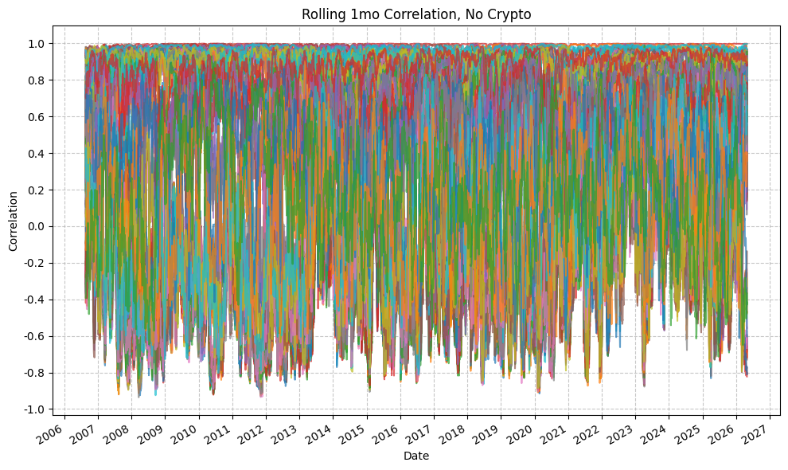
    


```python
# plot_time_series(
#     df=rolling_correlation_results_no_crypto_df,
#     plot_start_date=None,
#     plot_end_date=None,
#     plot_columns=[
#         col for col in rolling_correlation_results_no_crypto_df.columns
#         if "1y" in col
#         and any(col.startswith(ticker) for ticker in equity_tickers)
#         and not any(col.endswith(f"{ticker}_1y") for ticker in bond_tickers + commodity_tickers + real_estate_tickers)
#     ],
#     title="Rolling 1y Correlation - Equity ETFs",
#     x_label="Date",
#     x_format="Year",
#     x_tick_spacing=1,
#     x_tick_rotation=30,
#     y_label="Correlation",
#     y_format="Decimal",
#     y_format_decimal_places="Auto",
#     y_tick_spacing="Auto",
#     y_tick_rotation=0,
#     grid=True,
#     legend=True,
#     export_plot=False,
#     plot_file_name=None,
# )
```


```python
# plot_time_series(
#     df=rolling_correlation_results_no_crypto_df,
#     plot_start_date=None,
#     plot_end_date=None,
#     plot_columns=[
#         col for col in rolling_correlation_results_no_crypto_df.columns
#         if "1y" in col
#         and any(col.startswith(ticker) for ticker in us_equity_tickers)
#         and not any(col.endswith(f"{ticker}_1y") for ticker in intl_equity_tickers + bond_tickers + commodity_tickers + real_estate_tickers)
#     ],
#     title="Rolling 1y Correlation - US Equity ETFs",
#     x_label="Date",
#     x_format="Year",
#     x_tick_spacing=1,
#     x_tick_rotation=30,
#     y_label="Correlation",
#     y_format="Decimal",
#     y_format_decimal_places="Auto",
#     y_tick_spacing="Auto",
#     y_tick_rotation=0,
#     grid=True,
#     legend=True,
#     export_plot=False,
#     plot_file_name=None,
# )
```


```python
# plot_time_series(
#     df=rolling_correlation_results_no_crypto_df,
#     plot_start_date=None,
#     plot_end_date=None,
#     plot_columns=[
#         col for col in rolling_correlation_results_no_crypto_df.columns
#         if "6mo" in col
#         and any(col.startswith(ticker) for ticker in us_equity_tickers)
#         and not any(col.startswith("QQQ") for ticker in us_equity_tickers)
#         and not any(col.endswith(f"{ticker}_6mo") for ticker in intl_equity_tickers + bond_tickers + commodity_tickers + real_estate_tickers + list("QQQ" + "IWD" + "IWF"))
#     ],
#     title="Rolling 6mo Correlation - US Equity ETFs",
#     x_label="Date",
#     x_format="Year",
#     x_tick_spacing=1,
#     x_tick_rotation=30,
#     y_label="Correlation",
#     y_format="Decimal",
#     y_format_decimal_places="Auto",
#     y_tick_spacing="Auto",
#     y_tick_rotation=0,
#     grid=True,
#     legend=True,
#     export_plot=False,
#     plot_file_name=None,
# )
```


```python
plot_time_series(
    df=rolling_correlation_results_no_crypto_df,
    plot_start_date=None,
    plot_end_date=None,
    plot_columns=[
        col for col in rolling_correlation_results_no_crypto_df.columns
        if "1mo" in col
        and any(col.startswith(ticker) for ticker in us_equity_tickers)
        and not any(col.startswith("QQQ") for ticker in us_equity_tickers)
        and not any(col.endswith(f"{ticker}_1mo") for ticker in intl_equity_tickers + bond_tickers + commodity_tickers + real_estate_tickers + list("QQQ" + "IWD" + "IWF" + "IWB" + "IWM"))
    ],
    title="Rolling 1mo Correlation - US Equity ETFs",
    x_label="Date",
    x_format="Year",
    x_tick_spacing=1,
    x_tick_rotation=30,
    y_label="Correlation",
    y_format="Decimal",
    y_format_decimal_places="Auto",
    y_tick_spacing="Auto",
    y_tick_rotation=0,
    grid=True,
    legend=True,
    export_plot=False,
    plot_file_name=None,
)
```


    

    


## Rolling Correlations Amongst US Stocks

We'll now look specifically at the rolling correlations between the US S&P index ETFs (IVV, IJH, and IJR). We'll isolate the data for the rolling correlations for these three assets and see how the correlations have changed over time.


```python
corr_list = ['IVV_IJH_1mo', 'IVV_IJR_1mo', 'IJH_IJR_1mo']

plot_time_series(
    df=rolling_correlation_results_no_crypto_df,
    plot_start_date=None,
    plot_end_date=None,
    plot_columns=corr_list,
    title="Rolling 6mo Correlation - US Equity ETFs (S&P 500, 400, 600)",
    x_label="Date",
    x_format="Year",
    x_tick_spacing=1,
    x_tick_rotation=30,
    y_label="Correlation",
    y_format="Decimal",
    y_format_decimal_places="Auto",
    y_tick_spacing="Auto",
    y_tick_rotation=0,
    grid=True,
    legend=True,
    export_plot=False,
    plot_file_name=None,
)
```


    
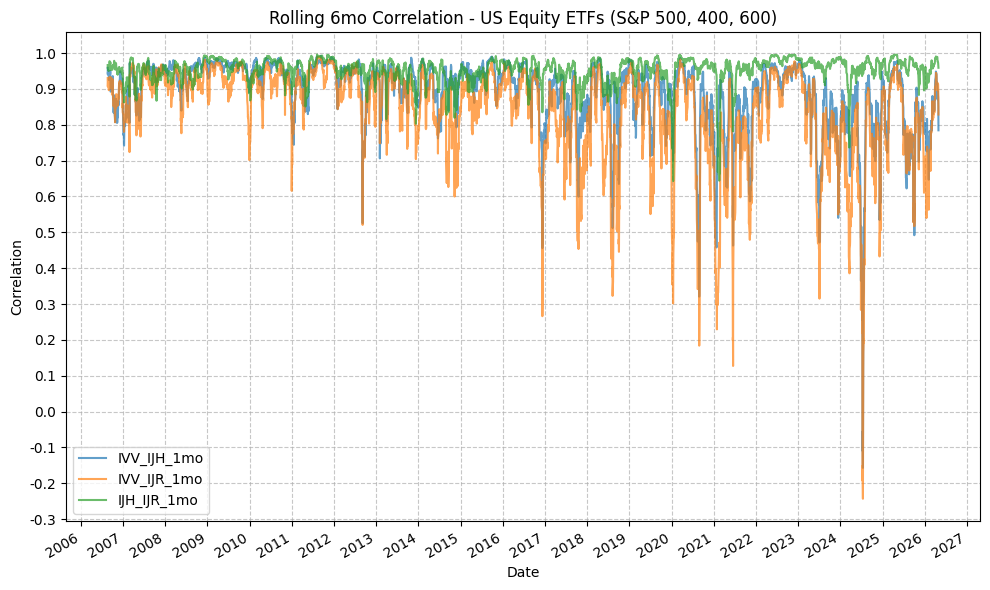
    


With the above plot, we can see that there are periods of time when the correlations abruptly increase, such as:

* Early-mid 2007 (the start of the financial crisis)
* Mid 2011 (the European debt crisis)
* Late 2015 into 2016
* Late 2018 (rate hikes?)
* Early 2020 (COVID-19 pandemic)
* Late 2022 into early 2023 (rate hikes, recession fears, COVID tech bubble, etc.)
* Mid 2024 (banking crisis, rate hikes)
* Early 2025 (Liberation day)

We're not necessarily looking to explain away each of these time periods or delve into the macro factors that may have been at play or driving the correlations, but we are more interested in the change in correlation over time on response to some kind of market shock or event.

As an attempt to find some kind of signal, let's simply add the three correlations together to get a "total correlation" metric, and then plot that total correlation metric over time to see if we can identify any trends or patterns.


```python
us_sp_etfs = rolling_correlation_results_no_crypto_df[corr_list].dropna()

# Add the correlations together
us_sp_etfs["total_correlation"] = us_sp_etfs.sum(axis=1)

# Calc the percent change in total correlation
us_sp_etfs["total_correlation_pct_change"] = us_sp_etfs["total_correlation"].pct_change()

# Merge daily returns into us_sp_etfs for the three ETFs
us_sp_etfs = us_sp_etfs.merge(
    fund_data_daily_returns[["IVV_Daily_Return", "IJH_Daily_Return", "IJR_Daily_Return"]],
    left_index=True,
    right_index=True,
    how="left"
)

windows = [5, 10, 15, 20, 25]
for window in windows:
    us_sp_etfs[f"total_correlation_pct_change_{window}d_cum"] = us_sp_etfs["total_correlation_pct_change"].rolling(window=window).apply(lambda x: (1 + x).prod() - 1)
    us_sp_etfs[f"IVV_Daily_Return_{window}d_cum"] = us_sp_etfs["IVV_Daily_Return"].rolling(window=window).apply(lambda x: (1 + x).prod() - 1)
    us_sp_etfs[f"IJH_Daily_Return_{window}d_cum"] = us_sp_etfs["IJH_Daily_Return"].rolling(window=window).apply(lambda x: (1 + x).prod() - 1)
    us_sp_etfs[f"IJR_Daily_Return_{window}d_cum"] = us_sp_etfs["IJR_Daily_Return"].rolling(window=window).apply(lambda x: (1 + x).prod() - 1)

pandas_set_decimal_places(4)
display(us_sp_etfs)
```


<div>
<style scoped>
    .dataframe tbody tr th:only-of-type {
        vertical-align: middle;
    }

    .dataframe tbody tr th {
        vertical-align: top;
    }

    .dataframe thead th {
        text-align: right;
    }
</style>
<table border="1" class="dataframe">
  <thead>
    <tr style="text-align: right;">
      <th></th>
      <th>IVV_IJH_1mo</th>
      <th>IVV_IJR_1mo</th>
      <th>IJH_IJR_1mo</th>
      <th>total_correlation</th>
      <th>total_correlation_pct_change</th>
      <th>IVV_Daily_Return</th>
      <th>IJH_Daily_Return</th>
      <th>IJR_Daily_Return</th>
      <th>total_correlation_pct_change_5d_cum</th>
      <th>IVV_Daily_Return_5d_cum</th>
      <th>...</th>
      <th>IJH_Daily_Return_15d_cum</th>
      <th>IJR_Daily_Return_15d_cum</th>
      <th>total_correlation_pct_change_20d_cum</th>
      <th>IVV_Daily_Return_20d_cum</th>
      <th>IJH_Daily_Return_20d_cum</th>
      <th>IJR_Daily_Return_20d_cum</th>
      <th>total_correlation_pct_change_25d_cum</th>
      <th>IVV_Daily_Return_25d_cum</th>
      <th>IJH_Daily_Return_25d_cum</th>
      <th>IJR_Daily_Return_25d_cum</th>
    </tr>
    <tr>
      <th>Date</th>
      <th></th>
      <th></th>
      <th></th>
      <th></th>
      <th></th>
      <th></th>
      <th></th>
      <th></th>
      <th></th>
      <th></th>
      <th></th>
      <th></th>
      <th></th>
      <th></th>
      <th></th>
      <th></th>
      <th></th>
      <th></th>
      <th></th>
      <th></th>
      <th></th>
    </tr>
  </thead>
  <tbody>
    <tr>
      <th>2006-08-21</th>
      <td>0.9585</td>
      <td>0.9301</td>
      <td>0.9665</td>
      <td>2.8552</td>
      <td>NaN</td>
      <td>NaN</td>
      <td>NaN</td>
      <td>NaN</td>
      <td>NaN</td>
      <td>NaN</td>
      <td>...</td>
      <td>NaN</td>
      <td>NaN</td>
      <td>NaN</td>
      <td>NaN</td>
      <td>NaN</td>
      <td>NaN</td>
      <td>NaN</td>
      <td>NaN</td>
      <td>NaN</td>
      <td>NaN</td>
    </tr>
    <tr>
      <th>2006-08-22</th>
      <td>0.9403</td>
      <td>0.9066</td>
      <td>0.9564</td>
      <td>2.8034</td>
      <td>-0.0181</td>
      <td>NaN</td>
      <td>NaN</td>
      <td>NaN</td>
      <td>NaN</td>
      <td>NaN</td>
      <td>...</td>
      <td>NaN</td>
      <td>NaN</td>
      <td>NaN</td>
      <td>NaN</td>
      <td>NaN</td>
      <td>NaN</td>
      <td>NaN</td>
      <td>NaN</td>
      <td>NaN</td>
      <td>NaN</td>
    </tr>
    <tr>
      <th>2006-08-23</th>
      <td>0.9462</td>
      <td>0.9109</td>
      <td>0.9574</td>
      <td>2.8144</td>
      <td>0.0040</td>
      <td>NaN</td>
      <td>NaN</td>
      <td>NaN</td>
      <td>NaN</td>
      <td>NaN</td>
      <td>...</td>
      <td>NaN</td>
      <td>NaN</td>
      <td>NaN</td>
      <td>NaN</td>
      <td>NaN</td>
      <td>NaN</td>
      <td>NaN</td>
      <td>NaN</td>
      <td>NaN</td>
      <td>NaN</td>
    </tr>
    <tr>
      <th>2006-08-24</th>
      <td>0.9442</td>
      <td>0.9206</td>
      <td>0.9623</td>
      <td>2.8271</td>
      <td>0.0045</td>
      <td>NaN</td>
      <td>NaN</td>
      <td>NaN</td>
      <td>NaN</td>
      <td>NaN</td>
      <td>...</td>
      <td>NaN</td>
      <td>NaN</td>
      <td>NaN</td>
      <td>NaN</td>
      <td>NaN</td>
      <td>NaN</td>
      <td>NaN</td>
      <td>NaN</td>
      <td>NaN</td>
      <td>NaN</td>
    </tr>
    <tr>
      <th>2006-08-25</th>
      <td>0.9515</td>
      <td>0.9257</td>
      <td>0.9578</td>
      <td>2.8350</td>
      <td>0.0028</td>
      <td>NaN</td>
      <td>NaN</td>
      <td>NaN</td>
      <td>NaN</td>
      <td>NaN</td>
      <td>...</td>
      <td>NaN</td>
      <td>NaN</td>
      <td>NaN</td>
      <td>NaN</td>
      <td>NaN</td>
      <td>NaN</td>
      <td>NaN</td>
      <td>NaN</td>
      <td>NaN</td>
      <td>NaN</td>
    </tr>
    <tr>
      <th>...</th>
      <td>...</td>
      <td>...</td>
      <td>...</td>
      <td>...</td>
      <td>...</td>
      <td>...</td>
      <td>...</td>
      <td>...</td>
      <td>...</td>
      <td>...</td>
      <td>...</td>
      <td>...</td>
      <td>...</td>
      <td>...</td>
      <td>...</td>
      <td>...</td>
      <td>...</td>
      <td>...</td>
      <td>...</td>
      <td>...</td>
      <td>...</td>
    </tr>
    <tr>
      <th>2026-04-24</th>
      <td>0.8906</td>
      <td>0.9159</td>
      <td>0.9755</td>
      <td>2.7820</td>
      <td>-0.0001</td>
      <td>0.0078</td>
      <td>0.0021</td>
      <td>0.0054</td>
      <td>-0.0104</td>
      <td>0.0055</td>
      <td>...</td>
      <td>0.0676</td>
      <td>0.0867</td>
      <td>0.0496</td>
      <td>0.1069</td>
      <td>0.0830</td>
      <td>0.1021</td>
      <td>0.0592</td>
      <td>0.0853</td>
      <td>0.0808</td>
      <td>0.1102</td>
    </tr>
    <tr>
      <th>2026-04-27</th>
      <td>0.8768</td>
      <td>0.9120</td>
      <td>0.9730</td>
      <td>2.7618</td>
      <td>-0.0073</td>
      <td>0.0017</td>
      <td>0.0007</td>
      <td>0.0019</td>
      <td>-0.0156</td>
      <td>0.0090</td>
      <td>...</td>
      <td>0.0640</td>
      <td>0.0829</td>
      <td>0.0223</td>
      <td>0.1280</td>
      <td>0.1018</td>
      <td>0.1216</td>
      <td>0.0343</td>
      <td>0.1032</td>
      <td>0.1058</td>
      <td>0.1341</td>
    </tr>
    <tr>
      <th>2026-04-28</th>
      <td>0.8601</td>
      <td>0.8967</td>
      <td>0.9685</td>
      <td>2.7253</td>
      <td>-0.0132</td>
      <td>-0.0049</td>
      <td>-0.0100</td>
      <td>-0.0056</td>
      <td>-0.0223</td>
      <td>0.0109</td>
      <td>...</td>
      <td>0.0519</td>
      <td>0.0733</td>
      <td>0.0049</td>
      <td>0.1260</td>
      <td>0.0994</td>
      <td>0.1234</td>
      <td>0.0089</td>
      <td>0.0860</td>
      <td>0.0750</td>
      <td>0.1050</td>
    </tr>
    <tr>
      <th>2026-04-29</th>
      <td>0.8529</td>
      <td>0.8854</td>
      <td>0.9677</td>
      <td>2.7060</td>
      <td>-0.0071</td>
      <td>-0.0001</td>
      <td>-0.0075</td>
      <td>-0.0078</td>
      <td>-0.0132</td>
      <td>0.0005</td>
      <td>...</td>
      <td>0.0147</td>
      <td>0.0377</td>
      <td>-0.0318</td>
      <td>0.0944</td>
      <td>0.0598</td>
      <td>0.0838</td>
      <td>0.0224</td>
      <td>0.0894</td>
      <td>0.0583</td>
      <td>0.0886</td>
    </tr>
    <tr>
      <th>2026-04-30</th>
      <td>0.7845</td>
      <td>0.8284</td>
      <td>0.9588</td>
      <td>2.5717</td>
      <td>-0.0496</td>
      <td>0.0100</td>
      <td>0.0168</td>
      <td>0.0176</td>
      <td>-0.0757</td>
      <td>0.0145</td>
      <td>...</td>
      <td>0.0297</td>
      <td>0.0486</td>
      <td>-0.0816</td>
      <td>0.0973</td>
      <td>0.0686</td>
      <td>0.0975</td>
      <td>-0.0274</td>
      <td>0.0945</td>
      <td>0.0667</td>
      <td>0.0961</td>
    </tr>
  </tbody>
</table>
<p>4954 rows × 28 columns</p>
</div>


```python
plot_scatter(
    df=us_sp_etfs,
    x_plot_column="total_correlation",
    y_plot_columns=["IVV_Daily_Return_20d_cum", "IJH_Daily_Return_20d_cum", "IJR_Daily_Return_20d_cum"],
    title="IVV Daily Return vs Total Correlation Percent Change",
    x_label="Total Correlation Percent Change",
    x_format="Decimal",
    x_format_decimal_places=4,
    x_tick_spacing="Auto",
    x_tick_rotation=30,
    y_label="Daily Return",
    y_format="Decimal",
    y_format_decimal_places=2,
    y_tick_spacing="Auto",
    y_tick_rotation=0,
    grid=True,
    legend=True,
    export_plot=False,
    plot_file_name=None,
)
```

    Raw x-tick spacing: 0.12050918913320856
    Rounded x-tick spacing: 0.1


    
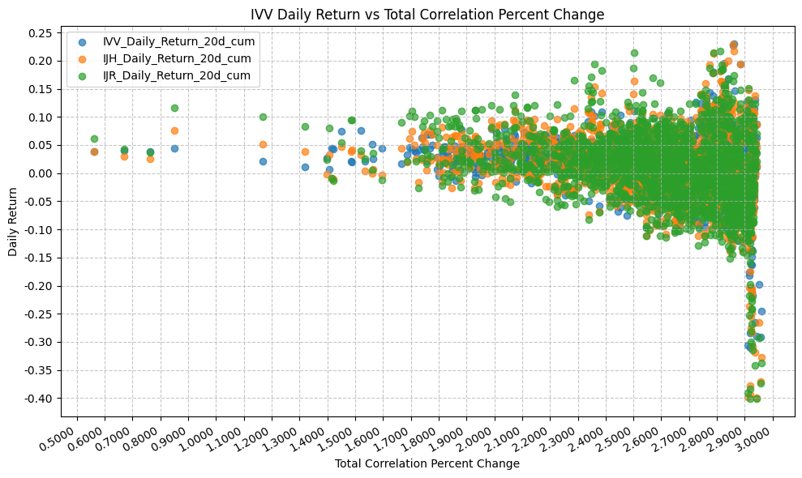
    


Now we'll plot the total correlation metric over time:


```python
plot_time_series(
    df=us_sp_etfs.dropna(),
    plot_start_date=None,
    plot_end_date=None,
    plot_columns=["total_correlation"],
    title="Total Rolling 6mo Correlaation - US Equity ETFs (S&P 500, 400, 600)",
    x_label="Date",
    x_format="Year",
    x_tick_spacing=1,
    x_tick_rotation=30,
    y_label="Correlation",
    y_format="Decimal",
    y_format_decimal_places="Auto",
    y_tick_spacing="Auto",
    y_tick_rotation=0,
    grid=True,
    legend=True,
    export_plot=False,
    plot_file_name=None,
)
```


    

    


Now we'll look at a few different moving averages of the total correlation metric, the difference between the total correlation and the moving averages, and the percentage difference.


```python
fund_data_daily_returns_all
```


<div>
<style scoped>
    .dataframe tbody tr th:only-of-type {
        vertical-align: middle;
    }

    .dataframe tbody tr th {
        vertical-align: top;
    }

    .dataframe thead th {
        text-align: right;
    }
</style>
<table border="1" class="dataframe">
  <thead>
    <tr style="text-align: right;">
      <th></th>
      <th>IVV_Daily_Return</th>
      <th>IJH_Daily_Return</th>
      <th>IJR_Daily_Return</th>
      <th>QQQ_Daily_Return</th>
      <th>IWB_Daily_Return</th>
      <th>IWM_Daily_Return</th>
      <th>IWD_Daily_Return</th>
      <th>IWF_Daily_Return</th>
      <th>EFA_Daily_Return</th>
      <th>EEM_Daily_Return</th>
      <th>IEV_Daily_Return</th>
      <th>SHY_Daily_Return</th>
      <th>IEF_Daily_Return</th>
      <th>TLT_Daily_Return</th>
      <th>AGG_Daily_Return</th>
      <th>GLD_Daily_Return</th>
      <th>GSG_Daily_Return</th>
      <th>IYR_Daily_Return</th>
      <th>BTC-USD_Daily_Return</th>
      <th>ETH-USD_Daily_Return</th>
    </tr>
    <tr>
      <th>Date</th>
      <th></th>
      <th></th>
      <th></th>
      <th></th>
      <th></th>
      <th></th>
      <th></th>
      <th></th>
      <th></th>
      <th></th>
      <th></th>
      <th></th>
      <th></th>
      <th></th>
      <th></th>
      <th></th>
      <th></th>
      <th></th>
      <th></th>
      <th></th>
    </tr>
  </thead>
  <tbody>
    <tr>
      <th>1999-03-10</th>
      <td>NaN</td>
      <td>NaN</td>
      <td>NaN</td>
      <td>NaN</td>
      <td>NaN</td>
      <td>NaN</td>
      <td>NaN</td>
      <td>NaN</td>
      <td>NaN</td>
      <td>NaN</td>
      <td>NaN</td>
      <td>NaN</td>
      <td>NaN</td>
      <td>NaN</td>
      <td>NaN</td>
      <td>NaN</td>
      <td>NaN</td>
      <td>NaN</td>
      <td>NaN</td>
      <td>NaN</td>
    </tr>
    <tr>
      <th>1999-03-11</th>
      <td>NaN</td>
      <td>NaN</td>
      <td>NaN</td>
      <td>0.0049</td>
      <td>NaN</td>
      <td>NaN</td>
      <td>NaN</td>
      <td>NaN</td>
      <td>NaN</td>
      <td>NaN</td>
      <td>NaN</td>
      <td>NaN</td>
      <td>NaN</td>
      <td>NaN</td>
      <td>NaN</td>
      <td>NaN</td>
      <td>NaN</td>
      <td>NaN</td>
      <td>NaN</td>
      <td>NaN</td>
    </tr>
    <tr>
      <th>1999-03-12</th>
      <td>NaN</td>
      <td>NaN</td>
      <td>NaN</td>
      <td>-0.0244</td>
      <td>NaN</td>
      <td>NaN</td>
      <td>NaN</td>
      <td>NaN</td>
      <td>NaN</td>
      <td>NaN</td>
      <td>NaN</td>
      <td>NaN</td>
      <td>NaN</td>
      <td>NaN</td>
      <td>NaN</td>
      <td>NaN</td>
      <td>NaN</td>
      <td>NaN</td>
      <td>NaN</td>
      <td>NaN</td>
    </tr>
    <tr>
      <th>1999-03-15</th>
      <td>NaN</td>
      <td>NaN</td>
      <td>NaN</td>
      <td>0.0287</td>
      <td>NaN</td>
      <td>NaN</td>
      <td>NaN</td>
      <td>NaN</td>
      <td>NaN</td>
      <td>NaN</td>
      <td>NaN</td>
      <td>NaN</td>
      <td>NaN</td>
      <td>NaN</td>
      <td>NaN</td>
      <td>NaN</td>
      <td>NaN</td>
      <td>NaN</td>
      <td>NaN</td>
      <td>NaN</td>
    </tr>
    <tr>
      <th>1999-03-16</th>
      <td>NaN</td>
      <td>NaN</td>
      <td>NaN</td>
      <td>0.0085</td>
      <td>NaN</td>
      <td>NaN</td>
      <td>NaN</td>
      <td>NaN</td>
      <td>NaN</td>
      <td>NaN</td>
      <td>NaN</td>
      <td>NaN</td>
      <td>NaN</td>
      <td>NaN</td>
      <td>NaN</td>
      <td>NaN</td>
      <td>NaN</td>
      <td>NaN</td>
      <td>NaN</td>
      <td>NaN</td>
    </tr>
    <tr>
      <th>...</th>
      <td>...</td>
      <td>...</td>
      <td>...</td>
      <td>...</td>
      <td>...</td>
      <td>...</td>
      <td>...</td>
      <td>...</td>
      <td>...</td>
      <td>...</td>
      <td>...</td>
      <td>...</td>
      <td>...</td>
      <td>...</td>
      <td>...</td>
      <td>...</td>
      <td>...</td>
      <td>...</td>
      <td>...</td>
      <td>...</td>
    </tr>
    <tr>
      <th>2026-04-27</th>
      <td>0.0017</td>
      <td>0.0007</td>
      <td>0.0019</td>
      <td>0.0005</td>
      <td>0.0011</td>
      <td>0.0018</td>
      <td>0.0001</td>
      <td>0.0017</td>
      <td>-0.0038</td>
      <td>-0.0016</td>
      <td>-0.0052</td>
      <td>-0.0002</td>
      <td>-0.0023</td>
      <td>-0.0050</td>
      <td>-0.0015</td>
      <td>-0.0078</td>
      <td>0.0092</td>
      <td>-0.0057</td>
      <td>-0.0164</td>
      <td>-0.0281</td>
    </tr>
    <tr>
      <th>2026-04-28</th>
      <td>-0.0049</td>
      <td>-0.0100</td>
      <td>-0.0056</td>
      <td>-0.0101</td>
      <td>-0.0053</td>
      <td>-0.0117</td>
      <td>-0.0026</td>
      <td>-0.0076</td>
      <td>-0.0041</td>
      <td>-0.0102</td>
      <td>-0.0052</td>
      <td>-0.0006</td>
      <td>-0.0009</td>
      <td>0.0010</td>
      <td>-0.0004</td>
      <td>-0.0186</td>
      <td>0.0140</td>
      <td>0.0090</td>
      <td>-0.0131</td>
      <td>-0.0059</td>
    </tr>
    <tr>
      <th>2026-04-29</th>
      <td>-0.0001</td>
      <td>-0.0075</td>
      <td>-0.0078</td>
      <td>0.0061</td>
      <td>-0.0005</td>
      <td>-0.0067</td>
      <td>-0.0000</td>
      <td>-0.0023</td>
      <td>-0.0102</td>
      <td>-0.0048</td>
      <td>-0.0116</td>
      <td>-0.0013</td>
      <td>-0.0047</td>
      <td>-0.0078</td>
      <td>-0.0044</td>
      <td>-0.0107</td>
      <td>0.0366</td>
      <td>-0.0083</td>
      <td>-0.0075</td>
      <td>-0.0157</td>
    </tr>
    <tr>
      <th>2026-04-30</th>
      <td>0.0100</td>
      <td>0.0168</td>
      <td>0.0176</td>
      <td>0.0093</td>
      <td>0.0102</td>
      <td>0.0216</td>
      <td>0.0184</td>
      <td>0.0040</td>
      <td>0.0239</td>
      <td>0.0207</td>
      <td>0.0239</td>
      <td>0.0011</td>
      <td>0.0019</td>
      <td>-0.0009</td>
      <td>0.0014</td>
      <td>0.0150</td>
      <td>-0.0049</td>
      <td>0.0171</td>
      <td>0.0070</td>
      <td>0.0013</td>
    </tr>
    <tr>
      <th>2026-05-01</th>
      <td>NaN</td>
      <td>NaN</td>
      <td>NaN</td>
      <td>NaN</td>
      <td>NaN</td>
      <td>NaN</td>
      <td>NaN</td>
      <td>NaN</td>
      <td>NaN</td>
      <td>NaN</td>
      <td>NaN</td>
      <td>NaN</td>
      <td>NaN</td>
      <td>NaN</td>
      <td>NaN</td>
      <td>NaN</td>
      <td>NaN</td>
      <td>NaN</td>
      <td>0.0246</td>
      <td>0.0172</td>
    </tr>
  </tbody>
</table>
<p>8151 rows × 20 columns</p>
</div>


```python
ma_windows = [5, 10, 15, 20, 25]

for window in ma_windows:
    us_sp_etfs[f"total_correlation_{window}d_ma"] = us_sp_etfs["total_correlation"].rolling(window=window).mean()
    us_sp_etfs[f"total_correlation_diff_{window}d"] = us_sp_etfs["total_correlation"] - us_sp_etfs[f"total_correlation_{window}d_ma"]

display(us_sp_etfs)
```


<div>
<style scoped>
    .dataframe tbody tr th:only-of-type {
        vertical-align: middle;
    }

    .dataframe tbody tr th {
        vertical-align: top;
    }

    .dataframe thead th {
        text-align: right;
    }
</style>
<table border="1" class="dataframe">
  <thead>
    <tr style="text-align: right;">
      <th></th>
      <th>IVV_IJH_1mo</th>
      <th>IVV_IJR_1mo</th>
      <th>IJH_IJR_1mo</th>
      <th>total_correlation</th>
      <th>total_correlation_pct_change</th>
      <th>IVV_Daily_Return</th>
      <th>IJH_Daily_Return</th>
      <th>IJR_Daily_Return</th>
      <th>total_correlation_pct_change_5d_cum</th>
      <th>IVV_Daily_Return_5d_cum</th>
      <th>...</th>
      <th>total_correlation_5d_ma</th>
      <th>total_correlation_diff_5d</th>
      <th>total_correlation_10d_ma</th>
      <th>total_correlation_diff_10d</th>
      <th>total_correlation_15d_ma</th>
      <th>total_correlation_diff_15d</th>
      <th>total_correlation_20d_ma</th>
      <th>total_correlation_diff_20d</th>
      <th>total_correlation_25d_ma</th>
      <th>total_correlation_diff_25d</th>
    </tr>
    <tr>
      <th>Date</th>
      <th></th>
      <th></th>
      <th></th>
      <th></th>
      <th></th>
      <th></th>
      <th></th>
      <th></th>
      <th></th>
      <th></th>
      <th></th>
      <th></th>
      <th></th>
      <th></th>
      <th></th>
      <th></th>
      <th></th>
      <th></th>
      <th></th>
      <th></th>
      <th></th>
    </tr>
  </thead>
  <tbody>
    <tr>
      <th>2006-08-21</th>
      <td>0.9585</td>
      <td>0.9301</td>
      <td>0.9665</td>
      <td>2.8552</td>
      <td>NaN</td>
      <td>NaN</td>
      <td>NaN</td>
      <td>NaN</td>
      <td>NaN</td>
      <td>NaN</td>
      <td>...</td>
      <td>NaN</td>
      <td>NaN</td>
      <td>NaN</td>
      <td>NaN</td>
      <td>NaN</td>
      <td>NaN</td>
      <td>NaN</td>
      <td>NaN</td>
      <td>NaN</td>
      <td>NaN</td>
    </tr>
    <tr>
      <th>2006-08-22</th>
      <td>0.9403</td>
      <td>0.9066</td>
      <td>0.9564</td>
      <td>2.8034</td>
      <td>-0.0181</td>
      <td>NaN</td>
      <td>NaN</td>
      <td>NaN</td>
      <td>NaN</td>
      <td>NaN</td>
      <td>...</td>
      <td>NaN</td>
      <td>NaN</td>
      <td>NaN</td>
      <td>NaN</td>
      <td>NaN</td>
      <td>NaN</td>
      <td>NaN</td>
      <td>NaN</td>
      <td>NaN</td>
      <td>NaN</td>
    </tr>
    <tr>
      <th>2006-08-23</th>
      <td>0.9462</td>
      <td>0.9109</td>
      <td>0.9574</td>
      <td>2.8144</td>
      <td>0.0040</td>
      <td>NaN</td>
      <td>NaN</td>
      <td>NaN</td>
      <td>NaN</td>
      <td>NaN</td>
      <td>...</td>
      <td>NaN</td>
      <td>NaN</td>
      <td>NaN</td>
      <td>NaN</td>
      <td>NaN</td>
      <td>NaN</td>
      <td>NaN</td>
      <td>NaN</td>
      <td>NaN</td>
      <td>NaN</td>
    </tr>
    <tr>
      <th>2006-08-24</th>
      <td>0.9442</td>
      <td>0.9206</td>
      <td>0.9623</td>
      <td>2.8271</td>
      <td>0.0045</td>
      <td>NaN</td>
      <td>NaN</td>
      <td>NaN</td>
      <td>NaN</td>
      <td>NaN</td>
      <td>...</td>
      <td>NaN</td>
      <td>NaN</td>
      <td>NaN</td>
      <td>NaN</td>
      <td>NaN</td>
      <td>NaN</td>
      <td>NaN</td>
      <td>NaN</td>
      <td>NaN</td>
      <td>NaN</td>
    </tr>
    <tr>
      <th>2006-08-25</th>
      <td>0.9515</td>
      <td>0.9257</td>
      <td>0.9578</td>
      <td>2.8350</td>
      <td>0.0028</td>
      <td>NaN</td>
      <td>NaN</td>
      <td>NaN</td>
      <td>NaN</td>
      <td>NaN</td>
      <td>...</td>
      <td>2.8270</td>
      <td>0.0080</td>
      <td>NaN</td>
      <td>NaN</td>
      <td>NaN</td>
      <td>NaN</td>
      <td>NaN</td>
      <td>NaN</td>
      <td>NaN</td>
      <td>NaN</td>
    </tr>
    <tr>
      <th>...</th>
      <td>...</td>
      <td>...</td>
      <td>...</td>
      <td>...</td>
      <td>...</td>
      <td>...</td>
      <td>...</td>
      <td>...</td>
      <td>...</td>
      <td>...</td>
      <td>...</td>
      <td>...</td>
      <td>...</td>
      <td>...</td>
      <td>...</td>
      <td>...</td>
      <td>...</td>
      <td>...</td>
      <td>...</td>
      <td>...</td>
      <td>...</td>
    </tr>
    <tr>
      <th>2026-04-24</th>
      <td>0.8906</td>
      <td>0.9159</td>
      <td>0.9755</td>
      <td>2.7820</td>
      <td>-0.0001</td>
      <td>0.0078</td>
      <td>0.0021</td>
      <td>0.0054</td>
      <td>-0.0104</td>
      <td>0.0055</td>
      <td>...</td>
      <td>2.7798</td>
      <td>0.0021</td>
      <td>2.8053</td>
      <td>-0.0234</td>
      <td>2.8245</td>
      <td>-0.0426</td>
      <td>2.8094</td>
      <td>-0.0275</td>
      <td>2.7801</td>
      <td>0.0019</td>
    </tr>
    <tr>
      <th>2026-04-27</th>
      <td>0.8768</td>
      <td>0.9120</td>
      <td>0.9730</td>
      <td>2.7618</td>
      <td>-0.0073</td>
      <td>0.0017</td>
      <td>0.0007</td>
      <td>0.0019</td>
      <td>-0.0156</td>
      <td>0.0090</td>
      <td>...</td>
      <td>2.7711</td>
      <td>-0.0093</td>
      <td>2.7948</td>
      <td>-0.0331</td>
      <td>2.8195</td>
      <td>-0.0577</td>
      <td>2.8125</td>
      <td>-0.0507</td>
      <td>2.7837</td>
      <td>-0.0220</td>
    </tr>
    <tr>
      <th>2026-04-28</th>
      <td>0.8601</td>
      <td>0.8967</td>
      <td>0.9685</td>
      <td>2.7253</td>
      <td>-0.0132</td>
      <td>-0.0049</td>
      <td>-0.0100</td>
      <td>-0.0056</td>
      <td>-0.0223</td>
      <td>0.0109</td>
      <td>...</td>
      <td>2.7587</td>
      <td>-0.0334</td>
      <td>2.7828</td>
      <td>-0.0575</td>
      <td>2.8115</td>
      <td>-0.0862</td>
      <td>2.8131</td>
      <td>-0.0878</td>
      <td>2.7847</td>
      <td>-0.0594</td>
    </tr>
    <tr>
      <th>2026-04-29</th>
      <td>0.8529</td>
      <td>0.8854</td>
      <td>0.9677</td>
      <td>2.7060</td>
      <td>-0.0071</td>
      <td>-0.0001</td>
      <td>-0.0075</td>
      <td>-0.0078</td>
      <td>-0.0132</td>
      <td>0.0005</td>
      <td>...</td>
      <td>2.7514</td>
      <td>-0.0455</td>
      <td>2.7723</td>
      <td>-0.0663</td>
      <td>2.7999</td>
      <td>-0.0939</td>
      <td>2.8087</td>
      <td>-0.1027</td>
      <td>2.7871</td>
      <td>-0.0811</td>
    </tr>
    <tr>
      <th>2026-04-30</th>
      <td>0.7845</td>
      <td>0.8284</td>
      <td>0.9588</td>
      <td>2.5717</td>
      <td>-0.0496</td>
      <td>0.0100</td>
      <td>0.0168</td>
      <td>0.0176</td>
      <td>-0.0757</td>
      <td>0.0145</td>
      <td>...</td>
      <td>2.7093</td>
      <td>-0.1376</td>
      <td>2.7475</td>
      <td>-0.1758</td>
      <td>2.7795</td>
      <td>-0.2077</td>
      <td>2.7973</td>
      <td>-0.2255</td>
      <td>2.7842</td>
      <td>-0.2124</td>
    </tr>
  </tbody>
</table>
<p>4954 rows × 38 columns</p>
</div>


```python
us_sp_etfs[(us_sp_etfs.index >= "2020-01-01") & (us_sp_etfs.index <= "2021-01-01")]
```


<div>
<style scoped>
    .dataframe tbody tr th:only-of-type {
        vertical-align: middle;
    }

    .dataframe tbody tr th {
        vertical-align: top;
    }

    .dataframe thead th {
        text-align: right;
    }
</style>
<table border="1" class="dataframe">
  <thead>
    <tr style="text-align: right;">
      <th></th>
      <th>IVV_IJH_1mo</th>
      <th>IVV_IJR_1mo</th>
      <th>IJH_IJR_1mo</th>
      <th>total_correlation</th>
      <th>total_correlation_pct_change</th>
      <th>IVV_Daily_Return</th>
      <th>IJH_Daily_Return</th>
      <th>IJR_Daily_Return</th>
      <th>total_correlation_pct_change_5d_cum</th>
      <th>IVV_Daily_Return_5d_cum</th>
      <th>...</th>
      <th>total_correlation_5d_ma</th>
      <th>total_correlation_diff_5d</th>
      <th>total_correlation_10d_ma</th>
      <th>total_correlation_diff_10d</th>
      <th>total_correlation_15d_ma</th>
      <th>total_correlation_diff_15d</th>
      <th>total_correlation_20d_ma</th>
      <th>total_correlation_diff_20d</th>
      <th>total_correlation_25d_ma</th>
      <th>total_correlation_diff_25d</th>
    </tr>
    <tr>
      <th>Date</th>
      <th></th>
      <th></th>
      <th></th>
      <th></th>
      <th></th>
      <th></th>
      <th></th>
      <th></th>
      <th></th>
      <th></th>
      <th></th>
      <th></th>
      <th></th>
      <th></th>
      <th></th>
      <th></th>
      <th></th>
      <th></th>
      <th></th>
      <th></th>
      <th></th>
    </tr>
  </thead>
  <tbody>
    <tr>
      <th>2020-01-02</th>
      <td>0.8117</td>
      <td>0.5723</td>
      <td>0.8445</td>
      <td>2.2285</td>
      <td>-0.1028</td>
      <td>0.0095</td>
      <td>0.0015</td>
      <td>0.0007</td>
      <td>-0.1177</td>
      <td>0.0114</td>
      <td>...</td>
      <td>2.4506</td>
      <td>-0.2221</td>
      <td>2.5055</td>
      <td>-0.2770</td>
      <td>2.5434</td>
      <td>-0.3150</td>
      <td>2.5487</td>
      <td>-0.3202</td>
      <td>2.5495</td>
      <td>-0.3210</td>
    </tr>
    <tr>
      <th>2020-01-03</th>
      <td>0.8043</td>
      <td>0.5143</td>
      <td>0.8195</td>
      <td>2.1381</td>
      <td>-0.0405</td>
      <td>-0.0077</td>
      <td>-0.0050</td>
      <td>-0.0006</td>
      <td>-0.1507</td>
      <td>-0.0016</td>
      <td>...</td>
      <td>2.3747</td>
      <td>-0.2366</td>
      <td>2.4589</td>
      <td>-0.3207</td>
      <td>2.5130</td>
      <td>-0.3748</td>
      <td>2.5311</td>
      <td>-0.3930</td>
      <td>2.5343</td>
      <td>-0.3961</td>
    </tr>
    <tr>
      <th>2020-01-06</th>
      <td>0.7826</td>
      <td>0.4706</td>
      <td>0.8061</td>
      <td>2.0593</td>
      <td>-0.0369</td>
      <td>0.0040</td>
      <td>-0.0003</td>
      <td>-0.0010</td>
      <td>-0.1875</td>
      <td>0.0026</td>
      <td>...</td>
      <td>2.2797</td>
      <td>-0.2204</td>
      <td>2.4043</td>
      <td>-0.3451</td>
      <td>2.4742</td>
      <td>-0.4150</td>
      <td>2.5081</td>
      <td>-0.4489</td>
      <td>2.5143</td>
      <td>-0.4550</td>
    </tr>
    <tr>
      <th>2020-01-07</th>
      <td>0.7916</td>
      <td>0.5078</td>
      <td>0.8126</td>
      <td>2.1120</td>
      <td>0.0256</td>
      <td>-0.0027</td>
      <td>-0.0026</td>
      <td>-0.0057</td>
      <td>-0.1514</td>
      <td>0.0052</td>
      <td>...</td>
      <td>2.2043</td>
      <td>-0.0923</td>
      <td>2.3618</td>
      <td>-0.2498</td>
      <td>2.4396</td>
      <td>-0.3277</td>
      <td>2.4837</td>
      <td>-0.3717</td>
      <td>2.4940</td>
      <td>-0.3821</td>
    </tr>
    <tr>
      <th>2020-01-08</th>
      <td>0.7544</td>
      <td>0.4078</td>
      <td>0.7530</td>
      <td>1.9152</td>
      <td>-0.0932</td>
      <td>0.0051</td>
      <td>0.0016</td>
      <td>0.0022</td>
      <td>-0.2289</td>
      <td>0.0081</td>
      <td>...</td>
      <td>2.0906</td>
      <td>-0.1754</td>
      <td>2.3003</td>
      <td>-0.3851</td>
      <td>2.3920</td>
      <td>-0.4769</td>
      <td>2.4491</td>
      <td>-0.5339</td>
      <td>2.4668</td>
      <td>-0.5516</td>
    </tr>
    <tr>
      <th>...</th>
      <td>...</td>
      <td>...</td>
      <td>...</td>
      <td>...</td>
      <td>...</td>
      <td>...</td>
      <td>...</td>
      <td>...</td>
      <td>...</td>
      <td>...</td>
      <td>...</td>
      <td>...</td>
      <td>...</td>
      <td>...</td>
      <td>...</td>
      <td>...</td>
      <td>...</td>
      <td>...</td>
      <td>...</td>
      <td>...</td>
      <td>...</td>
    </tr>
    <tr>
      <th>2020-12-24</th>
      <td>0.8284</td>
      <td>0.7455</td>
      <td>0.9679</td>
      <td>2.5418</td>
      <td>-0.0276</td>
      <td>0.0039</td>
      <td>0.0016</td>
      <td>0.0009</td>
      <td>-0.0390</td>
      <td>-0.0044</td>
      <td>...</td>
      <td>2.6042</td>
      <td>-0.0624</td>
      <td>2.6308</td>
      <td>-0.0889</td>
      <td>2.6132</td>
      <td>-0.0714</td>
      <td>2.5459</td>
      <td>-0.0040</td>
      <td>2.5405</td>
      <td>0.0014</td>
    </tr>
    <tr>
      <th>2020-12-28</th>
      <td>0.7470</td>
      <td>0.7170</td>
      <td>0.9549</td>
      <td>2.4188</td>
      <td>-0.0484</td>
      <td>0.0087</td>
      <td>-0.0028</td>
      <td>0.0038</td>
      <td>-0.0745</td>
      <td>0.0082</td>
      <td>...</td>
      <td>2.5653</td>
      <td>-0.1465</td>
      <td>2.6026</td>
      <td>-0.1838</td>
      <td>2.6015</td>
      <td>-0.1827</td>
      <td>2.5488</td>
      <td>-0.1300</td>
      <td>2.5360</td>
      <td>-0.1172</td>
    </tr>
    <tr>
      <th>2020-12-29</th>
      <td>0.7477</td>
      <td>0.7148</td>
      <td>0.9585</td>
      <td>2.4210</td>
      <td>0.0009</td>
      <td>-0.0019</td>
      <td>-0.0103</td>
      <td>-0.0171</td>
      <td>-0.0775</td>
      <td>0.0096</td>
      <td>...</td>
      <td>2.5246</td>
      <td>-0.1036</td>
      <td>2.5777</td>
      <td>-0.1568</td>
      <td>2.5916</td>
      <td>-0.1707</td>
      <td>2.5505</td>
      <td>-0.1295</td>
      <td>2.5316</td>
      <td>-0.1106</td>
    </tr>
    <tr>
      <th>2020-12-30</th>
      <td>0.7293</td>
      <td>0.6992</td>
      <td>0.9490</td>
      <td>2.3774</td>
      <td>-0.0180</td>
      <td>0.0013</td>
      <td>0.0087</td>
      <td>0.0101</td>
      <td>-0.0951</td>
      <td>0.0129</td>
      <td>...</td>
      <td>2.4746</td>
      <td>-0.0972</td>
      <td>2.5487</td>
      <td>-0.1713</td>
      <td>2.5785</td>
      <td>-0.2011</td>
      <td>2.5519</td>
      <td>-0.1745</td>
      <td>2.5254</td>
      <td>-0.1480</td>
    </tr>
    <tr>
      <th>2020-12-31</th>
      <td>0.6849</td>
      <td>0.6787</td>
      <td>0.9511</td>
      <td>2.3146</td>
      <td>-0.0264</td>
      <td>0.0056</td>
      <td>0.0008</td>
      <td>0.0015</td>
      <td>-0.1146</td>
      <td>0.0176</td>
      <td>...</td>
      <td>2.4147</td>
      <td>-0.1001</td>
      <td>2.5198</td>
      <td>-0.2052</td>
      <td>2.5643</td>
      <td>-0.2497</td>
      <td>2.5508</td>
      <td>-0.2362</td>
      <td>2.5180</td>
      <td>-0.2034</td>
    </tr>
  </tbody>
</table>
<p>253 rows × 38 columns</p>
</div>


```python
plot_time_series(
    df=us_sp_etfs[(us_sp_etfs.index >= "2020-01-01") & (us_sp_etfs.index <= "2021-01-01")],
    plot_start_date=None,
    plot_end_date=None,
    plot_columns=[col for col in us_sp_etfs.columns if "total_correlation" in col and "diff" not in col],
    title="Total Correlation - US Equity ETFs (S&P 500, 400, 600)",
    x_label="Date",
    x_format="Year",
    x_tick_spacing=1,
    x_tick_rotation=30,
    y_label="Correlation",
    y_format="Decimal",
    y_format_decimal_places="Auto",
    y_tick_spacing="Auto",
    y_tick_rotation=0,
    grid=True,
    legend=True,
    export_plot=False,
    plot_file_name=None,
)
```


    
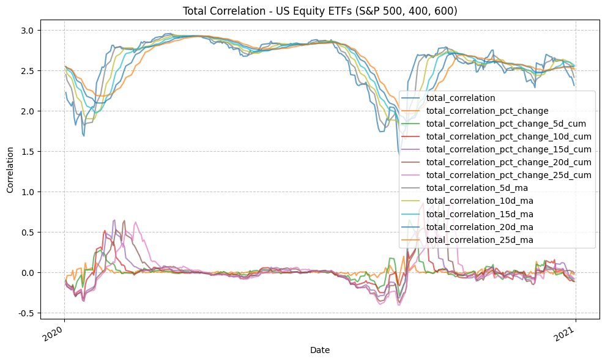
    


```python
fund_data_daily_returns_all
```


<div>
<style scoped>
    .dataframe tbody tr th:only-of-type {
        vertical-align: middle;
    }

    .dataframe tbody tr th {
        vertical-align: top;
    }

    .dataframe thead th {
        text-align: right;
    }
</style>
<table border="1" class="dataframe">
  <thead>
    <tr style="text-align: right;">
      <th></th>
      <th>IVV_Daily_Return</th>
      <th>IJH_Daily_Return</th>
      <th>IJR_Daily_Return</th>
      <th>QQQ_Daily_Return</th>
      <th>IWB_Daily_Return</th>
      <th>IWM_Daily_Return</th>
      <th>IWD_Daily_Return</th>
      <th>IWF_Daily_Return</th>
      <th>EFA_Daily_Return</th>
      <th>EEM_Daily_Return</th>
      <th>IEV_Daily_Return</th>
      <th>SHY_Daily_Return</th>
      <th>IEF_Daily_Return</th>
      <th>TLT_Daily_Return</th>
      <th>AGG_Daily_Return</th>
      <th>GLD_Daily_Return</th>
      <th>GSG_Daily_Return</th>
      <th>IYR_Daily_Return</th>
      <th>BTC-USD_Daily_Return</th>
      <th>ETH-USD_Daily_Return</th>
    </tr>
    <tr>
      <th>Date</th>
      <th></th>
      <th></th>
      <th></th>
      <th></th>
      <th></th>
      <th></th>
      <th></th>
      <th></th>
      <th></th>
      <th></th>
      <th></th>
      <th></th>
      <th></th>
      <th></th>
      <th></th>
      <th></th>
      <th></th>
      <th></th>
      <th></th>
      <th></th>
    </tr>
  </thead>
  <tbody>
    <tr>
      <th>1999-03-10</th>
      <td>NaN</td>
      <td>NaN</td>
      <td>NaN</td>
      <td>NaN</td>
      <td>NaN</td>
      <td>NaN</td>
      <td>NaN</td>
      <td>NaN</td>
      <td>NaN</td>
      <td>NaN</td>
      <td>NaN</td>
      <td>NaN</td>
      <td>NaN</td>
      <td>NaN</td>
      <td>NaN</td>
      <td>NaN</td>
      <td>NaN</td>
      <td>NaN</td>
      <td>NaN</td>
      <td>NaN</td>
    </tr>
    <tr>
      <th>1999-03-11</th>
      <td>NaN</td>
      <td>NaN</td>
      <td>NaN</td>
      <td>0.0049</td>
      <td>NaN</td>
      <td>NaN</td>
      <td>NaN</td>
      <td>NaN</td>
      <td>NaN</td>
      <td>NaN</td>
      <td>NaN</td>
      <td>NaN</td>
      <td>NaN</td>
      <td>NaN</td>
      <td>NaN</td>
      <td>NaN</td>
      <td>NaN</td>
      <td>NaN</td>
      <td>NaN</td>
      <td>NaN</td>
    </tr>
    <tr>
      <th>1999-03-12</th>
      <td>NaN</td>
      <td>NaN</td>
      <td>NaN</td>
      <td>-0.0244</td>
      <td>NaN</td>
      <td>NaN</td>
      <td>NaN</td>
      <td>NaN</td>
      <td>NaN</td>
      <td>NaN</td>
      <td>NaN</td>
      <td>NaN</td>
      <td>NaN</td>
      <td>NaN</td>
      <td>NaN</td>
      <td>NaN</td>
      <td>NaN</td>
      <td>NaN</td>
      <td>NaN</td>
      <td>NaN</td>
    </tr>
    <tr>
      <th>1999-03-15</th>
      <td>NaN</td>
      <td>NaN</td>
      <td>NaN</td>
      <td>0.0287</td>
      <td>NaN</td>
      <td>NaN</td>
      <td>NaN</td>
      <td>NaN</td>
      <td>NaN</td>
      <td>NaN</td>
      <td>NaN</td>
      <td>NaN</td>
      <td>NaN</td>
      <td>NaN</td>
      <td>NaN</td>
      <td>NaN</td>
      <td>NaN</td>
      <td>NaN</td>
      <td>NaN</td>
      <td>NaN</td>
    </tr>
    <tr>
      <th>1999-03-16</th>
      <td>NaN</td>
      <td>NaN</td>
      <td>NaN</td>
      <td>0.0085</td>
      <td>NaN</td>
      <td>NaN</td>
      <td>NaN</td>
      <td>NaN</td>
      <td>NaN</td>
      <td>NaN</td>
      <td>NaN</td>
      <td>NaN</td>
      <td>NaN</td>
      <td>NaN</td>
      <td>NaN</td>
      <td>NaN</td>
      <td>NaN</td>
      <td>NaN</td>
      <td>NaN</td>
      <td>NaN</td>
    </tr>
    <tr>
      <th>...</th>
      <td>...</td>
      <td>...</td>
      <td>...</td>
      <td>...</td>
      <td>...</td>
      <td>...</td>
      <td>...</td>
      <td>...</td>
      <td>...</td>
      <td>...</td>
      <td>...</td>
      <td>...</td>
      <td>...</td>
      <td>...</td>
      <td>...</td>
      <td>...</td>
      <td>...</td>
      <td>...</td>
      <td>...</td>
      <td>...</td>
    </tr>
    <tr>
      <th>2026-04-27</th>
      <td>0.0017</td>
      <td>0.0007</td>
      <td>0.0019</td>
      <td>0.0005</td>
      <td>0.0011</td>
      <td>0.0018</td>
      <td>0.0001</td>
      <td>0.0017</td>
      <td>-0.0038</td>
      <td>-0.0016</td>
      <td>-0.0052</td>
      <td>-0.0002</td>
      <td>-0.0023</td>
      <td>-0.0050</td>
      <td>-0.0015</td>
      <td>-0.0078</td>
      <td>0.0092</td>
      <td>-0.0057</td>
      <td>-0.0164</td>
      <td>-0.0281</td>
    </tr>
    <tr>
      <th>2026-04-28</th>
      <td>-0.0049</td>
      <td>-0.0100</td>
      <td>-0.0056</td>
      <td>-0.0101</td>
      <td>-0.0053</td>
      <td>-0.0117</td>
      <td>-0.0026</td>
      <td>-0.0076</td>
      <td>-0.0041</td>
      <td>-0.0102</td>
      <td>-0.0052</td>
      <td>-0.0006</td>
      <td>-0.0009</td>
      <td>0.0010</td>
      <td>-0.0004</td>
      <td>-0.0186</td>
      <td>0.0140</td>
      <td>0.0090</td>
      <td>-0.0131</td>
      <td>-0.0059</td>
    </tr>
    <tr>
      <th>2026-04-29</th>
      <td>-0.0001</td>
      <td>-0.0075</td>
      <td>-0.0078</td>
      <td>0.0061</td>
      <td>-0.0005</td>
      <td>-0.0067</td>
      <td>-0.0000</td>
      <td>-0.0023</td>
      <td>-0.0102</td>
      <td>-0.0048</td>
      <td>-0.0116</td>
      <td>-0.0013</td>
      <td>-0.0047</td>
      <td>-0.0078</td>
      <td>-0.0044</td>
      <td>-0.0107</td>
      <td>0.0366</td>
      <td>-0.0083</td>
      <td>-0.0075</td>
      <td>-0.0157</td>
    </tr>
    <tr>
      <th>2026-04-30</th>
      <td>0.0100</td>
      <td>0.0168</td>
      <td>0.0176</td>
      <td>0.0093</td>
      <td>0.0102</td>
      <td>0.0216</td>
      <td>0.0184</td>
      <td>0.0040</td>
      <td>0.0239</td>
      <td>0.0207</td>
      <td>0.0239</td>
      <td>0.0011</td>
      <td>0.0019</td>
      <td>-0.0009</td>
      <td>0.0014</td>
      <td>0.0150</td>
      <td>-0.0049</td>
      <td>0.0171</td>
      <td>0.0070</td>
      <td>0.0013</td>
    </tr>
    <tr>
      <th>2026-05-01</th>
      <td>NaN</td>
      <td>NaN</td>
      <td>NaN</td>
      <td>NaN</td>
      <td>NaN</td>
      <td>NaN</td>
      <td>NaN</td>
      <td>NaN</td>
      <td>NaN</td>
      <td>NaN</td>
      <td>NaN</td>
      <td>NaN</td>
      <td>NaN</td>
      <td>NaN</td>
      <td>NaN</td>
      <td>NaN</td>
      <td>NaN</td>
      <td>NaN</td>
      <td>0.0246</td>
      <td>0.0172</td>
    </tr>
  </tbody>
</table>
<p>8151 rows × 20 columns</p>
</div>


```python
for ticker in us_equity_tickers:
    if ticker not in ["QQQ", "IWD", "IWF"]:
        plot_time_series(
            df=fund_data[(fund_data.index >= "2020-01-01") & (fund_data.index <= "2021-01-01")],
            plot_start_date=None,
            plot_end_date=None,
            plot_columns=[f"{ticker}_Adj_Close"],
        title=f"{tickers_dict[ticker]} Adjusted Close Price",
        x_label="Date",
        x_format="Year",
        x_tick_spacing=1,
        x_tick_rotation=30,
        y_label="Price ($)",
        y_format="Decimal",
        y_format_decimal_places="Auto",
        y_tick_spacing="Auto",
        y_tick_rotation=0,
        grid=True,
        legend=False,
        export_plot=False,
        plot_file_name=None,
    )
```


    

    


    
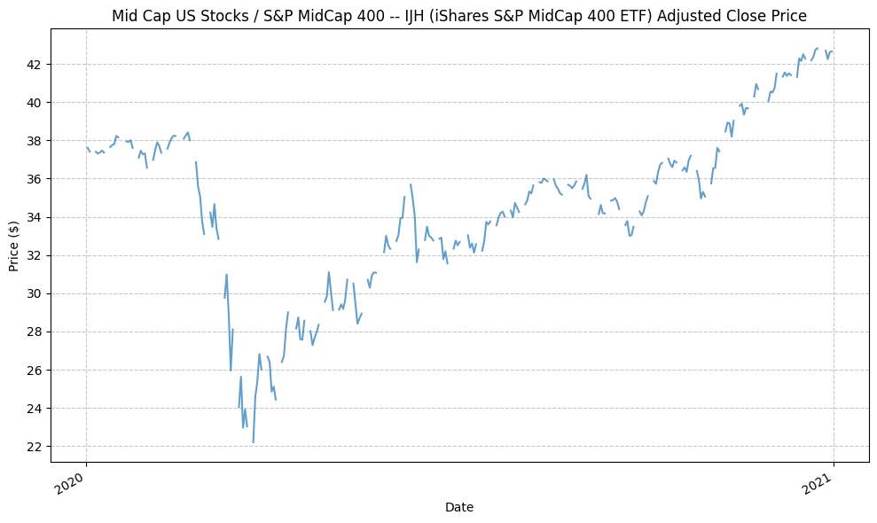
    


    
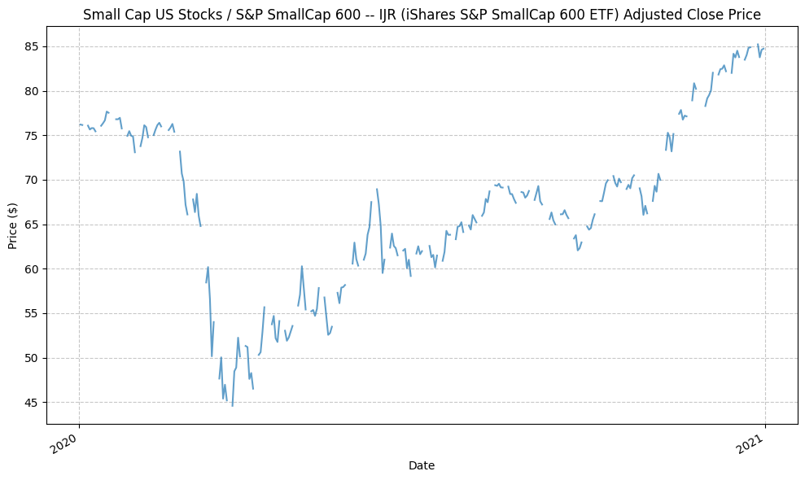
    


    
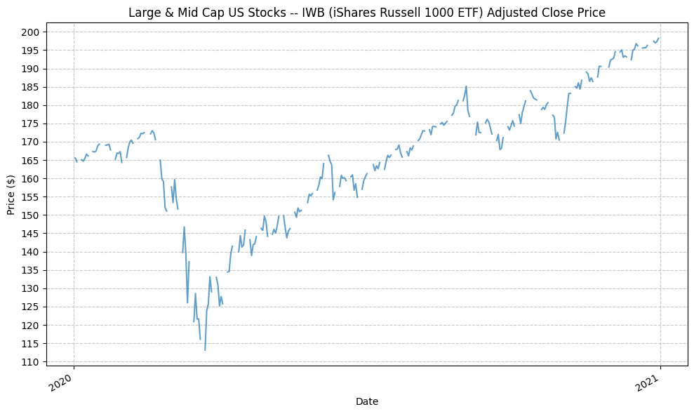
    


    
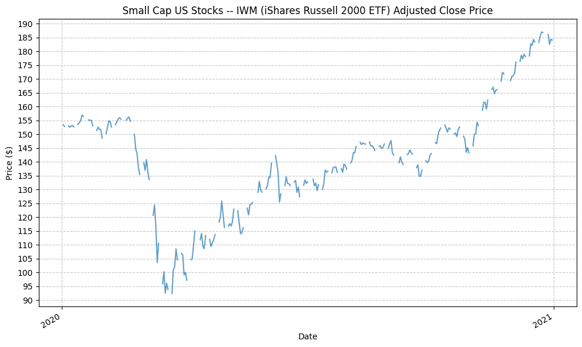
    


Now that we have the plots, we can proceed with an analysis of the rolling correlations and attempt to tie the changes in the rolling correlations to specific market events (e.g. the 2008 financial crisis, the COVID-19 pandemic, etc.) or broader market trends. Essentially, we want to find out if there are any interesting market trends or regimes that are precipitated by changes in the rolling correlations between asset classes. It's a common belief that correlations between assets classes increase (go towards 1) during times of market stress, so we will be looking to see if this is the case and if so does this change in correlation in any way predict market returns.

## Future Investigation

None for now.

## References

None for now.

## Code


