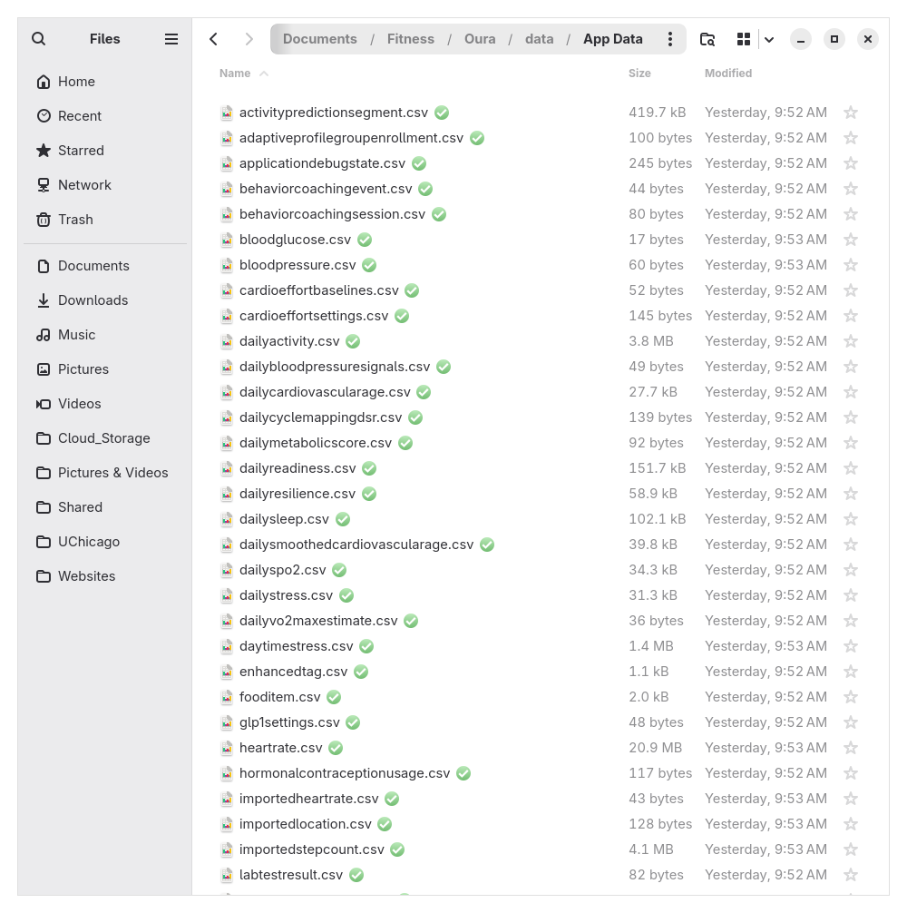
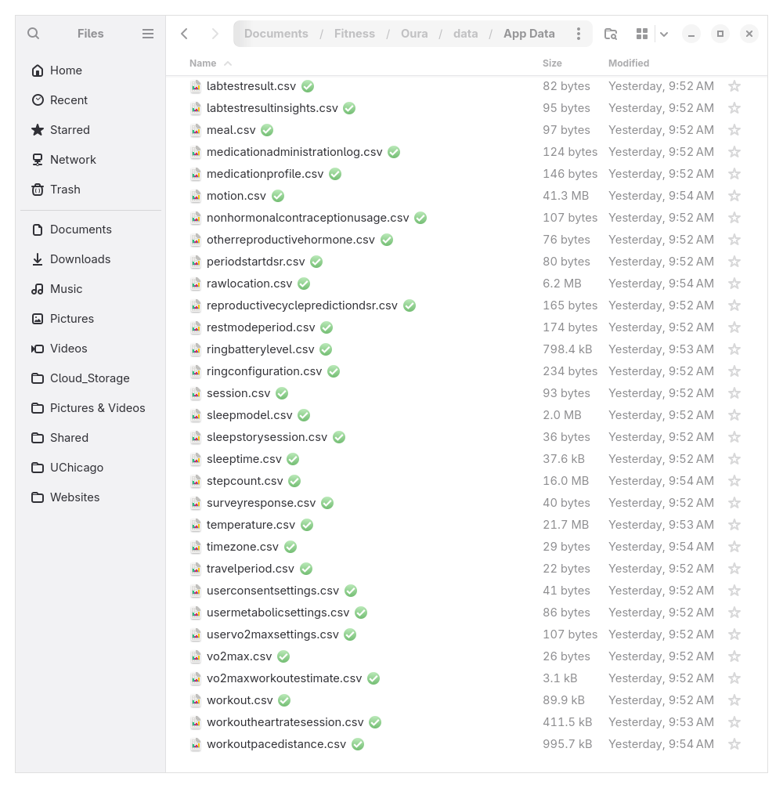

## Introduction

I wear an Oura ring daily to track sleep, readiness, workouts, etc. I also use Strava to view and gain insights from the workouts, and the sync from Oura to Strava normally happens without issue, with a few small tricks.

As long as you manually track the workout in Oura (not an automatically detected activity), then end and save the workout, and then open the Strava app, Strava should automatically open the workout and prompt for additional details before saving it.

Recently, I tracked a workout with the Oura ring, but when I opened Strava to sync the workout, it didn't show the map, distance, or heart rate, which was a little disappointing. I ended up deleting that workout from Strava. My guess is that I hadn't opened Strava since the upgrade to Android 17 on my Pixel 7, and something happened with the cached data or the app simply just glitched.

I did some research through the Oura and Strava documentation, as well as numerous Reddit threads, but ultimately it seemed that if the workout didn't successfully sync to Strava on the first attempt, there was no way to attempt the sync again or add the workout manually.

## Oura data export

I then ran across the Oura documentation for exporting raw data. This seemed promising at first - there must be a way to export a GPX file from Oura, and then manually upload to Strava, right? It turns out that when data is exported from Oura membership hub, it dumps CSV exports of (essentially) all the different data streams that are recorded, but it does not include any GPX files.




I started digging through the data, and quickly ran across the `workout.csv` file, which seemed to contain the high level workout data, including the session ID, activity type, calories burned, date, distance, start and end times, and a few other fields. I kept digging, and then found `rawlocation.csv`, `heartrate.csv`, and several other files that seemed relevant. Some of these files contain hundreds of thousands of lines, with second-by-second data.

## Script to create GPX file

With the CSV files in hand, I spun up Claude and began planning, with the initial prompt:

> I want to write a script that extracts all relevant data from each file in the repo for a specific session ID, to create a GPX file. Find the "id" column in "workouts.csv". From the session ID line in "workouts.csv", I want to extract the other column data for the session/workout. Then look through every other file in the repo for matching session ID data or data between the start and end dates of the workout.

I had the file name wrong (`workouts.csv` instead of `workout.csv`), but as expected Claude quickly figured out what I was referring to.

In short order, after a dozen or so prompt iterations, I created a Python script that took an input of the session ID, and produced a complete GPX file that could be uploaded into Strava or Garmin. The session export is attached below if you are interested in seeing the full prompt and response history.

There were a few clarifications along the way:

1. Claude wanted to know if I wanted sidecar JSON and Markdown files for data points that are not pat of the GPX standard
2. The script needed to isolate timestamps from the location file, based on the start and end times of the workout
3. The timezone for the location data was UTC, not CT/CST, so Claude needed to correct for that

After churning, it gave me the following response:

```text
● Here's everything the GPX carries. It's GPX 1.1 with the Garmin
  TrackPointExtension namespace.

  File-level (<metadata> + <trk>):
  - Track name — activity + day (e.g. running 2025-05-11)
  - Description — workout UUID + activity
  - Start time (UTC)

  Per trackpoint (<trkpt>), one point per rawlocation.csv row in the workout 
  window:

  ┌─────────────┬────────────────┬───────────────────────┬───────────────────┐
  │    Field    │  GPX element   │        Source         │       Notes       │
  ├─────────────┼────────────────┼───────────────────────┼───────────────────┤
  │             │                │                       │ always present    │
  │ Latitude    │ lat attribute  │ rawlocation.latitude  │ (points without   │
  │             │                │                       │ lat/lon are       │
  │             │                │                       │ skipped)          │
  ├─────────────┼────────────────┼───────────────────────┼───────────────────┤
  │ Longitude   │ lon attribute  │ rawlocation.longitude │ always present    │
  ├─────────────┼────────────────┼───────────────────────┼───────────────────┤
  │ Elevation   │ <ele>          │ rawlocation.altitude  │ meters; omitted   │
  │             │                │                       │ if blank          │
  ├─────────────┼────────────────┼───────────────────────┼───────────────────┤
  │ Timestamp   │ <time>         │ rawlocation.timestamp │ UTC, millisecond  │
  │             │                │                       │ precision         │
  ├─────────────┼────────────────┼───────────────────────┼───────────────────┤
  │ Heart rate  │ <gpxtpx:hr>    │ heartrate.bpm         │ nearest sample    │
  │             │                │                       │ within ±30 s      │
  ├─────────────┼────────────────┼───────────────────────┼───────────────────┤
  │             │                │                       │ derived           │
  │ Cadence     │ <gpxtpx:cad>   │ stepcount.steps       │ steps/min;        │
  │             │                │                       │ nearest bucket    │
  │             │                │                       │ within ±90 s      │
  ├─────────────┼────────────────┼───────────────────────┼───────────────────┤
  │             │                │                       │ nearest within ±5 │
  │ Temperature │ <gpxtpx:atemp> │ temperature.skin_temp │  min; this is     │
  │             │                │                       │ skin, not         │
  │             │                │                       │ ambient, temp     │
  ├─────────────┼────────────────┼───────────────────────┼───────────────────┤
  │             │                │                       │ m/s, taken        │
  │ Speed       │ <gpxtpx:speed> │ rawlocation.speed     │ directly from the │
  │             │                │                       │  same GPS row     │
  └─────────────┴────────────────┴───────────────────────┴───────────────────┘

  The four gpxtpx extension tags are each emitted only when a sample is found 
  within tolerance — so on a trackpoint where, say, HR is missing, that tag is
  simply omitted while position/time still render.

  A real enriched trackpoint (from the f4e23283… run):

  <trkpt lat="41.9143410" lon="-87.6682210">
    <ele>146.4</ele>
    <time>2025-05-11T10:56:26.192Z</time>
    <extensions>
      <gpxtpx:TrackPointExtension>
        <gpxtpx:hr>77</gpxtpx:hr>
        <gpxtpx:cad>150</gpxtpx:cad>
        <gpxtpx:atemp>22.9</gpxtpx:atemp>
        <gpxtpx:speed>0.00</gpxtpx:speed>
      </gpxtpx:TrackPointExtension>
    </extensions>
  </trkpt>

  What is not in the GPX (it lives only in the JSON/Markdown sidecars): the
  workout summary fields (calories, distance, intensity, label),
  motion/accelerometer data, ring battery, daily-summary scores
  (readiness/sleep/activity), workout-HR-session and activity-prediction
  records, and the raw GPS accuracy/course columns. Those don't have a standard
  GPX home, so they're reported alongside rather than embedded.

  Two of the embedded fields carry caveats worth repeating: cadence is computed
  from step counts (Oura has no true cadence sensor), and atemp is skin
  temperature that most tools will interpret as air temperature.
```

I tested it on a few workouts, and compared the resulting GPX file data to the native Oura data, and it matched up within reason (17.88 mi vs 17.71 mi, average pace of 14.4 mph vs 14.2 mph), certainly close enough for my purposes.

The one issue I encountered was that the GPX file for a cycling workout contained cadence data - which is not natively recorded by Oura. After bringing that issue to Claude's attention, it gated the cadence field for step-based workouts only (hiking, running, walking, etc.) to avoid incorrectly including cadence data.

I then asked Claude to create a new repo under my GitHub account, update the README, and push the changes to the repo, which can be found [here](https://github.com/jaredszajkowski/oura-data-analysis). See the README for complete instructions and other info.

Note that the Oura data is only stored locally and not uploaded to GitHub for privacy reasons (see the .gitignore file).

## Conclusion

I'm certainly open to any feedback or suggestions for improvement, and I hope this is helpful to anyone else who may be in a similar situation.

## References

1. https://membership.ouraring.com/data-export
2. https://support.strava.com/en-us/articles/15402066-how-to-get-your-activities-to-strava
3. https://www.topografix.com/gpx.asp
4. [Claude session history](Extract_data_for_a_specific_session.txt)
