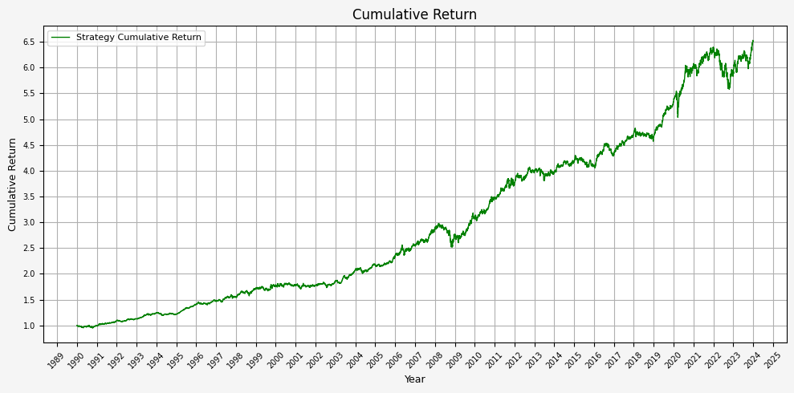
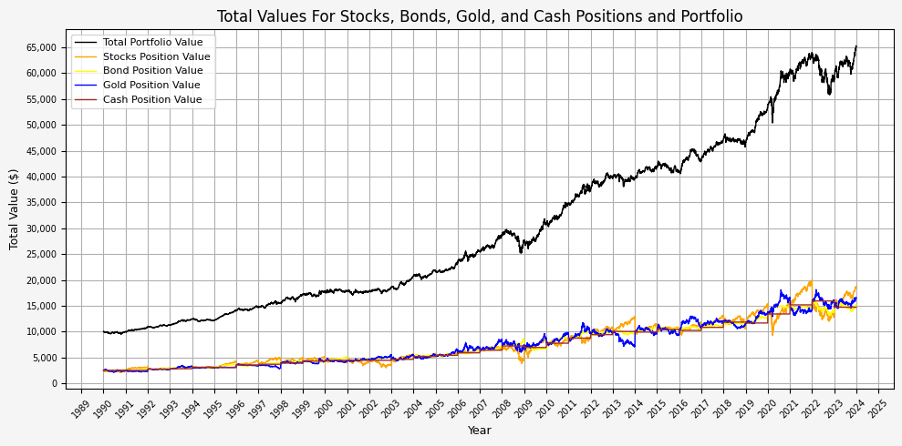
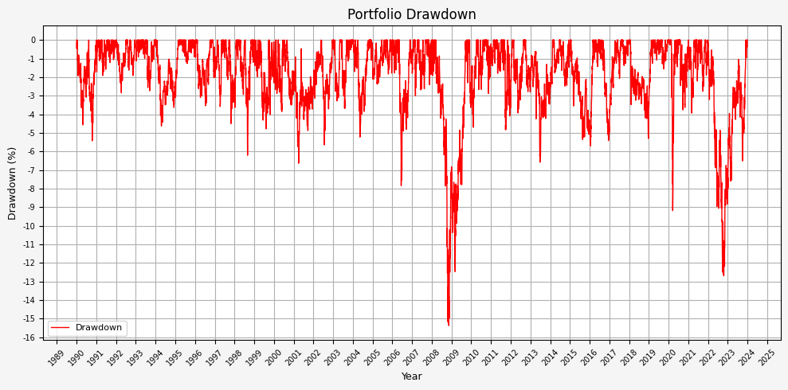
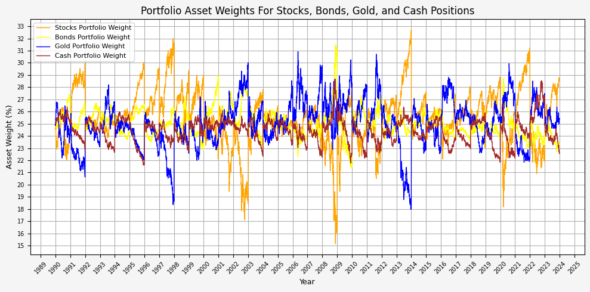
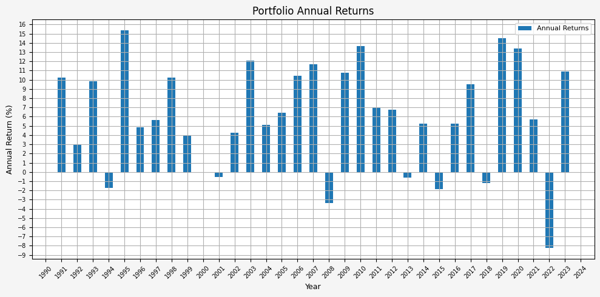

# Does Harry Browne's permanent portfolio withstand the test of time?

## Python Imports


```python
# Standard Library
import datetime
import io
import os
import random
import sys
import warnings

from datetime import datetime, timedelta
from pathlib import Path

# Data Handling
import numpy as np
import pandas as pd

# Data Visualization
import matplotlib.dates as mdates
import matplotlib.pyplot as plt
import matplotlib.ticker as mtick
import seaborn as sns
from matplotlib.ticker import FormatStrFormatter, FuncFormatter, MultipleLocator

# Data Sources
import yfinance as yf

# Statistical Analysis
import statsmodels.api as sm

# Machine Learning
from sklearn.decomposition import PCA
from sklearn.preprocessing import StandardScaler

# Suppress warnings
warnings.filterwarnings("ignore")
```

## Add Directories To Path


```python
# Add the source subdirectory to the system path to allow import config from settings.py
current_directory = Path(os.getcwd())
website_base_directory = current_directory.parent.parent.parent
src_directory = website_base_directory / "src"
sys.path.append(str(src_directory)) if str(src_directory) not in sys.path else None

# Import settings.py
from settings import config

# Add configured directories from config to path
SOURCE_DIR = config("SOURCE_DIR")
sys.path.append(str(Path(SOURCE_DIR))) if str(Path(SOURCE_DIR)) not in sys.path else None

# Add other configured directories
BASE_DIR = config("BASE_DIR")
CONTENT_DIR = config("CONTENT_DIR")
POSTS_DIR = config("POSTS_DIR")
PAGES_DIR = config("PAGES_DIR")
PUBLIC_DIR = config("PUBLIC_DIR")
SOURCE_DIR = config("SOURCE_DIR")
DATA_DIR = config("DATA_DIR")
DATA_MANUAL_DIR = config("DATA_MANUAL_DIR")

# Print system path
for i, path in enumerate(sys.path):
    print(f"{i}: {path}")
```

    0: /usr/lib/python313.zip
    1: /usr/lib/python3.13
    2: /usr/lib/python3.13/lib-dynload
    3: 
    4: /home/jared/python-virtual-envs/general-venv-p313/lib/python3.13/site-packages
    5: /home/jared/Cloud_Storage/Dropbox/Websites/jaredszajkowski.github.io/src


## Track Index Dependencies


```python
# Create file to track markdown dependencies
dep_file = Path("index_dep.txt")
dep_file.write_text("")
```


    0


## Python Functions


```python
from bb_clean_data import bb_clean_data
from df_info import df_info
from df_info_markdown import df_info_markdown
from export_track_md_deps import export_track_md_deps
from load_data import load_data
from pandas_set_decimal_places import pandas_set_decimal_places
from strategy_harry_brown_perm_port import strategy_harry_brown_perm_port
from summary_stats import summary_stats
```

## Data Overview

### Load Data


```python
# Set decimal places
pandas_set_decimal_places(2)

# Bonds dataframe
bb_clean_data(
    base_directory=DATA_DIR,
    fund_ticker_name="SPBDU10T_S&P US Treasury Bond 7-10 Year Total Return Index",
    source="Bloomberg",
    asset_class="Indices",
    excel_export=True,
    pickle_export=True,
    output_confirmation=True,
)

bonds_data = load_data(
    base_directory=DATA_DIR,
    ticker="SPBDU10T_S&P US Treasury Bond 7-10 Year Total Return Index_Clean",
    source="Bloomberg",
    asset_class="Indices",
    timeframe="Daily",
    file_format="excel",
)

bonds_data['Date'] = pd.to_datetime(bonds_data['Date'])
bonds_data.set_index('Date', inplace = True)
bonds_data = bonds_data[(bonds_data.index >= '1990-01-01') & (bonds_data.index <= '2023-12-31')]
bonds_data.rename(columns={'Close':'Bonds_Close'}, inplace=True)
bonds_data['Bonds_Daily_Return'] = bonds_data['Bonds_Close'].pct_change()
bonds_data['Bonds_Total_Return'] = (1 + bonds_data['Bonds_Daily_Return']).cumprod()
display(bonds_data.head())
```

    The first and last date of data for SPBDU10T_S&P US Treasury Bond 7-10 Year Total Return Index is: 


<div>
<style scoped>
    .dataframe tbody tr th:only-of-type {
        vertical-align: middle;
    }

    .dataframe tbody tr th {
        vertical-align: top;
    }

    .dataframe thead th {
        text-align: right;
    }
</style>
<table border="1" class="dataframe">
  <thead>
    <tr style="text-align: right;">
      <th></th>
      <th>Close</th>
    </tr>
    <tr>
      <th>Date</th>
      <th></th>
    </tr>
  </thead>
  <tbody>
    <tr>
      <th>1989-12-29</th>
      <td>100</td>
    </tr>
  </tbody>
</table>
</div>


<div>
<style scoped>
    .dataframe tbody tr th:only-of-type {
        vertical-align: middle;
    }

    .dataframe tbody tr th {
        vertical-align: top;
    }

    .dataframe thead th {
        text-align: right;
    }
</style>
<table border="1" class="dataframe">
  <thead>
    <tr style="text-align: right;">
      <th></th>
      <th>Close</th>
    </tr>
    <tr>
      <th>Date</th>
      <th></th>
    </tr>
  </thead>
  <tbody>
    <tr>
      <th>2026-01-30</th>
      <td>650.17</td>
    </tr>
  </tbody>
</table>
</div>


    Bloomberg data cleaning complete for SPBDU10T_S&P US Treasury Bond 7-10 Year Total Return Index
    --------------------


<div>
<style scoped>
    .dataframe tbody tr th:only-of-type {
        vertical-align: middle;
    }

    .dataframe tbody tr th {
        vertical-align: top;
    }

    .dataframe thead th {
        text-align: right;
    }
</style>
<table border="1" class="dataframe">
  <thead>
    <tr style="text-align: right;">
      <th></th>
      <th>Bonds_Close</th>
      <th>Bonds_Daily_Return</th>
      <th>Bonds_Total_Return</th>
    </tr>
    <tr>
      <th>Date</th>
      <th></th>
      <th></th>
      <th></th>
    </tr>
  </thead>
  <tbody>
    <tr>
      <th>1990-01-02</th>
      <td>99.97</td>
      <td>NaN</td>
      <td>NaN</td>
    </tr>
    <tr>
      <th>1990-01-03</th>
      <td>99.73</td>
      <td>-0.00</td>
      <td>1.00</td>
    </tr>
    <tr>
      <th>1990-01-04</th>
      <td>99.81</td>
      <td>0.00</td>
      <td>1.00</td>
    </tr>
    <tr>
      <th>1990-01-05</th>
      <td>99.77</td>
      <td>-0.00</td>
      <td>1.00</td>
    </tr>
    <tr>
      <th>1990-01-08</th>
      <td>99.68</td>
      <td>-0.00</td>
      <td>1.00</td>
    </tr>
  </tbody>
</table>
</div>


```python
# Copy this <!-- INSERT_01_Bonds_Data_Head_HERE --> to index_temp.md
export_track_md_deps(
    dep_file=dep_file, 
    md_filename="01_Bonds_Data_Head.md", 
    content=bonds_data.head().to_markdown(floatfmt=".3f"),
    output_type="markdown",
)
```

    ✅ Exported and tracked: 01_Bonds_Data_Head.md


```python
# Stocks dataframe
bb_clean_data(
    base_directory=DATA_DIR,
    fund_ticker_name="SPXT_S&P 500 Total Return Index",
    source="Bloomberg",
    asset_class="Indices",
    excel_export=True,
    pickle_export=True,
    output_confirmation=True,
)

stocks_data = load_data(
    base_directory=DATA_DIR,
    ticker="SPXT_S&P 500 Total Return Index_Clean",
    source="Bloomberg",
    asset_class="Indices",
    timeframe="Daily",
    file_format="excel",
)

stocks_data['Date'] = pd.to_datetime(stocks_data['Date'])
stocks_data.set_index('Date', inplace = True)
stocks_data = stocks_data[(stocks_data.index >= '1990-01-01') & (stocks_data.index <= '2023-12-31')]
stocks_data.rename(columns={'Close':'Stocks_Close'}, inplace=True)
stocks_data['Stocks_Daily_Return'] = stocks_data['Stocks_Close'].pct_change()
stocks_data['Stocks_Total_Return'] = (1 + stocks_data['Stocks_Daily_Return']).cumprod()
display(stocks_data.head())
```

    The first and last date of data for SPXT_S&P 500 Total Return Index is: 


<div>
<style scoped>
    .dataframe tbody tr th:only-of-type {
        vertical-align: middle;
    }

    .dataframe tbody tr th {
        vertical-align: top;
    }

    .dataframe thead th {
        text-align: right;
    }
</style>
<table border="1" class="dataframe">
  <thead>
    <tr style="text-align: right;">
      <th></th>
      <th>Close</th>
      <th>Open</th>
      <th>High</th>
      <th>Low</th>
    </tr>
    <tr>
      <th>Date</th>
      <th></th>
      <th></th>
      <th></th>
      <th></th>
    </tr>
  </thead>
  <tbody>
    <tr>
      <th>1989-09-11</th>
      <td>369.55</td>
      <td>369.55</td>
      <td>369.55</td>
      <td>369.55</td>
    </tr>
  </tbody>
</table>
</div>


<div>
<style scoped>
    .dataframe tbody tr th:only-of-type {
        vertical-align: middle;
    }

    .dataframe tbody tr th {
        vertical-align: top;
    }

    .dataframe thead th {
        text-align: right;
    }
</style>
<table border="1" class="dataframe">
  <thead>
    <tr style="text-align: right;">
      <th></th>
      <th>Close</th>
      <th>Open</th>
      <th>High</th>
      <th>Low</th>
    </tr>
    <tr>
      <th>Date</th>
      <th></th>
      <th></th>
      <th></th>
      <th></th>
    </tr>
  </thead>
  <tbody>
    <tr>
      <th>2026-01-30</th>
      <td>15441.15</td>
      <td>15459.48</td>
      <td>15496.54</td>
      <td>15340.40</td>
    </tr>
  </tbody>
</table>
</div>


    Bloomberg data cleaning complete for SPXT_S&P 500 Total Return Index
    --------------------


<div>
<style scoped>
    .dataframe tbody tr th:only-of-type {
        vertical-align: middle;
    }

    .dataframe tbody tr th {
        vertical-align: top;
    }

    .dataframe thead th {
        text-align: right;
    }
</style>
<table border="1" class="dataframe">
  <thead>
    <tr style="text-align: right;">
      <th></th>
      <th>Stocks_Close</th>
      <th>Open</th>
      <th>High</th>
      <th>Low</th>
      <th>Stocks_Daily_Return</th>
      <th>Stocks_Total_Return</th>
    </tr>
    <tr>
      <th>Date</th>
      <th></th>
      <th></th>
      <th></th>
      <th></th>
      <th></th>
      <th></th>
    </tr>
  </thead>
  <tbody>
    <tr>
      <th>1990-01-02</th>
      <td>386.16</td>
      <td>386.16</td>
      <td>386.16</td>
      <td>386.16</td>
      <td>NaN</td>
      <td>NaN</td>
    </tr>
    <tr>
      <th>1990-01-03</th>
      <td>385.17</td>
      <td>385.17</td>
      <td>385.17</td>
      <td>385.17</td>
      <td>-0.00</td>
      <td>1.00</td>
    </tr>
    <tr>
      <th>1990-01-04</th>
      <td>382.02</td>
      <td>382.02</td>
      <td>382.02</td>
      <td>382.02</td>
      <td>-0.01</td>
      <td>0.99</td>
    </tr>
    <tr>
      <th>1990-01-05</th>
      <td>378.30</td>
      <td>378.30</td>
      <td>378.30</td>
      <td>378.30</td>
      <td>-0.01</td>
      <td>0.98</td>
    </tr>
    <tr>
      <th>1990-01-08</th>
      <td>380.04</td>
      <td>380.04</td>
      <td>380.04</td>
      <td>380.04</td>
      <td>0.00</td>
      <td>0.98</td>
    </tr>
  </tbody>
</table>
</div>


```python
# Copy this <!-- INSERT_01_Stocks_Data_Head_HERE --> to index_temp.md
export_track_md_deps(
    dep_file=dep_file, 
    md_filename="01_Stocks_Data_Head.md", 
    content=stocks_data.head().to_markdown(floatfmt=".3f"),
    output_type="markdown",
)
```

    ✅ Exported and tracked: 01_Stocks_Data_Head.md


```python
# Gold dataframe
bb_clean_data(
    base_directory=DATA_DIR,
    fund_ticker_name="XAU_Gold USD Spot",
    source="Bloomberg",
    asset_class="Commodities",
    excel_export=True,
    pickle_export=True,
    output_confirmation=True,
)

gold_data = load_data(
    base_directory=DATA_DIR,
    ticker="XAU_Gold USD Spot_Clean",
    source="Bloomberg",
    asset_class="Commodities",
    timeframe="Daily",
    file_format="excel",
)

gold_data['Date'] = pd.to_datetime(gold_data['Date'])
gold_data.set_index('Date', inplace = True)
gold_data = gold_data[(gold_data.index >= '1990-01-01') & (gold_data.index <= '2023-12-31')]
gold_data.rename(columns={'Close':'Gold_Close'}, inplace=True)
gold_data['Gold_Daily_Return'] = gold_data['Gold_Close'].pct_change()
gold_data['Gold_Total_Return'] = (1 + gold_data['Gold_Daily_Return']).cumprod()
display(gold_data.head())
```

    The first and last date of data for XAU_Gold USD Spot is: 


<div>
<style scoped>
    .dataframe tbody tr th:only-of-type {
        vertical-align: middle;
    }

    .dataframe tbody tr th {
        vertical-align: top;
    }

    .dataframe thead th {
        text-align: right;
    }
</style>
<table border="1" class="dataframe">
  <thead>
    <tr style="text-align: right;">
      <th></th>
      <th>Close</th>
    </tr>
    <tr>
      <th>Date</th>
      <th></th>
    </tr>
  </thead>
  <tbody>
    <tr>
      <th>1975-01-02</th>
      <td>175</td>
    </tr>
  </tbody>
</table>
</div>


<div>
<style scoped>
    .dataframe tbody tr th:only-of-type {
        vertical-align: middle;
    }

    .dataframe tbody tr th {
        vertical-align: top;
    }

    .dataframe thead th {
        text-align: right;
    }
</style>
<table border="1" class="dataframe">
  <thead>
    <tr style="text-align: right;">
      <th></th>
      <th>Close</th>
    </tr>
    <tr>
      <th>Date</th>
      <th></th>
    </tr>
  </thead>
  <tbody>
    <tr>
      <th>2026-02-02</th>
      <td>4664.05</td>
    </tr>
  </tbody>
</table>
</div>


    Bloomberg data cleaning complete for XAU_Gold USD Spot
    --------------------


<div>
<style scoped>
    .dataframe tbody tr th:only-of-type {
        vertical-align: middle;
    }

    .dataframe tbody tr th {
        vertical-align: top;
    }

    .dataframe thead th {
        text-align: right;
    }
</style>
<table border="1" class="dataframe">
  <thead>
    <tr style="text-align: right;">
      <th></th>
      <th>Gold_Close</th>
      <th>Gold_Daily_Return</th>
      <th>Gold_Total_Return</th>
    </tr>
    <tr>
      <th>Date</th>
      <th></th>
      <th></th>
      <th></th>
    </tr>
  </thead>
  <tbody>
    <tr>
      <th>1990-01-02</th>
      <td>399.00</td>
      <td>NaN</td>
      <td>NaN</td>
    </tr>
    <tr>
      <th>1990-01-03</th>
      <td>395.00</td>
      <td>-0.01</td>
      <td>0.99</td>
    </tr>
    <tr>
      <th>1990-01-04</th>
      <td>396.50</td>
      <td>0.00</td>
      <td>0.99</td>
    </tr>
    <tr>
      <th>1990-01-05</th>
      <td>405.00</td>
      <td>0.02</td>
      <td>1.02</td>
    </tr>
    <tr>
      <th>1990-01-08</th>
      <td>404.60</td>
      <td>-0.00</td>
      <td>1.01</td>
    </tr>
  </tbody>
</table>
</div>


```python
# Copy this <!-- INSERT_01_Gold_Data_Head_HERE --> to index_temp.md
export_track_md_deps(
    dep_file=dep_file, 
    md_filename="01_Gold_Data_Head.md", 
    content=gold_data.head().to_markdown(floatfmt=".3f"),
    output_type="markdown",
)
```

    ✅ Exported and tracked: 01_Gold_Data_Head.md


### Combine Data


```python
# Merge the stock data and bond data into a single DataFrame using their indices (dates)
perm_port = pd.merge(stocks_data['Stocks_Close'], bonds_data['Bonds_Close'], left_index=True, right_index=True)

# Add gold data to the portfolio DataFrame by merging it with the existing data on indices (dates)
perm_port = pd.merge(perm_port, gold_data['Gold_Close'], left_index=True, right_index=True)

# Add a column for cash with a constant value of 1 (assumes the value of cash remains constant at $1 over time)
perm_port['Cash_Close'] = 1

# Remove any rows with missing values (NaN) to ensure clean data for further analysis
perm_port.dropna(inplace=True)

# Display the finalized portfolio DataFrame
display(perm_port)
```


<div>
<style scoped>
    .dataframe tbody tr th:only-of-type {
        vertical-align: middle;
    }

    .dataframe tbody tr th {
        vertical-align: top;
    }

    .dataframe thead th {
        text-align: right;
    }
</style>
<table border="1" class="dataframe">
  <thead>
    <tr style="text-align: right;">
      <th></th>
      <th>Stocks_Close</th>
      <th>Bonds_Close</th>
      <th>Gold_Close</th>
      <th>Cash_Close</th>
    </tr>
    <tr>
      <th>Date</th>
      <th></th>
      <th></th>
      <th></th>
      <th></th>
    </tr>
  </thead>
  <tbody>
    <tr>
      <th>1990-01-02</th>
      <td>386.16</td>
      <td>99.97</td>
      <td>399.00</td>
      <td>1</td>
    </tr>
    <tr>
      <th>1990-01-03</th>
      <td>385.17</td>
      <td>99.73</td>
      <td>395.00</td>
      <td>1</td>
    </tr>
    <tr>
      <th>1990-01-04</th>
      <td>382.02</td>
      <td>99.81</td>
      <td>396.50</td>
      <td>1</td>
    </tr>
    <tr>
      <th>1990-01-05</th>
      <td>378.30</td>
      <td>99.77</td>
      <td>405.00</td>
      <td>1</td>
    </tr>
    <tr>
      <th>1990-01-08</th>
      <td>380.04</td>
      <td>99.68</td>
      <td>404.60</td>
      <td>1</td>
    </tr>
    <tr>
      <th>...</th>
      <td>...</td>
      <td>...</td>
      <td>...</td>
      <td>...</td>
    </tr>
    <tr>
      <th>2023-12-22</th>
      <td>10292.37</td>
      <td>604.17</td>
      <td>2053.08</td>
      <td>1</td>
    </tr>
    <tr>
      <th>2023-12-26</th>
      <td>10335.98</td>
      <td>604.55</td>
      <td>2067.81</td>
      <td>1</td>
    </tr>
    <tr>
      <th>2023-12-27</th>
      <td>10351.60</td>
      <td>609.36</td>
      <td>2077.49</td>
      <td>1</td>
    </tr>
    <tr>
      <th>2023-12-28</th>
      <td>10356.59</td>
      <td>606.83</td>
      <td>2065.61</td>
      <td>1</td>
    </tr>
    <tr>
      <th>2023-12-29</th>
      <td>10327.83</td>
      <td>606.18</td>
      <td>2062.98</td>
      <td>1</td>
    </tr>
  </tbody>
</table>
<p>8479 rows × 4 columns</p>
</div>


### Check For Missing Values


```python
# Check for any missing values in each column
perm_port.isnull().any()
```


    Stocks_Close    False
    Bonds_Close     False
    Gold_Close      False
    Cash_Close      False
    dtype: bool


### Permanent Portfolio DataFrame Info


```python
df_info(perm_port)
```

    The columns, shape, and data types are:
    <class 'pandas.core.frame.DataFrame'>
    DatetimeIndex: 8479 entries, 1990-01-02 to 2023-12-29
    Data columns (total 4 columns):
     #   Column        Non-Null Count  Dtype  
    ---  ------        --------------  -----  
     0   Stocks_Close  8479 non-null   float64
     1   Bonds_Close   8479 non-null   float64
     2   Gold_Close    8479 non-null   float64
     3   Cash_Close    8479 non-null   int64  
    dtypes: float64(3), int64(1)
    memory usage: 331.2 KB
    None
    The first 5 rows are:


<div>
<style scoped>
    .dataframe tbody tr th:only-of-type {
        vertical-align: middle;
    }

    .dataframe tbody tr th {
        vertical-align: top;
    }

    .dataframe thead th {
        text-align: right;
    }
</style>
<table border="1" class="dataframe">
  <thead>
    <tr style="text-align: right;">
      <th></th>
      <th>Stocks_Close</th>
      <th>Bonds_Close</th>
      <th>Gold_Close</th>
      <th>Cash_Close</th>
    </tr>
    <tr>
      <th>Date</th>
      <th></th>
      <th></th>
      <th></th>
      <th></th>
    </tr>
  </thead>
  <tbody>
    <tr>
      <th>1990-01-02</th>
      <td>386.16</td>
      <td>99.97</td>
      <td>399.00</td>
      <td>1</td>
    </tr>
    <tr>
      <th>1990-01-03</th>
      <td>385.17</td>
      <td>99.73</td>
      <td>395.00</td>
      <td>1</td>
    </tr>
    <tr>
      <th>1990-01-04</th>
      <td>382.02</td>
      <td>99.81</td>
      <td>396.50</td>
      <td>1</td>
    </tr>
    <tr>
      <th>1990-01-05</th>
      <td>378.30</td>
      <td>99.77</td>
      <td>405.00</td>
      <td>1</td>
    </tr>
    <tr>
      <th>1990-01-08</th>
      <td>380.04</td>
      <td>99.68</td>
      <td>404.60</td>
      <td>1</td>
    </tr>
  </tbody>
</table>
</div>


    The last 5 rows are:


<div>
<style scoped>
    .dataframe tbody tr th:only-of-type {
        vertical-align: middle;
    }

    .dataframe tbody tr th {
        vertical-align: top;
    }

    .dataframe thead th {
        text-align: right;
    }
</style>
<table border="1" class="dataframe">
  <thead>
    <tr style="text-align: right;">
      <th></th>
      <th>Stocks_Close</th>
      <th>Bonds_Close</th>
      <th>Gold_Close</th>
      <th>Cash_Close</th>
    </tr>
    <tr>
      <th>Date</th>
      <th></th>
      <th></th>
      <th></th>
      <th></th>
    </tr>
  </thead>
  <tbody>
    <tr>
      <th>2023-12-22</th>
      <td>10292.37</td>
      <td>604.17</td>
      <td>2053.08</td>
      <td>1</td>
    </tr>
    <tr>
      <th>2023-12-26</th>
      <td>10335.98</td>
      <td>604.55</td>
      <td>2067.81</td>
      <td>1</td>
    </tr>
    <tr>
      <th>2023-12-27</th>
      <td>10351.60</td>
      <td>609.36</td>
      <td>2077.49</td>
      <td>1</td>
    </tr>
    <tr>
      <th>2023-12-28</th>
      <td>10356.59</td>
      <td>606.83</td>
      <td>2065.61</td>
      <td>1</td>
    </tr>
    <tr>
      <th>2023-12-29</th>
      <td>10327.83</td>
      <td>606.18</td>
      <td>2062.98</td>
      <td>1</td>
    </tr>
  </tbody>
</table>
</div>


```python
# Copy this <!-- INSERT_02_Perm_Port_DF_Info_HERE --> to index_temp.md
export_track_md_deps(
    dep_file=dep_file, 
    md_filename="02_Perm_Port_DF_Info.md", 
    content=df_info_markdown(perm_port),
    output_type="markdown",
)
```

    ✅ Exported and tracked: 02_Perm_Port_DF_Info.md


## Execute Strategy


```python
# List of funds to be used
fund_list = ['Stocks', 'Bonds', 'Gold', 'Cash']

# Starting cash contribution
starting_cash = 10000

# Monthly cash contribution
cash_contrib = 0

strat = strategy_harry_brown_perm_port(
    fund_list=fund_list, 
    starting_cash=starting_cash, 
    cash_contrib=cash_contrib, 
    close_prices_df=perm_port, 
    rebal_month=1, 
    rebal_day=1, 
    rebal_per_high=0.35, 
    rebal_per_low=0.15,
    excel_export=True,
    pickle_export=True,
    output_confirmation=True,
)

strat = strat.set_index('Date')
```

    Strategy complete for Stocks_Bonds_Gold_Cash


```python
df_info(strat)
```

    The columns, shape, and data types are:
    <class 'pandas.core.frame.DataFrame'>
    DatetimeIndex: 8479 entries, 1990-01-02 to 2023-12-29
    Data columns (total 34 columns):
     #   Column                Non-Null Count  Dtype  
    ---  ------                --------------  -----  
     0   Stocks_Close          8479 non-null   float64
     1   Bonds_Close           8479 non-null   float64
     2   Gold_Close            8479 non-null   float64
     3   Cash_Close            8479 non-null   int64  
     4   Stocks_BA_Shares      8479 non-null   float64
     5   Stocks_BA_$_Invested  8479 non-null   float64
     6   Stocks_BA_Port_%      8479 non-null   float64
     7   Bonds_BA_Shares       8479 non-null   float64
     8   Bonds_BA_$_Invested   8479 non-null   float64
     9   Bonds_BA_Port_%       8479 non-null   float64
     10  Gold_BA_Shares        8479 non-null   float64
     11  Gold_BA_$_Invested    8479 non-null   float64
     12  Gold_BA_Port_%        8479 non-null   float64
     13  Cash_BA_Shares        8479 non-null   float64
     14  Cash_BA_$_Invested    8479 non-null   float64
     15  Cash_BA_Port_%        8479 non-null   float64
     16  Total_BA_$_Invested   8479 non-null   float64
     17  Contribution          8479 non-null   int64  
     18  Rebalance             8479 non-null   object 
     19  Stocks_AA_Shares      8479 non-null   float64
     20  Stocks_AA_$_Invested  8479 non-null   float64
     21  Stocks_AA_Port_%      8479 non-null   float64
     22  Bonds_AA_Shares       8479 non-null   float64
     23  Bonds_AA_$_Invested   8479 non-null   float64
     24  Bonds_AA_Port_%       8479 non-null   float64
     25  Gold_AA_Shares        8479 non-null   float64
     26  Gold_AA_$_Invested    8479 non-null   float64
     27  Gold_AA_Port_%        8479 non-null   float64
     28  Cash_AA_Shares        8479 non-null   float64
     29  Cash_AA_$_Invested    8479 non-null   float64
     30  Cash_AA_Port_%        8479 non-null   float64
     31  Total_AA_$_Invested   8479 non-null   float64
     32  Return                8478 non-null   float64
     33  Cumulative_Return     8478 non-null   float64
    dtypes: float64(31), int64(2), object(1)
    memory usage: 2.3+ MB
    None
    The first 5 rows are:


<div>
<style scoped>
    .dataframe tbody tr th:only-of-type {
        vertical-align: middle;
    }

    .dataframe tbody tr th {
        vertical-align: top;
    }

    .dataframe thead th {
        text-align: right;
    }
</style>
<table border="1" class="dataframe">
  <thead>
    <tr style="text-align: right;">
      <th></th>
      <th>Stocks_Close</th>
      <th>Bonds_Close</th>
      <th>Gold_Close</th>
      <th>Cash_Close</th>
      <th>Stocks_BA_Shares</th>
      <th>Stocks_BA_$_Invested</th>
      <th>Stocks_BA_Port_%</th>
      <th>Bonds_BA_Shares</th>
      <th>Bonds_BA_$_Invested</th>
      <th>Bonds_BA_Port_%</th>
      <th>...</th>
      <th>Bonds_AA_Port_%</th>
      <th>Gold_AA_Shares</th>
      <th>Gold_AA_$_Invested</th>
      <th>Gold_AA_Port_%</th>
      <th>Cash_AA_Shares</th>
      <th>Cash_AA_$_Invested</th>
      <th>Cash_AA_Port_%</th>
      <th>Total_AA_$_Invested</th>
      <th>Return</th>
      <th>Cumulative_Return</th>
    </tr>
    <tr>
      <th>Date</th>
      <th></th>
      <th></th>
      <th></th>
      <th></th>
      <th></th>
      <th></th>
      <th></th>
      <th></th>
      <th></th>
      <th></th>
      <th></th>
      <th></th>
      <th></th>
      <th></th>
      <th></th>
      <th></th>
      <th></th>
      <th></th>
      <th></th>
      <th></th>
      <th></th>
    </tr>
  </thead>
  <tbody>
    <tr>
      <th>1990-01-02</th>
      <td>386.16</td>
      <td>99.97</td>
      <td>399.00</td>
      <td>1</td>
      <td>6.47</td>
      <td>2500.00</td>
      <td>0.25</td>
      <td>25.01</td>
      <td>2500.00</td>
      <td>0.25</td>
      <td>...</td>
      <td>0.25</td>
      <td>6.27</td>
      <td>2500.00</td>
      <td>0.25</td>
      <td>2500.00</td>
      <td>2500.00</td>
      <td>0.25</td>
      <td>10000.00</td>
      <td>NaN</td>
      <td>NaN</td>
    </tr>
    <tr>
      <th>1990-01-03</th>
      <td>385.17</td>
      <td>99.73</td>
      <td>395.00</td>
      <td>1</td>
      <td>6.47</td>
      <td>2493.59</td>
      <td>0.25</td>
      <td>25.01</td>
      <td>2494.02</td>
      <td>0.25</td>
      <td>...</td>
      <td>0.25</td>
      <td>6.27</td>
      <td>2474.94</td>
      <td>0.25</td>
      <td>2500.00</td>
      <td>2500.00</td>
      <td>0.25</td>
      <td>9962.55</td>
      <td>-0.00</td>
      <td>1.00</td>
    </tr>
    <tr>
      <th>1990-01-04</th>
      <td>382.02</td>
      <td>99.81</td>
      <td>396.50</td>
      <td>1</td>
      <td>6.47</td>
      <td>2473.20</td>
      <td>0.25</td>
      <td>25.01</td>
      <td>2496.02</td>
      <td>0.25</td>
      <td>...</td>
      <td>0.25</td>
      <td>6.27</td>
      <td>2484.34</td>
      <td>0.25</td>
      <td>2500.00</td>
      <td>2500.00</td>
      <td>0.25</td>
      <td>9953.56</td>
      <td>-0.00</td>
      <td>1.00</td>
    </tr>
    <tr>
      <th>1990-01-05</th>
      <td>378.30</td>
      <td>99.77</td>
      <td>405.00</td>
      <td>1</td>
      <td>6.47</td>
      <td>2449.11</td>
      <td>0.25</td>
      <td>25.01</td>
      <td>2494.92</td>
      <td>0.25</td>
      <td>...</td>
      <td>0.25</td>
      <td>6.27</td>
      <td>2537.59</td>
      <td>0.25</td>
      <td>2500.00</td>
      <td>2500.00</td>
      <td>0.25</td>
      <td>9981.63</td>
      <td>0.00</td>
      <td>1.00</td>
    </tr>
    <tr>
      <th>1990-01-08</th>
      <td>380.04</td>
      <td>99.68</td>
      <td>404.60</td>
      <td>1</td>
      <td>6.47</td>
      <td>2460.38</td>
      <td>0.25</td>
      <td>25.01</td>
      <td>2492.72</td>
      <td>0.25</td>
      <td>...</td>
      <td>0.25</td>
      <td>6.27</td>
      <td>2535.09</td>
      <td>0.25</td>
      <td>2500.00</td>
      <td>2500.00</td>
      <td>0.25</td>
      <td>9988.19</td>
      <td>0.00</td>
      <td>1.00</td>
    </tr>
  </tbody>
</table>
<p>5 rows × 34 columns</p>
</div>


    The last 5 rows are:


<div>
<style scoped>
    .dataframe tbody tr th:only-of-type {
        vertical-align: middle;
    }

    .dataframe tbody tr th {
        vertical-align: top;
    }

    .dataframe thead th {
        text-align: right;
    }
</style>
<table border="1" class="dataframe">
  <thead>
    <tr style="text-align: right;">
      <th></th>
      <th>Stocks_Close</th>
      <th>Bonds_Close</th>
      <th>Gold_Close</th>
      <th>Cash_Close</th>
      <th>Stocks_BA_Shares</th>
      <th>Stocks_BA_$_Invested</th>
      <th>Stocks_BA_Port_%</th>
      <th>Bonds_BA_Shares</th>
      <th>Bonds_BA_$_Invested</th>
      <th>Bonds_BA_Port_%</th>
      <th>...</th>
      <th>Bonds_AA_Port_%</th>
      <th>Gold_AA_Shares</th>
      <th>Gold_AA_$_Invested</th>
      <th>Gold_AA_Port_%</th>
      <th>Cash_AA_Shares</th>
      <th>Cash_AA_$_Invested</th>
      <th>Cash_AA_Port_%</th>
      <th>Total_AA_$_Invested</th>
      <th>Return</th>
      <th>Cumulative_Return</th>
    </tr>
    <tr>
      <th>Date</th>
      <th></th>
      <th></th>
      <th></th>
      <th></th>
      <th></th>
      <th></th>
      <th></th>
      <th></th>
      <th></th>
      <th></th>
      <th></th>
      <th></th>
      <th></th>
      <th></th>
      <th></th>
      <th></th>
      <th></th>
      <th></th>
      <th></th>
      <th></th>
      <th></th>
    </tr>
  </thead>
  <tbody>
    <tr>
      <th>2023-12-22</th>
      <td>10292.37</td>
      <td>604.17</td>
      <td>2053.08</td>
      <td>1</td>
      <td>1.81</td>
      <td>18595.87</td>
      <td>0.29</td>
      <td>25.03</td>
      <td>15124.46</td>
      <td>0.23</td>
      <td>...</td>
      <td>0.23</td>
      <td>8.00</td>
      <td>16426.12</td>
      <td>0.25</td>
      <td>14717.17</td>
      <td>14717.17</td>
      <td>0.23</td>
      <td>64863.62</td>
      <td>0.00</td>
      <td>6.49</td>
    </tr>
    <tr>
      <th>2023-12-26</th>
      <td>10335.98</td>
      <td>604.55</td>
      <td>2067.81</td>
      <td>1</td>
      <td>1.81</td>
      <td>18674.66</td>
      <td>0.29</td>
      <td>25.03</td>
      <td>15134.20</td>
      <td>0.23</td>
      <td>...</td>
      <td>0.23</td>
      <td>8.00</td>
      <td>16543.97</td>
      <td>0.25</td>
      <td>14717.17</td>
      <td>14717.17</td>
      <td>0.23</td>
      <td>65070.01</td>
      <td>0.00</td>
      <td>6.51</td>
    </tr>
    <tr>
      <th>2023-12-27</th>
      <td>10351.60</td>
      <td>609.36</td>
      <td>2077.49</td>
      <td>1</td>
      <td>1.81</td>
      <td>18702.89</td>
      <td>0.29</td>
      <td>25.03</td>
      <td>15254.36</td>
      <td>0.23</td>
      <td>...</td>
      <td>0.23</td>
      <td>8.00</td>
      <td>16621.42</td>
      <td>0.25</td>
      <td>14717.17</td>
      <td>14717.17</td>
      <td>0.23</td>
      <td>65295.84</td>
      <td>0.00</td>
      <td>6.53</td>
    </tr>
    <tr>
      <th>2023-12-28</th>
      <td>10356.59</td>
      <td>606.83</td>
      <td>2065.61</td>
      <td>1</td>
      <td>1.81</td>
      <td>18711.90</td>
      <td>0.29</td>
      <td>25.03</td>
      <td>15191.10</td>
      <td>0.23</td>
      <td>...</td>
      <td>0.23</td>
      <td>8.00</td>
      <td>16526.37</td>
      <td>0.25</td>
      <td>14717.17</td>
      <td>14717.17</td>
      <td>0.23</td>
      <td>65146.54</td>
      <td>-0.00</td>
      <td>6.51</td>
    </tr>
    <tr>
      <th>2023-12-29</th>
      <td>10327.83</td>
      <td>606.18</td>
      <td>2062.98</td>
      <td>1</td>
      <td>1.81</td>
      <td>18659.94</td>
      <td>0.29</td>
      <td>25.03</td>
      <td>15175.01</td>
      <td>0.23</td>
      <td>...</td>
      <td>0.23</td>
      <td>8.00</td>
      <td>16505.33</td>
      <td>0.25</td>
      <td>14717.17</td>
      <td>14717.17</td>
      <td>0.23</td>
      <td>65057.44</td>
      <td>-0.00</td>
      <td>6.51</td>
    </tr>
  </tbody>
</table>
<p>5 rows × 34 columns</p>
</div>


```python
# Copy this <!-- INSERT_03_Strategy_HERE --> to index_temp.md
export_track_md_deps(
    dep_file=dep_file, 
    md_filename="03_Strategy.md", 
    content=df_info_markdown(strat),
    output_type="markdown",
)
```

    ✅ Exported and tracked: 03_Strategy.md


## Summary Statistics


```python
sum_stats = summary_stats(
    fund_list=fund_list,
    df=strat[['Return']],
    period="Daily",
    use_calendar_days=False,
    excel_export=True,
    pickle_export=True,
    output_confirmation=True,
)

strat_pre_1999 = strat[strat.index < '2000-01-01']
sum_stats_pre_1999 = summary_stats(
    fund_list=fund_list, 
    df=strat_pre_1999[['Return']], 
    period="Daily",
    use_calendar_days=False,
    excel_export=False,
    pickle_export=False,
    output_confirmation=True,
)

strat_post_1999 = strat[strat.index >= '2000-01-01']
sum_stats_post_1999 = summary_stats(
    fund_list=fund_list, 
    df=strat_post_1999[['Return']], 
    period="Daily",
    use_calendar_days=False,
    excel_export=False,
    pickle_export=False,
    output_confirmation=True,
)

strat_post_2009 = strat[strat.index >= '2010-01-01']
sum_stats_post_2009 = summary_stats(
    fund_list=fund_list, 
    df=strat_post_2009[['Return']], 
    period="Daily",
    use_calendar_days=False,
    excel_export=False,
    pickle_export=False,
    output_confirmation=True,
)
```

    Summary stats complete for Stocks_Bonds_Gold_Cash
    Summary stats complete for Stocks_Bonds_Gold_Cash
    Summary stats complete for Stocks_Bonds_Gold_Cash
    Summary stats complete for Stocks_Bonds_Gold_Cash


```python
all_sum_stats = pd.concat([sum_stats])
all_sum_stats = all_sum_stats.rename(index={'Return': '1990 - 2023'})
all_sum_stats = pd.concat([all_sum_stats, sum_stats_pre_1999])
all_sum_stats = all_sum_stats.rename(index={'Return': 'Pre 1999'})
all_sum_stats = pd.concat([all_sum_stats, sum_stats_post_1999])
all_sum_stats = all_sum_stats.rename(index={'Return': 'Post 1999'})
all_sum_stats = pd.concat([all_sum_stats, sum_stats_post_2009])
all_sum_stats = all_sum_stats.rename(index={'Return': 'Post 2009'})
display(all_sum_stats)
```


<div>
<style scoped>
    .dataframe tbody tr th:only-of-type {
        vertical-align: middle;
    }

    .dataframe tbody tr th {
        vertical-align: top;
    }

    .dataframe thead th {
        text-align: right;
    }
</style>
<table border="1" class="dataframe">
  <thead>
    <tr style="text-align: right;">
      <th></th>
      <th>Annual Mean Return (Arithmetic)</th>
      <th>Annualized Volatility</th>
      <th>Annualized Sharpe Ratio</th>
      <th>CAGR (Geometric)</th>
      <th>Daily Max Return</th>
      <th>Daily Max Return (Date)</th>
      <th>Daily Min Return</th>
      <th>Daily Min Return (Date)</th>
      <th>Max Drawdown</th>
      <th>Peak</th>
      <th>Trough</th>
      <th>Recovery Date</th>
      <th>Calendar Days to Recovery</th>
      <th>MAR Ratio</th>
    </tr>
  </thead>
  <tbody>
    <tr>
      <th>1990 - 2023</th>
      <td>0.06</td>
      <td>0.06</td>
      <td>0.96</td>
      <td>0.06</td>
      <td>0.03</td>
      <td>2020-03-24</td>
      <td>-0.03</td>
      <td>2020-03-12</td>
      <td>-0.15</td>
      <td>2008-03-18</td>
      <td>2008-11-12</td>
      <td>2009-10-06</td>
      <td>328</td>
      <td>0.37</td>
    </tr>
    <tr>
      <th>Pre 1999</th>
      <td>0.06</td>
      <td>0.05</td>
      <td>1.21</td>
      <td>0.06</td>
      <td>0.02</td>
      <td>1999-09-28</td>
      <td>-0.02</td>
      <td>1993-08-05</td>
      <td>-0.06</td>
      <td>1998-07-20</td>
      <td>1998-08-31</td>
      <td>1998-11-05</td>
      <td>66</td>
      <td>0.98</td>
    </tr>
    <tr>
      <th>Post 1999</th>
      <td>0.06</td>
      <td>0.06</td>
      <td>0.88</td>
      <td>0.06</td>
      <td>0.03</td>
      <td>2020-03-24</td>
      <td>-0.03</td>
      <td>2020-03-12</td>
      <td>-0.15</td>
      <td>2008-03-18</td>
      <td>2008-11-12</td>
      <td>2009-10-06</td>
      <td>328</td>
      <td>0.36</td>
    </tr>
    <tr>
      <th>Post 2009</th>
      <td>0.06</td>
      <td>0.06</td>
      <td>0.93</td>
      <td>0.06</td>
      <td>0.03</td>
      <td>2020-03-24</td>
      <td>-0.03</td>
      <td>2020-03-12</td>
      <td>-0.13</td>
      <td>2021-12-27</td>
      <td>2022-10-20</td>
      <td>2023-12-01</td>
      <td>407</td>
      <td>0.44</td>
    </tr>
  </tbody>
</table>
</div>


```python
# Copy this <!-- INSERT_04_Summary_Stats_HERE --> to index_temp.md
export_track_md_deps(
    dep_file=dep_file, 
    md_filename="04_Summary_Stats.md", 
    content=all_sum_stats.to_markdown(floatfmt=".3f"),
    output_type="markdown",
)
```

    ✅ Exported and tracked: 04_Summary_Stats.md


## Annual Returns


```python
# Create dataframe for the annual returns
strat_annual_returns = strat['Cumulative_Return'].resample('Y').last().pct_change().dropna()
strat_annual_returns_df = strat_annual_returns.to_frame()
strat_annual_returns_df['Year'] = strat_annual_returns_df.index.year  # Add a 'Year' column with just the year
strat_annual_returns_df.reset_index(drop=True, inplace=True)  # Reset the index to remove the datetime index

# Now the DataFrame will have 'Year' and 'Cumulative_Return' columns
strat_annual_returns_df = strat_annual_returns_df[['Year', 'Cumulative_Return']]  # Keep only 'Year' and 'Cumulative_Return' columns
strat_annual_returns_df.rename(columns = {'Cumulative_Return':'Return'}, inplace=True)
strat_annual_returns_df.set_index('Year', inplace=True)
display(strat_annual_returns_df)
```


<div>
<style scoped>
    .dataframe tbody tr th:only-of-type {
        vertical-align: middle;
    }

    .dataframe tbody tr th {
        vertical-align: top;
    }

    .dataframe thead th {
        text-align: right;
    }
</style>
<table border="1" class="dataframe">
  <thead>
    <tr style="text-align: right;">
      <th></th>
      <th>Return</th>
    </tr>
    <tr>
      <th>Year</th>
      <th></th>
    </tr>
  </thead>
  <tbody>
    <tr>
      <th>1991</th>
      <td>0.10</td>
    </tr>
    <tr>
      <th>1992</th>
      <td>0.03</td>
    </tr>
    <tr>
      <th>1993</th>
      <td>0.10</td>
    </tr>
    <tr>
      <th>1994</th>
      <td>-0.02</td>
    </tr>
    <tr>
      <th>1995</th>
      <td>0.15</td>
    </tr>
    <tr>
      <th>1996</th>
      <td>0.05</td>
    </tr>
    <tr>
      <th>1997</th>
      <td>0.06</td>
    </tr>
    <tr>
      <th>1998</th>
      <td>0.10</td>
    </tr>
    <tr>
      <th>1999</th>
      <td>0.04</td>
    </tr>
    <tr>
      <th>2000</th>
      <td>0.00</td>
    </tr>
    <tr>
      <th>2001</th>
      <td>-0.01</td>
    </tr>
    <tr>
      <th>2002</th>
      <td>0.04</td>
    </tr>
    <tr>
      <th>2003</th>
      <td>0.12</td>
    </tr>
    <tr>
      <th>2004</th>
      <td>0.05</td>
    </tr>
    <tr>
      <th>2005</th>
      <td>0.06</td>
    </tr>
    <tr>
      <th>2006</th>
      <td>0.10</td>
    </tr>
    <tr>
      <th>2007</th>
      <td>0.12</td>
    </tr>
    <tr>
      <th>2008</th>
      <td>-0.03</td>
    </tr>
    <tr>
      <th>2009</th>
      <td>0.11</td>
    </tr>
    <tr>
      <th>2010</th>
      <td>0.14</td>
    </tr>
    <tr>
      <th>2011</th>
      <td>0.07</td>
    </tr>
    <tr>
      <th>2012</th>
      <td>0.07</td>
    </tr>
    <tr>
      <th>2013</th>
      <td>-0.01</td>
    </tr>
    <tr>
      <th>2014</th>
      <td>0.05</td>
    </tr>
    <tr>
      <th>2015</th>
      <td>-0.02</td>
    </tr>
    <tr>
      <th>2016</th>
      <td>0.05</td>
    </tr>
    <tr>
      <th>2017</th>
      <td>0.09</td>
    </tr>
    <tr>
      <th>2018</th>
      <td>-0.01</td>
    </tr>
    <tr>
      <th>2019</th>
      <td>0.15</td>
    </tr>
    <tr>
      <th>2020</th>
      <td>0.13</td>
    </tr>
    <tr>
      <th>2021</th>
      <td>0.06</td>
    </tr>
    <tr>
      <th>2022</th>
      <td>-0.08</td>
    </tr>
    <tr>
      <th>2023</th>
      <td>0.11</td>
    </tr>
  </tbody>
</table>
</div>


```python
# Copy this <!-- INSERT_05_Annual_Returns_HERE --> to index_temp.md
export_track_md_deps(
    dep_file=dep_file, 
    md_filename="05_Annual_Returns.md", 
    content=strat_annual_returns_df.to_markdown(floatfmt=".3f"),
    output_type="markdown",
)
```

    ✅ Exported and tracked: 05_Annual_Returns.md


```python
# Export the annual returns DataFrame to Excel and pickle files
plan_name = '_'.join(fund_list)
strat_annual_returns_df.to_excel(f"{plan_name}_Annual_Returns.xlsx", sheet_name="data")
strat_annual_returns_df.to_pickle(f"{plan_name}_Annual_Returns.pkl")
```

## Plots

### Plot Cumulative Return


```python
def plot_cumulative_return(strat_df):
    # Generate plot
    plt.figure(figsize=(10, 5), facecolor = '#F5F5F5')

    # Plotting data
    plt.plot(strat_df.index, strat_df['Cumulative_Return'], label = 'Strategy Cumulative Return', linestyle='-', color='green', linewidth=1)
    
    # Set X axis
    # x_tick_spacing = 5  # Specify the interval for x-axis ticks
    # plt.gca().xaxis.set_major_locator(MultipleLocator(x_tick_spacing))
    plt.gca().xaxis.set_major_locator(mdates.YearLocator())
    plt.gca().xaxis.set_major_formatter(mdates.DateFormatter('%Y'))
    plt.xlabel('Year', fontsize = 9)
    plt.xticks(rotation = 45, fontsize = 7)
    # plt.xlim(, )

    # Set Y axis
    y_tick_spacing = 0.5  # Specify the interval for y-axis ticks
    plt.gca().yaxis.set_major_locator(MultipleLocator(y_tick_spacing))
    plt.ylabel('Cumulative Return', fontsize = 9)
    plt.yticks(fontsize = 7)
    # plt.ylim(0, 7.5)

    # Set title, etc.
    plt.title('Cumulative Return', fontsize = 12)
    
    # Set the grid & legend
    plt.tight_layout()
    plt.grid(True)
    plt.legend(fontsize=8)

    # Save the figure
    plt.savefig('06_Cumulative_Return.png', dpi=300, bbox_inches='tight')

    # Display the plot
    return plt.show()
```


```python
plot_cumulative_return(strat)
```


    

    


### Plot Portfolio & Component Values


```python
def plot_values(strat_df):   
    # Generate plot   
    plt.figure(figsize=(10, 5), facecolor = '#F5F5F5')
    
    # Plotting data
    plt.plot(strat_df.index, strat_df['Total_AA_$_Invested'], label='Total Portfolio Value', linestyle='-', color='black', linewidth=1)
    plt.plot(strat_df.index, strat_df['Stocks_AA_$_Invested'], label='Stocks Position Value', linestyle='-', color='orange', linewidth=1)
    plt.plot(strat_df.index, strat_df['Bonds_AA_$_Invested'], label='Bond Position Value', linestyle='-', color='yellow', linewidth=1)
    plt.plot(strat_df.index, strat_df['Gold_AA_$_Invested'], label='Gold Position Value', linestyle='-', color='blue', linewidth=1)
    plt.plot(strat_df.index, strat_df['Cash_AA_$_Invested'], label='Cash Position Value', linestyle='-', color='brown', linewidth=1)

    # Set X axis
    # x_tick_spacing = 5  # Specify the interval for x-axis ticks
    # plt.gca().xaxis.set_major_locator(MultipleLocator(x_tick_spacing))
    plt.gca().xaxis.set_major_locator(mdates.YearLocator())
    plt.gca().xaxis.set_major_formatter(mdates.DateFormatter('%Y'))
    plt.xlabel('Year', fontsize = 9)
    plt.xticks(rotation = 45, fontsize = 7)
    # plt.xlim(, )

    # Set Y axis
    y_tick_spacing = 5000  # Specify the interval for y-axis ticks
    plt.gca().yaxis.set_major_locator(MultipleLocator(y_tick_spacing))
    plt.gca().yaxis.set_major_formatter(mtick.FuncFormatter(lambda x, pos: '{:,.0f}'.format(x))) # Adding commas to y-axis labels
    plt.ylabel('Total Value ($)', fontsize = 9)
    plt.yticks(fontsize = 7)
    # plt.ylim(0, 75000)

    # Set title, etc.
    plt.title('Total Values For Stocks, Bonds, Gold, and Cash Positions and Portfolio', fontsize = 12)
    
    # Set the grid & legend
    plt.tight_layout()
    plt.grid(True)
    plt.legend(fontsize=8)

    # Save the figure
    plt.savefig('07_Portfolio_Values.png', dpi=300, bbox_inches='tight')

    # Display the plot
    return plt.show()
```


```python
plot_values(strat)
```


    

    


### Plot Portfolio Drawdown


```python
def plot_drawdown(strat_df):
    rolling_max = strat_df['Total_AA_$_Invested'].cummax()
    drawdown = (strat_df['Total_AA_$_Invested'] - rolling_max) / rolling_max * 100

    # Generate plot   
    plt.figure(figsize=(10, 5), facecolor = '#F5F5F5')

    # Plotting data
    plt.plot(strat_df.index, drawdown, label='Drawdown', linestyle='-', color='red', linewidth=1)
    
    # Set X axis
    # x_tick_spacing = 5  # Specify the interval for x-axis ticks
    # plt.gca().xaxis.set_major_locator(MultipleLocator(x_tick_spacing))
    plt.gca().xaxis.set_major_locator(mdates.YearLocator())
    plt.gca().xaxis.set_major_formatter(mdates.DateFormatter('%Y'))
    plt.xlabel('Year', fontsize = 9)
    plt.xticks(rotation = 45, fontsize = 7)
    # plt.xlim(, )

    # Set Y axis
    y_tick_spacing = 1  # Specify the interval for y-axis ticks
    plt.gca().yaxis.set_major_locator(MultipleLocator(y_tick_spacing))
    # plt.gca().yaxis.set_major_formatter(mtick.FuncFormatter(lambda x, pos: '{:,.0f}'.format(x))) # Adding commas to y-axis labels
    plt.gca().yaxis.set_major_formatter(mtick.FuncFormatter(lambda x, pos: '{:.0f}'.format(x))) # Adding 0 decimal places to y-axis labels
    plt.ylabel('Drawdown (%)', fontsize = 9)
    plt.yticks(fontsize = 7)
    # plt.ylim(-20, 0)

    # Set title, etc.
    plt.title('Portfolio Drawdown', fontsize = 12)
    
    # Set the grid & legend
    plt.tight_layout()
    plt.grid(True)
    plt.legend(fontsize=8)

    # Save the figure
    plt.savefig('08_Portfolio_Drawdown.png', dpi=300, bbox_inches='tight')

    # Display the plot
    return plt.show()
```


```python
plot_drawdown(strat)
```


    

    


### Plot Asset Weights


```python
def plot_asset_weights(strat_df):
    # Generate plot   
    plt.figure(figsize=(10, 5), facecolor = '#F5F5F5')
    
    # Plotting data
    plt.plot(strat_df.index, strat_df['Stocks_AA_Port_%'] * 100, label='Stocks Portfolio Weight', linestyle='-', color='orange', linewidth=1)
    plt.plot(strat_df.index, strat_df['Bonds_AA_Port_%'] * 100, label='Bonds Portfolio Weight', linestyle='-', color='yellow', linewidth=1)
    plt.plot(strat_df.index, strat_df['Gold_AA_Port_%'] * 100, label='Gold Portfolio Weight', linestyle='-', color='blue', linewidth=1)
    plt.plot(strat_df.index, strat_df['Cash_AA_Port_%'] * 100, label='Cash Portfolio Weight', linestyle='-', color='brown', linewidth=1)

    # Set X axis
    # x_tick_spacing = 5  # Specify the interval for x-axis ticks
    # plt.gca().xaxis.set_major_locator(MultipleLocator(x_tick_spacing))
    plt.gca().xaxis.set_major_locator(mdates.YearLocator())
    plt.gca().xaxis.set_major_formatter(mdates.DateFormatter('%Y'))
    plt.xlabel('Year', fontsize = 9)
    plt.xticks(rotation = 45, fontsize = 7)
    # plt.xlim(, )

    # Set Y axis
    y_tick_spacing = 1  # Specify the interval for y-axis ticks
    plt.gca().yaxis.set_major_locator(MultipleLocator(y_tick_spacing))
    # plt.gca().yaxis.set_major_formatter(mtick.FuncFormatter(lambda x, pos: '{:,.0f}'.format(x))) # Adding commas to y-axis labels
    plt.ylabel('Asset Weight (%)', fontsize = 9)
    plt.yticks(fontsize = 7)
    # plt.ylim(14, 36)

    # Set title, etc.
    plt.title('Portfolio Asset Weights For Stocks, Bonds, Gold, and Cash Positions', fontsize = 12)
    
    # Set the grid & legend
    plt.tight_layout()
    plt.grid(True)
    plt.legend(fontsize=8)

    # Save the figure
    plt.savefig('09_Portfolio_Weights.png', dpi=300, bbox_inches='tight')

    # Display the plot
    return plt.show()
```


```python
plot_asset_weights(strat)

```


    

    


### Plot Annual Returns


```python
def plot_annual_returns(return_df):
    # Generate plot   
    plt.figure(figsize=(10, 5), facecolor = '#F5F5F5')
    
    # Plotting data
    plt.bar(return_df.index, return_df['Return'] * 100, label='Annual Returns', width=0.5)  # width adjusted for better spacing

    # Set X axis
    x_tick_spacing = 1  # Specify the interval for x-axis ticks
    plt.gca().xaxis.set_major_locator(MultipleLocator(x_tick_spacing))
    # plt.gca().xaxis.set_major_locator(mdates.YearLocator())
    # plt.gca().xaxis.set_major_formatter(mdates.DateFormatter('%Y'))
    plt.xlabel('Year', fontsize = 9)
    plt.xticks(rotation = 45, fontsize = 7)
    # plt.xlim(, )

    # Set Y axis
    y_tick_spacing = 1  # Specify the interval for y-axis ticks
    plt.gca().yaxis.set_major_locator(MultipleLocator(y_tick_spacing))
    # plt.gca().yaxis.set_major_formatter(mtick.FuncFormatter(lambda x, pos: '{:,.0f}'.format(x))) # Adding commas to y-axis labels
    plt.ylabel('Annual Return (%)', fontsize = 9)
    plt.yticks(fontsize = 7)
    # plt.ylim(-20, 20)

    # Set title, etc.
    plt.title('Portfolio Annual Returns', fontsize = 12)
    
    # Set the grid & legend
    plt.tight_layout()
    plt.grid(True)
    plt.legend(fontsize=8)

    # Save the figure
    plt.savefig('10_Portfolio_Annual_Returns.png', dpi=300, bbox_inches='tight')

    # Display the plot
    return plt.show()
```


```python
plot_annual_returns(strat_annual_returns_df)
```


    

    


## Portfolio Summary Statistics For Various Rebalance Dates


```python
# # Set ranges for months and days
# months = list(range(1, 13))
# days = list(range(1, 32))

# # Create an empty DataFrame to store the results
# stats = pd.DataFrame(columns = ['Rebal_Month', 'Rebal_Day', 'Annualized Mean', 'Annualized Volatility', 'Annualized Sharpe Ratio', 'CAGR', 
#                                 'Daily Max Return', 'Daily Max Return (Date)', 'Daily Min Return', 'Daily Min Return (Date)', 'Max Drawdown', 
#                                 'Peak', 'Bottom', 'Recovery Date',])

# # Loop through each combination of month and day
# for month in months:
#     for day in days:
#         try:
#             strat = strategy_harry_brown_perm_port(
#                 fund_list=fund_list, 
#                 starting_cash=starting_cash, 
#                 cash_contrib=cash_contrib, 
#                 close_prices_df=perm_port, 
#                 rebal_month=month, 
#                 rebal_day=day, 
#                 rebal_per_high=0.35, 
#                 rebal_per_low=0.15,
#                 excel_export=False,
#                 pickle_export=False,
#                 output_confirmation=False,
#             ).set_index('Date')
            
#             sum_stats = summary_stats(
#                 fund_list=fund_list,
#                 df=strat[['Return']],
#                 period="Daily",
#                 excel_export=False,
#                 pickle_export=False,
#                 output_confirmation=False,
#             )

#             stats = pd.concat([stats, sum_stats], ignore_index=True)
#             stats.loc[stats.index[-1], 'Rebal_Month'] = month
#             stats.loc[stats.index[-1], 'Rebal_Day'] = day
#             print(f"Month: {month}, Day: {day} - Stats added successfully.")
            
#         except Exception as e:
#             print(f"Error for month {month} and day {day}: {e}")
#             continue
```


```python
# # Export the stats DataFrame to Excel and pickle files
# plan_name = '_'.join(fund_list)
# stats.to_excel(f"{plan_name}_Various_Rebalance_Summary_Stats.xlsx", sheet_name="data")
# stats.to_pickle(f"{plan_name}_Various_Rebalance_Summary_Stats.pkl")
```


```python
# Load the stats DataFrame from the pickle file
# stats = load_data(f"{plan_name}_Various_Rebalance_Summary_Stats.pkl")
```


```python
# stats
```
