

## Introduction

Over the past 15 years (or so), leveraged ETFs have become frequently used for trading equity indices, sectors, and other asset classes by the investor that is seeking to use leverage for excess exposure to those asset classes. The question remains, however, what happens to the returns of leveraged ETFs over an extended time horizon and is there an optimal leverage ratio for the long-term buy-and-hold investor that allows them to take advantage of leverage to increase the up-side returns, while avoiding catastrophic losses on the down-side? In this investigation, we will delve into these ideas and see what the data shows.

 ## Python Imports


```python
# Standard Library
import os
import sys
import warnings

from pathlib import Path

# Data Handling
import pandas as pd

# Suppress warnings
warnings.filterwarnings("ignore")
```


```python
# Add the source subdirectory to the system path to allow import config from settings.py
current_directory = Path(os.getcwd())
website_base_directory = current_directory.parent.parent.parent
src_directory = website_base_directory / "src"
sys.path.append(str(src_directory)) if str(src_directory) not in sys.path else None

# Import settings.py
from settings import config

# Add configured directories from config to path
SOURCE_DIR = config("SOURCE_DIR")
sys.path.append(str(Path(SOURCE_DIR))) if str(Path(SOURCE_DIR)) not in sys.path else None

# Add other configured directories
BASE_DIR = config("BASE_DIR")
CONTENT_DIR = config("CONTENT_DIR")
POSTS_DIR = config("POSTS_DIR")
PAGES_DIR = config("PAGES_DIR")
PUBLIC_DIR = config("PUBLIC_DIR")
SOURCE_DIR = config("SOURCE_DIR")
DATA_DIR = config("DATA_DIR")
DATA_MANUAL_DIR = config("DATA_MANUAL_DIR")
```

## Python Functions

Here are the functions needed for this project:

* [load_data](/posts/reusable-extensible-python-functions-financial-data-analysis/#load_data): Load data from a CSV, Excel, or Pickle file into a pandas DataFrame.
* [pandas_set_decimal_places](/posts/reusable-extensible-python-functions-financial-data-analysis/#pandas_set_decimal_places): Set the number of decimal places displayed for floating-point numbers in pandas.
* [plot_histogram](/posts/reusable-extensible-python-functions-financial-data-analysis/#plot_histogram): Plot the histogram of a data set from a DataFrame.
* [plot_scatter](/posts/reusable-extensible-python-functions-financial-data-analysis/#plot_scatter): Plot the data from a DataFrame for a specified date range and columns.
* [plot_time_series](/posts/reusable-extensible-python-functions-financial-data-analysis/#plot_time_series): Plot the timeseries data from a DataFrame for a specified date range and columns.
* [run_linear_regression](/posts/reusable-extensible-python-functions-financial-data-analysis/#run_linear_regression): Run a linear regression using statsmodels OLS and return the results.
* [summary_stats](/posts/reusable-extensible-python-functions-financial-data-analysis/#summary_stats): Generate summary statistics for a series of returns.
* [yf_pull_data](/posts/reusable-extensible-python-functions-financial-data-analysis/#yf_pull_data): Download daily price data from Yahoo Finance and export it.


```python
from load_data import load_data
from pandas_set_decimal_places import pandas_set_decimal_places
from plot_histogram import plot_histogram
from plot_scatter import plot_scatter
from plot_time_series import plot_time_series
from run_linear_regression import run_linear_regression
from summary_stats import summary_stats
from yf_pull_data import yf_pull_data
```

## Data Overview

For this exercise, we will investigate the long-term return relationships between the following:

* QQQ (Invesco QQQ Trust, Series 1) and TQQQ (ProShares  UltraPro QQQ)
* SPY (SPDR S&P 500 ETF Trust) and UPRO (ProShares UltraPro S&P 500)

Just to clarify, any time we are referring to "close prices" in this analysis, we are referring to the partially-adjusted close prices that account for splits, but not dividends. Because we are dealing with leveraged ETFs, we want to focus on the pure returns due to change in price, but exclude the dividends, which are not leveraged in the same way as the price changes.

## QQQ & TQQQ

### Acquire & Plot Data (QQQ)

First, let's get the data for QQQ. If we already have the desired data, we can load it from a local pickle file. Otherwise, we can download it from Yahoo Finance using the `yf_pull_data` function.


```python
pandas_set_decimal_places(2)

yf_pull_data(
    base_directory=DATA_DIR,
    ticker="QQQ",
    adjusted=False,
    source="Yahoo_Finance",
    asset_class="Exchange_Traded_Funds",
    excel_export=True,
    pickle_export=True,
    output_confirmation=False,
)

qqq = load_data(
    base_directory=DATA_DIR,
    ticker="QQQ",
    source="Yahoo_Finance",
    asset_class="Exchange_Traded_Funds",
    timeframe="Daily",
    file_format="pickle",
)

# Rename columns to "QQQ_Close", etc.
qqq = qqq.rename(columns={
    "Adj Close": "QQQ_Adj_Close",
    "Close": "QQQ_Close",
    "High": "QQQ_High",
    "Low": "QQQ_Low",
    "Open": "QQQ_Open",
    "Volume": "QQQ_Volume"
})

display(qqq)
```


<div>
<style scoped>
    .dataframe tbody tr th:only-of-type {
        vertical-align: middle;
    }

    .dataframe tbody tr th {
        vertical-align: top;
    }

    .dataframe thead th {
        text-align: right;
    }
</style>
<table border="1" class="dataframe">
  <thead>
    <tr style="text-align: right;">
      <th></th>
      <th>QQQ_Adj_Close</th>
      <th>QQQ_Close</th>
      <th>QQQ_High</th>
      <th>QQQ_Low</th>
      <th>QQQ_Open</th>
      <th>QQQ_Volume</th>
    </tr>
    <tr>
      <th>Date</th>
      <th></th>
      <th></th>
      <th></th>
      <th></th>
      <th></th>
      <th></th>
    </tr>
  </thead>
  <tbody>
    <tr>
      <th>1999-03-10</th>
      <td>43.13</td>
      <td>51.06</td>
      <td>51.16</td>
      <td>50.28</td>
      <td>51.12</td>
      <td>5232000</td>
    </tr>
    <tr>
      <th>1999-03-11</th>
      <td>43.34</td>
      <td>51.31</td>
      <td>51.73</td>
      <td>50.31</td>
      <td>51.44</td>
      <td>9688600</td>
    </tr>
    <tr>
      <th>1999-03-12</th>
      <td>42.28</td>
      <td>50.06</td>
      <td>51.16</td>
      <td>49.66</td>
      <td>51.12</td>
      <td>8743600</td>
    </tr>
    <tr>
      <th>1999-03-15</th>
      <td>43.50</td>
      <td>51.50</td>
      <td>51.56</td>
      <td>49.91</td>
      <td>50.44</td>
      <td>6369000</td>
    </tr>
    <tr>
      <th>1999-03-16</th>
      <td>43.87</td>
      <td>51.94</td>
      <td>52.16</td>
      <td>51.16</td>
      <td>51.72</td>
      <td>4905800</td>
    </tr>
    <tr>
      <th>...</th>
      <td>...</td>
      <td>...</td>
      <td>...</td>
      <td>...</td>
      <td>...</td>
      <td>...</td>
    </tr>
    <tr>
      <th>2026-03-16</th>
      <td>600.38</td>
      <td>600.38</td>
      <td>603.86</td>
      <td>599.11</td>
      <td>600.04</td>
      <td>49077200</td>
    </tr>
    <tr>
      <th>2026-03-17</th>
      <td>603.31</td>
      <td>603.31</td>
      <td>605.90</td>
      <td>601.87</td>
      <td>603.14</td>
      <td>47106600</td>
    </tr>
    <tr>
      <th>2026-03-18</th>
      <td>594.90</td>
      <td>594.90</td>
      <td>603.16</td>
      <td>594.56</td>
      <td>601.49</td>
      <td>56128000</td>
    </tr>
    <tr>
      <th>2026-03-19</th>
      <td>593.02</td>
      <td>593.02</td>
      <td>595.80</td>
      <td>587.08</td>
      <td>589.51</td>
      <td>75597600</td>
    </tr>
    <tr>
      <th>2026-03-20</th>
      <td>582.06</td>
      <td>582.06</td>
      <td>591.17</td>
      <td>578.54</td>
      <td>591.06</td>
      <td>91964700</td>
    </tr>
  </tbody>
</table>
<p>6800 rows × 6 columns</p>
</div>


And the plot of the time series of partially adjusted close prices:


```python
plot_time_series(
    df=qqq,
    plot_start_date=None,
    plot_end_date=None,
    plot_columns=["QQQ_Close"],
    title="QQQ Close Price",
    x_label="Date",
    x_format="Year",
    x_tick_spacing=2,
    x_tick_rotation=30,
    y_label="Price ($)",
    y_format="Decimal",
    y_format_decimal_places=0,
    y_tick_spacing="Auto",
    y_tick_rotation=0,
    grid=True,
    legend=False,
    export_plot=False,
    plot_file_name=None,
)
```


    

    


### Acquire & Plot Data (TQQQ)

Next, TQQQ:


```python
yf_pull_data(
    base_directory=DATA_DIR,
    ticker="TQQQ",
    adjusted=False,
    source="Yahoo_Finance", 
    asset_class="Exchange_Traded_Funds", 
    excel_export=True,
    pickle_export=True,
    output_confirmation=False,
)

tqqq = load_data(
    base_directory=DATA_DIR,
    ticker="TQQQ",
    source="Yahoo_Finance", 
    asset_class="Exchange_Traded_Funds",
    timeframe="Daily",
    file_format="pickle",
)

# Rename columns to "TQQQ_Close", etc.
tqqq = tqqq.rename(columns={
    "Adj Close": "TQQQ_Adj_Close",
    "Close": "TQQQ_Close", 
    "High": "TQQQ_High", 
    "Low": "TQQQ_Low", 
    "Open": "TQQQ_Open", 
    "Volume": "TQQQ_Volume"
})

display(tqqq)
```


<div>
<style scoped>
    .dataframe tbody tr th:only-of-type {
        vertical-align: middle;
    }

    .dataframe tbody tr th {
        vertical-align: top;
    }

    .dataframe thead th {
        text-align: right;
    }
</style>
<table border="1" class="dataframe">
  <thead>
    <tr style="text-align: right;">
      <th></th>
      <th>TQQQ_Adj_Close</th>
      <th>TQQQ_Close</th>
      <th>TQQQ_High</th>
      <th>TQQQ_Low</th>
      <th>TQQQ_Open</th>
      <th>TQQQ_Volume</th>
    </tr>
    <tr>
      <th>Date</th>
      <th></th>
      <th></th>
      <th></th>
      <th></th>
      <th></th>
      <th></th>
    </tr>
  </thead>
  <tbody>
    <tr>
      <th>2010-02-11</th>
      <td>0.21</td>
      <td>0.22</td>
      <td>0.22</td>
      <td>0.20</td>
      <td>0.20</td>
      <td>6912000</td>
    </tr>
    <tr>
      <th>2010-02-12</th>
      <td>0.21</td>
      <td>0.22</td>
      <td>0.22</td>
      <td>0.21</td>
      <td>0.21</td>
      <td>17203200</td>
    </tr>
    <tr>
      <th>2010-02-16</th>
      <td>0.22</td>
      <td>0.23</td>
      <td>0.23</td>
      <td>0.22</td>
      <td>0.22</td>
      <td>19238400</td>
    </tr>
    <tr>
      <th>2010-02-17</th>
      <td>0.22</td>
      <td>0.23</td>
      <td>0.23</td>
      <td>0.23</td>
      <td>0.23</td>
      <td>38361600</td>
    </tr>
    <tr>
      <th>2010-02-18</th>
      <td>0.22</td>
      <td>0.23</td>
      <td>0.24</td>
      <td>0.23</td>
      <td>0.23</td>
      <td>77721600</td>
    </tr>
    <tr>
      <th>...</th>
      <td>...</td>
      <td>...</td>
      <td>...</td>
      <td>...</td>
      <td>...</td>
      <td>...</td>
    </tr>
    <tr>
      <th>2026-03-16</th>
      <td>47.46</td>
      <td>47.46</td>
      <td>48.27</td>
      <td>47.18</td>
      <td>47.37</td>
      <td>81421500</td>
    </tr>
    <tr>
      <th>2026-03-17</th>
      <td>48.16</td>
      <td>48.16</td>
      <td>48.76</td>
      <td>47.81</td>
      <td>48.12</td>
      <td>74570100</td>
    </tr>
    <tr>
      <th>2026-03-18</th>
      <td>46.10</td>
      <td>46.10</td>
      <td>48.11</td>
      <td>46.05</td>
      <td>47.72</td>
      <td>105059300</td>
    </tr>
    <tr>
      <th>2026-03-19</th>
      <td>45.69</td>
      <td>45.69</td>
      <td>46.32</td>
      <td>44.30</td>
      <td>44.87</td>
      <td>138384900</td>
    </tr>
    <tr>
      <th>2026-03-20</th>
      <td>43.08</td>
      <td>43.08</td>
      <td>45.21</td>
      <td>42.30</td>
      <td>45.18</td>
      <td>137952500</td>
    </tr>
  </tbody>
</table>
<p>4051 rows × 6 columns</p>
</div>


And the plot of the time series of partially adjusted close prices:


```python
plot_time_series(
    df=tqqq,
    plot_start_date=None,
    plot_end_date=None,
    plot_columns=["TQQQ_Close"],
    title="TQQQ Close Price",
    x_label="Date",
    x_format="Year",
    x_tick_spacing=1,
    x_tick_rotation=30,
    y_label="Price ($)",
    y_format="Decimal",
    y_format_decimal_places=0,
    y_tick_spacing="Auto",
    y_tick_rotation=0,
    grid=True,
    legend=False,
    export_plot=False,
    plot_file_name=None,
)
```


    

    


Looking at the close prices doesn't give us a true picture of the magnitude of the difference in returns due to the leverage. In order to see that, we need to look at the cumulative returns and the drawdowns.

 ### Calculate & Plot Cumulative Returns, Rolling Returns, and Drawdowns (QQQ & TQQQ)

 Next, we will calculate the cumulative returns, rolling returns, and drawdowns. This involves aligning the data to start with the inception of TQQQ. For this excercise, we will not extrapolate the data for QQQ back to 1999, but rather just align the data from the inception of TQQQ in 2010.


```python
etfs = ["QQQ", "TQQQ"]

# Merge dataframes and drop rows with missing values
qqq_tqqq_aligned = tqqq.merge(qqq, left_index=True, right_index=True, how='left')
qqq_tqqq_aligned = qqq_tqqq_aligned.dropna()

# Calculate cumulative returns
for etf in etfs:
    qqq_tqqq_aligned[f"{etf}_Return"] = qqq_tqqq_aligned[f"{etf}_Close"].pct_change()
    qqq_tqqq_aligned[f"{etf}_Cumulative_Return"] = (1 + qqq_tqqq_aligned[f"{etf}_Return"]).cumprod() - 1
    qqq_tqqq_aligned[f"{etf}_Cumulative_Return_Plus_One"] = 1 + qqq_tqqq_aligned[f"{etf}_Cumulative_Return"]
    qqq_tqqq_aligned[f"{etf}_Rolling_Max"] = qqq_tqqq_aligned[f"{etf}_Cumulative_Return_Plus_One"].cummax()
    qqq_tqqq_aligned[f"{etf}_Drawdown"] = qqq_tqqq_aligned[f"{etf}_Cumulative_Return_Plus_One"] / qqq_tqqq_aligned[f"{etf}_Rolling_Max"] - 1
    qqq_tqqq_aligned.drop(columns=[f"{etf}_Cumulative_Return_Plus_One", f"{etf}_Rolling_Max"], inplace=True)

# Define rolling windows in trading days
rolling_windows = {
    '1d': 1,      # 1 day
    '1w': 5,      # 1 week (5 trading days)
    '1m': 21,     # 1 month (~21 trading days)
    '3m': 63,     # 3 months (~63 trading days)
    '6m': 126,    # 6 months (~126 trading days)
    '1y': 252,    # 1 year (~252 trading days)
    '2y': 504,    # 2 years (~504 trading days)
    '3y': 756,    # 3 years (~756 trading days)
    '4y': 1008,   # 4 years (~1008 trading days)
    '5y': 1260,   # 5 years (~1260 trading days)
}

# Calculate rolling returns for each ETF and each window
for etf in etfs:
    for period_name, window in rolling_windows.items():
        qqq_tqqq_aligned[f"{etf}_Rolling_Return_{period_name}"] = (
            qqq_tqqq_aligned[f"{etf}_Close"].pct_change(periods=window)
        )
        
display(qqq_tqqq_aligned)
```


<div>
<style scoped>
    .dataframe tbody tr th:only-of-type {
        vertical-align: middle;
    }

    .dataframe tbody tr th {
        vertical-align: top;
    }

    .dataframe thead th {
        text-align: right;
    }
</style>
<table border="1" class="dataframe">
  <thead>
    <tr style="text-align: right;">
      <th></th>
      <th>TQQQ_Adj_Close</th>
      <th>TQQQ_Close</th>
      <th>TQQQ_High</th>
      <th>TQQQ_Low</th>
      <th>TQQQ_Open</th>
      <th>TQQQ_Volume</th>
      <th>QQQ_Adj_Close</th>
      <th>QQQ_Close</th>
      <th>QQQ_High</th>
      <th>QQQ_Low</th>
      <th>...</th>
      <th>TQQQ_Rolling_Return_1d</th>
      <th>TQQQ_Rolling_Return_1w</th>
      <th>TQQQ_Rolling_Return_1m</th>
      <th>TQQQ_Rolling_Return_3m</th>
      <th>TQQQ_Rolling_Return_6m</th>
      <th>TQQQ_Rolling_Return_1y</th>
      <th>TQQQ_Rolling_Return_2y</th>
      <th>TQQQ_Rolling_Return_3y</th>
      <th>TQQQ_Rolling_Return_4y</th>
      <th>TQQQ_Rolling_Return_5y</th>
    </tr>
    <tr>
      <th>Date</th>
      <th></th>
      <th></th>
      <th></th>
      <th></th>
      <th></th>
      <th></th>
      <th></th>
      <th></th>
      <th></th>
      <th></th>
      <th></th>
      <th></th>
      <th></th>
      <th></th>
      <th></th>
      <th></th>
      <th></th>
      <th></th>
      <th></th>
      <th></th>
      <th></th>
    </tr>
  </thead>
  <tbody>
    <tr>
      <th>2010-02-11</th>
      <td>0.21</td>
      <td>0.22</td>
      <td>0.22</td>
      <td>0.20</td>
      <td>0.20</td>
      <td>6912000</td>
      <td>37.95</td>
      <td>43.67</td>
      <td>43.79</td>
      <td>42.76</td>
      <td>...</td>
      <td>NaN</td>
      <td>NaN</td>
      <td>NaN</td>
      <td>NaN</td>
      <td>NaN</td>
      <td>NaN</td>
      <td>NaN</td>
      <td>NaN</td>
      <td>NaN</td>
      <td>NaN</td>
    </tr>
    <tr>
      <th>2010-02-12</th>
      <td>0.21</td>
      <td>0.22</td>
      <td>0.22</td>
      <td>0.21</td>
      <td>0.21</td>
      <td>17203200</td>
      <td>38.03</td>
      <td>43.76</td>
      <td>43.88</td>
      <td>43.16</td>
      <td>...</td>
      <td>0.00</td>
      <td>NaN</td>
      <td>NaN</td>
      <td>NaN</td>
      <td>NaN</td>
      <td>NaN</td>
      <td>NaN</td>
      <td>NaN</td>
      <td>NaN</td>
      <td>NaN</td>
    </tr>
    <tr>
      <th>2010-02-16</th>
      <td>0.22</td>
      <td>0.23</td>
      <td>0.23</td>
      <td>0.22</td>
      <td>0.22</td>
      <td>19238400</td>
      <td>38.52</td>
      <td>44.32</td>
      <td>44.35</td>
      <td>43.85</td>
      <td>...</td>
      <td>0.04</td>
      <td>NaN</td>
      <td>NaN</td>
      <td>NaN</td>
      <td>NaN</td>
      <td>NaN</td>
      <td>NaN</td>
      <td>NaN</td>
      <td>NaN</td>
      <td>NaN</td>
    </tr>
    <tr>
      <th>2010-02-17</th>
      <td>0.22</td>
      <td>0.23</td>
      <td>0.23</td>
      <td>0.23</td>
      <td>0.23</td>
      <td>38361600</td>
      <td>38.73</td>
      <td>44.57</td>
      <td>44.57</td>
      <td>44.26</td>
      <td>...</td>
      <td>0.02</td>
      <td>NaN</td>
      <td>NaN</td>
      <td>NaN</td>
      <td>NaN</td>
      <td>NaN</td>
      <td>NaN</td>
      <td>NaN</td>
      <td>NaN</td>
      <td>NaN</td>
    </tr>
    <tr>
      <th>2010-02-18</th>
      <td>0.22</td>
      <td>0.23</td>
      <td>0.24</td>
      <td>0.23</td>
      <td>0.23</td>
      <td>77721600</td>
      <td>38.98</td>
      <td>44.85</td>
      <td>44.93</td>
      <td>44.45</td>
      <td>...</td>
      <td>0.02</td>
      <td>NaN</td>
      <td>NaN</td>
      <td>NaN</td>
      <td>NaN</td>
      <td>NaN</td>
      <td>NaN</td>
      <td>NaN</td>
      <td>NaN</td>
      <td>NaN</td>
    </tr>
    <tr>
      <th>...</th>
      <td>...</td>
      <td>...</td>
      <td>...</td>
      <td>...</td>
      <td>...</td>
      <td>...</td>
      <td>...</td>
      <td>...</td>
      <td>...</td>
      <td>...</td>
      <td>...</td>
      <td>...</td>
      <td>...</td>
      <td>...</td>
      <td>...</td>
      <td>...</td>
      <td>...</td>
      <td>...</td>
      <td>...</td>
      <td>...</td>
      <td>...</td>
    </tr>
    <tr>
      <th>2026-03-16</th>
      <td>47.46</td>
      <td>47.46</td>
      <td>48.27</td>
      <td>47.18</td>
      <td>47.37</td>
      <td>81421500</td>
      <td>600.38</td>
      <td>600.38</td>
      <td>603.86</td>
      <td>599.11</td>
      <td>...</td>
      <td>0.03</td>
      <td>-0.04</td>
      <td>-0.02</td>
      <td>-0.15</td>
      <td>-0.02</td>
      <td>0.64</td>
      <td>0.60</td>
      <td>3.36</td>
      <td>1.25</td>
      <td>1.22</td>
    </tr>
    <tr>
      <th>2026-03-17</th>
      <td>48.16</td>
      <td>48.16</td>
      <td>48.76</td>
      <td>47.81</td>
      <td>48.12</td>
      <td>74570100</td>
      <td>603.31</td>
      <td>603.31</td>
      <td>605.90</td>
      <td>601.87</td>
      <td>...</td>
      <td>0.01</td>
      <td>-0.03</td>
      <td>-0.01</td>
      <td>-0.09</td>
      <td>-0.03</td>
      <td>0.56</td>
      <td>0.56</td>
      <td>3.61</td>
      <td>1.07</td>
      <td>1.27</td>
    </tr>
    <tr>
      <th>2026-03-18</th>
      <td>46.10</td>
      <td>46.10</td>
      <td>48.11</td>
      <td>46.05</td>
      <td>47.72</td>
      <td>105059300</td>
      <td>594.90</td>
      <td>594.90</td>
      <td>603.16</td>
      <td>594.56</td>
      <td>...</td>
      <td>-0.04</td>
      <td>-0.07</td>
      <td>-0.05</td>
      <td>-0.11</td>
      <td>-0.07</td>
      <td>0.46</td>
      <td>0.53</td>
      <td>3.32</td>
      <td>1.04</td>
      <td>1.03</td>
    </tr>
    <tr>
      <th>2026-03-19</th>
      <td>45.69</td>
      <td>45.69</td>
      <td>46.32</td>
      <td>44.30</td>
      <td>44.87</td>
      <td>138384900</td>
      <td>593.02</td>
      <td>593.02</td>
      <td>595.80</td>
      <td>587.08</td>
      <td>...</td>
      <td>-0.01</td>
      <td>-0.02</td>
      <td>-0.07</td>
      <td>-0.13</td>
      <td>-0.07</td>
      <td>0.53</td>
      <td>0.52</td>
      <td>3.01</td>
      <td>1.16</td>
      <td>1.06</td>
    </tr>
    <tr>
      <th>2026-03-20</th>
      <td>43.08</td>
      <td>43.08</td>
      <td>45.21</td>
      <td>42.30</td>
      <td>45.18</td>
      <td>137952500</td>
      <td>582.06</td>
      <td>582.06</td>
      <td>591.17</td>
      <td>578.54</td>
      <td>...</td>
      <td>-0.06</td>
      <td>-0.06</td>
      <td>-0.12</td>
      <td>-0.13</td>
      <td>-0.15</td>
      <td>0.38</td>
      <td>0.49</td>
      <td>2.73</td>
      <td>1.16</td>
      <td>0.89</td>
    </tr>
  </tbody>
</table>
<p>4051 rows × 38 columns</p>
</div>


And now the plot for the cumulative returns:


```python
plot_time_series(
    df=qqq_tqqq_aligned,
    plot_start_date=None,
    plot_end_date=None,
    plot_columns=["QQQ_Cumulative_Return", "TQQQ_Cumulative_Return"],
    title="Cumulative Returns",
    x_label="Date",
    x_format="Year",
    x_tick_spacing=1,
    x_tick_rotation=30,
    y_label="Cumulative Return",
    y_format="Decimal",
    y_format_decimal_places=0,
    y_tick_spacing="Auto",
    y_tick_rotation=0,
    grid=True,
    legend=True,
    export_plot=False,
    plot_file_name=None,
)
```


    

    


And the drawdown plot:


```python
plot_time_series(
    df=qqq_tqqq_aligned,
    plot_start_date=None,
    plot_end_date=None,
    plot_columns=["QQQ_Drawdown", "TQQQ_Drawdown"],
    title="Drawdowns",
    x_label="Date",
    x_format="Year",
    x_tick_spacing=1,
    x_tick_rotation=30,
    y_label="Drawdown",
    y_format="Percentage",
    y_format_decimal_places=0,
    y_tick_spacing="Auto",
    y_tick_rotation=0,
    grid=True,
    legend=True,
    export_plot=False,
    plot_file_name=None,
)
```


    

    


Here is where we truly see the volatility of TQQQ relative to QQQ. In the past 5 years, TQQQ has had drawdowns of 50%, 60%, 70%, and 80%. While it has recovered to make new highs (with the exception of the current ~25% drawdown as of mid-March 2026), very few investors can endure those drawdowns and continue to hold their position. At the same time, we can see from the plot that a ~35% drawdown in QQQ equated to a ~80% drawdown in TQQQ, which is not in fact, 3x. So this tells us (which we already knew) that there is dispersion in the long-term returns relative to the short-term returns between the non-leveraged QQQ and 3x leveraged TQQQ. This idea is well documented in the financial literature as "volatility decay" or "volatility drag". But, and this is the question we are trying to answer, how significant is this effect over various time horizons?

### Summary Statistics (QQQ & TQQQ)

Looking at the summary statistics further confirms our intuitions about the volatility and drawdowns.


```python
qqq_sum_stats = summary_stats(
    fund_list=["QQQ"],
    df=qqq_tqqq_aligned[["QQQ_Return"]],
    period="Daily",
    use_calendar_days=False,
    excel_export=False,
    pickle_export=False,
    output_confirmation=False,
)

tqqq_sum_stats = summary_stats(
    fund_list=["TQQQ"],
    df=qqq_tqqq_aligned[["TQQQ_Return"]],
    period="Daily",
    use_calendar_days=False,
    excel_export=False,
    pickle_export=False,
    output_confirmation=False,
)

sum_stats = pd.concat([qqq_sum_stats, tqqq_sum_stats])

display(sum_stats)
```


<div>
<style scoped>
    .dataframe tbody tr th:only-of-type {
        vertical-align: middle;
    }

    .dataframe tbody tr th {
        vertical-align: top;
    }

    .dataframe thead th {
        text-align: right;
    }
</style>
<table border="1" class="dataframe">
  <thead>
    <tr style="text-align: right;">
      <th></th>
      <th>Annual Mean Return (Arithmetic)</th>
      <th>Annualized Volatility</th>
      <th>Annualized Sharpe Ratio</th>
      <th>CAGR (Geometric)</th>
      <th>Daily Max Return</th>
      <th>Daily Max Return (Date)</th>
      <th>Daily Min Return</th>
      <th>Daily Min Return (Date)</th>
      <th>Max Drawdown</th>
      <th>Peak</th>
      <th>Trough</th>
      <th>Recovery Date</th>
      <th>Calendar Days to Recovery</th>
      <th>MAR Ratio</th>
    </tr>
  </thead>
  <tbody>
    <tr>
      <th>QQQ_Return</th>
      <td>0.18</td>
      <td>0.21</td>
      <td>0.89</td>
      <td>0.17</td>
      <td>0.12</td>
      <td>2025-04-09</td>
      <td>-0.12</td>
      <td>2020-03-16</td>
      <td>-0.36</td>
      <td>2021-11-19</td>
      <td>2022-12-28</td>
      <td>2023-12-15</td>
      <td>352</td>
      <td>0.49</td>
    </tr>
    <tr>
      <th>TQQQ_Return</th>
      <td>0.52</td>
      <td>0.61</td>
      <td>0.85</td>
      <td>0.39</td>
      <td>0.35</td>
      <td>2025-04-09</td>
      <td>-0.34</td>
      <td>2020-03-16</td>
      <td>-0.82</td>
      <td>2021-11-19</td>
      <td>2022-12-28</td>
      <td>2024-12-11</td>
      <td>714</td>
      <td>0.48</td>
    </tr>
  </tbody>
</table>
</div>


Note that these statistics are being run on the partially-adjusted close prices, which are not the true returns (due to not accounting for dividends), but they do give us a picture of the relative volatility and drawdowns of the two ETFs. The mean return for TQQQ is much higher than that of QQQ, but the volatility is also much higher, which is consistent with the idea of leverage amplifying both the up-side and down-side. The maximum drawdown for TQQQ is also much higher than that of QQQ, which again confirms our observations from the drawdown plot.

Also note that the daily maximum return for both funds occured during "Liberation Day" and the daily minimum return for both funds occured early on during the COVID-19 pandemic.

### Plot Returns & Verify Beta (QQQ & TQQQ)

Before we look at the rolling returns, let us first verify that the daily returns for TQQQ are in fact ~3x those of QQQ. We can do that by plotting the daily returns for both funds against each other and running a linear regression to see if the beta is indeed ~3.


```python
plot_scatter(
    df=qqq_tqqq_aligned,
    x_plot_column="QQQ_Return",
    y_plot_columns=["TQQQ_Return"],
    title="QQQ & TQQQ Returns",
    x_label="QQQ Return",
    x_format="Decimal",
    x_format_decimal_places=2,
    x_tick_spacing="Auto",
    x_tick_rotation=30,
    y_label="TQQQ Return",
    y_format="Decimal",
    y_format_decimal_places=2,
    y_tick_spacing="Auto",
    y_tick_rotation=0,
    plot_OLS_regression_line=True,
    OLS_column="TQQQ_Return",
    plot_Ridge_regression_line=False,
    Ridge_column=None,
    plot_RidgeCV_regression_line=True,
    RidgeCV_column="TQQQ_Return",
    regression_constant=True,
    grid=True,
    legend=True,
    export_plot=False,
    plot_file_name=None,
)
```


    
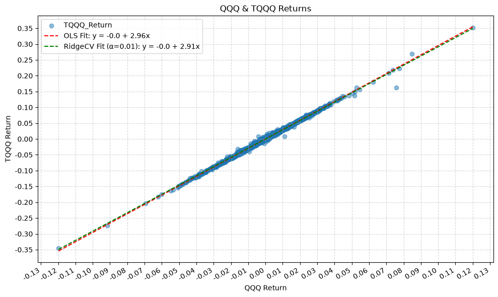
    


```python
model = run_linear_regression(
    df=qqq_tqqq_aligned,
    x_plot_column="QQQ_Return",
    y_plot_column="TQQQ_Return",
    regression_model="OLS-statsmodels",
    regression_constant=True,
)

print(model.summary())
```

                                OLS Regression Results                            
    ==============================================================================
    Dep. Variable:            TQQQ_Return   R-squared:                       0.997
    Model:                            OLS   Adj. R-squared:                  0.997
    Method:                 Least Squares   F-statistic:                 1.494e+06
    Date:                Mon, 23 Mar 2026   Prob (F-statistic):               0.00
    Time:                        21:59:08   Log-Likelihood:                 19431.
    No. Observations:                4050   AIC:                        -3.886e+04
    Df Residuals:                    4048   BIC:                        -3.884e+04
    Df Model:                           1                                         
    Covariance Type:            nonrobust                                         
    ==============================================================================
                     coef    std err          t      P>|t|      [0.025      0.975]
    ------------------------------------------------------------------------------
    const      -8.629e-05   3.14e-05     -2.746      0.006      -0.000   -2.47e-05
    QQQ_Return     2.9553      0.002   1222.452      0.000       2.951       2.960
    ==============================================================================
    Omnibus:                     5279.605   Durbin-Watson:                   2.567
    Prob(Omnibus):                  0.000   Jarque-Bera (JB):          9197656.554
    Skew:                          -6.346   Prob(JB):                         0.00
    Kurtosis:                     236.117   Cond. No.                         77.1
    ==============================================================================
    
    Notes:
    [1] Standard Errors assume that the covariance matrix of the errors is correctly specified.


Visually, this plot makes sense and we can see that there is a strong clustering of points, but we double check with the regression, regressing the TQQQ daily return (y) on the QQQ daily return (X).

Given the above result, with a coefficient of 2.96 and an R^2 of 0.997 (based on the statsmodels OLS regression), we can say that TQQQ does in fact return ~3x QQQ. We would also intuitively expect the coefficient to be 0, and it is nearly 0.

Interestingly, the coefficient varies between OLS and Ridge cross-validation, and both are less than 3.

### Extrapolate Data (QQQ & TQQQ)

With the above coefficient, we will now extrapolate the returns of QQQ to backfill the data from the inception of QQQ in 1999 to the inception of TQQQ in 2010 to expand our dataset of returns. For this, we'll use the coefficient of 2.96 that we found in the regression results above.


```python
# Set leverage multiplier based on regression coefficient
LEVERAGE_MULTIPLIER = model.params[1]

# Merge dataframes and extrapolate return values for QQQ back to 1999 using the leverage multiplier
qqq_tqqq_extrap = qqq[["QQQ_Close"]].merge(tqqq[["TQQQ_Close"]], left_index=True, right_index=True, how='left')

etfs = ["QQQ", "TQQQ"]

# Calculate cumulative returns
for etf in etfs:
    qqq_tqqq_extrap[f"{etf}_Return"] = qqq_tqqq_extrap[f"{etf}_Close"].pct_change()

# Extrapolate TQQQ returns for missing values
qqq_tqqq_extrap["TQQQ_Return"] = qqq_tqqq_extrap["TQQQ_Return"].fillna(LEVERAGE_MULTIPLIER * qqq_tqqq_extrap["QQQ_Return"])

# Find the first valid TQQQ_Close index and value
first_valid_idx = qqq_tqqq_extrap['TQQQ_Close'].first_valid_index()
print(first_valid_idx)
first_valid_price = qqq_tqqq_extrap.loc[first_valid_idx, 'TQQQ_Close']
print(first_valid_price)
```

    2010-02-11 00:00:00
    0.21627600491046906


Before we extrapolate, let's first look at the data we have for QQQ and TQQQ around the inception of TQQQ in 2010:


```python
# Check values around the first valid index
pandas_set_decimal_places(4)
display(qqq_tqqq_extrap.loc["2010-02-08":"2010-02-13"])
```


<div>
<style scoped>
    .dataframe tbody tr th:only-of-type {
        vertical-align: middle;
    }

    .dataframe tbody tr th {
        vertical-align: top;
    }

    .dataframe thead th {
        text-align: right;
    }
</style>
<table border="1" class="dataframe">
  <thead>
    <tr style="text-align: right;">
      <th></th>
      <th>QQQ_Close</th>
      <th>TQQQ_Close</th>
      <th>QQQ_Return</th>
      <th>TQQQ_Return</th>
    </tr>
    <tr>
      <th>Date</th>
      <th></th>
      <th></th>
      <th></th>
      <th></th>
    </tr>
  </thead>
  <tbody>
    <tr>
      <th>2010-02-08</th>
      <td>42.6700</td>
      <td>NaN</td>
      <td>-0.0072</td>
      <td>-0.0213</td>
    </tr>
    <tr>
      <th>2010-02-09</th>
      <td>43.1100</td>
      <td>NaN</td>
      <td>0.0103</td>
      <td>0.0305</td>
    </tr>
    <tr>
      <th>2010-02-10</th>
      <td>43.0200</td>
      <td>NaN</td>
      <td>-0.0021</td>
      <td>-0.0062</td>
    </tr>
    <tr>
      <th>2010-02-11</th>
      <td>43.6700</td>
      <td>0.2163</td>
      <td>0.0151</td>
      <td>0.0447</td>
    </tr>
    <tr>
      <th>2010-02-12</th>
      <td>43.7600</td>
      <td>0.2172</td>
      <td>0.0021</td>
      <td>0.0041</td>
    </tr>
  </tbody>
</table>
</div>


Now, backfill the data for the TQQQ close price:


```python
# Iterate through the dataframe backwards
for i in range(qqq_tqqq_extrap.index.get_loc(first_valid_idx) - 1, -1, -1):
    
    # The return that led to the price the next day
    current_return = qqq_tqqq_extrap.iloc[i + 1]['TQQQ_Return']

    # Get the next day's price
    next_price = qqq_tqqq_extrap.iloc[i + 1]['TQQQ_Close']
    
    # Price_{t} = Price_{t+1} / (1 + Return_{t})
    qqq_tqqq_extrap.loc[qqq_tqqq_extrap.index[i], 'TQQQ_Close'] = next_price / (1 + current_return)
```

Finally, confirm the values are correct:


```python
# Confirm values around the first valid index after extrapolation
display(qqq_tqqq_extrap.loc["2010-02-08":"2010-02-13"])
```


<div>
<style scoped>
    .dataframe tbody tr th:only-of-type {
        vertical-align: middle;
    }

    .dataframe tbody tr th {
        vertical-align: top;
    }

    .dataframe thead th {
        text-align: right;
    }
</style>
<table border="1" class="dataframe">
  <thead>
    <tr style="text-align: right;">
      <th></th>
      <th>QQQ_Close</th>
      <th>TQQQ_Close</th>
      <th>QQQ_Return</th>
      <th>TQQQ_Return</th>
    </tr>
    <tr>
      <th>Date</th>
      <th></th>
      <th></th>
      <th></th>
      <th></th>
    </tr>
  </thead>
  <tbody>
    <tr>
      <th>2010-02-08</th>
      <td>42.6700</td>
      <td>0.2022</td>
      <td>-0.0072</td>
      <td>-0.0213</td>
    </tr>
    <tr>
      <th>2010-02-09</th>
      <td>43.1100</td>
      <td>0.2083</td>
      <td>0.0103</td>
      <td>0.0305</td>
    </tr>
    <tr>
      <th>2010-02-10</th>
      <td>43.0200</td>
      <td>0.2070</td>
      <td>-0.0021</td>
      <td>-0.0062</td>
    </tr>
    <tr>
      <th>2010-02-11</th>
      <td>43.6700</td>
      <td>0.2163</td>
      <td>0.0151</td>
      <td>0.0447</td>
    </tr>
    <tr>
      <th>2010-02-12</th>
      <td>43.7600</td>
      <td>0.2172</td>
      <td>0.0021</td>
      <td>0.0041</td>
    </tr>
  </tbody>
</table>
</div>


And the complete DataFrame with the extrapolated values:


```python
pandas_set_decimal_places(2)
display(qqq_tqqq_extrap)
```


<div>
<style scoped>
    .dataframe tbody tr th:only-of-type {
        vertical-align: middle;
    }

    .dataframe tbody tr th {
        vertical-align: top;
    }

    .dataframe thead th {
        text-align: right;
    }
</style>
<table border="1" class="dataframe">
  <thead>
    <tr style="text-align: right;">
      <th></th>
      <th>QQQ_Close</th>
      <th>TQQQ_Close</th>
      <th>QQQ_Return</th>
      <th>TQQQ_Return</th>
    </tr>
    <tr>
      <th>Date</th>
      <th></th>
      <th></th>
      <th></th>
      <th></th>
    </tr>
  </thead>
  <tbody>
    <tr>
      <th>1999-03-10</th>
      <td>51.06</td>
      <td>13.82</td>
      <td>NaN</td>
      <td>NaN</td>
    </tr>
    <tr>
      <th>1999-03-11</th>
      <td>51.31</td>
      <td>14.02</td>
      <td>0.00</td>
      <td>0.01</td>
    </tr>
    <tr>
      <th>1999-03-12</th>
      <td>50.06</td>
      <td>13.01</td>
      <td>-0.02</td>
      <td>-0.07</td>
    </tr>
    <tr>
      <th>1999-03-15</th>
      <td>51.50</td>
      <td>14.11</td>
      <td>0.03</td>
      <td>0.08</td>
    </tr>
    <tr>
      <th>1999-03-16</th>
      <td>51.94</td>
      <td>14.47</td>
      <td>0.01</td>
      <td>0.03</td>
    </tr>
    <tr>
      <th>...</th>
      <td>...</td>
      <td>...</td>
      <td>...</td>
      <td>...</td>
    </tr>
    <tr>
      <th>2026-03-16</th>
      <td>600.38</td>
      <td>47.46</td>
      <td>0.01</td>
      <td>0.03</td>
    </tr>
    <tr>
      <th>2026-03-17</th>
      <td>603.31</td>
      <td>48.16</td>
      <td>0.00</td>
      <td>0.01</td>
    </tr>
    <tr>
      <th>2026-03-18</th>
      <td>594.90</td>
      <td>46.10</td>
      <td>-0.01</td>
      <td>-0.04</td>
    </tr>
    <tr>
      <th>2026-03-19</th>
      <td>593.02</td>
      <td>45.69</td>
      <td>-0.00</td>
      <td>-0.01</td>
    </tr>
    <tr>
      <th>2026-03-20</th>
      <td>582.06</td>
      <td>43.08</td>
      <td>-0.02</td>
      <td>-0.06</td>
    </tr>
  </tbody>
</table>
<p>6800 rows × 4 columns</p>
</div>


After the extrapolation, we now have the following plots for the prices, cumulative returns, and drawdowns:


```python
etfs = ["QQQ", "TQQQ"]

# Calculate cumulative returns
for etf in etfs:
    qqq_tqqq_extrap[f"{etf}_Return"] = qqq_tqqq_extrap[f"{etf}_Close"].pct_change()
    qqq_tqqq_extrap[f"{etf}_Cumulative_Return"] = (1 + qqq_tqqq_extrap[f"{etf}_Return"]).cumprod() - 1
    qqq_tqqq_extrap[f"{etf}_Cumulative_Return_Plus_One"] = 1 + qqq_tqqq_extrap[f"{etf}_Cumulative_Return"]
    qqq_tqqq_extrap[f"{etf}_Rolling_Max"] = qqq_tqqq_extrap[f"{etf}_Cumulative_Return_Plus_One"].cummax()
    qqq_tqqq_extrap[f"{etf}_Drawdown"] = qqq_tqqq_extrap[f"{etf}_Cumulative_Return_Plus_One"] / qqq_tqqq_extrap[f"{etf}_Rolling_Max"] - 1
    qqq_tqqq_extrap.drop(columns=[f"{etf}_Cumulative_Return_Plus_One", f"{etf}_Rolling_Max"], inplace=True)
```


```python
plot_time_series(
    df=qqq_tqqq_extrap,
    plot_start_date=None,
    plot_end_date=None,
    plot_columns=["QQQ_Close"],
    title="QQQ Close Price",
    x_label="Date",
    x_format="Year",
    x_tick_spacing=2,
    x_tick_rotation=30,
    y_label="Price ($)",
    y_format="Decimal",
    y_format_decimal_places=0,
    y_tick_spacing="Auto",
    y_tick_rotation=0,
    grid=True,
    legend=False,
    export_plot=False,
    plot_file_name=None,
)
```


    
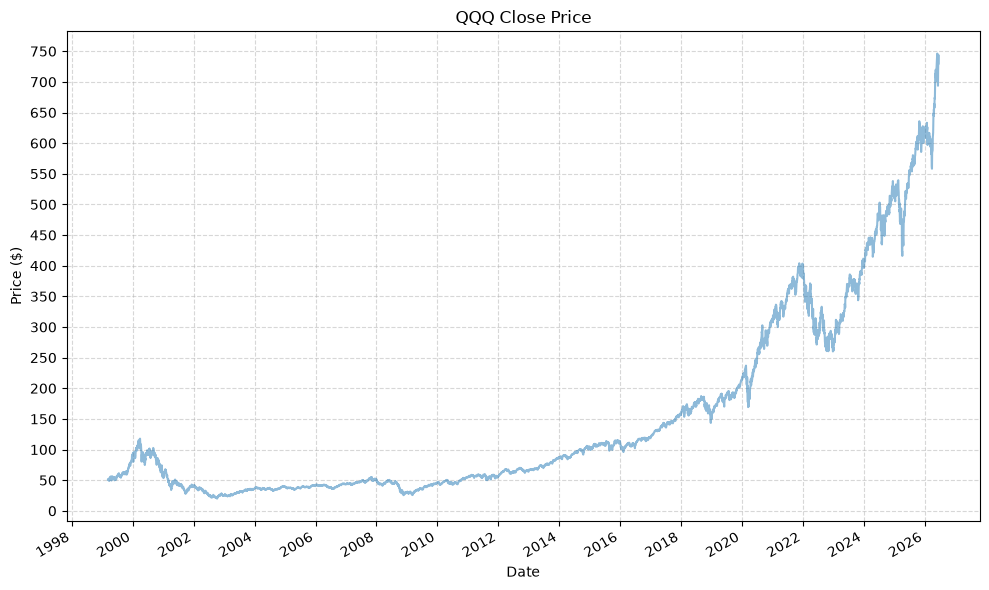
    


```python
plot_time_series(
    df=qqq_tqqq_extrap,
    plot_start_date=None,
    plot_end_date=None,
    plot_columns=["TQQQ_Close"],
    title="TQQQ Close Price",
    x_label="Date",
    x_format="Year",
    x_tick_spacing=2,
    x_tick_rotation=30,
    y_label="Price ($)",
    y_format="Decimal",
    y_format_decimal_places=0,
    y_tick_spacing="Auto",
    y_tick_rotation=0,
    grid=True,
    legend=False,
    export_plot=False,
    plot_file_name=None,
)
```


    

    


```python
plot_time_series(
    df=qqq_tqqq_extrap,
    plot_start_date=None,
    plot_end_date=None,
    plot_columns=["QQQ_Cumulative_Return", "TQQQ_Cumulative_Return"],
    title="Cumulative Returns",
    x_label="Date",
    x_format="Year",
    x_tick_spacing=2,
    x_tick_rotation=30,
    y_label="Cumulative Return",
    y_format="Decimal",
    y_format_decimal_places=0,
    y_tick_spacing="Auto",
    y_tick_rotation=0,
    grid=True,
    legend=True,
    export_plot=False,
    plot_file_name=None,
)
```


    

    


```python
plot_time_series(
    df=qqq_tqqq_extrap,
    plot_start_date=None,
    plot_end_date=None,
    plot_columns=["QQQ_Drawdown", "TQQQ_Drawdown"],
    title="Drawdowns",
    x_label="Date",
    x_format="Year",
    x_tick_spacing=2,
    x_tick_rotation=30,
    y_label="Drawdown",
    y_format="Percentage",
    y_format_decimal_places=0,
    y_tick_spacing="Auto",
    y_tick_rotation=0,
    grid=True,
    legend=True,
    export_plot=False,
    plot_file_name=None,
)
```


    

    


```python
qqq_extrap_sum_stats = summary_stats(
    fund_list=["QQQ"],
    df=qqq_tqqq_extrap[["QQQ_Return"]],
    period="Daily",
    use_calendar_days=False,
    excel_export=False,
    pickle_export=False,
    output_confirmation=False,
)

tqqq_extrap_sum_stats = summary_stats(
    fund_list=["TQQQ"],
    df=qqq_tqqq_extrap[["TQQQ_Return"]],
    period="Daily",
    use_calendar_days=False,
    excel_export=False,
    pickle_export=False,
    output_confirmation=False,
)

sum_stats = pd.concat([qqq_sum_stats, tqqq_sum_stats, qqq_extrap_sum_stats, tqqq_extrap_sum_stats])
sum_stats.index = ["QQQ (2010 - Present)", "TQQQ (2010 - Present)", "QQQ (1999 - Present)", "TQQQ Extrapolated (1999 - Present)"]

display(sum_stats)
```


<div>
<style scoped>
    .dataframe tbody tr th:only-of-type {
        vertical-align: middle;
    }

    .dataframe tbody tr th {
        vertical-align: top;
    }

    .dataframe thead th {
        text-align: right;
    }
</style>
<table border="1" class="dataframe">
  <thead>
    <tr style="text-align: right;">
      <th></th>
      <th>Annual Mean Return (Arithmetic)</th>
      <th>Annualized Volatility</th>
      <th>Annualized Sharpe Ratio</th>
      <th>CAGR (Geometric)</th>
      <th>Daily Max Return</th>
      <th>Daily Max Return (Date)</th>
      <th>Daily Min Return</th>
      <th>Daily Min Return (Date)</th>
      <th>Max Drawdown</th>
      <th>Peak</th>
      <th>Trough</th>
      <th>Recovery Date</th>
      <th>Calendar Days to Recovery</th>
      <th>MAR Ratio</th>
    </tr>
  </thead>
  <tbody>
    <tr>
      <th>QQQ (2010 - Present)</th>
      <td>0.18</td>
      <td>0.21</td>
      <td>0.89</td>
      <td>0.17</td>
      <td>0.12</td>
      <td>2025-04-09</td>
      <td>-0.12</td>
      <td>2020-03-16</td>
      <td>-0.36</td>
      <td>2021-11-19</td>
      <td>2022-12-28</td>
      <td>2023-12-15</td>
      <td>352.00</td>
      <td>0.49</td>
    </tr>
    <tr>
      <th>TQQQ (2010 - Present)</th>
      <td>0.52</td>
      <td>0.61</td>
      <td>0.85</td>
      <td>0.39</td>
      <td>0.35</td>
      <td>2025-04-09</td>
      <td>-0.34</td>
      <td>2020-03-16</td>
      <td>-0.82</td>
      <td>2021-11-19</td>
      <td>2022-12-28</td>
      <td>2024-12-11</td>
      <td>714.00</td>
      <td>0.48</td>
    </tr>
    <tr>
      <th>QQQ (1999 - Present)</th>
      <td>0.13</td>
      <td>0.27</td>
      <td>0.47</td>
      <td>0.09</td>
      <td>0.17</td>
      <td>2001-01-03</td>
      <td>-0.12</td>
      <td>2020-03-16</td>
      <td>-0.83</td>
      <td>2000-03-27</td>
      <td>2002-10-09</td>
      <td>2016-09-06</td>
      <td>5081.00</td>
      <td>0.11</td>
    </tr>
    <tr>
      <th>TQQQ Extrapolated (1999 - Present)</th>
      <td>0.36</td>
      <td>0.80</td>
      <td>0.45</td>
      <td>0.04</td>
      <td>0.50</td>
      <td>2001-01-03</td>
      <td>-0.34</td>
      <td>2020-03-16</td>
      <td>-1.00</td>
      <td>2000-03-27</td>
      <td>2009-03-09</td>
      <td>NaT</td>
      <td>NaN</td>
      <td>0.04</td>
    </tr>
  </tbody>
</table>
</div>


A few quick comments before we look at rolling returns:

* The cumulative return for TQQQ is *less* than that of QQQ - which is starkly different from the plot beginning in 2010 at the inception of TQQQ. So the return path really matters here.
* The drawdown for TQQQ is nearly 100%... which also represents nearly a total loss of capital for any allocation to the extrap-TQQQ. Furthermore, as we walk forward through time (2002, 2003, ... etc.), there is really no reason to believe that the returns would ever recover (even partially). So while we can look at the rolling returns and see how they compare to the 3x return of QQQ, we should keep in mind that the drawdown post-1999 is so severe that it would be very difficult for any investor to hold through it.
* The recovery time for QQQ was more than 5,000 days, or ~14 years. Note that this is calendar days, not trading days. While returns have been great for QQQ since 2016, the 14 year dry spell is a reminder of just how large the tech bubble was.
* The extrapolated TQQQ data remains in a drawdown and has never recovered to make new highs (as of March 2026).

### Plot Rolling Returns (QQQ & TQQQ)

Next, we will consider the following:

* Histogram and scatter plots of the rolling returns of QQQ and TQQQ
* Regressions to establish a "leverage factor" for the rolling returns
* The deviation from a 3x return for each time period

For this set of regressions, we will also allow the constant. First, we need the rolling returns for various time periods:


```python
# Define rolling windows in trading days
rolling_windows = {
    '1d': 1,      # 1 day
    '1w': 5,      # 1 week (5 trading days)
    '1m': 21,     # 1 month (~21 trading days)
    '3m': 63,     # 3 months (~63 trading days)
    '6m': 126,    # 6 months (~126 trading days)
    '1y': 252,    # 1 year (~252 trading days)
    '2y': 504,    # 2 years (~504 trading days)
    '3y': 756,    # 3 years (~756 trading days)
    '4y': 1008,   # 4 years (~1008 trading days)
    '5y': 1260,   # 5 years (~1260 trading days)
}

# Calculate rolling returns for each ETF and each window
for etf in etfs:
    for period_name, window in rolling_windows.items():
        qqq_tqqq_extrap[f"{etf}_Rolling_Return_{period_name}"] = (
            qqq_tqqq_extrap[f"{etf}_Close"].pct_change(periods=window)
        )
```

This gives us the following series of histograms, scatter plots, and regression model results:


```python
# Create a dataframe to hold rolling returns stats
rolling_returns_stats = pd.DataFrame()

for period_name, window in rolling_windows.items():
    plot_histogram(
        df=qqq_tqqq_extrap,
        plot_columns=[f"QQQ_Rolling_Return_{period_name}", f"TQQQ_Rolling_Return_{period_name}"],
        title=f"QQQ & TQQQ {period_name} Rolling Returns",
        x_label="Rolling Return",
        x_tick_spacing="Auto",
        x_tick_rotation=30,
        y_label="# Of Datapoints",
        y_tick_spacing="Auto",
        y_tick_rotation=0,
        grid=True,
        legend=True,
        export_plot=False,
        plot_file_name=None,
    )

    plot_scatter(
        df=qqq_tqqq_extrap,
        x_plot_column=f"QQQ_Rolling_Return_{period_name}",
        y_plot_columns=[f"TQQQ_Rolling_Return_{period_name}"],
        title=f"QQQ & TQQQ {period_name} Rolling Returns",
        x_label="QQQ Rolling Return",
        x_format="Decimal",
        x_format_decimal_places=2,
        x_tick_spacing="Auto",
        x_tick_rotation=30,
        y_label="TQQQ Rolling Return",
        y_format="Decimal",
        y_format_decimal_places=2,
        y_tick_spacing="Auto",
        y_tick_rotation=0,
        plot_OLS_regression_line=True,
        OLS_column=f"TQQQ_Rolling_Return_{period_name}",
        plot_Ridge_regression_line=False,
        Ridge_column=None,
        plot_RidgeCV_regression_line=True,
        RidgeCV_column=f"TQQQ_Rolling_Return_{period_name}",
        regression_constant=True,
        grid=True,
        legend=True,
        export_plot=False,
        plot_file_name=None,
    )

    # Run OLS regression with statsmodels
    model = run_linear_regression(
        df=qqq_tqqq_extrap,
        x_plot_column=f"QQQ_Rolling_Return_{period_name}",
        y_plot_column=f"TQQQ_Rolling_Return_{period_name}",
        regression_model="OLS-statsmodels",
        regression_constant=True,
    )
    print(model.summary())

    # Add the regression results to the rolling returns stats dataframe
    intercept = model.params[0]
    intercept_pvalue = model.pvalues[0]   # p-value for Intercept
    slope = model.params[1]
    slope_pvalue = model.pvalues[1]       # p-value for QQQ_Return
    r_squared = model.rsquared

    # Calc skew
    return_ratio = qqq_tqqq_extrap[f'TQQQ_Rolling_Return_{period_name}'] / qqq_tqqq_extrap[f'QQQ_Rolling_Return_{period_name}']
    skew = return_ratio.skew()

    # Calc conditional symmetry
    up_markets = qqq_tqqq_extrap[qqq_tqqq_extrap[f'QQQ_Rolling_Return_{period_name}'] > 0]
    down_markets = qqq_tqqq_extrap[qqq_tqqq_extrap[f'QQQ_Rolling_Return_{period_name}'] <= 0]

    avg_beta_up = (up_markets[f'TQQQ_Rolling_Return_{period_name}'] / up_markets[f'QQQ_Rolling_Return_{period_name}']).mean()
    avg_beta_down = (down_markets[f'TQQQ_Rolling_Return_{period_name}'] / down_markets[f'QQQ_Rolling_Return_{period_name}']).mean()

    asymmetry = avg_beta_up - avg_beta_down

    rolling_returns_slope_int = pd.DataFrame({
        "Period": period_name,
        "Intercept": [intercept],
        # "Intercept_PValue": [intercept_pvalue],
        "Slope": [slope],
        # "Slope_PValue": [slope_pvalue],
        "R_Squared": [r_squared],
        "Return Skew": [skew],
        "Average Upside Beta": [avg_beta_up],
        "Average Downside Beta": [avg_beta_down],
        "Asymmetry": [asymmetry]
    })

    rolling_returns_stats = pd.concat([rolling_returns_stats, rolling_returns_slope_int])
```


    

    


    
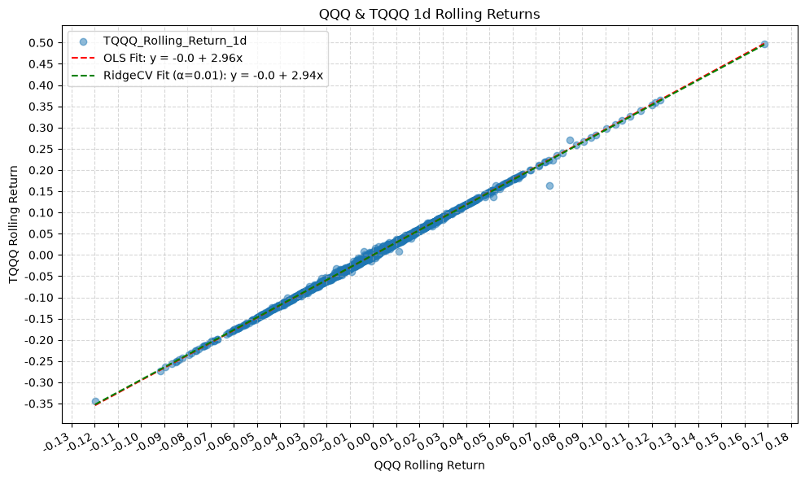
    


                                  OLS Regression Results                              
    ==================================================================================
    Dep. Variable:     TQQQ_Rolling_Return_1d   R-squared:                       0.999
    Model:                                OLS   Adj. R-squared:                  0.999
    Method:                     Least Squares   F-statistic:                 7.219e+06
    Date:                    Mon, 23 Mar 2026   Prob (F-statistic):               0.00
    Time:                            21:59:12   Log-Likelihood:                 34378.
    No. Observations:                    6799   AIC:                        -6.875e+04
    Df Residuals:                        6797   BIC:                        -6.874e+04
    Df Model:                               1                                         
    Covariance Type:                nonrobust                                         
    =========================================================================================
                                coef    std err          t      P>|t|      [0.025      0.975]
    -----------------------------------------------------------------------------------------
    const                 -5.138e-05   1.87e-05     -2.748      0.006    -8.8e-05   -1.47e-05
    QQQ_Rolling_Return_1d     2.9552      0.001   2686.888      0.000       2.953       2.957
    ==============================================================================
    Omnibus:                    10196.347   Durbin-Watson:                   2.565
    Prob(Omnibus):                  0.000   Jarque-Bera (JB):         43934832.029
    Skew:                          -8.279   Prob(JB):                         0.00
    Kurtosis:                     396.463   Cond. No.                         58.8
    ==============================================================================
    
    Notes:
    [1] Standard Errors assume that the covariance matrix of the errors is correctly specified.


    
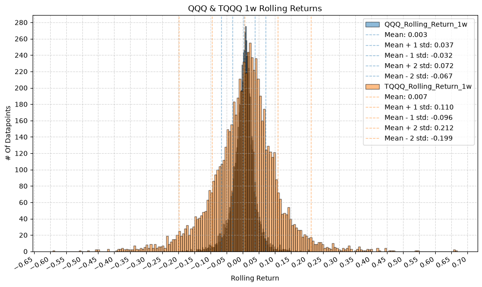
    


    
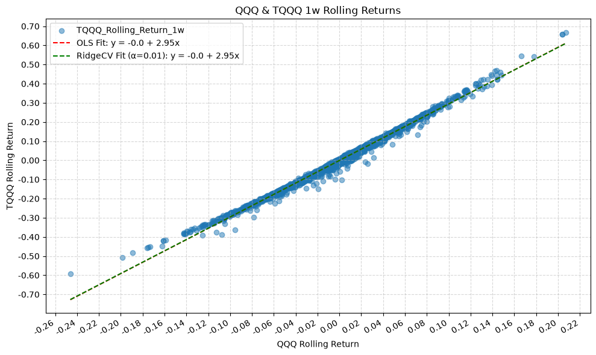
    


                                  OLS Regression Results                              
    ==================================================================================
    Dep. Variable:     TQQQ_Rolling_Return_1w   R-squared:                       0.994
    Model:                                OLS   Adj. R-squared:                  0.994
    Method:                     Least Squares   F-statistic:                 1.117e+06
    Date:                    Mon, 23 Mar 2026   Prob (F-statistic):               0.00
    Time:                            21:59:14   Log-Likelihood:                 23171.
    No. Observations:                    6795   AIC:                        -4.634e+04
    Df Residuals:                        6793   BIC:                        -4.632e+04
    Df Model:                               1                                         
    Covariance Type:                nonrobust                                         
    =========================================================================================
                                coef    std err          t      P>|t|      [0.025      0.975]
    -----------------------------------------------------------------------------------------
    const                    -0.0008   9.72e-05     -8.359      0.000      -0.001      -0.001
    QQQ_Rolling_Return_1w     2.9525      0.003   1056.784      0.000       2.947       2.958
    ==============================================================================
    Omnibus:                     2840.677   Durbin-Watson:                   0.932
    Prob(Omnibus):                  0.000   Jarque-Bera (JB):           565062.032
    Skew:                          -0.863   Prob(JB):                         0.00
    Kurtosis:                      47.641   Cond. No.                         28.8
    ==============================================================================
    
    Notes:
    [1] Standard Errors assume that the covariance matrix of the errors is correctly specified.


    
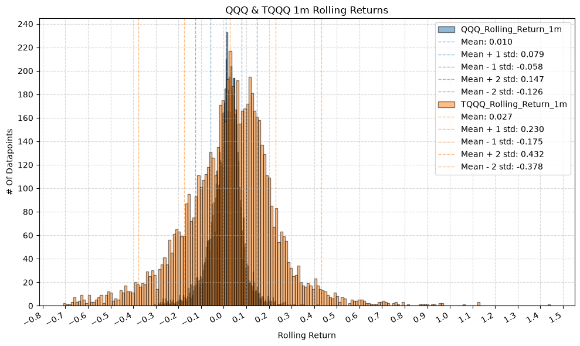
    


    
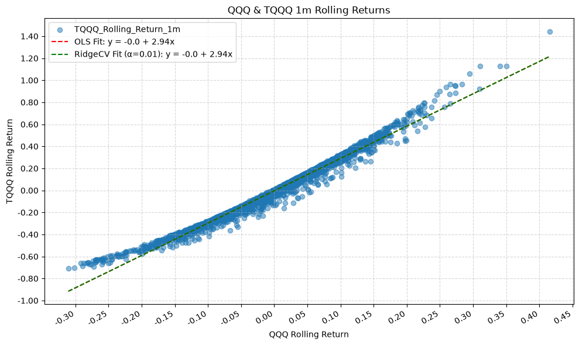
    


                                  OLS Regression Results                              
    ==================================================================================
    Dep. Variable:     TQQQ_Rolling_Return_1m   R-squared:                       0.982
    Model:                                OLS   Adj. R-squared:                  0.982
    Method:                     Least Squares   F-statistic:                 3.698e+05
    Date:                    Mon, 23 Mar 2026   Prob (F-statistic):               0.00
    Time:                            21:59:16   Log-Likelihood:                 14865.
    No. Observations:                    6779   AIC:                        -2.973e+04
    Df Residuals:                        6777   BIC:                        -2.971e+04
    Df Model:                               1                                         
    Covariance Type:                nonrobust                                         
    =========================================================================================
                                coef    std err          t      P>|t|      [0.025      0.975]
    -----------------------------------------------------------------------------------------
    const                    -0.0037      0.000    -11.098      0.000      -0.004      -0.003
    QQQ_Rolling_Return_1m     2.9306      0.005    608.073      0.000       2.921       2.940
    ==============================================================================
    Omnibus:                     1630.144   Durbin-Watson:                   0.296
    Prob(Omnibus):                  0.000   Jarque-Bera (JB):            69176.713
    Skew:                           0.358   Prob(JB):                         0.00
    Kurtosis:                      18.633   Cond. No.                         14.7
    ==============================================================================
    
    Notes:
    [1] Standard Errors assume that the covariance matrix of the errors is correctly specified.


    

    


    
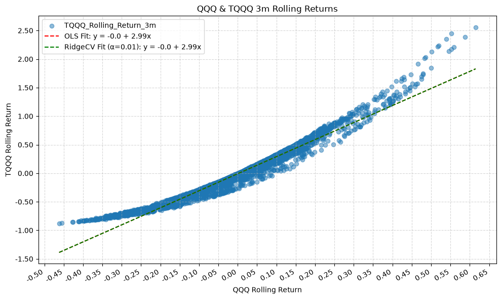
    


                                  OLS Regression Results                              
    ==================================================================================
    Dep. Variable:     TQQQ_Rolling_Return_3m   R-squared:                       0.958
    Model:                                OLS   Adj. R-squared:                  0.958
    Method:                     Least Squares   F-statistic:                 1.551e+05
    Date:                    Mon, 23 Mar 2026   Prob (F-statistic):               0.00
    Time:                            21:59:18   Log-Likelihood:                 7953.7
    No. Observations:                    6737   AIC:                        -1.590e+04
    Df Residuals:                        6735   BIC:                        -1.589e+04
    Df Model:                               1                                         
    Covariance Type:                nonrobust                                         
    =========================================================================================
                                coef    std err          t      P>|t|      [0.025      0.975]
    -----------------------------------------------------------------------------------------
    const                    -0.0083      0.001     -8.874      0.000      -0.010      -0.006
    QQQ_Rolling_Return_3m     2.9849      0.008    393.789      0.000       2.970       3.000
    ==============================================================================
    Omnibus:                     3466.652   Durbin-Watson:                   0.105
    Prob(Omnibus):                  0.000   Jarque-Bera (JB):            79721.487
    Skew:                           1.963   Prob(JB):                         0.00
    Kurtosis:                      19.389   Cond. No.                         8.38
    ==============================================================================
    
    Notes:
    [1] Standard Errors assume that the covariance matrix of the errors is correctly specified.


    
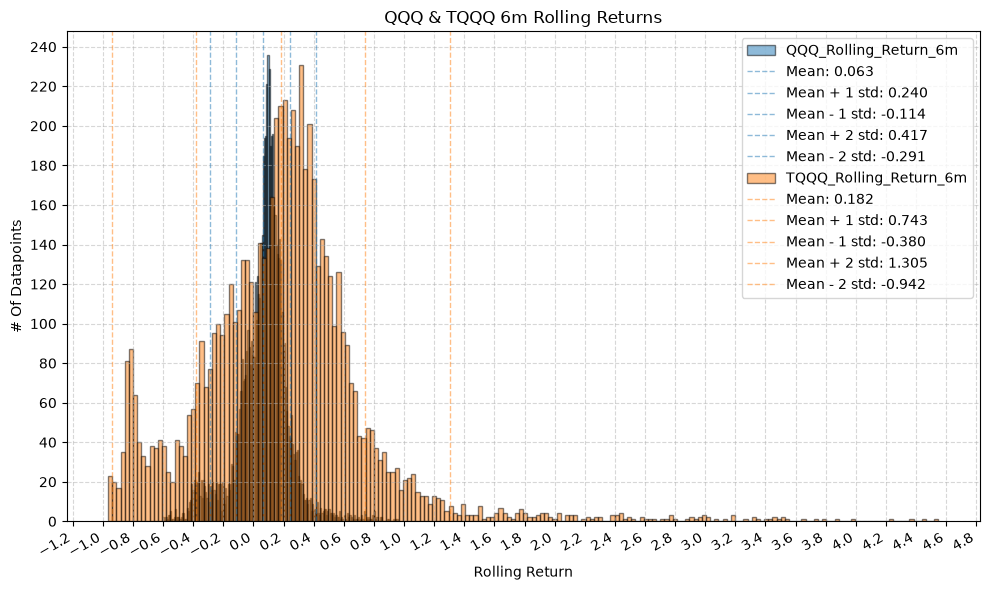
    


    

    


                                  OLS Regression Results                              
    ==================================================================================
    Dep. Variable:     TQQQ_Rolling_Return_6m   R-squared:                       0.916
    Model:                                OLS   Adj. R-squared:                  0.916
    Method:                     Least Squares   F-statistic:                 7.252e+04
    Date:                    Mon, 23 Mar 2026   Prob (F-statistic):               0.00
    Time:                            21:59:19   Log-Likelihood:                 2613.7
    No. Observations:                    6674   AIC:                            -5223.
    Df Residuals:                        6672   BIC:                            -5210.
    Df Model:                               1                                         
    Covariance Type:                nonrobust                                         
    =========================================================================================
                                coef    std err          t      P>|t|      [0.025      0.975]
    -----------------------------------------------------------------------------------------
    const                    -0.0097      0.002     -4.549      0.000      -0.014      -0.005
    QQQ_Rolling_Return_6m     3.0397      0.011    269.293      0.000       3.018       3.062
    ==============================================================================
    Omnibus:                     3659.091   Durbin-Watson:                   0.056
    Prob(Omnibus):                  0.000   Jarque-Bera (JB):            60225.360
    Skew:                           2.263   Prob(JB):                         0.00
    Kurtosis:                      17.003   Cond. No.                         5.66
    ==============================================================================
    
    Notes:
    [1] Standard Errors assume that the covariance matrix of the errors is correctly specified.


    
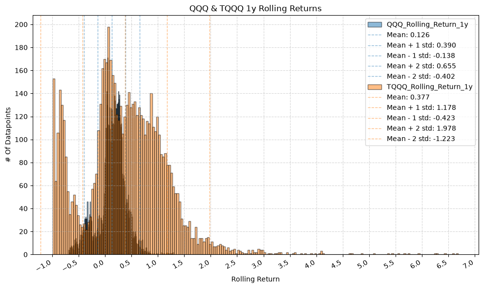
    


    
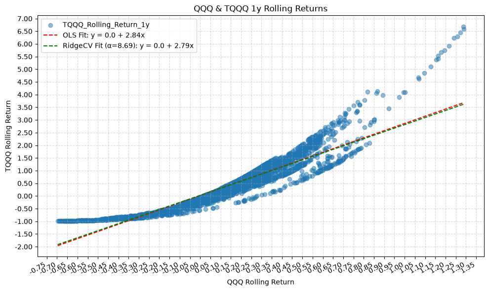
    


                                  OLS Regression Results                              
    ==================================================================================
    Dep. Variable:     TQQQ_Rolling_Return_1y   R-squared:                       0.880
    Model:                                OLS   Adj. R-squared:                  0.880
    Method:                     Least Squares   F-statistic:                 4.786e+04
    Date:                    Mon, 23 Mar 2026   Prob (F-statistic):               0.00
    Time:                            21:59:21   Log-Likelihood:                -892.41
    No. Observations:                    6548   AIC:                             1789.
    Df Residuals:                        6546   BIC:                             1802.
    Df Model:                               1                                         
    Covariance Type:                nonrobust                                         
    =========================================================================================
                                coef    std err          t      P>|t|      [0.025      0.975]
    -----------------------------------------------------------------------------------------
    const                     0.0189      0.004      5.003      0.000       0.012       0.026
    QQQ_Rolling_Return_1y     2.8372      0.013    218.775      0.000       2.812       2.863
    ==============================================================================
    Omnibus:                     3497.781   Durbin-Watson:                   0.037
    Prob(Omnibus):                  0.000   Jarque-Bera (JB):            68281.594
    Skew:                           2.124   Prob(JB):                         0.00
    Kurtosis:                      18.239   Cond. No.                         3.85
    ==============================================================================
    
    Notes:
    [1] Standard Errors assume that the covariance matrix of the errors is correctly specified.


    

    


    

    


                                  OLS Regression Results                              
    ==================================================================================
    Dep. Variable:     TQQQ_Rolling_Return_2y   R-squared:                       0.848
    Model:                                OLS   Adj. R-squared:                  0.848
    Method:                     Least Squares   F-statistic:                 3.521e+04
    Date:                    Mon, 23 Mar 2026   Prob (F-statistic):               0.00
    Time:                            21:59:22   Log-Likelihood:                -4425.9
    No. Observations:                    6296   AIC:                             8856.
    Df Residuals:                        6294   BIC:                             8869.
    Df Model:                               1                                         
    Covariance Type:                nonrobust                                         
    =========================================================================================
                                coef    std err          t      P>|t|      [0.025      0.975]
    -----------------------------------------------------------------------------------------
    const                     0.0092      0.007      1.243      0.214      -0.005       0.024
    QQQ_Rolling_Return_2y     3.1310      0.017    187.631      0.000       3.098       3.164
    ==============================================================================
    Omnibus:                     1596.134   Durbin-Watson:                   0.019
    Prob(Omnibus):                  0.000   Jarque-Bera (JB):             4146.775
    Skew:                           1.367   Prob(JB):                         0.00
    Kurtosis:                       5.886   Cond. No.                         2.89
    ==============================================================================
    
    Notes:
    [1] Standard Errors assume that the covariance matrix of the errors is correctly specified.


    
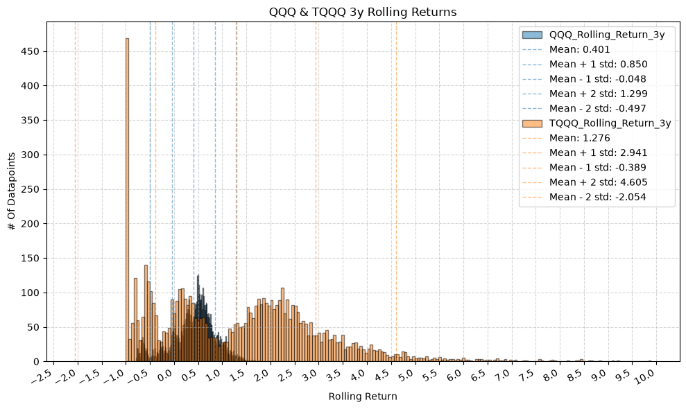
    


    
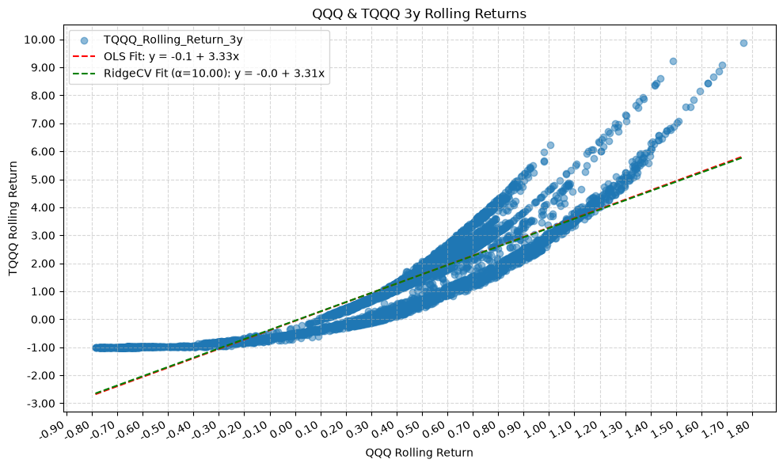
    


                                  OLS Regression Results                              
    ==================================================================================
    Dep. Variable:     TQQQ_Rolling_Return_3y   R-squared:                       0.805
    Model:                                OLS   Adj. R-squared:                  0.804
    Method:                     Least Squares   F-statistic:                 2.487e+04
    Date:                    Mon, 23 Mar 2026   Prob (F-statistic):               0.00
    Time:                            21:59:24   Log-Likelihood:                -6694.8
    No. Observations:                    6044   AIC:                         1.339e+04
    Df Residuals:                        6042   BIC:                         1.341e+04
    Df Model:                               1                                         
    Covariance Type:                nonrobust                                         
    =========================================================================================
                                coef    std err          t      P>|t|      [0.025      0.975]
    -----------------------------------------------------------------------------------------
    const                    -0.0599      0.013     -4.764      0.000      -0.085      -0.035
    QQQ_Rolling_Return_3y     3.3318      0.021    157.695      0.000       3.290       3.373
    ==============================================================================
    Omnibus:                      858.024   Durbin-Watson:                   0.015
    Prob(Omnibus):                  0.000   Jarque-Bera (JB):             1472.819
    Skew:                           0.940   Prob(JB):                         0.00
    Kurtosis:                       4.521   Cond. No.                         2.66
    ==============================================================================
    
    Notes:
    [1] Standard Errors assume that the covariance matrix of the errors is correctly specified.


    
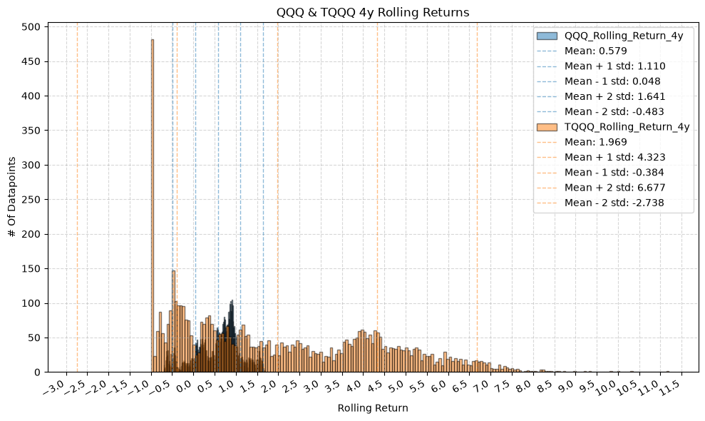
    


    

    


                                  OLS Regression Results                              
    ==================================================================================
    Dep. Variable:     TQQQ_Rolling_Return_4y   R-squared:                       0.781
    Model:                                OLS   Adj. R-squared:                  0.781
    Method:                     Least Squares   F-statistic:                 2.064e+04
    Date:                    Mon, 23 Mar 2026   Prob (F-statistic):               0.00
    Time:                            21:59:26   Log-Likelihood:                -8794.2
    No. Observations:                    5792   AIC:                         1.759e+04
    Df Residuals:                        5790   BIC:                         1.761e+04
    Df Model:                               1                                         
    Covariance Type:                nonrobust                                         
    =========================================================================================
                                coef    std err          t      P>|t|      [0.025      0.975]
    -----------------------------------------------------------------------------------------
    const                    -0.2930      0.021    -13.695      0.000      -0.335      -0.251
    QQQ_Rolling_Return_4y     3.9329      0.027    143.656      0.000       3.879       3.987
    ==============================================================================
    Omnibus:                      200.096   Durbin-Watson:                   0.010
    Prob(Omnibus):                  0.000   Jarque-Bera (JB):              104.261
    Skew:                           0.140   Prob(JB):                     2.29e-23
    Kurtosis:                       2.405   Cond. No.                         2.66
    ==============================================================================
    
    Notes:
    [1] Standard Errors assume that the covariance matrix of the errors is correctly specified.


    
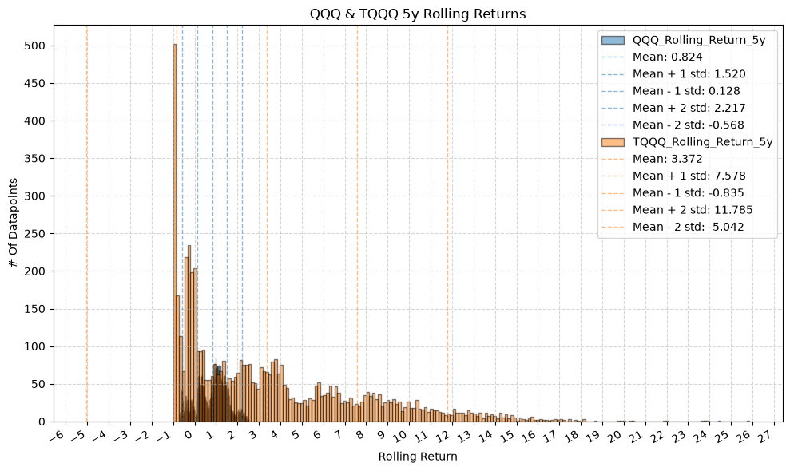
    


    
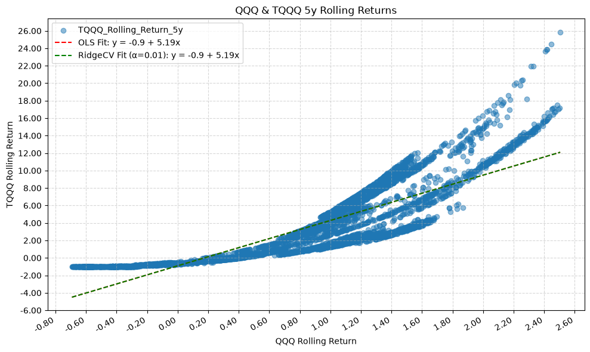
    


                                  OLS Regression Results                              
    ==================================================================================
    Dep. Variable:     TQQQ_Rolling_Return_5y   R-squared:                       0.743
    Model:                                OLS   Adj. R-squared:                  0.743
    Method:                     Least Squares   F-statistic:                 1.598e+04
    Date:                    Mon, 23 Mar 2026   Prob (F-statistic):               0.00
    Time:                            21:59:28   Log-Likelihood:                -12084.
    No. Observations:                    5540   AIC:                         2.417e+04
    Df Residuals:                        5538   BIC:                         2.418e+04
    Df Model:                               1                                         
    Covariance Type:                nonrobust                                         
    =========================================================================================
                                coef    std err          t      P>|t|      [0.025      0.975]
    -----------------------------------------------------------------------------------------
    const                    -0.8875      0.044    -19.973      0.000      -0.975      -0.800
    QQQ_Rolling_Return_5y     5.2051      0.041    126.424      0.000       5.124       5.286
    ==============================================================================
    Omnibus:                      315.142   Durbin-Watson:                   0.009
    Prob(Omnibus):                  0.000   Jarque-Bera (JB):              460.565
    Skew:                           0.499   Prob(JB):                    9.76e-101
    Kurtosis:                       4.000   Cond. No.                         2.73
    ==============================================================================
    
    Notes:
    [1] Standard Errors assume that the covariance matrix of the errors is correctly specified.


You're welcome to digest each plot, but here's my observations on the above results:

* 1d: TQQQ tracks QQQ as expected (it's a 3x daily return leveraged ETF after all), with a regression coefficient of 2.96 and an R^2 of 0.997, and we extrapolated half the data with the same coefficient.
* 1w: Essentially the same as above. A few outliers, but the regression coefficient is still 2.95 with an R^2 of 0.994. We see a slight skew toward the positive in the rolling returns.
* 1m: The skew toward the positive is more pronounced, and we see more outliers. The regression coefficient has decreased to 2.93 and the R^2 has dropped to 0.98, which is still very high, but we are starting to see some dispersion in the returns.
* 3m: The skew toward the positive is even more pronounced, and we see even more outliers. The regression coefficient has *increased*, to 2.98 and the R^2 has dropped to 0.96.
* 6m: The skew toward the positive is very pronounced, and we see a significant number of outliers with pronounced curvanture in the plot. The regression coefficient has increased again, to 3.4 and the R^2 has dropped to 0.92.
* 1y: At this point, based on the plot and the regression results, we can start to see that the returns of TQQQ are no longer tracking 3x the returns of QQQ as closely as they did in the shorter time periods. The regression coefficient has is now 2.84 and the R^2 has dropped to 0.88.
* 4y and 5y: We can see that there are periods where the rolling returns of TQQQ are significantly higher *and* lower than 3x the returns of QQQ, which is consistent with the idea of volatility decay.

For 4y, based on the regression results, we see that if the rolling return of QQQ was 0, then we would expect a return of -0.30 for TQQQ.

$$
r_{TQQQ} = -0.30 + 3.93 \times r_{QQQ} = -0.30 + 3.93 \times 0 = -0.30
$$

On the other end of the spectrum, if the rolling return of QQQ was 1, then we would expect a return of:

$$
r_{TQQQ} = -0.30 + 3.93 \times r_{QQQ} = -0.30 + 3.93 \times 1 = 3.63
$$

In general, the positive skew of the rolling returns of TQQQ relative to QQQ is related to the general postive return performance of QQQ. With sustained positive returns, the leverage effect of TQQQ will amplify those returns, leading to a positive skew. However, during periods of negative returns for QQQ, the leverage effect will also amplify those losses, leading to a negative skew, and to the limit of a cumulative return of -1, or a 100% loss. The overall skewness of the rolling returns will depend on the balance of these positive and negative periods.

### Rolling Returns Deviation (QQQ & TQQQ)

Next, we will the rolling returns deviation from the expected 3x return for each time period. This will give us a better picture of the volatility decay effect and how it changes over different time horizons.


```python
rolling_returns_stats["Return_Deviation_From_3x"] = rolling_returns_stats["Slope"] - 3.0
pandas_set_decimal_places(3)
display(rolling_returns_stats.set_index("Period"))
```


<div>
<style scoped>
    .dataframe tbody tr th:only-of-type {
        vertical-align: middle;
    }

    .dataframe tbody tr th {
        vertical-align: top;
    }

    .dataframe thead th {
        text-align: right;
    }
</style>
<table border="1" class="dataframe">
  <thead>
    <tr style="text-align: right;">
      <th></th>
      <th>Intercept</th>
      <th>Slope</th>
      <th>R_Squared</th>
      <th>Return Skew</th>
      <th>Average Upside Beta</th>
      <th>Average Downside Beta</th>
      <th>Asymmetry</th>
      <th>Return_Deviation_From_3x</th>
    </tr>
    <tr>
      <th>Period</th>
      <th></th>
      <th></th>
      <th></th>
      <th></th>
      <th></th>
      <th></th>
      <th></th>
      <th></th>
    </tr>
  </thead>
  <tbody>
    <tr>
      <th>1d</th>
      <td>-0.000</td>
      <td>2.955</td>
      <td>0.999</td>
      <td>NaN</td>
      <td>2.957</td>
      <td>NaN</td>
      <td>NaN</td>
      <td>-0.045</td>
    </tr>
    <tr>
      <th>1w</th>
      <td>-0.001</td>
      <td>2.952</td>
      <td>0.994</td>
      <td>NaN</td>
      <td>2.553</td>
      <td>NaN</td>
      <td>NaN</td>
      <td>-0.048</td>
    </tr>
    <tr>
      <th>1m</th>
      <td>-0.004</td>
      <td>2.931</td>
      <td>0.982</td>
      <td>NaN</td>
      <td>2.208</td>
      <td>NaN</td>
      <td>NaN</td>
      <td>-0.069</td>
    </tr>
    <tr>
      <th>3m</th>
      <td>-0.008</td>
      <td>2.985</td>
      <td>0.958</td>
      <td>NaN</td>
      <td>1.994</td>
      <td>-inf</td>
      <td>inf</td>
      <td>-0.015</td>
    </tr>
    <tr>
      <th>6m</th>
      <td>-0.010</td>
      <td>3.040</td>
      <td>0.916</td>
      <td>-8.728</td>
      <td>1.478</td>
      <td>5.417</td>
      <td>-3.939</td>
      <td>0.040</td>
    </tr>
    <tr>
      <th>1y</th>
      <td>0.019</td>
      <td>2.837</td>
      <td>0.880</td>
      <td>NaN</td>
      <td>1.223</td>
      <td>-inf</td>
      <td>inf</td>
      <td>-0.163</td>
    </tr>
    <tr>
      <th>2y</th>
      <td>0.009</td>
      <td>3.131</td>
      <td>0.848</td>
      <td>36.170</td>
      <td>1.393</td>
      <td>12.342</td>
      <td>-10.948</td>
      <td>0.131</td>
    </tr>
    <tr>
      <th>3y</th>
      <td>-0.060</td>
      <td>3.332</td>
      <td>0.805</td>
      <td>NaN</td>
      <td>-0.088</td>
      <td>-inf</td>
      <td>inf</td>
      <td>0.332</td>
    </tr>
    <tr>
      <th>4y</th>
      <td>-0.293</td>
      <td>3.933</td>
      <td>0.781</td>
      <td>19.562</td>
      <td>1.759</td>
      <td>7.212</td>
      <td>-5.452</td>
      <td>0.933</td>
    </tr>
    <tr>
      <th>5y</th>
      <td>-0.887</td>
      <td>5.205</td>
      <td>0.743</td>
      <td>43.040</td>
      <td>2.432</td>
      <td>11.480</td>
      <td>-9.048</td>
      <td>2.205</td>
    </tr>
  </tbody>
</table>
</div>


```python
plot_scatter(
    df=rolling_returns_stats,
    x_plot_column="Period",
    y_plot_columns=["Return_Deviation_From_3x"],
    title="TQQQ Deviation from Perfect 3x Leverage by Time Period",
    x_label="Time Period",
    x_format="String",
    x_format_decimal_places=0,
    x_tick_spacing=1,
    x_tick_rotation=0,
    y_label="Deviation from 3x Leverage",
    y_format="Decimal",
    y_format_decimal_places=1,
    y_tick_spacing="Auto",
    y_tick_rotation=0,
    plot_OLS_regression_line=False,
    OLS_column=None,
    plot_Ridge_regression_line=False,
    Ridge_column=None,
    plot_RidgeCV_regression_line=False,
    RidgeCV_column=None,
    regression_constant=False,
    grid=True,
    legend=True,
    export_plot=False,
    plot_file_name=None,
)
```


    
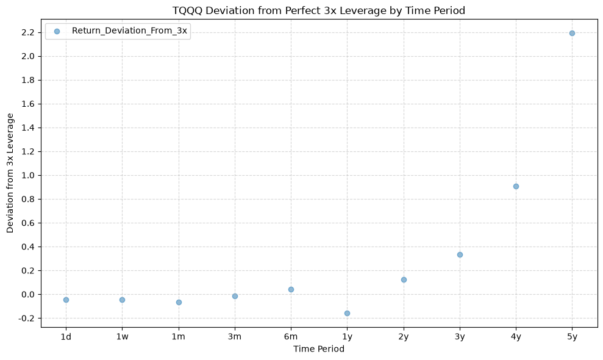
    


```python
plot_scatter(
    df=rolling_returns_stats,
    x_plot_column="Period",
    y_plot_columns=["Slope"],
    title="TQQQ Slope by Time Period",
    x_label="Time Period",
    x_format="String",
    x_format_decimal_places=0,
    x_tick_spacing=1,
    x_tick_rotation=0,
    y_label="Slope",
    y_format="Decimal",
    y_format_decimal_places=1,
    y_tick_spacing="Auto",
    y_tick_rotation=0,
    plot_OLS_regression_line=False,
    OLS_column=None,
    plot_Ridge_regression_line=False,
    Ridge_column=None,
    plot_RidgeCV_regression_line=False,
    RidgeCV_column=None,
    regression_constant=False,
    grid=True,
    legend=True,
    export_plot=False,
    plot_file_name=None,
)
```


    

    


```python
plot_scatter(
    df=rolling_returns_stats,
    x_plot_column="Period",
    y_plot_columns=["Intercept"],
    title="Intercept by Time Period",
    x_label="Time Period",
    x_format="String",
    x_format_decimal_places=0,
    x_tick_spacing=1,
    x_tick_rotation=0,
    y_label="Intercept",
    y_format="Decimal",
    y_format_decimal_places=1,
    y_tick_spacing="Auto",
    y_tick_rotation=0,
    plot_OLS_regression_line=False,
    OLS_column=None,
    plot_Ridge_regression_line=False,
    Ridge_column=None,
    plot_RidgeCV_regression_line=False,
    RidgeCV_column=None,
    regression_constant=False,
    grid=True,
    legend=True,
    export_plot=False,
    plot_file_name=None,
)
```


    

    


```python
display(rolling_returns_stats.set_index("Period"))
```


<div>
<style scoped>
    .dataframe tbody tr th:only-of-type {
        vertical-align: middle;
    }

    .dataframe tbody tr th {
        vertical-align: top;
    }

    .dataframe thead th {
        text-align: right;
    }
</style>
<table border="1" class="dataframe">
  <thead>
    <tr style="text-align: right;">
      <th></th>
      <th>Intercept</th>
      <th>Slope</th>
      <th>R_Squared</th>
      <th>Return Skew</th>
      <th>Average Upside Beta</th>
      <th>Average Downside Beta</th>
      <th>Asymmetry</th>
      <th>Return_Deviation_From_3x</th>
    </tr>
    <tr>
      <th>Period</th>
      <th></th>
      <th></th>
      <th></th>
      <th></th>
      <th></th>
      <th></th>
      <th></th>
      <th></th>
    </tr>
  </thead>
  <tbody>
    <tr>
      <th>1d</th>
      <td>-0.000</td>
      <td>2.955</td>
      <td>0.999</td>
      <td>NaN</td>
      <td>2.957</td>
      <td>NaN</td>
      <td>NaN</td>
      <td>-0.045</td>
    </tr>
    <tr>
      <th>1w</th>
      <td>-0.001</td>
      <td>2.952</td>
      <td>0.994</td>
      <td>NaN</td>
      <td>2.553</td>
      <td>NaN</td>
      <td>NaN</td>
      <td>-0.048</td>
    </tr>
    <tr>
      <th>1m</th>
      <td>-0.004</td>
      <td>2.931</td>
      <td>0.982</td>
      <td>NaN</td>
      <td>2.208</td>
      <td>NaN</td>
      <td>NaN</td>
      <td>-0.069</td>
    </tr>
    <tr>
      <th>3m</th>
      <td>-0.008</td>
      <td>2.985</td>
      <td>0.958</td>
      <td>NaN</td>
      <td>1.994</td>
      <td>-inf</td>
      <td>inf</td>
      <td>-0.015</td>
    </tr>
    <tr>
      <th>6m</th>
      <td>-0.010</td>
      <td>3.040</td>
      <td>0.916</td>
      <td>-8.728</td>
      <td>1.478</td>
      <td>5.417</td>
      <td>-3.939</td>
      <td>0.040</td>
    </tr>
    <tr>
      <th>1y</th>
      <td>0.019</td>
      <td>2.837</td>
      <td>0.880</td>
      <td>NaN</td>
      <td>1.223</td>
      <td>-inf</td>
      <td>inf</td>
      <td>-0.163</td>
    </tr>
    <tr>
      <th>2y</th>
      <td>0.009</td>
      <td>3.131</td>
      <td>0.848</td>
      <td>36.170</td>
      <td>1.393</td>
      <td>12.342</td>
      <td>-10.948</td>
      <td>0.131</td>
    </tr>
    <tr>
      <th>3y</th>
      <td>-0.060</td>
      <td>3.332</td>
      <td>0.805</td>
      <td>NaN</td>
      <td>-0.088</td>
      <td>-inf</td>
      <td>inf</td>
      <td>0.332</td>
    </tr>
    <tr>
      <th>4y</th>
      <td>-0.293</td>
      <td>3.933</td>
      <td>0.781</td>
      <td>19.562</td>
      <td>1.759</td>
      <td>7.212</td>
      <td>-5.452</td>
      <td>0.933</td>
    </tr>
    <tr>
      <th>5y</th>
      <td>-0.887</td>
      <td>5.205</td>
      <td>0.743</td>
      <td>43.040</td>
      <td>2.432</td>
      <td>11.480</td>
      <td>-9.048</td>
      <td>2.205</td>
    </tr>
  </tbody>
</table>
</div>


This is very interesting. Up to 1 year, there is minimal difference between the mean TQQQ 1 year rolling return and the hypothetical 3x leverage, with an R^2 of greater than 0.9.

However, as we extend the time period, we see that

* The "leverage factor" increases significantly, resulting in a deviation from the perfect 3x leverage.
* The intercept also begins to deviate significantly from 0.

The above highlight the impact of volatility magnification over longer time horizons. This phenomenon is happening likely due to the positive returns that QQQ has achieved since 2010 - resulting in TQQQ compounding at a much higher rate than 3x - but it may and likely is not exhibited by other 3x leveraged ETFs that have not had the same positive return profile as QQQ.

With the above results, the next logical question is, when is the opportune time to buy a 3x leveraged ETF like TQQQ? To answer this, we will look a the drawdown levels of TQQQ and the subsequent returns over various time horizons.

### Rolling Returns Following Drawdowns (QQQ & TQQQ)

We will identify the drawdown levels of TQQQ and then look at the subsequent rolling returns over various time horizons.


```python
# Copy DataFrame
qqq_tqqq_extrap_future = qqq_tqqq_extrap.copy()

# Create a list of drawdown levels to analyze
drawdown_levels = [-0.10, -0.20, -0.30, -0.40, -0.50, -0.60, -0.70, -0.80, -0.90]

# Shift the rolling return columns by the number of days in the rolling window to get the returns following the drawdown
for etf in etfs:
    for period_name, window in rolling_windows.items():
        qqq_tqqq_extrap_future[f"{etf}_Rolling_Future_Return_{period_name}"] = qqq_tqqq_extrap_future[f"{etf}_Rolling_Return_{period_name}"].shift(-window)
```

Now, we can analyze the future rolling returns following specific drawdown levels:


```python
# Create a dataframe to hold rolling returns stats
rolling_returns_drawdown_stats = pd.DataFrame()

for drawdown in drawdown_levels:

    for period_name, window in rolling_windows.items():

        try:
            plot_histogram(
                df=qqq_tqqq_extrap_future[qqq_tqqq_extrap_future["TQQQ_Drawdown"] <= drawdown],
                plot_columns=[f"QQQ_Rolling_Future_Return_{period_name}", f"TQQQ_Rolling_Future_Return_{period_name}"],
                title=f"QQQ & TQQQ {period_name} Rolling Future Returns Post {drawdown} TQQQ Drawdown",
                x_label="Rolling Return",
                x_tick_spacing="Auto",
                x_tick_rotation=30,
                y_label="# Of Datapoints",
                y_tick_spacing="Auto",
                y_tick_rotation=0,
                grid=True,
                legend=True,
                export_plot=False,
                plot_file_name=None,
            )

            plot_scatter(
                df=qqq_tqqq_extrap_future[qqq_tqqq_extrap_future["TQQQ_Drawdown"] <= drawdown],
                x_plot_column=f"QQQ_Rolling_Future_Return_{period_name}",
                y_plot_columns=[f"TQQQ_Rolling_Future_Return_{period_name}"],
                title=f"QQQ & TQQQ {period_name} Rolling Future Returns Post {drawdown} TQQQ Drawdown",
                x_label="QQQ Rolling Return",
                x_format="Decimal",
                x_format_decimal_places=2,
                x_tick_spacing="Auto",
                x_tick_rotation=30,
                y_label="TQQQ Rolling Return",
                y_format="Decimal",
                y_format_decimal_places=2,
                y_tick_spacing="Auto",
                y_tick_rotation=0,
                plot_OLS_regression_line=True,
                OLS_column=f"TQQQ_Rolling_Future_Return_{period_name}",
                plot_Ridge_regression_line=False,
                Ridge_column=None,
                plot_RidgeCV_regression_line=True,
                RidgeCV_column=f"TQQQ_Rolling_Future_Return_{period_name}",
                regression_constant=True,
                grid=True,
                legend=True,
                export_plot=False,
                plot_file_name=None,
            )

            # Run OLS regression with statsmodels
            model = run_linear_regression(
                df=qqq_tqqq_extrap_future[qqq_tqqq_extrap_future["TQQQ_Drawdown"] <= drawdown],
                x_plot_column=f"QQQ_Rolling_Future_Return_{period_name}",
                y_plot_column=f"TQQQ_Rolling_Future_Return_{period_name}",
                regression_model="OLS-statsmodels",
                regression_constant=True,
            )
            print(model.summary())

            # Filter by drawdown
            drawdown_filter = qqq_tqqq_extrap_future[qqq_tqqq_extrap_future["TQQQ_Drawdown"] <= drawdown]

            # Filter by period, drop rows with missing values
            future_filter = drawdown_filter[[f"TQQQ_Rolling_Future_Return_{period_name}"]].dropna()

            # Find length of future dataframe
            future_length = len(future_filter)

            # Find length of future dataframe where return is positive
            positive_future_length = len(future_filter[future_filter[f"TQQQ_Rolling_Future_Return_{period_name}"] > 0])

            # Calculate percentage of future returns that are positive
            positive_future_percentage = (positive_future_length / future_length) if future_length > 0 else 0

            # Add the regression results to the rolling returns stats dataframe
            intercept = model.params[0]
            # intercept_pvalue = model.pvalues[0]   # p-value for Intercept
            slope = model.params[1]
            # slope_pvalue = model.pvalues[1]       # p-value for Slope
            r_squared = model.rsquared

            rolling_returns_slope_int = pd.DataFrame({
                "Drawdown": drawdown,
                "Period": period_name,
                "Intercept": [intercept],
                # "Intercept_PValue": [intercept_pvalue],
                "Slope": [slope],
                # "Slope_PValue": [slope_pvalue],
                "R_Squared": [r_squared],
                "Positive_Future_Percentage": [positive_future_percentage],
            })
            
            rolling_returns_drawdown_stats = pd.concat([rolling_returns_drawdown_stats, rolling_returns_slope_int])

        except:
            print(f"Not enough data points for drawdown level {drawdown} and period {period_name} to run regression.")
```


    

    


    
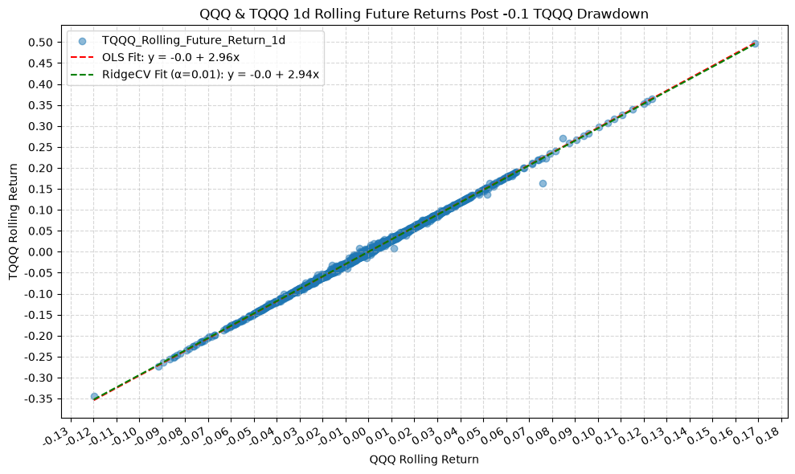
    


                                      OLS Regression Results                                 
    =========================================================================================
    Dep. Variable:     TQQQ_Rolling_Future_Return_1d   R-squared:                       0.999
    Model:                                       OLS   Adj. R-squared:                  0.999
    Method:                            Least Squares   F-statistic:                 6.829e+06
    Date:                           Mon, 23 Mar 2026   Prob (F-statistic):               0.00
    Time:                                   21:59:30   Log-Likelihood:                 33568.
    No. Observations:                           6653   AIC:                        -6.713e+04
    Df Residuals:                               6651   BIC:                        -6.712e+04
    Df Model:                                      1                                         
    Covariance Type:                       nonrobust                                         
    ================================================================================================
                                       coef    std err          t      P>|t|      [0.025      0.975]
    ------------------------------------------------------------------------------------------------
    const                        -5.251e-05   1.91e-05     -2.748      0.006      -9e-05    -1.5e-05
    QQQ_Rolling_Future_Return_1d     2.9552      0.001   2613.230      0.000       2.953       2.957
    ==============================================================================
    Omnibus:                     9921.143   Durbin-Watson:                   2.565
    Prob(Omnibus):                  0.000   Jarque-Bera (JB):         41149977.059
    Skew:                          -8.188   Prob(JB):                         0.00
    Kurtosis:                     387.936   Cond. No.                         59.2
    ==============================================================================
    
    Notes:
    [1] Standard Errors assume that the covariance matrix of the errors is correctly specified.


    

    


    
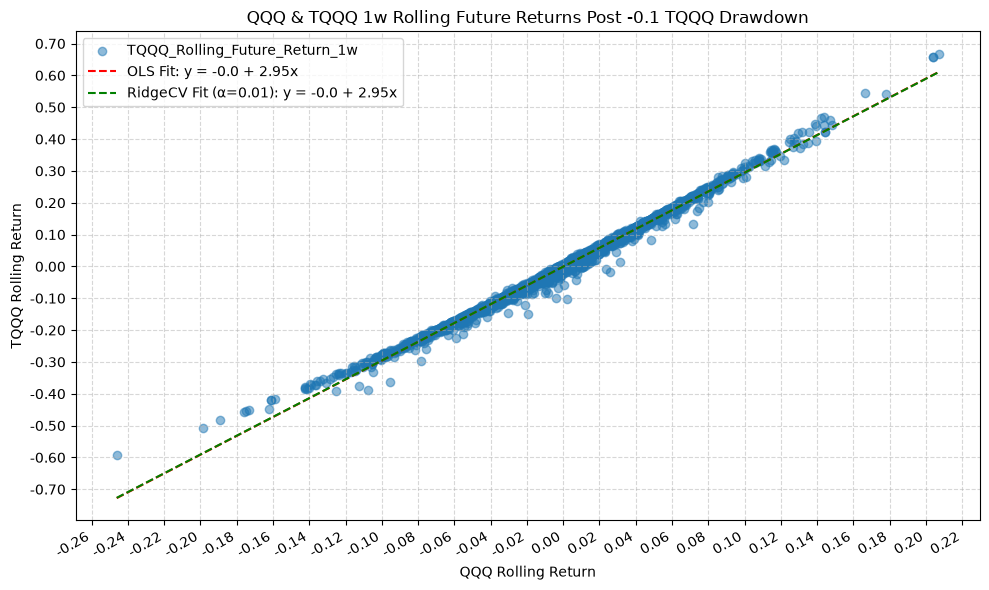
    


                                      OLS Regression Results                                 
    =========================================================================================
    Dep. Variable:     TQQQ_Rolling_Future_Return_1w   R-squared:                       0.994
    Model:                                       OLS   Adj. R-squared:                  0.994
    Method:                            Least Squares   F-statistic:                 1.089e+06
    Date:                           Mon, 23 Mar 2026   Prob (F-statistic):               0.00
    Time:                                   21:59:32   Log-Likelihood:                 22728.
    No. Observations:                           6649   AIC:                        -4.545e+04
    Df Residuals:                               6647   BIC:                        -4.544e+04
    Df Model:                                      1                                         
    Covariance Type:                       nonrobust                                         
    ================================================================================================
                                       coef    std err          t      P>|t|      [0.025      0.975]
    ------------------------------------------------------------------------------------------------
    const                           -0.0008   9.75e-05     -8.250      0.000      -0.001      -0.001
    QQQ_Rolling_Future_Return_1w     2.9527      0.003   1043.680      0.000       2.947       2.958
    ==============================================================================
    Omnibus:                     2702.988   Durbin-Watson:                   0.939
    Prob(Omnibus):                  0.000   Jarque-Bera (JB):           587592.935
    Skew:                          -0.778   Prob(JB):                         0.00
    Kurtosis:                      49.028   Cond. No.                         29.1
    ==============================================================================
    
    Notes:
    [1] Standard Errors assume that the covariance matrix of the errors is correctly specified.


    
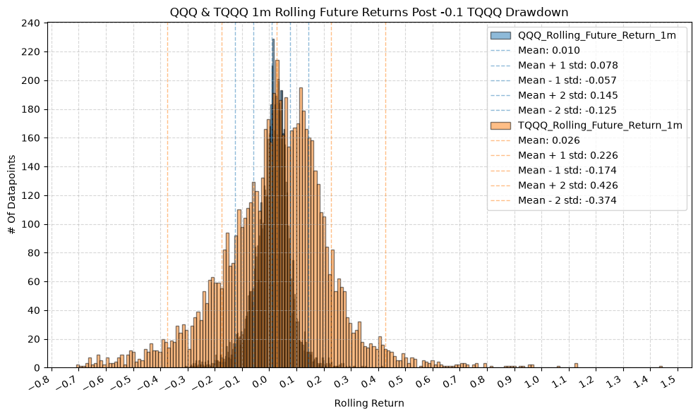
    


    

    


                                      OLS Regression Results                                 
    =========================================================================================
    Dep. Variable:     TQQQ_Rolling_Future_Return_1m   R-squared:                       0.982
    Model:                                       OLS   Adj. R-squared:                  0.982
    Method:                            Least Squares   F-statistic:                 3.706e+05
    Date:                           Mon, 23 Mar 2026   Prob (F-statistic):               0.00
    Time:                                   21:59:33   Log-Likelihood:                 14709.
    No. Observations:                           6633   AIC:                        -2.941e+04
    Df Residuals:                               6631   BIC:                        -2.940e+04
    Df Model:                                      1                                         
    Covariance Type:                       nonrobust                                         
    ================================================================================================
                                       coef    std err          t      P>|t|      [0.025      0.975]
    ------------------------------------------------------------------------------------------------
    const                           -0.0035      0.000    -10.565      0.000      -0.004      -0.003
    QQQ_Rolling_Future_Return_1m     2.9305      0.005    608.737      0.000       2.921       2.940
    ==============================================================================
    Omnibus:                     1682.131   Durbin-Watson:                   0.312
    Prob(Omnibus):                  0.000   Jarque-Bera (JB):            81050.154
    Skew:                           0.394   Prob(JB):                         0.00
    Kurtosis:                      20.107   Cond. No.                         14.9
    ==============================================================================
    
    Notes:
    [1] Standard Errors assume that the covariance matrix of the errors is correctly specified.


    
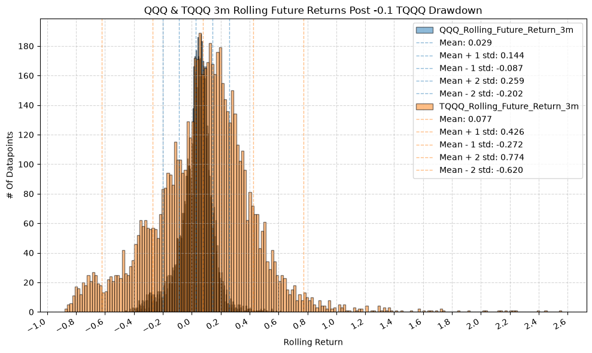
    


    
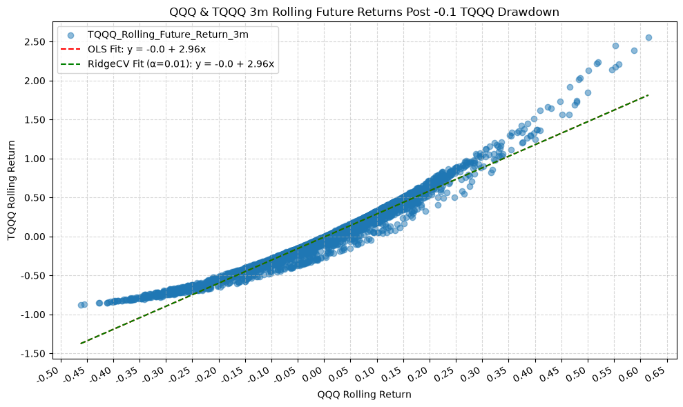
    


                                      OLS Regression Results                                 
    =========================================================================================
    Dep. Variable:     TQQQ_Rolling_Future_Return_3m   R-squared:                       0.957
    Model:                                       OLS   Adj. R-squared:                  0.957
    Method:                            Least Squares   F-statistic:                 1.460e+05
    Date:                           Mon, 23 Mar 2026   Prob (F-statistic):               0.00
    Time:                                   21:59:35   Log-Likelihood:                 7955.3
    No. Observations:                           6591   AIC:                        -1.591e+04
    Df Residuals:                               6589   BIC:                        -1.589e+04
    Df Model:                                      1                                         
    Covariance Type:                       nonrobust                                         
    ================================================================================================
                                       coef    std err          t      P>|t|      [0.025      0.975]
    ------------------------------------------------------------------------------------------------
    const                           -0.0076      0.001     -8.295      0.000      -0.009      -0.006
    QQQ_Rolling_Future_Return_3m     2.9584      0.008    382.045      0.000       2.943       2.974
    ==============================================================================
    Omnibus:                     3406.252   Durbin-Watson:                   0.113
    Prob(Omnibus):                  0.000   Jarque-Bera (JB):            86494.126
    Skew:                           1.943   Prob(JB):                         0.00
    Kurtosis:                      20.316   Cond. No.                         8.69
    ==============================================================================
    
    Notes:
    [1] Standard Errors assume that the covariance matrix of the errors is correctly specified.


    
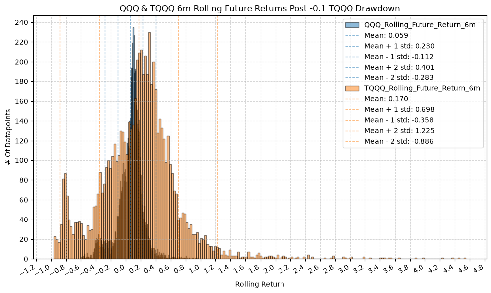
    


    
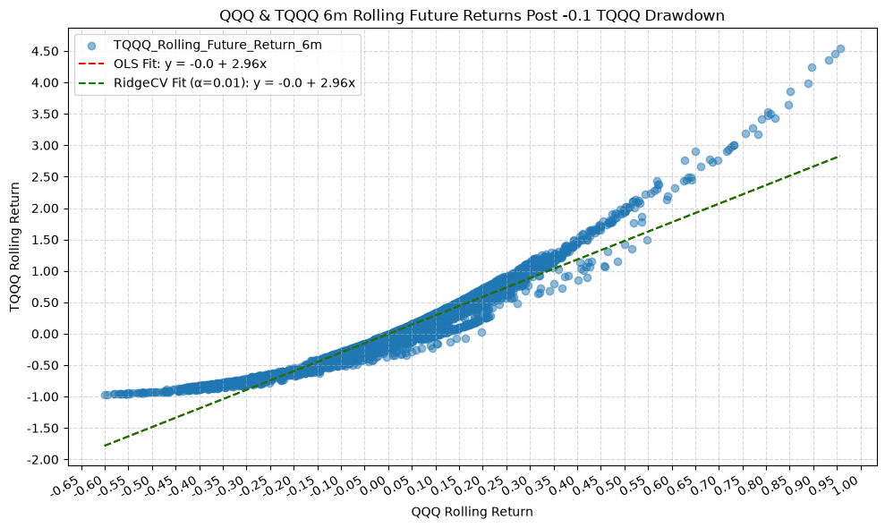
    


                                      OLS Regression Results                                 
    =========================================================================================
    Dep. Variable:     TQQQ_Rolling_Future_Return_6m   R-squared:                       0.921
    Model:                                       OLS   Adj. R-squared:                  0.921
    Method:                            Least Squares   F-statistic:                 7.570e+04
    Date:                           Mon, 23 Mar 2026   Prob (F-statistic):               0.00
    Time:                                   21:59:37   Log-Likelihood:                 3158.3
    No. Observations:                           6528   AIC:                            -6313.
    Df Residuals:                               6526   BIC:                            -6299.
    Df Model:                                      1                                         
    Covariance Type:                       nonrobust                                         
    ================================================================================================
                                       coef    std err          t      P>|t|      [0.025      0.975]
    ------------------------------------------------------------------------------------------------
    const                           -0.0042      0.002     -2.170      0.030      -0.008      -0.000
    QQQ_Rolling_Future_Return_6m     2.9628      0.011    275.145      0.000       2.942       2.984
    ==============================================================================
    Omnibus:                     4159.114   Durbin-Watson:                   0.065
    Prob(Omnibus):                  0.000   Jarque-Bera (JB):           100812.187
    Skew:                           2.648   Prob(JB):                         0.00
    Kurtosis:                      21.509   Cond. No.                         5.85
    ==============================================================================
    
    Notes:
    [1] Standard Errors assume that the covariance matrix of the errors is correctly specified.


    
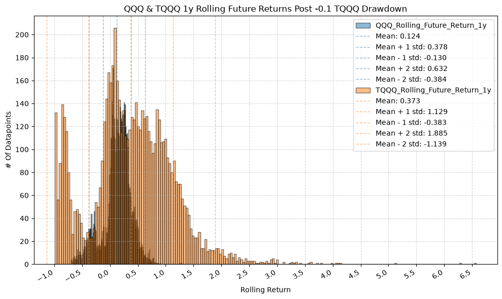
    


    
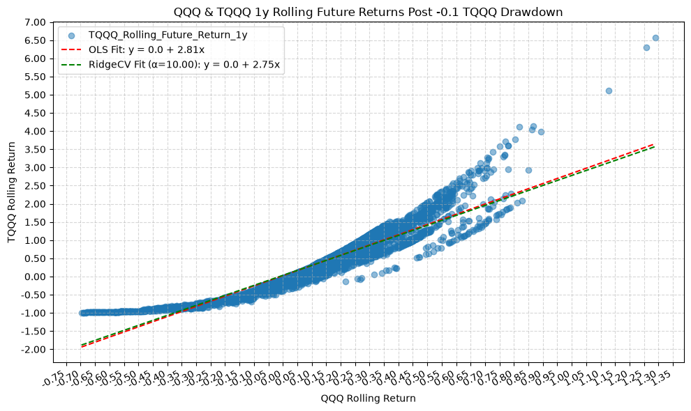
    


                                      OLS Regression Results                                 
    =========================================================================================
    Dep. Variable:     TQQQ_Rolling_Future_Return_1y   R-squared:                       0.893
    Model:                                       OLS   Adj. R-squared:                  0.893
    Method:                            Least Squares   F-statistic:                 5.327e+04
    Date:                           Mon, 23 Mar 2026   Prob (F-statistic):               0.00
    Time:                                   21:59:38   Log-Likelihood:                -135.02
    No. Observations:                           6402   AIC:                             274.0
    Df Residuals:                               6400   BIC:                             287.6
    Df Model:                                      1                                         
    Covariance Type:                       nonrobust                                         
    ================================================================================================
                                       coef    std err          t      P>|t|      [0.025      0.975]
    ------------------------------------------------------------------------------------------------
    const                            0.0227      0.003      6.620      0.000       0.016       0.029
    QQQ_Rolling_Future_Return_1y     2.8086      0.012    230.806      0.000       2.785       2.832
    ==============================================================================
    Omnibus:                     2635.410   Durbin-Watson:                   0.052
    Prob(Omnibus):                  0.000   Jarque-Bera (JB):            29285.399
    Skew:                           1.658   Prob(JB):                         0.00
    Kurtosis:                      12.939   Cond. No.                         4.00
    ==============================================================================
    
    Notes:
    [1] Standard Errors assume that the covariance matrix of the errors is correctly specified.


    
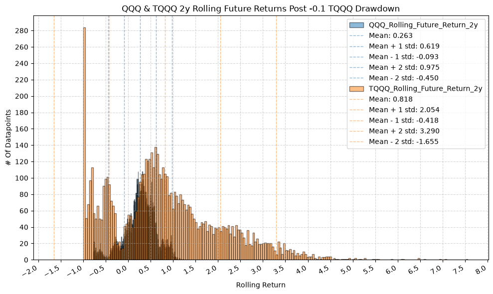
    


    

    


                                      OLS Regression Results                                 
    =========================================================================================
    Dep. Variable:     TQQQ_Rolling_Future_Return_2y   R-squared:                       0.848
    Model:                                       OLS   Adj. R-squared:                  0.848
    Method:                            Least Squares   F-statistic:                 3.424e+04
    Date:                           Mon, 23 Mar 2026   Prob (F-statistic):               0.00
    Time:                                   21:59:40   Log-Likelihood:                -4264.9
    No. Observations:                           6150   AIC:                             8534.
    Df Residuals:                               6148   BIC:                             8547.
    Df Model:                                      1                                         
    Covariance Type:                       nonrobust                                         
    ================================================================================================
                                       coef    std err          t      P>|t|      [0.025      0.975]
    ------------------------------------------------------------------------------------------------
    const                           -0.0192      0.008     -2.513      0.012      -0.034      -0.004
    QQQ_Rolling_Future_Return_2y     3.2011      0.017    185.033      0.000       3.167       3.235
    ==============================================================================
    Omnibus:                     1671.115   Durbin-Watson:                   0.019
    Prob(Omnibus):                  0.000   Jarque-Bera (JB):             4642.964
    Skew:                           1.436   Prob(JB):                         0.00
    Kurtosis:                       6.142   Cond. No.                         3.02
    ==============================================================================
    
    Notes:
    [1] Standard Errors assume that the covariance matrix of the errors is correctly specified.


    
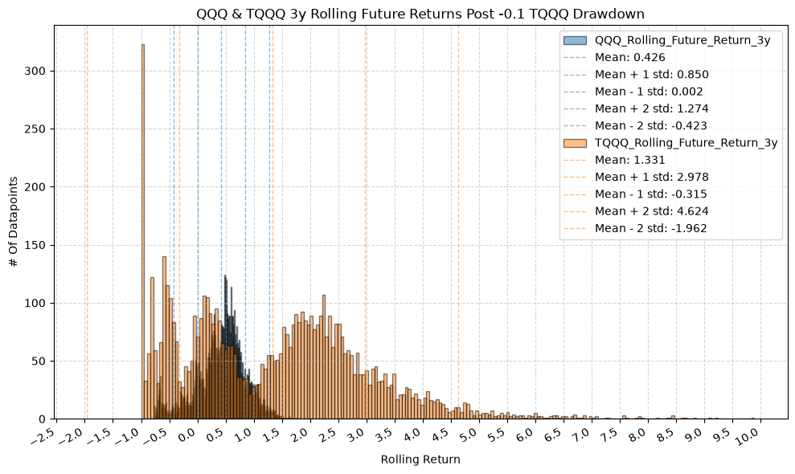
    


    

    


                                      OLS Regression Results                                 
    =========================================================================================
    Dep. Variable:     TQQQ_Rolling_Future_Return_3y   R-squared:                       0.811
    Model:                                       OLS   Adj. R-squared:                  0.811
    Method:                            Least Squares   F-statistic:                 2.527e+04
    Date:                           Mon, 23 Mar 2026   Prob (F-statistic):               0.00
    Time:                                   21:59:42   Log-Likelihood:                -6371.3
    No. Observations:                           5898   AIC:                         1.275e+04
    Df Residuals:                               5896   BIC:                         1.276e+04
    Df Model:                                      1                                         
    Covariance Type:                       nonrobust                                         
    ================================================================================================
                                       coef    std err          t      P>|t|      [0.025      0.975]
    ------------------------------------------------------------------------------------------------
    const                           -0.1589      0.013    -12.137      0.000      -0.185      -0.133
    QQQ_Rolling_Future_Return_3y     3.5019      0.022    158.976      0.000       3.459       3.545
    ==============================================================================
    Omnibus:                      871.703   Durbin-Watson:                   0.015
    Prob(Omnibus):                  0.000   Jarque-Bera (JB):             1536.806
    Skew:                           0.961   Prob(JB):                         0.00
    Kurtosis:                       4.601   Cond. No.                         2.86
    ==============================================================================
    
    Notes:
    [1] Standard Errors assume that the covariance matrix of the errors is correctly specified.


    
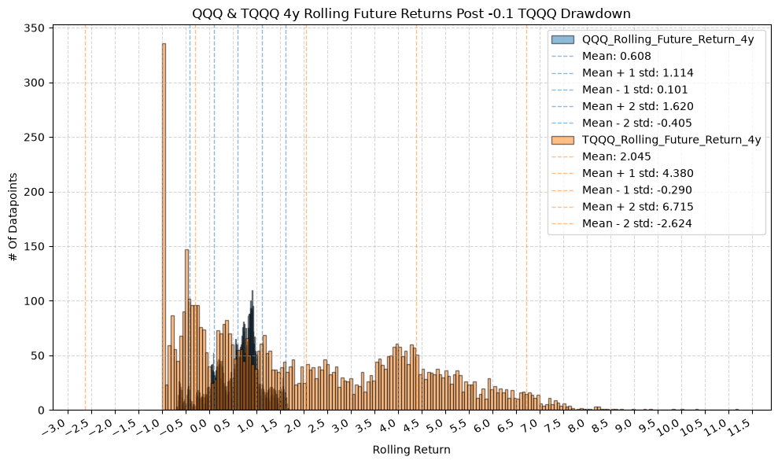
    


    
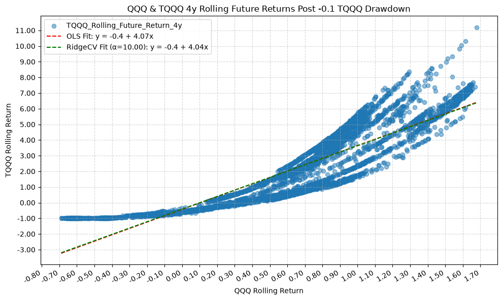
    


                                      OLS Regression Results                                 
    =========================================================================================
    Dep. Variable:     TQQQ_Rolling_Future_Return_4y   R-squared:                       0.783
    Model:                                       OLS   Adj. R-squared:                  0.783
    Method:                            Least Squares   F-statistic:                 2.034e+04
    Date:                           Mon, 23 Mar 2026   Prob (F-statistic):               0.00
    Time:                                   21:59:44   Log-Likelihood:                -8503.0
    No. Observations:                           5646   AIC:                         1.701e+04
    Df Residuals:                               5644   BIC:                         1.702e+04
    Df Model:                                      1                                         
    Covariance Type:                       nonrobust                                         
    ================================================================================================
                                       coef    std err          t      P>|t|      [0.025      0.975]
    ------------------------------------------------------------------------------------------------
    const                           -0.4276      0.023    -18.927      0.000      -0.472      -0.383
    QQQ_Rolling_Future_Return_4y     4.0962      0.029    142.630      0.000       4.040       4.153
    ==============================================================================
    Omnibus:                      127.164   Durbin-Watson:                   0.010
    Prob(Omnibus):                  0.000   Jarque-Bera (JB):               79.194
    Skew:                           0.148   Prob(JB):                     6.36e-18
    Kurtosis:                       2.501   Cond. No.                         2.85
    ==============================================================================
    
    Notes:
    [1] Standard Errors assume that the covariance matrix of the errors is correctly specified.


    
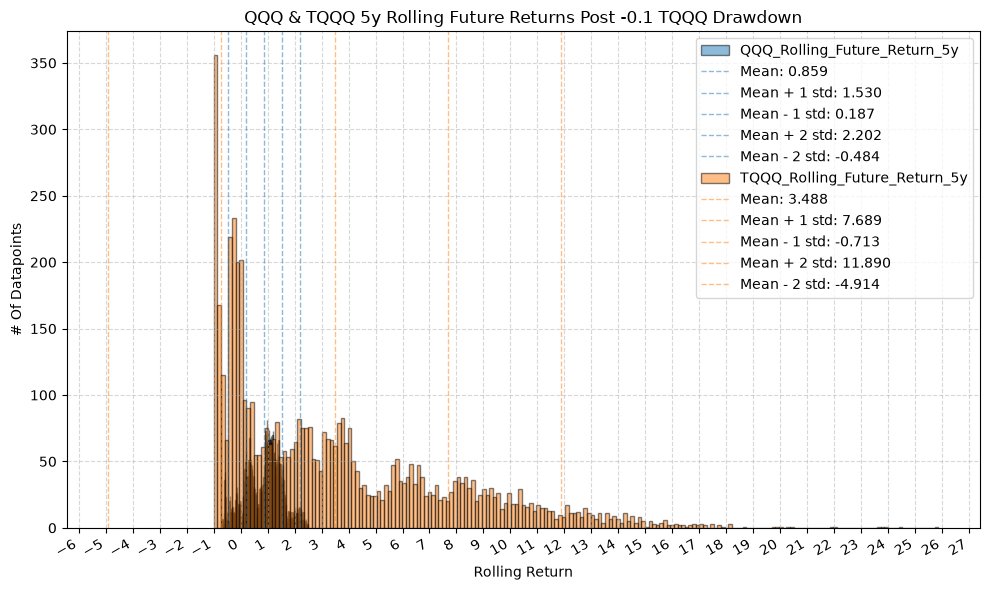
    


    
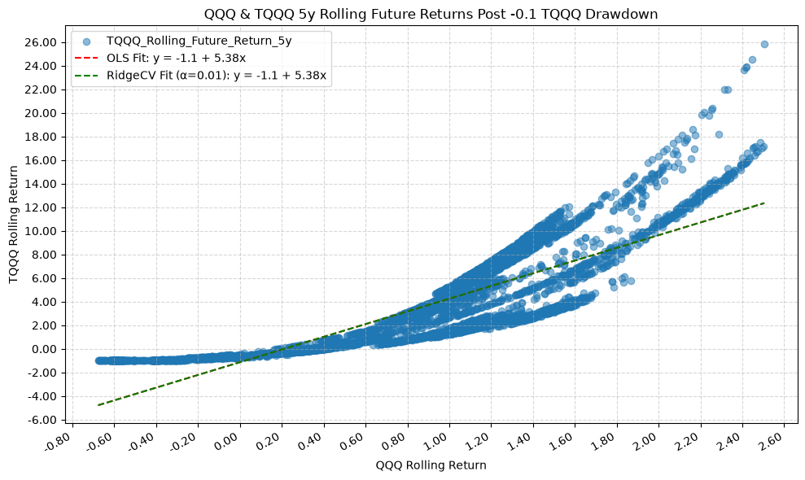
    


                                      OLS Regression Results                                 
    =========================================================================================
    Dep. Variable:     TQQQ_Rolling_Future_Return_5y   R-squared:                       0.745
    Model:                                       OLS   Adj. R-squared:                  0.745
    Method:                            Least Squares   F-statistic:                 1.577e+04
    Date:                           Mon, 23 Mar 2026   Prob (F-statistic):               0.00
    Time:                                   21:59:46   Log-Likelihood:                -11731.
    No. Observations:                           5394   AIC:                         2.347e+04
    Df Residuals:                               5392   BIC:                         2.348e+04
    Df Model:                                      1                                         
    Covariance Type:                       nonrobust                                         
    ================================================================================================
                                       coef    std err          t      P>|t|      [0.025      0.975]
    ------------------------------------------------------------------------------------------------
    const                           -1.1160      0.047    -23.806      0.000      -1.208      -1.024
    QQQ_Rolling_Future_Return_5y     5.3968      0.043    125.578      0.000       5.313       5.481
    ==============================================================================
    Omnibus:                      276.642   Durbin-Watson:                   0.009
    Prob(Omnibus):                  0.000   Jarque-Bera (JB):              406.454
    Skew:                           0.460   Prob(JB):                     5.49e-89
    Kurtosis:                       3.980   Cond. No.                         2.90
    ==============================================================================
    
    Notes:
    [1] Standard Errors assume that the covariance matrix of the errors is correctly specified.


    

    


    

    


                                      OLS Regression Results                                 
    =========================================================================================
    Dep. Variable:     TQQQ_Rolling_Future_Return_1d   R-squared:                       0.999
    Model:                                       OLS   Adj. R-squared:                  0.999
    Method:                            Least Squares   F-statistic:                 6.607e+06
    Date:                           Mon, 23 Mar 2026   Prob (F-statistic):               0.00
    Time:                                   21:59:47   Log-Likelihood:                 33141.
    No. Observations:                           6576   AIC:                        -6.628e+04
    Df Residuals:                               6574   BIC:                        -6.626e+04
    Df Model:                                      1                                         
    Covariance Type:                       nonrobust                                         
    ================================================================================================
                                       coef    std err          t      P>|t|      [0.025      0.975]
    ------------------------------------------------------------------------------------------------
    const                        -5.312e-05   1.93e-05     -2.748      0.006    -9.1e-05   -1.52e-05
    QQQ_Rolling_Future_Return_1d     2.9552      0.001   2570.336      0.000       2.953       2.957
    ==============================================================================
    Omnibus:                     9776.502   Durbin-Watson:                   2.565
    Prob(Omnibus):                  0.000   Jarque-Bera (JB):         39728976.844
    Skew:                          -8.139   Prob(JB):                         0.00
    Kurtosis:                     383.436   Cond. No.                         59.5
    ==============================================================================
    
    Notes:
    [1] Standard Errors assume that the covariance matrix of the errors is correctly specified.


    
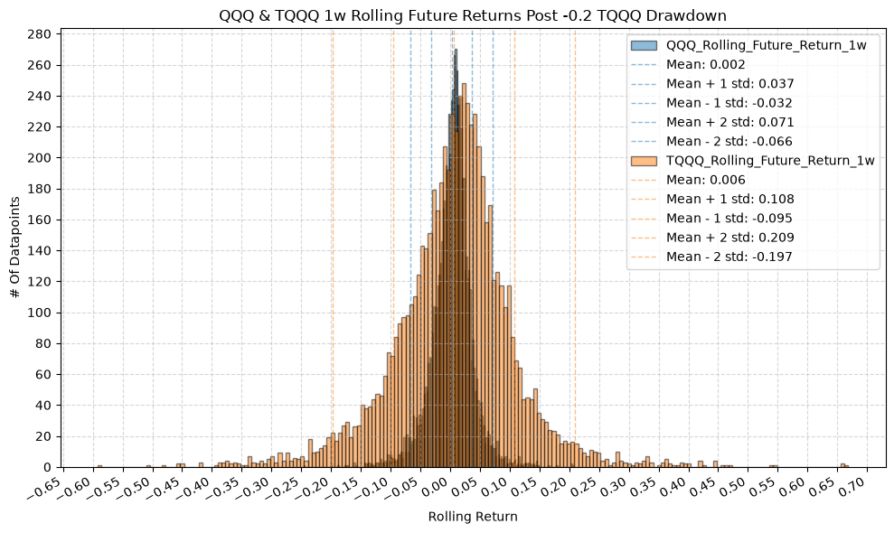
    


    

    


                                      OLS Regression Results                                 
    =========================================================================================
    Dep. Variable:     TQQQ_Rolling_Future_Return_1w   R-squared:                       0.994
    Model:                                       OLS   Adj. R-squared:                  0.994
    Method:                            Least Squares   F-statistic:                 1.070e+06
    Date:                           Mon, 23 Mar 2026   Prob (F-statistic):               0.00
    Time:                                   21:59:49   Log-Likelihood:                 22472.
    No. Observations:                           6572   AIC:                        -4.494e+04
    Df Residuals:                               6570   BIC:                        -4.493e+04
    Df Model:                                      1                                         
    Covariance Type:                       nonrobust                                         
    ================================================================================================
                                       coef    std err          t      P>|t|      [0.025      0.975]
    ------------------------------------------------------------------------------------------------
    const                           -0.0008   9.79e-05     -8.045      0.000      -0.001      -0.001
    QQQ_Rolling_Future_Return_1w     2.9518      0.003   1034.395      0.000       2.946       2.957
    ==============================================================================
    Omnibus:                     2706.760   Durbin-Watson:                   0.933
    Prob(Omnibus):                  0.000   Jarque-Bera (JB):           596172.137
    Skew:                          -0.802   Prob(JB):                         0.00
    Kurtosis:                      49.632   Cond. No.                         29.2
    ==============================================================================
    
    Notes:
    [1] Standard Errors assume that the covariance matrix of the errors is correctly specified.


    

    


    
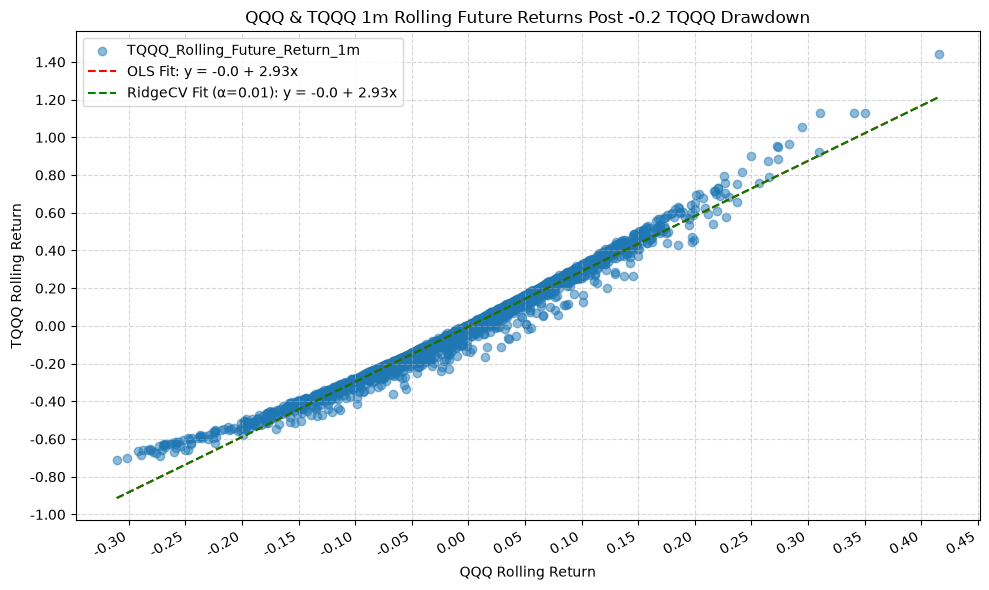
    


                                      OLS Regression Results                                 
    =========================================================================================
    Dep. Variable:     TQQQ_Rolling_Future_Return_1m   R-squared:                       0.983
    Model:                                       OLS   Adj. R-squared:                  0.983
    Method:                            Least Squares   F-statistic:                 3.706e+05
    Date:                           Mon, 23 Mar 2026   Prob (F-statistic):               0.00
    Time:                                   21:59:50   Log-Likelihood:                 14666.
    No. Observations:                           6556   AIC:                        -2.933e+04
    Df Residuals:                               6554   BIC:                        -2.931e+04
    Df Model:                                      1                                         
    Covariance Type:                       nonrobust                                         
    ================================================================================================
                                       coef    std err          t      P>|t|      [0.025      0.975]
    ------------------------------------------------------------------------------------------------
    const                           -0.0035      0.000    -10.838      0.000      -0.004      -0.003
    QQQ_Rolling_Future_Return_1m     2.9225      0.005    608.738      0.000       2.913       2.932
    ==============================================================================
    Omnibus:                     1537.890   Durbin-Watson:                   0.317
    Prob(Omnibus):                  0.000   Jarque-Bera (JB):            81206.359
    Skew:                           0.161   Prob(JB):                         0.00
    Kurtosis:                      20.239   Cond. No.                         15.0
    ==============================================================================
    
    Notes:
    [1] Standard Errors assume that the covariance matrix of the errors is correctly specified.


    

    


    

    


                                      OLS Regression Results                                 
    =========================================================================================
    Dep. Variable:     TQQQ_Rolling_Future_Return_3m   R-squared:                       0.960
    Model:                                       OLS   Adj. R-squared:                  0.960
    Method:                            Least Squares   F-statistic:                 1.545e+05
    Date:                           Mon, 23 Mar 2026   Prob (F-statistic):               0.00
    Time:                                   21:59:52   Log-Likelihood:                 8329.3
    No. Observations:                           6514   AIC:                        -1.665e+04
    Df Residuals:                               6512   BIC:                        -1.664e+04
    Df Model:                                      1                                         
    Covariance Type:                       nonrobust                                         
    ================================================================================================
                                       coef    std err          t      P>|t|      [0.025      0.975]
    ------------------------------------------------------------------------------------------------
    const                           -0.0070      0.001     -8.214      0.000      -0.009      -0.005
    QQQ_Rolling_Future_Return_3m     2.9105      0.007    393.118      0.000       2.896       2.925
    ==============================================================================
    Omnibus:                     2149.722   Durbin-Watson:                   0.136
    Prob(Omnibus):                  0.000   Jarque-Bera (JB):            38861.452
    Skew:                           1.110   Prob(JB):                         0.00
    Kurtosis:                      14.758   Cond. No.                         8.88
    ==============================================================================
    
    Notes:
    [1] Standard Errors assume that the covariance matrix of the errors is correctly specified.


    
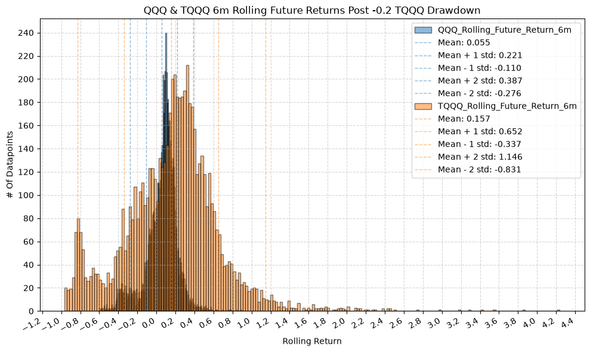
    


    

    


                                      OLS Regression Results                                 
    =========================================================================================
    Dep. Variable:     TQQQ_Rolling_Future_Return_6m   R-squared:                       0.926
    Model:                                       OLS   Adj. R-squared:                  0.926
    Method:                            Least Squares   F-statistic:                 8.107e+04
    Date:                           Mon, 23 Mar 2026   Prob (F-statistic):               0.00
    Time:                                   21:59:54   Log-Likelihood:                 3783.3
    No. Observations:                           6451   AIC:                            -7563.
    Df Residuals:                               6449   BIC:                            -7549.
    Df Model:                                      1                                         
    Covariance Type:                       nonrobust                                         
    ================================================================================================
                                       coef    std err          t      P>|t|      [0.025      0.975]
    ------------------------------------------------------------------------------------------------
    const                           -0.0016      0.002     -0.902      0.367      -0.005       0.002
    QQQ_Rolling_Future_Return_6m     2.8745      0.010    284.728      0.000       2.855       2.894
    ==============================================================================
    Omnibus:                     3187.487   Durbin-Watson:                   0.077
    Prob(Omnibus):                  0.000   Jarque-Bera (JB):            49858.855
    Skew:                           1.979   Prob(JB):                         0.00
    Kurtosis:                      16.032   Cond. No.                         6.04
    ==============================================================================
    
    Notes:
    [1] Standard Errors assume that the covariance matrix of the errors is correctly specified.


    

    


    
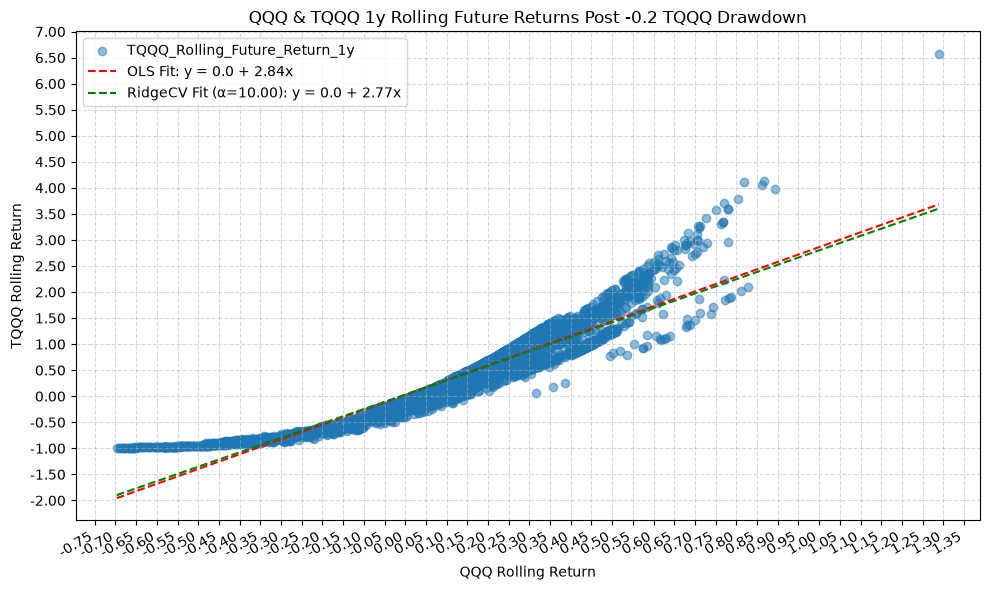
    


                                      OLS Regression Results                                 
    =========================================================================================
    Dep. Variable:     TQQQ_Rolling_Future_Return_1y   R-squared:                       0.898
    Model:                                       OLS   Adj. R-squared:                  0.898
    Method:                            Least Squares   F-statistic:                 5.552e+04
    Date:                           Mon, 23 Mar 2026   Prob (F-statistic):               0.00
    Time:                                   21:59:55   Log-Likelihood:                 116.33
    No. Observations:                           6325   AIC:                            -228.7
    Df Residuals:                               6323   BIC:                            -215.2
    Df Model:                                      1                                         
    Covariance Type:                       nonrobust                                         
    ================================================================================================
                                       coef    std err          t      P>|t|      [0.025      0.975]
    ------------------------------------------------------------------------------------------------
    const                            0.0225      0.003      6.800      0.000       0.016       0.029
    QQQ_Rolling_Future_Return_1y     2.8341      0.012    235.629      0.000       2.811       2.858
    ==============================================================================
    Omnibus:                     2426.355   Durbin-Watson:                   0.068
    Prob(Omnibus):                  0.000   Jarque-Bera (JB):            19481.948
    Skew:                           1.622   Prob(JB):                         0.00
    Kurtosis:                      10.963   Cond. No.                         4.09
    ==============================================================================
    
    Notes:
    [1] Standard Errors assume that the covariance matrix of the errors is correctly specified.


    
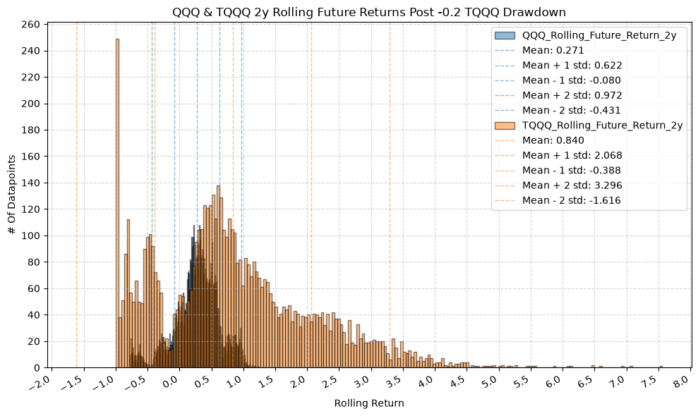
    


    

    


                                      OLS Regression Results                                 
    =========================================================================================
    Dep. Variable:     TQQQ_Rolling_Future_Return_2y   R-squared:                       0.847
    Model:                                       OLS   Adj. R-squared:                  0.847
    Method:                            Least Squares   F-statistic:                 3.363e+04
    Date:                           Mon, 23 Mar 2026   Prob (F-statistic):               0.00
    Time:                                   21:59:57   Log-Likelihood:                -4185.9
    No. Observations:                           6073   AIC:                             8376.
    Df Residuals:                               6071   BIC:                             8389.
    Df Model:                                      1                                         
    Covariance Type:                       nonrobust                                         
    ================================================================================================
                                       coef    std err          t      P>|t|      [0.025      0.975]
    ------------------------------------------------------------------------------------------------
    const                           -0.0292      0.008     -3.748      0.000      -0.044      -0.014
    QQQ_Rolling_Future_Return_2y     3.2273      0.018    183.386      0.000       3.193       3.262
    ==============================================================================
    Omnibus:                     1696.489   Durbin-Watson:                   0.019
    Prob(Omnibus):                  0.000   Jarque-Bera (JB):             4868.815
    Skew:                           1.463   Prob(JB):                         0.00
    Kurtosis:                       6.269   Cond. No.                         3.08
    ==============================================================================
    
    Notes:
    [1] Standard Errors assume that the covariance matrix of the errors is correctly specified.


    
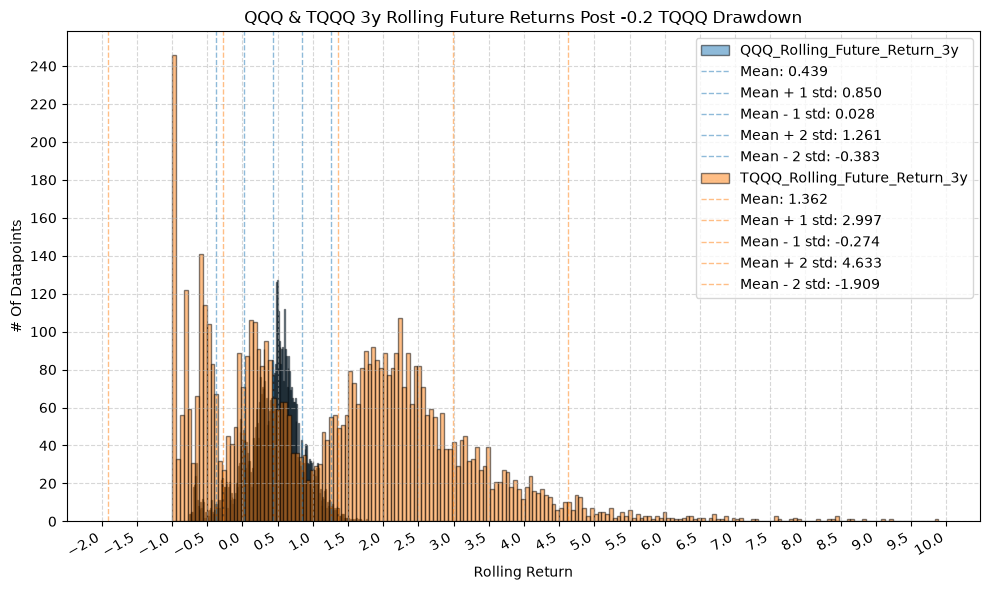
    


    
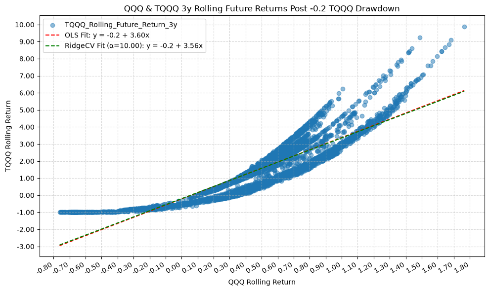
    


                                      OLS Regression Results                                 
    =========================================================================================
    Dep. Variable:     TQQQ_Rolling_Future_Return_3y   R-squared:                       0.814
    Model:                                       OLS   Adj. R-squared:                  0.814
    Method:                            Least Squares   F-statistic:                 2.553e+04
    Date:                           Mon, 23 Mar 2026   Prob (F-statistic):               0.00
    Time:                                   21:59:59   Log-Likelihood:                -6195.0
    No. Observations:                           5821   AIC:                         1.239e+04
    Df Residuals:                               5819   BIC:                         1.241e+04
    Df Model:                                      1                                         
    Covariance Type:                       nonrobust                                         
    ================================================================================================
                                       coef    std err          t      P>|t|      [0.025      0.975]
    ------------------------------------------------------------------------------------------------
    const                           -0.2169      0.013    -16.188      0.000      -0.243      -0.191
    QQQ_Rolling_Future_Return_3y     3.6000      0.023    159.772      0.000       3.556       3.644
    ==============================================================================
    Omnibus:                      877.246   Durbin-Watson:                   0.015
    Prob(Omnibus):                  0.000   Jarque-Bera (JB):             1578.522
    Skew:                           0.967   Prob(JB):                         0.00
    Kurtosis:                       4.663   Cond. No.                         2.98
    ==============================================================================
    
    Notes:
    [1] Standard Errors assume that the covariance matrix of the errors is correctly specified.


    

    


    

    


                                      OLS Regression Results                                 
    =========================================================================================
    Dep. Variable:     TQQQ_Rolling_Future_Return_4y   R-squared:                       0.784
    Model:                                       OLS   Adj. R-squared:                  0.784
    Method:                            Least Squares   F-statistic:                 2.020e+04
    Date:                           Mon, 23 Mar 2026   Prob (F-statistic):               0.00
    Time:                                   22:00:00   Log-Likelihood:                -8345.7
    No. Observations:                           5569   AIC:                         1.670e+04
    Df Residuals:                               5567   BIC:                         1.671e+04
    Df Model:                                      1                                         
    Covariance Type:                       nonrobust                                         
    ================================================================================================
                                       coef    std err          t      P>|t|      [0.025      0.975]
    ------------------------------------------------------------------------------------------------
    const                           -0.5067      0.023    -21.753      0.000      -0.552      -0.461
    QQQ_Rolling_Future_Return_4y     4.1913      0.029    142.118      0.000       4.134       4.249
    ==============================================================================
    Omnibus:                       90.780   Durbin-Watson:                   0.010
    Prob(Omnibus):                  0.000   Jarque-Bera (JB):               63.985
    Skew:                           0.153   Prob(JB):                     1.28e-14
    Kurtosis:                       2.573   Cond. No.                         2.96
    ==============================================================================
    
    Notes:
    [1] Standard Errors assume that the covariance matrix of the errors is correctly specified.


    
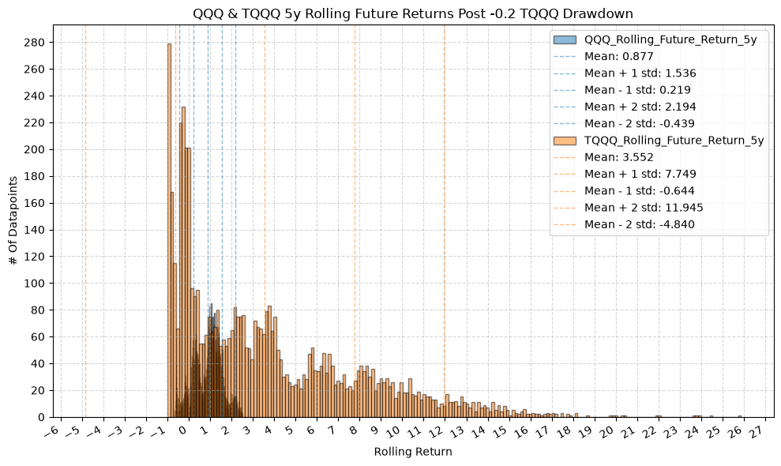
    


    

    


                                      OLS Regression Results                                 
    =========================================================================================
    Dep. Variable:     TQQQ_Rolling_Future_Return_5y   R-squared:                       0.746
    Model:                                       OLS   Adj. R-squared:                  0.746
    Method:                            Least Squares   F-statistic:                 1.565e+04
    Date:                           Mon, 23 Mar 2026   Prob (F-statistic):               0.00
    Time:                                   22:00:02   Log-Likelihood:                -11544.
    No. Observations:                           5317   AIC:                         2.309e+04
    Df Residuals:                               5315   BIC:                         2.311e+04
    Df Model:                                      1                                         
    Covariance Type:                       nonrobust                                         
    ================================================================================================
                                       coef    std err          t      P>|t|      [0.025      0.975]
    ------------------------------------------------------------------------------------------------
    const                           -1.2461      0.048    -25.807      0.000      -1.341      -1.151
    QQQ_Rolling_Future_Return_5y     5.5050      0.044    125.105      0.000       5.419       5.591
    ==============================================================================
    Omnibus:                      257.259   Durbin-Watson:                   0.009
    Prob(Omnibus):                  0.000   Jarque-Bera (JB):              381.231
    Skew:                           0.438   Prob(JB):                     1.65e-83
    Kurtosis:                       3.976   Cond. No.                         3.00
    ==============================================================================
    
    Notes:
    [1] Standard Errors assume that the covariance matrix of the errors is correctly specified.


    

    


    

    


                                      OLS Regression Results                                 
    =========================================================================================
    Dep. Variable:     TQQQ_Rolling_Future_Return_1d   R-squared:                       0.999
    Model:                                       OLS   Adj. R-squared:                  0.999
    Method:                            Least Squares   F-statistic:                 6.438e+06
    Date:                           Mon, 23 Mar 2026   Prob (F-statistic):               0.00
    Time:                                   22:00:04   Log-Likelihood:                 32920.
    No. Observations:                           6536   AIC:                        -6.584e+04
    Df Residuals:                               6534   BIC:                        -6.582e+04
    Df Model:                                      1                                         
    Covariance Type:                       nonrobust                                         
    ================================================================================================
                                       coef    std err          t      P>|t|      [0.025      0.975]
    ------------------------------------------------------------------------------------------------
    const                        -5.345e-05   1.95e-05     -2.748      0.006   -9.16e-05   -1.53e-05
    QQQ_Rolling_Future_Return_1d     2.9552      0.001   2537.269      0.000       2.953       2.957
    ==============================================================================
    Omnibus:                     9701.531   Durbin-Watson:                   2.565
    Prob(Omnibus):                  0.000   Jarque-Bera (JB):         39004118.756
    Skew:                          -8.113   Prob(JB):                         0.00
    Kurtosis:                     381.099   Cond. No.                         59.9
    ==============================================================================
    
    Notes:
    [1] Standard Errors assume that the covariance matrix of the errors is correctly specified.


    

    


    

    


                                      OLS Regression Results                                 
    =========================================================================================
    Dep. Variable:     TQQQ_Rolling_Future_Return_1w   R-squared:                       0.994
    Model:                                       OLS   Adj. R-squared:                  0.994
    Method:                            Least Squares   F-statistic:                 1.120e+06
    Date:                           Mon, 23 Mar 2026   Prob (F-statistic):               0.00
    Time:                                   22:00:05   Log-Likelihood:                 22539.
    No. Observations:                           6532   AIC:                        -4.507e+04
    Df Residuals:                               6530   BIC:                        -4.506e+04
    Df Model:                                      1                                         
    Covariance Type:                       nonrobust                                         
    ================================================================================================
                                       coef    std err          t      P>|t|      [0.025      0.975]
    ------------------------------------------------------------------------------------------------
    const                           -0.0008   9.52e-05     -8.363      0.000      -0.001      -0.001
    QQQ_Rolling_Future_Return_1w     2.9553      0.003   1058.242      0.000       2.950       2.961
    ==============================================================================
    Omnibus:                     3465.972   Durbin-Watson:                   0.902
    Prob(Omnibus):                  0.000   Jarque-Bera (JB):           389191.684
    Skew:                          -1.579   Prob(JB):                         0.00
    Kurtosis:                      40.683   Cond. No.                         29.4
    ==============================================================================
    
    Notes:
    [1] Standard Errors assume that the covariance matrix of the errors is correctly specified.


    

    


    

    


                                      OLS Regression Results                                 
    =========================================================================================
    Dep. Variable:     TQQQ_Rolling_Future_Return_1m   R-squared:                       0.983
    Model:                                       OLS   Adj. R-squared:                  0.983
    Method:                            Least Squares   F-statistic:                 3.677e+05
    Date:                           Mon, 23 Mar 2026   Prob (F-statistic):               0.00
    Time:                                   22:00:07   Log-Likelihood:                 14636.
    No. Observations:                           6516   AIC:                        -2.927e+04
    Df Residuals:                               6514   BIC:                        -2.925e+04
    Df Model:                                      1                                         
    Covariance Type:                       nonrobust                                         
    ================================================================================================
                                       coef    std err          t      P>|t|      [0.025      0.975]
    ------------------------------------------------------------------------------------------------
    const                           -0.0035      0.000    -11.070      0.000      -0.004      -0.003
    QQQ_Rolling_Future_Return_1m     2.9177      0.005    606.418      0.000       2.908       2.927
    ==============================================================================
    Omnibus:                     1513.769   Durbin-Watson:                   0.308
    Prob(Omnibus):                  0.000   Jarque-Bera (JB):            82043.239
    Skew:                           0.084   Prob(JB):                         0.00
    Kurtosis:                      20.383   Cond. No.                         15.2
    ==============================================================================
    
    Notes:
    [1] Standard Errors assume that the covariance matrix of the errors is correctly specified.


    

    


    

    


                                      OLS Regression Results                                 
    =========================================================================================
    Dep. Variable:     TQQQ_Rolling_Future_Return_3m   R-squared:                       0.961
    Model:                                       OLS   Adj. R-squared:                  0.961
    Method:                            Least Squares   F-statistic:                 1.586e+05
    Date:                           Mon, 23 Mar 2026   Prob (F-statistic):               0.00
    Time:                                   22:00:09   Log-Likelihood:                 8465.8
    No. Observations:                           6474   AIC:                        -1.693e+04
    Df Residuals:                               6472   BIC:                        -1.691e+04
    Df Model:                                      1                                         
    Covariance Type:                       nonrobust                                         
    ================================================================================================
                                       coef    std err          t      P>|t|      [0.025      0.975]
    ------------------------------------------------------------------------------------------------
    const                           -0.0067      0.001     -8.081      0.000      -0.008      -0.005
    QQQ_Rolling_Future_Return_3m     2.8944      0.007    398.234      0.000       2.880       2.909
    ==============================================================================
    Omnibus:                     1349.017   Durbin-Watson:                   0.103
    Prob(Omnibus):                  0.000   Jarque-Bera (JB):            15307.847
    Skew:                           0.668   Prob(JB):                         0.00
    Kurtosis:                      10.414   Cond. No.                         8.94
    ==============================================================================
    
    Notes:
    [1] Standard Errors assume that the covariance matrix of the errors is correctly specified.


    
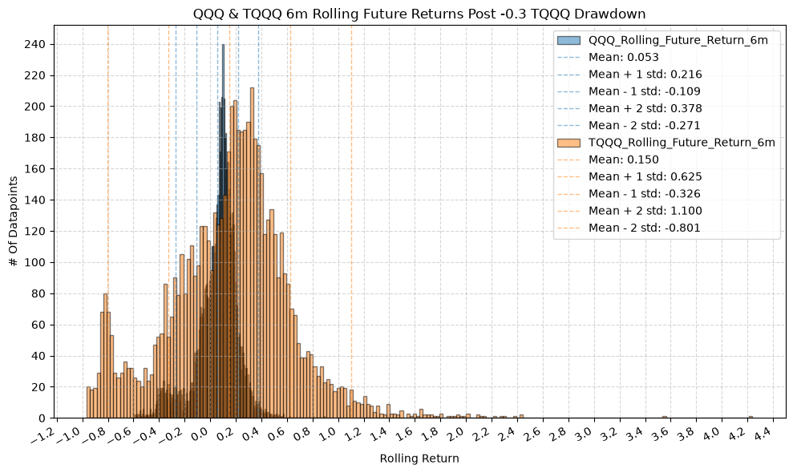
    


    
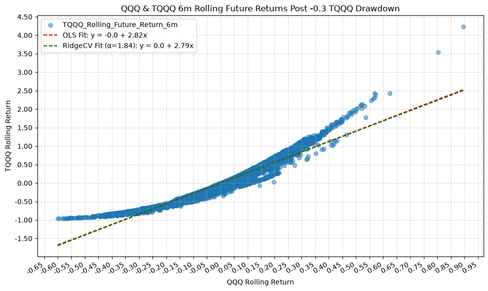
    


                                      OLS Regression Results                                 
    =========================================================================================
    Dep. Variable:     TQQQ_Rolling_Future_Return_6m   R-squared:                       0.929
    Model:                                       OLS   Adj. R-squared:                  0.929
    Method:                            Least Squares   F-statistic:                 8.383e+04
    Date:                           Mon, 23 Mar 2026   Prob (F-statistic):               0.00
    Time:                                   22:00:11   Log-Likelihood:                 4132.8
    No. Observations:                           6411   AIC:                            -8262.
    Df Residuals:                               6409   BIC:                            -8248.
    Df Model:                                      1                                         
    Covariance Type:                       nonrobust                                         
    ================================================================================================
                                       coef    std err          t      P>|t|      [0.025      0.975]
    ------------------------------------------------------------------------------------------------
    const                           -0.0006      0.002     -0.381      0.703      -0.004       0.003
    QQQ_Rolling_Future_Return_6m     2.8224      0.010    289.527      0.000       2.803       2.842
    ==============================================================================
    Omnibus:                     2686.399   Durbin-Watson:                   0.109
    Prob(Omnibus):                  0.000   Jarque-Bera (JB):            36557.241
    Skew:                           1.631   Prob(JB):                         0.00
    Kurtosis:                      14.235   Cond. No.                         6.16
    ==============================================================================
    
    Notes:
    [1] Standard Errors assume that the covariance matrix of the errors is correctly specified.


    

    


    

    


                                      OLS Regression Results                                 
    =========================================================================================
    Dep. Variable:     TQQQ_Rolling_Future_Return_1y   R-squared:                       0.902
    Model:                                       OLS   Adj. R-squared:                  0.902
    Method:                            Least Squares   F-statistic:                 5.755e+04
    Date:                           Mon, 23 Mar 2026   Prob (F-statistic):               0.00
    Time:                                   22:00:13   Log-Likelihood:                 292.28
    No. Observations:                           6285   AIC:                            -580.6
    Df Residuals:                               6283   BIC:                            -567.1
    Df Model:                                      1                                         
    Covariance Type:                       nonrobust                                         
    ================================================================================================
                                       coef    std err          t      P>|t|      [0.025      0.975]
    ------------------------------------------------------------------------------------------------
    const                            0.0222      0.003      6.880      0.000       0.016       0.029
    QQQ_Rolling_Future_Return_1y     2.8512      0.012    239.888      0.000       2.828       2.875
    ==============================================================================
    Omnibus:                     1989.506   Durbin-Watson:                   0.043
    Prob(Omnibus):                  0.000   Jarque-Bera (JB):             8599.570
    Skew:                           1.494   Prob(JB):                         0.00
    Kurtosis:                       7.890   Cond. No.                         4.14
    ==============================================================================
    
    Notes:
    [1] Standard Errors assume that the covariance matrix of the errors is correctly specified.


    

    


    

    


                                      OLS Regression Results                                 
    =========================================================================================
    Dep. Variable:     TQQQ_Rolling_Future_Return_2y   R-squared:                       0.847
    Model:                                       OLS   Adj. R-squared:                  0.847
    Method:                            Least Squares   F-statistic:                 3.330e+04
    Date:                           Mon, 23 Mar 2026   Prob (F-statistic):               0.00
    Time:                                   22:00:15   Log-Likelihood:                -4146.1
    No. Observations:                           6033   AIC:                             8296.
    Df Residuals:                               6031   BIC:                             8310.
    Df Model:                                      1                                         
    Covariance Type:                       nonrobust                                         
    ================================================================================================
                                       coef    std err          t      P>|t|      [0.025      0.975]
    ------------------------------------------------------------------------------------------------
    const                           -0.0321      0.008     -4.090      0.000      -0.048      -0.017
    QQQ_Rolling_Future_Return_2y     3.2363      0.018    182.474      0.000       3.202       3.271
    ==============================================================================
    Omnibus:                     1703.989   Durbin-Watson:                   0.019
    Prob(Omnibus):                  0.000   Jarque-Bera (JB):             4959.915
    Skew:                           1.473   Prob(JB):                         0.00
    Kurtosis:                       6.325   Cond. No.                         3.10
    ==============================================================================
    
    Notes:
    [1] Standard Errors assume that the covariance matrix of the errors is correctly specified.


    
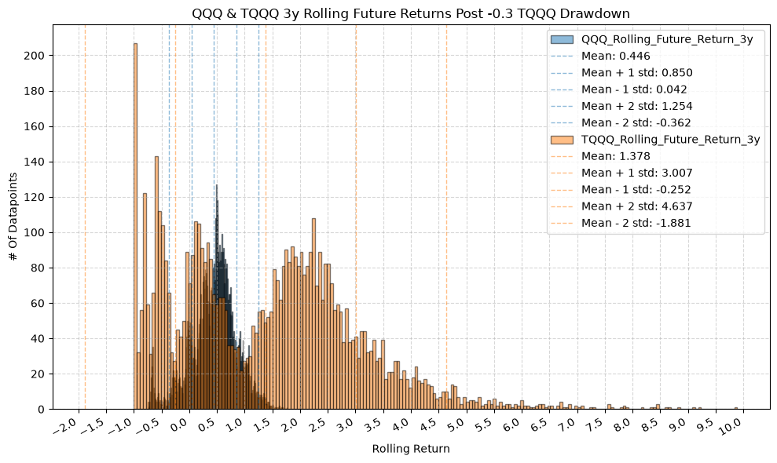
    


    

    


                                      OLS Regression Results                                 
    =========================================================================================
    Dep. Variable:     TQQQ_Rolling_Future_Return_3y   R-squared:                       0.817
    Model:                                       OLS   Adj. R-squared:                  0.816
    Method:                            Least Squares   F-statistic:                 2.571e+04
    Date:                           Mon, 23 Mar 2026   Prob (F-statistic):               0.00
    Time:                                   22:00:16   Log-Likelihood:                -6097.7
    No. Observations:                           5781   AIC:                         1.220e+04
    Df Residuals:                               5779   BIC:                         1.221e+04
    Df Model:                                      1                                         
    Covariance Type:                       nonrobust                                         
    ================================================================================================
                                       coef    std err          t      P>|t|      [0.025      0.975]
    ------------------------------------------------------------------------------------------------
    const                           -0.2501      0.014    -18.444      0.000      -0.277      -0.224
    QQQ_Rolling_Future_Return_3y     3.6560      0.023    160.357      0.000       3.611       3.701
    ==============================================================================
    Omnibus:                      879.259   Durbin-Watson:                   0.015
    Prob(Omnibus):                  0.000   Jarque-Bera (JB):             1604.922
    Skew:                           0.969   Prob(JB):                         0.00
    Kurtosis:                       4.706   Cond. No.                         3.05
    ==============================================================================
    
    Notes:
    [1] Standard Errors assume that the covariance matrix of the errors is correctly specified.


    
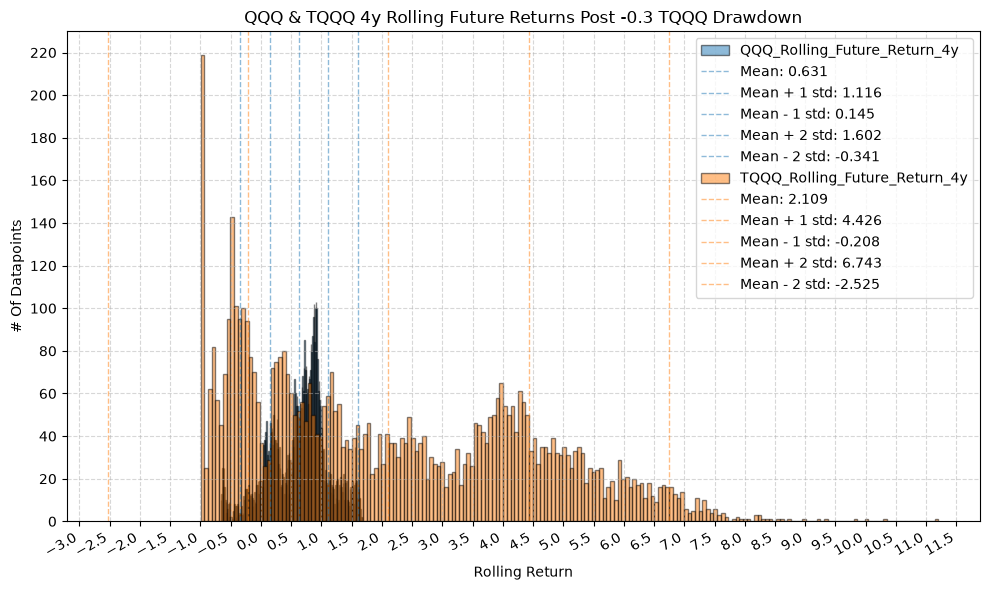
    


    

    


                                      OLS Regression Results                                 
    =========================================================================================
    Dep. Variable:     TQQQ_Rolling_Future_Return_4y   R-squared:                       0.785
    Model:                                       OLS   Adj. R-squared:                  0.785
    Method:                            Least Squares   F-statistic:                 2.013e+04
    Date:                           Mon, 23 Mar 2026   Prob (F-statistic):               0.00
    Time:                                   22:00:18   Log-Likelihood:                -8262.7
    No. Observations:                           5529   AIC:                         1.653e+04
    Df Residuals:                               5527   BIC:                         1.654e+04
    Df Model:                                      1                                         
    Covariance Type:                       nonrobust                                         
    ================================================================================================
                                       coef    std err          t      P>|t|      [0.025      0.975]
    ------------------------------------------------------------------------------------------------
    const                           -0.5505      0.024    -23.246      0.000      -0.597      -0.504
    QQQ_Rolling_Future_Return_4y     4.2437      0.030    141.872      0.000       4.185       4.302
    ==============================================================================
    Omnibus:                       73.818   Durbin-Watson:                   0.010
    Prob(Omnibus):                  0.000   Jarque-Bera (JB):               55.847
    Skew:                           0.155   Prob(JB):                     7.46e-13
    Kurtosis:                       2.617   Cond. No.                         3.02
    ==============================================================================
    
    Notes:
    [1] Standard Errors assume that the covariance matrix of the errors is correctly specified.


    

    


    

    


                                      OLS Regression Results                                 
    =========================================================================================
    Dep. Variable:     TQQQ_Rolling_Future_Return_5y   R-squared:                       0.747
    Model:                                       OLS   Adj. R-squared:                  0.747
    Method:                            Least Squares   F-statistic:                 1.560e+04
    Date:                           Mon, 23 Mar 2026   Prob (F-statistic):               0.00
    Time:                                   22:00:20   Log-Likelihood:                -11446.
    No. Observations:                           5277   AIC:                         2.290e+04
    Df Residuals:                               5275   BIC:                         2.291e+04
    Df Model:                                      1                                         
    Covariance Type:                       nonrobust                                         
    ================================================================================================
                                       coef    std err          t      P>|t|      [0.025      0.975]
    ------------------------------------------------------------------------------------------------
    const                           -1.3180      0.049    -26.870      0.000      -1.414      -1.222
    QQQ_Rolling_Future_Return_5y     5.5645      0.045    124.886      0.000       5.477       5.652
    ==============================================================================
    Omnibus:                      246.937   Durbin-Watson:                   0.009
    Prob(Omnibus):                  0.000   Jarque-Bera (JB):              368.613
    Skew:                           0.425   Prob(JB):                     9.05e-81
    Kurtosis:                       3.977   Cond. No.                         3.05
    ==============================================================================
    
    Notes:
    [1] Standard Errors assume that the covariance matrix of the errors is correctly specified.


    
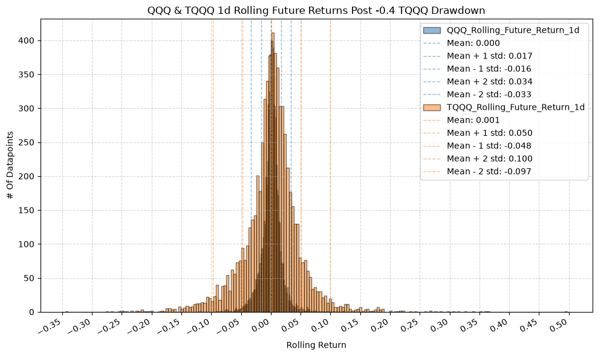
    


    
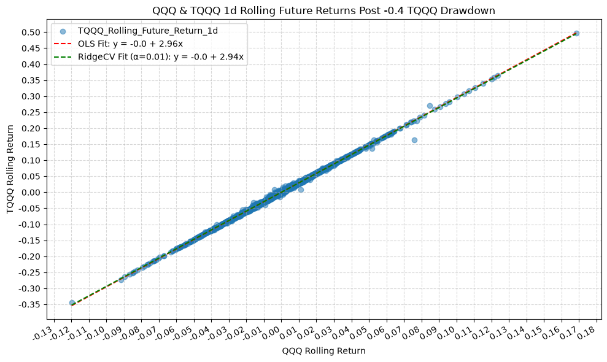
    


                                      OLS Regression Results                                 
    =========================================================================================
    Dep. Variable:     TQQQ_Rolling_Future_Return_1d   R-squared:                       0.999
    Model:                                       OLS   Adj. R-squared:                  0.999
    Method:                            Least Squares   F-statistic:                 6.390e+06
    Date:                           Mon, 23 Mar 2026   Prob (F-statistic):               0.00
    Time:                                   22:00:22   Log-Likelihood:                 32859.
    No. Observations:                           6525   AIC:                        -6.571e+04
    Df Residuals:                               6523   BIC:                        -6.570e+04
    Df Model:                                      1                                         
    Covariance Type:                       nonrobust                                         
    ================================================================================================
                                       coef    std err          t      P>|t|      [0.025      0.975]
    ------------------------------------------------------------------------------------------------
    const                        -5.353e-05   1.95e-05     -2.748      0.006   -9.17e-05   -1.53e-05
    QQQ_Rolling_Future_Return_1d     2.9552      0.001   2527.781      0.000       2.953       2.957
    ==============================================================================
    Omnibus:                     9680.797   Durbin-Watson:                   2.565
    Prob(Omnibus):                  0.000   Jarque-Bera (JB):         38804068.521
    Skew:                          -8.106   Prob(JB):                         0.00
    Kurtosis:                     380.445   Cond. No.                         60.0
    ==============================================================================
    
    Notes:
    [1] Standard Errors assume that the covariance matrix of the errors is correctly specified.


    

    


    

    


                                      OLS Regression Results                                 
    =========================================================================================
    Dep. Variable:     TQQQ_Rolling_Future_Return_1w   R-squared:                       0.994
    Model:                                       OLS   Adj. R-squared:                  0.994
    Method:                            Least Squares   F-statistic:                 1.119e+06
    Date:                           Mon, 23 Mar 2026   Prob (F-statistic):               0.00
    Time:                                   22:00:24   Log-Likelihood:                 22546.
    No. Observations:                           6521   AIC:                        -4.509e+04
    Df Residuals:                               6519   BIC:                        -4.508e+04
    Df Model:                                      1                                         
    Covariance Type:                       nonrobust                                         
    ================================================================================================
                                       coef    std err          t      P>|t|      [0.025      0.975]
    ------------------------------------------------------------------------------------------------
    const                           -0.0008   9.46e-05     -8.597      0.000      -0.001      -0.001
    QQQ_Rolling_Future_Return_1w     2.9536      0.003   1057.873      0.000       2.948       2.959
    ==============================================================================
    Omnibus:                     3596.565   Durbin-Watson:                   0.881
    Prob(Omnibus):                  0.000   Jarque-Bera (JB):           404696.936
    Skew:                          -1.687   Prob(JB):                         0.00
    Kurtosis:                      41.446   Cond. No.                         29.6
    ==============================================================================
    
    Notes:
    [1] Standard Errors assume that the covariance matrix of the errors is correctly specified.


    

    


    

    


                                      OLS Regression Results                                 
    =========================================================================================
    Dep. Variable:     TQQQ_Rolling_Future_Return_1m   R-squared:                       0.983
    Model:                                       OLS   Adj. R-squared:                  0.983
    Method:                            Least Squares   F-statistic:                 3.664e+05
    Date:                           Mon, 23 Mar 2026   Prob (F-statistic):               0.00
    Time:                                   22:00:26   Log-Likelihood:                 14632.
    No. Observations:                           6505   AIC:                        -2.926e+04
    Df Residuals:                               6503   BIC:                        -2.925e+04
    Df Model:                                      1                                         
    Covariance Type:                       nonrobust                                         
    ================================================================================================
                                       coef    std err          t      P>|t|      [0.025      0.975]
    ------------------------------------------------------------------------------------------------
    const                           -0.0035      0.000    -11.058      0.000      -0.004      -0.003
    QQQ_Rolling_Future_Return_1m     2.9151      0.005    605.320      0.000       2.906       2.925
    ==============================================================================
    Omnibus:                     1512.367   Durbin-Watson:                   0.297
    Prob(Omnibus):                  0.000   Jarque-Bera (JB):            83017.003
    Skew:                           0.063   Prob(JB):                         0.00
    Kurtosis:                      20.501   Cond. No.                         15.2
    ==============================================================================
    
    Notes:
    [1] Standard Errors assume that the covariance matrix of the errors is correctly specified.


    

    


    

    


                                      OLS Regression Results                                 
    =========================================================================================
    Dep. Variable:     TQQQ_Rolling_Future_Return_3m   R-squared:                       0.961
    Model:                                       OLS   Adj. R-squared:                  0.961
    Method:                            Least Squares   F-statistic:                 1.592e+05
    Date:                           Mon, 23 Mar 2026   Prob (F-statistic):               0.00
    Time:                                   22:00:28   Log-Likelihood:                 8479.8
    No. Observations:                           6463   AIC:                        -1.696e+04
    Df Residuals:                               6461   BIC:                        -1.694e+04
    Df Model:                                      1                                         
    Covariance Type:                       nonrobust                                         
    ================================================================================================
                                       coef    std err          t      P>|t|      [0.025      0.975]
    ------------------------------------------------------------------------------------------------
    const                           -0.0066      0.001     -7.911      0.000      -0.008      -0.005
    QQQ_Rolling_Future_Return_3m     2.8926      0.007    399.038      0.000       2.878       2.907
    ==============================================================================
    Omnibus:                     1379.365   Durbin-Watson:                   0.101
    Prob(Omnibus):                  0.000   Jarque-Bera (JB):            15633.345
    Skew:                           0.693   Prob(JB):                         0.00
    Kurtosis:                      10.492   Cond. No.                         8.95
    ==============================================================================
    
    Notes:
    [1] Standard Errors assume that the covariance matrix of the errors is correctly specified.


    

    


    

    


                                      OLS Regression Results                                 
    =========================================================================================
    Dep. Variable:     TQQQ_Rolling_Future_Return_6m   R-squared:                       0.931
    Model:                                       OLS   Adj. R-squared:                  0.931
    Method:                            Least Squares   F-statistic:                 8.660e+04
    Date:                           Mon, 23 Mar 2026   Prob (F-statistic):               0.00
    Time:                                   22:00:29   Log-Likelihood:                 4309.6
    No. Observations:                           6400   AIC:                            -8615.
    Df Residuals:                               6398   BIC:                            -8602.
    Df Model:                                      1                                         
    Covariance Type:                       nonrobust                                         
    ================================================================================================
                                       coef    std err          t      P>|t|      [0.025      0.975]
    ------------------------------------------------------------------------------------------------
    const                        -7.935e-05      0.002     -0.049      0.961      -0.003       0.003
    QQQ_Rolling_Future_Return_6m     2.8038      0.010    294.287      0.000       2.785       2.822
    ==============================================================================
    Omnibus:                     1641.226   Durbin-Watson:                   0.057
    Prob(Omnibus):                  0.000   Jarque-Bera (JB):             8159.048
    Skew:                           1.148   Prob(JB):                         0.00
    Kurtosis:                       8.033   Cond. No.                         6.19
    ==============================================================================
    
    Notes:
    [1] Standard Errors assume that the covariance matrix of the errors is correctly specified.


    

    


    
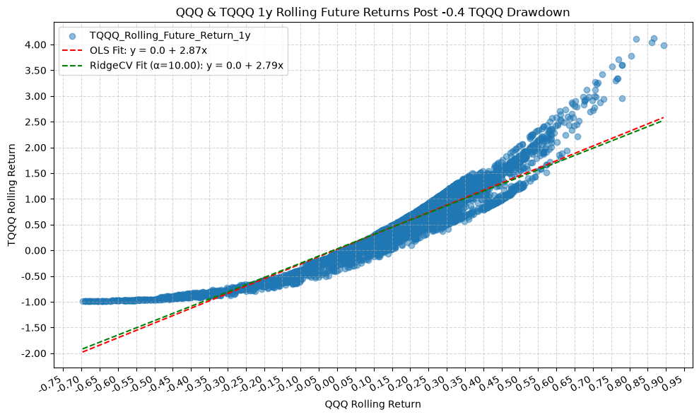
    


                                      OLS Regression Results                                 
    =========================================================================================
    Dep. Variable:     TQQQ_Rolling_Future_Return_1y   R-squared:                       0.902
    Model:                                       OLS   Adj. R-squared:                  0.902
    Method:                            Least Squares   F-statistic:                 5.795e+04
    Date:                           Mon, 23 Mar 2026   Prob (F-statistic):               0.00
    Time:                                   22:00:31   Log-Likelihood:                 326.52
    No. Observations:                           6274   AIC:                            -649.0
    Df Residuals:                               6272   BIC:                            -635.5
    Df Model:                                      1                                         
    Covariance Type:                       nonrobust                                         
    ================================================================================================
                                       coef    std err          t      P>|t|      [0.025      0.975]
    ------------------------------------------------------------------------------------------------
    const                            0.0209      0.003      6.496      0.000       0.015       0.027
    QQQ_Rolling_Future_Return_1y     2.8615      0.012    240.734      0.000       2.838       2.885
    ==============================================================================
    Omnibus:                     1986.979   Durbin-Watson:                   0.039
    Prob(Omnibus):                  0.000   Jarque-Bera (JB):             8588.911
    Skew:                           1.495   Prob(JB):                         0.00
    Kurtosis:                       7.890   Cond. No.                         4.16
    ==============================================================================
    
    Notes:
    [1] Standard Errors assume that the covariance matrix of the errors is correctly specified.


    

    


    

    


                                      OLS Regression Results                                 
    =========================================================================================
    Dep. Variable:     TQQQ_Rolling_Future_Return_2y   R-squared:                       0.847
    Model:                                       OLS   Adj. R-squared:                  0.847
    Method:                            Least Squares   F-statistic:                 3.332e+04
    Date:                           Mon, 23 Mar 2026   Prob (F-statistic):               0.00
    Time:                                   22:00:33   Log-Likelihood:                -4126.3
    No. Observations:                           6022   AIC:                             8257.
    Df Residuals:                               6020   BIC:                             8270.
    Df Model:                                      1                                         
    Covariance Type:                       nonrobust                                         
    ================================================================================================
                                       coef    std err          t      P>|t|      [0.025      0.975]
    ------------------------------------------------------------------------------------------------
    const                           -0.0349      0.008     -4.437      0.000      -0.050      -0.019
    QQQ_Rolling_Future_Return_2y     3.2436      0.018    182.525      0.000       3.209       3.278
    ==============================================================================
    Omnibus:                     1713.005   Durbin-Watson:                   0.018
    Prob(Omnibus):                  0.000   Jarque-Bera (JB):             5037.679
    Skew:                           1.479   Prob(JB):                         0.00
    Kurtosis:                       6.365   Cond. No.                         3.11
    ==============================================================================
    
    Notes:
    [1] Standard Errors assume that the covariance matrix of the errors is correctly specified.


    

    


    

    


                                      OLS Regression Results                                 
    =========================================================================================
    Dep. Variable:     TQQQ_Rolling_Future_Return_3y   R-squared:                       0.818
    Model:                                       OLS   Adj. R-squared:                  0.818
    Method:                            Least Squares   F-statistic:                 2.586e+04
    Date:                           Mon, 23 Mar 2026   Prob (F-statistic):               0.00
    Time:                                   22:00:34   Log-Likelihood:                -6062.3
    No. Observations:                           5770   AIC:                         1.213e+04
    Df Residuals:                               5768   BIC:                         1.214e+04
    Df Model:                                      1                                         
    Covariance Type:                       nonrobust                                         
    ================================================================================================
                                       coef    std err          t      P>|t|      [0.025      0.975]
    ------------------------------------------------------------------------------------------------
    const                           -0.2617      0.014    -19.250      0.000      -0.288      -0.235
    QQQ_Rolling_Future_Return_3y     3.6758      0.023    160.808      0.000       3.631       3.721
    ==============================================================================
    Omnibus:                      872.524   Durbin-Watson:                   0.015
    Prob(Omnibus):                  0.000   Jarque-Bera (JB):             1594.376
    Skew:                           0.963   Prob(JB):                         0.00
    Kurtosis:                       4.709   Cond. No.                         3.07
    ==============================================================================
    
    Notes:
    [1] Standard Errors assume that the covariance matrix of the errors is correctly specified.


    
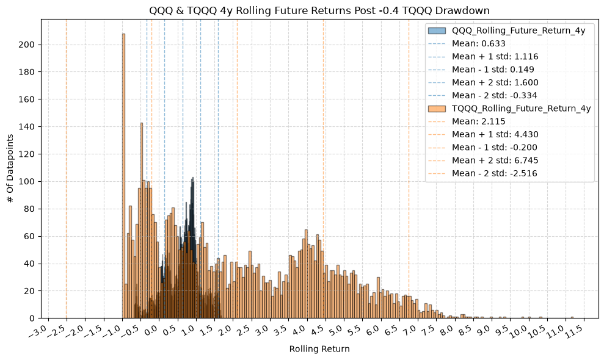
    


    
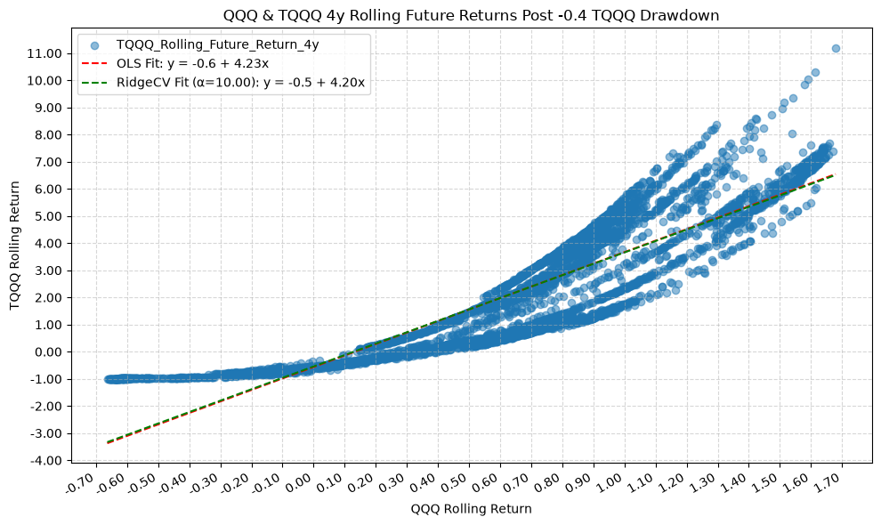
    


                                      OLS Regression Results                                 
    =========================================================================================
    Dep. Variable:     TQQQ_Rolling_Future_Return_4y   R-squared:                       0.785
    Model:                                       OLS   Adj. R-squared:                  0.785
    Method:                            Least Squares   F-statistic:                 2.015e+04
    Date:                           Mon, 23 Mar 2026   Prob (F-statistic):               0.00
    Time:                                   22:00:37   Log-Likelihood:                -8235.5
    No. Observations:                           5518   AIC:                         1.647e+04
    Df Residuals:                               5516   BIC:                         1.649e+04
    Df Model:                                      1                                         
    Covariance Type:                       nonrobust                                         
    ================================================================================================
                                       coef    std err          t      P>|t|      [0.025      0.975]
    ------------------------------------------------------------------------------------------------
    const                           -0.5654      0.024    -23.773      0.000      -0.612      -0.519
    QQQ_Rolling_Future_Return_4y     4.2617      0.030    141.942      0.000       4.203       4.321
    ==============================================================================
    Omnibus:                       68.572   Durbin-Watson:                   0.010
    Prob(Omnibus):                  0.000   Jarque-Bera (JB):               52.789
    Skew:                           0.153   Prob(JB):                     3.44e-12
    Kurtosis:                       2.631   Cond. No.                         3.04
    ==============================================================================
    
    Notes:
    [1] Standard Errors assume that the covariance matrix of the errors is correctly specified.


    

    


    
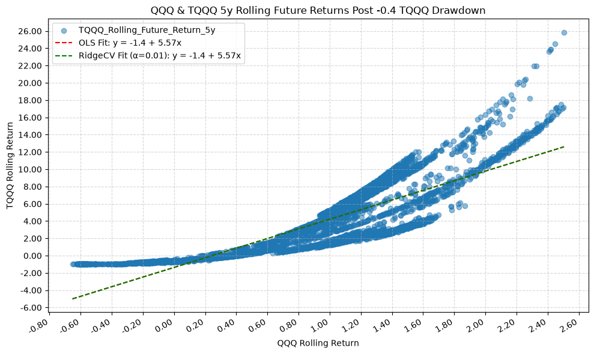
    


                                      OLS Regression Results                                 
    =========================================================================================
    Dep. Variable:     TQQQ_Rolling_Future_Return_5y   R-squared:                       0.748
    Model:                                       OLS   Adj. R-squared:                  0.748
    Method:                            Least Squares   F-statistic:                 1.561e+04
    Date:                           Mon, 23 Mar 2026   Prob (F-statistic):               0.00
    Time:                                   22:00:38   Log-Likelihood:                -11415.
    No. Observations:                           5266   AIC:                         2.283e+04
    Df Residuals:                               5264   BIC:                         2.285e+04
    Df Model:                                      1                                         
    Covariance Type:                       nonrobust                                         
    ================================================================================================
                                       coef    std err          t      P>|t|      [0.025      0.975]
    ------------------------------------------------------------------------------------------------
    const                           -1.3430      0.049    -27.264      0.000      -1.440      -1.246
    QQQ_Rolling_Future_Return_5y     5.5855      0.045    124.935      0.000       5.498       5.673
    ==============================================================================
    Omnibus:                      242.424   Durbin-Watson:                   0.009
    Prob(Omnibus):                  0.000   Jarque-Bera (JB):              363.603
    Skew:                           0.418   Prob(JB):                     1.11e-79
    Kurtosis:                       3.979   Cond. No.                         3.07
    ==============================================================================
    
    Notes:
    [1] Standard Errors assume that the covariance matrix of the errors is correctly specified.


    

    


    

    


                                      OLS Regression Results                                 
    =========================================================================================
    Dep. Variable:     TQQQ_Rolling_Future_Return_1d   R-squared:                       0.999
    Model:                                       OLS   Adj. R-squared:                  0.999
    Method:                            Least Squares   F-statistic:                 6.259e+06
    Date:                           Mon, 23 Mar 2026   Prob (F-statistic):               0.00
    Time:                                   22:00:40   Log-Likelihood:                 32521.
    No. Observations:                           6462   AIC:                        -6.504e+04
    Df Residuals:                               6460   BIC:                        -6.502e+04
    Df Model:                                      1                                         
    Covariance Type:                       nonrobust                                         
    ================================================================================================
                                       coef    std err          t      P>|t|      [0.025      0.975]
    ------------------------------------------------------------------------------------------------
    const                        -4.963e-05   1.96e-05     -2.527      0.012   -8.81e-05   -1.11e-05
    QQQ_Rolling_Future_Return_1d     2.9550      0.001   2501.868      0.000       2.953       2.957
    ==============================================================================
    Omnibus:                     9587.532   Durbin-Watson:                   2.567
    Prob(Omnibus):                  0.000   Jarque-Bera (JB):         38153267.854
    Skew:                          -8.108   Prob(JB):                         0.00
    Kurtosis:                     379.084   Cond. No.                         60.2
    ==============================================================================
    
    Notes:
    [1] Standard Errors assume that the covariance matrix of the errors is correctly specified.


    

    


    
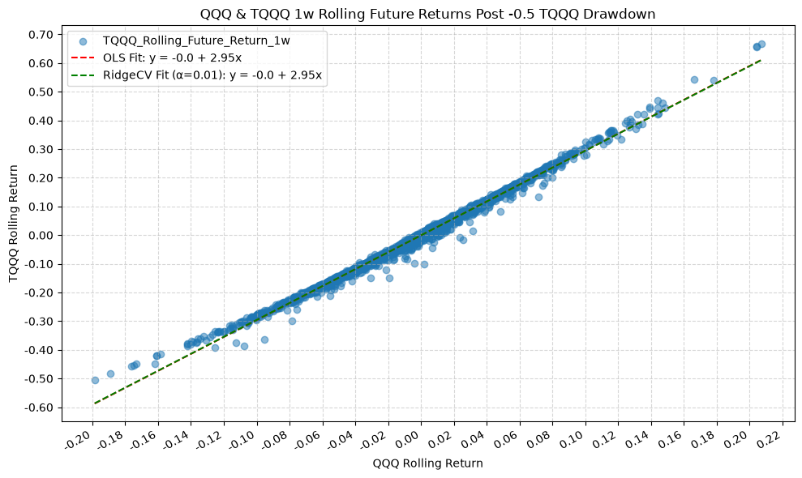
    


                                      OLS Regression Results                                 
    =========================================================================================
    Dep. Variable:     TQQQ_Rolling_Future_Return_1w   R-squared:                       0.994
    Model:                                       OLS   Adj. R-squared:                  0.994
    Method:                            Least Squares   F-statistic:                 1.110e+06
    Date:                           Mon, 23 Mar 2026   Prob (F-statistic):               0.00
    Time:                                   22:00:42   Log-Likelihood:                 22331.
    No. Observations:                           6458   AIC:                        -4.466e+04
    Df Residuals:                               6456   BIC:                        -4.464e+04
    Df Model:                                      1                                         
    Covariance Type:                       nonrobust                                         
    ================================================================================================
                                       coef    std err          t      P>|t|      [0.025      0.975]
    ------------------------------------------------------------------------------------------------
    const                           -0.0008    9.5e-05     -8.200      0.000      -0.001      -0.001
    QQQ_Rolling_Future_Return_1w     2.9530      0.003   1053.776      0.000       2.947       2.958
    ==============================================================================
    Omnibus:                     3543.021   Durbin-Watson:                   0.887
    Prob(Omnibus):                  0.000   Jarque-Bera (JB):           403213.894
    Skew:                          -1.668   Prob(JB):                         0.00
    Kurtosis:                      41.566   Cond. No.                         29.5
    ==============================================================================
    
    Notes:
    [1] Standard Errors assume that the covariance matrix of the errors is correctly specified.


    

    


    

    


                                      OLS Regression Results                                 
    =========================================================================================
    Dep. Variable:     TQQQ_Rolling_Future_Return_1m   R-squared:                       0.983
    Model:                                       OLS   Adj. R-squared:                  0.983
    Method:                            Least Squares   F-statistic:                 3.617e+05
    Date:                           Mon, 23 Mar 2026   Prob (F-statistic):               0.00
    Time:                                   22:00:44   Log-Likelihood:                 14468.
    No. Observations:                           6442   AIC:                        -2.893e+04
    Df Residuals:                               6440   BIC:                        -2.892e+04
    Df Model:                                      1                                         
    Covariance Type:                       nonrobust                                         
    ================================================================================================
                                       coef    std err          t      P>|t|      [0.025      0.975]
    ------------------------------------------------------------------------------------------------
    const                           -0.0034      0.000    -10.631      0.000      -0.004      -0.003
    QQQ_Rolling_Future_Return_1m     2.9145      0.005    601.447      0.000       2.905       2.924
    ==============================================================================
    Omnibus:                     1492.448   Durbin-Watson:                   0.295
    Prob(Omnibus):                  0.000   Jarque-Bera (JB):            81230.387
    Skew:                           0.050   Prob(JB):                         0.00
    Kurtosis:                      20.396   Cond. No.                         15.2
    ==============================================================================
    
    Notes:
    [1] Standard Errors assume that the covariance matrix of the errors is correctly specified.


    

    


    
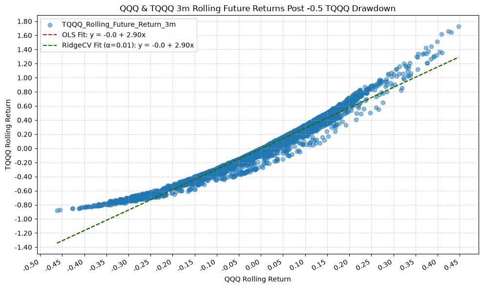
    


                                      OLS Regression Results                                 
    =========================================================================================
    Dep. Variable:     TQQQ_Rolling_Future_Return_3m   R-squared:                       0.961
    Model:                                       OLS   Adj. R-squared:                  0.961
    Method:                            Least Squares   F-statistic:                 1.589e+05
    Date:                           Mon, 23 Mar 2026   Prob (F-statistic):               0.00
    Time:                                   22:00:46   Log-Likelihood:                 8433.0
    No. Observations:                           6427   AIC:                        -1.686e+04
    Df Residuals:                               6425   BIC:                        -1.685e+04
    Df Model:                                      1                                         
    Covariance Type:                       nonrobust                                         
    ================================================================================================
                                       coef    std err          t      P>|t|      [0.025      0.975]
    ------------------------------------------------------------------------------------------------
    const                           -0.0063      0.001     -7.555      0.000      -0.008      -0.005
    QQQ_Rolling_Future_Return_3m     2.8921      0.007    398.661      0.000       2.878       2.906
    ==============================================================================
    Omnibus:                     1377.477   Durbin-Watson:                   0.101
    Prob(Omnibus):                  0.000   Jarque-Bera (JB):            15521.588
    Skew:                           0.699   Prob(JB):                         0.00
    Kurtosis:                      10.484   Cond. No.                         8.93
    ==============================================================================
    
    Notes:
    [1] Standard Errors assume that the covariance matrix of the errors is correctly specified.


    
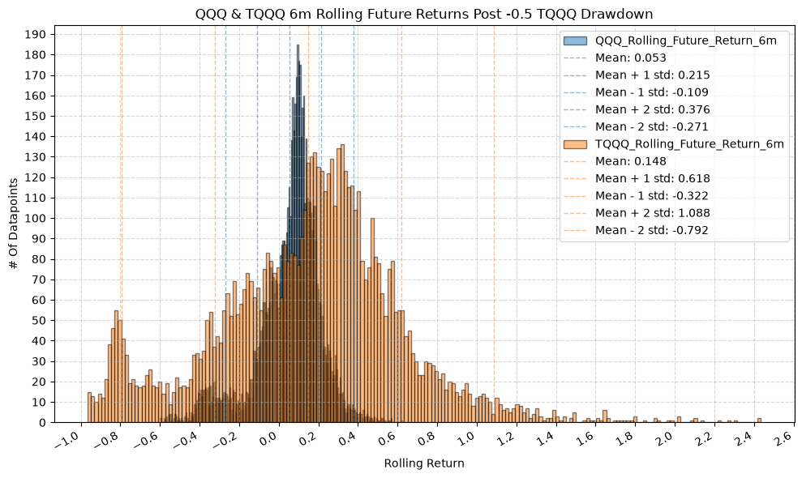
    


    
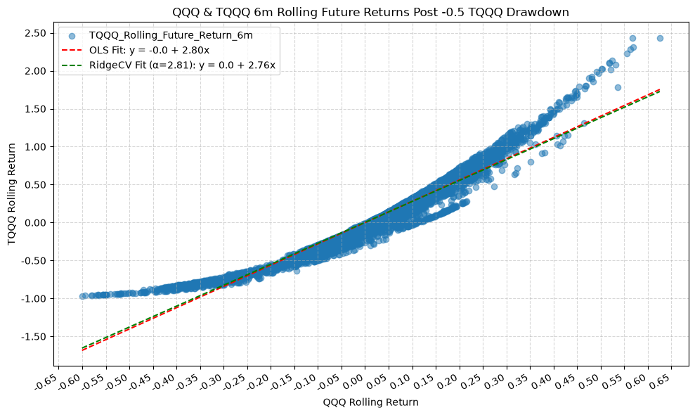
    


                                      OLS Regression Results                                 
    =========================================================================================
    Dep. Variable:     TQQQ_Rolling_Future_Return_6m   R-squared:                       0.931
    Model:                                       OLS   Adj. R-squared:                  0.931
    Method:                            Least Squares   F-statistic:                 8.678e+04
    Date:                           Mon, 23 Mar 2026   Prob (F-statistic):               0.00
    Time:                                   22:00:48   Log-Likelihood:                 4316.3
    No. Observations:                           6397   AIC:                            -8629.
    Df Residuals:                               6395   BIC:                            -8615.
    Df Model:                                      1                                         
    Covariance Type:                       nonrobust                                         
    ================================================================================================
                                       coef    std err          t      P>|t|      [0.025      0.975]
    ------------------------------------------------------------------------------------------------
    const                         3.496e-05      0.002      0.022      0.983      -0.003       0.003
    QQQ_Rolling_Future_Return_6m     2.8039      0.010    294.583      0.000       2.785       2.823
    ==============================================================================
    Omnibus:                     1657.019   Durbin-Watson:                   0.055
    Prob(Omnibus):                  0.000   Jarque-Bera (JB):             8164.864
    Skew:                           1.163   Prob(JB):                         0.00
    Kurtosis:                       8.022   Cond. No.                         6.19
    ==============================================================================
    
    Notes:
    [1] Standard Errors assume that the covariance matrix of the errors is correctly specified.


    

    


    

    


                                      OLS Regression Results                                 
    =========================================================================================
    Dep. Variable:     TQQQ_Rolling_Future_Return_1y   R-squared:                       0.902
    Model:                                       OLS   Adj. R-squared:                  0.902
    Method:                            Least Squares   F-statistic:                 5.802e+04
    Date:                           Mon, 23 Mar 2026   Prob (F-statistic):               0.00
    Time:                                   22:00:49   Log-Likelihood:                 334.10
    No. Observations:                           6271   AIC:                            -664.2
    Df Residuals:                               6269   BIC:                            -650.7
    Df Model:                                      1                                         
    Covariance Type:                       nonrobust                                         
    ================================================================================================
                                       coef    std err          t      P>|t|      [0.025      0.975]
    ------------------------------------------------------------------------------------------------
    const                            0.0204      0.003      6.337      0.000       0.014       0.027
    QQQ_Rolling_Future_Return_1y     2.8641      0.012    240.870      0.000       2.841       2.887
    ==============================================================================
    Omnibus:                     1985.718   Durbin-Watson:                   0.038
    Prob(Omnibus):                  0.000   Jarque-Bera (JB):             8605.916
    Skew:                           1.494   Prob(JB):                         0.00
    Kurtosis:                       7.900   Cond. No.                         4.16
    ==============================================================================
    
    Notes:
    [1] Standard Errors assume that the covariance matrix of the errors is correctly specified.


    
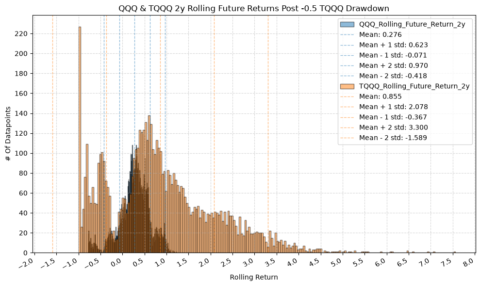
    


    

    


                                      OLS Regression Results                                 
    =========================================================================================
    Dep. Variable:     TQQQ_Rolling_Future_Return_2y   R-squared:                       0.847
    Model:                                       OLS   Adj. R-squared:                  0.847
    Method:                            Least Squares   F-statistic:                 3.334e+04
    Date:                           Mon, 23 Mar 2026   Prob (F-statistic):               0.00
    Time:                                   22:00:51   Log-Likelihood:                -4119.1
    No. Observations:                           6019   AIC:                             8242.
    Df Residuals:                               6017   BIC:                             8256.
    Df Model:                                      1                                         
    Covariance Type:                       nonrobust                                         
    ================================================================================================
                                       coef    std err          t      P>|t|      [0.025      0.975]
    ------------------------------------------------------------------------------------------------
    const                           -0.0364      0.008     -4.622      0.000      -0.052      -0.021
    QQQ_Rolling_Future_Return_2y     3.2472      0.018    182.598      0.000       3.212       3.282
    ==============================================================================
    Omnibus:                     1718.217   Durbin-Watson:                   0.018
    Prob(Omnibus):                  0.000   Jarque-Bera (JB):             5077.476
    Skew:                           1.483   Prob(JB):                         0.00
    Kurtosis:                       6.384   Cond. No.                         3.12
    ==============================================================================
    
    Notes:
    [1] Standard Errors assume that the covariance matrix of the errors is correctly specified.


    
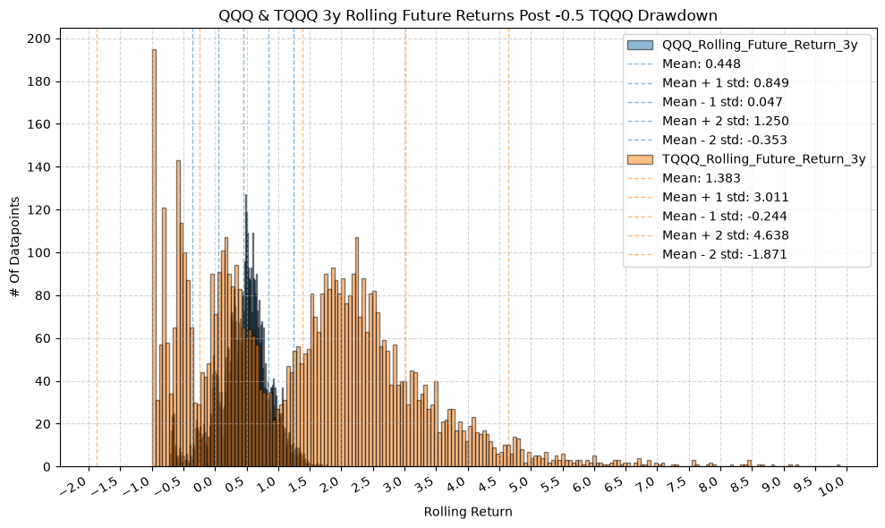
    


    

    


                                      OLS Regression Results                                 
    =========================================================================================
    Dep. Variable:     TQQQ_Rolling_Future_Return_3y   R-squared:                       0.818
    Model:                                       OLS   Adj. R-squared:                  0.818
    Method:                            Least Squares   F-statistic:                 2.593e+04
    Date:                           Mon, 23 Mar 2026   Prob (F-statistic):               0.00
    Time:                                   22:00:53   Log-Likelihood:                -6049.6
    No. Observations:                           5767   AIC:                         1.210e+04
    Df Residuals:                               5765   BIC:                         1.212e+04
    Df Model:                                      1                                         
    Covariance Type:                       nonrobust                                         
    ================================================================================================
                                       coef    std err          t      P>|t|      [0.025      0.975]
    ------------------------------------------------------------------------------------------------
    const                           -0.2658      0.014    -19.545      0.000      -0.292      -0.239
    QQQ_Rolling_Future_Return_3y     3.6829      0.023    161.036      0.000       3.638       3.728
    ==============================================================================
    Omnibus:                      869.247   Durbin-Watson:                   0.015
    Prob(Omnibus):                  0.000   Jarque-Bera (JB):             1588.727
    Skew:                           0.960   Prob(JB):                         0.00
    Kurtosis:                       4.709   Cond. No.                         3.08
    ==============================================================================
    
    Notes:
    [1] Standard Errors assume that the covariance matrix of the errors is correctly specified.


    

    


    

    


                                      OLS Regression Results                                 
    =========================================================================================
    Dep. Variable:     TQQQ_Rolling_Future_Return_4y   R-squared:                       0.785
    Model:                                       OLS   Adj. R-squared:                  0.785
    Method:                            Least Squares   F-statistic:                 2.017e+04
    Date:                           Mon, 23 Mar 2026   Prob (F-statistic):               0.00
    Time:                                   22:00:55   Log-Likelihood:                -8226.6
    No. Observations:                           5515   AIC:                         1.646e+04
    Df Residuals:                               5513   BIC:                         1.647e+04
    Df Model:                                      1                                         
    Covariance Type:                       nonrobust                                         
    ================================================================================================
                                       coef    std err          t      P>|t|      [0.025      0.975]
    ------------------------------------------------------------------------------------------------
    const                           -0.5704      0.024    -23.957      0.000      -0.617      -0.524
    QQQ_Rolling_Future_Return_4y     4.2678      0.030    142.009      0.000       4.209       4.327
    ==============================================================================
    Omnibus:                       66.838   Durbin-Watson:                   0.010
    Prob(Omnibus):                  0.000   Jarque-Bera (JB):               51.664
    Skew:                           0.151   Prob(JB):                     6.04e-12
    Kurtosis:                       2.635   Cond. No.                         3.05
    ==============================================================================
    
    Notes:
    [1] Standard Errors assume that the covariance matrix of the errors is correctly specified.


    

    


    

    


                                      OLS Regression Results                                 
    =========================================================================================
    Dep. Variable:     TQQQ_Rolling_Future_Return_5y   R-squared:                       0.748
    Model:                                       OLS   Adj. R-squared:                  0.748
    Method:                            Least Squares   F-statistic:                 1.562e+04
    Date:                           Mon, 23 Mar 2026   Prob (F-statistic):               0.00
    Time:                                   22:00:57   Log-Likelihood:                -11405.
    No. Observations:                           5263   AIC:                         2.281e+04
    Df Residuals:                               5261   BIC:                         2.283e+04
    Df Model:                                      1                                         
    Covariance Type:                       nonrobust                                         
    ================================================================================================
                                       coef    std err          t      P>|t|      [0.025      0.975]
    ------------------------------------------------------------------------------------------------
    const                           -1.3518      0.049    -27.413      0.000      -1.448      -1.255
    QQQ_Rolling_Future_Return_5y     5.5930      0.045    124.992      0.000       5.505       5.681
    ==============================================================================
    Omnibus:                      240.577   Durbin-Watson:                   0.009
    Prob(Omnibus):                  0.000   Jarque-Bera (JB):              361.692
    Skew:                           0.415   Prob(JB):                     2.88e-79
    Kurtosis:                       3.980   Cond. No.                         3.08
    ==============================================================================
    
    Notes:
    [1] Standard Errors assume that the covariance matrix of the errors is correctly specified.


    

    


    

    


                                      OLS Regression Results                                 
    =========================================================================================
    Dep. Variable:     TQQQ_Rolling_Future_Return_1d   R-squared:                       0.999
    Model:                                       OLS   Adj. R-squared:                  0.999
    Method:                            Least Squares   F-statistic:                 6.000e+06
    Date:                           Mon, 23 Mar 2026   Prob (F-statistic):               0.00
    Time:                                   22:00:59   Log-Likelihood:                 31538.
    No. Observations:                           6281   AIC:                        -6.307e+04
    Df Residuals:                               6279   BIC:                        -6.306e+04
    Df Model:                                      1                                         
    Covariance Type:                       nonrobust                                         
    ================================================================================================
                                       coef    std err          t      P>|t|      [0.025      0.975]
    ------------------------------------------------------------------------------------------------
    const                        -4.239e-05   2.02e-05     -2.103      0.035   -8.19e-05   -2.88e-06
    QQQ_Rolling_Future_Return_1d     2.9548      0.001   2449.504      0.000       2.952       2.957
    ==============================================================================
    Omnibus:                     9289.579   Durbin-Watson:                   2.569
    Prob(Omnibus):                  0.000   Jarque-Bera (JB):         35733225.202
    Skew:                          -8.060   Prob(JB):                         0.00
    Kurtosis:                     372.159   Cond. No.                         59.9
    ==============================================================================
    
    Notes:
    [1] Standard Errors assume that the covariance matrix of the errors is correctly specified.


    
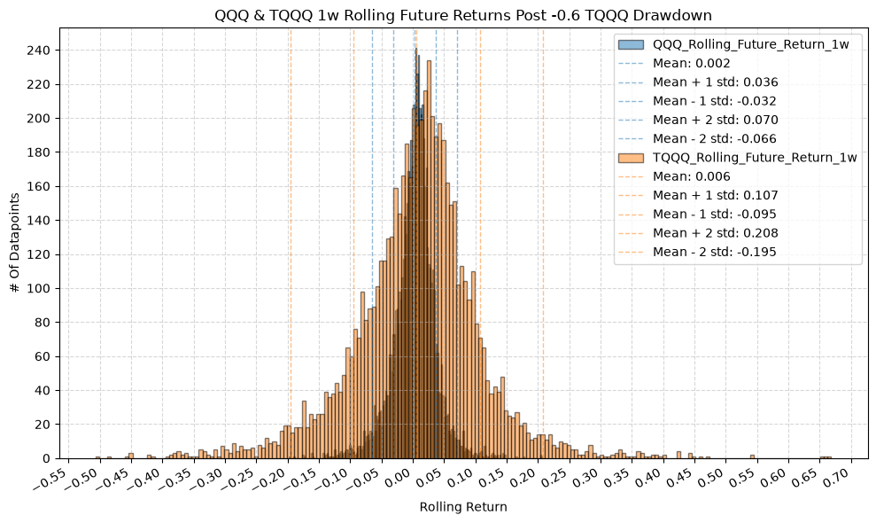
    


    
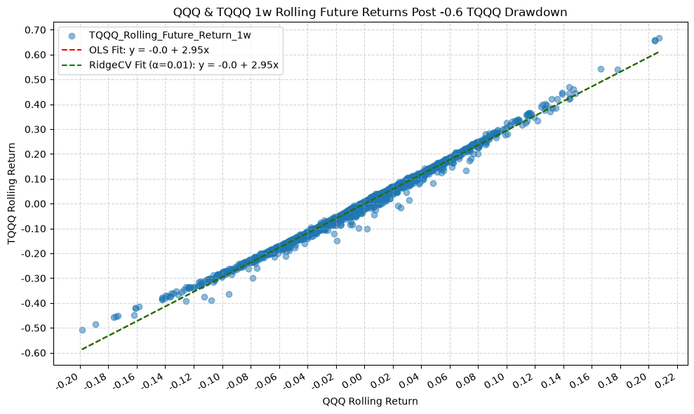
    


                                      OLS Regression Results                                 
    =========================================================================================
    Dep. Variable:     TQQQ_Rolling_Future_Return_1w   R-squared:                       0.994
    Model:                                       OLS   Adj. R-squared:                  0.994
    Method:                            Least Squares   F-statistic:                 1.076e+06
    Date:                           Mon, 23 Mar 2026   Prob (F-statistic):               0.00
    Time:                                   22:01:00   Log-Likelihood:                 21679.
    No. Observations:                           6281   AIC:                        -4.335e+04
    Df Residuals:                               6279   BIC:                        -4.334e+04
    Df Model:                                      1                                         
    Covariance Type:                       nonrobust                                         
    ================================================================================================
                                       coef    std err          t      P>|t|      [0.025      0.975]
    ------------------------------------------------------------------------------------------------
    const                           -0.0007    9.7e-05     -7.559      0.000      -0.001      -0.001
    QQQ_Rolling_Future_Return_1w     2.9525      0.003   1037.518      0.000       2.947       2.958
    ==============================================================================
    Omnibus:                     3409.174   Durbin-Watson:                   0.895
    Prob(Omnibus):                  0.000   Jarque-Bera (JB):           384856.284
    Skew:                          -1.639   Prob(JB):                         0.00
    Kurtosis:                      41.207   Cond. No.                         29.4
    ==============================================================================
    
    Notes:
    [1] Standard Errors assume that the covariance matrix of the errors is correctly specified.


    

    


    
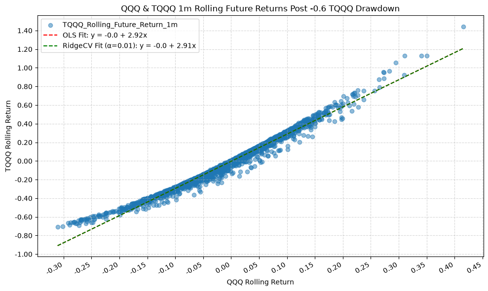
    


                                      OLS Regression Results                                 
    =========================================================================================
    Dep. Variable:     TQQQ_Rolling_Future_Return_1m   R-squared:                       0.982
    Model:                                       OLS   Adj. R-squared:                  0.982
    Method:                            Least Squares   F-statistic:                 3.507e+05
    Date:                           Mon, 23 Mar 2026   Prob (F-statistic):               0.00
    Time:                                   22:01:02   Log-Likelihood:                 14071.
    No. Observations:                           6281   AIC:                        -2.814e+04
    Df Residuals:                               6279   BIC:                        -2.812e+04
    Df Model:                                      1                                         
    Covariance Type:                       nonrobust                                         
    ================================================================================================
                                       coef    std err          t      P>|t|      [0.025      0.975]
    ------------------------------------------------------------------------------------------------
    const                           -0.0032      0.000     -9.799      0.000      -0.004      -0.003
    QQQ_Rolling_Future_Return_1m     2.9141      0.005    592.215      0.000       2.904       2.924
    ==============================================================================
    Omnibus:                     1452.768   Durbin-Watson:                   0.296
    Prob(Omnibus):                  0.000   Jarque-Bera (JB):            78418.997
    Skew:                           0.053   Prob(JB):                         0.00
    Kurtosis:                      20.310   Cond. No.                         15.1
    ==============================================================================
    
    Notes:
    [1] Standard Errors assume that the covariance matrix of the errors is correctly specified.


    
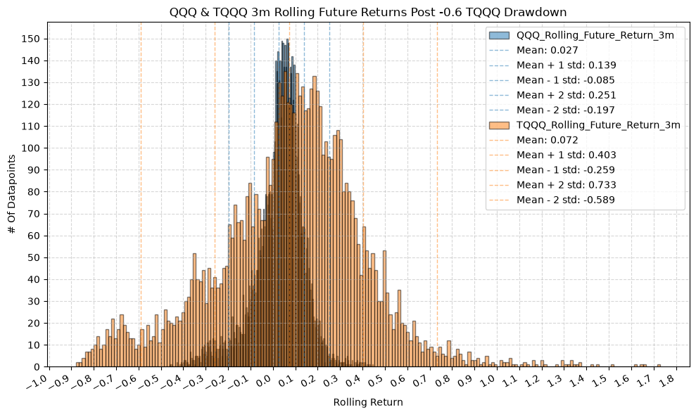
    


    
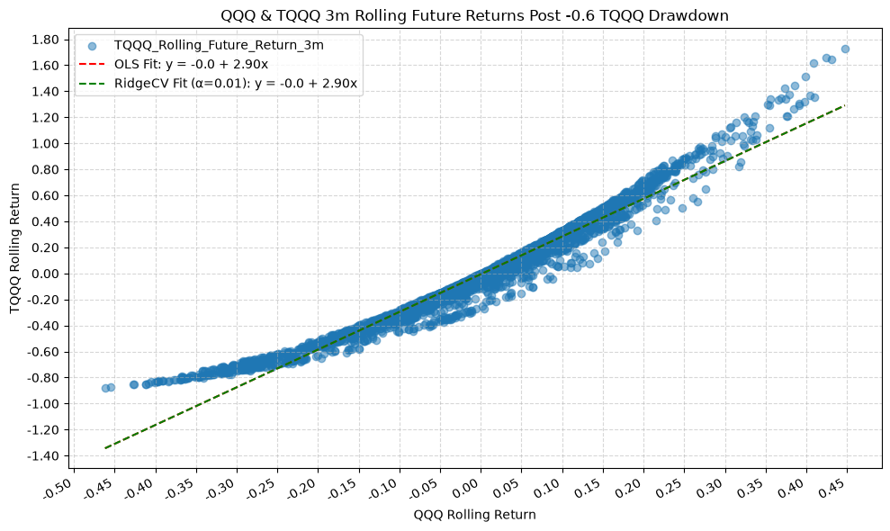
    


                                      OLS Regression Results                                 
    =========================================================================================
    Dep. Variable:     TQQQ_Rolling_Future_Return_3m   R-squared:                       0.961
    Model:                                       OLS   Adj. R-squared:                  0.961
    Method:                            Least Squares   F-statistic:                 1.567e+05
    Date:                           Mon, 23 Mar 2026   Prob (F-statistic):               0.00
    Time:                                   22:01:03   Log-Likelihood:                 8265.9
    No. Observations:                           6281   AIC:                        -1.653e+04
    Df Residuals:                               6279   BIC:                        -1.651e+04
    Df Model:                                      1                                         
    Covariance Type:                       nonrobust                                         
    ================================================================================================
                                       coef    std err          t      P>|t|      [0.025      0.975]
    ------------------------------------------------------------------------------------------------
    const                           -0.0059      0.001     -7.039      0.000      -0.008      -0.004
    QQQ_Rolling_Future_Return_3m     2.8978      0.007    395.792      0.000       2.883       2.912
    ==============================================================================
    Omnibus:                     1352.373   Durbin-Watson:                   0.102
    Prob(Omnibus):                  0.000   Jarque-Bera (JB):            15607.922
    Skew:                           0.696   Prob(JB):                         0.00
    Kurtosis:                      10.596   Cond. No.                         8.95
    ==============================================================================
    
    Notes:
    [1] Standard Errors assume that the covariance matrix of the errors is correctly specified.


    

    


    

    


                                      OLS Regression Results                                 
    =========================================================================================
    Dep. Variable:     TQQQ_Rolling_Future_Return_6m   R-squared:                       0.932
    Model:                                       OLS   Adj. R-squared:                  0.932
    Method:                            Least Squares   F-statistic:                 8.618e+04
    Date:                           Mon, 23 Mar 2026   Prob (F-statistic):               0.00
    Time:                                   22:01:05   Log-Likelihood:                 4282.8
    No. Observations:                           6281   AIC:                            -8562.
    Df Residuals:                               6279   BIC:                            -8548.
    Df Model:                                      1                                         
    Covariance Type:                       nonrobust                                         
    ================================================================================================
                                       coef    std err          t      P>|t|      [0.025      0.975]
    ------------------------------------------------------------------------------------------------
    const                           -0.0002      0.002     -0.115      0.909      -0.003       0.003
    QQQ_Rolling_Future_Return_6m     2.8190      0.010    293.571      0.000       2.800       2.838
    ==============================================================================
    Omnibus:                     1637.301   Durbin-Watson:                   0.057
    Prob(Omnibus):                  0.000   Jarque-Bera (JB):             8392.287
    Skew:                           1.158   Prob(JB):                         0.00
    Kurtosis:                       8.167   Cond. No.                         6.24
    ==============================================================================
    
    Notes:
    [1] Standard Errors assume that the covariance matrix of the errors is correctly specified.


    
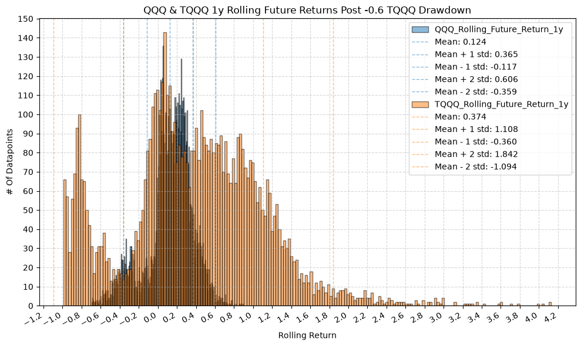
    


    

    


                                      OLS Regression Results                                 
    =========================================================================================
    Dep. Variable:     TQQQ_Rolling_Future_Return_1y   R-squared:                       0.904
    Model:                                       OLS   Adj. R-squared:                  0.904
    Method:                            Least Squares   F-statistic:                 5.855e+04
    Date:                           Mon, 23 Mar 2026   Prob (F-statistic):               0.00
    Time:                                   22:01:07   Log-Likelihood:                 405.83
    No. Observations:                           6205   AIC:                            -807.7
    Df Residuals:                               6203   BIC:                            -794.2
    Df Model:                                      1                                         
    Covariance Type:                       nonrobust                                         
    ================================================================================================
                                       coef    std err          t      P>|t|      [0.025      0.975]
    ------------------------------------------------------------------------------------------------
    const                            0.0161      0.003      4.999      0.000       0.010       0.022
    QQQ_Rolling_Future_Return_1y     2.8916      0.012    241.975      0.000       2.868       2.915
    ==============================================================================
    Omnibus:                     1969.830   Durbin-Watson:                   0.038
    Prob(Omnibus):                  0.000   Jarque-Bera (JB):             8759.005
    Skew:                           1.488   Prob(JB):                         0.00
    Kurtosis:                       8.002   Cond. No.                         4.22
    ==============================================================================
    
    Notes:
    [1] Standard Errors assume that the covariance matrix of the errors is correctly specified.


    
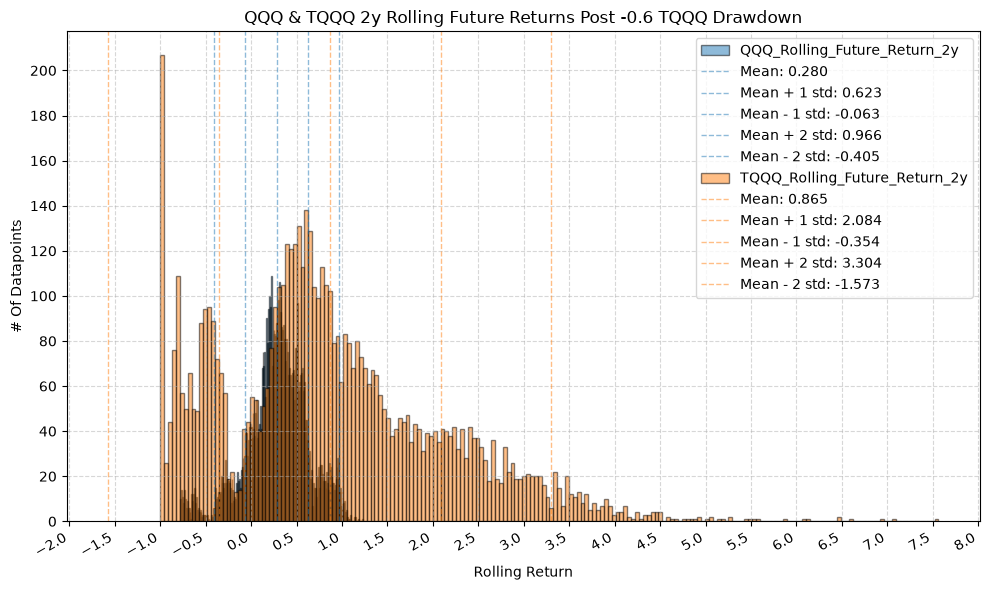
    


    

    


                                      OLS Regression Results                                 
    =========================================================================================
    Dep. Variable:     TQQQ_Rolling_Future_Return_2y   R-squared:                       0.850
    Model:                                       OLS   Adj. R-squared:                  0.850
    Method:                            Least Squares   F-statistic:                 3.400e+04
    Date:                           Mon, 23 Mar 2026   Prob (F-statistic):               0.00
    Time:                                   22:01:09   Log-Likelihood:                -4015.6
    No. Observations:                           5983   AIC:                             8035.
    Df Residuals:                               5981   BIC:                             8049.
    Df Model:                                      1                                         
    Covariance Type:                       nonrobust                                         
    ================================================================================================
                                       coef    std err          t      P>|t|      [0.025      0.975]
    ------------------------------------------------------------------------------------------------
    const                           -0.0508      0.008     -6.452      0.000      -0.066      -0.035
    QQQ_Rolling_Future_Return_2y     3.2856      0.018    184.379      0.000       3.251       3.321
    ==============================================================================
    Omnibus:                     1729.276   Durbin-Watson:                   0.019
    Prob(Omnibus):                  0.000   Jarque-Bera (JB):             5279.242
    Skew:                           1.487   Prob(JB):                         0.00
    Kurtosis:                       6.511   Cond. No.                         3.16
    ==============================================================================
    
    Notes:
    [1] Standard Errors assume that the covariance matrix of the errors is correctly specified.


    
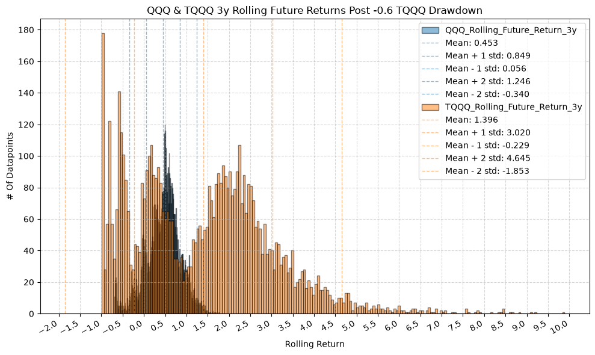
    


    

    


                                      OLS Regression Results                                 
    =========================================================================================
    Dep. Variable:     TQQQ_Rolling_Future_Return_3y   R-squared:                       0.822
    Model:                                       OLS   Adj. R-squared:                  0.821
    Method:                            Least Squares   F-statistic:                 2.637e+04
    Date:                           Mon, 23 Mar 2026   Prob (F-statistic):               0.00
    Time:                                   22:01:11   Log-Likelihood:                -5948.5
    No. Observations:                           5731   AIC:                         1.190e+04
    Df Residuals:                               5729   BIC:                         1.191e+04
    Df Model:                                      1                                         
    Covariance Type:                       nonrobust                                         
    ================================================================================================
                                       coef    std err          t      P>|t|      [0.025      0.975]
    ------------------------------------------------------------------------------------------------
    const                           -0.2891      0.014    -21.177      0.000      -0.316      -0.262
    QQQ_Rolling_Future_Return_3y     3.7262      0.023    162.382      0.000       3.681       3.771
    ==============================================================================
    Omnibus:                      849.429   Durbin-Watson:                   0.015
    Prob(Omnibus):                  0.000   Jarque-Bera (JB):             1564.767
    Skew:                           0.943   Prob(JB):                         0.00
    Kurtosis:                       4.731   Cond. No.                         3.12
    ==============================================================================
    
    Notes:
    [1] Standard Errors assume that the covariance matrix of the errors is correctly specified.


    

    


    
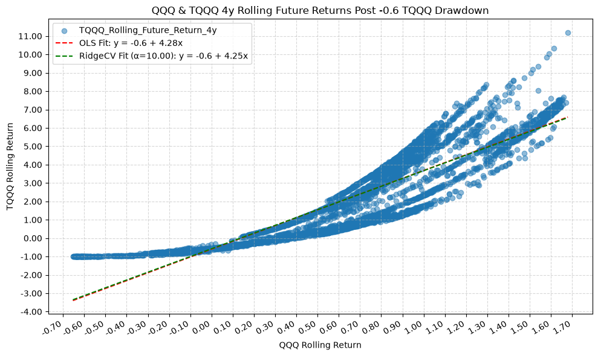
    


                                      OLS Regression Results                                 
    =========================================================================================
    Dep. Variable:     TQQQ_Rolling_Future_Return_4y   R-squared:                       0.788
    Model:                                       OLS   Adj. R-squared:                  0.788
    Method:                            Least Squares   F-statistic:                 2.040e+04
    Date:                           Mon, 23 Mar 2026   Prob (F-statistic):               0.00
    Time:                                   22:01:12   Log-Likelihood:                -8128.7
    No. Observations:                           5479   AIC:                         1.626e+04
    Df Residuals:                               5477   BIC:                         1.627e+04
    Df Model:                                      1                                         
    Covariance Type:                       nonrobust                                         
    ================================================================================================
                                       coef    std err          t      P>|t|      [0.025      0.975]
    ------------------------------------------------------------------------------------------------
    const                           -0.6029      0.024    -25.170      0.000      -0.650      -0.556
    QQQ_Rolling_Future_Return_4y     4.3128      0.030    142.830      0.000       4.254       4.372
    ==============================================================================
    Omnibus:                       52.539   Durbin-Watson:                   0.010
    Prob(Omnibus):                  0.000   Jarque-Bera (JB):               41.303
    Skew:                           0.131   Prob(JB):                     1.07e-09
    Kurtosis:                       2.665   Cond. No.                         3.09
    ==============================================================================
    
    Notes:
    [1] Standard Errors assume that the covariance matrix of the errors is correctly specified.


    

    


    
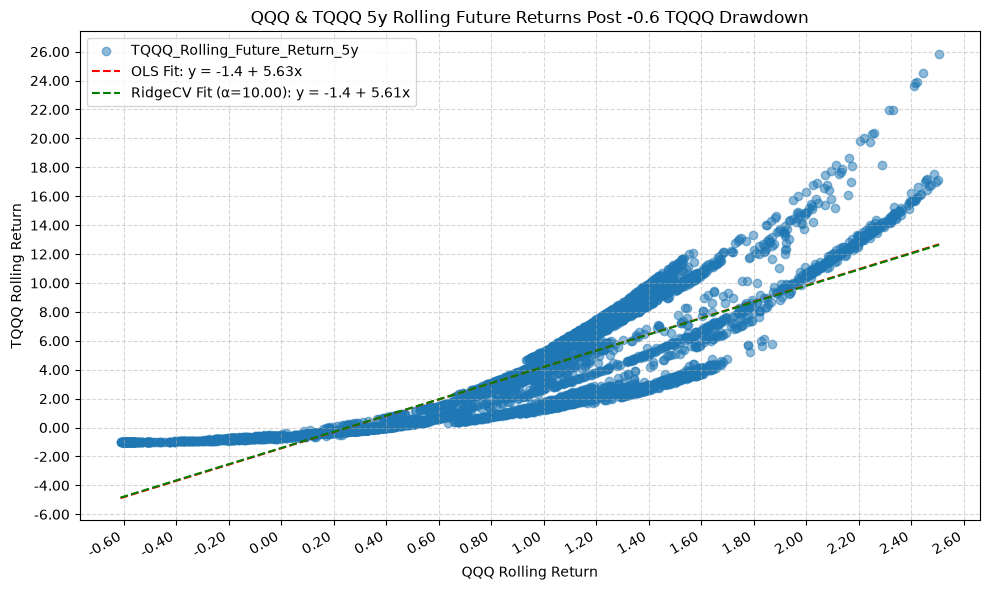
    


                                      OLS Regression Results                                 
    =========================================================================================
    Dep. Variable:     TQQQ_Rolling_Future_Return_5y   R-squared:                       0.750
    Model:                                       OLS   Adj. R-squared:                  0.750
    Method:                            Least Squares   F-statistic:                 1.573e+04
    Date:                           Mon, 23 Mar 2026   Prob (F-statistic):               0.00
    Time:                                   22:01:14   Log-Likelihood:                -11339.
    No. Observations:                           5243   AIC:                         2.268e+04
    Df Residuals:                               5241   BIC:                         2.270e+04
    Df Model:                                      1                                         
    Covariance Type:                       nonrobust                                         
    ================================================================================================
                                       coef    std err          t      P>|t|      [0.025      0.975]
    ------------------------------------------------------------------------------------------------
    const                           -1.4128      0.050    -28.446      0.000      -1.510      -1.315
    QQQ_Rolling_Future_Return_5y     5.6452      0.045    125.418      0.000       5.557       5.733
    ==============================================================================
    Omnibus:                      227.541   Durbin-Watson:                   0.009
    Prob(Omnibus):                  0.000   Jarque-Bera (JB):              348.386
    Skew:                           0.394   Prob(JB):                     2.23e-76
    Kurtosis:                       3.988   Cond. No.                         3.11
    ==============================================================================
    
    Notes:
    [1] Standard Errors assume that the covariance matrix of the errors is correctly specified.


    

    


    

    


                                      OLS Regression Results                                 
    =========================================================================================
    Dep. Variable:     TQQQ_Rolling_Future_Return_1d   R-squared:                       0.999
    Model:                                       OLS   Adj. R-squared:                  0.999
    Method:                            Least Squares   F-statistic:                 5.380e+06
    Date:                           Mon, 23 Mar 2026   Prob (F-statistic):               0.00
    Time:                                   22:01:16   Log-Likelihood:                 29443.
    No. Observations:                           5890   AIC:                        -5.888e+04
    Df Residuals:                               5888   BIC:                        -5.887e+04
    Df Model:                                      1                                         
    Covariance Type:                       nonrobust                                         
    ================================================================================================
                                       coef    std err          t      P>|t|      [0.025      0.975]
    ------------------------------------------------------------------------------------------------
    const                        -3.037e-05   2.13e-05     -1.427      0.154   -7.21e-05    1.14e-05
    QQQ_Rolling_Future_Return_1d     2.9544      0.001   2319.390      0.000       2.952       2.957
    ==============================================================================
    Omnibus:                     8698.998   Durbin-Watson:                   2.576
    Prob(Omnibus):                  0.000   Jarque-Bera (JB):         31790538.925
    Skew:                          -8.045   Prob(JB):                         0.00
    Kurtosis:                     362.553   Cond. No.                         59.9
    ==============================================================================
    
    Notes:
    [1] Standard Errors assume that the covariance matrix of the errors is correctly specified.


    
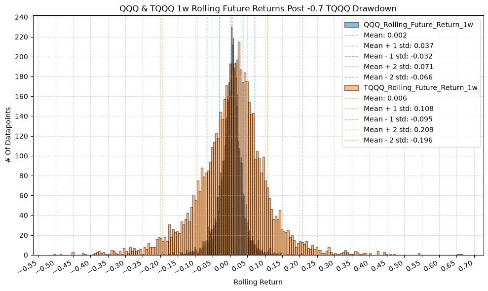
    


    

    


                                      OLS Regression Results                                 
    =========================================================================================
    Dep. Variable:     TQQQ_Rolling_Future_Return_1w   R-squared:                       0.994
    Model:                                       OLS   Adj. R-squared:                  0.994
    Method:                            Least Squares   F-statistic:                 1.008e+06
    Date:                           Mon, 23 Mar 2026   Prob (F-statistic):               0.00
    Time:                                   22:01:18   Log-Likelihood:                 20303.
    No. Observations:                           5890   AIC:                        -4.060e+04
    Df Residuals:                               5888   BIC:                        -4.059e+04
    Df Model:                                      1                                         
    Covariance Type:                       nonrobust                                         
    ================================================================================================
                                       coef    std err          t      P>|t|      [0.025      0.975]
    ------------------------------------------------------------------------------------------------
    const                           -0.0006      0.000     -6.363      0.000      -0.001      -0.000
    QQQ_Rolling_Future_Return_1w     2.9526      0.003   1003.859      0.000       2.947       2.958
    ==============================================================================
    Omnibus:                     3288.219   Durbin-Watson:                   0.897
    Prob(Omnibus):                  0.000   Jarque-Bera (JB):           369148.693
    Skew:                          -1.720   Prob(JB):                         0.00
    Kurtosis:                      41.631   Cond. No.                         29.3
    ==============================================================================
    
    Notes:
    [1] Standard Errors assume that the covariance matrix of the errors is correctly specified.


    

    


    

    


                                      OLS Regression Results                                 
    =========================================================================================
    Dep. Variable:     TQQQ_Rolling_Future_Return_1m   R-squared:                       0.983
    Model:                                       OLS   Adj. R-squared:                  0.983
    Method:                            Least Squares   F-statistic:                 3.372e+05
    Date:                           Mon, 23 Mar 2026   Prob (F-statistic):               0.00
    Time:                                   22:01:20   Log-Likelihood:                 13210.
    No. Observations:                           5890   AIC:                        -2.642e+04
    Df Residuals:                               5888   BIC:                        -2.640e+04
    Df Model:                                      1                                         
    Covariance Type:                       nonrobust                                         
    ================================================================================================
                                       coef    std err          t      P>|t|      [0.025      0.975]
    ------------------------------------------------------------------------------------------------
    const                           -0.0025      0.000     -7.379      0.000      -0.003      -0.002
    QQQ_Rolling_Future_Return_1m     2.9140      0.005    580.676      0.000       2.904       2.924
    ==============================================================================
    Omnibus:                     1415.341   Durbin-Watson:                   0.310
    Prob(Omnibus):                  0.000   Jarque-Bera (JB):            78303.043
    Skew:                           0.193   Prob(JB):                         0.00
    Kurtosis:                      20.858   Cond. No.                         15.0
    ==============================================================================
    
    Notes:
    [1] Standard Errors assume that the covariance matrix of the errors is correctly specified.


    

    


    

    


                                      OLS Regression Results                                 
    =========================================================================================
    Dep. Variable:     TQQQ_Rolling_Future_Return_3m   R-squared:                       0.962
    Model:                                       OLS   Adj. R-squared:                  0.962
    Method:                            Least Squares   F-statistic:                 1.509e+05
    Date:                           Mon, 23 Mar 2026   Prob (F-statistic):               0.00
    Time:                                   22:01:21   Log-Likelihood:                 7799.8
    No. Observations:                           5890   AIC:                        -1.560e+04
    Df Residuals:                               5888   BIC:                        -1.558e+04
    Df Model:                                      1                                         
    Covariance Type:                       nonrobust                                         
    ================================================================================================
                                       coef    std err          t      P>|t|      [0.025      0.975]
    ------------------------------------------------------------------------------------------------
    const                           -0.0040      0.001     -4.619      0.000      -0.006      -0.002
    QQQ_Rolling_Future_Return_3m     2.9068      0.007    388.462      0.000       2.892       2.921
    ==============================================================================
    Omnibus:                     1368.479   Durbin-Watson:                   0.107
    Prob(Omnibus):                  0.000   Jarque-Bera (JB):            16451.791
    Skew:                           0.766   Prob(JB):                         0.00
    Kurtosis:                      11.043   Cond. No.                         8.93
    ==============================================================================
    
    Notes:
    [1] Standard Errors assume that the covariance matrix of the errors is correctly specified.


    
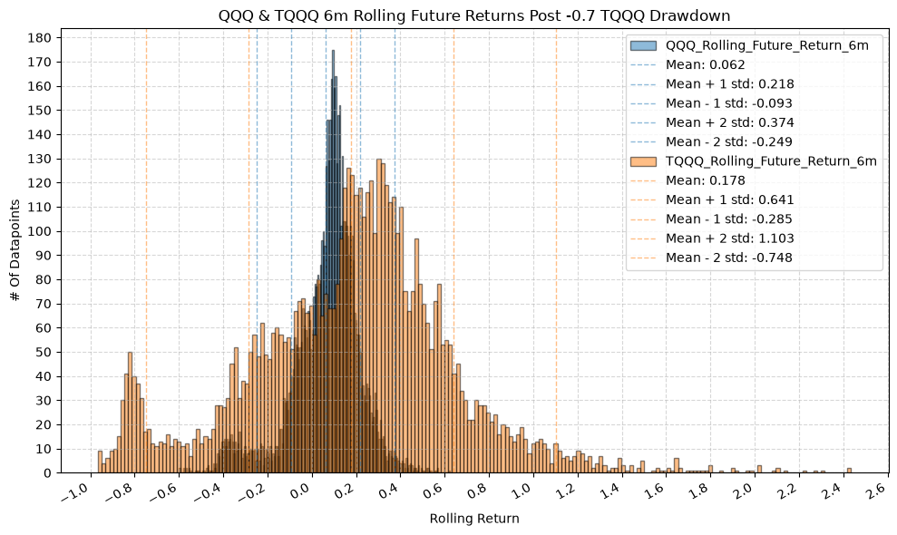
    


    

    


                                      OLS Regression Results                                 
    =========================================================================================
    Dep. Variable:     TQQQ_Rolling_Future_Return_6m   R-squared:                       0.934
    Model:                                       OLS   Adj. R-squared:                  0.934
    Method:                            Least Squares   F-statistic:                 8.379e+04
    Date:                           Mon, 23 Mar 2026   Prob (F-statistic):               0.00
    Time:                                   22:01:23   Log-Likelihood:                 4198.8
    No. Observations:                           5890   AIC:                            -8394.
    Df Residuals:                               5888   BIC:                            -8380.
    Df Model:                                      1                                         
    Covariance Type:                       nonrobust                                         
    ================================================================================================
                                       coef    std err          t      P>|t|      [0.025      0.975]
    ------------------------------------------------------------------------------------------------
    const                           -0.0018      0.002     -1.052      0.293      -0.005       0.002
    QQQ_Rolling_Future_Return_6m     2.8731      0.010    289.460      0.000       2.854       2.893
    ==============================================================================
    Omnibus:                     1462.376   Durbin-Watson:                   0.063
    Prob(Omnibus):                  0.000   Jarque-Bera (JB):             8112.635
    Skew:                           1.074   Prob(JB):                         0.00
    Kurtosis:                       8.333   Cond. No.                         6.45
    ==============================================================================
    
    Notes:
    [1] Standard Errors assume that the covariance matrix of the errors is correctly specified.


    

    


    

    


                                      OLS Regression Results                                 
    =========================================================================================
    Dep. Variable:     TQQQ_Rolling_Future_Return_1y   R-squared:                       0.912
    Model:                                       OLS   Adj. R-squared:                  0.912
    Method:                            Least Squares   F-statistic:                 6.072e+04
    Date:                           Mon, 23 Mar 2026   Prob (F-statistic):               0.00
    Time:                                   22:01:25   Log-Likelihood:                 715.42
    No. Observations:                           5857   AIC:                            -1427.
    Df Residuals:                               5855   BIC:                            -1413.
    Df Model:                                      1                                         
    Covariance Type:                       nonrobust                                         
    ================================================================================================
                                       coef    std err          t      P>|t|      [0.025      0.975]
    ------------------------------------------------------------------------------------------------
    const                           -0.0011      0.003     -0.327      0.744      -0.007       0.005
    QQQ_Rolling_Future_Return_1y     3.0129      0.012    246.405      0.000       2.989       3.037
    ==============================================================================
    Omnibus:                     1765.613   Durbin-Watson:                   0.043
    Prob(Omnibus):                  0.000   Jarque-Bera (JB):             8325.388
    Skew:                           1.385   Prob(JB):                         0.00
    Kurtosis:                       8.142   Cond. No.                         4.45
    ==============================================================================
    
    Notes:
    [1] Standard Errors assume that the covariance matrix of the errors is correctly specified.


    
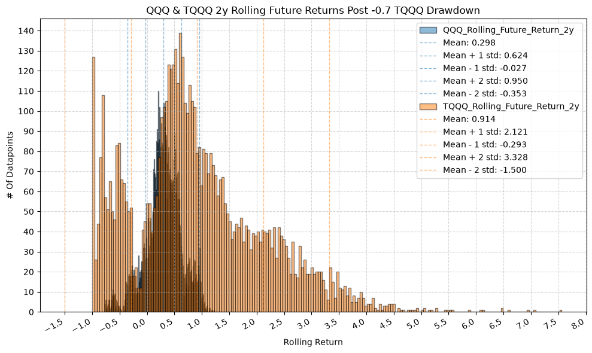
    


    
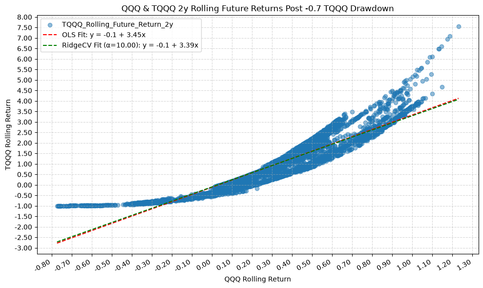
    


                                      OLS Regression Results                                 
    =========================================================================================
    Dep. Variable:     TQQQ_Rolling_Future_Return_2y   R-squared:                       0.865
    Model:                                       OLS   Adj. R-squared:                  0.865
    Method:                            Least Squares   F-statistic:                 3.711e+04
    Date:                           Mon, 23 Mar 2026   Prob (F-statistic):               0.00
    Time:                                   22:01:27   Log-Likelihood:                -3522.7
    No. Observations:                           5789   AIC:                             7049.
    Df Residuals:                               5787   BIC:                             7063.
    Df Model:                                      1                                         
    Covariance Type:                       nonrobust                                         
    ================================================================================================
                                       coef    std err          t      P>|t|      [0.025      0.975]
    ------------------------------------------------------------------------------------------------
    const                           -0.1121      0.008    -14.185      0.000      -0.128      -0.097
    QQQ_Rolling_Future_Return_2y     3.4520      0.018    192.643      0.000       3.417       3.487
    ==============================================================================
    Omnibus:                     1654.985   Durbin-Watson:                   0.020
    Prob(Omnibus):                  0.000   Jarque-Bera (JB):             5614.089
    Skew:                           1.426   Prob(JB):                         0.00
    Kurtosis:                       6.891   Cond. No.                         3.36
    ==============================================================================
    
    Notes:
    [1] Standard Errors assume that the covariance matrix of the errors is correctly specified.


    

    


    

    


                                      OLS Regression Results                                 
    =========================================================================================
    Dep. Variable:     TQQQ_Rolling_Future_Return_3y   R-squared:                       0.838
    Model:                                       OLS   Adj. R-squared:                  0.838
    Method:                            Least Squares   F-statistic:                 2.860e+04
    Date:                           Mon, 23 Mar 2026   Prob (F-statistic):               0.00
    Time:                                   22:01:28   Log-Likelihood:                -5448.4
    No. Observations:                           5537   AIC:                         1.090e+04
    Df Residuals:                               5535   BIC:                         1.091e+04
    Df Model:                                      1                                         
    Covariance Type:                       nonrobust                                         
    ================================================================================================
                                       coef    std err          t      P>|t|      [0.025      0.975]
    ------------------------------------------------------------------------------------------------
    const                           -0.3842      0.014    -27.758      0.000      -0.411      -0.357
    QQQ_Rolling_Future_Return_3y     3.9118      0.023    169.113      0.000       3.866       3.957
    ==============================================================================
    Omnibus:                      674.134   Durbin-Watson:                   0.016
    Prob(Omnibus):                  0.000   Jarque-Bera (JB):             1252.709
    Skew:                           0.794   Prob(JB):                    9.50e-273
    Kurtosis:                       4.706   Cond. No.                         3.31
    ==============================================================================
    
    Notes:
    [1] Standard Errors assume that the covariance matrix of the errors is correctly specified.


    

    


    
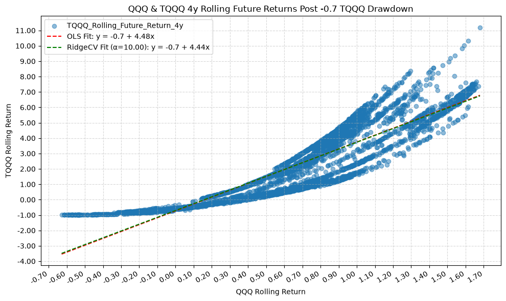
    


                                      OLS Regression Results                                 
    =========================================================================================
    Dep. Variable:     TQQQ_Rolling_Future_Return_4y   R-squared:                       0.805
    Model:                                       OLS   Adj. R-squared:                  0.805
    Method:                            Least Squares   F-statistic:                 2.185e+04
    Date:                           Mon, 23 Mar 2026   Prob (F-statistic):               0.00
    Time:                                   22:01:30   Log-Likelihood:                -7609.7
    No. Observations:                           5285   AIC:                         1.522e+04
    Df Residuals:                               5283   BIC:                         1.524e+04
    Df Model:                                      1                                         
    Covariance Type:                       nonrobust                                         
    ================================================================================================
                                       coef    std err          t      P>|t|      [0.025      0.975]
    ------------------------------------------------------------------------------------------------
    const                           -0.7332      0.024    -30.056      0.000      -0.781      -0.685
    QQQ_Rolling_Future_Return_4y     4.5096      0.031    147.803      0.000       4.450       4.569
    ==============================================================================
    Omnibus:                       12.958   Durbin-Watson:                   0.011
    Prob(Omnibus):                  0.002   Jarque-Bera (JB):               10.506
    Skew:                          -0.007   Prob(JB):                      0.00523
    Kurtosis:                       2.782   Cond. No.                         3.25
    ==============================================================================
    
    Notes:
    [1] Standard Errors assume that the covariance matrix of the errors is correctly specified.


    
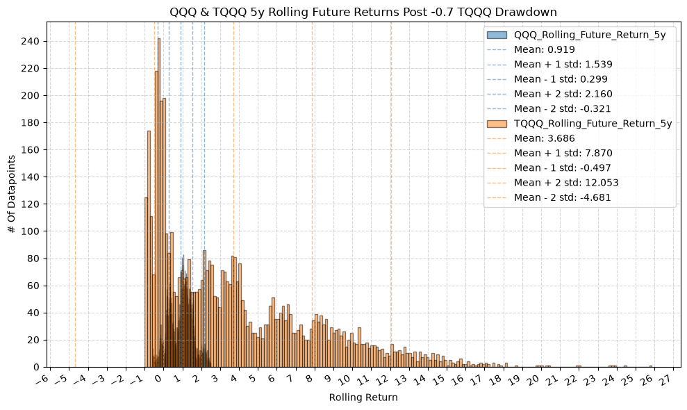
    


    
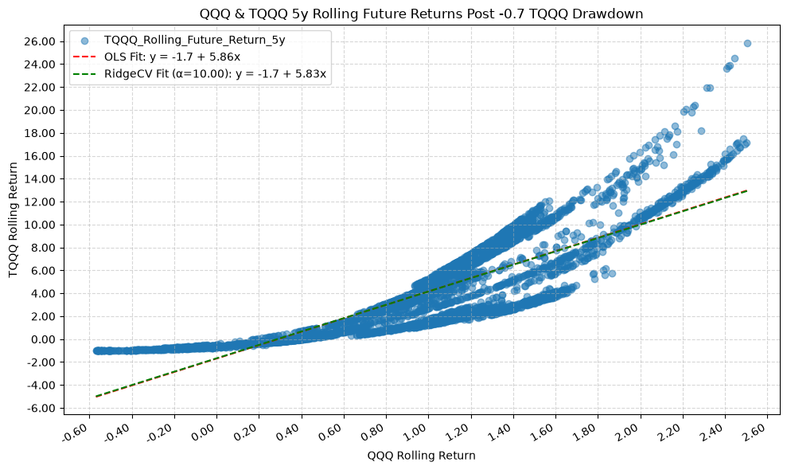
    


                                      OLS Regression Results                                 
    =========================================================================================
    Dep. Variable:     TQQQ_Rolling_Future_Return_5y   R-squared:                       0.759
    Model:                                       OLS   Adj. R-squared:                  0.759
    Method:                            Least Squares   F-statistic:                 1.625e+04
    Date:                           Mon, 23 Mar 2026   Prob (F-statistic):               0.00
    Time:                                   22:01:32   Log-Likelihood:                -11064.
    No. Observations:                           5163   AIC:                         2.213e+04
    Df Residuals:                               5161   BIC:                         2.215e+04
    Df Model:                                      1                                         
    Covariance Type:                       nonrobust                                         
    ================================================================================================
                                       coef    std err          t      P>|t|      [0.025      0.975]
    ------------------------------------------------------------------------------------------------
    const                           -1.6771      0.051    -32.821      0.000      -1.777      -1.577
    QQQ_Rolling_Future_Return_5y     5.8699      0.046    127.459      0.000       5.780       5.960
    ==============================================================================
    Omnibus:                      168.793   Durbin-Watson:                   0.010
    Prob(Omnibus):                  0.000   Jarque-Bera (JB):              286.855
    Skew:                           0.283   Prob(JB):                     5.13e-63
    Kurtosis:                       4.007   Cond. No.                         3.27
    ==============================================================================
    
    Notes:
    [1] Standard Errors assume that the covariance matrix of the errors is correctly specified.


    

    


    
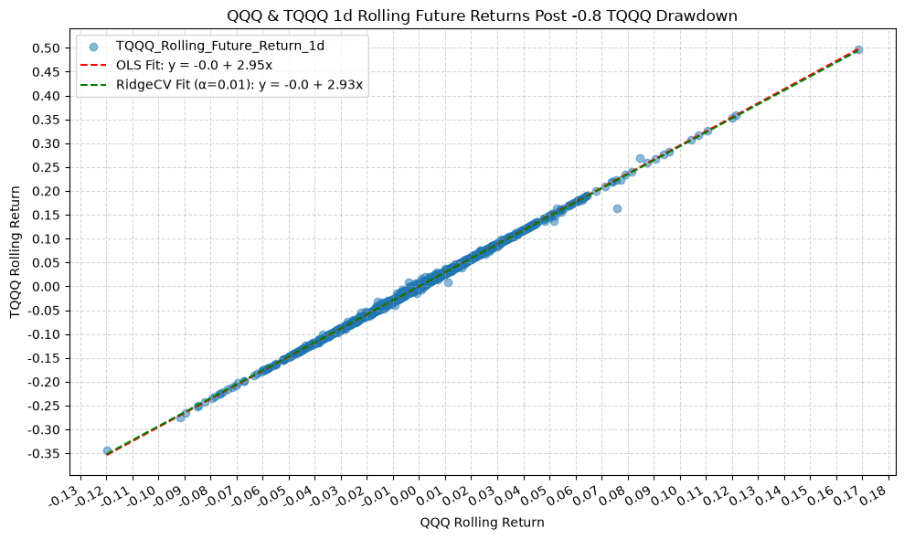
    


                                      OLS Regression Results                                 
    =========================================================================================
    Dep. Variable:     TQQQ_Rolling_Future_Return_1d   R-squared:                       0.999
    Model:                                       OLS   Adj. R-squared:                  0.999
    Method:                            Least Squares   F-statistic:                 4.767e+06
    Date:                           Mon, 23 Mar 2026   Prob (F-statistic):               0.00
    Time:                                   22:01:33   Log-Likelihood:                 27167.
    No. Observations:                           5450   AIC:                        -5.433e+04
    Df Residuals:                               5448   BIC:                        -5.432e+04
    Df Model:                                      1                                         
    Covariance Type:                       nonrobust                                         
    ================================================================================================
                                       coef    std err          t      P>|t|      [0.025      0.975]
    ------------------------------------------------------------------------------------------------
    const                        -1.602e-05   2.24e-05     -0.714      0.475      -6e-05     2.8e-05
    QQQ_Rolling_Future_Return_1d     2.9532      0.001   2183.311      0.000       2.951       2.956
    ==============================================================================
    Omnibus:                     8184.121   Durbin-Watson:                   2.578
    Prob(Omnibus):                  0.000   Jarque-Bera (JB):         30349901.921
    Skew:                          -8.326   Prob(JB):                         0.00
    Kurtosis:                     368.204   Cond. No.                         60.3
    ==============================================================================
    
    Notes:
    [1] Standard Errors assume that the covariance matrix of the errors is correctly specified.


    
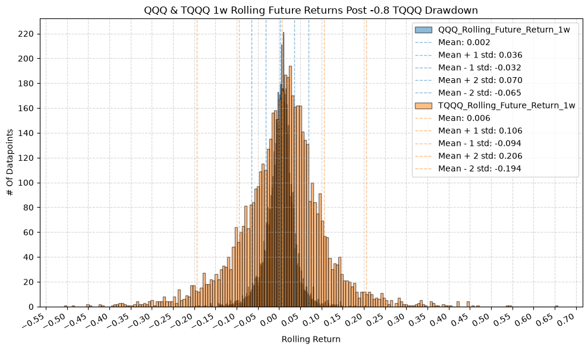
    


    
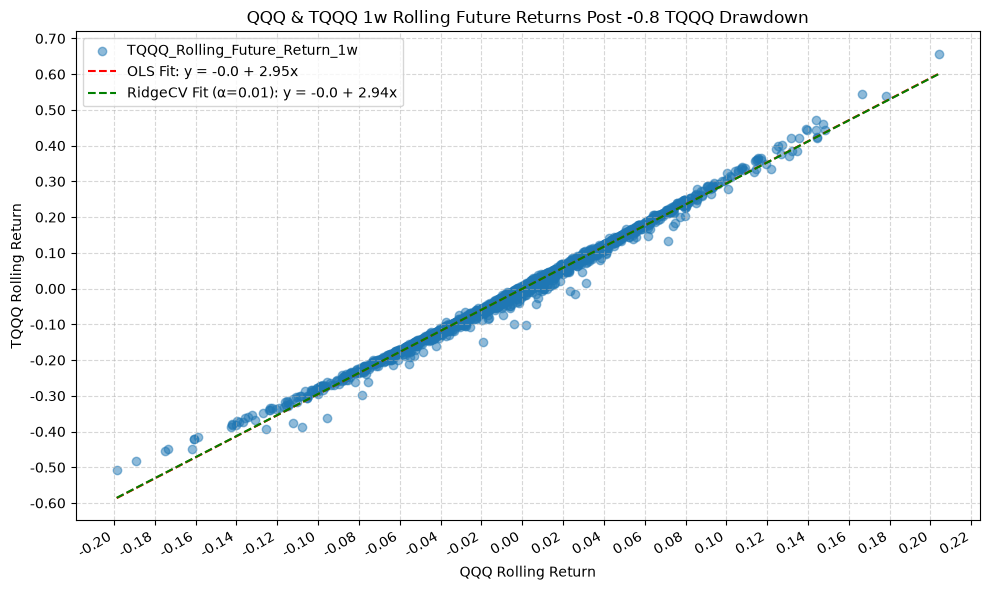
    


                                      OLS Regression Results                                 
    =========================================================================================
    Dep. Variable:     TQQQ_Rolling_Future_Return_1w   R-squared:                       0.994
    Model:                                       OLS   Adj. R-squared:                  0.994
    Method:                            Least Squares   F-statistic:                 9.352e+05
    Date:                           Mon, 23 Mar 2026   Prob (F-statistic):               0.00
    Time:                                   22:01:35   Log-Likelihood:                 18855.
    No. Observations:                           5450   AIC:                        -3.771e+04
    Df Residuals:                               5448   BIC:                        -3.769e+04
    Df Model:                                      1                                         
    Covariance Type:                       nonrobust                                         
    ================================================================================================
                                       coef    std err          t      P>|t|      [0.025      0.975]
    ------------------------------------------------------------------------------------------------
    const                           -0.0006      0.000     -5.512      0.000      -0.001      -0.000
    QQQ_Rolling_Future_Return_1w     2.9495      0.003    967.071      0.000       2.944       2.956
    ==============================================================================
    Omnibus:                     3225.262   Durbin-Watson:                   0.872
    Prob(Omnibus):                  0.000   Jarque-Bera (JB):           383451.023
    Skew:                          -1.880   Prob(JB):                         0.00
    Kurtosis:                      43.920   Cond. No.                         29.6
    ==============================================================================
    
    Notes:
    [1] Standard Errors assume that the covariance matrix of the errors is correctly specified.


    

    


    
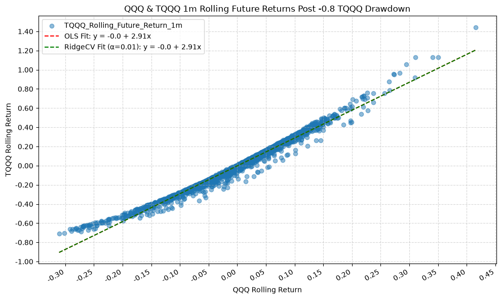
    


                                      OLS Regression Results                                 
    =========================================================================================
    Dep. Variable:     TQQQ_Rolling_Future_Return_1m   R-squared:                       0.982
    Model:                                       OLS   Adj. R-squared:                  0.982
    Method:                            Least Squares   F-statistic:                 3.035e+05
    Date:                           Mon, 23 Mar 2026   Prob (F-statistic):               0.00
    Time:                                   22:01:37   Log-Likelihood:                 12190.
    No. Observations:                           5450   AIC:                        -2.438e+04
    Df Residuals:                               5448   BIC:                        -2.436e+04
    Df Model:                                      1                                         
    Covariance Type:                       nonrobust                                         
    ================================================================================================
                                       coef    std err          t      P>|t|      [0.025      0.975]
    ------------------------------------------------------------------------------------------------
    const                           -0.0021      0.000     -5.911      0.000      -0.003      -0.001
    QQQ_Rolling_Future_Return_1m     2.9063      0.005    550.932      0.000       2.896       2.917
    ==============================================================================
    Omnibus:                     1331.250   Durbin-Watson:                   0.299
    Prob(Omnibus):                  0.000   Jarque-Bera (JB):            76809.720
    Skew:                           0.205   Prob(JB):                         0.00
    Kurtosis:                      21.387   Cond. No.                         15.1
    ==============================================================================
    
    Notes:
    [1] Standard Errors assume that the covariance matrix of the errors is correctly specified.


    

    


    
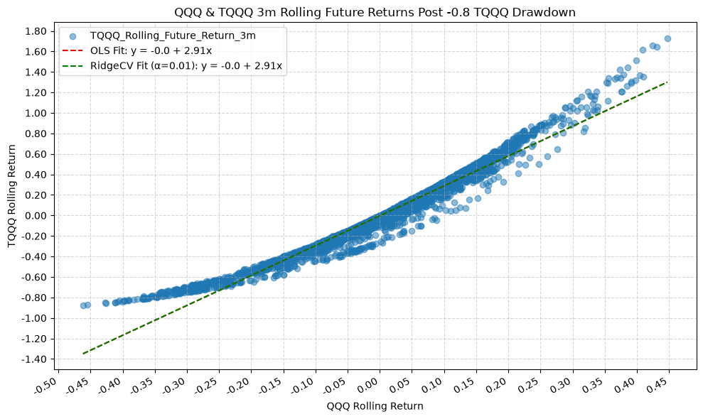
    


                                      OLS Regression Results                                 
    =========================================================================================
    Dep. Variable:     TQQQ_Rolling_Future_Return_3m   R-squared:                       0.961
    Model:                                       OLS   Adj. R-squared:                  0.961
    Method:                            Least Squares   F-statistic:                 1.352e+05
    Date:                           Mon, 23 Mar 2026   Prob (F-statistic):               0.00
    Time:                                   22:01:38   Log-Likelihood:                 7159.6
    No. Observations:                           5450   AIC:                        -1.432e+04
    Df Residuals:                               5448   BIC:                        -1.430e+04
    Df Model:                                      1                                         
    Covariance Type:                       nonrobust                                         
    ================================================================================================
                                       coef    std err          t      P>|t|      [0.025      0.975]
    ------------------------------------------------------------------------------------------------
    const                           -0.0036      0.001     -3.910      0.000      -0.005      -0.002
    QQQ_Rolling_Future_Return_3m     2.9142      0.008    367.681      0.000       2.899       2.930
    ==============================================================================
    Omnibus:                     1265.130   Durbin-Watson:                   0.097
    Prob(Omnibus):                  0.000   Jarque-Bera (JB):            15817.100
    Skew:                           0.752   Prob(JB):                         0.00
    Kurtosis:                      11.209   Cond. No.                         9.00
    ==============================================================================
    
    Notes:
    [1] Standard Errors assume that the covariance matrix of the errors is correctly specified.


    
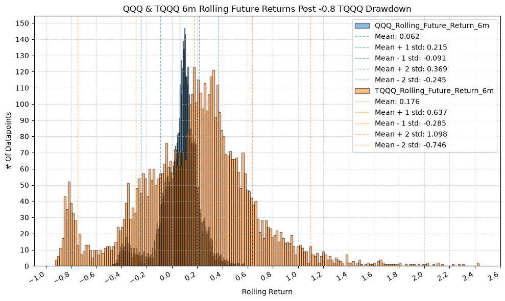
    


    
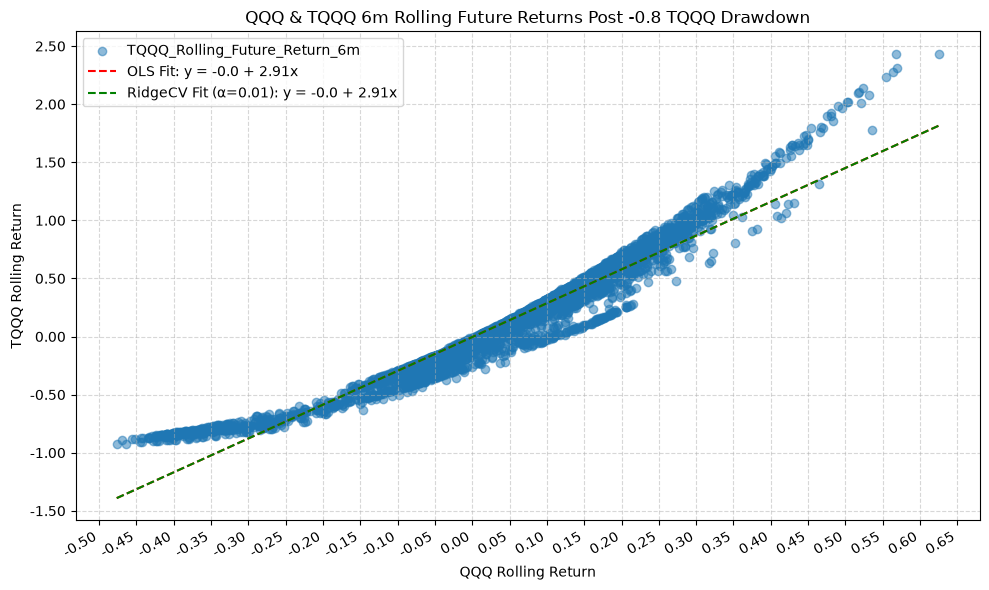
    


                                      OLS Regression Results                                 
    =========================================================================================
    Dep. Variable:     TQQQ_Rolling_Future_Return_6m   R-squared:                       0.937
    Model:                                       OLS   Adj. R-squared:                  0.937
    Method:                            Least Squares   F-statistic:                 8.117e+04
    Date:                           Mon, 23 Mar 2026   Prob (F-statistic):               0.00
    Time:                                   22:01:40   Log-Likelihood:                 4027.1
    No. Observations:                           5450   AIC:                            -8050.
    Df Residuals:                               5448   BIC:                            -8037.
    Df Model:                                      1                                         
    Covariance Type:                       nonrobust                                         
    ================================================================================================
                                       coef    std err          t      P>|t|      [0.025      0.975]
    ------------------------------------------------------------------------------------------------
    const                           -0.0043      0.002     -2.531      0.011      -0.008      -0.001
    QQQ_Rolling_Future_Return_6m     2.9104      0.010    284.899      0.000       2.890       2.930
    ==============================================================================
    Omnibus:                      970.645   Durbin-Watson:                   0.061
    Prob(Omnibus):                  0.000   Jarque-Bera (JB):             4546.797
    Skew:                           0.789   Prob(JB):                         0.00
    Kurtosis:                       7.187   Cond. No.                         6.55
    ==============================================================================
    
    Notes:
    [1] Standard Errors assume that the covariance matrix of the errors is correctly specified.


    
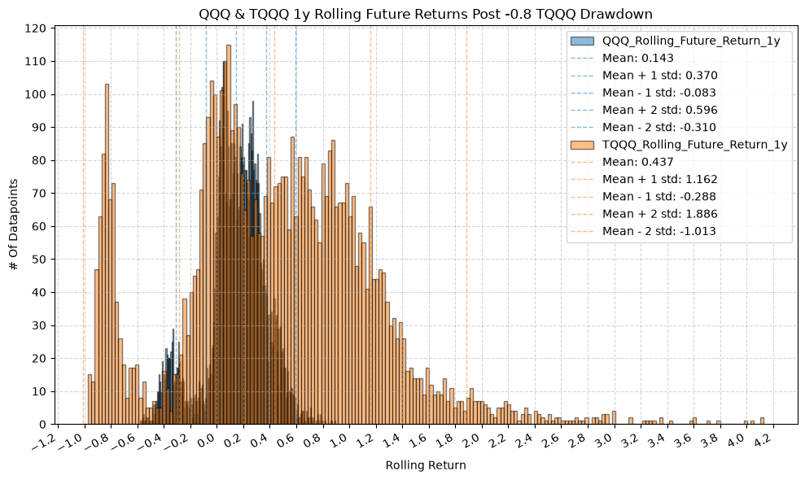
    


    
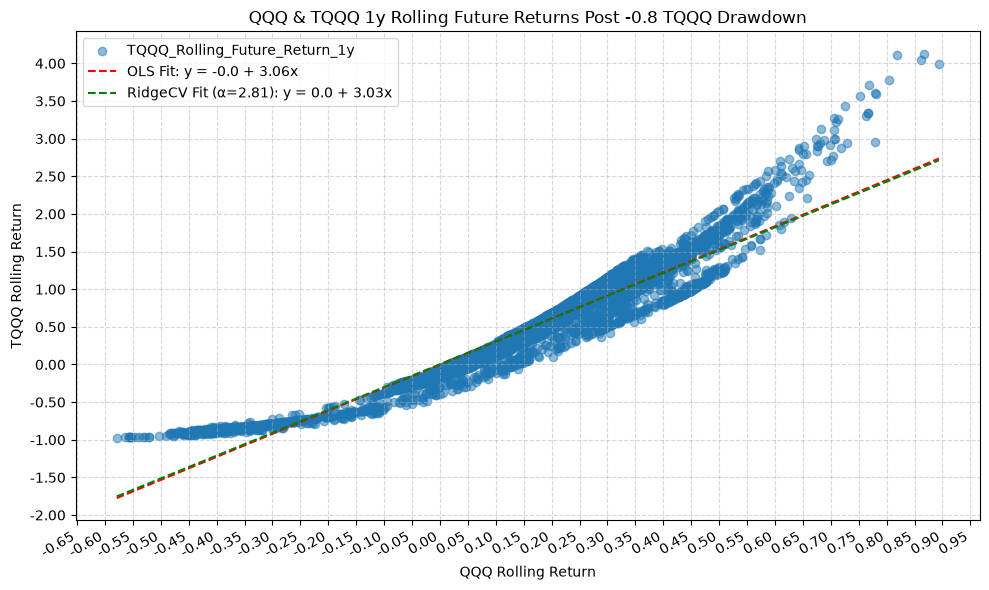
    


                                      OLS Regression Results                                 
    =========================================================================================
    Dep. Variable:     TQQQ_Rolling_Future_Return_1y   R-squared:                       0.917
    Model:                                       OLS   Adj. R-squared:                  0.917
    Method:                            Least Squares   F-statistic:                 5.979e+04
    Date:                           Mon, 23 Mar 2026   Prob (F-statistic):               0.00
    Time:                                   22:01:42   Log-Likelihood:                 790.67
    No. Observations:                           5446   AIC:                            -1577.
    Df Residuals:                               5444   BIC:                            -1564.
    Df Model:                                      1                                         
    Covariance Type:                       nonrobust                                         
    ================================================================================================
                                       coef    std err          t      P>|t|      [0.025      0.975]
    ------------------------------------------------------------------------------------------------
    const                           -0.0019      0.003     -0.560      0.575      -0.008       0.005
    QQQ_Rolling_Future_Return_1y     3.0627      0.013    244.513      0.000       3.038       3.087
    ==============================================================================
    Omnibus:                     1401.338   Durbin-Watson:                   0.045
    Prob(Omnibus):                  0.000   Jarque-Bera (JB):             6208.882
    Skew:                           1.187   Prob(JB):                         0.00
    Kurtosis:                       7.661   Cond. No.                         4.51
    ==============================================================================
    
    Notes:
    [1] Standard Errors assume that the covariance matrix of the errors is correctly specified.


    
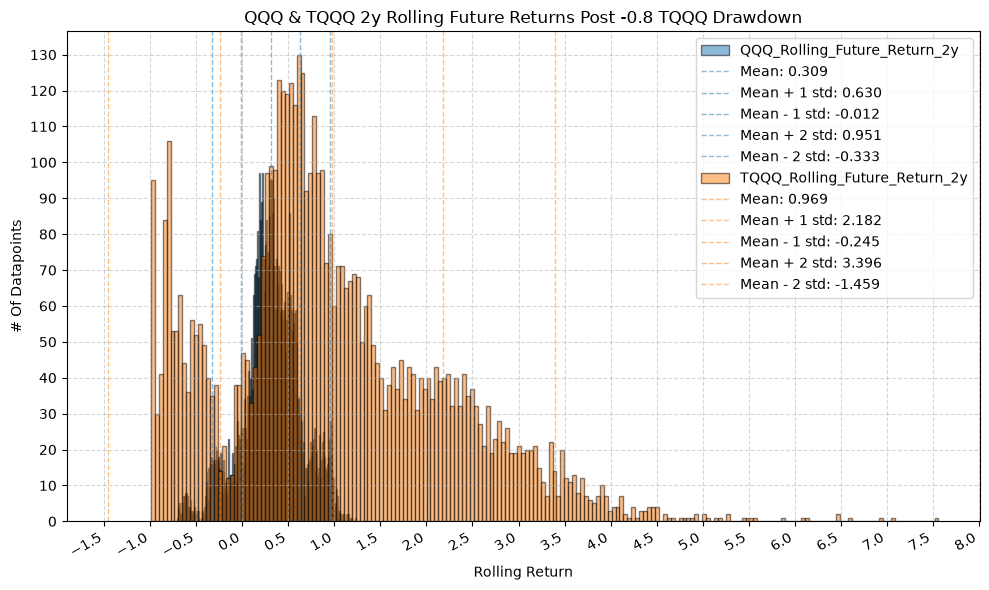
    


    
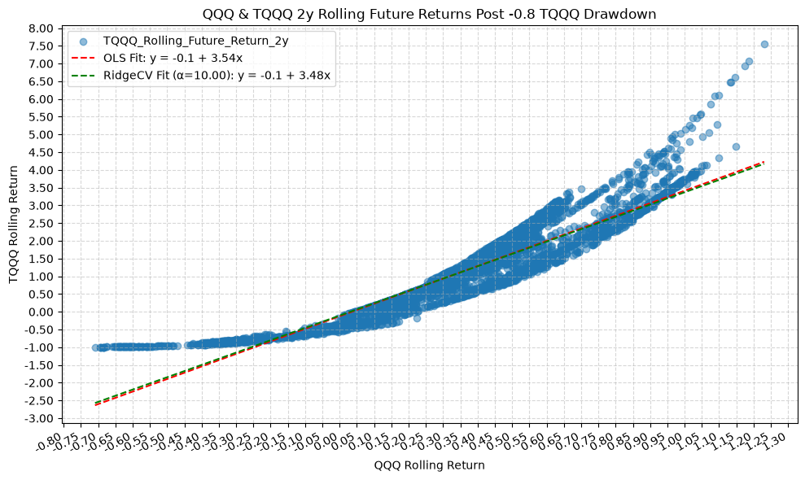
    


                                      OLS Regression Results                                 
    =========================================================================================
    Dep. Variable:     TQQQ_Rolling_Future_Return_2y   R-squared:                       0.876
    Model:                                       OLS   Adj. R-squared:                  0.876
    Method:                            Least Squares   F-statistic:                 3.834e+04
    Date:                           Mon, 23 Mar 2026   Prob (F-statistic):               0.00
    Time:                                   22:01:43   Log-Likelihood:                -3105.2
    No. Observations:                           5446   AIC:                             6214.
    Df Residuals:                               5444   BIC:                             6228.
    Df Model:                                      1                                         
    Covariance Type:                       nonrobust                                         
    ================================================================================================
                                       coef    std err          t      P>|t|      [0.025      0.975]
    ------------------------------------------------------------------------------------------------
    const                           -0.1258      0.008    -15.614      0.000      -0.142      -0.110
    QQQ_Rolling_Future_Return_2y     3.5394      0.018    195.794      0.000       3.504       3.575
    ==============================================================================
    Omnibus:                     1479.606   Durbin-Watson:                   0.022
    Prob(Omnibus):                  0.000   Jarque-Bera (JB):             5093.275
    Skew:                           1.346   Prob(JB):                         0.00
    Kurtosis:                       6.899   Cond. No.                         3.45
    ==============================================================================
    
    Notes:
    [1] Standard Errors assume that the covariance matrix of the errors is correctly specified.


    

    


    

    


                                      OLS Regression Results                                 
    =========================================================================================
    Dep. Variable:     TQQQ_Rolling_Future_Return_3y   R-squared:                       0.850
    Model:                                       OLS   Adj. R-squared:                  0.850
    Method:                            Least Squares   F-statistic:                 2.993e+04
    Date:                           Mon, 23 Mar 2026   Prob (F-statistic):               0.00
    Time:                                   22:01:45   Log-Likelihood:                -5026.2
    No. Observations:                           5295   AIC:                         1.006e+04
    Df Residuals:                               5293   BIC:                         1.007e+04
    Df Model:                                      1                                         
    Covariance Type:                       nonrobust                                         
    ================================================================================================
                                       coef    std err          t      P>|t|      [0.025      0.975]
    ------------------------------------------------------------------------------------------------
    const                           -0.3931      0.014    -28.257      0.000      -0.420      -0.366
    QQQ_Rolling_Future_Return_3y     3.9740      0.023    172.992      0.000       3.929       4.019
    ==============================================================================
    Omnibus:                      582.216   Durbin-Watson:                   0.018
    Prob(Omnibus):                  0.000   Jarque-Bera (JB):             1156.163
    Skew:                           0.707   Prob(JB):                    8.76e-252
    Kurtosis:                       4.801   Cond. No.                         3.36
    ==============================================================================
    
    Notes:
    [1] Standard Errors assume that the covariance matrix of the errors is correctly specified.


    
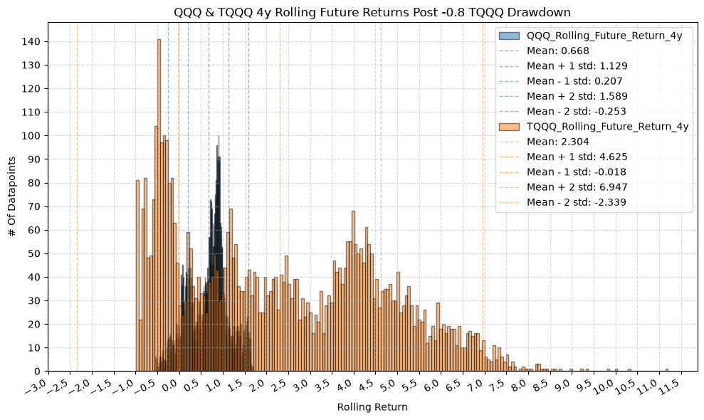
    


    
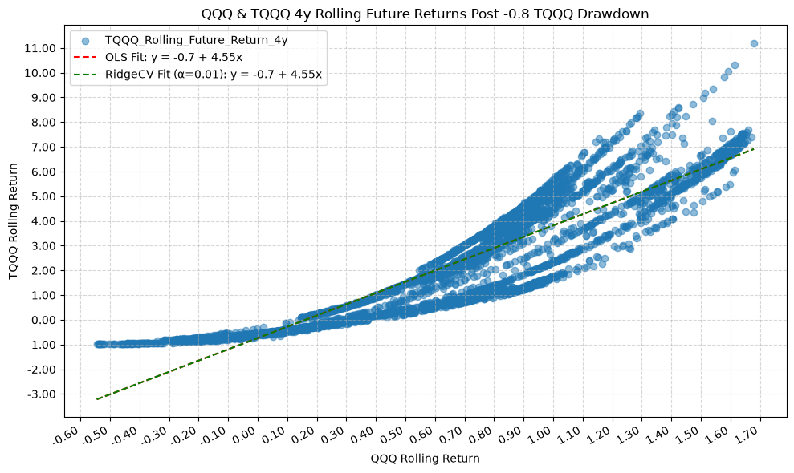
    


                                      OLS Regression Results                                 
    =========================================================================================
    Dep. Variable:     TQQQ_Rolling_Future_Return_4y   R-squared:                       0.819
    Model:                                       OLS   Adj. R-squared:                  0.819
    Method:                            Least Squares   F-statistic:                 2.300e+04
    Date:                           Mon, 23 Mar 2026   Prob (F-statistic):               0.00
    Time:                                   22:01:47   Log-Likelihood:                -7134.0
    No. Observations:                           5071   AIC:                         1.427e+04
    Df Residuals:                               5069   BIC:                         1.429e+04
    Df Model:                                      1                                         
    Covariance Type:                       nonrobust                                         
    ================================================================================================
                                       coef    std err          t      P>|t|      [0.025      0.975]
    ------------------------------------------------------------------------------------------------
    const                           -0.7493      0.024    -30.704      0.000      -0.797      -0.701
    QQQ_Rolling_Future_Return_4y     4.5868      0.030    151.643      0.000       4.528       4.646
    ==============================================================================
    Omnibus:                       13.206   Durbin-Watson:                   0.011
    Prob(Omnibus):                  0.001   Jarque-Bera (JB):               13.284
    Skew:                          -0.121   Prob(JB):                      0.00130
    Kurtosis:                       2.931   Cond. No.                         3.30
    ==============================================================================
    
    Notes:
    [1] Standard Errors assume that the covariance matrix of the errors is correctly specified.


    
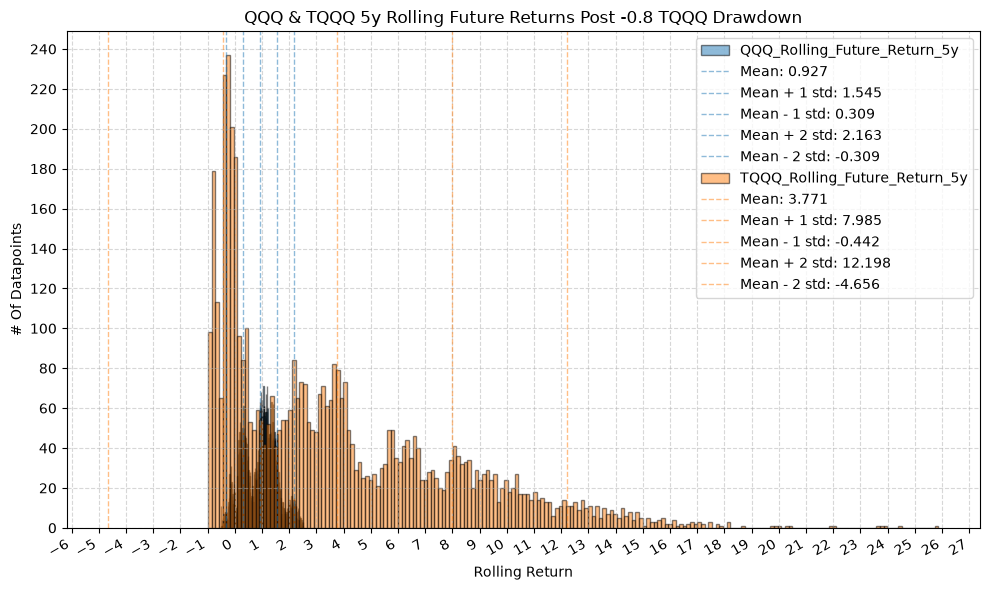
    


    
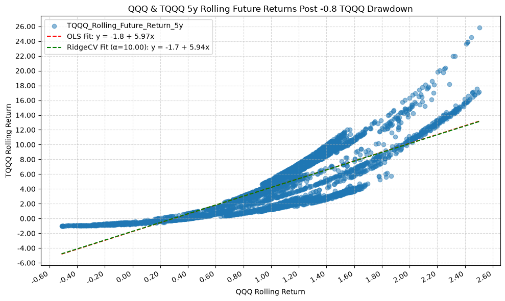
    


                                      OLS Regression Results                                 
    =========================================================================================
    Dep. Variable:     TQQQ_Rolling_Future_Return_5y   R-squared:                       0.766
    Model:                                       OLS   Adj. R-squared:                  0.766
    Method:                            Least Squares   F-statistic:                 1.658e+04
    Date:                           Mon, 23 Mar 2026   Prob (F-statistic):               0.00
    Time:                                   22:01:48   Log-Likelihood:                -10802.
    No. Observations:                           5069   AIC:                         2.161e+04
    Df Residuals:                               5067   BIC:                         2.162e+04
    Df Model:                                      1                                         
    Covariance Type:                       nonrobust                                         
    ================================================================================================
                                       coef    std err          t      P>|t|      [0.025      0.975]
    ------------------------------------------------------------------------------------------------
    const                           -1.7617      0.052    -34.121      0.000      -1.863      -1.660
    QQQ_Rolling_Future_Return_5y     5.9669      0.046    128.779      0.000       5.876       6.058
    ==============================================================================
    Omnibus:                      145.271   Durbin-Watson:                   0.010
    Prob(Omnibus):                  0.000   Jarque-Bera (JB):              276.687
    Skew:                           0.211   Prob(JB):                     8.28e-61
    Kurtosis:                       4.064   Cond. No.                         3.33
    ==============================================================================
    
    Notes:
    [1] Standard Errors assume that the covariance matrix of the errors is correctly specified.


    

    


    
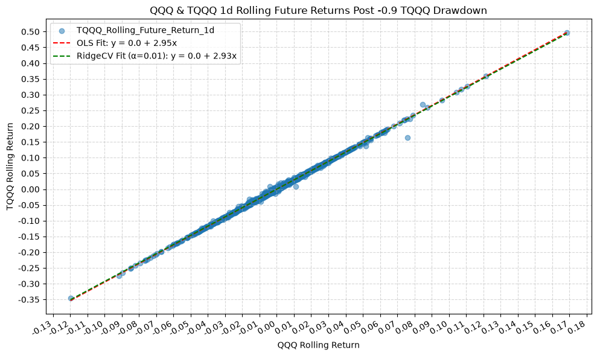
    


                                      OLS Regression Results                                 
    =========================================================================================
    Dep. Variable:     TQQQ_Rolling_Future_Return_1d   R-squared:                       0.999
    Model:                                       OLS   Adj. R-squared:                  0.999
    Method:                            Least Squares   F-statistic:                 3.965e+06
    Date:                           Mon, 23 Mar 2026   Prob (F-statistic):               0.00
    Time:                                   22:01:50   Log-Likelihood:                 24386.
    No. Observations:                           4909   AIC:                        -4.877e+04
    Df Residuals:                               4907   BIC:                        -4.875e+04
    Df Model:                                      1                                         
    Covariance Type:                       nonrobust                                         
    ================================================================================================
                                       coef    std err          t      P>|t|      [0.025      0.975]
    ------------------------------------------------------------------------------------------------
    const                         7.129e-06   2.41e-05      0.296      0.767      -4e-05    5.43e-05
    QQQ_Rolling_Future_Return_1d     2.9508      0.001   1991.332      0.000       2.948       2.954
    ==============================================================================
    Omnibus:                     7546.968   Durbin-Watson:                   2.588
    Prob(Omnibus):                  0.000   Jarque-Bera (JB):         28785736.106
    Skew:                          -8.740   Prob(JB):                         0.00
    Kurtosis:                     377.736   Cond. No.                         61.6
    ==============================================================================
    
    Notes:
    [1] Standard Errors assume that the covariance matrix of the errors is correctly specified.


    

    


    

    


                                      OLS Regression Results                                 
    =========================================================================================
    Dep. Variable:     TQQQ_Rolling_Future_Return_1w   R-squared:                       0.994
    Model:                                       OLS   Adj. R-squared:                  0.994
    Method:                            Least Squares   F-statistic:                 8.425e+05
    Date:                           Mon, 23 Mar 2026   Prob (F-statistic):               0.00
    Time:                                   22:01:52   Log-Likelihood:                 17077.
    No. Observations:                           4909   AIC:                        -3.415e+04
    Df Residuals:                               4907   BIC:                        -3.414e+04
    Df Model:                                      1                                         
    Covariance Type:                       nonrobust                                         
    ================================================================================================
                                       coef    std err          t      P>|t|      [0.025      0.975]
    ------------------------------------------------------------------------------------------------
    const                           -0.0005      0.000     -4.398      0.000      -0.001      -0.000
    QQQ_Rolling_Future_Return_1w     2.9537      0.003    917.898      0.000       2.947       2.960
    ==============================================================================
    Omnibus:                     3458.331   Durbin-Watson:                   0.891
    Prob(Omnibus):                  0.000   Jarque-Bera (JB):           430375.683
    Skew:                          -2.502   Prob(JB):                         0.00
    Kurtosis:                      48.597   Cond. No.                         30.2
    ==============================================================================
    
    Notes:
    [1] Standard Errors assume that the covariance matrix of the errors is correctly specified.


    
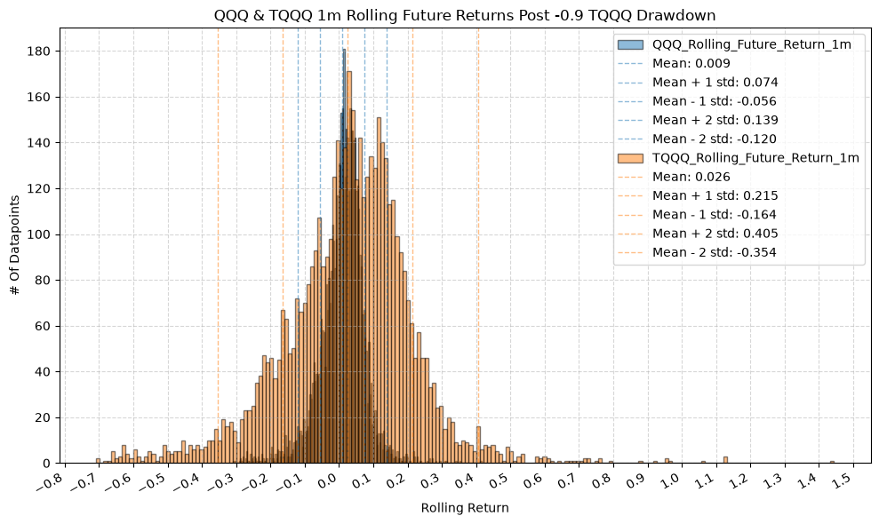
    


    

    


                                      OLS Regression Results                                 
    =========================================================================================
    Dep. Variable:     TQQQ_Rolling_Future_Return_1m   R-squared:                       0.982
    Model:                                       OLS   Adj. R-squared:                  0.982
    Method:                            Least Squares   F-statistic:                 2.620e+05
    Date:                           Mon, 23 Mar 2026   Prob (F-statistic):               0.00
    Time:                                   22:01:53   Log-Likelihood:                 11004.
    No. Observations:                           4909   AIC:                        -2.200e+04
    Df Residuals:                               4907   BIC:                        -2.199e+04
    Df Model:                                      1                                         
    Covariance Type:                       nonrobust                                         
    ================================================================================================
                                       coef    std err          t      P>|t|      [0.025      0.975]
    ------------------------------------------------------------------------------------------------
    const                           -0.0014      0.000     -3.884      0.000      -0.002      -0.001
    QQQ_Rolling_Future_Return_1m     2.8966      0.006    511.823      0.000       2.886       2.908
    ==============================================================================
    Omnibus:                     1234.759   Durbin-Watson:                   0.289
    Prob(Omnibus):                  0.000   Jarque-Bera (JB):            81518.307
    Skew:                           0.182   Prob(JB):                         0.00
    Kurtosis:                      22.960   Cond. No.                         15.4
    ==============================================================================
    
    Notes:
    [1] Standard Errors assume that the covariance matrix of the errors is correctly specified.


    
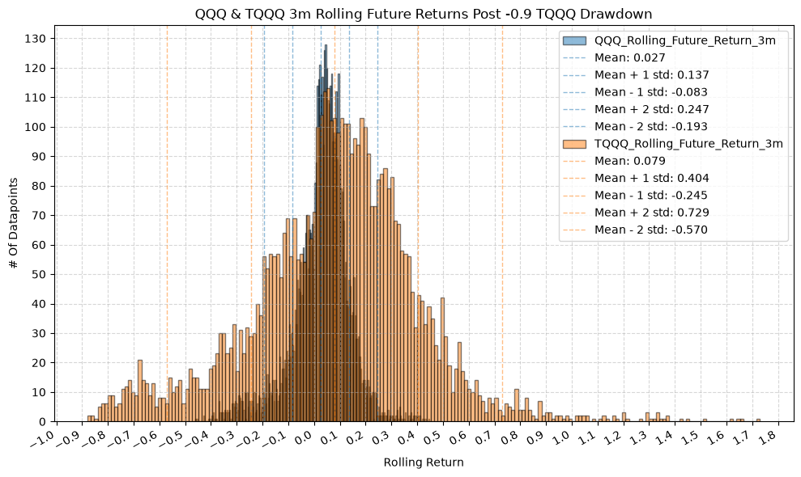
    


    

    


                                      OLS Regression Results                                 
    =========================================================================================
    Dep. Variable:     TQQQ_Rolling_Future_Return_3m   R-squared:                       0.964
    Model:                                       OLS   Adj. R-squared:                  0.964
    Method:                            Least Squares   F-statistic:                 1.297e+05
    Date:                           Mon, 23 Mar 2026   Prob (F-statistic):               0.00
    Time:                                   22:01:55   Log-Likelihood:                 6687.8
    No. Observations:                           4909   AIC:                        -1.337e+04
    Df Residuals:                               4907   BIC:                        -1.336e+04
    Df Model:                                      1                                         
    Covariance Type:                       nonrobust                                         
    ================================================================================================
                                       coef    std err          t      P>|t|      [0.025      0.975]
    ------------------------------------------------------------------------------------------------
    const                            0.0002      0.001      0.215      0.829      -0.002       0.002
    QQQ_Rolling_Future_Return_3m     2.8959      0.008    360.175      0.000       2.880       2.912
    ==============================================================================
    Omnibus:                     1438.612   Durbin-Watson:                   0.111
    Prob(Omnibus):                  0.000   Jarque-Bera (JB):            18131.281
    Skew:                           1.037   Prob(JB):                         0.00
    Kurtosis:                      12.184   Cond. No.                         9.10
    ==============================================================================
    
    Notes:
    [1] Standard Errors assume that the covariance matrix of the errors is correctly specified.


    
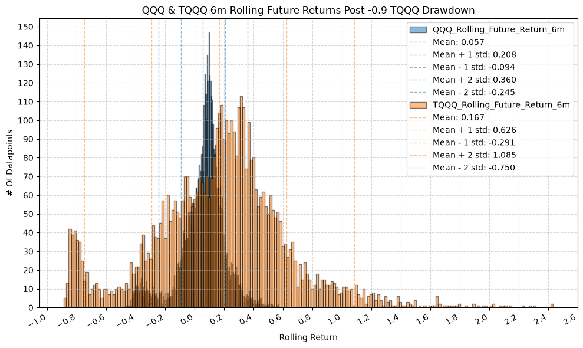
    


    
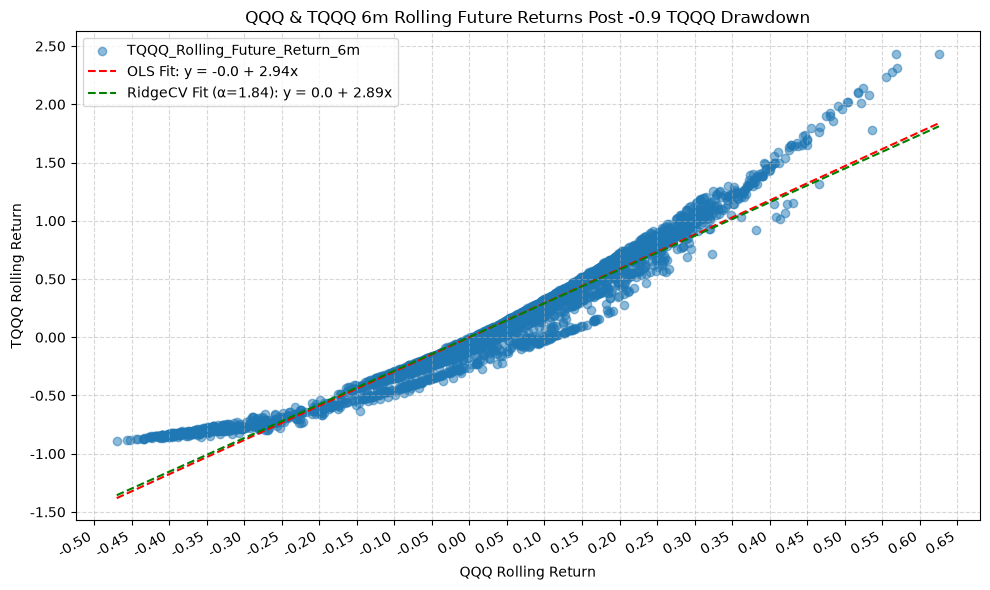
    


                                      OLS Regression Results                                 
    =========================================================================================
    Dep. Variable:     TQQQ_Rolling_Future_Return_6m   R-squared:                       0.940
    Model:                                       OLS   Adj. R-squared:                  0.940
    Method:                            Least Squares   F-statistic:                 7.744e+04
    Date:                           Mon, 23 Mar 2026   Prob (F-statistic):               0.00
    Time:                                   22:01:56   Log-Likelihood:                 3783.0
    No. Observations:                           4909   AIC:                            -7562.
    Df Residuals:                               4907   BIC:                            -7549.
    Df Model:                                      1                                         
    Covariance Type:                       nonrobust                                         
    ================================================================================================
                                       coef    std err          t      P>|t|      [0.025      0.975]
    ------------------------------------------------------------------------------------------------
    const                           -0.0006      0.002     -0.378      0.705      -0.004       0.003
    QQQ_Rolling_Future_Return_6m     2.9398      0.011    278.286      0.000       2.919       2.960
    ==============================================================================
    Omnibus:                     1092.173   Durbin-Watson:                   0.063
    Prob(Omnibus):                  0.000   Jarque-Bera (JB):             5026.717
    Skew:                           1.005   Prob(JB):                         0.00
    Kurtosis:                       7.531   Cond. No.                         6.63
    ==============================================================================
    
    Notes:
    [1] Standard Errors assume that the covariance matrix of the errors is correctly specified.


    
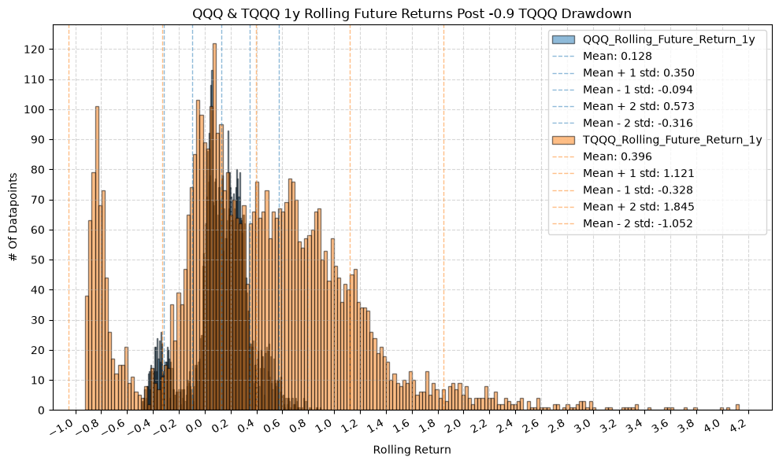
    


    
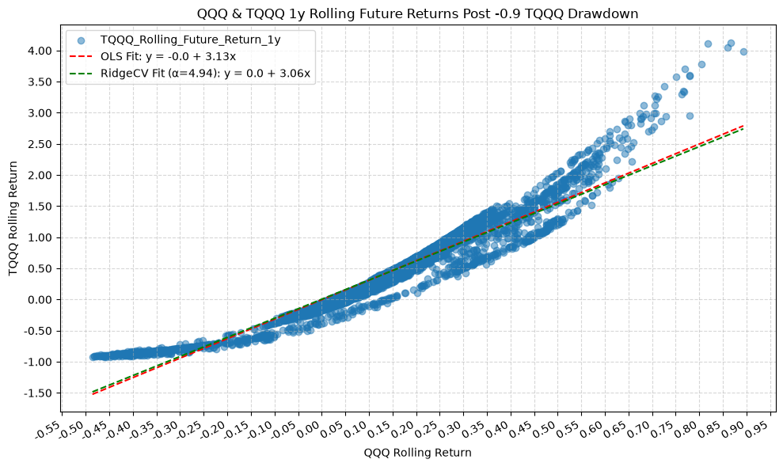
    


                                      OLS Regression Results                                 
    =========================================================================================
    Dep. Variable:     TQQQ_Rolling_Future_Return_1y   R-squared:                       0.921
    Model:                                       OLS   Adj. R-squared:                  0.921
    Method:                            Least Squares   F-statistic:                 5.687e+04
    Date:                           Mon, 23 Mar 2026   Prob (F-statistic):               0.00
    Time:                                   22:01:58   Log-Likelihood:                 835.19
    No. Observations:                           4909   AIC:                            -1666.
    Df Residuals:                               4907   BIC:                            -1653.
    Df Model:                                      1                                         
    Covariance Type:                       nonrobust                                         
    ================================================================================================
                                       coef    std err          t      P>|t|      [0.025      0.975]
    ------------------------------------------------------------------------------------------------
    const                           -0.0041      0.003     -1.223      0.222      -0.011       0.002
    QQQ_Rolling_Future_Return_1y     3.1266      0.013    238.485      0.000       3.101       3.152
    ==============================================================================
    Omnibus:                     1289.761   Durbin-Watson:                   0.048
    Prob(Omnibus):                  0.000   Jarque-Bera (JB):             5901.804
    Skew:                           1.201   Prob(JB):                         0.00
    Kurtosis:                       7.804   Cond. No.                         4.58
    ==============================================================================
    
    Notes:
    [1] Standard Errors assume that the covariance matrix of the errors is correctly specified.


    
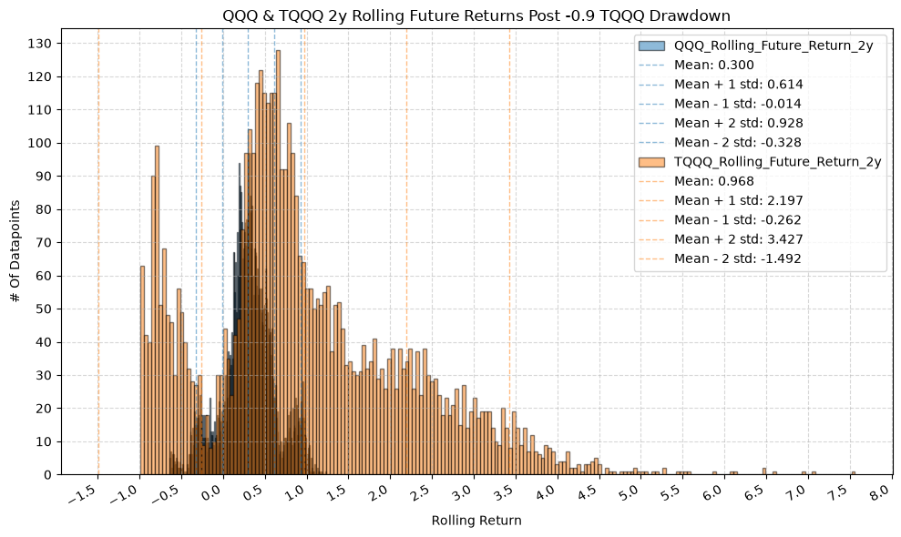
    


    
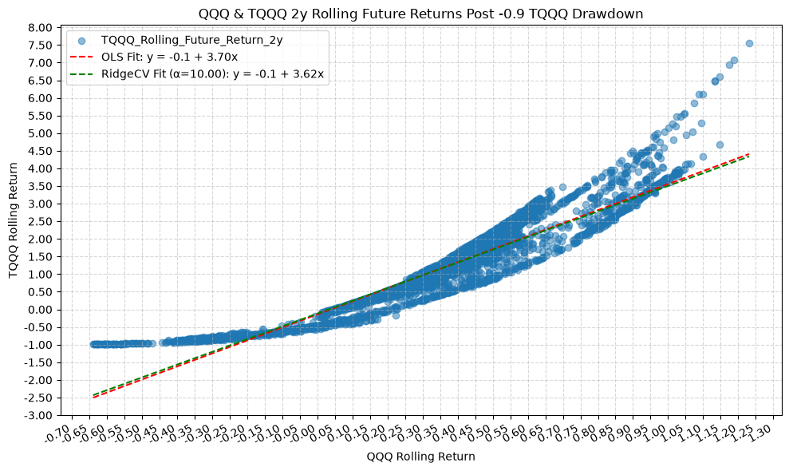
    


                                      OLS Regression Results                                 
    =========================================================================================
    Dep. Variable:     TQQQ_Rolling_Future_Return_2y   R-squared:                       0.890
    Model:                                       OLS   Adj. R-squared:                  0.890
    Method:                            Least Squares   F-statistic:                 3.983e+04
    Date:                           Mon, 23 Mar 2026   Prob (F-statistic):               0.00
    Time:                                   22:02:00   Log-Likelihood:                -2555.1
    No. Observations:                           4909   AIC:                             5114.
    Df Residuals:                               4907   BIC:                             5127.
    Df Model:                                      1                                         
    Covariance Type:                       nonrobust                                         
    ================================================================================================
                                       coef    std err          t      P>|t|      [0.025      0.975]
    ------------------------------------------------------------------------------------------------
    const                           -0.1417      0.008    -17.612      0.000      -0.157      -0.126
    QQQ_Rolling_Future_Return_2y     3.6958      0.019    199.587      0.000       3.660       3.732
    ==============================================================================
    Omnibus:                     1260.114   Durbin-Watson:                   0.024
    Prob(Omnibus):                  0.000   Jarque-Bera (JB):             4504.068
    Skew:                           1.255   Prob(JB):                         0.00
    Kurtosis:                       6.965   Cond. No.                         3.50
    ==============================================================================
    
    Notes:
    [1] Standard Errors assume that the covariance matrix of the errors is correctly specified.


    

    


    
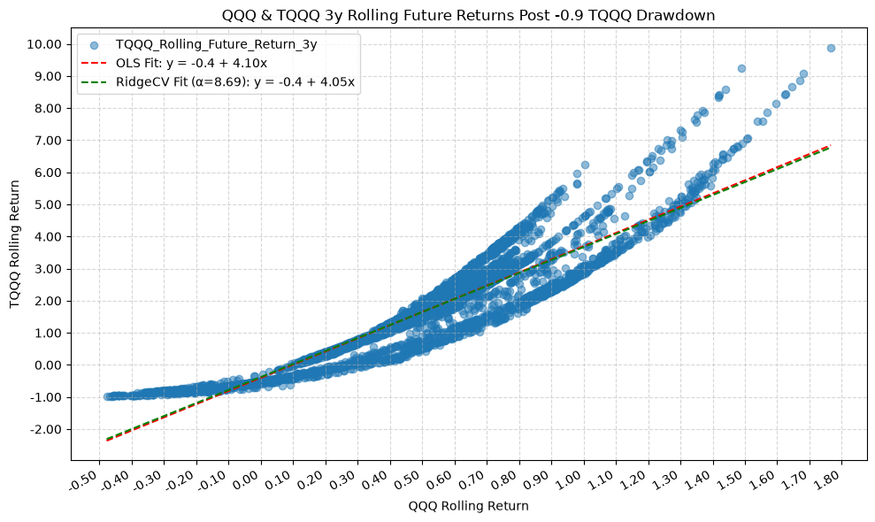
    


                                      OLS Regression Results                                 
    =========================================================================================
    Dep. Variable:     TQQQ_Rolling_Future_Return_3y   R-squared:                       0.867
    Model:                                       OLS   Adj. R-squared:                  0.867
    Method:                            Least Squares   F-statistic:                 3.200e+04
    Date:                           Mon, 23 Mar 2026   Prob (F-statistic):               0.00
    Time:                                   22:02:02   Log-Likelihood:                -4386.9
    No. Observations:                           4909   AIC:                             8778.
    Df Residuals:                               4907   BIC:                             8791.
    Df Model:                                      1                                         
    Covariance Type:                       nonrobust                                         
    ================================================================================================
                                       coef    std err          t      P>|t|      [0.025      0.975]
    ------------------------------------------------------------------------------------------------
    const                           -0.4053      0.014    -29.517      0.000      -0.432      -0.378
    QQQ_Rolling_Future_Return_3y     4.1031      0.023    178.879      0.000       4.058       4.148
    ==============================================================================
    Omnibus:                      498.122   Durbin-Watson:                   0.020
    Prob(Omnibus):                  0.000   Jarque-Bera (JB):             1119.080
    Skew:                           0.622   Prob(JB):                    9.88e-244
    Kurtosis:                       4.981   Cond. No.                         3.40
    ==============================================================================
    
    Notes:
    [1] Standard Errors assume that the covariance matrix of the errors is correctly specified.


    

    


    
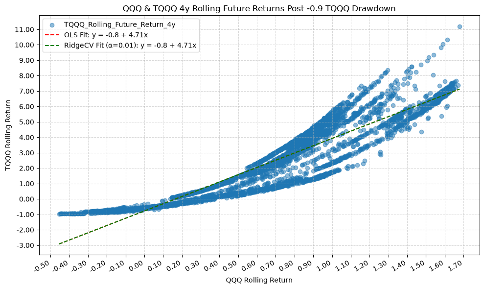
    


                                      OLS Regression Results                                 
    =========================================================================================
    Dep. Variable:     TQQQ_Rolling_Future_Return_4y   R-squared:                       0.841
    Model:                                       OLS   Adj. R-squared:                  0.841
    Method:                            Least Squares   F-statistic:                 2.561e+04
    Date:                           Mon, 23 Mar 2026   Prob (F-statistic):               0.00
    Time:                                   22:02:03   Log-Likelihood:                -6578.4
    No. Observations:                           4854   AIC:                         1.316e+04
    Df Residuals:                               4852   BIC:                         1.317e+04
    Df Model:                                      1                                         
    Covariance Type:                       nonrobust                                         
    ================================================================================================
                                       coef    std err          t      P>|t|      [0.025      0.975]
    ------------------------------------------------------------------------------------------------
    const                           -0.7780      0.024    -32.745      0.000      -0.825      -0.731
    QQQ_Rolling_Future_Return_4y     4.7051      0.029    160.037      0.000       4.647       4.763
    ==============================================================================
    Omnibus:                       37.797   Durbin-Watson:                   0.012
    Prob(Omnibus):                  0.000   Jarque-Bera (JB):               38.924
    Skew:                          -0.203   Prob(JB):                     3.53e-09
    Kurtosis:                       3.167   Cond. No.                         3.31
    ==============================================================================
    
    Notes:
    [1] Standard Errors assume that the covariance matrix of the errors is correctly specified.


    
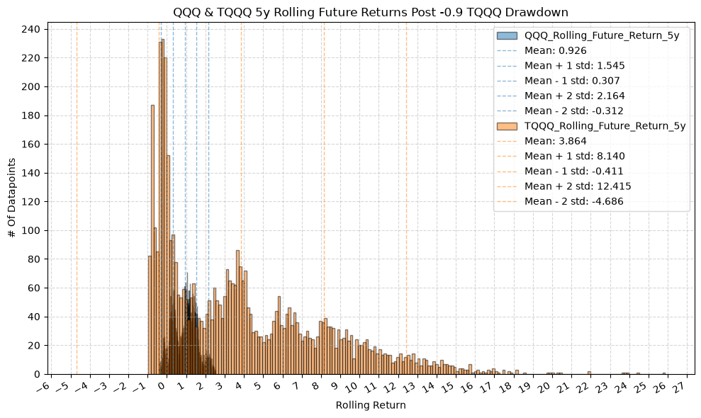
    


    
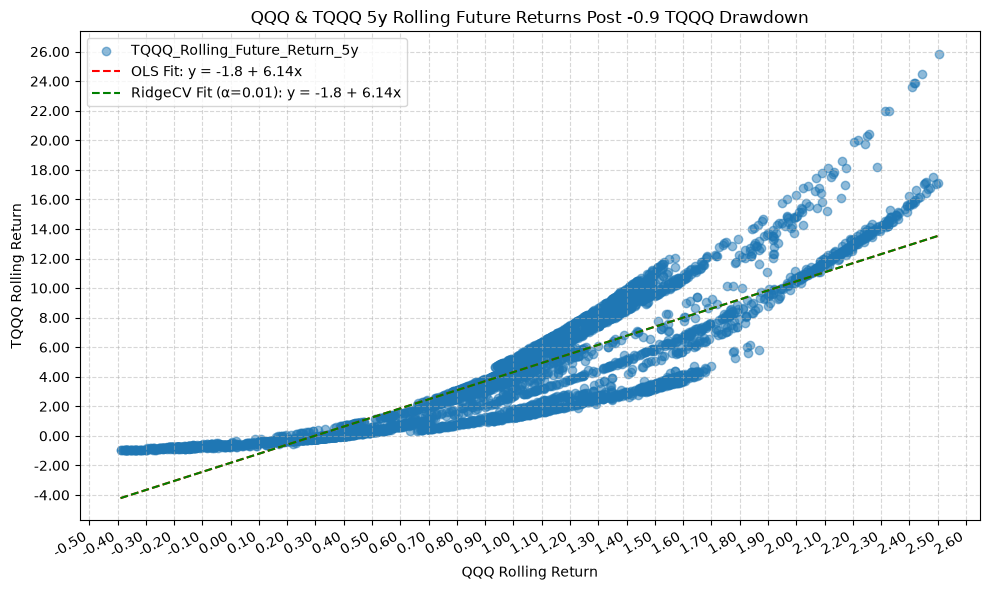
    


                                      OLS Regression Results                                 
    =========================================================================================
    Dep. Variable:     TQQQ_Rolling_Future_Return_5y   R-squared:                       0.790
    Model:                                       OLS   Adj. R-squared:                  0.790
    Method:                            Least Squares   F-statistic:                 1.825e+04
    Date:                           Mon, 23 Mar 2026   Prob (F-statistic):               0.00
    Time:                                   22:02:05   Log-Likelihood:                -10152.
    No. Observations:                           4854   AIC:                         2.031e+04
    Df Residuals:                               4852   BIC:                         2.032e+04
    Df Model:                                      1                                         
    Covariance Type:                       nonrobust                                         
    ================================================================================================
                                       coef    std err          t      P>|t|      [0.025      0.975]
    ------------------------------------------------------------------------------------------------
    const                           -1.8225      0.051    -35.999      0.000      -1.922      -1.723
    QQQ_Rolling_Future_Return_5y     6.1390      0.045    135.095      0.000       6.050       6.228
    ==============================================================================
    Omnibus:                      154.299   Durbin-Watson:                   0.011
    Prob(Omnibus):                  0.000   Jarque-Bera (JB):              381.366
    Skew:                           0.121   Prob(JB):                     1.54e-83
    Kurtosis:                       4.352   Cond. No.                         3.32
    ==============================================================================
    
    Notes:
    [1] Standard Errors assume that the covariance matrix of the errors is correctly specified.


### Rolling Returns Following Drawdowns Deviation (QQQ & TQQQ)


```python
rolling_returns_positive_future_returns = pd.DataFrame(index=rolling_windows.keys(), data=rolling_windows.values())
rolling_returns_positive_future_returns.reset_index(inplace=True)
rolling_returns_positive_future_returns.rename(columns={"index":"Period", 0:"Days"}, inplace=True)

for drawdown in drawdown_levels:
    temp = rolling_returns_drawdown_stats.loc[rolling_returns_drawdown_stats["Drawdown"] == drawdown]
    temp = temp[["Period", "Positive_Future_Percentage"]]
    temp.rename(columns={"Positive_Future_Percentage" : f"Positive_Future_Percentage_Post_{drawdown}_Drawdown"}, inplace=True)
    rolling_returns_positive_future_returns = pd.merge(rolling_returns_positive_future_returns, temp, left_on="Period", right_on="Period", how="outer")
    rolling_returns_positive_future_returns.sort_values(by="Days", ascending=True, inplace=True)

rolling_returns_positive_future_returns.drop(columns={"Days"}, inplace=True)
rolling_returns_positive_future_returns.reset_index(drop=True, inplace=True)
pandas_set_decimal_places(2)
display(rolling_returns_positive_future_returns.set_index("Period"))
```


<div>
<style scoped>
    .dataframe tbody tr th:only-of-type {
        vertical-align: middle;
    }

    .dataframe tbody tr th {
        vertical-align: top;
    }

    .dataframe thead th {
        text-align: right;
    }
</style>
<table border="1" class="dataframe">
  <thead>
    <tr style="text-align: right;">
      <th></th>
      <th>Positive_Future_Percentage_Post_-0.1_Drawdown</th>
      <th>Positive_Future_Percentage_Post_-0.2_Drawdown</th>
      <th>Positive_Future_Percentage_Post_-0.3_Drawdown</th>
      <th>Positive_Future_Percentage_Post_-0.4_Drawdown</th>
      <th>Positive_Future_Percentage_Post_-0.5_Drawdown</th>
      <th>Positive_Future_Percentage_Post_-0.6_Drawdown</th>
      <th>Positive_Future_Percentage_Post_-0.7_Drawdown</th>
      <th>Positive_Future_Percentage_Post_-0.8_Drawdown</th>
      <th>Positive_Future_Percentage_Post_-0.9_Drawdown</th>
    </tr>
    <tr>
      <th>Period</th>
      <th></th>
      <th></th>
      <th></th>
      <th></th>
      <th></th>
      <th></th>
      <th></th>
      <th></th>
      <th></th>
    </tr>
  </thead>
  <tbody>
    <tr>
      <th>1d</th>
      <td>0.54</td>
      <td>0.54</td>
      <td>0.54</td>
      <td>0.54</td>
      <td>0.54</td>
      <td>0.55</td>
      <td>0.54</td>
      <td>0.54</td>
      <td>0.54</td>
    </tr>
    <tr>
      <th>1w</th>
      <td>0.56</td>
      <td>0.56</td>
      <td>0.56</td>
      <td>0.56</td>
      <td>0.56</td>
      <td>0.57</td>
      <td>0.57</td>
      <td>0.56</td>
      <td>0.56</td>
    </tr>
    <tr>
      <th>1m</th>
      <td>0.60</td>
      <td>0.60</td>
      <td>0.59</td>
      <td>0.59</td>
      <td>0.60</td>
      <td>0.60</td>
      <td>0.60</td>
      <td>0.60</td>
      <td>0.60</td>
    </tr>
    <tr>
      <th>3m</th>
      <td>0.64</td>
      <td>0.64</td>
      <td>0.64</td>
      <td>0.64</td>
      <td>0.64</td>
      <td>0.64</td>
      <td>0.65</td>
      <td>0.65</td>
      <td>0.65</td>
    </tr>
    <tr>
      <th>6m</th>
      <td>0.66</td>
      <td>0.66</td>
      <td>0.66</td>
      <td>0.66</td>
      <td>0.66</td>
      <td>0.67</td>
      <td>0.69</td>
      <td>0.68</td>
      <td>0.68</td>
    </tr>
    <tr>
      <th>1y</th>
      <td>0.71</td>
      <td>0.71</td>
      <td>0.71</td>
      <td>0.71</td>
      <td>0.71</td>
      <td>0.71</td>
      <td>0.73</td>
      <td>0.74</td>
      <td>0.73</td>
    </tr>
    <tr>
      <th>2y</th>
      <td>0.73</td>
      <td>0.74</td>
      <td>0.75</td>
      <td>0.75</td>
      <td>0.75</td>
      <td>0.75</td>
      <td>0.78</td>
      <td>0.80</td>
      <td>0.81</td>
    </tr>
    <tr>
      <th>3y</th>
      <td>0.74</td>
      <td>0.75</td>
      <td>0.76</td>
      <td>0.76</td>
      <td>0.76</td>
      <td>0.77</td>
      <td>0.78</td>
      <td>0.78</td>
      <td>0.78</td>
    </tr>
    <tr>
      <th>4y</th>
      <td>0.73</td>
      <td>0.74</td>
      <td>0.75</td>
      <td>0.75</td>
      <td>0.75</td>
      <td>0.75</td>
      <td>0.76</td>
      <td>0.76</td>
      <td>0.75</td>
    </tr>
    <tr>
      <th>5y</th>
      <td>0.73</td>
      <td>0.74</td>
      <td>0.75</td>
      <td>0.75</td>
      <td>0.75</td>
      <td>0.75</td>
      <td>0.76</td>
      <td>0.76</td>
      <td>0.76</td>
    </tr>
  </tbody>
</table>
</div>


```python
plot_scatter(
    df=rolling_returns_positive_future_returns,
    x_plot_column="Period",
    y_plot_columns=[col for col in rolling_returns_positive_future_returns.columns if col != "Period"],
    title="TQQQ Future Return by Time Period Post Drawdown",
    x_label="Rolling Return Time Period",
    x_format="String",
    x_format_decimal_places=0,
    x_tick_spacing=1,
    x_tick_rotation=0,
    y_label="Positive Future Return Percentage",
    y_format="Decimal",
    y_format_decimal_places=2,
    y_tick_spacing="Auto",
    y_tick_rotation=0,
    plot_OLS_regression_line=False,
    OLS_column=None,
    plot_Ridge_regression_line=False,
    Ridge_column=None,
    plot_RidgeCV_regression_line=False,
    RidgeCV_column=None,
    regression_constant=False,
    grid=True,
    legend=True,
    export_plot=False,
    plot_file_name=None,
)
```


    
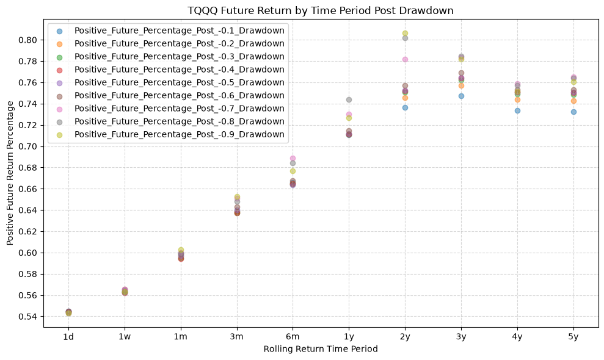
    


This plot summarizes the future rolling returns well. For rolling returns up to ~3 months *following* all drawdown levels, we see the rolling returns of TQQQ are positive ~65% of the time.

As we extend the time horizon, the percentage of positive rolling returns increases, which is consistent with the idea that the longer you hold through and post drawdown, the more likely you are to recover and achieve positive returns.

From a timing standpoint, this analysis suggests that the optimal time to buy TQQQ would be following a drawdown of 70% or more, and holding for at least 3 years. The data tells us that having a positive rolling return over time is ~75%.

One might consider the idea of allocating to TQQQ via a ladder, starting at a drawdown of 50%, and continuing to add to the position as the drawdown deepens, with the idea that the more severe the drawdown, the higher the expected future returns. However, this strategy could require enduring significant volatility, as one would be adding to the position during periods of paper losses.

## SPY & UPRO

Next, we will repeat the same analysis for SPY and UPRO, and see how the results compare to those of QQQ and TQQQ.

### Acquire & Plot Data (SPY)

First, let's get the data for SPY. If we already have the desired data, we can load it from a local pickle file. Otherwise, we can download it from Yahoo Finance using the `yf_pull_data` function.


```python
pandas_set_decimal_places(2)

yf_pull_data(
    base_directory=DATA_DIR,
    ticker="SPY",
    adjusted=False,
    source="Yahoo_Finance",
    asset_class="Exchange_Traded_Funds",
    excel_export=True,
    pickle_export=True,
    output_confirmation=False,
)

spy = load_data(
    base_directory=DATA_DIR,
    ticker="SPY",
    source="Yahoo_Finance",
    asset_class="Exchange_Traded_Funds",
    timeframe="Daily",
    file_format="pickle",
)

# Rename columns to "SPY_Close", etc.
spy = spy.rename(columns={
    "Adj Close": "SPY_Adj_Close",
    "Close": "SPY_Close",
    "High": "SPY_High",
    "Low": "SPY_Low",
    "Open": "SPY_Open",
    "Volume": "SPY_Volume"
})

display(spy)
```


<div>
<style scoped>
    .dataframe tbody tr th:only-of-type {
        vertical-align: middle;
    }

    .dataframe tbody tr th {
        vertical-align: top;
    }

    .dataframe thead th {
        text-align: right;
    }
</style>
<table border="1" class="dataframe">
  <thead>
    <tr style="text-align: right;">
      <th></th>
      <th>SPY_Adj_Close</th>
      <th>SPY_Close</th>
      <th>SPY_High</th>
      <th>SPY_Low</th>
      <th>SPY_Open</th>
      <th>SPY_Volume</th>
    </tr>
    <tr>
      <th>Date</th>
      <th></th>
      <th></th>
      <th></th>
      <th></th>
      <th></th>
      <th></th>
    </tr>
  </thead>
  <tbody>
    <tr>
      <th>1993-01-29</th>
      <td>24.18</td>
      <td>43.94</td>
      <td>43.97</td>
      <td>43.75</td>
      <td>43.97</td>
      <td>1003200</td>
    </tr>
    <tr>
      <th>1993-02-01</th>
      <td>24.35</td>
      <td>44.25</td>
      <td>44.25</td>
      <td>43.97</td>
      <td>43.97</td>
      <td>480500</td>
    </tr>
    <tr>
      <th>1993-02-02</th>
      <td>24.40</td>
      <td>44.34</td>
      <td>44.38</td>
      <td>44.12</td>
      <td>44.22</td>
      <td>201300</td>
    </tr>
    <tr>
      <th>1993-02-03</th>
      <td>24.66</td>
      <td>44.81</td>
      <td>44.84</td>
      <td>44.38</td>
      <td>44.41</td>
      <td>529400</td>
    </tr>
    <tr>
      <th>1993-02-04</th>
      <td>24.76</td>
      <td>45.00</td>
      <td>45.09</td>
      <td>44.47</td>
      <td>44.97</td>
      <td>531500</td>
    </tr>
    <tr>
      <th>...</th>
      <td>...</td>
      <td>...</td>
      <td>...</td>
      <td>...</td>
      <td>...</td>
      <td>...</td>
    </tr>
    <tr>
      <th>2026-03-16</th>
      <td>667.21</td>
      <td>669.03</td>
      <td>672.07</td>
      <td>667.12</td>
      <td>668.38</td>
      <td>82023100</td>
    </tr>
    <tr>
      <th>2026-03-17</th>
      <td>668.96</td>
      <td>670.79</td>
      <td>674.44</td>
      <td>669.70</td>
      <td>672.39</td>
      <td>87128000</td>
    </tr>
    <tr>
      <th>2026-03-18</th>
      <td>659.63</td>
      <td>661.43</td>
      <td>669.72</td>
      <td>661.19</td>
      <td>668.36</td>
      <td>82062600</td>
    </tr>
    <tr>
      <th>2026-03-19</th>
      <td>658.00</td>
      <td>659.80</td>
      <td>662.98</td>
      <td>655.17</td>
      <td>656.97</td>
      <td>111272500</td>
    </tr>
    <tr>
      <th>2026-03-20</th>
      <td>648.57</td>
      <td>648.57</td>
      <td>656.69</td>
      <td>644.72</td>
      <td>656.51</td>
      <td>163617500</td>
    </tr>
  </tbody>
</table>
<p>8342 rows × 6 columns</p>
</div>


And the plot of the time series of partially adjusted close prices:


```python
plot_time_series(
    df=spy,
    plot_start_date=None,
    plot_end_date=None,
    plot_columns=["SPY_Close"],
    title="SPY Close Price",
    x_label="Date",
    x_format="Year",
    x_tick_spacing=2,
    x_tick_rotation=30,
    y_label="Price ($)",
    y_format="Decimal",
    y_format_decimal_places=0,
    y_tick_spacing="Auto",
    y_tick_rotation=0,
    grid=True,
    legend=False,
    export_plot=False,
    plot_file_name=None,
)
```


    
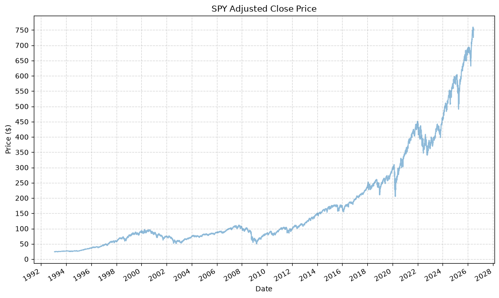
    


### Acquire & Plot Data (UPRO)

Next, UPRO:


```python
yf_pull_data(
    base_directory=DATA_DIR,
    ticker="UPRO",
    adjusted=False,
    source="Yahoo_Finance", 
    asset_class="Exchange_Traded_Funds", 
    excel_export=True,
    pickle_export=True,
    output_confirmation=False,
)
    
upro = load_data(
    base_directory=DATA_DIR,
    ticker="UPRO",
    source="Yahoo_Finance", 
    asset_class="Exchange_Traded_Funds",
    timeframe="Daily",
    file_format="pickle",
)

# Rename columns to "UPRO_Close", etc.
upro = upro.rename(columns={
    "Adj Close": "UPRO_Adj_Close",
    "Close": "UPRO_Close", 
    "High": "UPRO_High", 
    "Low": "UPRO_Low", 
    "Open": "UPRO_Open", 
    "Volume": "UPRO_Volume"
})

display(upro)
```


<div>
<style scoped>
    .dataframe tbody tr th:only-of-type {
        vertical-align: middle;
    }

    .dataframe tbody tr th {
        vertical-align: top;
    }

    .dataframe thead th {
        text-align: right;
    }
</style>
<table border="1" class="dataframe">
  <thead>
    <tr style="text-align: right;">
      <th></th>
      <th>UPRO_Adj_Close</th>
      <th>UPRO_Close</th>
      <th>UPRO_High</th>
      <th>UPRO_Low</th>
      <th>UPRO_Open</th>
      <th>UPRO_Volume</th>
    </tr>
    <tr>
      <th>Date</th>
      <th></th>
      <th></th>
      <th></th>
      <th></th>
      <th></th>
      <th></th>
    </tr>
  </thead>
  <tbody>
    <tr>
      <th>2009-06-25</th>
      <td>1.13</td>
      <td>1.21</td>
      <td>1.21</td>
      <td>1.13</td>
      <td>1.13</td>
      <td>2577600</td>
    </tr>
    <tr>
      <th>2009-06-26</th>
      <td>1.13</td>
      <td>1.20</td>
      <td>1.21</td>
      <td>1.18</td>
      <td>1.20</td>
      <td>13104000</td>
    </tr>
    <tr>
      <th>2009-06-29</th>
      <td>1.16</td>
      <td>1.23</td>
      <td>1.24</td>
      <td>1.19</td>
      <td>1.21</td>
      <td>8690400</td>
    </tr>
    <tr>
      <th>2009-06-30</th>
      <td>1.13</td>
      <td>1.20</td>
      <td>1.24</td>
      <td>1.18</td>
      <td>1.23</td>
      <td>17128800</td>
    </tr>
    <tr>
      <th>2009-07-01</th>
      <td>1.15</td>
      <td>1.22</td>
      <td>1.25</td>
      <td>1.21</td>
      <td>1.22</td>
      <td>12038400</td>
    </tr>
    <tr>
      <th>...</th>
      <td>...</td>
      <td>...</td>
      <td>...</td>
      <td>...</td>
      <td>...</td>
      <td>...</td>
    </tr>
    <tr>
      <th>2026-03-16</th>
      <td>106.10</td>
      <td>106.10</td>
      <td>107.54</td>
      <td>105.24</td>
      <td>105.83</td>
      <td>4607100</td>
    </tr>
    <tr>
      <th>2026-03-17</th>
      <td>106.92</td>
      <td>106.92</td>
      <td>108.67</td>
      <td>106.60</td>
      <td>107.70</td>
      <td>2942600</td>
    </tr>
    <tr>
      <th>2026-03-18</th>
      <td>102.47</td>
      <td>102.47</td>
      <td>106.37</td>
      <td>102.35</td>
      <td>105.74</td>
      <td>5114100</td>
    </tr>
    <tr>
      <th>2026-03-19</th>
      <td>101.63</td>
      <td>101.63</td>
      <td>103.11</td>
      <td>99.48</td>
      <td>100.27</td>
      <td>5536600</td>
    </tr>
    <tr>
      <th>2026-03-20</th>
      <td>97.09</td>
      <td>97.09</td>
      <td>100.95</td>
      <td>95.44</td>
      <td>100.88</td>
      <td>6060700</td>
    </tr>
  </tbody>
</table>
<p>4210 rows × 6 columns</p>
</div>


And the plot of the time series of partially adjusted close prices:


```python
plot_time_series(
    df=upro,
    plot_start_date=None,
    plot_end_date=None,
    plot_columns=["UPRO_Close"],
    title="UPRO Close Price",
    x_label="Date",
    x_format="Year",
    x_tick_spacing=1,
    x_tick_rotation=30,
    y_label="Price ($)",
    y_format="Decimal",
    y_format_decimal_places=0,
    y_tick_spacing="Auto",
    y_tick_rotation=0,
    grid=True,
    legend=False,
    export_plot=False,
    plot_file_name=None,
)
```


    
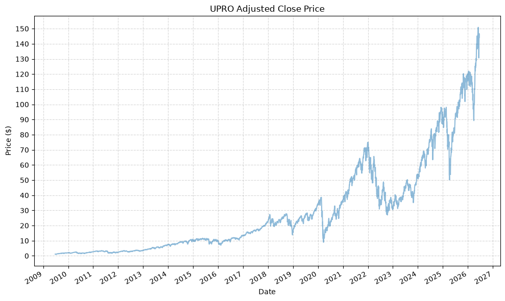
    


Looking at the close prices doesn't give us a true picture of the magnitude of the difference in returns due to the leverage. In order to see that, we need to look at the cumulative returns and the drawdowns.

 ### Calculate & Plot Cumulative Returns, Rolling Returns, and Drawdowns (SPY & UPRO)

 Next, we will calculate the cumulative returns, rolling returns, and drawdowns. This involves aligning the data to start with the inception of UPRO. For this excercise, we will not extrapolate the data for SPY back to 1993, but rather just align the data from the inception of UPRO in 2009.


```python
etfs = ["SPY", "UPRO"]

# Merge dataframes and drop rows with missing values
spy_upro_aligned = upro.merge(spy, left_index=True, right_index=True, how='left')
spy_upro_aligned = spy_upro_aligned.dropna()

# Calculate cumulative returns
for etf in etfs:
    spy_upro_aligned[f"{etf}_Return"] = spy_upro_aligned[f"{etf}_Close"].pct_change()
    spy_upro_aligned[f"{etf}_Cumulative_Return"] = (1 + spy_upro_aligned[f"{etf}_Return"]).cumprod() - 1
    spy_upro_aligned[f"{etf}_Cumulative_Return_Plus_One"] = 1 + spy_upro_aligned[f"{etf}_Cumulative_Return"]
    spy_upro_aligned[f"{etf}_Rolling_Max"] = spy_upro_aligned[f"{etf}_Cumulative_Return_Plus_One"].cummax()
    spy_upro_aligned[f"{etf}_Drawdown"] = spy_upro_aligned[f"{etf}_Cumulative_Return_Plus_One"] / spy_upro_aligned[f"{etf}_Rolling_Max"] - 1
    spy_upro_aligned.drop(columns=[f"{etf}_Cumulative_Return_Plus_One", f"{etf}_Rolling_Max"], inplace=True)

# Define rolling windows in trading days
rolling_windows = {
    '1d': 1,      # 1 day
    '1w': 5,      # 1 week (5 trading days)
    '1m': 21,     # 1 month (~21 trading days)
    '3m': 63,     # 3 months (~63 trading days)
    '6m': 126,    # 6 months (~126 trading days)
    '1y': 252,    # 1 year (~252 trading days)
    '2y': 504,    # 2 years (~504 trading days)
    '3y': 756,    # 3 years (~756 trading days)
    '4y': 1008,   # 4 years (~1008 trading days)
    '5y': 1260,   # 5 years (~1260 trading days)
}

# Calculate rolling returns for each ETF and each window
for etf in etfs:
    for period_name, window in rolling_windows.items():
        spy_upro_aligned[f"{etf}_Rolling_Return_{period_name}"] = (
            spy_upro_aligned[f"{etf}_Close"].pct_change(periods=window)
        )
        
display(spy_upro_aligned)
```


<div>
<style scoped>
    .dataframe tbody tr th:only-of-type {
        vertical-align: middle;
    }

    .dataframe tbody tr th {
        vertical-align: top;
    }

    .dataframe thead th {
        text-align: right;
    }
</style>
<table border="1" class="dataframe">
  <thead>
    <tr style="text-align: right;">
      <th></th>
      <th>UPRO_Adj_Close</th>
      <th>UPRO_Close</th>
      <th>UPRO_High</th>
      <th>UPRO_Low</th>
      <th>UPRO_Open</th>
      <th>UPRO_Volume</th>
      <th>SPY_Adj_Close</th>
      <th>SPY_Close</th>
      <th>SPY_High</th>
      <th>SPY_Low</th>
      <th>...</th>
      <th>UPRO_Rolling_Return_1d</th>
      <th>UPRO_Rolling_Return_1w</th>
      <th>UPRO_Rolling_Return_1m</th>
      <th>UPRO_Rolling_Return_3m</th>
      <th>UPRO_Rolling_Return_6m</th>
      <th>UPRO_Rolling_Return_1y</th>
      <th>UPRO_Rolling_Return_2y</th>
      <th>UPRO_Rolling_Return_3y</th>
      <th>UPRO_Rolling_Return_4y</th>
      <th>UPRO_Rolling_Return_5y</th>
    </tr>
    <tr>
      <th>Date</th>
      <th></th>
      <th></th>
      <th></th>
      <th></th>
      <th></th>
      <th></th>
      <th></th>
      <th></th>
      <th></th>
      <th></th>
      <th></th>
      <th></th>
      <th></th>
      <th></th>
      <th></th>
      <th></th>
      <th></th>
      <th></th>
      <th></th>
      <th></th>
      <th></th>
    </tr>
  </thead>
  <tbody>
    <tr>
      <th>2009-06-25</th>
      <td>1.13</td>
      <td>1.21</td>
      <td>1.21</td>
      <td>1.13</td>
      <td>1.13</td>
      <td>2577600</td>
      <td>68.20</td>
      <td>92.08</td>
      <td>92.17</td>
      <td>89.57</td>
      <td>...</td>
      <td>NaN</td>
      <td>NaN</td>
      <td>NaN</td>
      <td>NaN</td>
      <td>NaN</td>
      <td>NaN</td>
      <td>NaN</td>
      <td>NaN</td>
      <td>NaN</td>
      <td>NaN</td>
    </tr>
    <tr>
      <th>2009-06-26</th>
      <td>1.13</td>
      <td>1.20</td>
      <td>1.21</td>
      <td>1.18</td>
      <td>1.20</td>
      <td>13104000</td>
      <td>68.03</td>
      <td>91.84</td>
      <td>92.24</td>
      <td>91.27</td>
      <td>...</td>
      <td>-0.01</td>
      <td>NaN</td>
      <td>NaN</td>
      <td>NaN</td>
      <td>NaN</td>
      <td>NaN</td>
      <td>NaN</td>
      <td>NaN</td>
      <td>NaN</td>
      <td>NaN</td>
    </tr>
    <tr>
      <th>2009-06-29</th>
      <td>1.16</td>
      <td>1.23</td>
      <td>1.24</td>
      <td>1.19</td>
      <td>1.21</td>
      <td>8690400</td>
      <td>68.66</td>
      <td>92.70</td>
      <td>92.82</td>
      <td>91.60</td>
      <td>...</td>
      <td>0.03</td>
      <td>NaN</td>
      <td>NaN</td>
      <td>NaN</td>
      <td>NaN</td>
      <td>NaN</td>
      <td>NaN</td>
      <td>NaN</td>
      <td>NaN</td>
      <td>NaN</td>
    </tr>
    <tr>
      <th>2009-06-30</th>
      <td>1.13</td>
      <td>1.20</td>
      <td>1.24</td>
      <td>1.18</td>
      <td>1.23</td>
      <td>17128800</td>
      <td>68.11</td>
      <td>91.95</td>
      <td>93.06</td>
      <td>91.27</td>
      <td>...</td>
      <td>-0.02</td>
      <td>NaN</td>
      <td>NaN</td>
      <td>NaN</td>
      <td>NaN</td>
      <td>NaN</td>
      <td>NaN</td>
      <td>NaN</td>
      <td>NaN</td>
      <td>NaN</td>
    </tr>
    <tr>
      <th>2009-07-01</th>
      <td>1.15</td>
      <td>1.22</td>
      <td>1.25</td>
      <td>1.21</td>
      <td>1.22</td>
      <td>12038400</td>
      <td>68.39</td>
      <td>92.33</td>
      <td>93.23</td>
      <td>92.21</td>
      <td>...</td>
      <td>0.01</td>
      <td>NaN</td>
      <td>NaN</td>
      <td>NaN</td>
      <td>NaN</td>
      <td>NaN</td>
      <td>NaN</td>
      <td>NaN</td>
      <td>NaN</td>
      <td>NaN</td>
    </tr>
    <tr>
      <th>...</th>
      <td>...</td>
      <td>...</td>
      <td>...</td>
      <td>...</td>
      <td>...</td>
      <td>...</td>
      <td>...</td>
      <td>...</td>
      <td>...</td>
      <td>...</td>
      <td>...</td>
      <td>...</td>
      <td>...</td>
      <td>...</td>
      <td>...</td>
      <td>...</td>
      <td>...</td>
      <td>...</td>
      <td>...</td>
      <td>...</td>
      <td>...</td>
    </tr>
    <tr>
      <th>2026-03-16</th>
      <td>106.10</td>
      <td>106.10</td>
      <td>107.54</td>
      <td>105.24</td>
      <td>105.83</td>
      <td>4607100</td>
      <td>667.21</td>
      <td>669.03</td>
      <td>672.07</td>
      <td>667.12</td>
      <td>...</td>
      <td>0.03</td>
      <td>-0.04</td>
      <td>-0.07</td>
      <td>-0.11</td>
      <td>-0.01</td>
      <td>0.49</td>
      <td>0.61</td>
      <td>2.13</td>
      <td>1.13</td>
      <td>1.53</td>
    </tr>
    <tr>
      <th>2026-03-17</th>
      <td>106.92</td>
      <td>106.92</td>
      <td>108.67</td>
      <td>106.60</td>
      <td>107.70</td>
      <td>2942600</td>
      <td>668.96</td>
      <td>670.79</td>
      <td>674.44</td>
      <td>669.70</td>
      <td>...</td>
      <td>0.01</td>
      <td>-0.03</td>
      <td>-0.06</td>
      <td>-0.08</td>
      <td>-0.02</td>
      <td>0.42</td>
      <td>0.57</td>
      <td>2.30</td>
      <td>0.98</td>
      <td>1.51</td>
    </tr>
    <tr>
      <th>2026-03-18</th>
      <td>102.47</td>
      <td>102.47</td>
      <td>106.37</td>
      <td>102.35</td>
      <td>105.74</td>
      <td>5114100</td>
      <td>659.63</td>
      <td>661.43</td>
      <td>669.72</td>
      <td>661.19</td>
      <td>...</td>
      <td>-0.04</td>
      <td>-0.07</td>
      <td>-0.10</td>
      <td>-0.11</td>
      <td>-0.05</td>
      <td>0.33</td>
      <td>0.51</td>
      <td>2.18</td>
      <td>0.93</td>
      <td>1.33</td>
    </tr>
    <tr>
      <th>2026-03-19</th>
      <td>101.63</td>
      <td>101.63</td>
      <td>103.11</td>
      <td>99.48</td>
      <td>100.27</td>
      <td>5536600</td>
      <td>658.00</td>
      <td>659.80</td>
      <td>662.98</td>
      <td>655.17</td>
      <td>...</td>
      <td>-0.01</td>
      <td>-0.03</td>
      <td>-0.12</td>
      <td>-0.11</td>
      <td>-0.06</td>
      <td>0.36</td>
      <td>0.51</td>
      <td>2.00</td>
      <td>0.99</td>
      <td>1.30</td>
    </tr>
    <tr>
      <th>2026-03-20</th>
      <td>97.09</td>
      <td>97.09</td>
      <td>100.95</td>
      <td>95.44</td>
      <td>100.88</td>
      <td>6060700</td>
      <td>648.57</td>
      <td>648.57</td>
      <td>656.69</td>
      <td>644.72</td>
      <td>...</td>
      <td>-0.04</td>
      <td>-0.06</td>
      <td>-0.15</td>
      <td>-0.12</td>
      <td>-0.11</td>
      <td>0.26</td>
      <td>0.48</td>
      <td>1.92</td>
      <td>0.94</td>
      <td>1.16</td>
    </tr>
  </tbody>
</table>
<p>4210 rows × 38 columns</p>
</div>


And now the plot for the cumulative returns:


```python
plot_time_series(
    df=spy_upro_aligned,
    plot_start_date=None,
    plot_end_date=None,
    plot_columns=["SPY_Cumulative_Return", "UPRO_Cumulative_Return"],
    title="Cumulative Returns",
    x_label="Date",
    x_format="Year",
    x_tick_spacing=1,
    x_tick_rotation=30,
    y_label="Cumulative Return",
    y_format="Decimal",
    y_format_decimal_places=0,
    y_tick_spacing="Auto",
    y_tick_rotation=0,
    grid=True,
    legend=True,
    export_plot=False,
    plot_file_name=None,
)
```


    
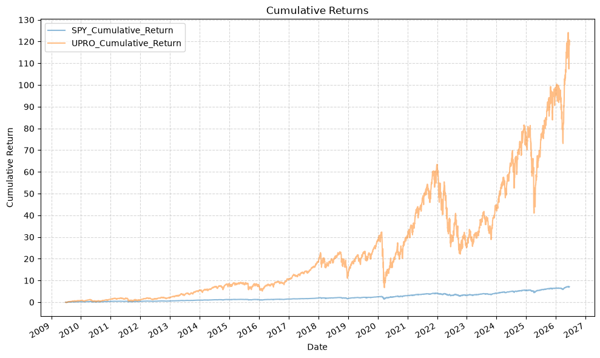
    


And the drawdown plot:


```python
plot_time_series(
    df=spy_upro_aligned,
    plot_start_date=None,
    plot_end_date=None,
    plot_columns=["SPY_Drawdown", "UPRO_Drawdown"],
    title="Drawdowns",
    x_label="Date",
    x_format="Year",
    x_tick_spacing=1,
    x_tick_rotation=30,
    y_label="Drawdown",
    y_format="Percentage",
    y_format_decimal_places=0,
    y_tick_spacing="Auto",
    y_tick_rotation=0,
    grid=True,
    legend=True,
    export_plot=False,
    plot_file_name=None,
)
```


    
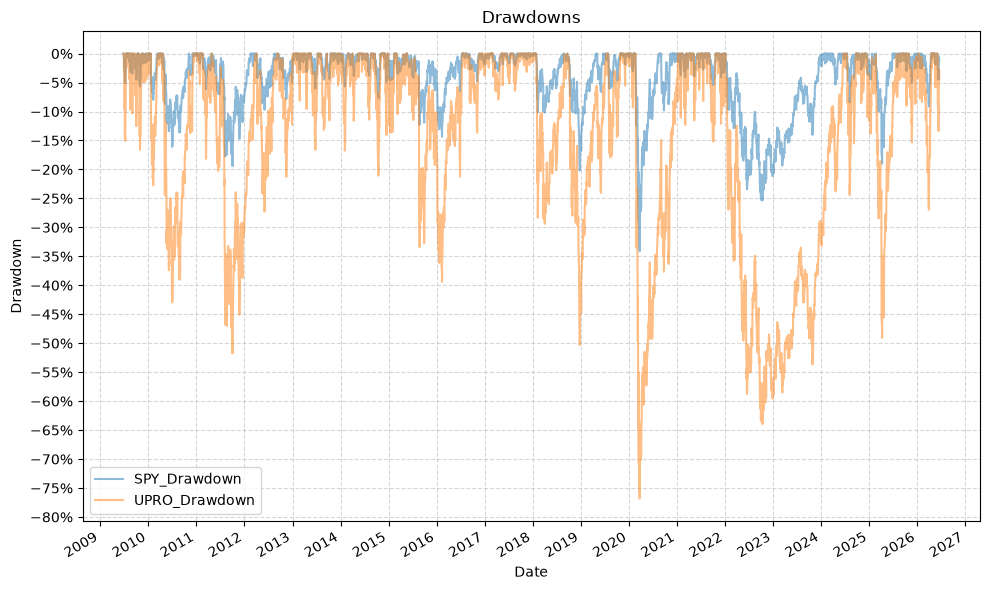
    


### Summary Statistics (SPY & UPRO)

Looking at the summary statistics further confirms our intuitions about the volatility and drawdowns.


```python
spy_sum_stats = summary_stats(
    fund_list=["SPY"],
    df=spy_upro_aligned[["SPY_Return"]],
    period="Daily",
    use_calendar_days=False,
    excel_export=False,
    pickle_export=False,
    output_confirmation=False,
)

upro_sum_stats = summary_stats(
    fund_list=["UPRO"],
    df=spy_upro_aligned[["UPRO_Return"]],
    period="Daily",
    use_calendar_days=False,
    excel_export=False,
    pickle_export=False,
    output_confirmation=False,
)

sum_stats = pd.concat([spy_sum_stats, upro_sum_stats])

display(sum_stats)
```


<div>
<style scoped>
    .dataframe tbody tr th:only-of-type {
        vertical-align: middle;
    }

    .dataframe tbody tr th {
        vertical-align: top;
    }

    .dataframe thead th {
        text-align: right;
    }
</style>
<table border="1" class="dataframe">
  <thead>
    <tr style="text-align: right;">
      <th></th>
      <th>Annual Mean Return (Arithmetic)</th>
      <th>Annualized Volatility</th>
      <th>Annualized Sharpe Ratio</th>
      <th>CAGR (Geometric)</th>
      <th>Daily Max Return</th>
      <th>Daily Max Return (Date)</th>
      <th>Daily Min Return</th>
      <th>Daily Min Return (Date)</th>
      <th>Max Drawdown</th>
      <th>Peak</th>
      <th>Trough</th>
      <th>Recovery Date</th>
      <th>Calendar Days to Recovery</th>
      <th>MAR Ratio</th>
    </tr>
  </thead>
  <tbody>
    <tr>
      <th>SPY_Return</th>
      <td>0.13</td>
      <td>0.17</td>
      <td>0.77</td>
      <td>0.12</td>
      <td>0.11</td>
      <td>2025-04-09</td>
      <td>-0.11</td>
      <td>2020-03-16</td>
      <td>-0.34</td>
      <td>2020-02-19</td>
      <td>2020-03-23</td>
      <td>2020-08-18</td>
      <td>148</td>
      <td>0.36</td>
    </tr>
    <tr>
      <th>UPRO_Return</th>
      <td>0.40</td>
      <td>0.51</td>
      <td>0.77</td>
      <td>0.30</td>
      <td>0.28</td>
      <td>2020-03-24</td>
      <td>-0.35</td>
      <td>2020-03-16</td>
      <td>-0.77</td>
      <td>2020-02-19</td>
      <td>2020-03-23</td>
      <td>2021-01-08</td>
      <td>291</td>
      <td>0.39</td>
    </tr>
  </tbody>
</table>
</div>


### Plot Returns & Verify Beta (SPY & UPRO)

Before we look at the rolling returns, let us first verify that the daily returns for UPRO are in fact ~3x those of SPY.


```python
plot_scatter(
    df=spy_upro_aligned,
    x_plot_column="SPY_Return",
    y_plot_columns=["UPRO_Return"],
    title="SPY & UPRO Returns",
    x_label="SPY Return",
    x_format="Decimal",
    x_format_decimal_places=2,
    x_tick_spacing="Auto",
    x_tick_rotation=30,
    y_label="UPRO Return",
    y_format="Decimal",
    y_format_decimal_places=2,
    y_tick_spacing="Auto",
    y_tick_rotation=0,
    plot_OLS_regression_line=True,
    OLS_column="UPRO_Return",
    plot_Ridge_regression_line=False,
    Ridge_column=None,
    plot_RidgeCV_regression_line=True,
    RidgeCV_column="UPRO_Return",
    regression_constant=True,
    grid=True,
    legend=True,
    export_plot=False,
    plot_file_name=None,
)
```


    
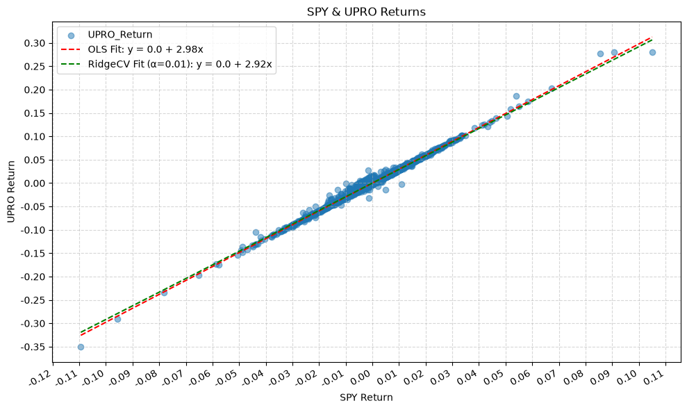
    


```python
model = run_linear_regression(
    df=spy_upro_aligned,
    x_plot_column="SPY_Return",
    y_plot_column="UPRO_Return",
    regression_model="OLS-statsmodels",
    regression_constant=True,
)

print(model.summary())
```

                                OLS Regression Results                            
    ==============================================================================
    Dep. Variable:            UPRO_Return   R-squared:                       0.994
    Model:                            OLS   Adj. R-squared:                  0.994
    Method:                 Least Squares   F-statistic:                 6.751e+05
    Date:                Mon, 23 Mar 2026   Prob (F-statistic):               0.00
    Time:                        22:02:16   Log-Likelihood:                 19172.
    No. Observations:                4209   AIC:                        -3.834e+04
    Df Residuals:                    4207   BIC:                        -3.833e+04
    Df Model:                           1                                         
    Covariance Type:            nonrobust                                         
    ==============================================================================
                     coef    std err          t      P>|t|      [0.025      0.975]
    ------------------------------------------------------------------------------
    const        1.83e-05   3.93e-05      0.466      0.641   -5.87e-05    9.53e-05
    SPY_Return     2.9758      0.004    821.652      0.000       2.969       2.983
    ==============================================================================
    Omnibus:                     2682.534   Durbin-Watson:                   2.589
    Prob(Omnibus):                  0.000   Jarque-Bera (JB):           515898.895
    Skew:                           1.985   Prob(JB):                         0.00
    Kurtosis:                      57.092   Cond. No.                         92.3
    ==============================================================================
    
    Notes:
    [1] Standard Errors assume that the covariance matrix of the errors is correctly specified.


Similar to QQQ/TQQQ, this plot makes sense and we can see that there is a strong clustering of points, but we double check with the regression, regressing the UPRO daily return (y) on the SPY daily return (X).

### Extrapolate Data (SPY & UPRO)

We will now extrapolate the returns of SPY to backfill the data from the inception of SPY in 1993 to the inception of UPRO in 2009. For this, we'll use the coefficient of 2.98 that we found in the regression results above.


```python
# Set leverage multiplier based on regression coefficient
LEVERAGE_MULTIPLIER = model.params[1]

# Merge dataframes and extrapolate return values for SPY back to 1993 using the leverage multiplier
spy_upro_extrap = spy[["SPY_Close"]].merge(upro[["UPRO_Close"]], left_index=True, right_index=True, how='left')

etfs = ["SPY", "UPRO"]

# Calculate cumulative returns
for etf in etfs:
    spy_upro_extrap[f"{etf}_Return"] = spy_upro_extrap[f"{etf}_Close"].pct_change()

# Extrapolate UPRO returns for missing values
spy_upro_extrap["UPRO_Return"] = spy_upro_extrap["UPRO_Return"].fillna(LEVERAGE_MULTIPLIER * spy_upro_extrap["SPY_Return"])

# Find the first valid UPRO_Close index and value
first_valid_idx = spy_upro_extrap['UPRO_Close'].first_valid_index()
print(first_valid_idx)
first_valid_price = spy_upro_extrap.loc[first_valid_idx, 'UPRO_Close']
print(first_valid_price)
```

    2009-06-25 00:00:00
    1.205556035041809


Before we extrapolate, let's first look at the data we have for SPY and UPRO around the inception of UPRO in 2009:


```python
# Check values around the first valid index
pandas_set_decimal_places(4)
display(spy_upro_extrap.loc["2009-06-20":"2009-06-30"])
```


<div>
<style scoped>
    .dataframe tbody tr th:only-of-type {
        vertical-align: middle;
    }

    .dataframe tbody tr th {
        vertical-align: top;
    }

    .dataframe thead th {
        text-align: right;
    }
</style>
<table border="1" class="dataframe">
  <thead>
    <tr style="text-align: right;">
      <th></th>
      <th>SPY_Close</th>
      <th>UPRO_Close</th>
      <th>SPY_Return</th>
      <th>UPRO_Return</th>
    </tr>
    <tr>
      <th>Date</th>
      <th></th>
      <th></th>
      <th></th>
      <th></th>
    </tr>
  </thead>
  <tbody>
    <tr>
      <th>2009-06-22</th>
      <td>89.2800</td>
      <td>NaN</td>
      <td>-0.0300</td>
      <td>-0.0892</td>
    </tr>
    <tr>
      <th>2009-06-23</th>
      <td>89.3500</td>
      <td>NaN</td>
      <td>0.0008</td>
      <td>0.0023</td>
    </tr>
    <tr>
      <th>2009-06-24</th>
      <td>90.1200</td>
      <td>NaN</td>
      <td>0.0086</td>
      <td>0.0256</td>
    </tr>
    <tr>
      <th>2009-06-25</th>
      <td>92.0800</td>
      <td>1.2056</td>
      <td>0.0217</td>
      <td>0.0647</td>
    </tr>
    <tr>
      <th>2009-06-26</th>
      <td>91.8400</td>
      <td>1.1993</td>
      <td>-0.0026</td>
      <td>-0.0052</td>
    </tr>
    <tr>
      <th>2009-06-29</th>
      <td>92.7000</td>
      <td>1.2333</td>
      <td>0.0094</td>
      <td>0.0284</td>
    </tr>
    <tr>
      <th>2009-06-30</th>
      <td>91.9500</td>
      <td>1.2039</td>
      <td>-0.0081</td>
      <td>-0.0239</td>
    </tr>
  </tbody>
</table>
</div>


Now, backfill the data for the UPRO close price:


```python
# Iterate through the dataframe backwards
for i in range(spy_upro_extrap.index.get_loc(first_valid_idx) - 1, -1, -1):
    
    # The return that led to the price the next day
    current_return = spy_upro_extrap.iloc[i + 1]['UPRO_Return']

    # Get the next day's price
    next_price = spy_upro_extrap.iloc[i + 1]['UPRO_Close']
    
    # Price_{t} = Price_{t+1} / (1 + Return_{t})
    spy_upro_extrap.loc[spy_upro_extrap.index[i], 'UPRO_Close'] = next_price / (1 + current_return)
```

Finally, confirm the values are correct:


```python
# Confirm values around the first valid index after extrapolation
display(spy_upro_extrap.loc["2009-06-20":"2009-06-30"])
```


<div>
<style scoped>
    .dataframe tbody tr th:only-of-type {
        vertical-align: middle;
    }

    .dataframe tbody tr th {
        vertical-align: top;
    }

    .dataframe thead th {
        text-align: right;
    }
</style>
<table border="1" class="dataframe">
  <thead>
    <tr style="text-align: right;">
      <th></th>
      <th>SPY_Close</th>
      <th>UPRO_Close</th>
      <th>SPY_Return</th>
      <th>UPRO_Return</th>
    </tr>
    <tr>
      <th>Date</th>
      <th></th>
      <th></th>
      <th></th>
      <th></th>
    </tr>
  </thead>
  <tbody>
    <tr>
      <th>2009-06-22</th>
      <td>89.2800</td>
      <td>1.1014</td>
      <td>-0.0300</td>
      <td>-0.0892</td>
    </tr>
    <tr>
      <th>2009-06-23</th>
      <td>89.3500</td>
      <td>1.1040</td>
      <td>0.0008</td>
      <td>0.0023</td>
    </tr>
    <tr>
      <th>2009-06-24</th>
      <td>90.1200</td>
      <td>1.1323</td>
      <td>0.0086</td>
      <td>0.0256</td>
    </tr>
    <tr>
      <th>2009-06-25</th>
      <td>92.0800</td>
      <td>1.2056</td>
      <td>0.0217</td>
      <td>0.0647</td>
    </tr>
    <tr>
      <th>2009-06-26</th>
      <td>91.8400</td>
      <td>1.1993</td>
      <td>-0.0026</td>
      <td>-0.0052</td>
    </tr>
    <tr>
      <th>2009-06-29</th>
      <td>92.7000</td>
      <td>1.2333</td>
      <td>0.0094</td>
      <td>0.0284</td>
    </tr>
    <tr>
      <th>2009-06-30</th>
      <td>91.9500</td>
      <td>1.2039</td>
      <td>-0.0081</td>
      <td>-0.0239</td>
    </tr>
  </tbody>
</table>
</div>


And the complete DataFrame with the extrapolated values:


```python
pandas_set_decimal_places(2)
display(spy_upro_extrap)
```


<div>
<style scoped>
    .dataframe tbody tr th:only-of-type {
        vertical-align: middle;
    }

    .dataframe tbody tr th {
        vertical-align: top;
    }

    .dataframe thead th {
        text-align: right;
    }
</style>
<table border="1" class="dataframe">
  <thead>
    <tr style="text-align: right;">
      <th></th>
      <th>SPY_Close</th>
      <th>UPRO_Close</th>
      <th>SPY_Return</th>
      <th>UPRO_Return</th>
    </tr>
    <tr>
      <th>Date</th>
      <th></th>
      <th></th>
      <th></th>
      <th></th>
    </tr>
  </thead>
  <tbody>
    <tr>
      <th>1993-01-29</th>
      <td>43.94</td>
      <td>0.93</td>
      <td>NaN</td>
      <td>NaN</td>
    </tr>
    <tr>
      <th>1993-02-01</th>
      <td>44.25</td>
      <td>0.95</td>
      <td>0.01</td>
      <td>0.02</td>
    </tr>
    <tr>
      <th>1993-02-02</th>
      <td>44.34</td>
      <td>0.95</td>
      <td>0.00</td>
      <td>0.01</td>
    </tr>
    <tr>
      <th>1993-02-03</th>
      <td>44.81</td>
      <td>0.98</td>
      <td>0.01</td>
      <td>0.03</td>
    </tr>
    <tr>
      <th>1993-02-04</th>
      <td>45.00</td>
      <td>0.99</td>
      <td>0.00</td>
      <td>0.01</td>
    </tr>
    <tr>
      <th>...</th>
      <td>...</td>
      <td>...</td>
      <td>...</td>
      <td>...</td>
    </tr>
    <tr>
      <th>2026-03-16</th>
      <td>669.03</td>
      <td>106.10</td>
      <td>0.01</td>
      <td>0.03</td>
    </tr>
    <tr>
      <th>2026-03-17</th>
      <td>670.79</td>
      <td>106.92</td>
      <td>0.00</td>
      <td>0.01</td>
    </tr>
    <tr>
      <th>2026-03-18</th>
      <td>661.43</td>
      <td>102.47</td>
      <td>-0.01</td>
      <td>-0.04</td>
    </tr>
    <tr>
      <th>2026-03-19</th>
      <td>659.80</td>
      <td>101.63</td>
      <td>-0.00</td>
      <td>-0.01</td>
    </tr>
    <tr>
      <th>2026-03-20</th>
      <td>648.57</td>
      <td>97.09</td>
      <td>-0.02</td>
      <td>-0.04</td>
    </tr>
  </tbody>
</table>
<p>8342 rows × 4 columns</p>
</div>


After the extrapolation, we now have the following plots for the prices, cumulative returns, and drawdowns:


```python
etfs = ["SPY", "UPRO"]

# Calculate cumulative returns
for etf in etfs:
    spy_upro_extrap[f"{etf}_Return"] = spy_upro_extrap[f"{etf}_Close"].pct_change()
    spy_upro_extrap[f"{etf}_Cumulative_Return"] = (1 + spy_upro_extrap[f"{etf}_Return"]).cumprod() - 1
    spy_upro_extrap[f"{etf}_Cumulative_Return_Plus_One"] = 1 + spy_upro_extrap[f"{etf}_Cumulative_Return"]
    spy_upro_extrap[f"{etf}_Rolling_Max"] = spy_upro_extrap[f"{etf}_Cumulative_Return_Plus_One"].cummax()
    spy_upro_extrap[f"{etf}_Drawdown"] = spy_upro_extrap[f"{etf}_Cumulative_Return_Plus_One"] / spy_upro_extrap[f"{etf}_Rolling_Max"] - 1
    spy_upro_extrap.drop(columns=[f"{etf}_Cumulative_Return_Plus_One", f"{etf}_Rolling_Max"], inplace=True)
```


```python
plot_time_series(
    df=spy_upro_extrap,
    plot_start_date=None,
    plot_end_date=None,
    plot_columns=["SPY_Close"],
    title="SPY Close Price",
    x_label="Date",
    x_format="Year",
    x_tick_spacing=2,
    x_tick_rotation=30,
    y_label="Price ($)",
    y_format="Decimal",
    y_format_decimal_places=0,
    y_tick_spacing="Auto",
    y_tick_rotation=0,
    grid=True,
    legend=False,
    export_plot=False,
    plot_file_name=None,
)
```


    
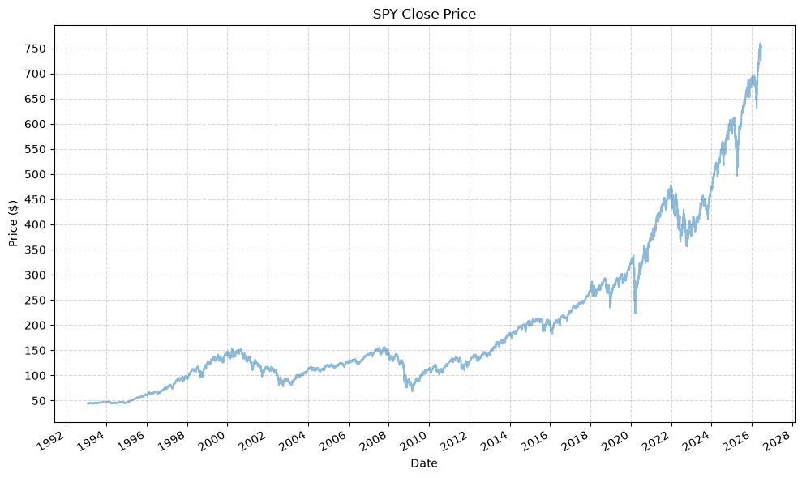
    


```python
plot_time_series(
    df=spy_upro_extrap,
    plot_start_date=None,
    plot_end_date=None,
    plot_columns=["UPRO_Close"],
    title="UPRO Close Price",
    x_label="Date",
    x_format="Year",
    x_tick_spacing=2,
    x_tick_rotation=30,
    y_label="Price ($)",
    y_format="Decimal",
    y_format_decimal_places=0,
    y_tick_spacing="Auto",
    y_tick_rotation=0,
    grid=True,
    legend=False,
    export_plot=False,
    plot_file_name=None,
)
```


    

    


```python
plot_time_series(
    df=spy_upro_extrap,
    plot_start_date=None,
    plot_end_date=None,
    plot_columns=["SPY_Cumulative_Return", "UPRO_Cumulative_Return"],
    title="Cumulative Returns",
    x_label="Date",
    x_format="Year",
    x_tick_spacing=2,
    x_tick_rotation=30,
    y_label="Cumulative Return",
    y_format="Decimal",
    y_format_decimal_places=0,
    y_tick_spacing="Auto",
    y_tick_rotation=0,
    grid=True,
    legend=True,
    export_plot=False,
    plot_file_name=None,
)
```


    

    


```python
plot_time_series(
    df=spy_upro_extrap,
    plot_start_date=None,
    plot_end_date=None,
    plot_columns=["SPY_Drawdown", "UPRO_Drawdown"],
    title="Drawdowns",
    x_label="Date",
    x_format="Year",
    x_tick_spacing=1,
    x_tick_rotation=30,
    y_label="Drawdown",
    y_format="Percentage",
    y_format_decimal_places=0,
    y_tick_spacing="Auto",
    y_tick_rotation=0,
    grid=True,
    legend=True,
    export_plot=False,
    plot_file_name=None,
)
```


    

    


```python
spy_extrap_sum_stats = summary_stats(
    fund_list=["SPY"],
    df=spy_upro_extrap[["SPY_Return"]],
    period="Daily",
    use_calendar_days=False,
    excel_export=False,
    pickle_export=False,
    output_confirmation=False,
)

upro_extrap_sum_stats = summary_stats(
    fund_list=["UPRO"],
    df=spy_upro_extrap[["UPRO_Return"]],
    period="Daily",
    use_calendar_days=False,
    excel_export=False,
    pickle_export=False,
    output_confirmation=False,
)

sum_stats = pd.concat([spy_sum_stats, upro_sum_stats, spy_extrap_sum_stats, upro_extrap_sum_stats])
sum_stats.index = ["SPY (2009 - Present)", "UPRO (2009 - Present)", "SPY (1993 - Present)", "UPRO Extrapolated (1993 - Present)"]

display(sum_stats)
```


<div>
<style scoped>
    .dataframe tbody tr th:only-of-type {
        vertical-align: middle;
    }

    .dataframe tbody tr th {
        vertical-align: top;
    }

    .dataframe thead th {
        text-align: right;
    }
</style>
<table border="1" class="dataframe">
  <thead>
    <tr style="text-align: right;">
      <th></th>
      <th>Annual Mean Return (Arithmetic)</th>
      <th>Annualized Volatility</th>
      <th>Annualized Sharpe Ratio</th>
      <th>CAGR (Geometric)</th>
      <th>Daily Max Return</th>
      <th>Daily Max Return (Date)</th>
      <th>Daily Min Return</th>
      <th>Daily Min Return (Date)</th>
      <th>Max Drawdown</th>
      <th>Peak</th>
      <th>Trough</th>
      <th>Recovery Date</th>
      <th>Calendar Days to Recovery</th>
      <th>MAR Ratio</th>
    </tr>
  </thead>
  <tbody>
    <tr>
      <th>SPY (2009 - Present)</th>
      <td>0.13</td>
      <td>0.17</td>
      <td>0.77</td>
      <td>0.12</td>
      <td>0.11</td>
      <td>2025-04-09</td>
      <td>-0.11</td>
      <td>2020-03-16</td>
      <td>-0.34</td>
      <td>2020-02-19</td>
      <td>2020-03-23</td>
      <td>2020-08-18</td>
      <td>148</td>
      <td>0.36</td>
    </tr>
    <tr>
      <th>UPRO (2009 - Present)</th>
      <td>0.40</td>
      <td>0.51</td>
      <td>0.77</td>
      <td>0.30</td>
      <td>0.28</td>
      <td>2020-03-24</td>
      <td>-0.35</td>
      <td>2020-03-16</td>
      <td>-0.77</td>
      <td>2020-02-19</td>
      <td>2020-03-23</td>
      <td>2021-01-08</td>
      <td>291</td>
      <td>0.39</td>
    </tr>
    <tr>
      <th>SPY (1993 - Present)</th>
      <td>0.10</td>
      <td>0.19</td>
      <td>0.53</td>
      <td>0.08</td>
      <td>0.15</td>
      <td>2008-10-13</td>
      <td>-0.11</td>
      <td>2020-03-16</td>
      <td>-0.56</td>
      <td>2007-10-09</td>
      <td>2009-03-09</td>
      <td>2013-03-14</td>
      <td>1466</td>
      <td>0.15</td>
    </tr>
    <tr>
      <th>UPRO Extrapolated (1993 - Present)</th>
      <td>0.30</td>
      <td>0.56</td>
      <td>0.53</td>
      <td>0.15</td>
      <td>0.43</td>
      <td>2008-10-13</td>
      <td>-0.35</td>
      <td>2020-03-16</td>
      <td>-0.98</td>
      <td>2000-03-24</td>
      <td>2009-03-09</td>
      <td>2017-11-30</td>
      <td>3188</td>
      <td>0.15</td>
    </tr>
  </tbody>
</table>
</div>


Interestingly, the maximum drawdown for UPRO is not as severe as that of TQQQ, which may be due to that SPY has not had the same extreme return profile as QQQ. This highlights the importance of the underlying asset's return profile on the performance of leveraged ETFs.

### Plot Rolling Returns (SPY & UPRO)

Next, we will consider the following:

* Histogram and scatter plots of the rolling returns of SPY and UPRO
* Regressions to establish a "leverage factor" for the rolling returns
* The deviation from a 3x return for each time period

For this set of regressions, we will also allow the constant. First, we need the rolling returns for various time periods:


```python
# Define rolling windows in trading days
rolling_windows = {
    '1d': 1,      # 1 day
    '1w': 5,      # 1 week (5 trading days)
    '1m': 21,     # 1 month (~21 trading days)
    '3m': 63,     # 3 months (~63 trading days)
    '6m': 126,    # 6 months (~126 trading days)
    '1y': 252,    # 1 year (~252 trading days)
    '2y': 504,    # 2 years (~504 trading days)
    '3y': 756,    # 3 years (~756 trading days)
    '4y': 1008,   # 4 years (~1008 trading days)
    '5y': 1260,   # 5 years (~1260 trading days)
}

# Calculate rolling returns for each ETF and each window
for etf in etfs:
    for period_name, window in rolling_windows.items():
        spy_upro_extrap[f"{etf}_Rolling_Return_{period_name}"] = (
            spy_upro_extrap[f"{etf}_Close"].pct_change(periods=window)
        )
```

This gives us the following series of histograms, scatter plots, and regression model results:


```python
# Create a dataframe to hold rolling returns stats
rolling_returns_stats = pd.DataFrame()

for period_name, window in rolling_windows.items():
    plot_histogram(
        df=spy_upro_extrap,
        plot_columns=[f"SPY_Rolling_Return_{period_name}", f"UPRO_Rolling_Return_{period_name}"],
        title=f"SPY & UPRO {period_name} Rolling Returns",
        x_label="Rolling Return",
        x_tick_spacing="Auto",
        x_tick_rotation=30,
        y_label="# Of Datapoints",
        y_tick_spacing="Auto",
        y_tick_rotation=0,
        grid=True,
        legend=True,
        export_plot=False,
        plot_file_name=None,
    )

    plot_scatter(
        df=spy_upro_extrap,
        x_plot_column=f"SPY_Rolling_Return_{period_name}",
        y_plot_columns=[f"UPRO_Rolling_Return_{period_name}"],
        title=f"SPY & UPRO {period_name} Rolling Returns",
        x_label="SPY Rolling Return",
        x_format="Decimal",
        x_format_decimal_places=2,
        x_tick_spacing="Auto",
        x_tick_rotation=30,
        y_label="UPRO Rolling Return",
        y_format="Decimal",
        y_format_decimal_places=2,
        y_tick_spacing="Auto",
        y_tick_rotation=0,
        plot_OLS_regression_line=True,
        OLS_column=f"UPRO_Rolling_Return_{period_name}",
        plot_Ridge_regression_line=False,
        Ridge_column=None,
        plot_RidgeCV_regression_line=True,
        RidgeCV_column=f"UPRO_Rolling_Return_{period_name}",
        regression_constant=True,
        grid=True,
        legend=True,
        export_plot=False,
        plot_file_name=None,
    )

    # Run OLS regression with statsmodels
    model = run_linear_regression(
        df=spy_upro_extrap,
        x_plot_column=f"SPY_Rolling_Return_{period_name}",
        y_plot_column=f"UPRO_Rolling_Return_{period_name}",
        regression_model="OLS-statsmodels",
        regression_constant=True,
    )
    print(model.summary())

    # Add the regression results to the rolling returns stats dataframe
    intercept = model.params[0]
    intercept_pvalue = model.pvalues[0]   # p-value for Intercept
    slope = model.params[1]
    slope_pvalue = model.pvalues[1]       # p-value for SPY_Return
    r_squared = model.rsquared

    # Calc skew
    return_ratio = spy_upro_extrap[f'UPRO_Rolling_Return_{period_name}'] / spy_upro_extrap[f'SPY_Rolling_Return_{period_name}']
    skew = return_ratio.skew()

    # Calc conditional symmetry
    up_markets = spy_upro_extrap[spy_upro_extrap[f'SPY_Rolling_Return_{period_name}'] > 0]
    down_markets = spy_upro_extrap[spy_upro_extrap[f'SPY_Rolling_Return_{period_name}'] <= 0]

    avg_beta_up = (up_markets[f'UPRO_Rolling_Return_{period_name}'] / up_markets[f'SPY_Rolling_Return_{period_name}']).mean()
    avg_beta_down = (down_markets[f'UPRO_Rolling_Return_{period_name}'] / down_markets[f'SPY_Rolling_Return_{period_name}']).mean()

    asymmetry = avg_beta_up - avg_beta_down

    rolling_returns_slope_int = pd.DataFrame({
        "Period": period_name,
        "Intercept": [intercept],
        # "Intercept_PValue": [intercept_pvalue],
        "Slope": [slope],
        # "Slope_PValue": [slope_pvalue],
        "R_Squared": [r_squared],
        "Skew": [skew],
        "Average Upside Beta": [avg_beta_up],
        "Average Downside Beta": [avg_beta_down],
        "Asymmetry": [asymmetry]
    })

    rolling_returns_stats = pd.concat([rolling_returns_stats, rolling_returns_slope_int])
```


    
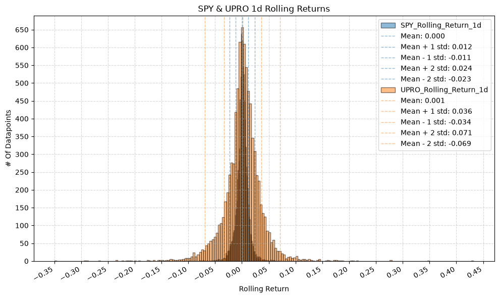
    


    
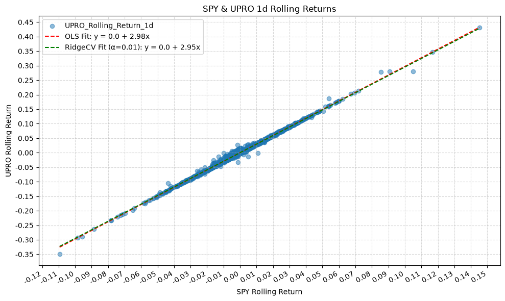
    


                                  OLS Regression Results                              
    ==================================================================================
    Dep. Variable:     UPRO_Rolling_Return_1d   R-squared:                       0.997
    Model:                                OLS   Adj. R-squared:                  0.997
    Method:                     Least Squares   F-statistic:                 3.116e+06
    Date:                    Mon, 23 Mar 2026   Prob (F-statistic):               0.00
    Time:                            22:02:20   Log-Likelihood:                 40846.
    No. Observations:                    8341   AIC:                        -8.169e+04
    Df Residuals:                        8339   BIC:                        -8.167e+04
    Df Model:                               1                                         
    Covariance Type:                nonrobust                                         
    =========================================================================================
                                coef    std err          t      P>|t|      [0.025      0.975]
    -----------------------------------------------------------------------------------------
    const                  9.233e-06   1.98e-05      0.466      0.641   -2.96e-05    4.81e-05
    SPY_Rolling_Return_1d     2.9758      0.002   1765.119      0.000       2.972       2.979
    ==============================================================================
    Omnibus:                     6872.372   Durbin-Watson:                   2.589
    Prob(Omnibus):                  0.000   Jarque-Bera (JB):          4230832.210
    Skew:                           2.810   Prob(JB):                         0.00
    Kurtosis:                     113.191   Cond. No.                         85.2
    ==============================================================================
    
    Notes:
    [1] Standard Errors assume that the covariance matrix of the errors is correctly specified.


    
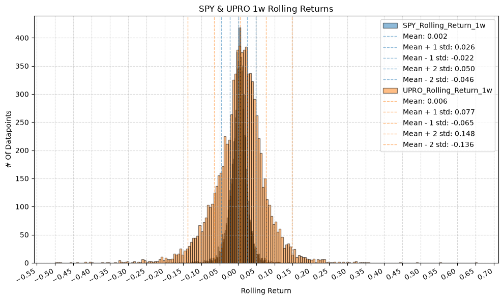
    


    
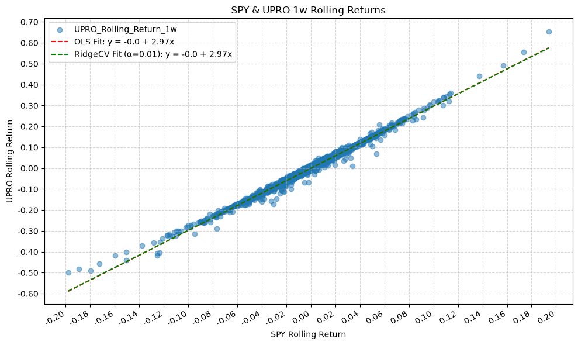
    


                                  OLS Regression Results                              
    ==================================================================================
    Dep. Variable:     UPRO_Rolling_Return_1w   R-squared:                       0.994
    Model:                                OLS   Adj. R-squared:                  0.994
    Method:                     Least Squares   F-statistic:                 1.405e+06
    Date:                    Mon, 23 Mar 2026   Prob (F-statistic):               0.00
    Time:                            22:02:22   Log-Likelihood:                 31615.
    No. Observations:                    8337   AIC:                        -6.323e+04
    Df Residuals:                        8335   BIC:                        -6.321e+04
    Df Model:                               1                                         
    Covariance Type:                nonrobust                                         
    =========================================================================================
                                coef    std err          t      P>|t|      [0.025      0.975]
    -----------------------------------------------------------------------------------------
    const                    -0.0003   5.99e-05     -4.291      0.000      -0.000      -0.000
    SPY_Rolling_Return_1w     2.9724      0.003   1185.409      0.000       2.967       2.977
    ==============================================================================
    Omnibus:                     3742.727   Durbin-Watson:                   0.955
    Prob(Omnibus):                  0.000   Jarque-Bera (JB):          1490835.699
    Skew:                          -0.846   Prob(JB):                         0.00
    Kurtosis:                      68.489   Cond. No.                         42.0
    ==============================================================================
    
    Notes:
    [1] Standard Errors assume that the covariance matrix of the errors is correctly specified.


    
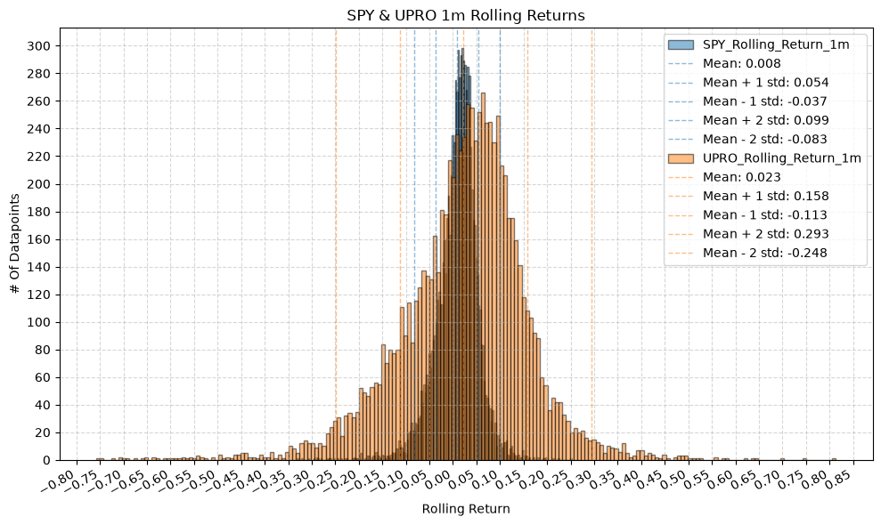
    


    
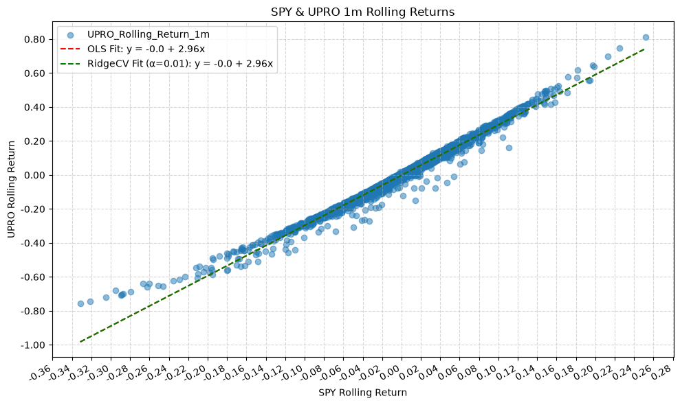
    


                                  OLS Regression Results                              
    ==================================================================================
    Dep. Variable:     UPRO_Rolling_Return_1m   R-squared:                       0.988
    Model:                                OLS   Adj. R-squared:                  0.988
    Method:                     Least Squares   F-statistic:                 6.660e+05
    Date:                    Mon, 23 Mar 2026   Prob (F-statistic):               0.00
    Time:                            22:02:23   Log-Likelihood:                 23146.
    No. Observations:                    8321   AIC:                        -4.629e+04
    Df Residuals:                        8319   BIC:                        -4.627e+04
    Df Model:                               1                                         
    Covariance Type:                nonrobust                                         
    =========================================================================================
                                coef    std err          t      P>|t|      [0.025      0.975]
    -----------------------------------------------------------------------------------------
    const                    -0.0015      0.000     -9.057      0.000      -0.002      -0.001
    SPY_Rolling_Return_1m     2.9603      0.004    816.112      0.000       2.953       2.967
    ==============================================================================
    Omnibus:                     2880.665   Durbin-Watson:                   0.314
    Prob(Omnibus):                  0.000   Jarque-Bera (JB):           856508.368
    Skew:                          -0.289   Prob(JB):                         0.00
    Kurtosis:                      52.700   Cond. No.                         22.1
    ==============================================================================
    
    Notes:
    [1] Standard Errors assume that the covariance matrix of the errors is correctly specified.


    
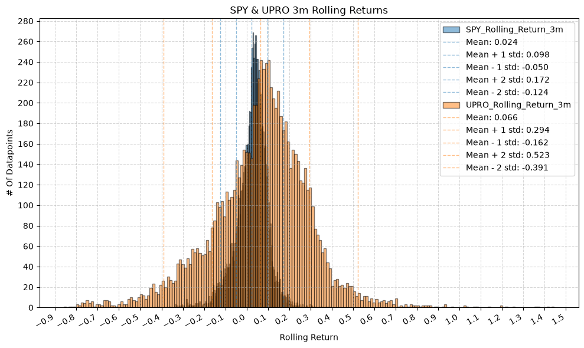
    


    

    


                                  OLS Regression Results                              
    ==================================================================================
    Dep. Variable:     UPRO_Rolling_Return_3m   R-squared:                       0.979
    Model:                                OLS   Adj. R-squared:                  0.979
    Method:                     Least Squares   F-statistic:                 3.835e+05
    Date:                    Mon, 23 Mar 2026   Prob (F-statistic):               0.00
    Time:                            22:02:25   Log-Likelihood:                 16431.
    No. Observations:                    8279   AIC:                        -3.286e+04
    Df Residuals:                        8277   BIC:                        -3.284e+04
    Df Model:                               1                                         
    Covariance Type:                nonrobust                                         
    =========================================================================================
                                coef    std err          t      P>|t|      [0.025      0.975]
    -----------------------------------------------------------------------------------------
    const                    -0.0068      0.000    -17.760      0.000      -0.008      -0.006
    SPY_Rolling_Return_3m     3.0481      0.005    619.270      0.000       3.038       3.058
    ==============================================================================
    Omnibus:                     2415.718   Durbin-Watson:                   0.136
    Prob(Omnibus):                  0.000   Jarque-Bera (JB):           133042.469
    Skew:                           0.583   Prob(JB):                         0.00
    Kurtosis:                      22.604   Cond. No.                         13.5
    ==============================================================================
    
    Notes:
    [1] Standard Errors assume that the covariance matrix of the errors is correctly specified.


    
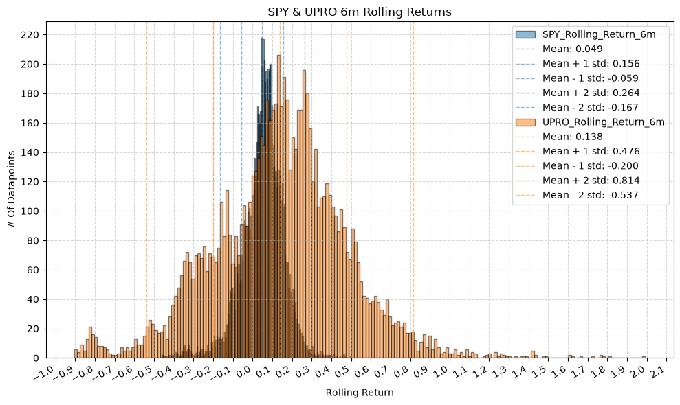
    


    
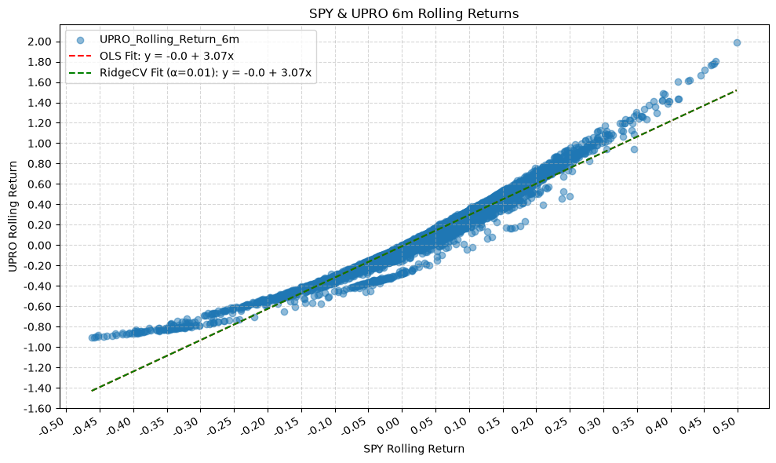
    


                                  OLS Regression Results                              
    ==================================================================================
    Dep. Variable:     UPRO_Rolling_Return_6m   R-squared:                       0.957
    Model:                                OLS   Adj. R-squared:                  0.957
    Method:                     Least Squares   F-statistic:                 1.831e+05
    Date:                    Mon, 23 Mar 2026   Prob (F-statistic):               0.00
    Time:                            22:02:27   Log-Likelihood:                 10169.
    No. Observations:                    8216   AIC:                        -2.033e+04
    Df Residuals:                        8214   BIC:                        -2.032e+04
    Df Model:                               1                                         
    Covariance Type:                nonrobust                                         
    =========================================================================================
                                coef    std err          t      P>|t|      [0.025      0.975]
    -----------------------------------------------------------------------------------------
    const                    -0.0110      0.001    -12.928      0.000      -0.013      -0.009
    SPY_Rolling_Return_6m     3.0707      0.007    427.893      0.000       3.057       3.085
    ==============================================================================
    Omnibus:                     2069.715   Durbin-Watson:                   0.055
    Prob(Omnibus):                  0.000   Jarque-Bera (JB):            26504.206
    Skew:                           0.845   Prob(JB):                         0.00
    Kurtosis:                      11.635   Cond. No.                         9.29
    ==============================================================================
    
    Notes:
    [1] Standard Errors assume that the covariance matrix of the errors is correctly specified.


    
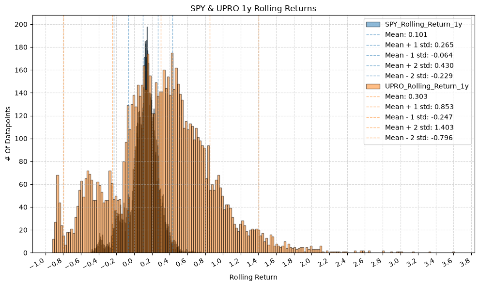
    


    
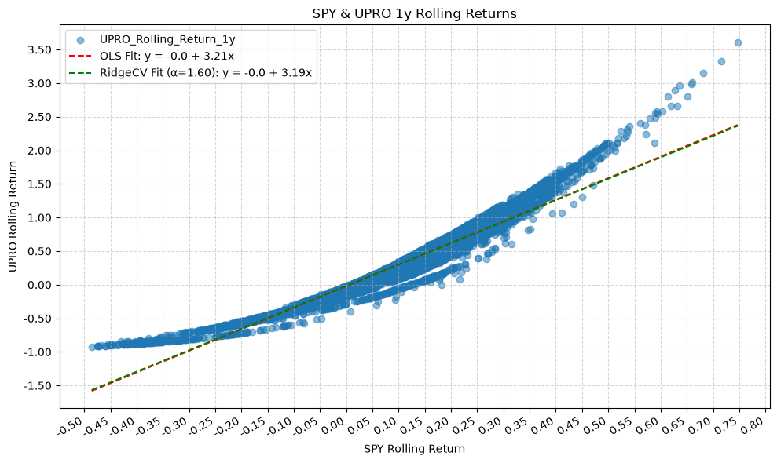
    


                                  OLS Regression Results                              
    ==================================================================================
    Dep. Variable:     UPRO_Rolling_Return_1y   R-squared:                       0.927
    Model:                                OLS   Adj. R-squared:                  0.927
    Method:                     Least Squares   F-statistic:                 1.023e+05
    Date:                    Mon, 23 Mar 2026   Prob (F-statistic):               0.00
    Time:                            22:02:28   Log-Likelihood:                 3934.0
    No. Observations:                    8090   AIC:                            -7864.
    Df Residuals:                        8088   BIC:                            -7850.
    Df Model:                               1                                         
    Covariance Type:                nonrobust                                         
    =========================================================================================
                                coef    std err          t      P>|t|      [0.025      0.975]
    -----------------------------------------------------------------------------------------
    const                    -0.0196      0.002    -10.159      0.000      -0.023      -0.016
    SPY_Rolling_Return_1y     3.2115      0.010    319.878      0.000       3.192       3.231
    ==============================================================================
    Omnibus:                     1395.388   Durbin-Watson:                   0.031
    Prob(Omnibus):                  0.000   Jarque-Bera (JB):             6543.827
    Skew:                           0.765   Prob(JB):                         0.00
    Kurtosis:                       7.132   Cond. No.                         6.13
    ==============================================================================
    
    Notes:
    [1] Standard Errors assume that the covariance matrix of the errors is correctly specified.


    
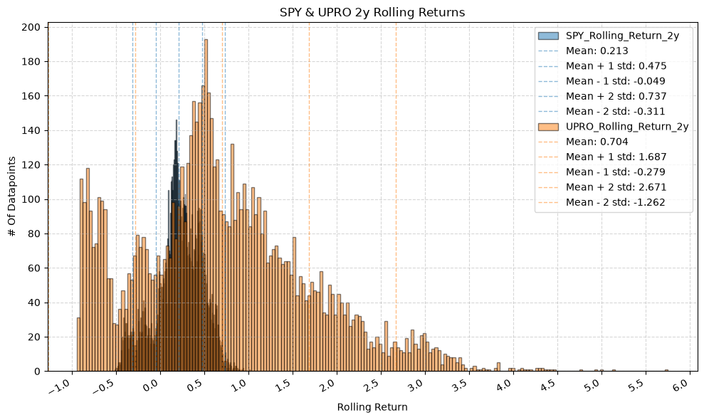
    


    
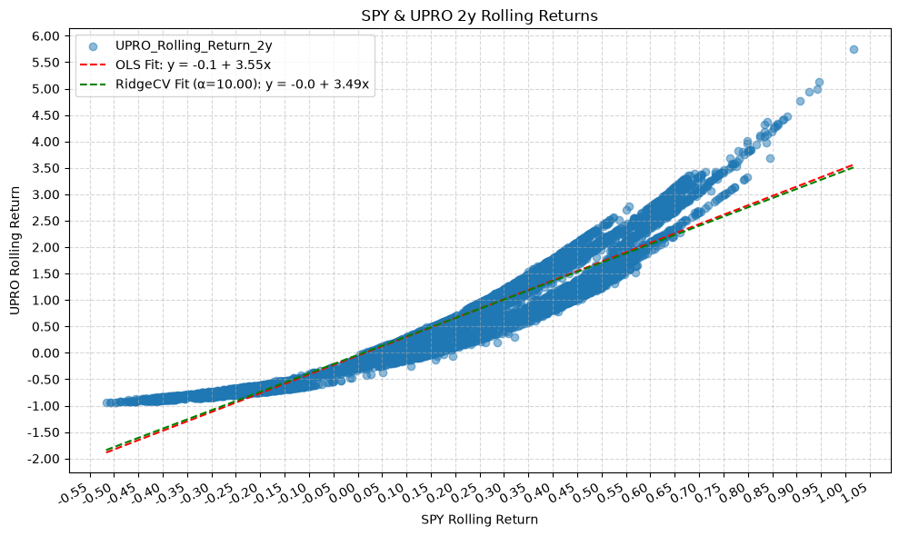
    


                                  OLS Regression Results                              
    ==================================================================================
    Dep. Variable:     UPRO_Rolling_Return_2y   R-squared:                       0.897
    Model:                                OLS   Adj. R-squared:                  0.897
    Method:                     Least Squares   F-statistic:                 6.792e+04
    Date:                    Mon, 23 Mar 2026   Prob (F-statistic):               0.00
    Time:                            22:02:30   Log-Likelihood:                -2124.1
    No. Observations:                    7838   AIC:                             4252.
    Df Residuals:                        7836   BIC:                             4266.
    Df Model:                               1                                         
    Covariance Type:                nonrobust                                         
    =========================================================================================
                                coef    std err          t      P>|t|      [0.025      0.975]
    -----------------------------------------------------------------------------------------
    const                    -0.0514      0.005    -11.162      0.000      -0.060      -0.042
    SPY_Rolling_Return_2y     3.5609      0.014    260.608      0.000       3.534       3.588
    ==============================================================================
    Omnibus:                      950.451   Durbin-Watson:                   0.018
    Prob(Omnibus):                  0.000   Jarque-Bera (JB):             1485.975
    Skew:                           0.866   Prob(JB):                         0.00
    Kurtosis:                       4.245   Cond. No.                         4.00
    ==============================================================================
    
    Notes:
    [1] Standard Errors assume that the covariance matrix of the errors is correctly specified.


    

    


    
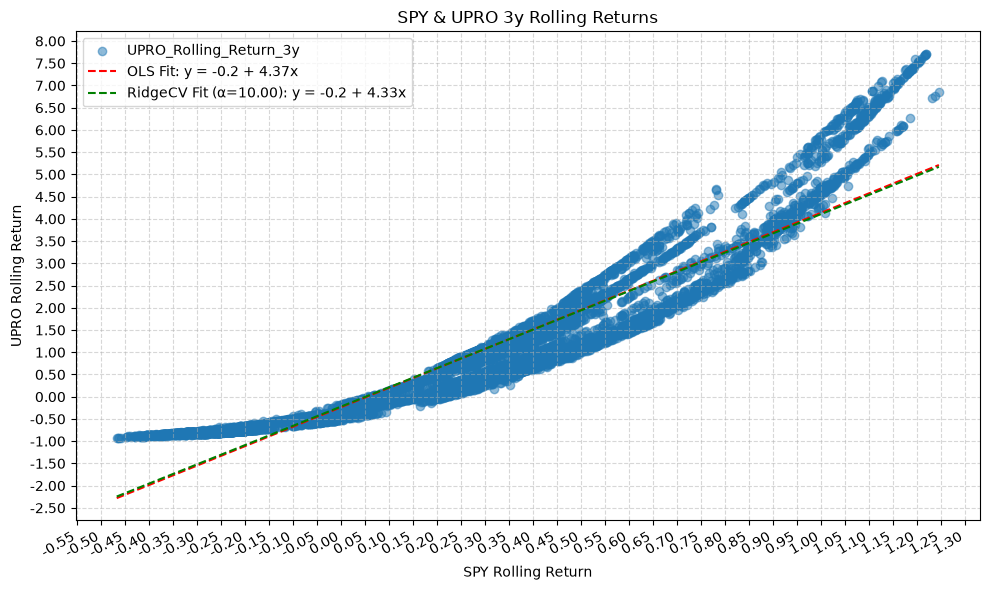
    


                                  OLS Regression Results                              
    ==================================================================================
    Dep. Variable:     UPRO_Rolling_Return_3y   R-squared:                       0.866
    Model:                                OLS   Adj. R-squared:                  0.866
    Method:                     Least Squares   F-statistic:                 4.921e+04
    Date:                    Mon, 23 Mar 2026   Prob (F-statistic):               0.00
    Time:                            22:02:32   Log-Likelihood:                -7020.7
    No. Observations:                    7586   AIC:                         1.405e+04
    Df Residuals:                        7584   BIC:                         1.406e+04
    Df Model:                               1                                         
    Covariance Type:                nonrobust                                         
    =========================================================================================
                                coef    std err          t      P>|t|      [0.025      0.975]
    -----------------------------------------------------------------------------------------
    const                    -0.2355      0.009    -24.827      0.000      -0.254      -0.217
    SPY_Rolling_Return_3y     4.3908      0.020    221.844      0.000       4.352       4.430
    ==============================================================================
    Omnibus:                     1290.270   Durbin-Watson:                   0.008
    Prob(Omnibus):                  0.000   Jarque-Bera (JB):             2447.743
    Skew:                           1.054   Prob(JB):                         0.00
    Kurtosis:                       4.816   Cond. No.                         3.15
    ==============================================================================
    
    Notes:
    [1] Standard Errors assume that the covariance matrix of the errors is correctly specified.


    
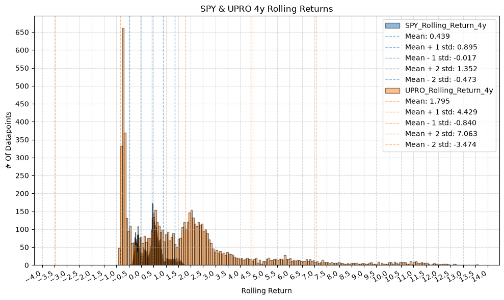
    


    
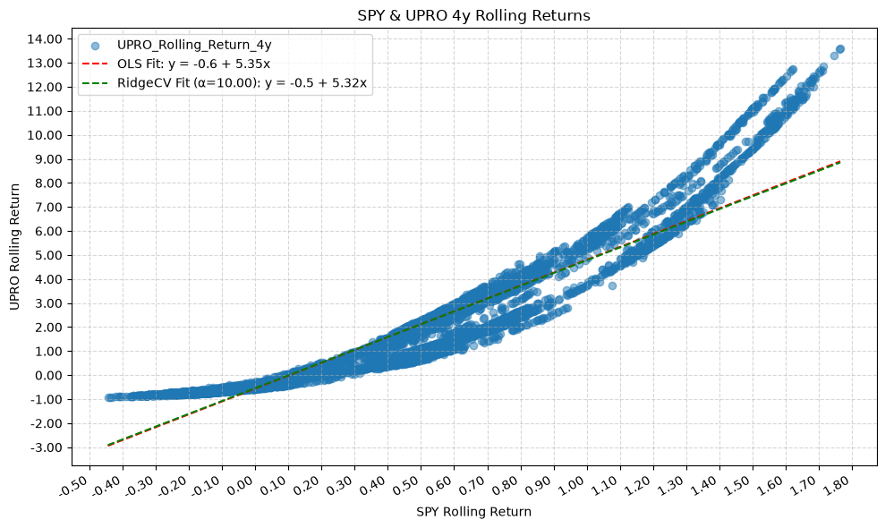
    


                                  OLS Regression Results                              
    ==================================================================================
    Dep. Variable:     UPRO_Rolling_Return_4y   R-squared:                       0.863
    Model:                                OLS   Adj. R-squared:                  0.863
    Method:                     Least Squares   F-statistic:                 4.601e+04
    Date:                    Mon, 23 Mar 2026   Prob (F-statistic):               0.00
    Time:                            22:02:34   Log-Likelihood:                -10260.
    No. Observations:                    7334   AIC:                         2.052e+04
    Df Residuals:                        7332   BIC:                         2.054e+04
    Df Model:                               1                                         
    Covariance Type:                nonrobust                                         
    =========================================================================================
                                coef    std err          t      P>|t|      [0.025      0.975]
    -----------------------------------------------------------------------------------------
    const                    -0.5506      0.016    -34.764      0.000      -0.582      -0.520
    SPY_Rolling_Return_4y     5.3698      0.025    214.492      0.000       5.321       5.419
    ==============================================================================
    Omnibus:                     1106.304   Durbin-Watson:                   0.008
    Prob(Omnibus):                  0.000   Jarque-Bera (JB):             2293.632
    Skew:                           0.912   Prob(JB):                         0.00
    Kurtosis:                       5.044   Cond. No.                         2.69
    ==============================================================================
    
    Notes:
    [1] Standard Errors assume that the covariance matrix of the errors is correctly specified.


    
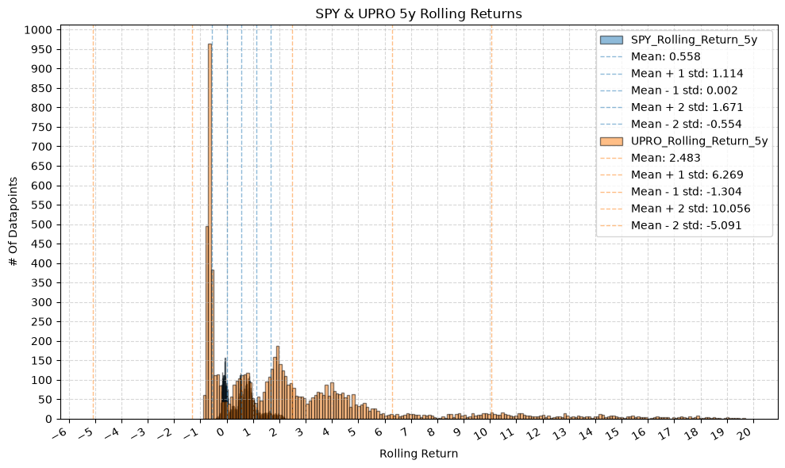
    


    
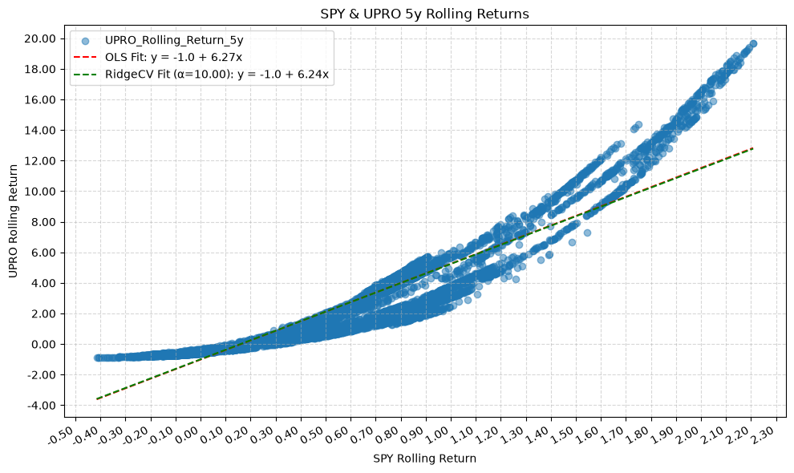
    


                                  OLS Regression Results                              
    ==================================================================================
    Dep. Variable:     UPRO_Rolling_Return_5y   R-squared:                       0.850
    Model:                                OLS   Adj. R-squared:                  0.850
    Method:                     Least Squares   F-statistic:                 4.016e+04
    Date:                    Mon, 23 Mar 2026   Prob (F-statistic):               0.00
    Time:                            22:02:35   Log-Likelihood:                -12785.
    No. Observations:                    7082   AIC:                         2.557e+04
    Df Residuals:                        7080   BIC:                         2.559e+04
    Df Model:                               1                                         
    Covariance Type:                nonrobust                                         
    =========================================================================================
                                coef    std err          t      P>|t|      [0.025      0.975]
    -----------------------------------------------------------------------------------------
    const                    -1.0042      0.025    -40.661      0.000      -1.053      -0.956
    SPY_Rolling_Return_5y     6.2783      0.031    200.407      0.000       6.217       6.340
    ==============================================================================
    Omnibus:                      686.484   Durbin-Watson:                   0.007
    Prob(Omnibus):                  0.000   Jarque-Bera (JB):             1310.280
    Skew:                           0.650   Prob(JB):                    2.99e-285
    Kurtosis:                       4.658   Cond. No.                         2.51
    ==============================================================================
    
    Notes:
    [1] Standard Errors assume that the covariance matrix of the errors is correctly specified.


### Rolling Returns Deviation (SPY & UPRO)

Next, we will the rolling returns deviation from the expected 3x return for each time period. This will give us a better picture of the volatility decay effect and how it changes over different time horizons.


```python
rolling_returns_stats["Return_Deviation_From_3x"] = rolling_returns_stats["Slope"] - 3.0
pandas_set_decimal_places(3)
display(rolling_returns_stats.set_index("Period"))
```


<div>
<style scoped>
    .dataframe tbody tr th:only-of-type {
        vertical-align: middle;
    }

    .dataframe tbody tr th {
        vertical-align: top;
    }

    .dataframe thead th {
        text-align: right;
    }
</style>
<table border="1" class="dataframe">
  <thead>
    <tr style="text-align: right;">
      <th></th>
      <th>Intercept</th>
      <th>Slope</th>
      <th>R_Squared</th>
      <th>Skew</th>
      <th>Average Upside Beta</th>
      <th>Average Downside Beta</th>
      <th>Asymmetry</th>
      <th>Return_Deviation_From_3x</th>
    </tr>
    <tr>
      <th>Period</th>
      <th></th>
      <th></th>
      <th></th>
      <th></th>
      <th></th>
      <th></th>
      <th></th>
      <th></th>
    </tr>
  </thead>
  <tbody>
    <tr>
      <th>1d</th>
      <td>0.000</td>
      <td>2.976</td>
      <td>0.997</td>
      <td>NaN</td>
      <td>2.939</td>
      <td>NaN</td>
      <td>NaN</td>
      <td>-0.024</td>
    </tr>
    <tr>
      <th>1w</th>
      <td>-0.000</td>
      <td>2.972</td>
      <td>0.994</td>
      <td>NaN</td>
      <td>2.757</td>
      <td>NaN</td>
      <td>NaN</td>
      <td>-0.028</td>
    </tr>
    <tr>
      <th>1m</th>
      <td>-0.002</td>
      <td>2.960</td>
      <td>0.988</td>
      <td>NaN</td>
      <td>2.494</td>
      <td>-inf</td>
      <td>inf</td>
      <td>-0.040</td>
    </tr>
    <tr>
      <th>3m</th>
      <td>-0.007</td>
      <td>3.048</td>
      <td>0.979</td>
      <td>NaN</td>
      <td>2.006</td>
      <td>-inf</td>
      <td>inf</td>
      <td>0.048</td>
    </tr>
    <tr>
      <th>6m</th>
      <td>-0.011</td>
      <td>3.071</td>
      <td>0.957</td>
      <td>NaN</td>
      <td>1.023</td>
      <td>-inf</td>
      <td>inf</td>
      <td>0.071</td>
    </tr>
    <tr>
      <th>1y</th>
      <td>-0.020</td>
      <td>3.212</td>
      <td>0.927</td>
      <td>NaN</td>
      <td>1.640</td>
      <td>-inf</td>
      <td>inf</td>
      <td>0.212</td>
    </tr>
    <tr>
      <th>2y</th>
      <td>-0.051</td>
      <td>3.561</td>
      <td>0.897</td>
      <td>0.348</td>
      <td>1.862</td>
      <td>9.298</td>
      <td>-7.435</td>
      <td>0.561</td>
    </tr>
    <tr>
      <th>3y</th>
      <td>-0.236</td>
      <td>4.391</td>
      <td>0.866</td>
      <td>-6.070</td>
      <td>1.579</td>
      <td>8.619</td>
      <td>-7.040</td>
      <td>1.391</td>
    </tr>
    <tr>
      <th>4y</th>
      <td>-0.551</td>
      <td>5.370</td>
      <td>0.863</td>
      <td>-65.947</td>
      <td>0.023</td>
      <td>7.234</td>
      <td>-7.211</td>
      <td>2.370</td>
    </tr>
    <tr>
      <th>5y</th>
      <td>-1.004</td>
      <td>6.278</td>
      <td>0.850</td>
      <td>-35.230</td>
      <td>-2.257</td>
      <td>21.001</td>
      <td>-23.257</td>
      <td>3.278</td>
    </tr>
  </tbody>
</table>
</div>


```python
plot_scatter(
    df=rolling_returns_stats,
    x_plot_column="Period",
    y_plot_columns=["Return_Deviation_From_3x"],
    title="UPRO Deviation from Perfect 3x Leverage by Time Period",
    x_label="Time Period",
    x_format="String",
    x_format_decimal_places=0,
    x_tick_spacing=1,
    x_tick_rotation=0,
    y_label="Deviation from 3x Leverage",
    y_format="Decimal",
    y_format_decimal_places=1,
    y_tick_spacing="Auto",
    y_tick_rotation=0,
    plot_OLS_regression_line=False,
    OLS_column=None,
    plot_Ridge_regression_line=False,
    Ridge_column=None,
    plot_RidgeCV_regression_line=False,
    RidgeCV_column=None,
    regression_constant=False,
    grid=True,
    legend=True,
    export_plot=False,
    plot_file_name=None,
)
```


    
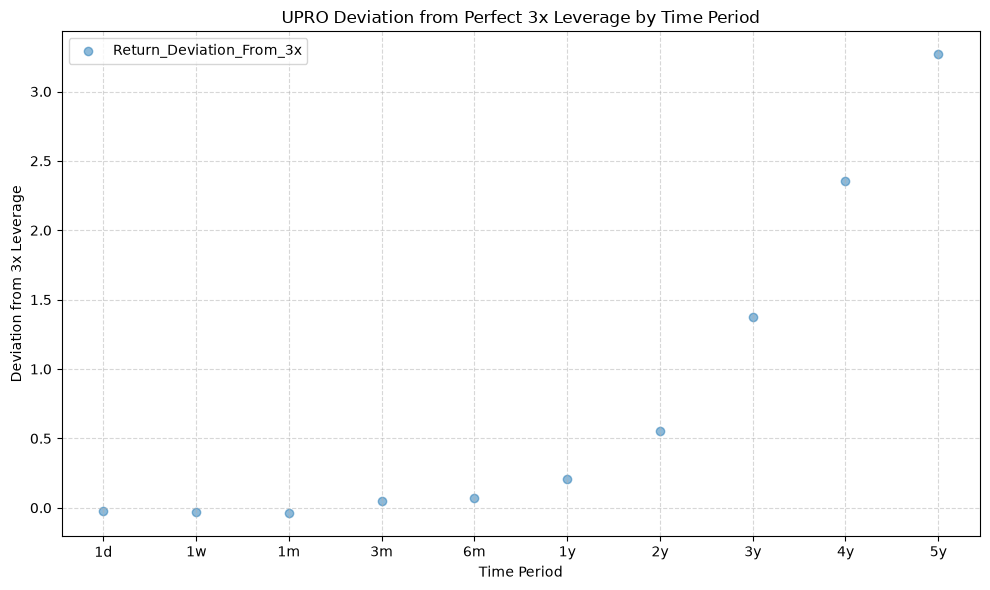
    


```python
plot_scatter(
    df=rolling_returns_stats,
    x_plot_column="Period",
    y_plot_columns=["Slope"],
    title="UPRO Slope by Time Period",
    x_label="Time Period",
    x_format="String",
    x_format_decimal_places=0,
    x_tick_spacing=1,
    x_tick_rotation=0,
    y_label="Slope",
    y_format="Decimal",
    y_format_decimal_places=1,
    y_tick_spacing="Auto",
    y_tick_rotation=0,
    plot_OLS_regression_line=False,
    OLS_column=None,
    plot_Ridge_regression_line=False,
    Ridge_column=None,
    plot_RidgeCV_regression_line=False,
    RidgeCV_column=None,
    regression_constant=False,
    grid=True,
    legend=True,
    export_plot=False,
    plot_file_name=None,
)
```


    

    


```python
plot_scatter(
    df=rolling_returns_stats,
    x_plot_column="Period",
    y_plot_columns=["Intercept"],
    title="Intercept by Time Period",
    x_label="Time Period",
    x_format="String",
    x_format_decimal_places=0,
    x_tick_spacing=1,
    x_tick_rotation=0,
    y_label="Intercept",
    y_format="Decimal",
    y_format_decimal_places=1,
    y_tick_spacing="Auto",
    y_tick_rotation=0,
    plot_OLS_regression_line=False,
    OLS_column=None,
    plot_Ridge_regression_line=False,
    Ridge_column=None,
    plot_RidgeCV_regression_line=False,
    RidgeCV_column=None,
    regression_constant=False,
    grid=True,
    legend=True,
    export_plot=False,
    plot_file_name=None,
)
```


    

    


```python
display(rolling_returns_stats.set_index("Period"))
```


<div>
<style scoped>
    .dataframe tbody tr th:only-of-type {
        vertical-align: middle;
    }

    .dataframe tbody tr th {
        vertical-align: top;
    }

    .dataframe thead th {
        text-align: right;
    }
</style>
<table border="1" class="dataframe">
  <thead>
    <tr style="text-align: right;">
      <th></th>
      <th>Intercept</th>
      <th>Slope</th>
      <th>R_Squared</th>
      <th>Skew</th>
      <th>Average Upside Beta</th>
      <th>Average Downside Beta</th>
      <th>Asymmetry</th>
      <th>Return_Deviation_From_3x</th>
    </tr>
    <tr>
      <th>Period</th>
      <th></th>
      <th></th>
      <th></th>
      <th></th>
      <th></th>
      <th></th>
      <th></th>
      <th></th>
    </tr>
  </thead>
  <tbody>
    <tr>
      <th>1d</th>
      <td>0.000</td>
      <td>2.976</td>
      <td>0.997</td>
      <td>NaN</td>
      <td>2.939</td>
      <td>NaN</td>
      <td>NaN</td>
      <td>-0.024</td>
    </tr>
    <tr>
      <th>1w</th>
      <td>-0.000</td>
      <td>2.972</td>
      <td>0.994</td>
      <td>NaN</td>
      <td>2.757</td>
      <td>NaN</td>
      <td>NaN</td>
      <td>-0.028</td>
    </tr>
    <tr>
      <th>1m</th>
      <td>-0.002</td>
      <td>2.960</td>
      <td>0.988</td>
      <td>NaN</td>
      <td>2.494</td>
      <td>-inf</td>
      <td>inf</td>
      <td>-0.040</td>
    </tr>
    <tr>
      <th>3m</th>
      <td>-0.007</td>
      <td>3.048</td>
      <td>0.979</td>
      <td>NaN</td>
      <td>2.006</td>
      <td>-inf</td>
      <td>inf</td>
      <td>0.048</td>
    </tr>
    <tr>
      <th>6m</th>
      <td>-0.011</td>
      <td>3.071</td>
      <td>0.957</td>
      <td>NaN</td>
      <td>1.023</td>
      <td>-inf</td>
      <td>inf</td>
      <td>0.071</td>
    </tr>
    <tr>
      <th>1y</th>
      <td>-0.020</td>
      <td>3.212</td>
      <td>0.927</td>
      <td>NaN</td>
      <td>1.640</td>
      <td>-inf</td>
      <td>inf</td>
      <td>0.212</td>
    </tr>
    <tr>
      <th>2y</th>
      <td>-0.051</td>
      <td>3.561</td>
      <td>0.897</td>
      <td>0.348</td>
      <td>1.862</td>
      <td>9.298</td>
      <td>-7.435</td>
      <td>0.561</td>
    </tr>
    <tr>
      <th>3y</th>
      <td>-0.236</td>
      <td>4.391</td>
      <td>0.866</td>
      <td>-6.070</td>
      <td>1.579</td>
      <td>8.619</td>
      <td>-7.040</td>
      <td>1.391</td>
    </tr>
    <tr>
      <th>4y</th>
      <td>-0.551</td>
      <td>5.370</td>
      <td>0.863</td>
      <td>-65.947</td>
      <td>0.023</td>
      <td>7.234</td>
      <td>-7.211</td>
      <td>2.370</td>
    </tr>
    <tr>
      <th>5y</th>
      <td>-1.004</td>
      <td>6.278</td>
      <td>0.850</td>
      <td>-35.230</td>
      <td>-2.257</td>
      <td>21.001</td>
      <td>-23.257</td>
      <td>3.278</td>
    </tr>
  </tbody>
</table>
</div>


Similar as to QQQ/TQQQ, up to 1 year, there is minimal difference between the mean UPRO 1 year rolling return and the hypothetical 3x leverage, with an R^2 of greater than 0.9.

However, as we extend the time period, we see that

* The "leverage factor" increases significantly, resulting in a deviation from the perfect 3x leverage.
* The intercept also begins to deviate significantly from 0.

### Rolling Returns Following Drawdowns (SPY & UPRO)

We will identify the drawdown levels of UPRO and then look at the subsequent rolling returns over various time horizons.


```python
# Copy DataFrame
spy_upro_extrap_future = spy_upro_extrap.copy()

# Create a list of drawdown levels to analyze
drawdown_levels = [-0.10, -0.20, -0.30, -0.40, -0.50, -0.60, -0.70, -0.80, -0.90]

# Shift the rolling return columns by the number of days in the rolling window to get the returns following the drawdown
for etf in etfs:
    for period_name, window in rolling_windows.items():
        spy_upro_extrap_future[f"{etf}_Rolling_Future_Return_{period_name}"] = spy_upro_extrap_future[f"{etf}_Rolling_Return_{period_name}"].shift(-window)
```

Now, we can analyze the future rolling returns following specific drawdown levels:


```python
# Create a dataframe to hold rolling returns stats
rolling_returns_drawdown_stats = pd.DataFrame()

for drawdown in drawdown_levels:

    for period_name, window in rolling_windows.items():

        try:
            plot_histogram(
                df=spy_upro_extrap_future[spy_upro_extrap_future["UPRO_Drawdown"] <= drawdown],
                plot_columns=[f"SPY_Rolling_Future_Return_{period_name}", f"UPRO_Rolling_Future_Return_{period_name}"],
                title=f"SPY & UPRO {period_name} Rolling Future Returns Post {drawdown} UPRO Drawdown",
                x_label="Rolling Return",
                x_tick_spacing="Auto",
                x_tick_rotation=30,
                y_label="# Of Datapoints",
                y_tick_spacing="Auto",
                y_tick_rotation=0,
                grid=True,
                legend=True,
                export_plot=False,
                plot_file_name=None,
            )

            plot_scatter(
                df=spy_upro_extrap_future[spy_upro_extrap_future["UPRO_Drawdown"] <= drawdown],
                x_plot_column=f"SPY_Rolling_Future_Return_{period_name}",
                y_plot_columns=[f"UPRO_Rolling_Future_Return_{period_name}"],
                title=f"SPY & UPRO {period_name} Rolling Future Returns Post {drawdown} UPRO Drawdown",
                x_label="SPY Rolling Return",
                x_format="Decimal",
                x_format_decimal_places=2,
                x_tick_spacing="Auto",
                x_tick_rotation=30,
                y_label="UPRO Rolling Return",
                y_format="Decimal",
                y_format_decimal_places=2,
                y_tick_spacing="Auto",
                y_tick_rotation=0,
                plot_OLS_regression_line=True,
                OLS_column=f"UPRO_Rolling_Future_Return_{period_name}",
                plot_Ridge_regression_line=False,
                Ridge_column=None,
                plot_RidgeCV_regression_line=True,
                RidgeCV_column=f"UPRO_Rolling_Future_Return_{period_name}",
                regression_constant=True,
                grid=True,
                legend=True,
                export_plot=False,
                plot_file_name=None,
            )

            # Run OLS regression with statsmodels
            model = run_linear_regression(
                df=spy_upro_extrap_future[spy_upro_extrap_future["UPRO_Drawdown"] <= drawdown],
                x_plot_column=f"SPY_Rolling_Future_Return_{period_name}",
                y_plot_column=f"UPRO_Rolling_Future_Return_{period_name}",
                regression_model="OLS-statsmodels",
                regression_constant=True,
            )
            print(model.summary())

            # Filter by drawdown
            drawdown_filter = spy_upro_extrap_future[spy_upro_extrap_future["UPRO_Drawdown"] <= drawdown]

            # Filter by period, drop rows with missing values
            future_filter = drawdown_filter[[f"UPRO_Rolling_Future_Return_{period_name}"]].dropna()

            # Find length of future dataframe
            future_length = len(future_filter)

            # Find length of future dataframe where return is positive
            positive_future_length = len(future_filter[future_filter[f"UPRO_Rolling_Future_Return_{period_name}"] > 0])

            # Calculate percentage of future returns that are positive
            positive_future_percentage = (positive_future_length / future_length) if future_length > 0 else 0

            # Add the regression results to the rolling returns stats dataframe
            intercept = model.params[0]
            # intercept_pvalue = model.pvalues[0]   # p-value for Intercept
            slope = model.params[1]
            # slope_pvalue = model.pvalues[1]       # p-value for Slope
            r_squared = model.rsquared

            rolling_returns_slope_int = pd.DataFrame({
                "Drawdown": drawdown,
                "Period": period_name,
                "Intercept": [intercept],
                # "Intercept_PValue": [intercept_pvalue],
                "Slope": [slope],
                # "Slope_PValue": [slope_pvalue],
                "R_Squared": [r_squared],
                "Positive_Future_Percentage": [positive_future_percentage],
            })
            
            rolling_returns_drawdown_stats = pd.concat([rolling_returns_drawdown_stats, rolling_returns_slope_int])

        except:
            print(f"Not enough data points for drawdown level {drawdown} and period {period_name} to run regression.")
```


    
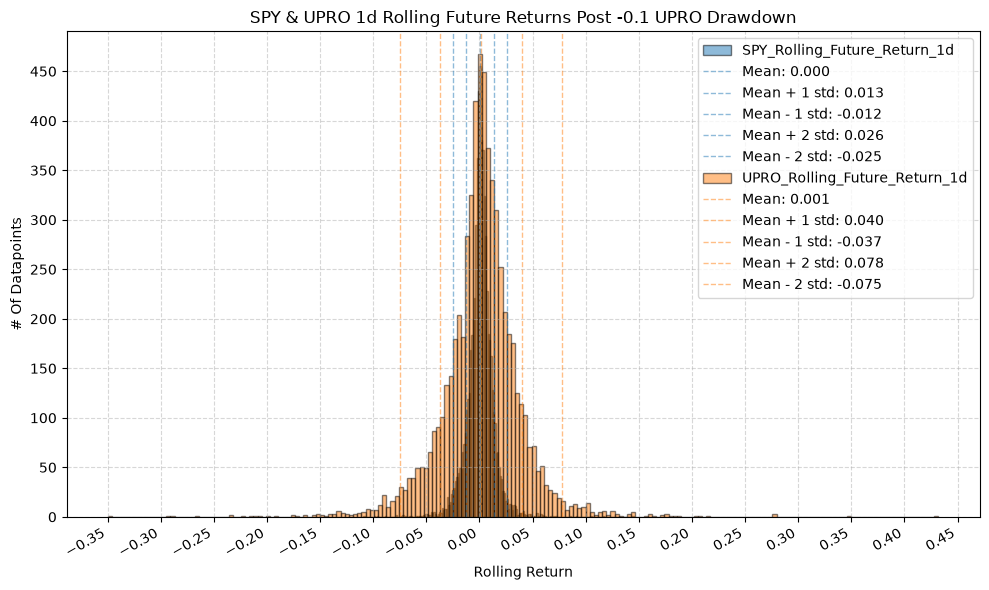
    


    

    


                                      OLS Regression Results                                 
    =========================================================================================
    Dep. Variable:     UPRO_Rolling_Future_Return_1d   R-squared:                       0.997
    Model:                                       OLS   Adj. R-squared:                  0.997
    Method:                            Least Squares   F-statistic:                 2.285e+06
    Date:                           Mon, 23 Mar 2026   Prob (F-statistic):               0.00
    Time:                                   22:02:38   Log-Likelihood:                 29881.
    No. Observations:                           6226   AIC:                        -5.976e+04
    Df Residuals:                               6224   BIC:                        -5.974e+04
    Df Model:                                      1                                         
    Covariance Type:                       nonrobust                                         
    ================================================================================================
                                       coef    std err          t      P>|t|      [0.025      0.975]
    ------------------------------------------------------------------------------------------------
    const                         2.275e-05   2.53e-05      0.900      0.368   -2.68e-05    7.23e-05
    SPY_Rolling_Future_Return_1d     2.9763      0.002   1511.487      0.000       2.972       2.980
    ==============================================================================
    Omnibus:                     4602.669   Durbin-Watson:                   2.628
    Prob(Omnibus):                  0.000   Jarque-Bera (JB):          2405238.239
    Skew:                           2.321   Prob(JB):                         0.00
    Kurtosis:                      99.178   Cond. No.                         78.0
    ==============================================================================
    
    Notes:
    [1] Standard Errors assume that the covariance matrix of the errors is correctly specified.


    

    


    

    


                                      OLS Regression Results                                 
    =========================================================================================
    Dep. Variable:     UPRO_Rolling_Future_Return_1w   R-squared:                       0.994
    Model:                                       OLS   Adj. R-squared:                  0.994
    Method:                            Least Squares   F-statistic:                 9.672e+05
    Date:                           Mon, 23 Mar 2026   Prob (F-statistic):               0.00
    Time:                                   22:02:39   Log-Likelihood:                 22884.
    No. Observations:                           6222   AIC:                        -4.576e+04
    Df Residuals:                               6220   BIC:                        -4.575e+04
    Df Model:                                      1                                         
    Covariance Type:                       nonrobust                                         
    ================================================================================================
                                       coef    std err          t      P>|t|      [0.025      0.975]
    ------------------------------------------------------------------------------------------------
    const                           -0.0002   7.78e-05     -3.048      0.002      -0.000   -8.47e-05
    SPY_Rolling_Future_Return_1w     2.9731      0.003    983.448      0.000       2.967       2.979
    ==============================================================================
    Omnibus:                     2735.277   Durbin-Watson:                   0.978
    Prob(Omnibus):                  0.000   Jarque-Bera (JB):           782783.199
    Skew:                          -0.876   Prob(JB):                         0.00
    Kurtosis:                      57.921   Cond. No.                         39.0
    ==============================================================================
    
    Notes:
    [1] Standard Errors assume that the covariance matrix of the errors is correctly specified.


    

    


    

    


                                      OLS Regression Results                                 
    =========================================================================================
    Dep. Variable:     UPRO_Rolling_Future_Return_1m   R-squared:                       0.988
    Model:                                       OLS   Adj. R-squared:                  0.988
    Method:                            Least Squares   F-statistic:                 4.994e+05
    Date:                           Mon, 23 Mar 2026   Prob (F-statistic):               0.00
    Time:                                   22:02:41   Log-Likelihood:                 16963.
    No. Observations:                           6218   AIC:                        -3.392e+04
    Df Residuals:                               6216   BIC:                        -3.391e+04
    Df Model:                                      1                                         
    Covariance Type:                       nonrobust                                         
    ================================================================================================
                                       coef    std err          t      P>|t|      [0.025      0.975]
    ------------------------------------------------------------------------------------------------
    const                           -0.0015      0.000     -7.180      0.000      -0.002      -0.001
    SPY_Rolling_Future_Return_1m     2.9745      0.004    706.672      0.000       2.966       2.983
    ==============================================================================
    Omnibus:                     3370.808   Durbin-Watson:                   0.336
    Prob(Omnibus):                  0.000   Jarque-Bera (JB):           387306.157
    Skew:                          -1.631   Prob(JB):                         0.00
    Kurtosis:                      41.526   Cond. No.                         21.0
    ==============================================================================
    
    Notes:
    [1] Standard Errors assume that the covariance matrix of the errors is correctly specified.


    
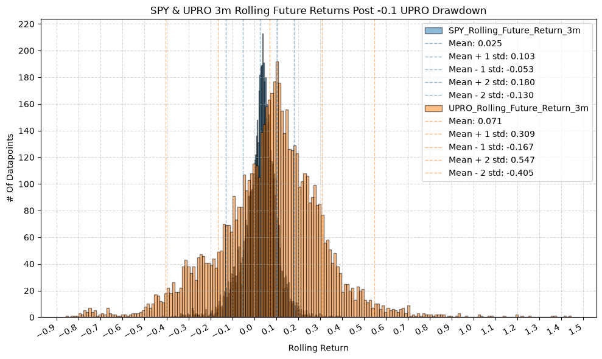
    


    

    


                                      OLS Regression Results                                 
    =========================================================================================
    Dep. Variable:     UPRO_Rolling_Future_Return_3m   R-squared:                       0.978
    Model:                                       OLS   Adj. R-squared:                  0.978
    Method:                            Least Squares   F-statistic:                 2.716e+05
    Date:                           Mon, 23 Mar 2026   Prob (F-statistic):               0.00
    Time:                                   22:02:43   Log-Likelihood:                 11917.
    No. Observations:                           6218   AIC:                        -2.383e+04
    Df Residuals:                               6216   BIC:                        -2.382e+04
    Df Model:                                      1                                         
    Covariance Type:                       nonrobust                                         
    ================================================================================================
                                       coef    std err          t      P>|t|      [0.025      0.975]
    ------------------------------------------------------------------------------------------------
    const                           -0.0048      0.000    -10.056      0.000      -0.006      -0.004
    SPY_Rolling_Future_Return_3m     3.0333      0.006    521.172      0.000       3.022       3.045
    ==============================================================================
    Omnibus:                     1724.373   Durbin-Watson:                   0.148
    Prob(Omnibus):                  0.000   Jarque-Bera (JB):            87828.721
    Skew:                           0.522   Prob(JB):                         0.00
    Kurtosis:                      21.382   Cond. No.                         12.9
    ==============================================================================
    
    Notes:
    [1] Standard Errors assume that the covariance matrix of the errors is correctly specified.


    
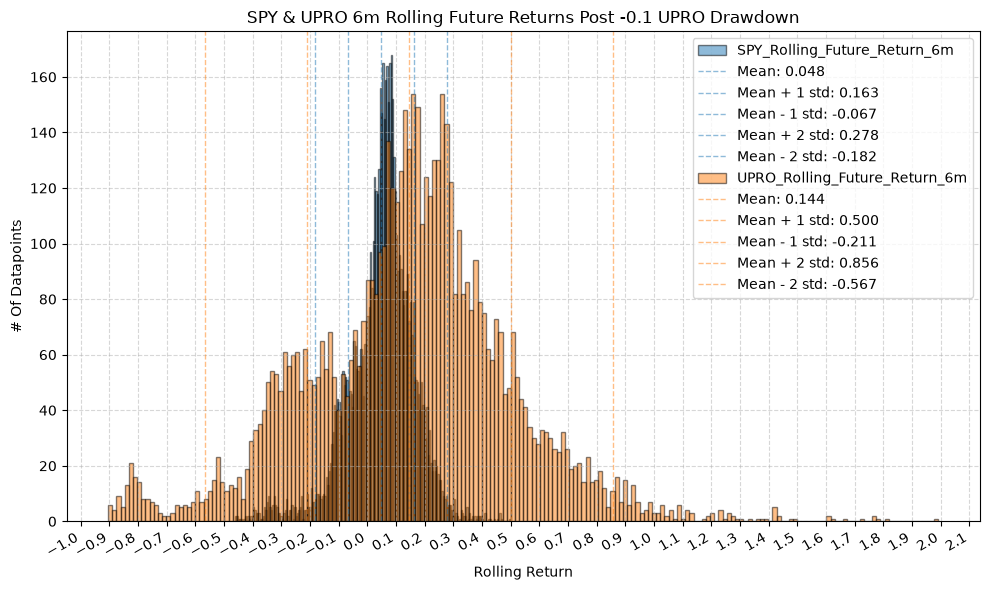
    


    

    


                                      OLS Regression Results                                 
    =========================================================================================
    Dep. Variable:     UPRO_Rolling_Future_Return_6m   R-squared:                       0.961
    Model:                                       OLS   Adj. R-squared:                  0.961
    Method:                            Least Squares   F-statistic:                 1.537e+05
    Date:                           Mon, 23 Mar 2026   Prob (F-statistic):               0.00
    Time:                                   22:02:45   Log-Likelihood:                 7698.8
    No. Observations:                           6214   AIC:                        -1.539e+04
    Df Residuals:                               6212   BIC:                        -1.538e+04
    Df Model:                                      1                                         
    Covariance Type:                       nonrobust                                         
    ================================================================================================
                                       coef    std err          t      P>|t|      [0.025      0.975]
    ------------------------------------------------------------------------------------------------
    const                           -0.0015      0.001     -1.522      0.128      -0.003       0.000
    SPY_Rolling_Future_Return_6m     3.0329      0.008    391.995      0.000       3.018       3.048
    ==============================================================================
    Omnibus:                     2086.648   Durbin-Watson:                   0.070
    Prob(Omnibus):                  0.000   Jarque-Bera (JB):            20735.224
    Skew:                           1.316   Prob(JB):                         0.00
    Kurtosis:                      11.553   Cond. No.                         8.72
    ==============================================================================
    
    Notes:
    [1] Standard Errors assume that the covariance matrix of the errors is correctly specified.


    
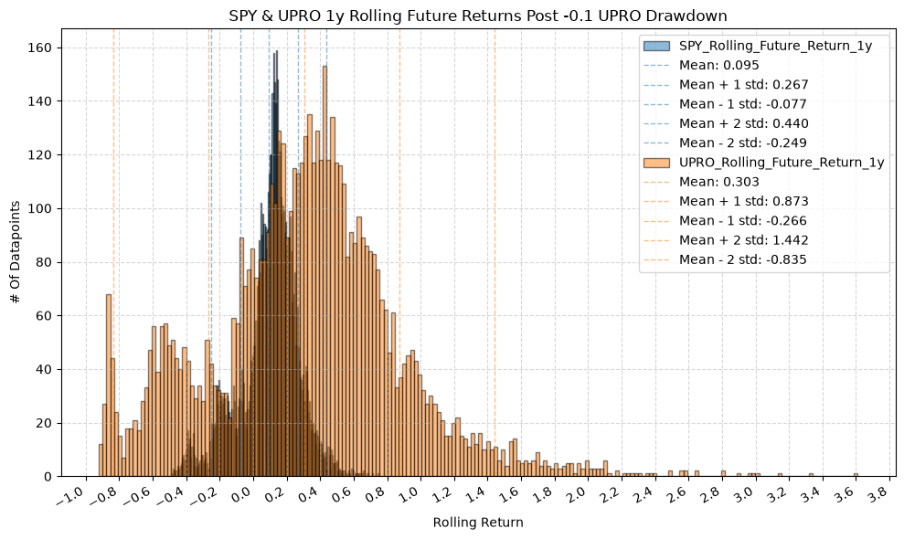
    


    
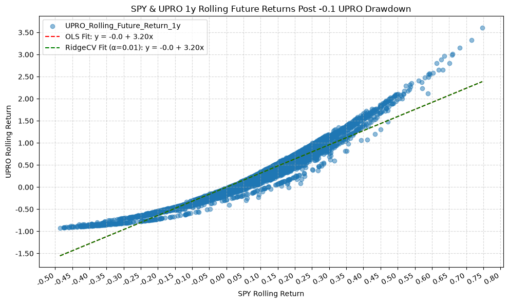
    


                                      OLS Regression Results                                 
    =========================================================================================
    Dep. Variable:     UPRO_Rolling_Future_Return_1y   R-squared:                       0.933
    Model:                                       OLS   Adj. R-squared:                  0.933
    Method:                            Least Squares   F-statistic:                 8.614e+04
    Date:                           Mon, 23 Mar 2026   Prob (F-statistic):               0.00
    Time:                                   22:02:47   Log-Likelihood:                 3065.5
    No. Observations:                           6146   AIC:                            -6127.
    Df Residuals:                               6144   BIC:                            -6114.
    Df Model:                                      1                                         
    Covariance Type:                       nonrobust                                         
    ================================================================================================
                                       coef    std err          t      P>|t|      [0.025      0.975]
    ------------------------------------------------------------------------------------------------
    const                           -0.0008      0.002     -0.366      0.714      -0.005       0.003
    SPY_Rolling_Future_Return_1y     3.1987      0.011    293.494      0.000       3.177       3.220
    ==============================================================================
    Omnibus:                     1575.748   Durbin-Watson:                   0.041
    Prob(Omnibus):                  0.000   Jarque-Bera (JB):             7473.065
    Skew:                           1.162   Prob(JB):                         0.00
    Kurtosis:                       7.877   Cond. No.                         5.87
    ==============================================================================
    
    Notes:
    [1] Standard Errors assume that the covariance matrix of the errors is correctly specified.


    
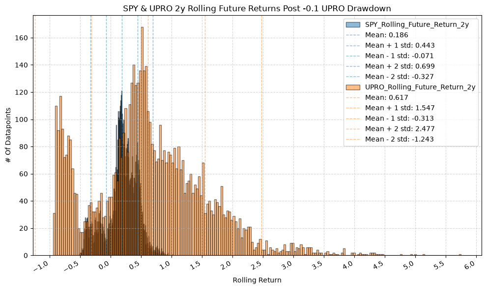
    


    
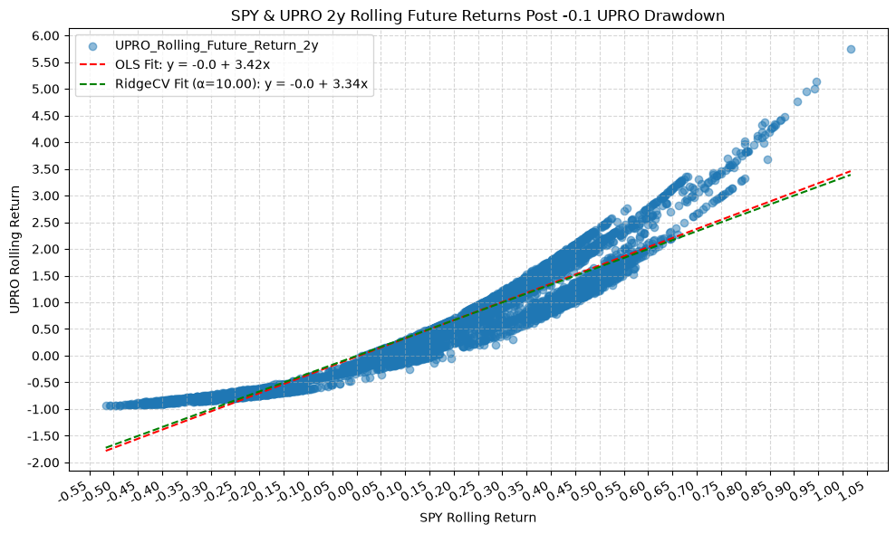
    


                                      OLS Regression Results                                 
    =========================================================================================
    Dep. Variable:     UPRO_Rolling_Future_Return_2y   R-squared:                       0.891
    Model:                                       OLS   Adj. R-squared:                  0.891
    Method:                            Least Squares   F-statistic:                 4.975e+04
    Date:                           Mon, 23 Mar 2026   Prob (F-statistic):               0.00
    Time:                                   22:02:48   Log-Likelihood:                -1449.4
    No. Observations:                           6066   AIC:                             2903.
    Df Residuals:                               6064   BIC:                             2916.
    Df Model:                                      1                                         
    Covariance Type:                       nonrobust                                         
    ================================================================================================
                                       coef    std err          t      P>|t|      [0.025      0.975]
    ------------------------------------------------------------------------------------------------
    const                           -0.0178      0.005     -3.655      0.000      -0.027      -0.008
    SPY_Rolling_Future_Return_2y     3.4265      0.015    223.051      0.000       3.396       3.457
    ==============================================================================
    Omnibus:                     1154.524   Durbin-Watson:                   0.024
    Prob(Omnibus):                  0.000   Jarque-Bera (JB):             2672.248
    Skew:                           1.077   Prob(JB):                         0.00
    Kurtosis:                       5.436   Cond. No.                         4.04
    ==============================================================================
    
    Notes:
    [1] Standard Errors assume that the covariance matrix of the errors is correctly specified.


    
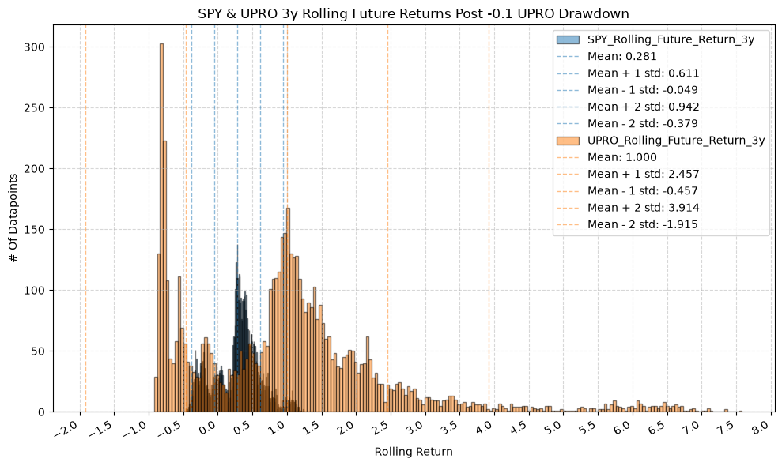
    


    
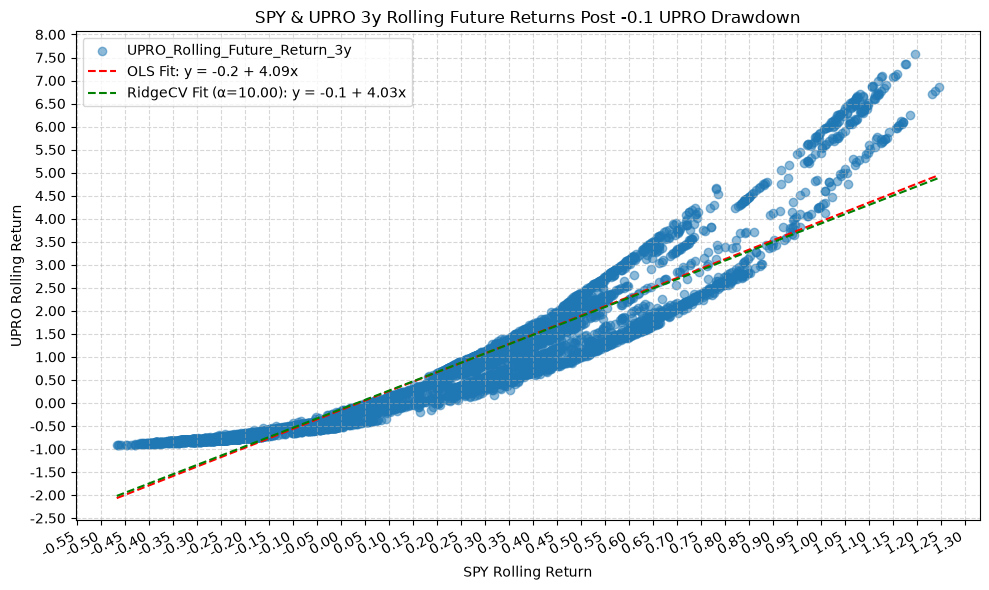
    


                                      OLS Regression Results                                 
    =========================================================================================
    Dep. Variable:     UPRO_Rolling_Future_Return_3y   R-squared:                       0.861
    Model:                                       OLS   Adj. R-squared:                  0.861
    Method:                            Least Squares   F-statistic:                 3.593e+04
    Date:                           Mon, 23 Mar 2026   Prob (F-statistic):               0.00
    Time:                                   22:02:50   Log-Likelihood:                -4711.2
    No. Observations:                           5814   AIC:                             9426.
    Df Residuals:                               5812   BIC:                             9440.
    Df Model:                                      1                                         
    Covariance Type:                       nonrobust                                         
    ================================================================================================
                                       coef    std err          t      P>|t|      [0.025      0.975]
    ------------------------------------------------------------------------------------------------
    const                           -0.1526      0.009    -16.359      0.000      -0.171      -0.134
    SPY_Rolling_Future_Return_3y     4.1182      0.022    189.558      0.000       4.076       4.161
    ==============================================================================
    Omnibus:                     1536.266   Durbin-Watson:                   0.011
    Prob(Omnibus):                  0.000   Jarque-Bera (JB):             4893.291
    Skew:                           1.338   Prob(JB):                         0.00
    Kurtosis:                       6.611   Cond. No.                         3.30
    ==============================================================================
    
    Notes:
    [1] Standard Errors assume that the covariance matrix of the errors is correctly specified.


    
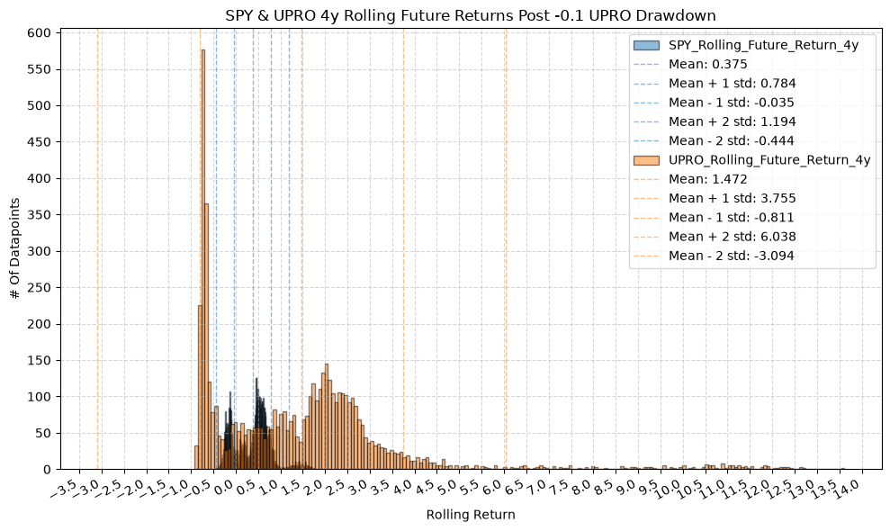
    


    

    


                                      OLS Regression Results                                 
    =========================================================================================
    Dep. Variable:     UPRO_Rolling_Future_Return_4y   R-squared:                       0.848
    Model:                                       OLS   Adj. R-squared:                  0.848
    Method:                            Least Squares   F-statistic:                 3.107e+04
    Date:                           Mon, 23 Mar 2026   Prob (F-statistic):               0.00
    Time:                                   22:02:52   Log-Likelihood:                -7267.4
    No. Observations:                           5562   AIC:                         1.454e+04
    Df Residuals:                               5560   BIC:                         1.455e+04
    Df Model:                                      1                                         
    Covariance Type:                       nonrobust                                         
    ================================================================================================
                                       coef    std err          t      P>|t|      [0.025      0.975]
    ------------------------------------------------------------------------------------------------
    const                           -0.4423      0.016    -27.350      0.000      -0.474      -0.411
    SPY_Rolling_Future_Return_4y     5.1509      0.029    176.254      0.000       5.094       5.208
    ==============================================================================
    Omnibus:                     1906.031   Durbin-Watson:                   0.013
    Prob(Omnibus):                  0.000   Jarque-Bera (JB):            10147.193
    Skew:                           1.552   Prob(JB):                         0.00
    Kurtosis:                       8.844   Cond. No.                         2.83
    ==============================================================================
    
    Notes:
    [1] Standard Errors assume that the covariance matrix of the errors is correctly specified.


    
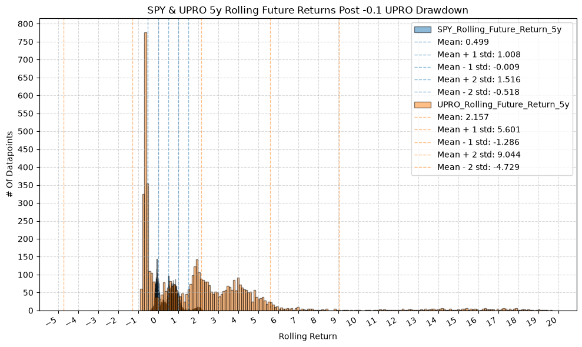
    


    
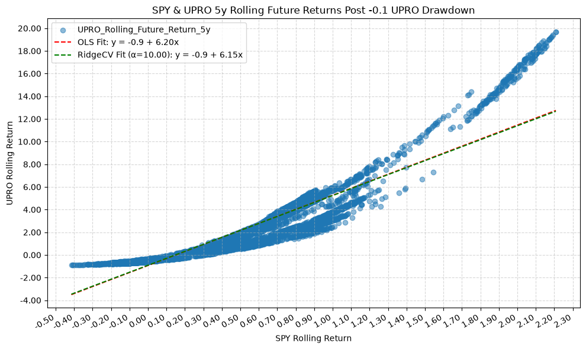
    


                                      OLS Regression Results                                 
    =========================================================================================
    Dep. Variable:     UPRO_Rolling_Future_Return_5y   R-squared:                       0.838
    Model:                                       OLS   Adj. R-squared:                  0.838
    Method:                            Least Squares   F-statistic:                 2.843e+04
    Date:                           Mon, 23 Mar 2026   Prob (F-statistic):               0.00
    Time:                                   22:02:54   Log-Likelihood:                -9616.6
    No. Observations:                           5508   AIC:                         1.924e+04
    Df Residuals:                               5506   BIC:                         1.925e+04
    Df Model:                                      1                                         
    Covariance Type:                       nonrobust                                         
    ================================================================================================
                                       coef    std err          t      P>|t|      [0.025      0.975]
    ------------------------------------------------------------------------------------------------
    const                           -0.9355      0.026    -35.724      0.000      -0.987      -0.884
    SPY_Rolling_Future_Return_5y     6.1974      0.037    168.611      0.000       6.125       6.269
    ==============================================================================
    Omnibus:                     1244.010   Durbin-Watson:                   0.010
    Prob(Omnibus):                  0.000   Jarque-Bera (JB):             4368.458
    Skew:                           1.109   Prob(JB):                         0.00
    Kurtosis:                       6.758   Cond. No.                         2.58
    ==============================================================================
    
    Notes:
    [1] Standard Errors assume that the covariance matrix of the errors is correctly specified.


    
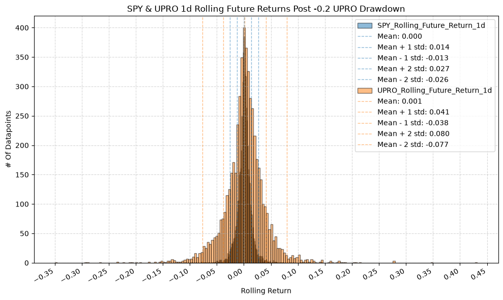
    


    
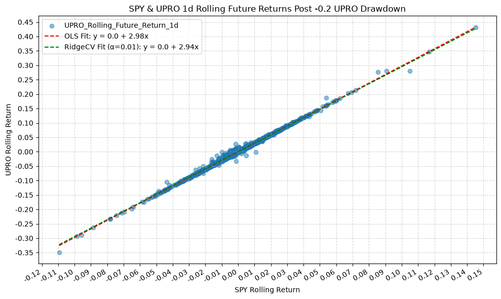
    


                                      OLS Regression Results                                 
    =========================================================================================
    Dep. Variable:     UPRO_Rolling_Future_Return_1d   R-squared:                       0.997
    Model:                                       OLS   Adj. R-squared:                  0.997
    Method:                            Least Squares   F-statistic:                 1.836e+06
    Date:                           Mon, 23 Mar 2026   Prob (F-statistic):               0.00
    Time:                                   22:02:56   Log-Likelihood:                 25121.
    No. Observations:                           5293   AIC:                        -5.024e+04
    Df Residuals:                               5291   BIC:                        -5.023e+04
    Df Model:                                      1                                         
    Covariance Type:                       nonrobust                                         
    ================================================================================================
                                       coef    std err          t      P>|t|      [0.025      0.975]
    ------------------------------------------------------------------------------------------------
    const                         3.565e-05   2.89e-05      1.233      0.218    -2.1e-05    9.23e-05
    SPY_Rolling_Future_Return_1d     2.9771      0.002   1355.166      0.000       2.973       2.981
    ==============================================================================
    Omnibus:                     3682.841   Durbin-Watson:                   2.648
    Prob(Omnibus):                  0.000   Jarque-Bera (JB):          1786814.598
    Skew:                           2.082   Prob(JB):                         0.00
    Kurtosis:                      92.914   Cond. No.                         76.0
    ==============================================================================
    
    Notes:
    [1] Standard Errors assume that the covariance matrix of the errors is correctly specified.


    

    


    
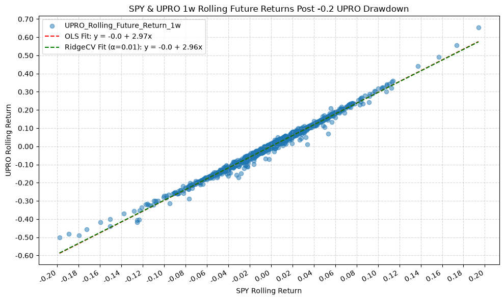
    


                                      OLS Regression Results                                 
    =========================================================================================
    Dep. Variable:     UPRO_Rolling_Future_Return_1w   R-squared:                       0.993
    Model:                                       OLS   Adj. R-squared:                  0.993
    Method:                            Least Squares   F-statistic:                 7.714e+05
    Date:                           Mon, 23 Mar 2026   Prob (F-statistic):               0.00
    Time:                                   22:02:57   Log-Likelihood:                 19160.
    No. Observations:                           5293   AIC:                        -3.832e+04
    Df Residuals:                               5291   BIC:                        -3.830e+04
    Df Model:                                      1                                         
    Covariance Type:                       nonrobust                                         
    ================================================================================================
                                       coef    std err          t      P>|t|      [0.025      0.975]
    ------------------------------------------------------------------------------------------------
    const                           -0.0002   8.94e-05     -2.238      0.025      -0.000   -2.48e-05
    SPY_Rolling_Future_Return_1w     2.9707      0.003    878.290      0.000       2.964       2.977
    ==============================================================================
    Omnibus:                     2332.587   Durbin-Watson:                   0.986
    Prob(Omnibus):                  0.000   Jarque-Bera (JB):           564852.970
    Skew:                          -0.920   Prob(JB):                         0.00
    Kurtosis:                      53.575   Cond. No.                         38.0
    ==============================================================================
    
    Notes:
    [1] Standard Errors assume that the covariance matrix of the errors is correctly specified.


    
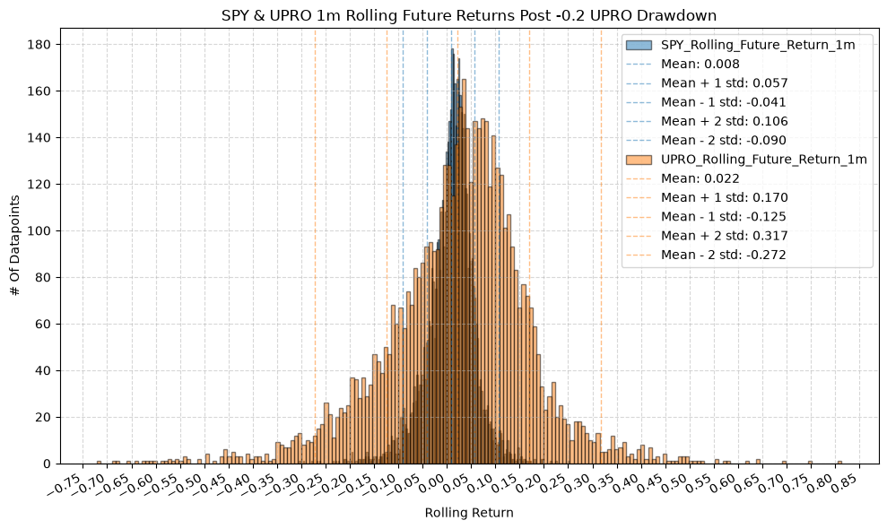
    


    
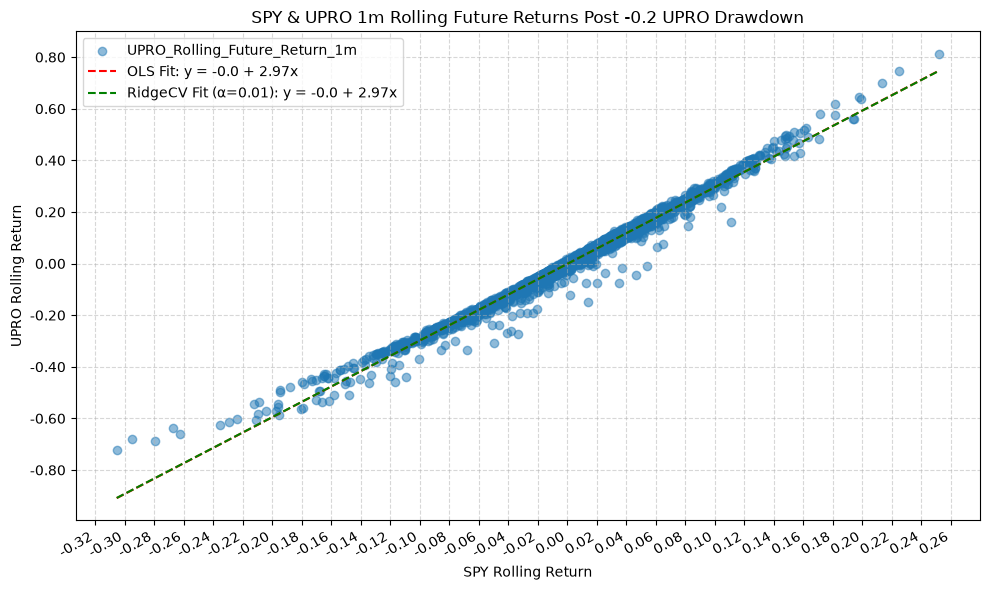
    


                                      OLS Regression Results                                 
    =========================================================================================
    Dep. Variable:     UPRO_Rolling_Future_Return_1m   R-squared:                       0.987
    Model:                                       OLS   Adj. R-squared:                  0.987
    Method:                            Least Squares   F-statistic:                 4.024e+05
    Date:                           Mon, 23 Mar 2026   Prob (F-statistic):               0.00
    Time:                                   22:02:59   Log-Likelihood:                 14137.
    No. Observations:                           5293   AIC:                        -2.827e+04
    Df Residuals:                               5291   BIC:                        -2.826e+04
    Df Model:                                      1                                         
    Covariance Type:                       nonrobust                                         
    ================================================================================================
                                       coef    std err          t      P>|t|      [0.025      0.975]
    ------------------------------------------------------------------------------------------------
    const                           -0.0014      0.000     -6.029      0.000      -0.002      -0.001
    SPY_Rolling_Future_Return_1m     2.9715      0.005    634.383      0.000       2.962       2.981
    ==============================================================================
    Omnibus:                     2856.650   Durbin-Watson:                   0.332
    Prob(Omnibus):                  0.000   Jarque-Bera (JB):           280043.841
    Skew:                          -1.657   Prob(JB):                         0.00
    Kurtosis:                      38.480   Cond. No.                         20.4
    ==============================================================================
    
    Notes:
    [1] Standard Errors assume that the covariance matrix of the errors is correctly specified.


    
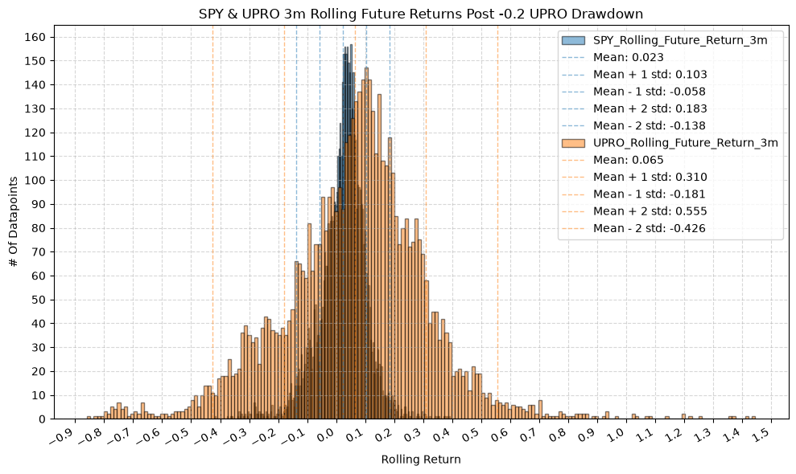
    


    
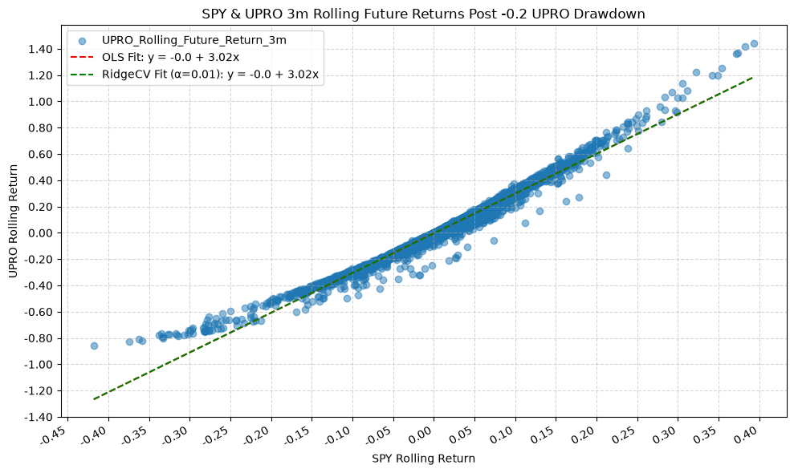
    


                                      OLS Regression Results                                 
    =========================================================================================
    Dep. Variable:     UPRO_Rolling_Future_Return_3m   R-squared:                       0.977
    Model:                                       OLS   Adj. R-squared:                  0.977
    Method:                            Least Squares   F-statistic:                 2.274e+05
    Date:                           Mon, 23 Mar 2026   Prob (F-statistic):               0.00
    Time:                                   22:03:01   Log-Likelihood:                 9942.5
    No. Observations:                           5293   AIC:                        -1.988e+04
    Df Residuals:                               5291   BIC:                        -1.987e+04
    Df Model:                                      1                                         
    Covariance Type:                       nonrobust                                         
    ================================================================================================
                                       coef    std err          t      P>|t|      [0.025      0.975]
    ------------------------------------------------------------------------------------------------
    const                           -0.0036      0.001     -6.759      0.000      -0.005      -0.003
    SPY_Rolling_Future_Return_3m     3.0229      0.006    476.840      0.000       3.010       3.035
    ==============================================================================
    Omnibus:                     1416.059   Durbin-Watson:                   0.159
    Prob(Omnibus):                  0.000   Jarque-Bera (JB):            70518.667
    Skew:                           0.467   Prob(JB):                         0.00
    Kurtosis:                      20.857   Cond. No.                         12.5
    ==============================================================================
    
    Notes:
    [1] Standard Errors assume that the covariance matrix of the errors is correctly specified.


    
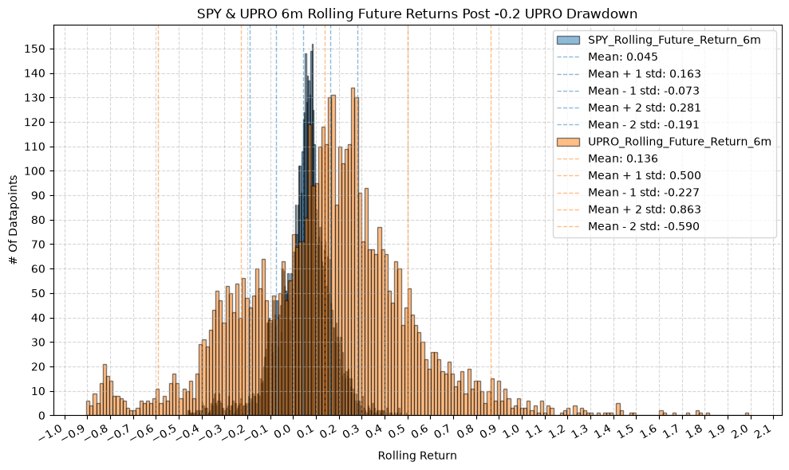
    


    

    


                                      OLS Regression Results                                 
    =========================================================================================
    Dep. Variable:     UPRO_Rolling_Future_Return_6m   R-squared:                       0.960
    Model:                                       OLS   Adj. R-squared:                  0.960
    Method:                            Least Squares   F-statistic:                 1.281e+05
    Date:                           Mon, 23 Mar 2026   Prob (F-statistic):               0.00
    Time:                                   22:03:02   Log-Likelihood:                 6392.5
    No. Observations:                           5293   AIC:                        -1.278e+04
    Df Residuals:                               5291   BIC:                        -1.277e+04
    Df Model:                                      1                                         
    Covariance Type:                       nonrobust                                         
    ================================================================================================
                                       coef    std err          t      P>|t|      [0.025      0.975]
    ------------------------------------------------------------------------------------------------
    const                            0.0016      0.001      1.529      0.126      -0.000       0.004
    SPY_Rolling_Future_Return_6m     3.0176      0.008    357.944      0.000       3.001       3.034
    ==============================================================================
    Omnibus:                     1752.000   Durbin-Watson:                   0.078
    Prob(Omnibus):                  0.000   Jarque-Bera (JB):            16360.897
    Skew:                           1.309   Prob(JB):                         0.00
    Kurtosis:                      11.205   Cond. No.                         8.50
    ==============================================================================
    
    Notes:
    [1] Standard Errors assume that the covariance matrix of the errors is correctly specified.


    

    


    

    


                                      OLS Regression Results                                 
    =========================================================================================
    Dep. Variable:     UPRO_Rolling_Future_Return_1y   R-squared:                       0.937
    Model:                                       OLS   Adj. R-squared:                  0.937
    Method:                            Least Squares   F-statistic:                 7.749e+04
    Date:                           Mon, 23 Mar 2026   Prob (F-statistic):               0.00
    Time:                                   22:03:04   Log-Likelihood:                 2737.5
    No. Observations:                           5253   AIC:                            -5471.
    Df Residuals:                               5251   BIC:                            -5458.
    Df Model:                                      1                                         
    Covariance Type:                       nonrobust                                         
    ================================================================================================
                                       coef    std err          t      P>|t|      [0.025      0.975]
    ------------------------------------------------------------------------------------------------
    const                            0.0100      0.002      4.488      0.000       0.006       0.014
    SPY_Rolling_Future_Return_1y     3.1683      0.011    278.372      0.000       3.146       3.191
    ==============================================================================
    Omnibus:                     1724.084   Durbin-Watson:                   0.051
    Prob(Omnibus):                  0.000   Jarque-Bera (JB):             9873.553
    Skew:                           1.452   Prob(JB):                         0.00
    Kurtosis:                       9.056   Cond. No.                         5.79
    ==============================================================================
    
    Notes:
    [1] Standard Errors assume that the covariance matrix of the errors is correctly specified.


    
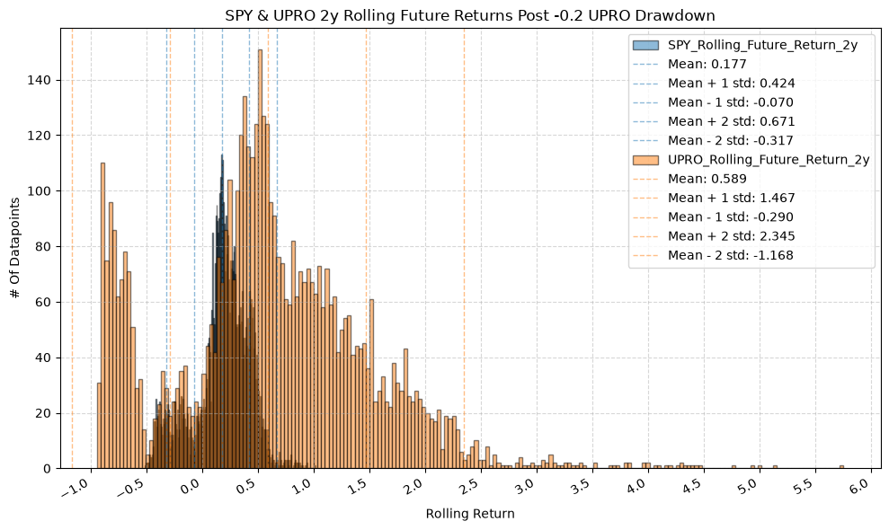
    


    

    


                                      OLS Regression Results                                 
    =========================================================================================
    Dep. Variable:     UPRO_Rolling_Future_Return_2y   R-squared:                       0.895
    Model:                                       OLS   Adj. R-squared:                  0.895
    Method:                            Least Squares   F-statistic:                 4.481e+04
    Date:                           Mon, 23 Mar 2026   Prob (F-statistic):               0.00
    Time:                                   22:03:06   Log-Likelihood:                -840.55
    No. Observations:                           5235   AIC:                             1685.
    Df Residuals:                               5233   BIC:                             1698.
    Df Model:                                      1                                         
    Covariance Type:                       nonrobust                                         
    ================================================================================================
                                       coef    std err          t      P>|t|      [0.025      0.975]
    ------------------------------------------------------------------------------------------------
    const                           -0.0068      0.005     -1.418      0.156      -0.016       0.003
    SPY_Rolling_Future_Return_2y     3.3653      0.016    211.680      0.000       3.334       3.396
    ==============================================================================
    Omnibus:                     1350.008   Durbin-Watson:                   0.031
    Prob(Omnibus):                  0.000   Jarque-Bera (JB):             4691.598
    Skew:                           1.271   Prob(JB):                         0.00
    Kurtosis:                       6.879   Cond. No.                         4.18
    ==============================================================================
    
    Notes:
    [1] Standard Errors assume that the covariance matrix of the errors is correctly specified.


    
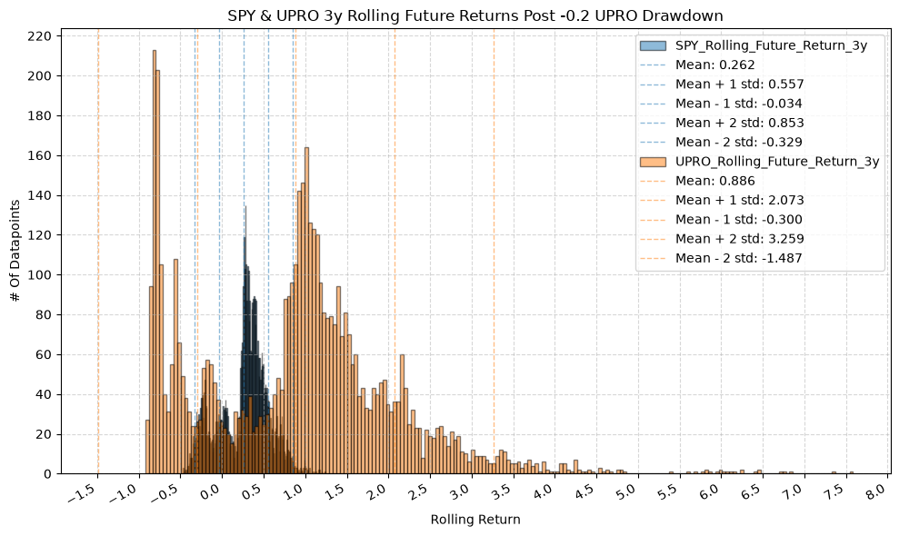
    


    
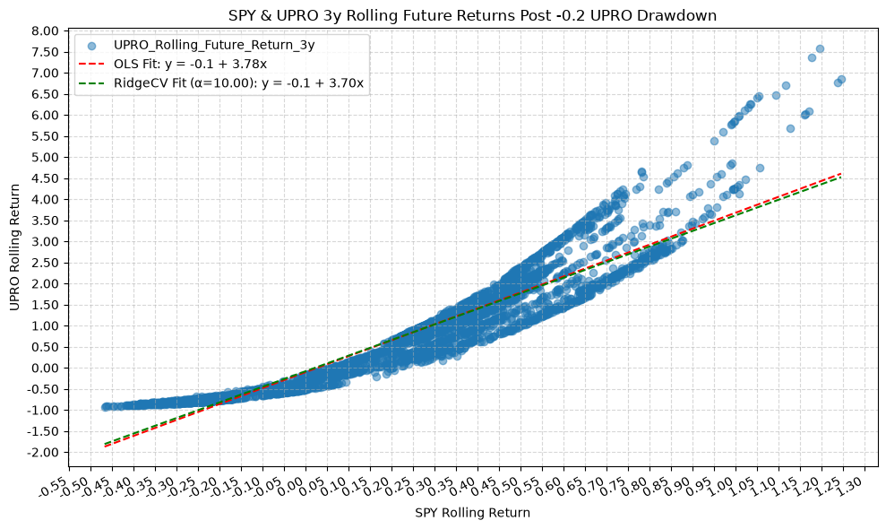
    


                                      OLS Regression Results                                 
    =========================================================================================
    Dep. Variable:     UPRO_Rolling_Future_Return_3y   R-squared:                       0.885
    Model:                                       OLS   Adj. R-squared:                  0.885
    Method:                            Least Squares   F-statistic:                 3.852e+04
    Date:                           Mon, 23 Mar 2026   Prob (F-statistic):               0.00
    Time:                                   22:03:08   Log-Likelihood:                -2526.9
    No. Observations:                           5003   AIC:                             5058.
    Df Residuals:                               5001   BIC:                             5071.
    Df Model:                                      1                                         
    Covariance Type:                       nonrobust                                         
    ================================================================================================
                                       coef    std err          t      P>|t|      [0.025      0.975]
    ------------------------------------------------------------------------------------------------
    const                           -0.1050      0.008    -13.930      0.000      -0.120      -0.090
    SPY_Rolling_Future_Return_3y     3.8056      0.019    196.274      0.000       3.768       3.844
    ==============================================================================
    Omnibus:                     1503.393   Durbin-Watson:                   0.020
    Prob(Omnibus):                  0.000   Jarque-Bera (JB):             8255.984
    Skew:                           1.327   Prob(JB):                         0.00
    Kurtosis:                       8.706   Cond. No.                         3.66
    ==============================================================================
    
    Notes:
    [1] Standard Errors assume that the covariance matrix of the errors is correctly specified.


    

    


    
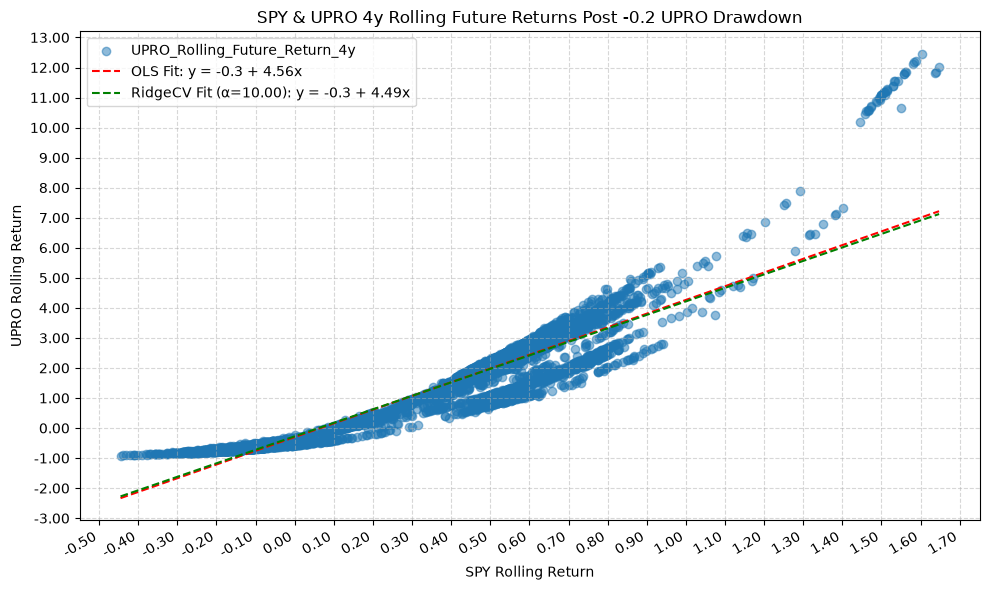
    


                                      OLS Regression Results                                 
    =========================================================================================
    Dep. Variable:     UPRO_Rolling_Future_Return_4y   R-squared:                       0.861
    Model:                                       OLS   Adj. R-squared:                  0.861
    Method:                            Least Squares   F-statistic:                 2.952e+04
    Date:                           Mon, 23 Mar 2026   Prob (F-statistic):               0.00
    Time:                                   22:03:09   Log-Likelihood:                -4796.4
    No. Observations:                           4762   AIC:                             9597.
    Df Residuals:                               4760   BIC:                             9610.
    Df Model:                                      1                                         
    Covariance Type:                       nonrobust                                         
    ================================================================================================
                                       coef    std err          t      P>|t|      [0.025      0.975]
    ------------------------------------------------------------------------------------------------
    const                           -0.3007      0.013    -22.591      0.000      -0.327      -0.275
    SPY_Rolling_Future_Return_4y     4.6041      0.027    171.823      0.000       4.552       4.657
    ==============================================================================
    Omnibus:                     2923.801   Durbin-Watson:                   0.020
    Prob(Omnibus):                  0.000   Jarque-Bera (JB):            69358.563
    Skew:                           2.506   Prob(JB):                         0.00
    Kurtosis:                      21.012   Cond. No.                         3.16
    ==============================================================================
    
    Notes:
    [1] Standard Errors assume that the covariance matrix of the errors is correctly specified.


    
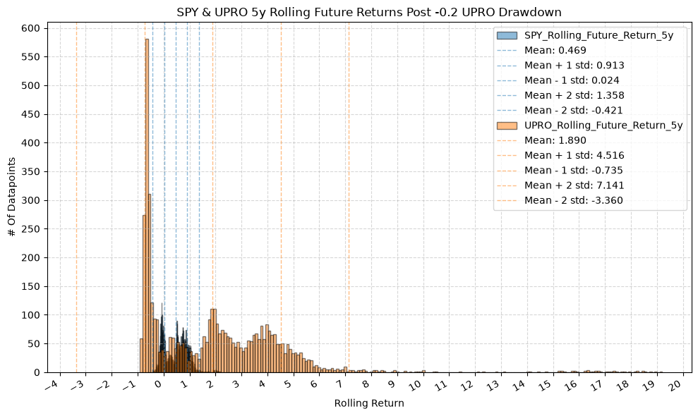
    


    

    


                                      OLS Regression Results                                 
    =========================================================================================
    Dep. Variable:     UPRO_Rolling_Future_Return_5y   R-squared:                       0.842
    Model:                                       OLS   Adj. R-squared:                  0.842
    Method:                            Least Squares   F-statistic:                 2.529e+04
    Date:                           Mon, 23 Mar 2026   Prob (F-statistic):               0.00
    Time:                                   22:03:11   Log-Likelihood:                -6916.0
    No. Observations:                           4736   AIC:                         1.384e+04
    Df Residuals:                               4734   BIC:                         1.385e+04
    Df Model:                                      1                                         
    Covariance Type:                       nonrobust                                         
    ================================================================================================
                                       coef    std err          t      P>|t|      [0.025      0.975]
    ------------------------------------------------------------------------------------------------
    const                           -0.6490      0.022    -29.489      0.000      -0.692      -0.606
    SPY_Rolling_Future_Return_5y     5.4199      0.034    159.036      0.000       5.353       5.487
    ==============================================================================
    Omnibus:                     2511.498   Durbin-Watson:                   0.026
    Prob(Omnibus):                  0.000   Jarque-Bera (JB):            40921.082
    Skew:                           2.156   Prob(JB):                         0.00
    Kurtosis:                      16.740   Cond. No.                         2.84
    ==============================================================================
    
    Notes:
    [1] Standard Errors assume that the covariance matrix of the errors is correctly specified.


    

    


    
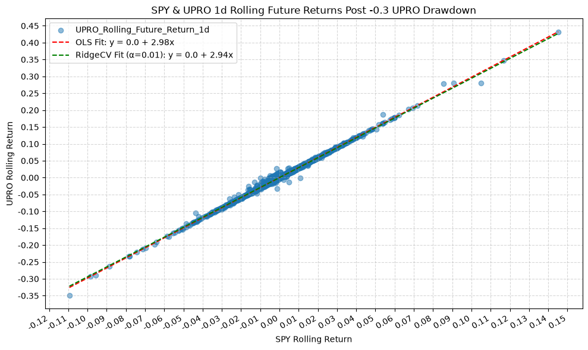
    


                                      OLS Regression Results                                 
    =========================================================================================
    Dep. Variable:     UPRO_Rolling_Future_Return_1d   R-squared:                       0.997
    Model:                                       OLS   Adj. R-squared:                  0.997
    Method:                            Least Squares   F-statistic:                 1.595e+06
    Date:                           Mon, 23 Mar 2026   Prob (F-statistic):               0.00
    Time:                                   22:03:13   Log-Likelihood:                 22509.
    No. Observations:                           4774   AIC:                        -4.501e+04
    Df Residuals:                               4772   BIC:                        -4.500e+04
    Df Model:                                      1                                         
    Covariance Type:                       nonrobust                                         
    ================================================================================================
                                       coef    std err          t      P>|t|      [0.025      0.975]
    ------------------------------------------------------------------------------------------------
    const                         4.704e-05   3.14e-05      1.498      0.134   -1.45e-05       0.000
    SPY_Rolling_Future_Return_1d     2.9767      0.002   1263.047      0.000       2.972       2.981
    ==============================================================================
    Omnibus:                     3250.997   Durbin-Watson:                   2.668
    Prob(Omnibus):                  0.000   Jarque-Bera (JB):          1510901.173
    Skew:                           2.005   Prob(JB):                         0.00
    Kurtosis:                      90.061   Cond. No.                         75.1
    ==============================================================================
    
    Notes:
    [1] Standard Errors assume that the covariance matrix of the errors is correctly specified.


    

    


    

    


                                      OLS Regression Results                                 
    =========================================================================================
    Dep. Variable:     UPRO_Rolling_Future_Return_1w   R-squared:                       0.993
    Model:                                       OLS   Adj. R-squared:                  0.993
    Method:                            Least Squares   F-statistic:                 6.656e+05
    Date:                           Mon, 23 Mar 2026   Prob (F-statistic):               0.00
    Time:                                   22:03:14   Log-Likelihood:                 17170.
    No. Observations:                           4774   AIC:                        -3.434e+04
    Df Residuals:                               4772   BIC:                        -3.432e+04
    Df Model:                                      1                                         
    Covariance Type:                       nonrobust                                         
    ================================================================================================
                                       coef    std err          t      P>|t|      [0.025      0.975]
    ------------------------------------------------------------------------------------------------
    const                           -0.0002   9.63e-05     -1.927      0.054      -0.000    3.23e-06
    SPY_Rolling_Future_Return_1w     2.9715      0.004    815.813      0.000       2.964       2.979
    ==============================================================================
    Omnibus:                     1997.245   Durbin-Watson:                   0.986
    Prob(Omnibus):                  0.000   Jarque-Bera (JB):           483280.165
    Skew:                          -0.802   Prob(JB):                         0.00
    Kurtosis:                      52.264   Cond. No.                         37.9
    ==============================================================================
    
    Notes:
    [1] Standard Errors assume that the covariance matrix of the errors is correctly specified.


    

    


    

    


                                      OLS Regression Results                                 
    =========================================================================================
    Dep. Variable:     UPRO_Rolling_Future_Return_1m   R-squared:                       0.987
    Model:                                       OLS   Adj. R-squared:                  0.987
    Method:                            Least Squares   F-statistic:                 3.515e+05
    Date:                           Mon, 23 Mar 2026   Prob (F-statistic):               0.00
    Time:                                   22:03:16   Log-Likelihood:                 12680.
    No. Observations:                           4774   AIC:                        -2.536e+04
    Df Residuals:                               4772   BIC:                        -2.534e+04
    Df Model:                                      1                                         
    Covariance Type:                       nonrobust                                         
    ================================================================================================
                                       coef    std err          t      P>|t|      [0.025      0.975]
    ------------------------------------------------------------------------------------------------
    const                           -0.0011      0.000     -4.424      0.000      -0.002      -0.001
    SPY_Rolling_Future_Return_1m     2.9620      0.005    592.901      0.000       2.952       2.972
    ==============================================================================
    Omnibus:                     2676.846   Durbin-Watson:                   0.336
    Prob(Omnibus):                  0.000   Jarque-Bera (JB):           262764.658
    Skew:                          -1.763   Prob(JB):                         0.00
    Kurtosis:                      39.174   Cond. No.                         20.3
    ==============================================================================
    
    Notes:
    [1] Standard Errors assume that the covariance matrix of the errors is correctly specified.


    

    


    

    


                                      OLS Regression Results                                 
    =========================================================================================
    Dep. Variable:     UPRO_Rolling_Future_Return_3m   R-squared:                       0.978
    Model:                                       OLS   Adj. R-squared:                  0.978
    Method:                            Least Squares   F-statistic:                 2.123e+05
    Date:                           Mon, 23 Mar 2026   Prob (F-statistic):               0.00
    Time:                                   22:03:18   Log-Likelihood:                 8982.3
    No. Observations:                           4774   AIC:                        -1.796e+04
    Df Residuals:                               4772   BIC:                        -1.795e+04
    Df Model:                                      1                                         
    Covariance Type:                       nonrobust                                         
    ================================================================================================
                                       coef    std err          t      P>|t|      [0.025      0.975]
    ------------------------------------------------------------------------------------------------
    const                           -0.0024      0.001     -4.434      0.000      -0.004      -0.001
    SPY_Rolling_Future_Return_3m     3.0170      0.007    460.799      0.000       3.004       3.030
    ==============================================================================
    Omnibus:                     1428.856   Durbin-Watson:                   0.169
    Prob(Omnibus):                  0.000   Jarque-Bera (JB):            68279.326
    Skew:                           0.660   Prob(JB):                         0.00
    Kurtosis:                      21.480   Cond. No.                         12.3
    ==============================================================================
    
    Notes:
    [1] Standard Errors assume that the covariance matrix of the errors is correctly specified.


    
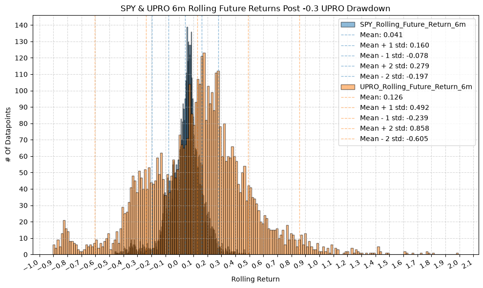
    


    

    


                                      OLS Regression Results                                 
    =========================================================================================
    Dep. Variable:     UPRO_Rolling_Future_Return_6m   R-squared:                       0.960
    Model:                                       OLS   Adj. R-squared:                  0.960
    Method:                            Least Squares   F-statistic:                 1.138e+05
    Date:                           Mon, 23 Mar 2026   Prob (F-statistic):               0.00
    Time:                                   22:03:19   Log-Likelihood:                 5697.2
    No. Observations:                           4774   AIC:                        -1.139e+04
    Df Residuals:                               4772   BIC:                        -1.138e+04
    Df Model:                                      1                                         
    Covariance Type:                       nonrobust                                         
    ================================================================================================
                                       coef    std err          t      P>|t|      [0.025      0.975]
    ------------------------------------------------------------------------------------------------
    const                            0.0029      0.001      2.546      0.011       0.001       0.005
    SPY_Rolling_Future_Return_6m     3.0134      0.009    337.352      0.000       2.996       3.031
    ==============================================================================
    Omnibus:                     1652.279   Durbin-Watson:                   0.081
    Prob(Omnibus):                  0.000   Jarque-Bera (JB):            14594.802
    Skew:                           1.398   Prob(JB):                         0.00
    Kurtosis:                      11.096   Cond. No.                         8.43
    ==============================================================================
    
    Notes:
    [1] Standard Errors assume that the covariance matrix of the errors is correctly specified.


    

    


    

    


                                      OLS Regression Results                                 
    =========================================================================================
    Dep. Variable:     UPRO_Rolling_Future_Return_1y   R-squared:                       0.937
    Model:                                       OLS   Adj. R-squared:                  0.937
    Method:                            Least Squares   F-statistic:                 7.059e+04
    Date:                           Mon, 23 Mar 2026   Prob (F-statistic):               0.00
    Time:                                   22:03:21   Log-Likelihood:                 2483.6
    No. Observations:                           4753   AIC:                            -4963.
    Df Residuals:                               4751   BIC:                            -4950.
    Df Model:                                      1                                         
    Covariance Type:                       nonrobust                                         
    ================================================================================================
                                       coef    std err          t      P>|t|      [0.025      0.975]
    ------------------------------------------------------------------------------------------------
    const                            0.0150      0.002      6.479      0.000       0.010       0.020
    SPY_Rolling_Future_Return_1y     3.1487      0.012    265.682      0.000       3.125       3.172
    ==============================================================================
    Omnibus:                     1666.224   Durbin-Watson:                   0.054
    Prob(Omnibus):                  0.000   Jarque-Bera (JB):            10579.245
    Skew:                           1.528   Prob(JB):                         0.00
    Kurtosis:                       9.639   Cond. No.                         5.74
    ==============================================================================
    
    Notes:
    [1] Standard Errors assume that the covariance matrix of the errors is correctly specified.


    

    


    

    


                                      OLS Regression Results                                 
    =========================================================================================
    Dep. Variable:     UPRO_Rolling_Future_Return_2y   R-squared:                       0.901
    Model:                                       OLS   Adj. R-squared:                  0.901
    Method:                            Least Squares   F-statistic:                 4.347e+04
    Date:                           Mon, 23 Mar 2026   Prob (F-statistic):               0.00
    Time:                                   22:03:23   Log-Likelihood:                -568.42
    No. Observations:                           4753   AIC:                             1141.
    Df Residuals:                               4751   BIC:                             1154.
    Df Model:                                      1                                         
    Covariance Type:                       nonrobust                                         
    ================================================================================================
                                       coef    std err          t      P>|t|      [0.025      0.975]
    ------------------------------------------------------------------------------------------------
    const                            0.0020      0.005      0.411      0.681      -0.008       0.012
    SPY_Rolling_Future_Return_2y     3.3735      0.016    208.485      0.000       3.342       3.405
    ==============================================================================
    Omnibus:                     1332.952   Durbin-Watson:                   0.031
    Prob(Omnibus):                  0.000   Jarque-Bera (JB):             5113.406
    Skew:                           1.349   Prob(JB):                         0.00
    Kurtosis:                       7.306   Cond. No.                         4.22
    ==============================================================================
    
    Notes:
    [1] Standard Errors assume that the covariance matrix of the errors is correctly specified.


    

    


    
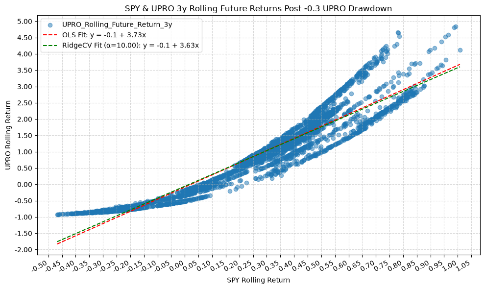
    


                                      OLS Regression Results                                 
    =========================================================================================
    Dep. Variable:     UPRO_Rolling_Future_Return_3y   R-squared:                       0.904
    Model:                                       OLS   Adj. R-squared:                  0.904
    Method:                            Least Squares   F-statistic:                 4.267e+04
    Date:                           Mon, 23 Mar 2026   Prob (F-statistic):               0.00
    Time:                                   22:03:25   Log-Likelihood:                -1584.5
    No. Observations:                           4550   AIC:                             3173.
    Df Residuals:                               4548   BIC:                             3186.
    Df Model:                                      1                                         
    Covariance Type:                       nonrobust                                         
    ================================================================================================
                                       coef    std err          t      P>|t|      [0.025      0.975]
    ------------------------------------------------------------------------------------------------
    const                           -0.0863      0.007    -12.589      0.000      -0.100      -0.073
    SPY_Rolling_Future_Return_3y     3.7615      0.018    206.575      0.000       3.726       3.797
    ==============================================================================
    Omnibus:                      690.118   Durbin-Watson:                   0.019
    Prob(Omnibus):                  0.000   Jarque-Bera (JB):             1788.637
    Skew:                           0.837   Prob(JB):                         0.00
    Kurtosis:                       5.576   Cond. No.                         3.83
    ==============================================================================
    
    Notes:
    [1] Standard Errors assume that the covariance matrix of the errors is correctly specified.


    

    


    
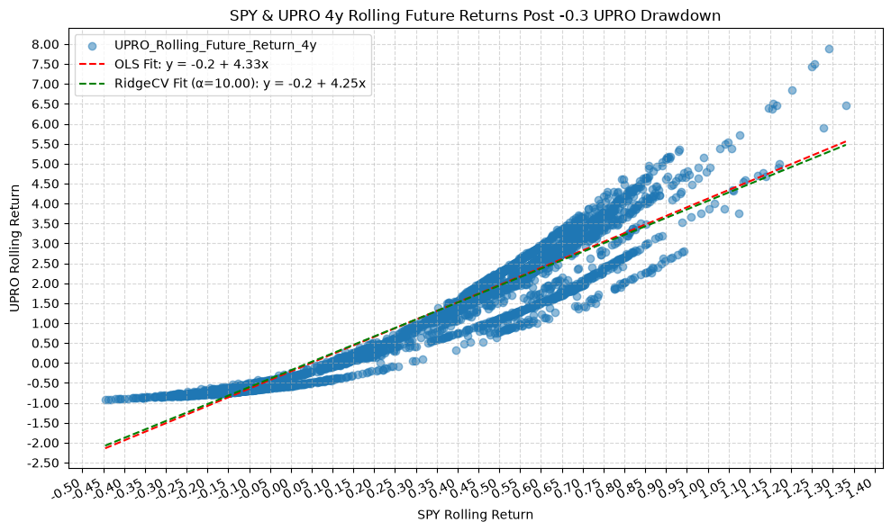
    


                                      OLS Regression Results                                 
    =========================================================================================
    Dep. Variable:     UPRO_Rolling_Future_Return_4y   R-squared:                       0.916
    Model:                                       OLS   Adj. R-squared:                  0.915
    Method:                            Least Squares   F-statistic:                 4.683e+04
    Date:                           Mon, 23 Mar 2026   Prob (F-statistic):               0.00
    Time:                                   22:03:26   Log-Likelihood:                -2643.5
    No. Observations:                           4324   AIC:                             5291.
    Df Residuals:                               4322   BIC:                             5304.
    Df Model:                                      1                                         
    Covariance Type:                       nonrobust                                         
    ================================================================================================
                                       coef    std err          t      P>|t|      [0.025      0.975]
    ------------------------------------------------------------------------------------------------
    const                           -0.2147      0.009    -22.658      0.000      -0.233      -0.196
    SPY_Rolling_Future_Return_4y     4.3728      0.020    216.406      0.000       4.333       4.412
    ==============================================================================
    Omnibus:                      116.085   Durbin-Watson:                   0.023
    Prob(Omnibus):                  0.000   Jarque-Bera (JB):              243.926
    Skew:                          -0.150   Prob(JB):                     1.08e-53
    Kurtosis:                       4.124   Cond. No.                         3.33
    ==============================================================================
    
    Notes:
    [1] Standard Errors assume that the covariance matrix of the errors is correctly specified.


    
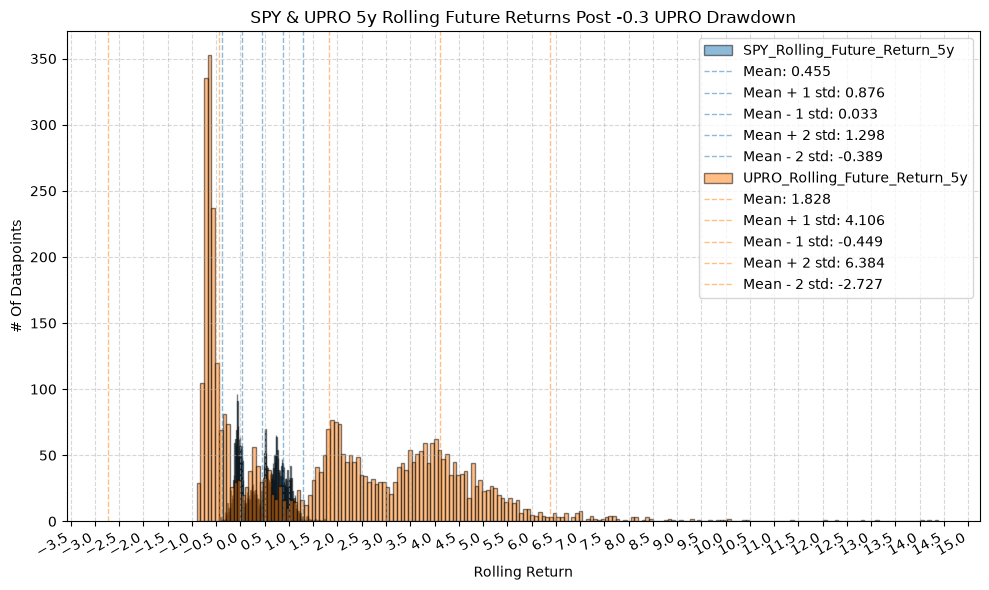
    


    
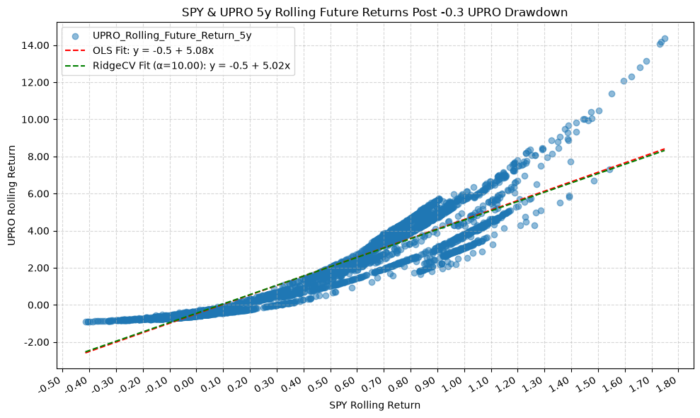
    


                                      OLS Regression Results                                 
    =========================================================================================
    Dep. Variable:     UPRO_Rolling_Future_Return_5y   R-squared:                       0.887
    Model:                                       OLS   Adj. R-squared:                  0.887
    Method:                            Least Squares   F-statistic:                 3.391e+04
    Date:                           Mon, 23 Mar 2026   Prob (F-statistic):               0.00
    Time:                                   22:03:28   Log-Likelihood:                -4969.8
    No. Observations:                           4317   AIC:                             9944.
    Df Residuals:                               4315   BIC:                             9956.
    Df Model:                                      1                                         
    Covariance Type:                       nonrobust                                         
    ================================================================================================
                                       coef    std err          t      P>|t|      [0.025      0.975]
    ------------------------------------------------------------------------------------------------
    const                           -0.4824      0.017    -28.173      0.000      -0.516      -0.449
    SPY_Rolling_Future_Return_5y     5.0840      0.028    184.148      0.000       5.030       5.138
    ==============================================================================
    Omnibus:                      712.609   Durbin-Watson:                   0.017
    Prob(Omnibus):                  0.000   Jarque-Bera (JB):             3461.216
    Skew:                           0.712   Prob(JB):                         0.00
    Kurtosis:                       7.149   Cond. No.                         2.94
    ==============================================================================
    
    Notes:
    [1] Standard Errors assume that the covariance matrix of the errors is correctly specified.


    

    


    
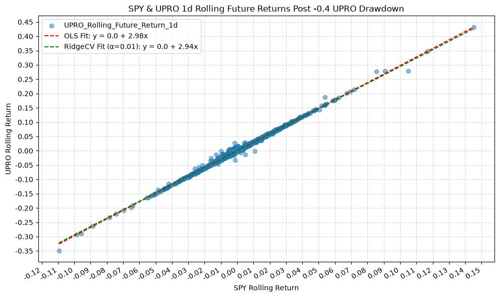
    


                                      OLS Regression Results                                 
    =========================================================================================
    Dep. Variable:     UPRO_Rolling_Future_Return_1d   R-squared:                       0.997
    Model:                                       OLS   Adj. R-squared:                  0.997
    Method:                            Least Squares   F-statistic:                 1.487e+06
    Date:                           Mon, 23 Mar 2026   Prob (F-statistic):               0.00
    Time:                                   22:03:30   Log-Likelihood:                 21081.
    No. Observations:                           4464   AIC:                        -4.216e+04
    Df Residuals:                               4462   BIC:                        -4.214e+04
    Df Model:                                      1                                         
    Covariance Type:                       nonrobust                                         
    ================================================================================================
                                       coef    std err          t      P>|t|      [0.025      0.975]
    ------------------------------------------------------------------------------------------------
    const                           4.4e-05   3.22e-05      1.365      0.172   -1.92e-05       0.000
    SPY_Rolling_Future_Return_1d     2.9791      0.002   1219.596      0.000       2.974       2.984
    ==============================================================================
    Omnibus:                     2686.462   Durbin-Watson:                   2.619
    Prob(Omnibus):                  0.000   Jarque-Bera (JB):          1502620.805
    Skew:                           1.531   Prob(JB):                         0.00
    Kurtosis:                      92.829   Cond. No.                         75.8
    ==============================================================================
    
    Notes:
    [1] Standard Errors assume that the covariance matrix of the errors is correctly specified.


    

    


    

    


                                      OLS Regression Results                                 
    =========================================================================================
    Dep. Variable:     UPRO_Rolling_Future_Return_1w   R-squared:                       0.993
    Model:                                       OLS   Adj. R-squared:                  0.993
    Method:                            Least Squares   F-statistic:                 6.179e+05
    Date:                           Mon, 23 Mar 2026   Prob (F-statistic):               0.00
    Time:                                   22:03:32   Log-Likelihood:                 16080.
    No. Observations:                           4464   AIC:                        -3.216e+04
    Df Residuals:                               4462   BIC:                        -3.214e+04
    Df Model:                                      1                                         
    Covariance Type:                       nonrobust                                         
    ================================================================================================
                                       coef    std err          t      P>|t|      [0.025      0.975]
    ------------------------------------------------------------------------------------------------
    const                           -0.0002    9.9e-05     -1.776      0.076      -0.000    1.83e-05
    SPY_Rolling_Future_Return_1w     2.9716      0.004    786.087      0.000       2.964       2.979
    ==============================================================================
    Omnibus:                     1977.646   Durbin-Watson:                   0.971
    Prob(Omnibus):                  0.000   Jarque-Bera (JB):           519446.713
    Skew:                          -0.905   Prob(JB):                         0.00
    Kurtosis:                      55.815   Cond. No.                         38.3
    ==============================================================================
    
    Notes:
    [1] Standard Errors assume that the covariance matrix of the errors is correctly specified.


    
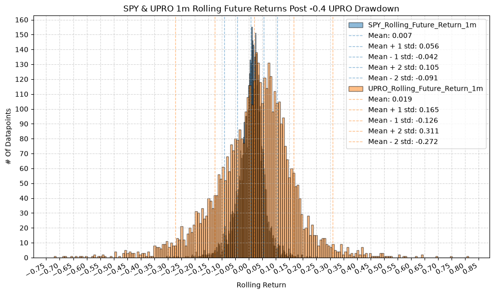
    


    

    


                                      OLS Regression Results                                 
    =========================================================================================
    Dep. Variable:     UPRO_Rolling_Future_Return_1m   R-squared:                       0.986
    Model:                                       OLS   Adj. R-squared:                  0.986
    Method:                            Least Squares   F-statistic:                 3.225e+05
    Date:                           Mon, 23 Mar 2026   Prob (F-statistic):               0.00
    Time:                                   22:03:33   Log-Likelihood:                 11851.
    No. Observations:                           4464   AIC:                        -2.370e+04
    Df Residuals:                               4462   BIC:                        -2.368e+04
    Df Model:                                      1                                         
    Covariance Type:                       nonrobust                                         
    ================================================================================================
                                       coef    std err          t      P>|t|      [0.025      0.975]
    ------------------------------------------------------------------------------------------------
    const                           -0.0009      0.000     -3.419      0.001      -0.001      -0.000
    SPY_Rolling_Future_Return_1m     2.9519      0.005    567.906      0.000       2.942       2.962
    ==============================================================================
    Omnibus:                     2549.897   Durbin-Watson:                   0.358
    Prob(Omnibus):                  0.000   Jarque-Bera (JB):           256138.956
    Skew:                          -1.810   Prob(JB):                         0.00
    Kurtosis:                      39.932   Cond. No.                         20.4
    ==============================================================================
    
    Notes:
    [1] Standard Errors assume that the covariance matrix of the errors is correctly specified.


    
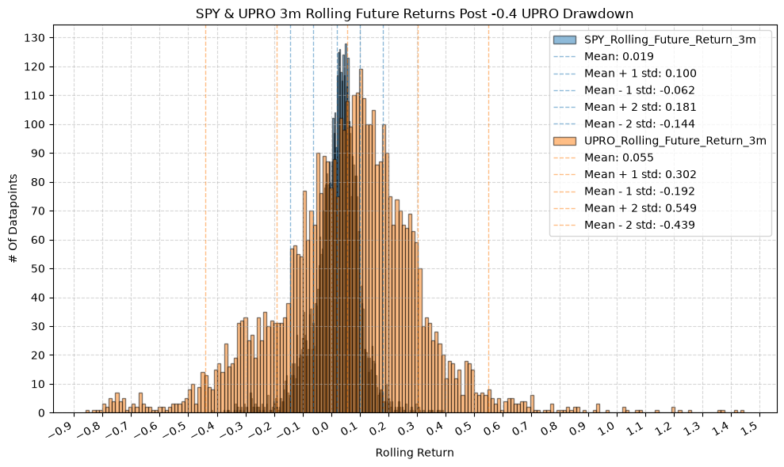
    


    

    


                                      OLS Regression Results                                 
    =========================================================================================
    Dep. Variable:     UPRO_Rolling_Future_Return_3m   R-squared:                       0.978
    Model:                                       OLS   Adj. R-squared:                  0.978
    Method:                            Least Squares   F-statistic:                 2.007e+05
    Date:                           Mon, 23 Mar 2026   Prob (F-statistic):               0.00
    Time:                                   22:03:35   Log-Likelihood:                 8451.7
    No. Observations:                           4464   AIC:                        -1.690e+04
    Df Residuals:                               4462   BIC:                        -1.689e+04
    Df Model:                                      1                                         
    Covariance Type:                       nonrobust                                         
    ================================================================================================
                                       coef    std err          t      P>|t|      [0.025      0.975]
    ------------------------------------------------------------------------------------------------
    const                           -0.0018      0.001     -3.144      0.002      -0.003      -0.001
    SPY_Rolling_Future_Return_3m     3.0074      0.007    448.025      0.000       2.994       3.021
    ==============================================================================
    Omnibus:                     1648.657   Durbin-Watson:                   0.182
    Prob(Omnibus):                  0.000   Jarque-Bera (JB):            57080.700
    Skew:                           1.101   Prob(JB):                         0.00
    Kurtosis:                      20.379   Cond. No.                         12.3
    ==============================================================================
    
    Notes:
    [1] Standard Errors assume that the covariance matrix of the errors is correctly specified.


    
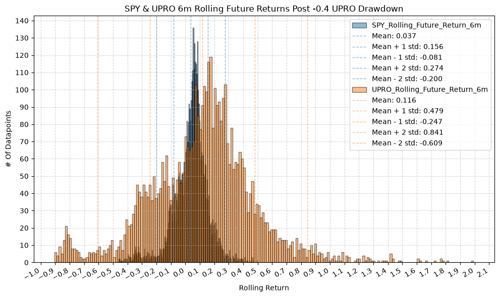
    


    

    


                                      OLS Regression Results                                 
    =========================================================================================
    Dep. Variable:     UPRO_Rolling_Future_Return_6m   R-squared:                       0.959
    Model:                                       OLS   Adj. R-squared:                  0.959
    Method:                            Least Squares   F-statistic:                 1.039e+05
    Date:                           Mon, 23 Mar 2026   Prob (F-statistic):               0.00
    Time:                                   22:03:37   Log-Likelihood:                 5314.6
    No. Observations:                           4464   AIC:                        -1.063e+04
    Df Residuals:                               4462   BIC:                        -1.061e+04
    Df Model:                                      1                                         
    Covariance Type:                       nonrobust                                         
    ================================================================================================
                                       coef    std err          t      P>|t|      [0.025      0.975]
    ------------------------------------------------------------------------------------------------
    const                            0.0040      0.001      3.496      0.000       0.002       0.006
    SPY_Rolling_Future_Return_6m     2.9973      0.009    322.292      0.000       2.979       3.015
    ==============================================================================
    Omnibus:                     1611.711   Durbin-Watson:                   0.081
    Prob(Omnibus):                  0.000   Jarque-Bera (JB):            13011.898
    Skew:                           1.500   Prob(JB):                         0.00
    Kurtosis:                      10.808   Cond. No.                         8.46
    ==============================================================================
    
    Notes:
    [1] Standard Errors assume that the covariance matrix of the errors is correctly specified.


    
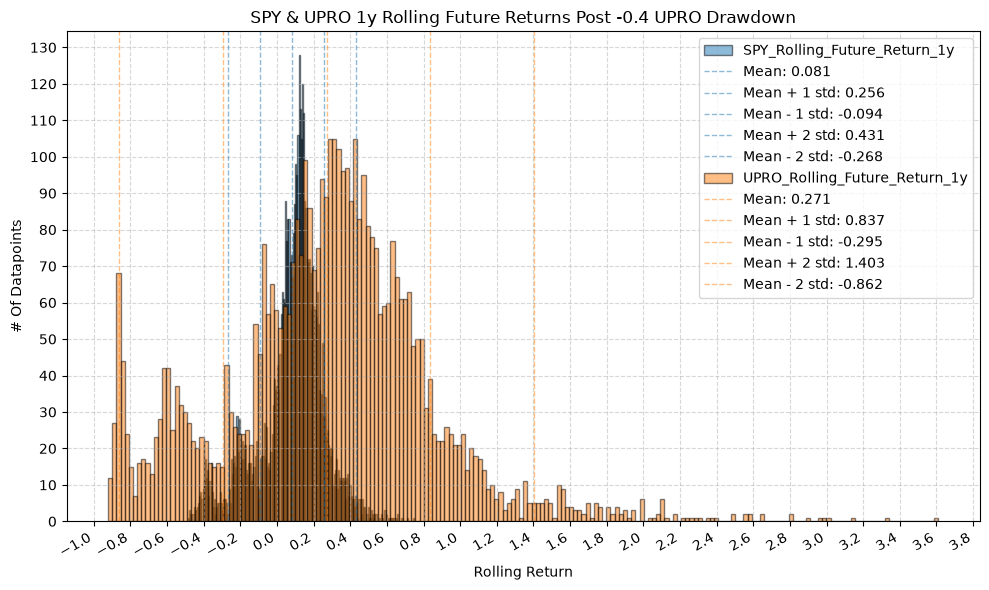
    


    

    


                                      OLS Regression Results                                 
    =========================================================================================
    Dep. Variable:     UPRO_Rolling_Future_Return_1y   R-squared:                       0.936
    Model:                                       OLS   Adj. R-squared:                  0.936
    Method:                            Least Squares   F-statistic:                 6.492e+04
    Date:                           Mon, 23 Mar 2026   Prob (F-statistic):               0.00
    Time:                                   22:03:38   Log-Likelihood:                 2334.8
    No. Observations:                           4456   AIC:                            -4666.
    Df Residuals:                               4454   BIC:                            -4653.
    Df Model:                                      1                                         
    Covariance Type:                       nonrobust                                         
    ================================================================================================
                                       coef    std err          t      P>|t|      [0.025      0.975]
    ------------------------------------------------------------------------------------------------
    const                            0.0162      0.002      6.864      0.000       0.012       0.021
    SPY_Rolling_Future_Return_1y     3.1340      0.012    254.788      0.000       3.110       3.158
    ==============================================================================
    Omnibus:                     1684.730   Durbin-Watson:                   0.054
    Prob(Omnibus):                  0.000   Jarque-Bera (JB):            11774.002
    Skew:                           1.634   Prob(JB):                         0.00
    Kurtosis:                      10.262   Cond. No.                         5.77
    ==============================================================================
    
    Notes:
    [1] Standard Errors assume that the covariance matrix of the errors is correctly specified.


    

    


    
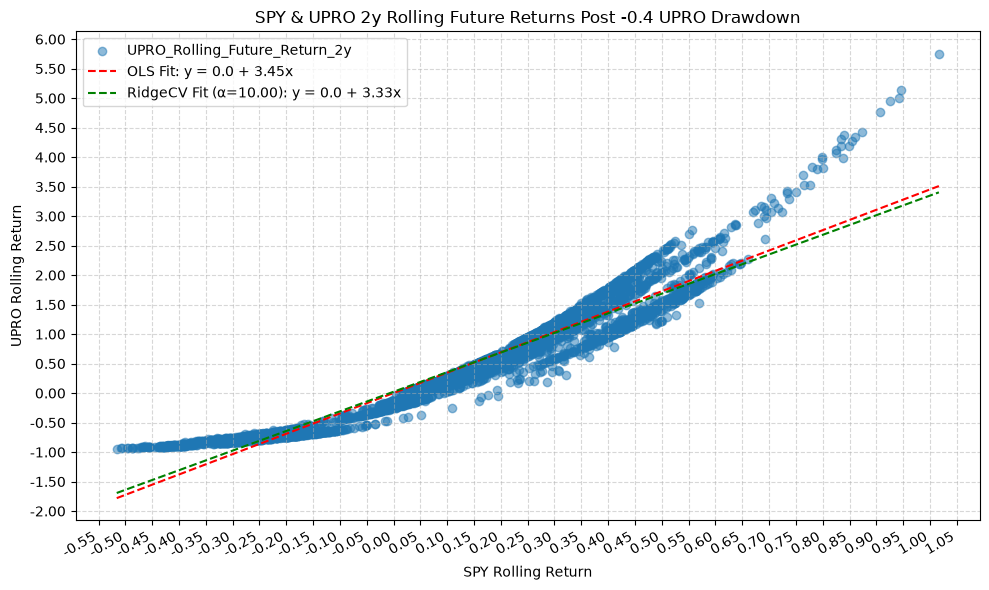
    


                                      OLS Regression Results                                 
    =========================================================================================
    Dep. Variable:     UPRO_Rolling_Future_Return_2y   R-squared:                       0.907
    Model:                                       OLS   Adj. R-squared:                  0.907
    Method:                            Least Squares   F-statistic:                 4.353e+04
    Date:                           Mon, 23 Mar 2026   Prob (F-statistic):               0.00
    Time:                                   22:03:40   Log-Likelihood:                -457.01
    No. Observations:                           4456   AIC:                             918.0
    Df Residuals:                               4454   BIC:                             930.8
    Df Model:                                      1                                         
    Covariance Type:                       nonrobust                                         
    ================================================================================================
                                       coef    std err          t      P>|t|      [0.025      0.975]
    ------------------------------------------------------------------------------------------------
    const                            0.0011      0.005      0.224      0.823      -0.009       0.011
    SPY_Rolling_Future_Return_2y     3.4516      0.017    208.650      0.000       3.419       3.484
    ==============================================================================
    Omnibus:                     1243.396   Durbin-Watson:                   0.033
    Prob(Omnibus):                  0.000   Jarque-Bera (JB):             4602.198
    Skew:                           1.354   Prob(JB):                         0.00
    Kurtosis:                       7.178   Cond. No.                         4.25
    ==============================================================================
    
    Notes:
    [1] Standard Errors assume that the covariance matrix of the errors is correctly specified.


    
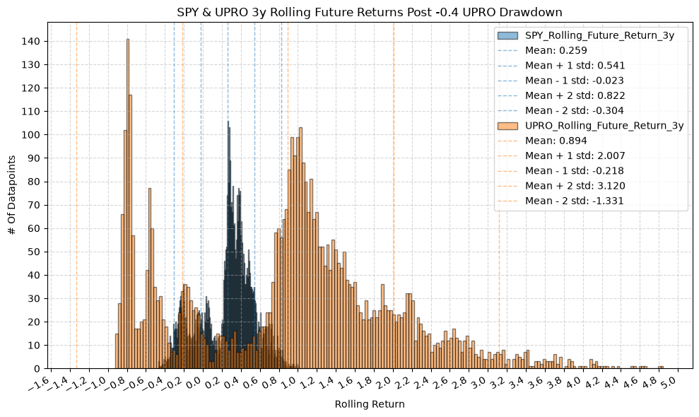
    


    
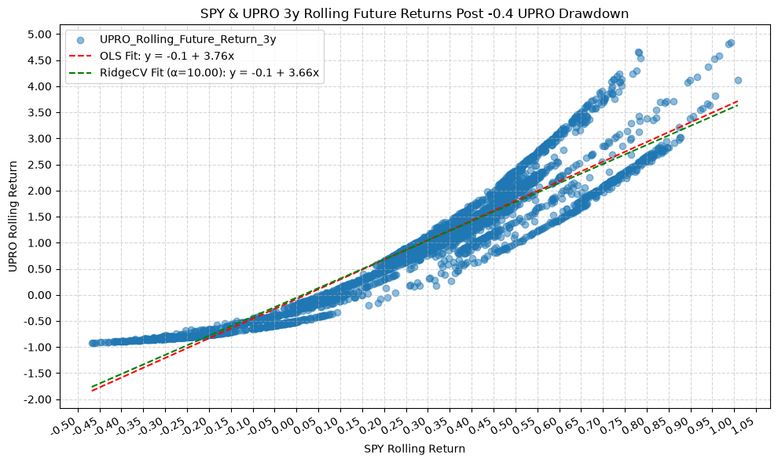
    


                                      OLS Regression Results                                 
    =========================================================================================
    Dep. Variable:     UPRO_Rolling_Future_Return_3y   R-squared:                       0.907
    Model:                                       OLS   Adj. R-squared:                  0.907
    Method:                            Least Squares   F-statistic:                 4.211e+04
    Date:                           Mon, 23 Mar 2026   Prob (F-statistic):               0.00
    Time:                                   22:03:42   Log-Likelihood:                -1446.7
    No. Observations:                           4328   AIC:                             2897.
    Df Residuals:                               4326   BIC:                             2910.
    Df Model:                                      1                                         
    Covariance Type:                       nonrobust                                         
    ================================================================================================
                                       coef    std err          t      P>|t|      [0.025      0.975]
    ------------------------------------------------------------------------------------------------
    const                           -0.0835      0.007    -12.022      0.000      -0.097      -0.070
    SPY_Rolling_Future_Return_3y     3.7973      0.019    205.205      0.000       3.761       3.834
    ==============================================================================
    Omnibus:                      704.595   Durbin-Watson:                   0.022
    Prob(Omnibus):                  0.000   Jarque-Bera (JB):             1810.678
    Skew:                           0.895   Prob(JB):                         0.00
    Kurtosis:                       5.615   Cond. No.                         3.85
    ==============================================================================
    
    Notes:
    [1] Standard Errors assume that the covariance matrix of the errors is correctly specified.


    

    


    
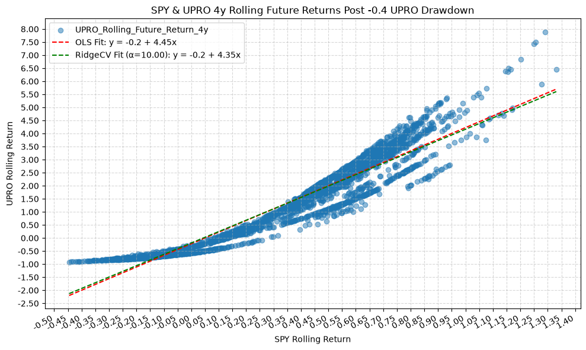
    


                                      OLS Regression Results                                 
    =========================================================================================
    Dep. Variable:     UPRO_Rolling_Future_Return_4y   R-squared:                       0.926
    Model:                                       OLS   Adj. R-squared:                  0.926
    Method:                            Least Squares   F-statistic:                 5.187e+04
    Date:                           Mon, 23 Mar 2026   Prob (F-statistic):               0.00
    Time:                                   22:03:43   Log-Likelihood:                -2273.5
    No. Observations:                           4126   AIC:                             4551.
    Df Residuals:                               4124   BIC:                             4564.
    Df Model:                                      1                                         
    Covariance Type:                       nonrobust                                         
    ================================================================================================
                                       coef    std err          t      P>|t|      [0.025      0.975]
    ------------------------------------------------------------------------------------------------
    const                           -0.2232      0.009    -24.382      0.000      -0.241      -0.205
    SPY_Rolling_Future_Return_4y     4.4750      0.020    227.749      0.000       4.436       4.513
    ==============================================================================
    Omnibus:                      119.459   Durbin-Watson:                   0.024
    Prob(Omnibus):                  0.000   Jarque-Bera (JB):              294.579
    Skew:                          -0.074   Prob(JB):                     1.08e-64
    Kurtosis:                       4.301   Cond. No.                         3.36
    ==============================================================================
    
    Notes:
    [1] Standard Errors assume that the covariance matrix of the errors is correctly specified.


    

    


    
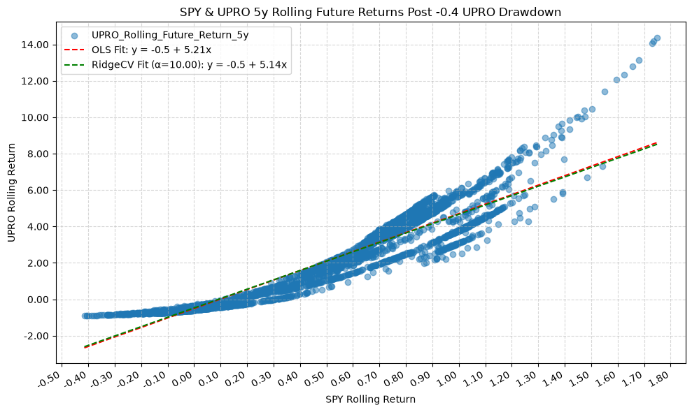
    


                                      OLS Regression Results                                 
    =========================================================================================
    Dep. Variable:     UPRO_Rolling_Future_Return_5y   R-squared:                       0.896
    Model:                                       OLS   Adj. R-squared:                  0.896
    Method:                            Least Squares   F-statistic:                 3.555e+04
    Date:                           Mon, 23 Mar 2026   Prob (F-statistic):               0.00
    Time:                                   22:03:45   Log-Likelihood:                -4610.5
    No. Observations:                           4126   AIC:                             9225.
    Df Residuals:                               4124   BIC:                             9238.
    Df Model:                                      1                                         
    Covariance Type:                       nonrobust                                         
    ================================================================================================
                                       coef    std err          t      P>|t|      [0.025      0.975]
    ------------------------------------------------------------------------------------------------
    const                           -0.5058      0.017    -29.864      0.000      -0.539      -0.473
    SPY_Rolling_Future_Return_5y     5.2121      0.028    188.535      0.000       5.158       5.266
    ==============================================================================
    Omnibus:                      688.391   Durbin-Watson:                   0.019
    Prob(Omnibus):                  0.000   Jarque-Bera (JB):             3304.496
    Skew:                           0.724   Prob(JB):                         0.00
    Kurtosis:                       7.138   Cond. No.                         2.96
    ==============================================================================
    
    Notes:
    [1] Standard Errors assume that the covariance matrix of the errors is correctly specified.


    
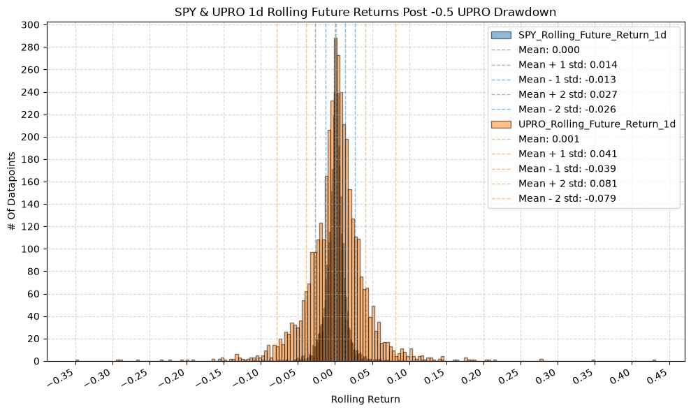
    


    
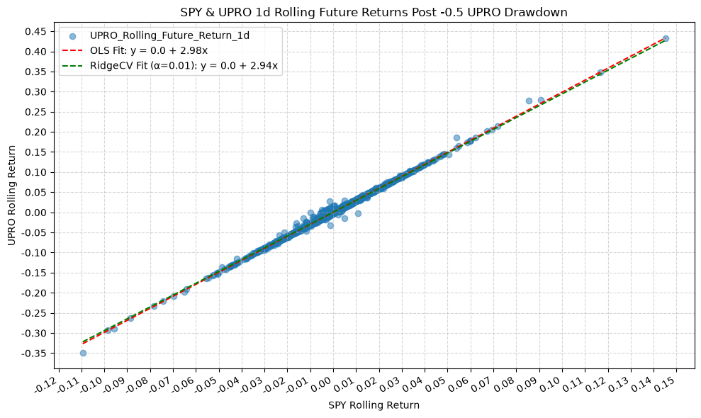
    


                                      OLS Regression Results                                 
    =========================================================================================
    Dep. Variable:     UPRO_Rolling_Future_Return_1d   R-squared:                       0.997
    Model:                                       OLS   Adj. R-squared:                  0.997
    Method:                            Least Squares   F-statistic:                 1.337e+06
    Date:                           Mon, 23 Mar 2026   Prob (F-statistic):               0.00
    Time:                                   22:03:47   Log-Likelihood:                 18275.
    No. Observations:                           3869   AIC:                        -3.655e+04
    Df Residuals:                               3867   BIC:                        -3.653e+04
    Df Model:                                      1                                         
    Covariance Type:                       nonrobust                                         
    ================================================================================================
                                       coef    std err          t      P>|t|      [0.025      0.975]
    ------------------------------------------------------------------------------------------------
    const                         5.793e-05   3.46e-05      1.675      0.094   -9.88e-06       0.000
    SPY_Rolling_Future_Return_1d     2.9842      0.003   1156.072      0.000       2.979       2.989
    ==============================================================================
    Omnibus:                     2831.178   Durbin-Watson:                   2.689
    Prob(Omnibus):                  0.000   Jarque-Bera (JB):          1196713.827
    Skew:                           2.308   Prob(JB):                         0.00
    Kurtosis:                      89.035   Cond. No.                         74.7
    ==============================================================================
    
    Notes:
    [1] Standard Errors assume that the covariance matrix of the errors is correctly specified.


    

    


    

    


                                      OLS Regression Results                                 
    =========================================================================================
    Dep. Variable:     UPRO_Rolling_Future_Return_1w   R-squared:                       0.993
    Model:                                       OLS   Adj. R-squared:                  0.993
    Method:                            Least Squares   F-statistic:                 5.120e+05
    Date:                           Mon, 23 Mar 2026   Prob (F-statistic):               0.00
    Time:                                   22:03:49   Log-Likelihood:                 13820.
    No. Observations:                           3869   AIC:                        -2.764e+04
    Df Residuals:                               3867   BIC:                        -2.762e+04
    Df Model:                                      1                                         
    Covariance Type:                       nonrobust                                         
    ================================================================================================
                                       coef    std err          t      P>|t|      [0.025      0.975]
    ------------------------------------------------------------------------------------------------
    const                           -0.0001      0.000     -0.991      0.322      -0.000       0.000
    SPY_Rolling_Future_Return_1w     2.9702      0.004    715.546      0.000       2.962       2.978
    ==============================================================================
    Omnibus:                     1718.530   Durbin-Watson:                   1.003
    Prob(Omnibus):                  0.000   Jarque-Bera (JB):           451630.478
    Skew:                          -0.906   Prob(JB):                         0.00
    Kurtosis:                      55.899   Cond. No.                         38.0
    ==============================================================================
    
    Notes:
    [1] Standard Errors assume that the covariance matrix of the errors is correctly specified.


    
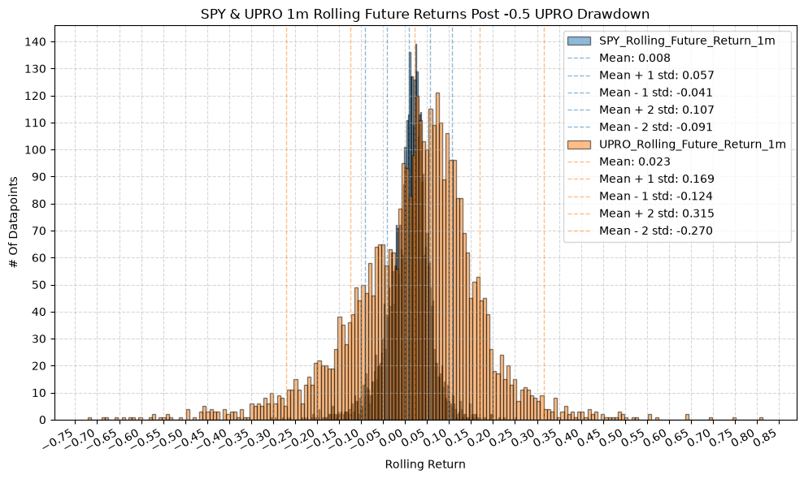
    


    
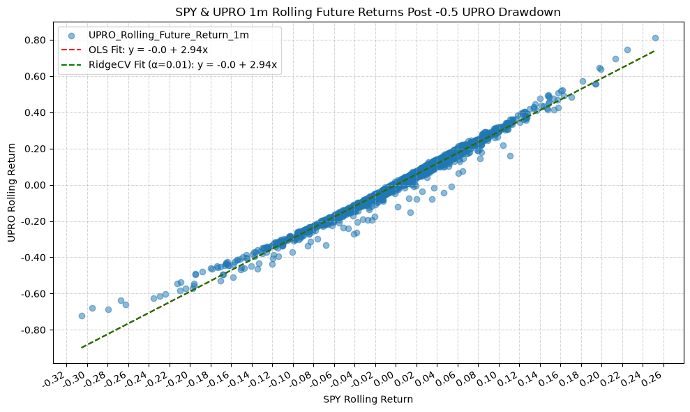
    


                                      OLS Regression Results                                 
    =========================================================================================
    Dep. Variable:     UPRO_Rolling_Future_Return_1m   R-squared:                       0.986
    Model:                                       OLS   Adj. R-squared:                  0.986
    Method:                            Least Squares   F-statistic:                 2.737e+05
    Date:                           Mon, 23 Mar 2026   Prob (F-statistic):               0.00
    Time:                                   22:03:51   Log-Likelihood:                 10213.
    No. Observations:                           3869   AIC:                        -2.042e+04
    Df Residuals:                               3867   BIC:                        -2.041e+04
    Df Model:                                      1                                         
    Covariance Type:                       nonrobust                                         
    ================================================================================================
                                       coef    std err          t      P>|t|      [0.025      0.975]
    ------------------------------------------------------------------------------------------------
    const                           -0.0008      0.000     -2.729      0.006      -0.001      -0.000
    SPY_Rolling_Future_Return_1m     2.9438      0.006    523.149      0.000       2.933       2.955
    ==============================================================================
    Omnibus:                     2104.983   Durbin-Watson:                   0.385
    Prob(Omnibus):                  0.000   Jarque-Bera (JB):           199121.381
    Skew:                          -1.679   Prob(JB):                         0.00
    Kurtosis:                      37.984   Cond. No.                         20.3
    ==============================================================================
    
    Notes:
    [1] Standard Errors assume that the covariance matrix of the errors is correctly specified.


    
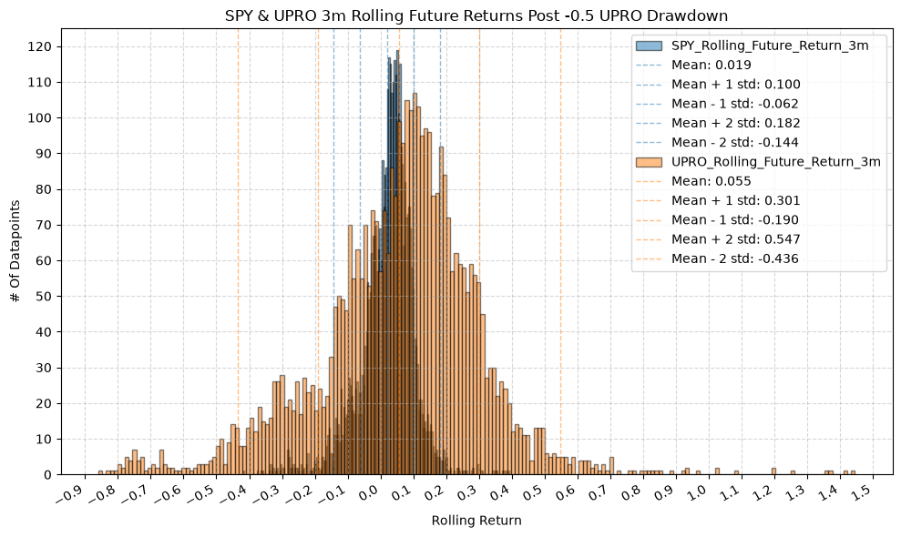
    


    

    


                                      OLS Regression Results                                 
    =========================================================================================
    Dep. Variable:     UPRO_Rolling_Future_Return_3m   R-squared:                       0.978
    Model:                                       OLS   Adj. R-squared:                  0.978
    Method:                            Least Squares   F-statistic:                 1.700e+05
    Date:                           Mon, 23 Mar 2026   Prob (F-statistic):               0.00
    Time:                                   22:03:52   Log-Likelihood:                 7302.1
    No. Observations:                           3869   AIC:                        -1.460e+04
    Df Residuals:                               3867   BIC:                        -1.459e+04
    Df Model:                                      1                                         
    Covariance Type:                       nonrobust                                         
    ================================================================================================
                                       coef    std err          t      P>|t|      [0.025      0.975]
    ------------------------------------------------------------------------------------------------
    const                           -0.0011      0.001     -1.895      0.058      -0.002    3.98e-05
    SPY_Rolling_Future_Return_3m     2.9839      0.007    412.319      0.000       2.970       2.998
    ==============================================================================
    Omnibus:                     1374.050   Durbin-Watson:                   0.193
    Prob(Omnibus):                  0.000   Jarque-Bera (JB):            42996.583
    Skew:                           1.059   Prob(JB):                         0.00
    Kurtosis:                      19.194   Cond. No.                         12.3
    ==============================================================================
    
    Notes:
    [1] Standard Errors assume that the covariance matrix of the errors is correctly specified.


    

    


    
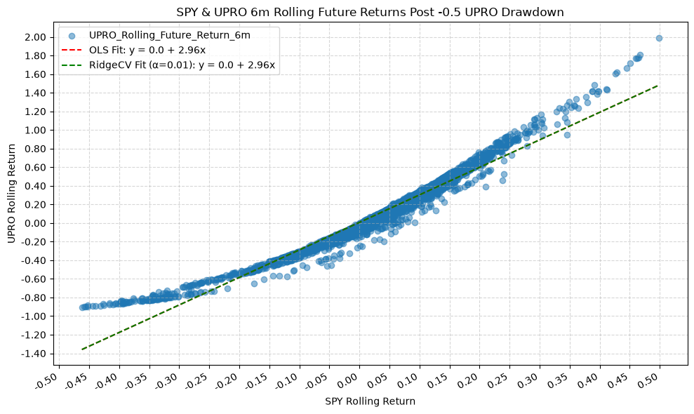
    


                                      OLS Regression Results                                 
    =========================================================================================
    Dep. Variable:     UPRO_Rolling_Future_Return_6m   R-squared:                       0.957
    Model:                                       OLS   Adj. R-squared:                  0.957
    Method:                            Least Squares   F-statistic:                 8.586e+04
    Date:                           Mon, 23 Mar 2026   Prob (F-statistic):               0.00
    Time:                                   22:03:54   Log-Likelihood:                 4529.2
    No. Observations:                           3869   AIC:                            -9054.
    Df Residuals:                               3867   BIC:                            -9042.
    Df Model:                                      1                                         
    Covariance Type:                       nonrobust                                         
    ================================================================================================
                                       coef    std err          t      P>|t|      [0.025      0.975]
    ------------------------------------------------------------------------------------------------
    const                            0.0067      0.001      5.303      0.000       0.004       0.009
    SPY_Rolling_Future_Return_6m     2.9568      0.010    293.014      0.000       2.937       2.977
    ==============================================================================
    Omnibus:                     1291.522   Durbin-Watson:                   0.081
    Prob(Omnibus):                  0.000   Jarque-Bera (JB):             9377.484
    Skew:                           1.396   Prob(JB):                         0.00
    Kurtosis:                      10.098   Cond. No.                         8.37
    ==============================================================================
    
    Notes:
    [1] Standard Errors assume that the covariance matrix of the errors is correctly specified.


    

    


    
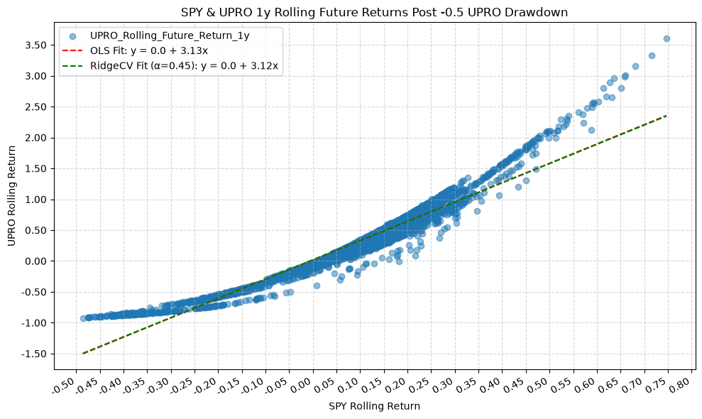
    


                                      OLS Regression Results                                 
    =========================================================================================
    Dep. Variable:     UPRO_Rolling_Future_Return_1y   R-squared:                       0.933
    Model:                                       OLS   Adj. R-squared:                  0.933
    Method:                            Least Squares   F-statistic:                 5.405e+04
    Date:                           Mon, 23 Mar 2026   Prob (F-statistic):               0.00
    Time:                                   22:03:56   Log-Likelihood:                 1956.3
    No. Observations:                           3869   AIC:                            -3909.
    Df Residuals:                               3867   BIC:                            -3896.
    Df Model:                                      1                                         
    Covariance Type:                       nonrobust                                         
    ================================================================================================
                                       coef    std err          t      P>|t|      [0.025      0.975]
    ------------------------------------------------------------------------------------------------
    const                            0.0175      0.003      6.793      0.000       0.012       0.023
    SPY_Rolling_Future_Return_1y     3.1290      0.013    232.490      0.000       3.103       3.155
    ==============================================================================
    Omnibus:                     1513.598   Durbin-Watson:                   0.057
    Prob(Omnibus):                  0.000   Jarque-Bera (JB):            11118.231
    Skew:                           1.681   Prob(JB):                         0.00
    Kurtosis:                      10.594   Cond. No.                         5.77
    ==============================================================================
    
    Notes:
    [1] Standard Errors assume that the covariance matrix of the errors is correctly specified.


    

    


    
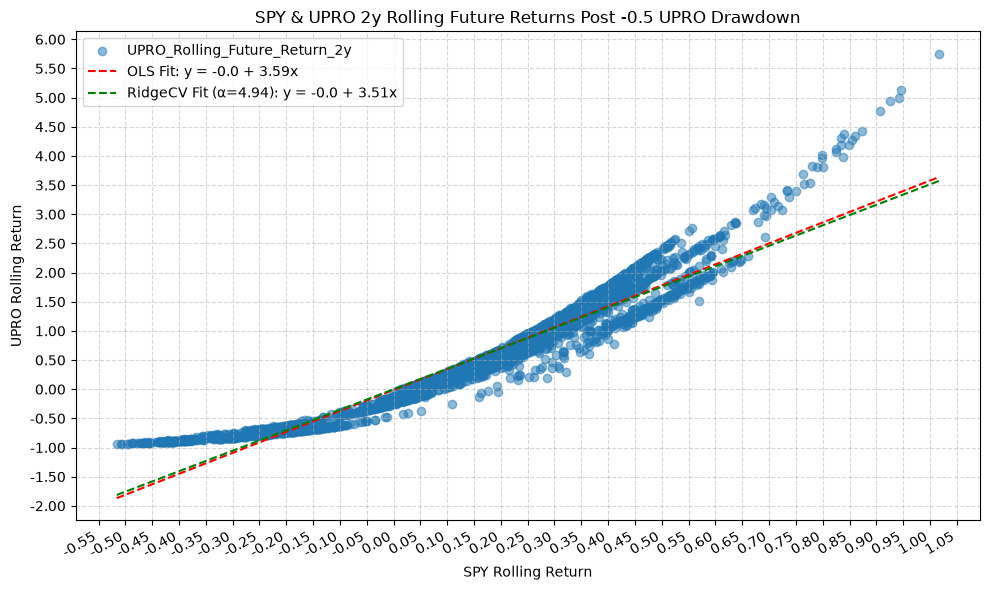
    


                                      OLS Regression Results                                 
    =========================================================================================
    Dep. Variable:     UPRO_Rolling_Future_Return_2y   R-squared:                       0.912
    Model:                                       OLS   Adj. R-squared:                  0.912
    Method:                            Least Squares   F-statistic:                 4.020e+04
    Date:                           Mon, 23 Mar 2026   Prob (F-statistic):               0.00
    Time:                                   22:03:57   Log-Likelihood:                -378.23
    No. Observations:                           3869   AIC:                             760.5
    Df Residuals:                               3867   BIC:                             773.0
    Df Model:                                      1                                         
    Covariance Type:                       nonrobust                                         
    ================================================================================================
                                       coef    std err          t      P>|t|      [0.025      0.975]
    ------------------------------------------------------------------------------------------------
    const                           -0.0141      0.005     -2.682      0.007      -0.024      -0.004
    SPY_Rolling_Future_Return_2y     3.5919      0.018    200.490      0.000       3.557       3.627
    ==============================================================================
    Omnibus:                     1083.389   Durbin-Watson:                   0.036
    Prob(Omnibus):                  0.000   Jarque-Bera (JB):             3625.480
    Skew:                           1.395   Prob(JB):                         0.00
    Kurtosis:                       6.835   Cond. No.                         4.30
    ==============================================================================
    
    Notes:
    [1] Standard Errors assume that the covariance matrix of the errors is correctly specified.


    
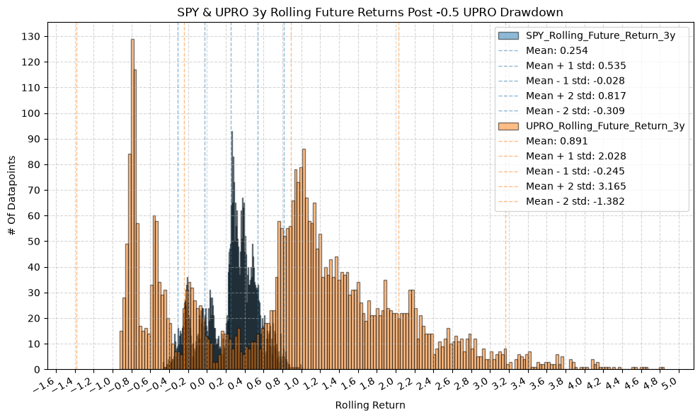
    


    
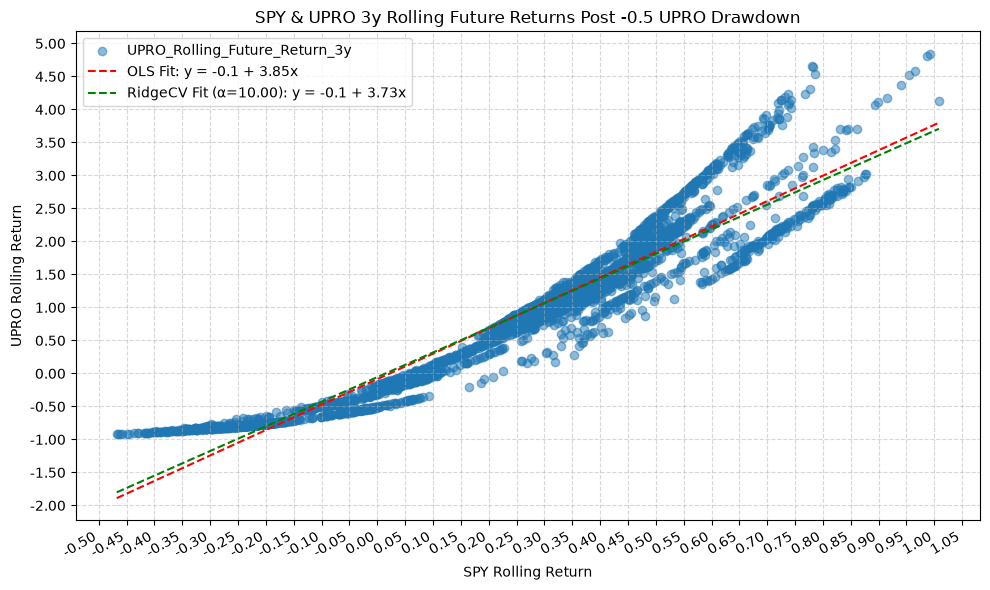
    


                                      OLS Regression Results                                 
    =========================================================================================
    Dep. Variable:     UPRO_Rolling_Future_Return_3y   R-squared:                       0.911
    Model:                                       OLS   Adj. R-squared:                  0.911
    Method:                            Least Squares   F-statistic:                 3.905e+04
    Date:                           Mon, 23 Mar 2026   Prob (F-statistic):               0.00
    Time:                                   22:03:59   Log-Likelihood:                -1297.7
    No. Observations:                           3835   AIC:                             2599.
    Df Residuals:                               3833   BIC:                             2612.
    Df Model:                                      1                                         
    Covariance Type:                       nonrobust                                         
    ================================================================================================
                                       coef    std err          t      P>|t|      [0.025      0.975]
    ------------------------------------------------------------------------------------------------
    const                           -0.0881      0.007    -11.975      0.000      -0.103      -0.074
    SPY_Rolling_Future_Return_3y     3.8745      0.020    197.618      0.000       3.836       3.913
    ==============================================================================
    Omnibus:                      633.347   Durbin-Watson:                   0.022
    Prob(Omnibus):                  0.000   Jarque-Bera (JB):             1404.095
    Skew:                           0.957   Prob(JB):                    1.27e-305
    Kurtosis:                       5.264   Cond. No.                         3.82
    ==============================================================================
    
    Notes:
    [1] Standard Errors assume that the covariance matrix of the errors is correctly specified.


    
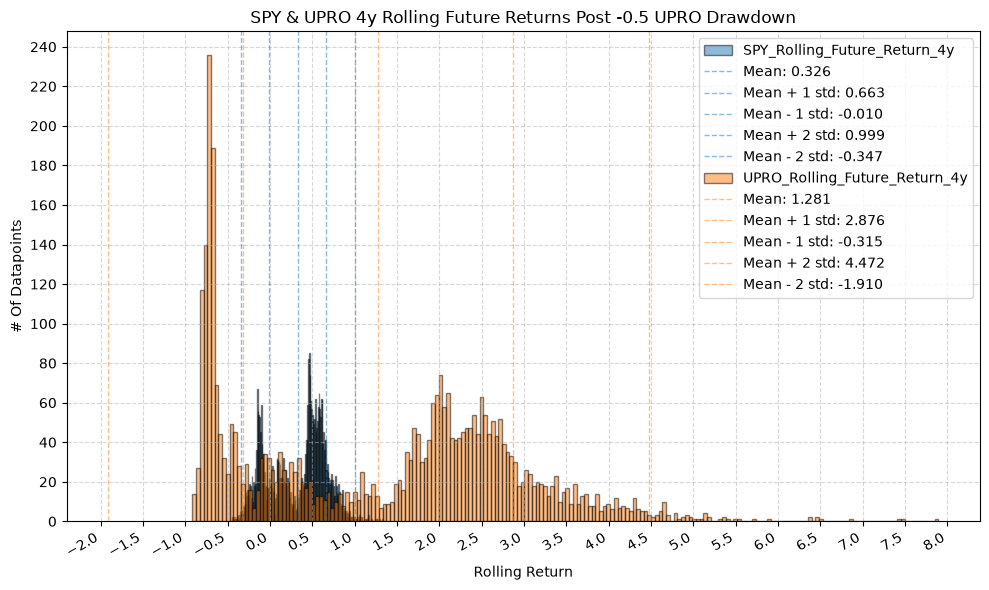
    


    
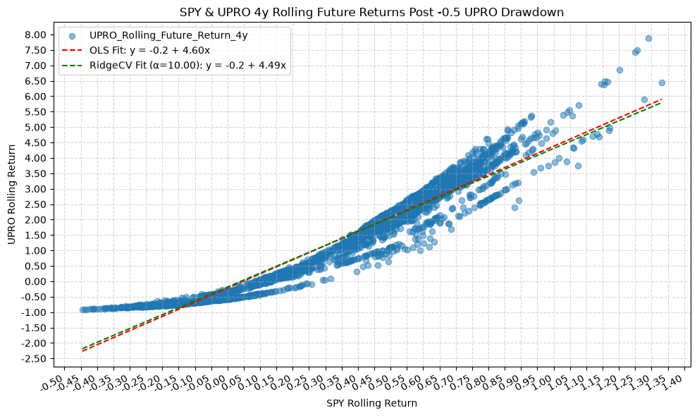
    


                                      OLS Regression Results                                 
    =========================================================================================
    Dep. Variable:     UPRO_Rolling_Future_Return_4y   R-squared:                       0.940
    Model:                                       OLS   Adj. R-squared:                  0.940
    Method:                            Least Squares   F-statistic:                 5.808e+04
    Date:                           Mon, 23 Mar 2026   Prob (F-statistic):               0.00
    Time:                                   22:04:01   Log-Likelihood:                -1763.7
    No. Observations:                           3694   AIC:                             3531.
    Df Residuals:                               3692   BIC:                             3544.
    Df Model:                                      1                                         
    Covariance Type:                       nonrobust                                         
    ================================================================================================
                                       coef    std err          t      P>|t|      [0.025      0.975]
    ------------------------------------------------------------------------------------------------
    const                           -0.2198      0.009    -24.572      0.000      -0.237      -0.202
    SPY_Rolling_Future_Return_4y     4.5977      0.019    240.993      0.000       4.560       4.635
    ==============================================================================
    Omnibus:                      140.743   Durbin-Watson:                   0.030
    Prob(Omnibus):                  0.000   Jarque-Bera (JB):              414.327
    Skew:                           0.067   Prob(JB):                     1.07e-90
    Kurtosis:                       4.635   Cond. No.                         3.32
    ==============================================================================
    
    Notes:
    [1] Standard Errors assume that the covariance matrix of the errors is correctly specified.


    
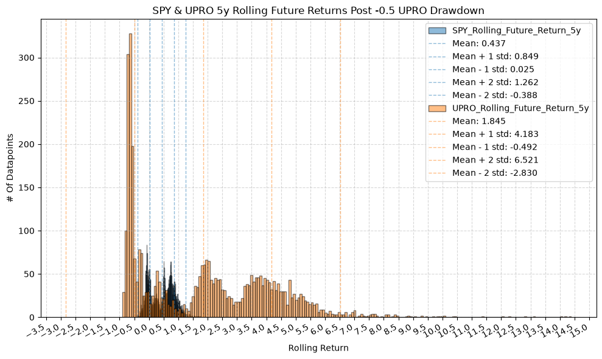
    


    
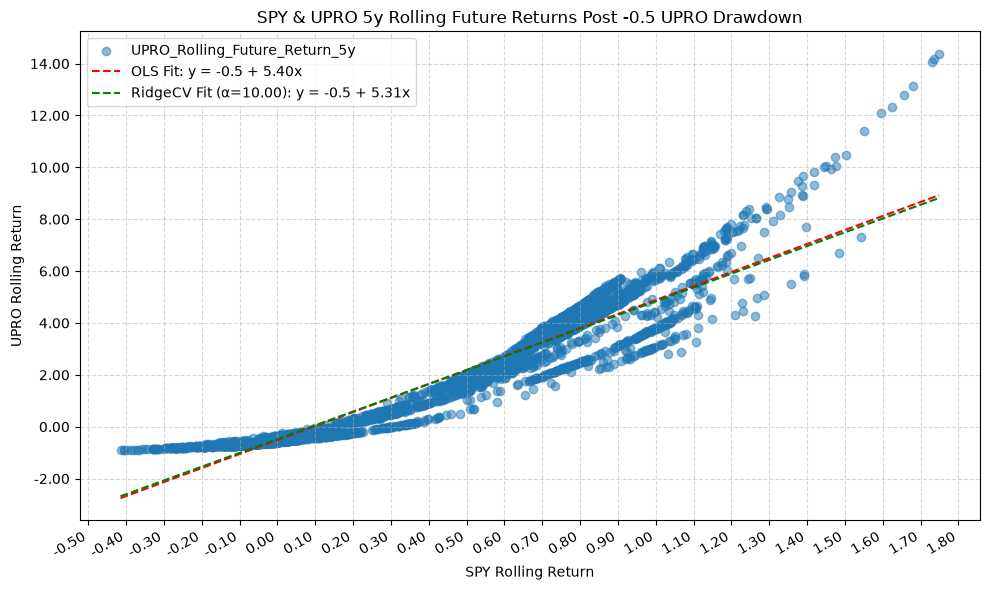
    


                                      OLS Regression Results                                 
    =========================================================================================
    Dep. Variable:     UPRO_Rolling_Future_Return_5y   R-squared:                       0.907
    Model:                                       OLS   Adj. R-squared:                  0.907
    Method:                            Least Squares   F-statistic:                 3.596e+04
    Date:                           Mon, 23 Mar 2026   Prob (F-statistic):               0.00
    Time:                                   22:04:02   Log-Likelihood:                -3993.5
    No. Observations:                           3694   AIC:                             7991.
    Df Residuals:                               3692   BIC:                             8003.
    Df Model:                                      1                                         
    Covariance Type:                       nonrobust                                         
    ================================================================================================
                                       coef    std err          t      P>|t|      [0.025      0.975]
    ------------------------------------------------------------------------------------------------
    const                           -0.5138      0.017    -30.038      0.000      -0.547      -0.480
    SPY_Rolling_Future_Return_5y     5.3997      0.028    189.643      0.000       5.344       5.456
    ==============================================================================
    Omnibus:                      550.645   Durbin-Watson:                   0.022
    Prob(Omnibus):                  0.000   Jarque-Bera (JB):             2880.308
    Skew:                           0.608   Prob(JB):                         0.00
    Kurtosis:                       7.151   Cond. No.                         2.96
    ==============================================================================
    
    Notes:
    [1] Standard Errors assume that the covariance matrix of the errors is correctly specified.


    

    


    
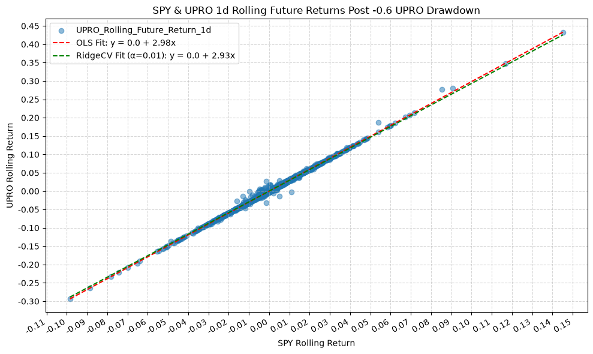
    


                                      OLS Regression Results                                 
    =========================================================================================
    Dep. Variable:     UPRO_Rolling_Future_Return_1d   R-squared:                       0.997
    Model:                                       OLS   Adj. R-squared:                  0.997
    Method:                            Least Squares   F-statistic:                 1.059e+06
    Date:                           Mon, 23 Mar 2026   Prob (F-statistic):               0.00
    Time:                                   22:04:04   Log-Likelihood:                 14432.
    No. Observations:                           3070   AIC:                        -2.886e+04
    Df Residuals:                               3068   BIC:                        -2.885e+04
    Df Model:                                      1                                         
    Covariance Type:                       nonrobust                                         
    ================================================================================================
                                       coef    std err          t      P>|t|      [0.025      0.975]
    ------------------------------------------------------------------------------------------------
    const                         7.426e-05   3.97e-05      1.869      0.062   -3.64e-06       0.000
    SPY_Rolling_Future_Return_1d     2.9824      0.003   1028.858      0.000       2.977       2.988
    ==============================================================================
    Omnibus:                     2273.415   Durbin-Watson:                   2.537
    Prob(Omnibus):                  0.000   Jarque-Bera (JB):          1052816.390
    Skew:                           2.319   Prob(JB):                         0.00
    Kurtosis:                      93.603   Cond. No.                         73.0
    ==============================================================================
    
    Notes:
    [1] Standard Errors assume that the covariance matrix of the errors is correctly specified.


    
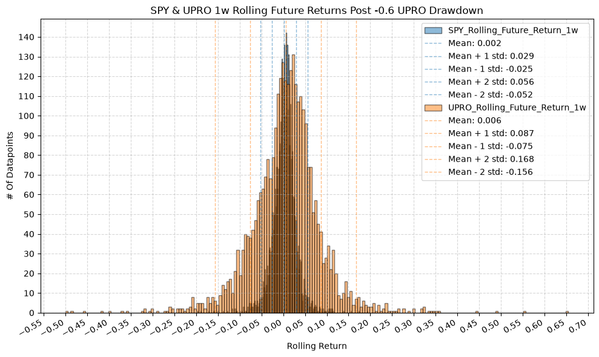
    


    
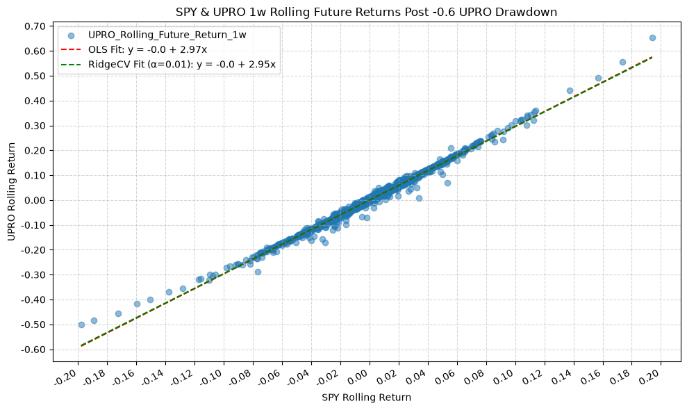
    


                                      OLS Regression Results                                 
    =========================================================================================
    Dep. Variable:     UPRO_Rolling_Future_Return_1w   R-squared:                       0.992
    Model:                                       OLS   Adj. R-squared:                  0.992
    Method:                            Least Squares   F-statistic:                 3.762e+05
    Date:                           Mon, 23 Mar 2026   Prob (F-statistic):               0.00
    Time:                                   22:04:06   Log-Likelihood:                 10750.
    No. Observations:                           3070   AIC:                        -2.150e+04
    Df Residuals:                               3068   BIC:                        -2.148e+04
    Df Model:                                      1                                         
    Covariance Type:                       nonrobust                                         
    ================================================================================================
                                       coef    std err          t      P>|t|      [0.025      0.975]
    ------------------------------------------------------------------------------------------------
    const                           -0.0001      0.000     -1.041      0.298      -0.000       0.000
    SPY_Rolling_Future_Return_1w     2.9677      0.005    613.333      0.000       2.958       2.977
    ==============================================================================
    Omnibus:                     1399.487   Durbin-Watson:                   1.060
    Prob(Omnibus):                  0.000   Jarque-Bera (JB):           313356.086
    Skew:                          -0.996   Prob(JB):                         0.00
    Kurtosis:                      52.454   Cond. No.                         36.7
    ==============================================================================
    
    Notes:
    [1] Standard Errors assume that the covariance matrix of the errors is correctly specified.


    
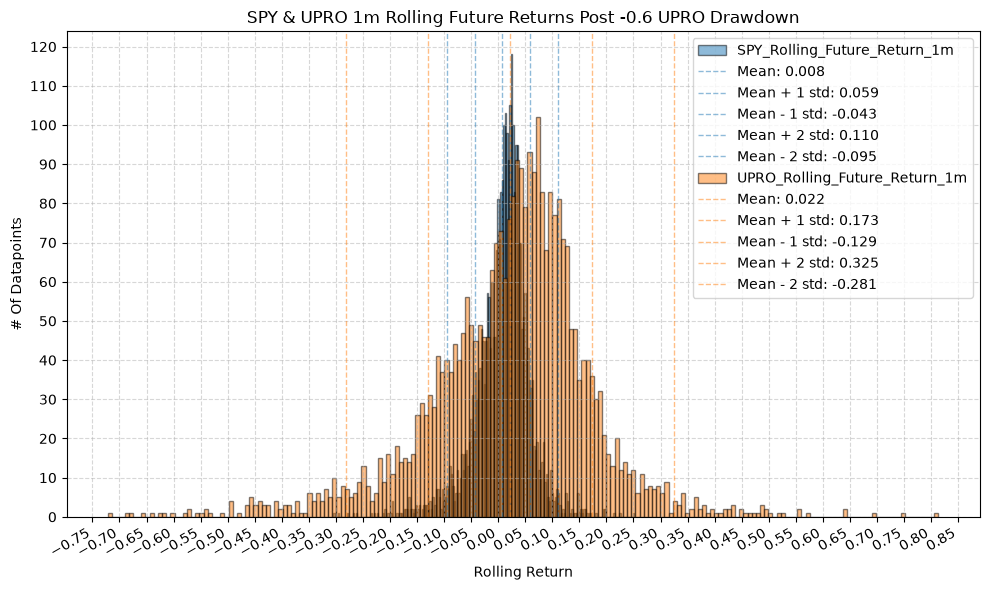
    


    
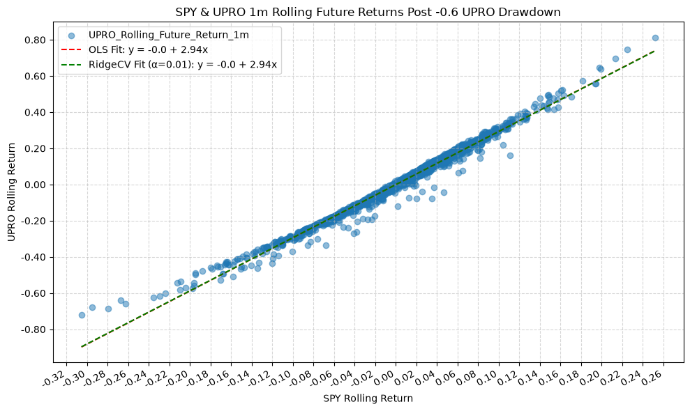
    


                                      OLS Regression Results                                 
    =========================================================================================
    Dep. Variable:     UPRO_Rolling_Future_Return_1m   R-squared:                       0.986
    Model:                                       OLS   Adj. R-squared:                  0.986
    Method:                            Least Squares   F-statistic:                 2.087e+05
    Date:                           Mon, 23 Mar 2026   Prob (F-statistic):               0.00
    Time:                                   22:04:08   Log-Likelihood:                 7938.5
    No. Observations:                           3070   AIC:                        -1.587e+04
    Df Residuals:                               3068   BIC:                        -1.586e+04
    Df Model:                                      1                                         
    Covariance Type:                       nonrobust                                         
    ================================================================================================
                                       coef    std err          t      P>|t|      [0.025      0.975]
    ------------------------------------------------------------------------------------------------
    const                           -0.0006      0.000     -1.708      0.088      -0.001    8.42e-05
    SPY_Rolling_Future_Return_1m     2.9396      0.006    456.784      0.000       2.927       2.952
    ==============================================================================
    Omnibus:                     1387.146   Durbin-Watson:                   0.407
    Prob(Omnibus):                  0.000   Jarque-Bera (JB):           109381.529
    Skew:                          -1.255   Prob(JB):                         0.00
    Kurtosis:                      32.134   Cond. No.                         19.6
    ==============================================================================
    
    Notes:
    [1] Standard Errors assume that the covariance matrix of the errors is correctly specified.


    
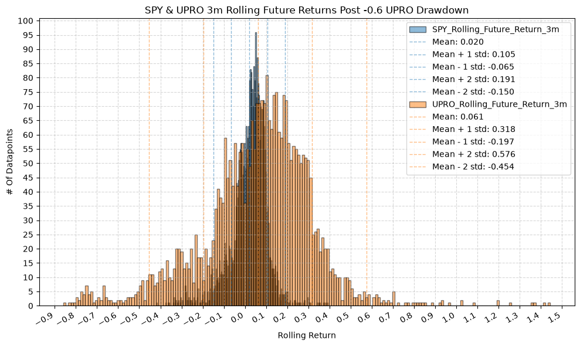
    


    

    


                                      OLS Regression Results                                 
    =========================================================================================
    Dep. Variable:     UPRO_Rolling_Future_Return_3m   R-squared:                       0.977
    Model:                                       OLS   Adj. R-squared:                  0.977
    Method:                            Least Squares   F-statistic:                 1.313e+05
    Date:                           Mon, 23 Mar 2026   Prob (F-statistic):               0.00
    Time:                                   22:04:09   Log-Likelihood:                 5610.7
    No. Observations:                           3070   AIC:                        -1.122e+04
    Df Residuals:                               3068   BIC:                        -1.121e+04
    Df Model:                                      1                                         
    Covariance Type:                       nonrobust                                         
    ================================================================================================
                                       coef    std err          t      P>|t|      [0.025      0.975]
    ------------------------------------------------------------------------------------------------
    const                            0.0004      0.001      0.593      0.553      -0.001       0.002
    SPY_Rolling_Future_Return_3m     2.9877      0.008    362.353      0.000       2.972       3.004
    ==============================================================================
    Omnibus:                     1129.279   Durbin-Watson:                   0.193
    Prob(Omnibus):                  0.000   Jarque-Bera (JB):            29406.672
    Skew:                           1.166   Prob(JB):                         0.00
    Kurtosis:                      17.982   Cond. No.                         11.7
    ==============================================================================
    
    Notes:
    [1] Standard Errors assume that the covariance matrix of the errors is correctly specified.


    
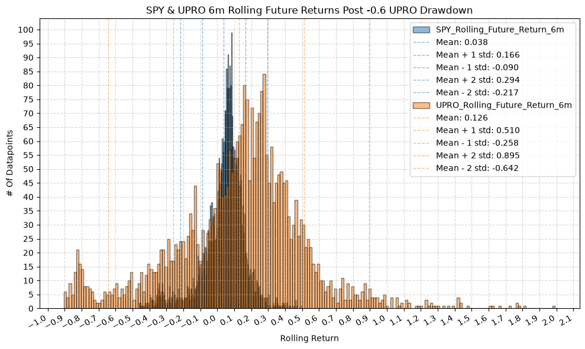
    


    

    


                                      OLS Regression Results                                 
    =========================================================================================
    Dep. Variable:     UPRO_Rolling_Future_Return_6m   R-squared:                       0.956
    Model:                                       OLS   Adj. R-squared:                  0.956
    Method:                            Least Squares   F-statistic:                 6.658e+04
    Date:                           Mon, 23 Mar 2026   Prob (F-statistic):               0.00
    Time:                                   22:04:11   Log-Likelihood:                 3373.7
    No. Observations:                           3070   AIC:                            -6743.
    Df Residuals:                               3068   BIC:                            -6731.
    Df Model:                                      1                                         
    Covariance Type:                       nonrobust                                         
    ================================================================================================
                                       coef    std err          t      P>|t|      [0.025      0.975]
    ------------------------------------------------------------------------------------------------
    const                            0.0138      0.002      9.065      0.000       0.011       0.017
    SPY_Rolling_Future_Return_6m     2.9411      0.011    258.025      0.000       2.919       2.963
    ==============================================================================
    Omnibus:                      862.190   Durbin-Watson:                   0.075
    Prob(Omnibus):                  0.000   Jarque-Bera (JB):             5062.816
    Skew:                           1.201   Prob(JB):                         0.00
    Kurtosis:                       8.815   Cond. No.                         7.84
    ==============================================================================
    
    Notes:
    [1] Standard Errors assume that the covariance matrix of the errors is correctly specified.


    
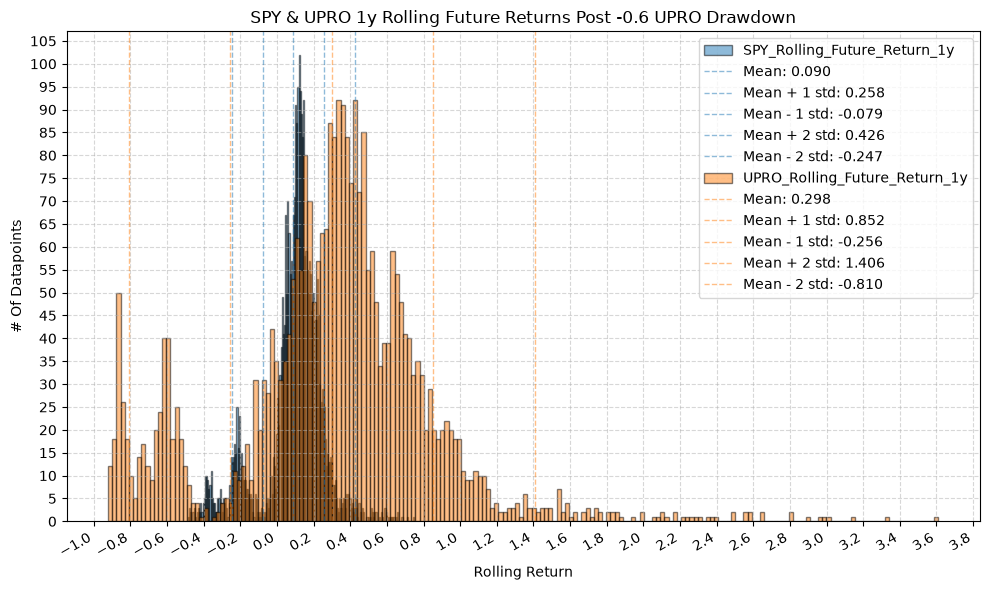
    


    

    


                                      OLS Regression Results                                 
    =========================================================================================
    Dep. Variable:     UPRO_Rolling_Future_Return_1y   R-squared:                       0.932
    Model:                                       OLS   Adj. R-squared:                  0.932
    Method:                            Least Squares   F-statistic:                 4.197e+04
    Date:                           Mon, 23 Mar 2026   Prob (F-statistic):               0.00
    Time:                                   22:04:12   Log-Likelihood:                 1581.3
    No. Observations:                           3070   AIC:                            -3159.
    Df Residuals:                               3068   BIC:                            -3147.
    Df Model:                                      1                                         
    Covariance Type:                       nonrobust                                         
    ================================================================================================
                                       coef    std err          t      P>|t|      [0.025      0.975]
    ------------------------------------------------------------------------------------------------
    const                            0.0132      0.003      4.455      0.000       0.007       0.019
    SPY_Rolling_Future_Return_1y     3.1761      0.016    204.863      0.000       3.146       3.206
    ==============================================================================
    Omnibus:                     1211.105   Durbin-Watson:                   0.065
    Prob(Omnibus):                  0.000   Jarque-Bera (JB):            10512.821
    Skew:                           1.634   Prob(JB):                         0.00
    Kurtosis:                      11.456   Cond. No.                         5.99
    ==============================================================================
    
    Notes:
    [1] Standard Errors assume that the covariance matrix of the errors is correctly specified.


    
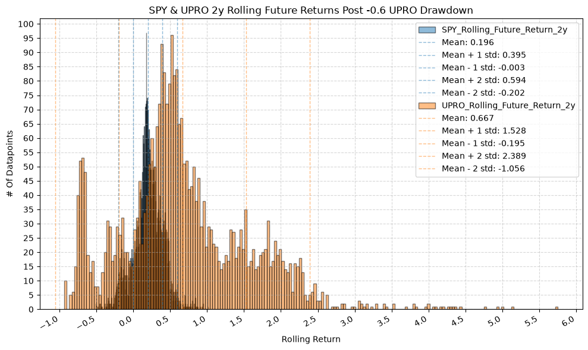
    


    
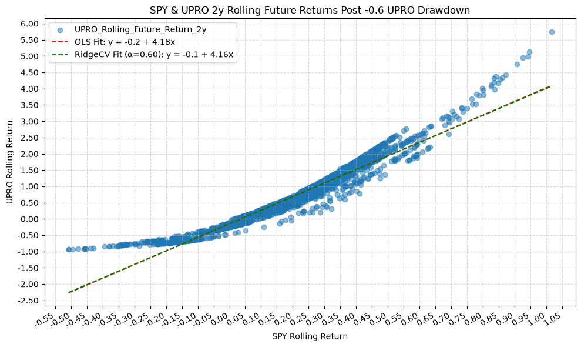
    


                                      OLS Regression Results                                 
    =========================================================================================
    Dep. Variable:     UPRO_Rolling_Future_Return_2y   R-squared:                       0.932
    Model:                                       OLS   Adj. R-squared:                  0.932
    Method:                            Least Squares   F-statistic:                 4.210e+04
    Date:                           Mon, 23 Mar 2026   Prob (F-statistic):               0.00
    Time:                                   22:04:14   Log-Likelihood:                 230.84
    No. Observations:                           3070   AIC:                            -457.7
    Df Residuals:                               3068   BIC:                            -445.6
    Df Model:                                      1                                         
    Covariance Type:                       nonrobust                                         
    ================================================================================================
                                       coef    std err          t      P>|t|      [0.025      0.975]
    ------------------------------------------------------------------------------------------------
    const                           -0.1524      0.006    -26.790      0.000      -0.164      -0.141
    SPY_Rolling_Future_Return_2y     4.1801      0.020    205.184      0.000       4.140       4.220
    ==============================================================================
    Omnibus:                      971.659   Durbin-Watson:                   0.048
    Prob(Omnibus):                  0.000   Jarque-Bera (JB):             5572.803
    Skew:                           1.382   Prob(JB):                         0.00
    Kurtosis:                       8.994   Cond. No.                         5.23
    ==============================================================================
    
    Notes:
    [1] Standard Errors assume that the covariance matrix of the errors is correctly specified.


    
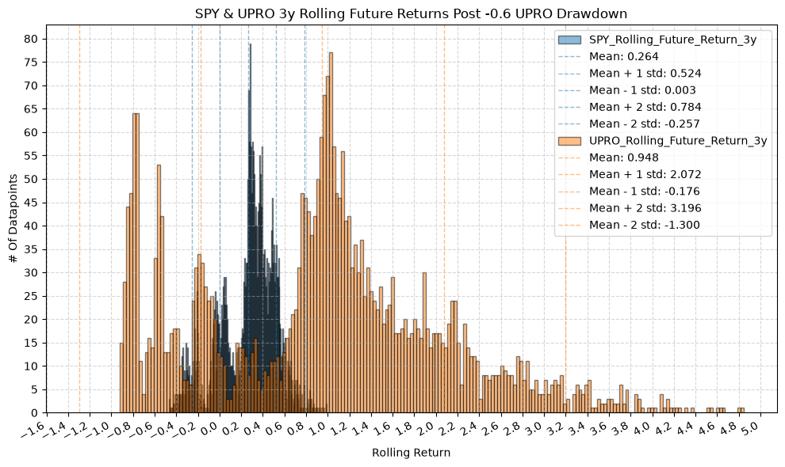
    


    

    


                                      OLS Regression Results                                 
    =========================================================================================
    Dep. Variable:     UPRO_Rolling_Future_Return_3y   R-squared:                       0.906
    Model:                                       OLS   Adj. R-squared:                  0.906
    Method:                            Least Squares   F-statistic:                 2.942e+04
    Date:                           Mon, 23 Mar 2026   Prob (F-statistic):               0.00
    Time:                                   22:04:16   Log-Likelihood:                -1092.6
    No. Observations:                           3070   AIC:                             2189.
    Df Residuals:                               3068   BIC:                             2201.
    Df Model:                                      1                                         
    Covariance Type:                       nonrobust                                         
    ================================================================================================
                                       coef    std err          t      P>|t|      [0.025      0.975]
    ------------------------------------------------------------------------------------------------
    const                           -0.1351      0.009    -15.221      0.000      -0.152      -0.118
    SPY_Rolling_Future_Return_3y     4.1098      0.024    171.516      0.000       4.063       4.157
    ==============================================================================
    Omnibus:                      523.502   Durbin-Watson:                   0.022
    Prob(Omnibus):                  0.000   Jarque-Bera (JB):              948.375
    Skew:                           1.070   Prob(JB):                    1.16e-206
    Kurtosis:                       4.683   Cond. No.                         4.13
    ==============================================================================
    
    Notes:
    [1] Standard Errors assume that the covariance matrix of the errors is correctly specified.


    
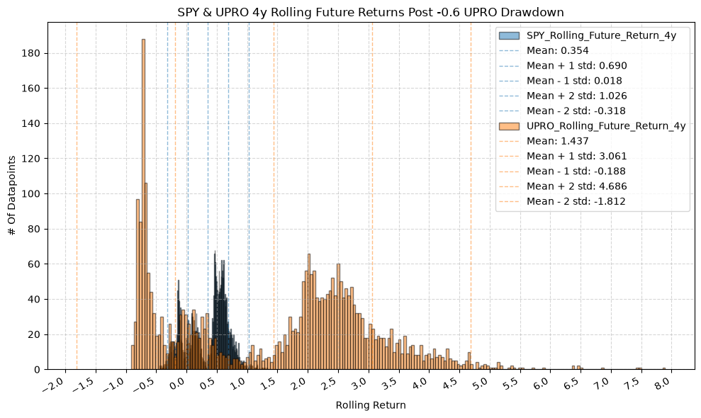
    


    
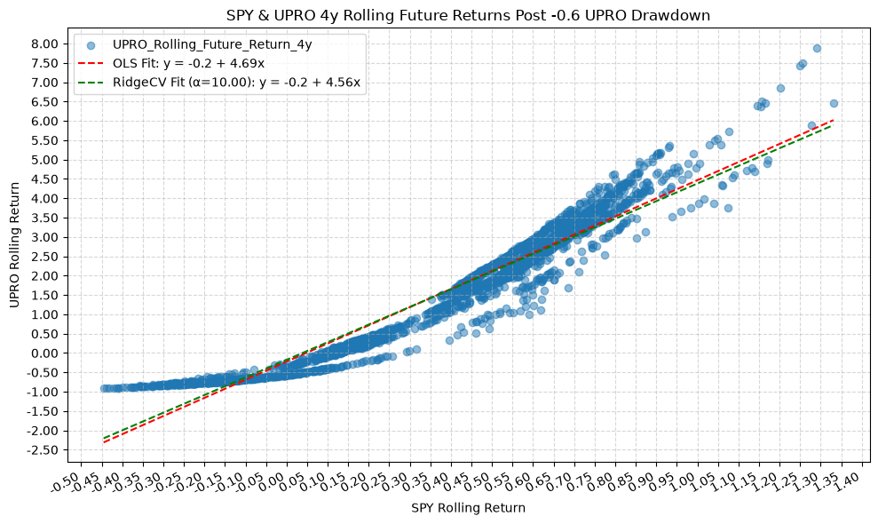
    


                                      OLS Regression Results                                 
    =========================================================================================
    Dep. Variable:     UPRO_Rolling_Future_Return_4y   R-squared:                       0.942
    Model:                                       OLS   Adj. R-squared:                  0.942
    Method:                            Least Squares   F-statistic:                 4.920e+04
    Date:                           Mon, 23 Mar 2026   Prob (F-statistic):               0.00
    Time:                                   22:04:18   Log-Likelihood:                -1478.4
    No. Observations:                           3055   AIC:                             2961.
    Df Residuals:                               3053   BIC:                             2973.
    Df Model:                                      1                                         
    Covariance Type:                       nonrobust                                         
    ================================================================================================
                                       coef    std err          t      P>|t|      [0.025      0.975]
    ------------------------------------------------------------------------------------------------
    const                           -0.2228      0.010    -21.591      0.000      -0.243      -0.203
    SPY_Rolling_Future_Return_4y     4.6896      0.021    221.805      0.000       4.648       4.731
    ==============================================================================
    Omnibus:                      120.374   Durbin-Watson:                   0.033
    Prob(Omnibus):                  0.000   Jarque-Bera (JB):              311.607
    Skew:                           0.172   Prob(JB):                     2.16e-68
    Kurtosis:                       4.526   Cond. No.                         3.39
    ==============================================================================
    
    Notes:
    [1] Standard Errors assume that the covariance matrix of the errors is correctly specified.


    
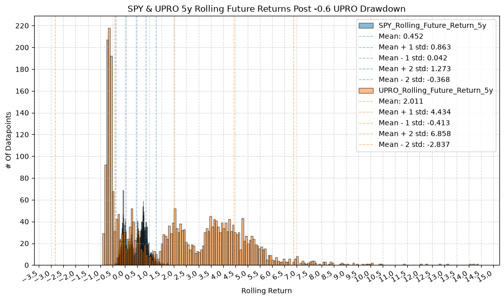
    


    
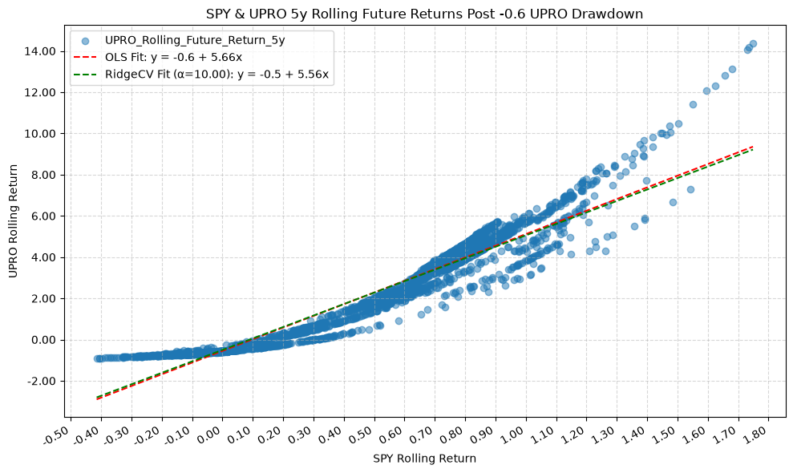
    


                                      OLS Regression Results                                 
    =========================================================================================
    Dep. Variable:     UPRO_Rolling_Future_Return_5y   R-squared:                       0.919
    Model:                                       OLS   Adj. R-squared:                  0.919
    Method:                            Least Squares   F-statistic:                 3.475e+04
    Date:                           Mon, 23 Mar 2026   Prob (F-statistic):               0.00
    Time:                                   22:04:20   Log-Likelihood:                -3195.6
    No. Observations:                           3055   AIC:                             6395.
    Df Residuals:                               3053   BIC:                             6407.
    Df Model:                                      1                                         
    Covariance Type:                       nonrobust                                         
    ================================================================================================
                                       coef    std err          t      P>|t|      [0.025      0.975]
    ------------------------------------------------------------------------------------------------
    const                           -0.5516      0.019    -29.726      0.000      -0.588      -0.515
    SPY_Rolling_Future_Return_5y     5.6648      0.030    186.402      0.000       5.605       5.724
    ==============================================================================
    Omnibus:                      454.815   Durbin-Watson:                   0.025
    Prob(Omnibus):                  0.000   Jarque-Bera (JB):             2118.648
    Skew:                           0.640   Prob(JB):                         0.00
    Kurtosis:                       6.874   Cond. No.                         3.02
    ==============================================================================
    
    Notes:
    [1] Standard Errors assume that the covariance matrix of the errors is correctly specified.


    

    


    
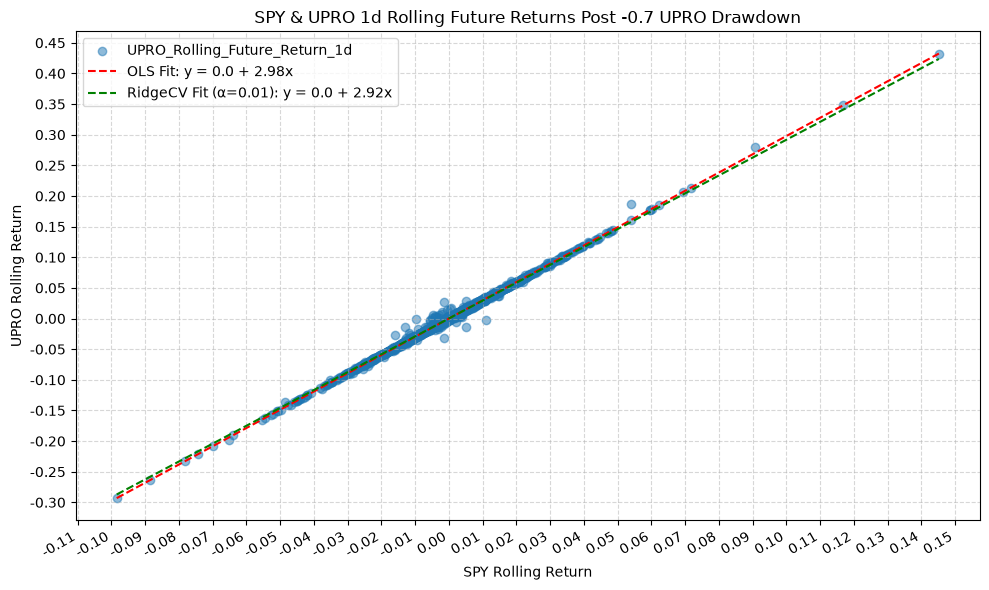
    


                                      OLS Regression Results                                 
    =========================================================================================
    Dep. Variable:     UPRO_Rolling_Future_Return_1d   R-squared:                       0.997
    Model:                                       OLS   Adj. R-squared:                  0.997
    Method:                            Least Squares   F-statistic:                 7.537e+05
    Date:                           Mon, 23 Mar 2026   Prob (F-statistic):               0.00
    Time:                                   22:04:21   Log-Likelihood:                 10930.
    No. Observations:                           2365   AIC:                        -2.186e+04
    Df Residuals:                               2363   BIC:                        -2.184e+04
    Df Model:                                      1                                         
    Covariance Type:                       nonrobust                                         
    ================================================================================================
                                       coef    std err          t      P>|t|      [0.025      0.975]
    ------------------------------------------------------------------------------------------------
    const                         8.912e-05    4.9e-05      1.819      0.069   -6.96e-06       0.000
    SPY_Rolling_Future_Return_1d     2.9778      0.003    868.186      0.000       2.971       2.984
    ==============================================================================
    Omnibus:                     1557.950   Durbin-Watson:                   2.718
    Prob(Omnibus):                  0.000   Jarque-Bera (JB):           638144.795
    Skew:                           1.869   Prob(JB):                         0.00
    Kurtosis:                      83.386   Cond. No.                         70.0
    ==============================================================================
    
    Notes:
    [1] Standard Errors assume that the covariance matrix of the errors is correctly specified.


    

    


    
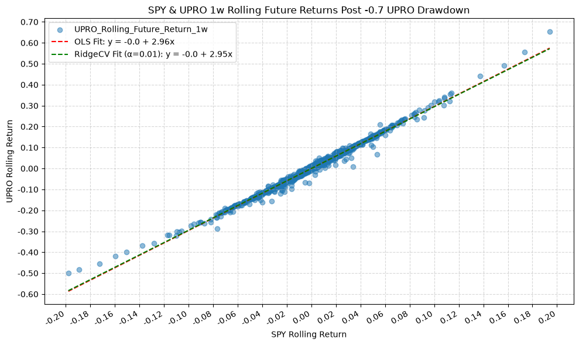
    


                                      OLS Regression Results                                 
    =========================================================================================
    Dep. Variable:     UPRO_Rolling_Future_Return_1w   R-squared:                       0.991
    Model:                                       OLS   Adj. R-squared:                  0.991
    Method:                            Least Squares   F-statistic:                 2.714e+05
    Date:                           Mon, 23 Mar 2026   Prob (F-statistic):               0.00
    Time:                                   22:04:23   Log-Likelihood:                 8089.4
    No. Observations:                           2365   AIC:                        -1.617e+04
    Df Residuals:                               2363   BIC:                        -1.616e+04
    Df Model:                                      1                                         
    Covariance Type:                       nonrobust                                         
    ================================================================================================
                                       coef    std err          t      P>|t|      [0.025      0.975]
    ------------------------------------------------------------------------------------------------
    const                        -7.259e-05      0.000     -0.445      0.656      -0.000       0.000
    SPY_Rolling_Future_Return_1w     2.9630      0.006    520.956      0.000       2.952       2.974
    ==============================================================================
    Omnibus:                      893.071   Durbin-Watson:                   1.046
    Prob(Omnibus):                  0.000   Jarque-Bera (JB):           167497.054
    Skew:                          -0.620   Prob(JB):                         0.00
    Kurtosis:                      44.209   Cond. No.                         34.9
    ==============================================================================
    
    Notes:
    [1] Standard Errors assume that the covariance matrix of the errors is correctly specified.


    
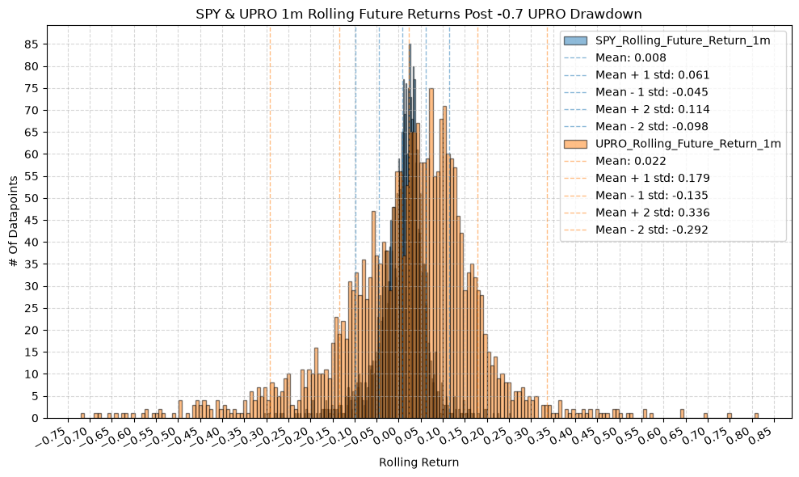
    


    
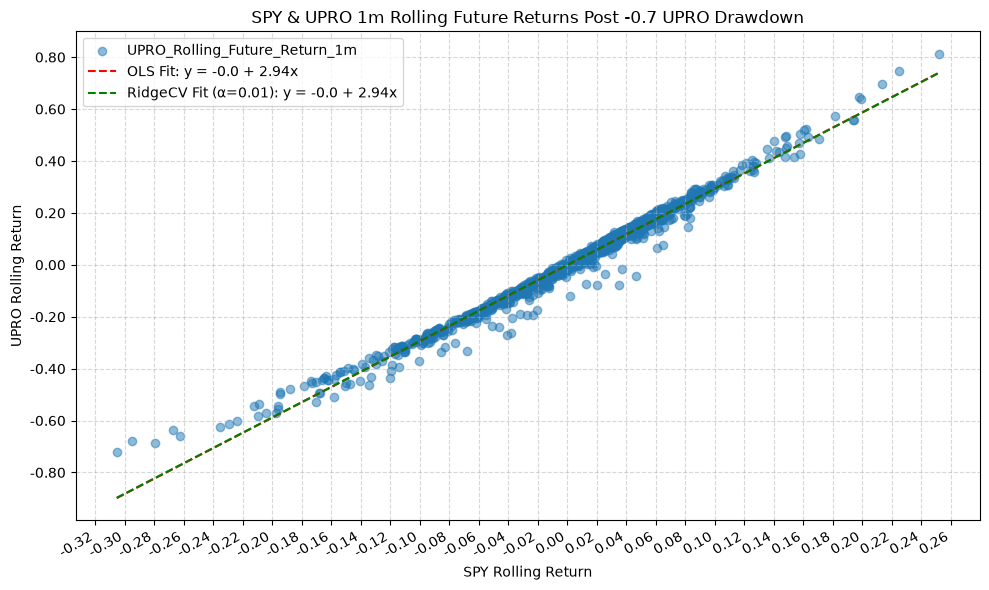
    


                                      OLS Regression Results                                 
    =========================================================================================
    Dep. Variable:     UPRO_Rolling_Future_Return_1m   R-squared:                       0.984
    Model:                                       OLS   Adj. R-squared:                  0.984
    Method:                            Least Squares   F-statistic:                 1.475e+05
    Date:                           Mon, 23 Mar 2026   Prob (F-statistic):               0.00
    Time:                                   22:04:25   Log-Likelihood:                 5932.3
    No. Observations:                           2365   AIC:                        -1.186e+04
    Df Residuals:                               2363   BIC:                        -1.185e+04
    Df Model:                                      1                                         
    Covariance Type:                       nonrobust                                         
    ================================================================================================
                                       coef    std err          t      P>|t|      [0.025      0.975]
    ------------------------------------------------------------------------------------------------
    const                           -0.0007      0.000     -1.730      0.084      -0.002    9.44e-05
    SPY_Rolling_Future_Return_1m     2.9413      0.008    384.062      0.000       2.926       2.956
    ==============================================================================
    Omnibus:                      954.674   Durbin-Watson:                   0.364
    Prob(Omnibus):                  0.000   Jarque-Bera (JB):            63607.103
    Skew:                          -1.055   Prob(JB):                         0.00
    Kurtosis:                      28.319   Cond. No.                         18.9
    ==============================================================================
    
    Notes:
    [1] Standard Errors assume that the covariance matrix of the errors is correctly specified.


    
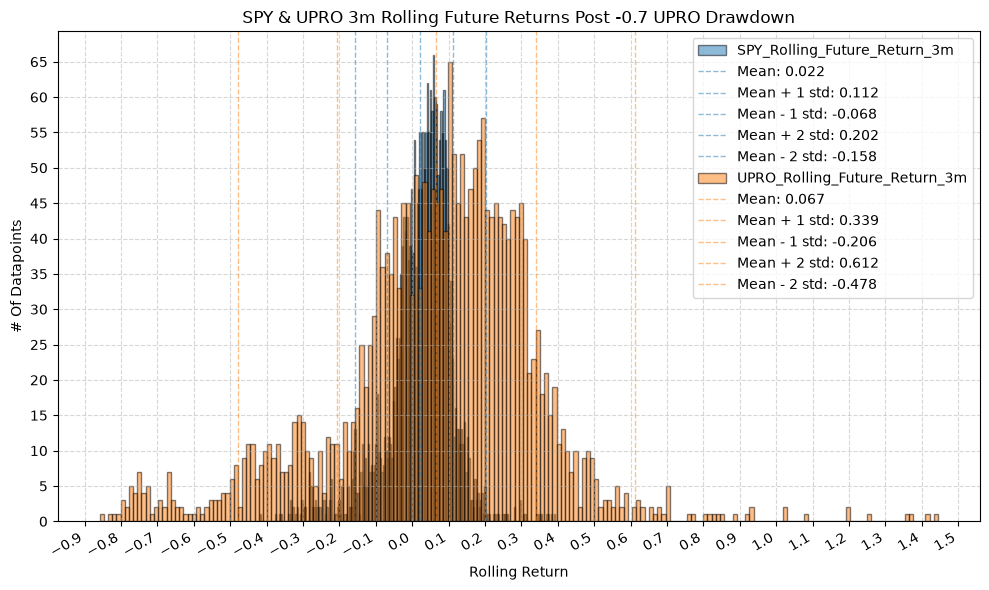
    


    
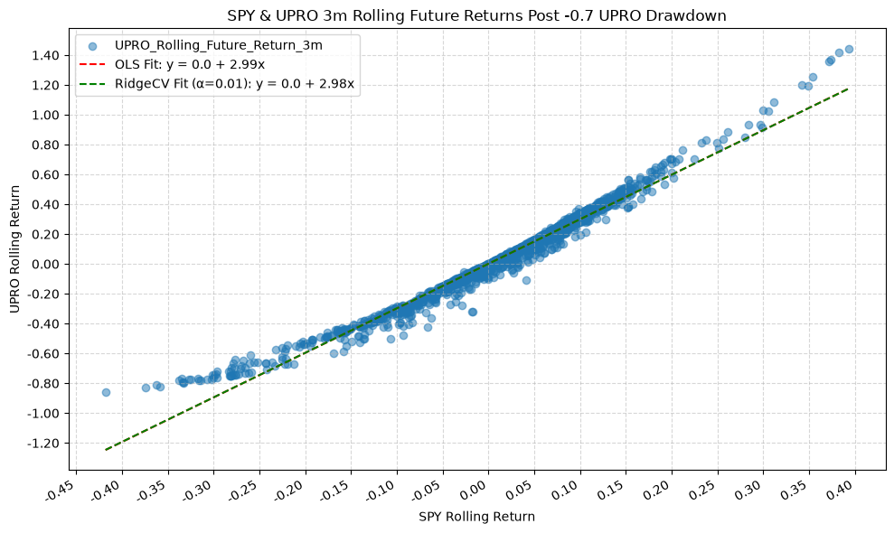
    


                                      OLS Regression Results                                 
    =========================================================================================
    Dep. Variable:     UPRO_Rolling_Future_Return_3m   R-squared:                       0.976
    Model:                                       OLS   Adj. R-squared:                  0.976
    Method:                            Least Squares   F-statistic:                 9.454e+04
    Date:                           Mon, 23 Mar 2026   Prob (F-statistic):               0.00
    Time:                                   22:04:26   Log-Likelihood:                 4110.9
    No. Observations:                           2365   AIC:                            -8218.
    Df Residuals:                               2363   BIC:                            -8206.
    Df Model:                                      1                                         
    Covariance Type:                       nonrobust                                         
    ================================================================================================
                                       coef    std err          t      P>|t|      [0.025      0.975]
    ------------------------------------------------------------------------------------------------
    const                            0.0012      0.001      1.377      0.169      -0.001       0.003
    SPY_Rolling_Future_Return_3m     2.9865      0.010    307.478      0.000       2.967       3.006
    ==============================================================================
    Omnibus:                      813.501   Durbin-Watson:                   0.169
    Prob(Omnibus):                  0.000   Jarque-Bera (JB):            16774.687
    Skew:                           1.111   Prob(JB):                         0.00
    Kurtosis:                      15.856   Cond. No.                         11.1
    ==============================================================================
    
    Notes:
    [1] Standard Errors assume that the covariance matrix of the errors is correctly specified.


    
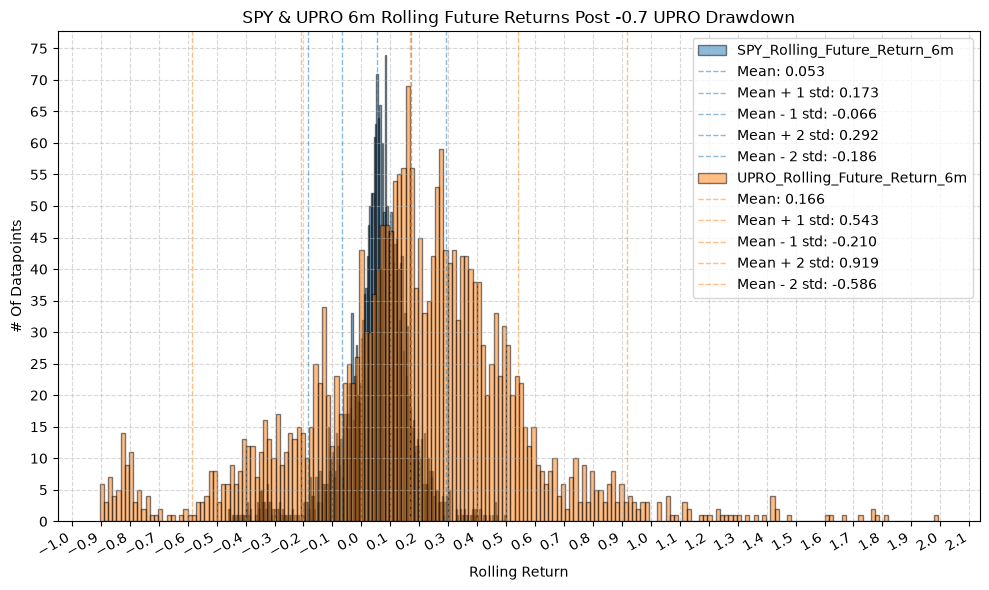
    


    
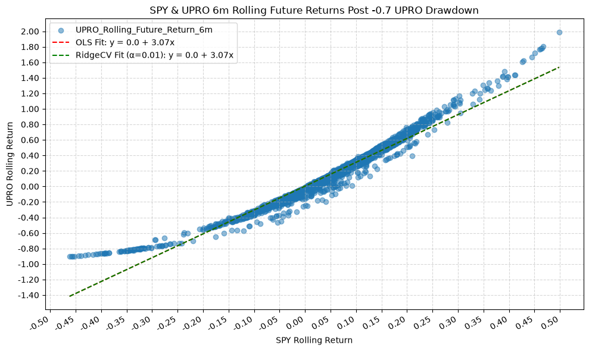
    


                                      OLS Regression Results                                 
    =========================================================================================
    Dep. Variable:     UPRO_Rolling_Future_Return_6m   R-squared:                       0.954
    Model:                                       OLS   Adj. R-squared:                  0.954
    Method:                            Least Squares   F-statistic:                 4.945e+04
    Date:                           Mon, 23 Mar 2026   Prob (F-statistic):               0.00
    Time:                                   22:04:28   Log-Likelihood:                 2608.9
    No. Observations:                           2365   AIC:                            -5214.
    Df Residuals:                               2363   BIC:                            -5202.
    Df Model:                                      1                                         
    Covariance Type:                       nonrobust                                         
    ================================================================================================
                                       coef    std err          t      P>|t|      [0.025      0.975]
    ------------------------------------------------------------------------------------------------
    const                            0.0035      0.002      1.919      0.055   -7.62e-05       0.007
    SPY_Rolling_Future_Return_6m     3.0746      0.014    222.383      0.000       3.048       3.102
    ==============================================================================
    Omnibus:                      829.904   Durbin-Watson:                   0.069
    Prob(Omnibus):                  0.000   Jarque-Bera (JB):             7402.181
    Skew:                           1.399   Prob(JB):                         0.00
    Kurtosis:                      11.203   Cond. No.                         8.39
    ==============================================================================
    
    Notes:
    [1] Standard Errors assume that the covariance matrix of the errors is correctly specified.


    
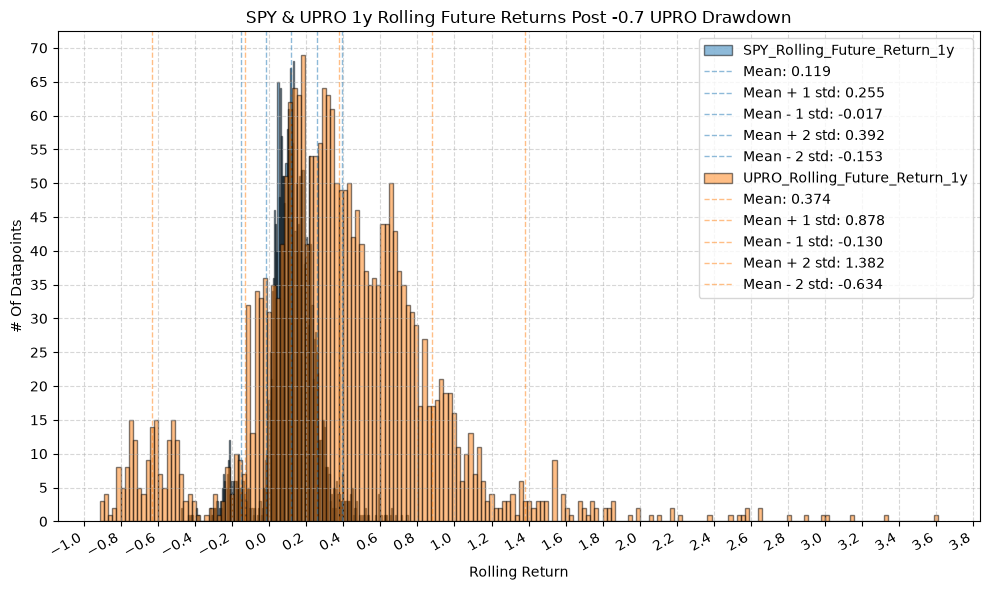
    


    
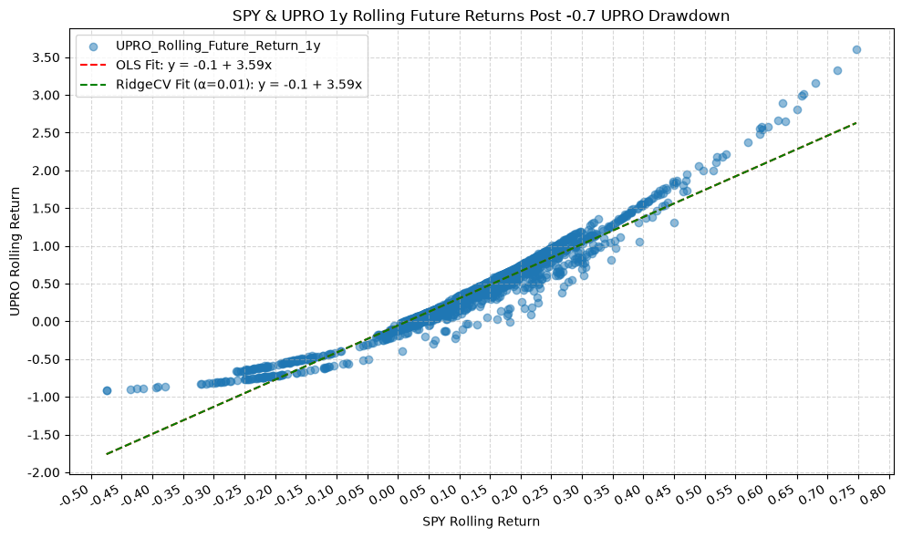
    


                                      OLS Regression Results                                 
    =========================================================================================
    Dep. Variable:     UPRO_Rolling_Future_Return_1y   R-squared:                       0.941
    Model:                                       OLS   Adj. R-squared:                  0.941
    Method:                            Least Squares   F-statistic:                 3.754e+04
    Date:                           Mon, 23 Mar 2026   Prob (F-statistic):               0.00
    Time:                                   22:04:30   Log-Likelihood:                 1607.5
    No. Observations:                           2365   AIC:                            -3211.
    Df Residuals:                               2363   BIC:                            -3200.
    Df Model:                                      1                                         
    Covariance Type:                       nonrobust                                         
    ================================================================================================
                                       coef    std err          t      P>|t|      [0.025      0.975]
    ------------------------------------------------------------------------------------------------
    const                           -0.0550      0.003    -16.380      0.000      -0.062      -0.048
    SPY_Rolling_Future_Return_1y     3.5927      0.019    193.753      0.000       3.556       3.629
    ==============================================================================
    Omnibus:                      724.967   Durbin-Watson:                   0.076
    Prob(Omnibus):                  0.000   Jarque-Bera (JB):            11317.696
    Skew:                           1.018   Prob(JB):                         0.00
    Kurtosis:                      13.522   Cond. No.                         7.46
    ==============================================================================
    
    Notes:
    [1] Standard Errors assume that the covariance matrix of the errors is correctly specified.


    
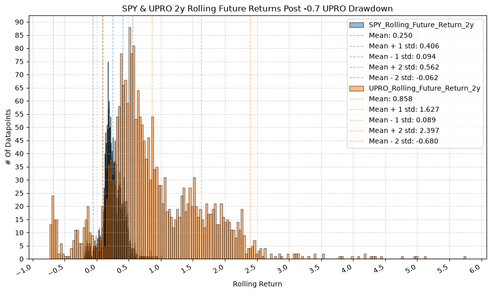
    


    
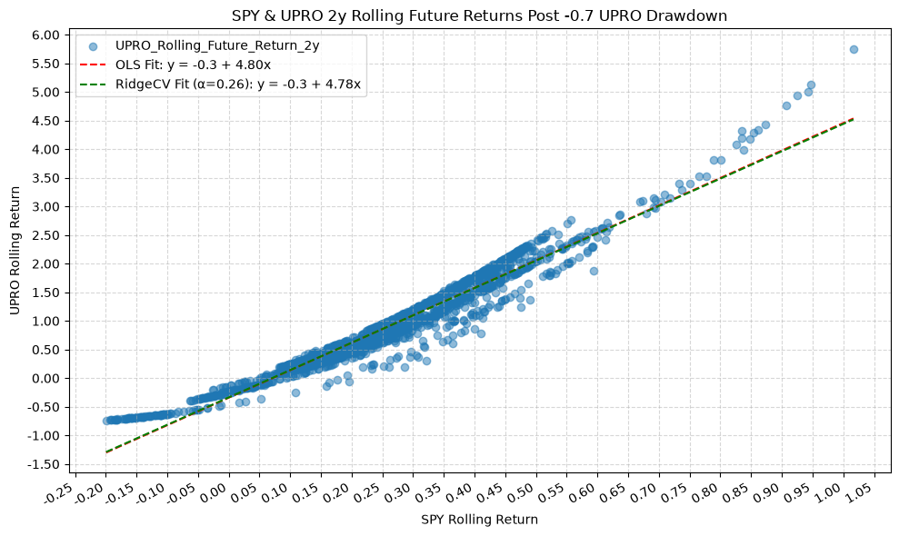
    


                                      OLS Regression Results                                 
    =========================================================================================
    Dep. Variable:     UPRO_Rolling_Future_Return_2y   R-squared:                       0.947
    Model:                                       OLS   Adj. R-squared:                  0.947
    Method:                            Least Squares   F-statistic:                 4.183e+04
    Date:                           Mon, 23 Mar 2026   Prob (F-statistic):               0.00
    Time:                                   22:04:31   Log-Likelihood:                 728.42
    No. Observations:                           2365   AIC:                            -1453.
    Df Residuals:                               2363   BIC:                            -1441.
    Df Model:                                      1                                         
    Covariance Type:                       nonrobust                                         
    ================================================================================================
                                       coef    std err          t      P>|t|      [0.025      0.975]
    ------------------------------------------------------------------------------------------------
    const                           -0.3422      0.007    -49.480      0.000      -0.356      -0.329
    SPY_Rolling_Future_Return_2y     4.7991      0.023    204.534      0.000       4.753       4.845
    ==============================================================================
    Omnibus:                      261.079   Durbin-Watson:                   0.050
    Prob(Omnibus):                  0.000   Jarque-Bera (JB):             1786.755
    Skew:                          -0.270   Prob(JB):                         0.00
    Kurtosis:                       7.224   Cond. No.                         6.82
    ==============================================================================
    
    Notes:
    [1] Standard Errors assume that the covariance matrix of the errors is correctly specified.


    
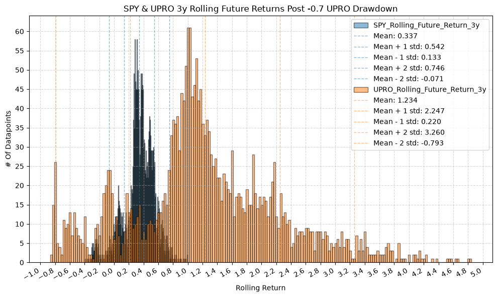
    


    
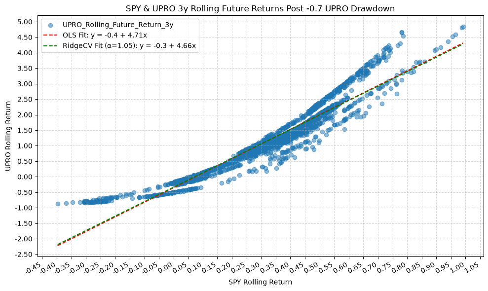
    


                                      OLS Regression Results                                 
    =========================================================================================
    Dep. Variable:     UPRO_Rolling_Future_Return_3y   R-squared:                       0.901
    Model:                                       OLS   Adj. R-squared:                  0.901
    Method:                            Least Squares   F-statistic:                 2.157e+04
    Date:                           Mon, 23 Mar 2026   Prob (F-statistic):               0.00
    Time:                                   22:04:33   Log-Likelihood:                -648.61
    No. Observations:                           2365   AIC:                             1301.
    Df Residuals:                               2363   BIC:                             1313.
    Df Model:                                      1                                         
    Covariance Type:                       nonrobust                                         
    ================================================================================================
                                       coef    std err          t      P>|t|      [0.025      0.975]
    ------------------------------------------------------------------------------------------------
    const                           -0.3554      0.013    -28.106      0.000      -0.380      -0.331
    SPY_Rolling_Future_Return_3y     4.7080      0.032    146.881      0.000       4.645       4.771
    ==============================================================================
    Omnibus:                      350.131   Durbin-Watson:                   0.028
    Prob(Omnibus):                  0.000   Jarque-Bera (JB):              725.354
    Skew:                           0.885   Prob(JB):                    3.10e-158
    Kurtosis:                       5.056   Cond. No.                         5.47
    ==============================================================================
    
    Notes:
    [1] Standard Errors assume that the covariance matrix of the errors is correctly specified.


    

    


    
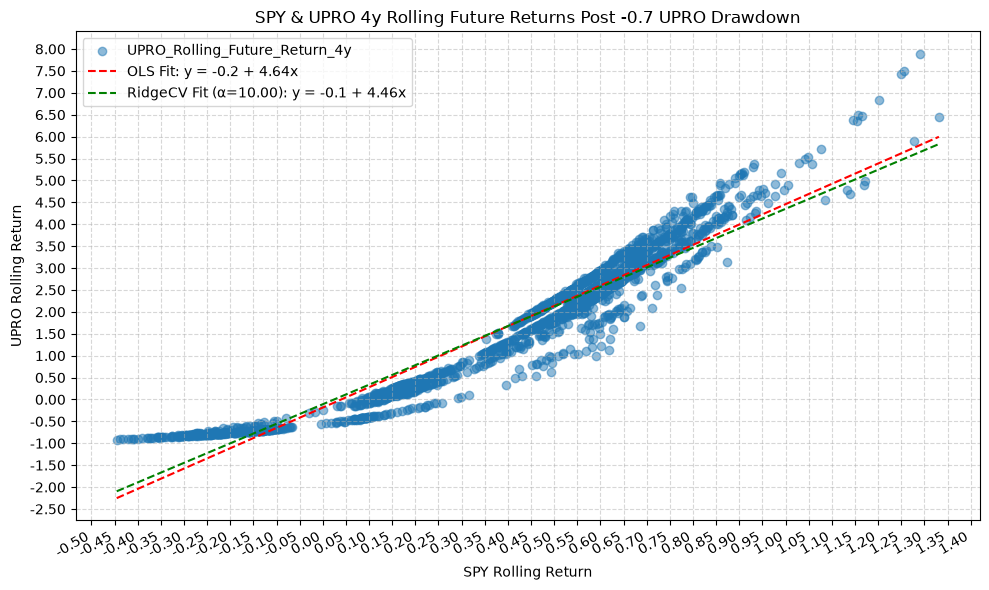
    


                                      OLS Regression Results                                 
    =========================================================================================
    Dep. Variable:     UPRO_Rolling_Future_Return_4y   R-squared:                       0.925
    Model:                                       OLS   Adj. R-squared:                  0.925
    Method:                            Least Squares   F-statistic:                 2.909e+04
    Date:                           Mon, 23 Mar 2026   Prob (F-statistic):               0.00
    Time:                                   22:04:35   Log-Likelihood:                -1339.1
    No. Observations:                           2365   AIC:                             2682.
    Df Residuals:                               2363   BIC:                             2694.
    Df Model:                                      1                                         
    Covariance Type:                       nonrobust                                         
    ================================================================================================
                                       coef    std err          t      P>|t|      [0.025      0.975]
    ------------------------------------------------------------------------------------------------
    const                           -0.1851      0.014    -12.911      0.000      -0.213      -0.157
    SPY_Rolling_Future_Return_4y     4.6424      0.027    170.562      0.000       4.589       4.696
    ==============================================================================
    Omnibus:                       55.440   Durbin-Watson:                   0.030
    Prob(Omnibus):                  0.000   Jarque-Bera (JB):              118.149
    Skew:                           0.081   Prob(JB):                     2.21e-26
    Kurtosis:                       4.083   Cond. No.                         3.69
    ==============================================================================
    
    Notes:
    [1] Standard Errors assume that the covariance matrix of the errors is correctly specified.


    
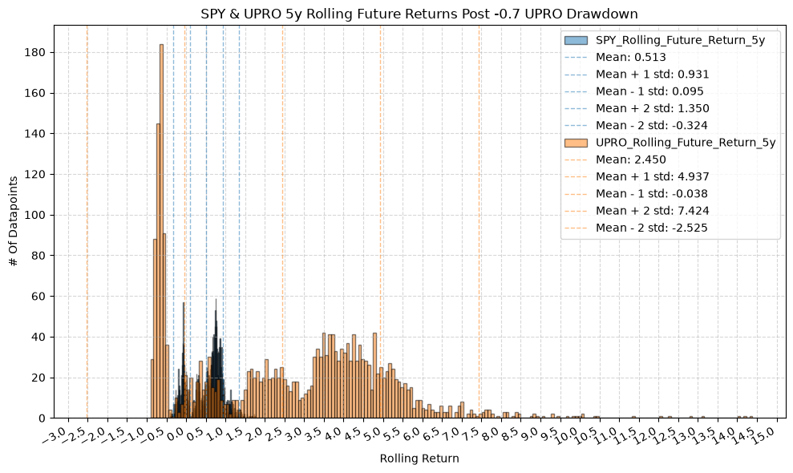
    


    
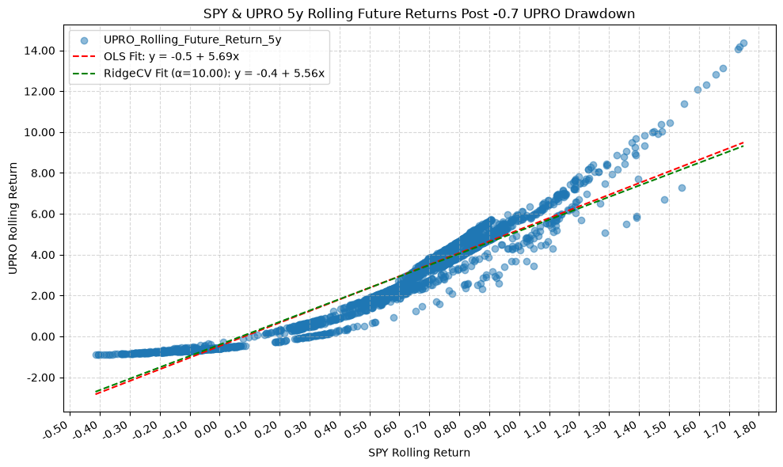
    


                                      OLS Regression Results                                 
    =========================================================================================
    Dep. Variable:     UPRO_Rolling_Future_Return_5y   R-squared:                       0.917
    Model:                                       OLS   Adj. R-squared:                  0.917
    Method:                            Least Squares   F-statistic:                 2.615e+04
    Date:                           Mon, 23 Mar 2026   Prob (F-statistic):               0.00
    Time:                                   22:04:37   Log-Likelihood:                -2565.1
    No. Observations:                           2365   AIC:                             5134.
    Df Residuals:                               2363   BIC:                             5146.
    Df Model:                                      1                                         
    Covariance Type:                       nonrobust                                         
    ================================================================================================
                                       coef    std err          t      P>|t|      [0.025      0.975]
    ------------------------------------------------------------------------------------------------
    const                           -0.4704      0.023    -20.189      0.000      -0.516      -0.425
    SPY_Rolling_Future_Return_5y     5.6929      0.035    161.724      0.000       5.624       5.762
    ==============================================================================
    Omnibus:                      310.928   Durbin-Watson:                   0.028
    Prob(Omnibus):                  0.000   Jarque-Bera (JB):             1361.563
    Skew:                           0.566   Prob(JB):                    2.19e-296
    Kurtosis:                       6.541   Cond. No.                         3.12
    ==============================================================================
    
    Notes:
    [1] Standard Errors assume that the covariance matrix of the errors is correctly specified.


    

    


    
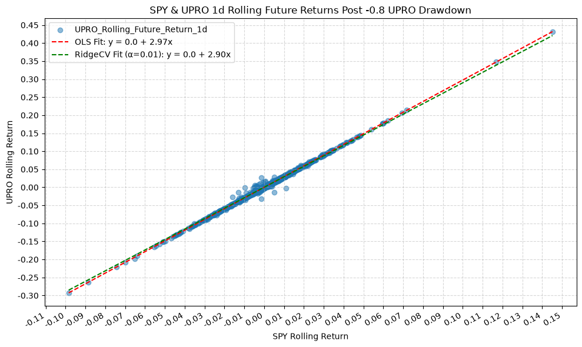
    


                                      OLS Regression Results                                 
    =========================================================================================
    Dep. Variable:     UPRO_Rolling_Future_Return_1d   R-squared:                       0.997
    Model:                                       OLS   Adj. R-squared:                  0.997
    Method:                            Least Squares   F-statistic:                 4.359e+05
    Date:                           Mon, 23 Mar 2026   Prob (F-statistic):               0.00
    Time:                                   22:04:39   Log-Likelihood:                 6602.3
    No. Observations:                           1478   AIC:                        -1.320e+04
    Df Residuals:                               1476   BIC:                        -1.319e+04
    Df Model:                                      1                                         
    Covariance Type:                       nonrobust                                         
    ================================================================================================
                                       coef    std err          t      P>|t|      [0.025      0.975]
    ------------------------------------------------------------------------------------------------
    const                            0.0001   7.23e-05      1.542      0.123   -3.04e-05       0.000
    SPY_Rolling_Future_Return_1d     2.9735      0.005    660.239      0.000       2.965       2.982
    ==============================================================================
    Omnibus:                      758.954   Durbin-Watson:                   2.689
    Prob(Omnibus):                  0.000   Jarque-Bera (JB):           237432.928
    Skew:                           1.143   Prob(JB):                         0.00
    Kurtosis:                      65.050   Cond. No.                         62.3
    ==============================================================================
    
    Notes:
    [1] Standard Errors assume that the covariance matrix of the errors is correctly specified.


    

    


    
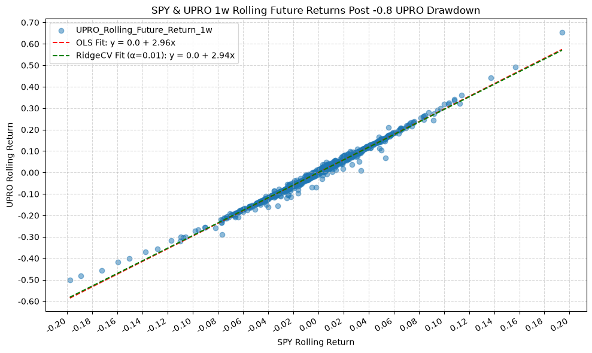
    


                                      OLS Regression Results                                 
    =========================================================================================
    Dep. Variable:     UPRO_Rolling_Future_Return_1w   R-squared:                       0.990
    Model:                                       OLS   Adj. R-squared:                  0.990
    Method:                            Least Squares   F-statistic:                 1.474e+05
    Date:                           Mon, 23 Mar 2026   Prob (F-statistic):               0.00
    Time:                                   22:04:40   Log-Likelihood:                 4775.7
    No. Observations:                           1478   AIC:                            -9547.
    Df Residuals:                               1476   BIC:                            -9537.
    Df Model:                                      1                                         
    Covariance Type:                       nonrobust                                         
    ================================================================================================
                                       coef    std err          t      P>|t|      [0.025      0.975]
    ------------------------------------------------------------------------------------------------
    const                         4.459e-06      0.000      0.018      0.986      -0.000       0.000
    SPY_Rolling_Future_Return_1w     2.9571      0.008    383.898      0.000       2.942       2.972
    ==============================================================================
    Omnibus:                      517.395   Durbin-Watson:                   1.023
    Prob(Omnibus):                  0.000   Jarque-Bera (JB):            52529.136
    Skew:                          -0.625   Prob(JB):                         0.00
    Kurtosis:                      32.179   Cond. No.                         31.0
    ==============================================================================
    
    Notes:
    [1] Standard Errors assume that the covariance matrix of the errors is correctly specified.


    
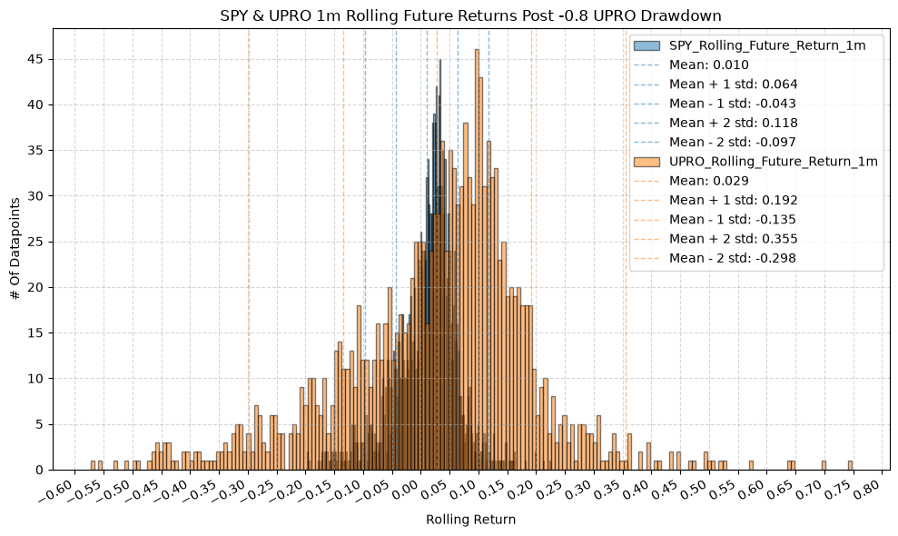
    


    

    


                                      OLS Regression Results                                 
    =========================================================================================
    Dep. Variable:     UPRO_Rolling_Future_Return_1m   R-squared:                       0.983
    Model:                                       OLS   Adj. R-squared:                  0.983
    Method:                            Least Squares   F-statistic:                 8.446e+04
    Date:                           Mon, 23 Mar 2026   Prob (F-statistic):               0.00
    Time:                                   22:04:42   Log-Likelihood:                 3586.0
    No. Observations:                           1478   AIC:                            -7168.
    Df Residuals:                               1476   BIC:                            -7157.
    Df Model:                                      1                                         
    Covariance Type:                       nonrobust                                         
    ================================================================================================
                                       coef    std err          t      P>|t|      [0.025      0.975]
    ------------------------------------------------------------------------------------------------
    const                           -0.0029      0.001     -5.070      0.000      -0.004      -0.002
    SPY_Rolling_Future_Return_1m     3.0166      0.010    290.618      0.000       2.996       3.037
    ==============================================================================
    Omnibus:                      950.759   Durbin-Watson:                   0.291
    Prob(Omnibus):                  0.000   Jarque-Bera (JB):            19698.886
    Skew:                          -2.648   Prob(JB):                         0.00
    Kurtosis:                      20.083   Cond. No.                         18.7
    ==============================================================================
    
    Notes:
    [1] Standard Errors assume that the covariance matrix of the errors is correctly specified.


    
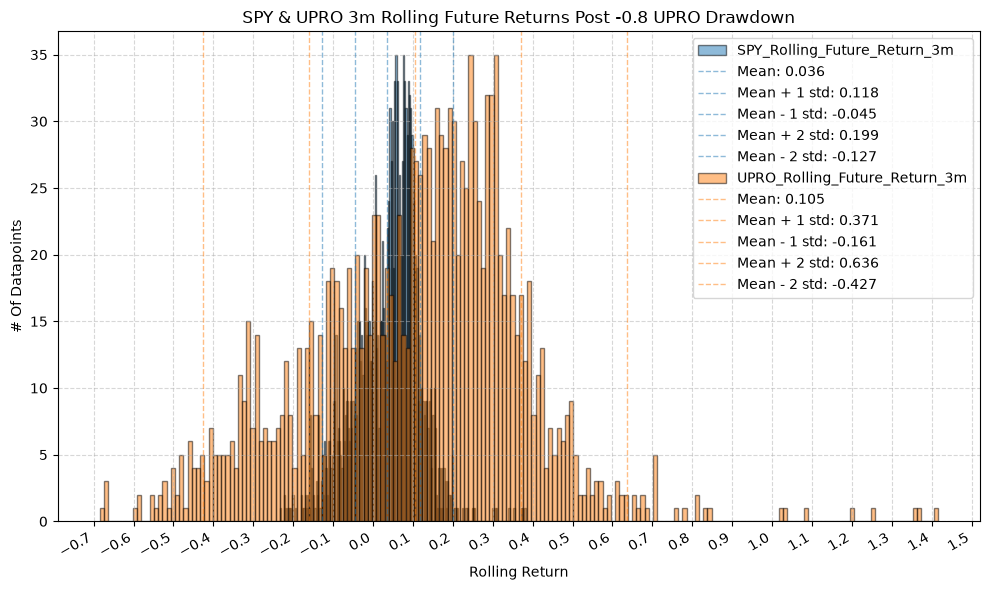
    


    
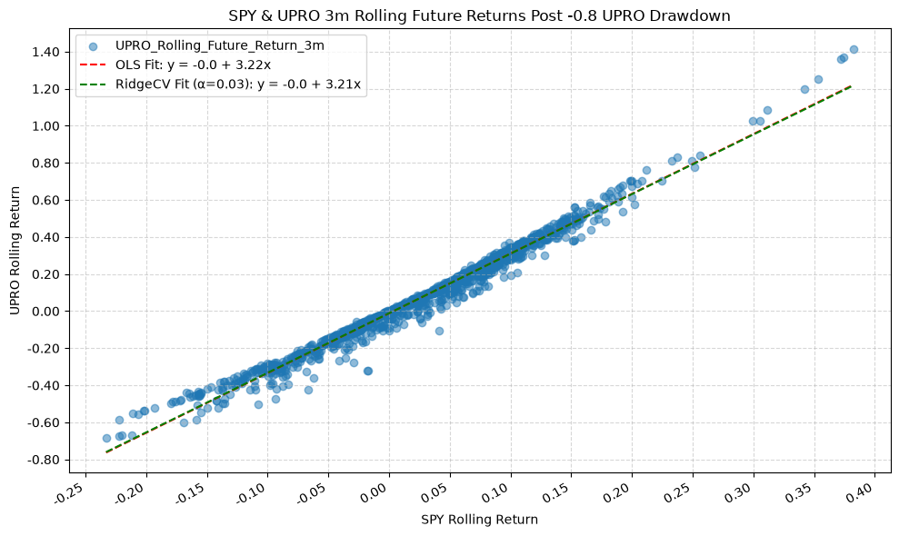
    


                                      OLS Regression Results                                 
    =========================================================================================
    Dep. Variable:     UPRO_Rolling_Future_Return_3m   R-squared:                       0.980
    Model:                                       OLS   Adj. R-squared:                  0.980
    Method:                            Least Squares   F-statistic:                 7.176e+04
    Date:                           Mon, 23 Mar 2026   Prob (F-statistic):               0.00
    Time:                                   22:04:43   Log-Likelihood:                 2747.3
    No. Observations:                           1478   AIC:                            -5491.
    Df Residuals:                               1476   BIC:                            -5480.
    Df Model:                                      1                                         
    Covariance Type:                       nonrobust                                         
    ================================================================================================
                                       coef    std err          t      P>|t|      [0.025      0.975]
    ------------------------------------------------------------------------------------------------
    const                           -0.0120      0.001    -11.211      0.000      -0.014      -0.010
    SPY_Rolling_Future_Return_3m     3.2237      0.012    267.883      0.000       3.200       3.247
    ==============================================================================
    Omnibus:                      396.131   Durbin-Watson:                   0.203
    Prob(Omnibus):                  0.000   Jarque-Bera (JB):             3161.615
    Skew:                          -1.020   Prob(JB):                         0.00
    Kurtosis:                       9.868   Cond. No.                         12.3
    ==============================================================================
    
    Notes:
    [1] Standard Errors assume that the covariance matrix of the errors is correctly specified.


    
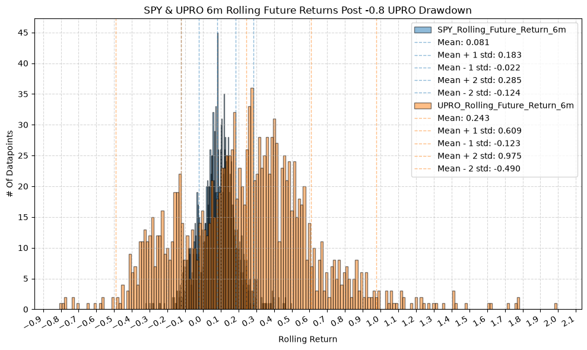
    


    

    


                                      OLS Regression Results                                 
    =========================================================================================
    Dep. Variable:     UPRO_Rolling_Future_Return_6m   R-squared:                       0.971
    Model:                                       OLS   Adj. R-squared:                  0.971
    Method:                            Least Squares   F-statistic:                 4.870e+04
    Date:                           Mon, 23 Mar 2026   Prob (F-statistic):               0.00
    Time:                                   22:04:45   Log-Likelihood:                 1994.5
    No. Observations:                           1478   AIC:                            -3985.
    Df Residuals:                               1476   BIC:                            -3974.
    Df Model:                                      1                                         
    Covariance Type:                       nonrobust                                         
    ================================================================================================
                                       coef    std err          t      P>|t|      [0.025      0.975]
    ------------------------------------------------------------------------------------------------
    const                           -0.0410      0.002    -19.749      0.000      -0.045      -0.037
    SPY_Rolling_Future_Return_6m     3.5209      0.016    220.689      0.000       3.490       3.552
    ==============================================================================
    Omnibus:                      302.897   Durbin-Watson:                   0.139
    Prob(Omnibus):                  0.000   Jarque-Bera (JB):             1793.969
    Skew:                          -0.817   Prob(JB):                         0.00
    Kurtosis:                       8.144   Cond. No.                         9.83
    ==============================================================================
    
    Notes:
    [1] Standard Errors assume that the covariance matrix of the errors is correctly specified.


    
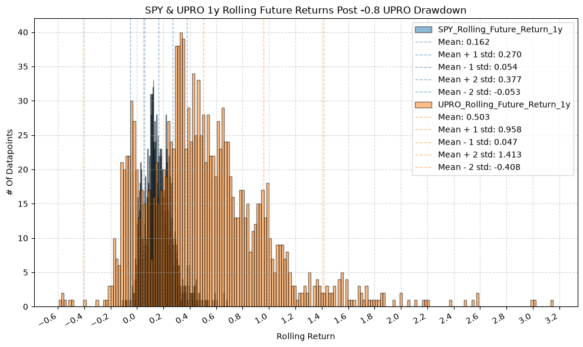
    


    
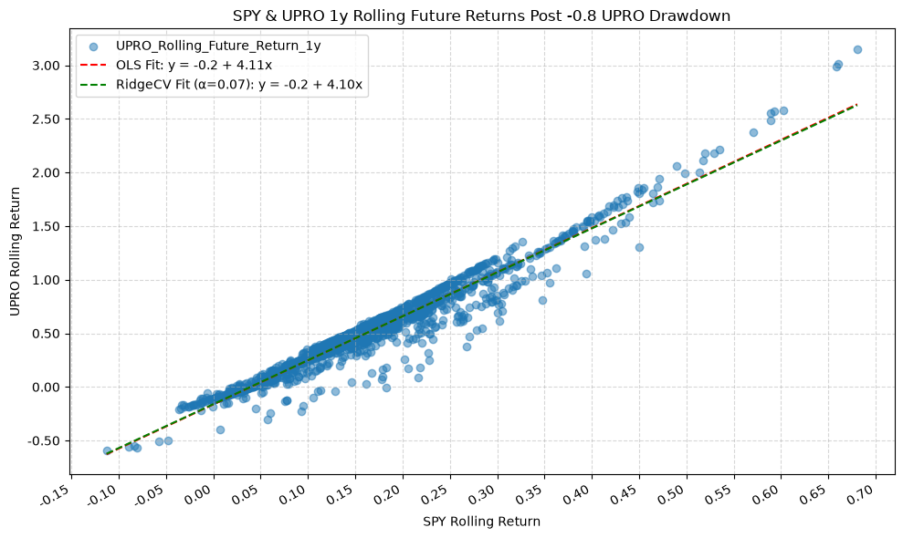
    


                                      OLS Regression Results                                 
    =========================================================================================
    Dep. Variable:     UPRO_Rolling_Future_Return_1y   R-squared:                       0.945
    Model:                                       OLS   Adj. R-squared:                  0.945
    Method:                            Least Squares   F-statistic:                 2.530e+04
    Date:                           Mon, 23 Mar 2026   Prob (F-statistic):               0.00
    Time:                                   22:04:47   Log-Likelihood:                 1207.7
    No. Observations:                           1478   AIC:                            -2411.
    Df Residuals:                               1476   BIC:                            -2401.
    Df Model:                                      1                                         
    Covariance Type:                       nonrobust                                         
    ================================================================================================
                                       coef    std err          t      P>|t|      [0.025      0.975]
    ------------------------------------------------------------------------------------------------
    const                           -0.1638      0.005    -32.561      0.000      -0.174      -0.154
    SPY_Rolling_Future_Return_1y     4.1147      0.026    159.048      0.000       4.064       4.165
    ==============================================================================
    Omnibus:                      635.689   Durbin-Watson:                   0.055
    Prob(Omnibus):                  0.000   Jarque-Bera (JB):             4011.205
    Skew:                          -1.899   Prob(JB):                         0.00
    Kurtosis:                      10.121   Cond. No.                         9.55
    ==============================================================================
    
    Notes:
    [1] Standard Errors assume that the covariance matrix of the errors is correctly specified.


    
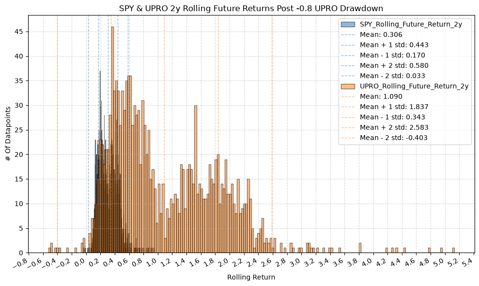
    


    

    


                                      OLS Regression Results                                 
    =========================================================================================
    Dep. Variable:     UPRO_Rolling_Future_Return_2y   R-squared:                       0.940
    Model:                                       OLS   Adj. R-squared:                  0.940
    Method:                            Least Squares   F-statistic:                 2.321e+04
    Date:                           Mon, 23 Mar 2026   Prob (F-statistic):               0.00
    Time:                                   22:04:48   Log-Likelihood:                 416.77
    No. Observations:                           1478   AIC:                            -829.5
    Df Residuals:                               1476   BIC:                            -818.9
    Df Model:                                      1                                         
    Covariance Type:                       nonrobust                                         
    ================================================================================================
                                       coef    std err          t      P>|t|      [0.025      0.975]
    ------------------------------------------------------------------------------------------------
    const                           -0.5307      0.012    -45.547      0.000      -0.554      -0.508
    SPY_Rolling_Future_Return_2y     5.2902      0.035    152.339      0.000       5.222       5.358
    ==============================================================================
    Omnibus:                      349.846   Durbin-Watson:                   0.045
    Prob(Omnibus):                  0.000   Jarque-Bera (JB):              913.818
    Skew:                          -1.242   Prob(JB):                    3.69e-199
    Kurtosis:                       5.944   Cond. No.                         8.01
    ==============================================================================
    
    Notes:
    [1] Standard Errors assume that the covariance matrix of the errors is correctly specified.


    
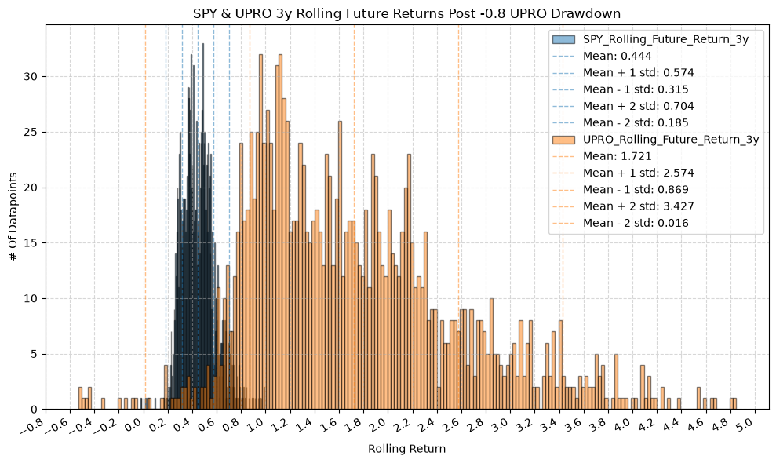
    


    

    


                                      OLS Regression Results                                 
    =========================================================================================
    Dep. Variable:     UPRO_Rolling_Future_Return_3y   R-squared:                       0.884
    Model:                                       OLS   Adj. R-squared:                  0.884
    Method:                            Least Squares   F-statistic:                 1.127e+04
    Date:                           Mon, 23 Mar 2026   Prob (F-statistic):               0.00
    Time:                                   22:04:50   Log-Likelihood:                -267.99
    No. Observations:                           1478   AIC:                             540.0
    Df Residuals:                               1476   BIC:                             550.6
    Df Model:                                      1                                         
    Covariance Type:                       nonrobust                                         
    ================================================================================================
                                       coef    std err          t      P>|t|      [0.025      0.975]
    ------------------------------------------------------------------------------------------------
    const                           -1.0261      0.027    -38.067      0.000      -1.079      -0.973
    SPY_Rolling_Future_Return_3y     6.1824      0.058    106.180      0.000       6.068       6.297
    ==============================================================================
    Omnibus:                       75.072   Durbin-Watson:                   0.032
    Prob(Omnibus):                  0.000   Jarque-Bera (JB):               91.613
    Skew:                          -0.514   Prob(JB):                     1.28e-20
    Kurtosis:                       3.657   Cond. No.                         9.26
    ==============================================================================
    
    Notes:
    [1] Standard Errors assume that the covariance matrix of the errors is correctly specified.


    
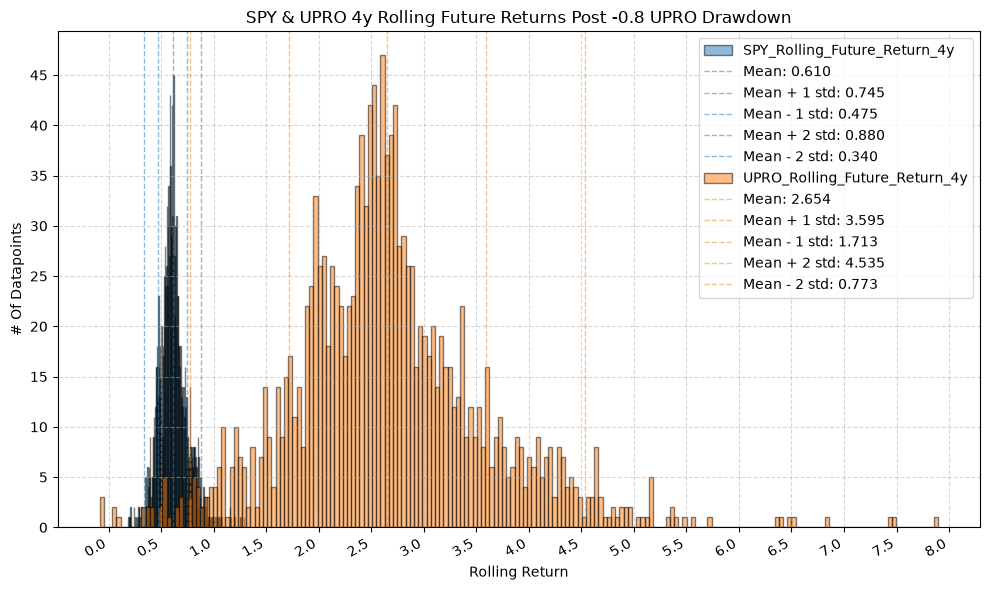
    


    
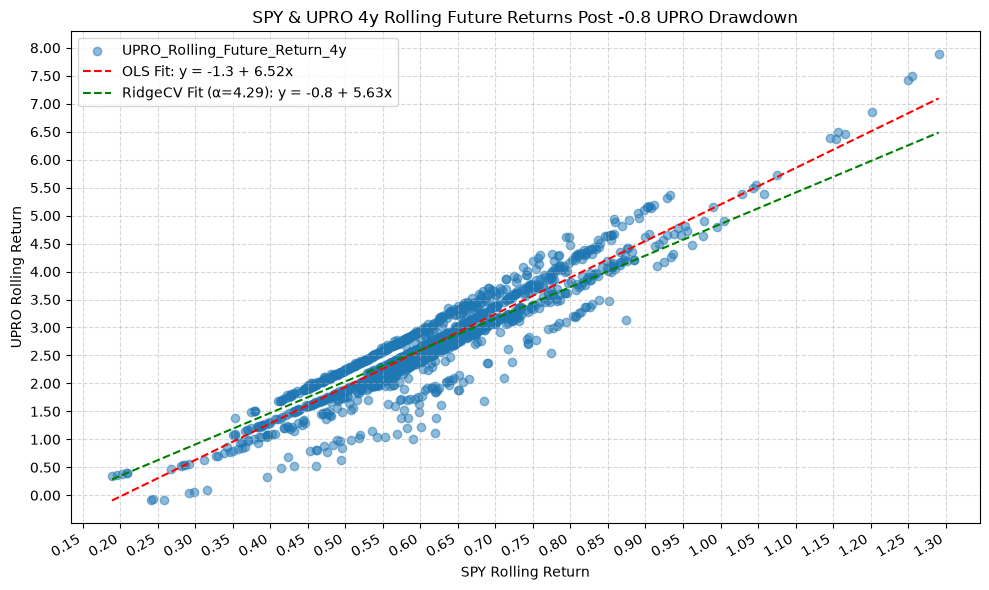
    


                                      OLS Regression Results                                 
    =========================================================================================
    Dep. Variable:     UPRO_Rolling_Future_Return_4y   R-squared:                       0.877
    Model:                                       OLS   Adj. R-squared:                  0.877
    Method:                            Least Squares   F-statistic:                 1.049e+04
    Date:                           Mon, 23 Mar 2026   Prob (F-statistic):               0.00
    Time:                                   22:04:52   Log-Likelihood:                -459.80
    No. Observations:                           1478   AIC:                             923.6
    Df Residuals:                               1476   BIC:                             934.2
    Df Model:                                      1                                         
    Covariance Type:                       nonrobust                                         
    ================================================================================================
                                       coef    std err          t      P>|t|      [0.025      0.975]
    ------------------------------------------------------------------------------------------------
    const                           -1.3239      0.040    -33.279      0.000      -1.402      -1.246
    SPY_Rolling_Future_Return_4y     6.5226      0.064    102.410      0.000       6.398       6.648
    ==============================================================================
    Omnibus:                      316.447   Durbin-Watson:                   0.032
    Prob(Omnibus):                  0.000   Jarque-Bera (JB):              744.845
    Skew:                          -1.168   Prob(JB):                    1.82e-162
    Kurtosis:                       5.577   Cond. No.                         10.2
    ==============================================================================
    
    Notes:
    [1] Standard Errors assume that the covariance matrix of the errors is correctly specified.


    
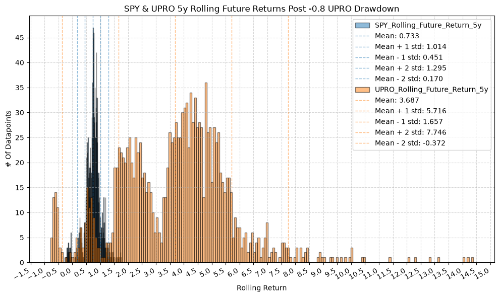
    


    

    


                                      OLS Regression Results                                 
    =========================================================================================
    Dep. Variable:     UPRO_Rolling_Future_Return_5y   R-squared:                       0.895
    Model:                                       OLS   Adj. R-squared:                  0.895
    Method:                            Least Squares   F-statistic:                 1.257e+04
    Date:                           Mon, 23 Mar 2026   Prob (F-statistic):               0.00
    Time:                                   22:04:53   Log-Likelihood:                -1477.7
    No. Observations:                           1478   AIC:                             2959.
    Df Residuals:                               1476   BIC:                             2970.
    Df Model:                                      1                                         
    Covariance Type:                       nonrobust                                         
    ================================================================================================
                                       coef    std err          t      P>|t|      [0.025      0.975]
    ------------------------------------------------------------------------------------------------
    const                           -1.3148      0.048    -27.521      0.000      -1.409      -1.221
    SPY_Rolling_Future_Return_5y     6.8269      0.061    112.133      0.000       6.707       6.946
    ==============================================================================
    Omnibus:                      180.837   Durbin-Watson:                   0.042
    Prob(Omnibus):                  0.000   Jarque-Bera (JB):              811.822
    Skew:                           0.496   Prob(JB):                    5.19e-177
    Kurtosis:                       6.492   Cond. No.                         5.57
    ==============================================================================
    
    Notes:
    [1] Standard Errors assume that the covariance matrix of the errors is correctly specified.


    
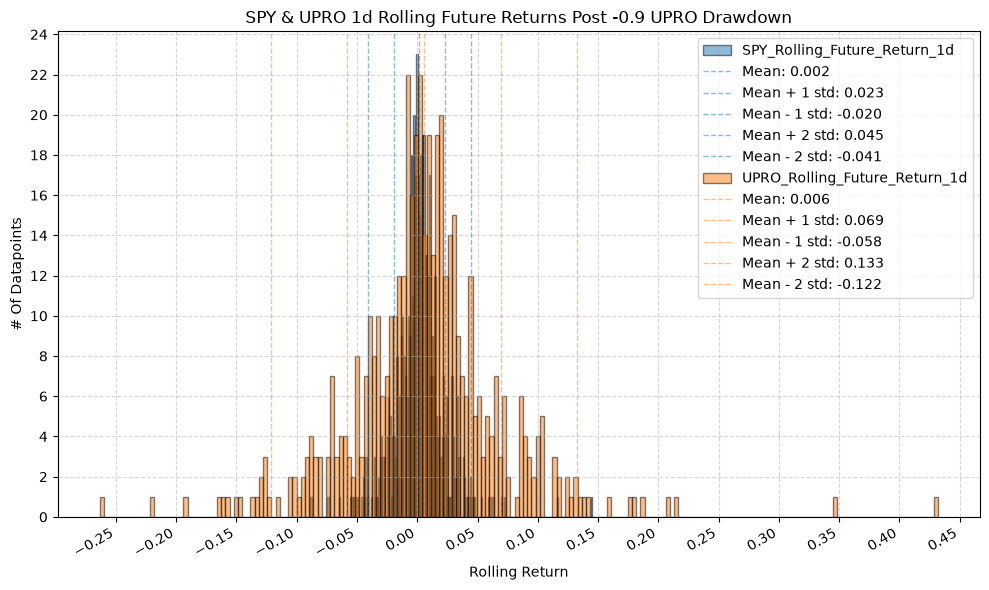
    


    
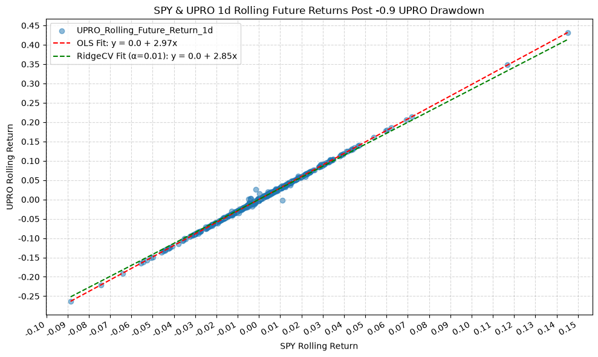
    


                                      OLS Regression Results                                 
    =========================================================================================
    Dep. Variable:     UPRO_Rolling_Future_Return_1d   R-squared:                       0.998
    Model:                                       OLS   Adj. R-squared:                  0.998
    Method:                            Least Squares   F-statistic:                 2.296e+05
    Date:                           Mon, 23 Mar 2026   Prob (F-statistic):               0.00
    Time:                                   22:04:55   Log-Likelihood:                 2166.7
    No. Observations:                            491   AIC:                            -4329.
    Df Residuals:                                489   BIC:                            -4321.
    Df Model:                                      1                                         
    Covariance Type:                       nonrobust                                         
    ================================================================================================
                                       coef    std err          t      P>|t|      [0.025      0.975]
    ------------------------------------------------------------------------------------------------
    const                            0.0001      0.000      0.842      0.400      -0.000       0.000
    SPY_Rolling_Future_Return_1d     2.9736      0.006    479.155      0.000       2.961       2.986
    ==============================================================================
    Omnibus:                      206.818   Durbin-Watson:                   2.771
    Prob(Omnibus):                  0.000   Jarque-Bera (JB):            96271.874
    Skew:                           0.202   Prob(JB):                         0.00
    Kurtosis:                      71.597   Cond. No.                         46.8
    ==============================================================================
    
    Notes:
    [1] Standard Errors assume that the covariance matrix of the errors is correctly specified.


    
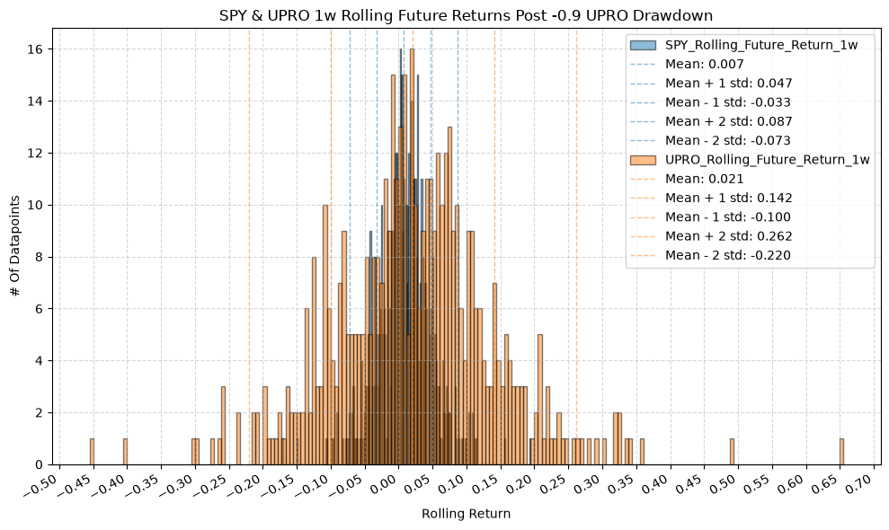
    


    
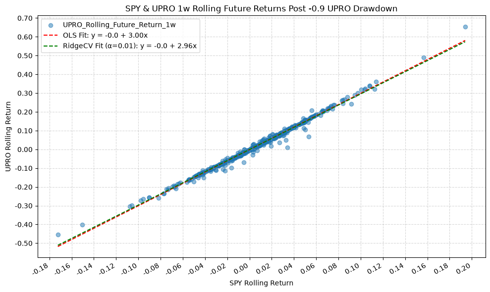
    


                                      OLS Regression Results                                 
    =========================================================================================
    Dep. Variable:     UPRO_Rolling_Future_Return_1w   R-squared:                       0.990
    Model:                                       OLS   Adj. R-squared:                  0.990
    Method:                            Least Squares   F-statistic:                 4.746e+04
    Date:                           Mon, 23 Mar 2026   Prob (F-statistic):               0.00
    Time:                                   22:04:57   Log-Likelihood:                 1468.0
    No. Observations:                            491   AIC:                            -2932.
    Df Residuals:                                489   BIC:                            -2924.
    Df Model:                                      1                                         
    Covariance Type:                       nonrobust                                         
    ================================================================================================
                                       coef    std err          t      P>|t|      [0.025      0.975]
    ------------------------------------------------------------------------------------------------
    const                           -0.0009      0.001     -1.609      0.108      -0.002       0.000
    SPY_Rolling_Future_Return_1w     2.9980      0.014    217.862      0.000       2.971       3.025
    ==============================================================================
    Omnibus:                      245.324   Durbin-Watson:                   1.337
    Prob(Omnibus):                  0.000   Jarque-Bera (JB):             7331.985
    Skew:                          -1.554   Prob(JB):                         0.00
    Kurtosis:                      21.674   Cond. No.                         25.0
    ==============================================================================
    
    Notes:
    [1] Standard Errors assume that the covariance matrix of the errors is correctly specified.


    
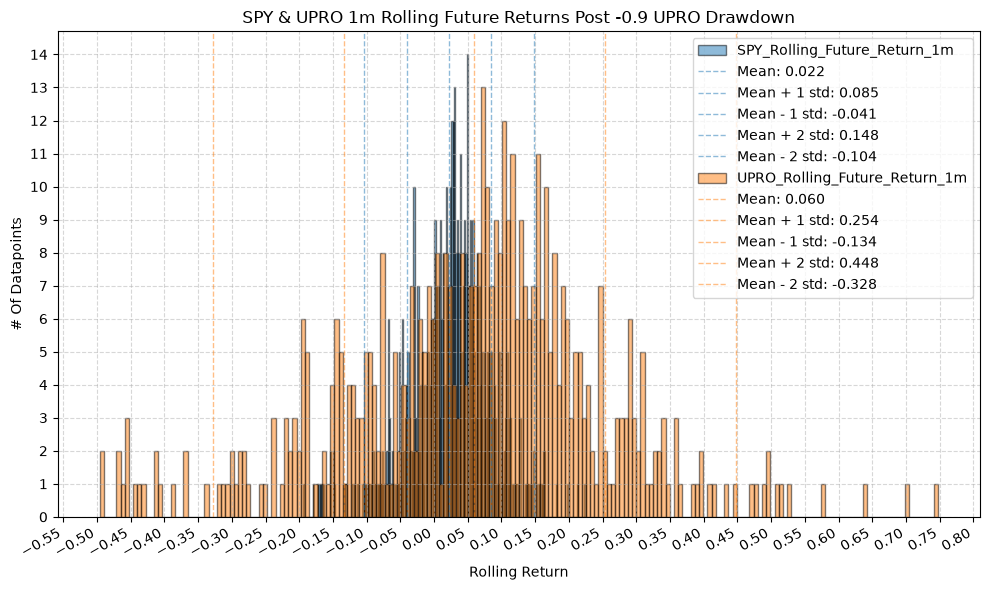
    


    
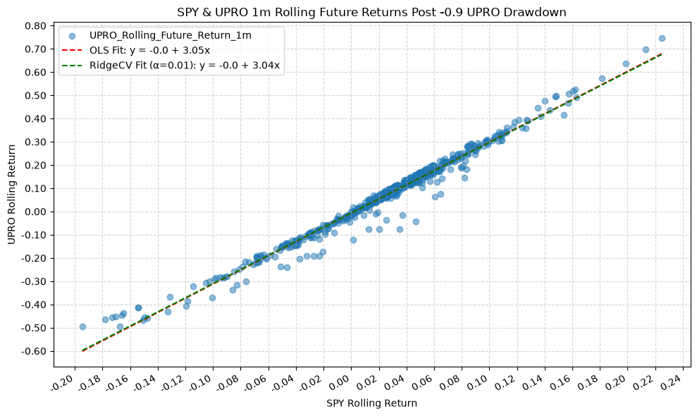
    


                                      OLS Regression Results                                 
    =========================================================================================
    Dep. Variable:     UPRO_Rolling_Future_Return_1m   R-squared:                       0.977
    Model:                                       OLS   Adj. R-squared:                  0.977
    Method:                            Least Squares   F-statistic:                 2.044e+04
    Date:                           Mon, 23 Mar 2026   Prob (F-statistic):               0.00
    Time:                                   22:04:58   Log-Likelihood:                 1031.5
    No. Observations:                            491   AIC:                            -2059.
    Df Residuals:                                489   BIC:                            -2051.
    Df Model:                                      1                                         
    Covariance Type:                       nonrobust                                         
    ================================================================================================
                                       coef    std err          t      P>|t|      [0.025      0.975]
    ------------------------------------------------------------------------------------------------
    const                           -0.0072      0.001     -5.067      0.000      -0.010      -0.004
    SPY_Rolling_Future_Return_1m     3.0532      0.021    142.970      0.000       3.011       3.095
    ==============================================================================
    Omnibus:                      245.913   Durbin-Watson:                   0.321
    Prob(Omnibus):                  0.000   Jarque-Bera (JB):             2033.870
    Skew:                          -2.014   Prob(JB):                         0.00
    Kurtosis:                      12.121   Cond. No.                         16.0
    ==============================================================================
    
    Notes:
    [1] Standard Errors assume that the covariance matrix of the errors is correctly specified.


    
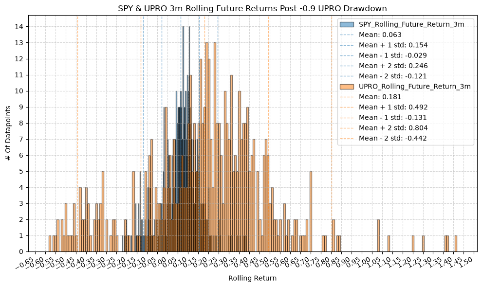
    


    
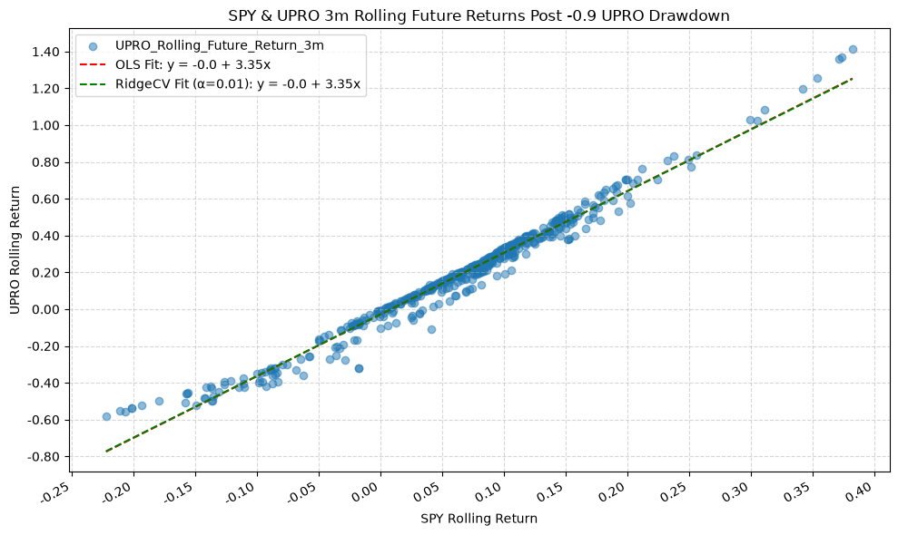
    


                                      OLS Regression Results                                 
    =========================================================================================
    Dep. Variable:     UPRO_Rolling_Future_Return_3m   R-squared:                       0.976
    Model:                                       OLS   Adj. R-squared:                  0.976
    Method:                            Least Squares   F-statistic:                 1.997e+04
    Date:                           Mon, 23 Mar 2026   Prob (F-statistic):               0.00
    Time:                                   22:05:00   Log-Likelihood:                 792.83
    No. Observations:                            491   AIC:                            -1582.
    Df Residuals:                                489   BIC:                            -1573.
    Df Model:                                      1                                         
    Covariance Type:                       nonrobust                                         
    ================================================================================================
                                       coef    std err          t      P>|t|      [0.025      0.975]
    ------------------------------------------------------------------------------------------------
    const                           -0.0292      0.003    -11.068      0.000      -0.034      -0.024
    SPY_Rolling_Future_Return_3m     3.3540      0.024    141.332      0.000       3.307       3.401
    ==============================================================================
    Omnibus:                       75.475   Durbin-Watson:                   0.347
    Prob(Omnibus):                  0.000   Jarque-Bera (JB):              481.986
    Skew:                          -0.456   Prob(JB):                    2.18e-105
    Kurtosis:                       7.767   Cond. No.                         10.9
    ==============================================================================
    
    Notes:
    [1] Standard Errors assume that the covariance matrix of the errors is correctly specified.


    
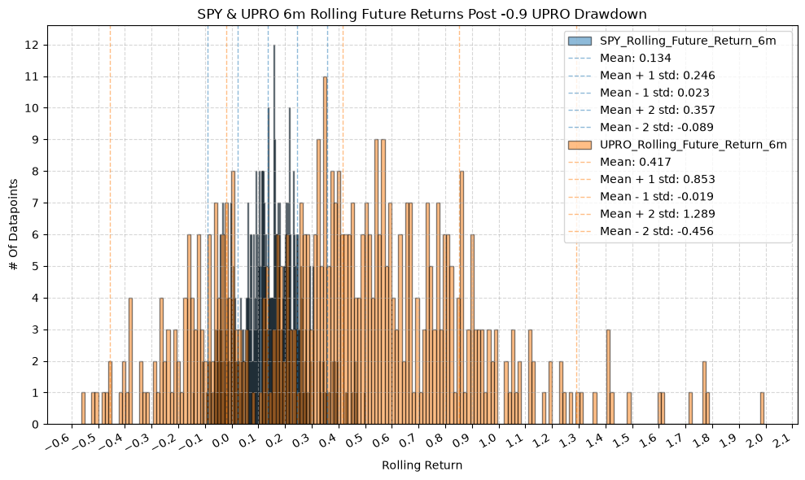
    


    
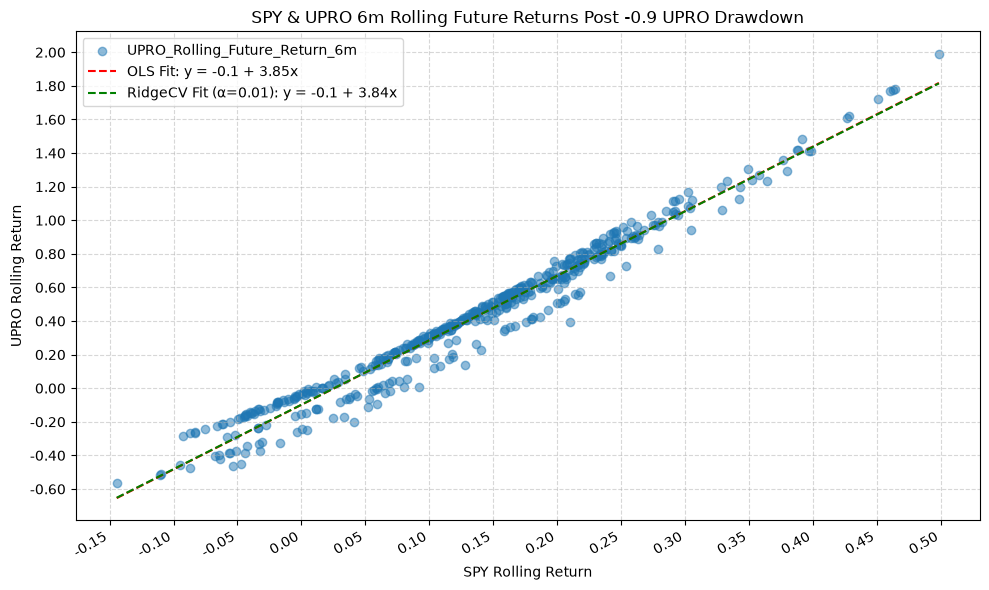
    


                                      OLS Regression Results                                 
    =========================================================================================
    Dep. Variable:     UPRO_Rolling_Future_Return_6m   R-squared:                       0.968
    Model:                                       OLS   Adj. R-squared:                  0.968
    Method:                            Least Squares   F-statistic:                 1.482e+04
    Date:                           Mon, 23 Mar 2026   Prob (F-statistic):               0.00
    Time:                                   22:05:02   Log-Likelihood:                 557.06
    No. Observations:                            491   AIC:                            -1110.
    Df Residuals:                                489   BIC:                            -1102.
    Df Model:                                      1                                         
    Covariance Type:                       nonrobust                                         
    ================================================================================================
                                       coef    std err          t      P>|t|      [0.025      0.975]
    ------------------------------------------------------------------------------------------------
    const                           -0.0999      0.006    -18.095      0.000      -0.111      -0.089
    SPY_Rolling_Future_Return_6m     3.8493      0.032    121.719      0.000       3.787       3.911
    ==============================================================================
    Omnibus:                       90.171   Durbin-Watson:                   0.148
    Prob(Omnibus):                  0.000   Jarque-Bera (JB):              142.832
    Skew:                          -1.152   Prob(JB):                     9.65e-32
    Kurtosis:                       4.292   Cond. No.                         9.15
    ==============================================================================
    
    Notes:
    [1] Standard Errors assume that the covariance matrix of the errors is correctly specified.


    
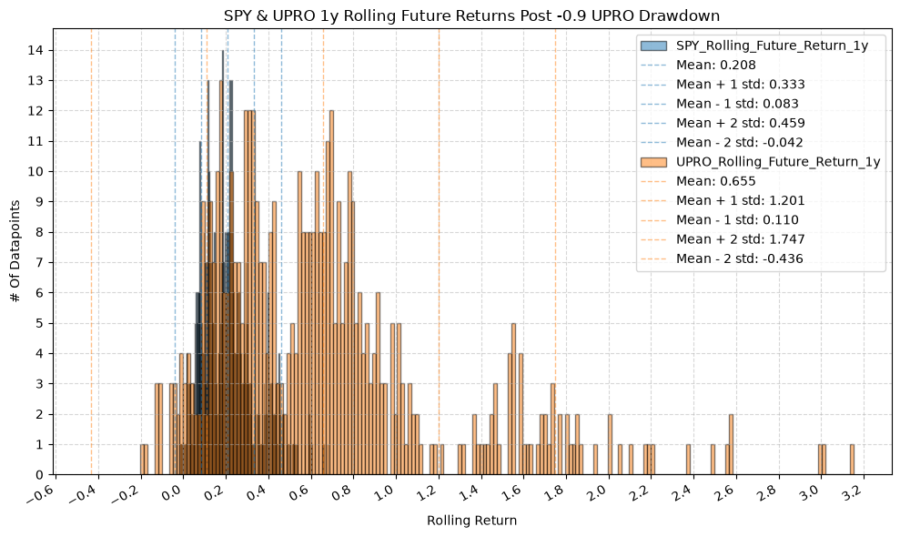
    


    
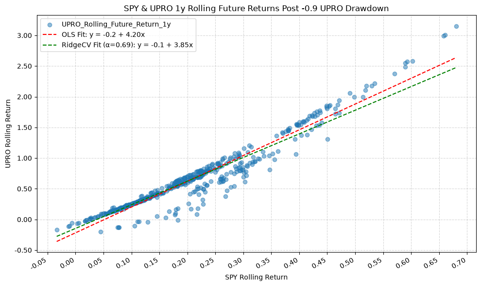
    


                                      OLS Regression Results                                 
    =========================================================================================
    Dep. Variable:     UPRO_Rolling_Future_Return_1y   R-squared:                       0.926
    Model:                                       OLS   Adj. R-squared:                  0.926
    Method:                            Least Squares   F-statistic:                     6140.
    Date:                           Mon, 23 Mar 2026   Prob (F-statistic):          5.83e-279
    Time:                                   22:05:03   Log-Likelihood:                 240.67
    No. Observations:                            491   AIC:                            -477.3
    Df Residuals:                                489   BIC:                            -469.0
    Df Model:                                      1                                         
    Covariance Type:                       nonrobust                                         
    ================================================================================================
                                       coef    std err          t      P>|t|      [0.025      0.975]
    ------------------------------------------------------------------------------------------------
    const                           -0.2184      0.013    -16.774      0.000      -0.244      -0.193
    SPY_Rolling_Future_Return_1y     4.1972      0.054     78.358      0.000       4.092       4.302
    ==============================================================================
    Omnibus:                      128.802   Durbin-Watson:                   0.094
    Prob(Omnibus):                  0.000   Jarque-Bera (JB):              299.079
    Skew:                          -1.348   Prob(JB):                     1.14e-65
    Kurtosis:                       5.711   Cond. No.                         8.34
    ==============================================================================
    
    Notes:
    [1] Standard Errors assume that the covariance matrix of the errors is correctly specified.


    
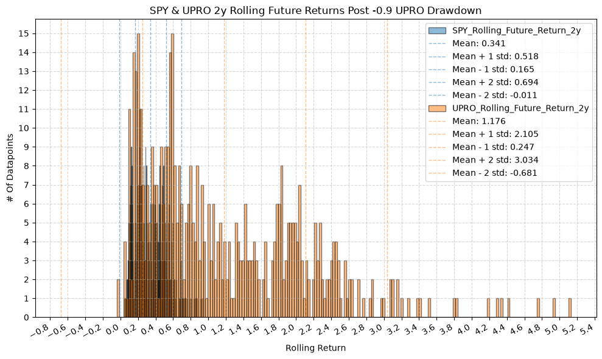
    


    
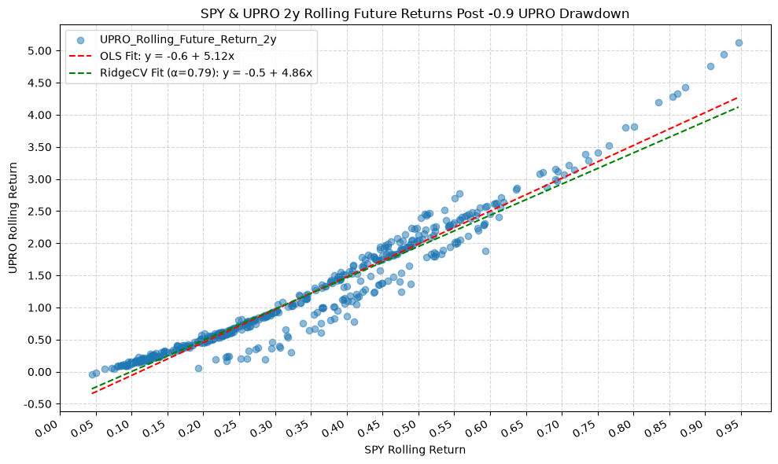
    


                                      OLS Regression Results                                 
    =========================================================================================
    Dep. Variable:     UPRO_Rolling_Future_Return_2y   R-squared:                       0.943
    Model:                                       OLS   Adj. R-squared:                  0.943
    Method:                            Least Squares   F-statistic:                     8061.
    Date:                           Mon, 23 Mar 2026   Prob (F-statistic):          5.45e-306
    Time:                                   22:05:05   Log-Likelihood:                 42.554
    No. Observations:                            491   AIC:                            -81.11
    Df Residuals:                                489   BIC:                            -72.71
    Df Model:                                      1                                         
    Covariance Type:                       nonrobust                                         
    ================================================================================================
                                       coef    std err          t      P>|t|      [0.025      0.975]
    ------------------------------------------------------------------------------------------------
    const                           -0.5701      0.022    -26.024      0.000      -0.613      -0.527
    SPY_Rolling_Future_Return_2y     5.1178      0.057     89.785      0.000       5.006       5.230
    ==============================================================================
    Omnibus:                       62.351   Durbin-Watson:                   0.075
    Prob(Omnibus):                  0.000   Jarque-Bera (JB):              116.151
    Skew:                          -0.750   Prob(JB):                     6.00e-26
    Kurtosis:                       4.851   Cond. No.                         6.36
    ==============================================================================
    
    Notes:
    [1] Standard Errors assume that the covariance matrix of the errors is correctly specified.


    
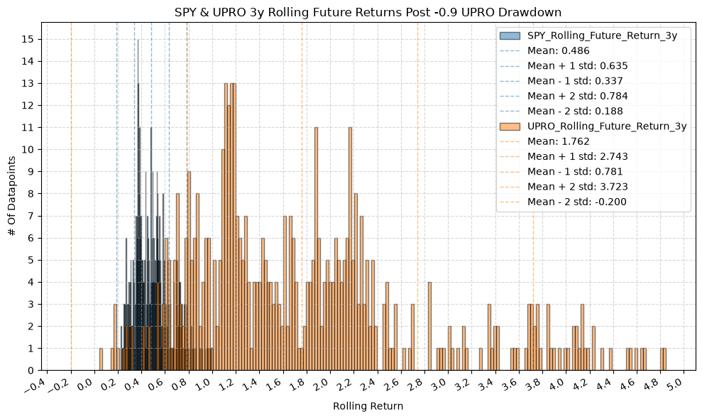
    


    
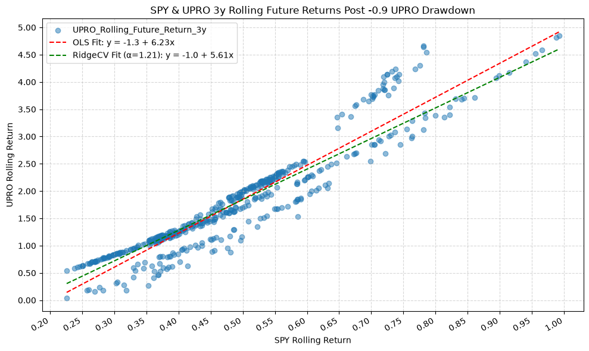
    


                                      OLS Regression Results                                 
    =========================================================================================
    Dep. Variable:     UPRO_Rolling_Future_Return_3y   R-squared:                       0.895
    Model:                                       OLS   Adj. R-squared:                  0.894
    Method:                            Least Squares   F-statistic:                     4155.
    Date:                           Mon, 23 Mar 2026   Prob (F-statistic):          3.74e-241
    Time:                                   22:05:06   Log-Likelihood:                -134.10
    No. Observations:                            491   AIC:                             272.2
    Df Residuals:                                489   BIC:                             280.6
    Df Model:                                      1                                         
    Covariance Type:                       nonrobust                                         
    ================================================================================================
                                       coef    std err          t      P>|t|      [0.025      0.975]
    ------------------------------------------------------------------------------------------------
    const                           -1.2674      0.049    -25.774      0.000      -1.364      -1.171
    SPY_Rolling_Future_Return_3y     6.2351      0.097     64.456      0.000       6.045       6.425
    ==============================================================================
    Omnibus:                       10.263   Durbin-Watson:                   0.052
    Prob(Omnibus):                  0.006   Jarque-Bera (JB):               14.154
    Skew:                           0.184   Prob(JB):                     0.000844
    Kurtosis:                       3.746   Cond. No.                         8.35
    ==============================================================================
    
    Notes:
    [1] Standard Errors assume that the covariance matrix of the errors is correctly specified.


    
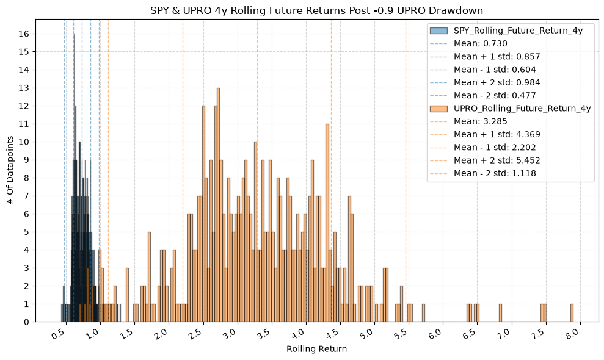
    


    
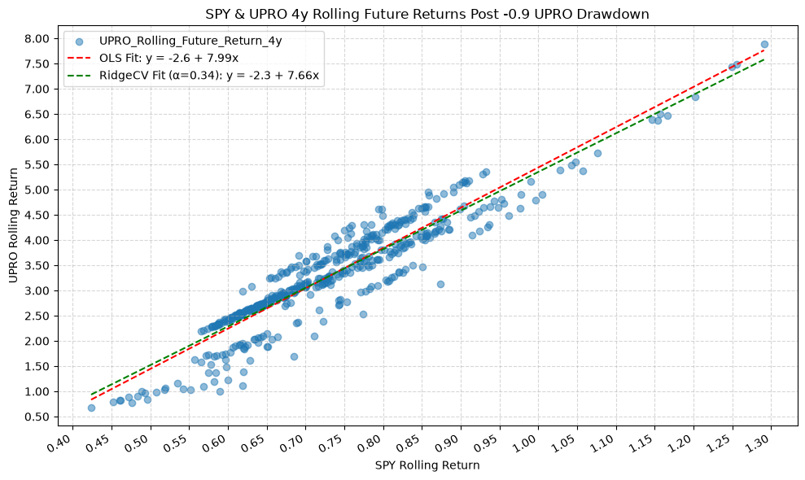
    


                                      OLS Regression Results                                 
    =========================================================================================
    Dep. Variable:     UPRO_Rolling_Future_Return_4y   R-squared:                       0.874
    Model:                                       OLS   Adj. R-squared:                  0.874
    Method:                            Least Squares   F-statistic:                     3400.
    Date:                           Mon, 23 Mar 2026   Prob (F-statistic):          2.56e-222
    Time:                                   22:05:08   Log-Likelihood:                -226.80
    No. Observations:                            491   AIC:                             457.6
    Df Residuals:                                489   BIC:                             466.0
    Df Model:                                      1                                         
    Covariance Type:                       nonrobust                                         
    ================================================================================================
                                       coef    std err          t      P>|t|      [0.025      0.975]
    ------------------------------------------------------------------------------------------------
    const                           -2.5542      0.102    -25.124      0.000      -2.754      -2.354
    SPY_Rolling_Future_Return_4y     7.9944      0.137     58.309      0.000       7.725       8.264
    ==============================================================================
    Omnibus:                       34.991   Durbin-Watson:                   0.062
    Prob(Omnibus):                  0.000   Jarque-Bera (JB):               40.573
    Skew:                          -0.693   Prob(JB):                     1.55e-09
    Kurtosis:                       3.253   Cond. No.                         12.2
    ==============================================================================
    
    Notes:
    [1] Standard Errors assume that the covariance matrix of the errors is correctly specified.


    
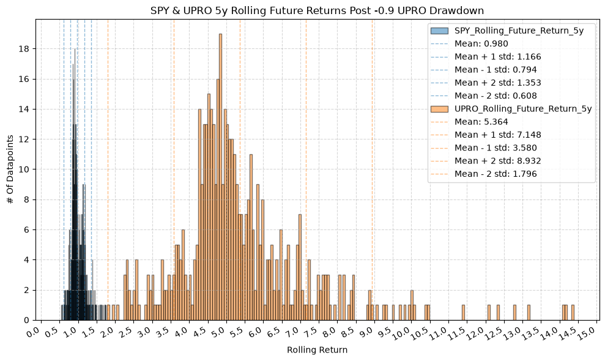
    


    
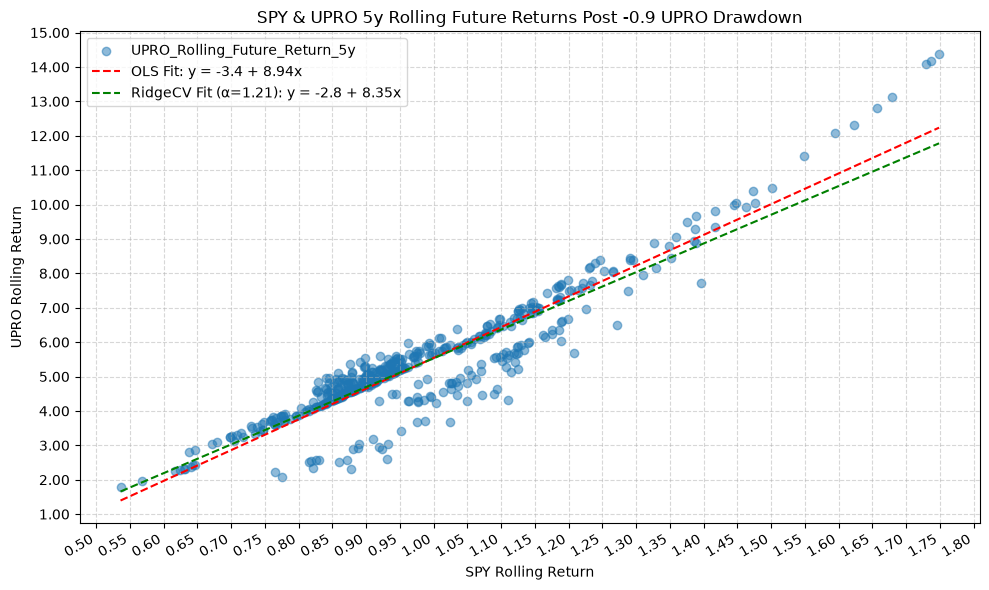
    


                                      OLS Regression Results                                 
    =========================================================================================
    Dep. Variable:     UPRO_Rolling_Future_Return_5y   R-squared:                       0.870
    Model:                                       OLS   Adj. R-squared:                  0.870
    Method:                            Least Squares   F-statistic:                     3285.
    Date:                           Mon, 23 Mar 2026   Prob (F-statistic):          3.96e-219
    Time:                                   22:05:10   Log-Likelihood:                -478.85
    No. Observations:                            491   AIC:                             961.7
    Df Residuals:                                489   BIC:                             970.1
    Df Model:                                      1                                         
    Covariance Type:                       nonrobust                                         
    ================================================================================================
                                       coef    std err          t      P>|t|      [0.025      0.975]
    ------------------------------------------------------------------------------------------------
    const                           -3.3998      0.156    -21.837      0.000      -3.706      -3.094
    SPY_Rolling_Future_Return_5y     8.9407      0.156     57.314      0.000       8.634       9.247
    ==============================================================================
    Omnibus:                      107.012   Durbin-Watson:                   0.059
    Prob(Omnibus):                  0.000   Jarque-Bera (JB):              209.241
    Skew:                          -1.203   Prob(JB):                     3.66e-46
    Kurtosis:                       5.106   Cond. No.                         10.6
    ==============================================================================
    
    Notes:
    [1] Standard Errors assume that the covariance matrix of the errors is correctly specified.


### Rolling Returns Following Drawdowns Deviation (SPY & UPRO)


```python
rolling_returns_positive_future_returns = pd.DataFrame(index=rolling_windows.keys(), data=rolling_windows.values())
rolling_returns_positive_future_returns.reset_index(inplace=True)
rolling_returns_positive_future_returns.rename(columns={"index":"Period", 0:"Days"}, inplace=True)

for drawdown in drawdown_levels:
    temp = rolling_returns_drawdown_stats.loc[rolling_returns_drawdown_stats["Drawdown"] == drawdown]
    temp = temp[["Period", "Positive_Future_Percentage"]]
    temp.rename(columns={"Positive_Future_Percentage" : f"Positive_Future_Percentage_Post_{drawdown}_Drawdown"}, inplace=True)
    rolling_returns_positive_future_returns = pd.merge(rolling_returns_positive_future_returns, temp, left_on="Period", right_on="Period", how="outer")
    rolling_returns_positive_future_returns.sort_values(by="Days", ascending=True, inplace=True)

rolling_returns_positive_future_returns.drop(columns={"Days"}, inplace=True)
rolling_returns_positive_future_returns.reset_index(drop=True, inplace=True)
pandas_set_decimal_places(2)
display(rolling_returns_positive_future_returns.set_index("Period"))
```


<div>
<style scoped>
    .dataframe tbody tr th:only-of-type {
        vertical-align: middle;
    }

    .dataframe tbody tr th {
        vertical-align: top;
    }

    .dataframe thead th {
        text-align: right;
    }
</style>
<table border="1" class="dataframe">
  <thead>
    <tr style="text-align: right;">
      <th></th>
      <th>Positive_Future_Percentage_Post_-0.1_Drawdown</th>
      <th>Positive_Future_Percentage_Post_-0.2_Drawdown</th>
      <th>Positive_Future_Percentage_Post_-0.3_Drawdown</th>
      <th>Positive_Future_Percentage_Post_-0.4_Drawdown</th>
      <th>Positive_Future_Percentage_Post_-0.5_Drawdown</th>
      <th>Positive_Future_Percentage_Post_-0.6_Drawdown</th>
      <th>Positive_Future_Percentage_Post_-0.7_Drawdown</th>
      <th>Positive_Future_Percentage_Post_-0.8_Drawdown</th>
      <th>Positive_Future_Percentage_Post_-0.9_Drawdown</th>
    </tr>
    <tr>
      <th>Period</th>
      <th></th>
      <th></th>
      <th></th>
      <th></th>
      <th></th>
      <th></th>
      <th></th>
      <th></th>
      <th></th>
    </tr>
  </thead>
  <tbody>
    <tr>
      <th>1d</th>
      <td>0.54</td>
      <td>0.54</td>
      <td>0.54</td>
      <td>0.54</td>
      <td>0.54</td>
      <td>0.55</td>
      <td>0.55</td>
      <td>0.55</td>
      <td>0.55</td>
    </tr>
    <tr>
      <th>1w</th>
      <td>0.57</td>
      <td>0.57</td>
      <td>0.56</td>
      <td>0.56</td>
      <td>0.56</td>
      <td>0.56</td>
      <td>0.57</td>
      <td>0.57</td>
      <td>0.59</td>
    </tr>
    <tr>
      <th>1m</th>
      <td>0.63</td>
      <td>0.61</td>
      <td>0.61</td>
      <td>0.61</td>
      <td>0.62</td>
      <td>0.62</td>
      <td>0.62</td>
      <td>0.65</td>
      <td>0.68</td>
    </tr>
    <tr>
      <th>3m</th>
      <td>0.67</td>
      <td>0.65</td>
      <td>0.63</td>
      <td>0.63</td>
      <td>0.65</td>
      <td>0.65</td>
      <td>0.66</td>
      <td>0.68</td>
      <td>0.77</td>
    </tr>
    <tr>
      <th>6m</th>
      <td>0.70</td>
      <td>0.69</td>
      <td>0.68</td>
      <td>0.67</td>
      <td>0.69</td>
      <td>0.70</td>
      <td>0.73</td>
      <td>0.75</td>
      <td>0.79</td>
    </tr>
    <tr>
      <th>1y</th>
      <td>0.73</td>
      <td>0.73</td>
      <td>0.73</td>
      <td>0.72</td>
      <td>0.74</td>
      <td>0.79</td>
      <td>0.84</td>
      <td>0.87</td>
      <td>0.96</td>
    </tr>
    <tr>
      <th>2y</th>
      <td>0.77</td>
      <td>0.78</td>
      <td>0.78</td>
      <td>0.78</td>
      <td>0.77</td>
      <td>0.81</td>
      <td>0.92</td>
      <td>0.99</td>
      <td>1.00</td>
    </tr>
    <tr>
      <th>3y</th>
      <td>0.72</td>
      <td>0.72</td>
      <td>0.72</td>
      <td>0.72</td>
      <td>0.72</td>
      <td>0.74</td>
      <td>0.87</td>
      <td>0.99</td>
      <td>1.00</td>
    </tr>
    <tr>
      <th>4y</th>
      <td>0.69</td>
      <td>0.69</td>
      <td>0.68</td>
      <td>0.68</td>
      <td>0.68</td>
      <td>0.71</td>
      <td>0.81</td>
      <td>1.00</td>
      <td>1.00</td>
    </tr>
    <tr>
      <th>5y</th>
      <td>0.66</td>
      <td>0.66</td>
      <td>0.66</td>
      <td>0.66</td>
      <td>0.65</td>
      <td>0.67</td>
      <td>0.74</td>
      <td>0.97</td>
      <td>1.00</td>
    </tr>
  </tbody>
</table>
</div>


```python
plot_scatter(
    df=rolling_returns_positive_future_returns,
    x_plot_column="Period",
    y_plot_columns=[col for col in rolling_returns_positive_future_returns.columns if col != "Period"],
    title="UPRO Future Return by Time Period Post Drawdown",
    x_label="Rolling Return Time Period",
    x_format="String",
    x_format_decimal_places=0,
    x_tick_spacing=1,
    x_tick_rotation=0,
    y_label="Positive Future Return Percentage",
    y_format="Decimal",
    y_format_decimal_places=2,
    y_tick_spacing="Auto",
    y_tick_rotation=0,
    plot_OLS_regression_line=False,
    OLS_column=None,
    plot_Ridge_regression_line=False,
    Ridge_column=None,
    plot_RidgeCV_regression_line=False,
    RidgeCV_column=None,
    regression_constant=False,
    grid=True,
    legend=True,
    export_plot=False,
    plot_file_name=None,
)
```


    
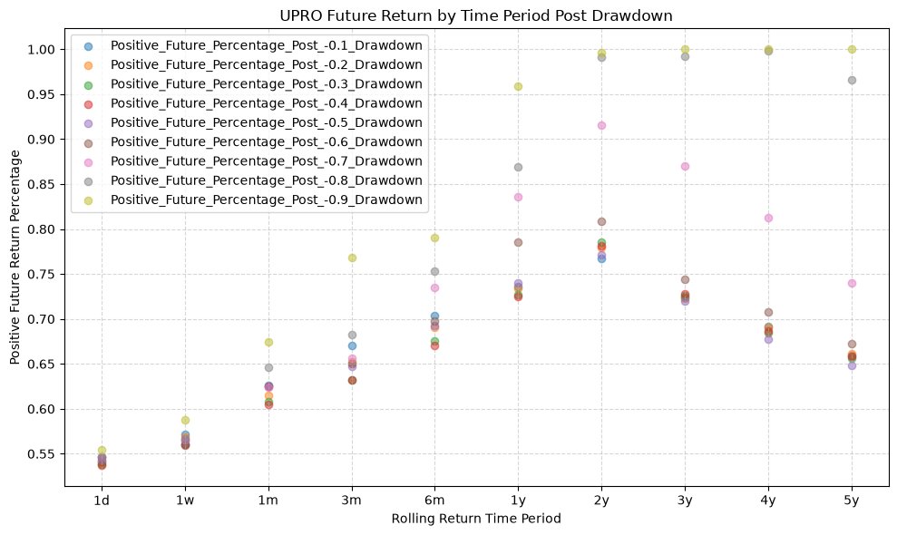
    


This plot summarizes the future rolling returns well. Similar as to QQQ/TQQQ, for rolling returns up to ~3 months *following* all drawdown levels, we see the rolling returns of UPRO are positive ~65% of the time.

As we extend the time horizon, out to the 2y, 3y, 4y, and 5y mark, the percentage of positive rolling returns following an 80% drawdown increases significantly, and is greater than *95%*. This suggests that while the volatility decay effect is present for UPRO, it may not be as severe as that of TQQQ, which could be due to the less extreme return profile of SPY compared to QQQ.

As an investor, this suggests that the optimal time to buy UPRO would be following a drawdown of 50% or more, and holding for at least 2 years. One could dollar cost average into UPRO following a drawdown of 50% or more, and continue to add to the position with a consistent contribution schedule until all capital has been allocated.

## Future Investigation

There are a couple of ideas for future investigation that would be interesting to explore:

* Expand the analysis of SPY/UPRO to SPX/UPRO (using Bloomberg data for SPX), and extrapolate UPRO return data back to January of 1975.
* Implement and backtest a strategy that DCA's into UPRO on a consistent schdule (monthly, quarterly, etc.)

## Code


