## Introduction

Over the past 15 years (or so), leveraged ETFs have become a frequently used vehicle for trading equity indices, sectors, and other asset classes for the investor that is seeking to use leverage to amply their returns. The question remains, however, what happens to the returns of leveraged ETFs over extended time horizon? And is there an optimal leverage ratio for the long term buy-and-hold investor that allows them to take advantage of leverage to amply the upside, while avoiding catastrophic losses on the down side? In this investigation, we will delve into these ideas and see what the data shows.

 ## Python Imports


```python
# Standard Library
import os
import sys
import warnings

from pathlib import Path

# Data Handling
import pandas as pd

# Suppress warnings
warnings.filterwarnings("ignore")

```

 ## Add Directories To Path


```python
# Add the source subdirectory to the system path to allow import config from settings.py
current_directory = Path(os.getcwd())
website_base_directory = current_directory.parent.parent.parent
src_directory = website_base_directory / "src"
sys.path.append(str(src_directory)) if str(src_directory) not in sys.path else None

# Import settings.py
from settings import config

# Add configured directories from config to path
SOURCE_DIR = config("SOURCE_DIR")
sys.path.append(str(Path(SOURCE_DIR))) if str(Path(SOURCE_DIR)) not in sys.path else None

# Add other configured directories
BASE_DIR = config("BASE_DIR")
CONTENT_DIR = config("CONTENT_DIR")
POSTS_DIR = config("POSTS_DIR")
PAGES_DIR = config("PAGES_DIR")
PUBLIC_DIR = config("PUBLIC_DIR")
SOURCE_DIR = config("SOURCE_DIR")
DATA_DIR = config("DATA_DIR")
DATA_MANUAL_DIR = config("DATA_MANUAL_DIR")
```

## Python Functions

Here are the functions needed for this project:

* [load_data](/posts/reusable-extensible-python-functions-financial-data-analysis/#load_data): Load data from a CSV, Excel, or Pickle file into a pandas DataFrame.
* [pandas_set_decimal_places](/posts/reusable-extensible-python-functions-financial-data-analysis/#pandas_set_decimal_places): Set the number of decimal places displayed for floating-point numbers in pandas.
* [plot_histogram](/posts/reusable-extensible-python-functions-financial-data-analysis/#plot_histogram): Plot the histogram of a data set from a DataFrame.
* [plot_scatter](/posts/reusable-extensible-python-functions-financial-data-analysis/#plot_scatter): Plot the data from a DataFrame for a specified date range and columns.
* [plot_timeseries](/posts/reusable-extensible-python-functions-financial-data-analysis/#plot_timeseries): Plot the timeseries data from a DataFrame for a specified date range and columns.
* [run_linear_regression](/posts/reusable-extensible-python-functions-financial-data-analysis/#run_linear_regression): Run a linear regression using statsmodels OLS and return the results.
* [summary_stats](/posts/reusable-extensible-python-functions-financial-data-analysis/#summary_stats): Generate summary statistics for a series of returns.
* [yf_pull_data](/posts/reusable-extensible-python-functions-financial-data-analysis/#yf_pull_data): Download daily price data from Yahoo Finance and export it.


```python
from load_data import load_data
from pandas_set_decimal_places import pandas_set_decimal_places
from plot_histogram import plot_histogram
from plot_scatter import plot_scatter
from plot_timeseries import plot_timeseries
from run_linear_regression import run_linear_regression
from summary_stats import summary_stats
from yf_pull_data import yf_pull_data
```

## Data Overview

For this exercise, we will investigate the long-term return relationships between the following:

* QQQ (Invesco QQQ Trust, Series 1) and TQQQ (ProShares  UltraPro QQQ)
* SPY (SPDR S&P 500 ETF Trust) and UPRO (ProShares UltraPro S&P 500)

Just to clarify, any time we are referring to "close prices" in this analysis, we are referring to the partially-adjusted close prices that account for splits, but not dividends. Because we are dealing with leveraged ETFs, we want to focus on the pure returns due to change in price, but exclude the dividends, which are not leveraged in the same way as the price changes.

## QQQ & TQQQ

### Acquire & Plot Data (QQQ)

First, let's get the data for QQQ. If we already have the desired data, we can load it from a local file. Otherwise, we can download it from Yahoo Finance using the `yf_pull_data` function.


```python
yf_pull_data(
    base_directory=DATA_DIR,
    ticker="QQQ",
    adjusted=False,
    source="Yahoo_Finance",
    asset_class="Exchange_Traded_Funds",
    excel_export=True,
    pickle_export=True,
    output_confirmation=False,
)

qqq = load_data(
    base_directory=DATA_DIR,
    ticker="QQQ",
    source="Yahoo_Finance",
    asset_class="Exchange_Traded_Funds",
    timeframe="Daily",
    file_format="pickle",
)

# Rename columns to "QQQ_Close", etc.
qqq = qqq.rename(columns={
    "Adj Close": "QQQ_Adj_Close",
    "Close": "QQQ_Close",
    "High": "QQQ_High",
    "Low": "QQQ_Low",
    "Open": "QQQ_Open",
    "Volume": "QQQ_Volume"
})
```

    
[*********************100%***********************]  1 of 1 completed

    


This gives us:


```python
display(qqq)
```


<div>
<style scoped>
    .dataframe tbody tr th:only-of-type {
        vertical-align: middle;
    }

    .dataframe tbody tr th {
        vertical-align: top;
    }

    .dataframe thead th {
        text-align: right;
    }
</style>
<table border="1" class="dataframe">
  <thead>
    <tr style="text-align: right;">
      <th></th>
      <th>QQQ_Adj_Close</th>
      <th>QQQ_Close</th>
      <th>QQQ_High</th>
      <th>QQQ_Low</th>
      <th>QQQ_Open</th>
      <th>QQQ_Volume</th>
    </tr>
    <tr>
      <th>Date</th>
      <th></th>
      <th></th>
      <th></th>
      <th></th>
      <th></th>
      <th></th>
    </tr>
  </thead>
  <tbody>
    <tr>
      <th>1999-03-10</th>
      <td>43.128670</td>
      <td>51.062500</td>
      <td>51.156250</td>
      <td>50.281250</td>
      <td>51.125000</td>
      <td>5232000</td>
    </tr>
    <tr>
      <th>1999-03-11</th>
      <td>43.339813</td>
      <td>51.312500</td>
      <td>51.734375</td>
      <td>50.312500</td>
      <td>51.437500</td>
      <td>9688600</td>
    </tr>
    <tr>
      <th>1999-03-12</th>
      <td>42.284019</td>
      <td>50.062500</td>
      <td>51.156250</td>
      <td>49.656250</td>
      <td>51.125000</td>
      <td>8743600</td>
    </tr>
    <tr>
      <th>1999-03-15</th>
      <td>43.498158</td>
      <td>51.500000</td>
      <td>51.562500</td>
      <td>49.906250</td>
      <td>50.437500</td>
      <td>6369000</td>
    </tr>
    <tr>
      <th>1999-03-16</th>
      <td>43.867683</td>
      <td>51.937500</td>
      <td>52.156250</td>
      <td>51.156250</td>
      <td>51.718750</td>
      <td>4905800</td>
    </tr>
    <tr>
      <th>...</th>
      <td>...</td>
      <td>...</td>
      <td>...</td>
      <td>...</td>
      <td>...</td>
      <td>...</td>
    </tr>
    <tr>
      <th>2026-03-09</th>
      <td>607.760010</td>
      <td>607.760010</td>
      <td>609.270020</td>
      <td>591.330017</td>
      <td>594.229980</td>
      <td>93068200</td>
    </tr>
    <tr>
      <th>2026-03-10</th>
      <td>607.770020</td>
      <td>607.770020</td>
      <td>613.289978</td>
      <td>605.419983</td>
      <td>607.780029</td>
      <td>64078900</td>
    </tr>
    <tr>
      <th>2026-03-11</th>
      <td>607.690002</td>
      <td>607.690002</td>
      <td>612.429993</td>
      <td>605.030029</td>
      <td>608.950012</td>
      <td>60114800</td>
    </tr>
    <tr>
      <th>2026-03-12</th>
      <td>597.260010</td>
      <td>597.260010</td>
      <td>604.140015</td>
      <td>597.049988</td>
      <td>602.760010</td>
      <td>71836600</td>
    </tr>
    <tr>
      <th>2026-03-13</th>
      <td>593.719971</td>
      <td>593.719971</td>
      <td>603.599976</td>
      <td>592.570007</td>
      <td>599.729980</td>
      <td>62986500</td>
    </tr>
  </tbody>
</table>
<p>6795 rows × 6 columns</p>
</div>


And the plot of the timseries of ajdusted close prices:


```python
plot_timeseries(
    df=qqq,
    plot_start_date=None,
    plot_end_date=None,
    plot_columns=["QQQ_Close"],
    title="QQQ Close Price",
    x_label="Date",
    x_format="Year",
    x_tick_spacing=2,
    x_tick_rotation=30,
    y_label="Price ($)",
    y_format="Decimal",
    y_format_decimal_places=0,
    y_tick_spacing="Auto",
    y_tick_rotation=0,
    grid=True,
    legend=False,
    export_plot=False,
    plot_file_name=None,
)
```


    
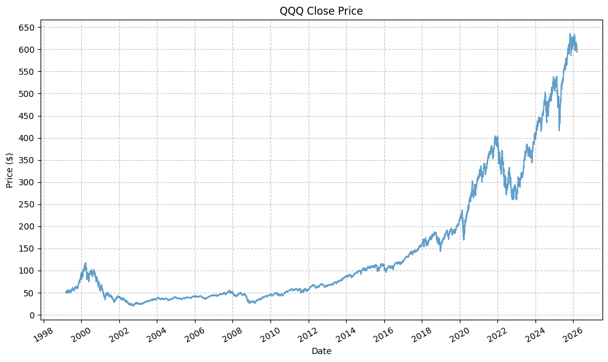
    


### Acquire & Plot Data (TQQQ)

Next, TQQQ:


```python
yf_pull_data(
    base_directory=DATA_DIR,
    ticker="TQQQ",
    adjusted=False,
    source="Yahoo_Finance", 
    asset_class="Exchange_Traded_Funds", 
    excel_export=True,
    pickle_export=True,
    output_confirmation=False,
)

tqqq = load_data(
    base_directory=DATA_DIR,
    ticker="TQQQ",
    source="Yahoo_Finance", 
    asset_class="Exchange_Traded_Funds",
    timeframe="Daily",
    file_format="pickle",
)

# Rename columns to "TQQQ_Close", etc.
tqqq = tqqq.rename(columns={
    "Adj Close": "TQQQ_Adj_Close",
    "Close": "TQQQ_Close", 
    "High": "TQQQ_High", 
    "Low": "TQQQ_Low", 
    "Open": "TQQQ_Open", 
    "Volume": "TQQQ_Volume"
})

```

    
[*********************100%***********************]  1 of 1 completed

    


This gives us:


```python
display(tqqq)
```


<div>
<style scoped>
    .dataframe tbody tr th:only-of-type {
        vertical-align: middle;
    }

    .dataframe tbody tr th {
        vertical-align: top;
    }

    .dataframe thead th {
        text-align: right;
    }
</style>
<table border="1" class="dataframe">
  <thead>
    <tr style="text-align: right;">
      <th></th>
      <th>TQQQ_Adj_Close</th>
      <th>TQQQ_Close</th>
      <th>TQQQ_High</th>
      <th>TQQQ_Low</th>
      <th>TQQQ_Open</th>
      <th>TQQQ_Volume</th>
    </tr>
    <tr>
      <th>Date</th>
      <th></th>
      <th></th>
      <th></th>
      <th></th>
      <th></th>
      <th></th>
    </tr>
  </thead>
  <tbody>
    <tr>
      <th>2010-02-11</th>
      <td>0.206396</td>
      <td>0.216276</td>
      <td>0.217448</td>
      <td>0.202786</td>
      <td>0.203438</td>
      <td>6912000</td>
    </tr>
    <tr>
      <th>2010-02-12</th>
      <td>0.207241</td>
      <td>0.217161</td>
      <td>0.219036</td>
      <td>0.209167</td>
      <td>0.210391</td>
      <td>17203200</td>
    </tr>
    <tr>
      <th>2010-02-16</th>
      <td>0.215268</td>
      <td>0.225573</td>
      <td>0.226094</td>
      <td>0.218776</td>
      <td>0.222266</td>
      <td>19238400</td>
    </tr>
    <tr>
      <th>2010-02-17</th>
      <td>0.218921</td>
      <td>0.229401</td>
      <td>0.229453</td>
      <td>0.225156</td>
      <td>0.228594</td>
      <td>38361600</td>
    </tr>
    <tr>
      <th>2010-02-18</th>
      <td>0.223072</td>
      <td>0.233750</td>
      <td>0.235130</td>
      <td>0.227786</td>
      <td>0.229167</td>
      <td>77721600</td>
    </tr>
    <tr>
      <th>...</th>
      <td>...</td>
      <td>...</td>
      <td>...</td>
      <td>...</td>
      <td>...</td>
      <td>...</td>
    </tr>
    <tr>
      <th>2026-03-09</th>
      <td>49.389999</td>
      <td>49.389999</td>
      <td>49.770000</td>
      <td>45.500000</td>
      <td>46.189999</td>
      <td>159005500</td>
    </tr>
    <tr>
      <th>2026-03-10</th>
      <td>49.400002</td>
      <td>49.400002</td>
      <td>50.740002</td>
      <td>48.830002</td>
      <td>49.410000</td>
      <td>115057200</td>
    </tr>
    <tr>
      <th>2026-03-11</th>
      <td>49.349998</td>
      <td>49.349998</td>
      <td>50.520000</td>
      <td>48.730000</td>
      <td>49.680000</td>
      <td>91104300</td>
    </tr>
    <tr>
      <th>2026-03-12</th>
      <td>46.830002</td>
      <td>46.830002</td>
      <td>48.490002</td>
      <td>46.750000</td>
      <td>48.150002</td>
      <td>130823900</td>
    </tr>
    <tr>
      <th>2026-03-13</th>
      <td>45.930000</td>
      <td>45.930000</td>
      <td>48.250000</td>
      <td>45.669998</td>
      <td>47.349998</td>
      <td>141444100</td>
    </tr>
  </tbody>
</table>
<p>4046 rows × 6 columns</p>
</div>


And the plot of the timseries of ajdusted close prices:


```python
plot_timeseries(
    df=tqqq,
    plot_start_date=None,
    plot_end_date=None,
    plot_columns=["TQQQ_Close"],
    title="TQQQ Close Price",
    x_label="Date",
    x_format="Year",
    x_tick_spacing=1,
    x_tick_rotation=30,
    y_label="Price ($)",
    y_format="Decimal",
    y_format_decimal_places=0,
    y_tick_spacing="Auto",
    y_tick_rotation=0,
    grid=True,
    legend=False,
    export_plot=False,
    plot_file_name=None,
)
```


    
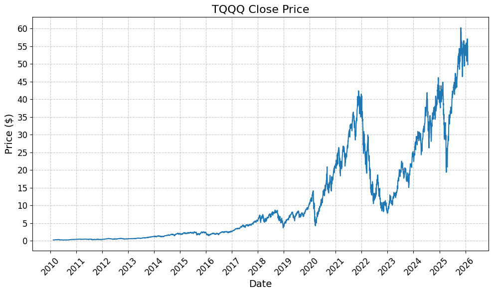
    


Looking at the close prices doesn't give us a true picture of the magnitude of the difference in returns due to the leverage. In order to see that, we need to look at the cumulative returns and the drawdowns.

 ### Calculate & Plot Cumulative Returns, Rolling Returns, and Drawdowns (QQQ & TQQQ)

 Next, we will calculate the cumulative returns, rolling returns, and drawdowns. This involves aligning the data to start with the inception of TQQQ. For this excercise, we will not extrapolate the data for QQQ back to 1999, but rather just align the data from the inception of TQQQ in 2010.


```python
etfs = ["QQQ", "TQQQ"]

# Merge dataframes and drop rows with missing values
qqq_tqqq_aligned = tqqq.merge(qqq, left_index=True, right_index=True, how='left')
qqq_tqqq_aligned = qqq_tqqq_aligned.dropna()

# Calculate cumulative returns
for etf in etfs:
    qqq_tqqq_aligned[f"{etf}_Return"] = qqq_tqqq_aligned[f"{etf}_Close"].pct_change()
    qqq_tqqq_aligned[f"{etf}_Cumulative_Return"] = (1 + qqq_tqqq_aligned[f"{etf}_Return"]).cumprod() - 1
    qqq_tqqq_aligned[f"{etf}_Cumulative_Return_Plus_One"] = 1 + qqq_tqqq_aligned[f"{etf}_Cumulative_Return"]
    qqq_tqqq_aligned[f"{etf}_Rolling_Max"] = qqq_tqqq_aligned[f"{etf}_Cumulative_Return_Plus_One"].cummax()
    qqq_tqqq_aligned[f"{etf}_Drawdown"] = qqq_tqqq_aligned[f"{etf}_Cumulative_Return_Plus_One"] / qqq_tqqq_aligned[f"{etf}_Rolling_Max"] - 1
    qqq_tqqq_aligned.drop(columns=[f"{etf}_Cumulative_Return_Plus_One", f"{etf}_Rolling_Max"], inplace=True)

# Define rolling windows in trading days
rolling_windows = {
    '1d': 1,      # 1 day
    '1w': 5,      # 1 week (5 trading days)
    '1m': 21,     # 1 month (~21 trading days)
    '3m': 63,     # 3 months (~63 trading days)
    '6m': 126,    # 6 months (~126 trading days)
    '1y': 252,    # 1 year (~252 trading days)
    '2y': 504,    # 2 years (~504 trading days)
    '3y': 756,    # 3 years (~756 trading days)
    '4y': 1008,   # 4 years (~1008 trading days)
    '5y': 1260,   # 5 years (~1260 trading days)
}

# Calculate rolling returns for each ETF and each window
for etf in etfs:
    for period_name, window in rolling_windows.items():
        qqq_tqqq_aligned[f"{etf}_Rolling_Return_{period_name}"] = (
            qqq_tqqq_aligned[f"{etf}_Close"].pct_change(periods=window)
        )

```


```python
display(qqq_tqqq_aligned)
```


<div>
<style scoped>
    .dataframe tbody tr th:only-of-type {
        vertical-align: middle;
    }

    .dataframe tbody tr th {
        vertical-align: top;
    }

    .dataframe thead th {
        text-align: right;
    }
</style>
<table border="1" class="dataframe">
  <thead>
    <tr style="text-align: right;">
      <th></th>
      <th>TQQQ_Adj_Close</th>
      <th>TQQQ_Close</th>
      <th>TQQQ_High</th>
      <th>TQQQ_Low</th>
      <th>TQQQ_Open</th>
      <th>TQQQ_Volume</th>
      <th>QQQ_Adj_Close</th>
      <th>QQQ_Close</th>
      <th>QQQ_High</th>
      <th>QQQ_Low</th>
      <th>...</th>
      <th>TQQQ_Rolling_Return_1d</th>
      <th>TQQQ_Rolling_Return_1w</th>
      <th>TQQQ_Rolling_Return_1m</th>
      <th>TQQQ_Rolling_Return_3m</th>
      <th>TQQQ_Rolling_Return_6m</th>
      <th>TQQQ_Rolling_Return_1y</th>
      <th>TQQQ_Rolling_Return_2y</th>
      <th>TQQQ_Rolling_Return_3y</th>
      <th>TQQQ_Rolling_Return_4y</th>
      <th>TQQQ_Rolling_Return_5y</th>
    </tr>
    <tr>
      <th>Date</th>
      <th></th>
      <th></th>
      <th></th>
      <th></th>
      <th></th>
      <th></th>
      <th></th>
      <th></th>
      <th></th>
      <th></th>
      <th></th>
      <th></th>
      <th></th>
      <th></th>
      <th></th>
      <th></th>
      <th></th>
      <th></th>
      <th></th>
      <th></th>
      <th></th>
    </tr>
  </thead>
  <tbody>
    <tr>
      <th>2010-02-11</th>
      <td>0.206396</td>
      <td>0.216276</td>
      <td>0.217448</td>
      <td>0.202786</td>
      <td>0.203438</td>
      <td>6912000</td>
      <td>37.951683</td>
      <td>43.669998</td>
      <td>43.790001</td>
      <td>42.759998</td>
      <td>...</td>
      <td>NaN</td>
      <td>NaN</td>
      <td>NaN</td>
      <td>NaN</td>
      <td>NaN</td>
      <td>NaN</td>
      <td>NaN</td>
      <td>NaN</td>
      <td>NaN</td>
      <td>NaN</td>
    </tr>
    <tr>
      <th>2010-02-12</th>
      <td>0.207241</td>
      <td>0.217161</td>
      <td>0.219036</td>
      <td>0.209167</td>
      <td>0.210391</td>
      <td>17203200</td>
      <td>38.029922</td>
      <td>43.759998</td>
      <td>43.880001</td>
      <td>43.160000</td>
      <td>...</td>
      <td>0.004092</td>
      <td>NaN</td>
      <td>NaN</td>
      <td>NaN</td>
      <td>NaN</td>
      <td>NaN</td>
      <td>NaN</td>
      <td>NaN</td>
      <td>NaN</td>
      <td>NaN</td>
    </tr>
    <tr>
      <th>2010-02-16</th>
      <td>0.215268</td>
      <td>0.225573</td>
      <td>0.226094</td>
      <td>0.218776</td>
      <td>0.222266</td>
      <td>19238400</td>
      <td>38.516556</td>
      <td>44.320000</td>
      <td>44.349998</td>
      <td>43.849998</td>
      <td>...</td>
      <td>0.038736</td>
      <td>NaN</td>
      <td>NaN</td>
      <td>NaN</td>
      <td>NaN</td>
      <td>NaN</td>
      <td>NaN</td>
      <td>NaN</td>
      <td>NaN</td>
      <td>NaN</td>
    </tr>
    <tr>
      <th>2010-02-17</th>
      <td>0.218921</td>
      <td>0.229401</td>
      <td>0.229453</td>
      <td>0.225156</td>
      <td>0.228594</td>
      <td>38361600</td>
      <td>38.733849</td>
      <td>44.570000</td>
      <td>44.570000</td>
      <td>44.259998</td>
      <td>...</td>
      <td>0.016970</td>
      <td>NaN</td>
      <td>NaN</td>
      <td>NaN</td>
      <td>NaN</td>
      <td>NaN</td>
      <td>NaN</td>
      <td>NaN</td>
      <td>NaN</td>
      <td>NaN</td>
    </tr>
    <tr>
      <th>2010-02-18</th>
      <td>0.223072</td>
      <td>0.233750</td>
      <td>0.235130</td>
      <td>0.227786</td>
      <td>0.229167</td>
      <td>77721600</td>
      <td>38.977173</td>
      <td>44.849998</td>
      <td>44.930000</td>
      <td>44.450001</td>
      <td>...</td>
      <td>0.018958</td>
      <td>NaN</td>
      <td>NaN</td>
      <td>NaN</td>
      <td>NaN</td>
      <td>NaN</td>
      <td>NaN</td>
      <td>NaN</td>
      <td>NaN</td>
      <td>NaN</td>
    </tr>
    <tr>
      <th>...</th>
      <td>...</td>
      <td>...</td>
      <td>...</td>
      <td>...</td>
      <td>...</td>
      <td>...</td>
      <td>...</td>
      <td>...</td>
      <td>...</td>
      <td>...</td>
      <td>...</td>
      <td>...</td>
      <td>...</td>
      <td>...</td>
      <td>...</td>
      <td>...</td>
      <td>...</td>
      <td>...</td>
      <td>...</td>
      <td>...</td>
      <td>...</td>
    </tr>
    <tr>
      <th>2026-03-09</th>
      <td>49.389999</td>
      <td>49.389999</td>
      <td>49.770000</td>
      <td>45.500000</td>
      <td>46.189999</td>
      <td>159005500</td>
      <td>607.760010</td>
      <td>607.760010</td>
      <td>609.270020</td>
      <td>591.330017</td>
      <td>...</td>
      <td>0.038915</td>
      <td>-0.006237</td>
      <td>0.036734</td>
      <td>-0.110250</td>
      <td>0.075800</td>
      <td>0.495760</td>
      <td>0.583520</td>
      <td>3.467662</td>
      <td>0.974021</td>
      <td>1.139253</td>
    </tr>
    <tr>
      <th>2026-03-10</th>
      <td>49.400002</td>
      <td>49.400002</td>
      <td>50.740002</td>
      <td>48.830002</td>
      <td>49.410000</td>
      <td>115057200</td>
      <td>607.770020</td>
      <td>607.770020</td>
      <td>613.289978</td>
      <td>605.419983</td>
      <td>...</td>
      <td>0.000203</td>
      <td>0.027027</td>
      <td>-0.023522</td>
      <td>-0.120214</td>
      <td>0.060883</td>
      <td>0.465658</td>
      <td>0.673442</td>
      <td>3.211424</td>
      <td>0.884417</td>
      <td>1.342898</td>
    </tr>
    <tr>
      <th>2026-03-11</th>
      <td>49.349998</td>
      <td>49.349998</td>
      <td>50.520000</td>
      <td>48.730000</td>
      <td>49.680000</td>
      <td>91104300</td>
      <td>607.690002</td>
      <td>607.690002</td>
      <td>612.429993</td>
      <td>605.030029</td>
      <td>...</td>
      <td>-0.001012</td>
      <td>-0.018106</td>
      <td>-0.046193</td>
      <td>-0.115591</td>
      <td>0.051230</td>
      <td>0.650226</td>
      <td>0.641443</td>
      <td>3.189304</td>
      <td>0.964570</td>
      <td>1.462268</td>
    </tr>
    <tr>
      <th>2026-03-12</th>
      <td>46.830002</td>
      <td>46.830002</td>
      <td>48.490002</td>
      <td>46.750000</td>
      <td>48.150002</td>
      <td>130823900</td>
      <td>597.260010</td>
      <td>597.260010</td>
      <td>604.140015</td>
      <td>597.049988</td>
      <td>...</td>
      <td>-0.051064</td>
      <td>-0.059639</td>
      <td>-0.082125</td>
      <td>-0.163899</td>
      <td>-0.003511</td>
      <td>0.584504</td>
      <td>0.491164</td>
      <td>3.129630</td>
      <td>0.947598</td>
      <td>1.236390</td>
    </tr>
    <tr>
      <th>2026-03-13</th>
      <td>45.930000</td>
      <td>45.930000</td>
      <td>48.250000</td>
      <td>45.669998</td>
      <td>47.349998</td>
      <td>141444100</td>
      <td>593.719971</td>
      <td>593.719971</td>
      <td>603.599976</td>
      <td>592.570007</td>
      <td>...</td>
      <td>-0.019218</td>
      <td>-0.033866</td>
      <td>-0.106420</td>
      <td>-0.189232</td>
      <td>-0.038820</td>
      <td>0.502699</td>
      <td>0.529471</td>
      <td>2.995650</td>
      <td>1.150281</td>
      <td>1.398433</td>
    </tr>
  </tbody>
</table>
<p>4046 rows × 38 columns</p>
</div>


And now the plot for the cumulative returns:


```python
plot_timeseries(
    df=qqq_tqqq_aligned,
    plot_start_date=None,
    plot_end_date=None,
    plot_columns=["QQQ_Cumulative_Return", "TQQQ_Cumulative_Return"],
    title="Cumulative Returns",
    x_label="Date",
    x_format="Year",
    x_tick_spacing=1,
    x_tick_rotation=30,
    y_label="Cumulative Return",
    y_format="Decimal",
    y_format_decimal_places=0,
    y_tick_spacing="Auto",
    y_tick_rotation=0,
    grid=True,
    legend=True,
    export_plot=False,
    plot_file_name=None,
)

```


    

    


And the drawdown plot:


```python
plot_timeseries(
    df=qqq_tqqq_aligned,
    plot_start_date=None,
    plot_end_date=None,
    plot_columns=["QQQ_Drawdown", "TQQQ_Drawdown"],
    title="Drawdowns",
    x_label="Date",
    x_format="Year",
    x_tick_spacing=1,
    x_tick_rotation=30,
    y_label="Drawdown",
    y_format="Percentage",
    y_format_decimal_places=0,
    y_tick_spacing="Auto",
    y_tick_rotation=0,
    grid=True,
    legend=True,
    export_plot=False,
    plot_file_name=None,
)

```


    
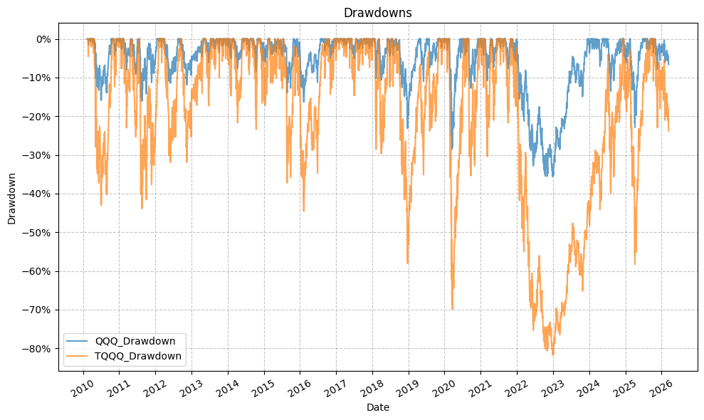
    


Here is where we truly see the volatility of TQQQ relative to QQQ. In the past 5 years, TQQQ has had drawdowns of 50%, 60%, 70%, and 80%. While it has recovered to make new highs (with the exception of the current ~10% drawdown), very few investors can endure those drawdowns and continue to hold their position. At the same time, we can see from the plot that a ~35% drawdown in QQQ equated to a ~80% drawdown in TQQQ, which is not in fact, 3x. So this tells us that there is dispersion in the long term returns relative to the short term returns between the non-leveraged QQQ and 3x leveraged TQQQ. This idea is well documented in the financial literature as "volatility decay" or "volatility drag". But, and this is the question we are trying to answer, how significant is this effect over various time horizons?

### Summary Statistics (QQQ & TQQQ)

Looking at the summary statistics further confirms our intuitions about the volatility and drawdowns.


```python
qqq_sum_stats = summary_stats(
    fund_list=["QQQ"],
    df=qqq_tqqq_aligned[["QQQ_Return"]],
    period="Daily",
    use_calendar_days=False,
    excel_export=False,
    pickle_export=False,
    output_confirmation=False,
)

tqqq_sum_stats = summary_stats(
    fund_list=["TQQQ"],
    df=qqq_tqqq_aligned[["TQQQ_Return"]],
    period="Daily",
    use_calendar_days=False,
    excel_export=False,
    pickle_export=False,
    output_confirmation=False,
)

sum_stats = pd.concat([qqq_sum_stats, tqqq_sum_stats])

display(sum_stats)
```


<div>
<style scoped>
    .dataframe tbody tr th:only-of-type {
        vertical-align: middle;
    }

    .dataframe tbody tr th {
        vertical-align: top;
    }

    .dataframe thead th {
        text-align: right;
    }
</style>
<table border="1" class="dataframe">
  <thead>
    <tr style="text-align: right;">
      <th></th>
      <th>Annual Mean Return (Arithmetic)</th>
      <th>Annualized Volatility</th>
      <th>Annualized Sharpe Ratio</th>
      <th>CAGR (Geometric)</th>
      <th>Daily Max Return</th>
      <th>Daily Max Return (Date)</th>
      <th>Daily Min Return</th>
      <th>Daily Min Return (Date)</th>
      <th>Max Drawdown</th>
      <th>Peak</th>
      <th>Trough</th>
      <th>Recovery Date</th>
      <th>Days to Recovery</th>
      <th>MAR Ratio</th>
    </tr>
  </thead>
  <tbody>
    <tr>
      <th>QQQ_Return</th>
      <td>0.183897</td>
      <td>0.206040</td>
      <td>0.892532</td>
      <td>0.176501</td>
      <td>0.120031</td>
      <td>2025-04-09</td>
      <td>-0.119788</td>
      <td>2020-03-16</td>
      <td>-0.356172</td>
      <td>2021-11-19</td>
      <td>2022-12-28</td>
      <td>2023-12-15</td>
      <td>352</td>
      <td>0.49555</td>
    </tr>
    <tr>
      <th>TQQQ_Return</th>
      <td>0.521888</td>
      <td>0.609705</td>
      <td>0.855969</td>
      <td>0.396175</td>
      <td>0.352442</td>
      <td>2025-04-09</td>
      <td>-0.344652</td>
      <td>2020-03-16</td>
      <td>-0.817545</td>
      <td>2021-11-19</td>
      <td>2022-12-28</td>
      <td>2024-12-11</td>
      <td>714</td>
      <td>0.48459</td>
    </tr>
  </tbody>
</table>
</div>


Note that these statistics are being run on the partially-adjusted close prices, which are not the true returns, but they do give us a good picture of the relative volatility and drawdowns of the two ETFs. The mean return for TQQQ is much higher than that of QQQ, but the standard deviation is also much higher, which is consistent with the idea of leverage amplifying both the upside and the downside. The maximum drawdown for TQQQ is also much higher than that of QQQ, which again confirms our observations from the drawdown plot.

Also note that the daily maximum return for both funds occured during "Liberation Day" and the daily minimum return for both funds occured early on during COVID.

### Plot Returns & Verify Beta (QQQ & TQQQ)

Before we look at the rolling returns, let us first verify that the daily returns for TQQQ are in fact ~3x those of QQQ.


```python
plot_scatter(
    df=qqq_tqqq_aligned,
    x_plot_column="QQQ_Return",
    y_plot_columns=["TQQQ_Return"],
    title="QQQ & TQQQ Returns",
    x_label="QQQ Return",
    x_format="Decimal",
    x_format_decimal_places=2,
    x_tick_spacing="Auto",
    x_tick_rotation=30,
    y_label="TQQQ Return",
    y_format="Decimal",
    y_format_decimal_places=2,
    y_tick_spacing="Auto",
    y_tick_rotation=0,
    plot_OLS_regression_line=True,
    OLS_column="TQQQ_Return",
    plot_Ridge_regression_line=False,
    Ridge_column=None,
    plot_RidgeCV_regression_line=True,
    RidgeCV_column="TQQQ_Return",
    regression_constant=True,
    grid=True,
    legend=True,
    export_plot=False,
    plot_file_name=None,
)
```


    
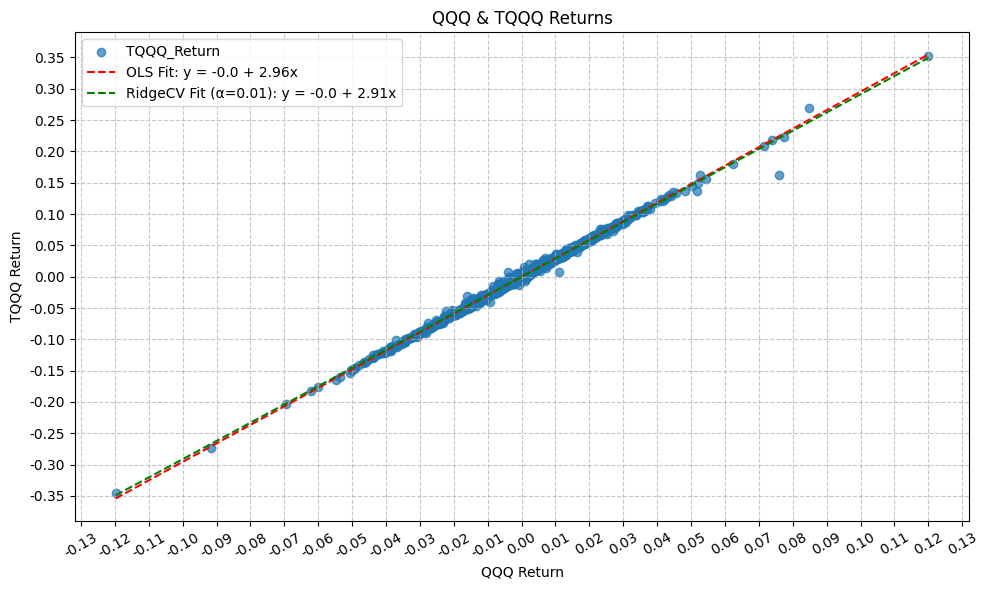
    


```python
model = run_linear_regression(
    df=qqq_tqqq_aligned,
    x_plot_column="QQQ_Return",
    y_plot_column="TQQQ_Return",
    regression_model="OLS-statsmodels",
    regression_constant=True,
)

print(model.summary())
```

                                OLS Regression Results                            
    ==============================================================================
    Dep. Variable:            TQQQ_Return   R-squared:                       0.997
    Model:                            OLS   Adj. R-squared:                  0.997
    Method:                 Least Squares   F-statistic:                 1.492e+06
    Date:                Mon, 16 Mar 2026   Prob (F-statistic):               0.00
    Time:                        13:41:39   Log-Likelihood:                 19405.
    No. Observations:                4045   AIC:                        -3.881e+04
    Df Residuals:                    4043   BIC:                        -3.879e+04
    Df Model:                           1                                         
    Covariance Type:            nonrobust                                         
    ==============================================================================
                     coef    std err          t      P>|t|      [0.025      0.975]
    ------------------------------------------------------------------------------
    const      -8.554e-05   3.15e-05     -2.720      0.007      -0.000   -2.39e-05
    QQQ_Return     2.9552      0.002   1221.329      0.000       2.950       2.960
    ==============================================================================
    Omnibus:                     5272.508   Durbin-Watson:                   2.566
    Prob(Omnibus):                  0.000   Jarque-Bera (JB):          9175082.049
    Skew:                          -6.344   Prob(JB):                         0.00
    Kurtosis:                     235.974   Cond. No.                         77.1
    ==============================================================================
    
    Notes:
    [1] Standard Errors assume that the covariance matrix of the errors is correctly specified.


Visually, this plot makes sense and we can see that there is a strong clustering of points, but we double check with the regression, regressing the TQQQ daily return (y) on the QQQ daily return (X).

Given the above result, with a coefficient of 2.96 and an R^2 of 0.997, we can say that TQQQ does in fact return ~3x QQQ. We would also intuitively expect the coefficient to be 0, which it is nearly.

Interestingly, the coefficient varies between OLS and Ridge cross-validation, and both are less than 3.

### Extrapolate Data (QQQ & TQQQ)

We will now extrapolate the returns of QQQ to backfill the data from the inception of QQQ in 1999 to the inception of TQQQ in 2010. For this, we'll use the coefficient of 2.96 that we found in the regression results above.


```python
# Set leverage multiplier based on regression coefficient
LEVERAGE_MULTIPLIER = model.params[1]

# Merge dataframes and extrapolate return values for QQQ back to 1999 using the leverage multiplier
qqq_tqqq_extrap = qqq[["QQQ_Close"]].merge(tqqq[["TQQQ_Close"]], left_index=True, right_index=True, how='left')

etfs = ["QQQ", "TQQQ"]

# Calculate cumulative returns
for etf in etfs:
    qqq_tqqq_extrap[f"{etf}_Return"] = qqq_tqqq_extrap[f"{etf}_Close"].pct_change()

# Extrapolate TQQQ returns for missing values
qqq_tqqq_extrap["TQQQ_Return"] = qqq_tqqq_extrap["TQQQ_Return"].fillna(LEVERAGE_MULTIPLIER * qqq_tqqq_extrap["QQQ_Return"])

# Find the first valid TQQQ_Close index and value
first_valid_idx = qqq_tqqq_extrap['TQQQ_Close'].first_valid_index()
print(first_valid_idx)
first_valid_price = qqq_tqqq_extrap.loc[first_valid_idx, 'TQQQ_Close']
print(first_valid_price)
```

    2010-02-11 00:00:00
    0.21627600491046906


Before we extrapolate, let's first look at the data we have for QQQ and TQQQ around the inception of TQQQ in 2010:


```python
# Check values around the first valid index
print(qqq_tqqq_extrap.loc["2010-02-08":"2010-02-13"])
```

                QQQ_Close  TQQQ_Close  QQQ_Return  TQQQ_Return
    Date                                                      
    2010-02-08  42.669998         NaN   -0.007213    -0.021315
    2010-02-09  43.110001         NaN    0.010312     0.030473
    2010-02-10  43.020000         NaN   -0.002088    -0.006169
    2010-02-11  43.669998    0.216276    0.015109     0.044650
    2010-02-12  43.759998    0.217161    0.002061     0.004092


Now, backfill the data for the TQQQ close price:


```python
# Iterate through the dataframe backwards
for i in range(qqq_tqqq_extrap.index.get_loc(first_valid_idx) - 1, -1, -1):
    
    # The return that led to the price the next day
    current_return = qqq_tqqq_extrap.iloc[i + 1]['TQQQ_Return']

    # Get the next day's price
    next_price = qqq_tqqq_extrap.iloc[i + 1]['TQQQ_Close']
    
    # Price_{t} = Price_{t+1} / (1 + Return_{t})
    qqq_tqqq_extrap.loc[qqq_tqqq_extrap.index[i], 'TQQQ_Close'] = next_price / (1 + current_return)
```

Finally, confirm the values are correct:


```python
# Confirm values around the first valid index after extrapolation
print(qqq_tqqq_extrap.loc["2010-02-08":"2010-02-13"])
```

                QQQ_Close  TQQQ_Close  QQQ_Return  TQQQ_Return
    Date                                                      
    2010-02-08  42.669998    0.202157   -0.007213    -0.021315
    2010-02-09  43.110001    0.208317    0.010312     0.030473
    2010-02-10  43.020000    0.207032   -0.002088    -0.006169
    2010-02-11  43.669998    0.216276    0.015109     0.044650
    2010-02-12  43.759998    0.217161    0.002061     0.004092


And the complete DataFrame with the extrapolated values:


```python
display(qqq_tqqq_extrap)
```


<div>
<style scoped>
    .dataframe tbody tr th:only-of-type {
        vertical-align: middle;
    }

    .dataframe tbody tr th {
        vertical-align: top;
    }

    .dataframe thead th {
        text-align: right;
    }
</style>
<table border="1" class="dataframe">
  <thead>
    <tr style="text-align: right;">
      <th></th>
      <th>QQQ_Close</th>
      <th>TQQQ_Close</th>
      <th>QQQ_Return</th>
      <th>TQQQ_Return</th>
    </tr>
    <tr>
      <th>Date</th>
      <th></th>
      <th></th>
      <th></th>
      <th></th>
    </tr>
  </thead>
  <tbody>
    <tr>
      <th>1999-03-10</th>
      <td>51.062500</td>
      <td>13.813139</td>
      <td>NaN</td>
      <td>NaN</td>
    </tr>
    <tr>
      <th>1999-03-11</th>
      <td>51.312500</td>
      <td>14.012991</td>
      <td>0.004896</td>
      <td>0.014468</td>
    </tr>
    <tr>
      <th>1999-03-12</th>
      <td>50.062500</td>
      <td>13.004208</td>
      <td>-0.024361</td>
      <td>-0.071989</td>
    </tr>
    <tr>
      <th>1999-03-15</th>
      <td>51.500000</td>
      <td>14.107675</td>
      <td>0.028714</td>
      <td>0.084855</td>
    </tr>
    <tr>
      <th>1999-03-16</th>
      <td>51.937500</td>
      <td>14.461841</td>
      <td>0.008495</td>
      <td>0.025104</td>
    </tr>
    <tr>
      <th>...</th>
      <td>...</td>
      <td>...</td>
      <td>...</td>
      <td>...</td>
    </tr>
    <tr>
      <th>2026-03-09</th>
      <td>607.760010</td>
      <td>49.389999</td>
      <td>0.013356</td>
      <td>0.038915</td>
    </tr>
    <tr>
      <th>2026-03-10</th>
      <td>607.770020</td>
      <td>49.400002</td>
      <td>0.000016</td>
      <td>0.000203</td>
    </tr>
    <tr>
      <th>2026-03-11</th>
      <td>607.690002</td>
      <td>49.349998</td>
      <td>-0.000132</td>
      <td>-0.001012</td>
    </tr>
    <tr>
      <th>2026-03-12</th>
      <td>597.260010</td>
      <td>46.830002</td>
      <td>-0.017163</td>
      <td>-0.051064</td>
    </tr>
    <tr>
      <th>2026-03-13</th>
      <td>593.719971</td>
      <td>45.930000</td>
      <td>-0.005927</td>
      <td>-0.019218</td>
    </tr>
  </tbody>
</table>
<p>6795 rows × 4 columns</p>
</div>


After the extrapolation, we now have the following plots for the prices, cumulative returns, and drawdowns:


```python
etfs = ["QQQ", "TQQQ"]

# Calculate cumulative returns
for etf in etfs:
    qqq_tqqq_extrap[f"{etf}_Return"] = qqq_tqqq_extrap[f"{etf}_Close"].pct_change()
    qqq_tqqq_extrap[f"{etf}_Cumulative_Return"] = (1 + qqq_tqqq_extrap[f"{etf}_Return"]).cumprod() - 1
    qqq_tqqq_extrap[f"{etf}_Cumulative_Return_Plus_One"] = 1 + qqq_tqqq_extrap[f"{etf}_Cumulative_Return"]
    qqq_tqqq_extrap[f"{etf}_Rolling_Max"] = qqq_tqqq_extrap[f"{etf}_Cumulative_Return_Plus_One"].cummax()
    qqq_tqqq_extrap[f"{etf}_Drawdown"] = qqq_tqqq_extrap[f"{etf}_Cumulative_Return_Plus_One"] / qqq_tqqq_extrap[f"{etf}_Rolling_Max"] - 1
    qqq_tqqq_extrap.drop(columns=[f"{etf}_Cumulative_Return_Plus_One", f"{etf}_Rolling_Max"], inplace=True)
```


```python
plot_timeseries(
    df=qqq_tqqq_extrap,
    plot_start_date=None,
    plot_end_date=None,
    plot_columns=["QQQ_Close"],
    title="QQQ Close Price",
    x_label="Date",
    x_format="Year",
    x_tick_spacing=2,
    x_tick_rotation=30,
    y_label="Price ($)",
    y_format="Decimal",
    y_format_decimal_places=0,
    y_tick_spacing="Auto",
    y_tick_rotation=0,
    grid=True,
    legend=False,
    export_plot=False,
    plot_file_name=None,
)
```


    
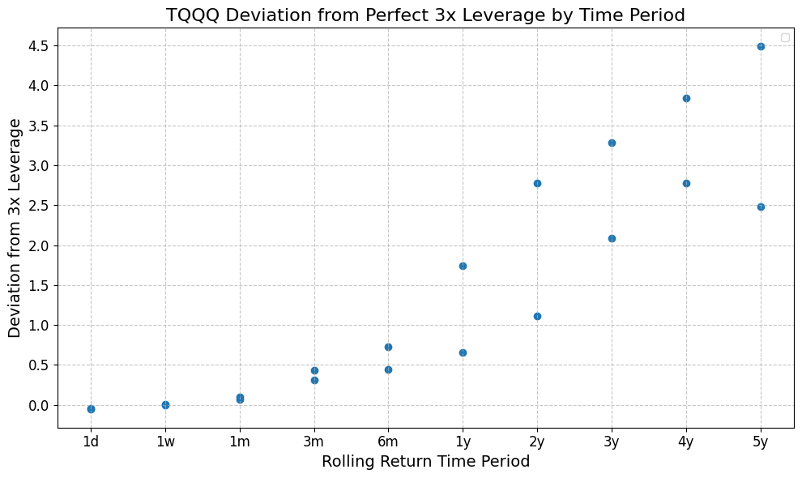
    


```python
plot_timeseries(
    df=qqq_tqqq_extrap,
    plot_start_date=None,
    plot_end_date=None,
    plot_columns=["TQQQ_Close"],
    title="TQQQ Close Price",
    x_label="Date",
    x_format="Year",
    x_tick_spacing=1,
    x_tick_rotation=30,
    y_label="Price ($)",
    y_format="Decimal",
    y_format_decimal_places=0,
    y_tick_spacing="Auto",
    y_tick_rotation=0,
    grid=True,
    legend=False,
    export_plot=False,
    plot_file_name=None,
)
```


    

    


```python
plot_timeseries(
    df=qqq_tqqq_extrap,
    plot_start_date=None,
    plot_end_date=None,
    plot_columns=["QQQ_Cumulative_Return", "TQQQ_Cumulative_Return"],
    title="Cumulative Returns",
    x_label="Date",
    x_format="Year",
    x_tick_spacing=1,
    x_tick_rotation=30,
    y_label="Cumulative Return",
    y_format="Decimal",
    y_format_decimal_places=0,
    y_tick_spacing="Auto",
    y_tick_rotation=0,
    grid=True,
    legend=True,
    export_plot=False,
    plot_file_name=None,
)

```


    

    


```python
plot_timeseries(
    df=qqq_tqqq_extrap,
    plot_start_date=None,
    plot_end_date=None,
    plot_columns=["QQQ_Drawdown", "TQQQ_Drawdown"],
    title="Drawdowns",
    x_label="Date",
    x_format="Year",
    x_tick_spacing=1,
    x_tick_rotation=30,
    y_label="Drawdown",
    y_format="Percentage",
    y_format_decimal_places=0,
    y_tick_spacing="Auto",
    y_tick_rotation=0,
    grid=True,
    legend=True,
    export_plot=False,
    plot_file_name=None,
)

```


    
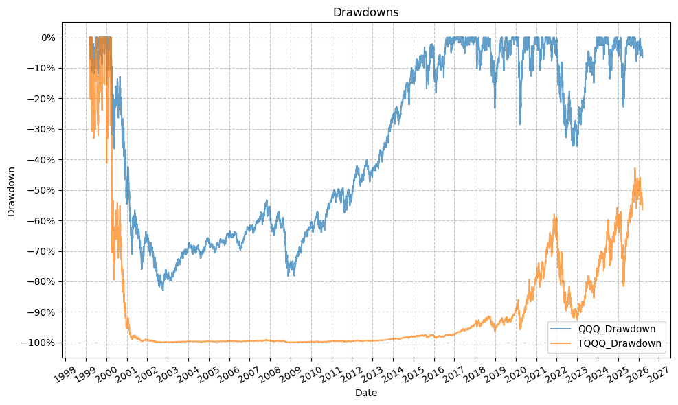
    


Some quick comments before we look at rolling returns. The drawdown is nearly 100%... which represents nearly a total loss of capital for any allocation to the extrap-TQQQ. Furthermore, as we walk forward through time (2002, 2003, ... etc.), there is really no reason to believe that the returns would ever recover (even partially). So, while we can look at the rolling returns and see how they compare to the 3x return of QQQ, we should keep in mind that the drawdown is so severe that it would be very difficult for any investor to hold through it.

### Plot Rolling Returns (QQQ & TQQQ)

Next, we will consider the following:

* Histogram and scatter plots of the rolling returns of QQQ and TQQQ
* Regressions to establish a "leverage factor" for the rolling returns
* The deviation from a 3x return for each time period

For this set of regressions, we will also allow the constant. First, we need the rolling returns for various time periods:


```python
# Define rolling windows in trading days
rolling_windows = {
    '1d': 1,      # 1 day
    '1w': 5,      # 1 week (5 trading days)
    '1m': 21,     # 1 month (~21 trading days)
    '3m': 63,     # 3 months (~63 trading days)
    '6m': 126,    # 6 months (~126 trading days)
    '1y': 252,    # 1 year (~252 trading days)
    '2y': 504,    # 2 years (~504 trading days)
    '3y': 756,    # 3 years (~756 trading days)
    '4y': 1008,   # 4 years (~1008 trading days)
    '5y': 1260,   # 5 years (~1260 trading days)
}

# Calculate rolling returns for each ETF and each window
for etf in etfs:
    for period_name, window in rolling_windows.items():
        qqq_tqqq_extrap[f"{etf}_Rolling_Return_{period_name}"] = (
            qqq_tqqq_extrap[f"{etf}_Close"].pct_change(periods=window)
        )
```

This gives us the following series of histograms, scatter plots, and regression model results:


```python
# Create a dataframe to hold rolling returns stats
rolling_returns_stats = pd.DataFrame()

for period_name, window in rolling_windows.items():
    plot_histogram(
        df=qqq_tqqq_extrap,
        plot_columns=[f"QQQ_Rolling_Return_{period_name}", f"TQQQ_Rolling_Return_{period_name}"],
        title=f"QQQ & TQQQ {period_name} Rolling Returns",
        x_label="Rolling Return",
        x_tick_spacing="Auto",
        x_tick_rotation=30,
        y_label="# Of Datapoints",
        y_tick_spacing="Auto",
        y_tick_rotation=0,
        grid=True,
        legend=True,
        export_plot=False,
        plot_file_name=None,
    )

    plot_scatter(
        df=qqq_tqqq_extrap,
        x_plot_column=f"QQQ_Rolling_Return_{period_name}",
        y_plot_columns=[f"TQQQ_Rolling_Return_{period_name}"],
        title=f"QQQ & TQQQ {period_name} Rolling Returns",
        x_label="QQQ Rolling Return",
        x_format="Decimal",
        x_format_decimal_places=2,
        x_tick_spacing="Auto",
        x_tick_rotation=30,
        y_label="TQQQ Rolling Return",
        y_format="Decimal",
        y_format_decimal_places=2,
        y_tick_spacing="Auto",
        y_tick_rotation=0,
        plot_OLS_regression_line=True,
        OLS_column=f"TQQQ_Rolling_Return_{period_name}",
        plot_Ridge_regression_line=False,
        Ridge_column=None,
        plot_RidgeCV_regression_line=True,
        RidgeCV_column=f"TQQQ_Rolling_Return_{period_name}",
        regression_constant=True,
        grid=True,
        legend=True,
        export_plot=False,
        plot_file_name=None,
    )

    # Run OLS regression with statsmodels
    model = run_linear_regression(
        df=qqq_tqqq_extrap,
        x_plot_column=f"QQQ_Rolling_Return_{period_name}",
        y_plot_column=f"TQQQ_Rolling_Return_{period_name}",
        regression_model="OLS-statsmodels",
        regression_constant=True,
    )
    print(model.summary())

    # Add the regression results to the rolling returns stats dataframe
    intercept = model.params[0]
    intercept_pvalue = model.pvalues[0]   # p-value for Intercept
    slope = model.params[1]
    slope_pvalue = model.pvalues[1]       # p-value for QQQ_Return
    r_squared = model.rsquared

    # Calc skew
    return_ratio = qqq_tqqq_extrap[f'TQQQ_Rolling_Return_{period_name}'] / qqq_tqqq_extrap[f'QQQ_Rolling_Return_{period_name}']
    skew = return_ratio.skew()

    # Calc conditional symmetry
    up_markets = qqq_tqqq_extrap[qqq_tqqq_extrap[f'QQQ_Rolling_Return_{period_name}'] > 0]
    down_markets = qqq_tqqq_extrap[qqq_tqqq_extrap[f'QQQ_Rolling_Return_{period_name}'] <= 0]

    avg_beta_up = (up_markets[f'TQQQ_Rolling_Return_{period_name}'] / up_markets[f'QQQ_Rolling_Return_{period_name}']).mean()
    avg_beta_down = (down_markets[f'TQQQ_Rolling_Return_{period_name}'] / down_markets[f'QQQ_Rolling_Return_{period_name}']).mean()

    asymmetry = avg_beta_up - avg_beta_down

    rolling_returns_slope_int = pd.DataFrame({
        "Period": period_name,
        "Intercept": [intercept],
        # "Intercept_PValue": [intercept_pvalue],
        "Slope": [slope],
        # "Slope_PValue": [slope_pvalue],
        "R_Squared": [r_squared],
        "Skew": [skew],
        "Average Upside Beta": [avg_beta_up],
        "Average Downside Beta": [avg_beta_down],
        "Asymmetry": [asymmetry]
    })

    rolling_returns_stats = pd.concat([rolling_returns_stats, rolling_returns_slope_int])
```


    

    


    
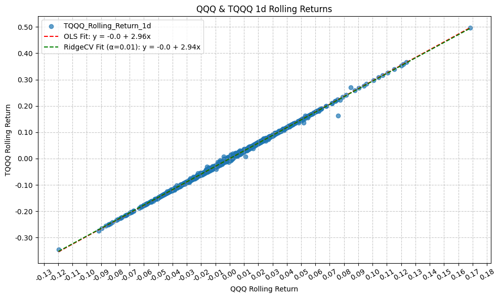
    


                                  OLS Regression Results                              
    ==================================================================================
    Dep. Variable:     TQQQ_Rolling_Return_1d   R-squared:                       0.999
    Model:                                OLS   Adj. R-squared:                  0.999
    Method:                     Least Squares   F-statistic:                 7.215e+06
    Date:                    Mon, 16 Mar 2026   Prob (F-statistic):               0.00
    Time:                            13:41:41   Log-Likelihood:                 34352.
    No. Observations:                    6794   AIC:                        -6.870e+04
    Df Residuals:                        6792   BIC:                        -6.869e+04
    Df Model:                               1                                         
    Covariance Type:                nonrobust                                         
    =========================================================================================
                                coef    std err          t      P>|t|      [0.025      0.975]
    -----------------------------------------------------------------------------------------
    const                 -5.091e-05   1.87e-05     -2.721      0.007   -8.76e-05   -1.42e-05
    QQQ_Rolling_Return_1d     2.9551      0.001   2686.049      0.000       2.953       2.957
    ==============================================================================
    Omnibus:                    10188.882   Durbin-Watson:                   2.565
    Prob(Omnibus):                  0.000   Jarque-Bera (JB):         43894224.936
    Skew:                          -8.279   Prob(JB):                         0.00
    Kurtosis:                     396.425   Cond. No.                         58.8
    ==============================================================================
    
    Notes:
    [1] Standard Errors assume that the covariance matrix of the errors is correctly specified.


    

    


    
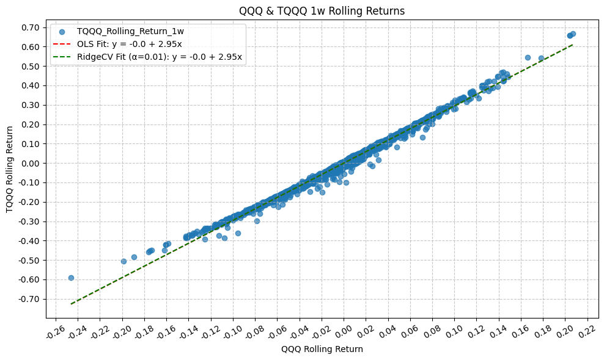
    


                                  OLS Regression Results                              
    ==================================================================================
    Dep. Variable:     TQQQ_Rolling_Return_1w   R-squared:                       0.994
    Model:                                OLS   Adj. R-squared:                  0.994
    Method:                     Least Squares   F-statistic:                 1.116e+06
    Date:                    Mon, 16 Mar 2026   Prob (F-statistic):               0.00
    Time:                            13:41:43   Log-Likelihood:                 23152.
    No. Observations:                    6790   AIC:                        -4.630e+04
    Df Residuals:                        6788   BIC:                        -4.629e+04
    Df Model:                               1                                         
    Covariance Type:                nonrobust                                         
    =========================================================================================
                                coef    std err          t      P>|t|      [0.025      0.975]
    -----------------------------------------------------------------------------------------
    const                    -0.0008   9.73e-05     -8.330      0.000      -0.001      -0.001
    QQQ_Rolling_Return_1w     2.9524      0.003   1056.353      0.000       2.947       2.958
    ==============================================================================
    Omnibus:                     2839.003   Durbin-Watson:                   0.932
    Prob(Omnibus):                  0.000   Jarque-Bera (JB):           563907.961
    Skew:                          -0.863   Prob(JB):                         0.00
    Kurtosis:                      47.612   Cond. No.                         28.8
    ==============================================================================
    
    Notes:
    [1] Standard Errors assume that the covariance matrix of the errors is correctly specified.


    

    


    
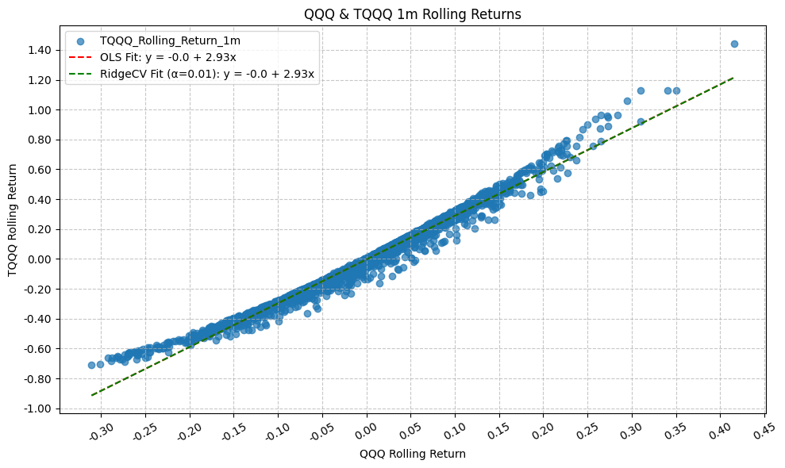
    


                                  OLS Regression Results                              
    ==================================================================================
    Dep. Variable:     TQQQ_Rolling_Return_1m   R-squared:                       0.982
    Model:                                OLS   Adj. R-squared:                  0.982
    Method:                     Least Squares   F-statistic:                 3.695e+05
    Date:                    Mon, 16 Mar 2026   Prob (F-statistic):               0.00
    Time:                            13:41:44   Log-Likelihood:                 14852.
    No. Observations:                    6774   AIC:                        -2.970e+04
    Df Residuals:                        6772   BIC:                        -2.969e+04
    Df Model:                               1                                         
    Covariance Type:                nonrobust                                         
    =========================================================================================
                                coef    std err          t      P>|t|      [0.025      0.975]
    -----------------------------------------------------------------------------------------
    const                    -0.0037      0.000    -11.064      0.000      -0.004      -0.003
    QQQ_Rolling_Return_1m     2.9305      0.005    607.853      0.000       2.921       2.940
    ==============================================================================
    Omnibus:                     1627.646   Durbin-Watson:                   0.296
    Prob(Omnibus):                  0.000   Jarque-Bera (JB):            69016.055
    Skew:                           0.357   Prob(JB):                         0.00
    Kurtosis:                      18.621   Cond. No.                         14.7
    ==============================================================================
    
    Notes:
    [1] Standard Errors assume that the covariance matrix of the errors is correctly specified.


    
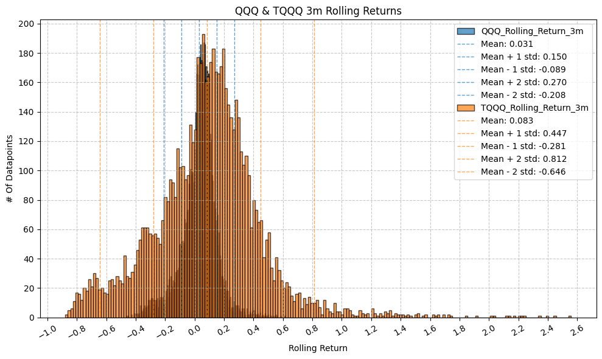
    


    
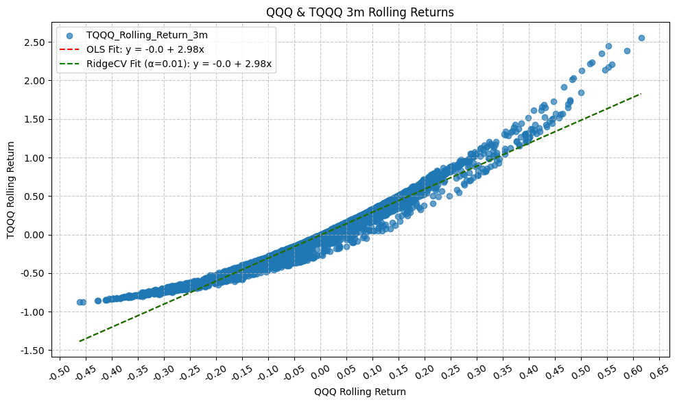
    


                                  OLS Regression Results                              
    ==================================================================================
    Dep. Variable:     TQQQ_Rolling_Return_3m   R-squared:                       0.958
    Model:                                OLS   Adj. R-squared:                  0.958
    Method:                     Least Squares   F-statistic:                 1.549e+05
    Date:                    Mon, 16 Mar 2026   Prob (F-statistic):               0.00
    Time:                            13:41:45   Log-Likelihood:                 7946.0
    No. Observations:                    6732   AIC:                        -1.589e+04
    Df Residuals:                        6730   BIC:                        -1.587e+04
    Df Model:                               1                                         
    Covariance Type:                nonrobust                                         
    =========================================================================================
                                coef    std err          t      P>|t|      [0.025      0.975]
    -----------------------------------------------------------------------------------------
    const                    -0.0083      0.001     -8.841      0.000      -0.010      -0.006
    QQQ_Rolling_Return_3m     2.9848      0.008    393.626      0.000       2.970       3.000
    ==============================================================================
    Omnibus:                     3461.856   Durbin-Watson:                   0.105
    Prob(Omnibus):                  0.000   Jarque-Bera (JB):            79524.170
    Skew:                           1.962   Prob(JB):                         0.00
    Kurtosis:                      19.374   Cond. No.                         8.38
    ==============================================================================
    
    Notes:
    [1] Standard Errors assume that the covariance matrix of the errors is correctly specified.


    

    


    

    


                                  OLS Regression Results                              
    ==================================================================================
    Dep. Variable:     TQQQ_Rolling_Return_6m   R-squared:                       0.916
    Model:                                OLS   Adj. R-squared:                  0.916
    Method:                     Least Squares   F-statistic:                 7.247e+04
    Date:                    Mon, 16 Mar 2026   Prob (F-statistic):               0.00
    Time:                            13:41:46   Log-Likelihood:                 2610.3
    No. Observations:                    6669   AIC:                            -5217.
    Df Residuals:                        6667   BIC:                            -5203.
    Df Model:                               1                                         
    Covariance Type:                nonrobust                                         
    =========================================================================================
                                coef    std err          t      P>|t|      [0.025      0.975]
    -----------------------------------------------------------------------------------------
    const                    -0.0096      0.002     -4.515      0.000      -0.014      -0.005
    QQQ_Rolling_Return_6m     3.0396      0.011    269.206      0.000       3.017       3.062
    ==============================================================================
    Omnibus:                     3654.453   Durbin-Watson:                   0.056
    Prob(Omnibus):                  0.000   Jarque-Bera (JB):            60093.604
    Skew:                           2.262   Prob(JB):                         0.00
    Kurtosis:                      16.993   Cond. No.                         5.66
    ==============================================================================
    
    Notes:
    [1] Standard Errors assume that the covariance matrix of the errors is correctly specified.


    
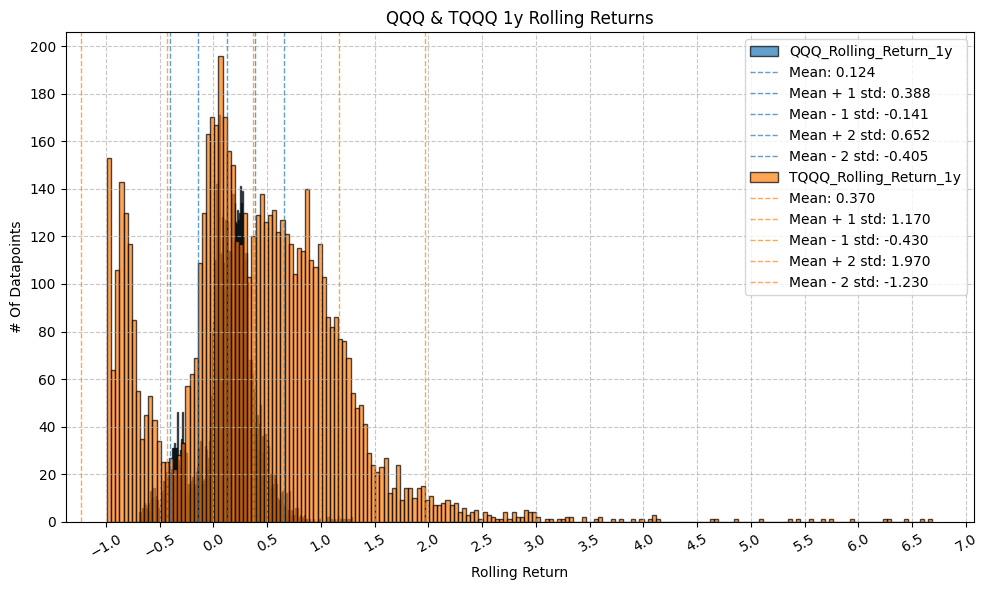
    


    
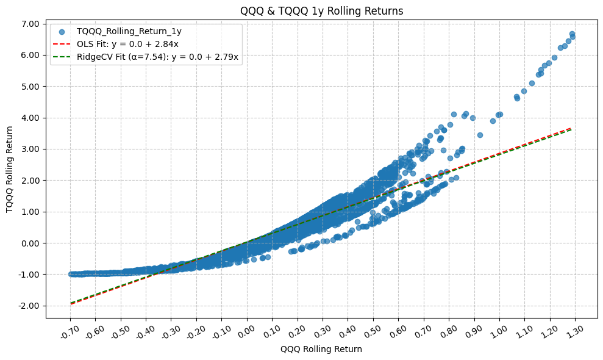
    


                                  OLS Regression Results                              
    ==================================================================================
    Dep. Variable:     TQQQ_Rolling_Return_1y   R-squared:                       0.880
    Model:                                OLS   Adj. R-squared:                  0.880
    Method:                     Least Squares   F-statistic:                 4.785e+04
    Date:                    Mon, 16 Mar 2026   Prob (F-statistic):               0.00
    Time:                            13:41:47   Log-Likelihood:                -892.54
    No. Observations:                    6543   AIC:                             1789.
    Df Residuals:                        6541   BIC:                             1803.
    Df Model:                               1                                         
    Covariance Type:                nonrobust                                         
    =========================================================================================
                                coef    std err          t      P>|t|      [0.025      0.975]
    -----------------------------------------------------------------------------------------
    const                     0.0191      0.004      5.035      0.000       0.012       0.026
    QQQ_Rolling_Return_1y     2.8375      0.013    218.746      0.000       2.812       2.863
    ==============================================================================
    Omnibus:                     3492.635   Durbin-Watson:                   0.037
    Prob(Omnibus):                  0.000   Jarque-Bera (JB):            68111.624
    Skew:                           2.122   Prob(JB):                         0.00
    Kurtosis:                      18.226   Cond. No.                         3.84
    ==============================================================================
    
    Notes:
    [1] Standard Errors assume that the covariance matrix of the errors is correctly specified.


    
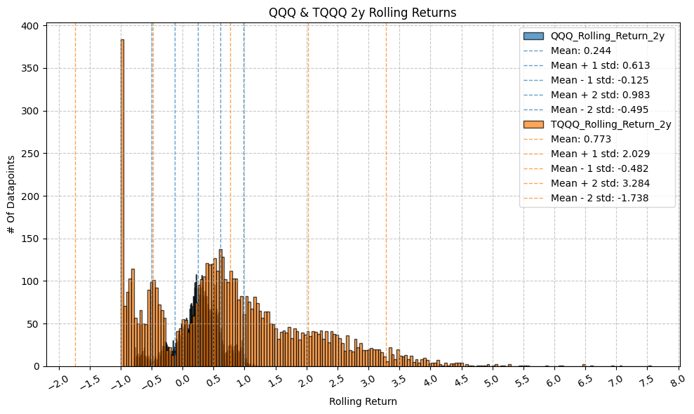
    


    
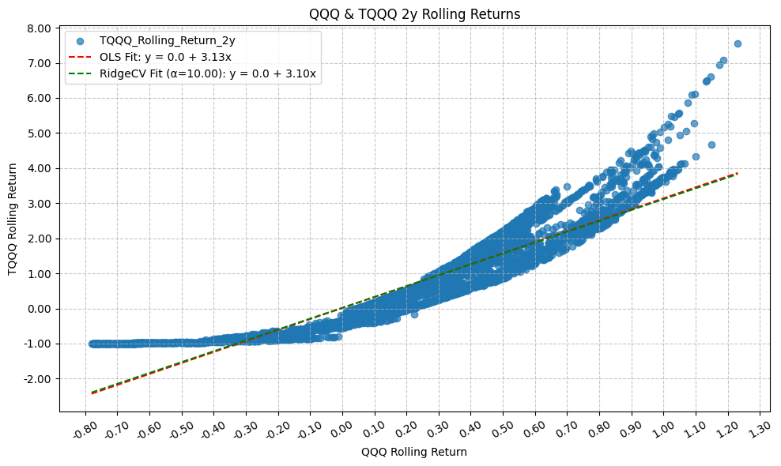
    


                                  OLS Regression Results                              
    ==================================================================================
    Dep. Variable:     TQQQ_Rolling_Return_2y   R-squared:                       0.849
    Model:                                OLS   Adj. R-squared:                  0.848
    Method:                     Least Squares   F-statistic:                 3.522e+04
    Date:                    Mon, 16 Mar 2026   Prob (F-statistic):               0.00
    Time:                            13:41:48   Log-Likelihood:                -4421.2
    No. Observations:                    6291   AIC:                             8846.
    Df Residuals:                        6289   BIC:                             8860.
    Df Model:                               1                                         
    Covariance Type:                nonrobust                                         
    =========================================================================================
                                coef    std err          t      P>|t|      [0.025      0.975]
    -----------------------------------------------------------------------------------------
    const                     0.0096      0.007      1.294      0.196      -0.005       0.024
    QQQ_Rolling_Return_2y     3.1314      0.017    187.680      0.000       3.099       3.164
    ==============================================================================
    Omnibus:                     1595.143   Durbin-Watson:                   0.019
    Prob(Omnibus):                  0.000   Jarque-Bera (JB):             4144.668
    Skew:                           1.367   Prob(JB):                         0.00
    Kurtosis:                       5.887   Cond. No.                         2.89
    ==============================================================================
    
    Notes:
    [1] Standard Errors assume that the covariance matrix of the errors is correctly specified.


    

    


    
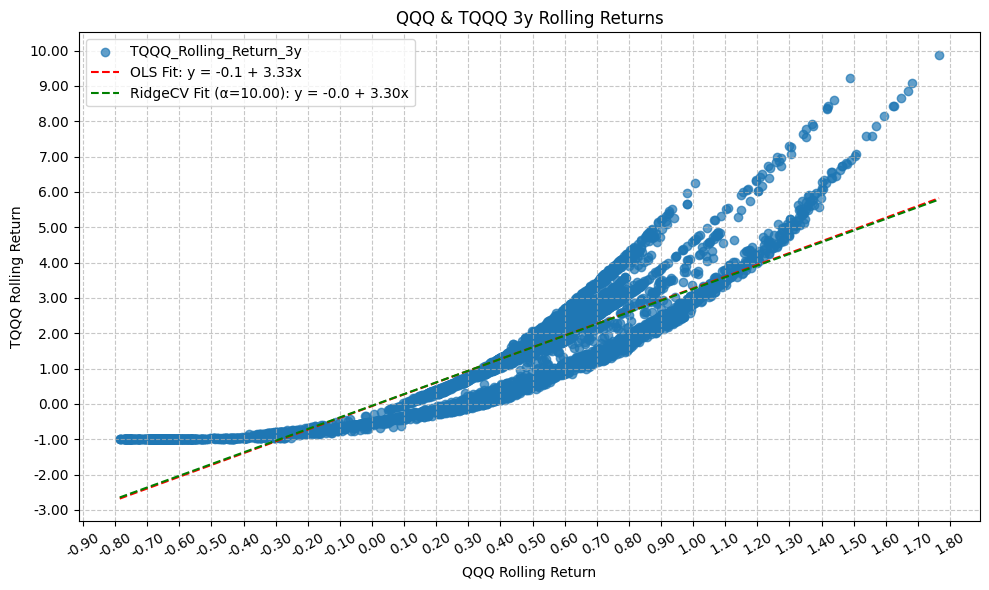
    


                                  OLS Regression Results                              
    ==================================================================================
    Dep. Variable:     TQQQ_Rolling_Return_3y   R-squared:                       0.804
    Model:                                OLS   Adj. R-squared:                  0.804
    Method:                     Least Squares   F-statistic:                 2.481e+04
    Date:                    Mon, 16 Mar 2026   Prob (F-statistic):               0.00
    Time:                            13:41:50   Log-Likelihood:                -6691.5
    No. Observations:                    6039   AIC:                         1.339e+04
    Df Residuals:                        6037   BIC:                         1.340e+04
    Df Model:                               1                                         
    Covariance Type:                nonrobust                                         
    =========================================================================================
                                coef    std err          t      P>|t|      [0.025      0.975]
    -----------------------------------------------------------------------------------------
    const                    -0.0599      0.013     -4.763      0.000      -0.085      -0.035
    QQQ_Rolling_Return_3y     3.3321      0.021    157.522      0.000       3.291       3.374
    ==============================================================================
    Omnibus:                      855.515   Durbin-Watson:                   0.015
    Prob(Omnibus):                  0.000   Jarque-Bera (JB):             1466.078
    Skew:                           0.939   Prob(JB):                         0.00
    Kurtosis:                       4.516   Cond. No.                         2.66
    ==============================================================================
    
    Notes:
    [1] Standard Errors assume that the covariance matrix of the errors is correctly specified.


    
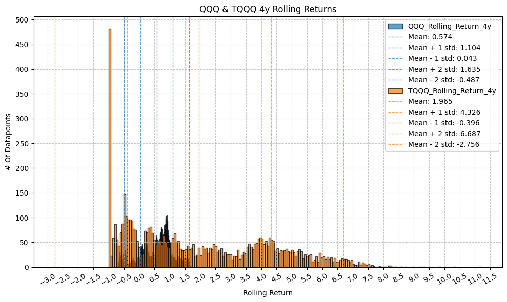
    


    
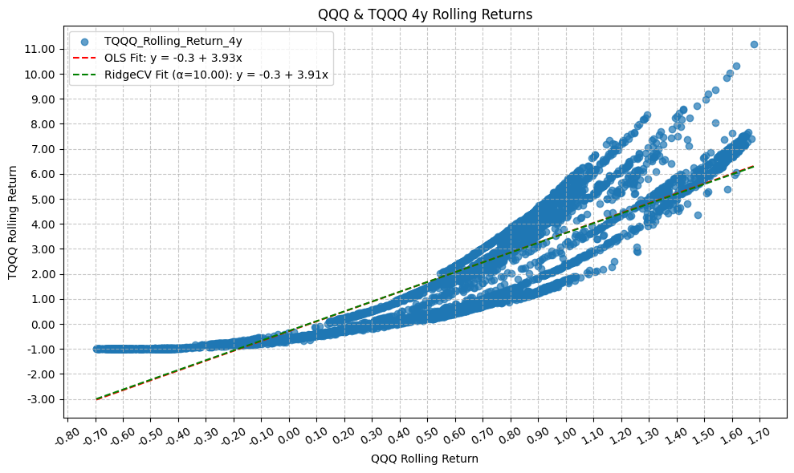
    


                                  OLS Regression Results                              
    ==================================================================================
    Dep. Variable:     TQQQ_Rolling_Return_4y   R-squared:                       0.781
    Model:                                OLS   Adj. R-squared:                  0.781
    Method:                     Least Squares   F-statistic:                 2.068e+04
    Date:                    Mon, 16 Mar 2026   Prob (F-statistic):               0.00
    Time:                            13:41:51   Log-Likelihood:                -8782.4
    No. Observations:                    5787   AIC:                         1.757e+04
    Df Residuals:                        5785   BIC:                         1.758e+04
    Df Model:                               1                                         
    Covariance Type:                nonrobust                                         
    =========================================================================================
                                coef    std err          t      P>|t|      [0.025      0.975]
    -----------------------------------------------------------------------------------------
    const                    -0.2922      0.021    -13.668      0.000      -0.334      -0.250
    QQQ_Rolling_Return_4y     3.9343      0.027    143.797      0.000       3.881       3.988
    ==============================================================================
    Omnibus:                      198.061   Durbin-Watson:                   0.010
    Prob(Omnibus):                  0.000   Jarque-Bera (JB):              103.519
    Skew:                           0.140   Prob(JB):                     3.32e-23
    Kurtosis:                       2.407   Cond. No.                         2.66
    ==============================================================================
    
    Notes:
    [1] Standard Errors assume that the covariance matrix of the errors is correctly specified.


    
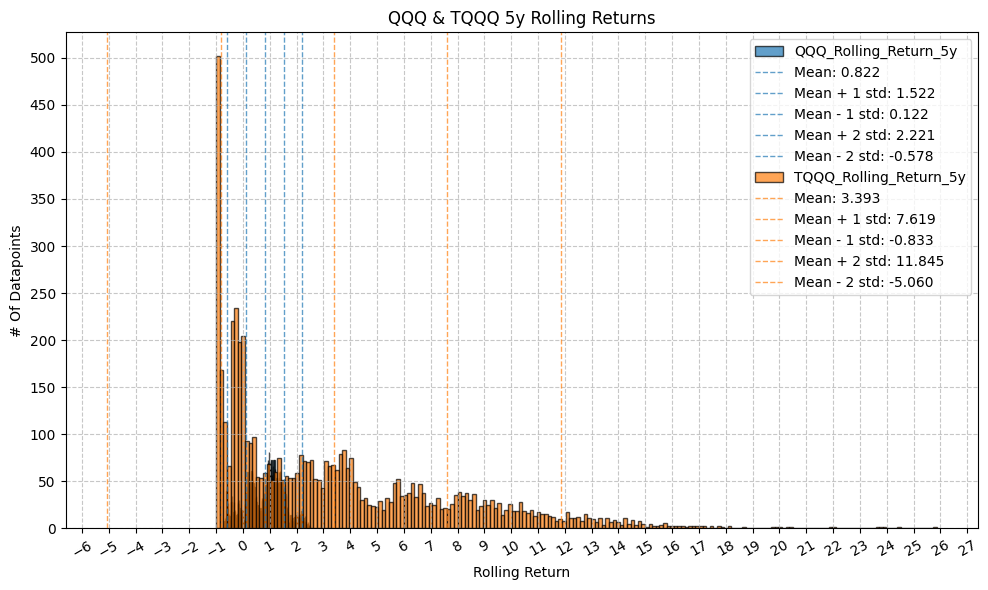
    


    

    


                                  OLS Regression Results                              
    ==================================================================================
    Dep. Variable:     TQQQ_Rolling_Return_5y   R-squared:                       0.743
    Model:                                OLS   Adj. R-squared:                  0.743
    Method:                     Least Squares   F-statistic:                 1.599e+04
    Date:                    Mon, 16 Mar 2026   Prob (F-statistic):               0.00
    Time:                            13:41:52   Log-Likelihood:                -12071.
    No. Observations:                    5535   AIC:                         2.415e+04
    Df Residuals:                        5533   BIC:                         2.416e+04
    Df Model:                               1                                         
    Covariance Type:                nonrobust                                         
    =========================================================================================
                                coef    std err          t      P>|t|      [0.025      0.975]
    -----------------------------------------------------------------------------------------
    const                    -0.8853      0.044    -19.926      0.000      -0.972      -0.798
    QQQ_Rolling_Return_5y     5.2054      0.041    126.462      0.000       5.125       5.286
    ==============================================================================
    Omnibus:                      314.365   Durbin-Watson:                   0.009
    Prob(Omnibus):                  0.000   Jarque-Bera (JB):              460.149
    Skew:                           0.498   Prob(JB):                    1.20e-100
    Kurtosis:                       4.002   Cond. No.                         2.73
    ==============================================================================
    
    Notes:
    [1] Standard Errors assume that the covariance matrix of the errors is correctly specified.


You're welcome to digest each plot, but here's my observations on the above results:

* 1d: TQQQ tracks QQQ as expected (it's a 3x daily return leveraged ETF after all), with a regression coefficient of 2.96 and an R^2 of 0.997, and we extrapolated half the data with the same coefficient.
* 1w: Essentially the same as above. A few outliers, but the regression coefficient is still 2.95 with an R^2 of 0.994. We see a slight skew toward the positive in the rolling returns.
* 1m: The skew toward the positive is more pronounced, and we see more outliers. The regression coefficient has decreased to 2.93 and the R^2 has dropped to 0.98, which is still very high, but we are starting to see some dispersion in the returns.
* 3m: The skew toward the positive is even more pronounced, and we see even more outliers. The regression coefficient has *increased*, to 2.98 and the R^2 has dropped to 0.96.
* 6m: The skew toward the positive is very pronounced, and we see a significant number of outliers with pronounced curvanture in the plot. The regression coefficient has increased again, to 3.4 and the R^2 has dropped to 0.92.
* 1y: At this point, based on the plot and the regression results, we can start to see that the returns of TQQQ are no longer tracking 3x the returns of QQQ as closely as they did in the shorter time periods. The regression coefficient has is now 2.84 and the R^2 has dropped to 0.88.
* 4y and 5y: We can see that there are periods where the rolling returns of TQQQ are significantly higher *and* lower than 3x the returns of QQQ, which is consistent with the idea of volatility decay. For 4y, based on the regression results, we see that if the rolling return of QQQ was 0, then we would expect a return of -0.30x for TQQQ.

$$
r_{TQQQ} = -0.30 + 3.93 \times r_{QQQ} = -0.30 + 3.93 \times 0 = -0.30
$$

On the other end of the spectrum, if the rolling return of QQQ was 1, then we would expect a return of:

$$
r_{TQQQ} = -0.30 + 3.93 \times r_{QQQ} = -0.30 + 3.93 \times 1 = 3.63
$$

In general, the positive skew of the rolling returns of TQQQ relative to QQQ is related to the general postive return performance of QQQ. With sustained positive returns, the leverage effect of TQQQ will amplify those returns, leading to a positive skew. However, during periods of negative returns for QQQ, the leverage effect will also amplify those losses, leading to a negative skew, and to the limit of cumulative return of -1, or a 100% loss. The overall skewness of the rolling returns will depend on the balance of these positive and negative periods.

### Rolling Returns Deviation (QQQ & TQQQ)

Next, we will the rolling returns deviation from the expected 3x return for each time period. This will give us a better picture of the volatility decay effect and how it changes over different time horizons.


```python
rolling_returns_stats["Return_Deviation_From_3x"] = rolling_returns_stats["Slope"] - 3.0
```


```python
display(rolling_returns_stats)
```


<div>
<style scoped>
    .dataframe tbody tr th:only-of-type {
        vertical-align: middle;
    }

    .dataframe tbody tr th {
        vertical-align: top;
    }

    .dataframe thead th {
        text-align: right;
    }
</style>
<table border="1" class="dataframe">
  <thead>
    <tr style="text-align: right;">
      <th></th>
      <th>Period</th>
      <th>Intercept</th>
      <th>Slope</th>
      <th>R_Squared</th>
      <th>Skew</th>
      <th>Average Upside Beta</th>
      <th>Average Downside Beta</th>
      <th>Asymmetry</th>
      <th>Return_Deviation_From_3x</th>
    </tr>
  </thead>
  <tbody>
    <tr>
      <th>0</th>
      <td>1d</td>
      <td>-0.000051</td>
      <td>2.955114</td>
      <td>0.999059</td>
      <td>NaN</td>
      <td>2.956838</td>
      <td>NaN</td>
      <td>NaN</td>
      <td>-0.044886</td>
    </tr>
    <tr>
      <th>0</th>
      <td>1w</td>
      <td>-0.000811</td>
      <td>2.952376</td>
      <td>0.993954</td>
      <td>NaN</td>
      <td>2.552537</td>
      <td>NaN</td>
      <td>NaN</td>
      <td>-0.047624</td>
    </tr>
    <tr>
      <th>0</th>
      <td>1m</td>
      <td>-0.003671</td>
      <td>2.930530</td>
      <td>0.982002</td>
      <td>NaN</td>
      <td>2.208871</td>
      <td>NaN</td>
      <td>NaN</td>
      <td>-0.069470</td>
    </tr>
    <tr>
      <th>0</th>
      <td>3m</td>
      <td>-0.008268</td>
      <td>2.984796</td>
      <td>0.958372</td>
      <td>NaN</td>
      <td>1.994392</td>
      <td>-inf</td>
      <td>inf</td>
      <td>-0.015204</td>
    </tr>
    <tr>
      <th>0</th>
      <td>6m</td>
      <td>-0.009598</td>
      <td>3.039561</td>
      <td>0.915755</td>
      <td>-8.732599</td>
      <td>1.485007</td>
      <td>5.416075</td>
      <td>-3.931068</td>
      <td>0.039561</td>
    </tr>
    <tr>
      <th>0</th>
      <td>1y</td>
      <td>0.019061</td>
      <td>2.837467</td>
      <td>0.879741</td>
      <td>NaN</td>
      <td>1.222436</td>
      <td>-inf</td>
      <td>inf</td>
      <td>-0.162533</td>
    </tr>
    <tr>
      <th>0</th>
      <td>2y</td>
      <td>0.009554</td>
      <td>3.131370</td>
      <td>0.848505</td>
      <td>36.154365</td>
      <td>1.393182</td>
      <td>12.341258</td>
      <td>-10.948076</td>
      <td>0.131370</td>
    </tr>
    <tr>
      <th>0</th>
      <td>3y</td>
      <td>-0.059935</td>
      <td>3.332134</td>
      <td>0.804313</td>
      <td>NaN</td>
      <td>-0.091088</td>
      <td>-inf</td>
      <td>inf</td>
      <td>0.332134</td>
    </tr>
    <tr>
      <th>0</th>
      <td>4y</td>
      <td>-0.292179</td>
      <td>3.934252</td>
      <td>0.781391</td>
      <td>19.553878</td>
      <td>1.759839</td>
      <td>7.211475</td>
      <td>-5.451636</td>
      <td>0.934252</td>
    </tr>
    <tr>
      <th>0</th>
      <td>5y</td>
      <td>-0.885319</td>
      <td>5.205432</td>
      <td>0.742959</td>
      <td>43.020977</td>
      <td>2.433454</td>
      <td>11.479352</td>
      <td>-9.045897</td>
      <td>2.205432</td>
    </tr>
  </tbody>
</table>
</div>


```python
plot_scatter(
    df=rolling_returns_stats,
    x_plot_column="Period",
    y_plot_columns=["Return_Deviation_From_3x"],
    title="TQQQ Deviation from Perfect 3x Leverage by Time Period",
    x_label="Time Period",
    x_format="String",
    x_format_decimal_places=0,
    x_tick_spacing=1,
    x_tick_rotation=0,
    y_label="Deviation from 3x Leverage",
    y_format="Decimal",
    y_format_decimal_places=1,
    y_tick_spacing="Auto",
    y_tick_rotation=0,
    plot_OLS_regression_line=False,
    OLS_column=None,
    plot_Ridge_regression_line=False,
    Ridge_column=None,
    plot_RidgeCV_regression_line=False,
    RidgeCV_column=None,
    regression_constant=False,
    grid=True,
    legend=True,
    export_plot=False,
    plot_file_name=None,
)
```


    

    


```python
plot_scatter(
    df=rolling_returns_stats,
    x_plot_column="Period",
    y_plot_columns=["Slope"],
    title="TQQQ Slope by Time Period",
    x_label="Time Period",
    x_format="String",
    x_format_decimal_places=0,
    x_tick_spacing=1,
    x_tick_rotation=0,
    y_label="Slope",
    y_format="Decimal",
    y_format_decimal_places=1,
    y_tick_spacing="Auto",
    y_tick_rotation=0,
    plot_OLS_regression_line=False,
    OLS_column=None,
    plot_Ridge_regression_line=False,
    Ridge_column=None,
    plot_RidgeCV_regression_line=False,
    RidgeCV_column=None,
    regression_constant=False,
    grid=True,
    legend=True,
    export_plot=False,
    plot_file_name=None,
)
```


    
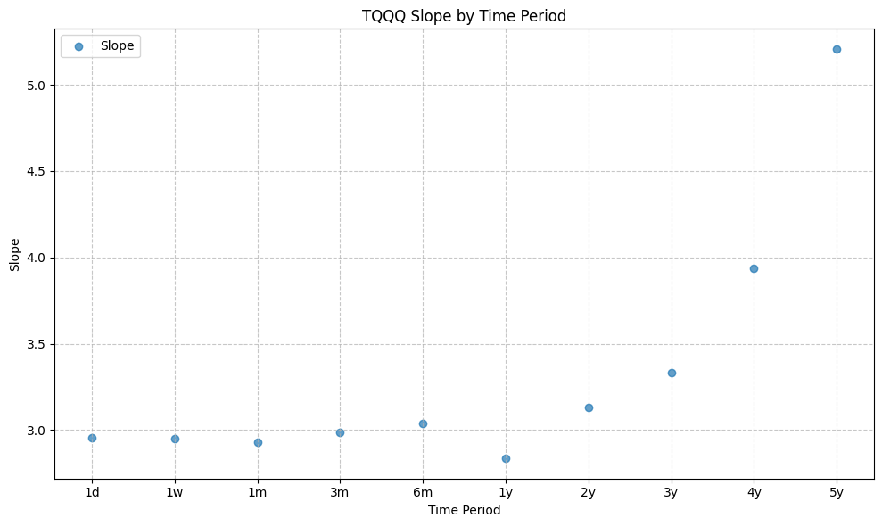
    


```python
plot_scatter(
    df=rolling_returns_stats,
    x_plot_column="Period",
    y_plot_columns=["Intercept"],
    title="Intercept by Time Period",
    x_label="Time Period",
    x_format="String",
    x_format_decimal_places=0,
    x_tick_spacing=1,
    x_tick_rotation=0,
    y_label="Intercept",
    y_format="Decimal",
    y_format_decimal_places=1,
    y_tick_spacing="Auto",
    y_tick_rotation=0,
    plot_OLS_regression_line=False,
    OLS_column=None,
    plot_Ridge_regression_line=False,
    Ridge_column=None,
    plot_RidgeCV_regression_line=False,
    RidgeCV_column=None,
    regression_constant=False,
    grid=True,
    legend=True,
    export_plot=False,
    plot_file_name=None,
)
```


    

    


```python
pandas_set_decimal_places(3)
display(rolling_returns_stats.set_index("Period"))
```


<div>
<style scoped>
    .dataframe tbody tr th:only-of-type {
        vertical-align: middle;
    }

    .dataframe tbody tr th {
        vertical-align: top;
    }

    .dataframe thead th {
        text-align: right;
    }
</style>
<table border="1" class="dataframe">
  <thead>
    <tr style="text-align: right;">
      <th></th>
      <th>Intercept</th>
      <th>Slope</th>
      <th>R_Squared</th>
      <th>Skew</th>
      <th>Average Upside Beta</th>
      <th>Average Downside Beta</th>
      <th>Asymmetry</th>
      <th>Return_Deviation_From_3x</th>
    </tr>
    <tr>
      <th>Period</th>
      <th></th>
      <th></th>
      <th></th>
      <th></th>
      <th></th>
      <th></th>
      <th></th>
      <th></th>
    </tr>
  </thead>
  <tbody>
    <tr>
      <th>1d</th>
      <td>-0.000</td>
      <td>2.955</td>
      <td>0.999</td>
      <td>NaN</td>
      <td>2.957</td>
      <td>NaN</td>
      <td>NaN</td>
      <td>-0.045</td>
    </tr>
    <tr>
      <th>1w</th>
      <td>-0.001</td>
      <td>2.952</td>
      <td>0.994</td>
      <td>NaN</td>
      <td>2.553</td>
      <td>NaN</td>
      <td>NaN</td>
      <td>-0.048</td>
    </tr>
    <tr>
      <th>1m</th>
      <td>-0.004</td>
      <td>2.931</td>
      <td>0.982</td>
      <td>NaN</td>
      <td>2.209</td>
      <td>NaN</td>
      <td>NaN</td>
      <td>-0.069</td>
    </tr>
    <tr>
      <th>3m</th>
      <td>-0.008</td>
      <td>2.985</td>
      <td>0.958</td>
      <td>NaN</td>
      <td>1.994</td>
      <td>-inf</td>
      <td>inf</td>
      <td>-0.015</td>
    </tr>
    <tr>
      <th>6m</th>
      <td>-0.010</td>
      <td>3.040</td>
      <td>0.916</td>
      <td>-8.733</td>
      <td>1.485</td>
      <td>5.416</td>
      <td>-3.931</td>
      <td>0.040</td>
    </tr>
    <tr>
      <th>1y</th>
      <td>0.019</td>
      <td>2.837</td>
      <td>0.880</td>
      <td>NaN</td>
      <td>1.222</td>
      <td>-inf</td>
      <td>inf</td>
      <td>-0.163</td>
    </tr>
    <tr>
      <th>2y</th>
      <td>0.010</td>
      <td>3.131</td>
      <td>0.849</td>
      <td>36.154</td>
      <td>1.393</td>
      <td>12.341</td>
      <td>-10.948</td>
      <td>0.131</td>
    </tr>
    <tr>
      <th>3y</th>
      <td>-0.060</td>
      <td>3.332</td>
      <td>0.804</td>
      <td>NaN</td>
      <td>-0.091</td>
      <td>-inf</td>
      <td>inf</td>
      <td>0.332</td>
    </tr>
    <tr>
      <th>4y</th>
      <td>-0.292</td>
      <td>3.934</td>
      <td>0.781</td>
      <td>19.554</td>
      <td>1.760</td>
      <td>7.211</td>
      <td>-5.452</td>
      <td>0.934</td>
    </tr>
    <tr>
      <th>5y</th>
      <td>-0.885</td>
      <td>5.205</td>
      <td>0.743</td>
      <td>43.021</td>
      <td>2.433</td>
      <td>11.479</td>
      <td>-9.046</td>
      <td>2.205</td>
    </tr>
  </tbody>
</table>
</div>


This is very interesting. Up to 1 year, there is minimal difference between the mean TQQQ 1 year rolling return and the hypothetical 3x leverage, with an R^2 of greater than 0.9.

However, as we extend the time period, we see that

* The "leverage factor" increases significantly, resulting in a deviation from the perfect 3x leverage.
* The intercept also begins to deviate significantly from 0.

The above highlight the impact of volatility magnification over longer time horizons. This phenomenon is happening likely due to the positive returns that QQQ has achieved over the past 15 years - resulting in TQQQ compounding at a much higher rate than 3x - but it may and likely is not exhibited by other 3x leveraged ETFs that have not had the same positive return profile as QQQ.

With the above results, the next logical question is, when is the opportune time to buy a 3x leveraged ETF like TQQQ? To answer this, we will look a the drawdown levels of TQQQ and the subsequent returns over various time horizons.

### Rolling Returns Following Drawdowns (QQQ & TQQQ)

We will identify the drawdown levels of TQQQ and then look at the subsequent rolling returns over various time horizons.


```python
# Copy DataFrame
qqq_tqqq_extrap_future = qqq_tqqq_extrap.copy()

# Create a list of drawdown levels to analyze
drawdown_levels = [-0.10, -0.20, -0.30, -0.40, -0.50, -0.60, -0.70, -0.80]

# Shift the rolling return columns by the number of days in the rolling window to get the returns following the drawdown
for etf in etfs:
    for period_name, window in rolling_windows.items():
        qqq_tqqq_extrap_future[f"{etf}_Rolling_Future_Return_{period_name}"] = qqq_tqqq_extrap_future[f"{etf}_Rolling_Return_{period_name}"].shift(-window)
```

Now, we can analyze the future rolling returns following specific drawdown levels:


```python
# Create a dataframe to hold rolling returns stats
rolling_returns_drawdown_stats = pd.DataFrame()

for drawdown in drawdown_levels:

    for period_name, window in rolling_windows.items():

        try:
            plot_histogram(
                df=qqq_tqqq_extrap_future[qqq_tqqq_extrap_future["TQQQ_Drawdown"] <= drawdown],
                plot_columns=[f"QQQ_Rolling_Future_Return_{period_name}", f"TQQQ_Rolling_Future_Return_{period_name}"],
                title=f"QQQ & TQQQ {period_name} Rolling Future Returns Post {drawdown} TQQQ Drawdown",
                x_label="Rolling Return",
                x_tick_spacing="Auto",
                x_tick_rotation=30,
                y_label="# Of Datapoints",
                y_tick_spacing="Auto",
                y_tick_rotation=0,
                grid=True,
                legend=True,
                export_plot=False,
                plot_file_name=None,
            )

            plot_scatter(
                df=qqq_tqqq_extrap_future[qqq_tqqq_extrap_future["TQQQ_Drawdown"] <= drawdown],
                x_plot_column=f"QQQ_Rolling_Future_Return_{period_name}",
                y_plot_columns=[f"TQQQ_Rolling_Future_Return_{period_name}"],
                title=f"QQQ & TQQQ {period_name} Rolling Future Returns Post {drawdown} TQQQ Drawdown",
                x_label="QQQ Rolling Return",
                x_format="Decimal",
                x_format_decimal_places=2,
                x_tick_spacing="Auto",
                x_tick_rotation=30,
                y_label="TQQQ Rolling Return",
                y_format="Decimal",
                y_format_decimal_places=2,
                y_tick_spacing="Auto",
                y_tick_rotation=0,
                plot_OLS_regression_line=True,
                OLS_column=f"TQQQ_Rolling_Future_Return_{period_name}",
                plot_Ridge_regression_line=False,
                Ridge_column=None,
                plot_RidgeCV_regression_line=True,
                RidgeCV_column=f"TQQQ_Rolling_Future_Return_{period_name}",
                regression_constant=True,
                grid=True,
                legend=True,
                export_plot=False,
                plot_file_name=None,
            )

            # Run OLS regression with statsmodels
            model = run_linear_regression(
                df=qqq_tqqq_extrap_future[qqq_tqqq_extrap_future["TQQQ_Drawdown"] <= drawdown],
                x_plot_column=f"QQQ_Rolling_Future_Return_{period_name}",
                y_plot_column=f"TQQQ_Rolling_Future_Return_{period_name}",
                regression_model="OLS-statsmodels",
                regression_constant=True,
            )
            print(model.summary())

            # Filter by drawdown
            drawdown_filter = qqq_tqqq_extrap_future[qqq_tqqq_extrap_future["TQQQ_Drawdown"] <= drawdown]

            # Filter by period, drop rows with missing values
            future_filter = drawdown_filter[[f"TQQQ_Rolling_Future_Return_{period_name}"]].dropna()

            # Find length of future dataframe
            future_length = len(future_filter)

            # Find length of future dataframe where return is positive
            positive_future_length = len(future_filter[future_filter[f"TQQQ_Rolling_Future_Return_{period_name}"] > 0])

            # Calculate percentage of future returns that are positive
            positive_future_percentage = (positive_future_length / future_length) if future_length > 0 else 0

            # Add the regression results to the rolling returns stats dataframe
            intercept = model.params[0]
            # intercept_pvalue = model.pvalues[0]   # p-value for Intercept
            slope = model.params[1]
            # slope_pvalue = model.pvalues[1]       # p-value for Slope
            r_squared = model.rsquared

            rolling_returns_slope_int = pd.DataFrame({
                "Drawdown": drawdown,
                "Period": period_name,
                "Intercept": [intercept],
                # "Intercept_PValue": [intercept_pvalue],
                "Slope": [slope],
                # "Slope_PValue": [slope_pvalue],
                "R_Squared": [r_squared],
                "Positive_Future_Percentage": [positive_future_percentage],
            })
            
            rolling_returns_drawdown_stats = pd.concat([rolling_returns_drawdown_stats, rolling_returns_slope_int])

        except:
            print(f"Not enough data points for drawdown level {drawdown} and period {period_name} to run regression.")
```


    

    


    
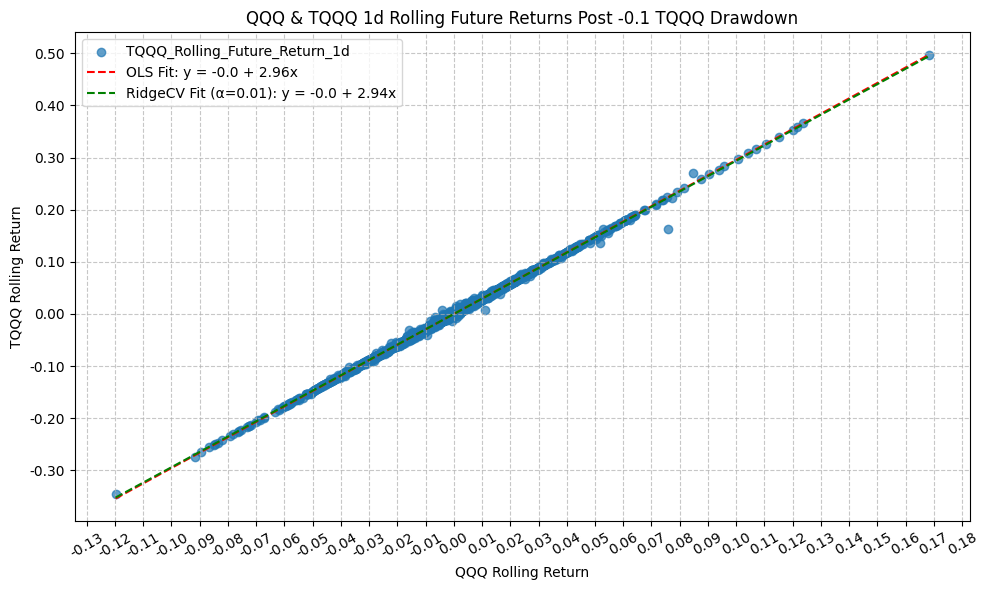
    


                                      OLS Regression Results                                 
    =========================================================================================
    Dep. Variable:     TQQQ_Rolling_Future_Return_1d   R-squared:                       0.999
    Model:                                       OLS   Adj. R-squared:                  0.999
    Method:                            Least Squares   F-statistic:                 6.825e+06
    Date:                           Mon, 16 Mar 2026   Prob (F-statistic):               0.00
    Time:                                   13:41:54   Log-Likelihood:                 33542.
    No. Observations:                           6648   AIC:                        -6.708e+04
    Df Residuals:                               6646   BIC:                        -6.707e+04
    Df Model:                                      1                                         
    Covariance Type:                       nonrobust                                         
    ================================================================================================
                                       coef    std err          t      P>|t|      [0.025      0.975]
    ------------------------------------------------------------------------------------------------
    const                        -5.203e-05   1.91e-05     -2.721      0.007   -8.95e-05   -1.45e-05
    QQQ_Rolling_Future_Return_1d     2.9551      0.001   2612.377      0.000       2.953       2.957
    ==============================================================================
    Omnibus:                     9913.687   Durbin-Watson:                   2.565
    Prob(Omnibus):                  0.000   Jarque-Bera (JB):         41109927.245
    Skew:                          -8.187   Prob(JB):                         0.00
    Kurtosis:                     387.894   Cond. No.                         59.2
    ==============================================================================
    
    Notes:
    [1] Standard Errors assume that the covariance matrix of the errors is correctly specified.


    

    


    

    


                                      OLS Regression Results                                 
    =========================================================================================
    Dep. Variable:     TQQQ_Rolling_Future_Return_1w   R-squared:                       0.994
    Model:                                       OLS   Adj. R-squared:                  0.994
    Method:                            Least Squares   F-statistic:                 1.088e+06
    Date:                           Mon, 16 Mar 2026   Prob (F-statistic):               0.00
    Time:                                   13:41:55   Log-Likelihood:                 22709.
    No. Observations:                           6644   AIC:                        -4.541e+04
    Df Residuals:                               6642   BIC:                        -4.540e+04
    Df Model:                                      1                                         
    Covariance Type:                       nonrobust                                         
    ================================================================================================
                                       coef    std err          t      P>|t|      [0.025      0.975]
    ------------------------------------------------------------------------------------------------
    const                           -0.0008   9.76e-05     -8.221      0.000      -0.001      -0.001
    QQQ_Rolling_Future_Return_1w     2.9526      0.003   1043.242      0.000       2.947       2.958
    ==============================================================================
    Omnibus:                     2701.400   Durbin-Watson:                   0.939
    Prob(Omnibus):                  0.000   Jarque-Bera (JB):           586368.143
    Skew:                          -0.779   Prob(JB):                         0.00
    Kurtosis:                      48.997   Cond. No.                         29.1
    ==============================================================================
    
    Notes:
    [1] Standard Errors assume that the covariance matrix of the errors is correctly specified.


    

    


    

    


                                      OLS Regression Results                                 
    =========================================================================================
    Dep. Variable:     TQQQ_Rolling_Future_Return_1m   R-squared:                       0.982
    Model:                                       OLS   Adj. R-squared:                  0.982
    Method:                            Least Squares   F-statistic:                 3.703e+05
    Date:                           Mon, 16 Mar 2026   Prob (F-statistic):               0.00
    Time:                                   13:41:56   Log-Likelihood:                 14696.
    No. Observations:                           6628   AIC:                        -2.939e+04
    Df Residuals:                               6626   BIC:                        -2.937e+04
    Df Model:                                      1                                         
    Covariance Type:                       nonrobust                                         
    ================================================================================================
                                       coef    std err          t      P>|t|      [0.025      0.975]
    ------------------------------------------------------------------------------------------------
    const                           -0.0034      0.000    -10.530      0.000      -0.004      -0.003
    QQQ_Rolling_Future_Return_1m     2.9304      0.005    608.513      0.000       2.921       2.940
    ==============================================================================
    Omnibus:                     1679.490   Durbin-Watson:                   0.312
    Prob(Omnibus):                  0.000   Jarque-Bera (JB):            80862.122
    Skew:                           0.393   Prob(JB):                         0.00
    Kurtosis:                      20.093   Cond. No.                         14.9
    ==============================================================================
    
    Notes:
    [1] Standard Errors assume that the covariance matrix of the errors is correctly specified.


    

    


    

    


                                      OLS Regression Results                                 
    =========================================================================================
    Dep. Variable:     TQQQ_Rolling_Future_Return_3m   R-squared:                       0.957
    Model:                                       OLS   Adj. R-squared:                  0.957
    Method:                            Least Squares   F-statistic:                 1.458e+05
    Date:                           Mon, 16 Mar 2026   Prob (F-statistic):               0.00
    Time:                                   13:41:57   Log-Likelihood:                 7947.5
    No. Observations:                           6586   AIC:                        -1.589e+04
    Df Residuals:                               6584   BIC:                        -1.588e+04
    Df Model:                                      1                                         
    Covariance Type:                       nonrobust                                         
    ================================================================================================
                                       coef    std err          t      P>|t|      [0.025      0.975]
    ------------------------------------------------------------------------------------------------
    const                           -0.0076      0.001     -8.260      0.000      -0.009      -0.006
    QQQ_Rolling_Future_Return_3m     2.9582      0.008    381.884      0.000       2.943       2.973
    ==============================================================================
    Omnibus:                     3401.457   Durbin-Watson:                   0.113
    Prob(Omnibus):                  0.000   Jarque-Bera (JB):            86281.946
    Skew:                           1.942   Prob(JB):                         0.00
    Kurtosis:                      20.301   Cond. No.                         8.69
    ==============================================================================
    
    Notes:
    [1] Standard Errors assume that the covariance matrix of the errors is correctly specified.


    
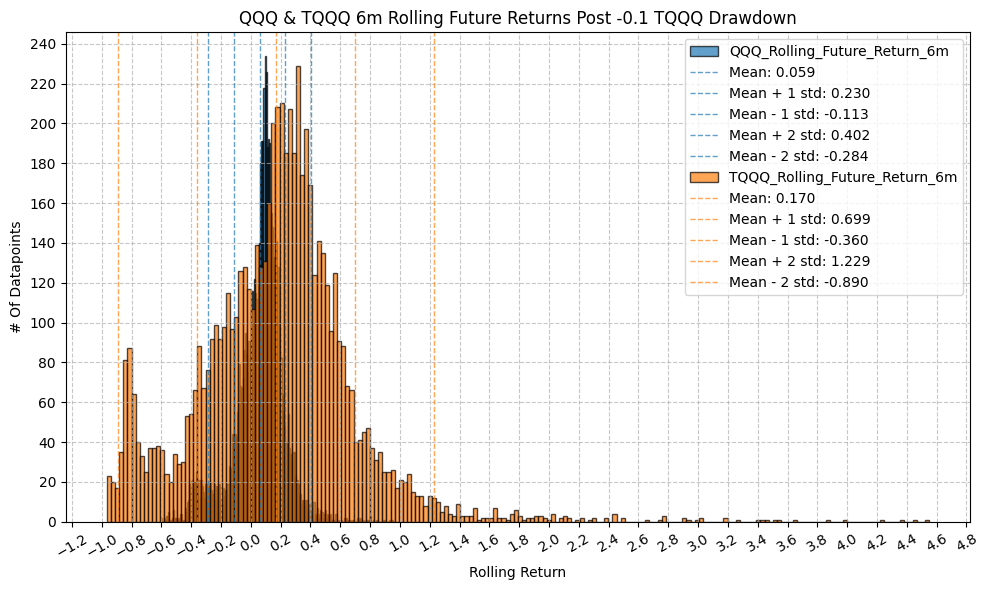
    


    
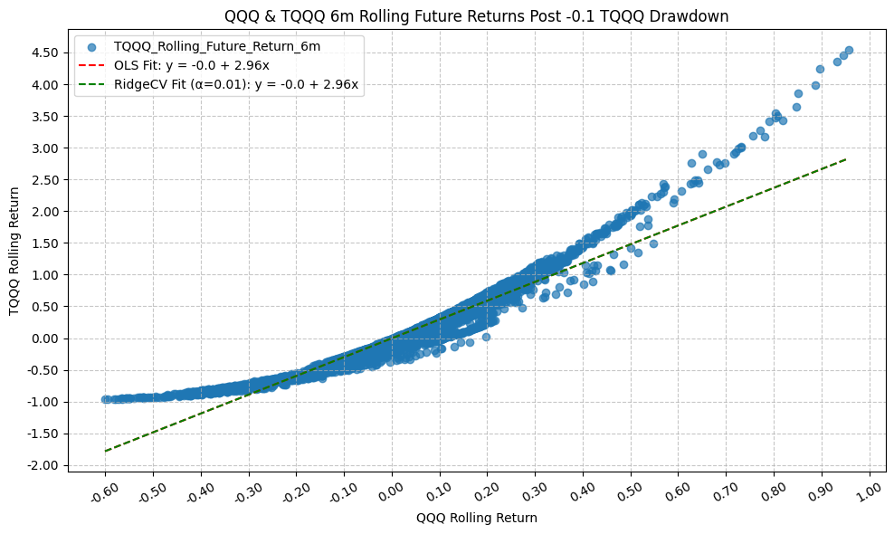
    


                                      OLS Regression Results                                 
    =========================================================================================
    Dep. Variable:     TQQQ_Rolling_Future_Return_6m   R-squared:                       0.921
    Model:                                       OLS   Adj. R-squared:                  0.921
    Method:                            Least Squares   F-statistic:                 7.566e+04
    Date:                           Mon, 16 Mar 2026   Prob (F-statistic):               0.00
    Time:                                   13:41:59   Log-Likelihood:                 3154.5
    No. Observations:                           6523   AIC:                            -6305.
    Df Residuals:                               6521   BIC:                            -6291.
    Df Model:                                      1                                         
    Covariance Type:                       nonrobust                                         
    ================================================================================================
                                       coef    std err          t      P>|t|      [0.025      0.975]
    ------------------------------------------------------------------------------------------------
    const                           -0.0042      0.002     -2.132      0.033      -0.008      -0.000
    QQQ_Rolling_Future_Return_6m     2.9626      0.011    275.060      0.000       2.941       2.984
    ==============================================================================
    Omnibus:                     4154.198   Durbin-Watson:                   0.065
    Prob(Omnibus):                  0.000   Jarque-Bera (JB):           100612.082
    Skew:                           2.647   Prob(JB):                         0.00
    Kurtosis:                      21.498   Cond. No.                         5.85
    ==============================================================================
    
    Notes:
    [1] Standard Errors assume that the covariance matrix of the errors is correctly specified.


    

    


    
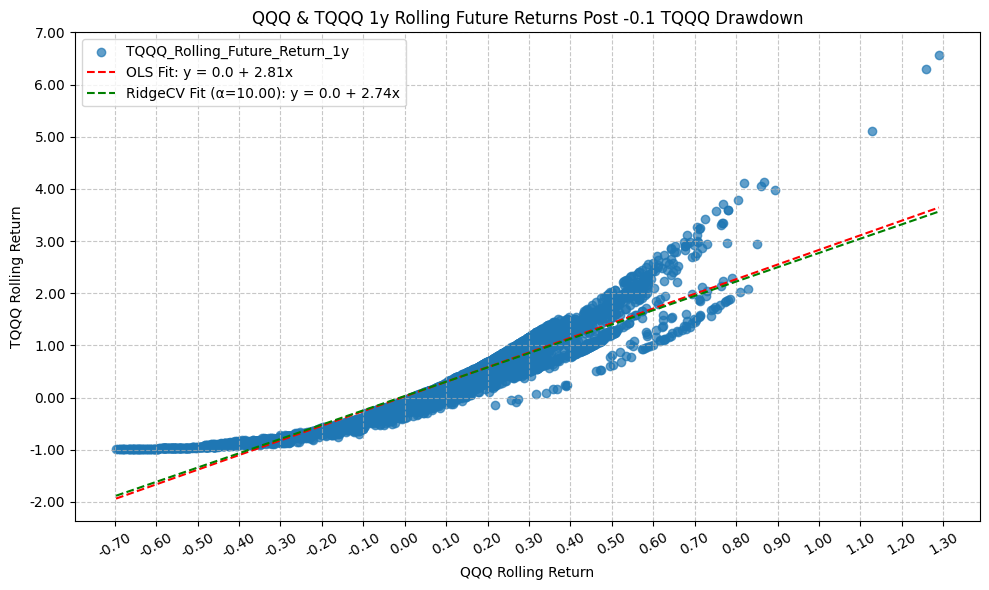
    


                                      OLS Regression Results                                 
    =========================================================================================
    Dep. Variable:     TQQQ_Rolling_Future_Return_1y   R-squared:                       0.893
    Model:                                       OLS   Adj. R-squared:                  0.893
    Method:                            Least Squares   F-statistic:                 5.326e+04
    Date:                           Mon, 16 Mar 2026   Prob (F-statistic):               0.00
    Time:                                   13:42:00   Log-Likelihood:                -135.51
    No. Observations:                           6397   AIC:                             275.0
    Df Residuals:                               6395   BIC:                             288.6
    Df Model:                                      1                                         
    Covariance Type:                       nonrobust                                         
    ================================================================================================
                                       coef    std err          t      P>|t|      [0.025      0.975]
    ------------------------------------------------------------------------------------------------
    const                            0.0228      0.003      6.654      0.000       0.016       0.030
    QQQ_Rolling_Future_Return_1y     2.8089      0.012    230.784      0.000       2.785       2.833
    ==============================================================================
    Omnibus:                     2631.338   Durbin-Watson:                   0.052
    Prob(Omnibus):                  0.000   Jarque-Bera (JB):            29220.801
    Skew:                           1.657   Prob(JB):                         0.00
    Kurtosis:                      12.932   Cond. No.                         4.00
    ==============================================================================
    
    Notes:
    [1] Standard Errors assume that the covariance matrix of the errors is correctly specified.


    

    


    

    


                                      OLS Regression Results                                 
    =========================================================================================
    Dep. Variable:     TQQQ_Rolling_Future_Return_2y   R-squared:                       0.848
    Model:                                       OLS   Adj. R-squared:                  0.848
    Method:                            Least Squares   F-statistic:                 3.426e+04
    Date:                           Mon, 16 Mar 2026   Prob (F-statistic):               0.00
    Time:                                   13:42:01   Log-Likelihood:                -4260.2
    No. Observations:                           6145   AIC:                             8524.
    Df Residuals:                               6143   BIC:                             8538.
    Df Model:                                      1                                         
    Covariance Type:                       nonrobust                                         
    ================================================================================================
                                       coef    std err          t      P>|t|      [0.025      0.975]
    ------------------------------------------------------------------------------------------------
    const                           -0.0188      0.008     -2.463      0.014      -0.034      -0.004
    QQQ_Rolling_Future_Return_2y     3.2014      0.017    185.083      0.000       3.167       3.235
    ==============================================================================
    Omnibus:                     1670.286   Durbin-Watson:                   0.019
    Prob(Omnibus):                  0.000   Jarque-Bera (JB):             4641.855
    Skew:                           1.436   Prob(JB):                         0.00
    Kurtosis:                       6.143   Cond. No.                         3.02
    ==============================================================================
    
    Notes:
    [1] Standard Errors assume that the covariance matrix of the errors is correctly specified.


    

    


    

    


                                      OLS Regression Results                                 
    =========================================================================================
    Dep. Variable:     TQQQ_Rolling_Future_Return_3y   R-squared:                       0.811
    Model:                                       OLS   Adj. R-squared:                  0.811
    Method:                            Least Squares   F-statistic:                 2.522e+04
    Date:                           Mon, 16 Mar 2026   Prob (F-statistic):               0.00
    Time:                                   13:42:02   Log-Likelihood:                -6367.9
    No. Observations:                           5893   AIC:                         1.274e+04
    Df Residuals:                               5891   BIC:                         1.275e+04
    Df Model:                                      1                                         
    Covariance Type:                       nonrobust                                         
    ================================================================================================
                                       coef    std err          t      P>|t|      [0.025      0.975]
    ------------------------------------------------------------------------------------------------
    const                           -0.1590      0.013    -12.136      0.000      -0.185      -0.133
    QQQ_Rolling_Future_Return_3y     3.5025      0.022    158.807      0.000       3.459       3.546
    ==============================================================================
    Omnibus:                      868.866   Durbin-Watson:                   0.015
    Prob(Omnibus):                  0.000   Jarque-Bera (JB):             1529.067
    Skew:                           0.959   Prob(JB):                         0.00
    Kurtosis:                       4.595   Cond. No.                         2.86
    ==============================================================================
    
    Notes:
    [1] Standard Errors assume that the covariance matrix of the errors is correctly specified.


    

    


    

    


                                      OLS Regression Results                                 
    =========================================================================================
    Dep. Variable:     TQQQ_Rolling_Future_Return_4y   R-squared:                       0.783
    Model:                                       OLS   Adj. R-squared:                  0.783
    Method:                            Least Squares   F-statistic:                 2.039e+04
    Date:                           Mon, 16 Mar 2026   Prob (F-statistic):               0.00
    Time:                                   13:42:03   Log-Likelihood:                -8491.0
    No. Observations:                           5641   AIC:                         1.699e+04
    Df Residuals:                               5639   BIC:                         1.700e+04
    Df Model:                                      1                                         
    Covariance Type:                       nonrobust                                         
    ================================================================================================
                                       coef    std err          t      P>|t|      [0.025      0.975]
    ------------------------------------------------------------------------------------------------
    const                           -0.4268      0.023    -18.906      0.000      -0.471      -0.383
    QQQ_Rolling_Future_Return_4y     4.0976      0.029    142.777      0.000       4.041       4.154
    ==============================================================================
    Omnibus:                      125.491   Durbin-Watson:                   0.010
    Prob(Omnibus):                  0.000   Jarque-Bera (JB):               78.475
    Skew:                           0.148   Prob(JB):                     9.11e-18
    Kurtosis:                       2.504   Cond. No.                         2.85
    ==============================================================================
    
    Notes:
    [1] Standard Errors assume that the covariance matrix of the errors is correctly specified.


    

    


    

    


                                      OLS Regression Results                                 
    =========================================================================================
    Dep. Variable:     TQQQ_Rolling_Future_Return_5y   R-squared:                       0.745
    Model:                                       OLS   Adj. R-squared:                  0.745
    Method:                            Least Squares   F-statistic:                 1.578e+04
    Date:                           Mon, 16 Mar 2026   Prob (F-statistic):               0.00
    Time:                                   13:42:05   Log-Likelihood:                -11719.
    No. Observations:                           5389   AIC:                         2.344e+04
    Df Residuals:                               5387   BIC:                         2.345e+04
    Df Model:                                      1                                         
    Covariance Type:                       nonrobust                                         
    ================================================================================================
                                       coef    std err          t      P>|t|      [0.025      0.975]
    ------------------------------------------------------------------------------------------------
    const                           -1.1137      0.047    -23.759      0.000      -1.206      -1.022
    QQQ_Rolling_Future_Return_5y     5.3970      0.043    125.610      0.000       5.313       5.481
    ==============================================================================
    Omnibus:                      275.950   Durbin-Watson:                   0.009
    Prob(Omnibus):                  0.000   Jarque-Bera (JB):              406.209
    Skew:                           0.459   Prob(JB):                     6.21e-89
    Kurtosis:                       3.983   Cond. No.                         2.90
    ==============================================================================
    
    Notes:
    [1] Standard Errors assume that the covariance matrix of the errors is correctly specified.


    

    


    

    


                                      OLS Regression Results                                 
    =========================================================================================
    Dep. Variable:     TQQQ_Rolling_Future_Return_1d   R-squared:                       0.999
    Model:                                       OLS   Adj. R-squared:                  0.999
    Method:                            Least Squares   F-statistic:                 6.602e+06
    Date:                           Mon, 16 Mar 2026   Prob (F-statistic):               0.00
    Time:                                   13:42:06   Log-Likelihood:                 33115.
    No. Observations:                           6571   AIC:                        -6.623e+04
    Df Residuals:                               6569   BIC:                        -6.621e+04
    Df Model:                                      1                                         
    Covariance Type:                       nonrobust                                         
    ================================================================================================
                                       coef    std err          t      P>|t|      [0.025      0.975]
    ------------------------------------------------------------------------------------------------
    const                        -5.264e-05   1.93e-05     -2.721      0.007   -9.06e-05   -1.47e-05
    QQQ_Rolling_Future_Return_1d     2.9551      0.001   2569.475      0.000       2.953       2.957
    ==============================================================================
    Omnibus:                     9769.052   Durbin-Watson:                   2.565
    Prob(Omnibus):                  0.000   Jarque-Bera (JB):         39689255.457
    Skew:                          -8.139   Prob(JB):                         0.00
    Kurtosis:                     383.390   Cond. No.                         59.5
    ==============================================================================
    
    Notes:
    [1] Standard Errors assume that the covariance matrix of the errors is correctly specified.


    

    


    

    


                                      OLS Regression Results                                 
    =========================================================================================
    Dep. Variable:     TQQQ_Rolling_Future_Return_1w   R-squared:                       0.994
    Model:                                       OLS   Adj. R-squared:                  0.994
    Method:                            Least Squares   F-statistic:                 1.069e+06
    Date:                           Mon, 16 Mar 2026   Prob (F-statistic):               0.00
    Time:                                   13:42:07   Log-Likelihood:                 22453.
    No. Observations:                           6567   AIC:                        -4.490e+04
    Df Residuals:                               6565   BIC:                        -4.489e+04
    Df Model:                                      1                                         
    Covariance Type:                       nonrobust                                         
    ================================================================================================
                                       coef    std err          t      P>|t|      [0.025      0.975]
    ------------------------------------------------------------------------------------------------
    const                           -0.0008    9.8e-05     -8.016      0.000      -0.001      -0.001
    QQQ_Rolling_Future_Return_1w     2.9517      0.003   1033.957      0.000       2.946       2.957
    ==============================================================================
    Omnibus:                     2705.152   Durbin-Watson:                   0.933
    Prob(Omnibus):                  0.000   Jarque-Bera (JB):           594917.588
    Skew:                          -0.803   Prob(JB):                         0.00
    Kurtosis:                      49.601   Cond. No.                         29.2
    ==============================================================================
    
    Notes:
    [1] Standard Errors assume that the covariance matrix of the errors is correctly specified.


    

    


    

    


                                      OLS Regression Results                                 
    =========================================================================================
    Dep. Variable:     TQQQ_Rolling_Future_Return_1m   R-squared:                       0.983
    Model:                                       OLS   Adj. R-squared:                  0.983
    Method:                            Least Squares   F-statistic:                 3.703e+05
    Date:                           Mon, 16 Mar 2026   Prob (F-statistic):               0.00
    Time:                                   13:42:08   Log-Likelihood:                 14653.
    No. Observations:                           6551   AIC:                        -2.930e+04
    Df Residuals:                               6549   BIC:                        -2.929e+04
    Df Model:                                      1                                         
    Covariance Type:                       nonrobust                                         
    ================================================================================================
                                       coef    std err          t      P>|t|      [0.025      0.975]
    ------------------------------------------------------------------------------------------------
    const                           -0.0035      0.000    -10.801      0.000      -0.004      -0.003
    QQQ_Rolling_Future_Return_1m     2.9224      0.005    608.511      0.000       2.913       2.932
    ==============================================================================
    Omnibus:                     1535.850   Durbin-Watson:                   0.317
    Prob(Omnibus):                  0.000   Jarque-Bera (JB):            81019.960
    Skew:                           0.160   Prob(JB):                         0.00
    Kurtosis:                      20.226   Cond. No.                         15.0
    ==============================================================================
    
    Notes:
    [1] Standard Errors assume that the covariance matrix of the errors is correctly specified.


    

    


    
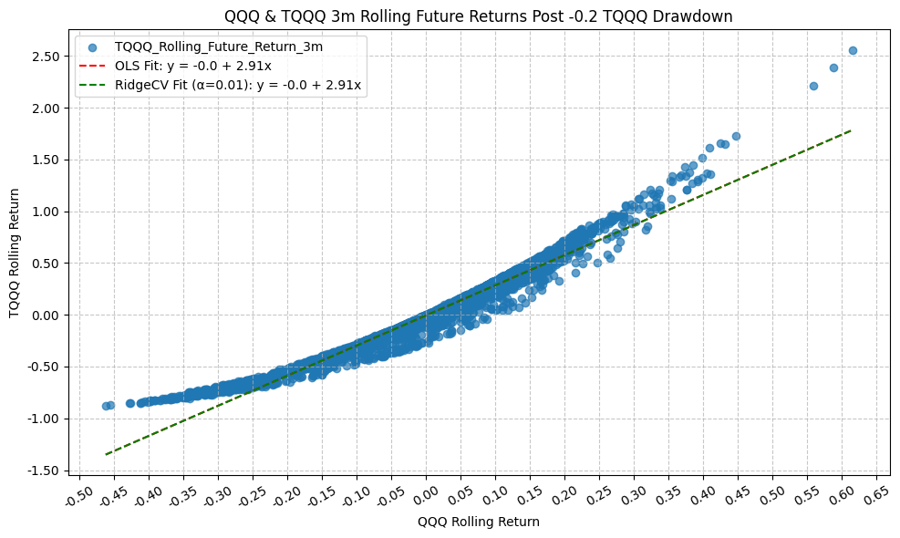
    


                                      OLS Regression Results                                 
    =========================================================================================
    Dep. Variable:     TQQQ_Rolling_Future_Return_3m   R-squared:                       0.960
    Model:                                       OLS   Adj. R-squared:                  0.960
    Method:                            Least Squares   F-statistic:                 1.544e+05
    Date:                           Mon, 16 Mar 2026   Prob (F-statistic):               0.00
    Time:                                   13:42:09   Log-Likelihood:                 8321.1
    No. Observations:                           6509   AIC:                        -1.664e+04
    Df Residuals:                               6507   BIC:                        -1.662e+04
    Df Model:                                      1                                         
    Covariance Type:                       nonrobust                                         
    ================================================================================================
                                       coef    std err          t      P>|t|      [0.025      0.975]
    ------------------------------------------------------------------------------------------------
    const                           -0.0070      0.001     -8.175      0.000      -0.009      -0.005
    QQQ_Rolling_Future_Return_3m     2.9103      0.007    392.952      0.000       2.896       2.925
    ==============================================================================
    Omnibus:                     2145.969   Durbin-Watson:                   0.136
    Prob(Omnibus):                  0.000   Jarque-Bera (JB):            38765.286
    Skew:                           1.109   Prob(JB):                         0.00
    Kurtosis:                      14.748   Cond. No.                         8.87
    ==============================================================================
    
    Notes:
    [1] Standard Errors assume that the covariance matrix of the errors is correctly specified.


    
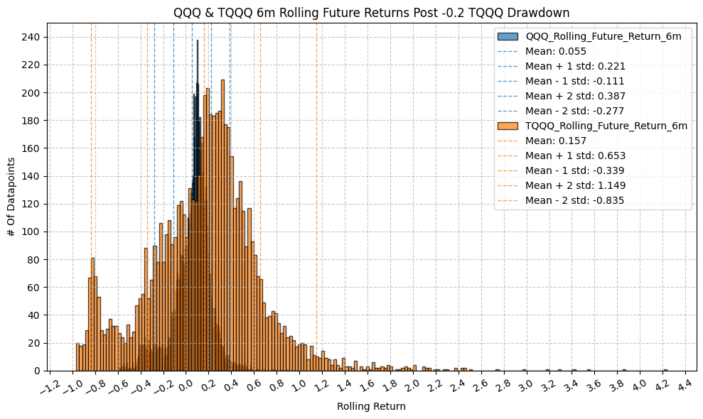
    


    
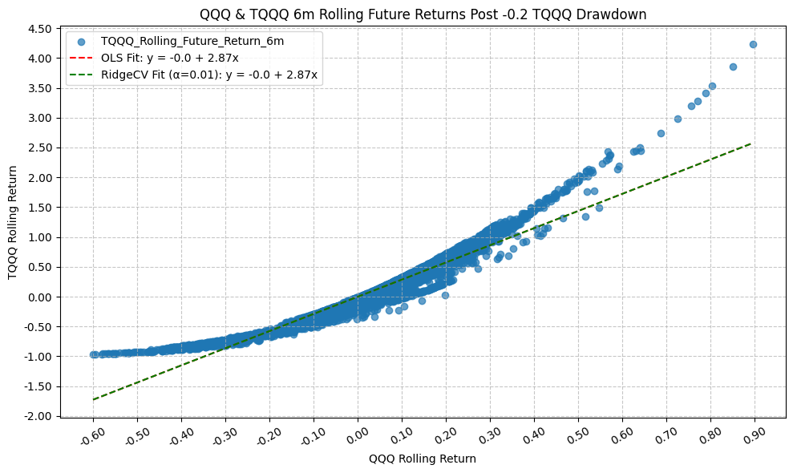
    


                                      OLS Regression Results                                 
    =========================================================================================
    Dep. Variable:     TQQQ_Rolling_Future_Return_6m   R-squared:                       0.926
    Model:                                       OLS   Adj. R-squared:                  0.926
    Method:                            Least Squares   F-statistic:                 8.102e+04
    Date:                           Mon, 16 Mar 2026   Prob (F-statistic):               0.00
    Time:                                   13:42:10   Log-Likelihood:                 3779.1
    No. Observations:                           6446   AIC:                            -7554.
    Df Residuals:                               6444   BIC:                            -7541.
    Df Model:                                      1                                         
    Covariance Type:                       nonrobust                                         
    ================================================================================================
                                       coef    std err          t      P>|t|      [0.025      0.975]
    ------------------------------------------------------------------------------------------------
    const                           -0.0015      0.002     -0.860      0.390      -0.005       0.002
    QQQ_Rolling_Future_Return_6m     2.8743      0.010    284.646      0.000       2.855       2.894
    ==============================================================================
    Omnibus:                     3183.205   Durbin-Watson:                   0.077
    Prob(Omnibus):                  0.000   Jarque-Bera (JB):            49759.451
    Skew:                           1.977   Prob(JB):                         0.00
    Kurtosis:                      16.024   Cond. No.                         6.04
    ==============================================================================
    
    Notes:
    [1] Standard Errors assume that the covariance matrix of the errors is correctly specified.


    

    


    

    


                                      OLS Regression Results                                 
    =========================================================================================
    Dep. Variable:     TQQQ_Rolling_Future_Return_1y   R-squared:                       0.898
    Model:                                       OLS   Adj. R-squared:                  0.898
    Method:                            Least Squares   F-statistic:                 5.551e+04
    Date:                           Mon, 16 Mar 2026   Prob (F-statistic):               0.00
    Time:                                   13:42:11   Log-Likelihood:                 115.86
    No. Observations:                           6320   AIC:                            -227.7
    Df Residuals:                               6318   BIC:                            -214.2
    Df Model:                                      1                                         
    Covariance Type:                       nonrobust                                         
    ================================================================================================
                                       coef    std err          t      P>|t|      [0.025      0.975]
    ------------------------------------------------------------------------------------------------
    const                            0.0227      0.003      6.836      0.000       0.016       0.029
    QQQ_Rolling_Future_Return_1y     2.8344      0.012    235.614      0.000       2.811       2.858
    ==============================================================================
    Omnibus:                     2422.820   Durbin-Watson:                   0.068
    Prob(Omnibus):                  0.000   Jarque-Bera (JB):            19442.842
    Skew:                           1.621   Prob(JB):                         0.00
    Kurtosis:                      10.958   Cond. No.                         4.09
    ==============================================================================
    
    Notes:
    [1] Standard Errors assume that the covariance matrix of the errors is correctly specified.


    
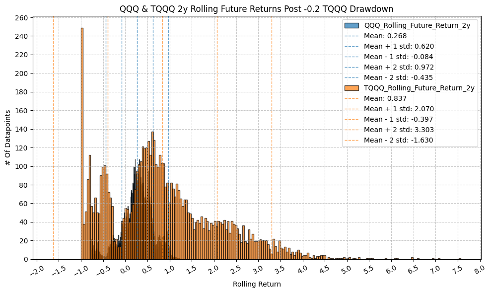
    


    

    


                                      OLS Regression Results                                 
    =========================================================================================
    Dep. Variable:     TQQQ_Rolling_Future_Return_2y   R-squared:                       0.847
    Model:                                       OLS   Adj. R-squared:                  0.847
    Method:                            Least Squares   F-statistic:                 3.365e+04
    Date:                           Mon, 16 Mar 2026   Prob (F-statistic):               0.00
    Time:                                   13:42:13   Log-Likelihood:                -4181.2
    No. Observations:                           6068   AIC:                             8366.
    Df Residuals:                               6066   BIC:                             8380.
    Df Model:                                      1                                         
    Covariance Type:                       nonrobust                                         
    ================================================================================================
                                       coef    std err          t      P>|t|      [0.025      0.975]
    ------------------------------------------------------------------------------------------------
    const                           -0.0288      0.008     -3.698      0.000      -0.044      -0.014
    QQQ_Rolling_Future_Return_2y     3.2276      0.018    183.436      0.000       3.193       3.262
    ==============================================================================
    Omnibus:                     1695.729   Durbin-Watson:                   0.019
    Prob(Omnibus):                  0.000   Jarque-Bera (JB):             4868.218
    Skew:                           1.463   Prob(JB):                         0.00
    Kurtosis:                       6.270   Cond. No.                         3.07
    ==============================================================================
    
    Notes:
    [1] Standard Errors assume that the covariance matrix of the errors is correctly specified.


    
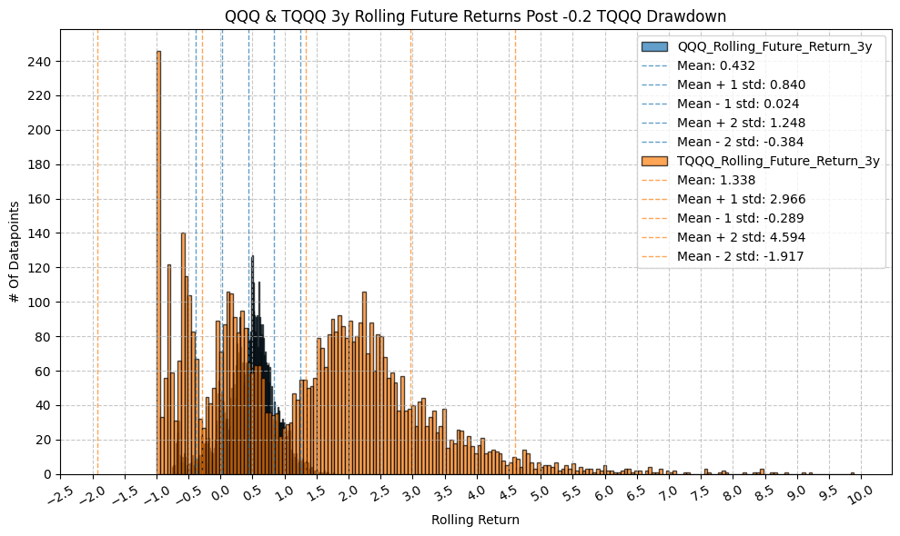
    


    

    


                                      OLS Regression Results                                 
    =========================================================================================
    Dep. Variable:     TQQQ_Rolling_Future_Return_3y   R-squared:                       0.814
    Model:                                       OLS   Adj. R-squared:                  0.814
    Method:                            Least Squares   F-statistic:                 2.547e+04
    Date:                           Mon, 16 Mar 2026   Prob (F-statistic):               0.00
    Time:                                   13:42:14   Log-Likelihood:                -6191.6
    No. Observations:                           5816   AIC:                         1.239e+04
    Df Residuals:                               5814   BIC:                         1.240e+04
    Df Model:                                      1                                         
    Covariance Type:                       nonrobust                                         
    ================================================================================================
                                       coef    std err          t      P>|t|      [0.025      0.975]
    ------------------------------------------------------------------------------------------------
    const                           -0.2170      0.013    -16.189      0.000      -0.243      -0.191
    QQQ_Rolling_Future_Return_3y     3.6008      0.023    159.606      0.000       3.557       3.645
    ==============================================================================
    Omnibus:                      874.268   Durbin-Watson:                   0.015
    Prob(Omnibus):                  0.000   Jarque-Bera (JB):             1570.330
    Skew:                           0.966   Prob(JB):                         0.00
    Kurtosis:                       4.657   Cond. No.                         2.98
    ==============================================================================
    
    Notes:
    [1] Standard Errors assume that the covariance matrix of the errors is correctly specified.


    

    


    

    


                                      OLS Regression Results                                 
    =========================================================================================
    Dep. Variable:     TQQQ_Rolling_Future_Return_4y   R-squared:                       0.784
    Model:                                       OLS   Adj. R-squared:                  0.784
    Method:                            Least Squares   F-statistic:                 2.024e+04
    Date:                           Mon, 16 Mar 2026   Prob (F-statistic):               0.00
    Time:                                   13:42:15   Log-Likelihood:                -8333.7
    No. Observations:                           5564   AIC:                         1.667e+04
    Df Residuals:                               5562   BIC:                         1.668e+04
    Df Model:                                      1                                         
    Covariance Type:                       nonrobust                                         
    ================================================================================================
                                       coef    std err          t      P>|t|      [0.025      0.975]
    ------------------------------------------------------------------------------------------------
    const                           -0.5059      0.023    -21.736      0.000      -0.552      -0.460
    QQQ_Rolling_Future_Return_4y     4.1927      0.029    142.267      0.000       4.135       4.250
    ==============================================================================
    Omnibus:                       89.406   Durbin-Watson:                   0.010
    Prob(Omnibus):                  0.000   Jarque-Bera (JB):               63.314
    Skew:                           0.153   Prob(JB):                     1.78e-14
    Kurtosis:                       2.576   Cond. No.                         2.96
    ==============================================================================
    
    Notes:
    [1] Standard Errors assume that the covariance matrix of the errors is correctly specified.


    

    


    
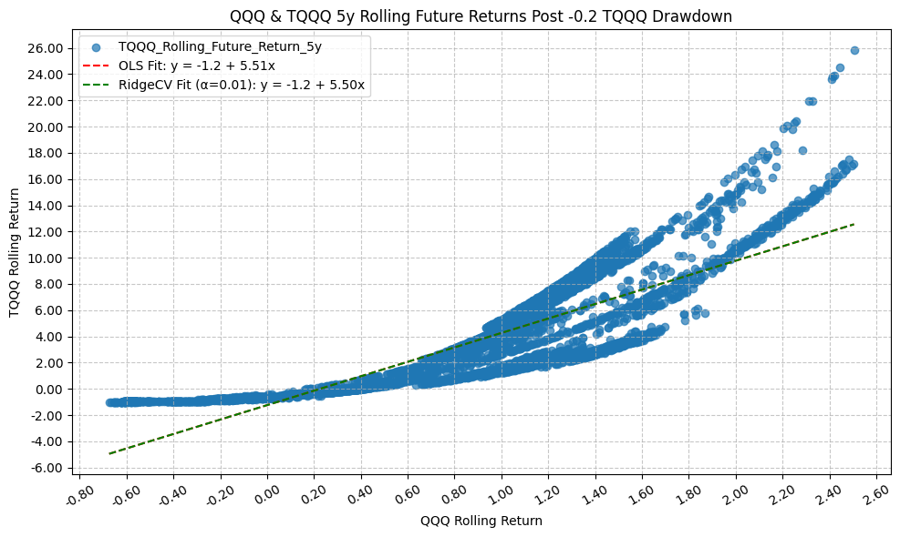
    


                                      OLS Regression Results                                 
    =========================================================================================
    Dep. Variable:     TQQQ_Rolling_Future_Return_5y   R-squared:                       0.747
    Model:                                       OLS   Adj. R-squared:                  0.747
    Method:                            Least Squares   F-statistic:                 1.566e+04
    Date:                           Mon, 16 Mar 2026   Prob (F-statistic):               0.00
    Time:                                   13:42:16   Log-Likelihood:                -11532.
    No. Observations:                           5312   AIC:                         2.307e+04
    Df Residuals:                               5310   BIC:                         2.308e+04
    Df Model:                                      1                                         
    Covariance Type:                       nonrobust                                         
    ================================================================================================
                                       coef    std err          t      P>|t|      [0.025      0.975]
    ------------------------------------------------------------------------------------------------
    const                           -1.2438      0.048    -25.759      0.000      -1.338      -1.149
    QQQ_Rolling_Future_Return_5y     5.5050      0.044    125.134      0.000       5.419       5.591
    ==============================================================================
    Omnibus:                      256.613   Durbin-Watson:                   0.009
    Prob(Omnibus):                  0.000   Jarque-Bera (JB):              381.078
    Skew:                           0.437   Prob(JB):                     1.78e-83
    Kurtosis:                       3.979   Cond. No.                         3.00
    ==============================================================================
    
    Notes:
    [1] Standard Errors assume that the covariance matrix of the errors is correctly specified.


    

    


    

    


                                      OLS Regression Results                                 
    =========================================================================================
    Dep. Variable:     TQQQ_Rolling_Future_Return_1d   R-squared:                       0.999
    Model:                                       OLS   Adj. R-squared:                  0.999
    Method:                            Least Squares   F-statistic:                 6.433e+06
    Date:                           Mon, 16 Mar 2026   Prob (F-statistic):               0.00
    Time:                                   13:42:17   Log-Likelihood:                 32894.
    No. Observations:                           6531   AIC:                        -6.578e+04
    Df Residuals:                               6529   BIC:                        -6.577e+04
    Df Model:                                      1                                         
    Covariance Type:                       nonrobust                                         
    ================================================================================================
                                       coef    std err          t      P>|t|      [0.025      0.975]
    ------------------------------------------------------------------------------------------------
    const                        -5.296e-05   1.95e-05     -2.721      0.007   -9.11e-05   -1.48e-05
    QQQ_Rolling_Future_Return_1d     2.9551      0.001   2536.404      0.000       2.953       2.957
    ==============================================================================
    Omnibus:                     9694.083   Durbin-Watson:                   2.565
    Prob(Omnibus):                  0.000   Jarque-Bera (JB):         38964571.195
    Skew:                          -8.113   Prob(JB):                         0.00
    Kurtosis:                     381.052   Cond. No.                         59.9
    ==============================================================================
    
    Notes:
    [1] Standard Errors assume that the covariance matrix of the errors is correctly specified.


    

    


    

    


                                      OLS Regression Results                                 
    =========================================================================================
    Dep. Variable:     TQQQ_Rolling_Future_Return_1w   R-squared:                       0.994
    Model:                                       OLS   Adj. R-squared:                  0.994
    Method:                            Least Squares   F-statistic:                 1.119e+06
    Date:                           Mon, 16 Mar 2026   Prob (F-statistic):               0.00
    Time:                                   13:42:18   Log-Likelihood:                 22520.
    No. Observations:                           6527   AIC:                        -4.504e+04
    Df Residuals:                               6525   BIC:                        -4.502e+04
    Df Model:                                      1                                         
    Covariance Type:                       nonrobust                                         
    ================================================================================================
                                       coef    std err          t      P>|t|      [0.025      0.975]
    ------------------------------------------------------------------------------------------------
    const                           -0.0008   9.53e-05     -8.333      0.000      -0.001      -0.001
    QQQ_Rolling_Future_Return_1w     2.9552      0.003   1057.792      0.000       2.950       2.961
    ==============================================================================
    Omnibus:                     3463.566   Durbin-Watson:                   0.902
    Prob(Omnibus):                  0.000   Jarque-Bera (JB):           388402.497
    Skew:                          -1.580   Prob(JB):                         0.00
    Kurtosis:                      40.659   Cond. No.                         29.4
    ==============================================================================
    
    Notes:
    [1] Standard Errors assume that the covariance matrix of the errors is correctly specified.


    

    


    

    


                                      OLS Regression Results                                 
    =========================================================================================
    Dep. Variable:     TQQQ_Rolling_Future_Return_1m   R-squared:                       0.983
    Model:                                       OLS   Adj. R-squared:                  0.983
    Method:                            Least Squares   F-statistic:                 3.675e+05
    Date:                           Mon, 16 Mar 2026   Prob (F-statistic):               0.00
    Time:                                   13:42:19   Log-Likelihood:                 14623.
    No. Observations:                           6511   AIC:                        -2.924e+04
    Df Residuals:                               6509   BIC:                        -2.923e+04
    Df Model:                                      1                                         
    Covariance Type:                       nonrobust                                         
    ================================================================================================
                                       coef    std err          t      P>|t|      [0.025      0.975]
    ------------------------------------------------------------------------------------------------
    const                           -0.0035      0.000    -11.033      0.000      -0.004      -0.003
    QQQ_Rolling_Future_Return_1m     2.9176      0.005    606.191      0.000       2.908       2.927
    ==============================================================================
    Omnibus:                     1511.925   Durbin-Watson:                   0.308
    Prob(Omnibus):                  0.000   Jarque-Bera (JB):            81855.191
    Skew:                           0.083   Prob(JB):                         0.00
    Kurtosis:                      20.369   Cond. No.                         15.2
    ==============================================================================
    
    Notes:
    [1] Standard Errors assume that the covariance matrix of the errors is correctly specified.


    

    


    

    


                                      OLS Regression Results                                 
    =========================================================================================
    Dep. Variable:     TQQQ_Rolling_Future_Return_3m   R-squared:                       0.961
    Model:                                       OLS   Adj. R-squared:                  0.961
    Method:                            Least Squares   F-statistic:                 1.585e+05
    Date:                           Mon, 16 Mar 2026   Prob (F-statistic):               0.00
    Time:                                   13:42:21   Log-Likelihood:                 8457.5
    No. Observations:                           6469   AIC:                        -1.691e+04
    Df Residuals:                               6467   BIC:                        -1.690e+04
    Df Model:                                      1                                         
    Covariance Type:                       nonrobust                                         
    ================================================================================================
                                       coef    std err          t      P>|t|      [0.025      0.975]
    ------------------------------------------------------------------------------------------------
    const                           -0.0067      0.001     -8.040      0.000      -0.008      -0.005
    QQQ_Rolling_Future_Return_3m     2.8943      0.007    398.066      0.000       2.880       2.909
    ==============================================================================
    Omnibus:                     1346.125   Durbin-Watson:                   0.103
    Prob(Omnibus):                  0.000   Jarque-Bera (JB):            15267.066
    Skew:                           0.666   Prob(JB):                         0.00
    Kurtosis:                      10.407   Cond. No.                         8.94
    ==============================================================================
    
    Notes:
    [1] Standard Errors assume that the covariance matrix of the errors is correctly specified.


    

    


    

    


                                      OLS Regression Results                                 
    =========================================================================================
    Dep. Variable:     TQQQ_Rolling_Future_Return_6m   R-squared:                       0.929
    Model:                                       OLS   Adj. R-squared:                  0.929
    Method:                            Least Squares   F-statistic:                 8.378e+04
    Date:                           Mon, 16 Mar 2026   Prob (F-statistic):               0.00
    Time:                                   13:42:22   Log-Likelihood:                 4128.3
    No. Observations:                           6406   AIC:                            -8253.
    Df Residuals:                               6404   BIC:                            -8239.
    Df Model:                                      1                                         
    Covariance Type:                       nonrobust                                         
    ================================================================================================
                                       coef    std err          t      P>|t|      [0.025      0.975]
    ------------------------------------------------------------------------------------------------
    const                           -0.0006      0.002     -0.337      0.736      -0.004       0.003
    QQQ_Rolling_Future_Return_6m     2.8222      0.010    289.447      0.000       2.803       2.841
    ==============================================================================
    Omnibus:                     2682.468   Durbin-Watson:                   0.109
    Prob(Omnibus):                  0.000   Jarque-Bera (JB):            36485.982
    Skew:                           1.629   Prob(JB):                         0.00
    Kurtosis:                      14.228   Cond. No.                         6.16
    ==============================================================================
    
    Notes:
    [1] Standard Errors assume that the covariance matrix of the errors is correctly specified.


    

    


    
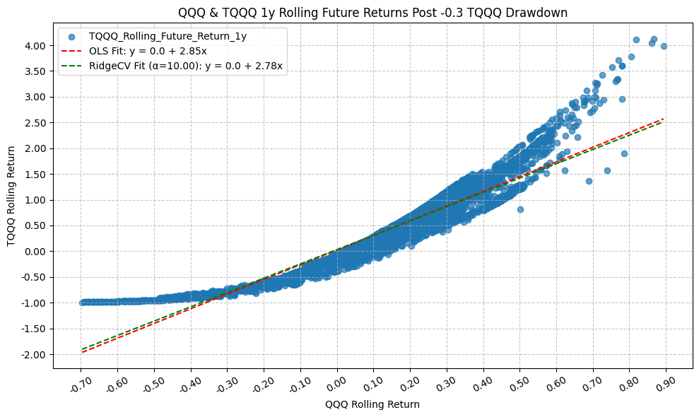
    


                                      OLS Regression Results                                 
    =========================================================================================
    Dep. Variable:     TQQQ_Rolling_Future_Return_1y   R-squared:                       0.902
    Model:                                       OLS   Adj. R-squared:                  0.902
    Method:                            Least Squares   F-statistic:                 5.754e+04
    Date:                           Mon, 16 Mar 2026   Prob (F-statistic):               0.00
    Time:                                   13:42:23   Log-Likelihood:                 291.84
    No. Observations:                           6280   AIC:                            -579.7
    Df Residuals:                               6278   BIC:                            -566.2
    Df Model:                                      1                                         
    Covariance Type:                       nonrobust                                         
    ================================================================================================
                                       coef    std err          t      P>|t|      [0.025      0.975]
    ------------------------------------------------------------------------------------------------
    const                            0.0224      0.003      6.919      0.000       0.016       0.029
    QQQ_Rolling_Future_Return_1y     2.8516      0.012    239.879      0.000       2.828       2.875
    ==============================================================================
    Omnibus:                     1986.661   Durbin-Watson:                   0.043
    Prob(Omnibus):                  0.000   Jarque-Bera (JB):             8583.652
    Skew:                           1.493   Prob(JB):                         0.00
    Kurtosis:                       7.887   Cond. No.                         4.14
    ==============================================================================
    
    Notes:
    [1] Standard Errors assume that the covariance matrix of the errors is correctly specified.


    

    


    

    


                                      OLS Regression Results                                 
    =========================================================================================
    Dep. Variable:     TQQQ_Rolling_Future_Return_2y   R-squared:                       0.847
    Model:                                       OLS   Adj. R-squared:                  0.847
    Method:                            Least Squares   F-statistic:                 3.331e+04
    Date:                           Mon, 16 Mar 2026   Prob (F-statistic):               0.00
    Time:                                   13:42:24   Log-Likelihood:                -4141.4
    No. Observations:                           6028   AIC:                             8287.
    Df Residuals:                               6026   BIC:                             8300.
    Df Model:                                      1                                         
    Covariance Type:                       nonrobust                                         
    ================================================================================================
                                       coef    std err          t      P>|t|      [0.025      0.975]
    ------------------------------------------------------------------------------------------------
    const                           -0.0317      0.008     -4.039      0.000      -0.047      -0.016
    QQQ_Rolling_Future_Return_2y     3.2366      0.018    182.524      0.000       3.202       3.271
    ==============================================================================
    Omnibus:                     1703.262   Durbin-Watson:                   0.019
    Prob(Omnibus):                  0.000   Jarque-Bera (JB):             4959.569
    Skew:                           1.473   Prob(JB):                         0.00
    Kurtosis:                       6.326   Cond. No.                         3.10
    ==============================================================================
    
    Notes:
    [1] Standard Errors assume that the covariance matrix of the errors is correctly specified.


    

    


    

    


                                      OLS Regression Results                                 
    =========================================================================================
    Dep. Variable:     TQQQ_Rolling_Future_Return_3y   R-squared:                       0.816
    Model:                                       OLS   Adj. R-squared:                  0.816
    Method:                            Least Squares   F-statistic:                 2.566e+04
    Date:                           Mon, 16 Mar 2026   Prob (F-statistic):               0.00
    Time:                                   13:42:25   Log-Likelihood:                -6094.3
    No. Observations:                           5776   AIC:                         1.219e+04
    Df Residuals:                               5774   BIC:                         1.221e+04
    Df Model:                                      1                                         
    Covariance Type:                       nonrobust                                         
    ================================================================================================
                                       coef    std err          t      P>|t|      [0.025      0.975]
    ------------------------------------------------------------------------------------------------
    const                           -0.2502      0.014    -18.446      0.000      -0.277      -0.224
    QQQ_Rolling_Future_Return_3y     3.6568      0.023    160.193      0.000       3.612       3.702
    ==============================================================================
    Omnibus:                      876.215   Durbin-Watson:                   0.015
    Prob(Omnibus):                  0.000   Jarque-Bera (JB):             1596.509
    Skew:                           0.967   Prob(JB):                         0.00
    Kurtosis:                       4.700   Cond. No.                         3.05
    ==============================================================================
    
    Notes:
    [1] Standard Errors assume that the covariance matrix of the errors is correctly specified.


    
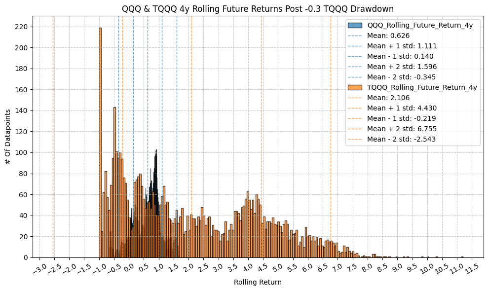
    


    

    


                                      OLS Regression Results                                 
    =========================================================================================
    Dep. Variable:     TQQQ_Rolling_Future_Return_4y   R-squared:                       0.785
    Model:                                       OLS   Adj. R-squared:                  0.785
    Method:                            Least Squares   F-statistic:                 2.017e+04
    Date:                           Mon, 16 Mar 2026   Prob (F-statistic):               0.00
    Time:                                   13:42:27   Log-Likelihood:                -8250.6
    No. Observations:                           5524   AIC:                         1.651e+04
    Df Residuals:                               5522   BIC:                         1.652e+04
    Df Model:                                      1                                         
    Covariance Type:                       nonrobust                                         
    ================================================================================================
                                       coef    std err          t      P>|t|      [0.025      0.975]
    ------------------------------------------------------------------------------------------------
    const                           -0.5497      0.024    -23.230      0.000      -0.596      -0.503
    QQQ_Rolling_Future_Return_4y     4.2450      0.030    142.023      0.000       4.186       4.304
    ==============================================================================
    Omnibus:                       72.624   Durbin-Watson:                   0.010
    Prob(Omnibus):                  0.000   Jarque-Bera (JB):               55.217
    Skew:                           0.155   Prob(JB):                     1.02e-12
    Kurtosis:                       2.620   Cond. No.                         3.02
    ==============================================================================
    
    Notes:
    [1] Standard Errors assume that the covariance matrix of the errors is correctly specified.


    
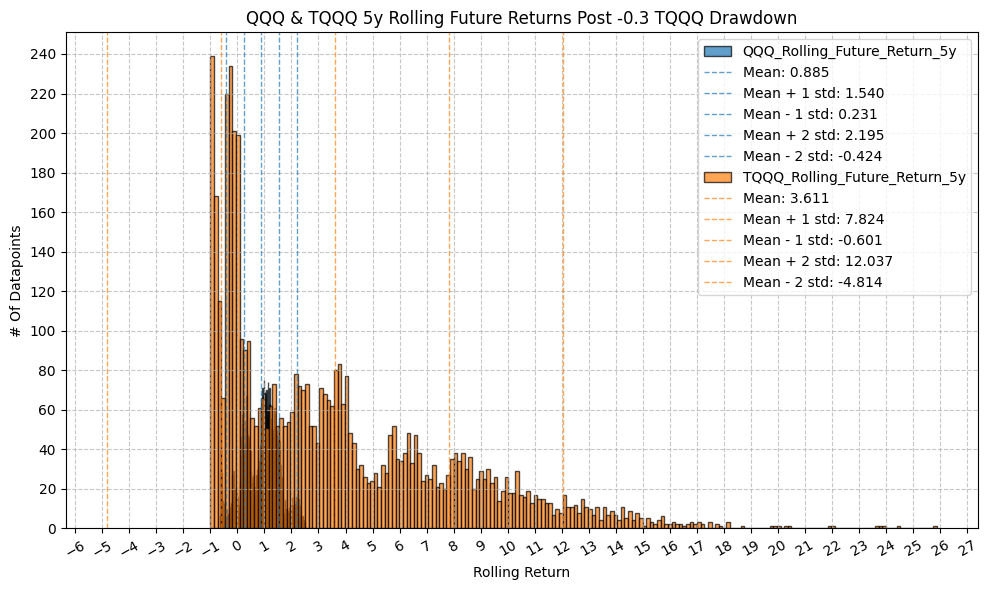
    


    

    


                                      OLS Regression Results                                 
    =========================================================================================
    Dep. Variable:     TQQQ_Rolling_Future_Return_5y   R-squared:                       0.748
    Model:                                       OLS   Adj. R-squared:                  0.747
    Method:                            Least Squares   F-statistic:                 1.560e+04
    Date:                           Mon, 16 Mar 2026   Prob (F-statistic):               0.00
    Time:                                   13:42:28   Log-Likelihood:                -11434.
    No. Observations:                           5272   AIC:                         2.287e+04
    Df Residuals:                               5270   BIC:                         2.288e+04
    Df Model:                                      1                                         
    Covariance Type:                       nonrobust                                         
    ================================================================================================
                                       coef    std err          t      P>|t|      [0.025      0.975]
    ------------------------------------------------------------------------------------------------
    const                           -1.3156      0.049    -26.822      0.000      -1.412      -1.219
    QQQ_Rolling_Future_Return_5y     5.5645      0.045    124.913      0.000       5.477       5.652
    ==============================================================================
    Omnibus:                      246.317   Durbin-Watson:                   0.009
    Prob(Omnibus):                  0.000   Jarque-Bera (JB):              368.513
    Skew:                           0.424   Prob(JB):                     9.51e-81
    Kurtosis:                       3.980   Cond. No.                         3.05
    ==============================================================================
    
    Notes:
    [1] Standard Errors assume that the covariance matrix of the errors is correctly specified.


    

    


    

    


                                      OLS Regression Results                                 
    =========================================================================================
    Dep. Variable:     TQQQ_Rolling_Future_Return_1d   R-squared:                       0.999
    Model:                                       OLS   Adj. R-squared:                  0.999
    Method:                            Least Squares   F-statistic:                 6.385e+06
    Date:                           Mon, 16 Mar 2026   Prob (F-statistic):               0.00
    Time:                                   13:42:29   Log-Likelihood:                 32833.
    No. Observations:                           6520   AIC:                        -6.566e+04
    Df Residuals:                               6518   BIC:                        -6.565e+04
    Df Model:                                      1                                         
    Covariance Type:                       nonrobust                                         
    ================================================================================================
                                       coef    std err          t      P>|t|      [0.025      0.975]
    ------------------------------------------------------------------------------------------------
    const                        -5.305e-05   1.95e-05     -2.721      0.007   -9.13e-05   -1.48e-05
    QQQ_Rolling_Future_Return_1d     2.9551      0.001   2526.915      0.000       2.953       2.957
    ==============================================================================
    Omnibus:                     9673.351   Durbin-Watson:                   2.565
    Prob(Omnibus):                  0.000   Jarque-Bera (JB):         38764591.768
    Skew:                          -8.106   Prob(JB):                         0.00
    Kurtosis:                     380.398   Cond. No.                         60.0
    ==============================================================================
    
    Notes:
    [1] Standard Errors assume that the covariance matrix of the errors is correctly specified.


    

    


    

    


                                      OLS Regression Results                                 
    =========================================================================================
    Dep. Variable:     TQQQ_Rolling_Future_Return_1w   R-squared:                       0.994
    Model:                                       OLS   Adj. R-squared:                  0.994
    Method:                            Least Squares   F-statistic:                 1.118e+06
    Date:                           Mon, 16 Mar 2026   Prob (F-statistic):               0.00
    Time:                                   13:42:30   Log-Likelihood:                 22527.
    No. Observations:                           6516   AIC:                        -4.505e+04
    Df Residuals:                               6514   BIC:                        -4.504e+04
    Df Model:                                      1                                         
    Covariance Type:                       nonrobust                                         
    ================================================================================================
                                       coef    std err          t      P>|t|      [0.025      0.975]
    ------------------------------------------------------------------------------------------------
    const                           -0.0008   9.47e-05     -8.566      0.000      -0.001      -0.001
    QQQ_Rolling_Future_Return_1w     2.9535      0.003   1057.421      0.000       2.948       2.959
    ==============================================================================
    Omnibus:                     3593.998   Durbin-Watson:                   0.881
    Prob(Omnibus):                  0.000   Jarque-Bera (JB):           403875.873
    Skew:                          -1.687   Prob(JB):                         0.00
    Kurtosis:                      41.421   Cond. No.                         29.6
    ==============================================================================
    
    Notes:
    [1] Standard Errors assume that the covariance matrix of the errors is correctly specified.


    

    


    

    


                                      OLS Regression Results                                 
    =========================================================================================
    Dep. Variable:     TQQQ_Rolling_Future_Return_1m   R-squared:                       0.983
    Model:                                       OLS   Adj. R-squared:                  0.983
    Method:                            Least Squares   F-statistic:                 3.661e+05
    Date:                           Mon, 16 Mar 2026   Prob (F-statistic):               0.00
    Time:                                   13:42:31   Log-Likelihood:                 14619.
    No. Observations:                           6500   AIC:                        -2.923e+04
    Df Residuals:                               6498   BIC:                        -2.922e+04
    Df Model:                                      1                                         
    Covariance Type:                       nonrobust                                         
    ================================================================================================
                                       coef    std err          t      P>|t|      [0.025      0.975]
    ------------------------------------------------------------------------------------------------
    const                           -0.0035      0.000    -11.021      0.000      -0.004      -0.003
    QQQ_Rolling_Future_Return_1m     2.9150      0.005    605.092      0.000       2.906       2.924
    ==============================================================================
    Omnibus:                     1510.573   Durbin-Watson:                   0.297
    Prob(Omnibus):                  0.000   Jarque-Bera (JB):            82826.988
    Skew:                           0.062   Prob(JB):                         0.00
    Kurtosis:                      20.487   Cond. No.                         15.2
    ==============================================================================
    
    Notes:
    [1] Standard Errors assume that the covariance matrix of the errors is correctly specified.


    

    


    

    


                                      OLS Regression Results                                 
    =========================================================================================
    Dep. Variable:     TQQQ_Rolling_Future_Return_3m   R-squared:                       0.961
    Model:                                       OLS   Adj. R-squared:                  0.961
    Method:                            Least Squares   F-statistic:                 1.591e+05
    Date:                           Mon, 16 Mar 2026   Prob (F-statistic):               0.00
    Time:                                   13:42:32   Log-Likelihood:                 8471.5
    No. Observations:                           6458   AIC:                        -1.694e+04
    Df Residuals:                               6456   BIC:                        -1.693e+04
    Df Model:                                      1                                         
    Covariance Type:                       nonrobust                                         
    ================================================================================================
                                       coef    std err          t      P>|t|      [0.025      0.975]
    ------------------------------------------------------------------------------------------------
    const                           -0.0065      0.001     -7.870      0.000      -0.008      -0.005
    QQQ_Rolling_Future_Return_3m     2.8924      0.007    398.870      0.000       2.878       2.907
    ==============================================================================
    Omnibus:                     1376.418   Durbin-Watson:                   0.101
    Prob(Omnibus):                  0.000   Jarque-Bera (JB):            15591.855
    Skew:                           0.692   Prob(JB):                         0.00
    Kurtosis:                      10.485   Cond. No.                         8.95
    ==============================================================================
    
    Notes:
    [1] Standard Errors assume that the covariance matrix of the errors is correctly specified.


    

    


    

    


                                      OLS Regression Results                                 
    =========================================================================================
    Dep. Variable:     TQQQ_Rolling_Future_Return_6m   R-squared:                       0.931
    Model:                                       OLS   Adj. R-squared:                  0.931
    Method:                            Least Squares   F-statistic:                 8.656e+04
    Date:                           Mon, 16 Mar 2026   Prob (F-statistic):               0.00
    Time:                                   13:42:34   Log-Likelihood:                 4305.0
    No. Observations:                           6395   AIC:                            -8606.
    Df Residuals:                               6393   BIC:                            -8593.
    Df Model:                                      1                                         
    Covariance Type:                       nonrobust                                         
    ================================================================================================
                                       coef    std err          t      P>|t|      [0.025      0.975]
    ------------------------------------------------------------------------------------------------
    const                        -4.855e-06      0.002     -0.003      0.998      -0.003       0.003
    QQQ_Rolling_Future_Return_6m     2.8036      0.010    294.207      0.000       2.785       2.822
    ==============================================================================
    Omnibus:                     1637.994   Durbin-Watson:                   0.057
    Prob(Omnibus):                  0.000   Jarque-Bera (JB):             8138.991
    Skew:                           1.146   Prob(JB):                         0.00
    Kurtosis:                       8.029   Cond. No.                         6.19
    ==============================================================================
    
    Notes:
    [1] Standard Errors assume that the covariance matrix of the errors is correctly specified.


    

    


    

    


                                      OLS Regression Results                                 
    =========================================================================================
    Dep. Variable:     TQQQ_Rolling_Future_Return_1y   R-squared:                       0.902
    Model:                                       OLS   Adj. R-squared:                  0.902
    Method:                            Least Squares   F-statistic:                 5.795e+04
    Date:                           Mon, 16 Mar 2026   Prob (F-statistic):               0.00
    Time:                                   13:42:35   Log-Likelihood:                 326.09
    No. Observations:                           6269   AIC:                            -648.2
    Df Residuals:                               6267   BIC:                            -634.7
    Df Model:                                      1                                         
    Covariance Type:                       nonrobust                                         
    ================================================================================================
                                       coef    std err          t      P>|t|      [0.025      0.975]
    ------------------------------------------------------------------------------------------------
    const                            0.0211      0.003      6.535      0.000       0.015       0.027
    QQQ_Rolling_Future_Return_1y     2.8618      0.012    240.727      0.000       2.838       2.885
    ==============================================================================
    Omnibus:                     1984.175   Durbin-Watson:                   0.039
    Prob(Omnibus):                  0.000   Jarque-Bera (JB):             8573.296
    Skew:                           1.494   Prob(JB):                         0.00
    Kurtosis:                       7.888   Cond. No.                         4.16
    ==============================================================================
    
    Notes:
    [1] Standard Errors assume that the covariance matrix of the errors is correctly specified.


    

    


    

    


                                      OLS Regression Results                                 
    =========================================================================================
    Dep. Variable:     TQQQ_Rolling_Future_Return_2y   R-squared:                       0.847
    Model:                                       OLS   Adj. R-squared:                  0.847
    Method:                            Least Squares   F-statistic:                 3.333e+04
    Date:                           Mon, 16 Mar 2026   Prob (F-statistic):               0.00
    Time:                                   13:42:36   Log-Likelihood:                -4121.6
    No. Observations:                           6017   AIC:                             8247.
    Df Residuals:                               6015   BIC:                             8261.
    Df Model:                                      1                                         
    Covariance Type:                       nonrobust                                         
    ================================================================================================
                                       coef    std err          t      P>|t|      [0.025      0.975]
    ------------------------------------------------------------------------------------------------
    const                           -0.0345      0.008     -4.386      0.000      -0.050      -0.019
    QQQ_Rolling_Future_Return_2y     3.2439      0.018    182.575      0.000       3.209       3.279
    ==============================================================================
    Omnibus:                     1712.301   Durbin-Watson:                   0.019
    Prob(Omnibus):                  0.000   Jarque-Bera (JB):             5037.509
    Skew:                           1.480   Prob(JB):                         0.00
    Kurtosis:                       6.367   Cond. No.                         3.11
    ==============================================================================
    
    Notes:
    [1] Standard Errors assume that the covariance matrix of the errors is correctly specified.


    
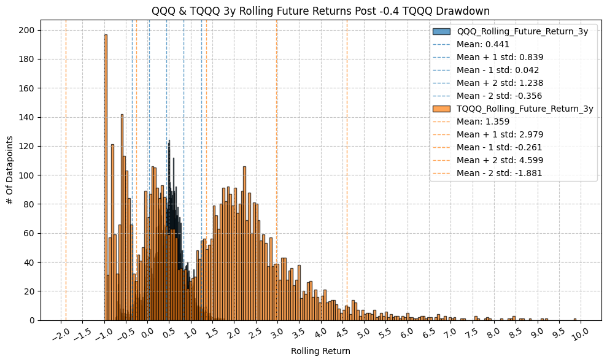
    


    

    


                                      OLS Regression Results                                 
    =========================================================================================
    Dep. Variable:     TQQQ_Rolling_Future_Return_3y   R-squared:                       0.817
    Model:                                       OLS   Adj. R-squared:                  0.817
    Method:                            Least Squares   F-statistic:                 2.581e+04
    Date:                           Mon, 16 Mar 2026   Prob (F-statistic):               0.00
    Time:                                   13:42:37   Log-Likelihood:                -6058.9
    No. Observations:                           5765   AIC:                         1.212e+04
    Df Residuals:                               5763   BIC:                         1.214e+04
    Df Model:                                      1                                         
    Covariance Type:                       nonrobust                                         
    ================================================================================================
                                       coef    std err          t      P>|t|      [0.025      0.975]
    ------------------------------------------------------------------------------------------------
    const                           -0.2618      0.014    -19.253      0.000      -0.288      -0.235
    QQQ_Rolling_Future_Return_3y     3.6767      0.023    160.644      0.000       3.632       3.722
    ==============================================================================
    Omnibus:                      869.452   Durbin-Watson:                   0.015
    Prob(Omnibus):                  0.000   Jarque-Bera (JB):             1585.916
    Skew:                           0.962   Prob(JB):                         0.00
    Kurtosis:                       4.703   Cond. No.                         3.07
    ==============================================================================
    
    Notes:
    [1] Standard Errors assume that the covariance matrix of the errors is correctly specified.


    
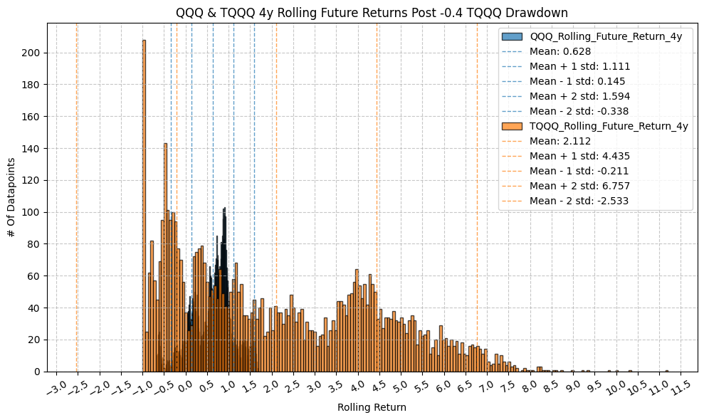
    


    

    


                                      OLS Regression Results                                 
    =========================================================================================
    Dep. Variable:     TQQQ_Rolling_Future_Return_4y   R-squared:                       0.786
    Model:                                       OLS   Adj. R-squared:                  0.786
    Method:                            Least Squares   F-statistic:                 2.019e+04
    Date:                           Mon, 16 Mar 2026   Prob (F-statistic):               0.00
    Time:                                   13:42:38   Log-Likelihood:                -8223.4
    No. Observations:                           5513   AIC:                         1.645e+04
    Df Residuals:                               5511   BIC:                         1.646e+04
    Df Model:                                      1                                         
    Covariance Type:                       nonrobust                                         
    ================================================================================================
                                       coef    std err          t      P>|t|      [0.025      0.975]
    ------------------------------------------------------------------------------------------------
    const                           -0.5646      0.024    -23.758      0.000      -0.611      -0.518
    QQQ_Rolling_Future_Return_4y     4.2630      0.030    142.094      0.000       4.204       4.322
    ==============================================================================
    Omnibus:                       67.431   Durbin-Watson:                   0.010
    Prob(Omnibus):                  0.000   Jarque-Bera (JB):               52.172
    Skew:                           0.153   Prob(JB):                     4.69e-12
    Kurtosis:                       2.634   Cond. No.                         3.04
    ==============================================================================
    
    Notes:
    [1] Standard Errors assume that the covariance matrix of the errors is correctly specified.


    

    


    

    


                                      OLS Regression Results                                 
    =========================================================================================
    Dep. Variable:     TQQQ_Rolling_Future_Return_5y   R-squared:                       0.748
    Model:                                       OLS   Adj. R-squared:                  0.748
    Method:                            Least Squares   F-statistic:                 1.562e+04
    Date:                           Mon, 16 Mar 2026   Prob (F-statistic):               0.00
    Time:                                   13:42:39   Log-Likelihood:                -11403.
    No. Observations:                           5261   AIC:                         2.281e+04
    Df Residuals:                               5259   BIC:                         2.282e+04
    Df Model:                                      1                                         
    Covariance Type:                       nonrobust                                         
    ================================================================================================
                                       coef    std err          t      P>|t|      [0.025      0.975]
    ------------------------------------------------------------------------------------------------
    const                           -1.3405      0.049    -27.216      0.000      -1.437      -1.244
    QQQ_Rolling_Future_Return_5y     5.5855      0.045    124.962      0.000       5.498       5.673
    ==============================================================================
    Omnibus:                      241.818   Durbin-Watson:                   0.009
    Prob(Omnibus):                  0.000   Jarque-Bera (JB):              363.534
    Skew:                           0.417   Prob(JB):                     1.15e-79
    Kurtosis:                       3.981   Cond. No.                         3.07
    ==============================================================================
    
    Notes:
    [1] Standard Errors assume that the covariance matrix of the errors is correctly specified.


    

    


    

    


                                      OLS Regression Results                                 
    =========================================================================================
    Dep. Variable:     TQQQ_Rolling_Future_Return_1d   R-squared:                       0.999
    Model:                                       OLS   Adj. R-squared:                  0.999
    Method:                            Least Squares   F-statistic:                 6.255e+06
    Date:                           Mon, 16 Mar 2026   Prob (F-statistic):               0.00
    Time:                                   13:42:40   Log-Likelihood:                 32495.
    No. Observations:                           6457   AIC:                        -6.499e+04
    Df Residuals:                               6455   BIC:                        -6.497e+04
    Df Model:                                      1                                         
    Covariance Type:                       nonrobust                                         
    ================================================================================================
                                       coef    std err          t      P>|t|      [0.025      0.975]
    ------------------------------------------------------------------------------------------------
    const                        -4.913e-05   1.97e-05     -2.500      0.012   -8.77e-05   -1.06e-05
    QQQ_Rolling_Future_Return_1d     2.9549      0.001   2501.003      0.000       2.953       2.957
    ==============================================================================
    Omnibus:                     9580.111   Durbin-Watson:                   2.567
    Prob(Omnibus):                  0.000   Jarque-Bera (JB):         38114515.631
    Skew:                          -8.108   Prob(JB):                         0.00
    Kurtosis:                     379.038   Cond. No.                         60.1
    ==============================================================================
    
    Notes:
    [1] Standard Errors assume that the covariance matrix of the errors is correctly specified.


    

    


    

    


                                      OLS Regression Results                                 
    =========================================================================================
    Dep. Variable:     TQQQ_Rolling_Future_Return_1w   R-squared:                       0.994
    Model:                                       OLS   Adj. R-squared:                  0.994
    Method:                            Least Squares   F-statistic:                 1.109e+06
    Date:                           Mon, 16 Mar 2026   Prob (F-statistic):               0.00
    Time:                                   13:42:41   Log-Likelihood:                 22311.
    No. Observations:                           6453   AIC:                        -4.462e+04
    Df Residuals:                               6451   BIC:                        -4.461e+04
    Df Model:                                      1                                         
    Covariance Type:                       nonrobust                                         
    ================================================================================================
                                       coef    std err          t      P>|t|      [0.025      0.975]
    ------------------------------------------------------------------------------------------------
    const                           -0.0008   9.51e-05     -8.169      0.000      -0.001      -0.001
    QQQ_Rolling_Future_Return_1w     2.9529      0.003   1053.321      0.000       2.947       2.958
    ==============================================================================
    Omnibus:                     3540.518   Durbin-Watson:                   0.887
    Prob(Omnibus):                  0.000   Jarque-Bera (JB):           402393.065
    Skew:                          -1.669   Prob(JB):                         0.00
    Kurtosis:                      41.541   Cond. No.                         29.5
    ==============================================================================
    
    Notes:
    [1] Standard Errors assume that the covariance matrix of the errors is correctly specified.


    

    


    

    


                                      OLS Regression Results                                 
    =========================================================================================
    Dep. Variable:     TQQQ_Rolling_Future_Return_1m   R-squared:                       0.983
    Model:                                       OLS   Adj. R-squared:                  0.983
    Method:                            Least Squares   F-statistic:                 3.615e+05
    Date:                           Mon, 16 Mar 2026   Prob (F-statistic):               0.00
    Time:                                   13:42:43   Log-Likelihood:                 14455.
    No. Observations:                           6437   AIC:                        -2.891e+04
    Df Residuals:                               6435   BIC:                        -2.889e+04
    Df Model:                                      1                                         
    Covariance Type:                       nonrobust                                         
    ================================================================================================
                                       coef    std err          t      P>|t|      [0.025      0.975]
    ------------------------------------------------------------------------------------------------
    const                           -0.0034      0.000    -10.594      0.000      -0.004      -0.003
    QQQ_Rolling_Future_Return_1m     2.9144      0.005    601.219      0.000       2.905       2.924
    ==============================================================================
    Omnibus:                     1490.690   Durbin-Watson:                   0.295
    Prob(Omnibus):                  0.000   Jarque-Bera (JB):            81043.655
    Skew:                           0.049   Prob(JB):                         0.00
    Kurtosis:                      20.383   Cond. No.                         15.2
    ==============================================================================
    
    Notes:
    [1] Standard Errors assume that the covariance matrix of the errors is correctly specified.


    

    


    

    


                                      OLS Regression Results                                 
    =========================================================================================
    Dep. Variable:     TQQQ_Rolling_Future_Return_3m   R-squared:                       0.961
    Model:                                       OLS   Adj. R-squared:                  0.961
    Method:                            Least Squares   F-statistic:                 1.589e+05
    Date:                           Mon, 16 Mar 2026   Prob (F-statistic):               0.00
    Time:                                   13:42:44   Log-Likelihood:                 8428.1
    No. Observations:                           6424   AIC:                        -1.685e+04
    Df Residuals:                               6422   BIC:                        -1.684e+04
    Df Model:                                      1                                         
    Covariance Type:                       nonrobust                                         
    ================================================================================================
                                       coef    std err          t      P>|t|      [0.025      0.975]
    ------------------------------------------------------------------------------------------------
    const                           -0.0063      0.001     -7.529      0.000      -0.008      -0.005
    QQQ_Rolling_Future_Return_3m     2.8919      0.007    398.560      0.000       2.878       2.906
    ==============================================================================
    Omnibus:                     1375.718   Durbin-Watson:                   0.101
    Prob(Omnibus):                  0.000   Jarque-Bera (JB):            15496.490
    Skew:                           0.698   Prob(JB):                         0.00
    Kurtosis:                      10.480   Cond. No.                         8.93
    ==============================================================================
    
    Notes:
    [1] Standard Errors assume that the covariance matrix of the errors is correctly specified.


    
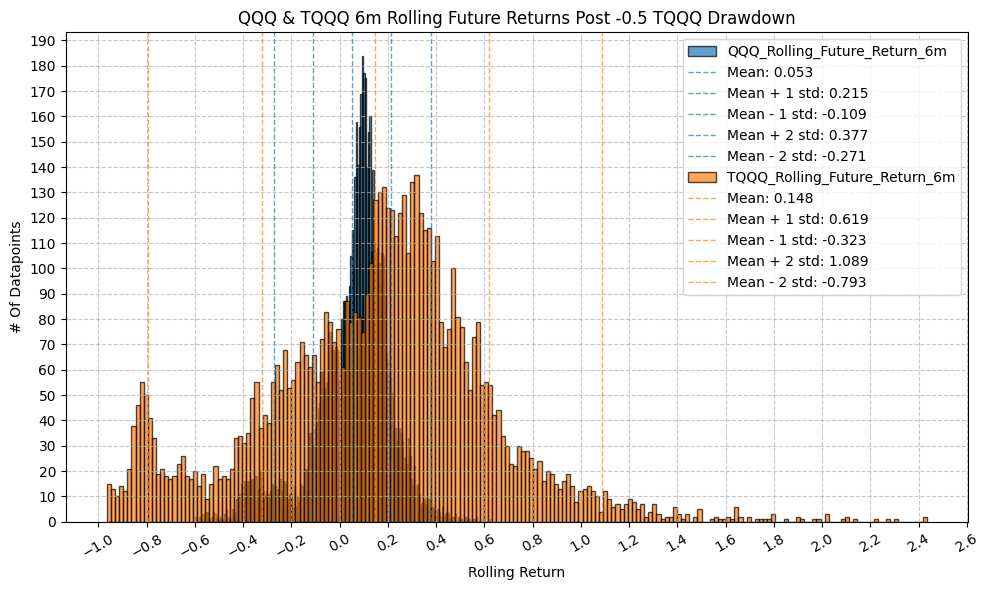
    


    

    


                                      OLS Regression Results                                 
    =========================================================================================
    Dep. Variable:     TQQQ_Rolling_Future_Return_6m   R-squared:                       0.931
    Model:                                       OLS   Adj. R-squared:                  0.931
    Method:                            Least Squares   F-statistic:                 8.673e+04
    Date:                           Mon, 16 Mar 2026   Prob (F-statistic):               0.00
    Time:                                   13:42:45   Log-Likelihood:                 4311.8
    No. Observations:                           6392   AIC:                            -8620.
    Df Residuals:                               6390   BIC:                            -8606.
    Df Model:                                      1                                         
    Covariance Type:                       nonrobust                                         
    ================================================================================================
                                       coef    std err          t      P>|t|      [0.025      0.975]
    ------------------------------------------------------------------------------------------------
    const                            0.0001      0.002      0.068      0.946      -0.003       0.003
    QQQ_Rolling_Future_Return_6m     2.8037      0.010    294.503      0.000       2.785       2.822
    ==============================================================================
    Omnibus:                     1653.772   Durbin-Watson:                   0.055
    Prob(Omnibus):                  0.000   Jarque-Bera (JB):             8144.760
    Skew:                           1.162   Prob(JB):                         0.00
    Kurtosis:                       8.018   Cond. No.                         6.19
    ==============================================================================
    
    Notes:
    [1] Standard Errors assume that the covariance matrix of the errors is correctly specified.


    

    


    

    


                                      OLS Regression Results                                 
    =========================================================================================
    Dep. Variable:     TQQQ_Rolling_Future_Return_1y   R-squared:                       0.903
    Model:                                       OLS   Adj. R-squared:                  0.903
    Method:                            Least Squares   F-statistic:                 5.801e+04
    Date:                           Mon, 16 Mar 2026   Prob (F-statistic):               0.00
    Time:                                   13:42:46   Log-Likelihood:                 333.68
    No. Observations:                           6266   AIC:                            -663.4
    Df Residuals:                               6264   BIC:                            -649.9
    Df Model:                                      1                                         
    Covariance Type:                       nonrobust                                         
    ================================================================================================
                                       coef    std err          t      P>|t|      [0.025      0.975]
    ------------------------------------------------------------------------------------------------
    const                            0.0205      0.003      6.376      0.000       0.014       0.027
    QQQ_Rolling_Future_Return_1y     2.8644      0.012    240.863      0.000       2.841       2.888
    ==============================================================================
    Omnibus:                     1982.919   Durbin-Watson:                   0.038
    Prob(Omnibus):                  0.000   Jarque-Bera (JB):             8590.359
    Skew:                           1.493   Prob(JB):                         0.00
    Kurtosis:                       7.898   Cond. No.                         4.16
    ==============================================================================
    
    Notes:
    [1] Standard Errors assume that the covariance matrix of the errors is correctly specified.


    

    


    

    


                                      OLS Regression Results                                 
    =========================================================================================
    Dep. Variable:     TQQQ_Rolling_Future_Return_2y   R-squared:                       0.847
    Model:                                       OLS   Adj. R-squared:                  0.847
    Method:                            Least Squares   F-statistic:                 3.336e+04
    Date:                           Mon, 16 Mar 2026   Prob (F-statistic):               0.00
    Time:                                   13:42:47   Log-Likelihood:                -4114.4
    No. Observations:                           6014   AIC:                             8233.
    Df Residuals:                               6012   BIC:                             8246.
    Df Model:                                      1                                         
    Covariance Type:                       nonrobust                                         
    ================================================================================================
                                       coef    std err          t      P>|t|      [0.025      0.975]
    ------------------------------------------------------------------------------------------------
    const                           -0.0360      0.008     -4.571      0.000      -0.051      -0.021
    QQQ_Rolling_Future_Return_2y     3.2475      0.018    182.648      0.000       3.213       3.282
    ==============================================================================
    Omnibus:                     1717.522   Durbin-Watson:                   0.018
    Prob(Omnibus):                  0.000   Jarque-Bera (JB):             5077.382
    Skew:                           1.483   Prob(JB):                         0.00
    Kurtosis:                       6.386   Cond. No.                         3.12
    ==============================================================================
    
    Notes:
    [1] Standard Errors assume that the covariance matrix of the errors is correctly specified.


    

    


    

    


                                      OLS Regression Results                                 
    =========================================================================================
    Dep. Variable:     TQQQ_Rolling_Future_Return_3y   R-squared:                       0.818
    Model:                                       OLS   Adj. R-squared:                  0.818
    Method:                            Least Squares   F-statistic:                 2.588e+04
    Date:                           Mon, 16 Mar 2026   Prob (F-statistic):               0.00
    Time:                                   13:42:48   Log-Likelihood:                -6046.1
    No. Observations:                           5762   AIC:                         1.210e+04
    Df Residuals:                               5760   BIC:                         1.211e+04
    Df Model:                                      1                                         
    Covariance Type:                       nonrobust                                         
    ================================================================================================
                                       coef    std err          t      P>|t|      [0.025      0.975]
    ------------------------------------------------------------------------------------------------
    const                           -0.2659      0.014    -19.547      0.000      -0.293      -0.239
    QQQ_Rolling_Future_Return_3y     3.6838      0.023    160.873      0.000       3.639       3.729
    ==============================================================================
    Omnibus:                      866.163   Durbin-Watson:                   0.015
    Prob(Omnibus):                  0.000   Jarque-Bera (JB):             1580.248
    Skew:                           0.959   Prob(JB):                         0.00
    Kurtosis:                       4.704   Cond. No.                         3.08
    ==============================================================================
    
    Notes:
    [1] Standard Errors assume that the covariance matrix of the errors is correctly specified.


    
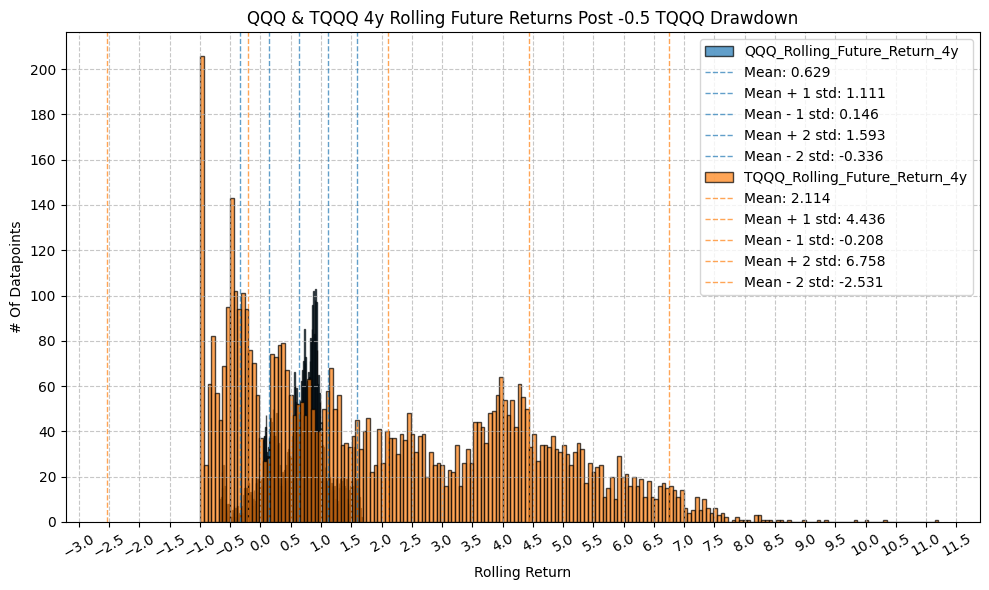
    


    

    


                                      OLS Regression Results                                 
    =========================================================================================
    Dep. Variable:     TQQQ_Rolling_Future_Return_4y   R-squared:                       0.786
    Model:                                       OLS   Adj. R-squared:                  0.786
    Method:                            Least Squares   F-statistic:                 2.021e+04
    Date:                           Mon, 16 Mar 2026   Prob (F-statistic):               0.00
    Time:                                   13:42:49   Log-Likelihood:                -8214.5
    No. Observations:                           5510   AIC:                         1.643e+04
    Df Residuals:                               5508   BIC:                         1.645e+04
    Df Model:                                      1                                         
    Covariance Type:                       nonrobust                                         
    ================================================================================================
                                       coef    std err          t      P>|t|      [0.025      0.975]
    ------------------------------------------------------------------------------------------------
    const                           -0.5696      0.024    -23.943      0.000      -0.616      -0.523
    QQQ_Rolling_Future_Return_4y     4.2692      0.030    142.161      0.000       4.210       4.328
    ==============================================================================
    Omnibus:                       65.711   Durbin-Watson:                   0.010
    Prob(Omnibus):                  0.000   Jarque-Bera (JB):               51.050
    Skew:                           0.151   Prob(JB):                     8.22e-12
    Kurtosis:                       2.638   Cond. No.                         3.05
    ==============================================================================
    
    Notes:
    [1] Standard Errors assume that the covariance matrix of the errors is correctly specified.


    

    


    

    


                                      OLS Regression Results                                 
    =========================================================================================
    Dep. Variable:     TQQQ_Rolling_Future_Return_5y   R-squared:                       0.748
    Model:                                       OLS   Adj. R-squared:                  0.748
    Method:                            Least Squares   F-statistic:                 1.563e+04
    Date:                           Mon, 16 Mar 2026   Prob (F-statistic):               0.00
    Time:                                   13:42:51   Log-Likelihood:                -11393.
    No. Observations:                           5258   AIC:                         2.279e+04
    Df Residuals:                               5256   BIC:                         2.280e+04
    Df Model:                                      1                                         
    Covariance Type:                       nonrobust                                         
    ================================================================================================
                                       coef    std err          t      P>|t|      [0.025      0.975]
    ------------------------------------------------------------------------------------------------
    const                           -1.3493      0.049    -27.365      0.000      -1.446      -1.253
    QQQ_Rolling_Future_Return_5y     5.5930      0.045    125.018      0.000       5.505       5.681
    ==============================================================================
    Omnibus:                      239.977   Durbin-Watson:                   0.009
    Prob(Omnibus):                  0.000   Jarque-Bera (JB):              361.637
    Skew:                           0.414   Prob(JB):                     2.96e-79
    Kurtosis:                       3.982   Cond. No.                         3.08
    ==============================================================================
    
    Notes:
    [1] Standard Errors assume that the covariance matrix of the errors is correctly specified.


    

    


    

    


                                      OLS Regression Results                                 
    =========================================================================================
    Dep. Variable:     TQQQ_Rolling_Future_Return_1d   R-squared:                       0.999
    Model:                                       OLS   Adj. R-squared:                  0.999
    Method:                            Least Squares   F-statistic:                 5.999e+06
    Date:                           Mon, 16 Mar 2026   Prob (F-statistic):               0.00
    Time:                                   13:42:52   Log-Likelihood:                 31532.
    No. Observations:                           6280   AIC:                        -6.306e+04
    Df Residuals:                               6278   BIC:                        -6.305e+04
    Df Model:                                      1                                         
    Covariance Type:                       nonrobust                                         
    ================================================================================================
                                       coef    std err          t      P>|t|      [0.025      0.975]
    ------------------------------------------------------------------------------------------------
    const                        -4.232e-05   2.02e-05     -2.100      0.036   -8.18e-05   -2.81e-06
    QQQ_Rolling_Future_Return_1d     2.9547      0.001   2449.263      0.000       2.952       2.957
    ==============================================================================
    Omnibus:                     9286.532   Durbin-Watson:                   2.569
    Prob(Omnibus):                  0.000   Jarque-Bera (JB):         35696636.910
    Skew:                          -8.058   Prob(JB):                         0.00
    Kurtosis:                     371.999   Cond. No.                         59.9
    ==============================================================================
    
    Notes:
    [1] Standard Errors assume that the covariance matrix of the errors is correctly specified.


    

    


    

    


                                      OLS Regression Results                                 
    =========================================================================================
    Dep. Variable:     TQQQ_Rolling_Future_Return_1w   R-squared:                       0.994
    Model:                                       OLS   Adj. R-squared:                  0.994
    Method:                            Least Squares   F-statistic:                 1.076e+06
    Date:                           Mon, 16 Mar 2026   Prob (F-statistic):               0.00
    Time:                                   13:42:53   Log-Likelihood:                 21675.
    No. Observations:                           6280   AIC:                        -4.335e+04
    Df Residuals:                               6278   BIC:                        -4.333e+04
    Df Model:                                      1                                         
    Covariance Type:                       nonrobust                                         
    ================================================================================================
                                       coef    std err          t      P>|t|      [0.025      0.975]
    ------------------------------------------------------------------------------------------------
    const                           -0.0007    9.7e-05     -7.551      0.000      -0.001      -0.001
    QQQ_Rolling_Future_Return_1w     2.9525      0.003   1037.392      0.000       2.947       2.958
    ==============================================================================
    Omnibus:                     3408.626   Durbin-Watson:                   0.895
    Prob(Omnibus):                  0.000   Jarque-Bera (JB):           384667.664
    Skew:                          -1.639   Prob(JB):                         0.00
    Kurtosis:                      41.201   Cond. No.                         29.4
    ==============================================================================
    
    Notes:
    [1] Standard Errors assume that the covariance matrix of the errors is correctly specified.


    

    


    

    


                                      OLS Regression Results                                 
    =========================================================================================
    Dep. Variable:     TQQQ_Rolling_Future_Return_1m   R-squared:                       0.982
    Model:                                       OLS   Adj. R-squared:                  0.982
    Method:                            Least Squares   F-statistic:                 3.507e+05
    Date:                           Mon, 16 Mar 2026   Prob (F-statistic):               0.00
    Time:                                   13:42:54   Log-Likelihood:                 14068.
    No. Observations:                           6280   AIC:                        -2.813e+04
    Df Residuals:                               6278   BIC:                        -2.812e+04
    Df Model:                                      1                                         
    Covariance Type:                       nonrobust                                         
    ================================================================================================
                                       coef    std err          t      P>|t|      [0.025      0.975]
    ------------------------------------------------------------------------------------------------
    const                           -0.0032      0.000     -9.790      0.000      -0.004      -0.003
    QQQ_Rolling_Future_Return_1m     2.9140      0.005    592.182      0.000       2.904       2.924
    ==============================================================================
    Omnibus:                     1452.365   Durbin-Watson:                   0.296
    Prob(Omnibus):                  0.000   Jarque-Bera (JB):            78369.604
    Skew:                           0.053   Prob(JB):                         0.00
    Kurtosis:                      20.306   Cond. No.                         15.1
    ==============================================================================
    
    Notes:
    [1] Standard Errors assume that the covariance matrix of the errors is correctly specified.


    
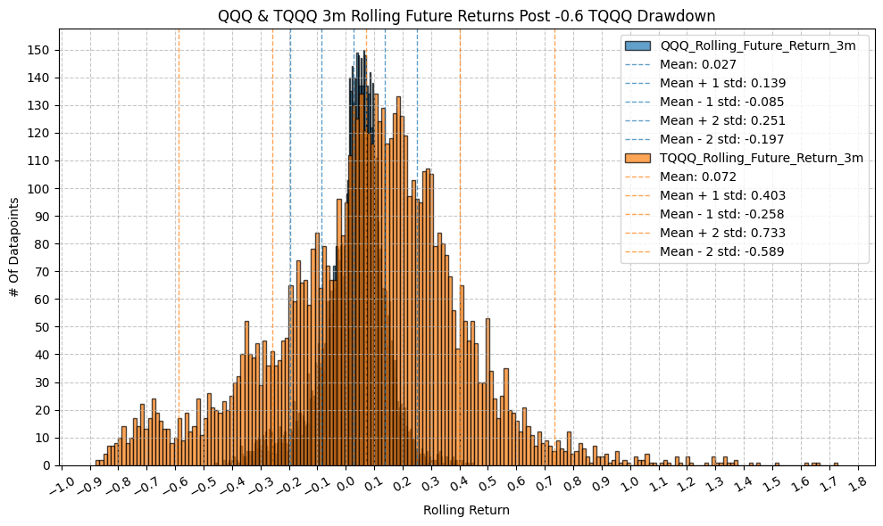
    


    

    


                                      OLS Regression Results                                 
    =========================================================================================
    Dep. Variable:     TQQQ_Rolling_Future_Return_3m   R-squared:                       0.961
    Model:                                       OLS   Adj. R-squared:                  0.961
    Method:                            Least Squares   F-statistic:                 1.566e+05
    Date:                           Mon, 16 Mar 2026   Prob (F-statistic):               0.00
    Time:                                   13:42:55   Log-Likelihood:                 8264.2
    No. Observations:                           6280   AIC:                        -1.652e+04
    Df Residuals:                               6278   BIC:                        -1.651e+04
    Df Model:                                      1                                         
    Covariance Type:                       nonrobust                                         
    ================================================================================================
                                       coef    std err          t      P>|t|      [0.025      0.975]
    ------------------------------------------------------------------------------------------------
    const                           -0.0059      0.001     -7.038      0.000      -0.008      -0.004
    QQQ_Rolling_Future_Return_3m     2.8977      0.007    395.692      0.000       2.883       2.912
    ==============================================================================
    Omnibus:                     1352.162   Durbin-Watson:                   0.102
    Prob(Omnibus):                  0.000   Jarque-Bera (JB):            15599.280
    Skew:                           0.696   Prob(JB):                         0.00
    Kurtosis:                      10.594   Cond. No.                         8.95
    ==============================================================================
    
    Notes:
    [1] Standard Errors assume that the covariance matrix of the errors is correctly specified.


    

    


    

    


                                      OLS Regression Results                                 
    =========================================================================================
    Dep. Variable:     TQQQ_Rolling_Future_Return_6m   R-squared:                       0.932
    Model:                                       OLS   Adj. R-squared:                  0.932
    Method:                            Least Squares   F-statistic:                 8.613e+04
    Date:                           Mon, 16 Mar 2026   Prob (F-statistic):               0.00
    Time:                                   13:42:56   Log-Likelihood:                 4282.1
    No. Observations:                           6280   AIC:                            -8560.
    Df Residuals:                               6278   BIC:                            -8547.
    Df Model:                                      1                                         
    Covariance Type:                       nonrobust                                         
    ================================================================================================
                                       coef    std err          t      P>|t|      [0.025      0.975]
    ------------------------------------------------------------------------------------------------
    const                           -0.0002      0.002     -0.127      0.899      -0.003       0.003
    QQQ_Rolling_Future_Return_6m     2.8191      0.010    293.486      0.000       2.800       2.838
    ==============================================================================
    Omnibus:                     1637.681   Durbin-Watson:                   0.057
    Prob(Omnibus):                  0.000   Jarque-Bera (JB):             8395.060
    Skew:                           1.159   Prob(JB):                         0.00
    Kurtosis:                       8.168   Cond. No.                         6.24
    ==============================================================================
    
    Notes:
    [1] Standard Errors assume that the covariance matrix of the errors is correctly specified.


    
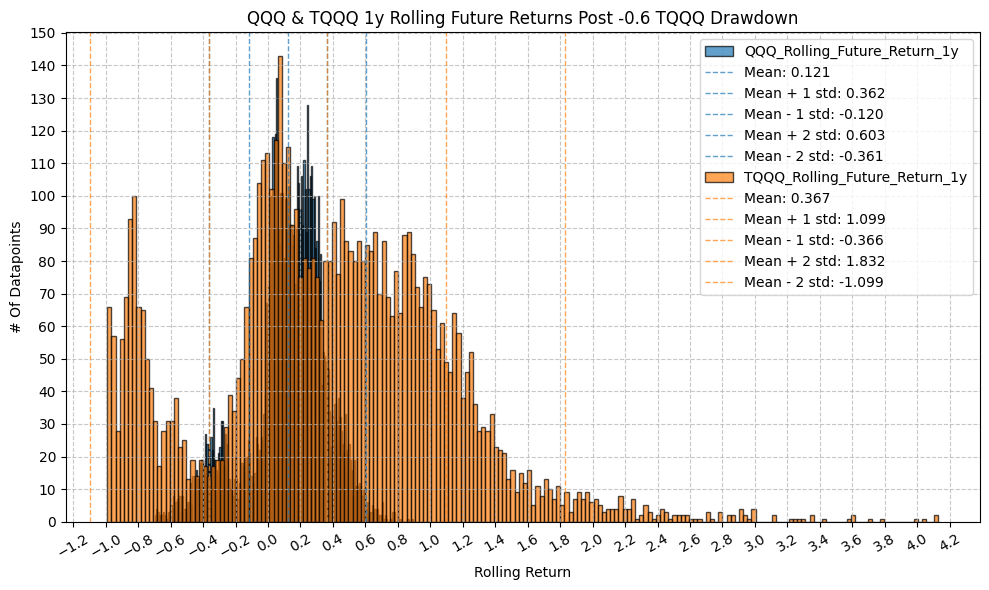
    


    

    


                                      OLS Regression Results                                 
    =========================================================================================
    Dep. Variable:     TQQQ_Rolling_Future_Return_1y   R-squared:                       0.904
    Model:                                       OLS   Adj. R-squared:                  0.904
    Method:                            Least Squares   F-statistic:                 5.852e+04
    Date:                           Mon, 16 Mar 2026   Prob (F-statistic):               0.00
    Time:                                   13:42:57   Log-Likelihood:                 404.91
    No. Observations:                           6199   AIC:                            -805.8
    Df Residuals:                               6197   BIC:                            -792.3
    Df Model:                                      1                                         
    Covariance Type:                       nonrobust                                         
    ================================================================================================
                                       coef    std err          t      P>|t|      [0.025      0.975]
    ------------------------------------------------------------------------------------------------
    const                            0.0162      0.003      5.033      0.000       0.010       0.023
    QQQ_Rolling_Future_Return_1y     2.8920      0.012    241.905      0.000       2.869       2.915
    ==============================================================================
    Omnibus:                     1966.648   Durbin-Watson:                   0.038
    Prob(Omnibus):                  0.000   Jarque-Bera (JB):             8739.805
    Skew:                           1.487   Prob(JB):                         0.00
    Kurtosis:                       7.999   Cond. No.                         4.22
    ==============================================================================
    
    Notes:
    [1] Standard Errors assume that the covariance matrix of the errors is correctly specified.


    
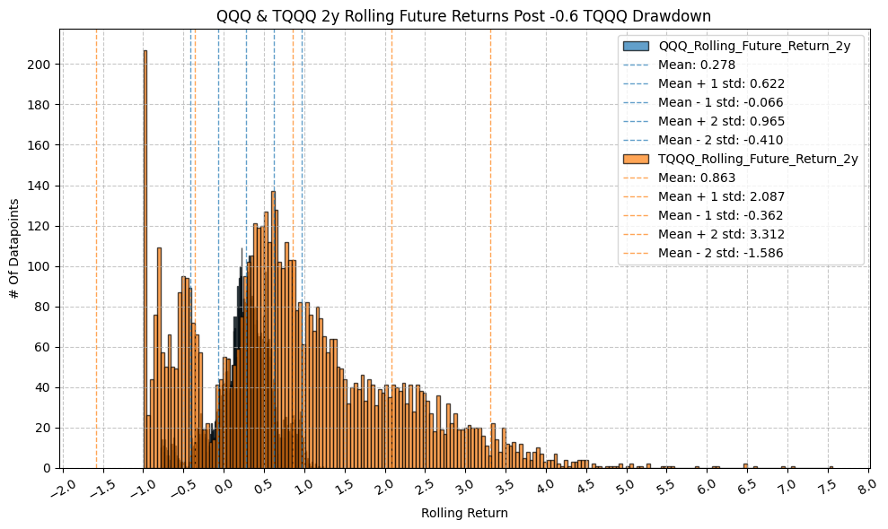
    


    

    


                                      OLS Regression Results                                 
    =========================================================================================
    Dep. Variable:     TQQQ_Rolling_Future_Return_2y   R-squared:                       0.851
    Model:                                       OLS   Adj. R-squared:                  0.851
    Method:                            Least Squares   F-statistic:                 3.401e+04
    Date:                           Mon, 16 Mar 2026   Prob (F-statistic):               0.00
    Time:                                   13:42:59   Log-Likelihood:                -4010.4
    No. Observations:                           5977   AIC:                             8025.
    Df Residuals:                               5975   BIC:                             8038.
    Df Model:                                      1                                         
    Covariance Type:                       nonrobust                                         
    ================================================================================================
                                       coef    std err          t      P>|t|      [0.025      0.975]
    ------------------------------------------------------------------------------------------------
    const                           -0.0503      0.008     -6.388      0.000      -0.066      -0.035
    QQQ_Rolling_Future_Return_2y     3.2857      0.018    184.405      0.000       3.251       3.321
    ==============================================================================
    Omnibus:                     1728.061   Durbin-Watson:                   0.019
    Prob(Omnibus):                  0.000   Jarque-Bera (JB):             5277.259
    Skew:                           1.488   Prob(JB):                         0.00
    Kurtosis:                       6.512   Cond. No.                         3.16
    ==============================================================================
    
    Notes:
    [1] Standard Errors assume that the covariance matrix of the errors is correctly specified.


    

    


    

    


                                      OLS Regression Results                                 
    =========================================================================================
    Dep. Variable:     TQQQ_Rolling_Future_Return_3y   R-squared:                       0.821
    Model:                                       OLS   Adj. R-squared:                  0.821
    Method:                            Least Squares   F-statistic:                 2.631e+04
    Date:                           Mon, 16 Mar 2026   Prob (F-statistic):               0.00
    Time:                                   13:43:00   Log-Likelihood:                -5943.8
    No. Observations:                           5725   AIC:                         1.189e+04
    Df Residuals:                               5723   BIC:                         1.190e+04
    Df Model:                                      1                                         
    Covariance Type:                       nonrobust                                         
    ================================================================================================
                                       coef    std err          t      P>|t|      [0.025      0.975]
    ------------------------------------------------------------------------------------------------
    const                           -0.2891      0.014    -21.164      0.000      -0.316      -0.262
    QQQ_Rolling_Future_Return_3y     3.7271      0.023    162.217      0.000       3.682       3.772
    ==============================================================================
    Omnibus:                      846.190   Durbin-Watson:                   0.015
    Prob(Omnibus):                  0.000   Jarque-Bera (JB):             1556.288
    Skew:                           0.941   Prob(JB):                         0.00
    Kurtosis:                       4.726   Cond. No.                         3.12
    ==============================================================================
    
    Notes:
    [1] Standard Errors assume that the covariance matrix of the errors is correctly specified.


    

    


    

    


                                      OLS Regression Results                                 
    =========================================================================================
    Dep. Variable:     TQQQ_Rolling_Future_Return_4y   R-squared:                       0.789
    Model:                                       OLS   Adj. R-squared:                  0.789
    Method:                            Least Squares   F-statistic:                 2.045e+04
    Date:                           Mon, 16 Mar 2026   Prob (F-statistic):               0.00
    Time:                                   13:43:01   Log-Likelihood:                -8114.6
    No. Observations:                           5473   AIC:                         1.623e+04
    Df Residuals:                               5471   BIC:                         1.625e+04
    Df Model:                                      1                                         
    Covariance Type:                       nonrobust                                         
    ================================================================================================
                                       coef    std err          t      P>|t|      [0.025      0.975]
    ------------------------------------------------------------------------------------------------
    const                           -0.6018      0.024    -25.144      0.000      -0.649      -0.555
    QQQ_Rolling_Future_Return_4y     4.3140      0.030    142.997      0.000       4.255       4.373
    ==============================================================================
    Omnibus:                       51.316   Durbin-Watson:                   0.010
    Prob(Omnibus):                  0.000   Jarque-Bera (JB):               40.579
    Skew:                           0.131   Prob(JB):                     1.54e-09
    Kurtosis:                       2.669   Cond. No.                         3.09
    ==============================================================================
    
    Notes:
    [1] Standard Errors assume that the covariance matrix of the errors is correctly specified.


    

    


    
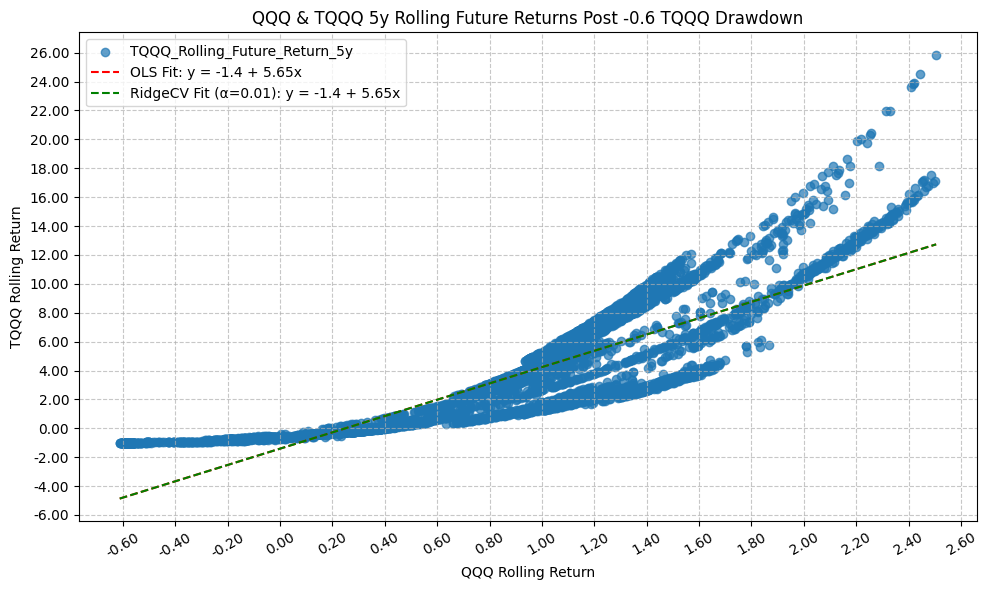
    


                                      OLS Regression Results                                 
    =========================================================================================
    Dep. Variable:     TQQQ_Rolling_Future_Return_5y   R-squared:                       0.750
    Model:                                       OLS   Adj. R-squared:                  0.750
    Method:                            Least Squares   F-statistic:                 1.574e+04
    Date:                           Mon, 16 Mar 2026   Prob (F-statistic):               0.00
    Time:                                   13:43:02   Log-Likelihood:                -11327.
    No. Observations:                           5238   AIC:                         2.266e+04
    Df Residuals:                               5236   BIC:                         2.267e+04
    Df Model:                                      1                                         
    Covariance Type:                       nonrobust                                         
    ================================================================================================
                                       coef    std err          t      P>|t|      [0.025      0.975]
    ------------------------------------------------------------------------------------------------
    const                           -1.4104      0.050    -28.398      0.000      -1.508      -1.313
    QQQ_Rolling_Future_Return_5y     5.6451      0.045    125.443      0.000       5.557       5.733
    ==============================================================================
    Omnibus:                      226.987   Durbin-Watson:                   0.009
    Prob(Omnibus):                  0.000   Jarque-Bera (JB):              348.438
    Skew:                           0.392   Prob(JB):                     2.18e-76
    Kurtosis:                       3.990   Cond. No.                         3.11
    ==============================================================================
    
    Notes:
    [1] Standard Errors assume that the covariance matrix of the errors is correctly specified.


    

    


    

    


                                      OLS Regression Results                                 
    =========================================================================================
    Dep. Variable:     TQQQ_Rolling_Future_Return_1d   R-squared:                       0.999
    Model:                                       OLS   Adj. R-squared:                  0.999
    Method:                            Least Squares   F-statistic:                 5.379e+06
    Date:                           Mon, 16 Mar 2026   Prob (F-statistic):               0.00
    Time:                                   13:43:03   Log-Likelihood:                 29443.
    No. Observations:                           5890   AIC:                        -5.888e+04
    Df Residuals:                               5888   BIC:                        -5.887e+04
    Df Model:                                      1                                         
    Covariance Type:                       nonrobust                                         
    ================================================================================================
                                       coef    std err          t      P>|t|      [0.025      0.975]
    ------------------------------------------------------------------------------------------------
    const                        -3.034e-05   2.13e-05     -1.426      0.154   -7.21e-05    1.14e-05
    QQQ_Rolling_Future_Return_1d     2.9544      0.001   2319.352      0.000       2.952       2.957
    ==============================================================================
    Omnibus:                     8697.849   Durbin-Watson:                   2.575
    Prob(Omnibus):                  0.000   Jarque-Bera (JB):         31773160.847
    Skew:                          -8.043   Prob(JB):                         0.00
    Kurtosis:                     362.454   Cond. No.                         59.9
    ==============================================================================
    
    Notes:
    [1] Standard Errors assume that the covariance matrix of the errors is correctly specified.


    

    


    

    


                                      OLS Regression Results                                 
    =========================================================================================
    Dep. Variable:     TQQQ_Rolling_Future_Return_1w   R-squared:                       0.994
    Model:                                       OLS   Adj. R-squared:                  0.994
    Method:                            Least Squares   F-statistic:                 1.008e+06
    Date:                           Mon, 16 Mar 2026   Prob (F-statistic):               0.00
    Time:                                   13:43:04   Log-Likelihood:                 20303.
    No. Observations:                           5890   AIC:                        -4.060e+04
    Df Residuals:                               5888   BIC:                        -4.059e+04
    Df Model:                                      1                                         
    Covariance Type:                       nonrobust                                         
    ================================================================================================
                                       coef    std err          t      P>|t|      [0.025      0.975]
    ------------------------------------------------------------------------------------------------
    const                           -0.0006      0.000     -6.361      0.000      -0.001      -0.000
    QQQ_Rolling_Future_Return_1w     2.9525      0.003   1003.867      0.000       2.947       2.958
    ==============================================================================
    Omnibus:                     3288.157   Durbin-Watson:                   0.897
    Prob(Omnibus):                  0.000   Jarque-Bera (JB):           369121.603
    Skew:                          -1.720   Prob(JB):                         0.00
    Kurtosis:                      41.629   Cond. No.                         29.3
    ==============================================================================
    
    Notes:
    [1] Standard Errors assume that the covariance matrix of the errors is correctly specified.


    

    


    

    


                                      OLS Regression Results                                 
    =========================================================================================
    Dep. Variable:     TQQQ_Rolling_Future_Return_1m   R-squared:                       0.983
    Model:                                       OLS   Adj. R-squared:                  0.983
    Method:                            Least Squares   F-statistic:                 3.372e+05
    Date:                           Mon, 16 Mar 2026   Prob (F-statistic):               0.00
    Time:                                   13:43:06   Log-Likelihood:                 13210.
    No. Observations:                           5890   AIC:                        -2.642e+04
    Df Residuals:                               5888   BIC:                        -2.640e+04
    Df Model:                                      1                                         
    Covariance Type:                       nonrobust                                         
    ================================================================================================
                                       coef    std err          t      P>|t|      [0.025      0.975]
    ------------------------------------------------------------------------------------------------
    const                           -0.0025      0.000     -7.377      0.000      -0.003      -0.002
    QQQ_Rolling_Future_Return_1m     2.9139      0.005    580.681      0.000       2.904       2.924
    ==============================================================================
    Omnibus:                     1415.259   Durbin-Watson:                   0.310
    Prob(Omnibus):                  0.000   Jarque-Bera (JB):            78284.153
    Skew:                           0.193   Prob(JB):                         0.00
    Kurtosis:                      20.856   Cond. No.                         15.0
    ==============================================================================
    
    Notes:
    [1] Standard Errors assume that the covariance matrix of the errors is correctly specified.


    
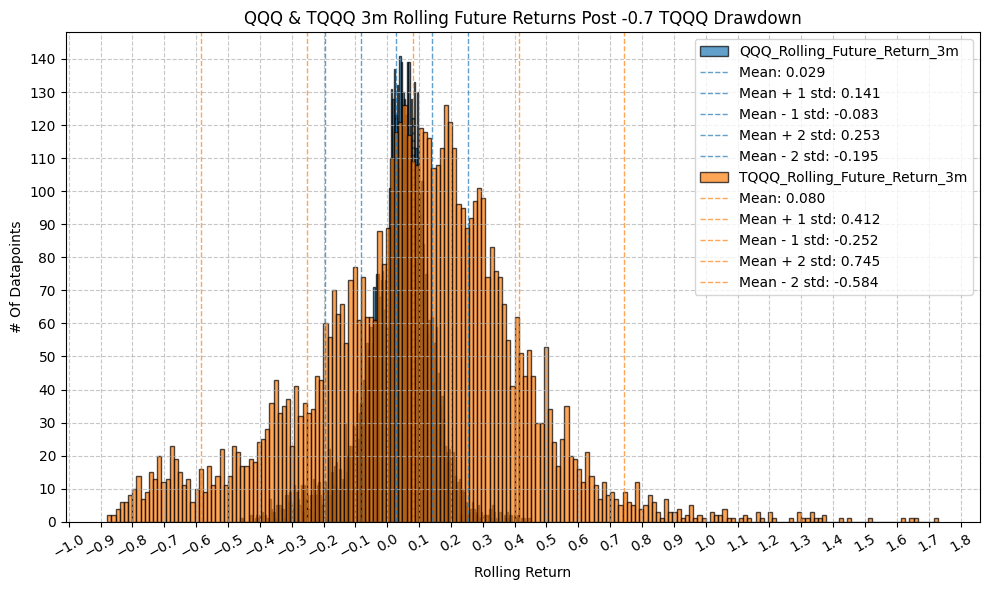
    


    

    


                                      OLS Regression Results                                 
    =========================================================================================
    Dep. Variable:     TQQQ_Rolling_Future_Return_3m   R-squared:                       0.962
    Model:                                       OLS   Adj. R-squared:                  0.962
    Method:                            Least Squares   F-statistic:                 1.509e+05
    Date:                           Mon, 16 Mar 2026   Prob (F-statistic):               0.00
    Time:                                   13:43:07   Log-Likelihood:                 7799.9
    No. Observations:                           5890   AIC:                        -1.560e+04
    Df Residuals:                               5888   BIC:                        -1.558e+04
    Df Model:                                      1                                         
    Covariance Type:                       nonrobust                                         
    ================================================================================================
                                       coef    std err          t      P>|t|      [0.025      0.975]
    ------------------------------------------------------------------------------------------------
    const                           -0.0040      0.001     -4.617      0.000      -0.006      -0.002
    QQQ_Rolling_Future_Return_3m     2.9067      0.007    388.462      0.000       2.892       2.921
    ==============================================================================
    Omnibus:                     1368.515   Durbin-Watson:                   0.107
    Prob(Omnibus):                  0.000   Jarque-Bera (JB):            16450.659
    Skew:                           0.766   Prob(JB):                         0.00
    Kurtosis:                      11.043   Cond. No.                         8.93
    ==============================================================================
    
    Notes:
    [1] Standard Errors assume that the covariance matrix of the errors is correctly specified.


    
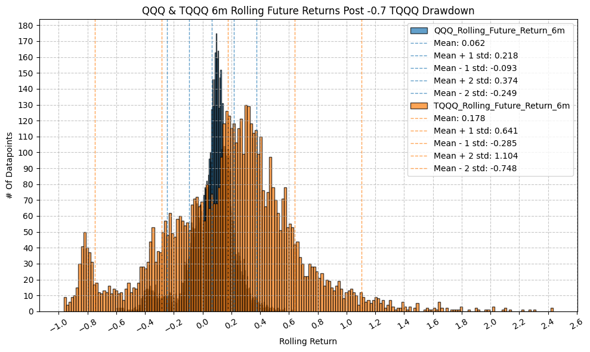
    


    

    


                                      OLS Regression Results                                 
    =========================================================================================
    Dep. Variable:     TQQQ_Rolling_Future_Return_6m   R-squared:                       0.934
    Model:                                       OLS   Adj. R-squared:                  0.934
    Method:                            Least Squares   F-statistic:                 8.379e+04
    Date:                           Mon, 16 Mar 2026   Prob (F-statistic):               0.00
    Time:                                   13:43:08   Log-Likelihood:                 4198.9
    No. Observations:                           5890   AIC:                            -8394.
    Df Residuals:                               5888   BIC:                            -8380.
    Df Model:                                      1                                         
    Covariance Type:                       nonrobust                                         
    ================================================================================================
                                       coef    std err          t      P>|t|      [0.025      0.975]
    ------------------------------------------------------------------------------------------------
    const                           -0.0017      0.002     -1.050      0.294      -0.005       0.002
    QQQ_Rolling_Future_Return_6m     2.8731      0.010    289.464      0.000       2.854       2.893
    ==============================================================================
    Omnibus:                     1462.300   Durbin-Watson:                   0.063
    Prob(Omnibus):                  0.000   Jarque-Bera (JB):             8111.743
    Skew:                           1.074   Prob(JB):                         0.00
    Kurtosis:                       8.333   Cond. No.                         6.45
    ==============================================================================
    
    Notes:
    [1] Standard Errors assume that the covariance matrix of the errors is correctly specified.


    

    


    
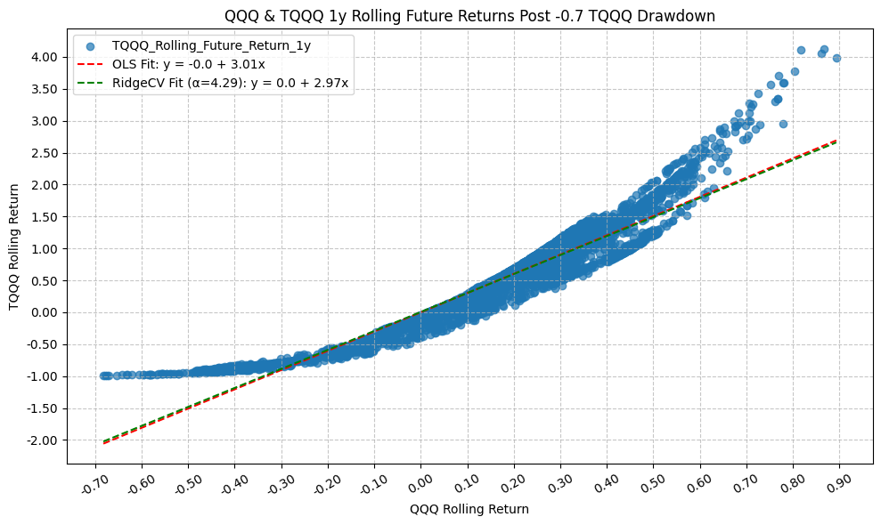
    


                                      OLS Regression Results                                 
    =========================================================================================
    Dep. Variable:     TQQQ_Rolling_Future_Return_1y   R-squared:                       0.912
    Model:                                       OLS   Adj. R-squared:                  0.912
    Method:                            Least Squares   F-statistic:                 6.073e+04
    Date:                           Mon, 16 Mar 2026   Prob (F-statistic):               0.00
    Time:                                   13:43:09   Log-Likelihood:                 715.33
    No. Observations:                           5852   AIC:                            -1427.
    Df Residuals:                               5850   BIC:                            -1413.
    Df Model:                                      1                                         
    Covariance Type:                       nonrobust                                         
    ================================================================================================
                                       coef    std err          t      P>|t|      [0.025      0.975]
    ------------------------------------------------------------------------------------------------
    const                           -0.0009      0.003     -0.283      0.777      -0.007       0.005
    QQQ_Rolling_Future_Return_1y     3.0133      0.012    246.430      0.000       2.989       3.037
    ==============================================================================
    Omnibus:                     1763.446   Durbin-Watson:                   0.043
    Prob(Omnibus):                  0.000   Jarque-Bera (JB):             8317.030
    Skew:                           1.385   Prob(JB):                         0.00
    Kurtosis:                       8.142   Cond. No.                         4.45
    ==============================================================================
    
    Notes:
    [1] Standard Errors assume that the covariance matrix of the errors is correctly specified.


    
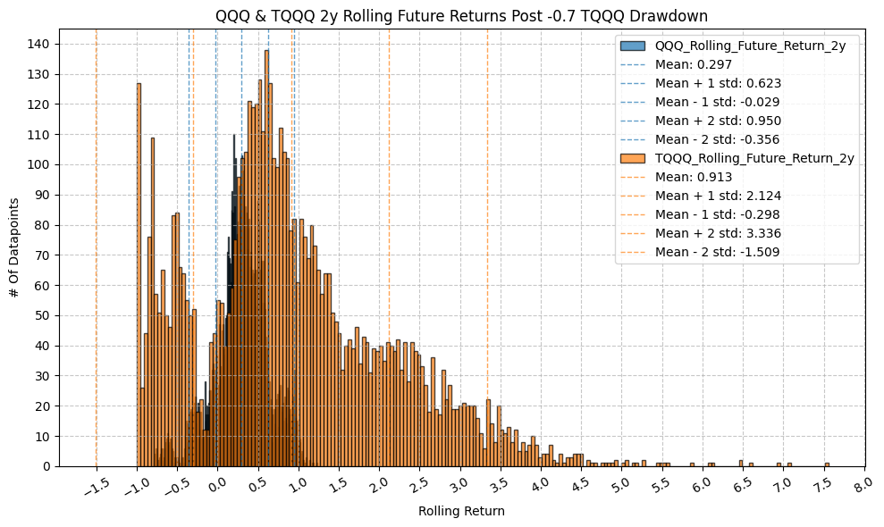
    


    

    


                                      OLS Regression Results                                 
    =========================================================================================
    Dep. Variable:     TQQQ_Rolling_Future_Return_2y   R-squared:                       0.865
    Model:                                       OLS   Adj. R-squared:                  0.865
    Method:                            Least Squares   F-statistic:                 3.714e+04
    Date:                           Mon, 16 Mar 2026   Prob (F-statistic):               0.00
    Time:                                   13:43:10   Log-Likelihood:                -3517.9
    No. Observations:                           5784   AIC:                             7040.
    Df Residuals:                               5782   BIC:                             7053.
    Df Model:                                      1                                         
    Covariance Type:                       nonrobust                                         
    ================================================================================================
                                       coef    std err          t      P>|t|      [0.025      0.975]
    ------------------------------------------------------------------------------------------------
    const                           -0.1117      0.008    -14.133      0.000      -0.127      -0.096
    QQQ_Rolling_Future_Return_2y     3.4522      0.018    192.714      0.000       3.417       3.487
    ==============================================================================
    Omnibus:                     1654.899   Durbin-Watson:                   0.020
    Prob(Omnibus):                  0.000   Jarque-Bera (JB):             5619.104
    Skew:                           1.427   Prob(JB):                         0.00
    Kurtosis:                       6.895   Cond. No.                         3.36
    ==============================================================================
    
    Notes:
    [1] Standard Errors assume that the covariance matrix of the errors is correctly specified.


    
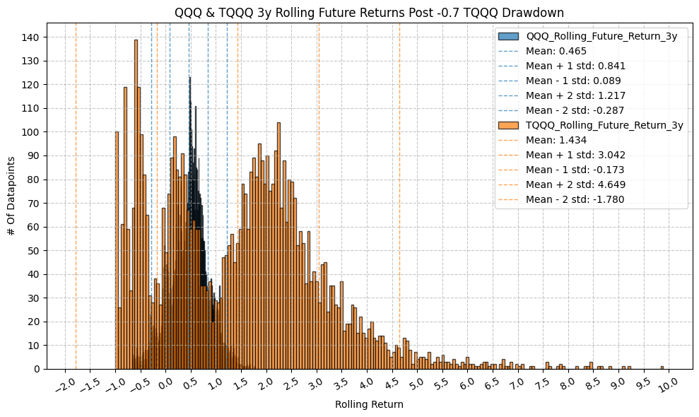
    


    

    


                                      OLS Regression Results                                 
    =========================================================================================
    Dep. Variable:     TQQQ_Rolling_Future_Return_3y   R-squared:                       0.838
    Model:                                       OLS   Adj. R-squared:                  0.838
    Method:                            Least Squares   F-statistic:                 2.855e+04
    Date:                           Mon, 16 Mar 2026   Prob (F-statistic):               0.00
    Time:                                   13:43:11   Log-Likelihood:                -5444.7
    No. Observations:                           5532   AIC:                         1.089e+04
    Df Residuals:                               5530   BIC:                         1.091e+04
    Df Model:                                      1                                         
    Covariance Type:                       nonrobust                                         
    ================================================================================================
                                       coef    std err          t      P>|t|      [0.025      0.975]
    ------------------------------------------------------------------------------------------------
    const                           -0.3845      0.014    -27.769      0.000      -0.412      -0.357
    QQQ_Rolling_Future_Return_3y     3.9132      0.023    168.966      0.000       3.868       3.959
    ==============================================================================
    Omnibus:                      670.448   Durbin-Watson:                   0.016
    Prob(Omnibus):                  0.000   Jarque-Bera (JB):             1243.454
    Skew:                           0.791   Prob(JB):                    9.71e-271
    Kurtosis:                       4.700   Cond. No.                         3.31
    ==============================================================================
    
    Notes:
    [1] Standard Errors assume that the covariance matrix of the errors is correctly specified.


    
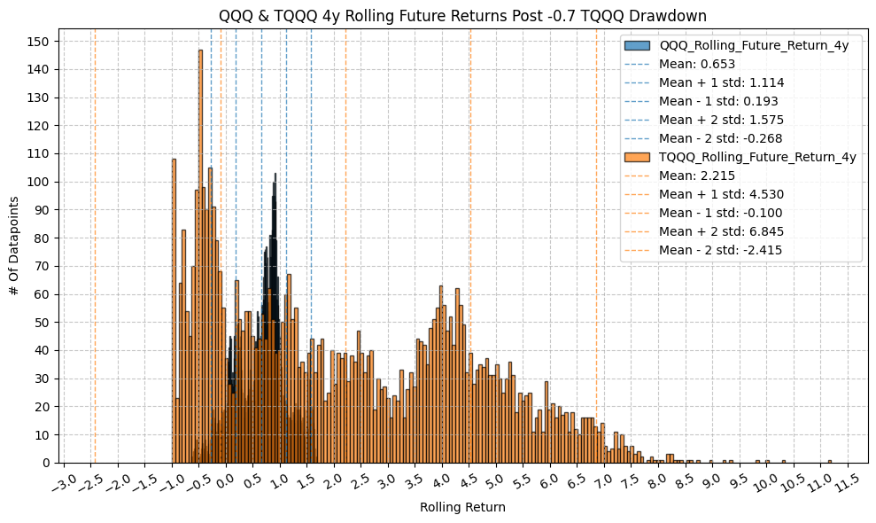
    


    
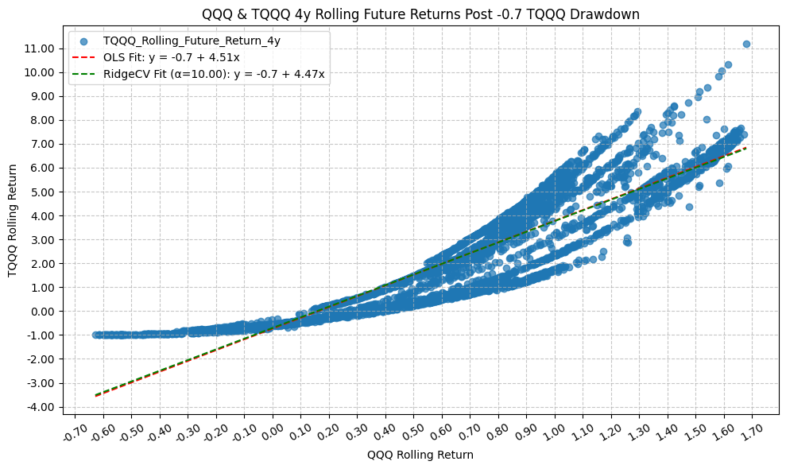
    


                                      OLS Regression Results                                 
    =========================================================================================
    Dep. Variable:     TQQQ_Rolling_Future_Return_4y   R-squared:                       0.806
    Model:                                       OLS   Adj. R-squared:                  0.806
    Method:                            Least Squares   F-statistic:                 2.190e+04
    Date:                           Mon, 16 Mar 2026   Prob (F-statistic):               0.00
    Time:                                   13:43:13   Log-Likelihood:                -7596.8
    No. Observations:                           5280   AIC:                         1.520e+04
    Df Residuals:                               5278   BIC:                         1.521e+04
    Df Model:                                      1                                         
    Covariance Type:                       nonrobust                                         
    ================================================================================================
                                       coef    std err          t      P>|t|      [0.025      0.975]
    ------------------------------------------------------------------------------------------------
    const                           -0.7323      0.024    -30.052      0.000      -0.780      -0.685
    QQQ_Rolling_Future_Return_4y     4.5109      0.030    147.996      0.000       4.451       4.571
    ==============================================================================
    Omnibus:                       12.319   Durbin-Watson:                   0.011
    Prob(Omnibus):                  0.002   Jarque-Bera (JB):               10.050
    Skew:                          -0.007   Prob(JB):                      0.00657
    Kurtosis:                       2.787   Cond. No.                         3.25
    ==============================================================================
    
    Notes:
    [1] Standard Errors assume that the covariance matrix of the errors is correctly specified.


    

    


    
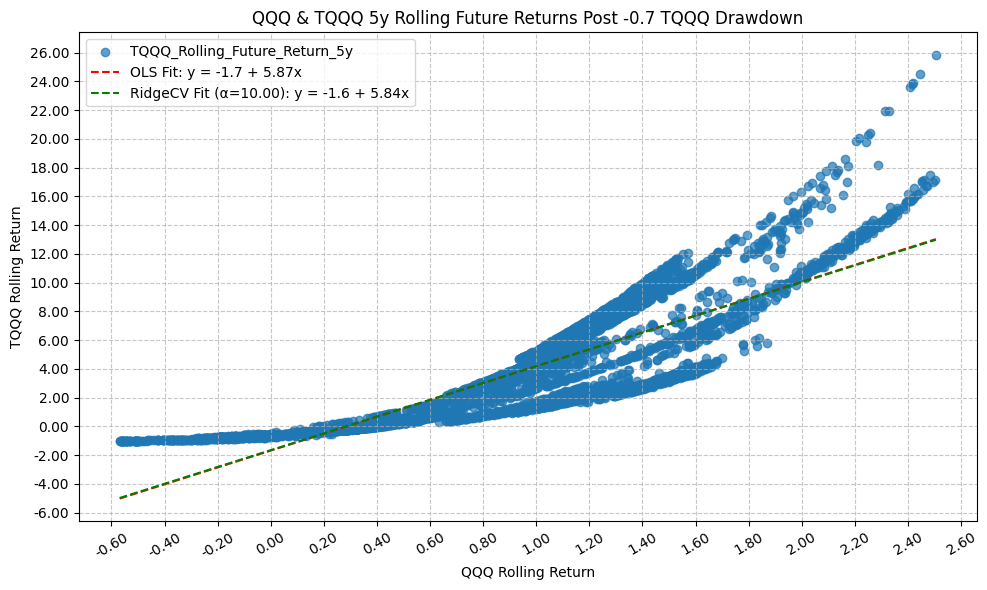
    


                                      OLS Regression Results                                 
    =========================================================================================
    Dep. Variable:     TQQQ_Rolling_Future_Return_5y   R-squared:                       0.759
    Model:                                       OLS   Adj. R-squared:                  0.759
    Method:                            Least Squares   F-statistic:                 1.625e+04
    Date:                           Mon, 16 Mar 2026   Prob (F-statistic):               0.00
    Time:                                   13:43:14   Log-Likelihood:                -11052.
    No. Observations:                           5158   AIC:                         2.211e+04
    Df Residuals:                               5156   BIC:                         2.212e+04
    Df Model:                                      1                                         
    Covariance Type:                       nonrobust                                         
    ================================================================================================
                                       coef    std err          t      P>|t|      [0.025      0.975]
    ------------------------------------------------------------------------------------------------
    const                           -1.6745      0.051    -32.771      0.000      -1.775      -1.574
    QQQ_Rolling_Future_Return_5y     5.8696      0.046    127.481      0.000       5.779       5.960
    ==============================================================================
    Omnibus:                      168.503   Durbin-Watson:                   0.010
    Prob(Omnibus):                  0.000   Jarque-Bera (JB):              287.431
    Skew:                           0.281   Prob(JB):                     3.85e-63
    Kurtosis:                       4.010   Cond. No.                         3.27
    ==============================================================================
    
    Notes:
    [1] Standard Errors assume that the covariance matrix of the errors is correctly specified.


    

    


    

    


                                      OLS Regression Results                                 
    =========================================================================================
    Dep. Variable:     TQQQ_Rolling_Future_Return_1d   R-squared:                       0.999
    Model:                                       OLS   Adj. R-squared:                  0.999
    Method:                            Least Squares   F-statistic:                 4.764e+06
    Date:                           Mon, 16 Mar 2026   Prob (F-statistic):               0.00
    Time:                                   13:43:15   Log-Likelihood:                 27156.
    No. Observations:                           5448   AIC:                        -5.431e+04
    Df Residuals:                               5446   BIC:                        -5.429e+04
    Df Model:                                      1                                         
    Covariance Type:                       nonrobust                                         
    ================================================================================================
                                       coef    std err          t      P>|t|      [0.025      0.975]
    ------------------------------------------------------------------------------------------------
    const                        -1.568e-05   2.24e-05     -0.699      0.485   -5.97e-05    2.83e-05
    QQQ_Rolling_Future_Return_1d     2.9531      0.001   2182.718      0.000       2.950       2.956
    ==============================================================================
    Omnibus:                     8179.872   Durbin-Watson:                   2.578
    Prob(Omnibus):                  0.000   Jarque-Bera (JB):         30309716.309
    Skew:                          -8.324   Prob(JB):                         0.00
    Kurtosis:                     368.029   Cond. No.                         60.3
    ==============================================================================
    
    Notes:
    [1] Standard Errors assume that the covariance matrix of the errors is correctly specified.


    

    


    

    


                                      OLS Regression Results                                 
    =========================================================================================
    Dep. Variable:     TQQQ_Rolling_Future_Return_1w   R-squared:                       0.994
    Model:                                       OLS   Adj. R-squared:                  0.994
    Method:                            Least Squares   F-statistic:                 9.352e+05
    Date:                           Mon, 16 Mar 2026   Prob (F-statistic):               0.00
    Time:                                   13:43:16   Log-Likelihood:                 18848.
    No. Observations:                           5448   AIC:                        -3.769e+04
    Df Residuals:                               5446   BIC:                        -3.768e+04
    Df Model:                                      1                                         
    Covariance Type:                       nonrobust                                         
    ================================================================================================
                                       coef    std err          t      P>|t|      [0.025      0.975]
    ------------------------------------------------------------------------------------------------
    const                           -0.0006      0.000     -5.487      0.000      -0.001      -0.000
    QQQ_Rolling_Future_Return_1w     2.9495      0.003    967.032      0.000       2.943       2.955
    ==============================================================================
    Omnibus:                     3225.193   Durbin-Watson:                   0.872
    Prob(Omnibus):                  0.000   Jarque-Bera (JB):           383535.806
    Skew:                          -1.881   Prob(JB):                         0.00
    Kurtosis:                      43.932   Cond. No.                         29.6
    ==============================================================================
    
    Notes:
    [1] Standard Errors assume that the covariance matrix of the errors is correctly specified.


    

    


    
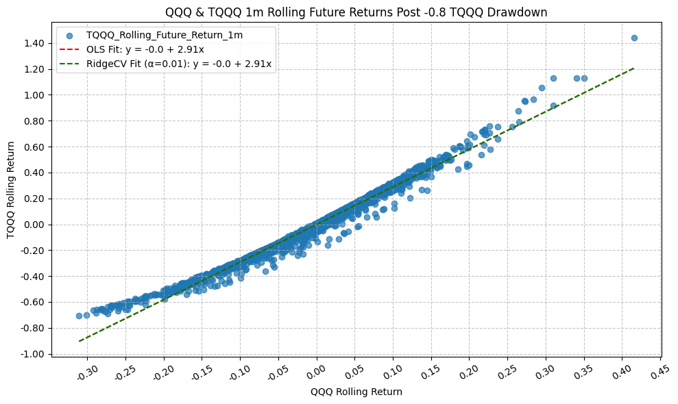
    


                                      OLS Regression Results                                 
    =========================================================================================
    Dep. Variable:     TQQQ_Rolling_Future_Return_1m   R-squared:                       0.982
    Model:                                       OLS   Adj. R-squared:                  0.982
    Method:                            Least Squares   F-statistic:                 3.034e+05
    Date:                           Mon, 16 Mar 2026   Prob (F-statistic):               0.00
    Time:                                   13:43:17   Log-Likelihood:                 12185.
    No. Observations:                           5448   AIC:                        -2.437e+04
    Df Residuals:                               5446   BIC:                        -2.435e+04
    Df Model:                                      1                                         
    Covariance Type:                       nonrobust                                         
    ================================================================================================
                                       coef    std err          t      P>|t|      [0.025      0.975]
    ------------------------------------------------------------------------------------------------
    const                           -0.0021      0.000     -5.896      0.000      -0.003      -0.001
    QQQ_Rolling_Future_Return_1m     2.9063      0.005    550.837      0.000       2.896       2.917
    ==============================================================================
    Omnibus:                     1330.394   Durbin-Watson:                   0.299
    Prob(Omnibus):                  0.000   Jarque-Bera (JB):            76723.084
    Skew:                           0.205   Prob(JB):                         0.00
    Kurtosis:                      21.380   Cond. No.                         15.1
    ==============================================================================
    
    Notes:
    [1] Standard Errors assume that the covariance matrix of the errors is correctly specified.


    
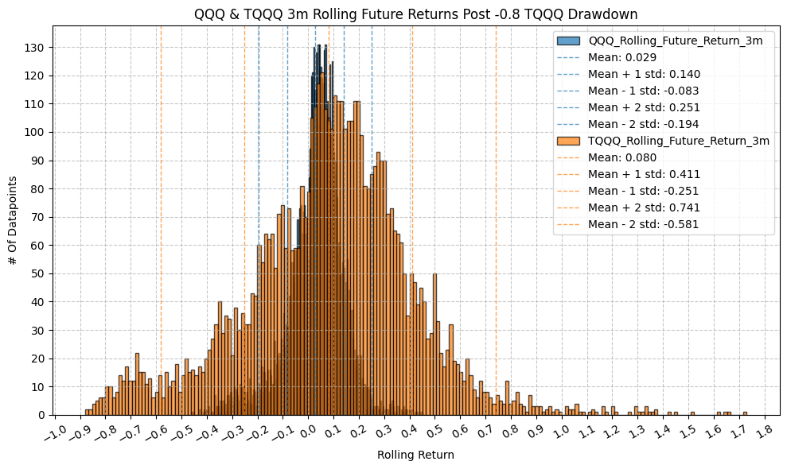
    


    
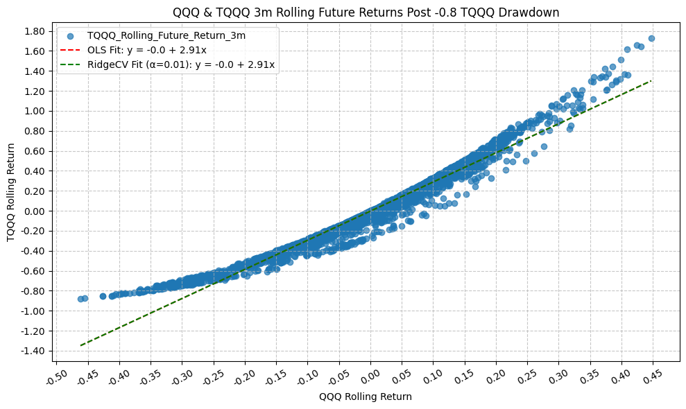
    


                                      OLS Regression Results                                 
    =========================================================================================
    Dep. Variable:     TQQQ_Rolling_Future_Return_3m   R-squared:                       0.961
    Model:                                       OLS   Adj. R-squared:                  0.961
    Method:                            Least Squares   F-statistic:                 1.351e+05
    Date:                           Mon, 16 Mar 2026   Prob (F-statistic):               0.00
    Time:                                   13:43:18   Log-Likelihood:                 7156.4
    No. Observations:                           5448   AIC:                        -1.431e+04
    Df Residuals:                               5446   BIC:                        -1.430e+04
    Df Model:                                      1                                         
    Covariance Type:                       nonrobust                                         
    ================================================================================================
                                       coef    std err          t      P>|t|      [0.025      0.975]
    ------------------------------------------------------------------------------------------------
    const                           -0.0035      0.001     -3.894      0.000      -0.005      -0.002
    QQQ_Rolling_Future_Return_3m     2.9141      0.008    367.616      0.000       2.899       2.930
    ==============================================================================
    Omnibus:                     1264.052   Durbin-Watson:                   0.097
    Prob(Omnibus):                  0.000   Jarque-Bera (JB):            15799.603
    Skew:                           0.751   Prob(JB):                         0.00
    Kurtosis:                      11.206   Cond. No.                         9.00
    ==============================================================================
    
    Notes:
    [1] Standard Errors assume that the covariance matrix of the errors is correctly specified.


    

    


    
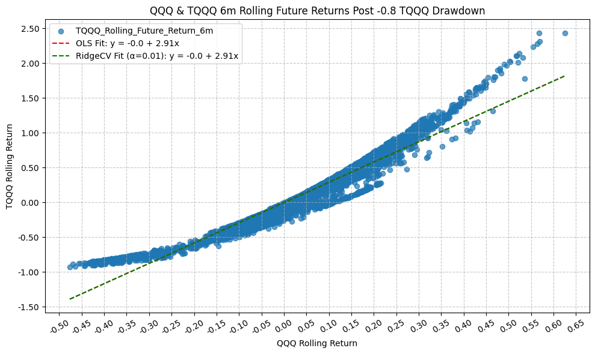
    


                                      OLS Regression Results                                 
    =========================================================================================
    Dep. Variable:     TQQQ_Rolling_Future_Return_6m   R-squared:                       0.937
    Model:                                       OLS   Adj. R-squared:                  0.937
    Method:                            Least Squares   F-statistic:                 8.113e+04
    Date:                           Mon, 16 Mar 2026   Prob (F-statistic):               0.00
    Time:                                   13:43:20   Log-Likelihood:                 4025.3
    No. Observations:                           5448   AIC:                            -8047.
    Df Residuals:                               5446   BIC:                            -8033.
    Df Model:                                      1                                         
    Covariance Type:                       nonrobust                                         
    ================================================================================================
                                       coef    std err          t      P>|t|      [0.025      0.975]
    ------------------------------------------------------------------------------------------------
    const                           -0.0043      0.002     -2.530      0.011      -0.008      -0.001
    QQQ_Rolling_Future_Return_6m     2.9102      0.010    284.832      0.000       2.890       2.930
    ==============================================================================
    Omnibus:                      970.459   Durbin-Watson:                   0.062
    Prob(Omnibus):                  0.000   Jarque-Bera (JB):             4545.928
    Skew:                           0.789   Prob(JB):                         0.00
    Kurtosis:                       7.188   Cond. No.                         6.55
    ==============================================================================
    
    Notes:
    [1] Standard Errors assume that the covariance matrix of the errors is correctly specified.


    

    


    

    


                                      OLS Regression Results                                 
    =========================================================================================
    Dep. Variable:     TQQQ_Rolling_Future_Return_1y   R-squared:                       0.917
    Model:                                       OLS   Adj. R-squared:                  0.917
    Method:                            Least Squares   F-statistic:                 5.978e+04
    Date:                           Mon, 16 Mar 2026   Prob (F-statistic):               0.00
    Time:                                   13:43:21   Log-Likelihood:                 790.32
    No. Observations:                           5444   AIC:                            -1577.
    Df Residuals:                               5442   BIC:                            -1563.
    Df Model:                                      1                                         
    Covariance Type:                       nonrobust                                         
    ================================================================================================
                                       coef    std err          t      P>|t|      [0.025      0.975]
    ------------------------------------------------------------------------------------------------
    const                           -0.0018      0.003     -0.540      0.589      -0.008       0.005
    QQQ_Rolling_Future_Return_1y     3.0627      0.013    244.506      0.000       3.038       3.087
    ==============================================================================
    Omnibus:                     1400.332   Durbin-Watson:                   0.045
    Prob(Omnibus):                  0.000   Jarque-Bera (JB):             6204.356
    Skew:                           1.186   Prob(JB):                         0.00
    Kurtosis:                       7.661   Cond. No.                         4.51
    ==============================================================================
    
    Notes:
    [1] Standard Errors assume that the covariance matrix of the errors is correctly specified.


    

    


    

    


                                      OLS Regression Results                                 
    =========================================================================================
    Dep. Variable:     TQQQ_Rolling_Future_Return_2y   R-squared:                       0.876
    Model:                                       OLS   Adj. R-squared:                  0.876
    Method:                            Least Squares   F-statistic:                 3.833e+04
    Date:                           Mon, 16 Mar 2026   Prob (F-statistic):               0.00
    Time:                                   13:43:22   Log-Likelihood:                -3103.9
    No. Observations:                           5444   AIC:                             6212.
    Df Residuals:                               5442   BIC:                             6225.
    Df Model:                                      1                                         
    Covariance Type:                       nonrobust                                         
    ================================================================================================
                                       coef    std err          t      P>|t|      [0.025      0.975]
    ------------------------------------------------------------------------------------------------
    const                           -0.1256      0.008    -15.596      0.000      -0.141      -0.110
    QQQ_Rolling_Future_Return_2y     3.5395      0.018    195.774      0.000       3.504       3.575
    ==============================================================================
    Omnibus:                     1478.767   Durbin-Watson:                   0.022
    Prob(Omnibus):                  0.000   Jarque-Bera (JB):             5089.206
    Skew:                           1.346   Prob(JB):                         0.00
    Kurtosis:                       6.898   Cond. No.                         3.45
    ==============================================================================
    
    Notes:
    [1] Standard Errors assume that the covariance matrix of the errors is correctly specified.


    

    


    

    


                                      OLS Regression Results                                 
    =========================================================================================
    Dep. Variable:     TQQQ_Rolling_Future_Return_3y   R-squared:                       0.850
    Model:                                       OLS   Adj. R-squared:                  0.850
    Method:                            Least Squares   F-statistic:                 2.988e+04
    Date:                           Mon, 16 Mar 2026   Prob (F-statistic):               0.00
    Time:                                   13:43:23   Log-Likelihood:                -5021.0
    No. Observations:                           5289   AIC:                         1.005e+04
    Df Residuals:                               5287   BIC:                         1.006e+04
    Df Model:                                      1                                         
    Covariance Type:                       nonrobust                                         
    ================================================================================================
                                       coef    std err          t      P>|t|      [0.025      0.975]
    ------------------------------------------------------------------------------------------------
    const                           -0.3933      0.014    -28.260      0.000      -0.421      -0.366
    QQQ_Rolling_Future_Return_3y     3.9757      0.023    172.869      0.000       3.931       4.021
    ==============================================================================
    Omnibus:                      578.227   Durbin-Watson:                   0.018
    Prob(Omnibus):                  0.000   Jarque-Bera (JB):             1146.794
    Skew:                           0.704   Prob(JB):                    9.48e-250
    Kurtosis:                       4.795   Cond. No.                         3.36
    ==============================================================================
    
    Notes:
    [1] Standard Errors assume that the covariance matrix of the errors is correctly specified.


    

    


    

    


                                      OLS Regression Results                                 
    =========================================================================================
    Dep. Variable:     TQQQ_Rolling_Future_Return_4y   R-squared:                       0.820
    Model:                                       OLS   Adj. R-squared:                  0.820
    Method:                            Least Squares   F-statistic:                 2.303e+04
    Date:                           Mon, 16 Mar 2026   Prob (F-statistic):               0.00
    Time:                                   13:43:24   Log-Likelihood:                -7126.5
    No. Observations:                           5068   AIC:                         1.426e+04
    Df Residuals:                               5066   BIC:                         1.427e+04
    Df Model:                                      1                                         
    Covariance Type:                       nonrobust                                         
    ================================================================================================
                                       coef    std err          t      P>|t|      [0.025      0.975]
    ------------------------------------------------------------------------------------------------
    const                           -0.7486      0.024    -30.693      0.000      -0.796      -0.701
    QQQ_Rolling_Future_Return_4y     4.5873      0.030    151.752      0.000       4.528       4.647
    ==============================================================================
    Omnibus:                       13.154   Durbin-Watson:                   0.011
    Prob(Omnibus):                  0.001   Jarque-Bera (JB):               13.239
    Skew:                          -0.121   Prob(JB):                      0.00133
    Kurtosis:                       2.934   Cond. No.                         3.29
    ==============================================================================
    
    Notes:
    [1] Standard Errors assume that the covariance matrix of the errors is correctly specified.


    

    


    

    


                                      OLS Regression Results                                 
    =========================================================================================
    Dep. Variable:     TQQQ_Rolling_Future_Return_5y   R-squared:                       0.766
    Model:                                       OLS   Adj. R-squared:                  0.766
    Method:                            Least Squares   F-statistic:                 1.659e+04
    Date:                           Mon, 16 Mar 2026   Prob (F-statistic):               0.00
    Time:                                   13:43:26   Log-Likelihood:                -10800.
    No. Observations:                           5068   AIC:                         2.160e+04
    Df Residuals:                               5066   BIC:                         2.162e+04
    Df Model:                                      1                                         
    Covariance Type:                       nonrobust                                         
    ================================================================================================
                                       coef    std err          t      P>|t|      [0.025      0.975]
    ------------------------------------------------------------------------------------------------
    const                           -1.7612      0.052    -34.112      0.000      -1.862      -1.660
    QQQ_Rolling_Future_Return_5y     5.9669      0.046    128.790      0.000       5.876       6.058
    ==============================================================================
    Omnibus:                      145.200   Durbin-Watson:                   0.010
    Prob(Omnibus):                  0.000   Jarque-Bera (JB):              276.778
    Skew:                           0.210   Prob(JB):                     7.91e-61
    Kurtosis:                       4.065   Cond. No.                         3.33
    ==============================================================================
    
    Notes:
    [1] Standard Errors assume that the covariance matrix of the errors is correctly specified.


### Rolling Returns Following Drawdowns Deviation (QQQ & TQQQ)


```python
rolling_returns_positive_future_returns = pd.DataFrame(index=rolling_windows.keys(), data=rolling_windows.values())
rolling_returns_positive_future_returns.reset_index(inplace=True)
rolling_returns_positive_future_returns.rename(columns={"index":"Period", 0:"Days"}, inplace=True)

for drawdown in drawdown_levels:
    temp = rolling_returns_drawdown_stats.loc[rolling_returns_drawdown_stats["Drawdown"] == drawdown]
    temp = temp[["Period", "Positive_Future_Percentage"]]
    temp.rename(columns={"Positive_Future_Percentage" : f"Positive_Future_Percentage_Post_{drawdown}_Drawdown"}, inplace=True)
    rolling_returns_positive_future_returns = pd.merge(rolling_returns_positive_future_returns, temp, left_on="Period", right_on="Period", how="outer")
    rolling_returns_positive_future_returns.sort_values(by="Days", ascending=True, inplace=True)

rolling_returns_positive_future_returns.drop(columns={"Days"}, inplace=True)
rolling_returns_positive_future_returns.reset_index(drop=True, inplace=True)
display(rolling_returns_positive_future_returns)
```


<div>
<style scoped>
    .dataframe tbody tr th:only-of-type {
        vertical-align: middle;
    }

    .dataframe tbody tr th {
        vertical-align: top;
    }

    .dataframe thead th {
        text-align: right;
    }
</style>
<table border="1" class="dataframe">
  <thead>
    <tr style="text-align: right;">
      <th></th>
      <th>Period</th>
      <th>Positive_Future_Percentage_Post_-0.1_Drawdown</th>
      <th>Positive_Future_Percentage_Post_-0.2_Drawdown</th>
      <th>Positive_Future_Percentage_Post_-0.3_Drawdown</th>
      <th>Positive_Future_Percentage_Post_-0.4_Drawdown</th>
      <th>Positive_Future_Percentage_Post_-0.5_Drawdown</th>
      <th>Positive_Future_Percentage_Post_-0.6_Drawdown</th>
      <th>Positive_Future_Percentage_Post_-0.7_Drawdown</th>
      <th>Positive_Future_Percentage_Post_-0.8_Drawdown</th>
    </tr>
  </thead>
  <tbody>
    <tr>
      <th>0</th>
      <td>1d</td>
      <td>0.544</td>
      <td>0.543</td>
      <td>0.544</td>
      <td>0.543</td>
      <td>0.544</td>
      <td>0.545</td>
      <td>0.543</td>
      <td>0.544</td>
    </tr>
    <tr>
      <th>1</th>
      <td>1w</td>
      <td>0.563</td>
      <td>0.562</td>
      <td>0.562</td>
      <td>0.562</td>
      <td>0.563</td>
      <td>0.565</td>
      <td>0.565</td>
      <td>0.564</td>
    </tr>
    <tr>
      <th>2</th>
      <td>1m</td>
      <td>0.597</td>
      <td>0.596</td>
      <td>0.594</td>
      <td>0.594</td>
      <td>0.597</td>
      <td>0.599</td>
      <td>0.600</td>
      <td>0.599</td>
    </tr>
    <tr>
      <th>3</th>
      <td>3m</td>
      <td>0.639</td>
      <td>0.638</td>
      <td>0.637</td>
      <td>0.637</td>
      <td>0.639</td>
      <td>0.643</td>
      <td>0.651</td>
      <td>0.648</td>
    </tr>
    <tr>
      <th>4</th>
      <td>6m</td>
      <td>0.665</td>
      <td>0.665</td>
      <td>0.664</td>
      <td>0.664</td>
      <td>0.665</td>
      <td>0.668</td>
      <td>0.689</td>
      <td>0.684</td>
    </tr>
    <tr>
      <th>5</th>
      <td>1y</td>
      <td>0.708</td>
      <td>0.708</td>
      <td>0.708</td>
      <td>0.708</td>
      <td>0.709</td>
      <td>0.712</td>
      <td>0.728</td>
      <td>0.744</td>
    </tr>
    <tr>
      <th>6</th>
      <td>2y</td>
      <td>0.734</td>
      <td>0.743</td>
      <td>0.748</td>
      <td>0.749</td>
      <td>0.750</td>
      <td>0.754</td>
      <td>0.780</td>
      <td>0.802</td>
    </tr>
    <tr>
      <th>7</th>
      <td>3y</td>
      <td>0.745</td>
      <td>0.755</td>
      <td>0.760</td>
      <td>0.761</td>
      <td>0.762</td>
      <td>0.766</td>
      <td>0.781</td>
      <td>0.782</td>
    </tr>
    <tr>
      <th>8</th>
      <td>4y</td>
      <td>0.731</td>
      <td>0.741</td>
      <td>0.746</td>
      <td>0.748</td>
      <td>0.748</td>
      <td>0.750</td>
      <td>0.756</td>
      <td>0.755</td>
    </tr>
    <tr>
      <th>9</th>
      <td>5y</td>
      <td>0.729</td>
      <td>0.740</td>
      <td>0.746</td>
      <td>0.747</td>
      <td>0.748</td>
      <td>0.750</td>
      <td>0.762</td>
      <td>0.764</td>
    </tr>
  </tbody>
</table>
</div>


```python
plot_scatter(
    df=rolling_returns_positive_future_returns,
    x_plot_column="Period",
    y_plot_columns=[col for col in rolling_returns_positive_future_returns.columns if col != "Period"],
    title="TQQQ Future Return by Time Period Post Drawdown",
    x_label="Rolling Return Time Period",
    x_format="String",
    x_format_decimal_places=0,
    x_tick_spacing=1,
    x_tick_rotation=0,
    y_label="Positive Future Return Percentage",
    y_format="Decimal",
    y_format_decimal_places=2,
    y_tick_spacing="Auto",
    y_tick_rotation=0,
    plot_OLS_regression_line=False,
    OLS_column=None,
    plot_Ridge_regression_line=False,
    Ridge_column=None,
    plot_RidgeCV_regression_line=False,
    RidgeCV_column=None,
    regression_constant=False,
    grid=True,
    legend=True,
    export_plot=False,
    plot_file_name=None,
)
```


    

    


This plot summarizes the future rolling returns well. For rolling returns up to ~3 months *following* all drawdown levels, we see the rolling returns of TQQQ are positive ~65% of the time.

As we extend the time horizon, the percentage of positive rolling returns increases, which is consistent with the idea that the longer you hold through and post drawdown, the more likely you are to recover and achieve positive returns.

From a timing standpoint, this analysis suggests that the optimal time to buy TQQQ would be following a drawdown of 70% or more, and holding for at least 3 years. The data tells us that having a positive rolling return over time is ~75%.

One might consider the idea of allocating to TQQQ via a ladder, starting at a drawdown of 50%, and continuing to add to the position as the drawdown deepens, with the idea that the more severe the drawdown, the higher the expected future returns. However, this strategy could require enduring significant volatility, as one would be adding to the position during periods of paper losses.

## SPY & UPRO

Next, we will repeat the same analysis for SPY and UPRO, and see how the results compare to those of QQQ and TQQQ.

### Acquire & Plot Data (SPY)

First, let's get the data for SPY. If we already have the desired data, we can load it from a local file. Otherwise, we can download it from Yahoo Finance using the `yf_pull_data` function.


```python
yf_pull_data(
    base_directory=DATA_DIR,
    ticker="SPY",
    adjusted=False,
    source="Yahoo_Finance",
    asset_class="Exchange_Traded_Funds",
    excel_export=True,
    pickle_export=True,
    output_confirmation=False,
)

spy = load_data(
    base_directory=DATA_DIR,
    ticker="SPY",
    source="Yahoo_Finance",
    asset_class="Exchange_Traded_Funds",
    timeframe="Daily",
    file_format="pickle",
)

# Rename columns to "SPY_Close", etc.
spy = spy.rename(columns={
    "Adj Close": "SPY_Adj_Close",
    "Close": "SPY_Close",
    "High": "SPY_High",
    "Low": "SPY_Low",
    "Open": "SPY_Open",
    "Volume": "SPY_Volume"
})
```

    
[*********************100%***********************]  1 of 1 completed

    


This gives us:


```python
display(spy)
```


<div>
<style scoped>
    .dataframe tbody tr th:only-of-type {
        vertical-align: middle;
    }

    .dataframe tbody tr th {
        vertical-align: top;
    }

    .dataframe thead th {
        text-align: right;
    }
</style>
<table border="1" class="dataframe">
  <thead>
    <tr style="text-align: right;">
      <th></th>
      <th>SPY_Adj_Close</th>
      <th>SPY_Close</th>
      <th>SPY_High</th>
      <th>SPY_Low</th>
      <th>SPY_Open</th>
      <th>SPY_Volume</th>
    </tr>
    <tr>
      <th>Date</th>
      <th></th>
      <th></th>
      <th></th>
      <th></th>
      <th></th>
      <th></th>
    </tr>
  </thead>
  <tbody>
    <tr>
      <th>1993-01-29</th>
      <td>24.241</td>
      <td>43.938</td>
      <td>43.969</td>
      <td>43.750</td>
      <td>43.969</td>
      <td>1003200</td>
    </tr>
    <tr>
      <th>1993-02-01</th>
      <td>24.414</td>
      <td>44.250</td>
      <td>44.250</td>
      <td>43.969</td>
      <td>43.969</td>
      <td>480500</td>
    </tr>
    <tr>
      <th>1993-02-02</th>
      <td>24.466</td>
      <td>44.344</td>
      <td>44.375</td>
      <td>44.125</td>
      <td>44.219</td>
      <td>201300</td>
    </tr>
    <tr>
      <th>1993-02-03</th>
      <td>24.724</td>
      <td>44.812</td>
      <td>44.844</td>
      <td>44.375</td>
      <td>44.406</td>
      <td>529400</td>
    </tr>
    <tr>
      <th>1993-02-04</th>
      <td>24.828</td>
      <td>45.000</td>
      <td>45.094</td>
      <td>44.469</td>
      <td>44.969</td>
      <td>531500</td>
    </tr>
    <tr>
      <th>...</th>
      <td>...</td>
      <td>...</td>
      <td>...</td>
      <td>...</td>
      <td>...</td>
      <td>...</td>
    </tr>
    <tr>
      <th>2026-03-09</th>
      <td>678.270</td>
      <td>678.270</td>
      <td>679.920</td>
      <td>662.390</td>
      <td>666.390</td>
      <td>102667700</td>
    </tr>
    <tr>
      <th>2026-03-10</th>
      <td>677.180</td>
      <td>677.180</td>
      <td>683.360</td>
      <td>674.760</td>
      <td>677.720</td>
      <td>81505300</td>
    </tr>
    <tr>
      <th>2026-03-11</th>
      <td>676.330</td>
      <td>676.330</td>
      <td>680.080</td>
      <td>673.340</td>
      <td>677.580</td>
      <td>68441700</td>
    </tr>
    <tr>
      <th>2026-03-12</th>
      <td>666.060</td>
      <td>666.060</td>
      <td>671.650</td>
      <td>665.870</td>
      <td>671.160</td>
      <td>108882200</td>
    </tr>
    <tr>
      <th>2026-03-13</th>
      <td>662.290</td>
      <td>662.290</td>
      <td>672.340</td>
      <td>661.360</td>
      <td>669.270</td>
      <td>96905100</td>
    </tr>
  </tbody>
</table>
<p>8337 rows × 6 columns</p>
</div>


And the plot of the timseries of ajdusted close prices:


```python
plot_timeseries(
    df=spy,
    plot_start_date=None,
    plot_end_date=None,
    plot_columns=["SPY_Close"],
    title="SPY Close Price",
    x_label="Date",
    x_format="Year",
    x_tick_spacing=2,
    x_tick_rotation=30,
    y_label="Price ($)",
    y_format="Decimal",
    y_format_decimal_places=0,
    y_tick_spacing="Auto",
    y_tick_rotation=0,
    grid=True,
    legend=False,
    export_plot=False,
    plot_file_name=None,
)
```


    

    


### Acquire & Plot Data (UPRO)

Next, UPRO:


```python
yf_pull_data(
    base_directory=DATA_DIR,
    ticker="UPRO",
    adjusted=False,
    source="Yahoo_Finance", 
    asset_class="Exchange_Traded_Funds", 
    excel_export=True,
    pickle_export=True,
    output_confirmation=False,
)
    
upro = load_data(
    base_directory=DATA_DIR,
    ticker="UPRO",
    source="Yahoo_Finance", 
    asset_class="Exchange_Traded_Funds",
    timeframe="Daily",
    file_format="pickle",
)

# Rename columns to "UPRO_Close", etc.
upro = upro.rename(columns={
    "Adj Close": "UPRO_Adj_Close",
    "Close": "UPRO_Close", 
    "High": "UPRO_High", 
    "Low": "UPRO_Low", 
    "Open": "UPRO_Open", 
    "Volume": "UPRO_Volume"
})

```

    
[*********************100%***********************]  1 of 1 completed

    


This gives us:


```python
display(upro)
```


<div>
<style scoped>
    .dataframe tbody tr th:only-of-type {
        vertical-align: middle;
    }

    .dataframe tbody tr th {
        vertical-align: top;
    }

    .dataframe thead th {
        text-align: right;
    }
</style>
<table border="1" class="dataframe">
  <thead>
    <tr style="text-align: right;">
      <th></th>
      <th>UPRO_Adj_Close</th>
      <th>UPRO_Close</th>
      <th>UPRO_High</th>
      <th>UPRO_Low</th>
      <th>UPRO_Open</th>
      <th>UPRO_Volume</th>
    </tr>
    <tr>
      <th>Date</th>
      <th></th>
      <th></th>
      <th></th>
      <th></th>
      <th></th>
      <th></th>
    </tr>
  </thead>
  <tbody>
    <tr>
      <th>2009-06-25</th>
      <td>1.135</td>
      <td>1.206</td>
      <td>1.210</td>
      <td>1.126</td>
      <td>1.126</td>
      <td>2577600</td>
    </tr>
    <tr>
      <th>2009-06-26</th>
      <td>1.129</td>
      <td>1.199</td>
      <td>1.213</td>
      <td>1.177</td>
      <td>1.195</td>
      <td>13104000</td>
    </tr>
    <tr>
      <th>2009-06-29</th>
      <td>1.161</td>
      <td>1.233</td>
      <td>1.236</td>
      <td>1.191</td>
      <td>1.208</td>
      <td>8690400</td>
    </tr>
    <tr>
      <th>2009-06-30</th>
      <td>1.133</td>
      <td>1.204</td>
      <td>1.243</td>
      <td>1.176</td>
      <td>1.233</td>
      <td>17128800</td>
    </tr>
    <tr>
      <th>2009-07-01</th>
      <td>1.145</td>
      <td>1.217</td>
      <td>1.253</td>
      <td>1.214</td>
      <td>1.218</td>
      <td>12038400</td>
    </tr>
    <tr>
      <th>...</th>
      <td>...</td>
      <td>...</td>
      <td>...</td>
      <td>...</td>
      <td>...</td>
      <td>...</td>
    </tr>
    <tr>
      <th>2026-03-09</th>
      <td>110.970</td>
      <td>110.970</td>
      <td>111.740</td>
      <td>103.270</td>
      <td>105.200</td>
      <td>9101400</td>
    </tr>
    <tr>
      <th>2026-03-10</th>
      <td>110.310</td>
      <td>110.310</td>
      <td>113.410</td>
      <td>109.210</td>
      <td>110.650</td>
      <td>6155700</td>
    </tr>
    <tr>
      <th>2026-03-11</th>
      <td>109.940</td>
      <td>109.940</td>
      <td>111.760</td>
      <td>108.490</td>
      <td>110.540</td>
      <td>4181000</td>
    </tr>
    <tr>
      <th>2026-03-12</th>
      <td>104.890</td>
      <td>104.890</td>
      <td>107.620</td>
      <td>104.800</td>
      <td>107.350</td>
      <td>6085600</td>
    </tr>
    <tr>
      <th>2026-03-13</th>
      <td>103.010</td>
      <td>103.010</td>
      <td>107.760</td>
      <td>102.600</td>
      <td>106.300</td>
      <td>6577000</td>
    </tr>
  </tbody>
</table>
<p>4205 rows × 6 columns</p>
</div>


And the plot of the timseries of ajdusted close prices:


```python
plot_timeseries(
    df=upro,
    plot_start_date=None,
    plot_end_date=None,
    plot_columns=["UPRO_Close"],
    title="UPRO Close Price",
    x_label="Date",
    x_format="Year",
    x_tick_spacing=1,
    x_tick_rotation=30,
    y_label="Price ($)",
    y_format="Decimal",
    y_format_decimal_places=0,
    y_tick_spacing="Auto",
    y_tick_rotation=0,
    grid=True,
    legend=False,
    export_plot=False,
    plot_file_name=None,
)
```


    

    


Looking at the close prices doesn't give us a true picture of the magnitude of the difference in returns due to the leverage. In order to see that, we need to look at the cumulative returns and the drawdowns.

 ### Calculate & Plot Cumulative Returns, Rolling Returns, and Drawdowns (SPY & UPRO)

 Next, we will calculate the cumulative returns, rolling returns, and drawdowns. This involves aligning the data to start with the inception of UPRO. For this excercise, we will not extrapolate the data for SPY back to 1993, but rather just align the data from the inception of UPRO in 2009.


```python
etfs = ["SPY", "UPRO"]

# Merge dataframes and drop rows with missing values
spy_upro_aligned = upro.merge(spy, left_index=True, right_index=True, how='left')
spy_upro_aligned = spy_upro_aligned.dropna()

# Calculate cumulative returns
for etf in etfs:
    spy_upro_aligned[f"{etf}_Return"] = spy_upro_aligned[f"{etf}_Close"].pct_change()
    spy_upro_aligned[f"{etf}_Cumulative_Return"] = (1 + spy_upro_aligned[f"{etf}_Return"]).cumprod() - 1
    spy_upro_aligned[f"{etf}_Cumulative_Return_Plus_One"] = 1 + spy_upro_aligned[f"{etf}_Cumulative_Return"]
    spy_upro_aligned[f"{etf}_Rolling_Max"] = spy_upro_aligned[f"{etf}_Cumulative_Return_Plus_One"].cummax()
    spy_upro_aligned[f"{etf}_Drawdown"] = spy_upro_aligned[f"{etf}_Cumulative_Return_Plus_One"] / spy_upro_aligned[f"{etf}_Rolling_Max"] - 1
    spy_upro_aligned.drop(columns=[f"{etf}_Cumulative_Return_Plus_One", f"{etf}_Rolling_Max"], inplace=True)

# Define rolling windows in trading days
rolling_windows = {
    '1d': 1,      # 1 day
    '1w': 5,      # 1 week (5 trading days)
    '1m': 21,     # 1 month (~21 trading days)
    '3m': 63,     # 3 months (~63 trading days)
    '6m': 126,    # 6 months (~126 trading days)
    '1y': 252,    # 1 year (~252 trading days)
    '2y': 504,    # 2 years (~504 trading days)
    '3y': 756,    # 3 years (~756 trading days)
    '4y': 1008,   # 4 years (~1008 trading days)
    '5y': 1260,   # 5 years (~1260 trading days)
}

# Calculate rolling returns for each ETF and each window
for etf in etfs:
    for period_name, window in rolling_windows.items():
        spy_upro_aligned[f"{etf}_Rolling_Return_{period_name}"] = (
            spy_upro_aligned[f"{etf}_Close"].pct_change(periods=window)
        )

```


```python
display(spy_upro_aligned)
```


<div>
<style scoped>
    .dataframe tbody tr th:only-of-type {
        vertical-align: middle;
    }

    .dataframe tbody tr th {
        vertical-align: top;
    }

    .dataframe thead th {
        text-align: right;
    }
</style>
<table border="1" class="dataframe">
  <thead>
    <tr style="text-align: right;">
      <th></th>
      <th>UPRO_Adj_Close</th>
      <th>UPRO_Close</th>
      <th>UPRO_High</th>
      <th>UPRO_Low</th>
      <th>UPRO_Open</th>
      <th>UPRO_Volume</th>
      <th>SPY_Adj_Close</th>
      <th>SPY_Close</th>
      <th>SPY_High</th>
      <th>SPY_Low</th>
      <th>...</th>
      <th>UPRO_Rolling_Return_1d</th>
      <th>UPRO_Rolling_Return_1w</th>
      <th>UPRO_Rolling_Return_1m</th>
      <th>UPRO_Rolling_Return_3m</th>
      <th>UPRO_Rolling_Return_6m</th>
      <th>UPRO_Rolling_Return_1y</th>
      <th>UPRO_Rolling_Return_2y</th>
      <th>UPRO_Rolling_Return_3y</th>
      <th>UPRO_Rolling_Return_4y</th>
      <th>UPRO_Rolling_Return_5y</th>
    </tr>
    <tr>
      <th>Date</th>
      <th></th>
      <th></th>
      <th></th>
      <th></th>
      <th></th>
      <th></th>
      <th></th>
      <th></th>
      <th></th>
      <th></th>
      <th></th>
      <th></th>
      <th></th>
      <th></th>
      <th></th>
      <th></th>
      <th></th>
      <th></th>
      <th></th>
      <th></th>
      <th></th>
    </tr>
  </thead>
  <tbody>
    <tr>
      <th>2009-06-25</th>
      <td>1.135</td>
      <td>1.206</td>
      <td>1.210</td>
      <td>1.126</td>
      <td>1.126</td>
      <td>2577600</td>
      <td>68.389</td>
      <td>92.080</td>
      <td>92.170</td>
      <td>89.570</td>
      <td>...</td>
      <td>NaN</td>
      <td>NaN</td>
      <td>NaN</td>
      <td>NaN</td>
      <td>NaN</td>
      <td>NaN</td>
      <td>NaN</td>
      <td>NaN</td>
      <td>NaN</td>
      <td>NaN</td>
    </tr>
    <tr>
      <th>2009-06-26</th>
      <td>1.129</td>
      <td>1.199</td>
      <td>1.213</td>
      <td>1.177</td>
      <td>1.195</td>
      <td>13104000</td>
      <td>68.211</td>
      <td>91.840</td>
      <td>92.240</td>
      <td>91.270</td>
      <td>...</td>
      <td>-0.005</td>
      <td>NaN</td>
      <td>NaN</td>
      <td>NaN</td>
      <td>NaN</td>
      <td>NaN</td>
      <td>NaN</td>
      <td>NaN</td>
      <td>NaN</td>
      <td>NaN</td>
    </tr>
    <tr>
      <th>2009-06-29</th>
      <td>1.161</td>
      <td>1.233</td>
      <td>1.236</td>
      <td>1.191</td>
      <td>1.208</td>
      <td>8690400</td>
      <td>68.850</td>
      <td>92.700</td>
      <td>92.820</td>
      <td>91.600</td>
      <td>...</td>
      <td>0.028</td>
      <td>NaN</td>
      <td>NaN</td>
      <td>NaN</td>
      <td>NaN</td>
      <td>NaN</td>
      <td>NaN</td>
      <td>NaN</td>
      <td>NaN</td>
      <td>NaN</td>
    </tr>
    <tr>
      <th>2009-06-30</th>
      <td>1.133</td>
      <td>1.204</td>
      <td>1.243</td>
      <td>1.176</td>
      <td>1.233</td>
      <td>17128800</td>
      <td>68.292</td>
      <td>91.950</td>
      <td>93.060</td>
      <td>91.270</td>
      <td>...</td>
      <td>-0.024</td>
      <td>NaN</td>
      <td>NaN</td>
      <td>NaN</td>
      <td>NaN</td>
      <td>NaN</td>
      <td>NaN</td>
      <td>NaN</td>
      <td>NaN</td>
      <td>NaN</td>
    </tr>
    <tr>
      <th>2009-07-01</th>
      <td>1.145</td>
      <td>1.217</td>
      <td>1.253</td>
      <td>1.214</td>
      <td>1.218</td>
      <td>12038400</td>
      <td>68.575</td>
      <td>92.330</td>
      <td>93.230</td>
      <td>92.210</td>
      <td>...</td>
      <td>0.011</td>
      <td>NaN</td>
      <td>NaN</td>
      <td>NaN</td>
      <td>NaN</td>
      <td>NaN</td>
      <td>NaN</td>
      <td>NaN</td>
      <td>NaN</td>
      <td>NaN</td>
    </tr>
    <tr>
      <th>...</th>
      <td>...</td>
      <td>...</td>
      <td>...</td>
      <td>...</td>
      <td>...</td>
      <td>...</td>
      <td>...</td>
      <td>...</td>
      <td>...</td>
      <td>...</td>
      <td>...</td>
      <td>...</td>
      <td>...</td>
      <td>...</td>
      <td>...</td>
      <td>...</td>
      <td>...</td>
      <td>...</td>
      <td>...</td>
      <td>...</td>
      <td>...</td>
    </tr>
    <tr>
      <th>2026-03-09</th>
      <td>110.970</td>
      <td>110.970</td>
      <td>111.740</td>
      <td>103.270</td>
      <td>105.200</td>
      <td>9101400</td>
      <td>678.270</td>
      <td>678.270</td>
      <td>679.920</td>
      <td>662.390</td>
      <td>...</td>
      <td>0.026</td>
      <td>-0.038</td>
      <td>-0.009</td>
      <td>-0.056</td>
      <td>0.084</td>
      <td>0.383</td>
      <td>0.668</td>
      <td>2.110</td>
      <td>1.007</td>
      <td>1.656</td>
    </tr>
    <tr>
      <th>2026-03-10</th>
      <td>110.310</td>
      <td>110.310</td>
      <td>113.410</td>
      <td>109.210</td>
      <td>110.650</td>
      <td>6155700</td>
      <td>677.180</td>
      <td>677.180</td>
      <td>683.360</td>
      <td>674.760</td>
      <td>...</td>
      <td>-0.006</td>
      <td>-0.017</td>
      <td>-0.069</td>
      <td>-0.065</td>
      <td>0.069</td>
      <td>0.355</td>
      <td>0.710</td>
      <td>1.952</td>
      <td>0.893</td>
      <td>1.748</td>
    </tr>
    <tr>
      <th>2026-03-11</th>
      <td>109.940</td>
      <td>109.940</td>
      <td>111.760</td>
      <td>108.490</td>
      <td>110.540</td>
      <td>4181000</td>
      <td>676.330</td>
      <td>676.330</td>
      <td>680.080</td>
      <td>673.340</td>
      <td>...</td>
      <td>-0.003</td>
      <td>-0.041</td>
      <td>-0.085</td>
      <td>-0.060</td>
      <td>0.059</td>
      <td>0.467</td>
      <td>0.679</td>
      <td>1.933</td>
      <td>0.914</td>
      <td>1.847</td>
    </tr>
    <tr>
      <th>2026-03-12</th>
      <td>104.890</td>
      <td>104.890</td>
      <td>107.620</td>
      <td>104.800</td>
      <td>107.350</td>
      <td>6085600</td>
      <td>666.060</td>
      <td>666.060</td>
      <td>671.650</td>
      <td>665.870</td>
      <td>...</td>
      <td>-0.046</td>
      <td>-0.069</td>
      <td>-0.120</td>
      <td>-0.101</td>
      <td>0.001</td>
      <td>0.435</td>
      <td>0.556</td>
      <td>1.934</td>
      <td>0.872</td>
      <td>1.573</td>
    </tr>
    <tr>
      <th>2026-03-13</th>
      <td>103.010</td>
      <td>103.010</td>
      <td>107.760</td>
      <td>102.600</td>
      <td>106.300</td>
      <td>6577000</td>
      <td>662.290</td>
      <td>662.290</td>
      <td>672.340</td>
      <td>661.360</td>
      <td>...</td>
      <td>-0.018</td>
      <td>-0.048</td>
      <td>-0.134</td>
      <td>-0.133</td>
      <td>-0.040</td>
      <td>0.389</td>
      <td>0.557</td>
      <td>1.869</td>
      <td>1.017</td>
      <td>1.565</td>
    </tr>
  </tbody>
</table>
<p>4205 rows × 38 columns</p>
</div>


And now the plot for the cumulative returns:


```python
plot_timeseries(
    df=spy_upro_aligned,
    plot_start_date=None,
    plot_end_date=None,
    plot_columns=["SPY_Cumulative_Return", "UPRO_Cumulative_Return"],
    title="Cumulative Returns",
    x_label="Date",
    x_format="Year",
    x_tick_spacing=1,
    x_tick_rotation=30,
    y_label="Cumulative Return",
    y_format="Decimal",
    y_format_decimal_places=0,
    y_tick_spacing="Auto",
    y_tick_rotation=0,
    grid=True,
    legend=True,
    export_plot=False,
    plot_file_name=None,
)

```


    
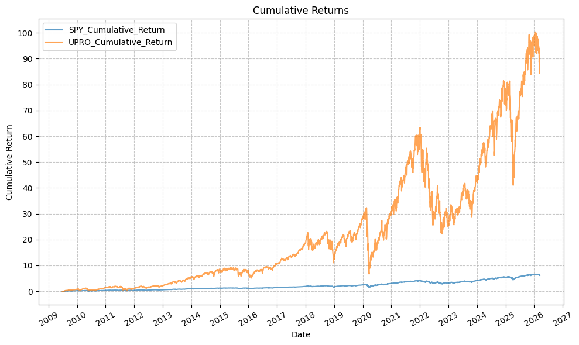
    


And the drawdown plot:


```python
plot_timeseries(
    df=spy_upro_aligned,
    plot_start_date=None,
    plot_end_date=None,
    plot_columns=["SPY_Drawdown", "UPRO_Drawdown"],
    title="Drawdowns",
    x_label="Date",
    x_format="Year",
    x_tick_spacing=1,
    x_tick_rotation=30,
    y_label="Drawdown",
    y_format="Percentage",
    y_format_decimal_places=0,
    y_tick_spacing="Auto",
    y_tick_rotation=0,
    grid=True,
    legend=True,
    export_plot=False,
    plot_file_name=None,
)

```


    
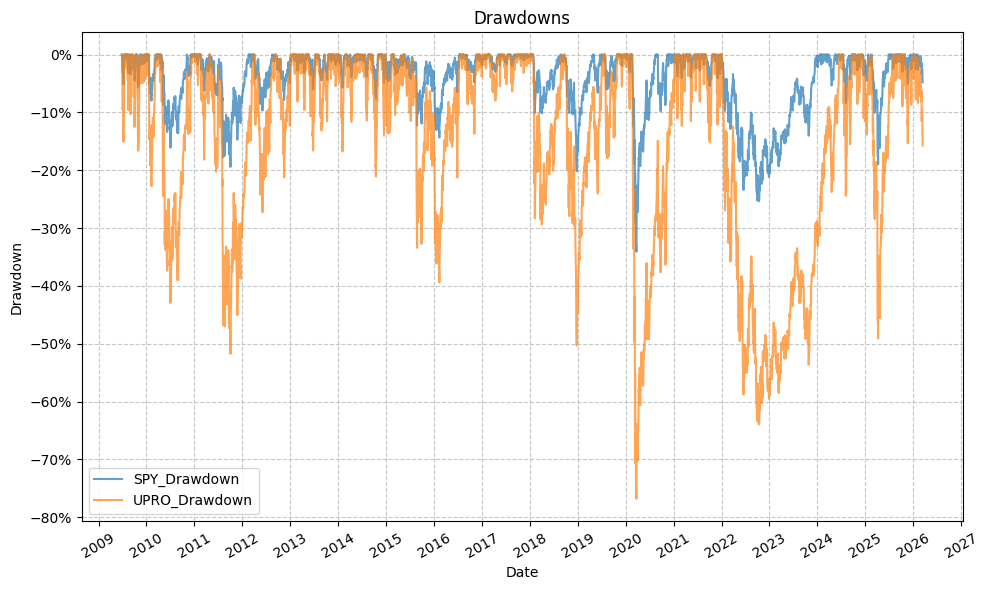
    


### Summary Statistics (SPY & UPRO)

Looking at the summary statistics further confirms our intuitions about the volatility and drawdowns.


```python
spy_sum_stats = summary_stats(
    fund_list=["SPY"],
    df=spy_upro_aligned[["SPY_Return"]],
    period="Daily",
    use_calendar_days=False,
    excel_export=False,
    pickle_export=False,
    output_confirmation=False,
)

upro_sum_stats = summary_stats(
    fund_list=["UPRO"],
    df=spy_upro_aligned[["UPRO_Return"]],
    period="Daily",
    use_calendar_days=False,
    excel_export=False,
    pickle_export=False,
    output_confirmation=False,
)

sum_stats = pd.concat([spy_sum_stats, upro_sum_stats])

display(sum_stats)
```


<div>
<style scoped>
    .dataframe tbody tr th:only-of-type {
        vertical-align: middle;
    }

    .dataframe tbody tr th {
        vertical-align: top;
    }

    .dataframe thead th {
        text-align: right;
    }
</style>
<table border="1" class="dataframe">
  <thead>
    <tr style="text-align: right;">
      <th></th>
      <th>Annual Mean Return (Arithmetic)</th>
      <th>Annualized Volatility</th>
      <th>Annualized Sharpe Ratio</th>
      <th>CAGR (Geometric)</th>
      <th>Daily Max Return</th>
      <th>Daily Max Return (Date)</th>
      <th>Daily Min Return</th>
      <th>Daily Min Return (Date)</th>
      <th>Max Drawdown</th>
      <th>Peak</th>
      <th>Trough</th>
      <th>Recovery Date</th>
      <th>Days to Recovery</th>
      <th>MAR Ratio</th>
    </tr>
  </thead>
  <tbody>
    <tr>
      <th>SPY_Return</th>
      <td>0.133</td>
      <td>0.172</td>
      <td>0.774</td>
      <td>0.126</td>
      <td>0.105</td>
      <td>2025-04-09</td>
      <td>-0.109</td>
      <td>2020-03-16</td>
      <td>-0.341</td>
      <td>2020-02-19</td>
      <td>2020-03-23</td>
      <td>2020-08-18</td>
      <td>148</td>
      <td>0.368</td>
    </tr>
    <tr>
      <th>UPRO_Return</th>
      <td>0.400</td>
      <td>0.513</td>
      <td>0.780</td>
      <td>0.305</td>
      <td>0.280</td>
      <td>2020-03-24</td>
      <td>-0.349</td>
      <td>2020-03-16</td>
      <td>-0.768</td>
      <td>2020-02-19</td>
      <td>2020-03-23</td>
      <td>2021-01-08</td>
      <td>291</td>
      <td>0.398</td>
    </tr>
  </tbody>
</table>
</div>


### Plot Returns & Verify Beta (SPY & UPRO)

Before we look at the rolling returns, let us first verify that the daily returns for UPRO are in fact ~3x those of SPY.


```python
plot_scatter(
    df=spy_upro_aligned,
    x_plot_column="SPY_Return",
    y_plot_columns=["UPRO_Return"],
    title="SPY & UPRO Returns",
    x_label="SPY Return",
    x_format="Decimal",
    x_format_decimal_places=2,
    x_tick_spacing="Auto",
    x_tick_rotation=30,
    y_label="UPRO Return",
    y_format="Decimal",
    y_format_decimal_places=2,
    y_tick_spacing="Auto",
    y_tick_rotation=0,
    plot_OLS_regression_line=True,
    OLS_column="UPRO_Return",
    plot_Ridge_regression_line=False,
    Ridge_column=None,
    plot_RidgeCV_regression_line=True,
    RidgeCV_column="UPRO_Return",
    regression_constant=True,
    grid=True,
    legend=True,
    export_plot=False,
    plot_file_name=None,
)
```


    
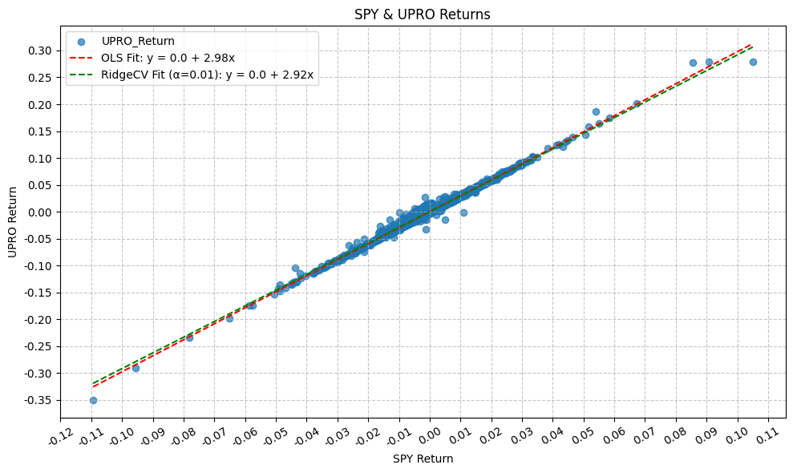
    


```python
model = run_linear_regression(
    df=spy_upro_aligned,
    x_plot_column="SPY_Return",
    y_plot_column="UPRO_Return",
    regression_model="OLS-statsmodels",
    regression_constant=True,
)

print(model.summary())
```

                                OLS Regression Results                            
    ==============================================================================
    Dep. Variable:            UPRO_Return   R-squared:                       0.994
    Model:                            OLS   Adj. R-squared:                  0.994
    Method:                 Least Squares   F-statistic:                 6.745e+05
    Date:                Mon, 16 Mar 2026   Prob (F-statistic):               0.00
    Time:                        13:43:30   Log-Likelihood:                 19150.
    No. Observations:                4204   AIC:                        -3.830e+04
    Df Residuals:                    4202   BIC:                        -3.828e+04
    Df Model:                           1                                         
    Covariance Type:            nonrobust                                         
    ==============================================================================
                     coef    std err          t      P>|t|      [0.025      0.975]
    ------------------------------------------------------------------------------
    const       1.711e-05   3.93e-05      0.436      0.663   -5.99e-05    9.41e-05
    SPY_Return     2.9760      0.004    821.252      0.000       2.969       2.983
    ==============================================================================
    Omnibus:                     2680.692   Durbin-Watson:                   2.590
    Prob(Omnibus):                  0.000   Jarque-Bera (JB):           517107.129
    Skew:                           1.986   Prob(JB):                         0.00
    Kurtosis:                      57.188   Cond. No.                         92.3
    ==============================================================================
    
    Notes:
    [1] Standard Errors assume that the covariance matrix of the errors is correctly specified.


Visually, this plot makes sense and we can see that there is a strong clustering of points, but we double check with the regression, regressing the UPRO daily return (y) on the SPY daily return (X).

### Extrapolate Data (SPY & UPRO)

We will now extrapolate the returns of SPY to backfill the data from the inception of SPY in 1993 to the inception of UPRO in 2009. For this, we'll use the coefficient of 2.98 that we found in the regression results above.


```python
# Set leverage multiplier based on regression coefficient
LEVERAGE_MULTIPLIER = model.params[1]

# Merge dataframes and extrapolate return values for SPY back to 1993 using the leverage multiplier
spy_upro_extrap = spy[["SPY_Close"]].merge(upro[["UPRO_Close"]], left_index=True, right_index=True, how='left')

etfs = ["SPY", "UPRO"]

# Calculate cumulative returns
for etf in etfs:
    spy_upro_extrap[f"{etf}_Return"] = spy_upro_extrap[f"{etf}_Close"].pct_change()

# Extrapolate UPRO returns for missing values
spy_upro_extrap["UPRO_Return"] = spy_upro_extrap["UPRO_Return"].fillna(LEVERAGE_MULTIPLIER * spy_upro_extrap["SPY_Return"])

# Find the first valid UPRO_Close index and value
first_valid_idx = spy_upro_extrap['UPRO_Close'].first_valid_index()
print(first_valid_idx)
first_valid_price = spy_upro_extrap.loc[first_valid_idx, 'UPRO_Close']
print(first_valid_price)
```

    2009-06-25 00:00:00
    1.205556035041809


Before we extrapolate, let's first look at the data we have for SPY and UPRO around the inception of UPRO in 2009:


```python
# Check values around the first valid index
print(spy_upro_extrap.loc["2009-06-20":"2009-06-30"])
```

                SPY_Close  UPRO_Close  SPY_Return  UPRO_Return
    Date                                                      
    2009-06-22     89.280         NaN      -0.030       -0.089
    2009-06-23     89.350         NaN       0.001        0.002
    2009-06-24     90.120         NaN       0.009        0.026
    2009-06-25     92.080       1.206       0.022        0.065
    2009-06-26     91.840       1.199      -0.003       -0.005
    2009-06-29     92.700       1.233       0.009        0.028
    2009-06-30     91.950       1.204      -0.008       -0.024


Now, backfill the data for the UPRO close price:


```python
# Iterate through the dataframe backwards
for i in range(spy_upro_extrap.index.get_loc(first_valid_idx) - 1, -1, -1):
    
    # The return that led to the price the next day
    current_return = spy_upro_extrap.iloc[i + 1]['UPRO_Return']

    # Get the next day's price
    next_price = spy_upro_extrap.iloc[i + 1]['UPRO_Close']
    
    # Price_{t} = Price_{t+1} / (1 + Return_{t})
    spy_upro_extrap.loc[spy_upro_extrap.index[i], 'UPRO_Close'] = next_price / (1 + current_return)
```

Finally, confirm the values are correct:


```python
# Confirm values around the first valid index after extrapolation
print(spy_upro_extrap.loc["2009-06-20":"2009-06-30"])
```

                SPY_Close  UPRO_Close  SPY_Return  UPRO_Return
    Date                                                      
    2009-06-22     89.280       1.101      -0.030       -0.089
    2009-06-23     89.350       1.104       0.001        0.002
    2009-06-24     90.120       1.132       0.009        0.026
    2009-06-25     92.080       1.206       0.022        0.065
    2009-06-26     91.840       1.199      -0.003       -0.005
    2009-06-29     92.700       1.233       0.009        0.028
    2009-06-30     91.950       1.204      -0.008       -0.024


And the complete DataFrame with the extrapolated values:


```python
display(spy_upro_extrap)
```


<div>
<style scoped>
    .dataframe tbody tr th:only-of-type {
        vertical-align: middle;
    }

    .dataframe tbody tr th {
        vertical-align: top;
    }

    .dataframe thead th {
        text-align: right;
    }
</style>
<table border="1" class="dataframe">
  <thead>
    <tr style="text-align: right;">
      <th></th>
      <th>SPY_Close</th>
      <th>UPRO_Close</th>
      <th>SPY_Return</th>
      <th>UPRO_Return</th>
    </tr>
    <tr>
      <th>Date</th>
      <th></th>
      <th></th>
      <th></th>
      <th></th>
    </tr>
  </thead>
  <tbody>
    <tr>
      <th>1993-01-29</th>
      <td>43.938</td>
      <td>0.926</td>
      <td>NaN</td>
      <td>NaN</td>
    </tr>
    <tr>
      <th>1993-02-01</th>
      <td>44.250</td>
      <td>0.945</td>
      <td>0.007</td>
      <td>0.021</td>
    </tr>
    <tr>
      <th>1993-02-02</th>
      <td>44.344</td>
      <td>0.951</td>
      <td>0.002</td>
      <td>0.006</td>
    </tr>
    <tr>
      <th>1993-02-03</th>
      <td>44.812</td>
      <td>0.981</td>
      <td>0.011</td>
      <td>0.031</td>
    </tr>
    <tr>
      <th>1993-02-04</th>
      <td>45.000</td>
      <td>0.993</td>
      <td>0.004</td>
      <td>0.012</td>
    </tr>
    <tr>
      <th>...</th>
      <td>...</td>
      <td>...</td>
      <td>...</td>
      <td>...</td>
    </tr>
    <tr>
      <th>2026-03-09</th>
      <td>678.270</td>
      <td>110.970</td>
      <td>0.009</td>
      <td>0.026</td>
    </tr>
    <tr>
      <th>2026-03-10</th>
      <td>677.180</td>
      <td>110.310</td>
      <td>-0.002</td>
      <td>-0.006</td>
    </tr>
    <tr>
      <th>2026-03-11</th>
      <td>676.330</td>
      <td>109.940</td>
      <td>-0.001</td>
      <td>-0.003</td>
    </tr>
    <tr>
      <th>2026-03-12</th>
      <td>666.060</td>
      <td>104.890</td>
      <td>-0.015</td>
      <td>-0.046</td>
    </tr>
    <tr>
      <th>2026-03-13</th>
      <td>662.290</td>
      <td>103.010</td>
      <td>-0.006</td>
      <td>-0.018</td>
    </tr>
  </tbody>
</table>
<p>8337 rows × 4 columns</p>
</div>


After the extrapolation, we now have the following plots for the prices, cumulative returns, and drawdowns:


```python
etfs = ["SPY", "UPRO"]

# Calculate cumulative returns
for etf in etfs:
    spy_upro_extrap[f"{etf}_Return"] = spy_upro_extrap[f"{etf}_Close"].pct_change()
    spy_upro_extrap[f"{etf}_Cumulative_Return"] = (1 + spy_upro_extrap[f"{etf}_Return"]).cumprod() - 1
    spy_upro_extrap[f"{etf}_Cumulative_Return_Plus_One"] = 1 + spy_upro_extrap[f"{etf}_Cumulative_Return"]
    spy_upro_extrap[f"{etf}_Rolling_Max"] = spy_upro_extrap[f"{etf}_Cumulative_Return_Plus_One"].cummax()
    spy_upro_extrap[f"{etf}_Drawdown"] = spy_upro_extrap[f"{etf}_Cumulative_Return_Plus_One"] / spy_upro_extrap[f"{etf}_Rolling_Max"] - 1
    spy_upro_extrap.drop(columns=[f"{etf}_Cumulative_Return_Plus_One", f"{etf}_Rolling_Max"], inplace=True)
```


```python
plot_timeseries(
    df=spy_upro_extrap,
    plot_start_date=None,
    plot_end_date=None,
    plot_columns=["SPY_Close"],
    title="SPY Close Price",
    x_label="Date",
    x_format="Year",
    x_tick_spacing=2,
    x_tick_rotation=30,
    y_label="Price ($)",
    y_format="Decimal",
    y_format_decimal_places=0,
    y_tick_spacing="Auto",
    y_tick_rotation=0,
    grid=True,
    legend=False,
    export_plot=False,
    plot_file_name=None,
)
```


    

    


```python
plot_timeseries(
    df=spy_upro_extrap,
    plot_start_date=None,
    plot_end_date=None,
    plot_columns=["UPRO_Close"],
    title="UPRO Close Price",
    x_label="Date",
    x_format="Year",
    x_tick_spacing=2,
    x_tick_rotation=30,
    y_label="Price ($)",
    y_format="Decimal",
    y_format_decimal_places=0,
    y_tick_spacing="Auto",
    y_tick_rotation=0,
    grid=True,
    legend=False,
    export_plot=False,
    plot_file_name=None,
)
```


    

    


```python
plot_timeseries(
    df=spy_upro_extrap,
    plot_start_date=None,
    plot_end_date=None,
    plot_columns=["SPY_Cumulative_Return", "UPRO_Cumulative_Return"],
    title="Cumulative Returns",
    x_label="Date",
    x_format="Year",
    x_tick_spacing=2,
    x_tick_rotation=30,
    y_label="Cumulative Return",
    y_format="Decimal",
    y_format_decimal_places=0,
    y_tick_spacing="Auto",
    y_tick_rotation=0,
    grid=True,
    legend=True,
    export_plot=False,
    plot_file_name=None,
)

```


    
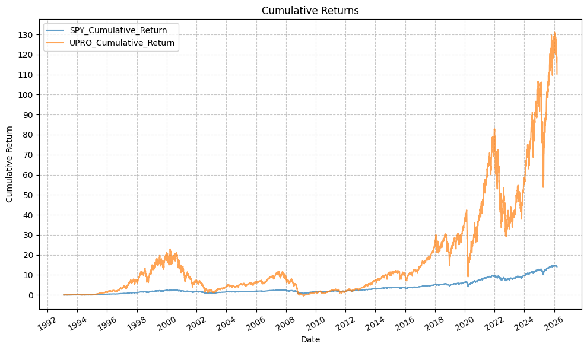
    


```python
plot_timeseries(
    df=spy_upro_extrap,
    plot_start_date=None,
    plot_end_date=None,
    plot_columns=["SPY_Drawdown", "UPRO_Drawdown"],
    title="Drawdowns",
    x_label="Date",
    x_format="Year",
    x_tick_spacing=1,
    x_tick_rotation=30,
    y_label="Drawdown",
    y_format="Percentage",
    y_format_decimal_places=0,
    y_tick_spacing="Auto",
    y_tick_rotation=0,
    grid=True,
    legend=True,
    export_plot=False,
    plot_file_name=None,
)

```


    
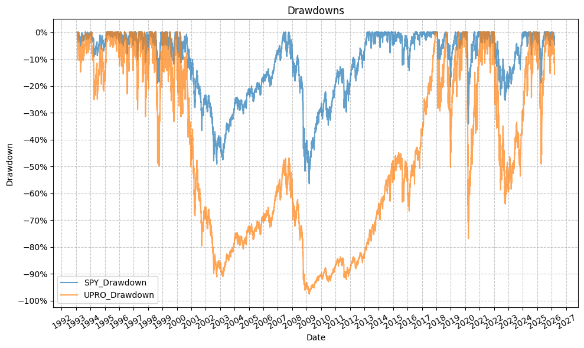
    


Interestingly, the drawdown for UPRO is not nearly as severe as that of TQQQ, which may be due to the fact that SPY has not had the same extreme return profile as QQQ over the past 15 years. This highlights the importance of the underlying asset's return profile on the performance of leveraged ETFs.

### Plot Rolling Returns (SPY & UPRO)

Next, we will consider the following:

* Histogram and scatter plots of the rolling returns of SPY and UPRO
* Regressions to establish a "leverage factor" for the rolling returns
* The deviation from a 3x return for each time period

For this set of regressions, we will also allow the constant. First, we need the rolling returns for various time periods:


```python
# Define rolling windows in trading days
rolling_windows = {
    '1d': 1,      # 1 day
    '1w': 5,      # 1 week (5 trading days)
    '1m': 21,     # 1 month (~21 trading days)
    '3m': 63,     # 3 months (~63 trading days)
    '6m': 126,    # 6 months (~126 trading days)
    '1y': 252,    # 1 year (~252 trading days)
    '2y': 504,    # 2 years (~504 trading days)
    '3y': 756,    # 3 years (~756 trading days)
    '4y': 1008,   # 4 years (~1008 trading days)
    '5y': 1260,   # 5 years (~1260 trading days)
}

# Calculate rolling returns for each ETF and each window
for etf in etfs:
    for period_name, window in rolling_windows.items():
        spy_upro_extrap[f"{etf}_Rolling_Return_{period_name}"] = (
            spy_upro_extrap[f"{etf}_Close"].pct_change(periods=window)
        )
```

This gives us the following series of histograms, scatter plots, and regression model results:


```python
# Create a dataframe to hold rolling returns stats
rolling_returns_stats = pd.DataFrame()

for period_name, window in rolling_windows.items():
    plot_histogram(
        df=spy_upro_extrap,
        plot_columns=[f"SPY_Rolling_Return_{period_name}", f"UPRO_Rolling_Return_{period_name}"],
        title=f"SPY & UPRO {period_name} Rolling Returns",
        x_label="Rolling Return",
        x_tick_spacing="Auto",
        x_tick_rotation=30,
        y_label="# Of Datapoints",
        y_tick_spacing="Auto",
        y_tick_rotation=0,
        grid=True,
        legend=True,
        export_plot=False,
        plot_file_name=None,
    )

    plot_scatter(
        df=spy_upro_extrap,
        x_plot_column=f"SPY_Rolling_Return_{period_name}",
        y_plot_columns=[f"UPRO_Rolling_Return_{period_name}"],
        title=f"SPY & UPRO {period_name} Rolling Returns",
        x_label="SPY Rolling Return",
        x_format="Decimal",
        x_format_decimal_places=2,
        x_tick_spacing="Auto",
        x_tick_rotation=30,
        y_label="UPRO Rolling Return",
        y_format="Decimal",
        y_format_decimal_places=2,
        y_tick_spacing="Auto",
        y_tick_rotation=0,
        plot_OLS_regression_line=True,
        OLS_column=f"UPRO_Rolling_Return_{period_name}",
        plot_Ridge_regression_line=False,
        Ridge_column=None,
        plot_RidgeCV_regression_line=True,
        RidgeCV_column=f"UPRO_Rolling_Return_{period_name}",
        regression_constant=True,
        grid=True,
        legend=True,
        export_plot=False,
        plot_file_name=None,
    )

    # Run OLS regression with statsmodels
    model = run_linear_regression(
        df=spy_upro_extrap,
        x_plot_column=f"SPY_Rolling_Return_{period_name}",
        y_plot_column=f"UPRO_Rolling_Return_{period_name}",
        regression_model="OLS-statsmodels",
        regression_constant=True,
    )
    print(model.summary())

    # Add the regression results to the rolling returns stats dataframe
    intercept = model.params[0]
    intercept_pvalue = model.pvalues[0]   # p-value for Intercept
    slope = model.params[1]
    slope_pvalue = model.pvalues[1]       # p-value for SPY_Return
    r_squared = model.rsquared

    # Calc skew
    return_ratio = spy_upro_extrap[f'UPRO_Rolling_Return_{period_name}'] / spy_upro_extrap[f'SPY_Rolling_Return_{period_name}']
    skew = return_ratio.skew()

    # Calc conditional symmetry
    up_markets = spy_upro_extrap[spy_upro_extrap[f'SPY_Rolling_Return_{period_name}'] > 0]
    down_markets = spy_upro_extrap[spy_upro_extrap[f'SPY_Rolling_Return_{period_name}'] <= 0]

    avg_beta_up = (up_markets[f'UPRO_Rolling_Return_{period_name}'] / up_markets[f'SPY_Rolling_Return_{period_name}']).mean()
    avg_beta_down = (down_markets[f'UPRO_Rolling_Return_{period_name}'] / down_markets[f'SPY_Rolling_Return_{period_name}']).mean()

    asymmetry = avg_beta_up - avg_beta_down

    rolling_returns_slope_int = pd.DataFrame({
        "Period": period_name,
        "Intercept": [intercept],
        # "Intercept_PValue": [intercept_pvalue],
        "Slope": [slope],
        # "Slope_PValue": [slope_pvalue],
        "R_Squared": [r_squared],
        "Skew": [skew],
        "Average Upside Beta": [avg_beta_up],
        "Average Downside Beta": [avg_beta_down],
        "Asymmetry": [asymmetry]
    })

    rolling_returns_stats = pd.concat([rolling_returns_stats, rolling_returns_slope_int])
```


    

    


    
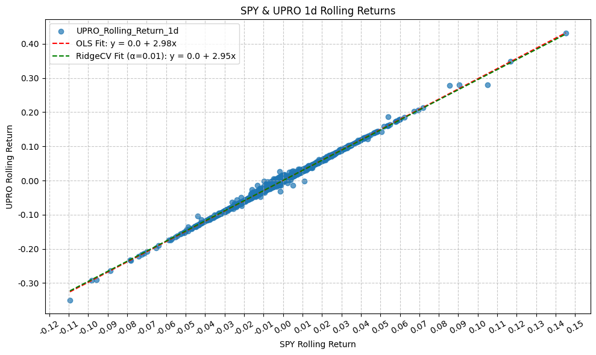
    


                                  OLS Regression Results                              
    ==================================================================================
    Dep. Variable:     UPRO_Rolling_Return_1d   R-squared:                       0.997
    Model:                                OLS   Adj. R-squared:                  0.997
    Method:                     Least Squares   F-statistic:                 3.117e+06
    Date:                    Mon, 16 Mar 2026   Prob (F-statistic):               0.00
    Time:                            13:43:32   Log-Likelihood:                 40824.
    No. Observations:                    8336   AIC:                        -8.164e+04
    Df Residuals:                        8334   BIC:                        -8.163e+04
    Df Model:                               1                                         
    Covariance Type:                nonrobust                                         
    =========================================================================================
                                coef    std err          t      P>|t|      [0.025      0.975]
    -----------------------------------------------------------------------------------------
    const                  8.628e-06   1.98e-05      0.436      0.663   -3.02e-05    4.74e-05
    SPY_Rolling_Return_1d     2.9760      0.002   1765.423      0.000       2.973       2.979
    ==============================================================================
    Omnibus:                     6871.164   Durbin-Watson:                   2.591
    Prob(Omnibus):                  0.000   Jarque-Bera (JB):          4247760.442
    Skew:                           2.811   Prob(JB):                         0.00
    Kurtosis:                     113.445   Cond. No.                         85.2
    ==============================================================================
    
    Notes:
    [1] Standard Errors assume that the covariance matrix of the errors is correctly specified.


    

    


    

    


                                  OLS Regression Results                              
    ==================================================================================
    Dep. Variable:     UPRO_Rolling_Return_1w   R-squared:                       0.994
    Model:                                OLS   Adj. R-squared:                  0.994
    Method:                     Least Squares   F-statistic:                 1.404e+06
    Date:                    Mon, 16 Mar 2026   Prob (F-statistic):               0.00
    Time:                            13:43:34   Log-Likelihood:                 31594.
    No. Observations:                    8332   AIC:                        -6.318e+04
    Df Residuals:                        8330   BIC:                        -6.317e+04
    Df Model:                               1                                         
    Covariance Type:                nonrobust                                         
    =========================================================================================
                                coef    std err          t      P>|t|      [0.025      0.975]
    -----------------------------------------------------------------------------------------
    const                    -0.0003      6e-05     -4.277      0.000      -0.000      -0.000
    SPY_Rolling_Return_1w     2.9725      0.003   1184.942      0.000       2.968       2.977
    ==============================================================================
    Omnibus:                     3741.895   Durbin-Watson:                   0.955
    Prob(Omnibus):                  0.000   Jarque-Bera (JB):          1489497.909
    Skew:                          -0.847   Prob(JB):                         0.00
    Kurtosis:                      68.480   Cond. No.                         42.0
    ==============================================================================
    
    Notes:
    [1] Standard Errors assume that the covariance matrix of the errors is correctly specified.


    

    


    
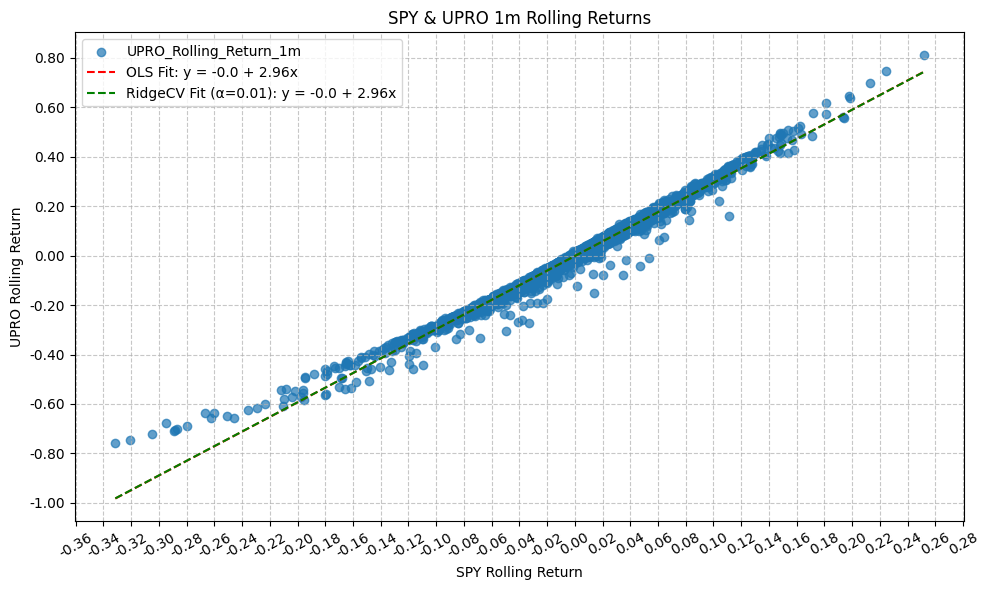
    


                                  OLS Regression Results                              
    ==================================================================================
    Dep. Variable:     UPRO_Rolling_Return_1m   R-squared:                       0.988
    Model:                                OLS   Adj. R-squared:                  0.988
    Method:                     Least Squares   F-statistic:                 6.653e+05
    Date:                    Mon, 16 Mar 2026   Prob (F-statistic):               0.00
    Time:                            13:43:35   Log-Likelihood:                 23130.
    No. Observations:                    8316   AIC:                        -4.626e+04
    Df Residuals:                        8314   BIC:                        -4.624e+04
    Df Model:                               1                                         
    Covariance Type:                nonrobust                                         
    =========================================================================================
                                coef    std err          t      P>|t|      [0.025      0.975]
    -----------------------------------------------------------------------------------------
    const                    -0.0015      0.000     -9.029      0.000      -0.002      -0.001
    SPY_Rolling_Return_1m     2.9603      0.004    815.680      0.000       2.953       2.967
    ==============================================================================
    Omnibus:                     2879.641   Durbin-Watson:                   0.314
    Prob(Omnibus):                  0.000   Jarque-Bera (JB):           855364.296
    Skew:                          -0.291   Prob(JB):                         0.00
    Kurtosis:                      52.681   Cond. No.                         22.1
    ==============================================================================
    
    Notes:
    [1] Standard Errors assume that the covariance matrix of the errors is correctly specified.


    

    


    
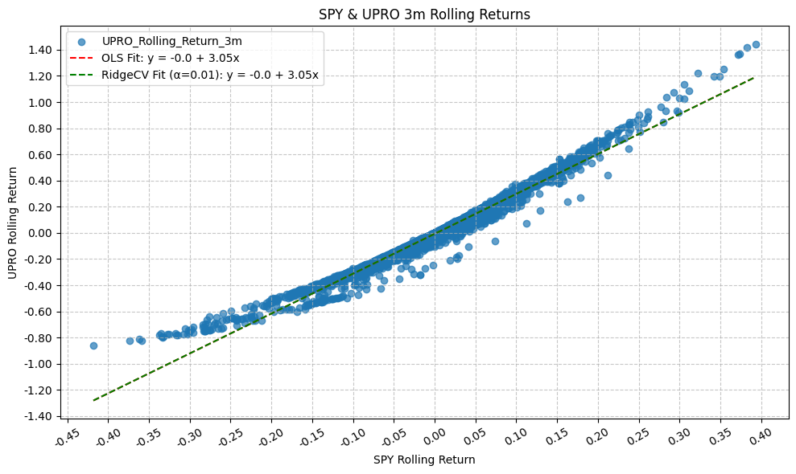
    


                                  OLS Regression Results                              
    ==================================================================================
    Dep. Variable:     UPRO_Rolling_Return_3m   R-squared:                       0.979
    Model:                                OLS   Adj. R-squared:                  0.979
    Method:                     Least Squares   F-statistic:                 3.832e+05
    Date:                    Mon, 16 Mar 2026   Prob (F-statistic):               0.00
    Time:                            13:43:36   Log-Likelihood:                 16419.
    No. Observations:                    8274   AIC:                        -3.283e+04
    Df Residuals:                        8272   BIC:                        -3.282e+04
    Df Model:                               1                                         
    Covariance Type:                nonrobust                                         
    =========================================================================================
                                coef    std err          t      P>|t|      [0.025      0.975]
    -----------------------------------------------------------------------------------------
    const                    -0.0068      0.000    -17.721      0.000      -0.008      -0.006
    SPY_Rolling_Return_3m     3.0481      0.005    619.009      0.000       3.038       3.058
    ==============================================================================
    Omnibus:                     2412.574   Durbin-Watson:                   0.136
    Prob(Omnibus):                  0.000   Jarque-Bera (JB):           132831.172
    Skew:                           0.582   Prob(JB):                         0.00
    Kurtosis:                      22.594   Cond. No.                         13.5
    ==============================================================================
    
    Notes:
    [1] Standard Errors assume that the covariance matrix of the errors is correctly specified.


    
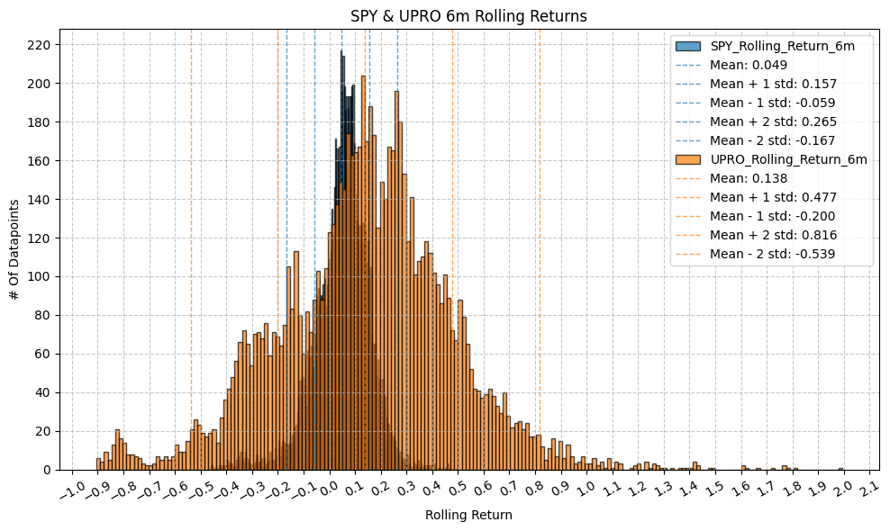
    


    
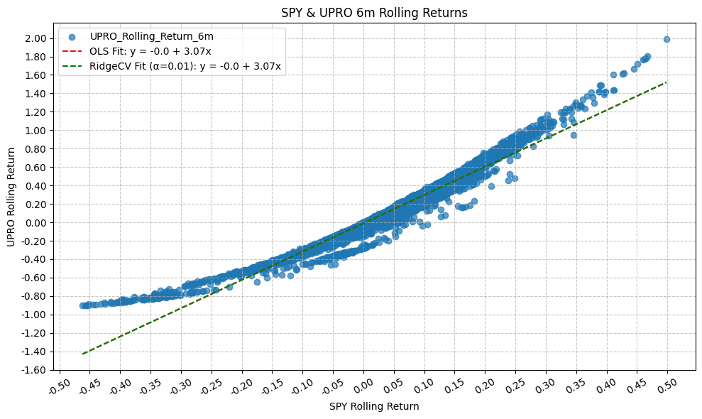
    


                                  OLS Regression Results                              
    ==================================================================================
    Dep. Variable:     UPRO_Rolling_Return_6m   R-squared:                       0.957
    Model:                                OLS   Adj. R-squared:                  0.957
    Method:                     Least Squares   F-statistic:                 1.830e+05
    Date:                    Mon, 16 Mar 2026   Prob (F-statistic):               0.00
    Time:                            13:43:37   Log-Likelihood:                 10161.
    No. Observations:                    8211   AIC:                        -2.032e+04
    Df Residuals:                        8209   BIC:                        -2.030e+04
    Df Model:                               1                                         
    Covariance Type:                nonrobust                                         
    =========================================================================================
                                coef    std err          t      P>|t|      [0.025      0.975]
    -----------------------------------------------------------------------------------------
    const                    -0.0109      0.001    -12.883      0.000      -0.013      -0.009
    SPY_Rolling_Return_6m     3.0707      0.007    427.780      0.000       3.057       3.085
    ==============================================================================
    Omnibus:                     2066.367   Durbin-Watson:                   0.055
    Prob(Omnibus):                  0.000   Jarque-Bera (JB):            26461.991
    Skew:                           0.843   Prob(JB):                         0.00
    Kurtosis:                      11.631   Cond. No.                         9.29
    ==============================================================================
    
    Notes:
    [1] Standard Errors assume that the covariance matrix of the errors is correctly specified.


    

    


    

    


                                  OLS Regression Results                              
    ==================================================================================
    Dep. Variable:     UPRO_Rolling_Return_1y   R-squared:                       0.927
    Model:                                OLS   Adj. R-squared:                  0.927
    Method:                     Least Squares   F-statistic:                 1.024e+05
    Date:                    Mon, 16 Mar 2026   Prob (F-statistic):               0.00
    Time:                            13:43:38   Log-Likelihood:                 3932.3
    No. Observations:                    8085   AIC:                            -7861.
    Df Residuals:                        8083   BIC:                            -7847.
    Df Model:                               1                                         
    Covariance Type:                nonrobust                                         
    =========================================================================================
                                coef    std err          t      P>|t|      [0.025      0.975]
    -----------------------------------------------------------------------------------------
    const                    -0.0196      0.002    -10.120      0.000      -0.023      -0.016
    SPY_Rolling_Return_1y     3.2120      0.010    319.930      0.000       3.192       3.232
    ==============================================================================
    Omnibus:                     1394.260   Durbin-Watson:                   0.031
    Prob(Omnibus):                  0.000   Jarque-Bera (JB):             6548.397
    Skew:                           0.764   Prob(JB):                         0.00
    Kurtosis:                       7.136   Cond. No.                         6.13
    ==============================================================================
    
    Notes:
    [1] Standard Errors assume that the covariance matrix of the errors is correctly specified.


    

    


    
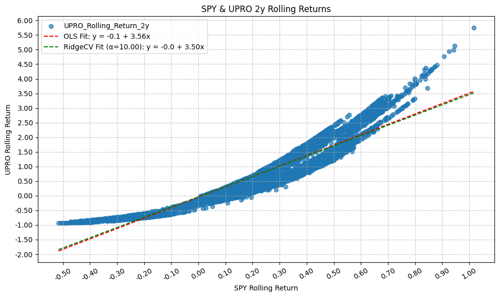
    


                                  OLS Regression Results                              
    ==================================================================================
    Dep. Variable:     UPRO_Rolling_Return_2y   R-squared:                       0.897
    Model:                                OLS   Adj. R-squared:                  0.897
    Method:                     Least Squares   F-statistic:                 6.796e+04
    Date:                    Mon, 16 Mar 2026   Prob (F-statistic):               0.00
    Time:                            13:43:40   Log-Likelihood:                -2121.4
    No. Observations:                    7833   AIC:                             4247.
    Df Residuals:                        7831   BIC:                             4261.
    Df Model:                               1                                         
    Covariance Type:                nonrobust                                         
    =========================================================================================
                                coef    std err          t      P>|t|      [0.025      0.975]
    -----------------------------------------------------------------------------------------
    const                    -0.0512      0.005    -11.120      0.000      -0.060      -0.042
    SPY_Rolling_Return_2y     3.5614      0.014    260.683      0.000       3.535       3.588
    ==============================================================================
    Omnibus:                      950.225   Durbin-Watson:                   0.018
    Prob(Omnibus):                  0.000   Jarque-Bera (JB):             1486.222
    Skew:                           0.866   Prob(JB):                         0.00
    Kurtosis:                       4.246   Cond. No.                         3.99
    ==============================================================================
    
    Notes:
    [1] Standard Errors assume that the covariance matrix of the errors is correctly specified.


    

    


    
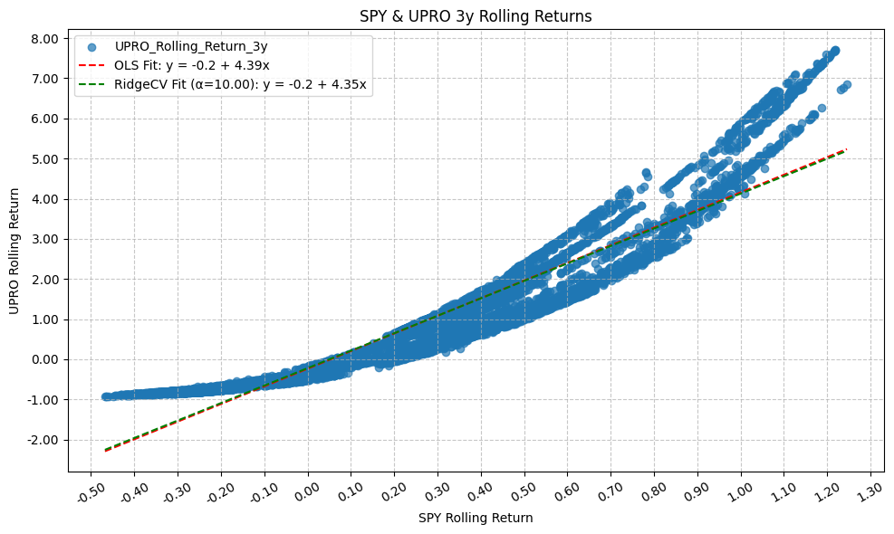
    


                                  OLS Regression Results                              
    ==================================================================================
    Dep. Variable:     UPRO_Rolling_Return_3y   R-squared:                       0.867
    Model:                                OLS   Adj. R-squared:                  0.867
    Method:                     Least Squares   F-statistic:                 4.922e+04
    Date:                    Mon, 16 Mar 2026   Prob (F-statistic):               0.00
    Time:                            13:43:41   Log-Likelihood:                -7016.3
    No. Observations:                    7581   AIC:                         1.404e+04
    Df Residuals:                        7579   BIC:                         1.405e+04
    Df Model:                               1                                         
    Covariance Type:                nonrobust                                         
    =========================================================================================
                                coef    std err          t      P>|t|      [0.025      0.975]
    -----------------------------------------------------------------------------------------
    const                    -0.2356      0.009    -24.832      0.000      -0.254      -0.217
    SPY_Rolling_Return_3y     4.3927      0.020    221.847      0.000       4.354       4.432
    ==============================================================================
    Omnibus:                     1286.625   Durbin-Watson:                   0.008
    Prob(Omnibus):                  0.000   Jarque-Bera (JB):             2437.416
    Skew:                           1.053   Prob(JB):                         0.00
    Kurtosis:                       4.812   Cond. No.                         3.15
    ==============================================================================
    
    Notes:
    [1] Standard Errors assume that the covariance matrix of the errors is correctly specified.


    
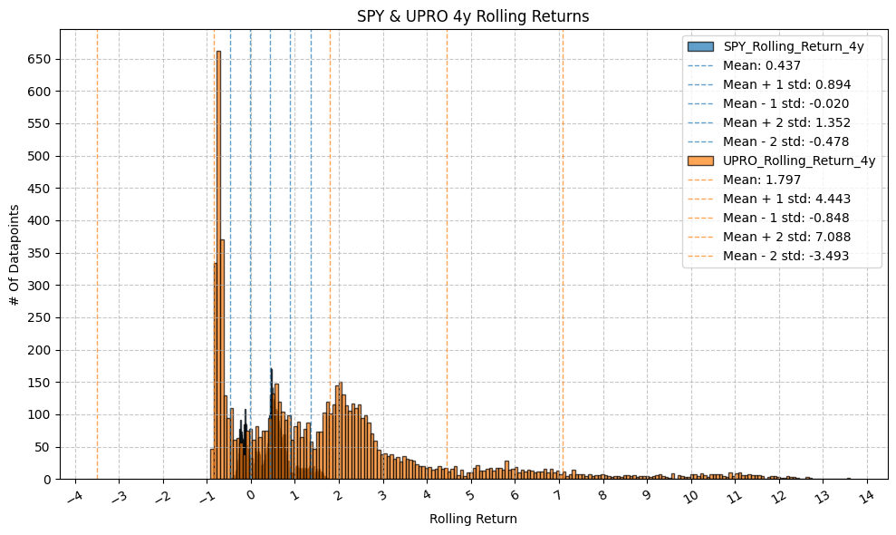
    


    

    


                                  OLS Regression Results                              
    ==================================================================================
    Dep. Variable:     UPRO_Rolling_Return_4y   R-squared:                       0.863
    Model:                                OLS   Adj. R-squared:                  0.863
    Method:                     Least Squares   F-statistic:                 4.605e+04
    Date:                    Mon, 16 Mar 2026   Prob (F-statistic):               0.00
    Time:                            13:43:42   Log-Likelihood:                -10251.
    No. Observations:                    7329   AIC:                         2.051e+04
    Df Residuals:                        7327   BIC:                         2.052e+04
    Df Model:                               1                                         
    Covariance Type:                nonrobust                                         
    =========================================================================================
                                coef    std err          t      P>|t|      [0.025      0.975]
    -----------------------------------------------------------------------------------------
    const                    -0.5499      0.016    -34.731      0.000      -0.581      -0.519
    SPY_Rolling_Return_4y     5.3711      0.025    214.593      0.000       5.322       5.420
    ==============================================================================
    Omnibus:                     1107.340   Durbin-Watson:                   0.008
    Prob(Omnibus):                  0.000   Jarque-Bera (JB):             2298.081
    Skew:                           0.913   Prob(JB):                         0.00
    Kurtosis:                       5.048   Cond. No.                         2.69
    ==============================================================================
    
    Notes:
    [1] Standard Errors assume that the covariance matrix of the errors is correctly specified.


    
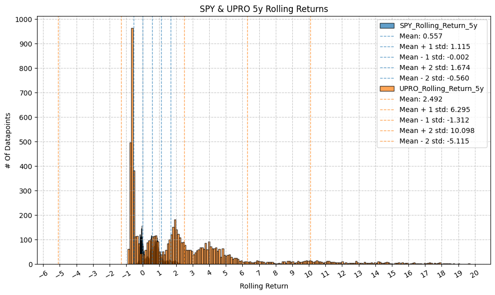
    


    

    


                                  OLS Regression Results                              
    ==================================================================================
    Dep. Variable:     UPRO_Rolling_Return_5y   R-squared:                       0.850
    Model:                                OLS   Adj. R-squared:                  0.850
    Method:                     Least Squares   F-statistic:                 4.018e+04
    Date:                    Mon, 16 Mar 2026   Prob (F-statistic):               0.00
    Time:                            13:43:43   Log-Likelihood:                -12776.
    No. Observations:                    7077   AIC:                         2.556e+04
    Df Residuals:                        7075   BIC:                         2.557e+04
    Df Model:                               1                                         
    Covariance Type:                nonrobust                                         
    =========================================================================================
                                coef    std err          t      P>|t|      [0.025      0.975]
    -----------------------------------------------------------------------------------------
    const                    -1.0034      0.025    -40.626      0.000      -1.052      -0.955
    SPY_Rolling_Return_5y     6.2796      0.031    200.453      0.000       6.218       6.341
    ==============================================================================
    Omnibus:                      685.964   Durbin-Watson:                   0.007
    Prob(Omnibus):                  0.000   Jarque-Bera (JB):             1311.055
    Skew:                           0.650   Prob(JB):                    2.03e-285
    Kurtosis:                       4.660   Cond. No.                         2.50
    ==============================================================================
    
    Notes:
    [1] Standard Errors assume that the covariance matrix of the errors is correctly specified.


### Rolling Returns Deviation (SPY & UPRO)

Next, we will the rolling returns deviation from the expected 3x return for each time period. This will give us a better picture of the volatility decay effect and how it changes over different time horizons.


```python
rolling_returns_stats["Return_Deviation_From_3x"] = rolling_returns_stats["Slope"] - 3.0
```


```python
display(rolling_returns_stats)
```


<div>
<style scoped>
    .dataframe tbody tr th:only-of-type {
        vertical-align: middle;
    }

    .dataframe tbody tr th {
        vertical-align: top;
    }

    .dataframe thead th {
        text-align: right;
    }
</style>
<table border="1" class="dataframe">
  <thead>
    <tr style="text-align: right;">
      <th></th>
      <th>Period</th>
      <th>Intercept</th>
      <th>Slope</th>
      <th>R_Squared</th>
      <th>Skew</th>
      <th>Average Upside Beta</th>
      <th>Average Downside Beta</th>
      <th>Asymmetry</th>
      <th>Return_Deviation_From_3x</th>
    </tr>
  </thead>
  <tbody>
    <tr>
      <th>0</th>
      <td>1d</td>
      <td>0.000</td>
      <td>2.976</td>
      <td>0.997</td>
      <td>NaN</td>
      <td>2.939</td>
      <td>NaN</td>
      <td>NaN</td>
      <td>-0.024</td>
    </tr>
    <tr>
      <th>0</th>
      <td>1w</td>
      <td>-0.000</td>
      <td>2.972</td>
      <td>0.994</td>
      <td>NaN</td>
      <td>2.757</td>
      <td>NaN</td>
      <td>NaN</td>
      <td>-0.028</td>
    </tr>
    <tr>
      <th>0</th>
      <td>1m</td>
      <td>-0.002</td>
      <td>2.960</td>
      <td>0.988</td>
      <td>NaN</td>
      <td>2.494</td>
      <td>-inf</td>
      <td>inf</td>
      <td>-0.040</td>
    </tr>
    <tr>
      <th>0</th>
      <td>3m</td>
      <td>-0.007</td>
      <td>3.048</td>
      <td>0.979</td>
      <td>NaN</td>
      <td>2.006</td>
      <td>-inf</td>
      <td>inf</td>
      <td>0.048</td>
    </tr>
    <tr>
      <th>0</th>
      <td>6m</td>
      <td>-0.011</td>
      <td>3.071</td>
      <td>0.957</td>
      <td>NaN</td>
      <td>1.038</td>
      <td>-inf</td>
      <td>inf</td>
      <td>0.071</td>
    </tr>
    <tr>
      <th>0</th>
      <td>1y</td>
      <td>-0.020</td>
      <td>3.212</td>
      <td>0.927</td>
      <td>NaN</td>
      <td>1.640</td>
      <td>-inf</td>
      <td>inf</td>
      <td>0.212</td>
    </tr>
    <tr>
      <th>0</th>
      <td>2y</td>
      <td>-0.051</td>
      <td>3.561</td>
      <td>0.897</td>
      <td>0.349</td>
      <td>1.862</td>
      <td>9.298</td>
      <td>-7.436</td>
      <td>0.561</td>
    </tr>
    <tr>
      <th>0</th>
      <td>3y</td>
      <td>-0.236</td>
      <td>4.393</td>
      <td>0.867</td>
      <td>-6.067</td>
      <td>1.578</td>
      <td>8.621</td>
      <td>-7.042</td>
      <td>1.393</td>
    </tr>
    <tr>
      <th>0</th>
      <td>4y</td>
      <td>-0.550</td>
      <td>5.371</td>
      <td>0.863</td>
      <td>-65.924</td>
      <td>0.021</td>
      <td>7.235</td>
      <td>-7.214</td>
      <td>2.371</td>
    </tr>
    <tr>
      <th>0</th>
      <td>5y</td>
      <td>-1.003</td>
      <td>6.280</td>
      <td>0.850</td>
      <td>-35.218</td>
      <td>-2.261</td>
      <td>21.003</td>
      <td>-23.265</td>
      <td>3.280</td>
    </tr>
  </tbody>
</table>
</div>


```python
plot_scatter(
    df=rolling_returns_stats,
    x_plot_column="Period",
    y_plot_columns=["Return_Deviation_From_3x"],
    title="UPRO Deviation from Perfect 3x Leverage by Time Period",
    x_label="Time Period",
    x_format="String",
    x_format_decimal_places=0,
    x_tick_spacing=1,
    x_tick_rotation=0,
    y_label="Deviation from 3x Leverage",
    y_format="Decimal",
    y_format_decimal_places=1,
    y_tick_spacing="Auto",
    y_tick_rotation=0,
    plot_OLS_regression_line=False,
    OLS_column=None,
    plot_Ridge_regression_line=False,
    Ridge_column=None,
    plot_RidgeCV_regression_line=False,
    RidgeCV_column=None,
    regression_constant=False,
    grid=True,
    legend=True,
    export_plot=False,
    plot_file_name=None,
)
```


    
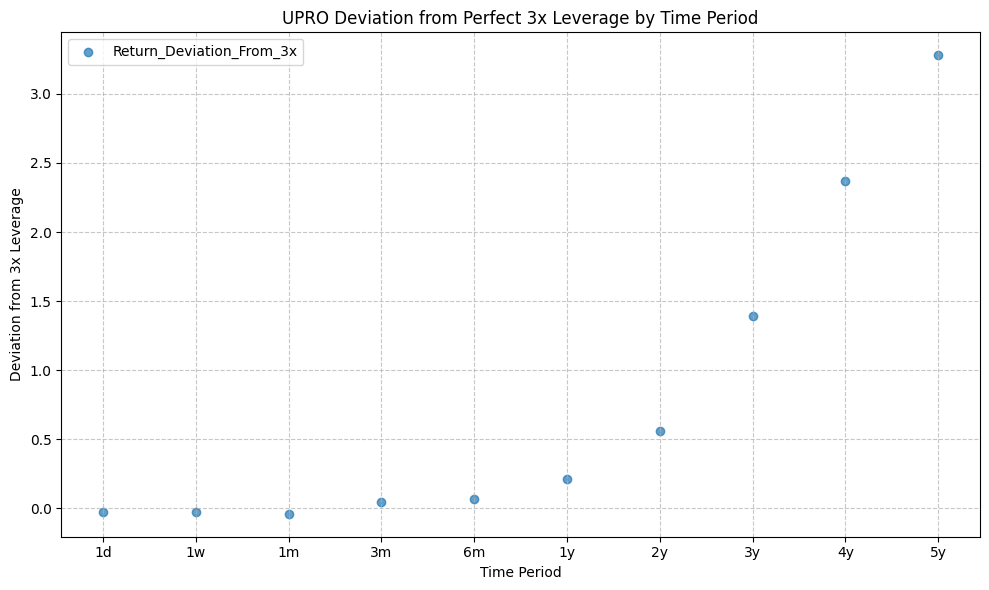
    


```python
plot_scatter(
    df=rolling_returns_stats,
    x_plot_column="Period",
    y_plot_columns=["Slope"],
    title="UPRO Slope by Time Period",
    x_label="Time Period",
    x_format="String",
    x_format_decimal_places=0,
    x_tick_spacing=1,
    x_tick_rotation=0,
    y_label="Slope",
    y_format="Decimal",
    y_format_decimal_places=1,
    y_tick_spacing="Auto",
    y_tick_rotation=0,
    plot_OLS_regression_line=False,
    OLS_column=None,
    plot_Ridge_regression_line=False,
    Ridge_column=None,
    plot_RidgeCV_regression_line=False,
    RidgeCV_column=None,
    regression_constant=False,
    grid=True,
    legend=True,
    export_plot=False,
    plot_file_name=None,
)
```


    
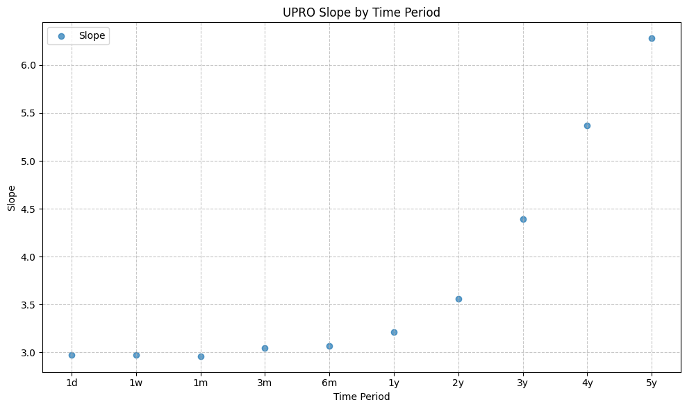
    


```python
plot_scatter(
    df=rolling_returns_stats,
    x_plot_column="Period",
    y_plot_columns=["Intercept"],
    title="Intercept by Time Period",
    x_label="Time Period",
    x_format="String",
    x_format_decimal_places=0,
    x_tick_spacing=1,
    x_tick_rotation=0,
    y_label="Intercept",
    y_format="Decimal",
    y_format_decimal_places=1,
    y_tick_spacing="Auto",
    y_tick_rotation=0,
    plot_OLS_regression_line=False,
    OLS_column=None,
    plot_Ridge_regression_line=False,
    Ridge_column=None,
    plot_RidgeCV_regression_line=False,
    RidgeCV_column=None,
    regression_constant=False,
    grid=True,
    legend=True,
    export_plot=False,
    plot_file_name=None,
)
```


    

    


```python
pandas_set_decimal_places(3)
display(rolling_returns_stats.set_index("Period"))
```


<div>
<style scoped>
    .dataframe tbody tr th:only-of-type {
        vertical-align: middle;
    }

    .dataframe tbody tr th {
        vertical-align: top;
    }

    .dataframe thead th {
        text-align: right;
    }
</style>
<table border="1" class="dataframe">
  <thead>
    <tr style="text-align: right;">
      <th></th>
      <th>Intercept</th>
      <th>Slope</th>
      <th>R_Squared</th>
      <th>Skew</th>
      <th>Average Upside Beta</th>
      <th>Average Downside Beta</th>
      <th>Asymmetry</th>
      <th>Return_Deviation_From_3x</th>
    </tr>
    <tr>
      <th>Period</th>
      <th></th>
      <th></th>
      <th></th>
      <th></th>
      <th></th>
      <th></th>
      <th></th>
      <th></th>
    </tr>
  </thead>
  <tbody>
    <tr>
      <th>1d</th>
      <td>0.000</td>
      <td>2.976</td>
      <td>0.997</td>
      <td>NaN</td>
      <td>2.939</td>
      <td>NaN</td>
      <td>NaN</td>
      <td>-0.024</td>
    </tr>
    <tr>
      <th>1w</th>
      <td>-0.000</td>
      <td>2.972</td>
      <td>0.994</td>
      <td>NaN</td>
      <td>2.757</td>
      <td>NaN</td>
      <td>NaN</td>
      <td>-0.028</td>
    </tr>
    <tr>
      <th>1m</th>
      <td>-0.002</td>
      <td>2.960</td>
      <td>0.988</td>
      <td>NaN</td>
      <td>2.494</td>
      <td>-inf</td>
      <td>inf</td>
      <td>-0.040</td>
    </tr>
    <tr>
      <th>3m</th>
      <td>-0.007</td>
      <td>3.048</td>
      <td>0.979</td>
      <td>NaN</td>
      <td>2.006</td>
      <td>-inf</td>
      <td>inf</td>
      <td>0.048</td>
    </tr>
    <tr>
      <th>6m</th>
      <td>-0.011</td>
      <td>3.071</td>
      <td>0.957</td>
      <td>NaN</td>
      <td>1.038</td>
      <td>-inf</td>
      <td>inf</td>
      <td>0.071</td>
    </tr>
    <tr>
      <th>1y</th>
      <td>-0.020</td>
      <td>3.212</td>
      <td>0.927</td>
      <td>NaN</td>
      <td>1.640</td>
      <td>-inf</td>
      <td>inf</td>
      <td>0.212</td>
    </tr>
    <tr>
      <th>2y</th>
      <td>-0.051</td>
      <td>3.561</td>
      <td>0.897</td>
      <td>0.349</td>
      <td>1.862</td>
      <td>9.298</td>
      <td>-7.436</td>
      <td>0.561</td>
    </tr>
    <tr>
      <th>3y</th>
      <td>-0.236</td>
      <td>4.393</td>
      <td>0.867</td>
      <td>-6.067</td>
      <td>1.578</td>
      <td>8.621</td>
      <td>-7.042</td>
      <td>1.393</td>
    </tr>
    <tr>
      <th>4y</th>
      <td>-0.550</td>
      <td>5.371</td>
      <td>0.863</td>
      <td>-65.924</td>
      <td>0.021</td>
      <td>7.235</td>
      <td>-7.214</td>
      <td>2.371</td>
    </tr>
    <tr>
      <th>5y</th>
      <td>-1.003</td>
      <td>6.280</td>
      <td>0.850</td>
      <td>-35.218</td>
      <td>-2.261</td>
      <td>21.003</td>
      <td>-23.265</td>
      <td>3.280</td>
    </tr>
  </tbody>
</table>
</div>


Similar as to QQQ/TQQQ, up to 1 year, there is minimal difference between the mean UPRO 1 year rolling return and the hypothetical 3x leverage, with an R^2 of greater than 0.9.

However, as we extend the time period, we see that

* The "leverage factor" increases significantly, resulting in a deviation from the perfect 3x leverage.
* The intercept also begins to deviate significantly from 0.

### Rolling Returns Following Drawdowns (SPY & UPRO)

We will identify the drawdown levels of UPRO and then look at the subsequent rolling returns over various time horizons.


```python
# Copy DataFrame
spy_upro_extrap_future = spy_upro_extrap.copy()

# Create a list of drawdown levels to analyze
drawdown_levels = [-0.10, -0.20, -0.30, -0.40, -0.50, -0.60, -0.70, -0.80]

# Shift the rolling return columns by the number of days in the rolling window to get the returns following the drawdown
for etf in etfs:
    for period_name, window in rolling_windows.items():
        spy_upro_extrap_future[f"{etf}_Rolling_Future_Return_{period_name}"] = spy_upro_extrap_future[f"{etf}_Rolling_Return_{period_name}"].shift(-window)
```

Now, we can analyze the future rolling returns following specific drawdown levels:


```python
# Create a dataframe to hold rolling returns stats
rolling_returns_drawdown_stats = pd.DataFrame()

for drawdown in drawdown_levels:

    for period_name, window in rolling_windows.items():

        try:
            plot_histogram(
                df=spy_upro_extrap_future[spy_upro_extrap_future["UPRO_Drawdown"] <= drawdown],
                plot_columns=[f"SPY_Rolling_Future_Return_{period_name}", f"UPRO_Rolling_Future_Return_{period_name}"],
                title=f"SPY & UPRO {period_name} Rolling Future Returns Post {drawdown} UPRO Drawdown",
                x_label="Rolling Return",
                x_tick_spacing="Auto",
                x_tick_rotation=30,
                y_label="# Of Datapoints",
                y_tick_spacing="Auto",
                y_tick_rotation=0,
                grid=True,
                legend=True,
                export_plot=False,
                plot_file_name=None,
            )

            plot_scatter(
                df=spy_upro_extrap_future[spy_upro_extrap_future["UPRO_Drawdown"] <= drawdown],
                x_plot_column=f"SPY_Rolling_Future_Return_{period_name}",
                y_plot_columns=[f"UPRO_Rolling_Future_Return_{period_name}"],
                title=f"SPY & UPRO {period_name} Rolling Future Returns Post {drawdown} UPRO Drawdown",
                x_label="SPY Rolling Return",
                x_format="Decimal",
                x_format_decimal_places=2,
                x_tick_spacing="Auto",
                x_tick_rotation=30,
                y_label="UPRO Rolling Return",
                y_format="Decimal",
                y_format_decimal_places=2,
                y_tick_spacing="Auto",
                y_tick_rotation=0,
                plot_OLS_regression_line=True,
                OLS_column=f"UPRO_Rolling_Future_Return_{period_name}",
                plot_Ridge_regression_line=False,
                Ridge_column=None,
                plot_RidgeCV_regression_line=True,
                RidgeCV_column=f"UPRO_Rolling_Future_Return_{period_name}",
                regression_constant=True,
                grid=True,
                legend=True,
                export_plot=False,
                plot_file_name=None,
            )

            # Run OLS regression with statsmodels
            model = run_linear_regression(
                df=spy_upro_extrap_future[spy_upro_extrap_future["UPRO_Drawdown"] <= drawdown],
                x_plot_column=f"SPY_Rolling_Future_Return_{period_name}",
                y_plot_column=f"UPRO_Rolling_Future_Return_{period_name}",
                regression_model="OLS-statsmodels",
                regression_constant=True,
            )
            print(model.summary())

            # Filter by drawdown
            drawdown_filter = spy_upro_extrap_future[spy_upro_extrap_future["UPRO_Drawdown"] <= drawdown]

            # Filter by period, drop rows with missing values
            future_filter = drawdown_filter[[f"UPRO_Rolling_Future_Return_{period_name}"]].dropna()

            # Find length of future dataframe
            future_length = len(future_filter)

            # Find length of future dataframe where return is positive
            positive_future_length = len(future_filter[future_filter[f"UPRO_Rolling_Future_Return_{period_name}"] > 0])

            # Calculate percentage of future returns that are positive
            positive_future_percentage = (positive_future_length / future_length) if future_length > 0 else 0

            # Add the regression results to the rolling returns stats dataframe
            intercept = model.params[0]
            # intercept_pvalue = model.pvalues[0]   # p-value for Intercept
            slope = model.params[1]
            # slope_pvalue = model.pvalues[1]       # p-value for Slope
            r_squared = model.rsquared

            rolling_returns_slope_int = pd.DataFrame({
                "Drawdown": drawdown,
                "Period": period_name,
                "Intercept": [intercept],
                # "Intercept_PValue": [intercept_pvalue],
                "Slope": [slope],
                # "Slope_PValue": [slope_pvalue],
                "R_Squared": [r_squared],
                "Positive_Future_Percentage": [positive_future_percentage],
            })
            
            rolling_returns_drawdown_stats = pd.concat([rolling_returns_drawdown_stats, rolling_returns_slope_int])

        except:
            print(f"Not enough data points for drawdown level {drawdown} and period {period_name} to run regression.")
```


    

    


    
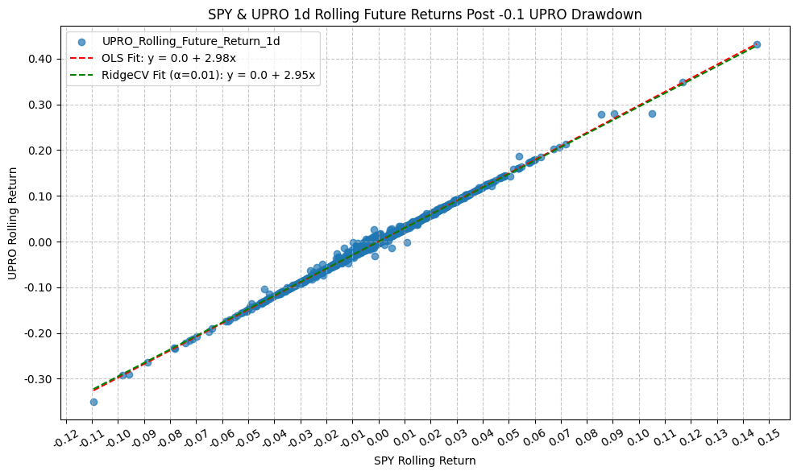
    


                                      OLS Regression Results                                 
    =========================================================================================
    Dep. Variable:     UPRO_Rolling_Future_Return_1d   R-squared:                       0.997
    Model:                                       OLS   Adj. R-squared:                  0.997
    Method:                            Least Squares   F-statistic:                 2.285e+06
    Date:                           Mon, 16 Mar 2026   Prob (F-statistic):               0.00
    Time:                                   13:43:45   Log-Likelihood:                 29859.
    No. Observations:                           6221   AIC:                        -5.971e+04
    Df Residuals:                               6219   BIC:                        -5.970e+04
    Df Model:                                      1                                         
    Covariance Type:                       nonrobust                                         
    ================================================================================================
                                       coef    std err          t      P>|t|      [0.025      0.975]
    ------------------------------------------------------------------------------------------------
    const                         2.196e-05   2.53e-05      0.869      0.385   -2.76e-05    7.15e-05
    SPY_Rolling_Future_Return_1d     2.9765      0.002   1511.654      0.000       2.973       2.980
    ==============================================================================
    Omnibus:                     4600.809   Durbin-Watson:                   2.630
    Prob(Omnibus):                  0.000   Jarque-Bera (JB):          2414888.124
    Skew:                           2.321   Prob(JB):                         0.00
    Kurtosis:                      99.410   Cond. No.                         78.0
    ==============================================================================
    
    Notes:
    [1] Standard Errors assume that the covariance matrix of the errors is correctly specified.


    

    


    

    


                                      OLS Regression Results                                 
    =========================================================================================
    Dep. Variable:     UPRO_Rolling_Future_Return_1w   R-squared:                       0.994
    Model:                                       OLS   Adj. R-squared:                  0.994
    Method:                            Least Squares   F-statistic:                 9.665e+05
    Date:                           Mon, 16 Mar 2026   Prob (F-statistic):               0.00
    Time:                                   13:43:46   Log-Likelihood:                 22872.
    No. Observations:                           6219   AIC:                        -4.574e+04
    Df Residuals:                               6217   BIC:                        -4.573e+04
    Df Model:                                      1                                         
    Covariance Type:                       nonrobust                                         
    ================================================================================================
                                       coef    std err          t      P>|t|      [0.025      0.975]
    ------------------------------------------------------------------------------------------------
    const                           -0.0002   7.79e-05     -3.047      0.002      -0.000   -8.46e-05
    SPY_Rolling_Future_Return_1w     2.9732      0.003    983.115      0.000       2.967       2.979
    ==============================================================================
    Omnibus:                     2734.500   Durbin-Watson:                   0.978
    Prob(Omnibus):                  0.000   Jarque-Bera (JB):           782234.894
    Skew:                          -0.876   Prob(JB):                         0.00
    Kurtosis:                      57.915   Cond. No.                         39.0
    ==============================================================================
    
    Notes:
    [1] Standard Errors assume that the covariance matrix of the errors is correctly specified.


    

    


    

    


                                      OLS Regression Results                                 
    =========================================================================================
    Dep. Variable:     UPRO_Rolling_Future_Return_1m   R-squared:                       0.988
    Model:                                       OLS   Adj. R-squared:                  0.988
    Method:                            Least Squares   F-statistic:                 4.994e+05
    Date:                           Mon, 16 Mar 2026   Prob (F-statistic):               0.00
    Time:                                   13:43:47   Log-Likelihood:                 16962.
    No. Observations:                           6218   AIC:                        -3.392e+04
    Df Residuals:                               6216   BIC:                        -3.391e+04
    Df Model:                                      1                                         
    Covariance Type:                       nonrobust                                         
    ================================================================================================
                                       coef    std err          t      P>|t|      [0.025      0.975]
    ------------------------------------------------------------------------------------------------
    const                           -0.0015      0.000     -7.184      0.000      -0.002      -0.001
    SPY_Rolling_Future_Return_1m     2.9746      0.004    706.661      0.000       2.966       2.983
    ==============================================================================
    Omnibus:                     3371.444   Durbin-Watson:                   0.336
    Prob(Omnibus):                  0.000   Jarque-Bera (JB):           387348.606
    Skew:                          -1.631   Prob(JB):                         0.00
    Kurtosis:                      41.528   Cond. No.                         21.0
    ==============================================================================
    
    Notes:
    [1] Standard Errors assume that the covariance matrix of the errors is correctly specified.


    
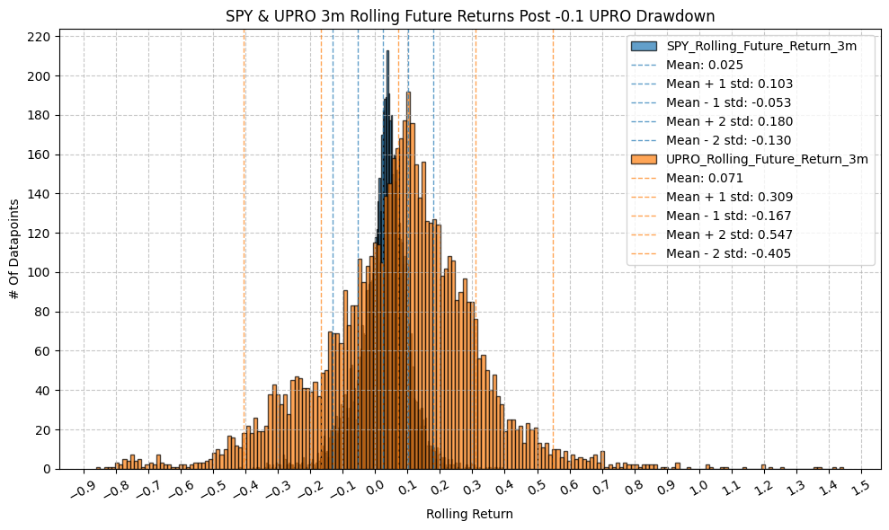
    


    

    


                                      OLS Regression Results                                 
    =========================================================================================
    Dep. Variable:     UPRO_Rolling_Future_Return_3m   R-squared:                       0.978
    Model:                                       OLS   Adj. R-squared:                  0.978
    Method:                            Least Squares   F-statistic:                 2.716e+05
    Date:                           Mon, 16 Mar 2026   Prob (F-statistic):               0.00
    Time:                                   13:43:49   Log-Likelihood:                 11917.
    No. Observations:                           6218   AIC:                        -2.383e+04
    Df Residuals:                               6216   BIC:                        -2.382e+04
    Df Model:                                      1                                         
    Covariance Type:                       nonrobust                                         
    ================================================================================================
                                       coef    std err          t      P>|t|      [0.025      0.975]
    ------------------------------------------------------------------------------------------------
    const                           -0.0048      0.000    -10.061      0.000      -0.006      -0.004
    SPY_Rolling_Future_Return_3m     3.0334      0.006    521.161      0.000       3.022       3.045
    ==============================================================================
    Omnibus:                     1724.576   Durbin-Watson:                   0.148
    Prob(Omnibus):                  0.000   Jarque-Bera (JB):            87846.616
    Skew:                           0.522   Prob(JB):                         0.00
    Kurtosis:                      21.384   Cond. No.                         12.9
    ==============================================================================
    
    Notes:
    [1] Standard Errors assume that the covariance matrix of the errors is correctly specified.


    
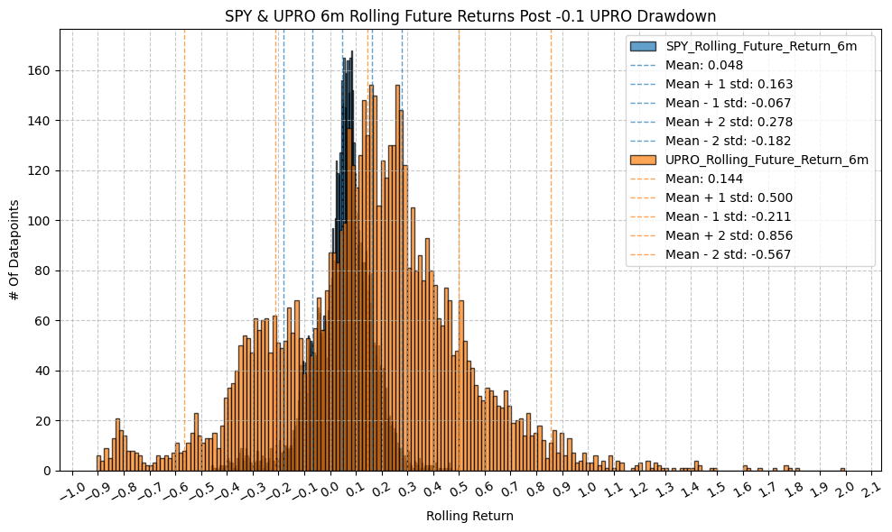
    


    
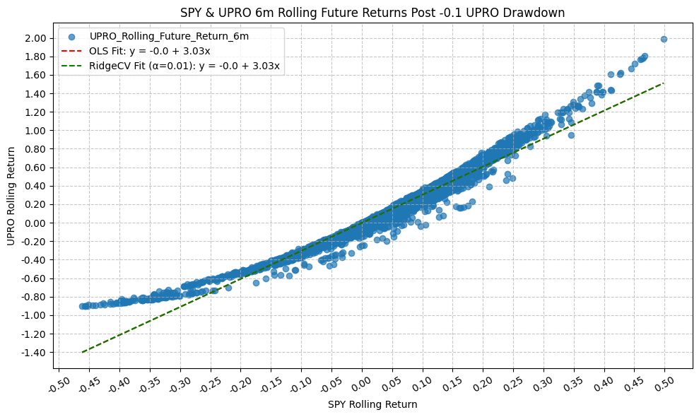
    


                                      OLS Regression Results                                 
    =========================================================================================
    Dep. Variable:     UPRO_Rolling_Future_Return_6m   R-squared:                       0.961
    Model:                                       OLS   Adj. R-squared:                  0.961
    Method:                            Least Squares   F-statistic:                 1.537e+05
    Date:                           Mon, 16 Mar 2026   Prob (F-statistic):               0.00
    Time:                                   13:43:50   Log-Likelihood:                 7698.5
    No. Observations:                           6214   AIC:                        -1.539e+04
    Df Residuals:                               6212   BIC:                        -1.538e+04
    Df Model:                                      1                                         
    Covariance Type:                       nonrobust                                         
    ================================================================================================
                                       coef    std err          t      P>|t|      [0.025      0.975]
    ------------------------------------------------------------------------------------------------
    const                           -0.0015      0.001     -1.526      0.127      -0.003       0.000
    SPY_Rolling_Future_Return_6m     3.0330      0.008    391.990      0.000       3.018       3.048
    ==============================================================================
    Omnibus:                     2086.730   Durbin-Watson:                   0.070
    Prob(Omnibus):                  0.000   Jarque-Bera (JB):            20739.746
    Skew:                           1.316   Prob(JB):                         0.00
    Kurtosis:                      11.554   Cond. No.                         8.72
    ==============================================================================
    
    Notes:
    [1] Standard Errors assume that the covariance matrix of the errors is correctly specified.


    

    


    
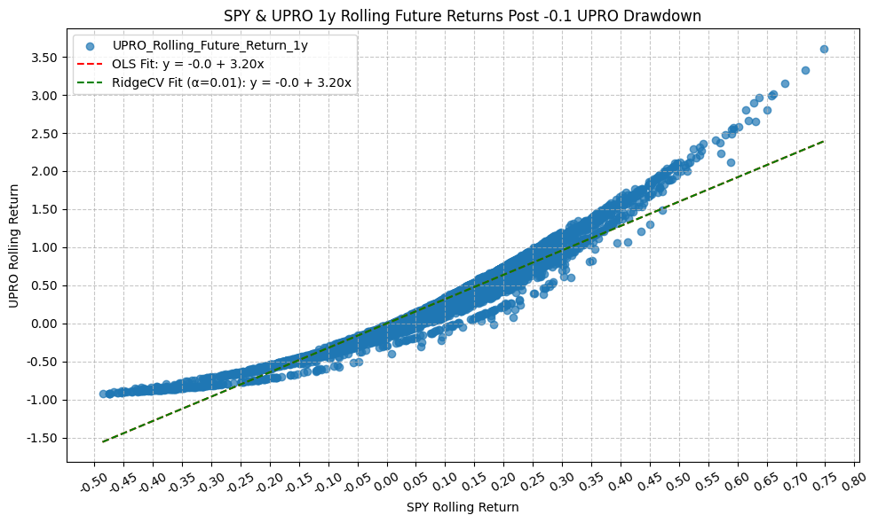
    


                                      OLS Regression Results                                 
    =========================================================================================
    Dep. Variable:     UPRO_Rolling_Future_Return_1y   R-squared:                       0.934
    Model:                                       OLS   Adj. R-squared:                  0.934
    Method:                            Least Squares   F-statistic:                 8.620e+04
    Date:                           Mon, 16 Mar 2026   Prob (F-statistic):               0.00
    Time:                                   13:43:51   Log-Likelihood:                 3064.8
    No. Observations:                           6141   AIC:                            -6126.
    Df Residuals:                               6139   BIC:                            -6112.
    Df Model:                                      1                                         
    Covariance Type:                       nonrobust                                         
    ================================================================================================
                                       coef    std err          t      P>|t|      [0.025      0.975]
    ------------------------------------------------------------------------------------------------
    const                           -0.0007      0.002     -0.314      0.754      -0.005       0.004
    SPY_Rolling_Future_Return_1y     3.1993      0.011    293.600      0.000       3.178       3.221
    ==============================================================================
    Omnibus:                     1575.656   Durbin-Watson:                   0.041
    Prob(Omnibus):                  0.000   Jarque-Bera (JB):             7484.757
    Skew:                           1.162   Prob(JB):                         0.00
    Kurtosis:                       7.883   Cond. No.                         5.86
    ==============================================================================
    
    Notes:
    [1] Standard Errors assume that the covariance matrix of the errors is correctly specified.


    

    


    

    


                                      OLS Regression Results                                 
    =========================================================================================
    Dep. Variable:     UPRO_Rolling_Future_Return_2y   R-squared:                       0.892
    Model:                                       OLS   Adj. R-squared:                  0.892
    Method:                            Least Squares   F-statistic:                 4.980e+04
    Date:                           Mon, 16 Mar 2026   Prob (F-statistic):               0.00
    Time:                                   13:43:52   Log-Likelihood:                -1446.2
    No. Observations:                           6061   AIC:                             2896.
    Df Residuals:                               6059   BIC:                             2910.
    Df Model:                                      1                                         
    Covariance Type:                       nonrobust                                         
    ================================================================================================
                                       coef    std err          t      P>|t|      [0.025      0.975]
    ------------------------------------------------------------------------------------------------
    const                           -0.0175      0.005     -3.607      0.000      -0.027      -0.008
    SPY_Rolling_Future_Return_2y     3.4272      0.015    223.154      0.000       3.397       3.457
    ==============================================================================
    Omnibus:                     1154.327   Durbin-Watson:                   0.024
    Prob(Omnibus):                  0.000   Jarque-Bera (JB):             2673.564
    Skew:                           1.077   Prob(JB):                         0.00
    Kurtosis:                       5.438   Cond. No.                         4.03
    ==============================================================================
    
    Notes:
    [1] Standard Errors assume that the covariance matrix of the errors is correctly specified.


    

    


    

    


                                      OLS Regression Results                                 
    =========================================================================================
    Dep. Variable:     UPRO_Rolling_Future_Return_3y   R-squared:                       0.861
    Model:                                       OLS   Adj. R-squared:                  0.861
    Method:                            Least Squares   F-statistic:                 3.592e+04
    Date:                           Mon, 16 Mar 2026   Prob (F-statistic):               0.00
    Time:                                   13:43:54   Log-Likelihood:                -4707.3
    No. Observations:                           5809   AIC:                             9419.
    Df Residuals:                               5807   BIC:                             9432.
    Df Model:                                      1                                         
    Covariance Type:                       nonrobust                                         
    ================================================================================================
                                       coef    std err          t      P>|t|      [0.025      0.975]
    ------------------------------------------------------------------------------------------------
    const                           -0.1527      0.009    -16.369      0.000      -0.171      -0.134
    SPY_Rolling_Future_Return_3y     4.1206      0.022    189.528      0.000       4.078       4.163
    ==============================================================================
    Omnibus:                     1530.432   Durbin-Watson:                   0.011
    Prob(Omnibus):                  0.000   Jarque-Bera (JB):             4862.520
    Skew:                           1.335   Prob(JB):                         0.00
    Kurtosis:                       6.601   Cond. No.                         3.30
    ==============================================================================
    
    Notes:
    [1] Standard Errors assume that the covariance matrix of the errors is correctly specified.


    

    


    

    


                                      OLS Regression Results                                 
    =========================================================================================
    Dep. Variable:     UPRO_Rolling_Future_Return_4y   R-squared:                       0.849
    Model:                                       OLS   Adj. R-squared:                  0.849
    Method:                            Least Squares   F-statistic:                 3.112e+04
    Date:                           Mon, 16 Mar 2026   Prob (F-statistic):               0.00
    Time:                                   13:43:55   Log-Likelihood:                -7257.5
    No. Observations:                           5557   AIC:                         1.452e+04
    Df Residuals:                               5555   BIC:                         1.453e+04
    Df Model:                                      1                                         
    Covariance Type:                       nonrobust                                         
    ================================================================================================
                                       coef    std err          t      P>|t|      [0.025      0.975]
    ------------------------------------------------------------------------------------------------
    const                           -0.4417      0.016    -27.325      0.000      -0.473      -0.410
    SPY_Rolling_Future_Return_4y     5.1530      0.029    176.414      0.000       5.096       5.210
    ==============================================================================
    Omnibus:                     1907.776   Durbin-Watson:                   0.013
    Prob(Omnibus):                  0.000   Jarque-Bera (JB):            10169.158
    Skew:                           1.554   Prob(JB):                         0.00
    Kurtosis:                       8.853   Cond. No.                         2.83
    ==============================================================================
    
    Notes:
    [1] Standard Errors assume that the covariance matrix of the errors is correctly specified.


    
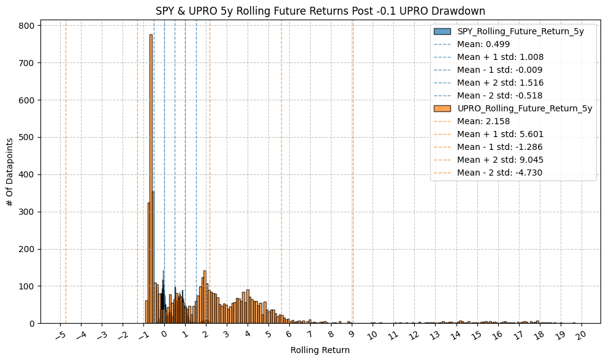
    


    

    


                                      OLS Regression Results                                 
    =========================================================================================
    Dep. Variable:     UPRO_Rolling_Future_Return_5y   R-squared:                       0.838
    Model:                                       OLS   Adj. R-squared:                  0.838
    Method:                            Least Squares   F-statistic:                 2.842e+04
    Date:                           Mon, 16 Mar 2026   Prob (F-statistic):               0.00
    Time:                                   13:43:56   Log-Likelihood:                -9617.9
    No. Observations:                           5508   AIC:                         1.924e+04
    Df Residuals:                               5506   BIC:                         1.925e+04
    Df Model:                                      1                                         
    Covariance Type:                       nonrobust                                         
    ================================================================================================
                                       coef    std err          t      P>|t|      [0.025      0.975]
    ------------------------------------------------------------------------------------------------
    const                           -0.9357      0.026    -35.724      0.000      -0.987      -0.884
    SPY_Rolling_Future_Return_5y     6.1980      0.037    168.589      0.000       6.126       6.270
    ==============================================================================
    Omnibus:                     1244.876   Durbin-Watson:                   0.010
    Prob(Omnibus):                  0.000   Jarque-Bera (JB):             4373.621
    Skew:                           1.109   Prob(JB):                         0.00
    Kurtosis:                       6.760   Cond. No.                         2.58
    ==============================================================================
    
    Notes:
    [1] Standard Errors assume that the covariance matrix of the errors is correctly specified.


    

    


    

    


                                      OLS Regression Results                                 
    =========================================================================================
    Dep. Variable:     UPRO_Rolling_Future_Return_1d   R-squared:                       0.997
    Model:                                       OLS   Adj. R-squared:                  0.997
    Method:                            Least Squares   F-statistic:                 1.837e+06
    Date:                           Mon, 16 Mar 2026   Prob (F-statistic):               0.00
    Time:                                   13:43:57   Log-Likelihood:                 25121.
    No. Observations:                           5293   AIC:                        -5.024e+04
    Df Residuals:                               5291   BIC:                        -5.023e+04
    Df Model:                                      1                                         
    Covariance Type:                       nonrobust                                         
    ================================================================================================
                                       coef    std err          t      P>|t|      [0.025      0.975]
    ------------------------------------------------------------------------------------------------
    const                         3.561e-05   2.89e-05      1.232      0.218   -2.11e-05    9.23e-05
    SPY_Rolling_Future_Return_1d     2.9772      0.002   1355.226      0.000       2.973       2.981
    ==============================================================================
    Omnibus:                     3682.706   Durbin-Watson:                   2.648
    Prob(Omnibus):                  0.000   Jarque-Bera (JB):          1787435.938
    Skew:                           2.082   Prob(JB):                         0.00
    Kurtosis:                      92.930   Cond. No.                         76.0
    ==============================================================================
    
    Notes:
    [1] Standard Errors assume that the covariance matrix of the errors is correctly specified.


    

    


    

    


                                      OLS Regression Results                                 
    =========================================================================================
    Dep. Variable:     UPRO_Rolling_Future_Return_1w   R-squared:                       0.993
    Model:                                       OLS   Adj. R-squared:                  0.993
    Method:                            Least Squares   F-statistic:                 7.714e+05
    Date:                           Mon, 16 Mar 2026   Prob (F-statistic):               0.00
    Time:                                   13:43:58   Log-Likelihood:                 19160.
    No. Observations:                           5293   AIC:                        -3.832e+04
    Df Residuals:                               5291   BIC:                        -3.830e+04
    Df Model:                                      1                                         
    Covariance Type:                       nonrobust                                         
    ================================================================================================
                                       coef    std err          t      P>|t|      [0.025      0.975]
    ------------------------------------------------------------------------------------------------
    const                           -0.0002   8.94e-05     -2.240      0.025      -0.000    -2.5e-05
    SPY_Rolling_Future_Return_1w     2.9708      0.003    878.276      0.000       2.964       2.977
    ==============================================================================
    Omnibus:                     2333.089   Durbin-Watson:                   0.986
    Prob(Omnibus):                  0.000   Jarque-Bera (JB):           564965.860
    Skew:                          -0.921   Prob(JB):                         0.00
    Kurtosis:                      53.580   Cond. No.                         38.0
    ==============================================================================
    
    Notes:
    [1] Standard Errors assume that the covariance matrix of the errors is correctly specified.


    
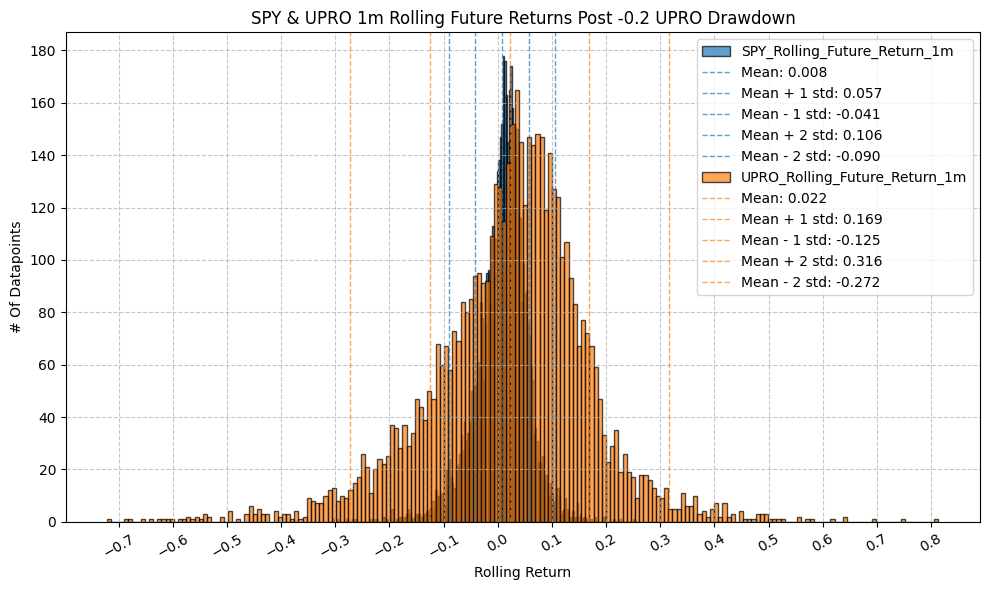
    


    

    


                                      OLS Regression Results                                 
    =========================================================================================
    Dep. Variable:     UPRO_Rolling_Future_Return_1m   R-squared:                       0.987
    Model:                                       OLS   Adj. R-squared:                  0.987
    Method:                            Least Squares   F-statistic:                 4.024e+05
    Date:                           Mon, 16 Mar 2026   Prob (F-statistic):               0.00
    Time:                                   13:44:00   Log-Likelihood:                 14137.
    No. Observations:                           5293   AIC:                        -2.827e+04
    Df Residuals:                               5291   BIC:                        -2.826e+04
    Df Model:                                      1                                         
    Covariance Type:                       nonrobust                                         
    ================================================================================================
                                       coef    std err          t      P>|t|      [0.025      0.975]
    ------------------------------------------------------------------------------------------------
    const                           -0.0014      0.000     -6.033      0.000      -0.002      -0.001
    SPY_Rolling_Future_Return_1m     2.9716      0.005    634.375      0.000       2.962       2.981
    ==============================================================================
    Omnibus:                     2857.215   Durbin-Watson:                   0.332
    Prob(Omnibus):                  0.000   Jarque-Bera (JB):           280080.687
    Skew:                          -1.658   Prob(JB):                         0.00
    Kurtosis:                      38.482   Cond. No.                         20.4
    ==============================================================================
    
    Notes:
    [1] Standard Errors assume that the covariance matrix of the errors is correctly specified.


    
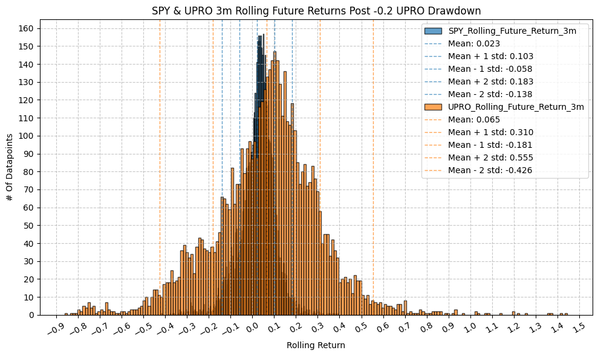
    


    

    


                                      OLS Regression Results                                 
    =========================================================================================
    Dep. Variable:     UPRO_Rolling_Future_Return_3m   R-squared:                       0.977
    Model:                                       OLS   Adj. R-squared:                  0.977
    Method:                            Least Squares   F-statistic:                 2.274e+05
    Date:                           Mon, 16 Mar 2026   Prob (F-statistic):               0.00
    Time:                                   13:44:01   Log-Likelihood:                 9942.2
    No. Observations:                           5293   AIC:                        -1.988e+04
    Df Residuals:                               5291   BIC:                        -1.987e+04
    Df Model:                                      1                                         
    Covariance Type:                       nonrobust                                         
    ================================================================================================
                                       coef    std err          t      P>|t|      [0.025      0.975]
    ------------------------------------------------------------------------------------------------
    const                           -0.0036      0.001     -6.764      0.000      -0.005      -0.003
    SPY_Rolling_Future_Return_3m     3.0230      0.006    476.832      0.000       3.011       3.035
    ==============================================================================
    Omnibus:                     1416.233   Durbin-Watson:                   0.159
    Prob(Omnibus):                  0.000   Jarque-Bera (JB):            70537.930
    Skew:                           0.467   Prob(JB):                         0.00
    Kurtosis:                      20.860   Cond. No.                         12.5
    ==============================================================================
    
    Notes:
    [1] Standard Errors assume that the covariance matrix of the errors is correctly specified.


    

    


    

    


                                      OLS Regression Results                                 
    =========================================================================================
    Dep. Variable:     UPRO_Rolling_Future_Return_6m   R-squared:                       0.960
    Model:                                       OLS   Adj. R-squared:                  0.960
    Method:                            Least Squares   F-statistic:                 1.281e+05
    Date:                           Mon, 16 Mar 2026   Prob (F-statistic):               0.00
    Time:                                   13:44:03   Log-Likelihood:                 6392.3
    No. Observations:                           5293   AIC:                        -1.278e+04
    Df Residuals:                               5291   BIC:                        -1.277e+04
    Df Model:                                      1                                         
    Covariance Type:                       nonrobust                                         
    ================================================================================================
                                       coef    std err          t      P>|t|      [0.025      0.975]
    ------------------------------------------------------------------------------------------------
    const                            0.0016      0.001      1.525      0.127      -0.000       0.004
    SPY_Rolling_Future_Return_6m     3.0177      0.008    357.941      0.000       3.001       3.034
    ==============================================================================
    Omnibus:                     1752.103   Durbin-Watson:                   0.078
    Prob(Omnibus):                  0.000   Jarque-Bera (JB):            16365.764
    Skew:                           1.309   Prob(JB):                         0.00
    Kurtosis:                      11.207   Cond. No.                         8.50
    ==============================================================================
    
    Notes:
    [1] Standard Errors assume that the covariance matrix of the errors is correctly specified.


    

    


    

    


                                      OLS Regression Results                                 
    =========================================================================================
    Dep. Variable:     UPRO_Rolling_Future_Return_1y   R-squared:                       0.937
    Model:                                       OLS   Adj. R-squared:                  0.937
    Method:                            Least Squares   F-statistic:                 7.757e+04
    Date:                           Mon, 16 Mar 2026   Prob (F-statistic):               0.00
    Time:                                   13:44:04   Log-Likelihood:                 2737.3
    No. Observations:                           5248   AIC:                            -5471.
    Df Residuals:                               5246   BIC:                            -5457.
    Df Model:                                      1                                         
    Covariance Type:                       nonrobust                                         
    ================================================================================================
                                       coef    std err          t      P>|t|      [0.025      0.975]
    ------------------------------------------------------------------------------------------------
    const                            0.0101      0.002      4.550      0.000       0.006       0.015
    SPY_Rolling_Future_Return_1y     3.1690      0.011    278.518      0.000       3.147       3.191
    ==============================================================================
    Omnibus:                     1724.713   Durbin-Watson:                   0.051
    Prob(Omnibus):                  0.000   Jarque-Bera (JB):             9895.182
    Skew:                           1.453   Prob(JB):                         0.00
    Kurtosis:                       9.066   Cond. No.                         5.79
    ==============================================================================
    
    Notes:
    [1] Standard Errors assume that the covariance matrix of the errors is correctly specified.


    
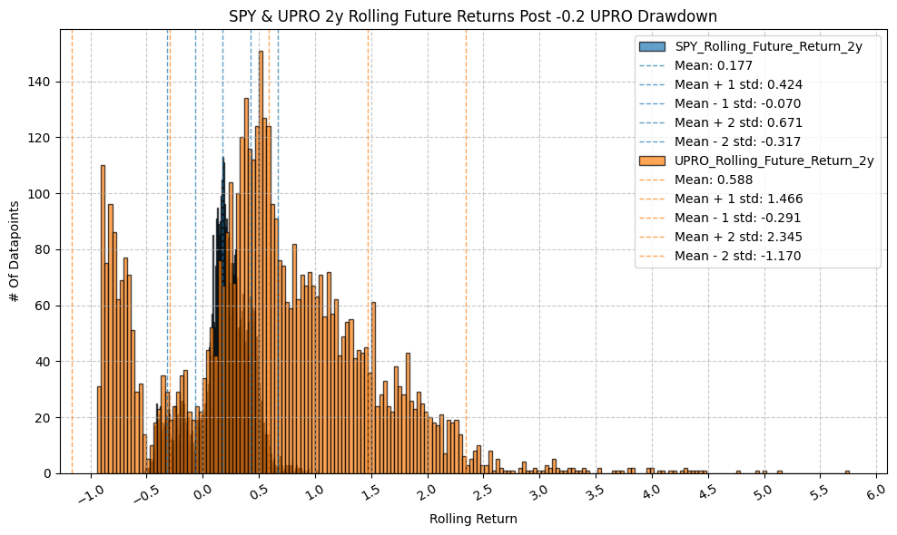
    


    

    


                                      OLS Regression Results                                 
    =========================================================================================
    Dep. Variable:     UPRO_Rolling_Future_Return_2y   R-squared:                       0.895
    Model:                                       OLS   Adj. R-squared:                  0.895
    Method:                            Least Squares   F-statistic:                 4.481e+04
    Date:                           Mon, 16 Mar 2026   Prob (F-statistic):               0.00
    Time:                                   13:44:06   Log-Likelihood:                -840.74
    No. Observations:                           5235   AIC:                             1685.
    Df Residuals:                               5233   BIC:                             1699.
    Df Model:                                      1                                         
    Covariance Type:                       nonrobust                                         
    ================================================================================================
                                       coef    std err          t      P>|t|      [0.025      0.975]
    ------------------------------------------------------------------------------------------------
    const                           -0.0069      0.005     -1.420      0.156      -0.016       0.003
    SPY_Rolling_Future_Return_2y     3.3654      0.016    211.679      0.000       3.334       3.397
    ==============================================================================
    Omnibus:                     1350.050   Durbin-Watson:                   0.031
    Prob(Omnibus):                  0.000   Jarque-Bera (JB):             4692.366
    Skew:                           1.271   Prob(JB):                         0.00
    Kurtosis:                       6.879   Cond. No.                         4.18
    ==============================================================================
    
    Notes:
    [1] Standard Errors assume that the covariance matrix of the errors is correctly specified.


    
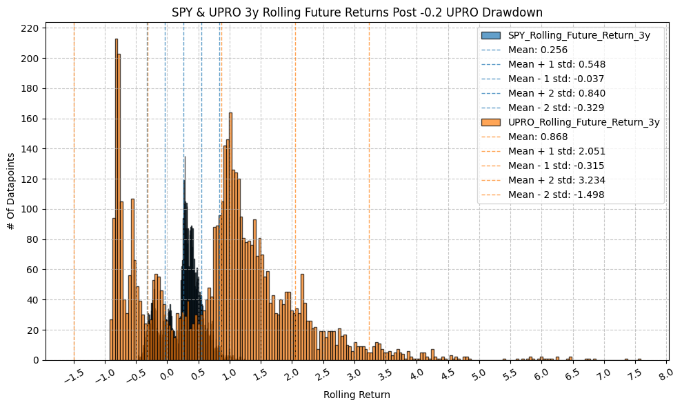
    


    

    


                                      OLS Regression Results                                 
    =========================================================================================
    Dep. Variable:     UPRO_Rolling_Future_Return_3y   R-squared:                       0.885
    Model:                                       OLS   Adj. R-squared:                  0.885
    Method:                            Least Squares   F-statistic:                 3.849e+04
    Date:                           Mon, 16 Mar 2026   Prob (F-statistic):               0.00
    Time:                                   13:44:07   Log-Likelihood:                -2524.0
    No. Observations:                           4998   AIC:                             5052.
    Df Residuals:                               4996   BIC:                             5065.
    Df Model:                                      1                                         
    Covariance Type:                       nonrobust                                         
    ================================================================================================
                                       coef    std err          t      P>|t|      [0.025      0.975]
    ------------------------------------------------------------------------------------------------
    const                           -0.1052      0.008    -13.955      0.000      -0.120      -0.090
    SPY_Rolling_Future_Return_3y     3.8081      0.019    196.192      0.000       3.770       3.846
    ==============================================================================
    Omnibus:                     1497.695   Durbin-Watson:                   0.020
    Prob(Omnibus):                  0.000   Jarque-Bera (JB):             8214.199
    Skew:                           1.324   Prob(JB):                         0.00
    Kurtosis:                       8.695   Cond. No.                         3.66
    ==============================================================================
    
    Notes:
    [1] Standard Errors assume that the covariance matrix of the errors is correctly specified.


    

    


    
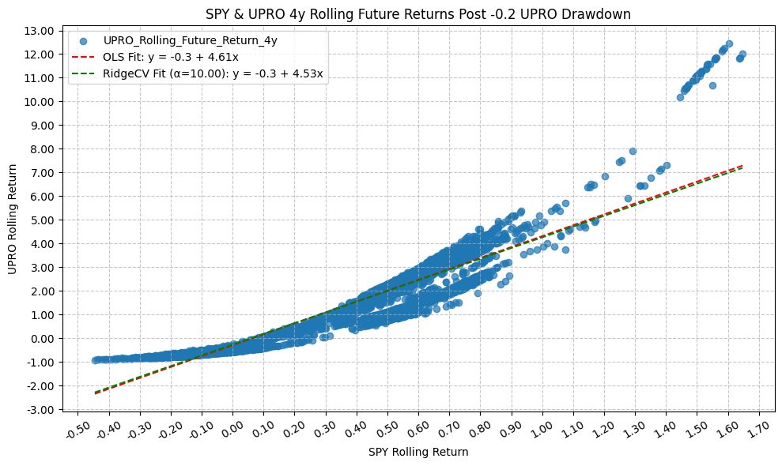
    


                                      OLS Regression Results                                 
    =========================================================================================
    Dep. Variable:     UPRO_Rolling_Future_Return_4y   R-squared:                       0.862
    Model:                                       OLS   Adj. R-squared:                  0.862
    Method:                            Least Squares   F-statistic:                 2.963e+04
    Date:                           Mon, 16 Mar 2026   Prob (F-statistic):               0.00
    Time:                                   13:44:08   Log-Likelihood:                -4784.4
    No. Observations:                           4757   AIC:                             9573.
    Df Residuals:                               4755   BIC:                             9586.
    Df Model:                                      1                                         
    Covariance Type:                       nonrobust                                         
    ================================================================================================
                                       coef    std err          t      P>|t|      [0.025      0.975]
    ------------------------------------------------------------------------------------------------
    const                           -0.3002      0.013    -22.587      0.000      -0.326      -0.274
    SPY_Rolling_Future_Return_4y     4.6068      0.027    172.137      0.000       4.554       4.659
    ==============================================================================
    Omnibus:                     2932.099   Durbin-Watson:                   0.020
    Prob(Omnibus):                  0.000   Jarque-Bera (JB):            69932.785
    Skew:                           2.518   Prob(JB):                         0.00
    Kurtosis:                      21.096   Cond. No.                         3.16
    ==============================================================================
    
    Notes:
    [1] Standard Errors assume that the covariance matrix of the errors is correctly specified.


    
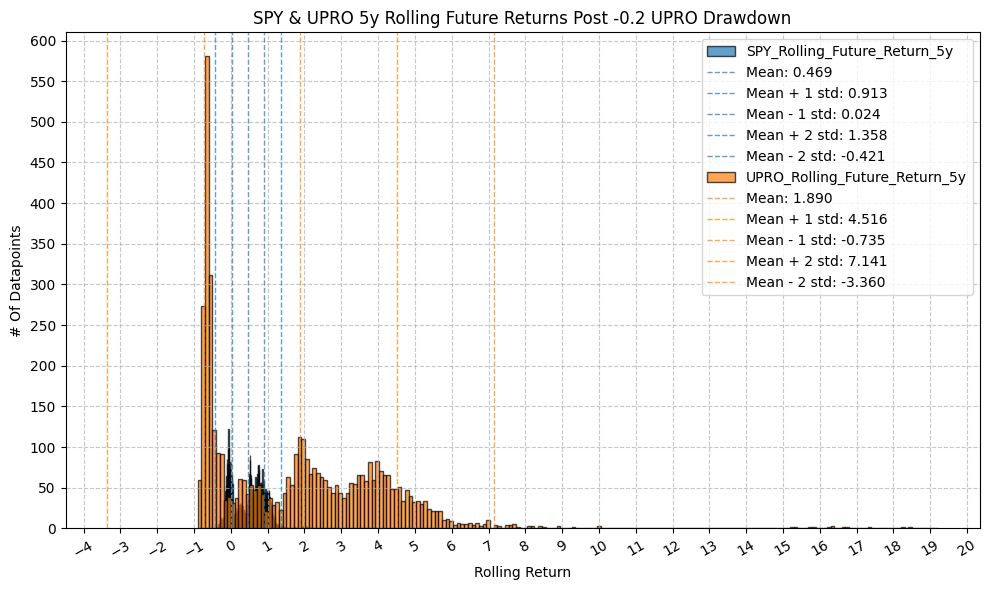
    


    
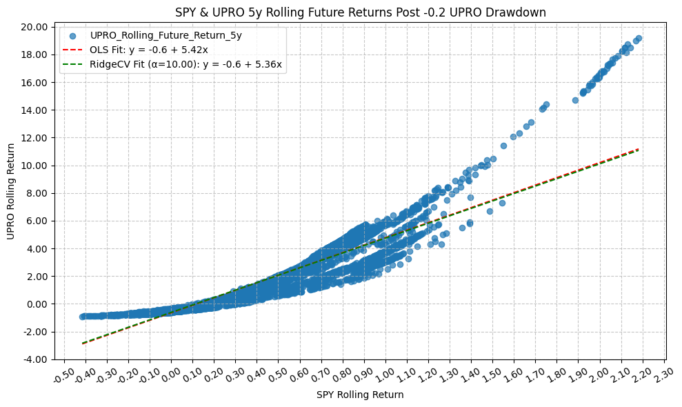
    


                                      OLS Regression Results                                 
    =========================================================================================
    Dep. Variable:     UPRO_Rolling_Future_Return_5y   R-squared:                       0.842
    Model:                                       OLS   Adj. R-squared:                  0.842
    Method:                            Least Squares   F-statistic:                 2.529e+04
    Date:                           Mon, 16 Mar 2026   Prob (F-statistic):               0.00
    Time:                                   13:44:10   Log-Likelihood:                -6916.8
    No. Observations:                           4736   AIC:                         1.384e+04
    Df Residuals:                               4734   BIC:                         1.385e+04
    Df Model:                                      1                                         
    Covariance Type:                       nonrobust                                         
    ================================================================================================
                                       coef    std err          t      P>|t|      [0.025      0.975]
    ------------------------------------------------------------------------------------------------
    const                           -0.6492      0.022    -29.490      0.000      -0.692      -0.606
    SPY_Rolling_Future_Return_5y     5.4202      0.034    159.020      0.000       5.353       5.487
    ==============================================================================
    Omnibus:                     2512.987   Durbin-Watson:                   0.026
    Prob(Omnibus):                  0.000   Jarque-Bera (JB):            40989.263
    Skew:                           2.157   Prob(JB):                         0.00
    Kurtosis:                      16.751   Cond. No.                         2.84
    ==============================================================================
    
    Notes:
    [1] Standard Errors assume that the covariance matrix of the errors is correctly specified.


    

    


    

    


                                      OLS Regression Results                                 
    =========================================================================================
    Dep. Variable:     UPRO_Rolling_Future_Return_1d   R-squared:                       0.997
    Model:                                       OLS   Adj. R-squared:                  0.997
    Method:                            Least Squares   F-statistic:                 1.595e+06
    Date:                           Mon, 16 Mar 2026   Prob (F-statistic):               0.00
    Time:                                   13:44:11   Log-Likelihood:                 22509.
    No. Observations:                           4774   AIC:                        -4.501e+04
    Df Residuals:                               4772   BIC:                        -4.500e+04
    Df Model:                                      1                                         
    Covariance Type:                       nonrobust                                         
    ================================================================================================
                                       coef    std err          t      P>|t|      [0.025      0.975]
    ------------------------------------------------------------------------------------------------
    const                           4.7e-05   3.14e-05      1.497      0.135   -1.46e-05       0.000
    SPY_Rolling_Future_Return_1d     2.9768      0.002   1263.103      0.000       2.972       2.981
    ==============================================================================
    Omnibus:                     3250.843   Durbin-Watson:                   2.668
    Prob(Omnibus):                  0.000   Jarque-Bera (JB):          1511414.470
    Skew:                           2.004   Prob(JB):                         0.00
    Kurtosis:                      90.076   Cond. No.                         75.1
    ==============================================================================
    
    Notes:
    [1] Standard Errors assume that the covariance matrix of the errors is correctly specified.


    

    


    

    


                                      OLS Regression Results                                 
    =========================================================================================
    Dep. Variable:     UPRO_Rolling_Future_Return_1w   R-squared:                       0.993
    Model:                                       OLS   Adj. R-squared:                  0.993
    Method:                            Least Squares   F-statistic:                 6.655e+05
    Date:                           Mon, 16 Mar 2026   Prob (F-statistic):               0.00
    Time:                                   13:44:12   Log-Likelihood:                 17170.
    No. Observations:                           4774   AIC:                        -3.434e+04
    Df Residuals:                               4772   BIC:                        -3.432e+04
    Df Model:                                      1                                         
    Covariance Type:                       nonrobust                                         
    ================================================================================================
                                       coef    std err          t      P>|t|      [0.025      0.975]
    ------------------------------------------------------------------------------------------------
    const                           -0.0002   9.63e-05     -1.929      0.054      -0.000    2.99e-06
    SPY_Rolling_Future_Return_1w     2.9716      0.004    815.801      0.000       2.964       2.979
    ==============================================================================
    Omnibus:                     1997.752   Durbin-Watson:                   0.986
    Prob(Omnibus):                  0.000   Jarque-Bera (JB):           483400.223
    Skew:                          -0.802   Prob(JB):                         0.00
    Kurtosis:                      52.271   Cond. No.                         37.9
    ==============================================================================
    
    Notes:
    [1] Standard Errors assume that the covariance matrix of the errors is correctly specified.


    

    


    

    


                                      OLS Regression Results                                 
    =========================================================================================
    Dep. Variable:     UPRO_Rolling_Future_Return_1m   R-squared:                       0.987
    Model:                                       OLS   Adj. R-squared:                  0.987
    Method:                            Least Squares   F-statistic:                 3.515e+05
    Date:                           Mon, 16 Mar 2026   Prob (F-statistic):               0.00
    Time:                                   13:44:13   Log-Likelihood:                 12680.
    No. Observations:                           4774   AIC:                        -2.536e+04
    Df Residuals:                               4772   BIC:                        -2.534e+04
    Df Model:                                      1                                         
    Covariance Type:                       nonrobust                                         
    ================================================================================================
                                       coef    std err          t      P>|t|      [0.025      0.975]
    ------------------------------------------------------------------------------------------------
    const                           -0.0011      0.000     -4.428      0.000      -0.002      -0.001
    SPY_Rolling_Future_Return_1m     2.9621      0.005    592.897      0.000       2.952       2.972
    ==============================================================================
    Omnibus:                     2677.436   Durbin-Watson:                   0.336
    Prob(Omnibus):                  0.000   Jarque-Bera (JB):           262814.760
    Skew:                          -1.764   Prob(JB):                         0.00
    Kurtosis:                      39.177   Cond. No.                         20.3
    ==============================================================================
    
    Notes:
    [1] Standard Errors assume that the covariance matrix of the errors is correctly specified.


    
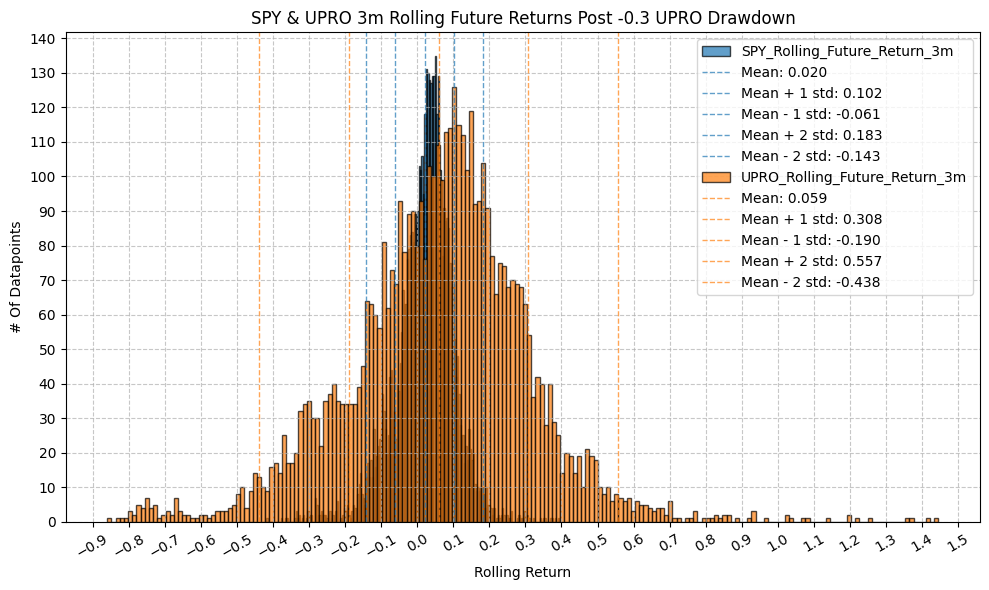
    


    

    


                                      OLS Regression Results                                 
    =========================================================================================
    Dep. Variable:     UPRO_Rolling_Future_Return_3m   R-squared:                       0.978
    Model:                                       OLS   Adj. R-squared:                  0.978
    Method:                            Least Squares   F-statistic:                 2.123e+05
    Date:                           Mon, 16 Mar 2026   Prob (F-statistic):               0.00
    Time:                                   13:44:15   Log-Likelihood:                 8982.1
    No. Observations:                           4774   AIC:                        -1.796e+04
    Df Residuals:                               4772   BIC:                        -1.795e+04
    Df Model:                                      1                                         
    Covariance Type:                       nonrobust                                         
    ================================================================================================
                                       coef    std err          t      P>|t|      [0.025      0.975]
    ------------------------------------------------------------------------------------------------
    const                           -0.0024      0.001     -4.439      0.000      -0.004      -0.001
    SPY_Rolling_Future_Return_3m     3.0171      0.007    460.794      0.000       3.004       3.030
    ==============================================================================
    Omnibus:                     1429.012   Durbin-Watson:                   0.169
    Prob(Omnibus):                  0.000   Jarque-Bera (JB):            68304.492
    Skew:                           0.660   Prob(JB):                         0.00
    Kurtosis:                      21.483   Cond. No.                         12.3
    ==============================================================================
    
    Notes:
    [1] Standard Errors assume that the covariance matrix of the errors is correctly specified.


    
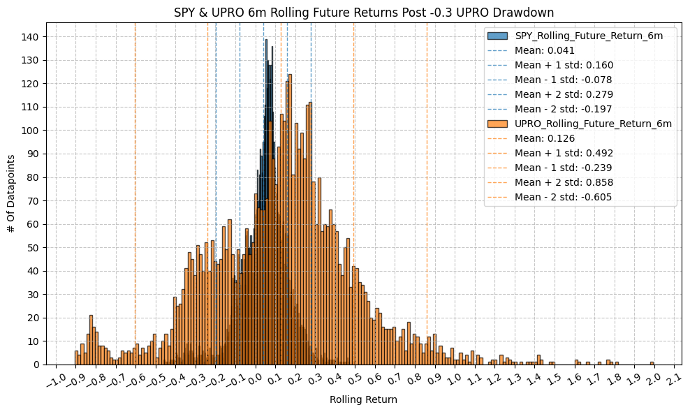
    


    

    


                                      OLS Regression Results                                 
    =========================================================================================
    Dep. Variable:     UPRO_Rolling_Future_Return_6m   R-squared:                       0.960
    Model:                                       OLS   Adj. R-squared:                  0.960
    Method:                            Least Squares   F-statistic:                 1.138e+05
    Date:                           Mon, 16 Mar 2026   Prob (F-statistic):               0.00
    Time:                                   13:44:16   Log-Likelihood:                 5697.0
    No. Observations:                           4774   AIC:                        -1.139e+04
    Df Residuals:                               4772   BIC:                        -1.138e+04
    Df Model:                                      1                                         
    Covariance Type:                       nonrobust                                         
    ================================================================================================
                                       coef    std err          t      P>|t|      [0.025      0.975]
    ------------------------------------------------------------------------------------------------
    const                            0.0029      0.001      2.542      0.011       0.001       0.005
    SPY_Rolling_Future_Return_6m     3.0135      0.009    337.350      0.000       2.996       3.031
    ==============================================================================
    Omnibus:                     1652.367   Durbin-Watson:                   0.081
    Prob(Omnibus):                  0.000   Jarque-Bera (JB):            14599.547
    Skew:                           1.398   Prob(JB):                         0.00
    Kurtosis:                      11.098   Cond. No.                         8.43
    ==============================================================================
    
    Notes:
    [1] Standard Errors assume that the covariance matrix of the errors is correctly specified.


    

    


    

    


                                      OLS Regression Results                                 
    =========================================================================================
    Dep. Variable:     UPRO_Rolling_Future_Return_1y   R-squared:                       0.937
    Model:                                       OLS   Adj. R-squared:                  0.937
    Method:                            Least Squares   F-statistic:                 7.059e+04
    Date:                           Mon, 16 Mar 2026   Prob (F-statistic):               0.00
    Time:                                   13:44:17   Log-Likelihood:                 2483.5
    No. Observations:                           4753   AIC:                            -4963.
    Df Residuals:                               4751   BIC:                            -4950.
    Df Model:                                      1                                         
    Covariance Type:                       nonrobust                                         
    ================================================================================================
                                       coef    std err          t      P>|t|      [0.025      0.975]
    ------------------------------------------------------------------------------------------------
    const                            0.0150      0.002      6.476      0.000       0.010       0.020
    SPY_Rolling_Future_Return_1y     3.1488      0.012    265.683      0.000       3.126       3.172
    ==============================================================================
    Omnibus:                     1666.063   Durbin-Watson:                   0.054
    Prob(Omnibus):                  0.000   Jarque-Bera (JB):            10578.908
    Skew:                           1.528   Prob(JB):                         0.00
    Kurtosis:                       9.639   Cond. No.                         5.74
    ==============================================================================
    
    Notes:
    [1] Standard Errors assume that the covariance matrix of the errors is correctly specified.


    

    


    
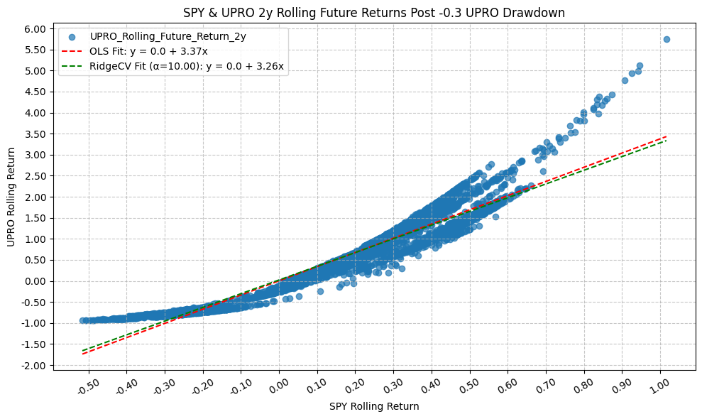
    


                                      OLS Regression Results                                 
    =========================================================================================
    Dep. Variable:     UPRO_Rolling_Future_Return_2y   R-squared:                       0.901
    Model:                                       OLS   Adj. R-squared:                  0.901
    Method:                            Least Squares   F-statistic:                 4.347e+04
    Date:                           Mon, 16 Mar 2026   Prob (F-statistic):               0.00
    Time:                                   13:44:18   Log-Likelihood:                -568.49
    No. Observations:                           4753   AIC:                             1141.
    Df Residuals:                               4751   BIC:                             1154.
    Df Model:                                      1                                         
    Covariance Type:                       nonrobust                                         
    ================================================================================================
                                       coef    std err          t      P>|t|      [0.025      0.975]
    ------------------------------------------------------------------------------------------------
    const                            0.0020      0.005      0.409      0.683      -0.008       0.012
    SPY_Rolling_Future_Return_2y     3.3736      0.016    208.486      0.000       3.342       3.405
    ==============================================================================
    Omnibus:                     1332.905   Durbin-Watson:                   0.031
    Prob(Omnibus):                  0.000   Jarque-Bera (JB):             5113.742
    Skew:                           1.349   Prob(JB):                         0.00
    Kurtosis:                       7.306   Cond. No.                         4.22
    ==============================================================================
    
    Notes:
    [1] Standard Errors assume that the covariance matrix of the errors is correctly specified.


    

    


    

    


                                      OLS Regression Results                                 
    =========================================================================================
    Dep. Variable:     UPRO_Rolling_Future_Return_3y   R-squared:                       0.904
    Model:                                       OLS   Adj. R-squared:                  0.904
    Method:                            Least Squares   F-statistic:                 4.265e+04
    Date:                           Mon, 16 Mar 2026   Prob (F-statistic):               0.00
    Time:                                   13:44:19   Log-Likelihood:                -1581.0
    No. Observations:                           4545   AIC:                             3166.
    Df Residuals:                               4543   BIC:                             3179.
    Df Model:                                      1                                         
    Covariance Type:                       nonrobust                                         
    ================================================================================================
                                       coef    std err          t      P>|t|      [0.025      0.975]
    ------------------------------------------------------------------------------------------------
    const                           -0.0865      0.007    -12.630      0.000      -0.100      -0.073
    SPY_Rolling_Future_Return_3y     3.7644      0.018    206.520      0.000       3.729       3.800
    ==============================================================================
    Omnibus:                      685.599   Durbin-Watson:                   0.019
    Prob(Omnibus):                  0.000   Jarque-Bera (JB):             1776.838
    Skew:                           0.833   Prob(JB):                         0.00
    Kurtosis:                       5.571   Cond. No.                         3.83
    ==============================================================================
    
    Notes:
    [1] Standard Errors assume that the covariance matrix of the errors is correctly specified.


    
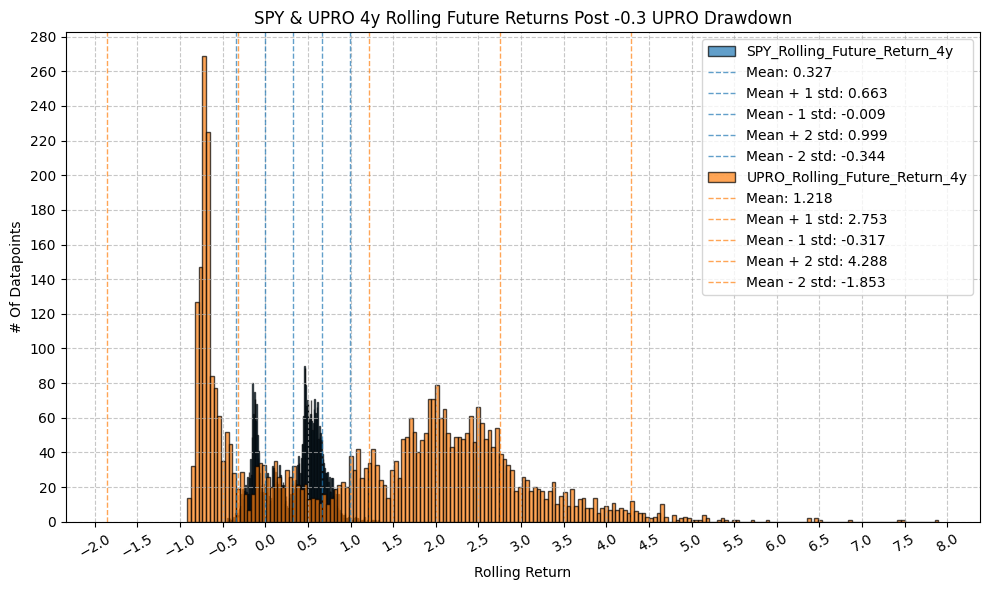
    


    

    


                                      OLS Regression Results                                 
    =========================================================================================
    Dep. Variable:     UPRO_Rolling_Future_Return_4y   R-squared:                       0.916
    Model:                                       OLS   Adj. R-squared:                  0.916
    Method:                            Least Squares   F-statistic:                 4.728e+04
    Date:                           Mon, 16 Mar 2026   Prob (F-statistic):               0.00
    Time:                                   13:44:21   Log-Likelihood:                -2622.0
    No. Observations:                           4319   AIC:                             5248.
    Df Residuals:                               4317   BIC:                             5261.
    Df Model:                                      1                                         
    Covariance Type:                       nonrobust                                         
    ================================================================================================
                                       coef    std err          t      P>|t|      [0.025      0.975]
    ------------------------------------------------------------------------------------------------
    const                           -0.2143      0.009    -22.712      0.000      -0.233      -0.196
    SPY_Rolling_Future_Return_4y     4.3762      0.020    217.433      0.000       4.337       4.416
    ==============================================================================
    Omnibus:                      112.708   Durbin-Watson:                   0.023
    Prob(Omnibus):                  0.000   Jarque-Bera (JB):              238.544
    Skew:                          -0.138   Prob(JB):                     1.59e-52
    Kurtosis:                       4.118   Cond. No.                         3.33
    ==============================================================================
    
    Notes:
    [1] Standard Errors assume that the covariance matrix of the errors is correctly specified.


    

    


    

    


                                      OLS Regression Results                                 
    =========================================================================================
    Dep. Variable:     UPRO_Rolling_Future_Return_5y   R-squared:                       0.887
    Model:                                       OLS   Adj. R-squared:                  0.887
    Method:                            Least Squares   F-statistic:                 3.391e+04
    Date:                           Mon, 16 Mar 2026   Prob (F-statistic):               0.00
    Time:                                   13:44:22   Log-Likelihood:                -4969.9
    No. Observations:                           4317   AIC:                             9944.
    Df Residuals:                               4315   BIC:                             9957.
    Df Model:                                      1                                         
    Covariance Type:                       nonrobust                                         
    ================================================================================================
                                       coef    std err          t      P>|t|      [0.025      0.975]
    ------------------------------------------------------------------------------------------------
    const                           -0.4824      0.017    -28.176      0.000      -0.516      -0.449
    SPY_Rolling_Future_Return_5y     5.0841      0.028    184.147      0.000       5.030       5.138
    ==============================================================================
    Omnibus:                      712.799   Durbin-Watson:                   0.017
    Prob(Omnibus):                  0.000   Jarque-Bera (JB):             3463.389
    Skew:                           0.712   Prob(JB):                         0.00
    Kurtosis:                       7.150   Cond. No.                         2.94
    ==============================================================================
    
    Notes:
    [1] Standard Errors assume that the covariance matrix of the errors is correctly specified.


    

    


    

    


                                      OLS Regression Results                                 
    =========================================================================================
    Dep. Variable:     UPRO_Rolling_Future_Return_1d   R-squared:                       0.997
    Model:                                       OLS   Adj. R-squared:                  0.997
    Method:                            Least Squares   F-statistic:                 1.488e+06
    Date:                           Mon, 16 Mar 2026   Prob (F-statistic):               0.00
    Time:                                   13:44:23   Log-Likelihood:                 21081.
    No. Observations:                           4464   AIC:                        -4.216e+04
    Df Residuals:                               4462   BIC:                        -4.214e+04
    Df Model:                                      1                                         
    Covariance Type:                       nonrobust                                         
    ================================================================================================
                                       coef    std err          t      P>|t|      [0.025      0.975]
    ------------------------------------------------------------------------------------------------
    const                         4.396e-05   3.22e-05      1.364      0.173   -1.92e-05       0.000
    SPY_Rolling_Future_Return_1d     2.9793      0.002   1219.664      0.000       2.974       2.984
    ==============================================================================
    Omnibus:                     2686.077   Durbin-Watson:                   2.618
    Prob(Omnibus):                  0.000   Jarque-Bera (JB):          1503196.947
    Skew:                           1.531   Prob(JB):                         0.00
    Kurtosis:                      92.846   Cond. No.                         75.8
    ==============================================================================
    
    Notes:
    [1] Standard Errors assume that the covariance matrix of the errors is correctly specified.


    

    


    

    


                                      OLS Regression Results                                 
    =========================================================================================
    Dep. Variable:     UPRO_Rolling_Future_Return_1w   R-squared:                       0.993
    Model:                                       OLS   Adj. R-squared:                  0.993
    Method:                            Least Squares   F-statistic:                 6.179e+05
    Date:                           Mon, 16 Mar 2026   Prob (F-statistic):               0.00
    Time:                                   13:44:24   Log-Likelihood:                 16080.
    No. Observations:                           4464   AIC:                        -3.216e+04
    Df Residuals:                               4462   BIC:                        -3.214e+04
    Df Model:                                      1                                         
    Covariance Type:                       nonrobust                                         
    ================================================================================================
                                       coef    std err          t      P>|t|      [0.025      0.975]
    ------------------------------------------------------------------------------------------------
    const                           -0.0002    9.9e-05     -1.778      0.075      -0.000     1.8e-05
    SPY_Rolling_Future_Return_1w     2.9718      0.004    786.075      0.000       2.964       2.979
    ==============================================================================
    Omnibus:                     1978.267   Durbin-Watson:                   0.971
    Prob(Omnibus):                  0.000   Jarque-Bera (JB):           519572.475
    Skew:                          -0.906   Prob(JB):                         0.00
    Kurtosis:                      55.822   Cond. No.                         38.3
    ==============================================================================
    
    Notes:
    [1] Standard Errors assume that the covariance matrix of the errors is correctly specified.


    

    


    

    


                                      OLS Regression Results                                 
    =========================================================================================
    Dep. Variable:     UPRO_Rolling_Future_Return_1m   R-squared:                       0.986
    Model:                                       OLS   Adj. R-squared:                  0.986
    Method:                            Least Squares   F-statistic:                 3.225e+05
    Date:                           Mon, 16 Mar 2026   Prob (F-statistic):               0.00
    Time:                                   13:44:25   Log-Likelihood:                 11851.
    No. Observations:                           4464   AIC:                        -2.370e+04
    Df Residuals:                               4462   BIC:                        -2.368e+04
    Df Model:                                      1                                         
    Covariance Type:                       nonrobust                                         
    ================================================================================================
                                       coef    std err          t      P>|t|      [0.025      0.975]
    ------------------------------------------------------------------------------------------------
    const                           -0.0009      0.000     -3.423      0.001      -0.001      -0.000
    SPY_Rolling_Future_Return_1m     2.9521      0.005    567.899      0.000       2.942       2.962
    ==============================================================================
    Omnibus:                     2550.504   Durbin-Watson:                   0.358
    Prob(Omnibus):                  0.000   Jarque-Bera (JB):           256191.593
    Skew:                          -1.811   Prob(JB):                         0.00
    Kurtosis:                      39.936   Cond. No.                         20.4
    ==============================================================================
    
    Notes:
    [1] Standard Errors assume that the covariance matrix of the errors is correctly specified.


    

    


    

    


                                      OLS Regression Results                                 
    =========================================================================================
    Dep. Variable:     UPRO_Rolling_Future_Return_3m   R-squared:                       0.978
    Model:                                       OLS   Adj. R-squared:                  0.978
    Method:                            Least Squares   F-statistic:                 2.007e+05
    Date:                           Mon, 16 Mar 2026   Prob (F-statistic):               0.00
    Time:                                   13:44:26   Log-Likelihood:                 8451.5
    No. Observations:                           4464   AIC:                        -1.690e+04
    Df Residuals:                               4462   BIC:                        -1.689e+04
    Df Model:                                      1                                         
    Covariance Type:                       nonrobust                                         
    ================================================================================================
                                       coef    std err          t      P>|t|      [0.025      0.975]
    ------------------------------------------------------------------------------------------------
    const                           -0.0018      0.001     -3.149      0.002      -0.003      -0.001
    SPY_Rolling_Future_Return_3m     3.0075      0.007    448.019      0.000       2.994       3.021
    ==============================================================================
    Omnibus:                     1648.790   Durbin-Watson:                   0.182
    Prob(Omnibus):                  0.000   Jarque-Bera (JB):            57107.468
    Skew:                           1.101   Prob(JB):                         0.00
    Kurtosis:                      20.383   Cond. No.                         12.3
    ==============================================================================
    
    Notes:
    [1] Standard Errors assume that the covariance matrix of the errors is correctly specified.


    
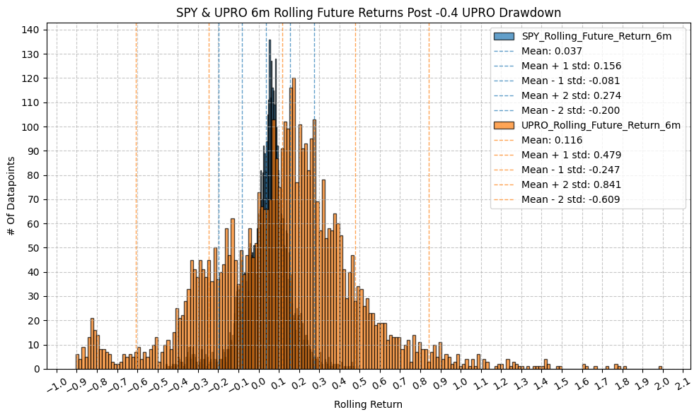
    


    

    


                                      OLS Regression Results                                 
    =========================================================================================
    Dep. Variable:     UPRO_Rolling_Future_Return_6m   R-squared:                       0.959
    Model:                                       OLS   Adj. R-squared:                  0.959
    Method:                            Least Squares   F-statistic:                 1.039e+05
    Date:                           Mon, 16 Mar 2026   Prob (F-statistic):               0.00
    Time:                                   13:44:27   Log-Likelihood:                 5314.4
    No. Observations:                           4464   AIC:                        -1.062e+04
    Df Residuals:                               4462   BIC:                        -1.061e+04
    Df Model:                                      1                                         
    Covariance Type:                       nonrobust                                         
    ================================================================================================
                                       coef    std err          t      P>|t|      [0.025      0.975]
    ------------------------------------------------------------------------------------------------
    const                            0.0040      0.001      3.492      0.000       0.002       0.006
    SPY_Rolling_Future_Return_6m     2.9974      0.009    322.290      0.000       2.979       3.016
    ==============================================================================
    Omnibus:                     1611.795   Durbin-Watson:                   0.081
    Prob(Omnibus):                  0.000   Jarque-Bera (JB):            13016.420
    Skew:                           1.500   Prob(JB):                         0.00
    Kurtosis:                      10.809   Cond. No.                         8.46
    ==============================================================================
    
    Notes:
    [1] Standard Errors assume that the covariance matrix of the errors is correctly specified.


    
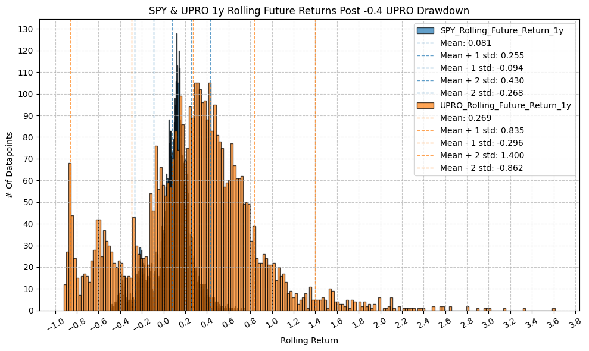
    


    

    


                                      OLS Regression Results                                 
    =========================================================================================
    Dep. Variable:     UPRO_Rolling_Future_Return_1y   R-squared:                       0.936
    Model:                                       OLS   Adj. R-squared:                  0.936
    Method:                            Least Squares   F-statistic:                 6.492e+04
    Date:                           Mon, 16 Mar 2026   Prob (F-statistic):               0.00
    Time:                                   13:44:29   Log-Likelihood:                 2334.7
    No. Observations:                           4456   AIC:                            -4665.
    Df Residuals:                               4454   BIC:                            -4653.
    Df Model:                                      1                                         
    Covariance Type:                       nonrobust                                         
    ================================================================================================
                                       coef    std err          t      P>|t|      [0.025      0.975]
    ------------------------------------------------------------------------------------------------
    const                            0.0162      0.002      6.861      0.000       0.012       0.021
    SPY_Rolling_Future_Return_1y     3.1341      0.012    254.788      0.000       3.110       3.158
    ==============================================================================
    Omnibus:                     1684.542   Durbin-Watson:                   0.054
    Prob(Omnibus):                  0.000   Jarque-Bera (JB):            11773.004
    Skew:                           1.634   Prob(JB):                         0.00
    Kurtosis:                      10.262   Cond. No.                         5.77
    ==============================================================================
    
    Notes:
    [1] Standard Errors assume that the covariance matrix of the errors is correctly specified.


    

    


    

    


                                      OLS Regression Results                                 
    =========================================================================================
    Dep. Variable:     UPRO_Rolling_Future_Return_2y   R-squared:                       0.907
    Model:                                       OLS   Adj. R-squared:                  0.907
    Method:                            Least Squares   F-statistic:                 4.354e+04
    Date:                           Mon, 16 Mar 2026   Prob (F-statistic):               0.00
    Time:                                   13:44:30   Log-Likelihood:                -457.07
    No. Observations:                           4456   AIC:                             918.1
    Df Residuals:                               4454   BIC:                             930.9
    Df Model:                                      1                                         
    Covariance Type:                       nonrobust                                         
    ================================================================================================
                                       coef    std err          t      P>|t|      [0.025      0.975]
    ------------------------------------------------------------------------------------------------
    const                            0.0011      0.005      0.221      0.825      -0.009       0.011
    SPY_Rolling_Future_Return_2y     3.4517      0.017    208.652      0.000       3.419       3.484
    ==============================================================================
    Omnibus:                     1243.361   Durbin-Watson:                   0.033
    Prob(Omnibus):                  0.000   Jarque-Bera (JB):             4602.615
    Skew:                           1.354   Prob(JB):                         0.00
    Kurtosis:                       7.179   Cond. No.                         4.25
    ==============================================================================
    
    Notes:
    [1] Standard Errors assume that the covariance matrix of the errors is correctly specified.


    
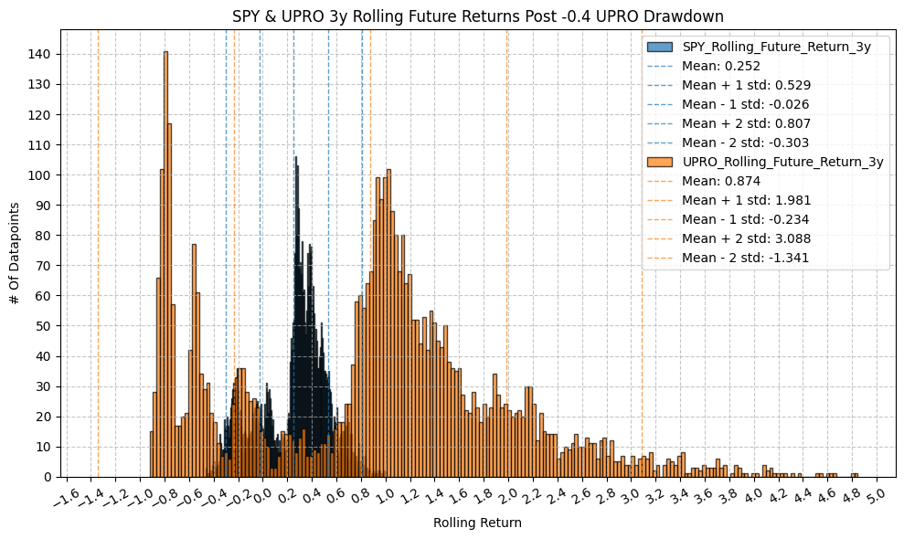
    


    

    


                                      OLS Regression Results                                 
    =========================================================================================
    Dep. Variable:     UPRO_Rolling_Future_Return_3y   R-squared:                       0.907
    Model:                                       OLS   Adj. R-squared:                  0.907
    Method:                            Least Squares   F-statistic:                 4.210e+04
    Date:                           Mon, 16 Mar 2026   Prob (F-statistic):               0.00
    Time:                                   13:44:31   Log-Likelihood:                -1442.5
    No. Observations:                           4323   AIC:                             2889.
    Df Residuals:                               4321   BIC:                             2902.
    Df Model:                                      1                                         
    Covariance Type:                       nonrobust                                         
    ================================================================================================
                                       coef    std err          t      P>|t|      [0.025      0.975]
    ------------------------------------------------------------------------------------------------
    const                           -0.0838      0.007    -12.068      0.000      -0.097      -0.070
    SPY_Rolling_Future_Return_3y     3.8006      0.019    205.187      0.000       3.764       3.837
    ==============================================================================
    Omnibus:                      700.473   Durbin-Watson:                   0.022
    Prob(Omnibus):                  0.000   Jarque-Bera (JB):             1800.061
    Skew:                           0.891   Prob(JB):                         0.00
    Kurtosis:                       5.611   Cond. No.                         3.85
    ==============================================================================
    
    Notes:
    [1] Standard Errors assume that the covariance matrix of the errors is correctly specified.


    
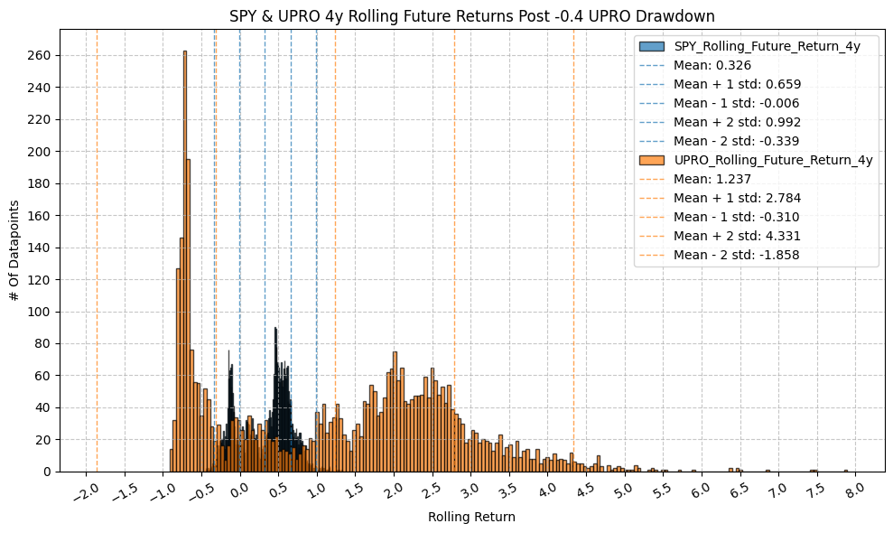
    


    

    


                                      OLS Regression Results                                 
    =========================================================================================
    Dep. Variable:     UPRO_Rolling_Future_Return_4y   R-squared:                       0.926
    Model:                                       OLS   Adj. R-squared:                  0.926
    Method:                            Least Squares   F-statistic:                 5.187e+04
    Date:                           Mon, 16 Mar 2026   Prob (F-statistic):               0.00
    Time:                                   13:44:32   Log-Likelihood:                -2273.5
    No. Observations:                           4126   AIC:                             4551.
    Df Residuals:                               4124   BIC:                             4564.
    Df Model:                                      1                                         
    Covariance Type:                       nonrobust                                         
    ================================================================================================
                                       coef    std err          t      P>|t|      [0.025      0.975]
    ------------------------------------------------------------------------------------------------
    const                           -0.2233      0.009    -24.385      0.000      -0.241      -0.205
    SPY_Rolling_Future_Return_4y     4.4751      0.020    227.751      0.000       4.437       4.514
    ==============================================================================
    Omnibus:                      119.525   Durbin-Watson:                   0.024
    Prob(Omnibus):                  0.000   Jarque-Bera (JB):              294.806
    Skew:                          -0.074   Prob(JB):                     9.63e-65
    Kurtosis:                       4.301   Cond. No.                         3.36
    ==============================================================================
    
    Notes:
    [1] Standard Errors assume that the covariance matrix of the errors is correctly specified.


    

    


    

    


                                      OLS Regression Results                                 
    =========================================================================================
    Dep. Variable:     UPRO_Rolling_Future_Return_5y   R-squared:                       0.896
    Model:                                       OLS   Adj. R-squared:                  0.896
    Method:                            Least Squares   F-statistic:                 3.555e+04
    Date:                           Mon, 16 Mar 2026   Prob (F-statistic):               0.00
    Time:                                   13:44:33   Log-Likelihood:                -4610.6
    No. Observations:                           4126   AIC:                             9225.
    Df Residuals:                               4124   BIC:                             9238.
    Df Model:                                      1                                         
    Covariance Type:                       nonrobust                                         
    ================================================================================================
                                       coef    std err          t      P>|t|      [0.025      0.975]
    ------------------------------------------------------------------------------------------------
    const                           -0.5058      0.017    -29.867      0.000      -0.539      -0.473
    SPY_Rolling_Future_Return_5y     5.2122      0.028    188.534      0.000       5.158       5.266
    ==============================================================================
    Omnibus:                      688.588   Durbin-Watson:                   0.019
    Prob(Omnibus):                  0.000   Jarque-Bera (JB):             3306.754
    Skew:                           0.724   Prob(JB):                         0.00
    Kurtosis:                       7.140   Cond. No.                         2.96
    ==============================================================================
    
    Notes:
    [1] Standard Errors assume that the covariance matrix of the errors is correctly specified.


    
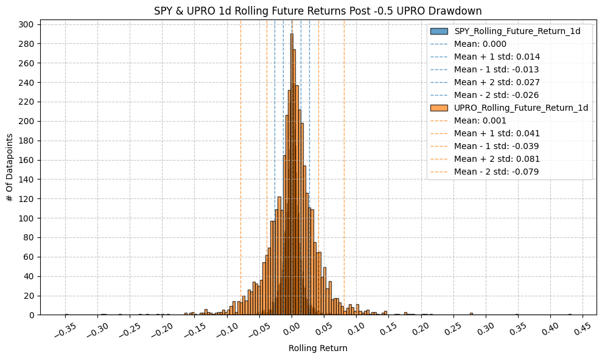
    


    
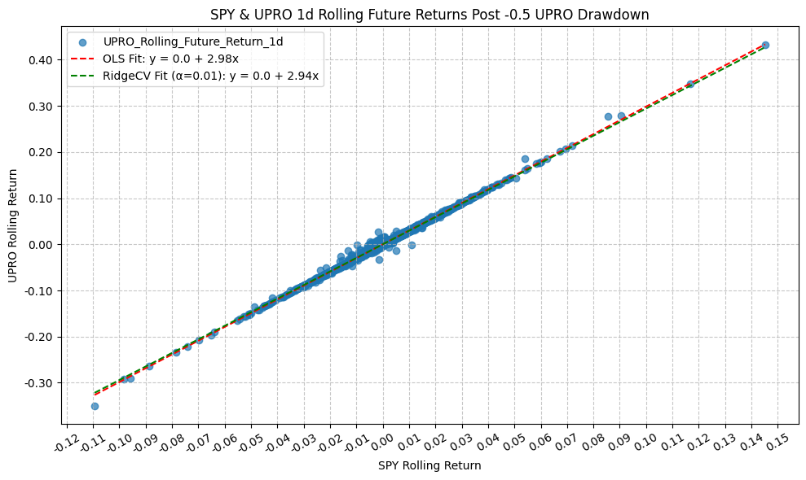
    


                                      OLS Regression Results                                 
    =========================================================================================
    Dep. Variable:     UPRO_Rolling_Future_Return_1d   R-squared:                       0.997
    Model:                                       OLS   Adj. R-squared:                  0.997
    Method:                            Least Squares   F-statistic:                 1.317e+06
    Date:                           Mon, 16 Mar 2026   Prob (F-statistic):               0.00
    Time:                                   13:44:34   Log-Likelihood:                 18256.
    No. Observations:                           3871   AIC:                        -3.651e+04
    Df Residuals:                               3869   BIC:                        -3.650e+04
    Df Model:                                      1                                         
    Covariance Type:                       nonrobust                                         
    ================================================================================================
                                       coef    std err          t      P>|t|      [0.025      0.975]
    ------------------------------------------------------------------------------------------------
    const                         6.221e-05   3.48e-05      1.786      0.074   -6.08e-06       0.000
    SPY_Rolling_Future_Return_1d     2.9842      0.003   1147.793      0.000       2.979       2.989
    ==============================================================================
    Omnibus:                     2862.865   Durbin-Watson:                   2.686
    Prob(Omnibus):                  0.000   Jarque-Bera (JB):          1149210.351
    Skew:                           2.367   Prob(JB):                         0.00
    Kurtosis:                      87.277   Cond. No.                         74.7
    ==============================================================================
    
    Notes:
    [1] Standard Errors assume that the covariance matrix of the errors is correctly specified.


    

    


    

    


                                      OLS Regression Results                                 
    =========================================================================================
    Dep. Variable:     UPRO_Rolling_Future_Return_1w   R-squared:                       0.992
    Model:                                       OLS   Adj. R-squared:                  0.992
    Method:                            Least Squares   F-statistic:                 5.116e+05
    Date:                           Mon, 16 Mar 2026   Prob (F-statistic):               0.00
    Time:                                   13:44:35   Log-Likelihood:                 13825.
    No. Observations:                           3871   AIC:                        -2.765e+04
    Df Residuals:                               3869   BIC:                        -2.763e+04
    Df Model:                                      1                                         
    Covariance Type:                       nonrobust                                         
    ================================================================================================
                                       coef    std err          t      P>|t|      [0.025      0.975]
    ------------------------------------------------------------------------------------------------
    const                           -0.0001      0.000     -0.958      0.338      -0.000       0.000
    SPY_Rolling_Future_Return_1w     2.9704      0.004    715.239      0.000       2.962       2.979
    ==============================================================================
    Omnibus:                     1716.538   Durbin-Watson:                   1.002
    Prob(Omnibus):                  0.000   Jarque-Bera (JB):           449887.905
    Skew:                          -0.903   Prob(JB):                         0.00
    Kurtosis:                      55.783   Cond. No.                         38.0
    ==============================================================================
    
    Notes:
    [1] Standard Errors assume that the covariance matrix of the errors is correctly specified.


    

    


    

    


                                      OLS Regression Results                                 
    =========================================================================================
    Dep. Variable:     UPRO_Rolling_Future_Return_1m   R-squared:                       0.986
    Model:                                       OLS   Adj. R-squared:                  0.986
    Method:                            Least Squares   F-statistic:                 2.738e+05
    Date:                           Mon, 16 Mar 2026   Prob (F-statistic):               0.00
    Time:                                   13:44:37   Log-Likelihood:                 10219.
    No. Observations:                           3871   AIC:                        -2.043e+04
    Df Residuals:                               3869   BIC:                        -2.042e+04
    Df Model:                                      1                                         
    Covariance Type:                       nonrobust                                         
    ================================================================================================
                                       coef    std err          t      P>|t|      [0.025      0.975]
    ------------------------------------------------------------------------------------------------
    const                           -0.0008      0.000     -2.717      0.007      -0.001      -0.000
    SPY_Rolling_Future_Return_1m     2.9439      0.006    523.305      0.000       2.933       2.955
    ==============================================================================
    Omnibus:                     2107.631   Durbin-Watson:                   0.385
    Prob(Omnibus):                  0.000   Jarque-Bera (JB):           199364.230
    Skew:                          -1.681   Prob(JB):                         0.00
    Kurtosis:                      37.996   Cond. No.                         20.3
    ==============================================================================
    
    Notes:
    [1] Standard Errors assume that the covariance matrix of the errors is correctly specified.


    
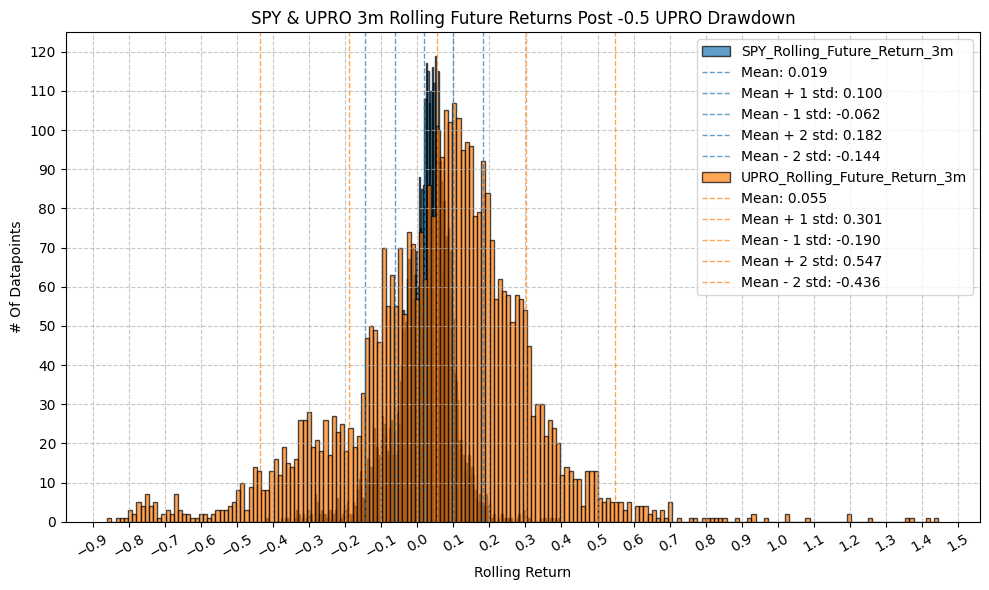
    


    

    


                                      OLS Regression Results                                 
    =========================================================================================
    Dep. Variable:     UPRO_Rolling_Future_Return_3m   R-squared:                       0.978
    Model:                                       OLS   Adj. R-squared:                  0.978
    Method:                            Least Squares   F-statistic:                 1.701e+05
    Date:                           Mon, 16 Mar 2026   Prob (F-statistic):               0.00
    Time:                                   13:44:38   Log-Likelihood:                 7306.6
    No. Observations:                           3871   AIC:                        -1.461e+04
    Df Residuals:                               3869   BIC:                        -1.460e+04
    Df Model:                                      1                                         
    Covariance Type:                       nonrobust                                         
    ================================================================================================
                                       coef    std err          t      P>|t|      [0.025      0.975]
    ------------------------------------------------------------------------------------------------
    const                           -0.0011      0.001     -1.901      0.057      -0.002    3.63e-05
    SPY_Rolling_Future_Return_3m     2.9840      0.007    412.439      0.000       2.970       2.998
    ==============================================================================
    Omnibus:                     1375.125   Durbin-Watson:                   0.193
    Prob(Omnibus):                  0.000   Jarque-Bera (JB):            43082.229
    Skew:                           1.059   Prob(JB):                         0.00
    Kurtosis:                      19.206   Cond. No.                         12.3
    ==============================================================================
    
    Notes:
    [1] Standard Errors assume that the covariance matrix of the errors is correctly specified.


    
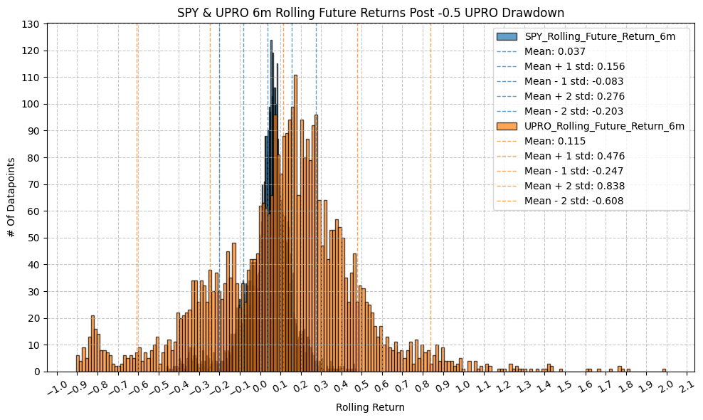
    


    

    


                                      OLS Regression Results                                 
    =========================================================================================
    Dep. Variable:     UPRO_Rolling_Future_Return_6m   R-squared:                       0.957
    Model:                                       OLS   Adj. R-squared:                  0.957
    Method:                            Least Squares   F-statistic:                 8.590e+04
    Date:                           Mon, 16 Mar 2026   Prob (F-statistic):               0.00
    Time:                                   13:44:39   Log-Likelihood:                 4532.3
    No. Observations:                           3871   AIC:                            -9061.
    Df Residuals:                               3869   BIC:                            -9048.
    Df Model:                                      1                                         
    Covariance Type:                       nonrobust                                         
    ================================================================================================
                                       coef    std err          t      P>|t|      [0.025      0.975]
    ------------------------------------------------------------------------------------------------
    const                            0.0067      0.001      5.300      0.000       0.004       0.009
    SPY_Rolling_Future_Return_6m     2.9569      0.010    293.089      0.000       2.937       2.977
    ==============================================================================
    Omnibus:                     1292.768   Durbin-Watson:                   0.081
    Prob(Omnibus):                  0.000   Jarque-Bera (JB):             9397.773
    Skew:                           1.396   Prob(JB):                         0.00
    Kurtosis:                      10.104   Cond. No.                         8.37
    ==============================================================================
    
    Notes:
    [1] Standard Errors assume that the covariance matrix of the errors is correctly specified.


    

    


    

    


                                      OLS Regression Results                                 
    =========================================================================================
    Dep. Variable:     UPRO_Rolling_Future_Return_1y   R-squared:                       0.933
    Model:                                       OLS   Adj. R-squared:                  0.933
    Method:                            Least Squares   F-statistic:                 5.409e+04
    Date:                           Mon, 16 Mar 2026   Prob (F-statistic):               0.00
    Time:                                   13:44:40   Log-Likelihood:                 1958.2
    No. Observations:                           3871   AIC:                            -3912.
    Df Residuals:                               3869   BIC:                            -3900.
    Df Model:                                      1                                         
    Covariance Type:                       nonrobust                                         
    ================================================================================================
                                       coef    std err          t      P>|t|      [0.025      0.975]
    ------------------------------------------------------------------------------------------------
    const                            0.0174      0.003      6.787      0.000       0.012       0.022
    SPY_Rolling_Future_Return_1y     3.1291      0.013    232.562      0.000       3.103       3.155
    ==============================================================================
    Omnibus:                     1514.882   Durbin-Watson:                   0.057
    Prob(Omnibus):                  0.000   Jarque-Bera (JB):            11136.976
    Skew:                           1.682   Prob(JB):                         0.00
    Kurtosis:                      10.598   Cond. No.                         5.77
    ==============================================================================
    
    Notes:
    [1] Standard Errors assume that the covariance matrix of the errors is correctly specified.


    

    


    
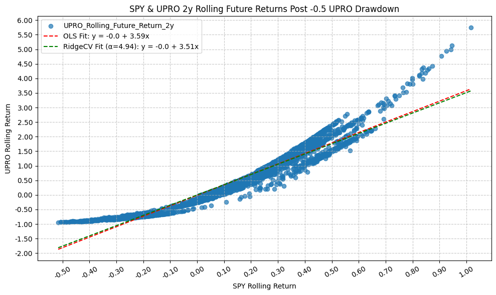
    


                                      OLS Regression Results                                 
    =========================================================================================
    Dep. Variable:     UPRO_Rolling_Future_Return_2y   R-squared:                       0.912
    Model:                                       OLS   Adj. R-squared:                  0.912
    Method:                            Least Squares   F-statistic:                 4.022e+04
    Date:                           Mon, 16 Mar 2026   Prob (F-statistic):               0.00
    Time:                                   13:44:42   Log-Likelihood:                -377.53
    No. Observations:                           3871   AIC:                             759.1
    Df Residuals:                               3869   BIC:                             771.6
    Df Model:                                      1                                         
    Covariance Type:                       nonrobust                                         
    ================================================================================================
                                       coef    std err          t      P>|t|      [0.025      0.975]
    ------------------------------------------------------------------------------------------------
    const                           -0.0141      0.005     -2.685      0.007      -0.024      -0.004
    SPY_Rolling_Future_Return_2y     3.5921      0.018    200.550      0.000       3.557       3.627
    ==============================================================================
    Omnibus:                     1084.267   Durbin-Watson:                   0.036
    Prob(Omnibus):                  0.000   Jarque-Bera (JB):             3631.483
    Skew:                           1.395   Prob(JB):                         0.00
    Kurtosis:                       6.839   Cond. No.                         4.30
    ==============================================================================
    
    Notes:
    [1] Standard Errors assume that the covariance matrix of the errors is correctly specified.


    
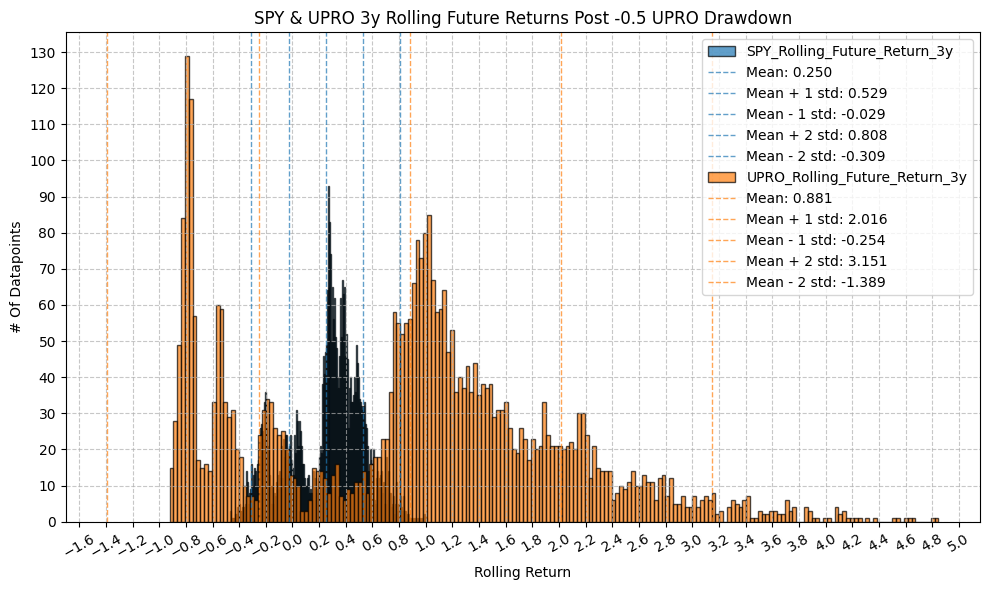
    


    

    


                                      OLS Regression Results                                 
    =========================================================================================
    Dep. Variable:     UPRO_Rolling_Future_Return_3y   R-squared:                       0.911
    Model:                                       OLS   Adj. R-squared:                  0.911
    Method:                            Least Squares   F-statistic:                 3.909e+04
    Date:                           Mon, 16 Mar 2026   Prob (F-statistic):               0.00
    Time:                                   13:44:43   Log-Likelihood:                -1292.1
    No. Observations:                           3832   AIC:                             2588.
    Df Residuals:                               3830   BIC:                             2601.
    Df Model:                                      1                                         
    Covariance Type:                       nonrobust                                         
    ================================================================================================
                                       coef    std err          t      P>|t|      [0.025      0.975]
    ------------------------------------------------------------------------------------------------
    const                           -0.0884      0.007    -12.033      0.000      -0.103      -0.074
    SPY_Rolling_Future_Return_3y     3.8786      0.020    197.723      0.000       3.840       3.917
    ==============================================================================
    Omnibus:                      631.089   Durbin-Watson:                   0.022
    Prob(Omnibus):                  0.000   Jarque-Bera (JB):             1399.356
    Skew:                           0.954   Prob(JB):                    1.36e-304
    Kurtosis:                       5.263   Cond. No.                         3.82
    ==============================================================================
    
    Notes:
    [1] Standard Errors assume that the covariance matrix of the errors is correctly specified.


    

    


    

    


                                      OLS Regression Results                                 
    =========================================================================================
    Dep. Variable:     UPRO_Rolling_Future_Return_4y   R-squared:                       0.940
    Model:                                       OLS   Adj. R-squared:                  0.940
    Method:                            Least Squares   F-statistic:                 5.811e+04
    Date:                           Mon, 16 Mar 2026   Prob (F-statistic):               0.00
    Time:                                   13:44:44   Log-Likelihood:                -1764.0
    No. Observations:                           3696   AIC:                             3532.
    Df Residuals:                               3694   BIC:                             3544.
    Df Model:                                      1                                         
    Covariance Type:                       nonrobust                                         
    ================================================================================================
                                       coef    std err          t      P>|t|      [0.025      0.975]
    ------------------------------------------------------------------------------------------------
    const                           -0.2199      0.009    -24.595      0.000      -0.237      -0.202
    SPY_Rolling_Future_Return_4y     4.5978      0.019    241.056      0.000       4.560       4.635
    ==============================================================================
    Omnibus:                      141.094   Durbin-Watson:                   0.030
    Prob(Omnibus):                  0.000   Jarque-Bera (JB):              415.728
    Skew:                           0.068   Prob(JB):                     5.32e-91
    Kurtosis:                       4.637   Cond. No.                         3.32
    ==============================================================================
    
    Notes:
    [1] Standard Errors assume that the covariance matrix of the errors is correctly specified.


    

    


    
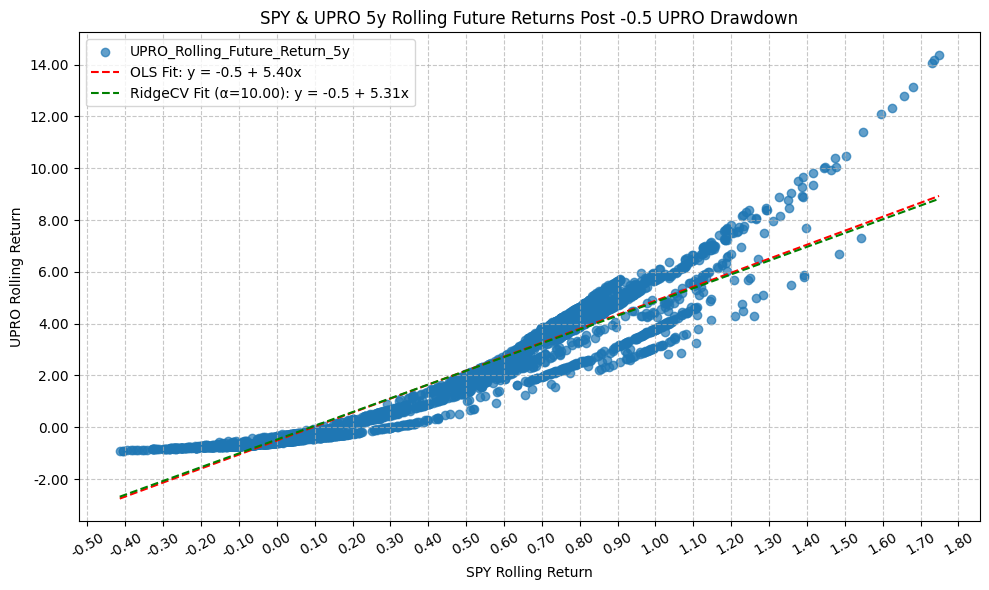
    


                                      OLS Regression Results                                 
    =========================================================================================
    Dep. Variable:     UPRO_Rolling_Future_Return_5y   R-squared:                       0.907
    Model:                                       OLS   Adj. R-squared:                  0.907
    Method:                            Least Squares   F-statistic:                 3.594e+04
    Date:                           Mon, 16 Mar 2026   Prob (F-statistic):               0.00
    Time:                                   13:44:45   Log-Likelihood:                -3996.6
    No. Observations:                           3696   AIC:                             7997.
    Df Residuals:                               3694   BIC:                             8010.
    Df Model:                                      1                                         
    Covariance Type:                       nonrobust                                         
    ================================================================================================
                                       coef    std err          t      P>|t|      [0.025      0.975]
    ------------------------------------------------------------------------------------------------
    const                           -0.5139      0.017    -30.042      0.000      -0.547      -0.480
    SPY_Rolling_Future_Return_5y     5.3991      0.028    189.589      0.000       5.343       5.455
    ==============================================================================
    Omnibus:                      551.159   Durbin-Watson:                   0.022
    Prob(Omnibus):                  0.000   Jarque-Bera (JB):             2881.358
    Skew:                           0.609   Prob(JB):                         0.00
    Kurtosis:                       7.151   Cond. No.                         2.96
    ==============================================================================
    
    Notes:
    [1] Standard Errors assume that the covariance matrix of the errors is correctly specified.


    
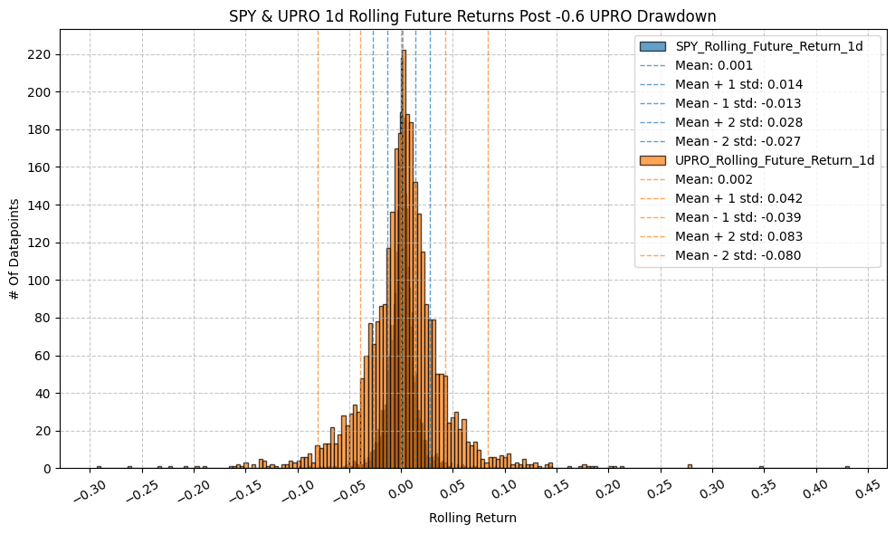
    


    

    


                                      OLS Regression Results                                 
    =========================================================================================
    Dep. Variable:     UPRO_Rolling_Future_Return_1d   R-squared:                       0.997
    Model:                                       OLS   Adj. R-squared:                  0.997
    Method:                            Least Squares   F-statistic:                 1.059e+06
    Date:                           Mon, 16 Mar 2026   Prob (F-statistic):               0.00
    Time:                                   13:44:47   Log-Likelihood:                 14432.
    No. Observations:                           3070   AIC:                        -2.886e+04
    Df Residuals:                               3068   BIC:                        -2.885e+04
    Df Model:                                      1                                         
    Covariance Type:                       nonrobust                                         
    ================================================================================================
                                       coef    std err          t      P>|t|      [0.025      0.975]
    ------------------------------------------------------------------------------------------------
    const                          7.42e-05   3.97e-05      1.868      0.062   -3.69e-06       0.000
    SPY_Rolling_Future_Return_1d     2.9825      0.003   1028.945      0.000       2.977       2.988
    ==============================================================================
    Omnibus:                     2273.218   Durbin-Watson:                   2.537
    Prob(Omnibus):                  0.000   Jarque-Bera (JB):          1053036.968
    Skew:                           2.319   Prob(JB):                         0.00
    Kurtosis:                      93.613   Cond. No.                         73.0
    ==============================================================================
    
    Notes:
    [1] Standard Errors assume that the covariance matrix of the errors is correctly specified.


    
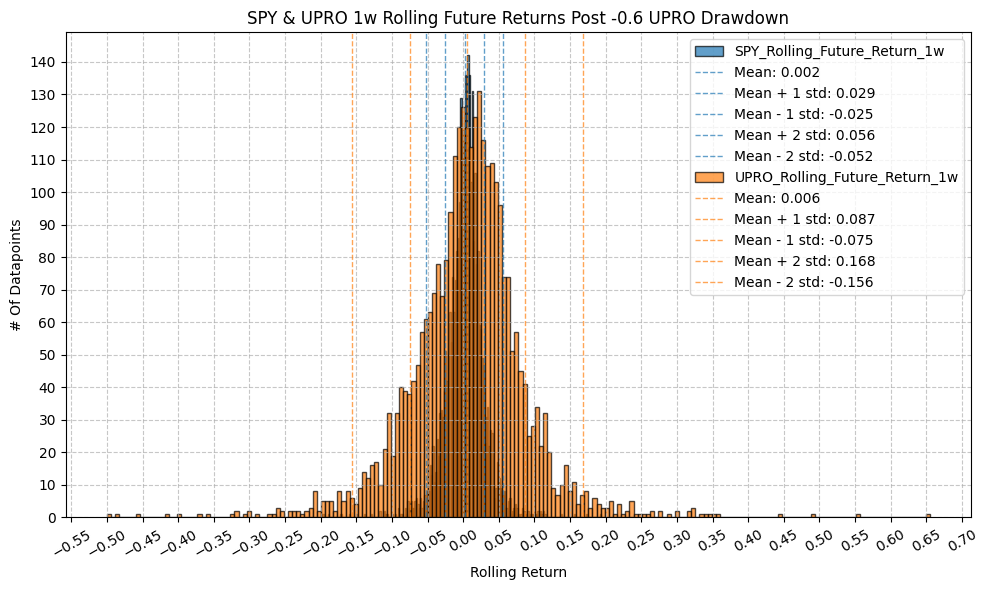
    


    

    


                                      OLS Regression Results                                 
    =========================================================================================
    Dep. Variable:     UPRO_Rolling_Future_Return_1w   R-squared:                       0.992
    Model:                                       OLS   Adj. R-squared:                  0.992
    Method:                            Least Squares   F-statistic:                 3.762e+05
    Date:                           Mon, 16 Mar 2026   Prob (F-statistic):               0.00
    Time:                                   13:44:48   Log-Likelihood:                 10750.
    No. Observations:                           3070   AIC:                        -2.150e+04
    Df Residuals:                               3068   BIC:                        -2.148e+04
    Df Model:                                      1                                         
    Covariance Type:                       nonrobust                                         
    ================================================================================================
                                       coef    std err          t      P>|t|      [0.025      0.975]
    ------------------------------------------------------------------------------------------------
    const                           -0.0001      0.000     -1.043      0.297      -0.000       0.000
    SPY_Rolling_Future_Return_1w     2.9678      0.005    613.318      0.000       2.958       2.977
    ==============================================================================
    Omnibus:                     1399.948   Durbin-Watson:                   1.060
    Prob(Omnibus):                  0.000   Jarque-Bera (JB):           313435.830
    Skew:                          -0.997   Prob(JB):                         0.00
    Kurtosis:                      52.460   Cond. No.                         36.7
    ==============================================================================
    
    Notes:
    [1] Standard Errors assume that the covariance matrix of the errors is correctly specified.


    

    


    
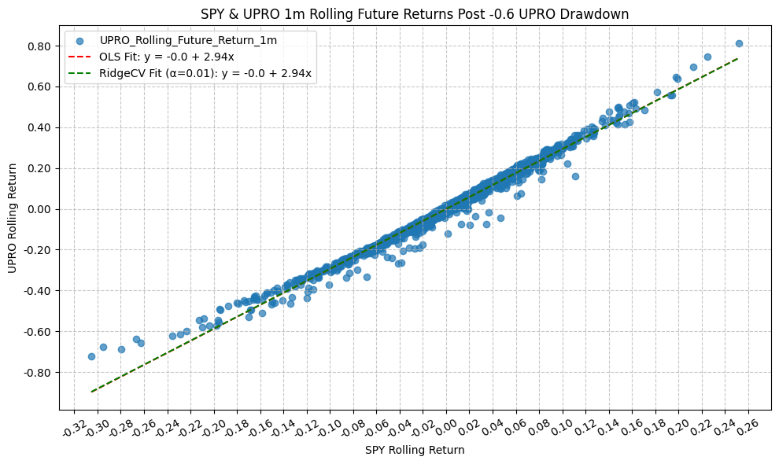
    


                                      OLS Regression Results                                 
    =========================================================================================
    Dep. Variable:     UPRO_Rolling_Future_Return_1m   R-squared:                       0.986
    Model:                                       OLS   Adj. R-squared:                  0.986
    Method:                            Least Squares   F-statistic:                 2.086e+05
    Date:                           Mon, 16 Mar 2026   Prob (F-statistic):               0.00
    Time:                                   13:44:49   Log-Likelihood:                 7938.3
    No. Observations:                           3070   AIC:                        -1.587e+04
    Df Residuals:                               3068   BIC:                        -1.586e+04
    Df Model:                                      1                                         
    Covariance Type:                       nonrobust                                         
    ================================================================================================
                                       coef    std err          t      P>|t|      [0.025      0.975]
    ------------------------------------------------------------------------------------------------
    const                           -0.0006      0.000     -1.711      0.087      -0.001     8.3e-05
    SPY_Rolling_Future_Return_1m     2.9397      0.006    456.774      0.000       2.927       2.952
    ==============================================================================
    Omnibus:                     1387.733   Durbin-Watson:                   0.407
    Prob(Omnibus):                  0.000   Jarque-Bera (JB):           109426.463
    Skew:                          -1.256   Prob(JB):                         0.00
    Kurtosis:                      32.140   Cond. No.                         19.6
    ==============================================================================
    
    Notes:
    [1] Standard Errors assume that the covariance matrix of the errors is correctly specified.


    

    


    

    


                                      OLS Regression Results                                 
    =========================================================================================
    Dep. Variable:     UPRO_Rolling_Future_Return_3m   R-squared:                       0.977
    Model:                                       OLS   Adj. R-squared:                  0.977
    Method:                            Least Squares   F-statistic:                 1.313e+05
    Date:                           Mon, 16 Mar 2026   Prob (F-statistic):               0.00
    Time:                                   13:44:50   Log-Likelihood:                 5610.5
    No. Observations:                           3070   AIC:                        -1.122e+04
    Df Residuals:                               3068   BIC:                        -1.121e+04
    Df Model:                                      1                                         
    Covariance Type:                       nonrobust                                         
    ================================================================================================
                                       coef    std err          t      P>|t|      [0.025      0.975]
    ------------------------------------------------------------------------------------------------
    const                            0.0004      0.001      0.589      0.556      -0.001       0.002
    SPY_Rolling_Future_Return_3m     2.9878      0.008    362.348      0.000       2.972       3.004
    ==============================================================================
    Omnibus:                     1129.279   Durbin-Watson:                   0.193
    Prob(Omnibus):                  0.000   Jarque-Bera (JB):            29419.559
    Skew:                           1.166   Prob(JB):                         0.00
    Kurtosis:                      17.985   Cond. No.                         11.7
    ==============================================================================
    
    Notes:
    [1] Standard Errors assume that the covariance matrix of the errors is correctly specified.


    
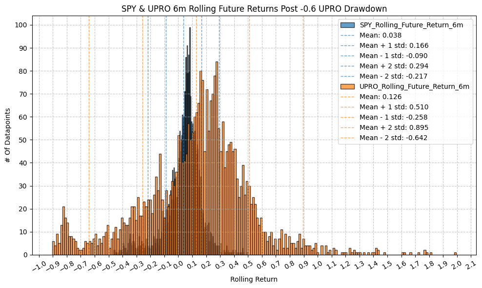
    


    

    


                                      OLS Regression Results                                 
    =========================================================================================
    Dep. Variable:     UPRO_Rolling_Future_Return_6m   R-squared:                       0.956
    Model:                                       OLS   Adj. R-squared:                  0.956
    Method:                            Least Squares   F-statistic:                 6.658e+04
    Date:                           Mon, 16 Mar 2026   Prob (F-statistic):               0.00
    Time:                                   13:44:51   Log-Likelihood:                 3373.6
    No. Observations:                           3070   AIC:                            -6743.
    Df Residuals:                               3068   BIC:                            -6731.
    Df Model:                                      1                                         
    Covariance Type:                       nonrobust                                         
    ================================================================================================
                                       coef    std err          t      P>|t|      [0.025      0.975]
    ------------------------------------------------------------------------------------------------
    const                            0.0138      0.002      9.062      0.000       0.011       0.017
    SPY_Rolling_Future_Return_6m     2.9412      0.011    258.024      0.000       2.919       2.964
    ==============================================================================
    Omnibus:                      862.196   Durbin-Watson:                   0.075
    Prob(Omnibus):                  0.000   Jarque-Bera (JB):             5064.599
    Skew:                           1.201   Prob(JB):                         0.00
    Kurtosis:                       8.816   Cond. No.                         7.84
    ==============================================================================
    
    Notes:
    [1] Standard Errors assume that the covariance matrix of the errors is correctly specified.


    

    


    

    


                                      OLS Regression Results                                 
    =========================================================================================
    Dep. Variable:     UPRO_Rolling_Future_Return_1y   R-squared:                       0.932
    Model:                                       OLS   Adj. R-squared:                  0.932
    Method:                            Least Squares   F-statistic:                 4.197e+04
    Date:                           Mon, 16 Mar 2026   Prob (F-statistic):               0.00
    Time:                                   13:44:52   Log-Likelihood:                 1581.2
    No. Observations:                           3070   AIC:                            -3158.
    Df Residuals:                               3068   BIC:                            -3146.
    Df Model:                                      1                                         
    Covariance Type:                       nonrobust                                         
    ================================================================================================
                                       coef    std err          t      P>|t|      [0.025      0.975]
    ------------------------------------------------------------------------------------------------
    const                            0.0132      0.003      4.453      0.000       0.007       0.019
    SPY_Rolling_Future_Return_1y     3.1762      0.016    204.862      0.000       3.146       3.207
    ==============================================================================
    Omnibus:                     1210.909   Durbin-Watson:                   0.065
    Prob(Omnibus):                  0.000   Jarque-Bera (JB):            10511.033
    Skew:                           1.634   Prob(JB):                         0.00
    Kurtosis:                      11.455   Cond. No.                         5.99
    ==============================================================================
    
    Notes:
    [1] Standard Errors assume that the covariance matrix of the errors is correctly specified.


    
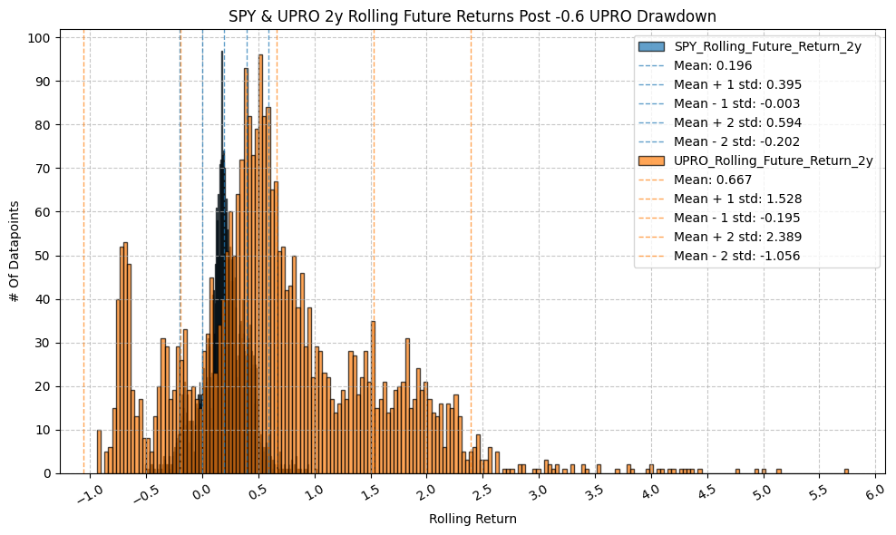
    


    

    


                                      OLS Regression Results                                 
    =========================================================================================
    Dep. Variable:     UPRO_Rolling_Future_Return_2y   R-squared:                       0.932
    Model:                                       OLS   Adj. R-squared:                  0.932
    Method:                            Least Squares   F-statistic:                 4.210e+04
    Date:                           Mon, 16 Mar 2026   Prob (F-statistic):               0.00
    Time:                                   13:44:53   Log-Likelihood:                 230.85
    No. Observations:                           3070   AIC:                            -457.7
    Df Residuals:                               3068   BIC:                            -445.6
    Df Model:                                      1                                         
    Covariance Type:                       nonrobust                                         
    ================================================================================================
                                       coef    std err          t      P>|t|      [0.025      0.975]
    ------------------------------------------------------------------------------------------------
    const                           -0.1524      0.006    -26.793      0.000      -0.164      -0.141
    SPY_Rolling_Future_Return_2y     4.1802      0.020    205.190      0.000       4.140       4.220
    ==============================================================================
    Omnibus:                      971.652   Durbin-Watson:                   0.048
    Prob(Omnibus):                  0.000   Jarque-Bera (JB):             5574.704
    Skew:                           1.382   Prob(JB):                         0.00
    Kurtosis:                       8.995   Cond. No.                         5.23
    ==============================================================================
    
    Notes:
    [1] Standard Errors assume that the covariance matrix of the errors is correctly specified.


    

    


    

    


                                      OLS Regression Results                                 
    =========================================================================================
    Dep. Variable:     UPRO_Rolling_Future_Return_3y   R-squared:                       0.906
    Model:                                       OLS   Adj. R-squared:                  0.906
    Method:                            Least Squares   F-statistic:                 2.942e+04
    Date:                           Mon, 16 Mar 2026   Prob (F-statistic):               0.00
    Time:                                   13:44:54   Log-Likelihood:                -1092.7
    No. Observations:                           3070   AIC:                             2189.
    Df Residuals:                               3068   BIC:                             2201.
    Df Model:                                      1                                         
    Covariance Type:                       nonrobust                                         
    ================================================================================================
                                       coef    std err          t      P>|t|      [0.025      0.975]
    ------------------------------------------------------------------------------------------------
    const                           -0.1351      0.009    -15.223      0.000      -0.153      -0.118
    SPY_Rolling_Future_Return_3y     4.1099      0.024    171.519      0.000       4.063       4.157
    ==============================================================================
    Omnibus:                      523.372   Durbin-Watson:                   0.022
    Prob(Omnibus):                  0.000   Jarque-Bera (JB):              948.088
    Skew:                           1.070   Prob(JB):                    1.33e-206
    Kurtosis:                       4.682   Cond. No.                         4.13
    ==============================================================================
    
    Notes:
    [1] Standard Errors assume that the covariance matrix of the errors is correctly specified.


    

    


    

    


                                      OLS Regression Results                                 
    =========================================================================================
    Dep. Variable:     UPRO_Rolling_Future_Return_4y   R-squared:                       0.942
    Model:                                       OLS   Adj. R-squared:                  0.942
    Method:                            Least Squares   F-statistic:                 4.920e+04
    Date:                           Mon, 16 Mar 2026   Prob (F-statistic):               0.00
    Time:                                   13:44:56   Log-Likelihood:                -1478.5
    No. Observations:                           3055   AIC:                             2961.
    Df Residuals:                               3053   BIC:                             2973.
    Df Model:                                      1                                         
    Covariance Type:                       nonrobust                                         
    ================================================================================================
                                       coef    std err          t      P>|t|      [0.025      0.975]
    ------------------------------------------------------------------------------------------------
    const                           -0.2228      0.010    -21.595      0.000      -0.243      -0.203
    SPY_Rolling_Future_Return_4y     4.6897      0.021    221.807      0.000       4.648       4.731
    ==============================================================================
    Omnibus:                      120.436   Durbin-Watson:                   0.033
    Prob(Omnibus):                  0.000   Jarque-Bera (JB):              311.979
    Skew:                           0.172   Prob(JB):                     1.80e-68
    Kurtosis:                       4.527   Cond. No.                         3.39
    ==============================================================================
    
    Notes:
    [1] Standard Errors assume that the covariance matrix of the errors is correctly specified.


    

    


    

    


                                      OLS Regression Results                                 
    =========================================================================================
    Dep. Variable:     UPRO_Rolling_Future_Return_5y   R-squared:                       0.919
    Model:                                       OLS   Adj. R-squared:                  0.919
    Method:                            Least Squares   F-statistic:                 3.475e+04
    Date:                           Mon, 16 Mar 2026   Prob (F-statistic):               0.00
    Time:                                   13:44:57   Log-Likelihood:                -3195.7
    No. Observations:                           3055   AIC:                             6395.
    Df Residuals:                               3053   BIC:                             6407.
    Df Model:                                      1                                         
    Covariance Type:                       nonrobust                                         
    ================================================================================================
                                       coef    std err          t      P>|t|      [0.025      0.975]
    ------------------------------------------------------------------------------------------------
    const                           -0.5517      0.019    -29.728      0.000      -0.588      -0.515
    SPY_Rolling_Future_Return_5y     5.6649      0.030    186.400      0.000       5.605       5.724
    ==============================================================================
    Omnibus:                      454.992   Durbin-Watson:                   0.025
    Prob(Omnibus):                  0.000   Jarque-Bera (JB):             2120.542
    Skew:                           0.640   Prob(JB):                         0.00
    Kurtosis:                       6.876   Cond. No.                         3.02
    ==============================================================================
    
    Notes:
    [1] Standard Errors assume that the covariance matrix of the errors is correctly specified.


    

    


    

    


                                      OLS Regression Results                                 
    =========================================================================================
    Dep. Variable:     UPRO_Rolling_Future_Return_1d   R-squared:                       0.997
    Model:                                       OLS   Adj. R-squared:                  0.997
    Method:                            Least Squares   F-statistic:                 7.538e+05
    Date:                           Mon, 16 Mar 2026   Prob (F-statistic):               0.00
    Time:                                   13:44:58   Log-Likelihood:                 10930.
    No. Observations:                           2365   AIC:                        -2.186e+04
    Df Residuals:                               2363   BIC:                        -2.184e+04
    Df Model:                                      1                                         
    Covariance Type:                       nonrobust                                         
    ================================================================================================
                                       coef    std err          t      P>|t|      [0.025      0.975]
    ------------------------------------------------------------------------------------------------
    const                         8.908e-05    4.9e-05      1.818      0.069      -7e-06       0.000
    SPY_Rolling_Future_Return_1d     2.9779      0.003    868.238      0.000       2.971       2.985
    ==============================================================================
    Omnibus:                     1557.902   Durbin-Watson:                   2.718
    Prob(Omnibus):                  0.000   Jarque-Bera (JB):           638251.842
    Skew:                           1.869   Prob(JB):                         0.00
    Kurtosis:                      83.393   Cond. No.                         70.0
    ==============================================================================
    
    Notes:
    [1] Standard Errors assume that the covariance matrix of the errors is correctly specified.


    

    


    

    


                                      OLS Regression Results                                 
    =========================================================================================
    Dep. Variable:     UPRO_Rolling_Future_Return_1w   R-squared:                       0.991
    Model:                                       OLS   Adj. R-squared:                  0.991
    Method:                            Least Squares   F-statistic:                 2.714e+05
    Date:                           Mon, 16 Mar 2026   Prob (F-statistic):               0.00
    Time:                                   13:44:59   Log-Likelihood:                 8089.2
    No. Observations:                           2365   AIC:                        -1.617e+04
    Df Residuals:                               2363   BIC:                        -1.616e+04
    Df Model:                                      1                                         
    Covariance Type:                       nonrobust                                         
    ================================================================================================
                                       coef    std err          t      P>|t|      [0.025      0.975]
    ------------------------------------------------------------------------------------------------
    const                        -7.288e-05      0.000     -0.447      0.655      -0.000       0.000
    SPY_Rolling_Future_Return_1w     2.9631      0.006    520.935      0.000       2.952       2.974
    ==============================================================================
    Omnibus:                      893.424   Durbin-Watson:                   1.046
    Prob(Omnibus):                  0.000   Jarque-Bera (JB):           167543.096
    Skew:                          -0.621   Prob(JB):                         0.00
    Kurtosis:                      44.215   Cond. No.                         34.9
    ==============================================================================
    
    Notes:
    [1] Standard Errors assume that the covariance matrix of the errors is correctly specified.


    

    


    

    


                                      OLS Regression Results                                 
    =========================================================================================
    Dep. Variable:     UPRO_Rolling_Future_Return_1m   R-squared:                       0.984
    Model:                                       OLS   Adj. R-squared:                  0.984
    Method:                            Least Squares   F-statistic:                 1.475e+05
    Date:                           Mon, 16 Mar 2026   Prob (F-statistic):               0.00
    Time:                                   13:45:00   Log-Likelihood:                 5932.1
    No. Observations:                           2365   AIC:                        -1.186e+04
    Df Residuals:                               2363   BIC:                        -1.185e+04
    Df Model:                                      1                                         
    Covariance Type:                       nonrobust                                         
    ================================================================================================
                                       coef    std err          t      P>|t|      [0.025      0.975]
    ------------------------------------------------------------------------------------------------
    const                           -0.0007      0.000     -1.733      0.083      -0.002    9.34e-05
    SPY_Rolling_Future_Return_1m     2.9414      0.008    384.053      0.000       2.926       2.956
    ==============================================================================
    Omnibus:                      955.111   Durbin-Watson:                   0.364
    Prob(Omnibus):                  0.000   Jarque-Bera (JB):            63631.709
    Skew:                          -1.056   Prob(JB):                         0.00
    Kurtosis:                      28.323   Cond. No.                         18.9
    ==============================================================================
    
    Notes:
    [1] Standard Errors assume that the covariance matrix of the errors is correctly specified.


    

    


    

    


                                      OLS Regression Results                                 
    =========================================================================================
    Dep. Variable:     UPRO_Rolling_Future_Return_3m   R-squared:                       0.976
    Model:                                       OLS   Adj. R-squared:                  0.976
    Method:                            Least Squares   F-statistic:                 9.454e+04
    Date:                           Mon, 16 Mar 2026   Prob (F-statistic):               0.00
    Time:                                   13:45:01   Log-Likelihood:                 4110.7
    No. Observations:                           2365   AIC:                            -8217.
    Df Residuals:                               2363   BIC:                            -8206.
    Df Model:                                      1                                         
    Covariance Type:                       nonrobust                                         
    ================================================================================================
                                       coef    std err          t      P>|t|      [0.025      0.975]
    ------------------------------------------------------------------------------------------------
    const                            0.0012      0.001      1.374      0.170      -0.001       0.003
    SPY_Rolling_Future_Return_3m     2.9866      0.010    307.473      0.000       2.968       3.006
    ==============================================================================
    Omnibus:                      813.503   Durbin-Watson:                   0.169
    Prob(Omnibus):                  0.000   Jarque-Bera (JB):            16781.750
    Skew:                           1.111   Prob(JB):                         0.00
    Kurtosis:                      15.859   Cond. No.                         11.1
    ==============================================================================
    
    Notes:
    [1] Standard Errors assume that the covariance matrix of the errors is correctly specified.


    
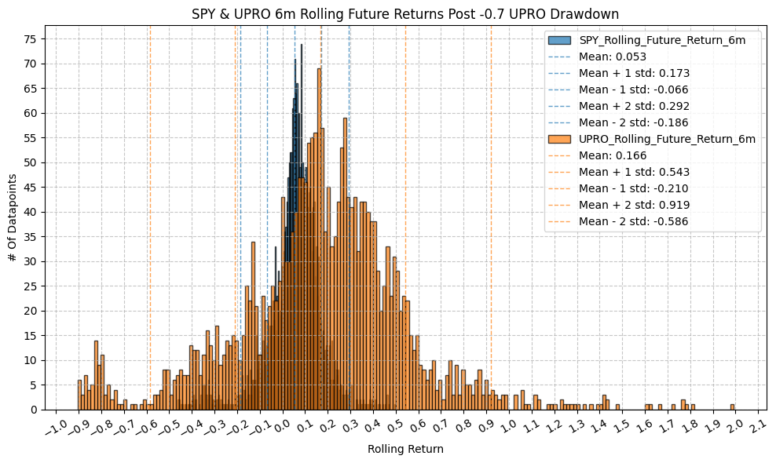
    


    

    


                                      OLS Regression Results                                 
    =========================================================================================
    Dep. Variable:     UPRO_Rolling_Future_Return_6m   R-squared:                       0.954
    Model:                                       OLS   Adj. R-squared:                  0.954
    Method:                            Least Squares   F-statistic:                 4.945e+04
    Date:                           Mon, 16 Mar 2026   Prob (F-statistic):               0.00
    Time:                                   13:45:02   Log-Likelihood:                 2608.8
    No. Observations:                           2365   AIC:                            -5214.
    Df Residuals:                               2363   BIC:                            -5202.
    Df Model:                                      1                                         
    Covariance Type:                       nonrobust                                         
    ================================================================================================
                                       coef    std err          t      P>|t|      [0.025      0.975]
    ------------------------------------------------------------------------------------------------
    const                            0.0035      0.002      1.917      0.055   -7.96e-05       0.007
    SPY_Rolling_Future_Return_6m     3.0747      0.014    222.381      0.000       3.048       3.102
    ==============================================================================
    Omnibus:                      829.879   Durbin-Watson:                   0.069
    Prob(Omnibus):                  0.000   Jarque-Bera (JB):             7404.057
    Skew:                           1.399   Prob(JB):                         0.00
    Kurtosis:                      11.204   Cond. No.                         8.39
    ==============================================================================
    
    Notes:
    [1] Standard Errors assume that the covariance matrix of the errors is correctly specified.


    

    


    
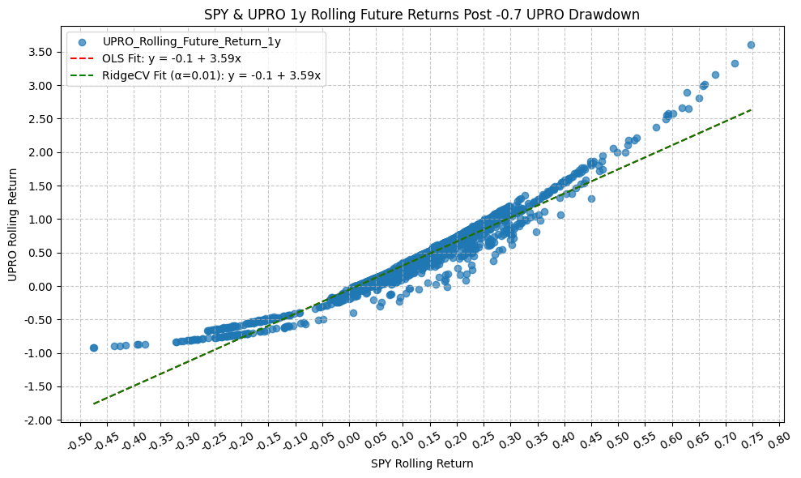
    


                                      OLS Regression Results                                 
    =========================================================================================
    Dep. Variable:     UPRO_Rolling_Future_Return_1y   R-squared:                       0.941
    Model:                                       OLS   Adj. R-squared:                  0.941
    Method:                            Least Squares   F-statistic:                 3.754e+04
    Date:                           Mon, 16 Mar 2026   Prob (F-statistic):               0.00
    Time:                                   13:45:04   Log-Likelihood:                 1607.4
    No. Observations:                           2365   AIC:                            -3211.
    Df Residuals:                               2363   BIC:                            -3199.
    Df Model:                                      1                                         
    Covariance Type:                       nonrobust                                         
    ================================================================================================
                                       coef    std err          t      P>|t|      [0.025      0.975]
    ------------------------------------------------------------------------------------------------
    const                           -0.0550      0.003    -16.382      0.000      -0.062      -0.048
    SPY_Rolling_Future_Return_1y     3.5929      0.019    193.749      0.000       3.556       3.629
    ==============================================================================
    Omnibus:                      724.737   Durbin-Watson:                   0.076
    Prob(Omnibus):                  0.000   Jarque-Bera (JB):            11317.549
    Skew:                           1.017   Prob(JB):                         0.00
    Kurtosis:                      13.522   Cond. No.                         7.46
    ==============================================================================
    
    Notes:
    [1] Standard Errors assume that the covariance matrix of the errors is correctly specified.


    

    


    

    


                                      OLS Regression Results                                 
    =========================================================================================
    Dep. Variable:     UPRO_Rolling_Future_Return_2y   R-squared:                       0.947
    Model:                                       OLS   Adj. R-squared:                  0.947
    Method:                            Least Squares   F-statistic:                 4.184e+04
    Date:                           Mon, 16 Mar 2026   Prob (F-statistic):               0.00
    Time:                                   13:45:05   Log-Likelihood:                 728.41
    No. Observations:                           2365   AIC:                            -1453.
    Df Residuals:                               2363   BIC:                            -1441.
    Df Model:                                      1                                         
    Covariance Type:                       nonrobust                                         
    ================================================================================================
                                       coef    std err          t      P>|t|      [0.025      0.975]
    ------------------------------------------------------------------------------------------------
    const                           -0.3422      0.007    -49.482      0.000      -0.356      -0.329
    SPY_Rolling_Future_Return_2y     4.7992      0.023    204.538      0.000       4.753       4.845
    ==============================================================================
    Omnibus:                      261.292   Durbin-Watson:                   0.050
    Prob(Omnibus):                  0.000   Jarque-Bera (JB):             1788.713
    Skew:                          -0.271   Prob(JB):                         0.00
    Kurtosis:                       7.226   Cond. No.                         6.82
    ==============================================================================
    
    Notes:
    [1] Standard Errors assume that the covariance matrix of the errors is correctly specified.


    

    


    
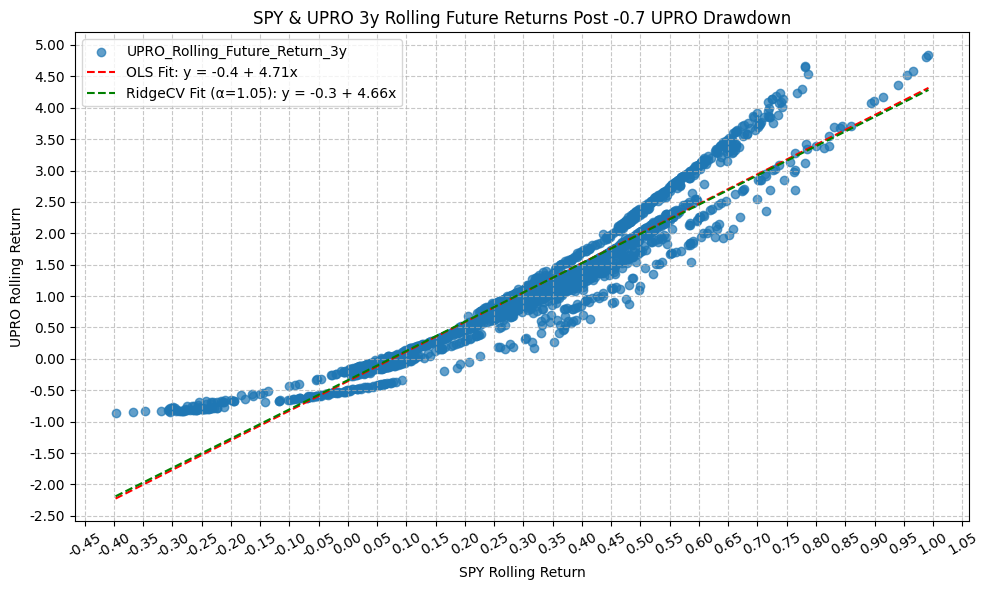
    


                                      OLS Regression Results                                 
    =========================================================================================
    Dep. Variable:     UPRO_Rolling_Future_Return_3y   R-squared:                       0.901
    Model:                                       OLS   Adj. R-squared:                  0.901
    Method:                            Least Squares   F-statistic:                 2.158e+04
    Date:                           Mon, 16 Mar 2026   Prob (F-statistic):               0.00
    Time:                                   13:45:06   Log-Likelihood:                -648.58
    No. Observations:                           2365   AIC:                             1301.
    Df Residuals:                               2363   BIC:                             1313.
    Df Model:                                      1                                         
    Covariance Type:                       nonrobust                                         
    ================================================================================================
                                       coef    std err          t      P>|t|      [0.025      0.975]
    ------------------------------------------------------------------------------------------------
    const                           -0.3554      0.013    -28.107      0.000      -0.380      -0.331
    SPY_Rolling_Future_Return_3y     4.7081      0.032    146.886      0.000       4.645       4.771
    ==============================================================================
    Omnibus:                      350.033   Durbin-Watson:                   0.028
    Prob(Omnibus):                  0.000   Jarque-Bera (JB):              725.274
    Skew:                           0.885   Prob(JB):                    3.23e-158
    Kurtosis:                       5.057   Cond. No.                         5.47
    ==============================================================================
    
    Notes:
    [1] Standard Errors assume that the covariance matrix of the errors is correctly specified.


    
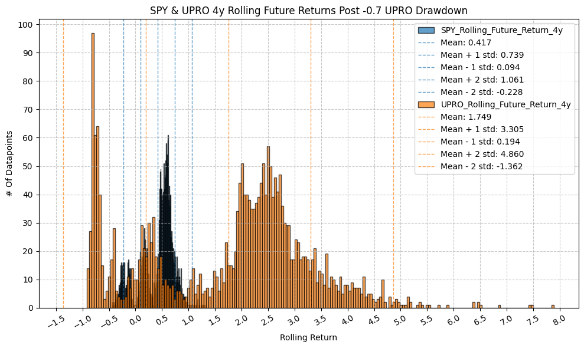
    


    
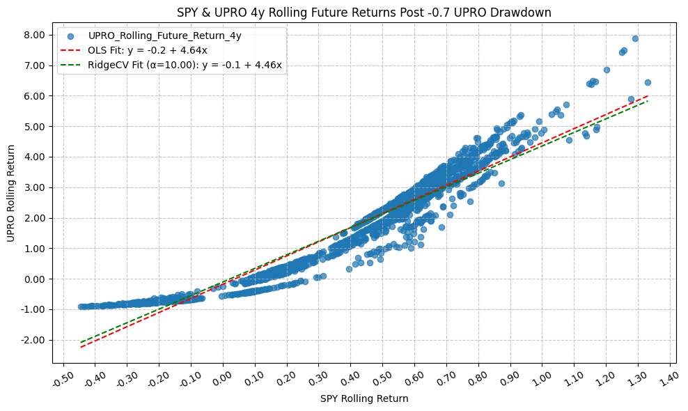
    


                                      OLS Regression Results                                 
    =========================================================================================
    Dep. Variable:     UPRO_Rolling_Future_Return_4y   R-squared:                       0.925
    Model:                                       OLS   Adj. R-squared:                  0.925
    Method:                            Least Squares   F-statistic:                 2.909e+04
    Date:                           Mon, 16 Mar 2026   Prob (F-statistic):               0.00
    Time:                                   13:45:07   Log-Likelihood:                -1339.2
    No. Observations:                           2365   AIC:                             2682.
    Df Residuals:                               2363   BIC:                             2694.
    Df Model:                                      1                                         
    Covariance Type:                       nonrobust                                         
    ================================================================================================
                                       coef    std err          t      P>|t|      [0.025      0.975]
    ------------------------------------------------------------------------------------------------
    const                           -0.1851      0.014    -12.912      0.000      -0.213      -0.157
    SPY_Rolling_Future_Return_4y     4.6425      0.027    170.565      0.000       4.589       4.696
    ==============================================================================
    Omnibus:                       55.496   Durbin-Watson:                   0.030
    Prob(Omnibus):                  0.000   Jarque-Bera (JB):              118.356
    Skew:                           0.081   Prob(JB):                     1.99e-26
    Kurtosis:                       4.084   Cond. No.                         3.69
    ==============================================================================
    
    Notes:
    [1] Standard Errors assume that the covariance matrix of the errors is correctly specified.


    
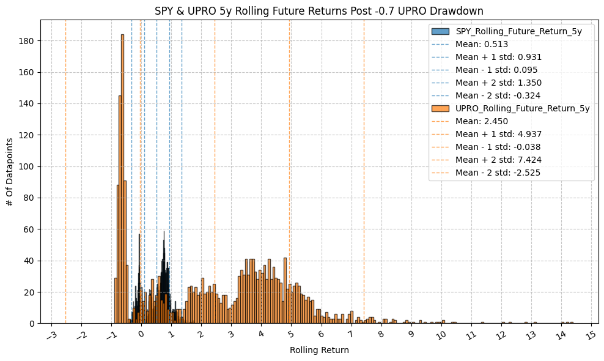
    


    
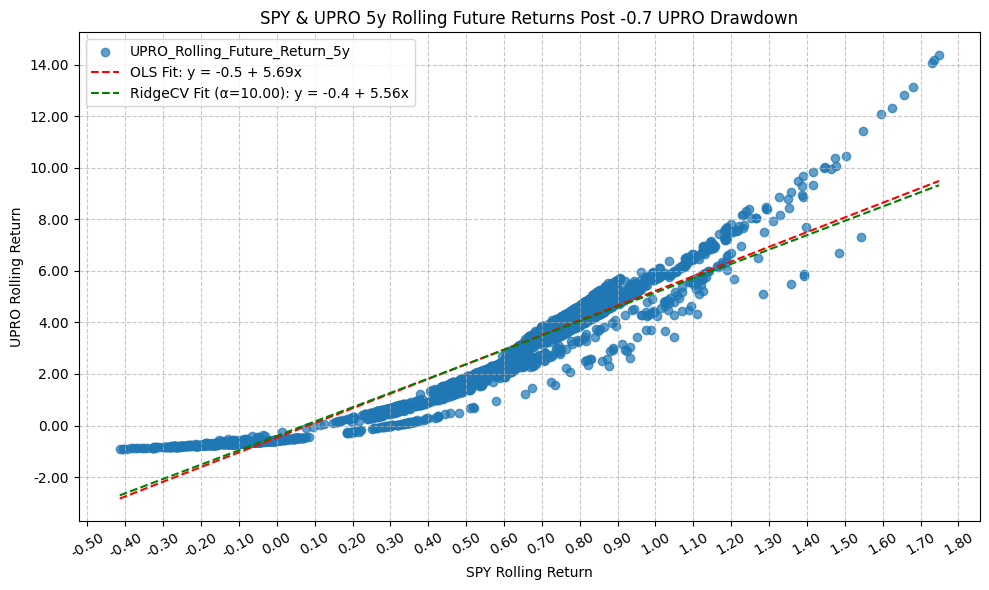
    


                                      OLS Regression Results                                 
    =========================================================================================
    Dep. Variable:     UPRO_Rolling_Future_Return_5y   R-squared:                       0.917
    Model:                                       OLS   Adj. R-squared:                  0.917
    Method:                            Least Squares   F-statistic:                 2.615e+04
    Date:                           Mon, 16 Mar 2026   Prob (F-statistic):               0.00
    Time:                                   13:45:08   Log-Likelihood:                -2565.1
    No. Observations:                           2365   AIC:                             5134.
    Df Residuals:                               2363   BIC:                             5146.
    Df Model:                                      1                                         
    Covariance Type:                       nonrobust                                         
    ================================================================================================
                                       coef    std err          t      P>|t|      [0.025      0.975]
    ------------------------------------------------------------------------------------------------
    const                           -0.4704      0.023    -20.191      0.000      -0.516      -0.425
    SPY_Rolling_Future_Return_5y     5.6929      0.035    161.723      0.000       5.624       5.762
    ==============================================================================
    Omnibus:                      311.086   Durbin-Watson:                   0.028
    Prob(Omnibus):                  0.000   Jarque-Bera (JB):             1363.041
    Skew:                           0.566   Prob(JB):                    1.05e-296
    Kurtosis:                       6.543   Cond. No.                         3.12
    ==============================================================================
    
    Notes:
    [1] Standard Errors assume that the covariance matrix of the errors is correctly specified.


    

    


    
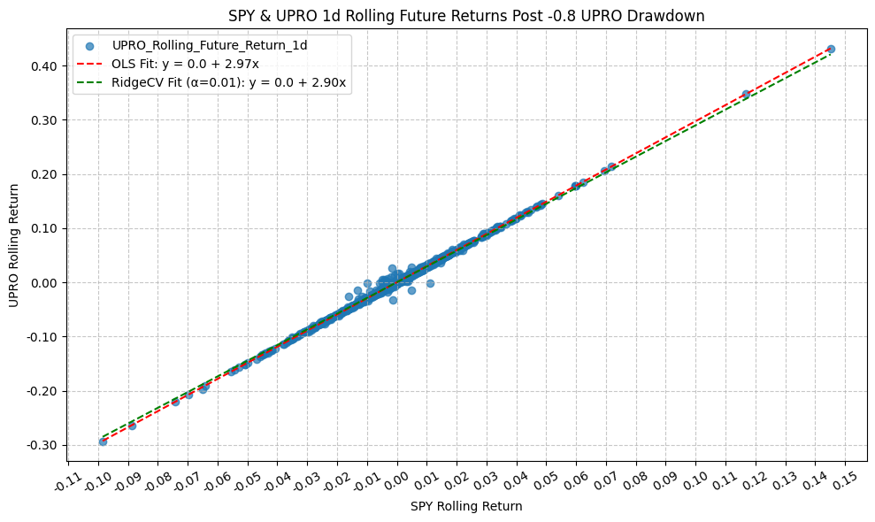
    


                                      OLS Regression Results                                 
    =========================================================================================
    Dep. Variable:     UPRO_Rolling_Future_Return_1d   R-squared:                       0.997
    Model:                                       OLS   Adj. R-squared:                  0.997
    Method:                            Least Squares   F-statistic:                 4.362e+05
    Date:                           Mon, 16 Mar 2026   Prob (F-statistic):               0.00
    Time:                                   13:45:09   Log-Likelihood:                 6607.2
    No. Observations:                           1479   AIC:                        -1.321e+04
    Df Residuals:                               1477   BIC:                        -1.320e+04
    Df Model:                                      1                                         
    Covariance Type:                       nonrobust                                         
    ================================================================================================
                                       coef    std err          t      P>|t|      [0.025      0.975]
    ------------------------------------------------------------------------------------------------
    const                            0.0001   7.23e-05      1.550      0.121   -2.98e-05       0.000
    SPY_Rolling_Future_Return_1d     2.9736      0.005    660.468      0.000       2.965       2.982
    ==============================================================================
    Omnibus:                      759.528   Durbin-Watson:                   2.689
    Prob(Omnibus):                  0.000   Jarque-Bera (JB):           237908.791
    Skew:                           1.142   Prob(JB):                         0.00
    Kurtosis:                      65.092   Cond. No.                         62.3
    ==============================================================================
    
    Notes:
    [1] Standard Errors assume that the covariance matrix of the errors is correctly specified.


    

    


    

    


                                      OLS Regression Results                                 
    =========================================================================================
    Dep. Variable:     UPRO_Rolling_Future_Return_1w   R-squared:                       0.990
    Model:                                       OLS   Adj. R-squared:                  0.990
    Method:                            Least Squares   F-statistic:                 1.475e+05
    Date:                           Mon, 16 Mar 2026   Prob (F-statistic):               0.00
    Time:                                   13:45:10   Log-Likelihood:                 4779.3
    No. Observations:                           1479   AIC:                            -9555.
    Df Residuals:                               1477   BIC:                            -9544.
    Df Model:                                      1                                         
    Covariance Type:                       nonrobust                                         
    ================================================================================================
                                       coef    std err          t      P>|t|      [0.025      0.975]
    ------------------------------------------------------------------------------------------------
    const                         3.196e-06      0.000      0.013      0.990      -0.000       0.000
    SPY_Rolling_Future_Return_1w     2.9572      0.008    384.014      0.000       2.942       2.972
    ==============================================================================
    Omnibus:                      517.977   Durbin-Watson:                   1.023
    Prob(Omnibus):                  0.000   Jarque-Bera (JB):            52657.085
    Skew:                          -0.625   Prob(JB):                         0.00
    Kurtosis:                      32.205   Cond. No.                         31.0
    ==============================================================================
    
    Notes:
    [1] Standard Errors assume that the covariance matrix of the errors is correctly specified.


    
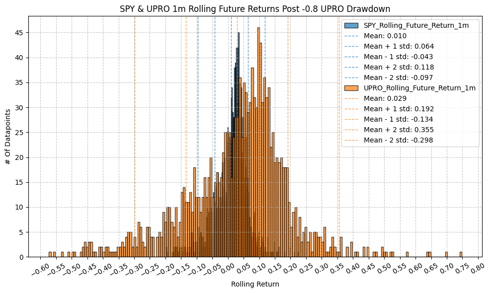
    


    
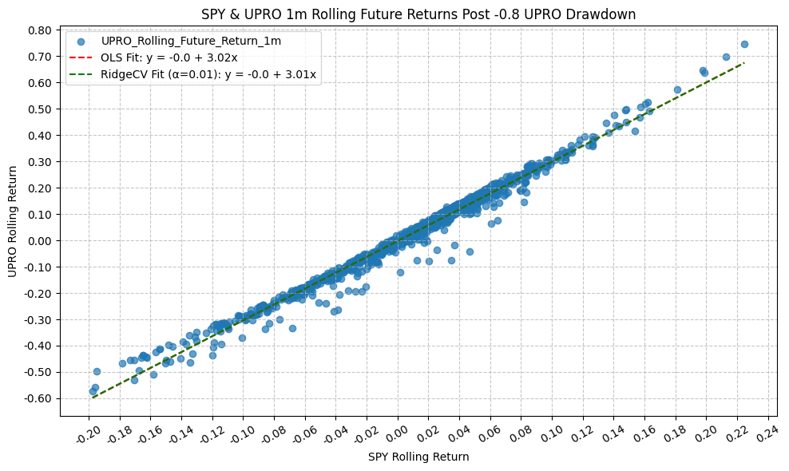
    


                                      OLS Regression Results                                 
    =========================================================================================
    Dep. Variable:     UPRO_Rolling_Future_Return_1m   R-squared:                       0.983
    Model:                                       OLS   Adj. R-squared:                  0.983
    Method:                            Least Squares   F-statistic:                 8.452e+04
    Date:                           Mon, 16 Mar 2026   Prob (F-statistic):               0.00
    Time:                                   13:45:12   Log-Likelihood:                 3588.8
    No. Observations:                           1479   AIC:                            -7174.
    Df Residuals:                               1477   BIC:                            -7163.
    Df Model:                                      1                                         
    Covariance Type:                       nonrobust                                         
    ================================================================================================
                                       coef    std err          t      P>|t|      [0.025      0.975]
    ------------------------------------------------------------------------------------------------
    const                           -0.0029      0.001     -5.075      0.000      -0.004      -0.002
    SPY_Rolling_Future_Return_1m     3.0167      0.010    290.718      0.000       2.996       3.037
    ==============================================================================
    Omnibus:                      951.943   Durbin-Watson:                   0.291
    Prob(Omnibus):                  0.000   Jarque-Bera (JB):            19753.591
    Skew:                          -2.649   Prob(JB):                         0.00
    Kurtosis:                      20.102   Cond. No.                         18.7
    ==============================================================================
    
    Notes:
    [1] Standard Errors assume that the covariance matrix of the errors is correctly specified.


    
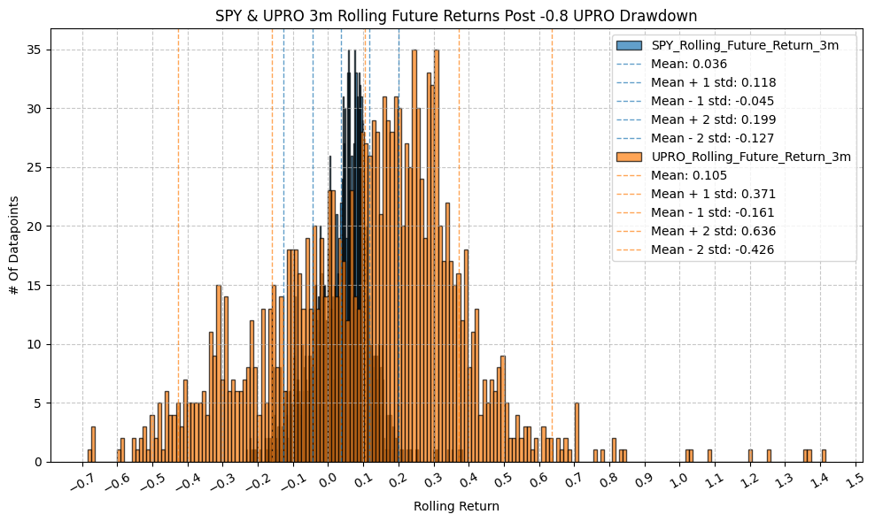
    


    

    


                                      OLS Regression Results                                 
    =========================================================================================
    Dep. Variable:     UPRO_Rolling_Future_Return_3m   R-squared:                       0.980
    Model:                                       OLS   Adj. R-squared:                  0.980
    Method:                            Least Squares   F-statistic:                 7.182e+04
    Date:                           Mon, 16 Mar 2026   Prob (F-statistic):               0.00
    Time:                                   13:45:13   Log-Likelihood:                 2749.5
    No. Observations:                           1479   AIC:                            -5495.
    Df Residuals:                               1477   BIC:                            -5484.
    Df Model:                                      1                                         
    Covariance Type:                       nonrobust                                         
    ================================================================================================
                                       coef    std err          t      P>|t|      [0.025      0.975]
    ------------------------------------------------------------------------------------------------
    const                           -0.0120      0.001    -11.210      0.000      -0.014      -0.010
    SPY_Rolling_Future_Return_3m     3.2239      0.012    267.983      0.000       3.200       3.248
    ==============================================================================
    Omnibus:                      396.774   Durbin-Watson:                   0.203
    Prob(Omnibus):                  0.000   Jarque-Bera (JB):             3170.391
    Skew:                          -1.021   Prob(JB):                         0.00
    Kurtosis:                       9.876   Cond. No.                         12.3
    ==============================================================================
    
    Notes:
    [1] Standard Errors assume that the covariance matrix of the errors is correctly specified.


    
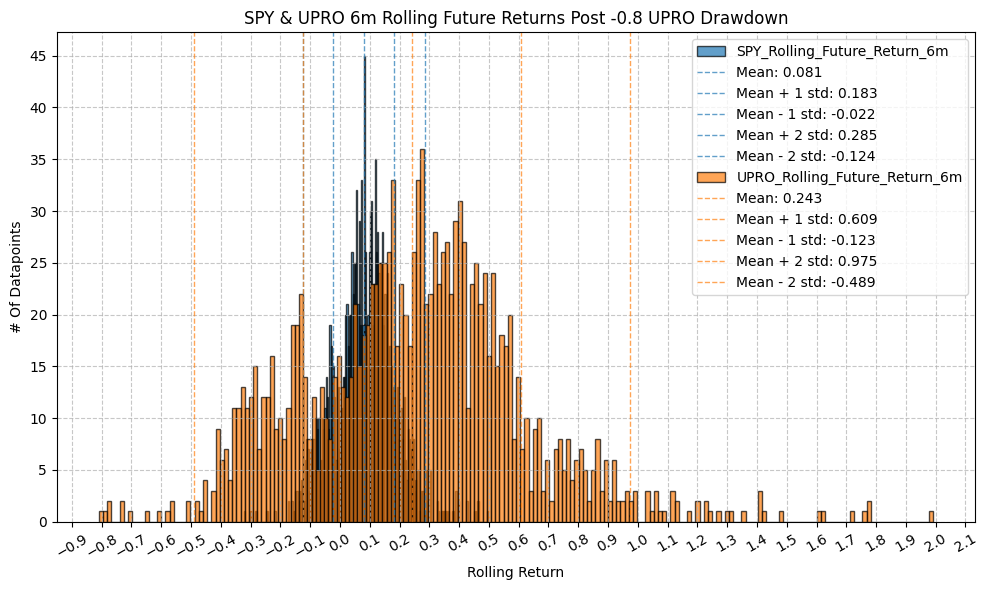
    


    

    


                                      OLS Regression Results                                 
    =========================================================================================
    Dep. Variable:     UPRO_Rolling_Future_Return_6m   R-squared:                       0.971
    Model:                                       OLS   Adj. R-squared:                  0.971
    Method:                            Least Squares   F-statistic:                 4.873e+04
    Date:                           Mon, 16 Mar 2026   Prob (F-statistic):               0.00
    Time:                                   13:45:14   Log-Likelihood:                 1996.2
    No. Observations:                           1479   AIC:                            -3988.
    Df Residuals:                               1477   BIC:                            -3978.
    Df Model:                                      1                                         
    Covariance Type:                       nonrobust                                         
    ================================================================================================
                                       coef    std err          t      P>|t|      [0.025      0.975]
    ------------------------------------------------------------------------------------------------
    const                           -0.0410      0.002    -19.752      0.000      -0.045      -0.037
    SPY_Rolling_Future_Return_6m     3.5211      0.016    220.756      0.000       3.490       3.552
    ==============================================================================
    Omnibus:                      303.529   Durbin-Watson:                   0.139
    Prob(Omnibus):                  0.000   Jarque-Bera (JB):             1799.504
    Skew:                          -0.818   Prob(JB):                         0.00
    Kurtosis:                       8.150   Cond. No.                         9.83
    ==============================================================================
    
    Notes:
    [1] Standard Errors assume that the covariance matrix of the errors is correctly specified.


    

    


    
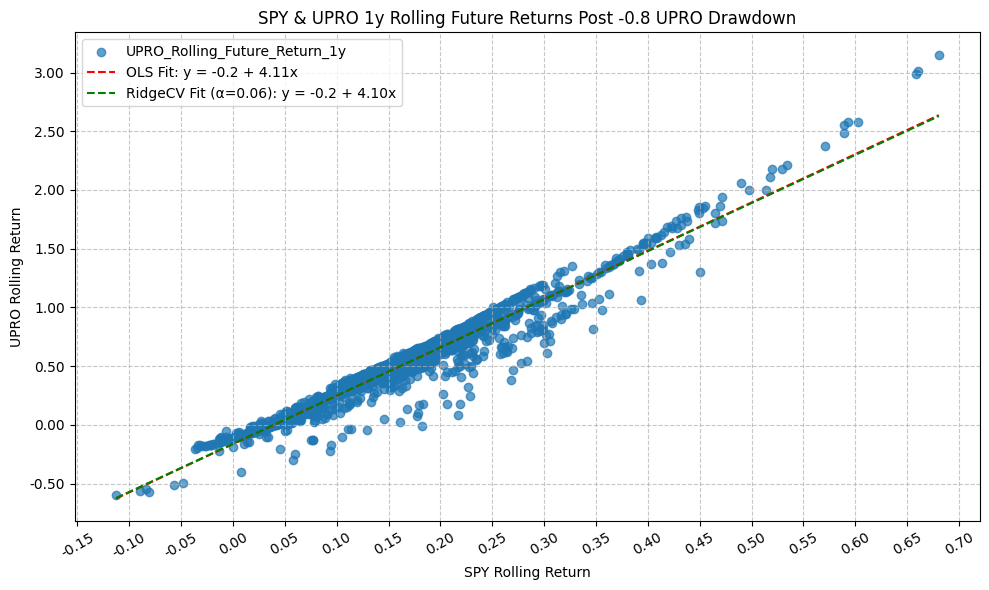
    


                                      OLS Regression Results                                 
    =========================================================================================
    Dep. Variable:     UPRO_Rolling_Future_Return_1y   R-squared:                       0.945
    Model:                                       OLS   Adj. R-squared:                  0.945
    Method:                            Least Squares   F-statistic:                 2.531e+04
    Date:                           Mon, 16 Mar 2026   Prob (F-statistic):               0.00
    Time:                                   13:45:15   Log-Likelihood:                 1208.7
    No. Observations:                           1479   AIC:                            -2413.
    Df Residuals:                               1477   BIC:                            -2403.
    Df Model:                                      1                                         
    Covariance Type:                       nonrobust                                         
    ================================================================================================
                                       coef    std err          t      P>|t|      [0.025      0.975]
    ------------------------------------------------------------------------------------------------
    const                           -0.1638      0.005    -32.562      0.000      -0.174      -0.154
    SPY_Rolling_Future_Return_1y     4.1149      0.026    159.078      0.000       4.064       4.166
    ==============================================================================
    Omnibus:                      636.693   Durbin-Watson:                   0.055
    Prob(Omnibus):                  0.000   Jarque-Bera (JB):             4021.716
    Skew:                          -1.901   Prob(JB):                         0.00
    Kurtosis:                      10.128   Cond. No.                         9.55
    ==============================================================================
    
    Notes:
    [1] Standard Errors assume that the covariance matrix of the errors is correctly specified.


    
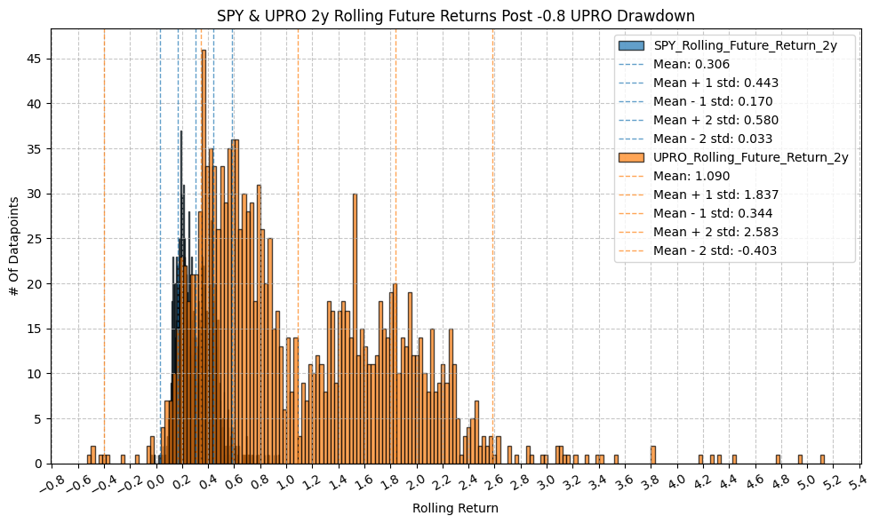
    


    
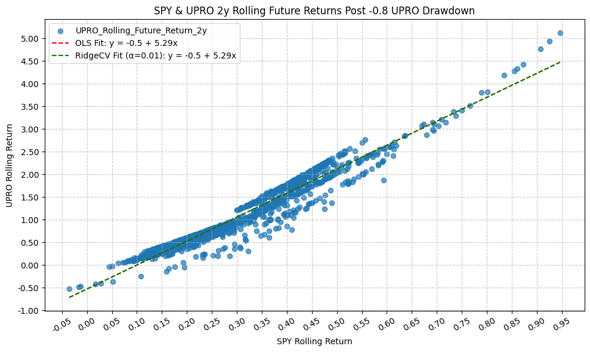
    


                                      OLS Regression Results                                 
    =========================================================================================
    Dep. Variable:     UPRO_Rolling_Future_Return_2y   R-squared:                       0.940
    Model:                                       OLS   Adj. R-squared:                  0.940
    Method:                            Least Squares   F-statistic:                 2.322e+04
    Date:                           Mon, 16 Mar 2026   Prob (F-statistic):               0.00
    Time:                                   13:45:16   Log-Likelihood:                 417.22
    No. Observations:                           1479   AIC:                            -830.4
    Df Residuals:                               1477   BIC:                            -819.8
    Df Model:                                      1                                         
    Covariance Type:                       nonrobust                                         
    ================================================================================================
                                       coef    std err          t      P>|t|      [0.025      0.975]
    ------------------------------------------------------------------------------------------------
    const                           -0.5307      0.012    -45.553      0.000      -0.554      -0.508
    SPY_Rolling_Future_Return_2y     5.2906      0.035    152.380      0.000       5.222       5.359
    ==============================================================================
    Omnibus:                      350.739   Durbin-Watson:                   0.045
    Prob(Omnibus):                  0.000   Jarque-Bera (JB):              917.233
    Skew:                          -1.244   Prob(JB):                    6.69e-200
    Kurtosis:                       5.949   Cond. No.                         8.01
    ==============================================================================
    
    Notes:
    [1] Standard Errors assume that the covariance matrix of the errors is correctly specified.


    

    


    

    


                                      OLS Regression Results                                 
    =========================================================================================
    Dep. Variable:     UPRO_Rolling_Future_Return_3y   R-squared:                       0.884
    Model:                                       OLS   Adj. R-squared:                  0.884
    Method:                            Least Squares   F-statistic:                 1.128e+04
    Date:                           Mon, 16 Mar 2026   Prob (F-statistic):               0.00
    Time:                                   13:45:17   Log-Likelihood:                -268.54
    No. Observations:                           1479   AIC:                             541.1
    Df Residuals:                               1477   BIC:                             551.7
    Df Model:                                      1                                         
    Covariance Type:                       nonrobust                                         
    ================================================================================================
                                       coef    std err          t      P>|t|      [0.025      0.975]
    ------------------------------------------------------------------------------------------------
    const                           -1.0243      0.027    -38.038      0.000      -1.077      -0.972
    SPY_Rolling_Future_Return_3y     6.1791      0.058    106.196      0.000       6.065       6.293
    ==============================================================================
    Omnibus:                       74.636   Durbin-Watson:                   0.032
    Prob(Omnibus):                  0.000   Jarque-Bera (JB):               91.011
    Skew:                          -0.512   Prob(JB):                     1.73e-20
    Kurtosis:                       3.655   Cond. No.                         9.25
    ==============================================================================
    
    Notes:
    [1] Standard Errors assume that the covariance matrix of the errors is correctly specified.


    

    


    

    


                                      OLS Regression Results                                 
    =========================================================================================
    Dep. Variable:     UPRO_Rolling_Future_Return_4y   R-squared:                       0.877
    Model:                                       OLS   Adj. R-squared:                  0.876
    Method:                            Least Squares   F-statistic:                 1.049e+04
    Date:                           Mon, 16 Mar 2026   Prob (F-statistic):               0.00
    Time:                                   13:45:18   Log-Likelihood:                -460.04
    No. Observations:                           1479   AIC:                             924.1
    Df Residuals:                               1477   BIC:                             934.7
    Df Model:                                      1                                         
    Covariance Type:                       nonrobust                                         
    ================================================================================================
                                       coef    std err          t      P>|t|      [0.025      0.975]
    ------------------------------------------------------------------------------------------------
    const                           -1.3231      0.040    -33.268      0.000      -1.401      -1.245
    SPY_Rolling_Future_Return_4y     6.5218      0.064    102.414      0.000       6.397       6.647
    ==============================================================================
    Omnibus:                      317.126   Durbin-Watson:                   0.032
    Prob(Omnibus):                  0.000   Jarque-Bera (JB):              747.178
    Skew:                          -1.169   Prob(JB):                    5.65e-163
    Kurtosis:                       5.580   Cond. No.                         10.2
    ==============================================================================
    
    Notes:
    [1] Standard Errors assume that the covariance matrix of the errors is correctly specified.


    

    


    
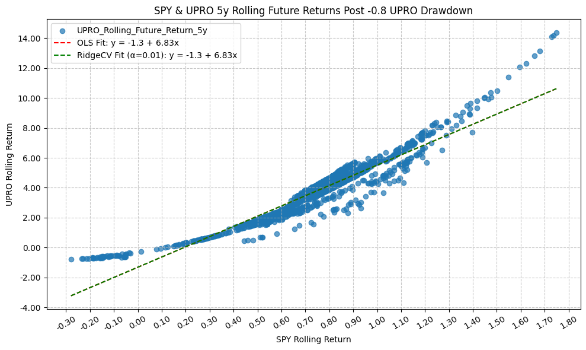
    


                                      OLS Regression Results                                 
    =========================================================================================
    Dep. Variable:     UPRO_Rolling_Future_Return_5y   R-squared:                       0.895
    Model:                                       OLS   Adj. R-squared:                  0.895
    Method:                            Least Squares   F-statistic:                 1.258e+04
    Date:                           Mon, 16 Mar 2026   Prob (F-statistic):               0.00
    Time:                                   13:45:20   Log-Likelihood:                -1478.3
    No. Observations:                           1479   AIC:                             2961.
    Df Residuals:                               1477   BIC:                             2971.
    Df Model:                                      1                                         
    Covariance Type:                       nonrobust                                         
    ================================================================================================
                                       coef    std err          t      P>|t|      [0.025      0.975]
    ------------------------------------------------------------------------------------------------
    const                           -1.3147      0.048    -27.526      0.000      -1.408      -1.221
    SPY_Rolling_Future_Return_5y     6.8270      0.061    112.164      0.000       6.708       6.946
    ==============================================================================
    Omnibus:                      180.962   Durbin-Watson:                   0.042
    Prob(Omnibus):                  0.000   Jarque-Bera (JB):              814.106
    Skew:                           0.496   Prob(JB):                    1.66e-177
    Kurtosis:                       6.497   Cond. No.                         5.57
    ==============================================================================
    
    Notes:
    [1] Standard Errors assume that the covariance matrix of the errors is correctly specified.


### Rolling Returns Following Drawdowns Deviation (SPY & UPRO)


```python
rolling_returns_positive_future_returns = pd.DataFrame(index=rolling_windows.keys(), data=rolling_windows.values())
rolling_returns_positive_future_returns.reset_index(inplace=True)
rolling_returns_positive_future_returns.rename(columns={"index":"Period", 0:"Days"}, inplace=True)

for drawdown in drawdown_levels:
    temp = rolling_returns_drawdown_stats.loc[rolling_returns_drawdown_stats["Drawdown"] == drawdown]
    temp = temp[["Period", "Positive_Future_Percentage"]]
    temp.rename(columns={"Positive_Future_Percentage" : f"Positive_Future_Percentage_Post_{drawdown}_Drawdown"}, inplace=True)
    rolling_returns_positive_future_returns = pd.merge(rolling_returns_positive_future_returns, temp, left_on="Period", right_on="Period", how="outer")
    rolling_returns_positive_future_returns.sort_values(by="Days", ascending=True, inplace=True)

rolling_returns_positive_future_returns.drop(columns={"Days"}, inplace=True)
rolling_returns_positive_future_returns.reset_index(drop=True, inplace=True)
display(rolling_returns_positive_future_returns)
```


<div>
<style scoped>
    .dataframe tbody tr th:only-of-type {
        vertical-align: middle;
    }

    .dataframe tbody tr th {
        vertical-align: top;
    }

    .dataframe thead th {
        text-align: right;
    }
</style>
<table border="1" class="dataframe">
  <thead>
    <tr style="text-align: right;">
      <th></th>
      <th>Period</th>
      <th>Positive_Future_Percentage_Post_-0.1_Drawdown</th>
      <th>Positive_Future_Percentage_Post_-0.2_Drawdown</th>
      <th>Positive_Future_Percentage_Post_-0.3_Drawdown</th>
      <th>Positive_Future_Percentage_Post_-0.4_Drawdown</th>
      <th>Positive_Future_Percentage_Post_-0.5_Drawdown</th>
      <th>Positive_Future_Percentage_Post_-0.6_Drawdown</th>
      <th>Positive_Future_Percentage_Post_-0.7_Drawdown</th>
      <th>Positive_Future_Percentage_Post_-0.8_Drawdown</th>
    </tr>
  </thead>
  <tbody>
    <tr>
      <th>0</th>
      <td>1d</td>
      <td>0.541</td>
      <td>0.540</td>
      <td>0.538</td>
      <td>0.537</td>
      <td>0.544</td>
      <td>0.547</td>
      <td>0.547</td>
      <td>0.547</td>
    </tr>
    <tr>
      <th>1</th>
      <td>1w</td>
      <td>0.572</td>
      <td>0.568</td>
      <td>0.561</td>
      <td>0.560</td>
      <td>0.565</td>
      <td>0.560</td>
      <td>0.566</td>
      <td>0.566</td>
    </tr>
    <tr>
      <th>2</th>
      <td>1m</td>
      <td>0.625</td>
      <td>0.615</td>
      <td>0.607</td>
      <td>0.605</td>
      <td>0.624</td>
      <td>0.625</td>
      <td>0.625</td>
      <td>0.646</td>
    </tr>
    <tr>
      <th>3</th>
      <td>3m</td>
      <td>0.670</td>
      <td>0.652</td>
      <td>0.632</td>
      <td>0.632</td>
      <td>0.647</td>
      <td>0.650</td>
      <td>0.656</td>
      <td>0.683</td>
    </tr>
    <tr>
      <th>4</th>
      <td>6m</td>
      <td>0.704</td>
      <td>0.691</td>
      <td>0.676</td>
      <td>0.671</td>
      <td>0.692</td>
      <td>0.698</td>
      <td>0.735</td>
      <td>0.753</td>
    </tr>
    <tr>
      <th>5</th>
      <td>1y</td>
      <td>0.733</td>
      <td>0.732</td>
      <td>0.726</td>
      <td>0.725</td>
      <td>0.740</td>
      <td>0.786</td>
      <td>0.836</td>
      <td>0.869</td>
    </tr>
    <tr>
      <th>6</th>
      <td>2y</td>
      <td>0.765</td>
      <td>0.779</td>
      <td>0.785</td>
      <td>0.782</td>
      <td>0.772</td>
      <td>0.809</td>
      <td>0.916</td>
      <td>0.991</td>
    </tr>
    <tr>
      <th>7</th>
      <td>3y</td>
      <td>0.721</td>
      <td>0.720</td>
      <td>0.722</td>
      <td>0.724</td>
      <td>0.717</td>
      <td>0.744</td>
      <td>0.870</td>
      <td>0.993</td>
    </tr>
    <tr>
      <th>8</th>
      <td>4y</td>
      <td>0.688</td>
      <td>0.687</td>
      <td>0.682</td>
      <td>0.685</td>
      <td>0.678</td>
      <td>0.708</td>
      <td>0.813</td>
      <td>0.998</td>
    </tr>
    <tr>
      <th>9</th>
      <td>5y</td>
      <td>0.659</td>
      <td>0.661</td>
      <td>0.656</td>
      <td>0.658</td>
      <td>0.649</td>
      <td>0.672</td>
      <td>0.740</td>
      <td>0.966</td>
    </tr>
  </tbody>
</table>
</div>


```python
plot_scatter(
    df=rolling_returns_positive_future_returns,
    x_plot_column="Period",
    y_plot_columns=[col for col in rolling_returns_positive_future_returns.columns if col != "Period"],
    title="UPRO Future Return by Time Period Post Drawdown",
    x_label="Rolling Return Time Period",
    x_format="String",
    x_format_decimal_places=0,
    x_tick_spacing=1,
    x_tick_rotation=0,
    y_label="Positive Future Return Percentage",
    y_format="Decimal",
    y_format_decimal_places=2,
    y_tick_spacing="Auto",
    y_tick_rotation=0,
    plot_OLS_regression_line=False,
    OLS_column=None,
    plot_Ridge_regression_line=False,
    Ridge_column=None,
    plot_RidgeCV_regression_line=False,
    RidgeCV_column=None,
    regression_constant=False,
    grid=True,
    legend=True,
    export_plot=False,
    plot_file_name=None,
)
```


    
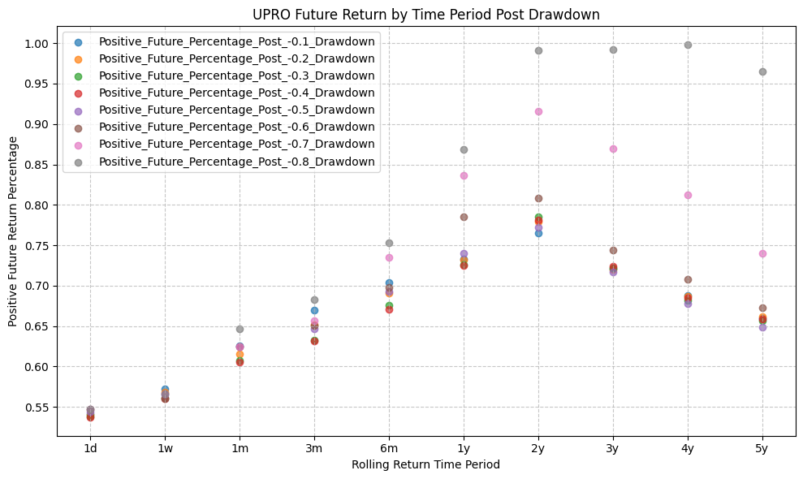
    


This plot summarizes the future rolling returns well. Similar as to QQQ/TQQQ, for rolling returns up to ~3 months *following* all drawdown levels, we see the rolling returns of UPRO are positive ~65% of the time.

As we extend the time horizon, out to the 2y, 3y, 4y, and 5y mark, the percentage of positive rolling returns following an 80% drawdown increases significantly, and is greater than *95%*. This suggests that while the volatility decay effect is present for UPRO, it may not be as severe as that of TQQQ, which could be due to the less extreme return profile of SPY compared to QQQ.

As an investor, this suggests that the optimal time to buy UPRO would be following a drawdown of 50% or more, and holding for at least 2 years. One could dollar cost average into UPRO following a drawdown of 50% or more, and continue to add to the position with a consistent contribution schedule until all capital has been allocated.


```python

```

## Code


