## Introduction

Over the past 15 years (or so), leveraged ETFs have become frequently used for trading equity indices, sectors, and other asset classes by the investor that is seeking to use leverage for excess exposure to those asset classes. The question remains, however, what happens to the returns of leveraged ETFs over an extended time horizon and is there an optimal leverage ratio for the long-term buy-and-hold investor that allows them to take advantage of leverage to increase the up-side returns, while avoiding catastrophic losses on the down-side? In this investigation, we will delve into these ideas and see what the data shows.

 ## Python Imports


```python
# Standard Library
import os
import sys
import warnings

from pathlib import Path

# Data Handling
import pandas as pd

# Suppress warnings
warnings.filterwarnings("ignore")
```


```python
# Add the source subdirectory to the system path to allow import config from settings.py
current_directory = Path(os.getcwd())
website_base_directory = current_directory.parent.parent.parent
src_directory = website_base_directory / "src"
sys.path.append(str(src_directory)) if str(src_directory) not in sys.path else None

# Import settings.py
from settings import config

# Add configured directories from config to path
SOURCE_DIR = config("SOURCE_DIR")
sys.path.append(str(Path(SOURCE_DIR))) if str(Path(SOURCE_DIR)) not in sys.path else None

# Add other configured directories
BASE_DIR = config("BASE_DIR")
CONTENT_DIR = config("CONTENT_DIR")
POSTS_DIR = config("POSTS_DIR")
PAGES_DIR = config("PAGES_DIR")
PUBLIC_DIR = config("PUBLIC_DIR")
SOURCE_DIR = config("SOURCE_DIR")
DATA_DIR = config("DATA_DIR")
DATA_MANUAL_DIR = config("DATA_MANUAL_DIR")
```

## Python Functions

Here are the functions needed for this project:

* [load_data](/posts/reusable-extensible-python-functions-financial-data-analysis/#load_data): Load data from a CSV, Excel, or Pickle file into a pandas DataFrame.
* [pandas_set_decimal_places](/posts/reusable-extensible-python-functions-financial-data-analysis/#pandas_set_decimal_places): Set the number of decimal places displayed for floating-point numbers in pandas.
* [plot_histogram](/posts/reusable-extensible-python-functions-financial-data-analysis/#plot_histogram): Plot the histogram of a data set from a DataFrame.
* [plot_scatter](/posts/reusable-extensible-python-functions-financial-data-analysis/#plot_scatter): Plot the data from a DataFrame for a specified date range and columns.
* [plot_timeseries](/posts/reusable-extensible-python-functions-financial-data-analysis/#plot_timeseries): Plot the timeseries data from a DataFrame for a specified date range and columns.
* [run_linear_regression](/posts/reusable-extensible-python-functions-financial-data-analysis/#run_linear_regression): Run a linear regression using statsmodels OLS and return the results.
* [summary_stats](/posts/reusable-extensible-python-functions-financial-data-analysis/#summary_stats): Generate summary statistics for a series of returns.
* [yf_pull_data](/posts/reusable-extensible-python-functions-financial-data-analysis/#yf_pull_data): Download daily price data from Yahoo Finance and export it.


```python
from load_data import load_data
from pandas_set_decimal_places import pandas_set_decimal_places
from plot_histogram import plot_histogram
from plot_scatter import plot_scatter
from plot_timeseries import plot_timeseries
from run_linear_regression import run_linear_regression
from summary_stats import summary_stats
from yf_pull_data import yf_pull_data
```

## Data Overview

For this exercise, we will investigate the long-term return relationships between the following:

* QQQ (Invesco QQQ Trust, Series 1) and TQQQ (ProShares  UltraPro QQQ)
* SPY (SPDR S&P 500 ETF Trust) and UPRO (ProShares UltraPro S&P 500)

Just to clarify, any time we are referring to "close prices" in this analysis, we are referring to the partially-adjusted close prices that account for splits, but not dividends. Because we are dealing with leveraged ETFs, we want to focus on the pure returns due to change in price, but exclude the dividends, which are not leveraged in the same way as the price changes.

## QQQ & TQQQ

### Acquire & Plot Data (QQQ)

First, let's get the data for QQQ. If we already have the desired data, we can load it from a local pickle file. Otherwise, we can download it from Yahoo Finance using the `yf_pull_data` function.


```python
yf_pull_data(
    base_directory=DATA_DIR,
    ticker="QQQ",
    adjusted=False,
    source="Yahoo_Finance",
    asset_class="Exchange_Traded_Funds",
    excel_export=True,
    pickle_export=True,
    output_confirmation=False,
)

qqq = load_data(
    base_directory=DATA_DIR,
    ticker="QQQ",
    source="Yahoo_Finance",
    asset_class="Exchange_Traded_Funds",
    timeframe="Daily",
    file_format="pickle",
)

# Rename columns to "QQQ_Close", etc.
qqq = qqq.rename(columns={
    "Adj Close": "QQQ_Adj_Close",
    "Close": "QQQ_Close",
    "High": "QQQ_High",
    "Low": "QQQ_Low",
    "Open": "QQQ_Open",
    "Volume": "QQQ_Volume"
})

display(qqq)
```


<div>
<style scoped>
    .dataframe tbody tr th:only-of-type {
        vertical-align: middle;
    }

    .dataframe tbody tr th {
        vertical-align: top;
    }

    .dataframe thead th {
        text-align: right;
    }
</style>
<table border="1" class="dataframe">
  <thead>
    <tr style="text-align: right;">
      <th></th>
      <th>QQQ_Adj_Close</th>
      <th>QQQ_Close</th>
      <th>QQQ_High</th>
      <th>QQQ_Low</th>
      <th>QQQ_Open</th>
      <th>QQQ_Volume</th>
    </tr>
    <tr>
      <th>Date</th>
      <th></th>
      <th></th>
      <th></th>
      <th></th>
      <th></th>
      <th></th>
    </tr>
  </thead>
  <tbody>
    <tr>
      <th>1999-03-10</th>
      <td>43.128662</td>
      <td>51.062500</td>
      <td>51.156250</td>
      <td>50.281250</td>
      <td>51.125000</td>
      <td>5232000</td>
    </tr>
    <tr>
      <th>1999-03-11</th>
      <td>43.339806</td>
      <td>51.312500</td>
      <td>51.734375</td>
      <td>50.312500</td>
      <td>51.437500</td>
      <td>9688600</td>
    </tr>
    <tr>
      <th>1999-03-12</th>
      <td>42.284008</td>
      <td>50.062500</td>
      <td>51.156250</td>
      <td>49.656250</td>
      <td>51.125000</td>
      <td>8743600</td>
    </tr>
    <tr>
      <th>1999-03-15</th>
      <td>43.498173</td>
      <td>51.500000</td>
      <td>51.562500</td>
      <td>49.906250</td>
      <td>50.437500</td>
      <td>6369000</td>
    </tr>
    <tr>
      <th>1999-03-16</th>
      <td>43.867699</td>
      <td>51.937500</td>
      <td>52.156250</td>
      <td>51.156250</td>
      <td>51.718750</td>
      <td>4905800</td>
    </tr>
    <tr>
      <th>...</th>
      <td>...</td>
      <td>...</td>
      <td>...</td>
      <td>...</td>
      <td>...</td>
      <td>...</td>
    </tr>
    <tr>
      <th>2026-03-13</th>
      <td>593.719971</td>
      <td>593.719971</td>
      <td>603.599976</td>
      <td>592.570007</td>
      <td>599.729980</td>
      <td>63145500</td>
    </tr>
    <tr>
      <th>2026-03-16</th>
      <td>600.380005</td>
      <td>600.380005</td>
      <td>603.859985</td>
      <td>599.109985</td>
      <td>600.039978</td>
      <td>49077200</td>
    </tr>
    <tr>
      <th>2026-03-17</th>
      <td>603.309998</td>
      <td>603.309998</td>
      <td>605.900024</td>
      <td>601.869995</td>
      <td>603.140015</td>
      <td>47106600</td>
    </tr>
    <tr>
      <th>2026-03-18</th>
      <td>594.900024</td>
      <td>594.900024</td>
      <td>603.159973</td>
      <td>594.559998</td>
      <td>601.489990</td>
      <td>56128000</td>
    </tr>
    <tr>
      <th>2026-03-19</th>
      <td>593.020020</td>
      <td>593.020020</td>
      <td>595.799988</td>
      <td>587.080017</td>
      <td>589.510010</td>
      <td>75415300</td>
    </tr>
  </tbody>
</table>
<p>6799 rows × 6 columns</p>
</div>


And the plot of the time series of partially adjusted close prices:


```python
plot_timeseries(
    df=qqq,
    plot_start_date=None,
    plot_end_date=None,
    plot_columns=["QQQ_Close"],
    title="QQQ Close Price",
    x_label="Date",
    x_format="Year",
    x_tick_spacing=2,
    x_tick_rotation=30,
    y_label="Price ($)",
    y_format="Decimal",
    y_format_decimal_places=0,
    y_tick_spacing="Auto",
    y_tick_rotation=0,
    grid=True,
    legend=False,
    export_plot=False,
    plot_file_name=None,
)
```


    
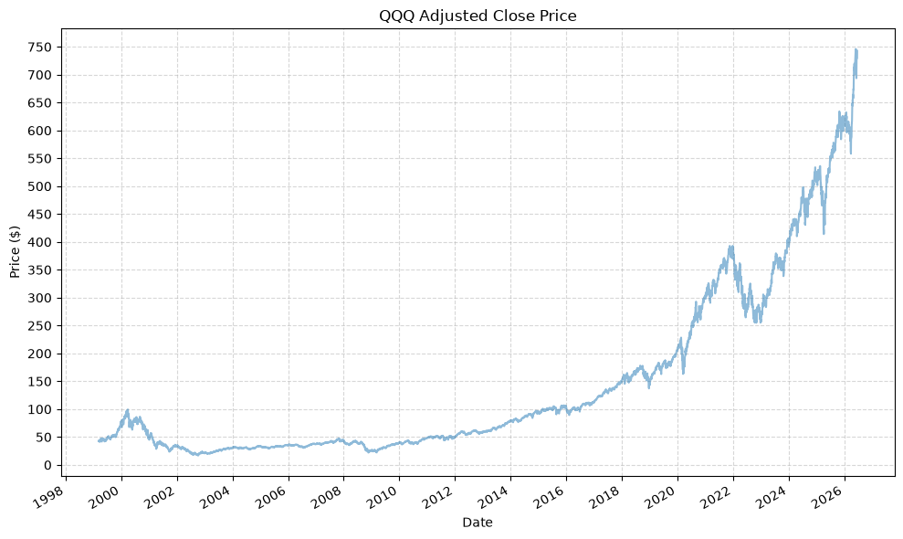
    


### Acquire & Plot Data (TQQQ)

Next, TQQQ:


```python
yf_pull_data(
    base_directory=DATA_DIR,
    ticker="TQQQ",
    adjusted=False,
    source="Yahoo_Finance", 
    asset_class="Exchange_Traded_Funds", 
    excel_export=True,
    pickle_export=True,
    output_confirmation=False,
)

tqqq = load_data(
    base_directory=DATA_DIR,
    ticker="TQQQ",
    source="Yahoo_Finance", 
    asset_class="Exchange_Traded_Funds",
    timeframe="Daily",
    file_format="pickle",
)

# Rename columns to "TQQQ_Close", etc.
tqqq = tqqq.rename(columns={
    "Adj Close": "TQQQ_Adj_Close",
    "Close": "TQQQ_Close", 
    "High": "TQQQ_High", 
    "Low": "TQQQ_Low", 
    "Open": "TQQQ_Open", 
    "Volume": "TQQQ_Volume"
})

display(tqqq)
```


<div>
<style scoped>
    .dataframe tbody tr th:only-of-type {
        vertical-align: middle;
    }

    .dataframe tbody tr th {
        vertical-align: top;
    }

    .dataframe thead th {
        text-align: right;
    }
</style>
<table border="1" class="dataframe">
  <thead>
    <tr style="text-align: right;">
      <th></th>
      <th>TQQQ_Adj_Close</th>
      <th>TQQQ_Close</th>
      <th>TQQQ_High</th>
      <th>TQQQ_Low</th>
      <th>TQQQ_Open</th>
      <th>TQQQ_Volume</th>
    </tr>
    <tr>
      <th>Date</th>
      <th></th>
      <th></th>
      <th></th>
      <th></th>
      <th></th>
      <th></th>
    </tr>
  </thead>
  <tbody>
    <tr>
      <th>2010-02-11</th>
      <td>0.206396</td>
      <td>0.216276</td>
      <td>0.217448</td>
      <td>0.202786</td>
      <td>0.203438</td>
      <td>6912000</td>
    </tr>
    <tr>
      <th>2010-02-12</th>
      <td>0.207241</td>
      <td>0.217161</td>
      <td>0.219036</td>
      <td>0.209167</td>
      <td>0.210391</td>
      <td>17203200</td>
    </tr>
    <tr>
      <th>2010-02-16</th>
      <td>0.215268</td>
      <td>0.225573</td>
      <td>0.226094</td>
      <td>0.218776</td>
      <td>0.222266</td>
      <td>19238400</td>
    </tr>
    <tr>
      <th>2010-02-17</th>
      <td>0.218921</td>
      <td>0.229401</td>
      <td>0.229453</td>
      <td>0.225156</td>
      <td>0.228594</td>
      <td>38361600</td>
    </tr>
    <tr>
      <th>2010-02-18</th>
      <td>0.223072</td>
      <td>0.233750</td>
      <td>0.235130</td>
      <td>0.227786</td>
      <td>0.229167</td>
      <td>77721600</td>
    </tr>
    <tr>
      <th>...</th>
      <td>...</td>
      <td>...</td>
      <td>...</td>
      <td>...</td>
      <td>...</td>
      <td>...</td>
    </tr>
    <tr>
      <th>2026-03-13</th>
      <td>45.930000</td>
      <td>45.930000</td>
      <td>48.250000</td>
      <td>45.669998</td>
      <td>47.349998</td>
      <td>141952500</td>
    </tr>
    <tr>
      <th>2026-03-16</th>
      <td>47.459999</td>
      <td>47.459999</td>
      <td>48.270000</td>
      <td>47.180000</td>
      <td>47.369999</td>
      <td>81421500</td>
    </tr>
    <tr>
      <th>2026-03-17</th>
      <td>48.160000</td>
      <td>48.160000</td>
      <td>48.759998</td>
      <td>47.810001</td>
      <td>48.119999</td>
      <td>74570100</td>
    </tr>
    <tr>
      <th>2026-03-18</th>
      <td>46.099998</td>
      <td>46.099998</td>
      <td>48.110001</td>
      <td>46.049999</td>
      <td>47.720001</td>
      <td>105059300</td>
    </tr>
    <tr>
      <th>2026-03-19</th>
      <td>45.689999</td>
      <td>45.689999</td>
      <td>46.320000</td>
      <td>44.299999</td>
      <td>44.869999</td>
      <td>137588200</td>
    </tr>
  </tbody>
</table>
<p>4050 rows × 6 columns</p>
</div>


And the plot of the time series of partially adjusted close prices:


```python
plot_timeseries(
    df=tqqq,
    plot_start_date=None,
    plot_end_date=None,
    plot_columns=["TQQQ_Close"],
    title="TQQQ Close Price",
    x_label="Date",
    x_format="Year",
    x_tick_spacing=1,
    x_tick_rotation=30,
    y_label="Price ($)",
    y_format="Decimal",
    y_format_decimal_places=0,
    y_tick_spacing="Auto",
    y_tick_rotation=0,
    grid=True,
    legend=False,
    export_plot=False,
    plot_file_name=None,
)
```


    
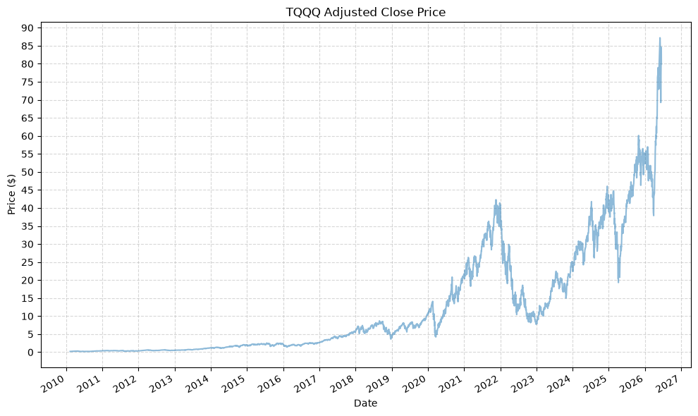
    


Looking at the close prices doesn't give us a true picture of the magnitude of the difference in returns due to the leverage. In order to see that, we need to look at the cumulative returns and the drawdowns.

 ### Calculate & Plot Cumulative Returns, Rolling Returns, and Drawdowns (QQQ & TQQQ)

 Next, we will calculate the cumulative returns, rolling returns, and drawdowns. This involves aligning the data to start with the inception of TQQQ. For this excercise, we will not extrapolate the data for QQQ back to 1999, but rather just align the data from the inception of TQQQ in 2010.


```python
etfs = ["QQQ", "TQQQ"]

# Merge dataframes and drop rows with missing values
qqq_tqqq_aligned = tqqq.merge(qqq, left_index=True, right_index=True, how='left')
qqq_tqqq_aligned = qqq_tqqq_aligned.dropna()

# Calculate cumulative returns
for etf in etfs:
    qqq_tqqq_aligned[f"{etf}_Return"] = qqq_tqqq_aligned[f"{etf}_Close"].pct_change()
    qqq_tqqq_aligned[f"{etf}_Cumulative_Return"] = (1 + qqq_tqqq_aligned[f"{etf}_Return"]).cumprod() - 1
    qqq_tqqq_aligned[f"{etf}_Cumulative_Return_Plus_One"] = 1 + qqq_tqqq_aligned[f"{etf}_Cumulative_Return"]
    qqq_tqqq_aligned[f"{etf}_Rolling_Max"] = qqq_tqqq_aligned[f"{etf}_Cumulative_Return_Plus_One"].cummax()
    qqq_tqqq_aligned[f"{etf}_Drawdown"] = qqq_tqqq_aligned[f"{etf}_Cumulative_Return_Plus_One"] / qqq_tqqq_aligned[f"{etf}_Rolling_Max"] - 1
    qqq_tqqq_aligned.drop(columns=[f"{etf}_Cumulative_Return_Plus_One", f"{etf}_Rolling_Max"], inplace=True)

# Define rolling windows in trading days
rolling_windows = {
    '1d': 1,      # 1 day
    '1w': 5,      # 1 week (5 trading days)
    '1m': 21,     # 1 month (~21 trading days)
    '3m': 63,     # 3 months (~63 trading days)
    '6m': 126,    # 6 months (~126 trading days)
    '1y': 252,    # 1 year (~252 trading days)
    '2y': 504,    # 2 years (~504 trading days)
    '3y': 756,    # 3 years (~756 trading days)
    '4y': 1008,   # 4 years (~1008 trading days)
    '5y': 1260,   # 5 years (~1260 trading days)
}

# Calculate rolling returns for each ETF and each window
for etf in etfs:
    for period_name, window in rolling_windows.items():
        qqq_tqqq_aligned[f"{etf}_Rolling_Return_{period_name}"] = (
            qqq_tqqq_aligned[f"{etf}_Close"].pct_change(periods=window)
        )
        
display(qqq_tqqq_aligned)
```


<div>
<style scoped>
    .dataframe tbody tr th:only-of-type {
        vertical-align: middle;
    }

    .dataframe tbody tr th {
        vertical-align: top;
    }

    .dataframe thead th {
        text-align: right;
    }
</style>
<table border="1" class="dataframe">
  <thead>
    <tr style="text-align: right;">
      <th></th>
      <th>TQQQ_Adj_Close</th>
      <th>TQQQ_Close</th>
      <th>TQQQ_High</th>
      <th>TQQQ_Low</th>
      <th>TQQQ_Open</th>
      <th>TQQQ_Volume</th>
      <th>QQQ_Adj_Close</th>
      <th>QQQ_Close</th>
      <th>QQQ_High</th>
      <th>QQQ_Low</th>
      <th>...</th>
      <th>TQQQ_Rolling_Return_1d</th>
      <th>TQQQ_Rolling_Return_1w</th>
      <th>TQQQ_Rolling_Return_1m</th>
      <th>TQQQ_Rolling_Return_3m</th>
      <th>TQQQ_Rolling_Return_6m</th>
      <th>TQQQ_Rolling_Return_1y</th>
      <th>TQQQ_Rolling_Return_2y</th>
      <th>TQQQ_Rolling_Return_3y</th>
      <th>TQQQ_Rolling_Return_4y</th>
      <th>TQQQ_Rolling_Return_5y</th>
    </tr>
    <tr>
      <th>Date</th>
      <th></th>
      <th></th>
      <th></th>
      <th></th>
      <th></th>
      <th></th>
      <th></th>
      <th></th>
      <th></th>
      <th></th>
      <th></th>
      <th></th>
      <th></th>
      <th></th>
      <th></th>
      <th></th>
      <th></th>
      <th></th>
      <th></th>
      <th></th>
      <th></th>
    </tr>
  </thead>
  <tbody>
    <tr>
      <th>2010-02-11</th>
      <td>0.206396</td>
      <td>0.216276</td>
      <td>0.217448</td>
      <td>0.202786</td>
      <td>0.203438</td>
      <td>6912000</td>
      <td>37.951691</td>
      <td>43.669998</td>
      <td>43.790001</td>
      <td>42.759998</td>
      <td>...</td>
      <td>NaN</td>
      <td>NaN</td>
      <td>NaN</td>
      <td>NaN</td>
      <td>NaN</td>
      <td>NaN</td>
      <td>NaN</td>
      <td>NaN</td>
      <td>NaN</td>
      <td>NaN</td>
    </tr>
    <tr>
      <th>2010-02-12</th>
      <td>0.207241</td>
      <td>0.217161</td>
      <td>0.219036</td>
      <td>0.209167</td>
      <td>0.210391</td>
      <td>17203200</td>
      <td>38.029896</td>
      <td>43.759998</td>
      <td>43.880001</td>
      <td>43.160000</td>
      <td>...</td>
      <td>0.004092</td>
      <td>NaN</td>
      <td>NaN</td>
      <td>NaN</td>
      <td>NaN</td>
      <td>NaN</td>
      <td>NaN</td>
      <td>NaN</td>
      <td>NaN</td>
      <td>NaN</td>
    </tr>
    <tr>
      <th>2010-02-16</th>
      <td>0.215268</td>
      <td>0.225573</td>
      <td>0.226094</td>
      <td>0.218776</td>
      <td>0.222266</td>
      <td>19238400</td>
      <td>38.516575</td>
      <td>44.320000</td>
      <td>44.349998</td>
      <td>43.849998</td>
      <td>...</td>
      <td>0.038736</td>
      <td>NaN</td>
      <td>NaN</td>
      <td>NaN</td>
      <td>NaN</td>
      <td>NaN</td>
      <td>NaN</td>
      <td>NaN</td>
      <td>NaN</td>
      <td>NaN</td>
    </tr>
    <tr>
      <th>2010-02-17</th>
      <td>0.218921</td>
      <td>0.229401</td>
      <td>0.229453</td>
      <td>0.225156</td>
      <td>0.228594</td>
      <td>38361600</td>
      <td>38.733841</td>
      <td>44.570000</td>
      <td>44.570000</td>
      <td>44.259998</td>
      <td>...</td>
      <td>0.016970</td>
      <td>NaN</td>
      <td>NaN</td>
      <td>NaN</td>
      <td>NaN</td>
      <td>NaN</td>
      <td>NaN</td>
      <td>NaN</td>
      <td>NaN</td>
      <td>NaN</td>
    </tr>
    <tr>
      <th>2010-02-18</th>
      <td>0.223072</td>
      <td>0.233750</td>
      <td>0.235130</td>
      <td>0.227786</td>
      <td>0.229167</td>
      <td>77721600</td>
      <td>38.977180</td>
      <td>44.849998</td>
      <td>44.930000</td>
      <td>44.450001</td>
      <td>...</td>
      <td>0.018958</td>
      <td>NaN</td>
      <td>NaN</td>
      <td>NaN</td>
      <td>NaN</td>
      <td>NaN</td>
      <td>NaN</td>
      <td>NaN</td>
      <td>NaN</td>
      <td>NaN</td>
    </tr>
    <tr>
      <th>...</th>
      <td>...</td>
      <td>...</td>
      <td>...</td>
      <td>...</td>
      <td>...</td>
      <td>...</td>
      <td>...</td>
      <td>...</td>
      <td>...</td>
      <td>...</td>
      <td>...</td>
      <td>...</td>
      <td>...</td>
      <td>...</td>
      <td>...</td>
      <td>...</td>
      <td>...</td>
      <td>...</td>
      <td>...</td>
      <td>...</td>
      <td>...</td>
    </tr>
    <tr>
      <th>2026-03-13</th>
      <td>45.930000</td>
      <td>45.930000</td>
      <td>48.250000</td>
      <td>45.669998</td>
      <td>47.349998</td>
      <td>141952500</td>
      <td>593.719971</td>
      <td>593.719971</td>
      <td>603.599976</td>
      <td>592.570007</td>
      <td>...</td>
      <td>-0.019218</td>
      <td>-0.033866</td>
      <td>-0.106420</td>
      <td>-0.189232</td>
      <td>-0.038820</td>
      <td>0.502699</td>
      <td>0.529471</td>
      <td>2.995650</td>
      <td>1.150281</td>
      <td>1.398433</td>
    </tr>
    <tr>
      <th>2026-03-16</th>
      <td>47.459999</td>
      <td>47.459999</td>
      <td>48.270000</td>
      <td>47.180000</td>
      <td>47.369999</td>
      <td>81421500</td>
      <td>600.380005</td>
      <td>600.380005</td>
      <td>603.859985</td>
      <td>599.109985</td>
      <td>...</td>
      <td>0.033312</td>
      <td>-0.039077</td>
      <td>-0.016577</td>
      <td>-0.154161</td>
      <td>-0.019016</td>
      <td>0.642499</td>
      <td>0.599057</td>
      <td>3.358127</td>
      <td>1.253026</td>
      <td>1.217239</td>
    </tr>
    <tr>
      <th>2026-03-17</th>
      <td>48.160000</td>
      <td>48.160000</td>
      <td>48.759998</td>
      <td>47.810001</td>
      <td>48.119999</td>
      <td>74570100</td>
      <td>603.309998</td>
      <td>603.309998</td>
      <td>605.900024</td>
      <td>601.869995</td>
      <td>...</td>
      <td>0.014749</td>
      <td>-0.025101</td>
      <td>-0.006396</td>
      <td>-0.088224</td>
      <td>-0.029326</td>
      <td>0.556310</td>
      <td>0.556561</td>
      <td>3.613027</td>
      <td>1.065180</td>
      <td>1.269290</td>
    </tr>
    <tr>
      <th>2026-03-18</th>
      <td>46.099998</td>
      <td>46.099998</td>
      <td>48.110001</td>
      <td>46.049999</td>
      <td>47.720001</td>
      <td>105059300</td>
      <td>594.900024</td>
      <td>594.900024</td>
      <td>603.159973</td>
      <td>594.559998</td>
      <td>...</td>
      <td>-0.042774</td>
      <td>-0.065856</td>
      <td>-0.046536</td>
      <td>-0.113802</td>
      <td>-0.068310</td>
      <td>0.461404</td>
      <td>0.525480</td>
      <td>3.322550</td>
      <td>1.042534</td>
      <td>1.031284</td>
    </tr>
    <tr>
      <th>2026-03-19</th>
      <td>45.689999</td>
      <td>45.689999</td>
      <td>46.320000</td>
      <td>44.299999</td>
      <td>44.869999</td>
      <td>137588200</td>
      <td>593.020020</td>
      <td>593.020020</td>
      <td>595.799988</td>
      <td>587.080017</td>
      <td>...</td>
      <td>-0.008894</td>
      <td>-0.024343</td>
      <td>-0.074914</td>
      <td>-0.126887</td>
      <td>-0.070680</td>
      <td>0.525288</td>
      <td>0.524270</td>
      <td>3.011413</td>
      <td>1.158243</td>
      <td>1.064618</td>
    </tr>
  </tbody>
</table>
<p>4050 rows × 38 columns</p>
</div>


And now the plot for the cumulative returns:


```python
plot_timeseries(
    df=qqq_tqqq_aligned,
    plot_start_date=None,
    plot_end_date=None,
    plot_columns=["QQQ_Cumulative_Return", "TQQQ_Cumulative_Return"],
    title="Cumulative Returns",
    x_label="Date",
    x_format="Year",
    x_tick_spacing=1,
    x_tick_rotation=30,
    y_label="Cumulative Return",
    y_format="Decimal",
    y_format_decimal_places=0,
    y_tick_spacing="Auto",
    y_tick_rotation=0,
    grid=True,
    legend=True,
    export_plot=False,
    plot_file_name=None,
)
```


    
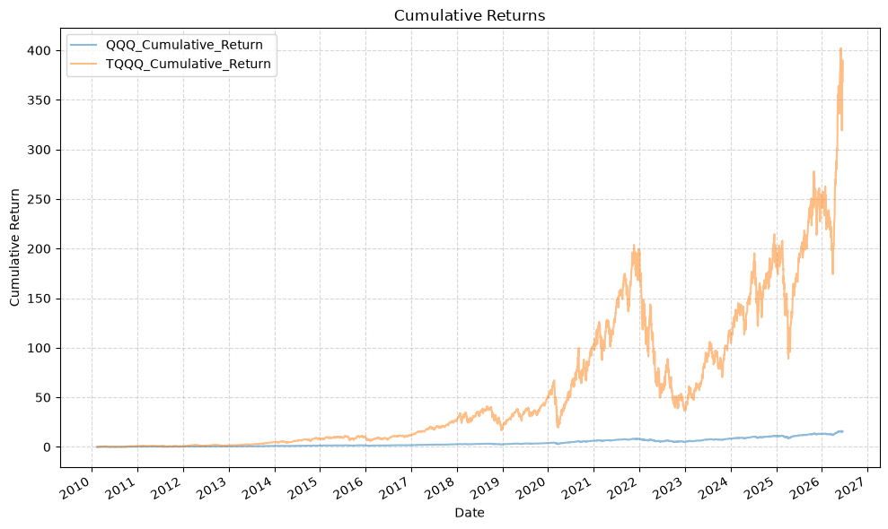
    


And the drawdown plot:


```python
plot_timeseries(
    df=qqq_tqqq_aligned,
    plot_start_date=None,
    plot_end_date=None,
    plot_columns=["QQQ_Drawdown", "TQQQ_Drawdown"],
    title="Drawdowns",
    x_label="Date",
    x_format="Year",
    x_tick_spacing=1,
    x_tick_rotation=30,
    y_label="Drawdown",
    y_format="Percentage",
    y_format_decimal_places=0,
    y_tick_spacing="Auto",
    y_tick_rotation=0,
    grid=True,
    legend=True,
    export_plot=False,
    plot_file_name=None,
)
```


    
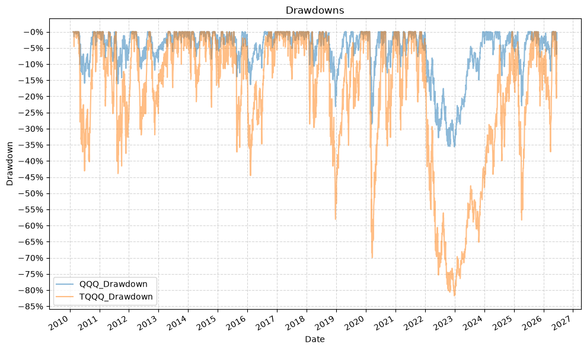
    


Here is where we truly see the volatility of TQQQ relative to QQQ. In the past 5 years, TQQQ has had drawdowns of 50%, 60%, 70%, and 80%. While it has recovered to make new highs (with the exception of the current ~25% drawdown as of mid-March 2026), very few investors can endure those drawdowns and continue to hold their position. At the same time, we can see from the plot that a ~35% drawdown in QQQ equated to a ~80% drawdown in TQQQ, which is not in fact, 3x. So this tells us (which we already knew) that there is dispersion in the long-term returns relative to the short-term returns between the non-leveraged QQQ and 3x leveraged TQQQ. This idea is well documented in the financial literature as "volatility decay" or "volatility drag". But, and this is the question we are trying to answer, how significant is this effect over various time horizons?

### Summary Statistics (QQQ & TQQQ)

Looking at the summary statistics further confirms our intuitions about the volatility and drawdowns.


```python
qqq_sum_stats = summary_stats(
    fund_list=["QQQ"],
    df=qqq_tqqq_aligned[["QQQ_Return"]],
    period="Daily",
    use_calendar_days=False,
    excel_export=False,
    pickle_export=False,
    output_confirmation=False,
)

tqqq_sum_stats = summary_stats(
    fund_list=["TQQQ"],
    df=qqq_tqqq_aligned[["TQQQ_Return"]],
    period="Daily",
    use_calendar_days=False,
    excel_export=False,
    pickle_export=False,
    output_confirmation=False,
)

sum_stats = pd.concat([qqq_sum_stats, tqqq_sum_stats])

display(sum_stats)
```


<div>
<style scoped>
    .dataframe tbody tr th:only-of-type {
        vertical-align: middle;
    }

    .dataframe tbody tr th {
        vertical-align: top;
    }

    .dataframe thead th {
        text-align: right;
    }
</style>
<table border="1" class="dataframe">
  <thead>
    <tr style="text-align: right;">
      <th></th>
      <th>Annual Mean Return (Arithmetic)</th>
      <th>Annualized Volatility</th>
      <th>Annualized Sharpe Ratio</th>
      <th>CAGR (Geometric)</th>
      <th>Daily Max Return</th>
      <th>Daily Max Return (Date)</th>
      <th>Daily Min Return</th>
      <th>Daily Min Return (Date)</th>
      <th>Max Drawdown</th>
      <th>Peak</th>
      <th>Trough</th>
      <th>Recovery Date</th>
      <th>Days to Recovery</th>
      <th>MAR Ratio</th>
    </tr>
  </thead>
  <tbody>
    <tr>
      <th>QQQ_Return</th>
      <td>0.183653</td>
      <td>0.205992</td>
      <td>0.891554</td>
      <td>0.176226</td>
      <td>0.120031</td>
      <td>2025-04-09</td>
      <td>-0.119788</td>
      <td>2020-03-16</td>
      <td>-0.356172</td>
      <td>2021-11-19</td>
      <td>2022-12-28</td>
      <td>2023-12-15</td>
      <td>352</td>
      <td>0.494777</td>
    </tr>
    <tr>
      <th>TQQQ_Return</th>
      <td>0.521148</td>
      <td>0.609570</td>
      <td>0.854944</td>
      <td>0.395260</td>
      <td>0.352442</td>
      <td>2025-04-09</td>
      <td>-0.344652</td>
      <td>2020-03-16</td>
      <td>-0.817545</td>
      <td>2021-11-19</td>
      <td>2022-12-28</td>
      <td>2024-12-11</td>
      <td>714</td>
      <td>0.483471</td>
    </tr>
  </tbody>
</table>
</div>


Note that these statistics are being run on the partially-adjusted close prices, which are not the true returns (due to not accounting for dividends), but they do give us a picture of the relative volatility and drawdowns of the two ETFs. The mean return for TQQQ is much higher than that of QQQ, but the volatility is also much higher, which is consistent with the idea of leverage amplifying both the up-side and down-side. The maximum drawdown for TQQQ is also much higher than that of QQQ, which again confirms our observations from the drawdown plot.

Also note that the daily maximum return for both funds occured during "Liberation Day" and the daily minimum return for both funds occured early on during the COVID-19 pandemic.

### Plot Returns & Verify Beta (QQQ & TQQQ)

Before we look at the rolling returns, let us first verify that the daily returns for TQQQ are in fact ~3x those of QQQ. We can do that by plotting the daily returns for both funds against each other and running a linear regression to see if the beta is indeed ~3.


```python
plot_scatter(
    df=qqq_tqqq_aligned,
    x_plot_column="QQQ_Return",
    y_plot_columns=["TQQQ_Return"],
    title="QQQ & TQQQ Returns",
    x_label="QQQ Return",
    x_format="Decimal",
    x_format_decimal_places=2,
    x_tick_spacing="Auto",
    x_tick_rotation=30,
    y_label="TQQQ Return",
    y_format="Decimal",
    y_format_decimal_places=2,
    y_tick_spacing="Auto",
    y_tick_rotation=0,
    plot_OLS_regression_line=True,
    OLS_column="TQQQ_Return",
    plot_Ridge_regression_line=False,
    Ridge_column=None,
    plot_RidgeCV_regression_line=True,
    RidgeCV_column="TQQQ_Return",
    regression_constant=True,
    grid=True,
    legend=True,
    export_plot=False,
    plot_file_name=None,
)
```


    
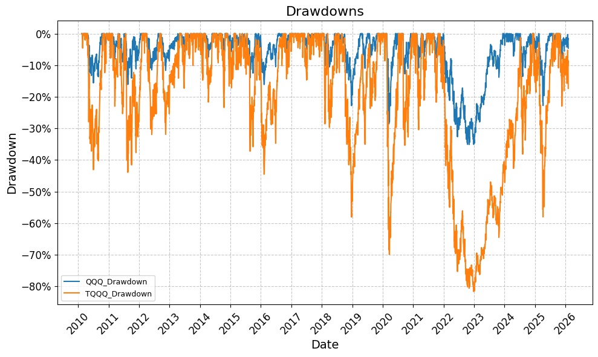
    


```python
model = run_linear_regression(
    df=qqq_tqqq_aligned,
    x_plot_column="QQQ_Return",
    y_plot_column="TQQQ_Return",
    regression_model="OLS-statsmodels",
    regression_constant=True,
)

print(model.summary())
```

                                OLS Regression Results                            
    ==============================================================================
    Dep. Variable:            TQQQ_Return   R-squared:                       0.997
    Model:                            OLS   Adj. R-squared:                  0.997
    Method:                 Least Squares   F-statistic:                 1.494e+06
    Date:                Fri, 20 Mar 2026   Prob (F-statistic):               0.00
    Time:                        10:48:10   Log-Likelihood:                 19426.
    No. Observations:                4049   AIC:                        -3.885e+04
    Df Residuals:                    4047   BIC:                        -3.884e+04
    Df Model:                           1                                         
    Covariance Type:            nonrobust                                         
    ==============================================================================
                     coef    std err          t      P>|t|      [0.025      0.975]
    ------------------------------------------------------------------------------
    const      -8.564e-05   3.14e-05     -2.726      0.006      -0.000    -2.4e-05
    QQQ_Return     2.9552      0.002   1222.164      0.000       2.950       2.960
    ==============================================================================
    Omnibus:                     5278.850   Durbin-Watson:                   2.567
    Prob(Omnibus):                  0.000   Jarque-Bera (JB):          9199117.408
    Skew:                          -6.347   Prob(JB):                         0.00
    Kurtosis:                     236.164   Cond. No.                         77.1
    ==============================================================================
    
    Notes:
    [1] Standard Errors assume that the covariance matrix of the errors is correctly specified.


Visually, this plot makes sense and we can see that there is a strong clustering of points, but we double check with the regression, regressing the TQQQ daily return (y) on the QQQ daily return (X).

Given the above result, with a coefficient of 2.96 and an R^2 of 0.997 (based on the statsmodels OLS regression), we can say that TQQQ does in fact return ~3x QQQ. We would also intuitively expect the coefficient to be 0, and it is nearly 0.

Interestingly, the coefficient varies between OLS and Ridge cross-validation, and both are less than 3.

### Extrapolate Data (QQQ & TQQQ)

With the above coefficient, we will now extrapolate the returns of QQQ to backfill the data from the inception of QQQ in 1999 to the inception of TQQQ in 2010 to expand our dataset of returns. For this, we'll use the coefficient of 2.96 that we found in the regression results above.


```python
# Set leverage multiplier based on regression coefficient
LEVERAGE_MULTIPLIER = model.params[1]

# Merge dataframes and extrapolate return values for QQQ back to 1999 using the leverage multiplier
qqq_tqqq_extrap = qqq[["QQQ_Close"]].merge(tqqq[["TQQQ_Close"]], left_index=True, right_index=True, how='left')

etfs = ["QQQ", "TQQQ"]

# Calculate cumulative returns
for etf in etfs:
    qqq_tqqq_extrap[f"{etf}_Return"] = qqq_tqqq_extrap[f"{etf}_Close"].pct_change()

# Extrapolate TQQQ returns for missing values
qqq_tqqq_extrap["TQQQ_Return"] = qqq_tqqq_extrap["TQQQ_Return"].fillna(LEVERAGE_MULTIPLIER * qqq_tqqq_extrap["QQQ_Return"])

# Find the first valid TQQQ_Close index and value
first_valid_idx = qqq_tqqq_extrap['TQQQ_Close'].first_valid_index()
print(first_valid_idx)
first_valid_price = qqq_tqqq_extrap.loc[first_valid_idx, 'TQQQ_Close']
print(first_valid_price)
```

    2010-02-11 00:00:00
    0.21627600491046906


Before we extrapolate, let's first look at the data we have for QQQ and TQQQ around the inception of TQQQ in 2010:


```python
# Check values around the first valid index
display(qqq_tqqq_extrap.loc["2010-02-08":"2010-02-13"])
```


<div>
<style scoped>
    .dataframe tbody tr th:only-of-type {
        vertical-align: middle;
    }

    .dataframe tbody tr th {
        vertical-align: top;
    }

    .dataframe thead th {
        text-align: right;
    }
</style>
<table border="1" class="dataframe">
  <thead>
    <tr style="text-align: right;">
      <th></th>
      <th>QQQ_Close</th>
      <th>TQQQ_Close</th>
      <th>QQQ_Return</th>
      <th>TQQQ_Return</th>
    </tr>
    <tr>
      <th>Date</th>
      <th></th>
      <th></th>
      <th></th>
      <th></th>
    </tr>
  </thead>
  <tbody>
    <tr>
      <th>2010-02-08</th>
      <td>42.669998</td>
      <td>NaN</td>
      <td>-0.007213</td>
      <td>-0.021315</td>
    </tr>
    <tr>
      <th>2010-02-09</th>
      <td>43.110001</td>
      <td>NaN</td>
      <td>0.010312</td>
      <td>0.030473</td>
    </tr>
    <tr>
      <th>2010-02-10</th>
      <td>43.020000</td>
      <td>NaN</td>
      <td>-0.002088</td>
      <td>-0.006170</td>
    </tr>
    <tr>
      <th>2010-02-11</th>
      <td>43.669998</td>
      <td>0.216276</td>
      <td>0.015109</td>
      <td>0.044651</td>
    </tr>
    <tr>
      <th>2010-02-12</th>
      <td>43.759998</td>
      <td>0.217161</td>
      <td>0.002061</td>
      <td>0.004092</td>
    </tr>
  </tbody>
</table>
</div>


Now, backfill the data for the TQQQ close price:


```python
# Iterate through the dataframe backwards
for i in range(qqq_tqqq_extrap.index.get_loc(first_valid_idx) - 1, -1, -1):
    
    # The return that led to the price the next day
    current_return = qqq_tqqq_extrap.iloc[i + 1]['TQQQ_Return']

    # Get the next day's price
    next_price = qqq_tqqq_extrap.iloc[i + 1]['TQQQ_Close']
    
    # Price_{t} = Price_{t+1} / (1 + Return_{t})
    qqq_tqqq_extrap.loc[qqq_tqqq_extrap.index[i], 'TQQQ_Close'] = next_price / (1 + current_return)
```

Finally, confirm the values are correct:


```python
# Confirm values around the first valid index after extrapolation
display(qqq_tqqq_extrap.loc["2010-02-08":"2010-02-13"])
```


<div>
<style scoped>
    .dataframe tbody tr th:only-of-type {
        vertical-align: middle;
    }

    .dataframe tbody tr th {
        vertical-align: top;
    }

    .dataframe thead th {
        text-align: right;
    }
</style>
<table border="1" class="dataframe">
  <thead>
    <tr style="text-align: right;">
      <th></th>
      <th>QQQ_Close</th>
      <th>TQQQ_Close</th>
      <th>QQQ_Return</th>
      <th>TQQQ_Return</th>
    </tr>
    <tr>
      <th>Date</th>
      <th></th>
      <th></th>
      <th></th>
      <th></th>
    </tr>
  </thead>
  <tbody>
    <tr>
      <th>2010-02-08</th>
      <td>42.669998</td>
      <td>0.202157</td>
      <td>-0.007213</td>
      <td>-0.021315</td>
    </tr>
    <tr>
      <th>2010-02-09</th>
      <td>43.110001</td>
      <td>0.208317</td>
      <td>0.010312</td>
      <td>0.030473</td>
    </tr>
    <tr>
      <th>2010-02-10</th>
      <td>43.020000</td>
      <td>0.207032</td>
      <td>-0.002088</td>
      <td>-0.006170</td>
    </tr>
    <tr>
      <th>2010-02-11</th>
      <td>43.669998</td>
      <td>0.216276</td>
      <td>0.015109</td>
      <td>0.044651</td>
    </tr>
    <tr>
      <th>2010-02-12</th>
      <td>43.759998</td>
      <td>0.217161</td>
      <td>0.002061</td>
      <td>0.004092</td>
    </tr>
  </tbody>
</table>
</div>


And the complete DataFrame with the extrapolated values:


```python
display(qqq_tqqq_extrap)
```


<div>
<style scoped>
    .dataframe tbody tr th:only-of-type {
        vertical-align: middle;
    }

    .dataframe tbody tr th {
        vertical-align: top;
    }

    .dataframe thead th {
        text-align: right;
    }
</style>
<table border="1" class="dataframe">
  <thead>
    <tr style="text-align: right;">
      <th></th>
      <th>QQQ_Close</th>
      <th>TQQQ_Close</th>
      <th>QQQ_Return</th>
      <th>TQQQ_Return</th>
    </tr>
    <tr>
      <th>Date</th>
      <th></th>
      <th></th>
      <th></th>
      <th></th>
    </tr>
  </thead>
  <tbody>
    <tr>
      <th>1999-03-10</th>
      <td>51.062500</td>
      <td>13.814763</td>
      <td>NaN</td>
      <td>NaN</td>
    </tr>
    <tr>
      <th>1999-03-11</th>
      <td>51.312500</td>
      <td>14.014642</td>
      <td>0.004896</td>
      <td>0.014468</td>
    </tr>
    <tr>
      <th>1999-03-12</th>
      <td>50.062500</td>
      <td>13.005728</td>
      <td>-0.024361</td>
      <td>-0.071990</td>
    </tr>
    <tr>
      <th>1999-03-15</th>
      <td>51.500000</td>
      <td>14.109337</td>
      <td>0.028714</td>
      <td>0.084856</td>
    </tr>
    <tr>
      <th>1999-03-16</th>
      <td>51.937500</td>
      <td>14.463549</td>
      <td>0.008495</td>
      <td>0.025105</td>
    </tr>
    <tr>
      <th>...</th>
      <td>...</td>
      <td>...</td>
      <td>...</td>
      <td>...</td>
    </tr>
    <tr>
      <th>2026-03-13</th>
      <td>593.719971</td>
      <td>45.930000</td>
      <td>-0.005927</td>
      <td>-0.019218</td>
    </tr>
    <tr>
      <th>2026-03-16</th>
      <td>600.380005</td>
      <td>47.459999</td>
      <td>0.011217</td>
      <td>0.033312</td>
    </tr>
    <tr>
      <th>2026-03-17</th>
      <td>603.309998</td>
      <td>48.160000</td>
      <td>0.004880</td>
      <td>0.014749</td>
    </tr>
    <tr>
      <th>2026-03-18</th>
      <td>594.900024</td>
      <td>46.099998</td>
      <td>-0.013940</td>
      <td>-0.042774</td>
    </tr>
    <tr>
      <th>2026-03-19</th>
      <td>593.020020</td>
      <td>45.689999</td>
      <td>-0.003160</td>
      <td>-0.008894</td>
    </tr>
  </tbody>
</table>
<p>6799 rows × 4 columns</p>
</div>


After the extrapolation, we now have the following plots for the prices, cumulative returns, and drawdowns:


```python
etfs = ["QQQ", "TQQQ"]

# Calculate cumulative returns
for etf in etfs:
    qqq_tqqq_extrap[f"{etf}_Return"] = qqq_tqqq_extrap[f"{etf}_Close"].pct_change()
    qqq_tqqq_extrap[f"{etf}_Cumulative_Return"] = (1 + qqq_tqqq_extrap[f"{etf}_Return"]).cumprod() - 1
    qqq_tqqq_extrap[f"{etf}_Cumulative_Return_Plus_One"] = 1 + qqq_tqqq_extrap[f"{etf}_Cumulative_Return"]
    qqq_tqqq_extrap[f"{etf}_Rolling_Max"] = qqq_tqqq_extrap[f"{etf}_Cumulative_Return_Plus_One"].cummax()
    qqq_tqqq_extrap[f"{etf}_Drawdown"] = qqq_tqqq_extrap[f"{etf}_Cumulative_Return_Plus_One"] / qqq_tqqq_extrap[f"{etf}_Rolling_Max"] - 1
    qqq_tqqq_extrap.drop(columns=[f"{etf}_Cumulative_Return_Plus_One", f"{etf}_Rolling_Max"], inplace=True)
```


```python
plot_timeseries(
    df=qqq_tqqq_extrap,
    plot_start_date=None,
    plot_end_date=None,
    plot_columns=["QQQ_Close"],
    title="QQQ Close Price",
    x_label="Date",
    x_format="Year",
    x_tick_spacing=2,
    x_tick_rotation=30,
    y_label="Price ($)",
    y_format="Decimal",
    y_format_decimal_places=0,
    y_tick_spacing="Auto",
    y_tick_rotation=0,
    grid=True,
    legend=False,
    export_plot=False,
    plot_file_name=None,
)
```


    
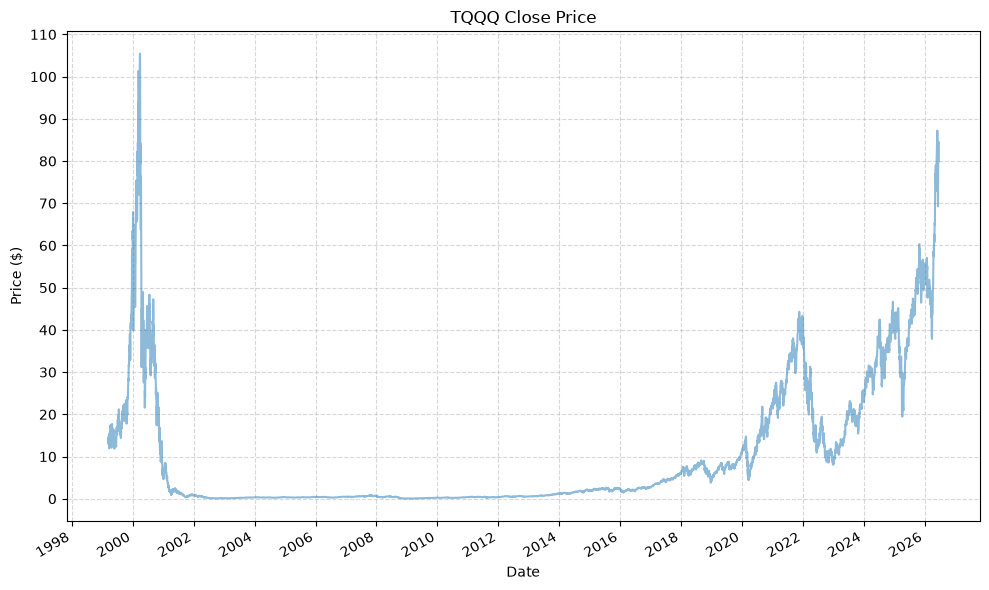
    


```python
plot_timeseries(
    df=qqq_tqqq_extrap,
    plot_start_date=None,
    plot_end_date=None,
    plot_columns=["TQQQ_Close"],
    title="TQQQ Close Price",
    x_label="Date",
    x_format="Year",
    x_tick_spacing=2,
    x_tick_rotation=30,
    y_label="Price ($)",
    y_format="Decimal",
    y_format_decimal_places=0,
    y_tick_spacing="Auto",
    y_tick_rotation=0,
    grid=True,
    legend=False,
    export_plot=False,
    plot_file_name=None,
)
```


    
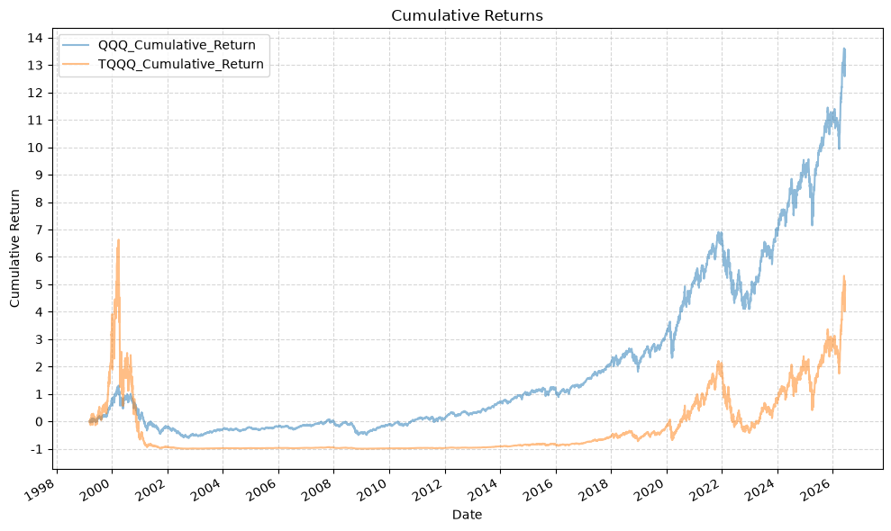
    


```python
plot_timeseries(
    df=qqq_tqqq_extrap,
    plot_start_date=None,
    plot_end_date=None,
    plot_columns=["QQQ_Cumulative_Return", "TQQQ_Cumulative_Return"],
    title="Cumulative Returns",
    x_label="Date",
    x_format="Year",
    x_tick_spacing=2,
    x_tick_rotation=30,
    y_label="Cumulative Return",
    y_format="Decimal",
    y_format_decimal_places=0,
    y_tick_spacing="Auto",
    y_tick_rotation=0,
    grid=True,
    legend=True,
    export_plot=False,
    plot_file_name=None,
)
```


    
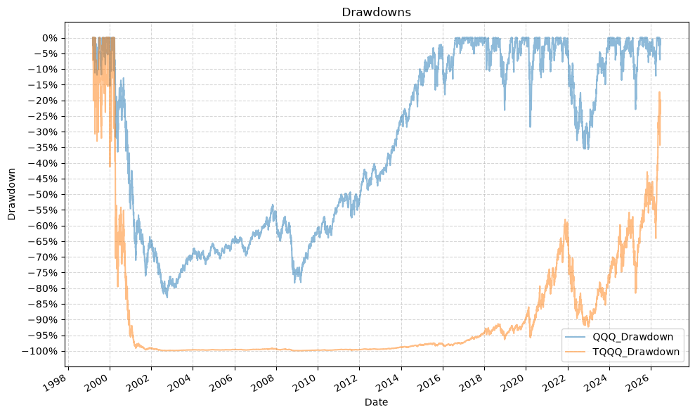
    


```python
plot_timeseries(
    df=qqq_tqqq_extrap,
    plot_start_date=None,
    plot_end_date=None,
    plot_columns=["QQQ_Drawdown", "TQQQ_Drawdown"],
    title="Drawdowns",
    x_label="Date",
    x_format="Year",
    x_tick_spacing=2,
    x_tick_rotation=30,
    y_label="Drawdown",
    y_format="Percentage",
    y_format_decimal_places=0,
    y_tick_spacing="Auto",
    y_tick_rotation=0,
    grid=True,
    legend=True,
    export_plot=False,
    plot_file_name=None,
)
```


    

    


```python
qqq_extrap_sum_stats = summary_stats(
    fund_list=["QQQ"],
    df=qqq_tqqq_extrap[["QQQ_Return"]],
    period="Daily",
    use_calendar_days=False,
    excel_export=False,
    pickle_export=False,
    output_confirmation=False,
)

tqqq_extrap_sum_stats = summary_stats(
    fund_list=["TQQQ"],
    df=qqq_tqqq_extrap[["TQQQ_Return"]],
    period="Daily",
    use_calendar_days=False,
    excel_export=False,
    pickle_export=False,
    output_confirmation=False,
)

sum_stats = pd.concat([qqq_sum_stats, tqqq_sum_stats, qqq_extrap_sum_stats, tqqq_extrap_sum_stats])
sum_stats.index = ["QQQ (2010 - Present)", "TQQQ (2010 - Present)", "QQQ (1999 - Present)", "TQQQ Extrapolated (1999 - Present)"]

display(sum_stats)
```


<div>
<style scoped>
    .dataframe tbody tr th:only-of-type {
        vertical-align: middle;
    }

    .dataframe tbody tr th {
        vertical-align: top;
    }

    .dataframe thead th {
        text-align: right;
    }
</style>
<table border="1" class="dataframe">
  <thead>
    <tr style="text-align: right;">
      <th></th>
      <th>Annual Mean Return (Arithmetic)</th>
      <th>Annualized Volatility</th>
      <th>Annualized Sharpe Ratio</th>
      <th>CAGR (Geometric)</th>
      <th>Daily Max Return</th>
      <th>Daily Max Return (Date)</th>
      <th>Daily Min Return</th>
      <th>Daily Min Return (Date)</th>
      <th>Max Drawdown</th>
      <th>Peak</th>
      <th>Trough</th>
      <th>Recovery Date</th>
      <th>Days to Recovery</th>
      <th>MAR Ratio</th>
    </tr>
  </thead>
  <tbody>
    <tr>
      <th>QQQ (2010 - Present)</th>
      <td>0.183653</td>
      <td>0.205992</td>
      <td>0.891554</td>
      <td>0.176226</td>
      <td>0.120031</td>
      <td>2025-04-09</td>
      <td>-0.119788</td>
      <td>2020-03-16</td>
      <td>-0.356172</td>
      <td>2021-11-19</td>
      <td>2022-12-28</td>
      <td>2023-12-15</td>
      <td>352.0</td>
      <td>0.494777</td>
    </tr>
    <tr>
      <th>TQQQ (2010 - Present)</th>
      <td>0.521148</td>
      <td>0.609570</td>
      <td>0.854944</td>
      <td>0.395260</td>
      <td>0.352442</td>
      <td>2025-04-09</td>
      <td>-0.344652</td>
      <td>2020-03-16</td>
      <td>-0.817545</td>
      <td>2021-11-19</td>
      <td>2022-12-28</td>
      <td>2024-12-11</td>
      <td>714.0</td>
      <td>0.483471</td>
    </tr>
    <tr>
      <th>QQQ (1999 - Present)</th>
      <td>0.127243</td>
      <td>0.269798</td>
      <td>0.471621</td>
      <td>0.095147</td>
      <td>0.168421</td>
      <td>2001-01-03</td>
      <td>-0.119788</td>
      <td>2020-03-16</td>
      <td>-0.829639</td>
      <td>2000-03-27</td>
      <td>2002-10-09</td>
      <td>2016-09-06</td>
      <td>5081.0</td>
      <td>0.114684</td>
    </tr>
    <tr>
      <th>TQQQ Extrapolated (1999 - Present)</th>
      <td>0.363172</td>
      <td>0.797669</td>
      <td>0.455291</td>
      <td>0.045332</td>
      <td>0.497716</td>
      <td>2001-01-03</td>
      <td>-0.344652</td>
      <td>2020-03-16</td>
      <td>-0.999508</td>
      <td>2000-03-27</td>
      <td>2009-03-09</td>
      <td>NaT</td>
      <td>NaN</td>
      <td>0.045354</td>
    </tr>
  </tbody>
</table>
</div>


Some quick comments before we look at rolling returns.

* The cumulative return for TQQQ is *less* than that of QQQ - which is starkly different from the plot beginning in 2010 at the inception of TQQQ. So the return path really matters here.
* The drawdown is nearly 100%... which also represents nearly a total loss of capital for any allocation to the extrap-TQQQ. Furthermore, as we walk forward through time (2002, 2003, ... etc.), there is really no reason to believe that the returns would ever recover (even partially). So while we can look at the rolling returns and see how they compare to the 3x return of QQQ, we should keep in mind that the drawdown post-1999 is so severe that it would be very difficult for any investor to hold through it.

### Plot Rolling Returns (QQQ & TQQQ)

Next, we will consider the following:

* Histogram and scatter plots of the rolling returns of QQQ and TQQQ
* Regressions to establish a "leverage factor" for the rolling returns
* The deviation from a 3x return for each time period

For this set of regressions, we will also allow the constant. First, we need the rolling returns for various time periods:


```python
# Define rolling windows in trading days
rolling_windows = {
    '1d': 1,      # 1 day
    '1w': 5,      # 1 week (5 trading days)
    '1m': 21,     # 1 month (~21 trading days)
    '3m': 63,     # 3 months (~63 trading days)
    '6m': 126,    # 6 months (~126 trading days)
    '1y': 252,    # 1 year (~252 trading days)
    '2y': 504,    # 2 years (~504 trading days)
    '3y': 756,    # 3 years (~756 trading days)
    '4y': 1008,   # 4 years (~1008 trading days)
    '5y': 1260,   # 5 years (~1260 trading days)
}

# Calculate rolling returns for each ETF and each window
for etf in etfs:
    for period_name, window in rolling_windows.items():
        qqq_tqqq_extrap[f"{etf}_Rolling_Return_{period_name}"] = (
            qqq_tqqq_extrap[f"{etf}_Close"].pct_change(periods=window)
        )
```

This gives us the following series of histograms, scatter plots, and regression model results:


```python
# Create a dataframe to hold rolling returns stats
rolling_returns_stats = pd.DataFrame()

for period_name, window in rolling_windows.items():
    plot_histogram(
        df=qqq_tqqq_extrap,
        plot_columns=[f"QQQ_Rolling_Return_{period_name}", f"TQQQ_Rolling_Return_{period_name}"],
        title=f"QQQ & TQQQ {period_name} Rolling Returns",
        x_label="Rolling Return",
        x_tick_spacing="Auto",
        x_tick_rotation=30,
        y_label="# Of Datapoints",
        y_tick_spacing="Auto",
        y_tick_rotation=0,
        grid=True,
        legend=True,
        export_plot=False,
        plot_file_name=None,
    )

    plot_scatter(
        df=qqq_tqqq_extrap,
        x_plot_column=f"QQQ_Rolling_Return_{period_name}",
        y_plot_columns=[f"TQQQ_Rolling_Return_{period_name}"],
        title=f"QQQ & TQQQ {period_name} Rolling Returns",
        x_label="QQQ Rolling Return",
        x_format="Decimal",
        x_format_decimal_places=2,
        x_tick_spacing="Auto",
        x_tick_rotation=30,
        y_label="TQQQ Rolling Return",
        y_format="Decimal",
        y_format_decimal_places=2,
        y_tick_spacing="Auto",
        y_tick_rotation=0,
        plot_OLS_regression_line=True,
        OLS_column=f"TQQQ_Rolling_Return_{period_name}",
        plot_Ridge_regression_line=False,
        Ridge_column=None,
        plot_RidgeCV_regression_line=True,
        RidgeCV_column=f"TQQQ_Rolling_Return_{period_name}",
        regression_constant=True,
        grid=True,
        legend=True,
        export_plot=False,
        plot_file_name=None,
    )

    # Run OLS regression with statsmodels
    model = run_linear_regression(
        df=qqq_tqqq_extrap,
        x_plot_column=f"QQQ_Rolling_Return_{period_name}",
        y_plot_column=f"TQQQ_Rolling_Return_{period_name}",
        regression_model="OLS-statsmodels",
        regression_constant=True,
    )
    print(model.summary())

    # Add the regression results to the rolling returns stats dataframe
    intercept = model.params[0]
    intercept_pvalue = model.pvalues[0]   # p-value for Intercept
    slope = model.params[1]
    slope_pvalue = model.pvalues[1]       # p-value for QQQ_Return
    r_squared = model.rsquared

    # Calc skew
    return_ratio = qqq_tqqq_extrap[f'TQQQ_Rolling_Return_{period_name}'] / qqq_tqqq_extrap[f'QQQ_Rolling_Return_{period_name}']
    skew = return_ratio.skew()

    # Calc conditional symmetry
    up_markets = qqq_tqqq_extrap[qqq_tqqq_extrap[f'QQQ_Rolling_Return_{period_name}'] > 0]
    down_markets = qqq_tqqq_extrap[qqq_tqqq_extrap[f'QQQ_Rolling_Return_{period_name}'] <= 0]

    avg_beta_up = (up_markets[f'TQQQ_Rolling_Return_{period_name}'] / up_markets[f'QQQ_Rolling_Return_{period_name}']).mean()
    avg_beta_down = (down_markets[f'TQQQ_Rolling_Return_{period_name}'] / down_markets[f'QQQ_Rolling_Return_{period_name}']).mean()

    asymmetry = avg_beta_up - avg_beta_down

    rolling_returns_slope_int = pd.DataFrame({
        "Period": period_name,
        "Intercept": [intercept],
        # "Intercept_PValue": [intercept_pvalue],
        "Slope": [slope],
        # "Slope_PValue": [slope_pvalue],
        "R_Squared": [r_squared],
        "Skew": [skew],
        "Average Upside Beta": [avg_beta_up],
        "Average Downside Beta": [avg_beta_down],
        "Asymmetry": [asymmetry]
    })

    rolling_returns_stats = pd.concat([rolling_returns_stats, rolling_returns_slope_int])
```


    
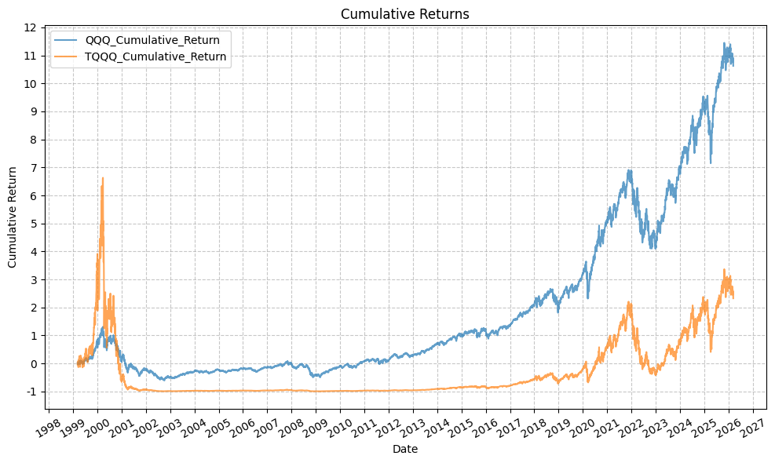
    


    

    


                                  OLS Regression Results                              
    ==================================================================================
    Dep. Variable:     TQQQ_Rolling_Return_1d   R-squared:                       0.999
    Model:                                OLS   Adj. R-squared:                  0.999
    Method:                     Least Squares   F-statistic:                 7.219e+06
    Date:                    Fri, 20 Mar 2026   Prob (F-statistic):               0.00
    Time:                            10:48:13   Log-Likelihood:                 34374.
    No. Observations:                    6798   AIC:                        -6.874e+04
    Df Residuals:                        6796   BIC:                        -6.873e+04
    Df Model:                               1                                         
    Covariance Type:                nonrobust                                         
    =========================================================================================
                                coef    std err          t      P>|t|      [0.025      0.975]
    -----------------------------------------------------------------------------------------
    const                 -5.099e-05   1.87e-05     -2.727      0.006   -8.76e-05   -1.43e-05
    QQQ_Rolling_Return_1d     2.9551      0.001   2686.884      0.000       2.953       2.957
    ==============================================================================
    Omnibus:                    10195.883   Durbin-Watson:                   2.565
    Prob(Omnibus):                  0.000   Jarque-Bera (JB):         43955658.407
    Skew:                          -8.281   Prob(JB):                         0.00
    Kurtosis:                     396.585   Cond. No.                         58.8
    ==============================================================================
    
    Notes:
    [1] Standard Errors assume that the covariance matrix of the errors is correctly specified.


    

    


    

    


                                  OLS Regression Results                              
    ==================================================================================
    Dep. Variable:     TQQQ_Rolling_Return_1w   R-squared:                       0.994
    Model:                                OLS   Adj. R-squared:                  0.994
    Method:                     Least Squares   F-statistic:                 1.117e+06
    Date:                    Fri, 20 Mar 2026   Prob (F-statistic):               0.00
    Time:                            10:48:14   Log-Likelihood:                 23168.
    No. Observations:                    6794   AIC:                        -4.633e+04
    Df Residuals:                        6792   BIC:                        -4.632e+04
    Df Model:                               1                                         
    Covariance Type:                nonrobust                                         
    =========================================================================================
                                coef    std err          t      P>|t|      [0.025      0.975]
    -----------------------------------------------------------------------------------------
    const                    -0.0008   9.72e-05     -8.352      0.000      -0.001      -0.001
    QQQ_Rolling_Return_1w     2.9524      0.003   1056.694      0.000       2.947       2.958
    ==============================================================================
    Omnibus:                     2840.367   Durbin-Watson:                   0.932
    Prob(Omnibus):                  0.000   Jarque-Bera (JB):           564836.499
    Skew:                          -0.863   Prob(JB):                         0.00
    Kurtosis:                      47.635   Cond. No.                         28.8
    ==============================================================================
    
    Notes:
    [1] Standard Errors assume that the covariance matrix of the errors is correctly specified.


    

    


    

    


                                  OLS Regression Results                              
    ==================================================================================
    Dep. Variable:     TQQQ_Rolling_Return_1m   R-squared:                       0.982
    Model:                                OLS   Adj. R-squared:                  0.982
    Method:                     Least Squares   F-statistic:                 3.697e+05
    Date:                    Fri, 20 Mar 2026   Prob (F-statistic):               0.00
    Time:                            10:48:15   Log-Likelihood:                 14862.
    No. Observations:                    6778   AIC:                        -2.972e+04
    Df Residuals:                        6776   BIC:                        -2.971e+04
    Df Model:                               1                                         
    Covariance Type:                nonrobust                                         
    =========================================================================================
                                coef    std err          t      P>|t|      [0.025      0.975]
    -----------------------------------------------------------------------------------------
    const                    -0.0037      0.000    -11.090      0.000      -0.004      -0.003
    QQQ_Rolling_Return_1m     2.9306      0.005    608.020      0.000       2.921       2.940
    ==============================================================================
    Omnibus:                     1629.563   Durbin-Watson:                   0.296
    Prob(Omnibus):                  0.000   Jarque-Bera (JB):            69136.389
    Skew:                           0.358   Prob(JB):                         0.00
    Kurtosis:                      18.630   Cond. No.                         14.7
    ==============================================================================
    
    Notes:
    [1] Standard Errors assume that the covariance matrix of the errors is correctly specified.


    

    


    

    


                                  OLS Regression Results                              
    ==================================================================================
    Dep. Variable:     TQQQ_Rolling_Return_3m   R-squared:                       0.958
    Model:                                OLS   Adj. R-squared:                  0.958
    Method:                     Least Squares   F-statistic:                 1.550e+05
    Date:                    Fri, 20 Mar 2026   Prob (F-statistic):               0.00
    Time:                            10:48:16   Log-Likelihood:                 7952.3
    No. Observations:                    6736   AIC:                        -1.590e+04
    Df Residuals:                        6734   BIC:                        -1.589e+04
    Df Model:                               1                                         
    Covariance Type:                nonrobust                                         
    =========================================================================================
                                coef    std err          t      P>|t|      [0.025      0.975]
    -----------------------------------------------------------------------------------------
    const                    -0.0083      0.001     -8.866      0.000      -0.010      -0.006
    QQQ_Rolling_Return_3m     2.9849      0.008    393.761      0.000       2.970       3.000
    ==============================================================================
    Omnibus:                     3465.471   Durbin-Watson:                   0.105
    Prob(Omnibus):                  0.000   Jarque-Bera (JB):            79666.067
    Skew:                           1.963   Prob(JB):                         0.00
    Kurtosis:                      19.384   Cond. No.                         8.38
    ==============================================================================
    
    Notes:
    [1] Standard Errors assume that the covariance matrix of the errors is correctly specified.


    
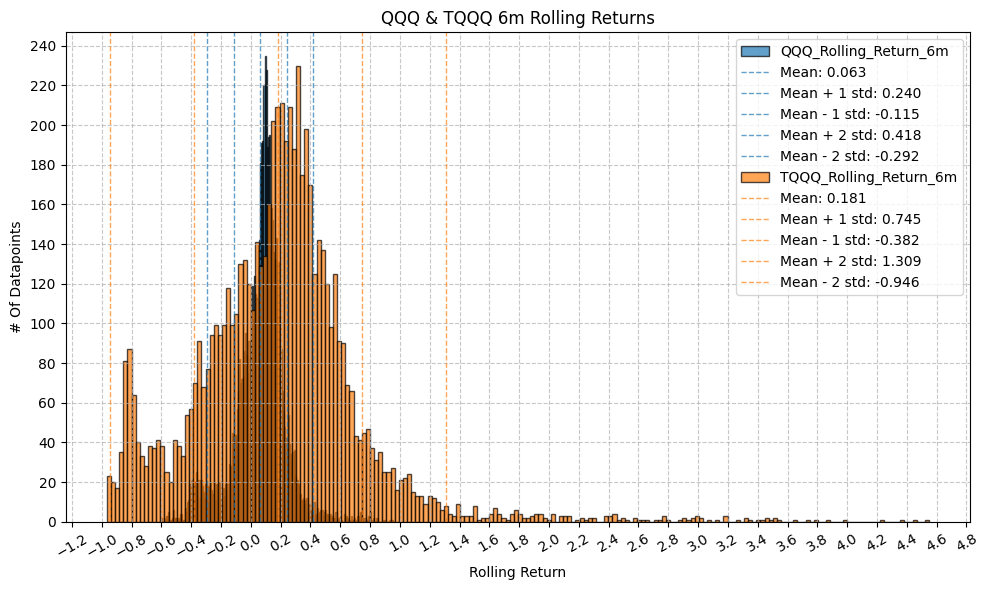
    


    
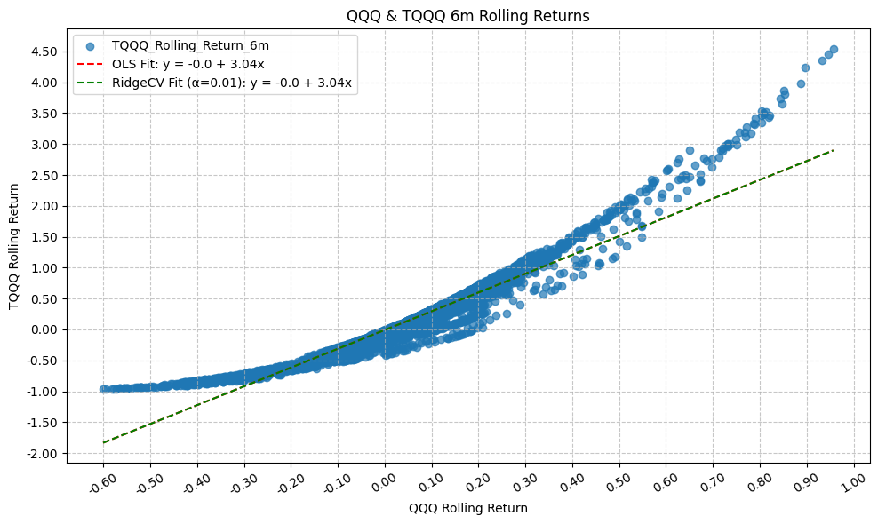
    


                                  OLS Regression Results                              
    ==================================================================================
    Dep. Variable:     TQQQ_Rolling_Return_6m   R-squared:                       0.916
    Model:                                OLS   Adj. R-squared:                  0.916
    Method:                     Least Squares   F-statistic:                 7.251e+04
    Date:                    Fri, 20 Mar 2026   Prob (F-statistic):               0.00
    Time:                            10:48:17   Log-Likelihood:                 2613.2
    No. Observations:                    6673   AIC:                            -5222.
    Df Residuals:                        6671   BIC:                            -5209.
    Df Model:                               1                                         
    Covariance Type:                nonrobust                                         
    =========================================================================================
                                coef    std err          t      P>|t|      [0.025      0.975]
    -----------------------------------------------------------------------------------------
    const                    -0.0097      0.002     -4.542      0.000      -0.014      -0.005
    QQQ_Rolling_Return_6m     3.0397      0.011    269.277      0.000       3.018       3.062
    ==============================================================================
    Omnibus:                     3657.998   Durbin-Watson:                   0.056
    Prob(Omnibus):                  0.000   Jarque-Bera (JB):            60190.456
    Skew:                           2.263   Prob(JB):                         0.00
    Kurtosis:                      17.000   Cond. No.                         5.66
    ==============================================================================
    
    Notes:
    [1] Standard Errors assume that the covariance matrix of the errors is correctly specified.


    

    


    

    


                                  OLS Regression Results                              
    ==================================================================================
    Dep. Variable:     TQQQ_Rolling_Return_1y   R-squared:                       0.880
    Model:                                OLS   Adj. R-squared:                  0.880
    Method:                     Least Squares   F-statistic:                 4.786e+04
    Date:                    Fri, 20 Mar 2026   Prob (F-statistic):               0.00
    Time:                            10:48:18   Log-Likelihood:                -892.22
    No. Observations:                    6547   AIC:                             1788.
    Df Residuals:                        6545   BIC:                             1802.
    Df Model:                               1                                         
    Covariance Type:                nonrobust                                         
    =========================================================================================
                                coef    std err          t      P>|t|      [0.025      0.975]
    -----------------------------------------------------------------------------------------
    const                     0.0190      0.004      5.011      0.000       0.012       0.026
    QQQ_Rolling_Return_1y     2.8373      0.013    218.776      0.000       2.812       2.863
    ==============================================================================
    Omnibus:                     3496.697   Durbin-Watson:                   0.037
    Prob(Omnibus):                  0.000   Jarque-Bera (JB):            68242.975
    Skew:                           2.124   Prob(JB):                         0.00
    Kurtosis:                      18.236   Cond. No.                         3.85
    ==============================================================================
    
    Notes:
    [1] Standard Errors assume that the covariance matrix of the errors is correctly specified.


    

    


    

    


                                  OLS Regression Results                              
    ==================================================================================
    Dep. Variable:     TQQQ_Rolling_Return_2y   R-squared:                       0.848
    Model:                                OLS   Adj. R-squared:                  0.848
    Method:                     Least Squares   F-statistic:                 3.521e+04
    Date:                    Fri, 20 Mar 2026   Prob (F-statistic):               0.00
    Time:                            10:48:20   Log-Likelihood:                -4424.9
    No. Observations:                    6295   AIC:                             8854.
    Df Residuals:                        6293   BIC:                             8867.
    Df Model:                               1                                         
    Covariance Type:                nonrobust                                         
    =========================================================================================
                                coef    std err          t      P>|t|      [0.025      0.975]
    -----------------------------------------------------------------------------------------
    const                     0.0093      0.007      1.254      0.210      -0.005       0.024
    QQQ_Rolling_Return_2y     3.1311      0.017    187.642      0.000       3.098       3.164
    ==============================================================================
    Omnibus:                     1595.851   Durbin-Watson:                   0.019
    Prob(Omnibus):                  0.000   Jarque-Bera (JB):             4145.777
    Skew:                           1.367   Prob(JB):                         0.00
    Kurtosis:                       5.886   Cond. No.                         2.89
    ==============================================================================
    
    Notes:
    [1] Standard Errors assume that the covariance matrix of the errors is correctly specified.


    
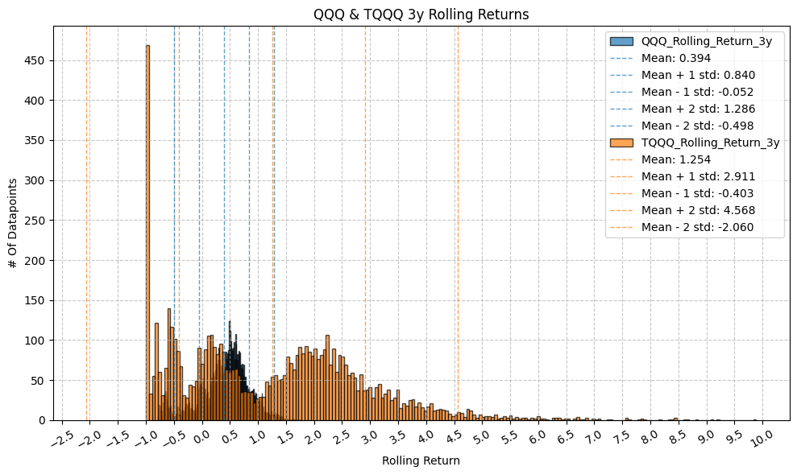
    


    

    


                                  OLS Regression Results                              
    ==================================================================================
    Dep. Variable:     TQQQ_Rolling_Return_3y   R-squared:                       0.805
    Model:                                OLS   Adj. R-squared:                  0.804
    Method:                     Least Squares   F-statistic:                 2.486e+04
    Date:                    Fri, 20 Mar 2026   Prob (F-statistic):               0.00
    Time:                            10:48:21   Log-Likelihood:                -6694.0
    No. Observations:                    6043   AIC:                         1.339e+04
    Df Residuals:                        6041   BIC:                         1.341e+04
    Df Model:                               1                                         
    Covariance Type:                nonrobust                                         
    =========================================================================================
                                coef    std err          t      P>|t|      [0.025      0.975]
    -----------------------------------------------------------------------------------------
    const                    -0.0599      0.013     -4.763      0.000      -0.085      -0.035
    QQQ_Rolling_Return_3y     3.3319      0.021    157.674      0.000       3.291       3.373
    ==============================================================================
    Omnibus:                      857.332   Durbin-Watson:                   0.015
    Prob(Omnibus):                  0.000   Jarque-Bera (JB):             1471.003
    Skew:                           0.940   Prob(JB):                         0.00
    Kurtosis:                       4.520   Cond. No.                         2.66
    ==============================================================================
    
    Notes:
    [1] Standard Errors assume that the covariance matrix of the errors is correctly specified.


    

    


    

    


                                  OLS Regression Results                              
    ==================================================================================
    Dep. Variable:     TQQQ_Rolling_Return_4y   R-squared:                       0.781
    Model:                                OLS   Adj. R-squared:                  0.781
    Method:                     Least Squares   F-statistic:                 2.065e+04
    Date:                    Fri, 20 Mar 2026   Prob (F-statistic):               0.00
    Time:                            10:48:22   Log-Likelihood:                -8791.8
    No. Observations:                    5791   AIC:                         1.759e+04
    Df Residuals:                        5789   BIC:                         1.760e+04
    Df Model:                               1                                         
    Covariance Type:                nonrobust                                         
    =========================================================================================
                                coef    std err          t      P>|t|      [0.025      0.975]
    -----------------------------------------------------------------------------------------
    const                    -0.2928      0.021    -13.690      0.000      -0.335      -0.251
    QQQ_Rolling_Return_4y     3.9332      0.027    143.685      0.000       3.880       3.987
    ==============================================================================
    Omnibus:                      199.708   Durbin-Watson:                   0.010
    Prob(Omnibus):                  0.000   Jarque-Bera (JB):              104.116
    Skew:                           0.140   Prob(JB):                     2.46e-23
    Kurtosis:                       2.406   Cond. No.                         2.66
    ==============================================================================
    
    Notes:
    [1] Standard Errors assume that the covariance matrix of the errors is correctly specified.


    

    


    

    


                                  OLS Regression Results                              
    ==================================================================================
    Dep. Variable:     TQQQ_Rolling_Return_5y   R-squared:                       0.743
    Model:                                OLS   Adj. R-squared:                  0.743
    Method:                     Least Squares   F-statistic:                 1.598e+04
    Date:                    Fri, 20 Mar 2026   Prob (F-statistic):               0.00
    Time:                            10:48:23   Log-Likelihood:                -12081.
    No. Observations:                    5539   AIC:                         2.417e+04
    Df Residuals:                        5537   BIC:                         2.418e+04
    Df Model:                               1                                         
    Covariance Type:                nonrobust                                         
    =========================================================================================
                                coef    std err          t      P>|t|      [0.025      0.975]
    -----------------------------------------------------------------------------------------
    const                    -0.8870      0.044    -19.962      0.000      -0.974      -0.800
    QQQ_Rolling_Return_5y     5.2051      0.041    126.429      0.000       5.124       5.286
    ==============================================================================
    Omnibus:                      314.921   Durbin-Watson:                   0.009
    Prob(Omnibus):                  0.000   Jarque-Bera (JB):              460.335
    Skew:                           0.499   Prob(JB):                    1.10e-100
    Kurtosis:                       4.000   Cond. No.                         2.73
    ==============================================================================
    
    Notes:
    [1] Standard Errors assume that the covariance matrix of the errors is correctly specified.


You're welcome to digest each plot, but here's my observations on the above results:

* 1d: TQQQ tracks QQQ as expected (it's a 3x daily return leveraged ETF after all), with a regression coefficient of 2.96 and an R^2 of 0.997, and we extrapolated half the data with the same coefficient.
* 1w: Essentially the same as above. A few outliers, but the regression coefficient is still 2.95 with an R^2 of 0.994. We see a slight skew toward the positive in the rolling returns.
* 1m: The skew toward the positive is more pronounced, and we see more outliers. The regression coefficient has decreased to 2.93 and the R^2 has dropped to 0.98, which is still very high, but we are starting to see some dispersion in the returns.
* 3m: The skew toward the positive is even more pronounced, and we see even more outliers. The regression coefficient has *increased*, to 2.98 and the R^2 has dropped to 0.96.
* 6m: The skew toward the positive is very pronounced, and we see a significant number of outliers with pronounced curvanture in the plot. The regression coefficient has increased again, to 3.4 and the R^2 has dropped to 0.92.
* 1y: At this point, based on the plot and the regression results, we can start to see that the returns of TQQQ are no longer tracking 3x the returns of QQQ as closely as they did in the shorter time periods. The regression coefficient has is now 2.84 and the R^2 has dropped to 0.88.
* 4y and 5y: We can see that there are periods where the rolling returns of TQQQ are significantly higher *and* lower than 3x the returns of QQQ, which is consistent with the idea of volatility decay.

For 4y, based on the regression results, we see that if the rolling return of QQQ was 0, then we would expect a return of -0.30 for TQQQ.


$$
r_{TQQQ} = -0.30 + 3.93 \times r_{QQQ} = -0.30 + 3.93 \times 0 = -0.30
$$

On the other end of the spectrum, if the rolling return of QQQ was 1, then we would expect a return of:

$$
r_{TQQQ} = -0.30 + 3.93 \times r_{QQQ} = -0.30 + 3.93 \times 1 = 3.63
$$

In general, the positive skew of the rolling returns of TQQQ relative to QQQ is related to the general postive return performance of QQQ. With sustained positive returns, the leverage effect of TQQQ will amplify those returns, leading to a positive skew. However, during periods of negative returns for QQQ, the leverage effect will also amplify those losses, leading to a negative skew, and to the limit of cumulative return of -1, or a 100% loss. The overall skewness of the rolling returns will depend on the balance of these positive and negative periods.

### Rolling Returns Deviation (QQQ & TQQQ)

Next, we will the rolling returns deviation from the expected 3x return for each time period. This will give us a better picture of the volatility decay effect and how it changes over different time horizons.


```python
rolling_returns_stats["Return_Deviation_From_3x"] = rolling_returns_stats["Slope"] - 3.0
display(rolling_returns_stats)
```


<div>
<style scoped>
    .dataframe tbody tr th:only-of-type {
        vertical-align: middle;
    }

    .dataframe tbody tr th {
        vertical-align: top;
    }

    .dataframe thead th {
        text-align: right;
    }
</style>
<table border="1" class="dataframe">
  <thead>
    <tr style="text-align: right;">
      <th></th>
      <th>Period</th>
      <th>Intercept</th>
      <th>Slope</th>
      <th>R_Squared</th>
      <th>Skew</th>
      <th>Average Upside Beta</th>
      <th>Average Downside Beta</th>
      <th>Asymmetry</th>
      <th>Return_Deviation_From_3x</th>
    </tr>
  </thead>
  <tbody>
    <tr>
      <th>0</th>
      <td>1d</td>
      <td>-0.000051</td>
      <td>2.955150</td>
      <td>0.999060</td>
      <td>NaN</td>
      <td>2.956873</td>
      <td>NaN</td>
      <td>NaN</td>
      <td>-0.044850</td>
    </tr>
    <tr>
      <th>0</th>
      <td>1w</td>
      <td>-0.000812</td>
      <td>2.952417</td>
      <td>0.993954</td>
      <td>NaN</td>
      <td>2.552546</td>
      <td>NaN</td>
      <td>NaN</td>
      <td>-0.047583</td>
    </tr>
    <tr>
      <th>0</th>
      <td>1m</td>
      <td>-0.003678</td>
      <td>2.930575</td>
      <td>0.982001</td>
      <td>NaN</td>
      <td>2.207696</td>
      <td>NaN</td>
      <td>NaN</td>
      <td>-0.069425</td>
    </tr>
    <tr>
      <th>0</th>
      <td>3m</td>
      <td>-0.008287</td>
      <td>2.984886</td>
      <td>0.958376</td>
      <td>NaN</td>
      <td>1.994392</td>
      <td>-inf</td>
      <td>inf</td>
      <td>-0.015114</td>
    </tr>
    <tr>
      <th>0</th>
      <td>6m</td>
      <td>-0.009650</td>
      <td>3.039660</td>
      <td>0.915750</td>
      <td>-8.727980</td>
      <td>1.478202</td>
      <td>5.416124</td>
      <td>-3.937921</td>
      <td>0.039660</td>
    </tr>
    <tr>
      <th>0</th>
      <td>1y</td>
      <td>0.018967</td>
      <td>2.837257</td>
      <td>0.879705</td>
      <td>NaN</td>
      <td>1.223136</td>
      <td>-inf</td>
      <td>inf</td>
      <td>-0.162743</td>
    </tr>
    <tr>
      <th>0</th>
      <td>2y</td>
      <td>0.009259</td>
      <td>3.131069</td>
      <td>0.848371</td>
      <td>36.166164</td>
      <td>1.393286</td>
      <td>12.341359</td>
      <td>-10.948073</td>
      <td>0.131069</td>
    </tr>
    <tr>
      <th>0</th>
      <td>3y</td>
      <td>-0.059924</td>
      <td>3.331942</td>
      <td>0.804512</td>
      <td>NaN</td>
      <td>-0.088531</td>
      <td>-inf</td>
      <td>inf</td>
      <td>0.331942</td>
    </tr>
    <tr>
      <th>0</th>
      <td>4y</td>
      <td>-0.292805</td>
      <td>3.933168</td>
      <td>0.781005</td>
      <td>19.560660</td>
      <td>1.759504</td>
      <td>7.211577</td>
      <td>-5.452074</td>
      <td>0.933168</td>
    </tr>
    <tr>
      <th>0</th>
      <td>5y</td>
      <td>-0.886994</td>
      <td>5.205120</td>
      <td>0.742721</td>
      <td>43.036477</td>
      <td>2.432449</td>
      <td>11.479526</td>
      <td>-9.047077</td>
      <td>2.205120</td>
    </tr>
  </tbody>
</table>
</div>


```python
plot_scatter(
    df=rolling_returns_stats,
    x_plot_column="Period",
    y_plot_columns=["Return_Deviation_From_3x"],
    title="TQQQ Deviation from Perfect 3x Leverage by Time Period",
    x_label="Time Period",
    x_format="String",
    x_format_decimal_places=0,
    x_tick_spacing=1,
    x_tick_rotation=0,
    y_label="Deviation from 3x Leverage",
    y_format="Decimal",
    y_format_decimal_places=1,
    y_tick_spacing="Auto",
    y_tick_rotation=0,
    plot_OLS_regression_line=False,
    OLS_column=None,
    plot_Ridge_regression_line=False,
    Ridge_column=None,
    plot_RidgeCV_regression_line=False,
    RidgeCV_column=None,
    regression_constant=False,
    grid=True,
    legend=True,
    export_plot=False,
    plot_file_name=None,
)
```


    
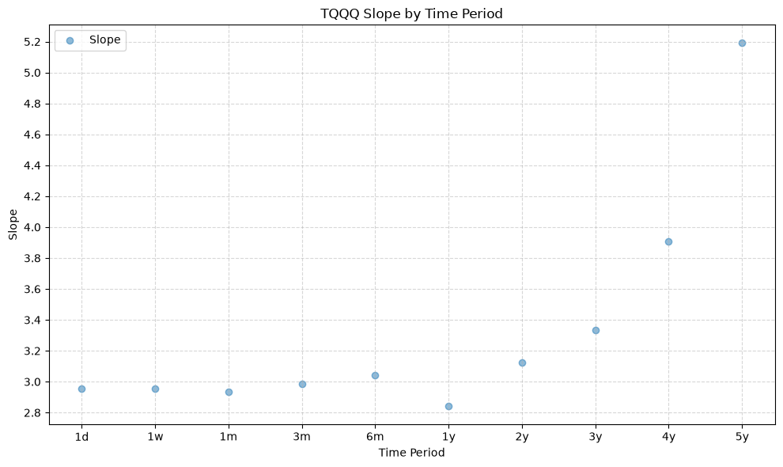
    


```python
plot_scatter(
    df=rolling_returns_stats,
    x_plot_column="Period",
    y_plot_columns=["Slope"],
    title="TQQQ Slope by Time Period",
    x_label="Time Period",
    x_format="String",
    x_format_decimal_places=0,
    x_tick_spacing=1,
    x_tick_rotation=0,
    y_label="Slope",
    y_format="Decimal",
    y_format_decimal_places=1,
    y_tick_spacing="Auto",
    y_tick_rotation=0,
    plot_OLS_regression_line=False,
    OLS_column=None,
    plot_Ridge_regression_line=False,
    Ridge_column=None,
    plot_RidgeCV_regression_line=False,
    RidgeCV_column=None,
    regression_constant=False,
    grid=True,
    legend=True,
    export_plot=False,
    plot_file_name=None,
)
```


    
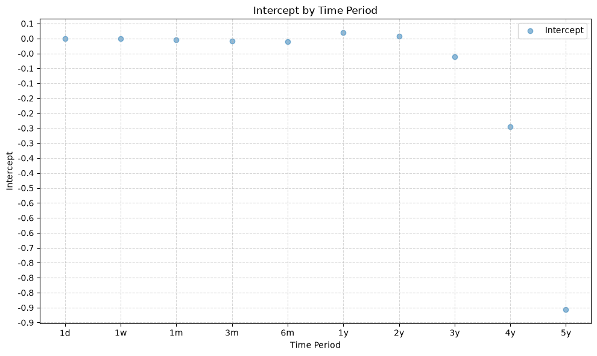
    


```python
plot_scatter(
    df=rolling_returns_stats,
    x_plot_column="Period",
    y_plot_columns=["Intercept"],
    title="Intercept by Time Period",
    x_label="Time Period",
    x_format="String",
    x_format_decimal_places=0,
    x_tick_spacing=1,
    x_tick_rotation=0,
    y_label="Intercept",
    y_format="Decimal",
    y_format_decimal_places=1,
    y_tick_spacing="Auto",
    y_tick_rotation=0,
    plot_OLS_regression_line=False,
    OLS_column=None,
    plot_Ridge_regression_line=False,
    Ridge_column=None,
    plot_RidgeCV_regression_line=False,
    RidgeCV_column=None,
    regression_constant=False,
    grid=True,
    legend=True,
    export_plot=False,
    plot_file_name=None,
)
```


    
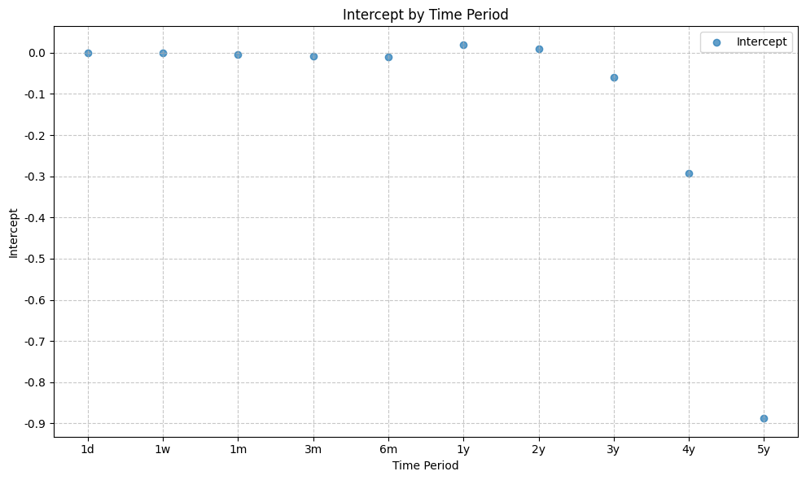
    


```python
pandas_set_decimal_places(3)
display(rolling_returns_stats.set_index("Period"))
```


<div>
<style scoped>
    .dataframe tbody tr th:only-of-type {
        vertical-align: middle;
    }

    .dataframe tbody tr th {
        vertical-align: top;
    }

    .dataframe thead th {
        text-align: right;
    }
</style>
<table border="1" class="dataframe">
  <thead>
    <tr style="text-align: right;">
      <th></th>
      <th>Intercept</th>
      <th>Slope</th>
      <th>R_Squared</th>
      <th>Skew</th>
      <th>Average Upside Beta</th>
      <th>Average Downside Beta</th>
      <th>Asymmetry</th>
      <th>Return_Deviation_From_3x</th>
    </tr>
    <tr>
      <th>Period</th>
      <th></th>
      <th></th>
      <th></th>
      <th></th>
      <th></th>
      <th></th>
      <th></th>
      <th></th>
    </tr>
  </thead>
  <tbody>
    <tr>
      <th>1d</th>
      <td>-0.000</td>
      <td>2.955</td>
      <td>0.999</td>
      <td>NaN</td>
      <td>2.957</td>
      <td>NaN</td>
      <td>NaN</td>
      <td>-0.045</td>
    </tr>
    <tr>
      <th>1w</th>
      <td>-0.001</td>
      <td>2.952</td>
      <td>0.994</td>
      <td>NaN</td>
      <td>2.553</td>
      <td>NaN</td>
      <td>NaN</td>
      <td>-0.048</td>
    </tr>
    <tr>
      <th>1m</th>
      <td>-0.004</td>
      <td>2.931</td>
      <td>0.982</td>
      <td>NaN</td>
      <td>2.208</td>
      <td>NaN</td>
      <td>NaN</td>
      <td>-0.069</td>
    </tr>
    <tr>
      <th>3m</th>
      <td>-0.008</td>
      <td>2.985</td>
      <td>0.958</td>
      <td>NaN</td>
      <td>1.994</td>
      <td>-inf</td>
      <td>inf</td>
      <td>-0.015</td>
    </tr>
    <tr>
      <th>6m</th>
      <td>-0.010</td>
      <td>3.040</td>
      <td>0.916</td>
      <td>-8.728</td>
      <td>1.478</td>
      <td>5.416</td>
      <td>-3.938</td>
      <td>0.040</td>
    </tr>
    <tr>
      <th>1y</th>
      <td>0.019</td>
      <td>2.837</td>
      <td>0.880</td>
      <td>NaN</td>
      <td>1.223</td>
      <td>-inf</td>
      <td>inf</td>
      <td>-0.163</td>
    </tr>
    <tr>
      <th>2y</th>
      <td>0.009</td>
      <td>3.131</td>
      <td>0.848</td>
      <td>36.166</td>
      <td>1.393</td>
      <td>12.341</td>
      <td>-10.948</td>
      <td>0.131</td>
    </tr>
    <tr>
      <th>3y</th>
      <td>-0.060</td>
      <td>3.332</td>
      <td>0.805</td>
      <td>NaN</td>
      <td>-0.089</td>
      <td>-inf</td>
      <td>inf</td>
      <td>0.332</td>
    </tr>
    <tr>
      <th>4y</th>
      <td>-0.293</td>
      <td>3.933</td>
      <td>0.781</td>
      <td>19.561</td>
      <td>1.760</td>
      <td>7.212</td>
      <td>-5.452</td>
      <td>0.933</td>
    </tr>
    <tr>
      <th>5y</th>
      <td>-0.887</td>
      <td>5.205</td>
      <td>0.743</td>
      <td>43.036</td>
      <td>2.432</td>
      <td>11.480</td>
      <td>-9.047</td>
      <td>2.205</td>
    </tr>
  </tbody>
</table>
</div>


This is very interesting. Up to 1 year, there is minimal difference between the mean TQQQ 1 year rolling return and the hypothetical 3x leverage, with an R^2 of greater than 0.9.

However, as we extend the time period, we see that

* The "leverage factor" increases significantly, resulting in a deviation from the perfect 3x leverage.
* The intercept also begins to deviate significantly from 0.

The above highlight the impact of volatility magnification over longer time horizons. This phenomenon is happening likely due to the positive returns that QQQ has achieved since 2010 - resulting in TQQQ compounding at a much higher rate than 3x - but it may and likely is not exhibited by other 3x leveraged ETFs that have not had the same positive return profile as QQQ.

With the above results, the next logical question is, when is the opportune time to buy a 3x leveraged ETF like TQQQ? To answer this, we will look a the drawdown levels of TQQQ and the subsequent returns over various time horizons.

### Rolling Returns Following Drawdowns (QQQ & TQQQ)

We will identify the drawdown levels of TQQQ and then look at the subsequent rolling returns over various time horizons.


```python
# Copy DataFrame
qqq_tqqq_extrap_future = qqq_tqqq_extrap.copy()

# Create a list of drawdown levels to analyze
drawdown_levels = [-0.10, -0.20, -0.30, -0.40, -0.50, -0.60, -0.70, -0.80]

# Shift the rolling return columns by the number of days in the rolling window to get the returns following the drawdown
for etf in etfs:
    for period_name, window in rolling_windows.items():
        qqq_tqqq_extrap_future[f"{etf}_Rolling_Future_Return_{period_name}"] = qqq_tqqq_extrap_future[f"{etf}_Rolling_Return_{period_name}"].shift(-window)
```

Now, we can analyze the future rolling returns following specific drawdown levels:


```python
# Create a dataframe to hold rolling returns stats
rolling_returns_drawdown_stats = pd.DataFrame()

for drawdown in drawdown_levels:

    for period_name, window in rolling_windows.items():

        try:
            plot_histogram(
                df=qqq_tqqq_extrap_future[qqq_tqqq_extrap_future["TQQQ_Drawdown"] <= drawdown],
                plot_columns=[f"QQQ_Rolling_Future_Return_{period_name}", f"TQQQ_Rolling_Future_Return_{period_name}"],
                title=f"QQQ & TQQQ {period_name} Rolling Future Returns Post {drawdown} TQQQ Drawdown",
                x_label="Rolling Return",
                x_tick_spacing="Auto",
                x_tick_rotation=30,
                y_label="# Of Datapoints",
                y_tick_spacing="Auto",
                y_tick_rotation=0,
                grid=True,
                legend=True,
                export_plot=False,
                plot_file_name=None,
            )

            plot_scatter(
                df=qqq_tqqq_extrap_future[qqq_tqqq_extrap_future["TQQQ_Drawdown"] <= drawdown],
                x_plot_column=f"QQQ_Rolling_Future_Return_{period_name}",
                y_plot_columns=[f"TQQQ_Rolling_Future_Return_{period_name}"],
                title=f"QQQ & TQQQ {period_name} Rolling Future Returns Post {drawdown} TQQQ Drawdown",
                x_label="QQQ Rolling Return",
                x_format="Decimal",
                x_format_decimal_places=2,
                x_tick_spacing="Auto",
                x_tick_rotation=30,
                y_label="TQQQ Rolling Return",
                y_format="Decimal",
                y_format_decimal_places=2,
                y_tick_spacing="Auto",
                y_tick_rotation=0,
                plot_OLS_regression_line=True,
                OLS_column=f"TQQQ_Rolling_Future_Return_{period_name}",
                plot_Ridge_regression_line=False,
                Ridge_column=None,
                plot_RidgeCV_regression_line=True,
                RidgeCV_column=f"TQQQ_Rolling_Future_Return_{period_name}",
                regression_constant=True,
                grid=True,
                legend=True,
                export_plot=False,
                plot_file_name=None,
            )

            # Run OLS regression with statsmodels
            model = run_linear_regression(
                df=qqq_tqqq_extrap_future[qqq_tqqq_extrap_future["TQQQ_Drawdown"] <= drawdown],
                x_plot_column=f"QQQ_Rolling_Future_Return_{period_name}",
                y_plot_column=f"TQQQ_Rolling_Future_Return_{period_name}",
                regression_model="OLS-statsmodels",
                regression_constant=True,
            )
            print(model.summary())

            # Filter by drawdown
            drawdown_filter = qqq_tqqq_extrap_future[qqq_tqqq_extrap_future["TQQQ_Drawdown"] <= drawdown]

            # Filter by period, drop rows with missing values
            future_filter = drawdown_filter[[f"TQQQ_Rolling_Future_Return_{period_name}"]].dropna()

            # Find length of future dataframe
            future_length = len(future_filter)

            # Find length of future dataframe where return is positive
            positive_future_length = len(future_filter[future_filter[f"TQQQ_Rolling_Future_Return_{period_name}"] > 0])

            # Calculate percentage of future returns that are positive
            positive_future_percentage = (positive_future_length / future_length) if future_length > 0 else 0

            # Add the regression results to the rolling returns stats dataframe
            intercept = model.params[0]
            # intercept_pvalue = model.pvalues[0]   # p-value for Intercept
            slope = model.params[1]
            # slope_pvalue = model.pvalues[1]       # p-value for Slope
            r_squared = model.rsquared

            rolling_returns_slope_int = pd.DataFrame({
                "Drawdown": drawdown,
                "Period": period_name,
                "Intercept": [intercept],
                # "Intercept_PValue": [intercept_pvalue],
                "Slope": [slope],
                # "Slope_PValue": [slope_pvalue],
                "R_Squared": [r_squared],
                "Positive_Future_Percentage": [positive_future_percentage],
            })
            
            rolling_returns_drawdown_stats = pd.concat([rolling_returns_drawdown_stats, rolling_returns_slope_int])

        except:
            print(f"Not enough data points for drawdown level {drawdown} and period {period_name} to run regression.")
```


    

    


    

    


                                      OLS Regression Results                                 
    =========================================================================================
    Dep. Variable:     TQQQ_Rolling_Future_Return_1d   R-squared:                       0.999
    Model:                                       OLS   Adj. R-squared:                  0.999
    Method:                            Least Squares   F-statistic:                 6.829e+06
    Date:                           Fri, 20 Mar 2026   Prob (F-statistic):               0.00
    Time:                                   10:48:25   Log-Likelihood:                 33564.
    No. Observations:                           6652   AIC:                        -6.712e+04
    Df Residuals:                               6650   BIC:                        -6.711e+04
    Df Model:                                      1                                         
    Covariance Type:                       nonrobust                                         
    ================================================================================================
                                       coef    std err          t      P>|t|      [0.025      0.975]
    ------------------------------------------------------------------------------------------------
    const                        -5.211e-05   1.91e-05     -2.727      0.006   -8.96e-05   -1.46e-05
    QQQ_Rolling_Future_Return_1d     2.9551      0.001   2613.214      0.000       2.953       2.957
    ==============================================================================
    Omnibus:                     9920.661   Durbin-Watson:                   2.565
    Prob(Omnibus):                  0.000   Jarque-Bera (JB):         41169076.972
    Skew:                          -8.189   Prob(JB):                         0.00
    Kurtosis:                     388.055   Cond. No.                         59.2
    ==============================================================================
    
    Notes:
    [1] Standard Errors assume that the covariance matrix of the errors is correctly specified.


    

    


    

    


                                      OLS Regression Results                                 
    =========================================================================================
    Dep. Variable:     TQQQ_Rolling_Future_Return_1w   R-squared:                       0.994
    Model:                                       OLS   Adj. R-squared:                  0.994
    Method:                            Least Squares   F-statistic:                 1.089e+06
    Date:                           Fri, 20 Mar 2026   Prob (F-statistic):               0.00
    Time:                                   10:48:26   Log-Likelihood:                 22724.
    No. Observations:                           6648   AIC:                        -4.544e+04
    Df Residuals:                               6646   BIC:                        -4.543e+04
    Df Model:                                      1                                         
    Covariance Type:                       nonrobust                                         
    ================================================================================================
                                       coef    std err          t      P>|t|      [0.025      0.975]
    ------------------------------------------------------------------------------------------------
    const                           -0.0008   9.75e-05     -8.243      0.000      -0.001      -0.001
    QQQ_Rolling_Future_Return_1w     2.9526      0.003   1043.587      0.000       2.947       2.958
    ==============================================================================
    Omnibus:                     2702.698   Durbin-Watson:                   0.939
    Prob(Omnibus):                  0.000   Jarque-Bera (JB):           587354.982
    Skew:                          -0.778   Prob(JB):                         0.00
    Kurtosis:                      49.022   Cond. No.                         29.1
    ==============================================================================
    
    Notes:
    [1] Standard Errors assume that the covariance matrix of the errors is correctly specified.


    

    


    

    


                                      OLS Regression Results                                 
    =========================================================================================
    Dep. Variable:     TQQQ_Rolling_Future_Return_1m   R-squared:                       0.982
    Model:                                       OLS   Adj. R-squared:                  0.982
    Method:                            Least Squares   F-statistic:                 3.705e+05
    Date:                           Fri, 20 Mar 2026   Prob (F-statistic):               0.00
    Time:                                   10:48:27   Log-Likelihood:                 14707.
    No. Observations:                           6632   AIC:                        -2.941e+04
    Df Residuals:                               6630   BIC:                        -2.940e+04
    Df Model:                                      1                                         
    Covariance Type:                       nonrobust                                         
    ================================================================================================
                                       coef    std err          t      P>|t|      [0.025      0.975]
    ------------------------------------------------------------------------------------------------
    const                           -0.0034      0.000    -10.557      0.000      -0.004      -0.003
    QQQ_Rolling_Future_Return_1m     2.9305      0.005    608.682      0.000       2.921       2.940
    ==============================================================================
    Omnibus:                     1681.515   Durbin-Watson:                   0.312
    Prob(Omnibus):                  0.000   Jarque-Bera (JB):            81002.207
    Skew:                           0.394   Prob(JB):                         0.00
    Kurtosis:                      20.103   Cond. No.                         14.9
    ==============================================================================
    
    Notes:
    [1] Standard Errors assume that the covariance matrix of the errors is correctly specified.


    

    


    
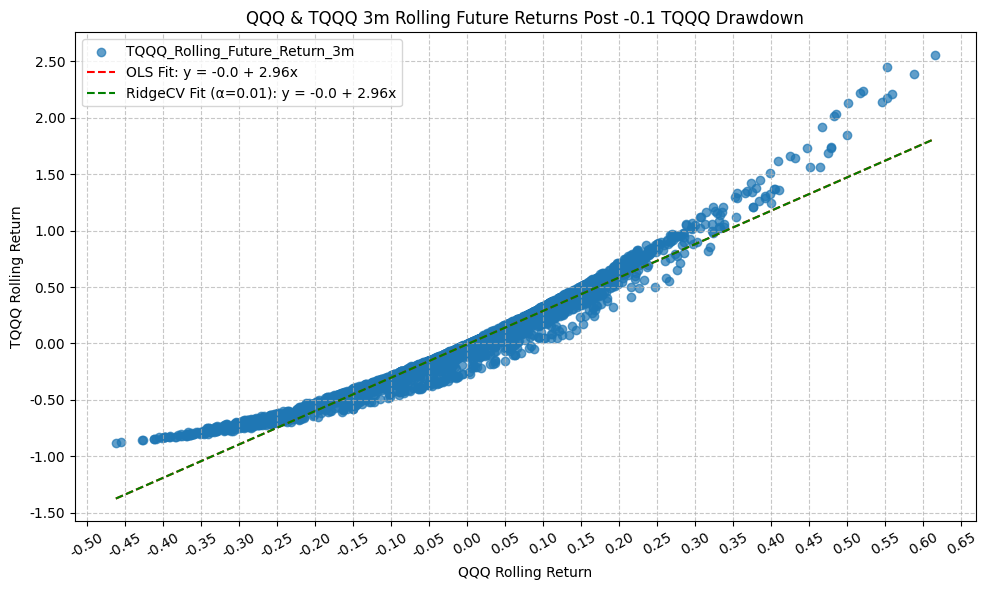
    


                                      OLS Regression Results                                 
    =========================================================================================
    Dep. Variable:     TQQQ_Rolling_Future_Return_3m   R-squared:                       0.957
    Model:                                       OLS   Adj. R-squared:                  0.957
    Method:                            Least Squares   F-statistic:                 1.459e+05
    Date:                           Fri, 20 Mar 2026   Prob (F-statistic):               0.00
    Time:                                   10:48:28   Log-Likelihood:                 7953.9
    No. Observations:                           6590   AIC:                        -1.590e+04
    Df Residuals:                               6588   BIC:                        -1.589e+04
    Df Model:                                      1                                         
    Covariance Type:                       nonrobust                                         
    ================================================================================================
                                       coef    std err          t      P>|t|      [0.025      0.975]
    ------------------------------------------------------------------------------------------------
    const                           -0.0076      0.001     -8.287      0.000      -0.009      -0.006
    QQQ_Rolling_Future_Return_3m     2.9583      0.008    382.016      0.000       2.943       2.974
    ==============================================================================
    Omnibus:                     3405.064   Durbin-Watson:                   0.113
    Prob(Omnibus):                  0.000   Jarque-Bera (JB):            86432.676
    Skew:                           1.943   Prob(JB):                         0.00
    Kurtosis:                      20.311   Cond. No.                         8.69
    ==============================================================================
    
    Notes:
    [1] Standard Errors assume that the covariance matrix of the errors is correctly specified.


    

    


    

    


                                      OLS Regression Results                                 
    =========================================================================================
    Dep. Variable:     TQQQ_Rolling_Future_Return_6m   R-squared:                       0.921
    Model:                                       OLS   Adj. R-squared:                  0.921
    Method:                            Least Squares   F-statistic:                 7.570e+04
    Date:                           Fri, 20 Mar 2026   Prob (F-statistic):               0.00
    Time:                                   10:48:29   Log-Likelihood:                 3157.7
    No. Observations:                           6527   AIC:                            -6311.
    Df Residuals:                               6525   BIC:                            -6298.
    Df Model:                                      1                                         
    Covariance Type:                       nonrobust                                         
    ================================================================================================
                                       coef    std err          t      P>|t|      [0.025      0.975]
    ------------------------------------------------------------------------------------------------
    const                           -0.0042      0.002     -2.162      0.031      -0.008      -0.000
    QQQ_Rolling_Future_Return_6m     2.9627      0.011    275.128      0.000       2.942       2.984
    ==============================================================================
    Omnibus:                     4157.931   Durbin-Watson:                   0.065
    Prob(Omnibus):                  0.000   Jarque-Bera (JB):           100755.352
    Skew:                           2.648   Prob(JB):                         0.00
    Kurtosis:                      21.505   Cond. No.                         5.85
    ==============================================================================
    
    Notes:
    [1] Standard Errors assume that the covariance matrix of the errors is correctly specified.


    
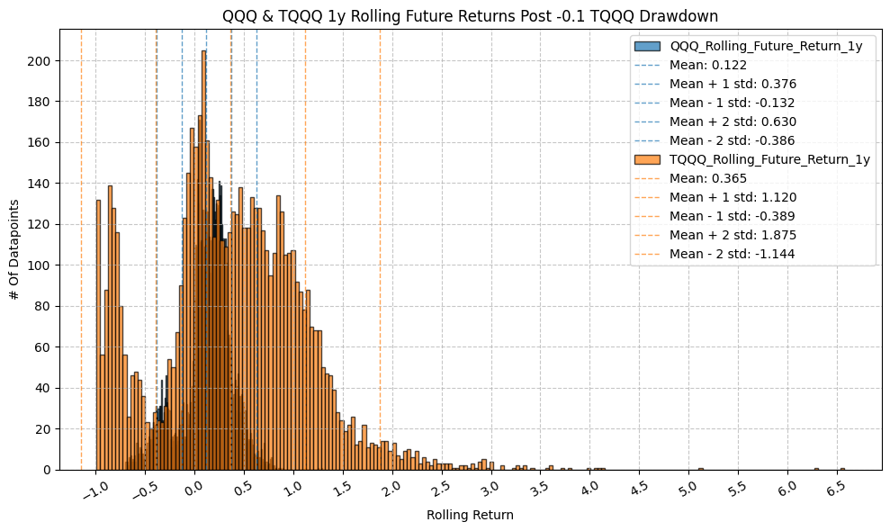
    


    

    


                                      OLS Regression Results                                 
    =========================================================================================
    Dep. Variable:     TQQQ_Rolling_Future_Return_1y   R-squared:                       0.893
    Model:                                       OLS   Adj. R-squared:                  0.893
    Method:                            Least Squares   F-statistic:                 5.327e+04
    Date:                           Fri, 20 Mar 2026   Prob (F-statistic):               0.00
    Time:                                   10:48:30   Log-Likelihood:                -134.91
    No. Observations:                           6401   AIC:                             273.8
    Df Residuals:                               6399   BIC:                             287.4
    Df Model:                                      1                                         
    Covariance Type:                       nonrobust                                         
    ================================================================================================
                                       coef    std err          t      P>|t|      [0.025      0.975]
    ------------------------------------------------------------------------------------------------
    const                            0.0227      0.003      6.629      0.000       0.016       0.029
    QQQ_Rolling_Future_Return_1y     2.8087      0.012    230.809      0.000       2.785       2.833
    ==============================================================================
    Omnibus:                     2634.605   Durbin-Watson:                   0.052
    Prob(Omnibus):                  0.000   Jarque-Bera (JB):            29271.842
    Skew:                           1.658   Prob(JB):                         0.00
    Kurtosis:                      12.938   Cond. No.                         4.00
    ==============================================================================
    
    Notes:
    [1] Standard Errors assume that the covariance matrix of the errors is correctly specified.


    
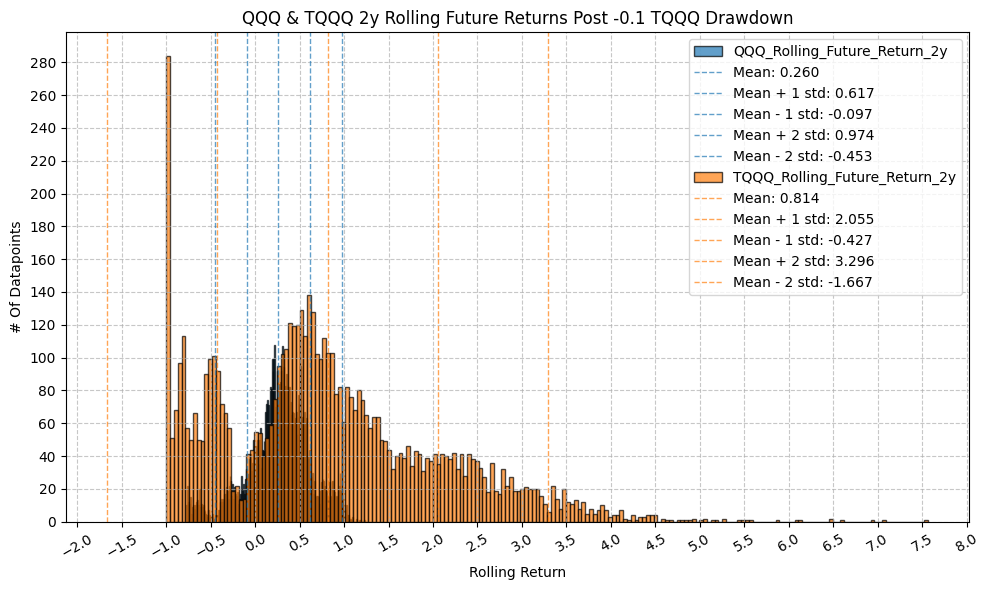
    


    

    


                                      OLS Regression Results                                 
    =========================================================================================
    Dep. Variable:     TQQQ_Rolling_Future_Return_2y   R-squared:                       0.848
    Model:                                       OLS   Adj. R-squared:                  0.848
    Method:                            Least Squares   F-statistic:                 3.424e+04
    Date:                           Fri, 20 Mar 2026   Prob (F-statistic):               0.00
    Time:                                   10:48:31   Log-Likelihood:                -4263.9
    No. Observations:                           6149   AIC:                             8532.
    Df Residuals:                               6147   BIC:                             8545.
    Df Model:                                      1                                         
    Covariance Type:                       nonrobust                                         
    ================================================================================================
                                       coef    std err          t      P>|t|      [0.025      0.975]
    ------------------------------------------------------------------------------------------------
    const                           -0.0191      0.008     -2.502      0.012      -0.034      -0.004
    QQQ_Rolling_Future_Return_2y     3.2011      0.017    185.045      0.000       3.167       3.235
    ==============================================================================
    Omnibus:                     1670.863   Durbin-Watson:                   0.019
    Prob(Omnibus):                  0.000   Jarque-Bera (JB):             4642.106
    Skew:                           1.436   Prob(JB):                         0.00
    Kurtosis:                       6.142   Cond. No.                         3.02
    ==============================================================================
    
    Notes:
    [1] Standard Errors assume that the covariance matrix of the errors is correctly specified.


    
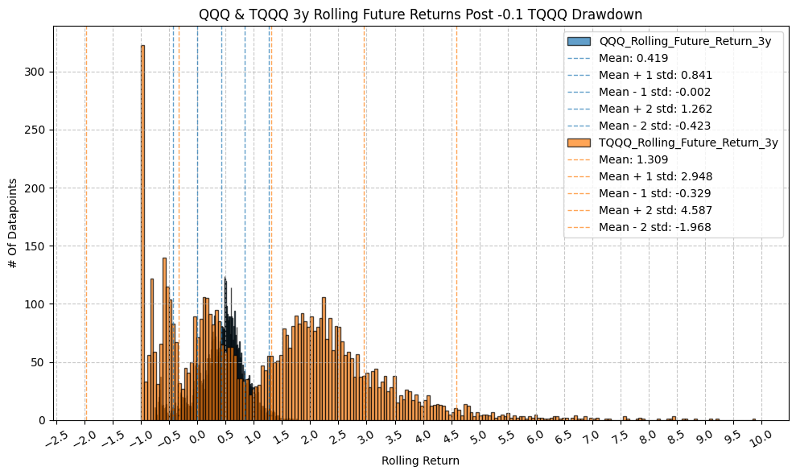
    


    
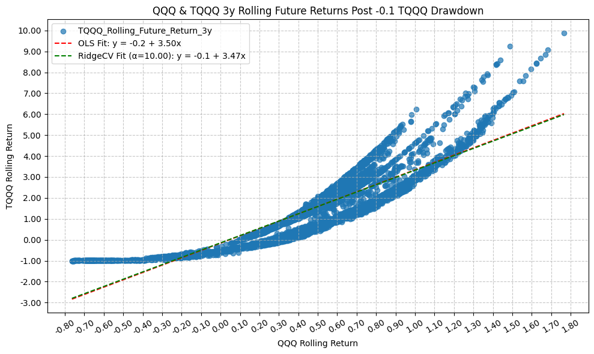
    


                                      OLS Regression Results                                 
    =========================================================================================
    Dep. Variable:     TQQQ_Rolling_Future_Return_3y   R-squared:                       0.811
    Model:                                       OLS   Adj. R-squared:                  0.811
    Method:                            Least Squares   F-statistic:                 2.527e+04
    Date:                           Fri, 20 Mar 2026   Prob (F-statistic):               0.00
    Time:                                   10:48:33   Log-Likelihood:                -6370.5
    No. Observations:                           5897   AIC:                         1.274e+04
    Df Residuals:                               5895   BIC:                         1.276e+04
    Df Model:                                      1                                         
    Covariance Type:                       nonrobust                                         
    ================================================================================================
                                       coef    std err          t      P>|t|      [0.025      0.975]
    ------------------------------------------------------------------------------------------------
    const                           -0.1589      0.013    -12.137      0.000      -0.185      -0.133
    QQQ_Rolling_Future_Return_3y     3.5021      0.022    158.957      0.000       3.459       3.545
    ==============================================================================
    Omnibus:                      871.005   Durbin-Watson:                   0.015
    Prob(Omnibus):                  0.000   Jarque-Bera (JB):             1534.952
    Skew:                           0.960   Prob(JB):                         0.00
    Kurtosis:                       4.600   Cond. No.                         2.86
    ==============================================================================
    
    Notes:
    [1] Standard Errors assume that the covariance matrix of the errors is correctly specified.


    
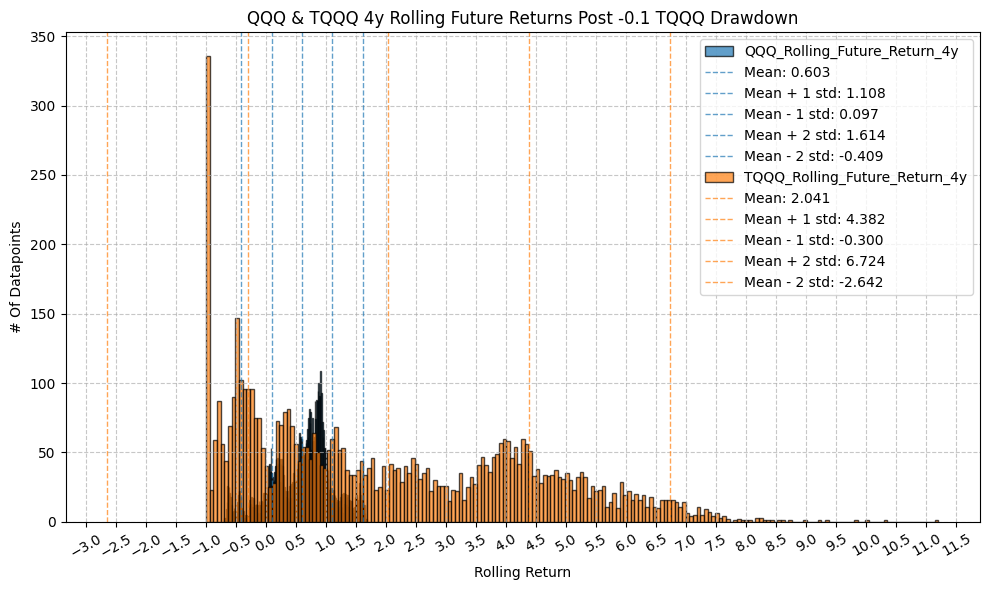
    


    

    


                                      OLS Regression Results                                 
    =========================================================================================
    Dep. Variable:     TQQQ_Rolling_Future_Return_4y   R-squared:                       0.783
    Model:                                       OLS   Adj. R-squared:                  0.783
    Method:                            Least Squares   F-statistic:                 2.035e+04
    Date:                           Fri, 20 Mar 2026   Prob (F-statistic):               0.00
    Time:                                   10:48:34   Log-Likelihood:                -8500.6
    No. Observations:                           5645   AIC:                         1.701e+04
    Df Residuals:                               5643   BIC:                         1.702e+04
    Df Model:                                      1                                         
    Covariance Type:                       nonrobust                                         
    ================================================================================================
                                       coef    std err          t      P>|t|      [0.025      0.975]
    ------------------------------------------------------------------------------------------------
    const                           -0.4274      0.023    -18.923      0.000      -0.472      -0.383
    QQQ_Rolling_Future_Return_4y     4.0965      0.029    142.660      0.000       4.040       4.153
    ==============================================================================
    Omnibus:                      126.839   Durbin-Watson:                   0.010
    Prob(Omnibus):                  0.000   Jarque-Bera (JB):               79.052
    Skew:                           0.148   Prob(JB):                     6.82e-18
    Kurtosis:                       2.501   Cond. No.                         2.85
    ==============================================================================
    
    Notes:
    [1] Standard Errors assume that the covariance matrix of the errors is correctly specified.


    
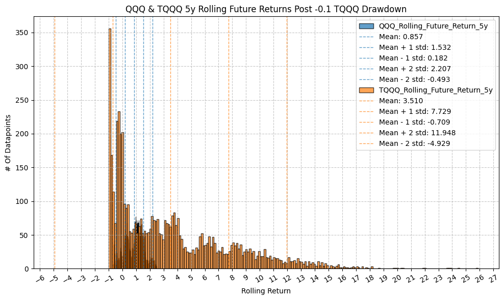
    


    

    


                                      OLS Regression Results                                 
    =========================================================================================
    Dep. Variable:     TQQQ_Rolling_Future_Return_5y   R-squared:                       0.745
    Model:                                       OLS   Adj. R-squared:                  0.745
    Method:                            Least Squares   F-statistic:                 1.577e+04
    Date:                           Fri, 20 Mar 2026   Prob (F-statistic):               0.00
    Time:                                   10:48:35   Log-Likelihood:                -11728.
    No. Observations:                           5393   AIC:                         2.346e+04
    Df Residuals:                               5391   BIC:                         2.347e+04
    Df Model:                                      1                                         
    Covariance Type:                       nonrobust                                         
    ================================================================================================
                                       coef    std err          t      P>|t|      [0.025      0.975]
    ------------------------------------------------------------------------------------------------
    const                           -1.1155      0.047    -23.795      0.000      -1.207      -1.024
    QQQ_Rolling_Future_Return_5y     5.3968      0.043    125.581      0.000       5.313       5.481
    ==============================================================================
    Omnibus:                      276.437   Durbin-Watson:                   0.009
    Prob(Omnibus):                  0.000   Jarque-Bera (JB):              406.256
    Skew:                           0.460   Prob(JB):                     6.06e-89
    Kurtosis:                       3.981   Cond. No.                         2.90
    ==============================================================================
    
    Notes:
    [1] Standard Errors assume that the covariance matrix of the errors is correctly specified.


    

    


    

    


                                      OLS Regression Results                                 
    =========================================================================================
    Dep. Variable:     TQQQ_Rolling_Future_Return_1d   R-squared:                       0.999
    Model:                                       OLS   Adj. R-squared:                  0.999
    Method:                            Least Squares   F-statistic:                 6.607e+06
    Date:                           Fri, 20 Mar 2026   Prob (F-statistic):               0.00
    Time:                                   10:48:36   Log-Likelihood:                 33137.
    No. Observations:                           6575   AIC:                        -6.627e+04
    Df Residuals:                               6573   BIC:                        -6.626e+04
    Df Model:                                      1                                         
    Covariance Type:                       nonrobust                                         
    ================================================================================================
                                       coef    std err          t      P>|t|      [0.025      0.975]
    ------------------------------------------------------------------------------------------------
    const                        -5.272e-05   1.93e-05     -2.727      0.006   -9.06e-05   -1.48e-05
    QQQ_Rolling_Future_Return_1d     2.9551      0.001   2570.313      0.000       2.953       2.957
    ==============================================================================
    Omnibus:                     9776.012   Durbin-Watson:                   2.565
    Prob(Omnibus):                  0.000   Jarque-Bera (JB):         39747209.384
    Skew:                          -8.140   Prob(JB):                         0.00
    Kurtosis:                     383.552   Cond. No.                         59.5
    ==============================================================================
    
    Notes:
    [1] Standard Errors assume that the covariance matrix of the errors is correctly specified.


    
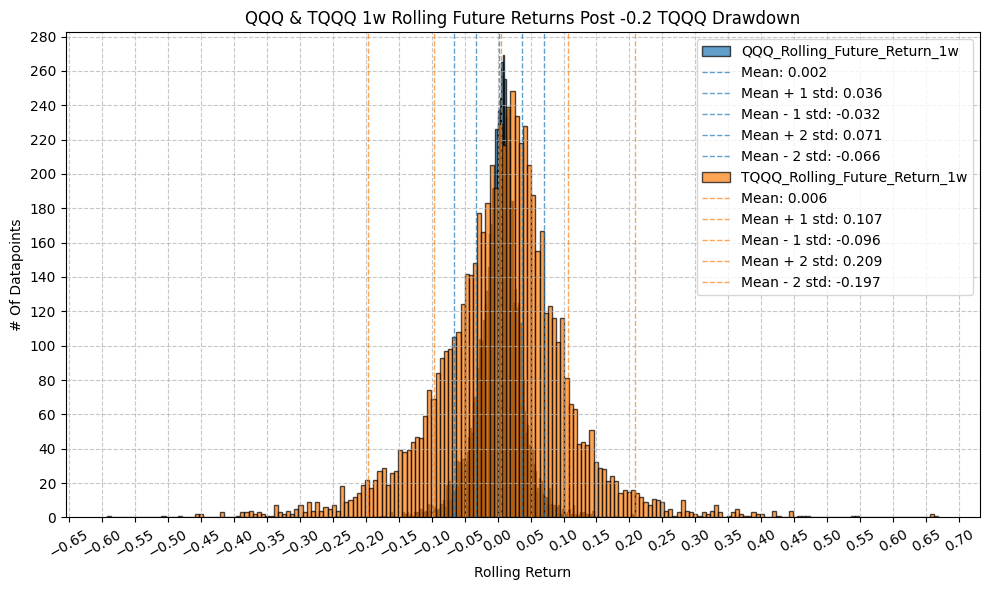
    


    
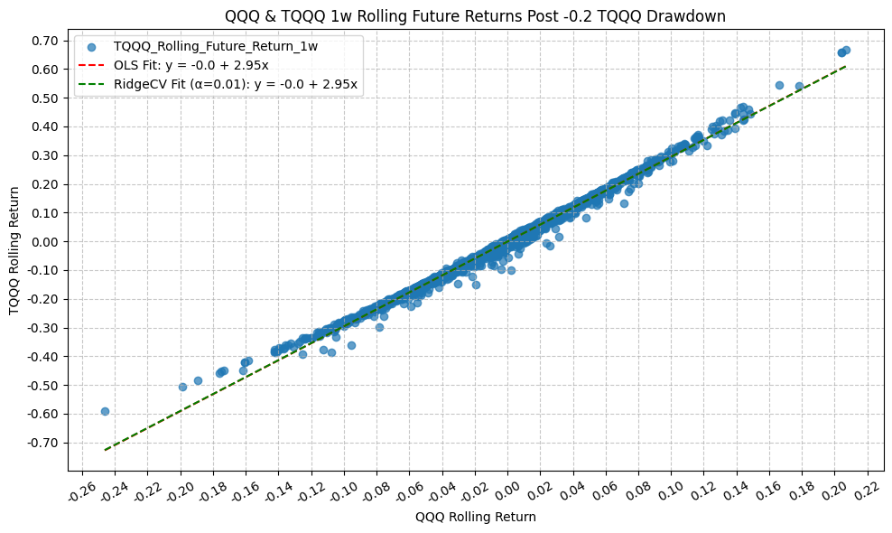
    


                                      OLS Regression Results                                 
    =========================================================================================
    Dep. Variable:     TQQQ_Rolling_Future_Return_1w   R-squared:                       0.994
    Model:                                       OLS   Adj. R-squared:                  0.994
    Method:                            Least Squares   F-statistic:                 1.070e+06
    Date:                           Fri, 20 Mar 2026   Prob (F-statistic):               0.00
    Time:                                   10:48:37   Log-Likelihood:                 22468.
    No. Observations:                           6571   AIC:                        -4.493e+04
    Df Residuals:                               6569   BIC:                        -4.492e+04
    Df Model:                                      1                                         
    Covariance Type:                       nonrobust                                         
    ================================================================================================
                                       coef    std err          t      P>|t|      [0.025      0.975]
    ------------------------------------------------------------------------------------------------
    const                           -0.0008   9.79e-05     -8.038      0.000      -0.001      -0.001
    QQQ_Rolling_Future_Return_1w     2.9517      0.003   1034.302      0.000       2.946       2.957
    ==============================================================================
    Omnibus:                     2706.460   Durbin-Watson:                   0.933
    Prob(Omnibus):                  0.000   Jarque-Bera (JB):           595926.912
    Skew:                          -0.802   Prob(JB):                         0.00
    Kurtosis:                      49.626   Cond. No.                         29.2
    ==============================================================================
    
    Notes:
    [1] Standard Errors assume that the covariance matrix of the errors is correctly specified.


    

    


    

    


                                      OLS Regression Results                                 
    =========================================================================================
    Dep. Variable:     TQQQ_Rolling_Future_Return_1m   R-squared:                       0.983
    Model:                                       OLS   Adj. R-squared:                  0.983
    Method:                            Least Squares   F-statistic:                 3.705e+05
    Date:                           Fri, 20 Mar 2026   Prob (F-statistic):               0.00
    Time:                                   10:48:38   Log-Likelihood:                 14663.
    No. Observations:                           6555   AIC:                        -2.932e+04
    Df Residuals:                               6553   BIC:                        -2.931e+04
    Df Model:                                      1                                         
    Covariance Type:                       nonrobust                                         
    ================================================================================================
                                       coef    std err          t      P>|t|      [0.025      0.975]
    ------------------------------------------------------------------------------------------------
    const                           -0.0035      0.000    -10.829      0.000      -0.004      -0.003
    QQQ_Rolling_Future_Return_1m     2.9225      0.005    608.681      0.000       2.913       2.932
    ==============================================================================
    Omnibus:                     1537.427   Durbin-Watson:                   0.317
    Prob(Omnibus):                  0.000   Jarque-Bera (JB):            81158.645
    Skew:                           0.161   Prob(JB):                         0.00
    Kurtosis:                      20.235   Cond. No.                         15.0
    ==============================================================================
    
    Notes:
    [1] Standard Errors assume that the covariance matrix of the errors is correctly specified.


    
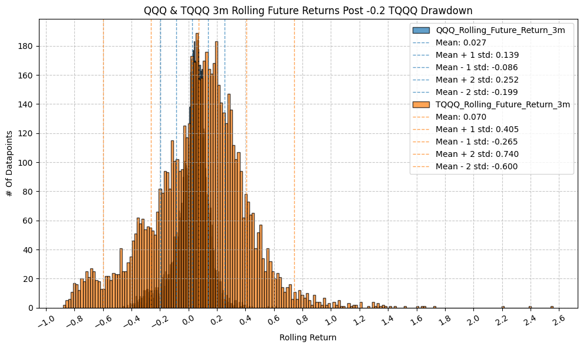
    


    

    


                                      OLS Regression Results                                 
    =========================================================================================
    Dep. Variable:     TQQQ_Rolling_Future_Return_3m   R-squared:                       0.960
    Model:                                       OLS   Adj. R-squared:                  0.960
    Method:                            Least Squares   F-statistic:                 1.545e+05
    Date:                           Fri, 20 Mar 2026   Prob (F-statistic):               0.00
    Time:                                   10:48:40   Log-Likelihood:                 8327.7
    No. Observations:                           6513   AIC:                        -1.665e+04
    Df Residuals:                               6511   BIC:                        -1.664e+04
    Df Model:                                      1                                         
    Covariance Type:                       nonrobust                                         
    ================================================================================================
                                       coef    std err          t      P>|t|      [0.025      0.975]
    ------------------------------------------------------------------------------------------------
    const                           -0.0070      0.001     -8.206      0.000      -0.009      -0.005
    QQQ_Rolling_Future_Return_3m     2.9104      0.007    393.086      0.000       2.896       2.925
    ==============================================================================
    Omnibus:                     2148.872   Durbin-Watson:                   0.136
    Prob(Omnibus):                  0.000   Jarque-Bera (JB):            38835.698
    Skew:                           1.110   Prob(JB):                         0.00
    Kurtosis:                      14.755   Cond. No.                         8.87
    ==============================================================================
    
    Notes:
    [1] Standard Errors assume that the covariance matrix of the errors is correctly specified.


    

    


    

    


                                      OLS Regression Results                                 
    =========================================================================================
    Dep. Variable:     TQQQ_Rolling_Future_Return_6m   R-squared:                       0.926
    Model:                                       OLS   Adj. R-squared:                  0.926
    Method:                            Least Squares   F-statistic:                 8.106e+04
    Date:                           Fri, 20 Mar 2026   Prob (F-statistic):               0.00
    Time:                                   10:48:41   Log-Likelihood:                 3782.6
    No. Observations:                           6450   AIC:                            -7561.
    Df Residuals:                               6448   BIC:                            -7548.
    Df Model:                                      1                                         
    Covariance Type:                       nonrobust                                         
    ================================================================================================
                                       coef    std err          t      P>|t|      [0.025      0.975]
    ------------------------------------------------------------------------------------------------
    const                           -0.0016      0.002     -0.893      0.372      -0.005       0.002
    QQQ_Rolling_Future_Return_6m     2.8744      0.010    284.711      0.000       2.855       2.894
    ==============================================================================
    Omnibus:                     3186.447   Durbin-Watson:                   0.077
    Prob(Omnibus):                  0.000   Jarque-Bera (JB):            49829.858
    Skew:                           1.978   Prob(JB):                         0.00
    Kurtosis:                      16.029   Cond. No.                         6.04
    ==============================================================================
    
    Notes:
    [1] Standard Errors assume that the covariance matrix of the errors is correctly specified.


    
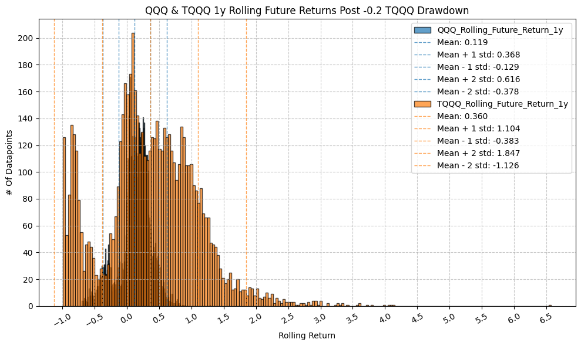
    


    
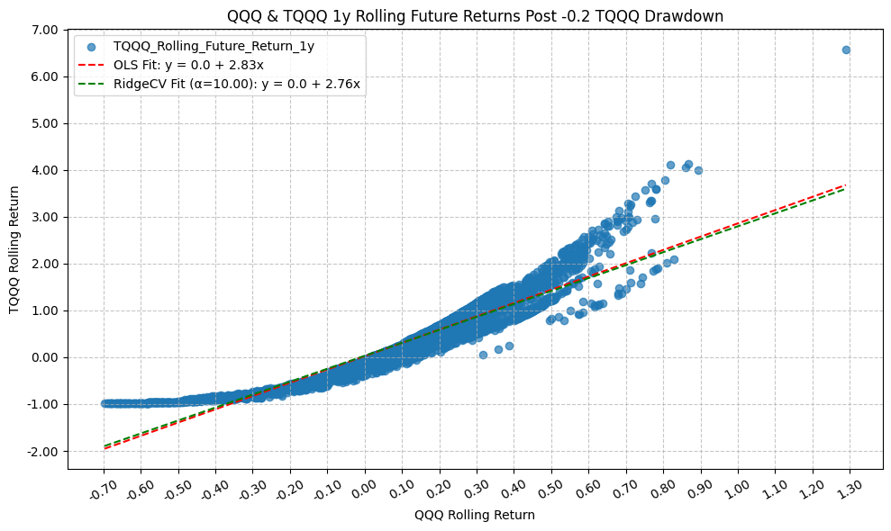
    


                                      OLS Regression Results                                 
    =========================================================================================
    Dep. Variable:     TQQQ_Rolling_Future_Return_1y   R-squared:                       0.898
    Model:                                       OLS   Adj. R-squared:                  0.898
    Method:                            Least Squares   F-statistic:                 5.552e+04
    Date:                           Fri, 20 Mar 2026   Prob (F-statistic):               0.00
    Time:                                   10:48:42   Log-Likelihood:                 116.44
    No. Observations:                           6324   AIC:                            -228.9
    Df Residuals:                               6322   BIC:                            -215.4
    Df Model:                                      1                                         
    Covariance Type:                       nonrobust                                         
    ================================================================================================
                                       coef    std err          t      P>|t|      [0.025      0.975]
    ------------------------------------------------------------------------------------------------
    const                            0.0226      0.003      6.809      0.000       0.016       0.029
    QQQ_Rolling_Future_Return_1y     2.8341      0.012    235.634      0.000       2.811       2.858
    ==============================================================================
    Omnibus:                     2425.690   Durbin-Watson:                   0.068
    Prob(Omnibus):                  0.000   Jarque-Bera (JB):            19474.427
    Skew:                           1.622   Prob(JB):                         0.00
    Kurtosis:                      10.962   Cond. No.                         4.09
    ==============================================================================
    
    Notes:
    [1] Standard Errors assume that the covariance matrix of the errors is correctly specified.


    

    


    

    


                                      OLS Regression Results                                 
    =========================================================================================
    Dep. Variable:     TQQQ_Rolling_Future_Return_2y   R-squared:                       0.847
    Model:                                       OLS   Adj. R-squared:                  0.847
    Method:                            Least Squares   F-statistic:                 3.363e+04
    Date:                           Fri, 20 Mar 2026   Prob (F-statistic):               0.00
    Time:                                   10:48:43   Log-Likelihood:                -4184.9
    No. Observations:                           6072   AIC:                             8374.
    Df Residuals:                               6070   BIC:                             8387.
    Df Model:                                      1                                         
    Covariance Type:                       nonrobust                                         
    ================================================================================================
                                       coef    std err          t      P>|t|      [0.025      0.975]
    ------------------------------------------------------------------------------------------------
    const                           -0.0291      0.008     -3.737      0.000      -0.044      -0.014
    QQQ_Rolling_Future_Return_2y     3.2273      0.018    183.397      0.000       3.193       3.262
    ==============================================================================
    Omnibus:                     1696.251   Durbin-Watson:                   0.019
    Prob(Omnibus):                  0.000   Jarque-Bera (JB):             4868.031
    Skew:                           1.463   Prob(JB):                         0.00
    Kurtosis:                       6.269   Cond. No.                         3.08
    ==============================================================================
    
    Notes:
    [1] Standard Errors assume that the covariance matrix of the errors is correctly specified.


    

    


    
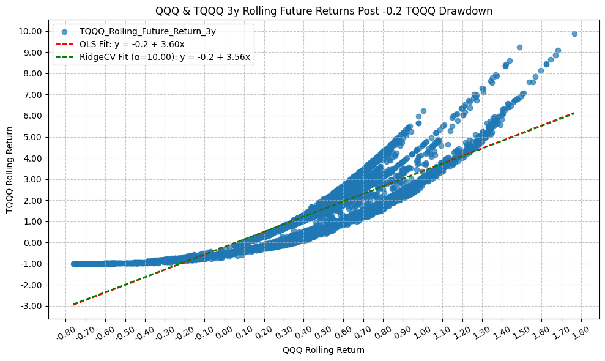
    


                                      OLS Regression Results                                 
    =========================================================================================
    Dep. Variable:     TQQQ_Rolling_Future_Return_3y   R-squared:                       0.814
    Model:                                       OLS   Adj. R-squared:                  0.814
    Method:                            Least Squares   F-statistic:                 2.552e+04
    Date:                           Fri, 20 Mar 2026   Prob (F-statistic):               0.00
    Time:                                   10:48:44   Log-Likelihood:                -6194.1
    No. Observations:                           5820   AIC:                         1.239e+04
    Df Residuals:                               5818   BIC:                         1.241e+04
    Df Model:                                      1                                         
    Covariance Type:                       nonrobust                                         
    ================================================================================================
                                       coef    std err          t      P>|t|      [0.025      0.975]
    ------------------------------------------------------------------------------------------------
    const                           -0.2169      0.013    -16.189      0.000      -0.243      -0.191
    QQQ_Rolling_Future_Return_3y     3.6003      0.023    159.754      0.000       3.556       3.644
    ==============================================================================
    Omnibus:                      876.552   Durbin-Watson:                   0.015
    Prob(Omnibus):                  0.000   Jarque-Bera (JB):             1576.675
    Skew:                           0.967   Prob(JB):                         0.00
    Kurtosis:                       4.661   Cond. No.                         2.98
    ==============================================================================
    
    Notes:
    [1] Standard Errors assume that the covariance matrix of the errors is correctly specified.


    
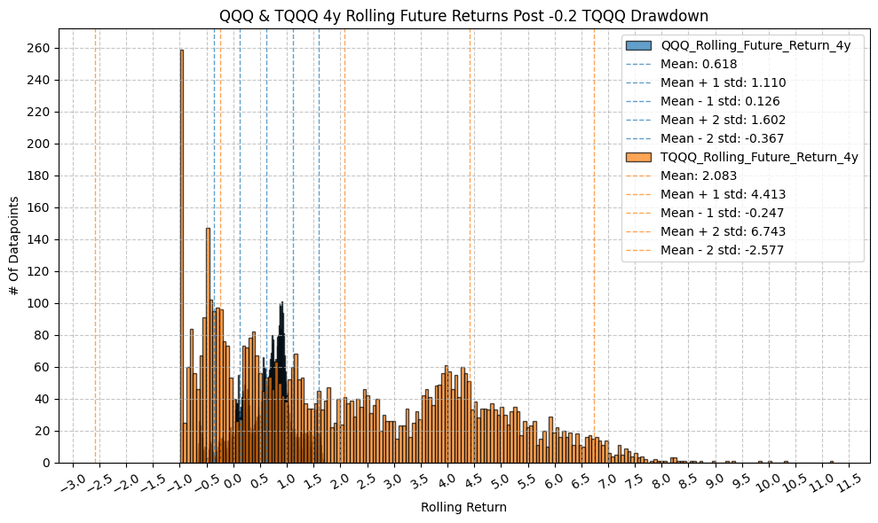
    


    

    


                                      OLS Regression Results                                 
    =========================================================================================
    Dep. Variable:     TQQQ_Rolling_Future_Return_4y   R-squared:                       0.784
    Model:                                       OLS   Adj. R-squared:                  0.784
    Method:                            Least Squares   F-statistic:                 2.021e+04
    Date:                           Fri, 20 Mar 2026   Prob (F-statistic):               0.00
    Time:                                   10:48:45   Log-Likelihood:                -8343.3
    No. Observations:                           5568   AIC:                         1.669e+04
    Df Residuals:                               5566   BIC:                         1.670e+04
    Df Model:                                      1                                         
    Covariance Type:                       nonrobust                                         
    ================================================================================================
                                       coef    std err          t      P>|t|      [0.025      0.975]
    ------------------------------------------------------------------------------------------------
    const                           -0.5066      0.023    -21.750      0.000      -0.552      -0.461
    QQQ_Rolling_Future_Return_4y     4.1916      0.029    142.148      0.000       4.134       4.249
    ==============================================================================
    Omnibus:                       90.510   Durbin-Watson:                   0.010
    Prob(Omnibus):                  0.000   Jarque-Bera (JB):               63.852
    Skew:                           0.153   Prob(JB):                     1.36e-14
    Kurtosis:                       2.573   Cond. No.                         2.96
    ==============================================================================
    
    Notes:
    [1] Standard Errors assume that the covariance matrix of the errors is correctly specified.


    

    


    
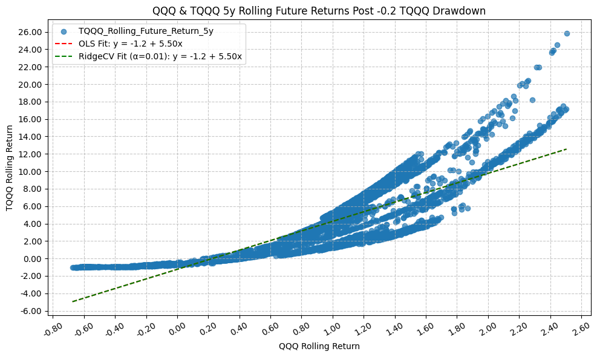
    


                                      OLS Regression Results                                 
    =========================================================================================
    Dep. Variable:     TQQQ_Rolling_Future_Return_5y   R-squared:                       0.747
    Model:                                       OLS   Adj. R-squared:                  0.746
    Method:                            Least Squares   F-statistic:                 1.565e+04
    Date:                           Fri, 20 Mar 2026   Prob (F-statistic):               0.00
    Time:                                   10:48:47   Log-Likelihood:                -11542.
    No. Observations:                           5316   AIC:                         2.309e+04
    Df Residuals:                               5314   BIC:                         2.310e+04
    Df Model:                                      1                                         
    Covariance Type:                       nonrobust                                         
    ================================================================================================
                                       coef    std err          t      P>|t|      [0.025      0.975]
    ------------------------------------------------------------------------------------------------
    const                           -1.2456      0.048    -25.796      0.000      -1.340      -1.151
    QQQ_Rolling_Future_Return_5y     5.5049      0.044    125.108      0.000       5.419       5.591
    ==============================================================================
    Omnibus:                      257.063   Durbin-Watson:                   0.009
    Prob(Omnibus):                  0.000   Jarque-Bera (JB):              381.050
    Skew:                           0.438   Prob(JB):                     1.80e-83
    Kurtosis:                       3.977   Cond. No.                         3.00
    ==============================================================================
    
    Notes:
    [1] Standard Errors assume that the covariance matrix of the errors is correctly specified.


    

    


    

    


                                      OLS Regression Results                                 
    =========================================================================================
    Dep. Variable:     TQQQ_Rolling_Future_Return_1d   R-squared:                       0.999
    Model:                                       OLS   Adj. R-squared:                  0.999
    Method:                            Least Squares   F-statistic:                 6.438e+06
    Date:                           Fri, 20 Mar 2026   Prob (F-statistic):               0.00
    Time:                                   10:48:48   Log-Likelihood:                 32915.
    No. Observations:                           6535   AIC:                        -6.583e+04
    Df Residuals:                               6533   BIC:                        -6.581e+04
    Df Model:                                      1                                         
    Covariance Type:                       nonrobust                                         
    ================================================================================================
                                       coef    std err          t      P>|t|      [0.025      0.975]
    ------------------------------------------------------------------------------------------------
    const                        -5.304e-05   1.95e-05     -2.727      0.006   -9.12e-05   -1.49e-05
    QQQ_Rolling_Future_Return_1d     2.9551      0.001   2537.240      0.000       2.953       2.957
    ==============================================================================
    Omnibus:                     9701.036   Durbin-Watson:                   2.565
    Prob(Omnibus):                  0.000   Jarque-Bera (JB):         39021907.934
    Skew:                          -8.115   Prob(JB):                         0.00
    Kurtosis:                     381.214   Cond. No.                         59.9
    ==============================================================================
    
    Notes:
    [1] Standard Errors assume that the covariance matrix of the errors is correctly specified.


    
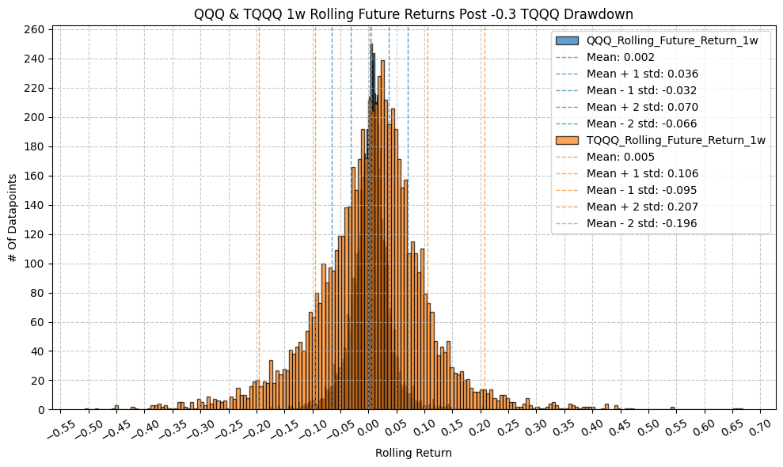
    


    

    


                                      OLS Regression Results                                 
    =========================================================================================
    Dep. Variable:     TQQQ_Rolling_Future_Return_1w   R-squared:                       0.994
    Model:                                       OLS   Adj. R-squared:                  0.994
    Method:                            Least Squares   F-statistic:                 1.120e+06
    Date:                           Fri, 20 Mar 2026   Prob (F-statistic):               0.00
    Time:                                   10:48:49   Log-Likelihood:                 22535.
    No. Observations:                           6531   AIC:                        -4.507e+04
    Df Residuals:                               6529   BIC:                        -4.505e+04
    Df Model:                                      1                                         
    Covariance Type:                       nonrobust                                         
    ================================================================================================
                                       coef    std err          t      P>|t|      [0.025      0.975]
    ------------------------------------------------------------------------------------------------
    const                           -0.0008   9.52e-05     -8.355      0.000      -0.001      -0.001
    QQQ_Rolling_Future_Return_1w     2.9553      0.003   1058.146      0.000       2.950       2.961
    ==============================================================================
    Omnibus:                     3465.529   Durbin-Watson:                   0.902
    Prob(Omnibus):                  0.000   Jarque-Bera (JB):           389032.407
    Skew:                          -1.579   Prob(JB):                         0.00
    Kurtosis:                      40.678   Cond. No.                         29.4
    ==============================================================================
    
    Notes:
    [1] Standard Errors assume that the covariance matrix of the errors is correctly specified.


    
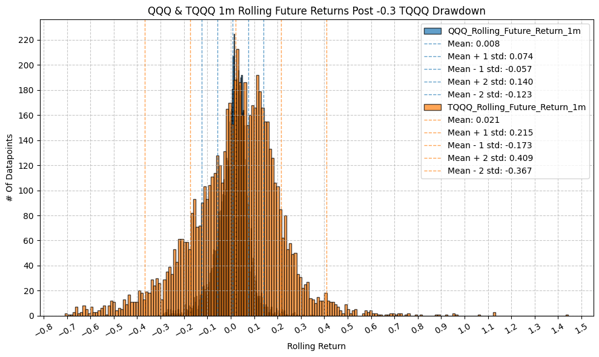
    


    

    


                                      OLS Regression Results                                 
    =========================================================================================
    Dep. Variable:     TQQQ_Rolling_Future_Return_1m   R-squared:                       0.983
    Model:                                       OLS   Adj. R-squared:                  0.983
    Method:                            Least Squares   F-statistic:                 3.677e+05
    Date:                           Fri, 20 Mar 2026   Prob (F-statistic):               0.00
    Time:                                   10:48:50   Log-Likelihood:                 14634.
    No. Observations:                           6515   AIC:                        -2.926e+04
    Df Residuals:                               6513   BIC:                        -2.925e+04
    Df Model:                                      1                                         
    Covariance Type:                       nonrobust                                         
    ================================================================================================
                                       coef    std err          t      P>|t|      [0.025      0.975]
    ------------------------------------------------------------------------------------------------
    const                           -0.0035      0.000    -11.062      0.000      -0.004      -0.003
    QQQ_Rolling_Future_Return_1m     2.9177      0.005    606.361      0.000       2.908       2.927
    ==============================================================================
    Omnibus:                     1513.351   Durbin-Watson:                   0.308
    Prob(Omnibus):                  0.000   Jarque-Bera (JB):            81994.892
    Skew:                           0.084   Prob(JB):                         0.00
    Kurtosis:                      20.379   Cond. No.                         15.2
    ==============================================================================
    
    Notes:
    [1] Standard Errors assume that the covariance matrix of the errors is correctly specified.


    

    


    

    


                                      OLS Regression Results                                 
    =========================================================================================
    Dep. Variable:     TQQQ_Rolling_Future_Return_3m   R-squared:                       0.961
    Model:                                       OLS   Adj. R-squared:                  0.961
    Method:                            Least Squares   F-statistic:                 1.586e+05
    Date:                           Fri, 20 Mar 2026   Prob (F-statistic):               0.00
    Time:                                   10:48:51   Log-Likelihood:                 8464.2
    No. Observations:                           6473   AIC:                        -1.692e+04
    Df Residuals:                               6471   BIC:                        -1.691e+04
    Df Model:                                      1                                         
    Covariance Type:                       nonrobust                                         
    ================================================================================================
                                       coef    std err          t      P>|t|      [0.025      0.975]
    ------------------------------------------------------------------------------------------------
    const                           -0.0067      0.001     -8.072      0.000      -0.008      -0.005
    QQQ_Rolling_Future_Return_3m     2.8944      0.007    398.200      0.000       2.880       2.909
    ==============================================================================
    Omnibus:                     1348.462   Durbin-Watson:                   0.103
    Prob(Omnibus):                  0.000   Jarque-Bera (JB):            15299.278
    Skew:                           0.667   Prob(JB):                         0.00
    Kurtosis:                      10.412   Cond. No.                         8.94
    ==============================================================================
    
    Notes:
    [1] Standard Errors assume that the covariance matrix of the errors is correctly specified.


    

    


    

    


                                      OLS Regression Results                                 
    =========================================================================================
    Dep. Variable:     TQQQ_Rolling_Future_Return_6m   R-squared:                       0.929
    Model:                                       OLS   Adj. R-squared:                  0.929
    Method:                            Least Squares   F-statistic:                 8.382e+04
    Date:                           Fri, 20 Mar 2026   Prob (F-statistic):               0.00
    Time:                                   10:48:52   Log-Likelihood:                 4132.0
    No. Observations:                           6410   AIC:                            -8260.
    Df Residuals:                               6408   BIC:                            -8246.
    Df Model:                                      1                                         
    Covariance Type:                       nonrobust                                         
    ================================================================================================
                                       coef    std err          t      P>|t|      [0.025      0.975]
    ------------------------------------------------------------------------------------------------
    const                           -0.0006      0.002     -0.371      0.710      -0.004       0.003
    QQQ_Rolling_Future_Return_6m     2.8223      0.010    289.509      0.000       2.803       2.841
    ==============================================================================
    Omnibus:                     2685.458   Durbin-Watson:                   0.109
    Prob(Omnibus):                  0.000   Jarque-Bera (JB):            36536.272
    Skew:                           1.630   Prob(JB):                         0.00
    Kurtosis:                      14.232   Cond. No.                         6.16
    ==============================================================================
    
    Notes:
    [1] Standard Errors assume that the covariance matrix of the errors is correctly specified.


    
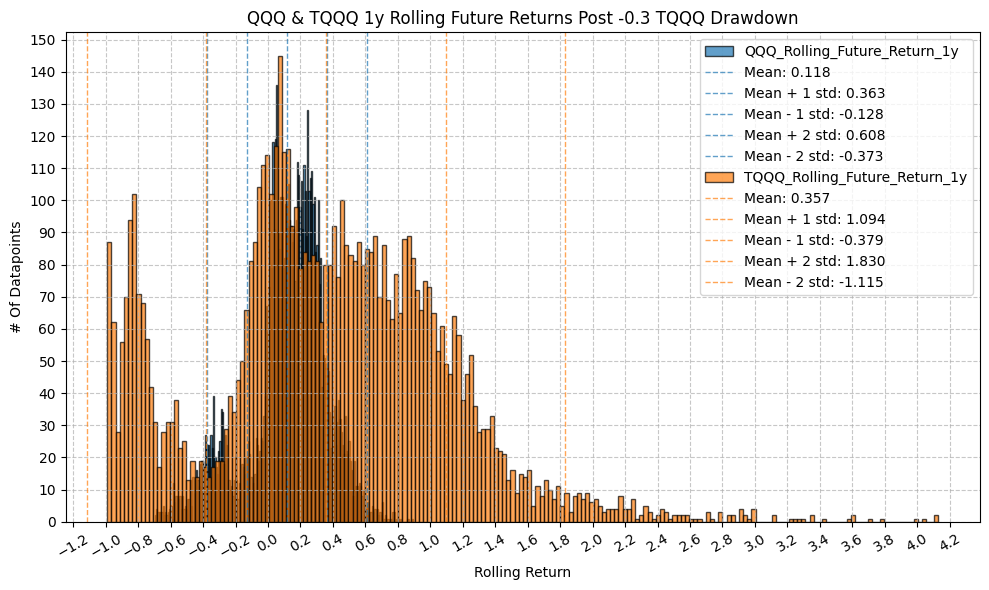
    


    

    


                                      OLS Regression Results                                 
    =========================================================================================
    Dep. Variable:     TQQQ_Rolling_Future_Return_1y   R-squared:                       0.902
    Model:                                       OLS   Adj. R-squared:                  0.902
    Method:                            Least Squares   F-statistic:                 5.755e+04
    Date:                           Fri, 20 Mar 2026   Prob (F-statistic):               0.00
    Time:                                   10:48:53   Log-Likelihood:                 292.39
    No. Observations:                           6284   AIC:                            -580.8
    Df Residuals:                               6282   BIC:                            -567.3
    Df Model:                                      1                                         
    Covariance Type:                       nonrobust                                         
    ================================================================================================
                                       coef    std err          t      P>|t|      [0.025      0.975]
    ------------------------------------------------------------------------------------------------
    const                            0.0223      0.003      6.890      0.000       0.016       0.029
    QQQ_Rolling_Future_Return_1y     2.8513      0.012    239.894      0.000       2.828       2.875
    ==============================================================================
    Omnibus:                     1989.027   Durbin-Watson:                   0.043
    Prob(Omnibus):                  0.000   Jarque-Bera (JB):             8597.274
    Skew:                           1.494   Prob(JB):                         0.00
    Kurtosis:                       7.889   Cond. No.                         4.14
    ==============================================================================
    
    Notes:
    [1] Standard Errors assume that the covariance matrix of the errors is correctly specified.


    

    


    

    


                                      OLS Regression Results                                 
    =========================================================================================
    Dep. Variable:     TQQQ_Rolling_Future_Return_2y   R-squared:                       0.847
    Model:                                       OLS   Adj. R-squared:                  0.847
    Method:                            Least Squares   F-statistic:                 3.330e+04
    Date:                           Fri, 20 Mar 2026   Prob (F-statistic):               0.00
    Time:                                   10:48:55   Log-Likelihood:                -4145.1
    No. Observations:                           6032   AIC:                             8294.
    Df Residuals:                               6030   BIC:                             8308.
    Df Model:                                      1                                         
    Covariance Type:                       nonrobust                                         
    ================================================================================================
                                       coef    std err          t      P>|t|      [0.025      0.975]
    ------------------------------------------------------------------------------------------------
    const                           -0.0320      0.008     -4.079      0.000      -0.047      -0.017
    QQQ_Rolling_Future_Return_2y     3.2363      0.018    182.485      0.000       3.202       3.271
    ==============================================================================
    Omnibus:                     1703.757   Durbin-Watson:                   0.019
    Prob(Omnibus):                  0.000   Jarque-Bera (JB):             4959.168
    Skew:                           1.473   Prob(JB):                         0.00
    Kurtosis:                       6.324   Cond. No.                         3.10
    ==============================================================================
    
    Notes:
    [1] Standard Errors assume that the covariance matrix of the errors is correctly specified.


    

    


    

    


                                      OLS Regression Results                                 
    =========================================================================================
    Dep. Variable:     TQQQ_Rolling_Future_Return_3y   R-squared:                       0.816
    Model:                                       OLS   Adj. R-squared:                  0.816
    Method:                            Least Squares   F-statistic:                 2.571e+04
    Date:                           Fri, 20 Mar 2026   Prob (F-statistic):               0.00
    Time:                                   10:48:56   Log-Likelihood:                -6096.8
    No. Observations:                           5780   AIC:                         1.220e+04
    Df Residuals:                               5778   BIC:                         1.221e+04
    Df Model:                                      1                                         
    Covariance Type:                       nonrobust                                         
    ================================================================================================
                                       coef    std err          t      P>|t|      [0.025      0.975]
    ------------------------------------------------------------------------------------------------
    const                           -0.2501      0.014    -18.445      0.000      -0.277      -0.224
    QQQ_Rolling_Future_Return_3y     3.6562      0.023    160.340      0.000       3.612       3.701
    ==============================================================================
    Omnibus:                      878.571   Durbin-Watson:                   0.015
    Prob(Omnibus):                  0.000   Jarque-Bera (JB):             1603.088
    Skew:                           0.968   Prob(JB):                         0.00
    Kurtosis:                       4.705   Cond. No.                         3.05
    ==============================================================================
    
    Notes:
    [1] Standard Errors assume that the covariance matrix of the errors is correctly specified.


    

    


    
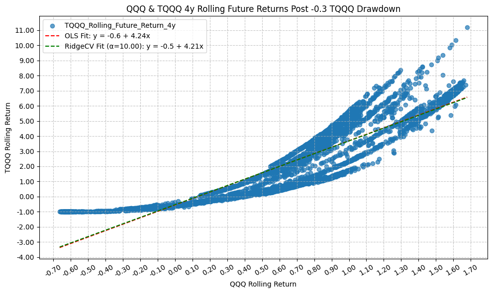
    


                                      OLS Regression Results                                 
    =========================================================================================
    Dep. Variable:     TQQQ_Rolling_Future_Return_4y   R-squared:                       0.785
    Model:                                       OLS   Adj. R-squared:                  0.785
    Method:                            Least Squares   F-statistic:                 2.014e+04
    Date:                           Fri, 20 Mar 2026   Prob (F-statistic):               0.00
    Time:                                   10:48:57   Log-Likelihood:                -8260.2
    No. Observations:                           5528   AIC:                         1.652e+04
    Df Residuals:                               5526   BIC:                         1.654e+04
    Df Model:                                      1                                         
    Covariance Type:                       nonrobust                                         
    ================================================================================================
                                       coef    std err          t      P>|t|      [0.025      0.975]
    ------------------------------------------------------------------------------------------------
    const                           -0.5503      0.024    -23.243      0.000      -0.597      -0.504
    QQQ_Rolling_Future_Return_4y     4.2439      0.030    141.902      0.000       4.185       4.303
    ==============================================================================
    Omnibus:                       73.582   Durbin-Watson:                   0.010
    Prob(Omnibus):                  0.000   Jarque-Bera (JB):               55.722
    Skew:                           0.155   Prob(JB):                     7.95e-13
    Kurtosis:                       2.618   Cond. No.                         3.02
    ==============================================================================
    
    Notes:
    [1] Standard Errors assume that the covariance matrix of the errors is correctly specified.


    

    


    

    


                                      OLS Regression Results                                 
    =========================================================================================
    Dep. Variable:     TQQQ_Rolling_Future_Return_5y   R-squared:                       0.747
    Model:                                       OLS   Adj. R-squared:                  0.747
    Method:                            Least Squares   F-statistic:                 1.560e+04
    Date:                           Fri, 20 Mar 2026   Prob (F-statistic):               0.00
    Time:                                   10:48:58   Log-Likelihood:                -11443.
    No. Observations:                           5276   AIC:                         2.289e+04
    Df Residuals:                               5274   BIC:                         2.290e+04
    Df Model:                                      1                                         
    Covariance Type:                       nonrobust                                         
    ================================================================================================
                                       coef    std err          t      P>|t|      [0.025      0.975]
    ------------------------------------------------------------------------------------------------
    const                           -1.3175      0.049    -26.859      0.000      -1.414      -1.221
    QQQ_Rolling_Future_Return_5y     5.5644      0.045    124.889      0.000       5.477       5.652
    ==============================================================================
    Omnibus:                      246.746   Durbin-Watson:                   0.009
    Prob(Omnibus):                  0.000   Jarque-Bera (JB):              368.441
    Skew:                           0.425   Prob(JB):                     9.87e-81
    Kurtosis:                       3.977   Cond. No.                         3.05
    ==============================================================================
    
    Notes:
    [1] Standard Errors assume that the covariance matrix of the errors is correctly specified.


    

    


    

    


                                      OLS Regression Results                                 
    =========================================================================================
    Dep. Variable:     TQQQ_Rolling_Future_Return_1d   R-squared:                       0.999
    Model:                                       OLS   Adj. R-squared:                  0.999
    Method:                            Least Squares   F-statistic:                 6.390e+06
    Date:                           Fri, 20 Mar 2026   Prob (F-statistic):               0.00
    Time:                                   10:48:59   Log-Likelihood:                 32854.
    No. Observations:                           6524   AIC:                        -6.570e+04
    Df Residuals:                               6522   BIC:                        -6.569e+04
    Df Model:                                      1                                         
    Covariance Type:                       nonrobust                                         
    ================================================================================================
                                       coef    std err          t      P>|t|      [0.025      0.975]
    ------------------------------------------------------------------------------------------------
    const                        -5.313e-05   1.95e-05     -2.727      0.006   -9.13e-05   -1.49e-05
    QQQ_Rolling_Future_Return_1d     2.9551      0.001   2527.751      0.000       2.953       2.957
    ==============================================================================
    Omnibus:                     9680.302   Durbin-Watson:                   2.565
    Prob(Omnibus):                  0.000   Jarque-Bera (JB):         38821752.772
    Skew:                          -8.108   Prob(JB):                         0.00
    Kurtosis:                     380.560   Cond. No.                         60.0
    ==============================================================================
    
    Notes:
    [1] Standard Errors assume that the covariance matrix of the errors is correctly specified.


    

    


    

    


                                      OLS Regression Results                                 
    =========================================================================================
    Dep. Variable:     TQQQ_Rolling_Future_Return_1w   R-squared:                       0.994
    Model:                                       OLS   Adj. R-squared:                  0.994
    Method:                            Least Squares   F-statistic:                 1.119e+06
    Date:                           Fri, 20 Mar 2026   Prob (F-statistic):               0.00
    Time:                                   10:49:00   Log-Likelihood:                 22543.
    No. Observations:                           6520   AIC:                        -4.508e+04
    Df Residuals:                               6518   BIC:                        -4.507e+04
    Df Model:                                      1                                         
    Covariance Type:                       nonrobust                                         
    ================================================================================================
                                       coef    std err          t      P>|t|      [0.025      0.975]
    ------------------------------------------------------------------------------------------------
    const                           -0.0008   9.46e-05     -8.589      0.000      -0.001      -0.001
    QQQ_Rolling_Future_Return_1w     2.9535      0.003   1057.775      0.000       2.948       2.959
    ==============================================================================
    Omnibus:                     3596.070   Durbin-Watson:                   0.881
    Prob(Omnibus):                  0.000   Jarque-Bera (JB):           404529.514
    Skew:                          -1.687   Prob(JB):                         0.00
    Kurtosis:                      41.441   Cond. No.                         29.6
    ==============================================================================
    
    Notes:
    [1] Standard Errors assume that the covariance matrix of the errors is correctly specified.


    

    


    

    


                                      OLS Regression Results                                 
    =========================================================================================
    Dep. Variable:     TQQQ_Rolling_Future_Return_1m   R-squared:                       0.983
    Model:                                       OLS   Adj. R-squared:                  0.983
    Method:                            Least Squares   F-statistic:                 3.663e+05
    Date:                           Fri, 20 Mar 2026   Prob (F-statistic):               0.00
    Time:                                   10:49:02   Log-Likelihood:                 14629.
    No. Observations:                           6504   AIC:                        -2.925e+04
    Df Residuals:                               6502   BIC:                        -2.924e+04
    Df Model:                                      1                                         
    Covariance Type:                       nonrobust                                         
    ================================================================================================
                                       coef    std err          t      P>|t|      [0.025      0.975]
    ------------------------------------------------------------------------------------------------
    const                           -0.0035      0.000    -11.049      0.000      -0.004      -0.003
    QQQ_Rolling_Future_Return_1m     2.9150      0.005    605.262      0.000       2.906       2.924
    ==============================================================================
    Omnibus:                     1511.960   Durbin-Watson:                   0.297
    Prob(Omnibus):                  0.000   Jarque-Bera (JB):            82967.919
    Skew:                           0.063   Prob(JB):                         0.00
    Kurtosis:                      20.497   Cond. No.                         15.2
    ==============================================================================
    
    Notes:
    [1] Standard Errors assume that the covariance matrix of the errors is correctly specified.


    

    


    
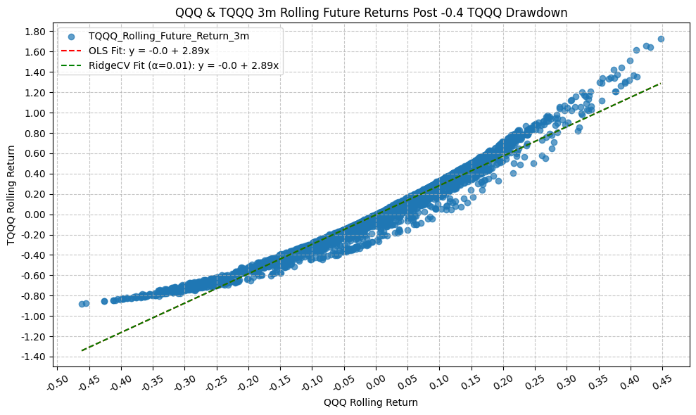
    


                                      OLS Regression Results                                 
    =========================================================================================
    Dep. Variable:     TQQQ_Rolling_Future_Return_3m   R-squared:                       0.961
    Model:                                       OLS   Adj. R-squared:                  0.961
    Method:                            Least Squares   F-statistic:                 1.592e+05
    Date:                           Fri, 20 Mar 2026   Prob (F-statistic):               0.00
    Time:                                   10:49:03   Log-Likelihood:                 8478.2
    No. Observations:                           6462   AIC:                        -1.695e+04
    Df Residuals:                               6460   BIC:                        -1.694e+04
    Df Model:                                      1                                         
    Covariance Type:                       nonrobust                                         
    ================================================================================================
                                       coef    std err          t      P>|t|      [0.025      0.975]
    ------------------------------------------------------------------------------------------------
    const                           -0.0066      0.001     -7.902      0.000      -0.008      -0.005
    QQQ_Rolling_Future_Return_3m     2.8925      0.007    399.004      0.000       2.878       2.907
    ==============================================================================
    Omnibus:                     1378.797   Durbin-Watson:                   0.101
    Prob(Omnibus):                  0.000   Jarque-Bera (JB):            15624.610
    Skew:                           0.693   Prob(JB):                         0.00
    Kurtosis:                      10.491   Cond. No.                         8.95
    ==============================================================================
    
    Notes:
    [1] Standard Errors assume that the covariance matrix of the errors is correctly specified.


    

    


    

    


                                      OLS Regression Results                                 
    =========================================================================================
    Dep. Variable:     TQQQ_Rolling_Future_Return_6m   R-squared:                       0.931
    Model:                                       OLS   Adj. R-squared:                  0.931
    Method:                            Least Squares   F-statistic:                 8.659e+04
    Date:                           Fri, 20 Mar 2026   Prob (F-statistic):               0.00
    Time:                                   10:49:04   Log-Likelihood:                 4308.7
    No. Observations:                           6399   AIC:                            -8613.
    Df Residuals:                               6397   BIC:                            -8600.
    Df Model:                                      1                                         
    Covariance Type:                       nonrobust                                         
    ================================================================================================
                                       coef    std err          t      P>|t|      [0.025      0.975]
    ------------------------------------------------------------------------------------------------
    const                        -6.286e-05      0.002     -0.039      0.969      -0.003       0.003
    QQQ_Rolling_Future_Return_6m     2.8037      0.010    294.268      0.000       2.785       2.822
    ==============================================================================
    Omnibus:                     1640.518   Durbin-Watson:                   0.057
    Prob(Omnibus):                  0.000   Jarque-Bera (JB):             8154.359
    Skew:                           1.147   Prob(JB):                         0.00
    Kurtosis:                       8.032   Cond. No.                         6.19
    ==============================================================================
    
    Notes:
    [1] Standard Errors assume that the covariance matrix of the errors is correctly specified.


    

    


    

    


                                      OLS Regression Results                                 
    =========================================================================================
    Dep. Variable:     TQQQ_Rolling_Future_Return_1y   R-squared:                       0.902
    Model:                                       OLS   Adj. R-squared:                  0.902
    Method:                            Least Squares   F-statistic:                 5.796e+04
    Date:                           Fri, 20 Mar 2026   Prob (F-statistic):               0.00
    Time:                                   10:49:05   Log-Likelihood:                 326.63
    No. Observations:                           6273   AIC:                            -649.3
    Df Residuals:                               6271   BIC:                            -635.8
    Df Model:                                      1                                         
    Covariance Type:                       nonrobust                                         
    ================================================================================================
                                       coef    std err          t      P>|t|      [0.025      0.975]
    ------------------------------------------------------------------------------------------------
    const                            0.0210      0.003      6.506      0.000       0.015       0.027
    QQQ_Rolling_Future_Return_1y     2.8615      0.012    240.740      0.000       2.838       2.885
    ==============================================================================
    Omnibus:                     1986.510   Durbin-Watson:                   0.039
    Prob(Omnibus):                  0.000   Jarque-Bera (JB):             8586.686
    Skew:                           1.495   Prob(JB):                         0.00
    Kurtosis:                       7.890   Cond. No.                         4.16
    ==============================================================================
    
    Notes:
    [1] Standard Errors assume that the covariance matrix of the errors is correctly specified.


    
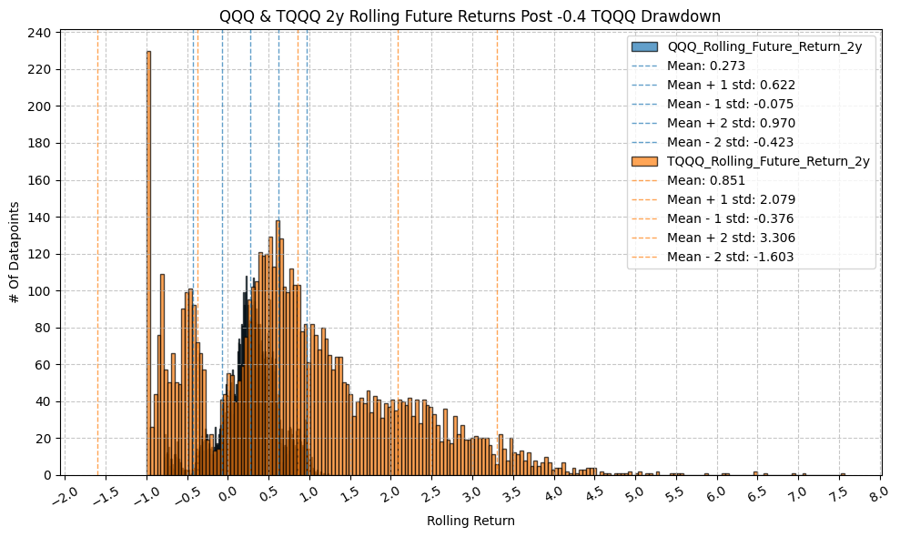
    


    

    


                                      OLS Regression Results                                 
    =========================================================================================
    Dep. Variable:     TQQQ_Rolling_Future_Return_2y   R-squared:                       0.847
    Model:                                       OLS   Adj. R-squared:                  0.847
    Method:                            Least Squares   F-statistic:                 3.332e+04
    Date:                           Fri, 20 Mar 2026   Prob (F-statistic):               0.00
    Time:                                   10:49:06   Log-Likelihood:                -4125.3
    No. Observations:                           6021   AIC:                             8255.
    Df Residuals:                               6019   BIC:                             8268.
    Df Model:                                      1                                         
    Covariance Type:                       nonrobust                                         
    ================================================================================================
                                       coef    std err          t      P>|t|      [0.025      0.975]
    ------------------------------------------------------------------------------------------------
    const                           -0.0348      0.008     -4.426      0.000      -0.050      -0.019
    QQQ_Rolling_Future_Return_2y     3.2436      0.018    182.536      0.000       3.209       3.278
    ==============================================================================
    Omnibus:                     1712.778   Durbin-Watson:                   0.018
    Prob(Omnibus):                  0.000   Jarque-Bera (JB):             5036.957
    Skew:                           1.479   Prob(JB):                         0.00
    Kurtosis:                       6.365   Cond. No.                         3.11
    ==============================================================================
    
    Notes:
    [1] Standard Errors assume that the covariance matrix of the errors is correctly specified.


    

    


    

    


                                      OLS Regression Results                                 
    =========================================================================================
    Dep. Variable:     TQQQ_Rolling_Future_Return_3y   R-squared:                       0.818
    Model:                                       OLS   Adj. R-squared:                  0.818
    Method:                            Least Squares   F-statistic:                 2.585e+04
    Date:                           Fri, 20 Mar 2026   Prob (F-statistic):               0.00
    Time:                                   10:49:07   Log-Likelihood:                -6061.4
    No. Observations:                           5769   AIC:                         1.213e+04
    Df Residuals:                               5767   BIC:                         1.214e+04
    Df Model:                                      1                                         
    Covariance Type:                       nonrobust                                         
    ================================================================================================
                                       coef    std err          t      P>|t|      [0.025      0.975]
    ------------------------------------------------------------------------------------------------
    const                           -0.2617      0.014    -19.251      0.000      -0.288      -0.235
    QQQ_Rolling_Future_Return_3y     3.6760      0.023    160.791      0.000       3.631       3.721
    ==============================================================================
    Omnibus:                      871.835   Durbin-Watson:                   0.015
    Prob(Omnibus):                  0.000   Jarque-Bera (JB):             1592.549
    Skew:                           0.963   Prob(JB):                         0.00
    Kurtosis:                       4.708   Cond. No.                         3.07
    ==============================================================================
    
    Notes:
    [1] Standard Errors assume that the covariance matrix of the errors is correctly specified.


    

    


    
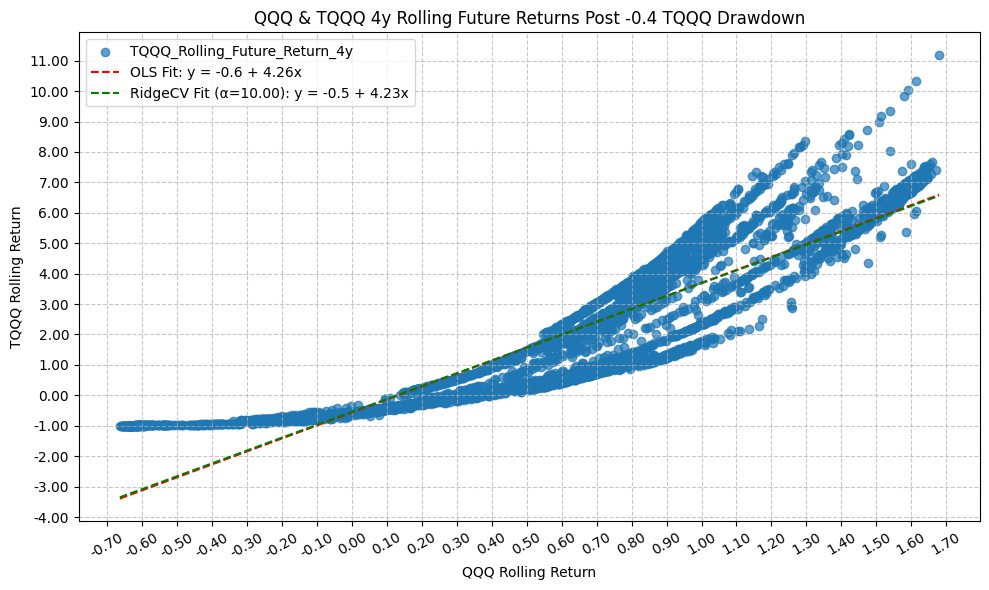
    


                                      OLS Regression Results                                 
    =========================================================================================
    Dep. Variable:     TQQQ_Rolling_Future_Return_4y   R-squared:                       0.785
    Model:                                       OLS   Adj. R-squared:                  0.785
    Method:                            Least Squares   F-statistic:                 2.016e+04
    Date:                           Fri, 20 Mar 2026   Prob (F-statistic):               0.00
    Time:                                   10:49:09   Log-Likelihood:                -8233.0
    No. Observations:                           5517   AIC:                         1.647e+04
    Df Residuals:                               5515   BIC:                         1.648e+04
    Df Model:                                      1                                         
    Covariance Type:                       nonrobust                                         
    ================================================================================================
                                       coef    std err          t      P>|t|      [0.025      0.975]
    ------------------------------------------------------------------------------------------------
    const                           -0.5652      0.024    -23.770      0.000      -0.612      -0.519
    QQQ_Rolling_Future_Return_4y     4.2620      0.030    141.973      0.000       4.203       4.321
    ==============================================================================
    Omnibus:                       68.346   Durbin-Watson:                   0.010
    Prob(Omnibus):                  0.000   Jarque-Bera (JB):               52.666
    Skew:                           0.153   Prob(JB):                     3.66e-12
    Kurtosis:                       2.631   Cond. No.                         3.04
    ==============================================================================
    
    Notes:
    [1] Standard Errors assume that the covariance matrix of the errors is correctly specified.


    

    


    

    


                                      OLS Regression Results                                 
    =========================================================================================
    Dep. Variable:     TQQQ_Rolling_Future_Return_5y   R-squared:                       0.748
    Model:                                       OLS   Adj. R-squared:                  0.748
    Method:                            Least Squares   F-statistic:                 1.561e+04
    Date:                           Fri, 20 Mar 2026   Prob (F-statistic):               0.00
    Time:                                   10:49:10   Log-Likelihood:                -11413.
    No. Observations:                           5265   AIC:                         2.283e+04
    Df Residuals:                               5263   BIC:                         2.284e+04
    Df Model:                                      1                                         
    Covariance Type:                       nonrobust                                         
    ================================================================================================
                                       coef    std err          t      P>|t|      [0.025      0.975]
    ------------------------------------------------------------------------------------------------
    const                           -1.3424      0.049    -27.253      0.000      -1.439      -1.246
    QQQ_Rolling_Future_Return_5y     5.5854      0.045    124.937      0.000       5.498       5.673
    ==============================================================================
    Omnibus:                      242.236   Durbin-Watson:                   0.009
    Prob(Omnibus):                  0.000   Jarque-Bera (JB):              363.436
    Skew:                           0.418   Prob(JB):                     1.20e-79
    Kurtosis:                       3.979   Cond. No.                         3.07
    ==============================================================================
    
    Notes:
    [1] Standard Errors assume that the covariance matrix of the errors is correctly specified.


    

    


    

    


                                      OLS Regression Results                                 
    =========================================================================================
    Dep. Variable:     TQQQ_Rolling_Future_Return_1d   R-squared:                       0.999
    Model:                                       OLS   Adj. R-squared:                  0.999
    Method:                            Least Squares   F-statistic:                 6.259e+06
    Date:                           Fri, 20 Mar 2026   Prob (F-statistic):               0.00
    Time:                                   10:49:11   Log-Likelihood:                 32517.
    No. Observations:                           6461   AIC:                        -6.503e+04
    Df Residuals:                               6459   BIC:                        -6.502e+04
    Df Model:                                      1                                         
    Covariance Type:                       nonrobust                                         
    ================================================================================================
                                       coef    std err          t      P>|t|      [0.025      0.975]
    ------------------------------------------------------------------------------------------------
    const                        -4.922e-05   1.96e-05     -2.506      0.012   -8.77e-05   -1.07e-05
    QQQ_Rolling_Future_Return_1d     2.9550      0.001   2501.839      0.000       2.953       2.957
    ==============================================================================
    Omnibus:                     9587.052   Durbin-Watson:                   2.567
    Prob(Omnibus):                  0.000   Jarque-Bera (JB):         38171135.662
    Skew:                          -8.110   Prob(JB):                         0.00
    Kurtosis:                     379.201   Cond. No.                         60.2
    ==============================================================================
    
    Notes:
    [1] Standard Errors assume that the covariance matrix of the errors is correctly specified.


    
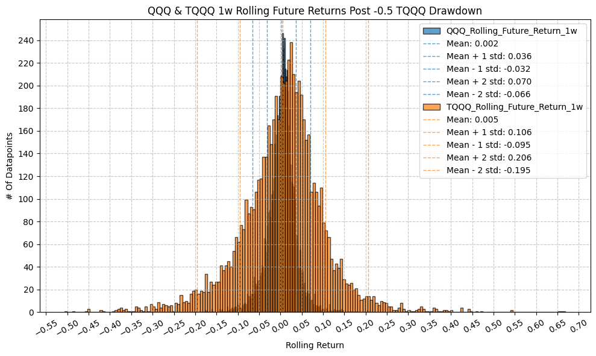
    


    

    


                                      OLS Regression Results                                 
    =========================================================================================
    Dep. Variable:     TQQQ_Rolling_Future_Return_1w   R-squared:                       0.994
    Model:                                       OLS   Adj. R-squared:                  0.994
    Method:                            Least Squares   F-statistic:                 1.110e+06
    Date:                           Fri, 20 Mar 2026   Prob (F-statistic):               0.00
    Time:                                   10:49:12   Log-Likelihood:                 22327.
    No. Observations:                           6457   AIC:                        -4.465e+04
    Df Residuals:                               6455   BIC:                        -4.464e+04
    Df Model:                                      1                                         
    Covariance Type:                       nonrobust                                         
    ================================================================================================
                                       coef    std err          t      P>|t|      [0.025      0.975]
    ------------------------------------------------------------------------------------------------
    const                           -0.0008   9.51e-05     -8.192      0.000      -0.001      -0.001
    QQQ_Rolling_Future_Return_1w     2.9529      0.003   1053.678      0.000       2.947       2.958
    ==============================================================================
    Omnibus:                     3542.548   Durbin-Watson:                   0.887
    Prob(Omnibus):                  0.000   Jarque-Bera (JB):           403047.013
    Skew:                          -1.668   Prob(JB):                         0.00
    Kurtosis:                      41.561   Cond. No.                         29.5
    ==============================================================================
    
    Notes:
    [1] Standard Errors assume that the covariance matrix of the errors is correctly specified.


    

    


    

    


                                      OLS Regression Results                                 
    =========================================================================================
    Dep. Variable:     TQQQ_Rolling_Future_Return_1m   R-squared:                       0.983
    Model:                                       OLS   Adj. R-squared:                  0.983
    Method:                            Least Squares   F-statistic:                 3.617e+05
    Date:                           Fri, 20 Mar 2026   Prob (F-statistic):               0.00
    Time:                                   10:49:13   Log-Likelihood:                 14465.
    No. Observations:                           6441   AIC:                        -2.893e+04
    Df Residuals:                               6439   BIC:                        -2.891e+04
    Df Model:                                      1                                         
    Covariance Type:                       nonrobust                                         
    ================================================================================================
                                       coef    std err          t      P>|t|      [0.025      0.975]
    ------------------------------------------------------------------------------------------------
    const                           -0.0034      0.000    -10.622      0.000      -0.004      -0.003
    QQQ_Rolling_Future_Return_1m     2.9145      0.005    601.389      0.000       2.905       2.924
    ==============================================================================
    Omnibus:                     1492.050   Durbin-Watson:                   0.295
    Prob(Omnibus):                  0.000   Jarque-Bera (JB):            81182.235
    Skew:                           0.050   Prob(JB):                         0.00
    Kurtosis:                      20.392   Cond. No.                         15.2
    ==============================================================================
    
    Notes:
    [1] Standard Errors assume that the covariance matrix of the errors is correctly specified.


    

    


    

    


                                      OLS Regression Results                                 
    =========================================================================================
    Dep. Variable:     TQQQ_Rolling_Future_Return_3m   R-squared:                       0.961
    Model:                                       OLS   Adj. R-squared:                  0.961
    Method:                            Least Squares   F-statistic:                 1.589e+05
    Date:                           Fri, 20 Mar 2026   Prob (F-statistic):               0.00
    Time:                                   10:49:14   Log-Likelihood:                 8431.4
    No. Observations:                           6426   AIC:                        -1.686e+04
    Df Residuals:                               6424   BIC:                        -1.685e+04
    Df Model:                                      1                                         
    Covariance Type:                       nonrobust                                         
    ================================================================================================
                                       coef    std err          t      P>|t|      [0.025      0.975]
    ------------------------------------------------------------------------------------------------
    const                           -0.0063      0.001     -7.545      0.000      -0.008      -0.005
    QQQ_Rolling_Future_Return_3m     2.8920      0.007    398.627      0.000       2.878       2.906
    ==============================================================================
    Omnibus:                     1376.905   Durbin-Watson:                   0.101
    Prob(Omnibus):                  0.000   Jarque-Bera (JB):            15512.908
    Skew:                           0.699   Prob(JB):                         0.00
    Kurtosis:                      10.482   Cond. No.                         8.93
    ==============================================================================
    
    Notes:
    [1] Standard Errors assume that the covariance matrix of the errors is correctly specified.


    

    


    
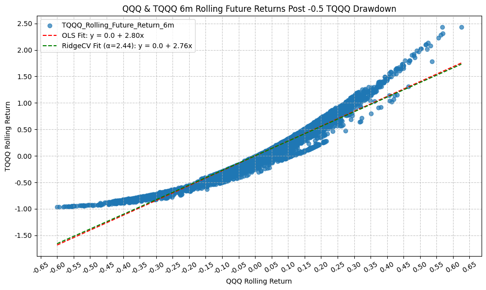
    


                                      OLS Regression Results                                 
    =========================================================================================
    Dep. Variable:     TQQQ_Rolling_Future_Return_6m   R-squared:                       0.931
    Model:                                       OLS   Adj. R-squared:                  0.931
    Method:                            Least Squares   F-statistic:                 8.677e+04
    Date:                           Fri, 20 Mar 2026   Prob (F-statistic):               0.00
    Time:                                   10:49:16   Log-Likelihood:                 4315.5
    No. Observations:                           6396   AIC:                            -8627.
    Df Residuals:                               6394   BIC:                            -8613.
    Df Model:                                      1                                         
    Covariance Type:                       nonrobust                                         
    ================================================================================================
                                       coef    std err          t      P>|t|      [0.025      0.975]
    ------------------------------------------------------------------------------------------------
    const                         5.147e-05      0.002      0.032      0.975      -0.003       0.003
    QQQ_Rolling_Future_Return_6m     2.8038      0.010    294.564      0.000       2.785       2.822
    ==============================================================================
    Omnibus:                     1656.307   Durbin-Watson:                   0.055
    Prob(Omnibus):                  0.000   Jarque-Bera (JB):             8160.166
    Skew:                           1.163   Prob(JB):                         0.00
    Kurtosis:                       8.021   Cond. No.                         6.19
    ==============================================================================
    
    Notes:
    [1] Standard Errors assume that the covariance matrix of the errors is correctly specified.


    

    


    

    


                                      OLS Regression Results                                 
    =========================================================================================
    Dep. Variable:     TQQQ_Rolling_Future_Return_1y   R-squared:                       0.903
    Model:                                       OLS   Adj. R-squared:                  0.902
    Method:                            Least Squares   F-statistic:                 5.802e+04
    Date:                           Fri, 20 Mar 2026   Prob (F-statistic):               0.00
    Time:                                   10:49:17   Log-Likelihood:                 334.22
    No. Observations:                           6270   AIC:                            -664.4
    Df Residuals:                               6268   BIC:                            -650.9
    Df Model:                                      1                                         
    Covariance Type:                       nonrobust                                         
    ================================================================================================
                                       coef    std err          t      P>|t|      [0.025      0.975]
    ------------------------------------------------------------------------------------------------
    const                            0.0204      0.003      6.347      0.000       0.014       0.027
    QQQ_Rolling_Future_Return_1y     2.8641      0.012    240.876      0.000       2.841       2.887
    ==============================================================================
    Omnibus:                     1985.249   Durbin-Watson:                   0.038
    Prob(Omnibus):                  0.000   Jarque-Bera (JB):             8603.706
    Skew:                           1.494   Prob(JB):                         0.00
    Kurtosis:                       7.900   Cond. No.                         4.16
    ==============================================================================
    
    Notes:
    [1] Standard Errors assume that the covariance matrix of the errors is correctly specified.


    

    


    

    


                                      OLS Regression Results                                 
    =========================================================================================
    Dep. Variable:     TQQQ_Rolling_Future_Return_2y   R-squared:                       0.847
    Model:                                       OLS   Adj. R-squared:                  0.847
    Method:                            Least Squares   F-statistic:                 3.335e+04
    Date:                           Fri, 20 Mar 2026   Prob (F-statistic):               0.00
    Time:                                   10:49:18   Log-Likelihood:                -4118.1
    No. Observations:                           6018   AIC:                             8240.
    Df Residuals:                               6016   BIC:                             8254.
    Df Model:                                      1                                         
    Covariance Type:                       nonrobust                                         
    ================================================================================================
                                       coef    std err          t      P>|t|      [0.025      0.975]
    ------------------------------------------------------------------------------------------------
    const                           -0.0363      0.008     -4.611      0.000      -0.052      -0.021
    QQQ_Rolling_Future_Return_2y     3.2472      0.018    182.609      0.000       3.212       3.282
    ==============================================================================
    Omnibus:                     1717.992   Durbin-Watson:                   0.018
    Prob(Omnibus):                  0.000   Jarque-Bera (JB):             5076.764
    Skew:                           1.483   Prob(JB):                         0.00
    Kurtosis:                       6.384   Cond. No.                         3.12
    ==============================================================================
    
    Notes:
    [1] Standard Errors assume that the covariance matrix of the errors is correctly specified.


    

    


    

    


                                      OLS Regression Results                                 
    =========================================================================================
    Dep. Variable:     TQQQ_Rolling_Future_Return_3y   R-squared:                       0.818
    Model:                                       OLS   Adj. R-squared:                  0.818
    Method:                            Least Squares   F-statistic:                 2.593e+04
    Date:                           Fri, 20 Mar 2026   Prob (F-statistic):               0.00
    Time:                                   10:49:19   Log-Likelihood:                -6048.7
    No. Observations:                           5766   AIC:                         1.210e+04
    Df Residuals:                               5764   BIC:                         1.211e+04
    Df Model:                                      1                                         
    Covariance Type:                       nonrobust                                         
    ================================================================================================
                                       coef    std err          t      P>|t|      [0.025      0.975]
    ------------------------------------------------------------------------------------------------
    const                           -0.2658      0.014    -19.546      0.000      -0.292      -0.239
    QQQ_Rolling_Future_Return_3y     3.6831      0.023    161.019      0.000       3.638       3.728
    ==============================================================================
    Omnibus:                      868.557   Durbin-Watson:                   0.015
    Prob(Omnibus):                  0.000   Jarque-Bera (JB):             1586.900
    Skew:                           0.960   Prob(JB):                         0.00
    Kurtosis:                       4.708   Cond. No.                         3.08
    ==============================================================================
    
    Notes:
    [1] Standard Errors assume that the covariance matrix of the errors is correctly specified.


    

    


    

    


                                      OLS Regression Results                                 
    =========================================================================================
    Dep. Variable:     TQQQ_Rolling_Future_Return_4y   R-squared:                       0.785
    Model:                                       OLS   Adj. R-squared:                  0.785
    Method:                            Least Squares   F-statistic:                 2.018e+04
    Date:                           Fri, 20 Mar 2026   Prob (F-statistic):               0.00
    Time:                                   10:49:20   Log-Likelihood:                -8224.2
    No. Observations:                           5514   AIC:                         1.645e+04
    Df Residuals:                               5512   BIC:                         1.647e+04
    Df Model:                                      1                                         
    Covariance Type:                       nonrobust                                         
    ================================================================================================
                                       coef    std err          t      P>|t|      [0.025      0.975]
    ------------------------------------------------------------------------------------------------
    const                           -0.5702      0.024    -23.954      0.000      -0.617      -0.524
    QQQ_Rolling_Future_Return_4y     4.2681      0.030    142.040      0.000       4.209       4.327
    ==============================================================================
    Omnibus:                       66.615   Durbin-Watson:                   0.010
    Prob(Omnibus):                  0.000   Jarque-Bera (JB):               51.542
    Skew:                           0.151   Prob(JB):                     6.42e-12
    Kurtosis:                       2.636   Cond. No.                         3.05
    ==============================================================================
    
    Notes:
    [1] Standard Errors assume that the covariance matrix of the errors is correctly specified.


    

    


    

    


                                      OLS Regression Results                                 
    =========================================================================================
    Dep. Variable:     TQQQ_Rolling_Future_Return_5y   R-squared:                       0.748
    Model:                                       OLS   Adj. R-squared:                  0.748
    Method:                            Least Squares   F-statistic:                 1.562e+04
    Date:                           Fri, 20 Mar 2026   Prob (F-statistic):               0.00
    Time:                                   10:49:21   Log-Likelihood:                -11403.
    No. Observations:                           5262   AIC:                         2.281e+04
    Df Residuals:                               5260   BIC:                         2.282e+04
    Df Model:                                      1                                         
    Covariance Type:                       nonrobust                                         
    ================================================================================================
                                       coef    std err          t      P>|t|      [0.025      0.975]
    ------------------------------------------------------------------------------------------------
    const                           -1.3512      0.049    -27.402      0.000      -1.448      -1.255
    QQQ_Rolling_Future_Return_5y     5.5929      0.045    124.994      0.000       5.505       5.681
    ==============================================================================
    Omnibus:                      240.390   Durbin-Watson:                   0.009
    Prob(Omnibus):                  0.000   Jarque-Bera (JB):              361.528
    Skew:                           0.415   Prob(JB):                     3.13e-79
    Kurtosis:                       3.980   Cond. No.                         3.08
    ==============================================================================
    
    Notes:
    [1] Standard Errors assume that the covariance matrix of the errors is correctly specified.


    

    


    

    


                                      OLS Regression Results                                 
    =========================================================================================
    Dep. Variable:     TQQQ_Rolling_Future_Return_1d   R-squared:                       0.999
    Model:                                       OLS   Adj. R-squared:                  0.999
    Method:                            Least Squares   F-statistic:                 5.999e+06
    Date:                           Fri, 20 Mar 2026   Prob (F-statistic):               0.00
    Time:                                   10:49:23   Log-Likelihood:                 31532.
    No. Observations:                           6280   AIC:                        -6.306e+04
    Df Residuals:                               6278   BIC:                        -6.305e+04
    Df Model:                                      1                                         
    Covariance Type:                       nonrobust                                         
    ================================================================================================
                                       coef    std err          t      P>|t|      [0.025      0.975]
    ------------------------------------------------------------------------------------------------
    const                        -4.233e-05   2.02e-05     -2.100      0.036   -8.18e-05   -2.82e-06
    QQQ_Rolling_Future_Return_1d     2.9547      0.001   2449.278      0.000       2.952       2.957
    ==============================================================================
    Omnibus:                     9286.961   Durbin-Watson:                   2.569
    Prob(Omnibus):                  0.000   Jarque-Bera (JB):         35703537.495
    Skew:                          -8.058   Prob(JB):                         0.00
    Kurtosis:                     372.035   Cond. No.                         59.9
    ==============================================================================
    
    Notes:
    [1] Standard Errors assume that the covariance matrix of the errors is correctly specified.


    
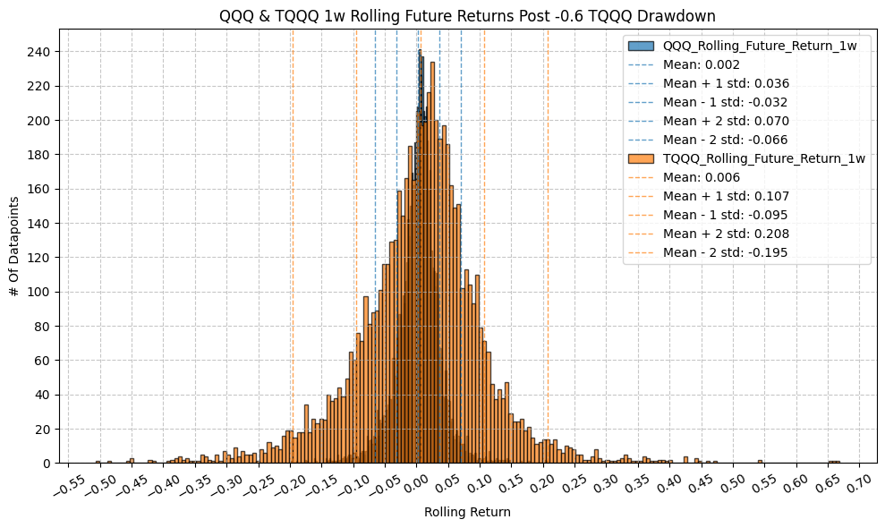
    


    

    


                                      OLS Regression Results                                 
    =========================================================================================
    Dep. Variable:     TQQQ_Rolling_Future_Return_1w   R-squared:                       0.994
    Model:                                       OLS   Adj. R-squared:                  0.994
    Method:                            Least Squares   F-statistic:                 1.076e+06
    Date:                           Fri, 20 Mar 2026   Prob (F-statistic):               0.00
    Time:                                   10:49:24   Log-Likelihood:                 21675.
    No. Observations:                           6280   AIC:                        -4.335e+04
    Df Residuals:                               6278   BIC:                        -4.333e+04
    Df Model:                                      1                                         
    Covariance Type:                       nonrobust                                         
    ================================================================================================
                                       coef    std err          t      P>|t|      [0.025      0.975]
    ------------------------------------------------------------------------------------------------
    const                           -0.0007    9.7e-05     -7.552      0.000      -0.001      -0.001
    QQQ_Rolling_Future_Return_1w     2.9525      0.003   1037.390      0.000       2.947       2.958
    ==============================================================================
    Omnibus:                     3408.663   Durbin-Watson:                   0.895
    Prob(Omnibus):                  0.000   Jarque-Bera (JB):           384677.004
    Skew:                          -1.640   Prob(JB):                         0.00
    Kurtosis:                      41.201   Cond. No.                         29.4
    ==============================================================================
    
    Notes:
    [1] Standard Errors assume that the covariance matrix of the errors is correctly specified.


    

    


    
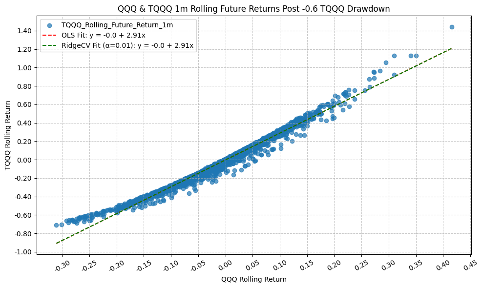
    


                                      OLS Regression Results                                 
    =========================================================================================
    Dep. Variable:     TQQQ_Rolling_Future_Return_1m   R-squared:                       0.982
    Model:                                       OLS   Adj. R-squared:                  0.982
    Method:                            Least Squares   F-statistic:                 3.507e+05
    Date:                           Fri, 20 Mar 2026   Prob (F-statistic):               0.00
    Time:                                   10:49:25   Log-Likelihood:                 14068.
    No. Observations:                           6280   AIC:                        -2.813e+04
    Df Residuals:                               6278   BIC:                        -2.812e+04
    Df Model:                                      1                                         
    Covariance Type:                       nonrobust                                         
    ================================================================================================
                                       coef    std err          t      P>|t|      [0.025      0.975]
    ------------------------------------------------------------------------------------------------
    const                           -0.0032      0.000     -9.790      0.000      -0.004      -0.003
    QQQ_Rolling_Future_Return_1m     2.9141      0.005    592.180      0.000       2.904       2.924
    ==============================================================================
    Omnibus:                     1452.390   Durbin-Watson:                   0.296
    Prob(Omnibus):                  0.000   Jarque-Bera (JB):            78375.812
    Skew:                           0.053   Prob(JB):                         0.00
    Kurtosis:                      20.306   Cond. No.                         15.1
    ==============================================================================
    
    Notes:
    [1] Standard Errors assume that the covariance matrix of the errors is correctly specified.


    

    


    

    


                                      OLS Regression Results                                 
    =========================================================================================
    Dep. Variable:     TQQQ_Rolling_Future_Return_3m   R-squared:                       0.961
    Model:                                       OLS   Adj. R-squared:                  0.961
    Method:                            Least Squares   F-statistic:                 1.566e+05
    Date:                           Fri, 20 Mar 2026   Prob (F-statistic):               0.00
    Time:                                   10:49:26   Log-Likelihood:                 8264.1
    No. Observations:                           6280   AIC:                        -1.652e+04
    Df Residuals:                               6278   BIC:                        -1.651e+04
    Df Model:                                      1                                         
    Covariance Type:                       nonrobust                                         
    ================================================================================================
                                       coef    std err          t      P>|t|      [0.025      0.975]
    ------------------------------------------------------------------------------------------------
    const                           -0.0059      0.001     -7.039      0.000      -0.008      -0.004
    QQQ_Rolling_Future_Return_3m     2.8978      0.007    395.691      0.000       2.883       2.912
    ==============================================================================
    Omnibus:                     1352.145   Durbin-Watson:                   0.102
    Prob(Omnibus):                  0.000   Jarque-Bera (JB):            15599.625
    Skew:                           0.696   Prob(JB):                         0.00
    Kurtosis:                      10.595   Cond. No.                         8.95
    ==============================================================================
    
    Notes:
    [1] Standard Errors assume that the covariance matrix of the errors is correctly specified.


    

    


    

    


                                      OLS Regression Results                                 
    =========================================================================================
    Dep. Variable:     TQQQ_Rolling_Future_Return_6m   R-squared:                       0.932
    Model:                                       OLS   Adj. R-squared:                  0.932
    Method:                            Least Squares   F-statistic:                 8.613e+04
    Date:                           Fri, 20 Mar 2026   Prob (F-statistic):               0.00
    Time:                                   10:49:27   Log-Likelihood:                 4282.0
    No. Observations:                           6280   AIC:                            -8560.
    Df Residuals:                               6278   BIC:                            -8547.
    Df Model:                                      1                                         
    Covariance Type:                       nonrobust                                         
    ================================================================================================
                                       coef    std err          t      P>|t|      [0.025      0.975]
    ------------------------------------------------------------------------------------------------
    const                           -0.0002      0.002     -0.128      0.898      -0.003       0.003
    QQQ_Rolling_Future_Return_6m     2.8191      0.010    293.485      0.000       2.800       2.838
    ==============================================================================
    Omnibus:                     1637.708   Durbin-Watson:                   0.057
    Prob(Omnibus):                  0.000   Jarque-Bera (JB):             8395.371
    Skew:                           1.159   Prob(JB):                         0.00
    Kurtosis:                       8.168   Cond. No.                         6.24
    ==============================================================================
    
    Notes:
    [1] Standard Errors assume that the covariance matrix of the errors is correctly specified.


    

    


    

    


                                      OLS Regression Results                                 
    =========================================================================================
    Dep. Variable:     TQQQ_Rolling_Future_Return_1y   R-squared:                       0.904
    Model:                                       OLS   Adj. R-squared:                  0.904
    Method:                            Least Squares   F-statistic:                 5.852e+04
    Date:                           Fri, 20 Mar 2026   Prob (F-statistic):               0.00
    Time:                                   10:49:28   Log-Likelihood:                 405.40
    No. Observations:                           6203   AIC:                            -806.8
    Df Residuals:                               6201   BIC:                            -793.3
    Df Model:                                      1                                         
    Covariance Type:                       nonrobust                                         
    ================================================================================================
                                       coef    std err          t      P>|t|      [0.025      0.975]
    ------------------------------------------------------------------------------------------------
    const                            0.0161      0.003      5.004      0.000       0.010       0.022
    QQQ_Rolling_Future_Return_1y     2.8917      0.012    241.915      0.000       2.868       2.915
    ==============================================================================
    Omnibus:                     1968.898   Durbin-Watson:                   0.038
    Prob(Omnibus):                  0.000   Jarque-Bera (JB):             8752.375
    Skew:                           1.488   Prob(JB):                         0.00
    Kurtosis:                       8.001   Cond. No.                         4.22
    ==============================================================================
    
    Notes:
    [1] Standard Errors assume that the covariance matrix of the errors is correctly specified.


    

    


    

    


                                      OLS Regression Results                                 
    =========================================================================================
    Dep. Variable:     TQQQ_Rolling_Future_Return_2y   R-squared:                       0.850
    Model:                                       OLS   Adj. R-squared:                  0.850
    Method:                            Least Squares   F-statistic:                 3.399e+04
    Date:                           Fri, 20 Mar 2026   Prob (F-statistic):               0.00
    Time:                                   10:49:30   Log-Likelihood:                -4014.1
    No. Observations:                           5981   AIC:                             8032.
    Df Residuals:                               5979   BIC:                             8046.
    Df Model:                                      1                                         
    Covariance Type:                       nonrobust                                         
    ================================================================================================
                                       coef    std err          t      P>|t|      [0.025      0.975]
    ------------------------------------------------------------------------------------------------
    const                           -0.0506      0.008     -6.427      0.000      -0.066      -0.035
    QQQ_Rolling_Future_Return_2y     3.2855      0.018    184.363      0.000       3.251       3.320
    ==============================================================================
    Omnibus:                     1728.443   Durbin-Watson:                   0.019
    Prob(Omnibus):                  0.000   Jarque-Bera (JB):             5275.936
    Skew:                           1.487   Prob(JB):                         0.00
    Kurtosis:                       6.511   Cond. No.                         3.16
    ==============================================================================
    
    Notes:
    [1] Standard Errors assume that the covariance matrix of the errors is correctly specified.


    
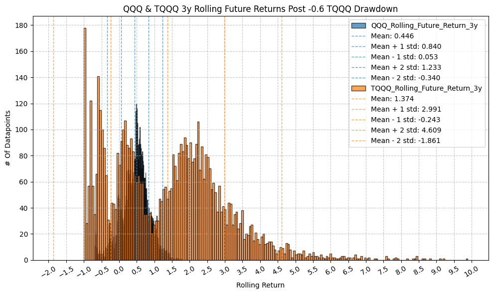
    


    

    


                                      OLS Regression Results                                 
    =========================================================================================
    Dep. Variable:     TQQQ_Rolling_Future_Return_3y   R-squared:                       0.822
    Model:                                       OLS   Adj. R-squared:                  0.821
    Method:                            Least Squares   F-statistic:                 2.636e+04
    Date:                           Fri, 20 Mar 2026   Prob (F-statistic):               0.00
    Time:                                   10:49:31   Log-Likelihood:                -5946.3
    No. Observations:                           5729   AIC:                         1.190e+04
    Df Residuals:                               5727   BIC:                         1.191e+04
    Df Model:                                      1                                         
    Covariance Type:                       nonrobust                                         
    ================================================================================================
                                       coef    std err          t      P>|t|      [0.025      0.975]
    ------------------------------------------------------------------------------------------------
    const                           -0.2889      0.014    -21.162      0.000      -0.316      -0.262
    QQQ_Rolling_Future_Return_3y     3.7263      0.023    162.363      0.000       3.681       3.771
    ==============================================================================
    Omnibus:                      848.663   Durbin-Watson:                   0.015
    Prob(Omnibus):                  0.000   Jarque-Bera (JB):             1563.131
    Skew:                           0.942   Prob(JB):                         0.00
    Kurtosis:                       4.731   Cond. No.                         3.12
    ==============================================================================
    
    Notes:
    [1] Standard Errors assume that the covariance matrix of the errors is correctly specified.


    

    


    

    


                                      OLS Regression Results                                 
    =========================================================================================
    Dep. Variable:     TQQQ_Rolling_Future_Return_4y   R-squared:                       0.789
    Model:                                       OLS   Adj. R-squared:                  0.788
    Method:                            Least Squares   F-statistic:                 2.041e+04
    Date:                           Fri, 20 Mar 2026   Prob (F-statistic):               0.00
    Time:                                   10:49:32   Log-Likelihood:                -8124.3
    No. Observations:                           5477   AIC:                         1.625e+04
    Df Residuals:                               5475   BIC:                         1.627e+04
    Df Model:                                      1                                         
    Covariance Type:                       nonrobust                                         
    ================================================================================================
                                       coef    std err          t      P>|t|      [0.025      0.975]
    ------------------------------------------------------------------------------------------------
    const                           -0.6024      0.024    -25.154      0.000      -0.649      -0.555
    QQQ_Rolling_Future_Return_4y     4.3129      0.030    142.871      0.000       4.254       4.372
    ==============================================================================
    Omnibus:                       52.134   Durbin-Watson:                   0.010
    Prob(Omnibus):                  0.000   Jarque-Bera (JB):               41.049
    Skew:                           0.131   Prob(JB):                     1.22e-09
    Kurtosis:                       2.666   Cond. No.                         3.09
    ==============================================================================
    
    Notes:
    [1] Standard Errors assume that the covariance matrix of the errors is correctly specified.


    

    


    

    


                                      OLS Regression Results                                 
    =========================================================================================
    Dep. Variable:     TQQQ_Rolling_Future_Return_5y   R-squared:                       0.750
    Model:                                       OLS   Adj. R-squared:                  0.750
    Method:                            Least Squares   F-statistic:                 1.573e+04
    Date:                           Fri, 20 Mar 2026   Prob (F-statistic):               0.00
    Time:                                   10:49:33   Log-Likelihood:                -11337.
    No. Observations:                           5242   AIC:                         2.268e+04
    Df Residuals:                               5240   BIC:                         2.269e+04
    Df Model:                                      1                                         
    Covariance Type:                       nonrobust                                         
    ================================================================================================
                                       coef    std err          t      P>|t|      [0.025      0.975]
    ------------------------------------------------------------------------------------------------
    const                           -1.4123      0.050    -28.435      0.000      -1.510      -1.315
    QQQ_Rolling_Future_Return_5y     5.6450      0.045    125.420      0.000       5.557       5.733
    ==============================================================================
    Omnibus:                      227.364   Durbin-Watson:                   0.009
    Prob(Omnibus):                  0.000   Jarque-Bera (JB):              348.243
    Skew:                           0.393   Prob(JB):                     2.40e-76
    Kurtosis:                       3.988   Cond. No.                         3.11
    ==============================================================================
    
    Notes:
    [1] Standard Errors assume that the covariance matrix of the errors is correctly specified.


    

    


    

    


                                      OLS Regression Results                                 
    =========================================================================================
    Dep. Variable:     TQQQ_Rolling_Future_Return_1d   R-squared:                       0.999
    Model:                                       OLS   Adj. R-squared:                  0.999
    Method:                            Least Squares   F-statistic:                 5.379e+06
    Date:                           Fri, 20 Mar 2026   Prob (F-statistic):               0.00
    Time:                                   10:49:34   Log-Likelihood:                 29443.
    No. Observations:                           5890   AIC:                        -5.888e+04
    Df Residuals:                               5888   BIC:                        -5.887e+04
    Df Model:                                      1                                         
    Covariance Type:                       nonrobust                                         
    ================================================================================================
                                       coef    std err          t      P>|t|      [0.025      0.975]
    ------------------------------------------------------------------------------------------------
    const                        -3.035e-05   2.13e-05     -1.426      0.154   -7.21e-05    1.14e-05
    QQQ_Rolling_Future_Return_1d     2.9544      0.001   2319.365      0.000       2.952       2.957
    ==============================================================================
    Omnibus:                     8698.243   Durbin-Watson:                   2.576
    Prob(Omnibus):                  0.000   Jarque-Bera (JB):         31779112.797
    Skew:                          -8.044   Prob(JB):                         0.00
    Kurtosis:                     362.488   Cond. No.                         59.9
    ==============================================================================
    
    Notes:
    [1] Standard Errors assume that the covariance matrix of the errors is correctly specified.


    

    


    

    


                                      OLS Regression Results                                 
    =========================================================================================
    Dep. Variable:     TQQQ_Rolling_Future_Return_1w   R-squared:                       0.994
    Model:                                       OLS   Adj. R-squared:                  0.994
    Method:                            Least Squares   F-statistic:                 1.008e+06
    Date:                           Fri, 20 Mar 2026   Prob (F-statistic):               0.00
    Time:                                   10:49:35   Log-Likelihood:                 20303.
    No. Observations:                           5890   AIC:                        -4.060e+04
    Df Residuals:                               5888   BIC:                        -4.059e+04
    Df Model:                                      1                                         
    Covariance Type:                       nonrobust                                         
    ================================================================================================
                                       coef    std err          t      P>|t|      [0.025      0.975]
    ------------------------------------------------------------------------------------------------
    const                           -0.0006      0.000     -6.362      0.000      -0.001      -0.000
    QQQ_Rolling_Future_Return_1w     2.9525      0.003   1003.864      0.000       2.947       2.958
    ==============================================================================
    Omnibus:                     3288.178   Durbin-Watson:                   0.897
    Prob(Omnibus):                  0.000   Jarque-Bera (JB):           369130.882
    Skew:                          -1.720   Prob(JB):                         0.00
    Kurtosis:                      41.630   Cond. No.                         29.3
    ==============================================================================
    
    Notes:
    [1] Standard Errors assume that the covariance matrix of the errors is correctly specified.


    

    


    

    


                                      OLS Regression Results                                 
    =========================================================================================
    Dep. Variable:     TQQQ_Rolling_Future_Return_1m   R-squared:                       0.983
    Model:                                       OLS   Adj. R-squared:                  0.983
    Method:                            Least Squares   F-statistic:                 3.372e+05
    Date:                           Fri, 20 Mar 2026   Prob (F-statistic):               0.00
    Time:                                   10:49:36   Log-Likelihood:                 13210.
    No. Observations:                           5890   AIC:                        -2.642e+04
    Df Residuals:                               5888   BIC:                        -2.640e+04
    Df Model:                                      1                                         
    Covariance Type:                       nonrobust                                         
    ================================================================================================
                                       coef    std err          t      P>|t|      [0.025      0.975]
    ------------------------------------------------------------------------------------------------
    const                           -0.0025      0.000     -7.378      0.000      -0.003      -0.002
    QQQ_Rolling_Future_Return_1m     2.9139      0.005    580.680      0.000       2.904       2.924
    ==============================================================================
    Omnibus:                     1415.287   Durbin-Watson:                   0.310
    Prob(Omnibus):                  0.000   Jarque-Bera (JB):            78290.616
    Skew:                           0.193   Prob(JB):                         0.00
    Kurtosis:                      20.857   Cond. No.                         15.0
    ==============================================================================
    
    Notes:
    [1] Standard Errors assume that the covariance matrix of the errors is correctly specified.


    

    


    

    


                                      OLS Regression Results                                 
    =========================================================================================
    Dep. Variable:     TQQQ_Rolling_Future_Return_3m   R-squared:                       0.962
    Model:                                       OLS   Adj. R-squared:                  0.962
    Method:                            Least Squares   F-statistic:                 1.509e+05
    Date:                           Fri, 20 Mar 2026   Prob (F-statistic):               0.00
    Time:                                   10:49:38   Log-Likelihood:                 7799.8
    No. Observations:                           5890   AIC:                        -1.560e+04
    Df Residuals:                               5888   BIC:                        -1.558e+04
    Df Model:                                      1                                         
    Covariance Type:                       nonrobust                                         
    ================================================================================================
                                       coef    std err          t      P>|t|      [0.025      0.975]
    ------------------------------------------------------------------------------------------------
    const                           -0.0040      0.001     -4.618      0.000      -0.006      -0.002
    QQQ_Rolling_Future_Return_3m     2.9067      0.007    388.462      0.000       2.892       2.921
    ==============================================================================
    Omnibus:                     1368.503   Durbin-Watson:                   0.107
    Prob(Omnibus):                  0.000   Jarque-Bera (JB):            16451.047
    Skew:                           0.766   Prob(JB):                         0.00
    Kurtosis:                      11.043   Cond. No.                         8.93
    ==============================================================================
    
    Notes:
    [1] Standard Errors assume that the covariance matrix of the errors is correctly specified.


    

    


    

    


                                      OLS Regression Results                                 
    =========================================================================================
    Dep. Variable:     TQQQ_Rolling_Future_Return_6m   R-squared:                       0.934
    Model:                                       OLS   Adj. R-squared:                  0.934
    Method:                            Least Squares   F-statistic:                 8.379e+04
    Date:                           Fri, 20 Mar 2026   Prob (F-statistic):               0.00
    Time:                                   10:49:39   Log-Likelihood:                 4198.9
    No. Observations:                           5890   AIC:                            -8394.
    Df Residuals:                               5888   BIC:                            -8380.
    Df Model:                                      1                                         
    Covariance Type:                       nonrobust                                         
    ================================================================================================
                                       coef    std err          t      P>|t|      [0.025      0.975]
    ------------------------------------------------------------------------------------------------
    const                           -0.0017      0.002     -1.051      0.293      -0.005       0.002
    QQQ_Rolling_Future_Return_6m     2.8731      0.010    289.463      0.000       2.854       2.893
    ==============================================================================
    Omnibus:                     1462.326   Durbin-Watson:                   0.063
    Prob(Omnibus):                  0.000   Jarque-Bera (JB):             8112.048
    Skew:                           1.074   Prob(JB):                         0.00
    Kurtosis:                       8.333   Cond. No.                         6.45
    ==============================================================================
    
    Notes:
    [1] Standard Errors assume that the covariance matrix of the errors is correctly specified.


    

    


    

    


                                      OLS Regression Results                                 
    =========================================================================================
    Dep. Variable:     TQQQ_Rolling_Future_Return_1y   R-squared:                       0.912
    Model:                                       OLS   Adj. R-squared:                  0.912
    Method:                            Least Squares   F-statistic:                 6.072e+04
    Date:                           Fri, 20 Mar 2026   Prob (F-statistic):               0.00
    Time:                                   10:49:40   Log-Likelihood:                 715.59
    No. Observations:                           5856   AIC:                            -1427.
    Df Residuals:                               5854   BIC:                            -1414.
    Df Model:                                      1                                         
    Covariance Type:                       nonrobust                                         
    ================================================================================================
                                       coef    std err          t      P>|t|      [0.025      0.975]
    ------------------------------------------------------------------------------------------------
    const                           -0.0010      0.003     -0.316      0.752      -0.007       0.005
    QQQ_Rolling_Future_Return_1y     3.0129      0.012    246.417      0.000       2.989       3.037
    ==============================================================================
    Omnibus:                     1765.294   Durbin-Watson:                   0.043
    Prob(Omnibus):                  0.000   Jarque-Bera (JB):             8324.815
    Skew:                           1.385   Prob(JB):                         0.00
    Kurtosis:                       8.142   Cond. No.                         4.45
    ==============================================================================
    
    Notes:
    [1] Standard Errors assume that the covariance matrix of the errors is correctly specified.


    
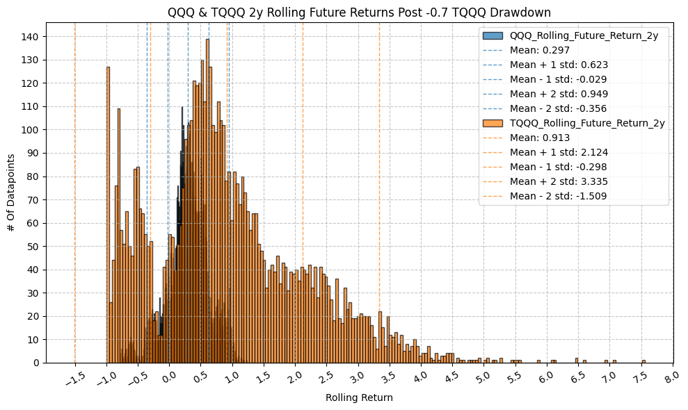
    


    
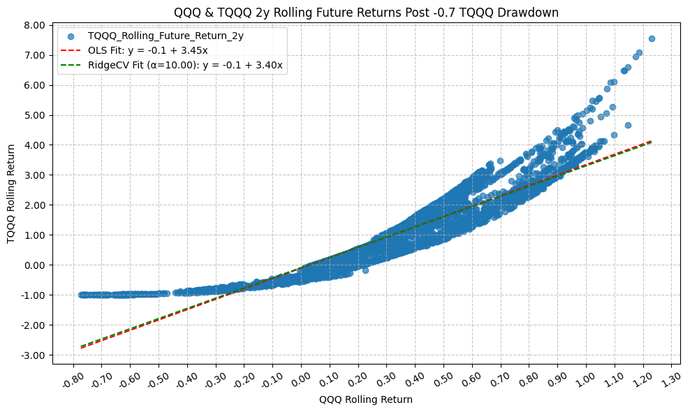
    


                                      OLS Regression Results                                 
    =========================================================================================
    Dep. Variable:     TQQQ_Rolling_Future_Return_2y   R-squared:                       0.865
    Model:                                       OLS   Adj. R-squared:                  0.865
    Method:                            Least Squares   F-statistic:                 3.712e+04
    Date:                           Fri, 20 Mar 2026   Prob (F-statistic):               0.00
    Time:                                   10:49:41   Log-Likelihood:                -3521.7
    No. Observations:                           5788   AIC:                             7047.
    Df Residuals:                               5786   BIC:                             7061.
    Df Model:                                      1                                         
    Covariance Type:                       nonrobust                                         
    ================================================================================================
                                       coef    std err          t      P>|t|      [0.025      0.975]
    ------------------------------------------------------------------------------------------------
    const                           -0.1120      0.008    -14.174      0.000      -0.128      -0.097
    QQQ_Rolling_Future_Return_2y     3.4520      0.018    192.658      0.000       3.417       3.487
    ==============================================================================
    Omnibus:                     1654.872   Durbin-Watson:                   0.020
    Prob(Omnibus):                  0.000   Jarque-Bera (JB):             5614.207
    Skew:                           1.426   Prob(JB):                         0.00
    Kurtosis:                       6.891   Cond. No.                         3.36
    ==============================================================================
    
    Notes:
    [1] Standard Errors assume that the covariance matrix of the errors is correctly specified.


    

    


    
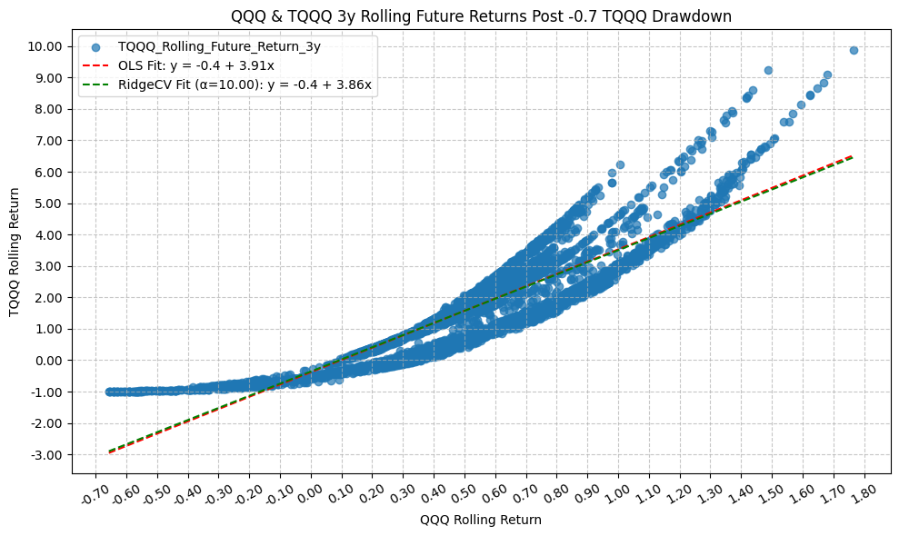
    


                                      OLS Regression Results                                 
    =========================================================================================
    Dep. Variable:     TQQQ_Rolling_Future_Return_3y   R-squared:                       0.838
    Model:                                       OLS   Adj. R-squared:                  0.838
    Method:                            Least Squares   F-statistic:                 2.860e+04
    Date:                           Fri, 20 Mar 2026   Prob (F-statistic):               0.00
    Time:                                   10:49:42   Log-Likelihood:                -5447.4
    No. Observations:                           5536   AIC:                         1.090e+04
    Df Residuals:                               5534   BIC:                         1.091e+04
    Df Model:                                      1                                         
    Covariance Type:                       nonrobust                                         
    ================================================================================================
                                       coef    std err          t      P>|t|      [0.025      0.975]
    ------------------------------------------------------------------------------------------------
    const                           -0.3842      0.014    -27.762      0.000      -0.411      -0.357
    QQQ_Rolling_Future_Return_3y     3.9121      0.023    169.102      0.000       3.867       3.957
    ==============================================================================
    Omnibus:                      673.372   Durbin-Watson:                   0.016
    Prob(Omnibus):                  0.000   Jarque-Bera (JB):             1250.889
    Skew:                           0.793   Prob(JB):                    2.36e-272
    Kurtosis:                       4.705   Cond. No.                         3.31
    ==============================================================================
    
    Notes:
    [1] Standard Errors assume that the covariance matrix of the errors is correctly specified.


    

    


    

    


                                      OLS Regression Results                                 
    =========================================================================================
    Dep. Variable:     TQQQ_Rolling_Future_Return_4y   R-squared:                       0.805
    Model:                                       OLS   Adj. R-squared:                  0.805
    Method:                            Least Squares   F-statistic:                 2.186e+04
    Date:                           Fri, 20 Mar 2026   Prob (F-statistic):               0.00
    Time:                                   10:49:43   Log-Likelihood:                -7607.1
    No. Observations:                           5284   AIC:                         1.522e+04
    Df Residuals:                               5282   BIC:                         1.523e+04
    Df Model:                                      1                                         
    Covariance Type:                       nonrobust                                         
    ================================================================================================
                                       coef    std err          t      P>|t|      [0.025      0.975]
    ------------------------------------------------------------------------------------------------
    const                           -0.7330      0.024    -30.056      0.000      -0.781      -0.685
    QQQ_Rolling_Future_Return_4y     4.5098      0.031    147.842      0.000       4.450       4.570
    ==============================================================================
    Omnibus:                       12.832   Durbin-Watson:                   0.011
    Prob(Omnibus):                  0.002   Jarque-Bera (JB):               10.417
    Skew:                          -0.007   Prob(JB):                      0.00547
    Kurtosis:                       2.783   Cond. No.                         3.25
    ==============================================================================
    
    Notes:
    [1] Standard Errors assume that the covariance matrix of the errors is correctly specified.


    

    


    

    


                                      OLS Regression Results                                 
    =========================================================================================
    Dep. Variable:     TQQQ_Rolling_Future_Return_5y   R-squared:                       0.759
    Model:                                       OLS   Adj. R-squared:                  0.759
    Method:                            Least Squares   F-statistic:                 1.625e+04
    Date:                           Fri, 20 Mar 2026   Prob (F-statistic):               0.00
    Time:                                   10:49:44   Log-Likelihood:                -11062.
    No. Observations:                           5162   AIC:                         2.213e+04
    Df Residuals:                               5160   BIC:                         2.214e+04
    Df Model:                                      1                                         
    Covariance Type:                       nonrobust                                         
    ================================================================================================
                                       coef    std err          t      P>|t|      [0.025      0.975]
    ------------------------------------------------------------------------------------------------
    const                           -1.6765      0.051    -32.809      0.000      -1.777      -1.576
    QQQ_Rolling_Future_Return_5y     5.8697      0.046    127.460      0.000       5.779       5.960
    ==============================================================================
    Omnibus:                      168.674   Durbin-Watson:                   0.010
    Prob(Omnibus):                  0.000   Jarque-Bera (JB):              286.815
    Skew:                           0.283   Prob(JB):                     5.24e-63
    Kurtosis:                       4.007   Cond. No.                         3.27
    ==============================================================================
    
    Notes:
    [1] Standard Errors assume that the covariance matrix of the errors is correctly specified.


    

    


    
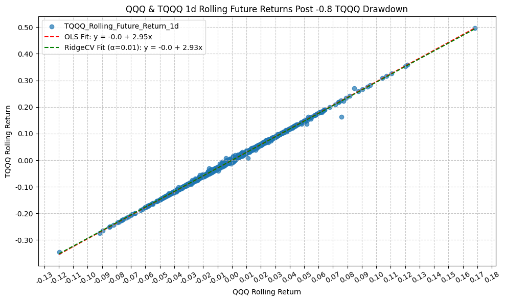
    


                                      OLS Regression Results                                 
    =========================================================================================
    Dep. Variable:     TQQQ_Rolling_Future_Return_1d   R-squared:                       0.999
    Model:                                       OLS   Adj. R-squared:                  0.999
    Method:                            Least Squares   F-statistic:                 4.765e+06
    Date:                           Fri, 20 Mar 2026   Prob (F-statistic):               0.00
    Time:                                   10:49:45   Log-Likelihood:                 27161.
    No. Observations:                           5449   AIC:                        -5.432e+04
    Df Residuals:                               5447   BIC:                        -5.431e+04
    Df Model:                                      1                                         
    Covariance Type:                       nonrobust                                         
    ================================================================================================
                                       coef    std err          t      P>|t|      [0.025      0.975]
    ------------------------------------------------------------------------------------------------
    const                        -1.579e-05   2.24e-05     -0.703      0.482   -5.98e-05    2.82e-05
    QQQ_Rolling_Future_Return_1d     2.9531      0.001   2182.969      0.000       2.950       2.956
    ==============================================================================
    Omnibus:                     8181.984   Durbin-Watson:                   2.578
    Prob(Omnibus):                  0.000   Jarque-Bera (JB):         30330198.571
    Skew:                          -8.325   Prob(JB):                         0.00
    Kurtosis:                     368.118   Cond. No.                         60.3
    ==============================================================================
    
    Notes:
    [1] Standard Errors assume that the covariance matrix of the errors is correctly specified.


    
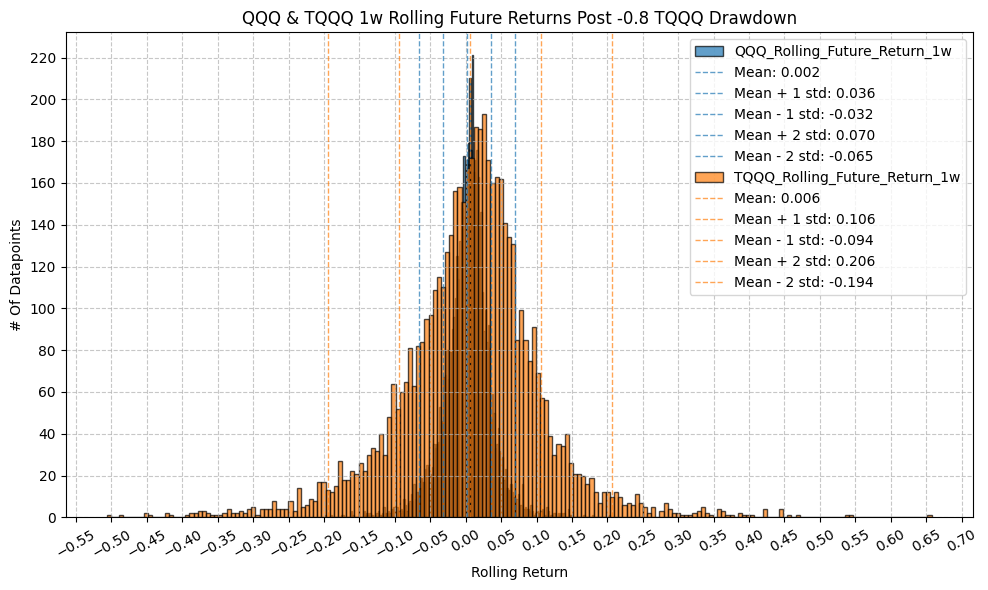
    


    

    


                                      OLS Regression Results                                 
    =========================================================================================
    Dep. Variable:     TQQQ_Rolling_Future_Return_1w   R-squared:                       0.994
    Model:                                       OLS   Adj. R-squared:                  0.994
    Method:                            Least Squares   F-statistic:                 9.353e+05
    Date:                           Fri, 20 Mar 2026   Prob (F-statistic):               0.00
    Time:                                   10:49:47   Log-Likelihood:                 18852.
    No. Observations:                           5449   AIC:                        -3.770e+04
    Df Residuals:                               5447   BIC:                        -3.769e+04
    Df Model:                                      1                                         
    Covariance Type:                       nonrobust                                         
    ================================================================================================
                                       coef    std err          t      P>|t|      [0.025      0.975]
    ------------------------------------------------------------------------------------------------
    const                           -0.0006      0.000     -5.494      0.000      -0.001      -0.000
    QQQ_Rolling_Future_Return_1w     2.9495      0.003    967.121      0.000       2.944       2.955
    ==============================================================================
    Omnibus:                     3225.668   Durbin-Watson:                   0.872
    Prob(Omnibus):                  0.000   Jarque-Bera (JB):           383700.484
    Skew:                          -1.881   Prob(JB):                         0.00
    Kurtosis:                      43.937   Cond. No.                         29.6
    ==============================================================================
    
    Notes:
    [1] Standard Errors assume that the covariance matrix of the errors is correctly specified.


    

    


    

    


                                      OLS Regression Results                                 
    =========================================================================================
    Dep. Variable:     TQQQ_Rolling_Future_Return_1m   R-squared:                       0.982
    Model:                                       OLS   Adj. R-squared:                  0.982
    Method:                            Least Squares   F-statistic:                 3.035e+05
    Date:                           Fri, 20 Mar 2026   Prob (F-statistic):               0.00
    Time:                                   10:49:48   Log-Likelihood:                 12187.
    No. Observations:                           5449   AIC:                        -2.437e+04
    Df Residuals:                               5447   BIC:                        -2.436e+04
    Df Model:                                      1                                         
    Covariance Type:                       nonrobust                                         
    ================================================================================================
                                       coef    std err          t      P>|t|      [0.025      0.975]
    ------------------------------------------------------------------------------------------------
    const                           -0.0021      0.000     -5.906      0.000      -0.003      -0.001
    QQQ_Rolling_Future_Return_1m     2.9063      0.005    550.870      0.000       2.896       2.917
    ==============================================================================
    Omnibus:                     1330.819   Durbin-Watson:                   0.299
    Prob(Omnibus):                  0.000   Jarque-Bera (JB):            76755.730
    Skew:                           0.205   Prob(JB):                         0.00
    Kurtosis:                      21.382   Cond. No.                         15.1
    ==============================================================================
    
    Notes:
    [1] Standard Errors assume that the covariance matrix of the errors is correctly specified.


    

    


    

    


                                      OLS Regression Results                                 
    =========================================================================================
    Dep. Variable:     TQQQ_Rolling_Future_Return_3m   R-squared:                       0.961
    Model:                                       OLS   Adj. R-squared:                  0.961
    Method:                            Least Squares   F-statistic:                 1.352e+05
    Date:                           Fri, 20 Mar 2026   Prob (F-statistic):               0.00
    Time:                                   10:49:49   Log-Likelihood:                 7157.9
    No. Observations:                           5449   AIC:                        -1.431e+04
    Df Residuals:                               5447   BIC:                        -1.430e+04
    Df Model:                                      1                                         
    Covariance Type:                       nonrobust                                         
    ================================================================================================
                                       coef    std err          t      P>|t|      [0.025      0.975]
    ------------------------------------------------------------------------------------------------
    const                           -0.0036      0.001     -3.906      0.000      -0.005      -0.002
    QQQ_Rolling_Future_Return_3m     2.9142      0.008    367.643      0.000       2.899       2.930
    ==============================================================================
    Omnibus:                     1264.663   Durbin-Watson:                   0.097
    Prob(Omnibus):                  0.000   Jarque-Bera (JB):            15806.472
    Skew:                           0.752   Prob(JB):                         0.00
    Kurtosis:                      11.207   Cond. No.                         9.00
    ==============================================================================
    
    Notes:
    [1] Standard Errors assume that the covariance matrix of the errors is correctly specified.


    
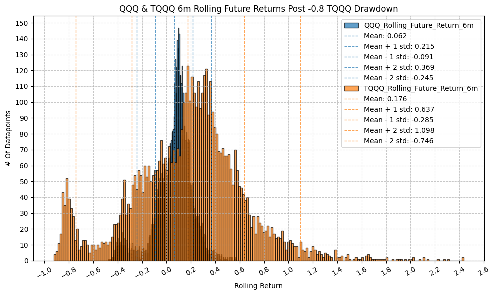
    


    

    


                                      OLS Regression Results                                 
    =========================================================================================
    Dep. Variable:     TQQQ_Rolling_Future_Return_6m   R-squared:                       0.937
    Model:                                       OLS   Adj. R-squared:                  0.937
    Method:                            Least Squares   F-statistic:                 8.114e+04
    Date:                           Fri, 20 Mar 2026   Prob (F-statistic):               0.00
    Time:                                   10:49:50   Log-Likelihood:                 4026.4
    No. Observations:                           5449   AIC:                            -8049.
    Df Residuals:                               5447   BIC:                            -8036.
    Df Model:                                      1                                         
    Covariance Type:                       nonrobust                                         
    ================================================================================================
                                       coef    std err          t      P>|t|      [0.025      0.975]
    ------------------------------------------------------------------------------------------------
    const                           -0.0043      0.002     -2.536      0.011      -0.008      -0.001
    QQQ_Rolling_Future_Return_6m     2.9102      0.010    284.854      0.000       2.890       2.930
    ==============================================================================
    Omnibus:                      970.997   Durbin-Watson:                   0.062
    Prob(Omnibus):                  0.000   Jarque-Bera (JB):             4549.111
    Skew:                           0.789   Prob(JB):                         0.00
    Kurtosis:                       7.189   Cond. No.                         6.55
    ==============================================================================
    
    Notes:
    [1] Standard Errors assume that the covariance matrix of the errors is correctly specified.


    
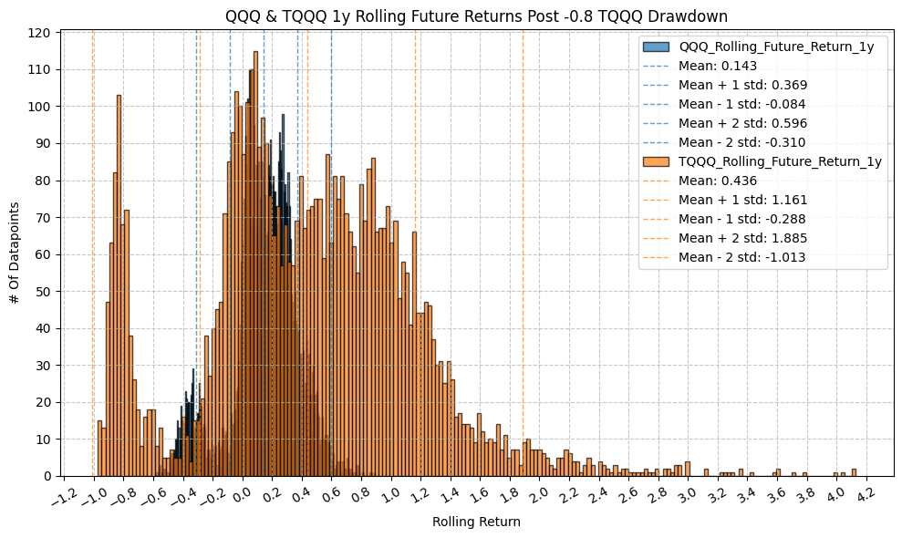
    


    
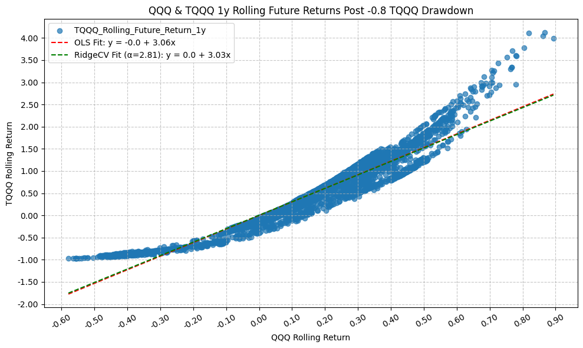
    


                                      OLS Regression Results                                 
    =========================================================================================
    Dep. Variable:     TQQQ_Rolling_Future_Return_1y   R-squared:                       0.917
    Model:                                       OLS   Adj. R-squared:                  0.917
    Method:                            Least Squares   F-statistic:                 5.978e+04
    Date:                           Fri, 20 Mar 2026   Prob (F-statistic):               0.00
    Time:                                   10:49:51   Log-Likelihood:                 790.34
    No. Observations:                           5445   AIC:                            -1577.
    Df Residuals:                               5443   BIC:                            -1563.
    Df Model:                                      1                                         
    Covariance Type:                       nonrobust                                         
    ================================================================================================
                                       coef    std err          t      P>|t|      [0.025      0.975]
    ------------------------------------------------------------------------------------------------
    const                           -0.0019      0.003     -0.552      0.581      -0.008       0.005
    QQQ_Rolling_Future_Return_1y     3.0627      0.013    244.501      0.000       3.038       3.087
    ==============================================================================
    Omnibus:                     1400.683   Durbin-Watson:                   0.045
    Prob(Omnibus):                  0.000   Jarque-Bera (JB):             6204.933
    Skew:                           1.186   Prob(JB):                         0.00
    Kurtosis:                       7.660   Cond. No.                         4.51
    ==============================================================================
    
    Notes:
    [1] Standard Errors assume that the covariance matrix of the errors is correctly specified.


    
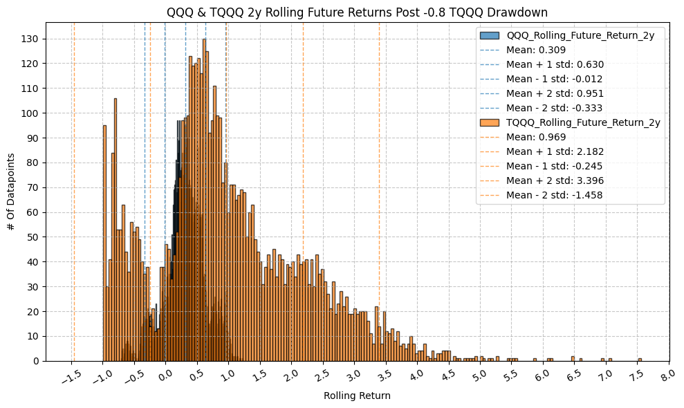
    


    
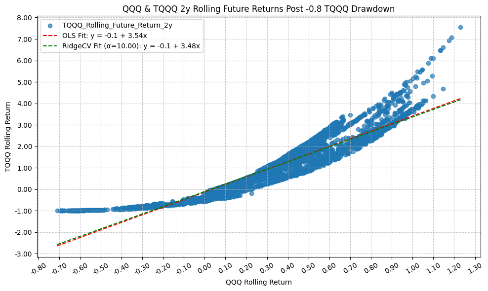
    


                                      OLS Regression Results                                 
    =========================================================================================
    Dep. Variable:     TQQQ_Rolling_Future_Return_2y   R-squared:                       0.876
    Model:                                       OLS   Adj. R-squared:                  0.876
    Method:                            Least Squares   F-statistic:                 3.832e+04
    Date:                           Fri, 20 Mar 2026   Prob (F-statistic):               0.00
    Time:                                   10:49:52   Log-Likelihood:                -3104.9
    No. Observations:                           5445   AIC:                             6214.
    Df Residuals:                               5443   BIC:                             6227.
    Df Model:                                      1                                         
    Covariance Type:                       nonrobust                                         
    ================================================================================================
                                       coef    std err          t      P>|t|      [0.025      0.975]
    ------------------------------------------------------------------------------------------------
    const                           -0.1257      0.008    -15.600      0.000      -0.141      -0.110
    QQQ_Rolling_Future_Return_2y     3.5393      0.018    195.755      0.000       3.504       3.575
    ==============================================================================
    Omnibus:                     1478.861   Durbin-Watson:                   0.022
    Prob(Omnibus):                  0.000   Jarque-Bera (JB):             5088.828
    Skew:                           1.346   Prob(JB):                         0.00
    Kurtosis:                       6.897   Cond. No.                         3.45
    ==============================================================================
    
    Notes:
    [1] Standard Errors assume that the covariance matrix of the errors is correctly specified.


    

    


    

    


                                      OLS Regression Results                                 
    =========================================================================================
    Dep. Variable:     TQQQ_Rolling_Future_Return_3y   R-squared:                       0.850
    Model:                                       OLS   Adj. R-squared:                  0.850
    Method:                            Least Squares   F-statistic:                 2.993e+04
    Date:                           Fri, 20 Mar 2026   Prob (F-statistic):               0.00
    Time:                                   10:49:53   Log-Likelihood:                -5023.8
    No. Observations:                           5293   AIC:                         1.005e+04
    Df Residuals:                               5291   BIC:                         1.006e+04
    Df Model:                                      1                                         
    Covariance Type:                       nonrobust                                         
    ================================================================================================
                                       coef    std err          t      P>|t|      [0.025      0.975]
    ------------------------------------------------------------------------------------------------
    const                           -0.3930      0.014    -28.248      0.000      -0.420      -0.366
    QQQ_Rolling_Future_Return_3y     3.9743      0.023    172.995      0.000       3.929       4.019
    ==============================================================================
    Omnibus:                      581.517   Durbin-Watson:                   0.018
    Prob(Omnibus):                  0.000   Jarque-Bera (JB):             1155.092
    Skew:                           0.706   Prob(JB):                    1.50e-251
    Kurtosis:                       4.801   Cond. No.                         3.36
    ==============================================================================
    
    Notes:
    [1] Standard Errors assume that the covariance matrix of the errors is correctly specified.


    
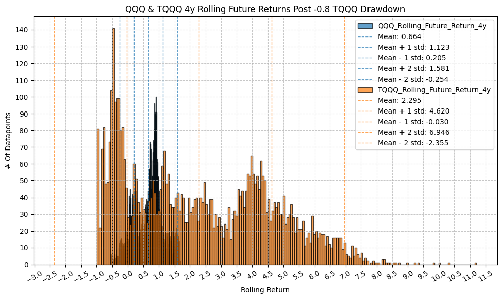
    


    
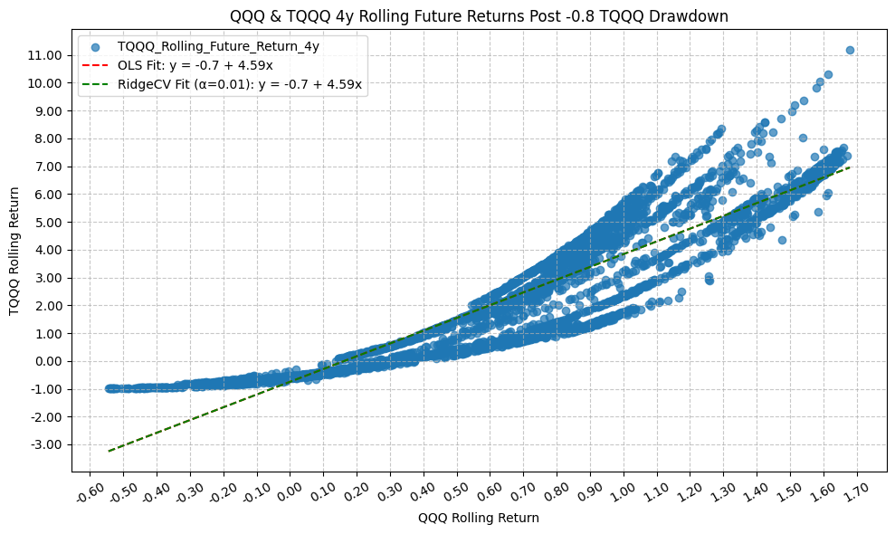
    


                                      OLS Regression Results                                 
    =========================================================================================
    Dep. Variable:     TQQQ_Rolling_Future_Return_4y   R-squared:                       0.820
    Model:                                       OLS   Adj. R-squared:                  0.820
    Method:                            Least Squares   F-statistic:                 2.301e+04
    Date:                           Fri, 20 Mar 2026   Prob (F-statistic):               0.00
    Time:                                   10:49:54   Log-Likelihood:                -7129.3
    No. Observations:                           5069   AIC:                         1.426e+04
    Df Residuals:                               5067   BIC:                         1.428e+04
    Df Model:                                      1                                         
    Covariance Type:                       nonrobust                                         
    ================================================================================================
                                       coef    std err          t      P>|t|      [0.025      0.975]
    ------------------------------------------------------------------------------------------------
    const                           -0.7487      0.024    -30.691      0.000      -0.797      -0.701
    QQQ_Rolling_Future_Return_4y     4.5870      0.030    151.701      0.000       4.528       4.646
    ==============================================================================
    Omnibus:                       13.198   Durbin-Watson:                   0.011
    Prob(Omnibus):                  0.001   Jarque-Bera (JB):               13.281
    Skew:                          -0.121   Prob(JB):                      0.00131
    Kurtosis:                       2.933   Cond. No.                         3.29
    ==============================================================================
    
    Notes:
    [1] Standard Errors assume that the covariance matrix of the errors is correctly specified.


    
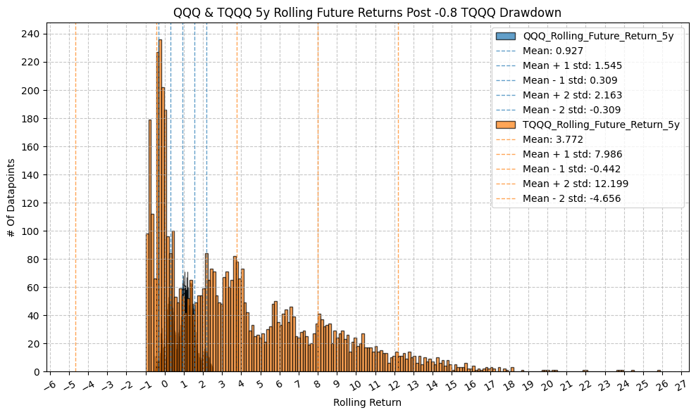
    


    

    


                                      OLS Regression Results                                 
    =========================================================================================
    Dep. Variable:     TQQQ_Rolling_Future_Return_5y   R-squared:                       0.766
    Model:                                       OLS   Adj. R-squared:                  0.766
    Method:                            Least Squares   F-statistic:                 1.659e+04
    Date:                           Fri, 20 Mar 2026   Prob (F-statistic):               0.00
    Time:                                   10:49:56   Log-Likelihood:                -10800.
    No. Observations:                           5068   AIC:                         2.160e+04
    Df Residuals:                               5066   BIC:                         2.162e+04
    Df Model:                                      1                                         
    Covariance Type:                       nonrobust                                         
    ================================================================================================
                                       coef    std err          t      P>|t|      [0.025      0.975]
    ------------------------------------------------------------------------------------------------
    const                           -1.7612      0.052    -34.113      0.000      -1.862      -1.660
    QQQ_Rolling_Future_Return_5y     5.9669      0.046    128.789      0.000       5.876       6.058
    ==============================================================================
    Omnibus:                      145.234   Durbin-Watson:                   0.010
    Prob(Omnibus):                  0.000   Jarque-Bera (JB):              276.862
    Skew:                           0.210   Prob(JB):                     7.59e-61
    Kurtosis:                       4.065   Cond. No.                         3.33
    ==============================================================================
    
    Notes:
    [1] Standard Errors assume that the covariance matrix of the errors is correctly specified.


### Rolling Returns Following Drawdowns Deviation (QQQ & TQQQ)


```python
rolling_returns_positive_future_returns = pd.DataFrame(index=rolling_windows.keys(), data=rolling_windows.values())
rolling_returns_positive_future_returns.reset_index(inplace=True)
rolling_returns_positive_future_returns.rename(columns={"index":"Period", 0:"Days"}, inplace=True)

for drawdown in drawdown_levels:
    temp = rolling_returns_drawdown_stats.loc[rolling_returns_drawdown_stats["Drawdown"] == drawdown]
    temp = temp[["Period", "Positive_Future_Percentage"]]
    temp.rename(columns={"Positive_Future_Percentage" : f"Positive_Future_Percentage_Post_{drawdown}_Drawdown"}, inplace=True)
    rolling_returns_positive_future_returns = pd.merge(rolling_returns_positive_future_returns, temp, left_on="Period", right_on="Period", how="outer")
    rolling_returns_positive_future_returns.sort_values(by="Days", ascending=True, inplace=True)

rolling_returns_positive_future_returns.drop(columns={"Days"}, inplace=True)
rolling_returns_positive_future_returns.reset_index(drop=True, inplace=True)
display(rolling_returns_positive_future_returns)
```


<div>
<style scoped>
    .dataframe tbody tr th:only-of-type {
        vertical-align: middle;
    }

    .dataframe tbody tr th {
        vertical-align: top;
    }

    .dataframe thead th {
        text-align: right;
    }
</style>
<table border="1" class="dataframe">
  <thead>
    <tr style="text-align: right;">
      <th></th>
      <th>Period</th>
      <th>Positive_Future_Percentage_Post_-0.1_Drawdown</th>
      <th>Positive_Future_Percentage_Post_-0.2_Drawdown</th>
      <th>Positive_Future_Percentage_Post_-0.3_Drawdown</th>
      <th>Positive_Future_Percentage_Post_-0.4_Drawdown</th>
      <th>Positive_Future_Percentage_Post_-0.5_Drawdown</th>
      <th>Positive_Future_Percentage_Post_-0.6_Drawdown</th>
      <th>Positive_Future_Percentage_Post_-0.7_Drawdown</th>
      <th>Positive_Future_Percentage_Post_-0.8_Drawdown</th>
    </tr>
  </thead>
  <tbody>
    <tr>
      <th>0</th>
      <td>1d</td>
      <td>0.544</td>
      <td>0.543</td>
      <td>0.544</td>
      <td>0.543</td>
      <td>0.544</td>
      <td>0.545</td>
      <td>0.543</td>
      <td>0.543</td>
    </tr>
    <tr>
      <th>1</th>
      <td>1w</td>
      <td>0.563</td>
      <td>0.562</td>
      <td>0.561</td>
      <td>0.561</td>
      <td>0.562</td>
      <td>0.565</td>
      <td>0.565</td>
      <td>0.563</td>
    </tr>
    <tr>
      <th>2</th>
      <td>1m</td>
      <td>0.597</td>
      <td>0.596</td>
      <td>0.594</td>
      <td>0.594</td>
      <td>0.597</td>
      <td>0.599</td>
      <td>0.600</td>
      <td>0.599</td>
    </tr>
    <tr>
      <th>3</th>
      <td>3m</td>
      <td>0.638</td>
      <td>0.637</td>
      <td>0.636</td>
      <td>0.636</td>
      <td>0.639</td>
      <td>0.643</td>
      <td>0.651</td>
      <td>0.648</td>
    </tr>
    <tr>
      <th>4</th>
      <td>6m</td>
      <td>0.665</td>
      <td>0.664</td>
      <td>0.664</td>
      <td>0.664</td>
      <td>0.664</td>
      <td>0.668</td>
      <td>0.689</td>
      <td>0.684</td>
    </tr>
    <tr>
      <th>5</th>
      <td>1y</td>
      <td>0.708</td>
      <td>0.708</td>
      <td>0.708</td>
      <td>0.709</td>
      <td>0.709</td>
      <td>0.712</td>
      <td>0.728</td>
      <td>0.744</td>
    </tr>
    <tr>
      <th>6</th>
      <td>2y</td>
      <td>0.734</td>
      <td>0.743</td>
      <td>0.748</td>
      <td>0.750</td>
      <td>0.750</td>
      <td>0.755</td>
      <td>0.780</td>
      <td>0.802</td>
    </tr>
    <tr>
      <th>7</th>
      <td>3y</td>
      <td>0.745</td>
      <td>0.755</td>
      <td>0.760</td>
      <td>0.761</td>
      <td>0.762</td>
      <td>0.767</td>
      <td>0.781</td>
      <td>0.782</td>
    </tr>
    <tr>
      <th>8</th>
      <td>4y</td>
      <td>0.731</td>
      <td>0.741</td>
      <td>0.746</td>
      <td>0.748</td>
      <td>0.748</td>
      <td>0.750</td>
      <td>0.756</td>
      <td>0.755</td>
    </tr>
    <tr>
      <th>9</th>
      <td>5y</td>
      <td>0.730</td>
      <td>0.740</td>
      <td>0.746</td>
      <td>0.747</td>
      <td>0.748</td>
      <td>0.751</td>
      <td>0.762</td>
      <td>0.764</td>
    </tr>
  </tbody>
</table>
</div>


```python
plot_scatter(
    df=rolling_returns_positive_future_returns,
    x_plot_column="Period",
    y_plot_columns=[col for col in rolling_returns_positive_future_returns.columns if col != "Period"],
    title="TQQQ Future Return by Time Period Post Drawdown",
    x_label="Rolling Return Time Period",
    x_format="String",
    x_format_decimal_places=0,
    x_tick_spacing=1,
    x_tick_rotation=0,
    y_label="Positive Future Return Percentage",
    y_format="Decimal",
    y_format_decimal_places=2,
    y_tick_spacing="Auto",
    y_tick_rotation=0,
    plot_OLS_regression_line=False,
    OLS_column=None,
    plot_Ridge_regression_line=False,
    Ridge_column=None,
    plot_RidgeCV_regression_line=False,
    RidgeCV_column=None,
    regression_constant=False,
    grid=True,
    legend=True,
    export_plot=False,
    plot_file_name=None,
)
```


    
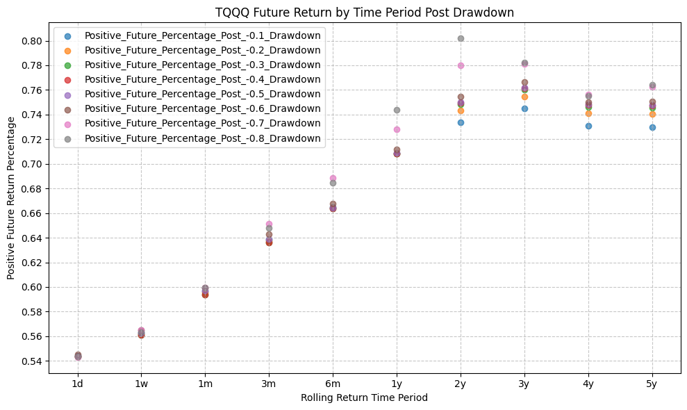
    


This plot summarizes the future rolling returns well. For rolling returns up to ~3 months *following* all drawdown levels, we see the rolling returns of TQQQ are positive ~65% of the time.

As we extend the time horizon, the percentage of positive rolling returns increases, which is consistent with the idea that the longer you hold through and post drawdown, the more likely you are to recover and achieve positive returns.

From a timing standpoint, this analysis suggests that the optimal time to buy TQQQ would be following a drawdown of 70% or more, and holding for at least 3 years. The data tells us that having a positive rolling return over time is ~75%.

One might consider the idea of allocating to TQQQ via a ladder, starting at a drawdown of 50%, and continuing to add to the position as the drawdown deepens, with the idea that the more severe the drawdown, the higher the expected future returns. However, this strategy could require enduring significant volatility, as one would be adding to the position during periods of paper losses.

## SPY & UPRO

Next, we will repeat the same analysis for SPY and UPRO, and see how the results compare to those of QQQ and TQQQ.

### Acquire & Plot Data (SPY)

First, let's get the data for SPY. If we already have the desired data, we can load it from a local pickle file. Otherwise, we can download it from Yahoo Finance using the `yf_pull_data` function.


```python
yf_pull_data(
    base_directory=DATA_DIR,
    ticker="SPY",
    adjusted=False,
    source="Yahoo_Finance",
    asset_class="Exchange_Traded_Funds",
    excel_export=True,
    pickle_export=True,
    output_confirmation=False,
)

spy = load_data(
    base_directory=DATA_DIR,
    ticker="SPY",
    source="Yahoo_Finance",
    asset_class="Exchange_Traded_Funds",
    timeframe="Daily",
    file_format="pickle",
)

# Rename columns to "SPY_Close", etc.
spy = spy.rename(columns={
    "Adj Close": "SPY_Adj_Close",
    "Close": "SPY_Close",
    "High": "SPY_High",
    "Low": "SPY_Low",
    "Open": "SPY_Open",
    "Volume": "SPY_Volume"
})

display(spy)
```


<div>
<style scoped>
    .dataframe tbody tr th:only-of-type {
        vertical-align: middle;
    }

    .dataframe tbody tr th {
        vertical-align: top;
    }

    .dataframe thead th {
        text-align: right;
    }
</style>
<table border="1" class="dataframe">
  <thead>
    <tr style="text-align: right;">
      <th></th>
      <th>SPY_Adj_Close</th>
      <th>SPY_Close</th>
      <th>SPY_High</th>
      <th>SPY_Low</th>
      <th>SPY_Open</th>
      <th>SPY_Volume</th>
    </tr>
    <tr>
      <th>Date</th>
      <th></th>
      <th></th>
      <th></th>
      <th></th>
      <th></th>
      <th></th>
    </tr>
  </thead>
  <tbody>
    <tr>
      <th>1993-01-29</th>
      <td>24.241</td>
      <td>43.938</td>
      <td>43.969</td>
      <td>43.750</td>
      <td>43.969</td>
      <td>1003200</td>
    </tr>
    <tr>
      <th>1993-02-01</th>
      <td>24.414</td>
      <td>44.250</td>
      <td>44.250</td>
      <td>43.969</td>
      <td>43.969</td>
      <td>480500</td>
    </tr>
    <tr>
      <th>1993-02-02</th>
      <td>24.466</td>
      <td>44.344</td>
      <td>44.375</td>
      <td>44.125</td>
      <td>44.219</td>
      <td>201300</td>
    </tr>
    <tr>
      <th>1993-02-03</th>
      <td>24.724</td>
      <td>44.812</td>
      <td>44.844</td>
      <td>44.375</td>
      <td>44.406</td>
      <td>529400</td>
    </tr>
    <tr>
      <th>1993-02-04</th>
      <td>24.828</td>
      <td>45.000</td>
      <td>45.094</td>
      <td>44.469</td>
      <td>44.969</td>
      <td>531500</td>
    </tr>
    <tr>
      <th>...</th>
      <td>...</td>
      <td>...</td>
      <td>...</td>
      <td>...</td>
      <td>...</td>
      <td>...</td>
    </tr>
    <tr>
      <th>2026-03-13</th>
      <td>662.290</td>
      <td>662.290</td>
      <td>672.340</td>
      <td>661.360</td>
      <td>669.270</td>
      <td>97200200</td>
    </tr>
    <tr>
      <th>2026-03-16</th>
      <td>669.030</td>
      <td>669.030</td>
      <td>672.070</td>
      <td>667.120</td>
      <td>668.380</td>
      <td>82023100</td>
    </tr>
    <tr>
      <th>2026-03-17</th>
      <td>670.790</td>
      <td>670.790</td>
      <td>674.440</td>
      <td>669.700</td>
      <td>672.390</td>
      <td>87128000</td>
    </tr>
    <tr>
      <th>2026-03-18</th>
      <td>661.430</td>
      <td>661.430</td>
      <td>669.720</td>
      <td>661.190</td>
      <td>668.360</td>
      <td>82062600</td>
    </tr>
    <tr>
      <th>2026-03-19</th>
      <td>659.800</td>
      <td>659.800</td>
      <td>662.980</td>
      <td>655.170</td>
      <td>656.970</td>
      <td>111120500</td>
    </tr>
  </tbody>
</table>
<p>8341 rows × 6 columns</p>
</div>


And the plot of the time series of partially adjusted close prices:


```python
plot_timeseries(
    df=spy,
    plot_start_date=None,
    plot_end_date=None,
    plot_columns=["SPY_Close"],
    title="SPY Close Price",
    x_label="Date",
    x_format="Year",
    x_tick_spacing=2,
    x_tick_rotation=30,
    y_label="Price ($)",
    y_format="Decimal",
    y_format_decimal_places=0,
    y_tick_spacing="Auto",
    y_tick_rotation=0,
    grid=True,
    legend=False,
    export_plot=False,
    plot_file_name=None,
)
```


    

    


### Acquire & Plot Data (UPRO)

Next, UPRO:


```python
yf_pull_data(
    base_directory=DATA_DIR,
    ticker="UPRO",
    adjusted=False,
    source="Yahoo_Finance", 
    asset_class="Exchange_Traded_Funds", 
    excel_export=True,
    pickle_export=True,
    output_confirmation=False,
)
    
upro = load_data(
    base_directory=DATA_DIR,
    ticker="UPRO",
    source="Yahoo_Finance", 
    asset_class="Exchange_Traded_Funds",
    timeframe="Daily",
    file_format="pickle",
)

# Rename columns to "UPRO_Close", etc.
upro = upro.rename(columns={
    "Adj Close": "UPRO_Adj_Close",
    "Close": "UPRO_Close", 
    "High": "UPRO_High", 
    "Low": "UPRO_Low", 
    "Open": "UPRO_Open", 
    "Volume": "UPRO_Volume"
})

display(upro)
```


<div>
<style scoped>
    .dataframe tbody tr th:only-of-type {
        vertical-align: middle;
    }

    .dataframe tbody tr th {
        vertical-align: top;
    }

    .dataframe thead th {
        text-align: right;
    }
</style>
<table border="1" class="dataframe">
  <thead>
    <tr style="text-align: right;">
      <th></th>
      <th>UPRO_Adj_Close</th>
      <th>UPRO_Close</th>
      <th>UPRO_High</th>
      <th>UPRO_Low</th>
      <th>UPRO_Open</th>
      <th>UPRO_Volume</th>
    </tr>
    <tr>
      <th>Date</th>
      <th></th>
      <th></th>
      <th></th>
      <th></th>
      <th></th>
      <th></th>
    </tr>
  </thead>
  <tbody>
    <tr>
      <th>2009-06-25</th>
      <td>1.135</td>
      <td>1.206</td>
      <td>1.210</td>
      <td>1.126</td>
      <td>1.126</td>
      <td>2577600</td>
    </tr>
    <tr>
      <th>2009-06-26</th>
      <td>1.129</td>
      <td>1.199</td>
      <td>1.213</td>
      <td>1.177</td>
      <td>1.195</td>
      <td>13104000</td>
    </tr>
    <tr>
      <th>2009-06-29</th>
      <td>1.161</td>
      <td>1.233</td>
      <td>1.236</td>
      <td>1.191</td>
      <td>1.208</td>
      <td>8690400</td>
    </tr>
    <tr>
      <th>2009-06-30</th>
      <td>1.133</td>
      <td>1.204</td>
      <td>1.243</td>
      <td>1.176</td>
      <td>1.233</td>
      <td>17128800</td>
    </tr>
    <tr>
      <th>2009-07-01</th>
      <td>1.145</td>
      <td>1.217</td>
      <td>1.253</td>
      <td>1.214</td>
      <td>1.218</td>
      <td>12038400</td>
    </tr>
    <tr>
      <th>...</th>
      <td>...</td>
      <td>...</td>
      <td>...</td>
      <td>...</td>
      <td>...</td>
      <td>...</td>
    </tr>
    <tr>
      <th>2026-03-13</th>
      <td>103.010</td>
      <td>103.010</td>
      <td>107.760</td>
      <td>102.600</td>
      <td>106.300</td>
      <td>6599000</td>
    </tr>
    <tr>
      <th>2026-03-16</th>
      <td>106.100</td>
      <td>106.100</td>
      <td>107.540</td>
      <td>105.240</td>
      <td>105.830</td>
      <td>4607100</td>
    </tr>
    <tr>
      <th>2026-03-17</th>
      <td>106.920</td>
      <td>106.920</td>
      <td>108.670</td>
      <td>106.600</td>
      <td>107.700</td>
      <td>2942600</td>
    </tr>
    <tr>
      <th>2026-03-18</th>
      <td>102.470</td>
      <td>102.470</td>
      <td>106.370</td>
      <td>102.350</td>
      <td>105.740</td>
      <td>5114100</td>
    </tr>
    <tr>
      <th>2026-03-19</th>
      <td>101.630</td>
      <td>101.630</td>
      <td>103.110</td>
      <td>99.480</td>
      <td>100.270</td>
      <td>5510300</td>
    </tr>
  </tbody>
</table>
<p>4209 rows × 6 columns</p>
</div>


And the plot of the time series of partially adjusted close prices:


```python
plot_timeseries(
    df=upro,
    plot_start_date=None,
    plot_end_date=None,
    plot_columns=["UPRO_Close"],
    title="UPRO Close Price",
    x_label="Date",
    x_format="Year",
    x_tick_spacing=1,
    x_tick_rotation=30,
    y_label="Price ($)",
    y_format="Decimal",
    y_format_decimal_places=0,
    y_tick_spacing="Auto",
    y_tick_rotation=0,
    grid=True,
    legend=False,
    export_plot=False,
    plot_file_name=None,
)
```


    
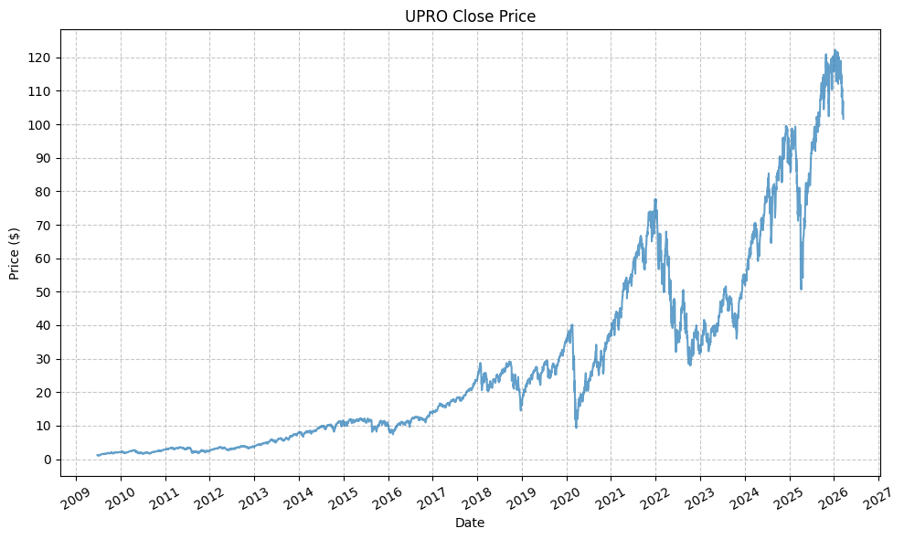
    


Looking at the close prices doesn't give us a true picture of the magnitude of the difference in returns due to the leverage. In order to see that, we need to look at the cumulative returns and the drawdowns.

 ### Calculate & Plot Cumulative Returns, Rolling Returns, and Drawdowns (SPY & UPRO)

 Next, we will calculate the cumulative returns, rolling returns, and drawdowns. This involves aligning the data to start with the inception of UPRO. For this excercise, we will not extrapolate the data for SPY back to 1993, but rather just align the data from the inception of UPRO in 2009.


```python
etfs = ["SPY", "UPRO"]

# Merge dataframes and drop rows with missing values
spy_upro_aligned = upro.merge(spy, left_index=True, right_index=True, how='left')
spy_upro_aligned = spy_upro_aligned.dropna()

# Calculate cumulative returns
for etf in etfs:
    spy_upro_aligned[f"{etf}_Return"] = spy_upro_aligned[f"{etf}_Close"].pct_change()
    spy_upro_aligned[f"{etf}_Cumulative_Return"] = (1 + spy_upro_aligned[f"{etf}_Return"]).cumprod() - 1
    spy_upro_aligned[f"{etf}_Cumulative_Return_Plus_One"] = 1 + spy_upro_aligned[f"{etf}_Cumulative_Return"]
    spy_upro_aligned[f"{etf}_Rolling_Max"] = spy_upro_aligned[f"{etf}_Cumulative_Return_Plus_One"].cummax()
    spy_upro_aligned[f"{etf}_Drawdown"] = spy_upro_aligned[f"{etf}_Cumulative_Return_Plus_One"] / spy_upro_aligned[f"{etf}_Rolling_Max"] - 1
    spy_upro_aligned.drop(columns=[f"{etf}_Cumulative_Return_Plus_One", f"{etf}_Rolling_Max"], inplace=True)

# Define rolling windows in trading days
rolling_windows = {
    '1d': 1,      # 1 day
    '1w': 5,      # 1 week (5 trading days)
    '1m': 21,     # 1 month (~21 trading days)
    '3m': 63,     # 3 months (~63 trading days)
    '6m': 126,    # 6 months (~126 trading days)
    '1y': 252,    # 1 year (~252 trading days)
    '2y': 504,    # 2 years (~504 trading days)
    '3y': 756,    # 3 years (~756 trading days)
    '4y': 1008,   # 4 years (~1008 trading days)
    '5y': 1260,   # 5 years (~1260 trading days)
}

# Calculate rolling returns for each ETF and each window
for etf in etfs:
    for period_name, window in rolling_windows.items():
        spy_upro_aligned[f"{etf}_Rolling_Return_{period_name}"] = (
            spy_upro_aligned[f"{etf}_Close"].pct_change(periods=window)
        )
        
display(spy_upro_aligned)
```


<div>
<style scoped>
    .dataframe tbody tr th:only-of-type {
        vertical-align: middle;
    }

    .dataframe tbody tr th {
        vertical-align: top;
    }

    .dataframe thead th {
        text-align: right;
    }
</style>
<table border="1" class="dataframe">
  <thead>
    <tr style="text-align: right;">
      <th></th>
      <th>UPRO_Adj_Close</th>
      <th>UPRO_Close</th>
      <th>UPRO_High</th>
      <th>UPRO_Low</th>
      <th>UPRO_Open</th>
      <th>UPRO_Volume</th>
      <th>SPY_Adj_Close</th>
      <th>SPY_Close</th>
      <th>SPY_High</th>
      <th>SPY_Low</th>
      <th>...</th>
      <th>UPRO_Rolling_Return_1d</th>
      <th>UPRO_Rolling_Return_1w</th>
      <th>UPRO_Rolling_Return_1m</th>
      <th>UPRO_Rolling_Return_3m</th>
      <th>UPRO_Rolling_Return_6m</th>
      <th>UPRO_Rolling_Return_1y</th>
      <th>UPRO_Rolling_Return_2y</th>
      <th>UPRO_Rolling_Return_3y</th>
      <th>UPRO_Rolling_Return_4y</th>
      <th>UPRO_Rolling_Return_5y</th>
    </tr>
    <tr>
      <th>Date</th>
      <th></th>
      <th></th>
      <th></th>
      <th></th>
      <th></th>
      <th></th>
      <th></th>
      <th></th>
      <th></th>
      <th></th>
      <th></th>
      <th></th>
      <th></th>
      <th></th>
      <th></th>
      <th></th>
      <th></th>
      <th></th>
      <th></th>
      <th></th>
      <th></th>
    </tr>
  </thead>
  <tbody>
    <tr>
      <th>2009-06-25</th>
      <td>1.135</td>
      <td>1.206</td>
      <td>1.210</td>
      <td>1.126</td>
      <td>1.126</td>
      <td>2577600</td>
      <td>68.389</td>
      <td>92.080</td>
      <td>92.170</td>
      <td>89.570</td>
      <td>...</td>
      <td>NaN</td>
      <td>NaN</td>
      <td>NaN</td>
      <td>NaN</td>
      <td>NaN</td>
      <td>NaN</td>
      <td>NaN</td>
      <td>NaN</td>
      <td>NaN</td>
      <td>NaN</td>
    </tr>
    <tr>
      <th>2009-06-26</th>
      <td>1.129</td>
      <td>1.199</td>
      <td>1.213</td>
      <td>1.177</td>
      <td>1.195</td>
      <td>13104000</td>
      <td>68.211</td>
      <td>91.840</td>
      <td>92.240</td>
      <td>91.270</td>
      <td>...</td>
      <td>-0.005</td>
      <td>NaN</td>
      <td>NaN</td>
      <td>NaN</td>
      <td>NaN</td>
      <td>NaN</td>
      <td>NaN</td>
      <td>NaN</td>
      <td>NaN</td>
      <td>NaN</td>
    </tr>
    <tr>
      <th>2009-06-29</th>
      <td>1.161</td>
      <td>1.233</td>
      <td>1.236</td>
      <td>1.191</td>
      <td>1.208</td>
      <td>8690400</td>
      <td>68.850</td>
      <td>92.700</td>
      <td>92.820</td>
      <td>91.600</td>
      <td>...</td>
      <td>0.028</td>
      <td>NaN</td>
      <td>NaN</td>
      <td>NaN</td>
      <td>NaN</td>
      <td>NaN</td>
      <td>NaN</td>
      <td>NaN</td>
      <td>NaN</td>
      <td>NaN</td>
    </tr>
    <tr>
      <th>2009-06-30</th>
      <td>1.133</td>
      <td>1.204</td>
      <td>1.243</td>
      <td>1.176</td>
      <td>1.233</td>
      <td>17128800</td>
      <td>68.293</td>
      <td>91.950</td>
      <td>93.060</td>
      <td>91.270</td>
      <td>...</td>
      <td>-0.024</td>
      <td>NaN</td>
      <td>NaN</td>
      <td>NaN</td>
      <td>NaN</td>
      <td>NaN</td>
      <td>NaN</td>
      <td>NaN</td>
      <td>NaN</td>
      <td>NaN</td>
    </tr>
    <tr>
      <th>2009-07-01</th>
      <td>1.145</td>
      <td>1.217</td>
      <td>1.253</td>
      <td>1.214</td>
      <td>1.218</td>
      <td>12038400</td>
      <td>68.575</td>
      <td>92.330</td>
      <td>93.230</td>
      <td>92.210</td>
      <td>...</td>
      <td>0.011</td>
      <td>NaN</td>
      <td>NaN</td>
      <td>NaN</td>
      <td>NaN</td>
      <td>NaN</td>
      <td>NaN</td>
      <td>NaN</td>
      <td>NaN</td>
      <td>NaN</td>
    </tr>
    <tr>
      <th>...</th>
      <td>...</td>
      <td>...</td>
      <td>...</td>
      <td>...</td>
      <td>...</td>
      <td>...</td>
      <td>...</td>
      <td>...</td>
      <td>...</td>
      <td>...</td>
      <td>...</td>
      <td>...</td>
      <td>...</td>
      <td>...</td>
      <td>...</td>
      <td>...</td>
      <td>...</td>
      <td>...</td>
      <td>...</td>
      <td>...</td>
      <td>...</td>
    </tr>
    <tr>
      <th>2026-03-13</th>
      <td>103.010</td>
      <td>103.010</td>
      <td>107.760</td>
      <td>102.600</td>
      <td>106.300</td>
      <td>6599000</td>
      <td>662.290</td>
      <td>662.290</td>
      <td>672.340</td>
      <td>661.360</td>
      <td>...</td>
      <td>-0.018</td>
      <td>-0.048</td>
      <td>-0.134</td>
      <td>-0.133</td>
      <td>-0.040</td>
      <td>0.389</td>
      <td>0.557</td>
      <td>1.869</td>
      <td>1.017</td>
      <td>1.565</td>
    </tr>
    <tr>
      <th>2026-03-16</th>
      <td>106.100</td>
      <td>106.100</td>
      <td>107.540</td>
      <td>105.240</td>
      <td>105.830</td>
      <td>4607100</td>
      <td>669.030</td>
      <td>669.030</td>
      <td>672.070</td>
      <td>667.120</td>
      <td>...</td>
      <td>0.030</td>
      <td>-0.044</td>
      <td>-0.065</td>
      <td>-0.113</td>
      <td>-0.009</td>
      <td>0.490</td>
      <td>0.610</td>
      <td>2.131</td>
      <td>1.128</td>
      <td>1.535</td>
    </tr>
    <tr>
      <th>2026-03-17</th>
      <td>106.920</td>
      <td>106.920</td>
      <td>108.670</td>
      <td>106.600</td>
      <td>107.700</td>
      <td>2942600</td>
      <td>670.790</td>
      <td>670.790</td>
      <td>674.440</td>
      <td>669.700</td>
      <td>...</td>
      <td>0.008</td>
      <td>-0.031</td>
      <td>-0.058</td>
      <td>-0.076</td>
      <td>-0.017</td>
      <td>0.417</td>
      <td>0.572</td>
      <td>2.298</td>
      <td>0.984</td>
      <td>1.508</td>
    </tr>
    <tr>
      <th>2026-03-18</th>
      <td>102.470</td>
      <td>102.470</td>
      <td>106.370</td>
      <td>102.350</td>
      <td>105.740</td>
      <td>5114100</td>
      <td>661.430</td>
      <td>661.430</td>
      <td>669.720</td>
      <td>661.190</td>
      <td>...</td>
      <td>-0.042</td>
      <td>-0.068</td>
      <td>-0.102</td>
      <td>-0.110</td>
      <td>-0.053</td>
      <td>0.328</td>
      <td>0.514</td>
      <td>2.182</td>
      <td>0.929</td>
      <td>1.332</td>
    </tr>
    <tr>
      <th>2026-03-19</th>
      <td>101.630</td>
      <td>101.630</td>
      <td>103.110</td>
      <td>99.480</td>
      <td>100.270</td>
      <td>5510300</td>
      <td>659.800</td>
      <td>659.800</td>
      <td>662.980</td>
      <td>655.170</td>
      <td>...</td>
      <td>-0.008</td>
      <td>-0.031</td>
      <td>-0.122</td>
      <td>-0.110</td>
      <td>-0.058</td>
      <td>0.360</td>
      <td>0.512</td>
      <td>2.003</td>
      <td>0.987</td>
      <td>1.303</td>
    </tr>
  </tbody>
</table>
<p>4209 rows × 38 columns</p>
</div>


And now the plot for the cumulative returns:


```python
plot_timeseries(
    df=spy_upro_aligned,
    plot_start_date=None,
    plot_end_date=None,
    plot_columns=["SPY_Cumulative_Return", "UPRO_Cumulative_Return"],
    title="Cumulative Returns",
    x_label="Date",
    x_format="Year",
    x_tick_spacing=1,
    x_tick_rotation=30,
    y_label="Cumulative Return",
    y_format="Decimal",
    y_format_decimal_places=0,
    y_tick_spacing="Auto",
    y_tick_rotation=0,
    grid=True,
    legend=True,
    export_plot=False,
    plot_file_name=None,
)
```


    

    


And the drawdown plot:


```python
plot_timeseries(
    df=spy_upro_aligned,
    plot_start_date=None,
    plot_end_date=None,
    plot_columns=["SPY_Drawdown", "UPRO_Drawdown"],
    title="Drawdowns",
    x_label="Date",
    x_format="Year",
    x_tick_spacing=1,
    x_tick_rotation=30,
    y_label="Drawdown",
    y_format="Percentage",
    y_format_decimal_places=0,
    y_tick_spacing="Auto",
    y_tick_rotation=0,
    grid=True,
    legend=True,
    export_plot=False,
    plot_file_name=None,
)
```


    
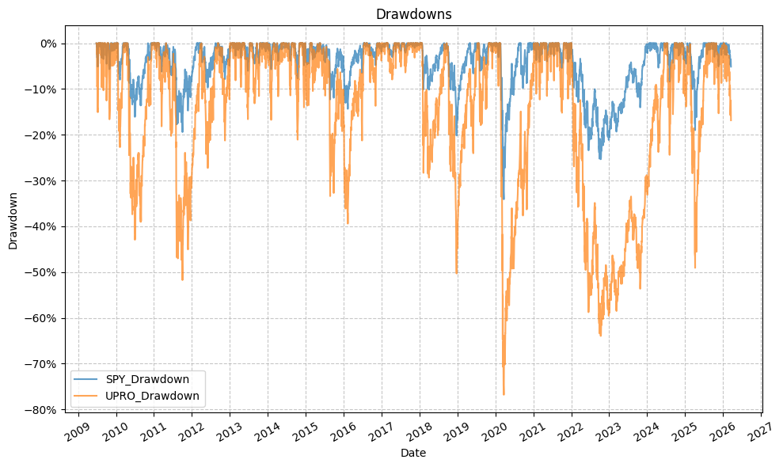
    


### Summary Statistics (SPY & UPRO)

Looking at the summary statistics further confirms our intuitions about the volatility and drawdowns.


```python
spy_sum_stats = summary_stats(
    fund_list=["SPY"],
    df=spy_upro_aligned[["SPY_Return"]],
    period="Daily",
    use_calendar_days=False,
    excel_export=False,
    pickle_export=False,
    output_confirmation=False,
)

upro_sum_stats = summary_stats(
    fund_list=["UPRO"],
    df=spy_upro_aligned[["UPRO_Return"]],
    period="Daily",
    use_calendar_days=False,
    excel_export=False,
    pickle_export=False,
    output_confirmation=False,
)

sum_stats = pd.concat([spy_sum_stats, upro_sum_stats])

display(sum_stats)
```


<div>
<style scoped>
    .dataframe tbody tr th:only-of-type {
        vertical-align: middle;
    }

    .dataframe tbody tr th {
        vertical-align: top;
    }

    .dataframe thead th {
        text-align: right;
    }
</style>
<table border="1" class="dataframe">
  <thead>
    <tr style="text-align: right;">
      <th></th>
      <th>Annual Mean Return (Arithmetic)</th>
      <th>Annualized Volatility</th>
      <th>Annualized Sharpe Ratio</th>
      <th>CAGR (Geometric)</th>
      <th>Daily Max Return</th>
      <th>Daily Max Return (Date)</th>
      <th>Daily Min Return</th>
      <th>Daily Min Return (Date)</th>
      <th>Max Drawdown</th>
      <th>Peak</th>
      <th>Trough</th>
      <th>Recovery Date</th>
      <th>Days to Recovery</th>
      <th>MAR Ratio</th>
    </tr>
  </thead>
  <tbody>
    <tr>
      <th>SPY_Return</th>
      <td>0.133</td>
      <td>0.172</td>
      <td>0.772</td>
      <td>0.125</td>
      <td>0.105</td>
      <td>2025-04-09</td>
      <td>-0.109</td>
      <td>2020-03-16</td>
      <td>-0.341</td>
      <td>2020-02-19</td>
      <td>2020-03-23</td>
      <td>2020-08-18</td>
      <td>148</td>
      <td>0.367</td>
    </tr>
    <tr>
      <th>UPRO_Return</th>
      <td>0.399</td>
      <td>0.513</td>
      <td>0.778</td>
      <td>0.304</td>
      <td>0.280</td>
      <td>2020-03-24</td>
      <td>-0.349</td>
      <td>2020-03-16</td>
      <td>-0.768</td>
      <td>2020-02-19</td>
      <td>2020-03-23</td>
      <td>2021-01-08</td>
      <td>291</td>
      <td>0.396</td>
    </tr>
  </tbody>
</table>
</div>


### Plot Returns & Verify Beta (SPY & UPRO)

Before we look at the rolling returns, let us first verify that the daily returns for UPRO are in fact ~3x those of SPY.


```python
plot_scatter(
    df=spy_upro_aligned,
    x_plot_column="SPY_Return",
    y_plot_columns=["UPRO_Return"],
    title="SPY & UPRO Returns",
    x_label="SPY Return",
    x_format="Decimal",
    x_format_decimal_places=2,
    x_tick_spacing="Auto",
    x_tick_rotation=30,
    y_label="UPRO Return",
    y_format="Decimal",
    y_format_decimal_places=2,
    y_tick_spacing="Auto",
    y_tick_rotation=0,
    plot_OLS_regression_line=True,
    OLS_column="UPRO_Return",
    plot_Ridge_regression_line=False,
    Ridge_column=None,
    plot_RidgeCV_regression_line=True,
    RidgeCV_column="UPRO_Return",
    regression_constant=True,
    grid=True,
    legend=True,
    export_plot=False,
    plot_file_name=None,
)
```


    

    


```python
model = run_linear_regression(
    df=spy_upro_aligned,
    x_plot_column="SPY_Return",
    y_plot_column="UPRO_Return",
    regression_model="OLS-statsmodels",
    regression_constant=True,
)

print(model.summary())
```

                                OLS Regression Results                            
    ==============================================================================
    Dep. Variable:            UPRO_Return   R-squared:                       0.994
    Model:                            OLS   Adj. R-squared:                  0.994
    Method:                 Least Squares   F-statistic:                 6.755e+05
    Date:                Fri, 20 Mar 2026   Prob (F-statistic):               0.00
    Time:                        10:50:00   Log-Likelihood:                 19170.
    No. Observations:                4208   AIC:                        -3.834e+04
    Df Residuals:                    4206   BIC:                        -3.832e+04
    Df Model:                           1                                         
    Covariance Type:            nonrobust                                         
    ==============================================================================
                     coef    std err          t      P>|t|      [0.025      0.975]
    ------------------------------------------------------------------------------
    const       1.678e-05   3.93e-05      0.427      0.669   -6.02e-05    9.37e-05
    SPY_Return     2.9760      0.004    821.893      0.000       2.969       2.983
    ==============================================================================
    Omnibus:                     2684.452   Durbin-Watson:                   2.590
    Prob(Omnibus):                  0.000   Jarque-Bera (JB):           518588.291
    Skew:                           1.987   Prob(JB):                         0.00
    Kurtosis:                      57.240   Cond. No.                         92.3
    ==============================================================================
    
    Notes:
    [1] Standard Errors assume that the covariance matrix of the errors is correctly specified.


Similar to QQQ/TQQQ, this plot makes sense and we can see that there is a strong clustering of points, but we double check with the regression, regressing the UPRO daily return (y) on the SPY daily return (X).

### Extrapolate Data (SPY & UPRO)

We will now extrapolate the returns of SPY to backfill the data from the inception of SPY in 1993 to the inception of UPRO in 2009. For this, we'll use the coefficient of 2.98 that we found in the regression results above.


```python
# Set leverage multiplier based on regression coefficient
LEVERAGE_MULTIPLIER = model.params[1]

# Merge dataframes and extrapolate return values for SPY back to 1993 using the leverage multiplier
spy_upro_extrap = spy[["SPY_Close"]].merge(upro[["UPRO_Close"]], left_index=True, right_index=True, how='left')

etfs = ["SPY", "UPRO"]

# Calculate cumulative returns
for etf in etfs:
    spy_upro_extrap[f"{etf}_Return"] = spy_upro_extrap[f"{etf}_Close"].pct_change()

# Extrapolate UPRO returns for missing values
spy_upro_extrap["UPRO_Return"] = spy_upro_extrap["UPRO_Return"].fillna(LEVERAGE_MULTIPLIER * spy_upro_extrap["SPY_Return"])

# Find the first valid UPRO_Close index and value
first_valid_idx = spy_upro_extrap['UPRO_Close'].first_valid_index()
print(first_valid_idx)
first_valid_price = spy_upro_extrap.loc[first_valid_idx, 'UPRO_Close']
print(first_valid_price)
```

    2009-06-25 00:00:00
    1.205556035041809


Before we extrapolate, let's first look at the data we have for SPY and UPRO around the inception of UPRO in 2009:


```python
# Check values around the first valid index
display(spy_upro_extrap.loc["2009-06-20":"2009-06-30"])
```


<div>
<style scoped>
    .dataframe tbody tr th:only-of-type {
        vertical-align: middle;
    }

    .dataframe tbody tr th {
        vertical-align: top;
    }

    .dataframe thead th {
        text-align: right;
    }
</style>
<table border="1" class="dataframe">
  <thead>
    <tr style="text-align: right;">
      <th></th>
      <th>SPY_Close</th>
      <th>UPRO_Close</th>
      <th>SPY_Return</th>
      <th>UPRO_Return</th>
    </tr>
    <tr>
      <th>Date</th>
      <th></th>
      <th></th>
      <th></th>
      <th></th>
    </tr>
  </thead>
  <tbody>
    <tr>
      <th>2009-06-22</th>
      <td>89.280</td>
      <td>NaN</td>
      <td>-0.030</td>
      <td>-0.089</td>
    </tr>
    <tr>
      <th>2009-06-23</th>
      <td>89.350</td>
      <td>NaN</td>
      <td>0.001</td>
      <td>0.002</td>
    </tr>
    <tr>
      <th>2009-06-24</th>
      <td>90.120</td>
      <td>NaN</td>
      <td>0.009</td>
      <td>0.026</td>
    </tr>
    <tr>
      <th>2009-06-25</th>
      <td>92.080</td>
      <td>1.206</td>
      <td>0.022</td>
      <td>0.065</td>
    </tr>
    <tr>
      <th>2009-06-26</th>
      <td>91.840</td>
      <td>1.199</td>
      <td>-0.003</td>
      <td>-0.005</td>
    </tr>
    <tr>
      <th>2009-06-29</th>
      <td>92.700</td>
      <td>1.233</td>
      <td>0.009</td>
      <td>0.028</td>
    </tr>
    <tr>
      <th>2009-06-30</th>
      <td>91.950</td>
      <td>1.204</td>
      <td>-0.008</td>
      <td>-0.024</td>
    </tr>
  </tbody>
</table>
</div>


Now, backfill the data for the UPRO close price:


```python
# Iterate through the dataframe backwards
for i in range(spy_upro_extrap.index.get_loc(first_valid_idx) - 1, -1, -1):
    
    # The return that led to the price the next day
    current_return = spy_upro_extrap.iloc[i + 1]['UPRO_Return']

    # Get the next day's price
    next_price = spy_upro_extrap.iloc[i + 1]['UPRO_Close']
    
    # Price_{t} = Price_{t+1} / (1 + Return_{t})
    spy_upro_extrap.loc[spy_upro_extrap.index[i], 'UPRO_Close'] = next_price / (1 + current_return)
```

Finally, confirm the values are correct:


```python
# Confirm values around the first valid index after extrapolation
display(spy_upro_extrap.loc["2009-06-20":"2009-06-30"])
```


<div>
<style scoped>
    .dataframe tbody tr th:only-of-type {
        vertical-align: middle;
    }

    .dataframe tbody tr th {
        vertical-align: top;
    }

    .dataframe thead th {
        text-align: right;
    }
</style>
<table border="1" class="dataframe">
  <thead>
    <tr style="text-align: right;">
      <th></th>
      <th>SPY_Close</th>
      <th>UPRO_Close</th>
      <th>SPY_Return</th>
      <th>UPRO_Return</th>
    </tr>
    <tr>
      <th>Date</th>
      <th></th>
      <th></th>
      <th></th>
      <th></th>
    </tr>
  </thead>
  <tbody>
    <tr>
      <th>2009-06-22</th>
      <td>89.280</td>
      <td>1.101</td>
      <td>-0.030</td>
      <td>-0.089</td>
    </tr>
    <tr>
      <th>2009-06-23</th>
      <td>89.350</td>
      <td>1.104</td>
      <td>0.001</td>
      <td>0.002</td>
    </tr>
    <tr>
      <th>2009-06-24</th>
      <td>90.120</td>
      <td>1.132</td>
      <td>0.009</td>
      <td>0.026</td>
    </tr>
    <tr>
      <th>2009-06-25</th>
      <td>92.080</td>
      <td>1.206</td>
      <td>0.022</td>
      <td>0.065</td>
    </tr>
    <tr>
      <th>2009-06-26</th>
      <td>91.840</td>
      <td>1.199</td>
      <td>-0.003</td>
      <td>-0.005</td>
    </tr>
    <tr>
      <th>2009-06-29</th>
      <td>92.700</td>
      <td>1.233</td>
      <td>0.009</td>
      <td>0.028</td>
    </tr>
    <tr>
      <th>2009-06-30</th>
      <td>91.950</td>
      <td>1.204</td>
      <td>-0.008</td>
      <td>-0.024</td>
    </tr>
  </tbody>
</table>
</div>


And the complete DataFrame with the extrapolated values:


```python
display(spy_upro_extrap)
```


<div>
<style scoped>
    .dataframe tbody tr th:only-of-type {
        vertical-align: middle;
    }

    .dataframe tbody tr th {
        vertical-align: top;
    }

    .dataframe thead th {
        text-align: right;
    }
</style>
<table border="1" class="dataframe">
  <thead>
    <tr style="text-align: right;">
      <th></th>
      <th>SPY_Close</th>
      <th>UPRO_Close</th>
      <th>SPY_Return</th>
      <th>UPRO_Return</th>
    </tr>
    <tr>
      <th>Date</th>
      <th></th>
      <th></th>
      <th></th>
      <th></th>
    </tr>
  </thead>
  <tbody>
    <tr>
      <th>1993-01-29</th>
      <td>43.938</td>
      <td>0.926</td>
      <td>NaN</td>
      <td>NaN</td>
    </tr>
    <tr>
      <th>1993-02-01</th>
      <td>44.250</td>
      <td>0.945</td>
      <td>0.007</td>
      <td>0.021</td>
    </tr>
    <tr>
      <th>1993-02-02</th>
      <td>44.344</td>
      <td>0.951</td>
      <td>0.002</td>
      <td>0.006</td>
    </tr>
    <tr>
      <th>1993-02-03</th>
      <td>44.812</td>
      <td>0.981</td>
      <td>0.011</td>
      <td>0.031</td>
    </tr>
    <tr>
      <th>1993-02-04</th>
      <td>45.000</td>
      <td>0.993</td>
      <td>0.004</td>
      <td>0.012</td>
    </tr>
    <tr>
      <th>...</th>
      <td>...</td>
      <td>...</td>
      <td>...</td>
      <td>...</td>
    </tr>
    <tr>
      <th>2026-03-13</th>
      <td>662.290</td>
      <td>103.010</td>
      <td>-0.006</td>
      <td>-0.018</td>
    </tr>
    <tr>
      <th>2026-03-16</th>
      <td>669.030</td>
      <td>106.100</td>
      <td>0.010</td>
      <td>0.030</td>
    </tr>
    <tr>
      <th>2026-03-17</th>
      <td>670.790</td>
      <td>106.920</td>
      <td>0.003</td>
      <td>0.008</td>
    </tr>
    <tr>
      <th>2026-03-18</th>
      <td>661.430</td>
      <td>102.470</td>
      <td>-0.014</td>
      <td>-0.042</td>
    </tr>
    <tr>
      <th>2026-03-19</th>
      <td>659.800</td>
      <td>101.630</td>
      <td>-0.002</td>
      <td>-0.008</td>
    </tr>
  </tbody>
</table>
<p>8341 rows × 4 columns</p>
</div>


After the extrapolation, we now have the following plots for the prices, cumulative returns, and drawdowns:


```python
etfs = ["SPY", "UPRO"]

# Calculate cumulative returns
for etf in etfs:
    spy_upro_extrap[f"{etf}_Return"] = spy_upro_extrap[f"{etf}_Close"].pct_change()
    spy_upro_extrap[f"{etf}_Cumulative_Return"] = (1 + spy_upro_extrap[f"{etf}_Return"]).cumprod() - 1
    spy_upro_extrap[f"{etf}_Cumulative_Return_Plus_One"] = 1 + spy_upro_extrap[f"{etf}_Cumulative_Return"]
    spy_upro_extrap[f"{etf}_Rolling_Max"] = spy_upro_extrap[f"{etf}_Cumulative_Return_Plus_One"].cummax()
    spy_upro_extrap[f"{etf}_Drawdown"] = spy_upro_extrap[f"{etf}_Cumulative_Return_Plus_One"] / spy_upro_extrap[f"{etf}_Rolling_Max"] - 1
    spy_upro_extrap.drop(columns=[f"{etf}_Cumulative_Return_Plus_One", f"{etf}_Rolling_Max"], inplace=True)
```


```python
plot_timeseries(
    df=spy_upro_extrap,
    plot_start_date=None,
    plot_end_date=None,
    plot_columns=["SPY_Close"],
    title="SPY Close Price",
    x_label="Date",
    x_format="Year",
    x_tick_spacing=2,
    x_tick_rotation=30,
    y_label="Price ($)",
    y_format="Decimal",
    y_format_decimal_places=0,
    y_tick_spacing="Auto",
    y_tick_rotation=0,
    grid=True,
    legend=False,
    export_plot=False,
    plot_file_name=None,
)
```


    
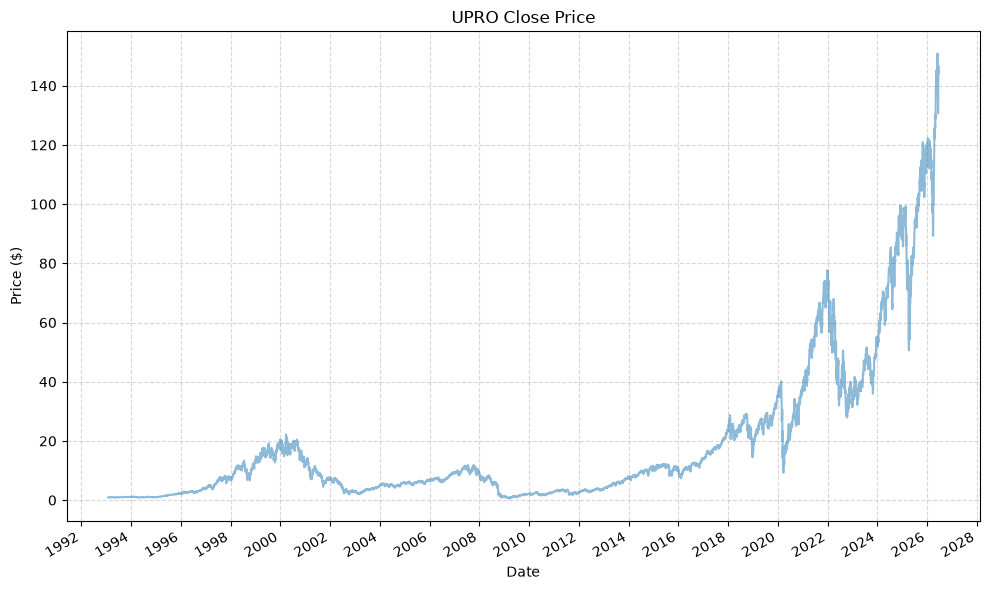
    


```python
plot_timeseries(
    df=spy_upro_extrap,
    plot_start_date=None,
    plot_end_date=None,
    plot_columns=["UPRO_Close"],
    title="UPRO Close Price",
    x_label="Date",
    x_format="Year",
    x_tick_spacing=2,
    x_tick_rotation=30,
    y_label="Price ($)",
    y_format="Decimal",
    y_format_decimal_places=0,
    y_tick_spacing="Auto",
    y_tick_rotation=0,
    grid=True,
    legend=False,
    export_plot=False,
    plot_file_name=None,
)
```


    
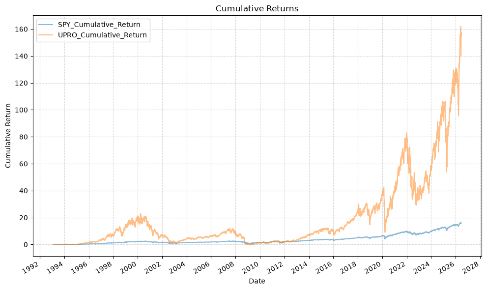
    


```python
plot_timeseries(
    df=spy_upro_extrap,
    plot_start_date=None,
    plot_end_date=None,
    plot_columns=["SPY_Cumulative_Return", "UPRO_Cumulative_Return"],
    title="Cumulative Returns",
    x_label="Date",
    x_format="Year",
    x_tick_spacing=2,
    x_tick_rotation=30,
    y_label="Cumulative Return",
    y_format="Decimal",
    y_format_decimal_places=0,
    y_tick_spacing="Auto",
    y_tick_rotation=0,
    grid=True,
    legend=True,
    export_plot=False,
    plot_file_name=None,
)
```


    
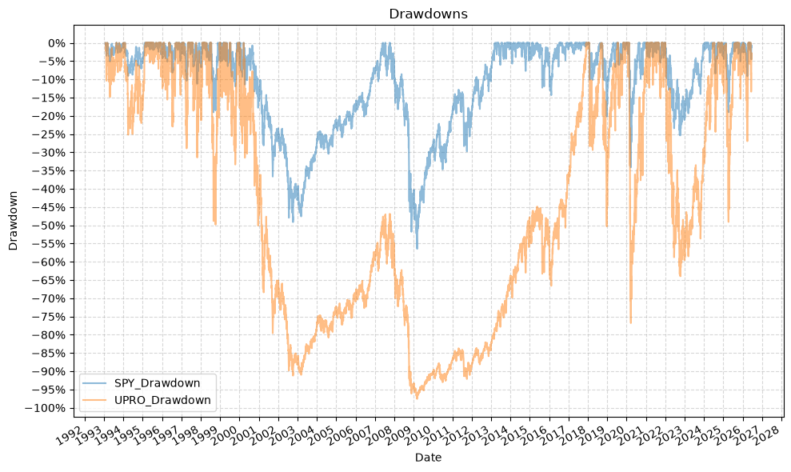
    


```python
plot_timeseries(
    df=spy_upro_extrap,
    plot_start_date=None,
    plot_end_date=None,
    plot_columns=["SPY_Drawdown", "UPRO_Drawdown"],
    title="Drawdowns",
    x_label="Date",
    x_format="Year",
    x_tick_spacing=1,
    x_tick_rotation=30,
    y_label="Drawdown",
    y_format="Percentage",
    y_format_decimal_places=0,
    y_tick_spacing="Auto",
    y_tick_rotation=0,
    grid=True,
    legend=True,
    export_plot=False,
    plot_file_name=None,
)
```


    

    


```python
spy_extrap_sum_stats = summary_stats(
    fund_list=["SPY"],
    df=spy_upro_extrap[["SPY_Return"]],
    period="Daily",
    use_calendar_days=False,
    excel_export=False,
    pickle_export=False,
    output_confirmation=False,
)

upro_extrap_sum_stats = summary_stats(
    fund_list=["UPRO"],
    df=spy_upro_extrap[["UPRO_Return"]],
    period="Daily",
    use_calendar_days=False,
    excel_export=False,
    pickle_export=False,
    output_confirmation=False,
)

sum_stats = pd.concat([spy_sum_stats, upro_sum_stats, spy_extrap_sum_stats, upro_extrap_sum_stats])
sum_stats.index = ["SPY (2009 - Present)", "UPRO (2009 - Present)", "SPY (1993 - Present)", "UPRO Extrapolated (1993 - Present)"]

display(sum_stats)
```


<div>
<style scoped>
    .dataframe tbody tr th:only-of-type {
        vertical-align: middle;
    }

    .dataframe tbody tr th {
        vertical-align: top;
    }

    .dataframe thead th {
        text-align: right;
    }
</style>
<table border="1" class="dataframe">
  <thead>
    <tr style="text-align: right;">
      <th></th>
      <th>Annual Mean Return (Arithmetic)</th>
      <th>Annualized Volatility</th>
      <th>Annualized Sharpe Ratio</th>
      <th>CAGR (Geometric)</th>
      <th>Daily Max Return</th>
      <th>Daily Max Return (Date)</th>
      <th>Daily Min Return</th>
      <th>Daily Min Return (Date)</th>
      <th>Max Drawdown</th>
      <th>Peak</th>
      <th>Trough</th>
      <th>Recovery Date</th>
      <th>Days to Recovery</th>
      <th>MAR Ratio</th>
    </tr>
  </thead>
  <tbody>
    <tr>
      <th>SPY (2009 - Present)</th>
      <td>0.133</td>
      <td>0.172</td>
      <td>0.772</td>
      <td>0.125</td>
      <td>0.105</td>
      <td>2025-04-09</td>
      <td>-0.109</td>
      <td>2020-03-16</td>
      <td>-0.341</td>
      <td>2020-02-19</td>
      <td>2020-03-23</td>
      <td>2020-08-18</td>
      <td>148</td>
      <td>0.367</td>
    </tr>
    <tr>
      <th>UPRO (2009 - Present)</th>
      <td>0.399</td>
      <td>0.513</td>
      <td>0.778</td>
      <td>0.304</td>
      <td>0.280</td>
      <td>2020-03-24</td>
      <td>-0.349</td>
      <td>2020-03-16</td>
      <td>-0.768</td>
      <td>2020-02-19</td>
      <td>2020-03-23</td>
      <td>2021-01-08</td>
      <td>291</td>
      <td>0.396</td>
    </tr>
    <tr>
      <th>SPY (1993 - Present)</th>
      <td>0.099</td>
      <td>0.186</td>
      <td>0.533</td>
      <td>0.085</td>
      <td>0.145</td>
      <td>2008-10-13</td>
      <td>-0.109</td>
      <td>2020-03-16</td>
      <td>-0.565</td>
      <td>2007-10-09</td>
      <td>2009-03-09</td>
      <td>2013-03-14</td>
      <td>1466</td>
      <td>0.151</td>
    </tr>
    <tr>
      <th>UPRO Extrapolated (1993 - Present)</th>
      <td>0.297</td>
      <td>0.555</td>
      <td>0.536</td>
      <td>0.153</td>
      <td>0.432</td>
      <td>2008-10-13</td>
      <td>-0.349</td>
      <td>2020-03-16</td>
      <td>-0.976</td>
      <td>2000-03-24</td>
      <td>2009-03-09</td>
      <td>2017-11-30</td>
      <td>3188</td>
      <td>0.156</td>
    </tr>
  </tbody>
</table>
</div>


Interestingly, the maximum drawdown for UPRO is not as severe as that of TQQQ, which may be due to that SPY has not had the same extreme return profile as QQQ. This highlights the importance of the underlying asset's return profile on the performance of leveraged ETFs.

### Plot Rolling Returns (SPY & UPRO)

Next, we will consider the following:

* Histogram and scatter plots of the rolling returns of SPY and UPRO
* Regressions to establish a "leverage factor" for the rolling returns
* The deviation from a 3x return for each time period

For this set of regressions, we will also allow the constant. First, we need the rolling returns for various time periods:


```python
# Define rolling windows in trading days
rolling_windows = {
    '1d': 1,      # 1 day
    '1w': 5,      # 1 week (5 trading days)
    '1m': 21,     # 1 month (~21 trading days)
    '3m': 63,     # 3 months (~63 trading days)
    '6m': 126,    # 6 months (~126 trading days)
    '1y': 252,    # 1 year (~252 trading days)
    '2y': 504,    # 2 years (~504 trading days)
    '3y': 756,    # 3 years (~756 trading days)
    '4y': 1008,   # 4 years (~1008 trading days)
    '5y': 1260,   # 5 years (~1260 trading days)
}

# Calculate rolling returns for each ETF and each window
for etf in etfs:
    for period_name, window in rolling_windows.items():
        spy_upro_extrap[f"{etf}_Rolling_Return_{period_name}"] = (
            spy_upro_extrap[f"{etf}_Close"].pct_change(periods=window)
        )
```

This gives us the following series of histograms, scatter plots, and regression model results:


```python
# Create a dataframe to hold rolling returns stats
rolling_returns_stats = pd.DataFrame()

for period_name, window in rolling_windows.items():
    plot_histogram(
        df=spy_upro_extrap,
        plot_columns=[f"SPY_Rolling_Return_{period_name}", f"UPRO_Rolling_Return_{period_name}"],
        title=f"SPY & UPRO {period_name} Rolling Returns",
        x_label="Rolling Return",
        x_tick_spacing="Auto",
        x_tick_rotation=30,
        y_label="# Of Datapoints",
        y_tick_spacing="Auto",
        y_tick_rotation=0,
        grid=True,
        legend=True,
        export_plot=False,
        plot_file_name=None,
    )

    plot_scatter(
        df=spy_upro_extrap,
        x_plot_column=f"SPY_Rolling_Return_{period_name}",
        y_plot_columns=[f"UPRO_Rolling_Return_{period_name}"],
        title=f"SPY & UPRO {period_name} Rolling Returns",
        x_label="SPY Rolling Return",
        x_format="Decimal",
        x_format_decimal_places=2,
        x_tick_spacing="Auto",
        x_tick_rotation=30,
        y_label="UPRO Rolling Return",
        y_format="Decimal",
        y_format_decimal_places=2,
        y_tick_spacing="Auto",
        y_tick_rotation=0,
        plot_OLS_regression_line=True,
        OLS_column=f"UPRO_Rolling_Return_{period_name}",
        plot_Ridge_regression_line=False,
        Ridge_column=None,
        plot_RidgeCV_regression_line=True,
        RidgeCV_column=f"UPRO_Rolling_Return_{period_name}",
        regression_constant=True,
        grid=True,
        legend=True,
        export_plot=False,
        plot_file_name=None,
    )

    # Run OLS regression with statsmodels
    model = run_linear_regression(
        df=spy_upro_extrap,
        x_plot_column=f"SPY_Rolling_Return_{period_name}",
        y_plot_column=f"UPRO_Rolling_Return_{period_name}",
        regression_model="OLS-statsmodels",
        regression_constant=True,
    )
    print(model.summary())

    # Add the regression results to the rolling returns stats dataframe
    intercept = model.params[0]
    intercept_pvalue = model.pvalues[0]   # p-value for Intercept
    slope = model.params[1]
    slope_pvalue = model.pvalues[1]       # p-value for SPY_Return
    r_squared = model.rsquared

    # Calc skew
    return_ratio = spy_upro_extrap[f'UPRO_Rolling_Return_{period_name}'] / spy_upro_extrap[f'SPY_Rolling_Return_{period_name}']
    skew = return_ratio.skew()

    # Calc conditional symmetry
    up_markets = spy_upro_extrap[spy_upro_extrap[f'SPY_Rolling_Return_{period_name}'] > 0]
    down_markets = spy_upro_extrap[spy_upro_extrap[f'SPY_Rolling_Return_{period_name}'] <= 0]

    avg_beta_up = (up_markets[f'UPRO_Rolling_Return_{period_name}'] / up_markets[f'SPY_Rolling_Return_{period_name}']).mean()
    avg_beta_down = (down_markets[f'UPRO_Rolling_Return_{period_name}'] / down_markets[f'SPY_Rolling_Return_{period_name}']).mean()

    asymmetry = avg_beta_up - avg_beta_down

    rolling_returns_slope_int = pd.DataFrame({
        "Period": period_name,
        "Intercept": [intercept],
        # "Intercept_PValue": [intercept_pvalue],
        "Slope": [slope],
        # "Slope_PValue": [slope_pvalue],
        "R_Squared": [r_squared],
        "Skew": [skew],
        "Average Upside Beta": [avg_beta_up],
        "Average Downside Beta": [avg_beta_down],
        "Asymmetry": [asymmetry]
    })

    rolling_returns_stats = pd.concat([rolling_returns_stats, rolling_returns_slope_int])
```


    
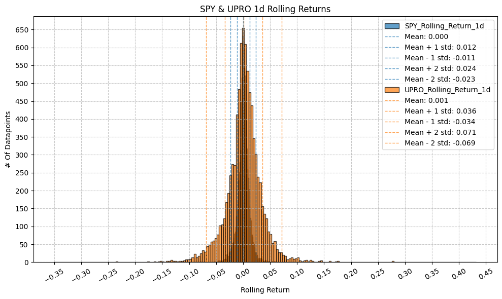
    


    

    


                                  OLS Regression Results                              
    ==================================================================================
    Dep. Variable:     UPRO_Rolling_Return_1d   R-squared:                       0.997
    Model:                                OLS   Adj. R-squared:                  0.997
    Method:                     Least Squares   F-statistic:                 3.119e+06
    Date:                    Fri, 20 Mar 2026   Prob (F-statistic):               0.00
    Time:                            10:50:03   Log-Likelihood:                 40846.
    No. Observations:                    8340   AIC:                        -8.169e+04
    Df Residuals:                        8338   BIC:                        -8.167e+04
    Df Model:                               1                                         
    Covariance Type:                nonrobust                                         
    =========================================================================================
                                coef    std err          t      P>|t|      [0.025      0.975]
    -----------------------------------------------------------------------------------------
    const                  8.462e-06   1.98e-05      0.428      0.669   -3.03e-05    4.73e-05
    SPY_Rolling_Return_1d     2.9760      0.002   1766.061      0.000       2.973       2.979
    ==============================================================================
    Omnibus:                     6875.715   Durbin-Watson:                   2.590
    Prob(Omnibus):                  0.000   Jarque-Bera (JB):          4253525.948
    Skew:                           2.812   Prob(JB):                         0.00
    Kurtosis:                     113.493   Cond. No.                         85.2
    ==============================================================================
    
    Notes:
    [1] Standard Errors assume that the covariance matrix of the errors is correctly specified.


    

    


    
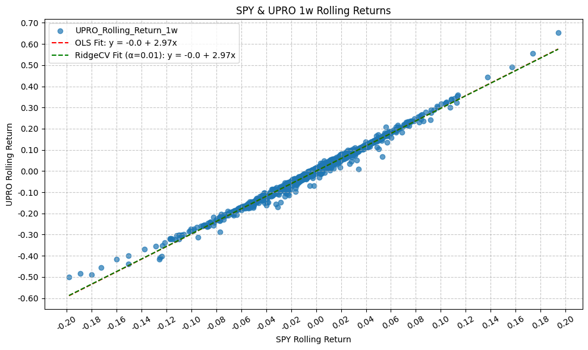
    


                                  OLS Regression Results                              
    ==================================================================================
    Dep. Variable:     UPRO_Rolling_Return_1w   R-squared:                       0.994
    Model:                                OLS   Adj. R-squared:                  0.994
    Method:                     Least Squares   F-statistic:                 1.405e+06
    Date:                    Fri, 20 Mar 2026   Prob (F-statistic):               0.00
    Time:                            10:50:04   Log-Likelihood:                 31611.
    No. Observations:                    8336   AIC:                        -6.322e+04
    Df Residuals:                        8334   BIC:                        -6.320e+04
    Df Model:                               1                                         
    Covariance Type:                nonrobust                                         
    =========================================================================================
                                coef    std err          t      P>|t|      [0.025      0.975]
    -----------------------------------------------------------------------------------------
    const                    -0.0003      6e-05     -4.302      0.000      -0.000      -0.000
    SPY_Rolling_Return_1w     2.9725      0.003   1185.305      0.000       2.968       2.977
    ==============================================================================
    Omnibus:                     3742.566   Durbin-Watson:                   0.955
    Prob(Omnibus):                  0.000   Jarque-Bera (JB):          1491140.193
    Skew:                          -0.846   Prob(JB):                         0.00
    Kurtosis:                      68.500   Cond. No.                         42.0
    ==============================================================================
    
    Notes:
    [1] Standard Errors assume that the covariance matrix of the errors is correctly specified.


    
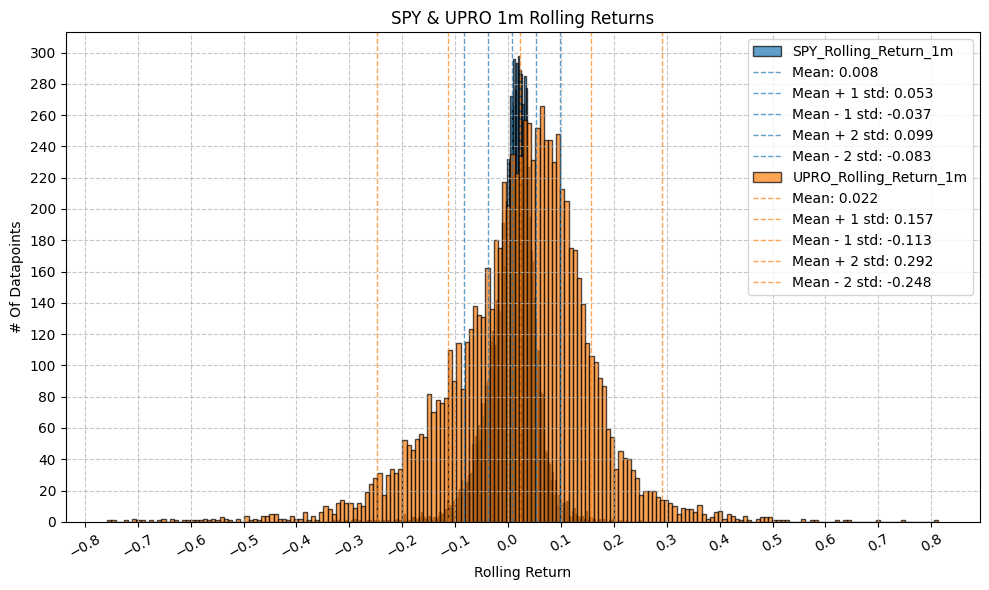
    


    

    


                                  OLS Regression Results                              
    ==================================================================================
    Dep. Variable:     UPRO_Rolling_Return_1m   R-squared:                       0.988
    Model:                                OLS   Adj. R-squared:                  0.988
    Method:                     Least Squares   F-statistic:                 6.658e+05
    Date:                    Fri, 20 Mar 2026   Prob (F-statistic):               0.00
    Time:                            10:50:05   Log-Likelihood:                 23143.
    No. Observations:                    8320   AIC:                        -4.628e+04
    Df Residuals:                        8318   BIC:                        -4.627e+04
    Df Model:                               1                                         
    Covariance Type:                nonrobust                                         
    =========================================================================================
                                coef    std err          t      P>|t|      [0.025      0.975]
    -----------------------------------------------------------------------------------------
    const                    -0.0015      0.000     -9.060      0.000      -0.002      -0.001
    SPY_Rolling_Return_1m     2.9604      0.004    815.950      0.000       2.953       2.967
    ==============================================================================
    Omnibus:                     2880.229   Durbin-Watson:                   0.314
    Prob(Omnibus):                  0.000   Jarque-Bera (JB):           856447.781
    Skew:                          -0.289   Prob(JB):                         0.00
    Kurtosis:                      52.701   Cond. No.                         22.1
    ==============================================================================
    
    Notes:
    [1] Standard Errors assume that the covariance matrix of the errors is correctly specified.


    

    


    

    


                                  OLS Regression Results                              
    ==================================================================================
    Dep. Variable:     UPRO_Rolling_Return_3m   R-squared:                       0.979
    Model:                                OLS   Adj. R-squared:                  0.979
    Method:                     Least Squares   F-statistic:                 3.834e+05
    Date:                    Fri, 20 Mar 2026   Prob (F-statistic):               0.00
    Time:                            10:50:06   Log-Likelihood:                 16428.
    No. Observations:                    8278   AIC:                        -3.285e+04
    Df Residuals:                        8276   BIC:                        -3.284e+04
    Df Model:                               1                                         
    Covariance Type:                nonrobust                                         
    =========================================================================================
                                coef    std err          t      P>|t|      [0.025      0.975]
    -----------------------------------------------------------------------------------------
    const                    -0.0068      0.000    -17.757      0.000      -0.008      -0.006
    SPY_Rolling_Return_3m     3.0482      0.005    619.198      0.000       3.039       3.058
    ==============================================================================
    Omnibus:                     2415.384   Durbin-Watson:                   0.136
    Prob(Omnibus):                  0.000   Jarque-Bera (JB):           133009.869
    Skew:                           0.583   Prob(JB):                         0.00
    Kurtosis:                      22.603   Cond. No.                         13.5
    ==============================================================================
    
    Notes:
    [1] Standard Errors assume that the covariance matrix of the errors is correctly specified.


    

    


    

    


                                  OLS Regression Results                              
    ==================================================================================
    Dep. Variable:     UPRO_Rolling_Return_6m   R-squared:                       0.957
    Model:                                OLS   Adj. R-squared:                  0.957
    Method:                     Least Squares   F-statistic:                 1.831e+05
    Date:                    Fri, 20 Mar 2026   Prob (F-statistic):               0.00
    Time:                            10:50:07   Log-Likelihood:                 10167.
    No. Observations:                    8215   AIC:                        -2.033e+04
    Df Residuals:                        8213   BIC:                        -2.032e+04
    Df Model:                               1                                         
    Covariance Type:                nonrobust                                         
    =========================================================================================
                                coef    std err          t      P>|t|      [0.025      0.975]
    -----------------------------------------------------------------------------------------
    const                    -0.0110      0.001    -12.922      0.000      -0.013      -0.009
    SPY_Rolling_Return_6m     3.0708      0.007    427.856      0.000       3.057       3.085
    ==============================================================================
    Omnibus:                     2069.108   Durbin-Watson:                   0.055
    Prob(Omnibus):                  0.000   Jarque-Bera (JB):            26494.998
    Skew:                           0.844   Prob(JB):                         0.00
    Kurtosis:                      11.634   Cond. No.                         9.29
    ==============================================================================
    
    Notes:
    [1] Standard Errors assume that the covariance matrix of the errors is correctly specified.


    
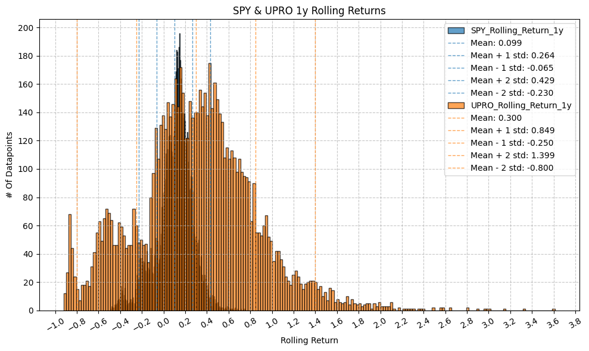
    


    
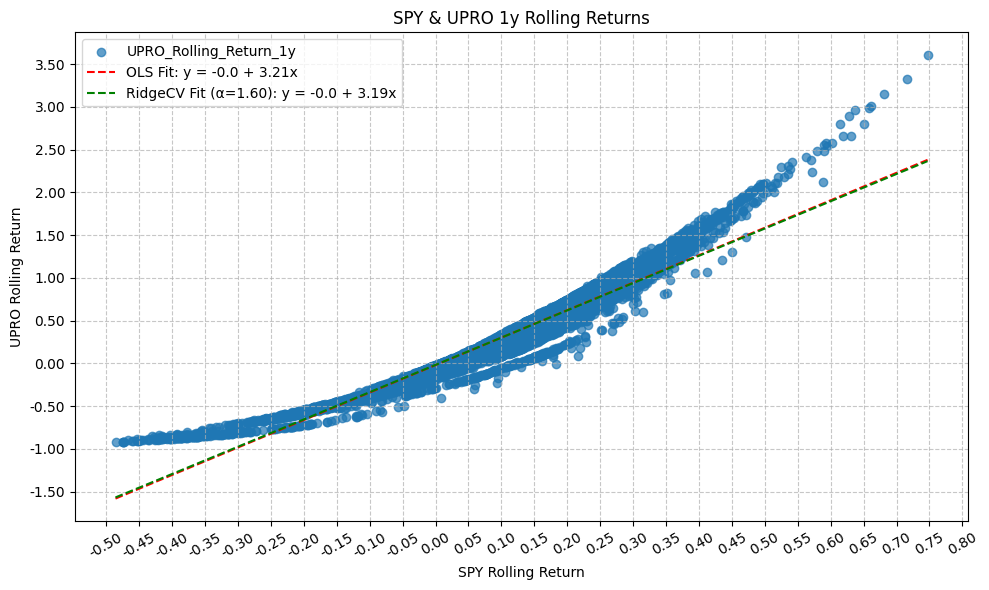
    


                                  OLS Regression Results                              
    ==================================================================================
    Dep. Variable:     UPRO_Rolling_Return_1y   R-squared:                       0.927
    Model:                                OLS   Adj. R-squared:                  0.927
    Method:                     Least Squares   F-statistic:                 1.023e+05
    Date:                    Fri, 20 Mar 2026   Prob (F-statistic):               0.00
    Time:                            10:50:08   Log-Likelihood:                 3933.3
    No. Observations:                    8089   AIC:                            -7863.
    Df Residuals:                        8087   BIC:                            -7849.
    Df Model:                               1                                         
    Covariance Type:                nonrobust                                         
    =========================================================================================
                                coef    std err          t      P>|t|      [0.025      0.975]
    -----------------------------------------------------------------------------------------
    const                    -0.0196      0.002    -10.152      0.000      -0.023      -0.016
    SPY_Rolling_Return_1y     3.2117      0.010    319.885      0.000       3.192       3.231
    ==============================================================================
    Omnibus:                     1394.974   Durbin-Watson:                   0.031
    Prob(Omnibus):                  0.000   Jarque-Bera (JB):             6543.160
    Skew:                           0.764   Prob(JB):                         0.00
    Kurtosis:                       7.132   Cond. No.                         6.13
    ==============================================================================
    
    Notes:
    [1] Standard Errors assume that the covariance matrix of the errors is correctly specified.


    
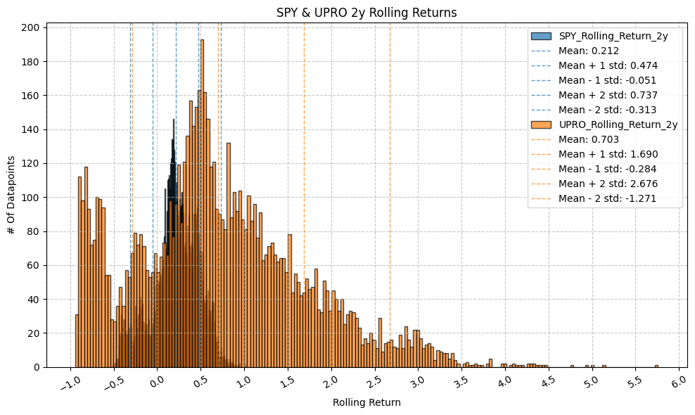
    


    

    


                                  OLS Regression Results                              
    ==================================================================================
    Dep. Variable:     UPRO_Rolling_Return_2y   R-squared:                       0.897
    Model:                                OLS   Adj. R-squared:                  0.897
    Method:                     Least Squares   F-statistic:                 6.792e+04
    Date:                    Fri, 20 Mar 2026   Prob (F-statistic):               0.00
    Time:                            10:50:10   Log-Likelihood:                -2124.3
    No. Observations:                    7837   AIC:                             4253.
    Df Residuals:                        7835   BIC:                             4267.
    Df Model:                               1                                         
    Covariance Type:                nonrobust                                         
    =========================================================================================
                                coef    std err          t      P>|t|      [0.025      0.975]
    -----------------------------------------------------------------------------------------
    const                    -0.0514      0.005    -11.155      0.000      -0.060      -0.042
    SPY_Rolling_Return_2y     3.5611      0.014    260.609      0.000       3.534       3.588
    ==============================================================================
    Omnibus:                      950.451   Durbin-Watson:                   0.018
    Prob(Omnibus):                  0.000   Jarque-Bera (JB):             1486.082
    Skew:                           0.866   Prob(JB):                         0.00
    Kurtosis:                       4.245   Cond. No.                         3.99
    ==============================================================================
    
    Notes:
    [1] Standard Errors assume that the covariance matrix of the errors is correctly specified.


    
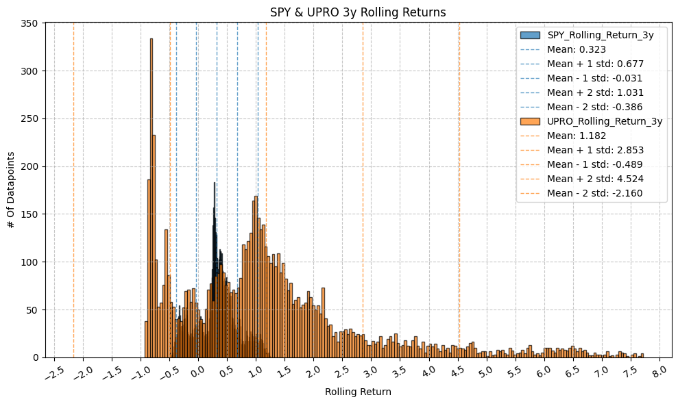
    


    

    


                                  OLS Regression Results                              
    ==================================================================================
    Dep. Variable:     UPRO_Rolling_Return_3y   R-squared:                       0.866
    Model:                                OLS   Adj. R-squared:                  0.866
    Method:                     Least Squares   F-statistic:                 4.921e+04
    Date:                    Fri, 20 Mar 2026   Prob (F-statistic):               0.00
    Time:                            10:50:11   Log-Likelihood:                -7020.9
    No. Observations:                    7585   AIC:                         1.405e+04
    Df Residuals:                        7583   BIC:                         1.406e+04
    Df Model:                               1                                         
    Covariance Type:                nonrobust                                         
    =========================================================================================
                                coef    std err          t      P>|t|      [0.025      0.975]
    -----------------------------------------------------------------------------------------
    const                    -0.2356      0.009    -24.829      0.000      -0.254      -0.217
    SPY_Rolling_Return_3y     4.3915      0.020    221.830      0.000       4.353       4.430
    ==============================================================================
    Omnibus:                     1290.151   Durbin-Watson:                   0.008
    Prob(Omnibus):                  0.000   Jarque-Bera (JB):             2447.661
    Skew:                           1.054   Prob(JB):                         0.00
    Kurtosis:                       4.816   Cond. No.                         3.15
    ==============================================================================
    
    Notes:
    [1] Standard Errors assume that the covariance matrix of the errors is correctly specified.


    

    


    
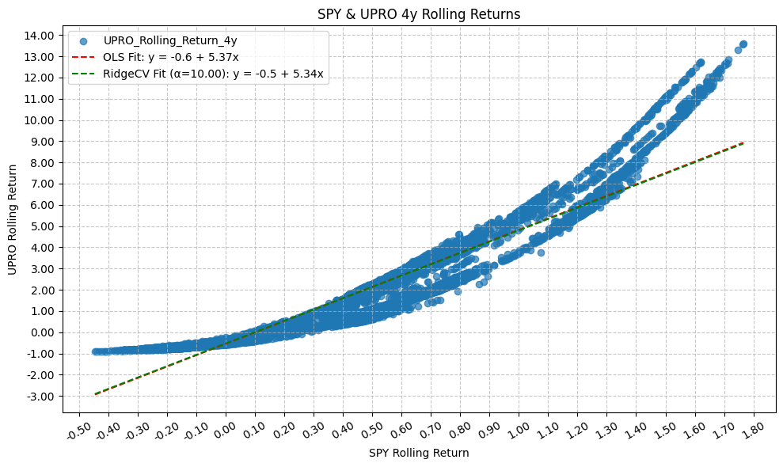
    


                                  OLS Regression Results                              
    ==================================================================================
    Dep. Variable:     UPRO_Rolling_Return_4y   R-squared:                       0.863
    Model:                                OLS   Adj. R-squared:                  0.863
    Method:                     Least Squares   F-statistic:                 4.601e+04
    Date:                    Fri, 20 Mar 2026   Prob (F-statistic):               0.00
    Time:                            10:50:12   Log-Likelihood:                -10260.
    No. Observations:                    7333   AIC:                         2.052e+04
    Df Residuals:                        7331   BIC:                         2.054e+04
    Df Model:                               1                                         
    Covariance Type:                nonrobust                                         
    =========================================================================================
                                coef    std err          t      P>|t|      [0.025      0.975]
    -----------------------------------------------------------------------------------------
    const                    -0.5505      0.016    -34.758      0.000      -0.582      -0.519
    SPY_Rolling_Return_4y     5.3705      0.025    214.491      0.000       5.321       5.420
    ==============================================================================
    Omnibus:                     1107.003   Durbin-Watson:                   0.008
    Prob(Omnibus):                  0.000   Jarque-Bera (JB):             2296.125
    Skew:                           0.912   Prob(JB):                         0.00
    Kurtosis:                       5.046   Cond. No.                         2.69
    ==============================================================================
    
    Notes:
    [1] Standard Errors assume that the covariance matrix of the errors is correctly specified.


    

    


    
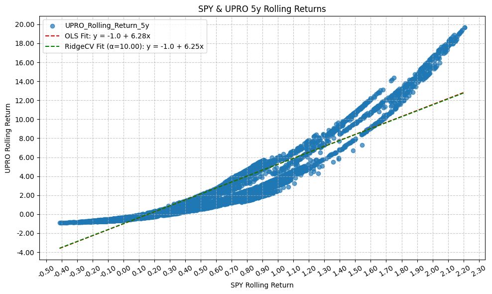
    


                                  OLS Regression Results                              
    ==================================================================================
    Dep. Variable:     UPRO_Rolling_Return_5y   R-squared:                       0.850
    Model:                                OLS   Adj. R-squared:                  0.850
    Method:                     Least Squares   F-statistic:                 4.016e+04
    Date:                    Fri, 20 Mar 2026   Prob (F-statistic):               0.00
    Time:                            10:50:13   Log-Likelihood:                -12784.
    No. Observations:                    7081   AIC:                         2.557e+04
    Df Residuals:                        7079   BIC:                         2.559e+04
    Df Model:                               1                                         
    Covariance Type:                nonrobust                                         
    =========================================================================================
                                coef    std err          t      P>|t|      [0.025      0.975]
    -----------------------------------------------------------------------------------------
    const                    -1.0043      0.025    -40.653      0.000      -1.053      -0.956
    SPY_Rolling_Return_5y     6.2791      0.031    200.394      0.000       6.218       6.341
    ==============================================================================
    Omnibus:                      686.865   Durbin-Watson:                   0.007
    Prob(Omnibus):                  0.000   Jarque-Bera (JB):             1311.688
    Skew:                           0.651   Prob(JB):                    1.48e-285
    Kurtosis:                       4.659   Cond. No.                         2.51
    ==============================================================================
    
    Notes:
    [1] Standard Errors assume that the covariance matrix of the errors is correctly specified.


### Rolling Returns Deviation (SPY & UPRO)

Next, we will the rolling returns deviation from the expected 3x return for each time period. This will give us a better picture of the volatility decay effect and how it changes over different time horizons.


```python
rolling_returns_stats["Return_Deviation_From_3x"] = rolling_returns_stats["Slope"] - 3.0
display(rolling_returns_stats)
```


<div>
<style scoped>
    .dataframe tbody tr th:only-of-type {
        vertical-align: middle;
    }

    .dataframe tbody tr th {
        vertical-align: top;
    }

    .dataframe thead th {
        text-align: right;
    }
</style>
<table border="1" class="dataframe">
  <thead>
    <tr style="text-align: right;">
      <th></th>
      <th>Period</th>
      <th>Intercept</th>
      <th>Slope</th>
      <th>R_Squared</th>
      <th>Skew</th>
      <th>Average Upside Beta</th>
      <th>Average Downside Beta</th>
      <th>Asymmetry</th>
      <th>Return_Deviation_From_3x</th>
    </tr>
  </thead>
  <tbody>
    <tr>
      <th>0</th>
      <td>1d</td>
      <td>0.000</td>
      <td>2.976</td>
      <td>0.997</td>
      <td>NaN</td>
      <td>2.939</td>
      <td>NaN</td>
      <td>NaN</td>
      <td>-0.024</td>
    </tr>
    <tr>
      <th>0</th>
      <td>1w</td>
      <td>-0.000</td>
      <td>2.973</td>
      <td>0.994</td>
      <td>NaN</td>
      <td>2.757</td>
      <td>NaN</td>
      <td>NaN</td>
      <td>-0.027</td>
    </tr>
    <tr>
      <th>0</th>
      <td>1m</td>
      <td>-0.002</td>
      <td>2.960</td>
      <td>0.988</td>
      <td>NaN</td>
      <td>2.494</td>
      <td>-inf</td>
      <td>inf</td>
      <td>-0.040</td>
    </tr>
    <tr>
      <th>0</th>
      <td>3m</td>
      <td>-0.007</td>
      <td>3.048</td>
      <td>0.979</td>
      <td>NaN</td>
      <td>2.006</td>
      <td>-inf</td>
      <td>inf</td>
      <td>0.048</td>
    </tr>
    <tr>
      <th>0</th>
      <td>6m</td>
      <td>-0.011</td>
      <td>3.071</td>
      <td>0.957</td>
      <td>NaN</td>
      <td>1.023</td>
      <td>-inf</td>
      <td>inf</td>
      <td>0.071</td>
    </tr>
    <tr>
      <th>0</th>
      <td>1y</td>
      <td>-0.020</td>
      <td>3.212</td>
      <td>0.927</td>
      <td>NaN</td>
      <td>1.640</td>
      <td>-inf</td>
      <td>inf</td>
      <td>0.212</td>
    </tr>
    <tr>
      <th>0</th>
      <td>2y</td>
      <td>-0.051</td>
      <td>3.561</td>
      <td>0.897</td>
      <td>0.349</td>
      <td>1.862</td>
      <td>9.298</td>
      <td>-7.436</td>
      <td>0.561</td>
    </tr>
    <tr>
      <th>0</th>
      <td>3y</td>
      <td>-0.236</td>
      <td>4.391</td>
      <td>0.866</td>
      <td>-6.069</td>
      <td>1.579</td>
      <td>8.621</td>
      <td>-7.041</td>
      <td>1.391</td>
    </tr>
    <tr>
      <th>0</th>
      <td>4y</td>
      <td>-0.551</td>
      <td>5.371</td>
      <td>0.863</td>
      <td>-65.942</td>
      <td>0.022</td>
      <td>7.235</td>
      <td>-7.212</td>
      <td>2.371</td>
    </tr>
    <tr>
      <th>0</th>
      <td>5y</td>
      <td>-1.004</td>
      <td>6.279</td>
      <td>0.850</td>
      <td>-35.228</td>
      <td>-2.258</td>
      <td>21.003</td>
      <td>-23.262</td>
      <td>3.279</td>
    </tr>
  </tbody>
</table>
</div>


```python
plot_scatter(
    df=rolling_returns_stats,
    x_plot_column="Period",
    y_plot_columns=["Return_Deviation_From_3x"],
    title="UPRO Deviation from Perfect 3x Leverage by Time Period",
    x_label="Time Period",
    x_format="String",
    x_format_decimal_places=0,
    x_tick_spacing=1,
    x_tick_rotation=0,
    y_label="Deviation from 3x Leverage",
    y_format="Decimal",
    y_format_decimal_places=1,
    y_tick_spacing="Auto",
    y_tick_rotation=0,
    plot_OLS_regression_line=False,
    OLS_column=None,
    plot_Ridge_regression_line=False,
    Ridge_column=None,
    plot_RidgeCV_regression_line=False,
    RidgeCV_column=None,
    regression_constant=False,
    grid=True,
    legend=True,
    export_plot=False,
    plot_file_name=None,
)
```


    
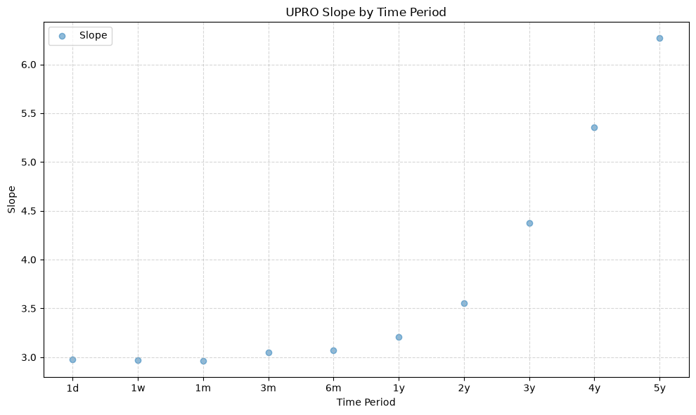
    


```python
plot_scatter(
    df=rolling_returns_stats,
    x_plot_column="Period",
    y_plot_columns=["Slope"],
    title="UPRO Slope by Time Period",
    x_label="Time Period",
    x_format="String",
    x_format_decimal_places=0,
    x_tick_spacing=1,
    x_tick_rotation=0,
    y_label="Slope",
    y_format="Decimal",
    y_format_decimal_places=1,
    y_tick_spacing="Auto",
    y_tick_rotation=0,
    plot_OLS_regression_line=False,
    OLS_column=None,
    plot_Ridge_regression_line=False,
    Ridge_column=None,
    plot_RidgeCV_regression_line=False,
    RidgeCV_column=None,
    regression_constant=False,
    grid=True,
    legend=True,
    export_plot=False,
    plot_file_name=None,
)
```


    
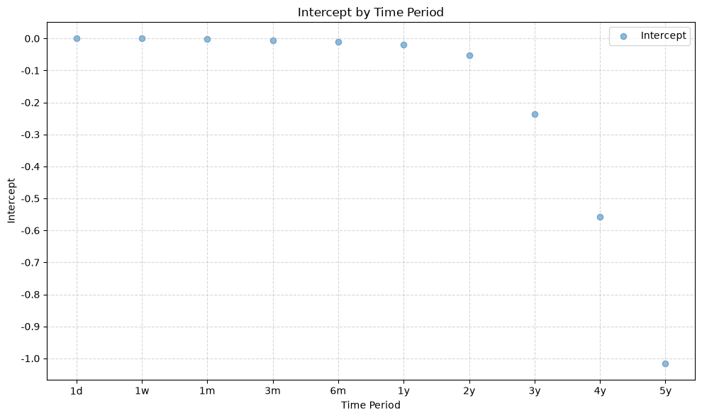
    


```python
plot_scatter(
    df=rolling_returns_stats,
    x_plot_column="Period",
    y_plot_columns=["Intercept"],
    title="Intercept by Time Period",
    x_label="Time Period",
    x_format="String",
    x_format_decimal_places=0,
    x_tick_spacing=1,
    x_tick_rotation=0,
    y_label="Intercept",
    y_format="Decimal",
    y_format_decimal_places=1,
    y_tick_spacing="Auto",
    y_tick_rotation=0,
    plot_OLS_regression_line=False,
    OLS_column=None,
    plot_Ridge_regression_line=False,
    Ridge_column=None,
    plot_RidgeCV_regression_line=False,
    RidgeCV_column=None,
    regression_constant=False,
    grid=True,
    legend=True,
    export_plot=False,
    plot_file_name=None,
)
```


    
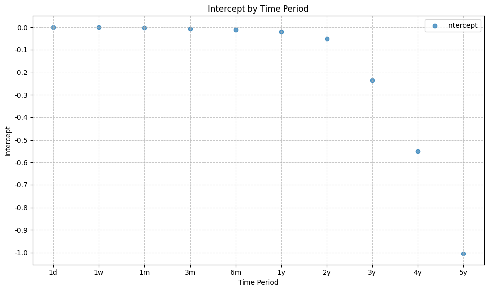
    


```python
pandas_set_decimal_places(3)
display(rolling_returns_stats.set_index("Period"))
```


<div>
<style scoped>
    .dataframe tbody tr th:only-of-type {
        vertical-align: middle;
    }

    .dataframe tbody tr th {
        vertical-align: top;
    }

    .dataframe thead th {
        text-align: right;
    }
</style>
<table border="1" class="dataframe">
  <thead>
    <tr style="text-align: right;">
      <th></th>
      <th>Intercept</th>
      <th>Slope</th>
      <th>R_Squared</th>
      <th>Skew</th>
      <th>Average Upside Beta</th>
      <th>Average Downside Beta</th>
      <th>Asymmetry</th>
      <th>Return_Deviation_From_3x</th>
    </tr>
    <tr>
      <th>Period</th>
      <th></th>
      <th></th>
      <th></th>
      <th></th>
      <th></th>
      <th></th>
      <th></th>
      <th></th>
    </tr>
  </thead>
  <tbody>
    <tr>
      <th>1d</th>
      <td>0.000</td>
      <td>2.976</td>
      <td>0.997</td>
      <td>NaN</td>
      <td>2.939</td>
      <td>NaN</td>
      <td>NaN</td>
      <td>-0.024</td>
    </tr>
    <tr>
      <th>1w</th>
      <td>-0.000</td>
      <td>2.973</td>
      <td>0.994</td>
      <td>NaN</td>
      <td>2.757</td>
      <td>NaN</td>
      <td>NaN</td>
      <td>-0.027</td>
    </tr>
    <tr>
      <th>1m</th>
      <td>-0.002</td>
      <td>2.960</td>
      <td>0.988</td>
      <td>NaN</td>
      <td>2.494</td>
      <td>-inf</td>
      <td>inf</td>
      <td>-0.040</td>
    </tr>
    <tr>
      <th>3m</th>
      <td>-0.007</td>
      <td>3.048</td>
      <td>0.979</td>
      <td>NaN</td>
      <td>2.006</td>
      <td>-inf</td>
      <td>inf</td>
      <td>0.048</td>
    </tr>
    <tr>
      <th>6m</th>
      <td>-0.011</td>
      <td>3.071</td>
      <td>0.957</td>
      <td>NaN</td>
      <td>1.023</td>
      <td>-inf</td>
      <td>inf</td>
      <td>0.071</td>
    </tr>
    <tr>
      <th>1y</th>
      <td>-0.020</td>
      <td>3.212</td>
      <td>0.927</td>
      <td>NaN</td>
      <td>1.640</td>
      <td>-inf</td>
      <td>inf</td>
      <td>0.212</td>
    </tr>
    <tr>
      <th>2y</th>
      <td>-0.051</td>
      <td>3.561</td>
      <td>0.897</td>
      <td>0.349</td>
      <td>1.862</td>
      <td>9.298</td>
      <td>-7.436</td>
      <td>0.561</td>
    </tr>
    <tr>
      <th>3y</th>
      <td>-0.236</td>
      <td>4.391</td>
      <td>0.866</td>
      <td>-6.069</td>
      <td>1.579</td>
      <td>8.621</td>
      <td>-7.041</td>
      <td>1.391</td>
    </tr>
    <tr>
      <th>4y</th>
      <td>-0.551</td>
      <td>5.371</td>
      <td>0.863</td>
      <td>-65.942</td>
      <td>0.022</td>
      <td>7.235</td>
      <td>-7.212</td>
      <td>2.371</td>
    </tr>
    <tr>
      <th>5y</th>
      <td>-1.004</td>
      <td>6.279</td>
      <td>0.850</td>
      <td>-35.228</td>
      <td>-2.258</td>
      <td>21.003</td>
      <td>-23.262</td>
      <td>3.279</td>
    </tr>
  </tbody>
</table>
</div>


Similar as to QQQ/TQQQ, up to 1 year, there is minimal difference between the mean UPRO 1 year rolling return and the hypothetical 3x leverage, with an R^2 of greater than 0.9.

However, as we extend the time period, we see that

* The "leverage factor" increases significantly, resulting in a deviation from the perfect 3x leverage.
* The intercept also begins to deviate significantly from 0.

### Rolling Returns Following Drawdowns (SPY & UPRO)

We will identify the drawdown levels of UPRO and then look at the subsequent rolling returns over various time horizons.


```python
# Copy DataFrame
spy_upro_extrap_future = spy_upro_extrap.copy()

# Create a list of drawdown levels to analyze
drawdown_levels = [-0.10, -0.20, -0.30, -0.40, -0.50, -0.60, -0.70, -0.80]

# Shift the rolling return columns by the number of days in the rolling window to get the returns following the drawdown
for etf in etfs:
    for period_name, window in rolling_windows.items():
        spy_upro_extrap_future[f"{etf}_Rolling_Future_Return_{period_name}"] = spy_upro_extrap_future[f"{etf}_Rolling_Return_{period_name}"].shift(-window)
```

Now, we can analyze the future rolling returns following specific drawdown levels:


```python
# Create a dataframe to hold rolling returns stats
rolling_returns_drawdown_stats = pd.DataFrame()

for drawdown in drawdown_levels:

    for period_name, window in rolling_windows.items():

        try:
            plot_histogram(
                df=spy_upro_extrap_future[spy_upro_extrap_future["UPRO_Drawdown"] <= drawdown],
                plot_columns=[f"SPY_Rolling_Future_Return_{period_name}", f"UPRO_Rolling_Future_Return_{period_name}"],
                title=f"SPY & UPRO {period_name} Rolling Future Returns Post {drawdown} UPRO Drawdown",
                x_label="Rolling Return",
                x_tick_spacing="Auto",
                x_tick_rotation=30,
                y_label="# Of Datapoints",
                y_tick_spacing="Auto",
                y_tick_rotation=0,
                grid=True,
                legend=True,
                export_plot=False,
                plot_file_name=None,
            )

            plot_scatter(
                df=spy_upro_extrap_future[spy_upro_extrap_future["UPRO_Drawdown"] <= drawdown],
                x_plot_column=f"SPY_Rolling_Future_Return_{period_name}",
                y_plot_columns=[f"UPRO_Rolling_Future_Return_{period_name}"],
                title=f"SPY & UPRO {period_name} Rolling Future Returns Post {drawdown} UPRO Drawdown",
                x_label="SPY Rolling Return",
                x_format="Decimal",
                x_format_decimal_places=2,
                x_tick_spacing="Auto",
                x_tick_rotation=30,
                y_label="UPRO Rolling Return",
                y_format="Decimal",
                y_format_decimal_places=2,
                y_tick_spacing="Auto",
                y_tick_rotation=0,
                plot_OLS_regression_line=True,
                OLS_column=f"UPRO_Rolling_Future_Return_{period_name}",
                plot_Ridge_regression_line=False,
                Ridge_column=None,
                plot_RidgeCV_regression_line=True,
                RidgeCV_column=f"UPRO_Rolling_Future_Return_{period_name}",
                regression_constant=True,
                grid=True,
                legend=True,
                export_plot=False,
                plot_file_name=None,
            )

            # Run OLS regression with statsmodels
            model = run_linear_regression(
                df=spy_upro_extrap_future[spy_upro_extrap_future["UPRO_Drawdown"] <= drawdown],
                x_plot_column=f"SPY_Rolling_Future_Return_{period_name}",
                y_plot_column=f"UPRO_Rolling_Future_Return_{period_name}",
                regression_model="OLS-statsmodels",
                regression_constant=True,
            )
            print(model.summary())

            # Filter by drawdown
            drawdown_filter = spy_upro_extrap_future[spy_upro_extrap_future["UPRO_Drawdown"] <= drawdown]

            # Filter by period, drop rows with missing values
            future_filter = drawdown_filter[[f"UPRO_Rolling_Future_Return_{period_name}"]].dropna()

            # Find length of future dataframe
            future_length = len(future_filter)

            # Find length of future dataframe where return is positive
            positive_future_length = len(future_filter[future_filter[f"UPRO_Rolling_Future_Return_{period_name}"] > 0])

            # Calculate percentage of future returns that are positive
            positive_future_percentage = (positive_future_length / future_length) if future_length > 0 else 0

            # Add the regression results to the rolling returns stats dataframe
            intercept = model.params[0]
            # intercept_pvalue = model.pvalues[0]   # p-value for Intercept
            slope = model.params[1]
            # slope_pvalue = model.pvalues[1]       # p-value for Slope
            r_squared = model.rsquared

            rolling_returns_slope_int = pd.DataFrame({
                "Drawdown": drawdown,
                "Period": period_name,
                "Intercept": [intercept],
                # "Intercept_PValue": [intercept_pvalue],
                "Slope": [slope],
                # "Slope_PValue": [slope_pvalue],
                "R_Squared": [r_squared],
                "Positive_Future_Percentage": [positive_future_percentage],
            })
            
            rolling_returns_drawdown_stats = pd.concat([rolling_returns_drawdown_stats, rolling_returns_slope_int])

        except:
            print(f"Not enough data points for drawdown level {drawdown} and period {period_name} to run regression.")
```


    

    


    

    


                                      OLS Regression Results                                 
    =========================================================================================
    Dep. Variable:     UPRO_Rolling_Future_Return_1d   R-squared:                       0.997
    Model:                                       OLS   Adj. R-squared:                  0.997
    Method:                            Least Squares   F-statistic:                 2.287e+06
    Date:                           Fri, 20 Mar 2026   Prob (F-statistic):               0.00
    Time:                                   10:50:14   Log-Likelihood:                 29880.
    No. Observations:                           6225   AIC:                        -5.976e+04
    Df Residuals:                               6223   BIC:                        -5.974e+04
    Df Model:                                      1                                         
    Covariance Type:                       nonrobust                                         
    ================================================================================================
                                       coef    std err          t      P>|t|      [0.025      0.975]
    ------------------------------------------------------------------------------------------------
    const                         2.173e-05   2.53e-05      0.860      0.390   -2.78e-05    7.12e-05
    SPY_Rolling_Future_Return_1d     2.9765      0.002   1512.346      0.000       2.973       2.980
    ==============================================================================
    Omnibus:                     4604.989   Durbin-Watson:                   2.630
    Prob(Omnibus):                  0.000   Jarque-Bera (JB):          2419343.312
    Skew:                           2.322   Prob(JB):                         0.00
    Kurtosis:                      99.468   Cond. No.                         78.0
    ==============================================================================
    
    Notes:
    [1] Standard Errors assume that the covariance matrix of the errors is correctly specified.


    

    


    

    


                                      OLS Regression Results                                 
    =========================================================================================
    Dep. Variable:     UPRO_Rolling_Future_Return_1w   R-squared:                       0.994
    Model:                                       OLS   Adj. R-squared:                  0.994
    Method:                            Least Squares   F-statistic:                 9.670e+05
    Date:                           Fri, 20 Mar 2026   Prob (F-statistic):               0.00
    Time:                                   10:50:16   Log-Likelihood:                 22880.
    No. Observations:                           6221   AIC:                        -4.576e+04
    Df Residuals:                               6219   BIC:                        -4.574e+04
    Df Model:                                      1                                         
    Covariance Type:                       nonrobust                                         
    ================================================================================================
                                       coef    std err          t      P>|t|      [0.025      0.975]
    ------------------------------------------------------------------------------------------------
    const                           -0.0002   7.78e-05     -3.059      0.002      -0.000   -8.55e-05
    SPY_Rolling_Future_Return_1w     2.9733      0.003    983.339      0.000       2.967       2.979
    ==============================================================================
    Omnibus:                     2734.967   Durbin-Watson:                   0.978
    Prob(Omnibus):                  0.000   Jarque-Bera (JB):           782879.243
    Skew:                          -0.876   Prob(JB):                         0.00
    Kurtosis:                      57.929   Cond. No.                         39.0
    ==============================================================================
    
    Notes:
    [1] Standard Errors assume that the covariance matrix of the errors is correctly specified.


    
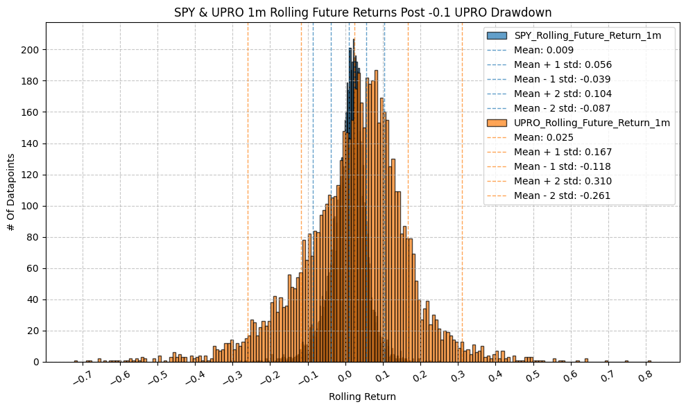
    


    

    


                                      OLS Regression Results                                 
    =========================================================================================
    Dep. Variable:     UPRO_Rolling_Future_Return_1m   R-squared:                       0.988
    Model:                                       OLS   Adj. R-squared:                  0.988
    Method:                            Least Squares   F-statistic:                 4.994e+05
    Date:                           Fri, 20 Mar 2026   Prob (F-statistic):               0.00
    Time:                                   10:50:17   Log-Likelihood:                 16962.
    No. Observations:                           6218   AIC:                        -3.392e+04
    Df Residuals:                               6216   BIC:                        -3.391e+04
    Df Model:                                      1                                         
    Covariance Type:                       nonrobust                                         
    ================================================================================================
                                       coef    std err          t      P>|t|      [0.025      0.975]
    ------------------------------------------------------------------------------------------------
    const                           -0.0015      0.000     -7.184      0.000      -0.002      -0.001
    SPY_Rolling_Future_Return_1m     2.9746      0.004    706.661      0.000       2.966       2.983
    ==============================================================================
    Omnibus:                     3371.450   Durbin-Watson:                   0.336
    Prob(Omnibus):                  0.000   Jarque-Bera (JB):           387349.033
    Skew:                          -1.631   Prob(JB):                         0.00
    Kurtosis:                      41.528   Cond. No.                         21.0
    ==============================================================================
    
    Notes:
    [1] Standard Errors assume that the covariance matrix of the errors is correctly specified.


    

    


    

    


                                      OLS Regression Results                                 
    =========================================================================================
    Dep. Variable:     UPRO_Rolling_Future_Return_3m   R-squared:                       0.978
    Model:                                       OLS   Adj. R-squared:                  0.978
    Method:                            Least Squares   F-statistic:                 2.716e+05
    Date:                           Fri, 20 Mar 2026   Prob (F-statistic):               0.00
    Time:                                   10:50:18   Log-Likelihood:                 11917.
    No. Observations:                           6218   AIC:                        -2.383e+04
    Df Residuals:                               6216   BIC:                        -2.382e+04
    Df Model:                                      1                                         
    Covariance Type:                       nonrobust                                         
    ================================================================================================
                                       coef    std err          t      P>|t|      [0.025      0.975]
    ------------------------------------------------------------------------------------------------
    const                           -0.0048      0.000    -10.061      0.000      -0.006      -0.004
    SPY_Rolling_Future_Return_3m     3.0334      0.006    521.161      0.000       3.022       3.045
    ==============================================================================
    Omnibus:                     1724.578   Durbin-Watson:                   0.148
    Prob(Omnibus):                  0.000   Jarque-Bera (JB):            87846.797
    Skew:                           0.522   Prob(JB):                         0.00
    Kurtosis:                      21.384   Cond. No.                         12.9
    ==============================================================================
    
    Notes:
    [1] Standard Errors assume that the covariance matrix of the errors is correctly specified.


    

    


    

    


                                      OLS Regression Results                                 
    =========================================================================================
    Dep. Variable:     UPRO_Rolling_Future_Return_6m   R-squared:                       0.961
    Model:                                       OLS   Adj. R-squared:                  0.961
    Method:                            Least Squares   F-statistic:                 1.537e+05
    Date:                           Fri, 20 Mar 2026   Prob (F-statistic):               0.00
    Time:                                   10:50:19   Log-Likelihood:                 7698.5
    No. Observations:                           6214   AIC:                        -1.539e+04
    Df Residuals:                               6212   BIC:                        -1.538e+04
    Df Model:                                      1                                         
    Covariance Type:                       nonrobust                                         
    ================================================================================================
                                       coef    std err          t      P>|t|      [0.025      0.975]
    ------------------------------------------------------------------------------------------------
    const                           -0.0015      0.001     -1.526      0.127      -0.003       0.000
    SPY_Rolling_Future_Return_6m     3.0330      0.008    391.989      0.000       3.018       3.048
    ==============================================================================
    Omnibus:                     2086.731   Durbin-Watson:                   0.070
    Prob(Omnibus):                  0.000   Jarque-Bera (JB):            20739.792
    Skew:                           1.316   Prob(JB):                         0.00
    Kurtosis:                      11.554   Cond. No.                         8.72
    ==============================================================================
    
    Notes:
    [1] Standard Errors assume that the covariance matrix of the errors is correctly specified.


    

    


    

    


                                      OLS Regression Results                                 
    =========================================================================================
    Dep. Variable:     UPRO_Rolling_Future_Return_1y   R-squared:                       0.933
    Model:                                       OLS   Adj. R-squared:                  0.933
    Method:                            Least Squares   F-statistic:                 8.615e+04
    Date:                           Fri, 20 Mar 2026   Prob (F-statistic):               0.00
    Time:                                   10:50:20   Log-Likelihood:                 3065.1
    No. Observations:                           6145   AIC:                            -6126.
    Df Residuals:                               6143   BIC:                            -6113.
    Df Model:                                      1                                         
    Covariance Type:                       nonrobust                                         
    ================================================================================================
                                       coef    std err          t      P>|t|      [0.025      0.975]
    ------------------------------------------------------------------------------------------------
    const                           -0.0008      0.002     -0.356      0.722      -0.005       0.003
    SPY_Rolling_Future_Return_1y     3.1989      0.011    293.513      0.000       3.178       3.220
    ==============================================================================
    Omnibus:                     1575.624   Durbin-Watson:                   0.041
    Prob(Omnibus):                  0.000   Jarque-Bera (JB):             7474.760
    Skew:                           1.162   Prob(JB):                         0.00
    Kurtosis:                       7.878   Cond. No.                         5.87
    ==============================================================================
    
    Notes:
    [1] Standard Errors assume that the covariance matrix of the errors is correctly specified.


    

    


    
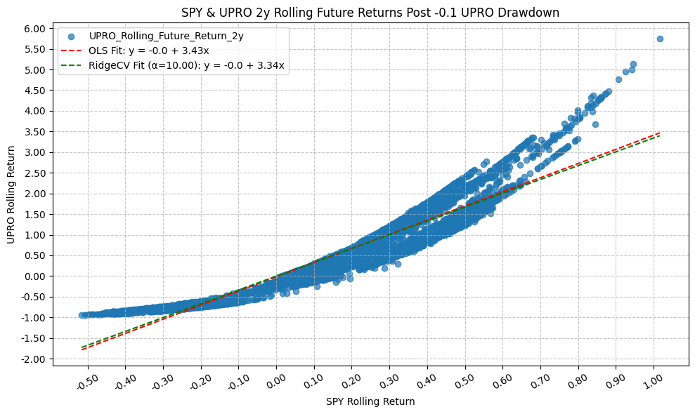
    


                                      OLS Regression Results                                 
    =========================================================================================
    Dep. Variable:     UPRO_Rolling_Future_Return_2y   R-squared:                       0.891
    Model:                                       OLS   Adj. R-squared:                  0.891
    Method:                            Least Squares   F-statistic:                 4.976e+04
    Date:                           Fri, 20 Mar 2026   Prob (F-statistic):               0.00
    Time:                                   10:50:21   Log-Likelihood:                -1449.1
    No. Observations:                           6065   AIC:                             2902.
    Df Residuals:                               6063   BIC:                             2916.
    Df Model:                                      1                                         
    Covariance Type:                       nonrobust                                         
    ================================================================================================
                                       coef    std err          t      P>|t|      [0.025      0.975]
    ------------------------------------------------------------------------------------------------
    const                           -0.0177      0.005     -3.647      0.000      -0.027      -0.008
    SPY_Rolling_Future_Return_2y     3.4267      0.015    223.064      0.000       3.397       3.457
    ==============================================================================
    Omnibus:                     1154.647   Durbin-Watson:                   0.024
    Prob(Omnibus):                  0.000   Jarque-Bera (JB):             2673.170
    Skew:                           1.077   Prob(JB):                         0.00
    Kurtosis:                       5.437   Cond. No.                         4.03
    ==============================================================================
    
    Notes:
    [1] Standard Errors assume that the covariance matrix of the errors is correctly specified.


    
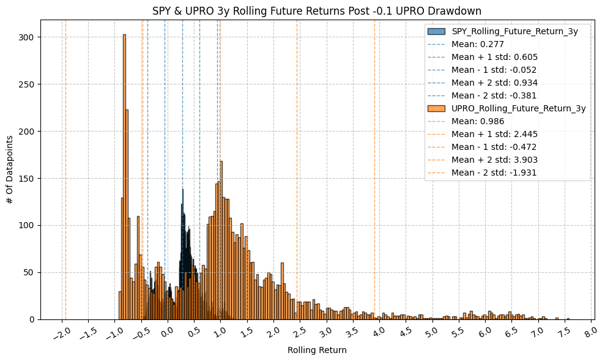
    


    
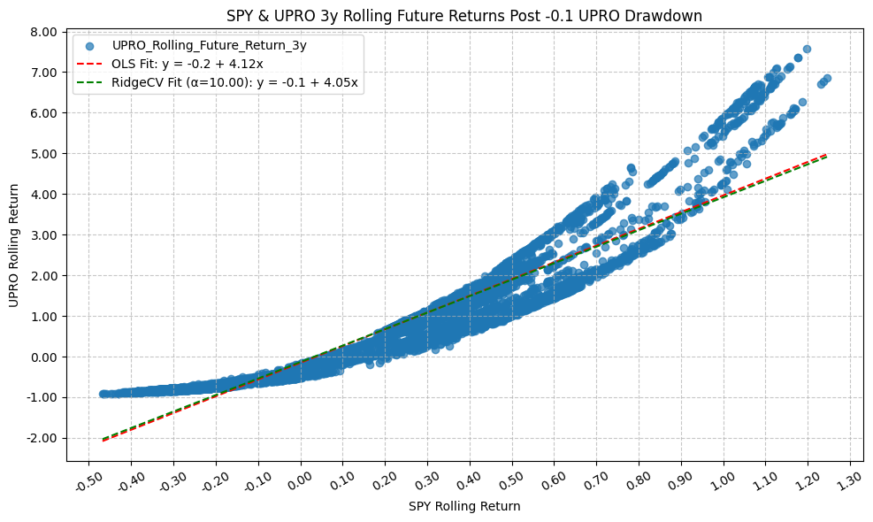
    


                                      OLS Regression Results                                 
    =========================================================================================
    Dep. Variable:     UPRO_Rolling_Future_Return_3y   R-squared:                       0.861
    Model:                                       OLS   Adj. R-squared:                  0.861
    Method:                            Least Squares   F-statistic:                 3.593e+04
    Date:                           Fri, 20 Mar 2026   Prob (F-statistic):               0.00
    Time:                                   10:50:22   Log-Likelihood:                -4711.2
    No. Observations:                           5813   AIC:                             9426.
    Df Residuals:                               5811   BIC:                             9440.
    Df Model:                                      1                                         
    Covariance Type:                       nonrobust                                         
    ================================================================================================
                                       coef    std err          t      P>|t|      [0.025      0.975]
    ------------------------------------------------------------------------------------------------
    const                           -0.1527      0.009    -16.362      0.000      -0.171      -0.134
    SPY_Rolling_Future_Return_3y     4.1189      0.022    189.542      0.000       4.076       4.161
    ==============================================================================
    Omnibus:                     1535.888   Durbin-Watson:                   0.011
    Prob(Omnibus):                  0.000   Jarque-Bera (JB):             4892.352
    Skew:                           1.338   Prob(JB):                         0.00
    Kurtosis:                       6.611   Cond. No.                         3.30
    ==============================================================================
    
    Notes:
    [1] Standard Errors assume that the covariance matrix of the errors is correctly specified.


    
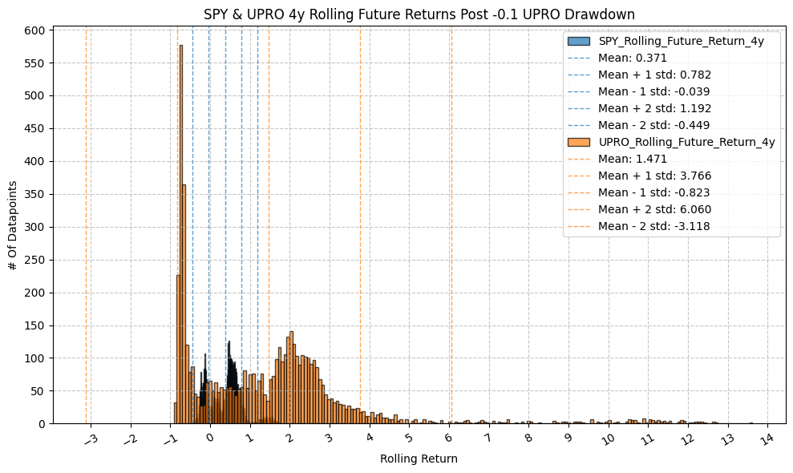
    


    
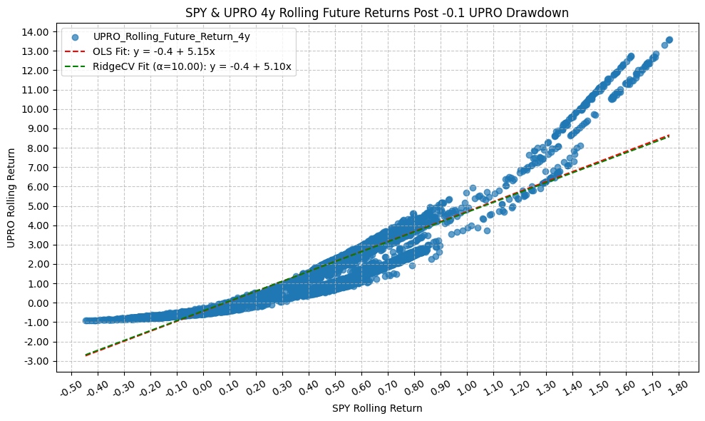
    


                                      OLS Regression Results                                 
    =========================================================================================
    Dep. Variable:     UPRO_Rolling_Future_Return_4y   R-squared:                       0.848
    Model:                                       OLS   Adj. R-squared:                  0.848
    Method:                            Least Squares   F-statistic:                 3.107e+04
    Date:                           Fri, 20 Mar 2026   Prob (F-statistic):               0.00
    Time:                                   10:50:24   Log-Likelihood:                -7266.5
    No. Observations:                           5561   AIC:                         1.454e+04
    Df Residuals:                               5559   BIC:                         1.455e+04
    Df Model:                                      1                                         
    Covariance Type:                       nonrobust                                         
    ================================================================================================
                                       coef    std err          t      P>|t|      [0.025      0.975]
    ------------------------------------------------------------------------------------------------
    const                           -0.4423      0.016    -27.345      0.000      -0.474      -0.411
    SPY_Rolling_Future_Return_4y     5.1517      0.029    176.265      0.000       5.094       5.209
    ==============================================================================
    Omnibus:                     1907.051   Durbin-Watson:                   0.013
    Prob(Omnibus):                  0.000   Jarque-Bera (JB):            10159.047
    Skew:                           1.553   Prob(JB):                         0.00
    Kurtosis:                       8.848   Cond. No.                         2.83
    ==============================================================================
    
    Notes:
    [1] Standard Errors assume that the covariance matrix of the errors is correctly specified.


    

    


    

    


                                      OLS Regression Results                                 
    =========================================================================================
    Dep. Variable:     UPRO_Rolling_Future_Return_5y   R-squared:                       0.838
    Model:                                       OLS   Adj. R-squared:                  0.838
    Method:                            Least Squares   F-statistic:                 2.842e+04
    Date:                           Fri, 20 Mar 2026   Prob (F-statistic):               0.00
    Time:                                   10:50:25   Log-Likelihood:                -9617.9
    No. Observations:                           5508   AIC:                         1.924e+04
    Df Residuals:                               5506   BIC:                         1.925e+04
    Df Model:                                      1                                         
    Covariance Type:                       nonrobust                                         
    ================================================================================================
                                       coef    std err          t      P>|t|      [0.025      0.975]
    ------------------------------------------------------------------------------------------------
    const                           -0.9357      0.026    -35.724      0.000      -0.987      -0.884
    SPY_Rolling_Future_Return_5y     6.1980      0.037    168.589      0.000       6.126       6.270
    ==============================================================================
    Omnibus:                     1244.885   Durbin-Watson:                   0.010
    Prob(Omnibus):                  0.000   Jarque-Bera (JB):             4373.673
    Skew:                           1.109   Prob(JB):                         0.00
    Kurtosis:                       6.760   Cond. No.                         2.58
    ==============================================================================
    
    Notes:
    [1] Standard Errors assume that the covariance matrix of the errors is correctly specified.


    

    


    

    


                                      OLS Regression Results                                 
    =========================================================================================
    Dep. Variable:     UPRO_Rolling_Future_Return_1d   R-squared:                       0.997
    Model:                                       OLS   Adj. R-squared:                  0.997
    Method:                            Least Squares   F-statistic:                 1.837e+06
    Date:                           Fri, 20 Mar 2026   Prob (F-statistic):               0.00
    Time:                                   10:50:26   Log-Likelihood:                 25121.
    No. Observations:                           5293   AIC:                        -5.024e+04
    Df Residuals:                               5291   BIC:                        -5.023e+04
    Df Model:                                      1                                         
    Covariance Type:                       nonrobust                                         
    ================================================================================================
                                       coef    std err          t      P>|t|      [0.025      0.975]
    ------------------------------------------------------------------------------------------------
    const                         3.561e-05   2.89e-05      1.232      0.218   -2.11e-05    9.23e-05
    SPY_Rolling_Future_Return_1d     2.9772      0.002   1355.227      0.000       2.973       2.981
    ==============================================================================
    Omnibus:                     3682.704   Durbin-Watson:                   2.648
    Prob(Omnibus):                  0.000   Jarque-Bera (JB):          1787442.183
    Skew:                           2.082   Prob(JB):                         0.00
    Kurtosis:                      92.930   Cond. No.                         76.0
    ==============================================================================
    
    Notes:
    [1] Standard Errors assume that the covariance matrix of the errors is correctly specified.


    

    


    
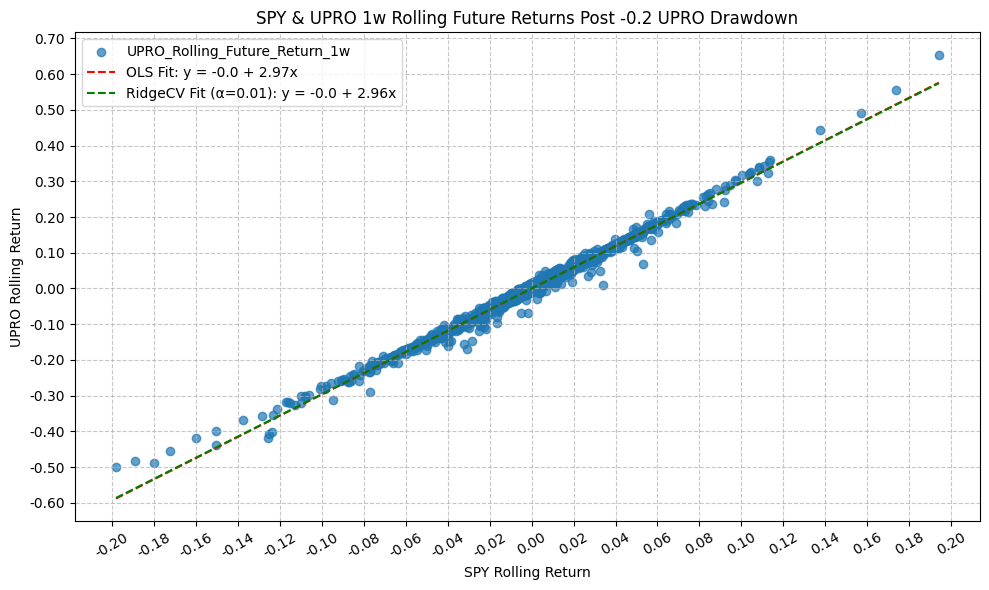
    


                                      OLS Regression Results                                 
    =========================================================================================
    Dep. Variable:     UPRO_Rolling_Future_Return_1w   R-squared:                       0.993
    Model:                                       OLS   Adj. R-squared:                  0.993
    Method:                            Least Squares   F-statistic:                 7.714e+05
    Date:                           Fri, 20 Mar 2026   Prob (F-statistic):               0.00
    Time:                                   10:50:27   Log-Likelihood:                 19160.
    No. Observations:                           5293   AIC:                        -3.832e+04
    Df Residuals:                               5291   BIC:                        -3.830e+04
    Df Model:                                      1                                         
    Covariance Type:                       nonrobust                                         
    ================================================================================================
                                       coef    std err          t      P>|t|      [0.025      0.975]
    ------------------------------------------------------------------------------------------------
    const                           -0.0002   8.94e-05     -2.240      0.025      -0.000    -2.5e-05
    SPY_Rolling_Future_Return_1w     2.9708      0.003    878.275      0.000       2.964       2.977
    ==============================================================================
    Omnibus:                     2333.094   Durbin-Watson:                   0.986
    Prob(Omnibus):                  0.000   Jarque-Bera (JB):           564966.997
    Skew:                          -0.921   Prob(JB):                         0.00
    Kurtosis:                      53.580   Cond. No.                         38.0
    ==============================================================================
    
    Notes:
    [1] Standard Errors assume that the covariance matrix of the errors is correctly specified.


    

    


    

    


                                      OLS Regression Results                                 
    =========================================================================================
    Dep. Variable:     UPRO_Rolling_Future_Return_1m   R-squared:                       0.987
    Model:                                       OLS   Adj. R-squared:                  0.987
    Method:                            Least Squares   F-statistic:                 4.024e+05
    Date:                           Fri, 20 Mar 2026   Prob (F-statistic):               0.00
    Time:                                   10:50:28   Log-Likelihood:                 14137.
    No. Observations:                           5293   AIC:                        -2.827e+04
    Df Residuals:                               5291   BIC:                        -2.826e+04
    Df Model:                                      1                                         
    Covariance Type:                       nonrobust                                         
    ================================================================================================
                                       coef    std err          t      P>|t|      [0.025      0.975]
    ------------------------------------------------------------------------------------------------
    const                           -0.0014      0.000     -6.033      0.000      -0.002      -0.001
    SPY_Rolling_Future_Return_1m     2.9716      0.005    634.375      0.000       2.962       2.981
    ==============================================================================
    Omnibus:                     2857.220   Durbin-Watson:                   0.332
    Prob(Omnibus):                  0.000   Jarque-Bera (JB):           280081.058
    Skew:                          -1.658   Prob(JB):                         0.00
    Kurtosis:                      38.482   Cond. No.                         20.4
    ==============================================================================
    
    Notes:
    [1] Standard Errors assume that the covariance matrix of the errors is correctly specified.


    

    


    

    


                                      OLS Regression Results                                 
    =========================================================================================
    Dep. Variable:     UPRO_Rolling_Future_Return_3m   R-squared:                       0.977
    Model:                                       OLS   Adj. R-squared:                  0.977
    Method:                            Least Squares   F-statistic:                 2.274e+05
    Date:                           Fri, 20 Mar 2026   Prob (F-statistic):               0.00
    Time:                                   10:50:29   Log-Likelihood:                 9942.2
    No. Observations:                           5293   AIC:                        -1.988e+04
    Df Residuals:                               5291   BIC:                        -1.987e+04
    Df Model:                                      1                                         
    Covariance Type:                       nonrobust                                         
    ================================================================================================
                                       coef    std err          t      P>|t|      [0.025      0.975]
    ------------------------------------------------------------------------------------------------
    const                           -0.0036      0.001     -6.764      0.000      -0.005      -0.003
    SPY_Rolling_Future_Return_3m     3.0230      0.006    476.832      0.000       3.011       3.035
    ==============================================================================
    Omnibus:                     1416.235   Durbin-Watson:                   0.159
    Prob(Omnibus):                  0.000   Jarque-Bera (JB):            70538.125
    Skew:                           0.467   Prob(JB):                         0.00
    Kurtosis:                      20.860   Cond. No.                         12.5
    ==============================================================================
    
    Notes:
    [1] Standard Errors assume that the covariance matrix of the errors is correctly specified.


    
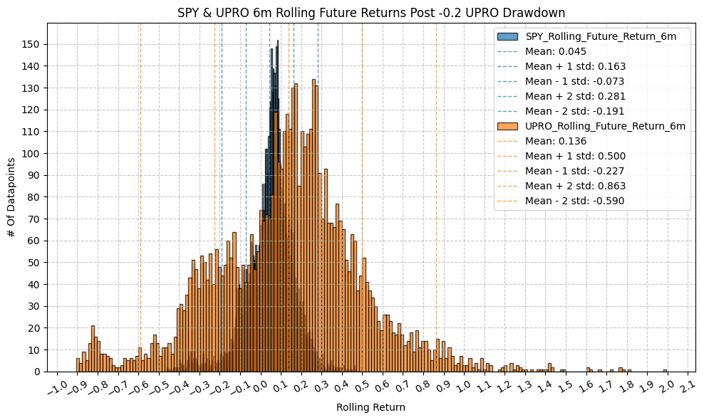
    


    

    


                                      OLS Regression Results                                 
    =========================================================================================
    Dep. Variable:     UPRO_Rolling_Future_Return_6m   R-squared:                       0.960
    Model:                                       OLS   Adj. R-squared:                  0.960
    Method:                            Least Squares   F-statistic:                 1.281e+05
    Date:                           Fri, 20 Mar 2026   Prob (F-statistic):               0.00
    Time:                                   10:50:30   Log-Likelihood:                 6392.3
    No. Observations:                           5293   AIC:                        -1.278e+04
    Df Residuals:                               5291   BIC:                        -1.277e+04
    Df Model:                                      1                                         
    Covariance Type:                       nonrobust                                         
    ================================================================================================
                                       coef    std err          t      P>|t|      [0.025      0.975]
    ------------------------------------------------------------------------------------------------
    const                            0.0016      0.001      1.525      0.127      -0.000       0.004
    SPY_Rolling_Future_Return_6m     3.0177      0.008    357.941      0.000       3.001       3.034
    ==============================================================================
    Omnibus:                     1752.104   Durbin-Watson:                   0.078
    Prob(Omnibus):                  0.000   Jarque-Bera (JB):            16365.813
    Skew:                           1.309   Prob(JB):                         0.00
    Kurtosis:                      11.207   Cond. No.                         8.50
    ==============================================================================
    
    Notes:
    [1] Standard Errors assume that the covariance matrix of the errors is correctly specified.


    

    


    
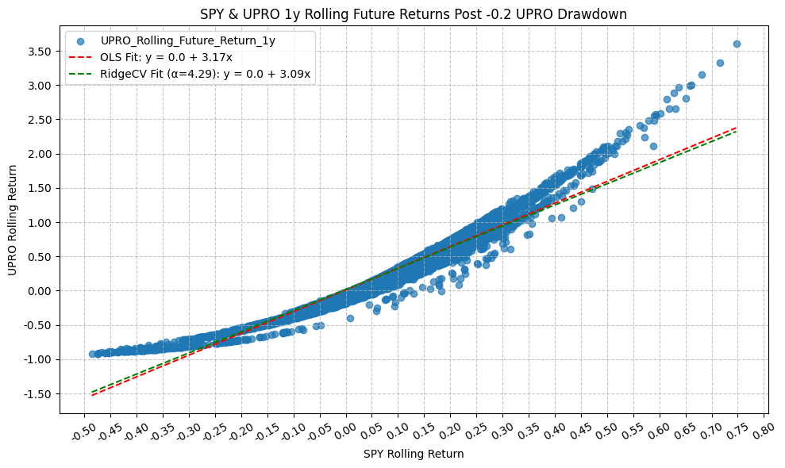
    


                                      OLS Regression Results                                 
    =========================================================================================
    Dep. Variable:     UPRO_Rolling_Future_Return_1y   R-squared:                       0.937
    Model:                                       OLS   Adj. R-squared:                  0.937
    Method:                            Least Squares   F-statistic:                 7.751e+04
    Date:                           Fri, 20 Mar 2026   Prob (F-statistic):               0.00
    Time:                                   10:50:31   Log-Likelihood:                 2737.4
    No. Observations:                           5252   AIC:                            -5471.
    Df Residuals:                               5250   BIC:                            -5458.
    Df Model:                                      1                                         
    Covariance Type:                       nonrobust                                         
    ================================================================================================
                                       coef    std err          t      P>|t|      [0.025      0.975]
    ------------------------------------------------------------------------------------------------
    const                            0.0100      0.002      4.499      0.000       0.006       0.014
    SPY_Rolling_Future_Return_1y     3.1685      0.011    278.402      0.000       3.146       3.191
    ==============================================================================
    Omnibus:                     1724.172   Durbin-Watson:                   0.051
    Prob(Omnibus):                  0.000   Jarque-Bera (JB):             9878.617
    Skew:                           1.452   Prob(JB):                         0.00
    Kurtosis:                       9.059   Cond. No.                         5.79
    ==============================================================================
    
    Notes:
    [1] Standard Errors assume that the covariance matrix of the errors is correctly specified.


    

    


    
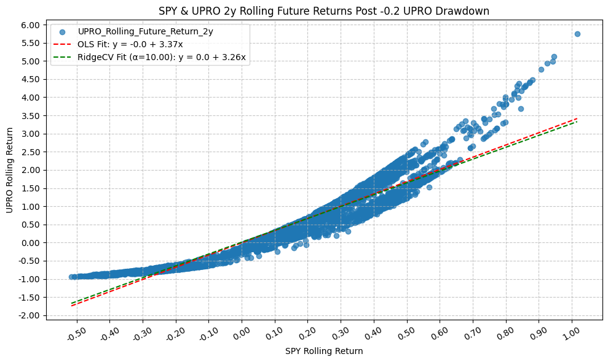
    


                                      OLS Regression Results                                 
    =========================================================================================
    Dep. Variable:     UPRO_Rolling_Future_Return_2y   R-squared:                       0.895
    Model:                                       OLS   Adj. R-squared:                  0.895
    Method:                            Least Squares   F-statistic:                 4.481e+04
    Date:                           Fri, 20 Mar 2026   Prob (F-statistic):               0.00
    Time:                                   10:50:32   Log-Likelihood:                -840.74
    No. Observations:                           5235   AIC:                             1685.
    Df Residuals:                               5233   BIC:                             1699.
    Df Model:                                      1                                         
    Covariance Type:                       nonrobust                                         
    ================================================================================================
                                       coef    std err          t      P>|t|      [0.025      0.975]
    ------------------------------------------------------------------------------------------------
    const                           -0.0069      0.005     -1.420      0.156      -0.016       0.003
    SPY_Rolling_Future_Return_2y     3.3654      0.016    211.679      0.000       3.334       3.397
    ==============================================================================
    Omnibus:                     1350.050   Durbin-Watson:                   0.031
    Prob(Omnibus):                  0.000   Jarque-Bera (JB):             4692.374
    Skew:                           1.271   Prob(JB):                         0.00
    Kurtosis:                       6.879   Cond. No.                         4.18
    ==============================================================================
    
    Notes:
    [1] Standard Errors assume that the covariance matrix of the errors is correctly specified.


    

    


    
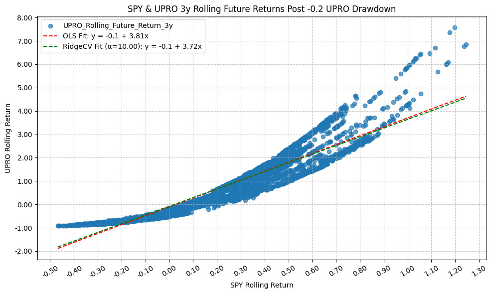
    


                                      OLS Regression Results                                 
    =========================================================================================
    Dep. Variable:     UPRO_Rolling_Future_Return_3y   R-squared:                       0.885
    Model:                                       OLS   Adj. R-squared:                  0.885
    Method:                            Least Squares   F-statistic:                 3.852e+04
    Date:                           Fri, 20 Mar 2026   Prob (F-statistic):               0.00
    Time:                                   10:50:34   Log-Likelihood:                -2526.5
    No. Observations:                           5002   AIC:                             5057.
    Df Residuals:                               5000   BIC:                             5070.
    Df Model:                                      1                                         
    Covariance Type:                       nonrobust                                         
    ================================================================================================
                                       coef    std err          t      P>|t|      [0.025      0.975]
    ------------------------------------------------------------------------------------------------
    const                           -0.1050      0.008    -13.937      0.000      -0.120      -0.090
    SPY_Rolling_Future_Return_3y     3.8062      0.019    196.263      0.000       3.768       3.844
    ==============================================================================
    Omnibus:                     1503.052   Durbin-Watson:                   0.020
    Prob(Omnibus):                  0.000   Jarque-Bera (JB):             8258.957
    Skew:                           1.327   Prob(JB):                         0.00
    Kurtosis:                       8.708   Cond. No.                         3.66
    ==============================================================================
    
    Notes:
    [1] Standard Errors assume that the covariance matrix of the errors is correctly specified.


    
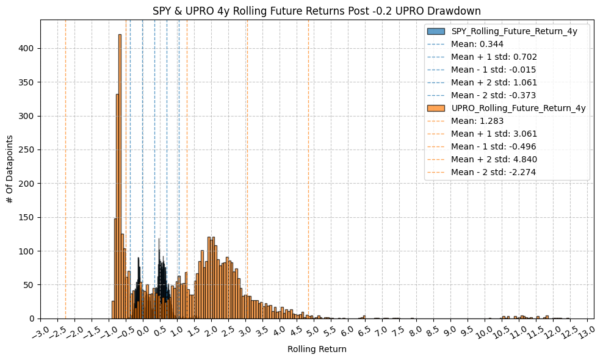
    


    

    


                                      OLS Regression Results                                 
    =========================================================================================
    Dep. Variable:     UPRO_Rolling_Future_Return_4y   R-squared:                       0.861
    Model:                                       OLS   Adj. R-squared:                  0.861
    Method:                            Least Squares   F-statistic:                 2.954e+04
    Date:                           Fri, 20 Mar 2026   Prob (F-statistic):               0.00
    Time:                                   10:50:35   Log-Likelihood:                -4794.7
    No. Observations:                           4761   AIC:                             9593.
    Df Residuals:                               4759   BIC:                             9606.
    Df Model:                                      1                                         
    Covariance Type:                       nonrobust                                         
    ================================================================================================
                                       coef    std err          t      P>|t|      [0.025      0.975]
    ------------------------------------------------------------------------------------------------
    const                           -0.3006      0.013    -22.590      0.000      -0.327      -0.275
    SPY_Rolling_Future_Return_4y     4.6048      0.027    171.866      0.000       4.552       4.657
    ==============================================================================
    Omnibus:                     2926.577   Durbin-Watson:                   0.020
    Prob(Omnibus):                  0.000   Jarque-Bera (JB):            69551.746
    Skew:                           2.509   Prob(JB):                         0.00
    Kurtosis:                      21.039   Cond. No.                         3.16
    ==============================================================================
    
    Notes:
    [1] Standard Errors assume that the covariance matrix of the errors is correctly specified.


    

    


    

    


                                      OLS Regression Results                                 
    =========================================================================================
    Dep. Variable:     UPRO_Rolling_Future_Return_5y   R-squared:                       0.842
    Model:                                       OLS   Adj. R-squared:                  0.842
    Method:                            Least Squares   F-statistic:                 2.529e+04
    Date:                           Fri, 20 Mar 2026   Prob (F-statistic):               0.00
    Time:                                   10:50:36   Log-Likelihood:                -6916.8
    No. Observations:                           4736   AIC:                         1.384e+04
    Df Residuals:                               4734   BIC:                         1.385e+04
    Df Model:                                      1                                         
    Covariance Type:                       nonrobust                                         
    ================================================================================================
                                       coef    std err          t      P>|t|      [0.025      0.975]
    ------------------------------------------------------------------------------------------------
    const                           -0.6492      0.022    -29.490      0.000      -0.692      -0.606
    SPY_Rolling_Future_Return_5y     5.4202      0.034    159.019      0.000       5.353       5.487
    ==============================================================================
    Omnibus:                     2513.002   Durbin-Watson:                   0.026
    Prob(Omnibus):                  0.000   Jarque-Bera (JB):            40989.951
    Skew:                           2.157   Prob(JB):                         0.00
    Kurtosis:                      16.751   Cond. No.                         2.84
    ==============================================================================
    
    Notes:
    [1] Standard Errors assume that the covariance matrix of the errors is correctly specified.


    

    


    

    


                                      OLS Regression Results                                 
    =========================================================================================
    Dep. Variable:     UPRO_Rolling_Future_Return_1d   R-squared:                       0.997
    Model:                                       OLS   Adj. R-squared:                  0.997
    Method:                            Least Squares   F-statistic:                 1.595e+06
    Date:                           Fri, 20 Mar 2026   Prob (F-statistic):               0.00
    Time:                                   10:50:37   Log-Likelihood:                 22509.
    No. Observations:                           4774   AIC:                        -4.501e+04
    Df Residuals:                               4772   BIC:                        -4.500e+04
    Df Model:                                      1                                         
    Covariance Type:                       nonrobust                                         
    ================================================================================================
                                       coef    std err          t      P>|t|      [0.025      0.975]
    ------------------------------------------------------------------------------------------------
    const                           4.7e-05   3.14e-05      1.497      0.135   -1.46e-05       0.000
    SPY_Rolling_Future_Return_1d     2.9768      0.002   1263.103      0.000       2.972       2.981
    ==============================================================================
    Omnibus:                     3250.841   Durbin-Watson:                   2.668
    Prob(Omnibus):                  0.000   Jarque-Bera (JB):          1511419.631
    Skew:                           2.004   Prob(JB):                         0.00
    Kurtosis:                      90.076   Cond. No.                         75.1
    ==============================================================================
    
    Notes:
    [1] Standard Errors assume that the covariance matrix of the errors is correctly specified.


    

    


    

    


                                      OLS Regression Results                                 
    =========================================================================================
    Dep. Variable:     UPRO_Rolling_Future_Return_1w   R-squared:                       0.993
    Model:                                       OLS   Adj. R-squared:                  0.993
    Method:                            Least Squares   F-statistic:                 6.655e+05
    Date:                           Fri, 20 Mar 2026   Prob (F-statistic):               0.00
    Time:                                   10:50:38   Log-Likelihood:                 17170.
    No. Observations:                           4774   AIC:                        -3.434e+04
    Df Residuals:                               4772   BIC:                        -3.432e+04
    Df Model:                                      1                                         
    Covariance Type:                       nonrobust                                         
    ================================================================================================
                                       coef    std err          t      P>|t|      [0.025      0.975]
    ------------------------------------------------------------------------------------------------
    const                           -0.0002   9.63e-05     -1.929      0.054      -0.000    2.99e-06
    SPY_Rolling_Future_Return_1w     2.9716      0.004    815.801      0.000       2.964       2.979
    ==============================================================================
    Omnibus:                     1997.757   Durbin-Watson:                   0.986
    Prob(Omnibus):                  0.000   Jarque-Bera (JB):           483401.433
    Skew:                          -0.802   Prob(JB):                         0.00
    Kurtosis:                      52.271   Cond. No.                         37.9
    ==============================================================================
    
    Notes:
    [1] Standard Errors assume that the covariance matrix of the errors is correctly specified.


    

    


    

    


                                      OLS Regression Results                                 
    =========================================================================================
    Dep. Variable:     UPRO_Rolling_Future_Return_1m   R-squared:                       0.987
    Model:                                       OLS   Adj. R-squared:                  0.987
    Method:                            Least Squares   F-statistic:                 3.515e+05
    Date:                           Fri, 20 Mar 2026   Prob (F-statistic):               0.00
    Time:                                   10:50:39   Log-Likelihood:                 12680.
    No. Observations:                           4774   AIC:                        -2.536e+04
    Df Residuals:                               4772   BIC:                        -2.534e+04
    Df Model:                                      1                                         
    Covariance Type:                       nonrobust                                         
    ================================================================================================
                                       coef    std err          t      P>|t|      [0.025      0.975]
    ------------------------------------------------------------------------------------------------
    const                           -0.0011      0.000     -4.428      0.000      -0.002      -0.001
    SPY_Rolling_Future_Return_1m     2.9621      0.005    592.897      0.000       2.952       2.972
    ==============================================================================
    Omnibus:                     2677.442   Durbin-Watson:                   0.336
    Prob(Omnibus):                  0.000   Jarque-Bera (JB):           262815.265
    Skew:                          -1.764   Prob(JB):                         0.00
    Kurtosis:                      39.177   Cond. No.                         20.3
    ==============================================================================
    
    Notes:
    [1] Standard Errors assume that the covariance matrix of the errors is correctly specified.


    

    


    
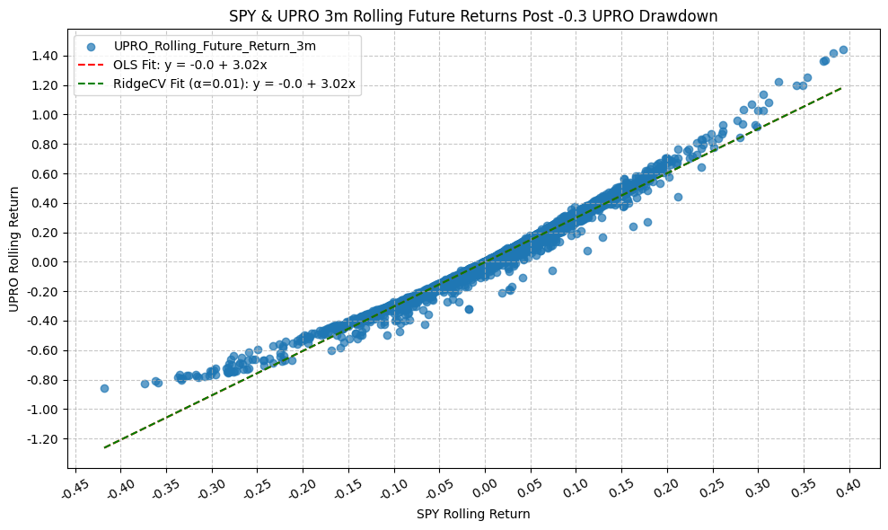
    


                                      OLS Regression Results                                 
    =========================================================================================
    Dep. Variable:     UPRO_Rolling_Future_Return_3m   R-squared:                       0.978
    Model:                                       OLS   Adj. R-squared:                  0.978
    Method:                            Least Squares   F-statistic:                 2.123e+05
    Date:                           Fri, 20 Mar 2026   Prob (F-statistic):               0.00
    Time:                                   10:50:40   Log-Likelihood:                 8982.1
    No. Observations:                           4774   AIC:                        -1.796e+04
    Df Residuals:                               4772   BIC:                        -1.795e+04
    Df Model:                                      1                                         
    Covariance Type:                       nonrobust                                         
    ================================================================================================
                                       coef    std err          t      P>|t|      [0.025      0.975]
    ------------------------------------------------------------------------------------------------
    const                           -0.0024      0.001     -4.439      0.000      -0.004      -0.001
    SPY_Rolling_Future_Return_3m     3.0171      0.007    460.794      0.000       3.004       3.030
    ==============================================================================
    Omnibus:                     1429.013   Durbin-Watson:                   0.169
    Prob(Omnibus):                  0.000   Jarque-Bera (JB):            68304.746
    Skew:                           0.660   Prob(JB):                         0.00
    Kurtosis:                      21.484   Cond. No.                         12.3
    ==============================================================================
    
    Notes:
    [1] Standard Errors assume that the covariance matrix of the errors is correctly specified.


    

    


    
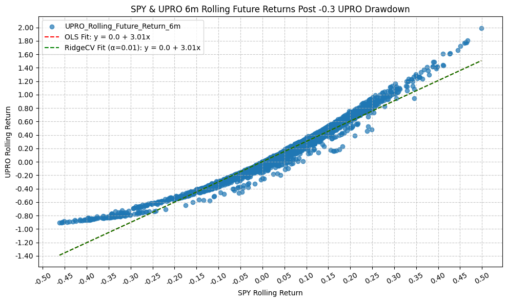
    


                                      OLS Regression Results                                 
    =========================================================================================
    Dep. Variable:     UPRO_Rolling_Future_Return_6m   R-squared:                       0.960
    Model:                                       OLS   Adj. R-squared:                  0.960
    Method:                            Least Squares   F-statistic:                 1.138e+05
    Date:                           Fri, 20 Mar 2026   Prob (F-statistic):               0.00
    Time:                                   10:50:41   Log-Likelihood:                 5697.0
    No. Observations:                           4774   AIC:                        -1.139e+04
    Df Residuals:                               4772   BIC:                        -1.138e+04
    Df Model:                                      1                                         
    Covariance Type:                       nonrobust                                         
    ================================================================================================
                                       coef    std err          t      P>|t|      [0.025      0.975]
    ------------------------------------------------------------------------------------------------
    const                            0.0029      0.001      2.542      0.011       0.001       0.005
    SPY_Rolling_Future_Return_6m     3.0135      0.009    337.350      0.000       2.996       3.031
    ==============================================================================
    Omnibus:                     1652.367   Durbin-Watson:                   0.081
    Prob(Omnibus):                  0.000   Jarque-Bera (JB):            14599.595
    Skew:                           1.398   Prob(JB):                         0.00
    Kurtosis:                      11.098   Cond. No.                         8.43
    ==============================================================================
    
    Notes:
    [1] Standard Errors assume that the covariance matrix of the errors is correctly specified.


    

    


    

    


                                      OLS Regression Results                                 
    =========================================================================================
    Dep. Variable:     UPRO_Rolling_Future_Return_1y   R-squared:                       0.937
    Model:                                       OLS   Adj. R-squared:                  0.937
    Method:                            Least Squares   F-statistic:                 7.059e+04
    Date:                           Fri, 20 Mar 2026   Prob (F-statistic):               0.00
    Time:                                   10:50:43   Log-Likelihood:                 2483.5
    No. Observations:                           4753   AIC:                            -4963.
    Df Residuals:                               4751   BIC:                            -4950.
    Df Model:                                      1                                         
    Covariance Type:                       nonrobust                                         
    ================================================================================================
                                       coef    std err          t      P>|t|      [0.025      0.975]
    ------------------------------------------------------------------------------------------------
    const                            0.0150      0.002      6.476      0.000       0.010       0.020
    SPY_Rolling_Future_Return_1y     3.1488      0.012    265.683      0.000       3.126       3.172
    ==============================================================================
    Omnibus:                     1666.061   Durbin-Watson:                   0.054
    Prob(Omnibus):                  0.000   Jarque-Bera (JB):            10578.904
    Skew:                           1.528   Prob(JB):                         0.00
    Kurtosis:                       9.639   Cond. No.                         5.74
    ==============================================================================
    
    Notes:
    [1] Standard Errors assume that the covariance matrix of the errors is correctly specified.


    
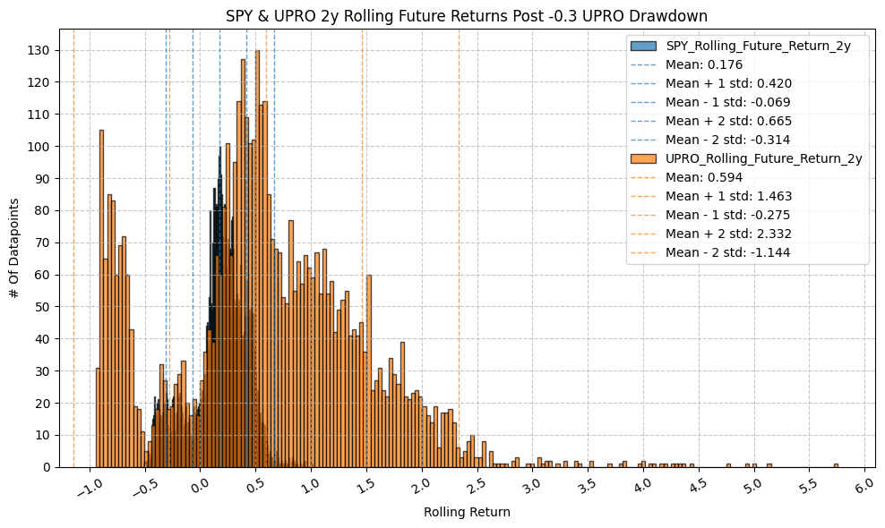
    


    

    


                                      OLS Regression Results                                 
    =========================================================================================
    Dep. Variable:     UPRO_Rolling_Future_Return_2y   R-squared:                       0.901
    Model:                                       OLS   Adj. R-squared:                  0.901
    Method:                            Least Squares   F-statistic:                 4.347e+04
    Date:                           Fri, 20 Mar 2026   Prob (F-statistic):               0.00
    Time:                                   10:50:44   Log-Likelihood:                -568.49
    No. Observations:                           4753   AIC:                             1141.
    Df Residuals:                               4751   BIC:                             1154.
    Df Model:                                      1                                         
    Covariance Type:                       nonrobust                                         
    ================================================================================================
                                       coef    std err          t      P>|t|      [0.025      0.975]
    ------------------------------------------------------------------------------------------------
    const                            0.0020      0.005      0.409      0.683      -0.008       0.012
    SPY_Rolling_Future_Return_2y     3.3736      0.016    208.486      0.000       3.342       3.405
    ==============================================================================
    Omnibus:                     1332.905   Durbin-Watson:                   0.031
    Prob(Omnibus):                  0.000   Jarque-Bera (JB):             5113.745
    Skew:                           1.349   Prob(JB):                         0.00
    Kurtosis:                       7.306   Cond. No.                         4.22
    ==============================================================================
    
    Notes:
    [1] Standard Errors assume that the covariance matrix of the errors is correctly specified.


    
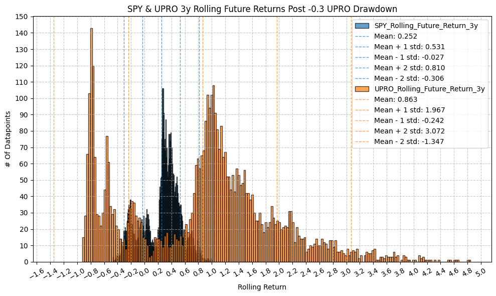
    


    

    


                                      OLS Regression Results                                 
    =========================================================================================
    Dep. Variable:     UPRO_Rolling_Future_Return_3y   R-squared:                       0.904
    Model:                                       OLS   Adj. R-squared:                  0.904
    Method:                            Least Squares   F-statistic:                 4.268e+04
    Date:                           Fri, 20 Mar 2026   Prob (F-statistic):               0.00
    Time:                                   10:50:45   Log-Likelihood:                -1583.7
    No. Observations:                           4549   AIC:                             3171.
    Df Residuals:                               4547   BIC:                             3184.
    Df Model:                                      1                                         
    Covariance Type:                       nonrobust                                         
    ================================================================================================
                                       coef    std err          t      P>|t|      [0.025      0.975]
    ------------------------------------------------------------------------------------------------
    const                           -0.0863      0.007    -12.600      0.000      -0.100      -0.073
    SPY_Rolling_Future_Return_3y     3.7621      0.018    206.583      0.000       3.726       3.798
    ==============================================================================
    Omnibus:                      689.204   Durbin-Watson:                   0.019
    Prob(Omnibus):                  0.000   Jarque-Bera (JB):             1786.337
    Skew:                           0.836   Prob(JB):                         0.00
    Kurtosis:                       5.575   Cond. No.                         3.83
    ==============================================================================
    
    Notes:
    [1] Standard Errors assume that the covariance matrix of the errors is correctly specified.


    

    


    
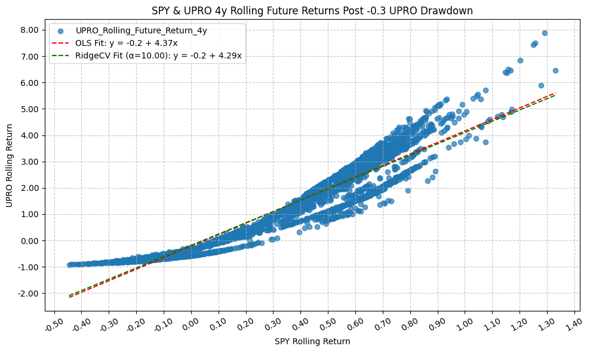
    


                                      OLS Regression Results                                 
    =========================================================================================
    Dep. Variable:     UPRO_Rolling_Future_Return_4y   R-squared:                       0.916
    Model:                                       OLS   Adj. R-squared:                  0.916
    Method:                            Least Squares   F-statistic:                 4.692e+04
    Date:                           Fri, 20 Mar 2026   Prob (F-statistic):               0.00
    Time:                                   10:50:46   Log-Likelihood:                -2639.4
    No. Observations:                           4323   AIC:                             5283.
    Df Residuals:                               4321   BIC:                             5296.
    Df Model:                                      1                                         
    Covariance Type:                       nonrobust                                         
    ================================================================================================
                                       coef    std err          t      P>|t|      [0.025      0.975]
    ------------------------------------------------------------------------------------------------
    const                           -0.2147      0.009    -22.670      0.000      -0.233      -0.196
    SPY_Rolling_Future_Return_4y     4.3735      0.020    216.604      0.000       4.334       4.413
    ==============================================================================
    Omnibus:                      115.551   Durbin-Watson:                   0.023
    Prob(Omnibus):                  0.000   Jarque-Bera (JB):              243.237
    Skew:                          -0.148   Prob(JB):                     1.52e-53
    Kurtosis:                       4.124   Cond. No.                         3.33
    ==============================================================================
    
    Notes:
    [1] Standard Errors assume that the covariance matrix of the errors is correctly specified.


    

    


    

    


                                      OLS Regression Results                                 
    =========================================================================================
    Dep. Variable:     UPRO_Rolling_Future_Return_5y   R-squared:                       0.887
    Model:                                       OLS   Adj. R-squared:                  0.887
    Method:                            Least Squares   F-statistic:                 3.391e+04
    Date:                           Fri, 20 Mar 2026   Prob (F-statistic):               0.00
    Time:                                   10:50:47   Log-Likelihood:                -4969.9
    No. Observations:                           4317   AIC:                             9944.
    Df Residuals:                               4315   BIC:                             9957.
    Df Model:                                      1                                         
    Covariance Type:                       nonrobust                                         
    ================================================================================================
                                       coef    std err          t      P>|t|      [0.025      0.975]
    ------------------------------------------------------------------------------------------------
    const                           -0.4824      0.017    -28.176      0.000      -0.516      -0.449
    SPY_Rolling_Future_Return_5y     5.0841      0.028    184.147      0.000       5.030       5.138
    ==============================================================================
    Omnibus:                      712.801   Durbin-Watson:                   0.017
    Prob(Omnibus):                  0.000   Jarque-Bera (JB):             3463.411
    Skew:                           0.712   Prob(JB):                         0.00
    Kurtosis:                       7.150   Cond. No.                         2.94
    ==============================================================================
    
    Notes:
    [1] Standard Errors assume that the covariance matrix of the errors is correctly specified.


    

    


    
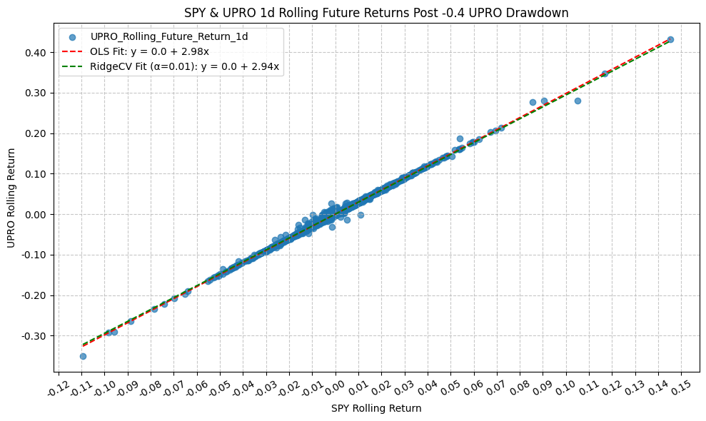
    


                                      OLS Regression Results                                 
    =========================================================================================
    Dep. Variable:     UPRO_Rolling_Future_Return_1d   R-squared:                       0.997
    Model:                                       OLS   Adj. R-squared:                  0.997
    Method:                            Least Squares   F-statistic:                 1.488e+06
    Date:                           Fri, 20 Mar 2026   Prob (F-statistic):               0.00
    Time:                                   10:50:48   Log-Likelihood:                 21081.
    No. Observations:                           4464   AIC:                        -4.216e+04
    Df Residuals:                               4462   BIC:                        -4.214e+04
    Df Model:                                      1                                         
    Covariance Type:                       nonrobust                                         
    ================================================================================================
                                       coef    std err          t      P>|t|      [0.025      0.975]
    ------------------------------------------------------------------------------------------------
    const                         4.396e-05   3.22e-05      1.364      0.173   -1.92e-05       0.000
    SPY_Rolling_Future_Return_1d     2.9793      0.002   1219.665      0.000       2.974       2.984
    ==============================================================================
    Omnibus:                     2686.074   Durbin-Watson:                   2.618
    Prob(Omnibus):                  0.000   Jarque-Bera (JB):          1503202.742
    Skew:                           1.531   Prob(JB):                         0.00
    Kurtosis:                      92.846   Cond. No.                         75.8
    ==============================================================================
    
    Notes:
    [1] Standard Errors assume that the covariance matrix of the errors is correctly specified.


    

    


    

    


                                      OLS Regression Results                                 
    =========================================================================================
    Dep. Variable:     UPRO_Rolling_Future_Return_1w   R-squared:                       0.993
    Model:                                       OLS   Adj. R-squared:                  0.993
    Method:                            Least Squares   F-statistic:                 6.179e+05
    Date:                           Fri, 20 Mar 2026   Prob (F-statistic):               0.00
    Time:                                   10:50:49   Log-Likelihood:                 16080.
    No. Observations:                           4464   AIC:                        -3.216e+04
    Df Residuals:                               4462   BIC:                        -3.214e+04
    Df Model:                                      1                                         
    Covariance Type:                       nonrobust                                         
    ================================================================================================
                                       coef    std err          t      P>|t|      [0.025      0.975]
    ------------------------------------------------------------------------------------------------
    const                           -0.0002    9.9e-05     -1.778      0.075      -0.000     1.8e-05
    SPY_Rolling_Future_Return_1w     2.9718      0.004    786.075      0.000       2.964       2.979
    ==============================================================================
    Omnibus:                     1978.273   Durbin-Watson:                   0.971
    Prob(Omnibus):                  0.000   Jarque-Bera (JB):           519573.742
    Skew:                          -0.906   Prob(JB):                         0.00
    Kurtosis:                      55.822   Cond. No.                         38.3
    ==============================================================================
    
    Notes:
    [1] Standard Errors assume that the covariance matrix of the errors is correctly specified.


    

    


    

    


                                      OLS Regression Results                                 
    =========================================================================================
    Dep. Variable:     UPRO_Rolling_Future_Return_1m   R-squared:                       0.986
    Model:                                       OLS   Adj. R-squared:                  0.986
    Method:                            Least Squares   F-statistic:                 3.225e+05
    Date:                           Fri, 20 Mar 2026   Prob (F-statistic):               0.00
    Time:                                   10:50:50   Log-Likelihood:                 11851.
    No. Observations:                           4464   AIC:                        -2.370e+04
    Df Residuals:                               4462   BIC:                        -2.368e+04
    Df Model:                                      1                                         
    Covariance Type:                       nonrobust                                         
    ================================================================================================
                                       coef    std err          t      P>|t|      [0.025      0.975]
    ------------------------------------------------------------------------------------------------
    const                           -0.0009      0.000     -3.423      0.001      -0.001      -0.000
    SPY_Rolling_Future_Return_1m     2.9521      0.005    567.899      0.000       2.942       2.962
    ==============================================================================
    Omnibus:                     2550.510   Durbin-Watson:                   0.358
    Prob(Omnibus):                  0.000   Jarque-Bera (JB):           256192.123
    Skew:                          -1.811   Prob(JB):                         0.00
    Kurtosis:                      39.936   Cond. No.                         20.4
    ==============================================================================
    
    Notes:
    [1] Standard Errors assume that the covariance matrix of the errors is correctly specified.


    
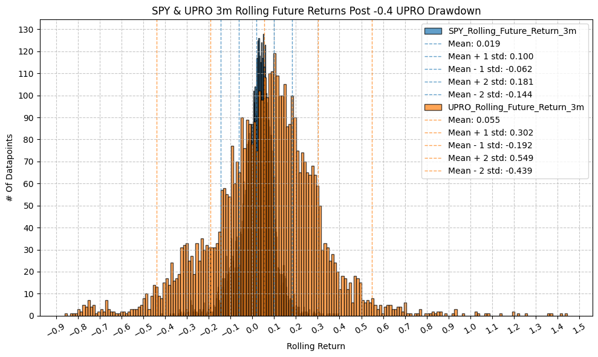
    


    

    


                                      OLS Regression Results                                 
    =========================================================================================
    Dep. Variable:     UPRO_Rolling_Future_Return_3m   R-squared:                       0.978
    Model:                                       OLS   Adj. R-squared:                  0.978
    Method:                            Least Squares   F-statistic:                 2.007e+05
    Date:                           Fri, 20 Mar 2026   Prob (F-statistic):               0.00
    Time:                                   10:50:52   Log-Likelihood:                 8451.5
    No. Observations:                           4464   AIC:                        -1.690e+04
    Df Residuals:                               4462   BIC:                        -1.689e+04
    Df Model:                                      1                                         
    Covariance Type:                       nonrobust                                         
    ================================================================================================
                                       coef    std err          t      P>|t|      [0.025      0.975]
    ------------------------------------------------------------------------------------------------
    const                           -0.0018      0.001     -3.149      0.002      -0.003      -0.001
    SPY_Rolling_Future_Return_3m     3.0075      0.007    448.019      0.000       2.994       3.021
    ==============================================================================
    Omnibus:                     1648.791   Durbin-Watson:                   0.182
    Prob(Omnibus):                  0.000   Jarque-Bera (JB):            57107.738
    Skew:                           1.101   Prob(JB):                         0.00
    Kurtosis:                      20.383   Cond. No.                         12.3
    ==============================================================================
    
    Notes:
    [1] Standard Errors assume that the covariance matrix of the errors is correctly specified.


    

    


    

    


                                      OLS Regression Results                                 
    =========================================================================================
    Dep. Variable:     UPRO_Rolling_Future_Return_6m   R-squared:                       0.959
    Model:                                       OLS   Adj. R-squared:                  0.959
    Method:                            Least Squares   F-statistic:                 1.039e+05
    Date:                           Fri, 20 Mar 2026   Prob (F-statistic):               0.00
    Time:                                   10:50:53   Log-Likelihood:                 5314.4
    No. Observations:                           4464   AIC:                        -1.062e+04
    Df Residuals:                               4462   BIC:                        -1.061e+04
    Df Model:                                      1                                         
    Covariance Type:                       nonrobust                                         
    ================================================================================================
                                       coef    std err          t      P>|t|      [0.025      0.975]
    ------------------------------------------------------------------------------------------------
    const                            0.0040      0.001      3.492      0.000       0.002       0.006
    SPY_Rolling_Future_Return_6m     2.9974      0.009    322.290      0.000       2.979       3.016
    ==============================================================================
    Omnibus:                     1611.796   Durbin-Watson:                   0.081
    Prob(Omnibus):                  0.000   Jarque-Bera (JB):            13016.465
    Skew:                           1.500   Prob(JB):                         0.00
    Kurtosis:                      10.809   Cond. No.                         8.46
    ==============================================================================
    
    Notes:
    [1] Standard Errors assume that the covariance matrix of the errors is correctly specified.


    

    


    
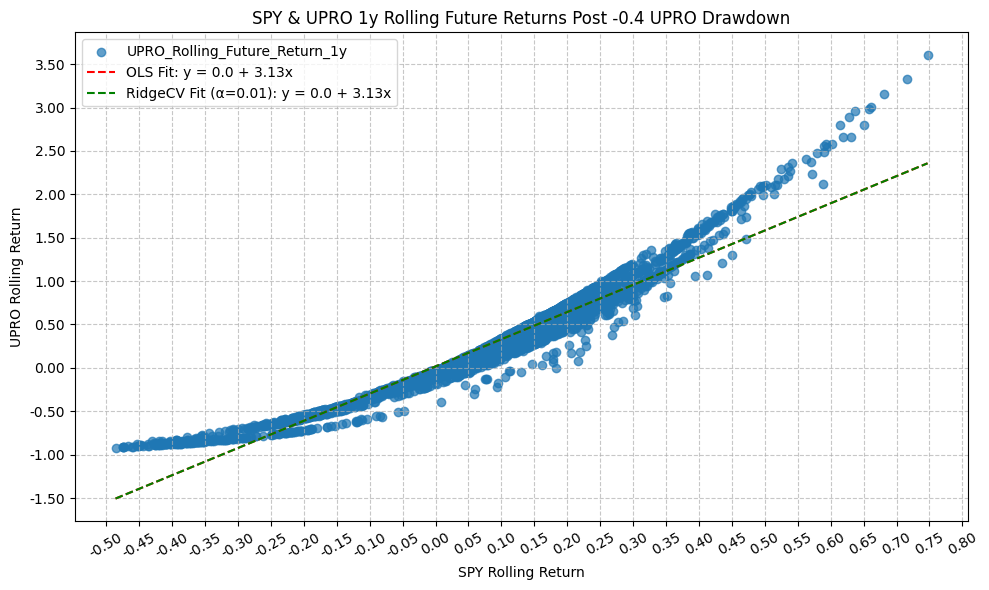
    


                                      OLS Regression Results                                 
    =========================================================================================
    Dep. Variable:     UPRO_Rolling_Future_Return_1y   R-squared:                       0.936
    Model:                                       OLS   Adj. R-squared:                  0.936
    Method:                            Least Squares   F-statistic:                 6.492e+04
    Date:                           Fri, 20 Mar 2026   Prob (F-statistic):               0.00
    Time:                                   10:50:54   Log-Likelihood:                 2334.7
    No. Observations:                           4456   AIC:                            -4665.
    Df Residuals:                               4454   BIC:                            -4653.
    Df Model:                                      1                                         
    Covariance Type:                       nonrobust                                         
    ================================================================================================
                                       coef    std err          t      P>|t|      [0.025      0.975]
    ------------------------------------------------------------------------------------------------
    const                            0.0162      0.002      6.861      0.000       0.012       0.021
    SPY_Rolling_Future_Return_1y     3.1341      0.012    254.788      0.000       3.110       3.158
    ==============================================================================
    Omnibus:                     1684.541   Durbin-Watson:                   0.054
    Prob(Omnibus):                  0.000   Jarque-Bera (JB):            11772.994
    Skew:                           1.634   Prob(JB):                         0.00
    Kurtosis:                      10.262   Cond. No.                         5.77
    ==============================================================================
    
    Notes:
    [1] Standard Errors assume that the covariance matrix of the errors is correctly specified.


    

    


    

    


                                      OLS Regression Results                                 
    =========================================================================================
    Dep. Variable:     UPRO_Rolling_Future_Return_2y   R-squared:                       0.907
    Model:                                       OLS   Adj. R-squared:                  0.907
    Method:                            Least Squares   F-statistic:                 4.354e+04
    Date:                           Fri, 20 Mar 2026   Prob (F-statistic):               0.00
    Time:                                   10:50:55   Log-Likelihood:                -457.07
    No. Observations:                           4456   AIC:                             918.1
    Df Residuals:                               4454   BIC:                             930.9
    Df Model:                                      1                                         
    Covariance Type:                       nonrobust                                         
    ================================================================================================
                                       coef    std err          t      P>|t|      [0.025      0.975]
    ------------------------------------------------------------------------------------------------
    const                            0.0011      0.005      0.221      0.825      -0.009       0.011
    SPY_Rolling_Future_Return_2y     3.4517      0.017    208.652      0.000       3.419       3.484
    ==============================================================================
    Omnibus:                     1243.360   Durbin-Watson:                   0.033
    Prob(Omnibus):                  0.000   Jarque-Bera (JB):             4602.619
    Skew:                           1.354   Prob(JB):                         0.00
    Kurtosis:                       7.179   Cond. No.                         4.25
    ==============================================================================
    
    Notes:
    [1] Standard Errors assume that the covariance matrix of the errors is correctly specified.


    

    


    
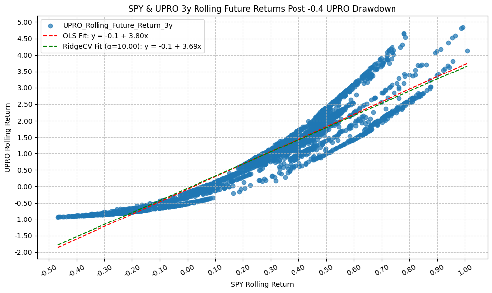
    


                                      OLS Regression Results                                 
    =========================================================================================
    Dep. Variable:     UPRO_Rolling_Future_Return_3y   R-squared:                       0.907
    Model:                                       OLS   Adj. R-squared:                  0.907
    Method:                            Least Squares   F-statistic:                 4.212e+04
    Date:                           Fri, 20 Mar 2026   Prob (F-statistic):               0.00
    Time:                                   10:50:56   Log-Likelihood:                -1445.7
    No. Observations:                           4327   AIC:                             2895.
    Df Residuals:                               4325   BIC:                             2908.
    Df Model:                                      1                                         
    Covariance Type:                       nonrobust                                         
    ================================================================================================
                                       coef    std err          t      P>|t|      [0.025      0.975]
    ------------------------------------------------------------------------------------------------
    const                           -0.0836      0.007    -12.033      0.000      -0.097      -0.070
    SPY_Rolling_Future_Return_3y     3.7980      0.019    205.221      0.000       3.762       3.834
    ==============================================================================
    Omnibus:                      703.791   Durbin-Watson:                   0.022
    Prob(Omnibus):                  0.000   Jarque-Bera (JB):             1808.699
    Skew:                           0.894   Prob(JB):                         0.00
    Kurtosis:                       5.614   Cond. No.                         3.85
    ==============================================================================
    
    Notes:
    [1] Standard Errors assume that the covariance matrix of the errors is correctly specified.


    

    


    
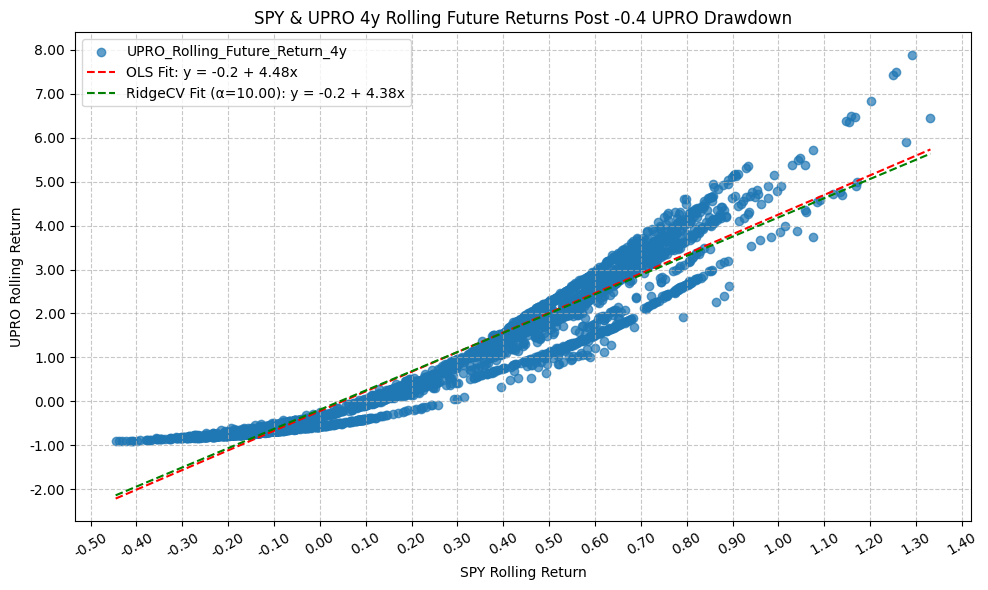
    


                                      OLS Regression Results                                 
    =========================================================================================
    Dep. Variable:     UPRO_Rolling_Future_Return_4y   R-squared:                       0.926
    Model:                                       OLS   Adj. R-squared:                  0.926
    Method:                            Least Squares   F-statistic:                 5.187e+04
    Date:                           Fri, 20 Mar 2026   Prob (F-statistic):               0.00
    Time:                                   10:50:58   Log-Likelihood:                -2273.5
    No. Observations:                           4126   AIC:                             4551.
    Df Residuals:                               4124   BIC:                             4564.
    Df Model:                                      1                                         
    Covariance Type:                       nonrobust                                         
    ================================================================================================
                                       coef    std err          t      P>|t|      [0.025      0.975]
    ------------------------------------------------------------------------------------------------
    const                           -0.2233      0.009    -24.386      0.000      -0.241      -0.205
    SPY_Rolling_Future_Return_4y     4.4751      0.020    227.751      0.000       4.437       4.514
    ==============================================================================
    Omnibus:                      119.526   Durbin-Watson:                   0.024
    Prob(Omnibus):                  0.000   Jarque-Bera (JB):              294.809
    Skew:                          -0.074   Prob(JB):                     9.62e-65
    Kurtosis:                       4.301   Cond. No.                         3.36
    ==============================================================================
    
    Notes:
    [1] Standard Errors assume that the covariance matrix of the errors is correctly specified.


    
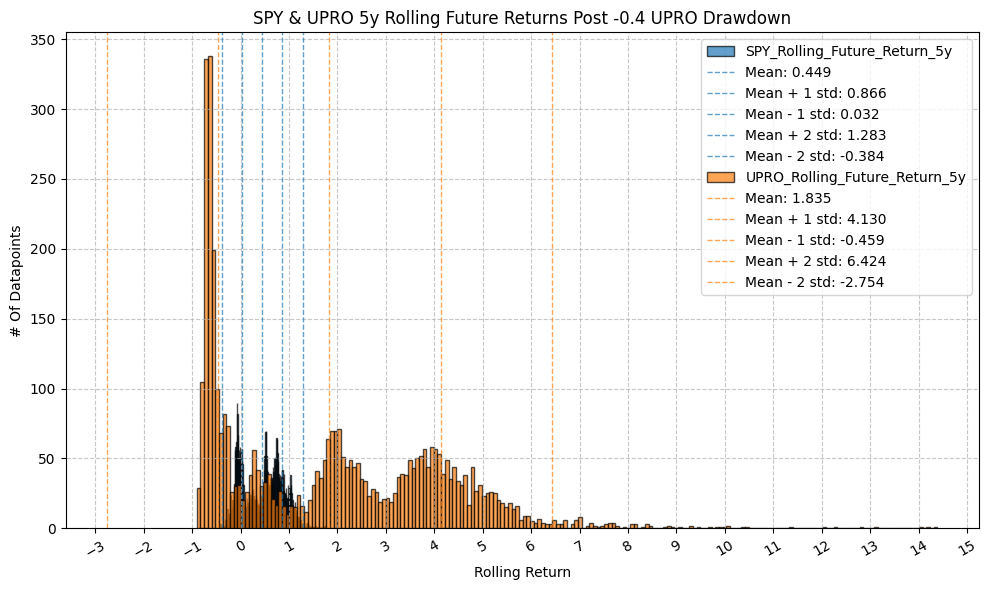
    


    
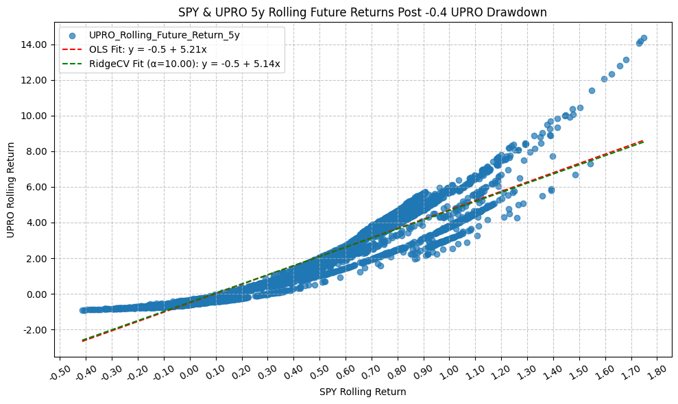
    


                                      OLS Regression Results                                 
    =========================================================================================
    Dep. Variable:     UPRO_Rolling_Future_Return_5y   R-squared:                       0.896
    Model:                                       OLS   Adj. R-squared:                  0.896
    Method:                            Least Squares   F-statistic:                 3.555e+04
    Date:                           Fri, 20 Mar 2026   Prob (F-statistic):               0.00
    Time:                                   10:50:59   Log-Likelihood:                -4610.6
    No. Observations:                           4126   AIC:                             9225.
    Df Residuals:                               4124   BIC:                             9238.
    Df Model:                                      1                                         
    Covariance Type:                       nonrobust                                         
    ================================================================================================
                                       coef    std err          t      P>|t|      [0.025      0.975]
    ------------------------------------------------------------------------------------------------
    const                           -0.5058      0.017    -29.867      0.000      -0.539      -0.473
    SPY_Rolling_Future_Return_5y     5.2122      0.028    188.534      0.000       5.158       5.266
    ==============================================================================
    Omnibus:                      688.590   Durbin-Watson:                   0.019
    Prob(Omnibus):                  0.000   Jarque-Bera (JB):             3306.777
    Skew:                           0.724   Prob(JB):                         0.00
    Kurtosis:                       7.140   Cond. No.                         2.96
    ==============================================================================
    
    Notes:
    [1] Standard Errors assume that the covariance matrix of the errors is correctly specified.


    

    


    

    


                                      OLS Regression Results                                 
    =========================================================================================
    Dep. Variable:     UPRO_Rolling_Future_Return_1d   R-squared:                       0.997
    Model:                                       OLS   Adj. R-squared:                  0.997
    Method:                            Least Squares   F-statistic:                 1.317e+06
    Date:                           Fri, 20 Mar 2026   Prob (F-statistic):               0.00
    Time:                                   10:51:00   Log-Likelihood:                 18256.
    No. Observations:                           3871   AIC:                        -3.651e+04
    Df Residuals:                               3869   BIC:                        -3.650e+04
    Df Model:                                      1                                         
    Covariance Type:                       nonrobust                                         
    ================================================================================================
                                       coef    std err          t      P>|t|      [0.025      0.975]
    ------------------------------------------------------------------------------------------------
    const                         6.221e-05   3.48e-05      1.786      0.074   -6.08e-06       0.000
    SPY_Rolling_Future_Return_1d     2.9842      0.003   1147.794      0.000       2.979       2.989
    ==============================================================================
    Omnibus:                     2862.869   Durbin-Watson:                   2.686
    Prob(Omnibus):                  0.000   Jarque-Bera (JB):          1149211.801
    Skew:                           2.367   Prob(JB):                         0.00
    Kurtosis:                      87.277   Cond. No.                         74.7
    ==============================================================================
    
    Notes:
    [1] Standard Errors assume that the covariance matrix of the errors is correctly specified.


    

    


    

    


                                      OLS Regression Results                                 
    =========================================================================================
    Dep. Variable:     UPRO_Rolling_Future_Return_1w   R-squared:                       0.992
    Model:                                       OLS   Adj. R-squared:                  0.992
    Method:                            Least Squares   F-statistic:                 5.116e+05
    Date:                           Fri, 20 Mar 2026   Prob (F-statistic):               0.00
    Time:                                   10:51:01   Log-Likelihood:                 13825.
    No. Observations:                           3871   AIC:                        -2.765e+04
    Df Residuals:                               3869   BIC:                        -2.763e+04
    Df Model:                                      1                                         
    Covariance Type:                       nonrobust                                         
    ================================================================================================
                                       coef    std err          t      P>|t|      [0.025      0.975]
    ------------------------------------------------------------------------------------------------
    const                           -0.0001      0.000     -0.958      0.338      -0.000       0.000
    SPY_Rolling_Future_Return_1w     2.9704      0.004    715.239      0.000       2.962       2.979
    ==============================================================================
    Omnibus:                     1716.544   Durbin-Watson:                   1.002
    Prob(Omnibus):                  0.000   Jarque-Bera (JB):           449889.145
    Skew:                          -0.903   Prob(JB):                         0.00
    Kurtosis:                      55.783   Cond. No.                         38.0
    ==============================================================================
    
    Notes:
    [1] Standard Errors assume that the covariance matrix of the errors is correctly specified.


    
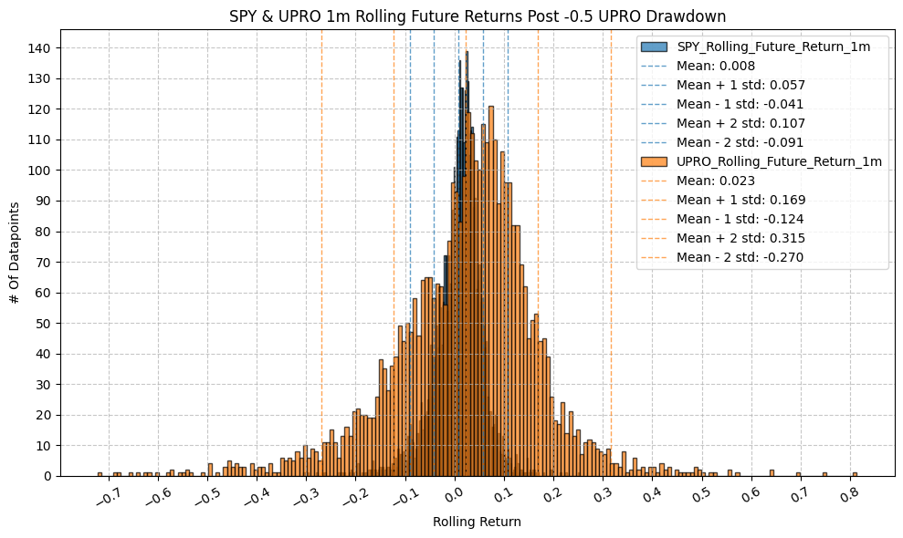
    


    
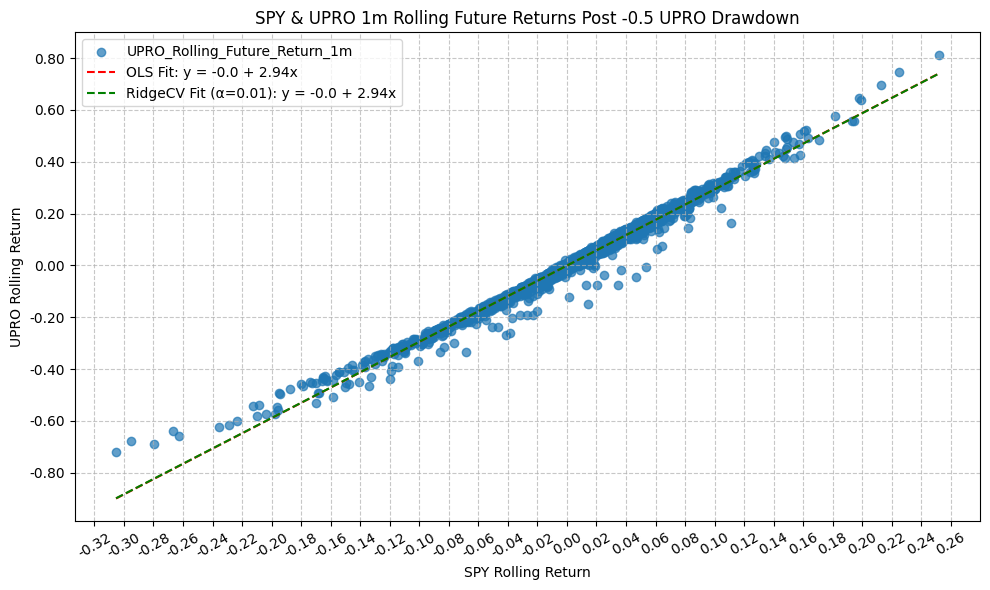
    


                                      OLS Regression Results                                 
    =========================================================================================
    Dep. Variable:     UPRO_Rolling_Future_Return_1m   R-squared:                       0.986
    Model:                                       OLS   Adj. R-squared:                  0.986
    Method:                            Least Squares   F-statistic:                 2.738e+05
    Date:                           Fri, 20 Mar 2026   Prob (F-statistic):               0.00
    Time:                                   10:51:02   Log-Likelihood:                 10219.
    No. Observations:                           3871   AIC:                        -2.043e+04
    Df Residuals:                               3869   BIC:                        -2.042e+04
    Df Model:                                      1                                         
    Covariance Type:                       nonrobust                                         
    ================================================================================================
                                       coef    std err          t      P>|t|      [0.025      0.975]
    ------------------------------------------------------------------------------------------------
    const                           -0.0008      0.000     -2.717      0.007      -0.001      -0.000
    SPY_Rolling_Future_Return_1m     2.9439      0.006    523.305      0.000       2.933       2.955
    ==============================================================================
    Omnibus:                     2107.638   Durbin-Watson:                   0.385
    Prob(Omnibus):                  0.000   Jarque-Bera (JB):           199364.854
    Skew:                          -1.681   Prob(JB):                         0.00
    Kurtosis:                      37.996   Cond. No.                         20.3
    ==============================================================================
    
    Notes:
    [1] Standard Errors assume that the covariance matrix of the errors is correctly specified.


    

    


    

    


                                      OLS Regression Results                                 
    =========================================================================================
    Dep. Variable:     UPRO_Rolling_Future_Return_3m   R-squared:                       0.978
    Model:                                       OLS   Adj. R-squared:                  0.978
    Method:                            Least Squares   F-statistic:                 1.701e+05
    Date:                           Fri, 20 Mar 2026   Prob (F-statistic):               0.00
    Time:                                   10:51:03   Log-Likelihood:                 7306.6
    No. Observations:                           3871   AIC:                        -1.461e+04
    Df Residuals:                               3869   BIC:                        -1.460e+04
    Df Model:                                      1                                         
    Covariance Type:                       nonrobust                                         
    ================================================================================================
                                       coef    std err          t      P>|t|      [0.025      0.975]
    ------------------------------------------------------------------------------------------------
    const                           -0.0011      0.001     -1.901      0.057      -0.002    3.63e-05
    SPY_Rolling_Future_Return_3m     2.9840      0.007    412.439      0.000       2.970       2.998
    ==============================================================================
    Omnibus:                     1375.125   Durbin-Watson:                   0.193
    Prob(Omnibus):                  0.000   Jarque-Bera (JB):            43082.434
    Skew:                           1.059   Prob(JB):                         0.00
    Kurtosis:                      19.206   Cond. No.                         12.3
    ==============================================================================
    
    Notes:
    [1] Standard Errors assume that the covariance matrix of the errors is correctly specified.


    

    


    

    


                                      OLS Regression Results                                 
    =========================================================================================
    Dep. Variable:     UPRO_Rolling_Future_Return_6m   R-squared:                       0.957
    Model:                                       OLS   Adj. R-squared:                  0.957
    Method:                            Least Squares   F-statistic:                 8.590e+04
    Date:                           Fri, 20 Mar 2026   Prob (F-statistic):               0.00
    Time:                                   10:51:04   Log-Likelihood:                 4532.3
    No. Observations:                           3871   AIC:                            -9061.
    Df Residuals:                               3869   BIC:                            -9048.
    Df Model:                                      1                                         
    Covariance Type:                       nonrobust                                         
    ================================================================================================
                                       coef    std err          t      P>|t|      [0.025      0.975]
    ------------------------------------------------------------------------------------------------
    const                            0.0067      0.001      5.300      0.000       0.004       0.009
    SPY_Rolling_Future_Return_6m     2.9569      0.010    293.089      0.000       2.937       2.977
    ==============================================================================
    Omnibus:                     1292.768   Durbin-Watson:                   0.081
    Prob(Omnibus):                  0.000   Jarque-Bera (JB):             9397.804
    Skew:                           1.396   Prob(JB):                         0.00
    Kurtosis:                      10.104   Cond. No.                         8.37
    ==============================================================================
    
    Notes:
    [1] Standard Errors assume that the covariance matrix of the errors is correctly specified.


    

    


    

    


                                      OLS Regression Results                                 
    =========================================================================================
    Dep. Variable:     UPRO_Rolling_Future_Return_1y   R-squared:                       0.933
    Model:                                       OLS   Adj. R-squared:                  0.933
    Method:                            Least Squares   F-statistic:                 5.409e+04
    Date:                           Fri, 20 Mar 2026   Prob (F-statistic):               0.00
    Time:                                   10:51:06   Log-Likelihood:                 1958.2
    No. Observations:                           3871   AIC:                            -3912.
    Df Residuals:                               3869   BIC:                            -3900.
    Df Model:                                      1                                         
    Covariance Type:                       nonrobust                                         
    ================================================================================================
                                       coef    std err          t      P>|t|      [0.025      0.975]
    ------------------------------------------------------------------------------------------------
    const                            0.0174      0.003      6.787      0.000       0.012       0.022
    SPY_Rolling_Future_Return_1y     3.1291      0.013    232.562      0.000       3.103       3.155
    ==============================================================================
    Omnibus:                     1514.881   Durbin-Watson:                   0.057
    Prob(Omnibus):                  0.000   Jarque-Bera (JB):            11136.961
    Skew:                           1.682   Prob(JB):                         0.00
    Kurtosis:                      10.598   Cond. No.                         5.77
    ==============================================================================
    
    Notes:
    [1] Standard Errors assume that the covariance matrix of the errors is correctly specified.


    

    


    

    


                                      OLS Regression Results                                 
    =========================================================================================
    Dep. Variable:     UPRO_Rolling_Future_Return_2y   R-squared:                       0.912
    Model:                                       OLS   Adj. R-squared:                  0.912
    Method:                            Least Squares   F-statistic:                 4.022e+04
    Date:                           Fri, 20 Mar 2026   Prob (F-statistic):               0.00
    Time:                                   10:51:07   Log-Likelihood:                -377.53
    No. Observations:                           3871   AIC:                             759.1
    Df Residuals:                               3869   BIC:                             771.6
    Df Model:                                      1                                         
    Covariance Type:                       nonrobust                                         
    ================================================================================================
                                       coef    std err          t      P>|t|      [0.025      0.975]
    ------------------------------------------------------------------------------------------------
    const                           -0.0141      0.005     -2.685      0.007      -0.024      -0.004
    SPY_Rolling_Future_Return_2y     3.5921      0.018    200.550      0.000       3.557       3.627
    ==============================================================================
    Omnibus:                     1084.267   Durbin-Watson:                   0.036
    Prob(Omnibus):                  0.000   Jarque-Bera (JB):             3631.488
    Skew:                           1.395   Prob(JB):                         0.00
    Kurtosis:                       6.839   Cond. No.                         4.30
    ==============================================================================
    
    Notes:
    [1] Standard Errors assume that the covariance matrix of the errors is correctly specified.


    

    


    

    


                                      OLS Regression Results                                 
    =========================================================================================
    Dep. Variable:     UPRO_Rolling_Future_Return_3y   R-squared:                       0.911
    Model:                                       OLS   Adj. R-squared:                  0.911
    Method:                            Least Squares   F-statistic:                 3.909e+04
    Date:                           Fri, 20 Mar 2026   Prob (F-statistic):               0.00
    Time:                                   10:51:08   Log-Likelihood:                -1296.2
    No. Observations:                           3836   AIC:                             2596.
    Df Residuals:                               3834   BIC:                             2609.
    Df Model:                                      1                                         
    Covariance Type:                       nonrobust                                         
    ================================================================================================
                                       coef    std err          t      P>|t|      [0.025      0.975]
    ------------------------------------------------------------------------------------------------
    const                           -0.0882      0.007    -11.990      0.000      -0.103      -0.074
    SPY_Rolling_Future_Return_3y     3.8754      0.020    197.704      0.000       3.837       3.914
    ==============================================================================
    Omnibus:                      633.463   Durbin-Watson:                   0.022
    Prob(Omnibus):                  0.000   Jarque-Bera (JB):             1405.435
    Skew:                           0.956   Prob(JB):                    6.51e-306
    Kurtosis:                       5.266   Cond. No.                         3.82
    ==============================================================================
    
    Notes:
    [1] Standard Errors assume that the covariance matrix of the errors is correctly specified.


    
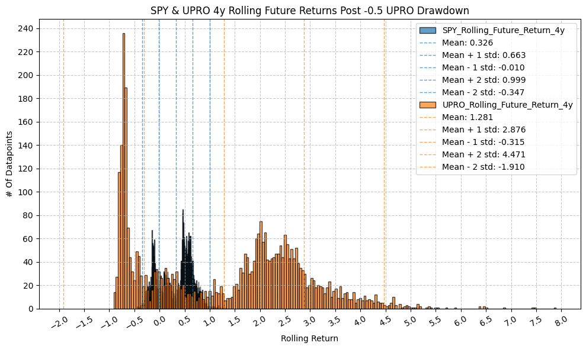
    


    
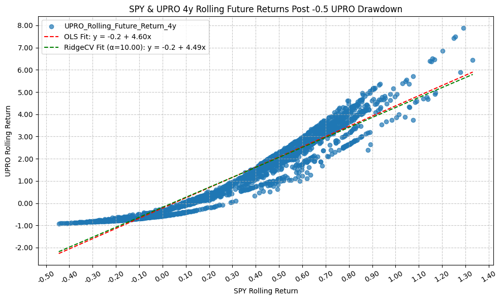
    


                                      OLS Regression Results                                 
    =========================================================================================
    Dep. Variable:     UPRO_Rolling_Future_Return_4y   R-squared:                       0.940
    Model:                                       OLS   Adj. R-squared:                  0.940
    Method:                            Least Squares   F-statistic:                 5.811e+04
    Date:                           Fri, 20 Mar 2026   Prob (F-statistic):               0.00
    Time:                                   10:51:09   Log-Likelihood:                -1764.0
    No. Observations:                           3696   AIC:                             3532.
    Df Residuals:                               3694   BIC:                             3544.
    Df Model:                                      1                                         
    Covariance Type:                       nonrobust                                         
    ================================================================================================
                                       coef    std err          t      P>|t|      [0.025      0.975]
    ------------------------------------------------------------------------------------------------
    const                           -0.2199      0.009    -24.595      0.000      -0.237      -0.202
    SPY_Rolling_Future_Return_4y     4.5978      0.019    241.056      0.000       4.560       4.635
    ==============================================================================
    Omnibus:                      141.095   Durbin-Watson:                   0.030
    Prob(Omnibus):                  0.000   Jarque-Bera (JB):              415.732
    Skew:                           0.068   Prob(JB):                     5.31e-91
    Kurtosis:                       4.637   Cond. No.                         3.32
    ==============================================================================
    
    Notes:
    [1] Standard Errors assume that the covariance matrix of the errors is correctly specified.


    
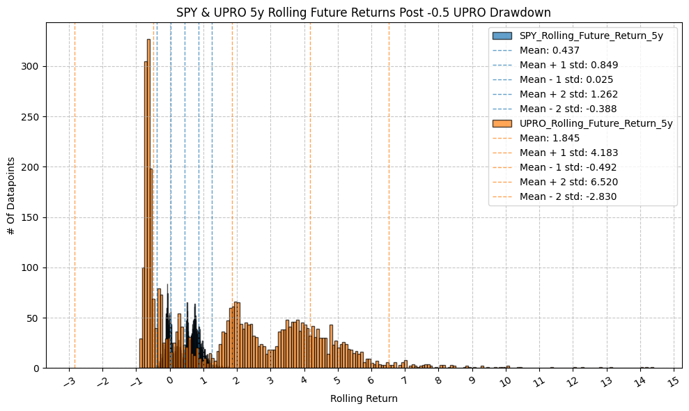
    


    

    


                                      OLS Regression Results                                 
    =========================================================================================
    Dep. Variable:     UPRO_Rolling_Future_Return_5y   R-squared:                       0.907
    Model:                                       OLS   Adj. R-squared:                  0.907
    Method:                            Least Squares   F-statistic:                 3.594e+04
    Date:                           Fri, 20 Mar 2026   Prob (F-statistic):               0.00
    Time:                                   10:51:10   Log-Likelihood:                -3996.6
    No. Observations:                           3696   AIC:                             7997.
    Df Residuals:                               3694   BIC:                             8010.
    Df Model:                                      1                                         
    Covariance Type:                       nonrobust                                         
    ================================================================================================
                                       coef    std err          t      P>|t|      [0.025      0.975]
    ------------------------------------------------------------------------------------------------
    const                           -0.5139      0.017    -30.042      0.000      -0.547      -0.480
    SPY_Rolling_Future_Return_5y     5.3991      0.028    189.589      0.000       5.343       5.455
    ==============================================================================
    Omnibus:                      551.161   Durbin-Watson:                   0.022
    Prob(Omnibus):                  0.000   Jarque-Bera (JB):             2881.381
    Skew:                           0.609   Prob(JB):                         0.00
    Kurtosis:                       7.151   Cond. No.                         2.96
    ==============================================================================
    
    Notes:
    [1] Standard Errors assume that the covariance matrix of the errors is correctly specified.


    

    


    
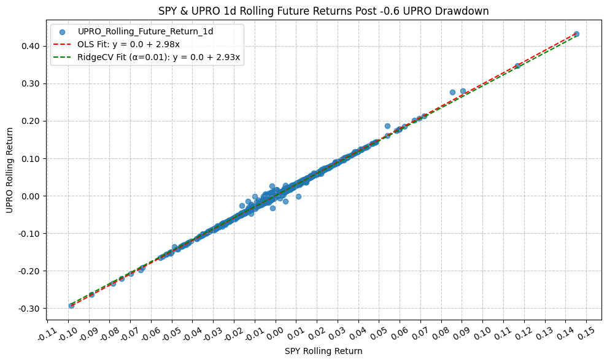
    


                                      OLS Regression Results                                 
    =========================================================================================
    Dep. Variable:     UPRO_Rolling_Future_Return_1d   R-squared:                       0.997
    Model:                                       OLS   Adj. R-squared:                  0.997
    Method:                            Least Squares   F-statistic:                 1.059e+06
    Date:                           Fri, 20 Mar 2026   Prob (F-statistic):               0.00
    Time:                                   10:51:11   Log-Likelihood:                 14432.
    No. Observations:                           3070   AIC:                        -2.886e+04
    Df Residuals:                               3068   BIC:                        -2.885e+04
    Df Model:                                      1                                         
    Covariance Type:                       nonrobust                                         
    ================================================================================================
                                       coef    std err          t      P>|t|      [0.025      0.975]
    ------------------------------------------------------------------------------------------------
    const                          7.42e-05   3.97e-05      1.868      0.062   -3.69e-06       0.000
    SPY_Rolling_Future_Return_1d     2.9825      0.003   1028.946      0.000       2.977       2.988
    ==============================================================================
    Omnibus:                     2273.216   Durbin-Watson:                   2.537
    Prob(Omnibus):                  0.000   Jarque-Bera (JB):          1053039.180
    Skew:                           2.319   Prob(JB):                         0.00
    Kurtosis:                      93.613   Cond. No.                         73.0
    ==============================================================================
    
    Notes:
    [1] Standard Errors assume that the covariance matrix of the errors is correctly specified.


    

    


    

    


                                      OLS Regression Results                                 
    =========================================================================================
    Dep. Variable:     UPRO_Rolling_Future_Return_1w   R-squared:                       0.992
    Model:                                       OLS   Adj. R-squared:                  0.992
    Method:                            Least Squares   F-statistic:                 3.762e+05
    Date:                           Fri, 20 Mar 2026   Prob (F-statistic):               0.00
    Time:                                   10:51:13   Log-Likelihood:                 10750.
    No. Observations:                           3070   AIC:                        -2.150e+04
    Df Residuals:                               3068   BIC:                        -2.148e+04
    Df Model:                                      1                                         
    Covariance Type:                       nonrobust                                         
    ================================================================================================
                                       coef    std err          t      P>|t|      [0.025      0.975]
    ------------------------------------------------------------------------------------------------
    const                           -0.0001      0.000     -1.043      0.297      -0.000       0.000
    SPY_Rolling_Future_Return_1w     2.9678      0.005    613.318      0.000       2.958       2.977
    ==============================================================================
    Omnibus:                     1399.953   Durbin-Watson:                   1.060
    Prob(Omnibus):                  0.000   Jarque-Bera (JB):           313436.633
    Skew:                          -0.997   Prob(JB):                         0.00
    Kurtosis:                      52.461   Cond. No.                         36.7
    ==============================================================================
    
    Notes:
    [1] Standard Errors assume that the covariance matrix of the errors is correctly specified.


    
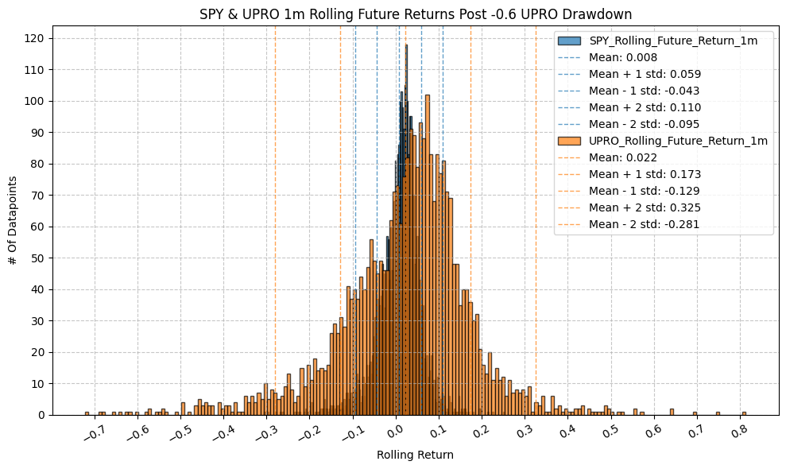
    


    

    


                                      OLS Regression Results                                 
    =========================================================================================
    Dep. Variable:     UPRO_Rolling_Future_Return_1m   R-squared:                       0.986
    Model:                                       OLS   Adj. R-squared:                  0.986
    Method:                            Least Squares   F-statistic:                 2.086e+05
    Date:                           Fri, 20 Mar 2026   Prob (F-statistic):               0.00
    Time:                                   10:51:14   Log-Likelihood:                 7938.3
    No. Observations:                           3070   AIC:                        -1.587e+04
    Df Residuals:                               3068   BIC:                        -1.586e+04
    Df Model:                                      1                                         
    Covariance Type:                       nonrobust                                         
    ================================================================================================
                                       coef    std err          t      P>|t|      [0.025      0.975]
    ------------------------------------------------------------------------------------------------
    const                           -0.0006      0.000     -1.711      0.087      -0.001     8.3e-05
    SPY_Rolling_Future_Return_1m     2.9397      0.006    456.774      0.000       2.927       2.952
    ==============================================================================
    Omnibus:                     1387.739   Durbin-Watson:                   0.407
    Prob(Omnibus):                  0.000   Jarque-Bera (JB):           109426.916
    Skew:                          -1.256   Prob(JB):                         0.00
    Kurtosis:                      32.140   Cond. No.                         19.6
    ==============================================================================
    
    Notes:
    [1] Standard Errors assume that the covariance matrix of the errors is correctly specified.


    
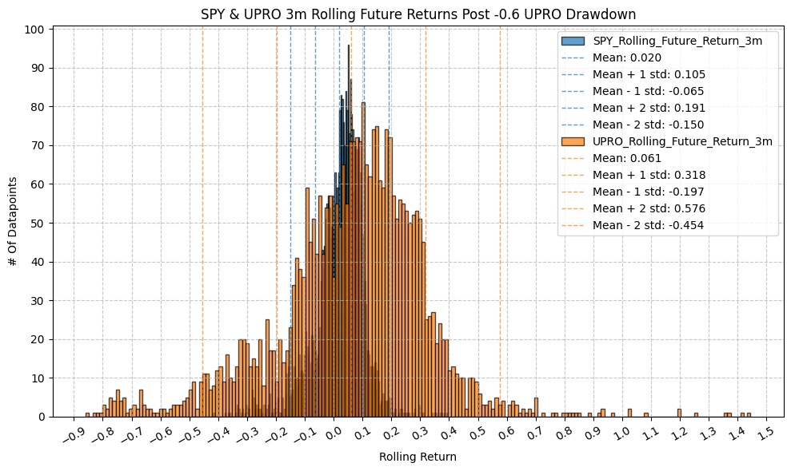
    


    

    


                                      OLS Regression Results                                 
    =========================================================================================
    Dep. Variable:     UPRO_Rolling_Future_Return_3m   R-squared:                       0.977
    Model:                                       OLS   Adj. R-squared:                  0.977
    Method:                            Least Squares   F-statistic:                 1.313e+05
    Date:                           Fri, 20 Mar 2026   Prob (F-statistic):               0.00
    Time:                                   10:51:15   Log-Likelihood:                 5610.5
    No. Observations:                           3070   AIC:                        -1.122e+04
    Df Residuals:                               3068   BIC:                        -1.121e+04
    Df Model:                                      1                                         
    Covariance Type:                       nonrobust                                         
    ================================================================================================
                                       coef    std err          t      P>|t|      [0.025      0.975]
    ------------------------------------------------------------------------------------------------
    const                            0.0004      0.001      0.589      0.556      -0.001       0.002
    SPY_Rolling_Future_Return_3m     2.9878      0.008    362.348      0.000       2.972       3.004
    ==============================================================================
    Omnibus:                     1129.279   Durbin-Watson:                   0.193
    Prob(Omnibus):                  0.000   Jarque-Bera (JB):            29419.689
    Skew:                           1.166   Prob(JB):                         0.00
    Kurtosis:                      17.985   Cond. No.                         11.7
    ==============================================================================
    
    Notes:
    [1] Standard Errors assume that the covariance matrix of the errors is correctly specified.


    

    


    
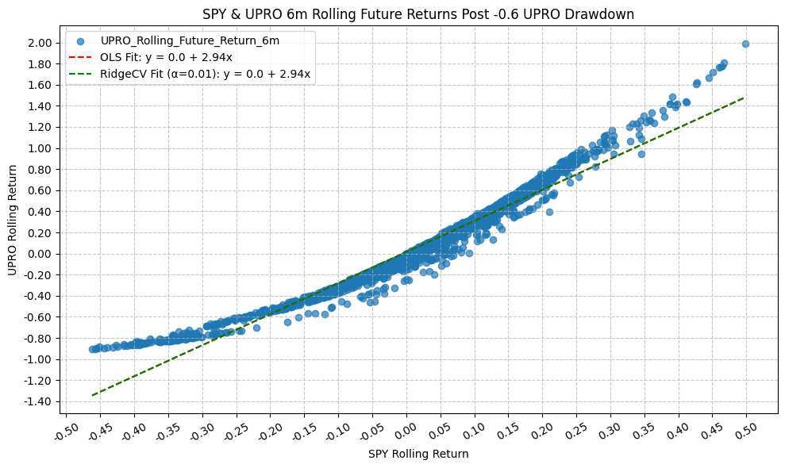
    


                                      OLS Regression Results                                 
    =========================================================================================
    Dep. Variable:     UPRO_Rolling_Future_Return_6m   R-squared:                       0.956
    Model:                                       OLS   Adj. R-squared:                  0.956
    Method:                            Least Squares   F-statistic:                 6.658e+04
    Date:                           Fri, 20 Mar 2026   Prob (F-statistic):               0.00
    Time:                                   10:51:16   Log-Likelihood:                 3373.6
    No. Observations:                           3070   AIC:                            -6743.
    Df Residuals:                               3068   BIC:                            -6731.
    Df Model:                                      1                                         
    Covariance Type:                       nonrobust                                         
    ================================================================================================
                                       coef    std err          t      P>|t|      [0.025      0.975]
    ------------------------------------------------------------------------------------------------
    const                            0.0138      0.002      9.062      0.000       0.011       0.017
    SPY_Rolling_Future_Return_6m     2.9412      0.011    258.024      0.000       2.919       2.964
    ==============================================================================
    Omnibus:                      862.196   Durbin-Watson:                   0.075
    Prob(Omnibus):                  0.000   Jarque-Bera (JB):             5064.617
    Skew:                           1.201   Prob(JB):                         0.00
    Kurtosis:                       8.816   Cond. No.                         7.84
    ==============================================================================
    
    Notes:
    [1] Standard Errors assume that the covariance matrix of the errors is correctly specified.


    

    


    
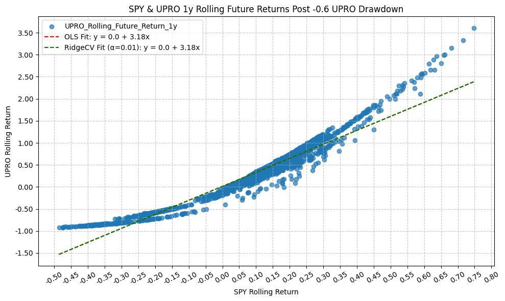
    


                                      OLS Regression Results                                 
    =========================================================================================
    Dep. Variable:     UPRO_Rolling_Future_Return_1y   R-squared:                       0.932
    Model:                                       OLS   Adj. R-squared:                  0.932
    Method:                            Least Squares   F-statistic:                 4.197e+04
    Date:                           Fri, 20 Mar 2026   Prob (F-statistic):               0.00
    Time:                                   10:51:17   Log-Likelihood:                 1581.2
    No. Observations:                           3070   AIC:                            -3158.
    Df Residuals:                               3068   BIC:                            -3146.
    Df Model:                                      1                                         
    Covariance Type:                       nonrobust                                         
    ================================================================================================
                                       coef    std err          t      P>|t|      [0.025      0.975]
    ------------------------------------------------------------------------------------------------
    const                            0.0132      0.003      4.453      0.000       0.007       0.019
    SPY_Rolling_Future_Return_1y     3.1762      0.016    204.862      0.000       3.146       3.207
    ==============================================================================
    Omnibus:                     1210.907   Durbin-Watson:                   0.065
    Prob(Omnibus):                  0.000   Jarque-Bera (JB):            10511.015
    Skew:                           1.634   Prob(JB):                         0.00
    Kurtosis:                      11.455   Cond. No.                         5.99
    ==============================================================================
    
    Notes:
    [1] Standard Errors assume that the covariance matrix of the errors is correctly specified.


    

    


    
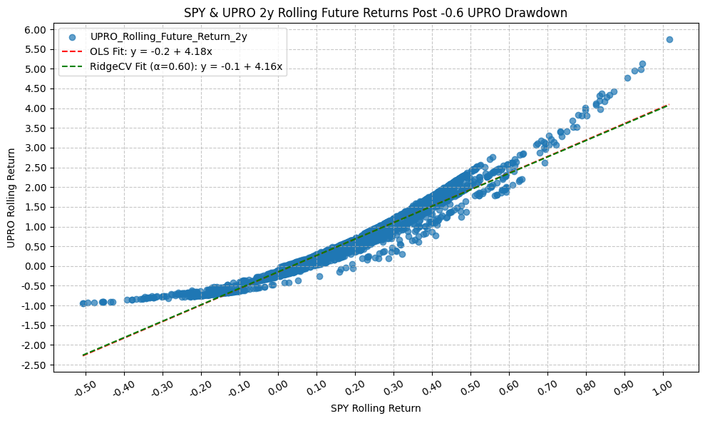
    


                                      OLS Regression Results                                 
    =========================================================================================
    Dep. Variable:     UPRO_Rolling_Future_Return_2y   R-squared:                       0.932
    Model:                                       OLS   Adj. R-squared:                  0.932
    Method:                            Least Squares   F-statistic:                 4.210e+04
    Date:                           Fri, 20 Mar 2026   Prob (F-statistic):               0.00
    Time:                                   10:51:18   Log-Likelihood:                 230.85
    No. Observations:                           3070   AIC:                            -457.7
    Df Residuals:                               3068   BIC:                            -445.6
    Df Model:                                      1                                         
    Covariance Type:                       nonrobust                                         
    ================================================================================================
                                       coef    std err          t      P>|t|      [0.025      0.975]
    ------------------------------------------------------------------------------------------------
    const                           -0.1524      0.006    -26.793      0.000      -0.164      -0.141
    SPY_Rolling_Future_Return_2y     4.1802      0.020    205.190      0.000       4.140       4.220
    ==============================================================================
    Omnibus:                      971.652   Durbin-Watson:                   0.048
    Prob(Omnibus):                  0.000   Jarque-Bera (JB):             5574.723
    Skew:                           1.382   Prob(JB):                         0.00
    Kurtosis:                       8.995   Cond. No.                         5.23
    ==============================================================================
    
    Notes:
    [1] Standard Errors assume that the covariance matrix of the errors is correctly specified.


    
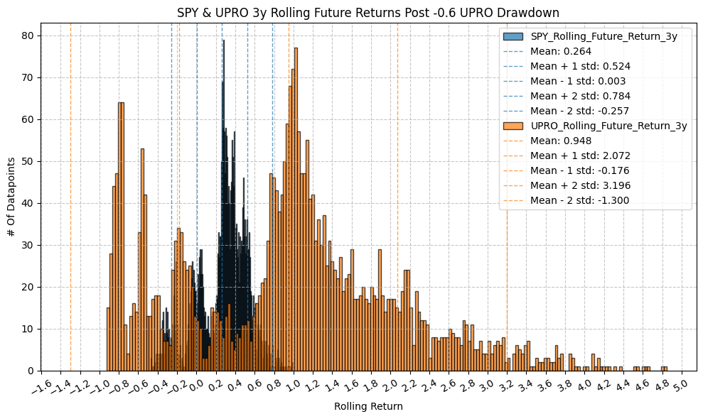
    


    
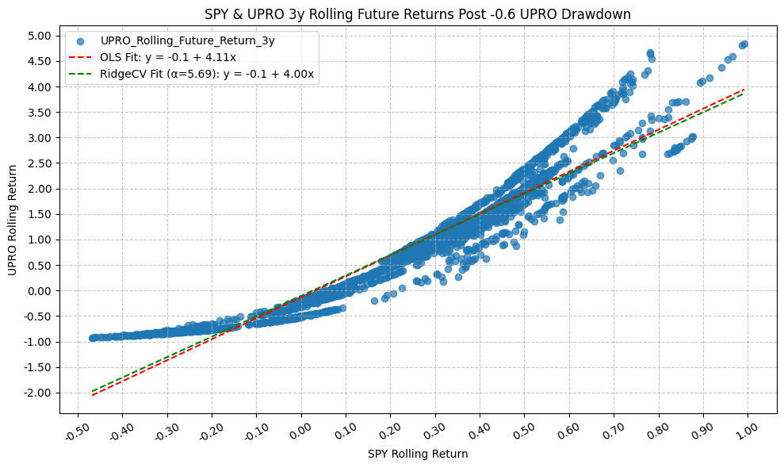
    


                                      OLS Regression Results                                 
    =========================================================================================
    Dep. Variable:     UPRO_Rolling_Future_Return_3y   R-squared:                       0.906
    Model:                                       OLS   Adj. R-squared:                  0.906
    Method:                            Least Squares   F-statistic:                 2.942e+04
    Date:                           Fri, 20 Mar 2026   Prob (F-statistic):               0.00
    Time:                                   10:51:20   Log-Likelihood:                -1092.7
    No. Observations:                           3070   AIC:                             2189.
    Df Residuals:                               3068   BIC:                             2201.
    Df Model:                                      1                                         
    Covariance Type:                       nonrobust                                         
    ================================================================================================
                                       coef    std err          t      P>|t|      [0.025      0.975]
    ------------------------------------------------------------------------------------------------
    const                           -0.1351      0.009    -15.223      0.000      -0.153      -0.118
    SPY_Rolling_Future_Return_3y     4.1099      0.024    171.519      0.000       4.063       4.157
    ==============================================================================
    Omnibus:                      523.371   Durbin-Watson:                   0.022
    Prob(Omnibus):                  0.000   Jarque-Bera (JB):              948.085
    Skew:                           1.070   Prob(JB):                    1.34e-206
    Kurtosis:                       4.682   Cond. No.                         4.13
    ==============================================================================
    
    Notes:
    [1] Standard Errors assume that the covariance matrix of the errors is correctly specified.


    
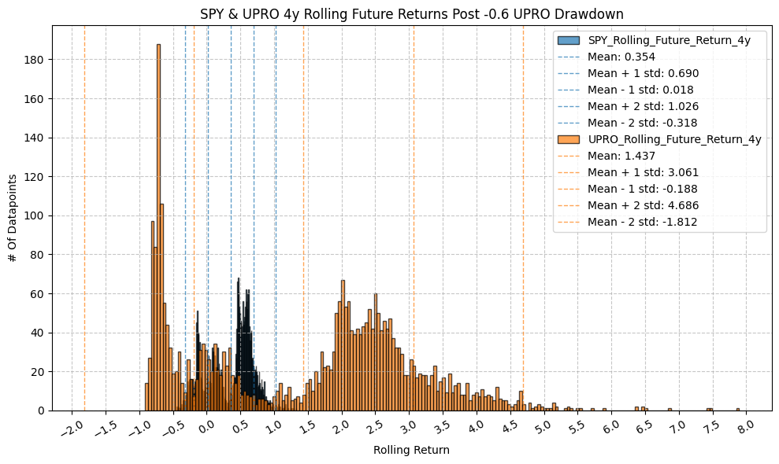
    


    
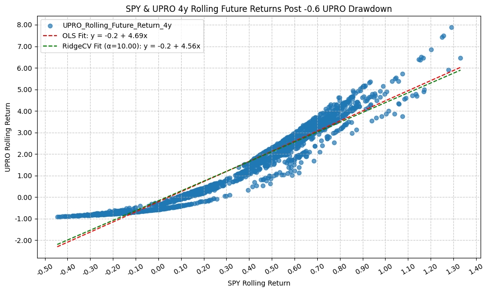
    


                                      OLS Regression Results                                 
    =========================================================================================
    Dep. Variable:     UPRO_Rolling_Future_Return_4y   R-squared:                       0.942
    Model:                                       OLS   Adj. R-squared:                  0.942
    Method:                            Least Squares   F-statistic:                 4.920e+04
    Date:                           Fri, 20 Mar 2026   Prob (F-statistic):               0.00
    Time:                                   10:51:21   Log-Likelihood:                -1478.5
    No. Observations:                           3055   AIC:                             2961.
    Df Residuals:                               3053   BIC:                             2973.
    Df Model:                                      1                                         
    Covariance Type:                       nonrobust                                         
    ================================================================================================
                                       coef    std err          t      P>|t|      [0.025      0.975]
    ------------------------------------------------------------------------------------------------
    const                           -0.2228      0.010    -21.595      0.000      -0.243      -0.203
    SPY_Rolling_Future_Return_4y     4.6897      0.021    221.807      0.000       4.648       4.731
    ==============================================================================
    Omnibus:                      120.437   Durbin-Watson:                   0.033
    Prob(Omnibus):                  0.000   Jarque-Bera (JB):              311.983
    Skew:                           0.172   Prob(JB):                     1.79e-68
    Kurtosis:                       4.527   Cond. No.                         3.39
    ==============================================================================
    
    Notes:
    [1] Standard Errors assume that the covariance matrix of the errors is correctly specified.


    
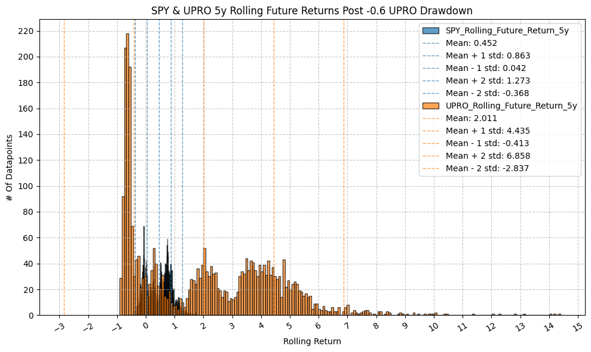
    


    
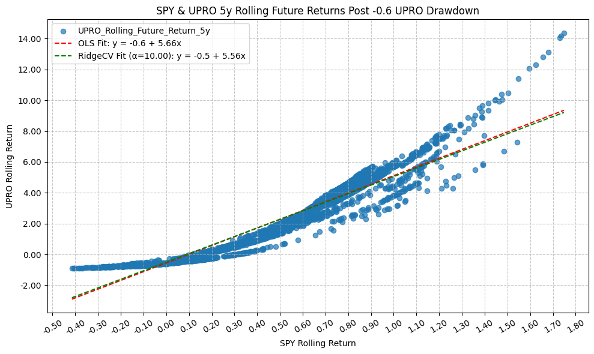
    


                                      OLS Regression Results                                 
    =========================================================================================
    Dep. Variable:     UPRO_Rolling_Future_Return_5y   R-squared:                       0.919
    Model:                                       OLS   Adj. R-squared:                  0.919
    Method:                            Least Squares   F-statistic:                 3.475e+04
    Date:                           Fri, 20 Mar 2026   Prob (F-statistic):               0.00
    Time:                                   10:51:22   Log-Likelihood:                -3195.7
    No. Observations:                           3055   AIC:                             6395.
    Df Residuals:                               3053   BIC:                             6407.
    Df Model:                                      1                                         
    Covariance Type:                       nonrobust                                         
    ================================================================================================
                                       coef    std err          t      P>|t|      [0.025      0.975]
    ------------------------------------------------------------------------------------------------
    const                           -0.5517      0.019    -29.728      0.000      -0.588      -0.515
    SPY_Rolling_Future_Return_5y     5.6649      0.030    186.400      0.000       5.605       5.724
    ==============================================================================
    Omnibus:                      454.994   Durbin-Watson:                   0.025
    Prob(Omnibus):                  0.000   Jarque-Bera (JB):             2120.561
    Skew:                           0.640   Prob(JB):                         0.00
    Kurtosis:                       6.876   Cond. No.                         3.02
    ==============================================================================
    
    Notes:
    [1] Standard Errors assume that the covariance matrix of the errors is correctly specified.


    

    


    
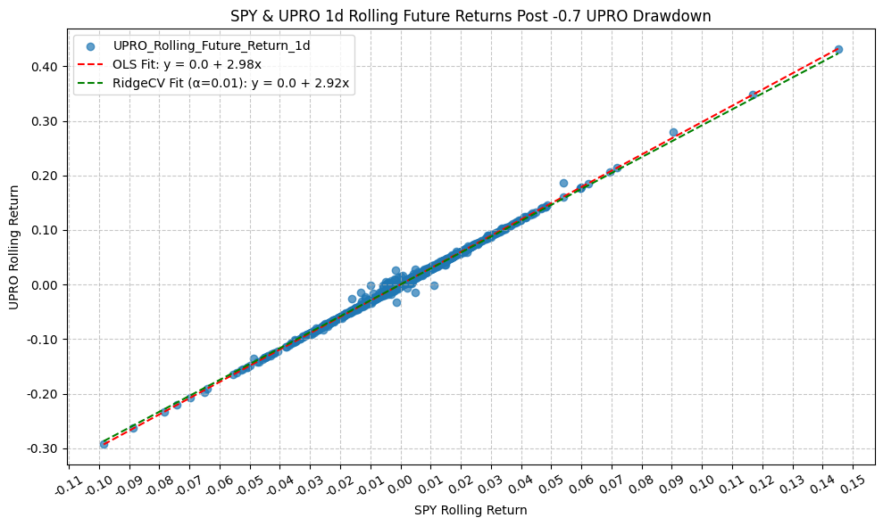
    


                                      OLS Regression Results                                 
    =========================================================================================
    Dep. Variable:     UPRO_Rolling_Future_Return_1d   R-squared:                       0.997
    Model:                                       OLS   Adj. R-squared:                  0.997
    Method:                            Least Squares   F-statistic:                 7.538e+05
    Date:                           Fri, 20 Mar 2026   Prob (F-statistic):               0.00
    Time:                                   10:51:23   Log-Likelihood:                 10930.
    No. Observations:                           2365   AIC:                        -2.186e+04
    Df Residuals:                               2363   BIC:                        -2.184e+04
    Df Model:                                      1                                         
    Covariance Type:                       nonrobust                                         
    ================================================================================================
                                       coef    std err          t      P>|t|      [0.025      0.975]
    ------------------------------------------------------------------------------------------------
    const                         8.908e-05    4.9e-05      1.818      0.069   -7.01e-06       0.000
    SPY_Rolling_Future_Return_1d     2.9779      0.003    868.239      0.000       2.971       2.985
    ==============================================================================
    Omnibus:                     1557.901   Durbin-Watson:                   2.718
    Prob(Omnibus):                  0.000   Jarque-Bera (JB):           638252.914
    Skew:                           1.869   Prob(JB):                         0.00
    Kurtosis:                      83.393   Cond. No.                         70.0
    ==============================================================================
    
    Notes:
    [1] Standard Errors assume that the covariance matrix of the errors is correctly specified.


    

    


    
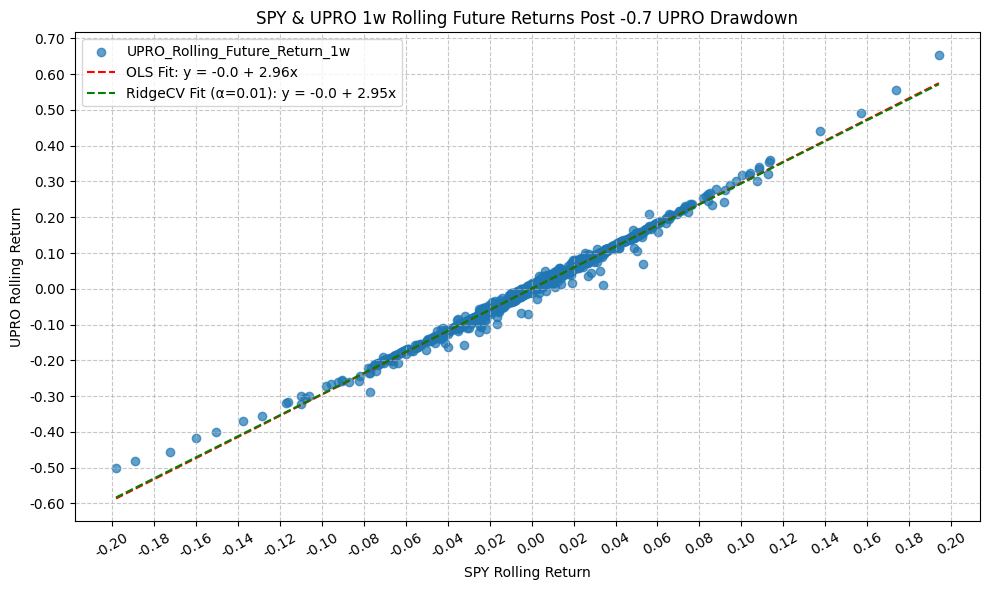
    


                                      OLS Regression Results                                 
    =========================================================================================
    Dep. Variable:     UPRO_Rolling_Future_Return_1w   R-squared:                       0.991
    Model:                                       OLS   Adj. R-squared:                  0.991
    Method:                            Least Squares   F-statistic:                 2.714e+05
    Date:                           Fri, 20 Mar 2026   Prob (F-statistic):               0.00
    Time:                                   10:51:24   Log-Likelihood:                 8089.2
    No. Observations:                           2365   AIC:                        -1.617e+04
    Df Residuals:                               2363   BIC:                        -1.616e+04
    Df Model:                                      1                                         
    Covariance Type:                       nonrobust                                         
    ================================================================================================
                                       coef    std err          t      P>|t|      [0.025      0.975]
    ------------------------------------------------------------------------------------------------
    const                        -7.288e-05      0.000     -0.447      0.655      -0.000       0.000
    SPY_Rolling_Future_Return_1w     2.9632      0.006    520.934      0.000       2.952       2.974
    ==============================================================================
    Omnibus:                      893.428   Durbin-Watson:                   1.046
    Prob(Omnibus):                  0.000   Jarque-Bera (JB):           167543.560
    Skew:                          -0.621   Prob(JB):                         0.00
    Kurtosis:                      44.215   Cond. No.                         34.9
    ==============================================================================
    
    Notes:
    [1] Standard Errors assume that the covariance matrix of the errors is correctly specified.


    
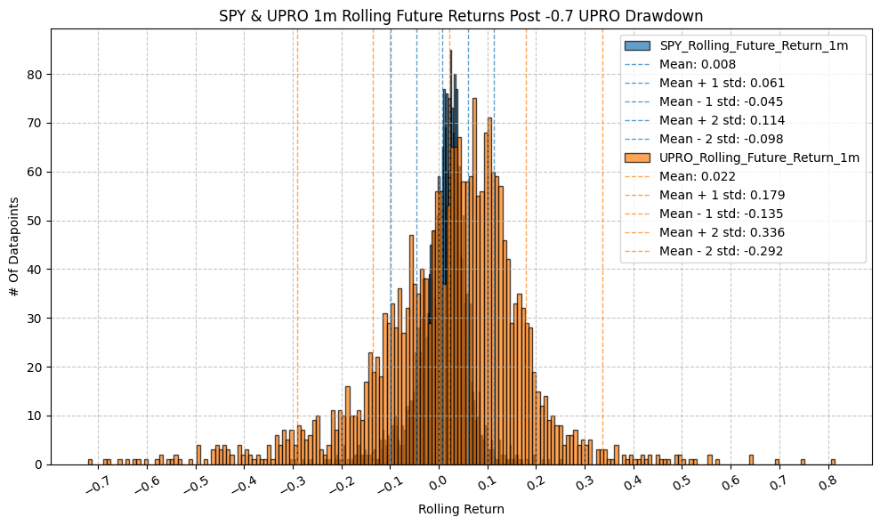
    


    
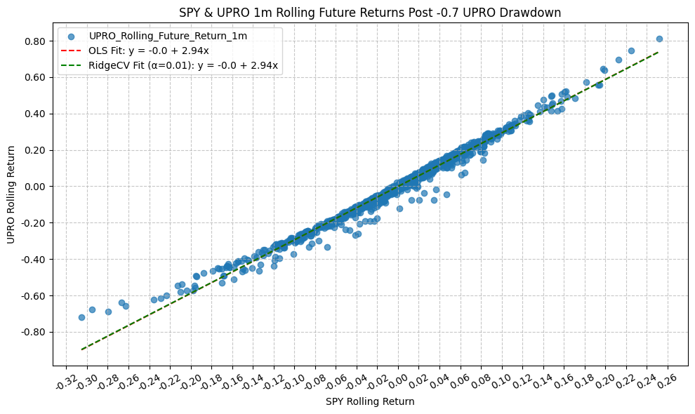
    


                                      OLS Regression Results                                 
    =========================================================================================
    Dep. Variable:     UPRO_Rolling_Future_Return_1m   R-squared:                       0.984
    Model:                                       OLS   Adj. R-squared:                  0.984
    Method:                            Least Squares   F-statistic:                 1.475e+05
    Date:                           Fri, 20 Mar 2026   Prob (F-statistic):               0.00
    Time:                                   10:51:25   Log-Likelihood:                 5932.1
    No. Observations:                           2365   AIC:                        -1.186e+04
    Df Residuals:                               2363   BIC:                        -1.185e+04
    Df Model:                                      1                                         
    Covariance Type:                       nonrobust                                         
    ================================================================================================
                                       coef    std err          t      P>|t|      [0.025      0.975]
    ------------------------------------------------------------------------------------------------
    const                           -0.0007      0.000     -1.733      0.083      -0.002    9.34e-05
    SPY_Rolling_Future_Return_1m     2.9414      0.008    384.053      0.000       2.926       2.956
    ==============================================================================
    Omnibus:                      955.115   Durbin-Watson:                   0.364
    Prob(Omnibus):                  0.000   Jarque-Bera (JB):            63631.957
    Skew:                          -1.056   Prob(JB):                         0.00
    Kurtosis:                      28.323   Cond. No.                         18.9
    ==============================================================================
    
    Notes:
    [1] Standard Errors assume that the covariance matrix of the errors is correctly specified.


    
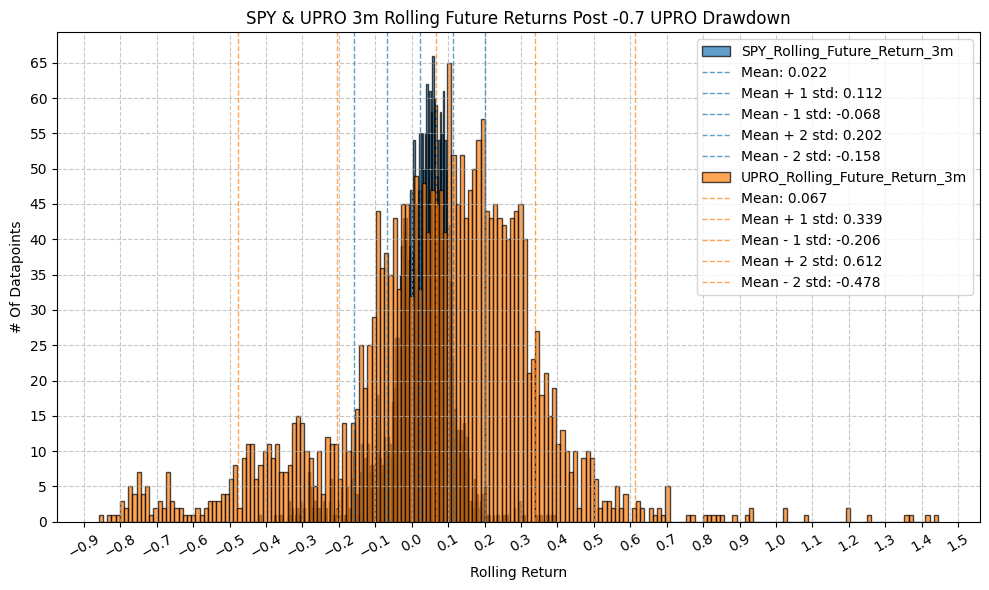
    


    

    


                                      OLS Regression Results                                 
    =========================================================================================
    Dep. Variable:     UPRO_Rolling_Future_Return_3m   R-squared:                       0.976
    Model:                                       OLS   Adj. R-squared:                  0.976
    Method:                            Least Squares   F-statistic:                 9.454e+04
    Date:                           Fri, 20 Mar 2026   Prob (F-statistic):               0.00
    Time:                                   10:51:27   Log-Likelihood:                 4110.7
    No. Observations:                           2365   AIC:                            -8217.
    Df Residuals:                               2363   BIC:                            -8206.
    Df Model:                                      1                                         
    Covariance Type:                       nonrobust                                         
    ================================================================================================
                                       coef    std err          t      P>|t|      [0.025      0.975]
    ------------------------------------------------------------------------------------------------
    const                            0.0012      0.001      1.374      0.170      -0.001       0.003
    SPY_Rolling_Future_Return_3m     2.9866      0.010    307.473      0.000       2.968       3.006
    ==============================================================================
    Omnibus:                      813.503   Durbin-Watson:                   0.169
    Prob(Omnibus):                  0.000   Jarque-Bera (JB):            16781.822
    Skew:                           1.111   Prob(JB):                         0.00
    Kurtosis:                      15.859   Cond. No.                         11.1
    ==============================================================================
    
    Notes:
    [1] Standard Errors assume that the covariance matrix of the errors is correctly specified.


    

    


    

    


                                      OLS Regression Results                                 
    =========================================================================================
    Dep. Variable:     UPRO_Rolling_Future_Return_6m   R-squared:                       0.954
    Model:                                       OLS   Adj. R-squared:                  0.954
    Method:                            Least Squares   F-statistic:                 4.945e+04
    Date:                           Fri, 20 Mar 2026   Prob (F-statistic):               0.00
    Time:                                   10:51:28   Log-Likelihood:                 2608.8
    No. Observations:                           2365   AIC:                            -5214.
    Df Residuals:                               2363   BIC:                            -5202.
    Df Model:                                      1                                         
    Covariance Type:                       nonrobust                                         
    ================================================================================================
                                       coef    std err          t      P>|t|      [0.025      0.975]
    ------------------------------------------------------------------------------------------------
    const                            0.0035      0.002      1.917      0.055   -7.96e-05       0.007
    SPY_Rolling_Future_Return_6m     3.0747      0.014    222.381      0.000       3.048       3.102
    ==============================================================================
    Omnibus:                      829.878   Durbin-Watson:                   0.069
    Prob(Omnibus):                  0.000   Jarque-Bera (JB):             7404.075
    Skew:                           1.399   Prob(JB):                         0.00
    Kurtosis:                      11.204   Cond. No.                         8.39
    ==============================================================================
    
    Notes:
    [1] Standard Errors assume that the covariance matrix of the errors is correctly specified.


    
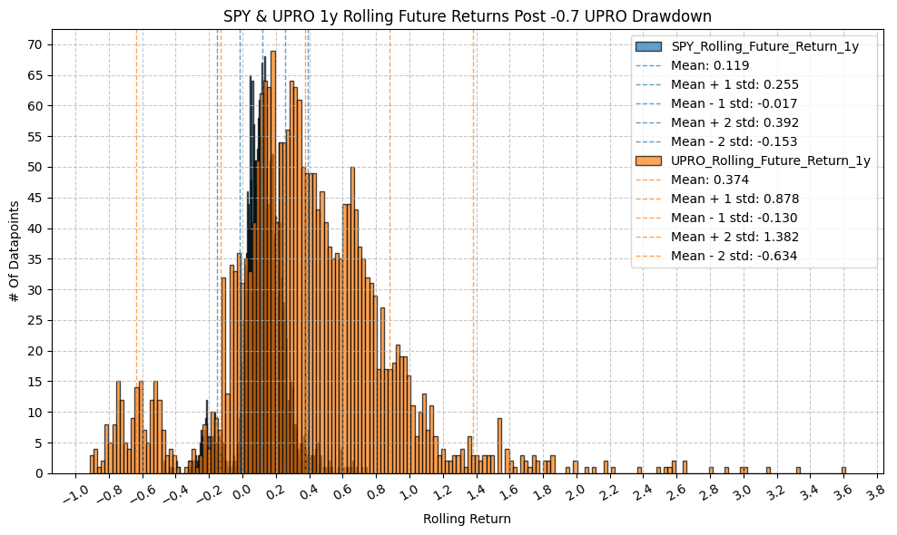
    


    

    


                                      OLS Regression Results                                 
    =========================================================================================
    Dep. Variable:     UPRO_Rolling_Future_Return_1y   R-squared:                       0.941
    Model:                                       OLS   Adj. R-squared:                  0.941
    Method:                            Least Squares   F-statistic:                 3.754e+04
    Date:                           Fri, 20 Mar 2026   Prob (F-statistic):               0.00
    Time:                                   10:51:29   Log-Likelihood:                 1607.4
    No. Observations:                           2365   AIC:                            -3211.
    Df Residuals:                               2363   BIC:                            -3199.
    Df Model:                                      1                                         
    Covariance Type:                       nonrobust                                         
    ================================================================================================
                                       coef    std err          t      P>|t|      [0.025      0.975]
    ------------------------------------------------------------------------------------------------
    const                           -0.0550      0.003    -16.382      0.000      -0.062      -0.048
    SPY_Rolling_Future_Return_1y     3.5929      0.019    193.749      0.000       3.556       3.629
    ==============================================================================
    Omnibus:                      724.734   Durbin-Watson:                   0.076
    Prob(Omnibus):                  0.000   Jarque-Bera (JB):            11317.547
    Skew:                           1.017   Prob(JB):                         0.00
    Kurtosis:                      13.522   Cond. No.                         7.46
    ==============================================================================
    
    Notes:
    [1] Standard Errors assume that the covariance matrix of the errors is correctly specified.


    
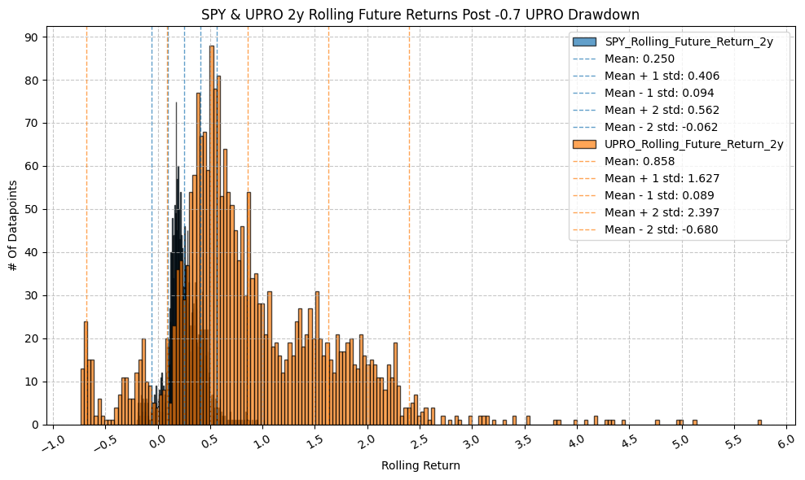
    


    
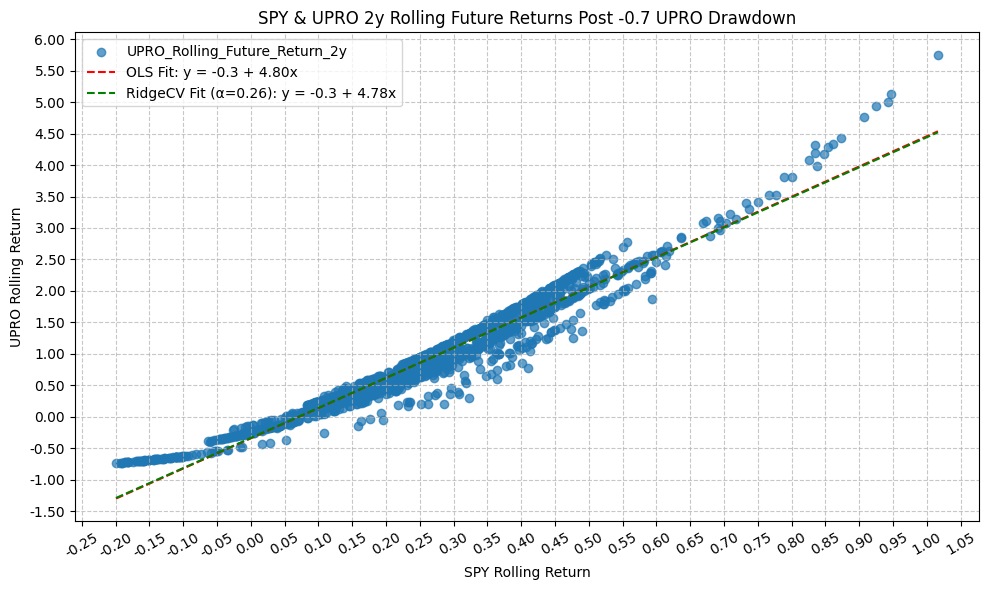
    


                                      OLS Regression Results                                 
    =========================================================================================
    Dep. Variable:     UPRO_Rolling_Future_Return_2y   R-squared:                       0.947
    Model:                                       OLS   Adj. R-squared:                  0.947
    Method:                            Least Squares   F-statistic:                 4.184e+04
    Date:                           Fri, 20 Mar 2026   Prob (F-statistic):               0.00
    Time:                                   10:51:30   Log-Likelihood:                 728.41
    No. Observations:                           2365   AIC:                            -1453.
    Df Residuals:                               2363   BIC:                            -1441.
    Df Model:                                      1                                         
    Covariance Type:                       nonrobust                                         
    ================================================================================================
                                       coef    std err          t      P>|t|      [0.025      0.975]
    ------------------------------------------------------------------------------------------------
    const                           -0.3422      0.007    -49.482      0.000      -0.356      -0.329
    SPY_Rolling_Future_Return_2y     4.7992      0.023    204.538      0.000       4.753       4.845
    ==============================================================================
    Omnibus:                      261.294   Durbin-Watson:                   0.050
    Prob(Omnibus):                  0.000   Jarque-Bera (JB):             1788.732
    Skew:                          -0.271   Prob(JB):                         0.00
    Kurtosis:                       7.226   Cond. No.                         6.82
    ==============================================================================
    
    Notes:
    [1] Standard Errors assume that the covariance matrix of the errors is correctly specified.


    
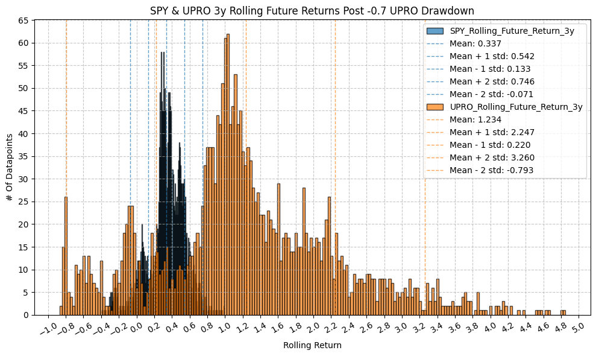
    


    

    


                                      OLS Regression Results                                 
    =========================================================================================
    Dep. Variable:     UPRO_Rolling_Future_Return_3y   R-squared:                       0.901
    Model:                                       OLS   Adj. R-squared:                  0.901
    Method:                            Least Squares   F-statistic:                 2.158e+04
    Date:                           Fri, 20 Mar 2026   Prob (F-statistic):               0.00
    Time:                                   10:51:31   Log-Likelihood:                -648.58
    No. Observations:                           2365   AIC:                             1301.
    Df Residuals:                               2363   BIC:                             1313.
    Df Model:                                      1                                         
    Covariance Type:                       nonrobust                                         
    ================================================================================================
                                       coef    std err          t      P>|t|      [0.025      0.975]
    ------------------------------------------------------------------------------------------------
    const                           -0.3554      0.013    -28.107      0.000      -0.380      -0.331
    SPY_Rolling_Future_Return_3y     4.7081      0.032    146.886      0.000       4.645       4.771
    ==============================================================================
    Omnibus:                      350.032   Durbin-Watson:                   0.028
    Prob(Omnibus):                  0.000   Jarque-Bera (JB):              725.273
    Skew:                           0.885   Prob(JB):                    3.23e-158
    Kurtosis:                       5.057   Cond. No.                         5.47
    ==============================================================================
    
    Notes:
    [1] Standard Errors assume that the covariance matrix of the errors is correctly specified.


    

    


    

    


                                      OLS Regression Results                                 
    =========================================================================================
    Dep. Variable:     UPRO_Rolling_Future_Return_4y   R-squared:                       0.925
    Model:                                       OLS   Adj. R-squared:                  0.925
    Method:                            Least Squares   F-statistic:                 2.909e+04
    Date:                           Fri, 20 Mar 2026   Prob (F-statistic):               0.00
    Time:                                   10:51:32   Log-Likelihood:                -1339.2
    No. Observations:                           2365   AIC:                             2682.
    Df Residuals:                               2363   BIC:                             2694.
    Df Model:                                      1                                         
    Covariance Type:                       nonrobust                                         
    ================================================================================================
                                       coef    std err          t      P>|t|      [0.025      0.975]
    ------------------------------------------------------------------------------------------------
    const                           -0.1851      0.014    -12.913      0.000      -0.213      -0.157
    SPY_Rolling_Future_Return_4y     4.6425      0.027    170.565      0.000       4.589       4.696
    ==============================================================================
    Omnibus:                       55.496   Durbin-Watson:                   0.030
    Prob(Omnibus):                  0.000   Jarque-Bera (JB):              118.358
    Skew:                           0.081   Prob(JB):                     1.99e-26
    Kurtosis:                       4.084   Cond. No.                         3.69
    ==============================================================================
    
    Notes:
    [1] Standard Errors assume that the covariance matrix of the errors is correctly specified.


    

    


    

    


                                      OLS Regression Results                                 
    =========================================================================================
    Dep. Variable:     UPRO_Rolling_Future_Return_5y   R-squared:                       0.917
    Model:                                       OLS   Adj. R-squared:                  0.917
    Method:                            Least Squares   F-statistic:                 2.615e+04
    Date:                           Fri, 20 Mar 2026   Prob (F-statistic):               0.00
    Time:                                   10:51:33   Log-Likelihood:                -2565.1
    No. Observations:                           2365   AIC:                             5134.
    Df Residuals:                               2363   BIC:                             5146.
    Df Model:                                      1                                         
    Covariance Type:                       nonrobust                                         
    ================================================================================================
                                       coef    std err          t      P>|t|      [0.025      0.975]
    ------------------------------------------------------------------------------------------------
    const                           -0.4704      0.023    -20.191      0.000      -0.516      -0.425
    SPY_Rolling_Future_Return_5y     5.6929      0.035    161.723      0.000       5.624       5.762
    ==============================================================================
    Omnibus:                      311.087   Durbin-Watson:                   0.028
    Prob(Omnibus):                  0.000   Jarque-Bera (JB):             1363.056
    Skew:                           0.566   Prob(JB):                    1.04e-296
    Kurtosis:                       6.543   Cond. No.                         3.12
    ==============================================================================
    
    Notes:
    [1] Standard Errors assume that the covariance matrix of the errors is correctly specified.


    

    


    

    


                                      OLS Regression Results                                 
    =========================================================================================
    Dep. Variable:     UPRO_Rolling_Future_Return_1d   R-squared:                       0.997
    Model:                                       OLS   Adj. R-squared:                  0.997
    Method:                            Least Squares   F-statistic:                 4.362e+05
    Date:                           Fri, 20 Mar 2026   Prob (F-statistic):               0.00
    Time:                                   10:51:34   Log-Likelihood:                 6607.2
    No. Observations:                           1479   AIC:                        -1.321e+04
    Df Residuals:                               1477   BIC:                        -1.320e+04
    Df Model:                                      1                                         
    Covariance Type:                       nonrobust                                         
    ================================================================================================
                                       coef    std err          t      P>|t|      [0.025      0.975]
    ------------------------------------------------------------------------------------------------
    const                            0.0001   7.23e-05      1.550      0.121   -2.98e-05       0.000
    SPY_Rolling_Future_Return_1d     2.9736      0.005    660.469      0.000       2.965       2.982
    ==============================================================================
    Omnibus:                      759.529   Durbin-Watson:                   2.689
    Prob(Omnibus):                  0.000   Jarque-Bera (JB):           237909.235
    Skew:                           1.142   Prob(JB):                         0.00
    Kurtosis:                      65.092   Cond. No.                         62.3
    ==============================================================================
    
    Notes:
    [1] Standard Errors assume that the covariance matrix of the errors is correctly specified.


    
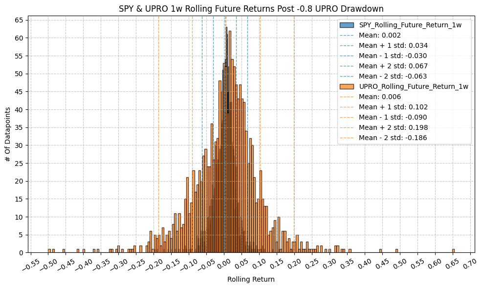
    


    
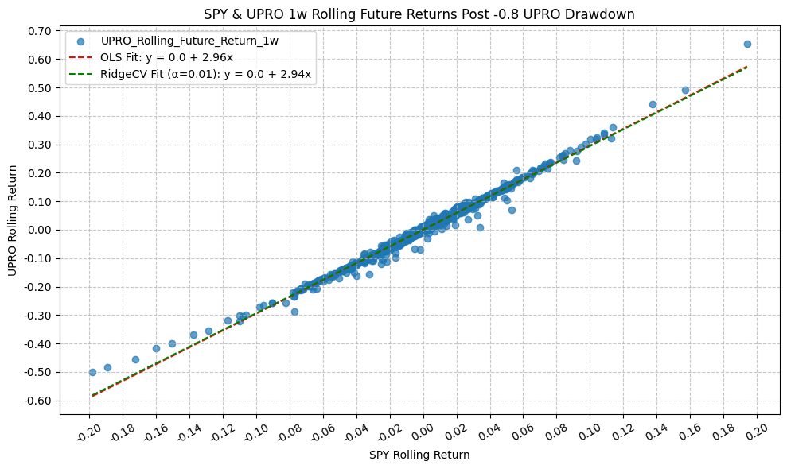
    


                                      OLS Regression Results                                 
    =========================================================================================
    Dep. Variable:     UPRO_Rolling_Future_Return_1w   R-squared:                       0.990
    Model:                                       OLS   Adj. R-squared:                  0.990
    Method:                            Least Squares   F-statistic:                 1.475e+05
    Date:                           Fri, 20 Mar 2026   Prob (F-statistic):               0.00
    Time:                                   10:51:35   Log-Likelihood:                 4779.3
    No. Observations:                           1479   AIC:                            -9555.
    Df Residuals:                               1477   BIC:                            -9544.
    Df Model:                                      1                                         
    Covariance Type:                       nonrobust                                         
    ================================================================================================
                                       coef    std err          t      P>|t|      [0.025      0.975]
    ------------------------------------------------------------------------------------------------
    const                         3.192e-06      0.000      0.013      0.990      -0.000       0.000
    SPY_Rolling_Future_Return_1w     2.9572      0.008    384.014      0.000       2.942       2.972
    ==============================================================================
    Omnibus:                      517.978   Durbin-Watson:                   1.023
    Prob(Omnibus):                  0.000   Jarque-Bera (JB):            52657.254
    Skew:                          -0.625   Prob(JB):                         0.00
    Kurtosis:                      32.205   Cond. No.                         31.0
    ==============================================================================
    
    Notes:
    [1] Standard Errors assume that the covariance matrix of the errors is correctly specified.


    

    


    

    


                                      OLS Regression Results                                 
    =========================================================================================
    Dep. Variable:     UPRO_Rolling_Future_Return_1m   R-squared:                       0.983
    Model:                                       OLS   Adj. R-squared:                  0.983
    Method:                            Least Squares   F-statistic:                 8.452e+04
    Date:                           Fri, 20 Mar 2026   Prob (F-statistic):               0.00
    Time:                                   10:51:37   Log-Likelihood:                 3588.8
    No. Observations:                           1479   AIC:                            -7174.
    Df Residuals:                               1477   BIC:                            -7163.
    Df Model:                                      1                                         
    Covariance Type:                       nonrobust                                         
    ================================================================================================
                                       coef    std err          t      P>|t|      [0.025      0.975]
    ------------------------------------------------------------------------------------------------
    const                           -0.0029      0.001     -5.075      0.000      -0.004      -0.002
    SPY_Rolling_Future_Return_1m     3.0167      0.010    290.718      0.000       2.996       3.037
    ==============================================================================
    Omnibus:                      951.945   Durbin-Watson:                   0.291
    Prob(Omnibus):                  0.000   Jarque-Bera (JB):            19753.701
    Skew:                          -2.649   Prob(JB):                         0.00
    Kurtosis:                      20.102   Cond. No.                         18.7
    ==============================================================================
    
    Notes:
    [1] Standard Errors assume that the covariance matrix of the errors is correctly specified.


    

    


    
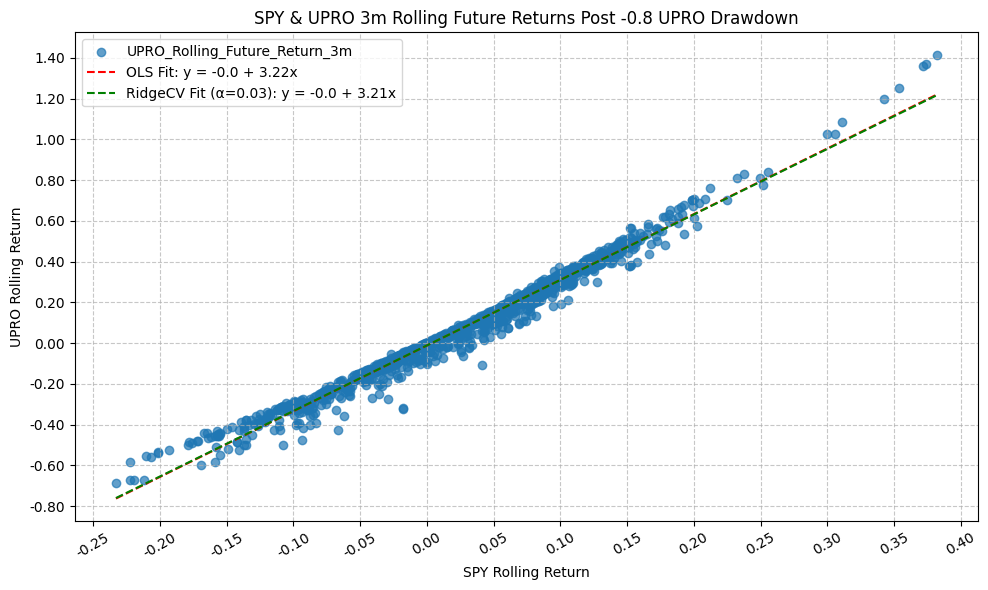
    


                                      OLS Regression Results                                 
    =========================================================================================
    Dep. Variable:     UPRO_Rolling_Future_Return_3m   R-squared:                       0.980
    Model:                                       OLS   Adj. R-squared:                  0.980
    Method:                            Least Squares   F-statistic:                 7.182e+04
    Date:                           Fri, 20 Mar 2026   Prob (F-statistic):               0.00
    Time:                                   10:51:38   Log-Likelihood:                 2749.5
    No. Observations:                           1479   AIC:                            -5495.
    Df Residuals:                               1477   BIC:                            -5484.
    Df Model:                                      1                                         
    Covariance Type:                       nonrobust                                         
    ================================================================================================
                                       coef    std err          t      P>|t|      [0.025      0.975]
    ------------------------------------------------------------------------------------------------
    const                           -0.0120      0.001    -11.210      0.000      -0.014      -0.010
    SPY_Rolling_Future_Return_3m     3.2239      0.012    267.983      0.000       3.200       3.248
    ==============================================================================
    Omnibus:                      396.774   Durbin-Watson:                   0.203
    Prob(Omnibus):                  0.000   Jarque-Bera (JB):             3170.413
    Skew:                          -1.021   Prob(JB):                         0.00
    Kurtosis:                       9.876   Cond. No.                         12.3
    ==============================================================================
    
    Notes:
    [1] Standard Errors assume that the covariance matrix of the errors is correctly specified.


    

    


    
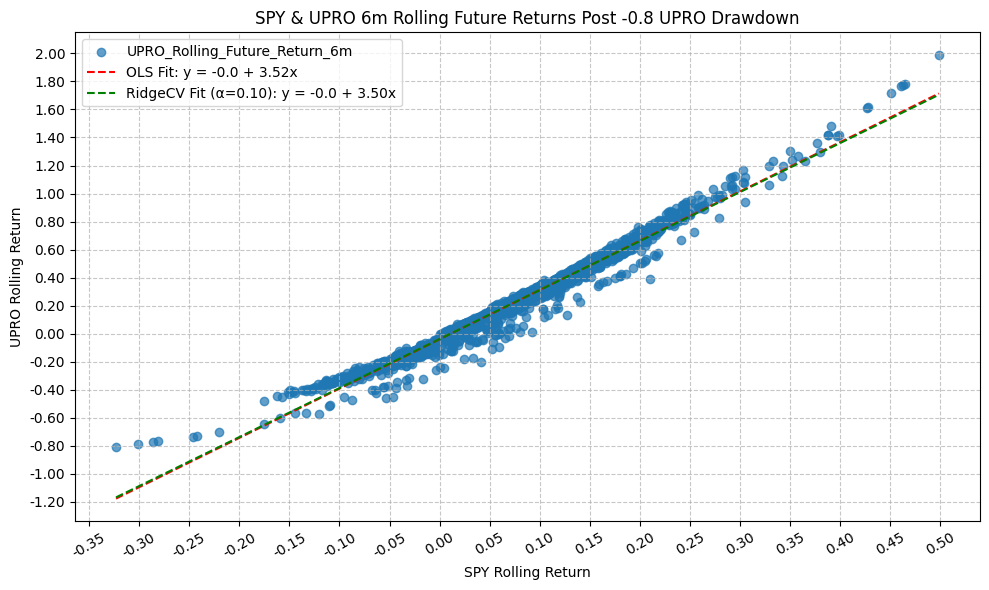
    


                                      OLS Regression Results                                 
    =========================================================================================
    Dep. Variable:     UPRO_Rolling_Future_Return_6m   R-squared:                       0.971
    Model:                                       OLS   Adj. R-squared:                  0.971
    Method:                            Least Squares   F-statistic:                 4.873e+04
    Date:                           Fri, 20 Mar 2026   Prob (F-statistic):               0.00
    Time:                                   10:51:39   Log-Likelihood:                 1996.2
    No. Observations:                           1479   AIC:                            -3988.
    Df Residuals:                               1477   BIC:                            -3978.
    Df Model:                                      1                                         
    Covariance Type:                       nonrobust                                         
    ================================================================================================
                                       coef    std err          t      P>|t|      [0.025      0.975]
    ------------------------------------------------------------------------------------------------
    const                           -0.0410      0.002    -19.752      0.000      -0.045      -0.037
    SPY_Rolling_Future_Return_6m     3.5211      0.016    220.756      0.000       3.490       3.552
    ==============================================================================
    Omnibus:                      303.530   Durbin-Watson:                   0.139
    Prob(Omnibus):                  0.000   Jarque-Bera (JB):             1799.512
    Skew:                          -0.818   Prob(JB):                         0.00
    Kurtosis:                       8.150   Cond. No.                         9.83
    ==============================================================================
    
    Notes:
    [1] Standard Errors assume that the covariance matrix of the errors is correctly specified.


    

    


    

    


                                      OLS Regression Results                                 
    =========================================================================================
    Dep. Variable:     UPRO_Rolling_Future_Return_1y   R-squared:                       0.945
    Model:                                       OLS   Adj. R-squared:                  0.945
    Method:                            Least Squares   F-statistic:                 2.531e+04
    Date:                           Fri, 20 Mar 2026   Prob (F-statistic):               0.00
    Time:                                   10:51:40   Log-Likelihood:                 1208.7
    No. Observations:                           1479   AIC:                            -2413.
    Df Residuals:                               1477   BIC:                            -2403.
    Df Model:                                      1                                         
    Covariance Type:                       nonrobust                                         
    ================================================================================================
                                       coef    std err          t      P>|t|      [0.025      0.975]
    ------------------------------------------------------------------------------------------------
    const                           -0.1638      0.005    -32.562      0.000      -0.174      -0.154
    SPY_Rolling_Future_Return_1y     4.1149      0.026    159.078      0.000       4.064       4.166
    ==============================================================================
    Omnibus:                      636.695   Durbin-Watson:                   0.055
    Prob(Omnibus):                  0.000   Jarque-Bera (JB):             4021.742
    Skew:                          -1.901   Prob(JB):                         0.00
    Kurtosis:                      10.128   Cond. No.                         9.55
    ==============================================================================
    
    Notes:
    [1] Standard Errors assume that the covariance matrix of the errors is correctly specified.


    

    


    

    


                                      OLS Regression Results                                 
    =========================================================================================
    Dep. Variable:     UPRO_Rolling_Future_Return_2y   R-squared:                       0.940
    Model:                                       OLS   Adj. R-squared:                  0.940
    Method:                            Least Squares   F-statistic:                 2.322e+04
    Date:                           Fri, 20 Mar 2026   Prob (F-statistic):               0.00
    Time:                                   10:51:41   Log-Likelihood:                 417.21
    No. Observations:                           1479   AIC:                            -830.4
    Df Residuals:                               1477   BIC:                            -819.8
    Df Model:                                      1                                         
    Covariance Type:                       nonrobust                                         
    ================================================================================================
                                       coef    std err          t      P>|t|      [0.025      0.975]
    ------------------------------------------------------------------------------------------------
    const                           -0.5307      0.012    -45.553      0.000      -0.554      -0.508
    SPY_Rolling_Future_Return_2y     5.2906      0.035    152.380      0.000       5.222       5.359
    ==============================================================================
    Omnibus:                      350.741   Durbin-Watson:                   0.045
    Prob(Omnibus):                  0.000   Jarque-Bera (JB):              917.243
    Skew:                          -1.244   Prob(JB):                    6.66e-200
    Kurtosis:                       5.949   Cond. No.                         8.01
    ==============================================================================
    
    Notes:
    [1] Standard Errors assume that the covariance matrix of the errors is correctly specified.


    
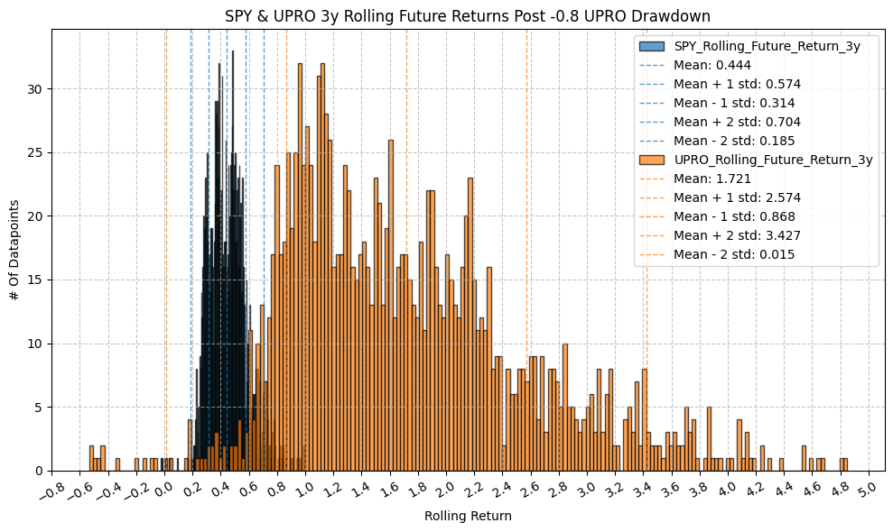
    


    
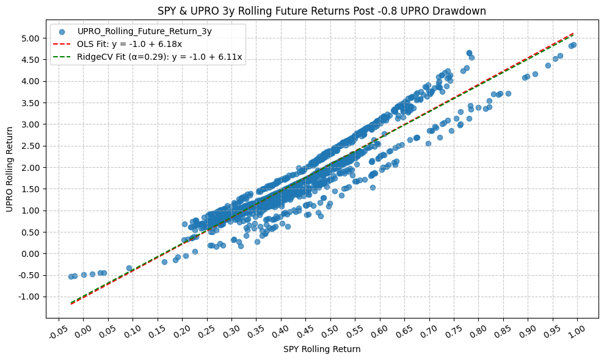
    


                                      OLS Regression Results                                 
    =========================================================================================
    Dep. Variable:     UPRO_Rolling_Future_Return_3y   R-squared:                       0.884
    Model:                                       OLS   Adj. R-squared:                  0.884
    Method:                            Least Squares   F-statistic:                 1.128e+04
    Date:                           Fri, 20 Mar 2026   Prob (F-statistic):               0.00
    Time:                                   10:51:42   Log-Likelihood:                -268.54
    No. Observations:                           1479   AIC:                             541.1
    Df Residuals:                               1477   BIC:                             551.7
    Df Model:                                      1                                         
    Covariance Type:                       nonrobust                                         
    ================================================================================================
                                       coef    std err          t      P>|t|      [0.025      0.975]
    ------------------------------------------------------------------------------------------------
    const                           -1.0243      0.027    -38.038      0.000      -1.077      -0.972
    SPY_Rolling_Future_Return_3y     6.1791      0.058    106.196      0.000       6.065       6.293
    ==============================================================================
    Omnibus:                       74.637   Durbin-Watson:                   0.032
    Prob(Omnibus):                  0.000   Jarque-Bera (JB):               91.013
    Skew:                          -0.512   Prob(JB):                     1.73e-20
    Kurtosis:                       3.655   Cond. No.                         9.25
    ==============================================================================
    
    Notes:
    [1] Standard Errors assume that the covariance matrix of the errors is correctly specified.


    

    


    
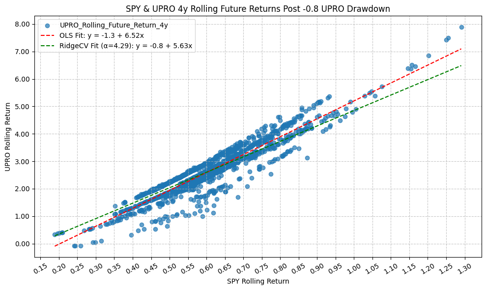
    


                                      OLS Regression Results                                 
    =========================================================================================
    Dep. Variable:     UPRO_Rolling_Future_Return_4y   R-squared:                       0.877
    Model:                                       OLS   Adj. R-squared:                  0.876
    Method:                            Least Squares   F-statistic:                 1.049e+04
    Date:                           Fri, 20 Mar 2026   Prob (F-statistic):               0.00
    Time:                                   10:51:43   Log-Likelihood:                -460.04
    No. Observations:                           1479   AIC:                             924.1
    Df Residuals:                               1477   BIC:                             934.7
    Df Model:                                      1                                         
    Covariance Type:                       nonrobust                                         
    ================================================================================================
                                       coef    std err          t      P>|t|      [0.025      0.975]
    ------------------------------------------------------------------------------------------------
    const                           -1.3231      0.040    -33.268      0.000      -1.401      -1.245
    SPY_Rolling_Future_Return_4y     6.5218      0.064    102.414      0.000       6.397       6.647
    ==============================================================================
    Omnibus:                      317.129   Durbin-Watson:                   0.032
    Prob(Omnibus):                  0.000   Jarque-Bera (JB):              747.191
    Skew:                          -1.169   Prob(JB):                    5.62e-163
    Kurtosis:                       5.580   Cond. No.                         10.2
    ==============================================================================
    
    Notes:
    [1] Standard Errors assume that the covariance matrix of the errors is correctly specified.


    
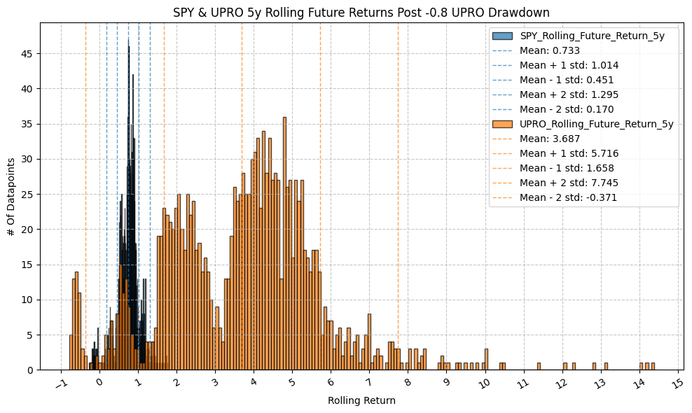
    


    

    


                                      OLS Regression Results                                 
    =========================================================================================
    Dep. Variable:     UPRO_Rolling_Future_Return_5y   R-squared:                       0.895
    Model:                                       OLS   Adj. R-squared:                  0.895
    Method:                            Least Squares   F-statistic:                 1.258e+04
    Date:                           Fri, 20 Mar 2026   Prob (F-statistic):               0.00
    Time:                                   10:51:44   Log-Likelihood:                -1478.3
    No. Observations:                           1479   AIC:                             2961.
    Df Residuals:                               1477   BIC:                             2971.
    Df Model:                                      1                                         
    Covariance Type:                       nonrobust                                         
    ================================================================================================
                                       coef    std err          t      P>|t|      [0.025      0.975]
    ------------------------------------------------------------------------------------------------
    const                           -1.3147      0.048    -27.526      0.000      -1.408      -1.221
    SPY_Rolling_Future_Return_5y     6.8270      0.061    112.164      0.000       6.708       6.946
    ==============================================================================
    Omnibus:                      180.963   Durbin-Watson:                   0.042
    Prob(Omnibus):                  0.000   Jarque-Bera (JB):              814.116
    Skew:                           0.496   Prob(JB):                    1.65e-177
    Kurtosis:                       6.497   Cond. No.                         5.57
    ==============================================================================
    
    Notes:
    [1] Standard Errors assume that the covariance matrix of the errors is correctly specified.


### Rolling Returns Following Drawdowns Deviation (SPY & UPRO)


```python
rolling_returns_positive_future_returns = pd.DataFrame(index=rolling_windows.keys(), data=rolling_windows.values())
rolling_returns_positive_future_returns.reset_index(inplace=True)
rolling_returns_positive_future_returns.rename(columns={"index":"Period", 0:"Days"}, inplace=True)

for drawdown in drawdown_levels:
    temp = rolling_returns_drawdown_stats.loc[rolling_returns_drawdown_stats["Drawdown"] == drawdown]
    temp = temp[["Period", "Positive_Future_Percentage"]]
    temp.rename(columns={"Positive_Future_Percentage" : f"Positive_Future_Percentage_Post_{drawdown}_Drawdown"}, inplace=True)
    rolling_returns_positive_future_returns = pd.merge(rolling_returns_positive_future_returns, temp, left_on="Period", right_on="Period", how="outer")
    rolling_returns_positive_future_returns.sort_values(by="Days", ascending=True, inplace=True)

rolling_returns_positive_future_returns.drop(columns={"Days"}, inplace=True)
rolling_returns_positive_future_returns.reset_index(drop=True, inplace=True)
display(rolling_returns_positive_future_returns)
```


<div>
<style scoped>
    .dataframe tbody tr th:only-of-type {
        vertical-align: middle;
    }

    .dataframe tbody tr th {
        vertical-align: top;
    }

    .dataframe thead th {
        text-align: right;
    }
</style>
<table border="1" class="dataframe">
  <thead>
    <tr style="text-align: right;">
      <th></th>
      <th>Period</th>
      <th>Positive_Future_Percentage_Post_-0.1_Drawdown</th>
      <th>Positive_Future_Percentage_Post_-0.2_Drawdown</th>
      <th>Positive_Future_Percentage_Post_-0.3_Drawdown</th>
      <th>Positive_Future_Percentage_Post_-0.4_Drawdown</th>
      <th>Positive_Future_Percentage_Post_-0.5_Drawdown</th>
      <th>Positive_Future_Percentage_Post_-0.6_Drawdown</th>
      <th>Positive_Future_Percentage_Post_-0.7_Drawdown</th>
      <th>Positive_Future_Percentage_Post_-0.8_Drawdown</th>
    </tr>
  </thead>
  <tbody>
    <tr>
      <th>0</th>
      <td>1d</td>
      <td>0.541</td>
      <td>0.540</td>
      <td>0.538</td>
      <td>0.537</td>
      <td>0.544</td>
      <td>0.547</td>
      <td>0.547</td>
      <td>0.547</td>
    </tr>
    <tr>
      <th>1</th>
      <td>1w</td>
      <td>0.572</td>
      <td>0.568</td>
      <td>0.561</td>
      <td>0.560</td>
      <td>0.565</td>
      <td>0.560</td>
      <td>0.566</td>
      <td>0.566</td>
    </tr>
    <tr>
      <th>2</th>
      <td>1m</td>
      <td>0.625</td>
      <td>0.615</td>
      <td>0.607</td>
      <td>0.605</td>
      <td>0.624</td>
      <td>0.625</td>
      <td>0.625</td>
      <td>0.646</td>
    </tr>
    <tr>
      <th>3</th>
      <td>3m</td>
      <td>0.670</td>
      <td>0.652</td>
      <td>0.632</td>
      <td>0.632</td>
      <td>0.647</td>
      <td>0.650</td>
      <td>0.656</td>
      <td>0.683</td>
    </tr>
    <tr>
      <th>4</th>
      <td>6m</td>
      <td>0.704</td>
      <td>0.691</td>
      <td>0.676</td>
      <td>0.671</td>
      <td>0.692</td>
      <td>0.698</td>
      <td>0.735</td>
      <td>0.753</td>
    </tr>
    <tr>
      <th>5</th>
      <td>1y</td>
      <td>0.733</td>
      <td>0.732</td>
      <td>0.726</td>
      <td>0.725</td>
      <td>0.740</td>
      <td>0.786</td>
      <td>0.836</td>
      <td>0.869</td>
    </tr>
    <tr>
      <th>6</th>
      <td>2y</td>
      <td>0.765</td>
      <td>0.779</td>
      <td>0.785</td>
      <td>0.782</td>
      <td>0.772</td>
      <td>0.809</td>
      <td>0.916</td>
      <td>0.991</td>
    </tr>
    <tr>
      <th>7</th>
      <td>3y</td>
      <td>0.721</td>
      <td>0.720</td>
      <td>0.722</td>
      <td>0.725</td>
      <td>0.717</td>
      <td>0.744</td>
      <td>0.870</td>
      <td>0.993</td>
    </tr>
    <tr>
      <th>8</th>
      <td>4y</td>
      <td>0.688</td>
      <td>0.687</td>
      <td>0.682</td>
      <td>0.685</td>
      <td>0.678</td>
      <td>0.708</td>
      <td>0.813</td>
      <td>0.998</td>
    </tr>
    <tr>
      <th>9</th>
      <td>5y</td>
      <td>0.659</td>
      <td>0.661</td>
      <td>0.656</td>
      <td>0.658</td>
      <td>0.649</td>
      <td>0.672</td>
      <td>0.740</td>
      <td>0.966</td>
    </tr>
  </tbody>
</table>
</div>


```python
plot_scatter(
    df=rolling_returns_positive_future_returns,
    x_plot_column="Period",
    y_plot_columns=[col for col in rolling_returns_positive_future_returns.columns if col != "Period"],
    title="UPRO Future Return by Time Period Post Drawdown",
    x_label="Rolling Return Time Period",
    x_format="String",
    x_format_decimal_places=0,
    x_tick_spacing=1,
    x_tick_rotation=0,
    y_label="Positive Future Return Percentage",
    y_format="Decimal",
    y_format_decimal_places=2,
    y_tick_spacing="Auto",
    y_tick_rotation=0,
    plot_OLS_regression_line=False,
    OLS_column=None,
    plot_Ridge_regression_line=False,
    Ridge_column=None,
    plot_RidgeCV_regression_line=False,
    RidgeCV_column=None,
    regression_constant=False,
    grid=True,
    legend=True,
    export_plot=False,
    plot_file_name=None,
)
```


    

    


This plot summarizes the future rolling returns well. Similar as to QQQ/TQQQ, for rolling returns up to ~3 months *following* all drawdown levels, we see the rolling returns of UPRO are positive ~65% of the time.

As we extend the time horizon, out to the 2y, 3y, 4y, and 5y mark, the percentage of positive rolling returns following an 80% drawdown increases significantly, and is greater than *95%*. This suggests that while the volatility decay effect is present for UPRO, it may not be as severe as that of TQQQ, which could be due to the less extreme return profile of SPY compared to QQQ.

As an investor, this suggests that the optimal time to buy UPRO would be following a drawdown of 50% or more, and holding for at least 2 years. One could dollar cost average into UPRO following a drawdown of 50% or more, and continue to add to the position with a consistent contribution schedule until all capital has been allocated.

## Future Investigation

There are a couple of ideas for future investigation that would be interesting to explore:

* Expand the analysis of SPY/UPRO to SPX/UPRO (using Bloomberg data for SPX), and extrapolate UPRO return data back to January of 1975.
* Implement and backtest a strategy that DCA's into UPRO on a consistent schdule (monthly, quarterly, etc.)

## Code


